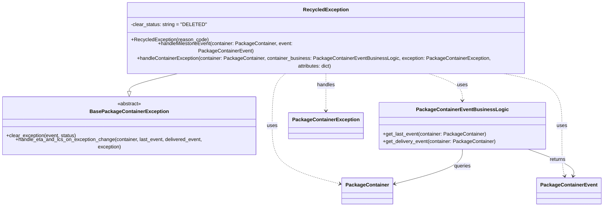

# Diagram: partview_service/partview_service/core/business/package_container_exception_status/package_container_exceptions/PackageContainerRecycledException.py

> Auto-generated by Obscura crawlers

## Mermaid

### SVG

<svg id="container" width="1914.3203125" xmlns="http://www.w3.org/2000/svg" class="classDiagram" height="614" viewBox="0 0 1914.3203125 614" role="graphics-document document" aria-roledescription="class"><g><defs><marker id="container_class-aggregationStart" class="marker aggregation class" refX="18" refY="7" markerWidth="190" markerHeight="240" orient="auto"><path d="M 18,7 L9,13 L1,7 L9,1 Z"></path></marker></defs><defs><marker id="container_class-aggregationEnd" class="marker aggregation class" refX="1" refY="7" markerWidth="20" markerHeight="28" orient="auto"><path d="M 18,7 L9,13 L1,7 L9,1 Z"></path></marker></defs><defs><marker id="container_class-extensionStart" class="marker extension class" refX="18" refY="7" markerWidth="190" markerHeight="240" orient="auto"><path d="M 1,7 L18,13 V 1 Z"></path></marker></defs><defs><marker id="container_class-extensionEnd" class="marker extension class" refX="1" refY="7" markerWidth="20" markerHeight="28" orient="auto"><path d="M 1,1 V 13 L18,7 Z"></path></marker></defs><defs><marker id="container_class-compositionStart" class="marker composition class" refX="18" refY="7" markerWidth="190" markerHeight="240" orient="auto"><path d="M 18,7 L9,13 L1,7 L9,1 Z"></path></marker></defs><defs><marker id="container_class-compositionEnd" class="marker composition class" refX="1" refY="7" markerWidth="20" markerHeight="28" orient="auto"><path d="M 18,7 L9,13 L1,7 L9,1 Z"></path></marker></defs><defs><marker id="container_class-dependencyStart" class="marker dependency class" refX="6" refY="7" markerWidth="190" markerHeight="240" orient="auto"><path d="M 5,7 L9,13 L1,7 L9,1 Z"></path></marker></defs><defs><marker id="container_class-dependencyEnd" class="marker dependency class" refX="13" refY="7" markerWidth="20" markerHeight="28" orient="auto"><path d="M 18,7 L9,13 L14,7 L9,1 Z"></path></marker></defs><defs><marker id="container_class-lollipopStart" class="marker lollipop class" refX="13" refY="7" markerWidth="190" markerHeight="240" orient="auto"><circle stroke="black" fill="transparent" cx="7" cy="7" r="6"></circle></marker></defs><defs><marker id="container_class-lollipopEnd" class="marker lollipop class" refX="1" refY="7" markerWidth="190" markerHeight="240" orient="auto"><circle stroke="black" fill="transparent" cx="7" cy="7" r="6"></circle></marker></defs><g class="root"><g class="clusters"></g><g class="edgePaths"><path d="M595.283,200L566.139,206.167C536.996,212.333,478.709,224.667,449.565,234.125C420.422,243.583,420.422,250.167,420.422,253.458L420.422,256.75" id="id_RecycledException_BasePackageContainerException_1" class="edge-thickness-normal edge-pattern-solid relation" style=";;;" data-edge="true" data-et="edge" data-id="id_RecycledException_BasePackageContainerException_1" data-points="W3sieCI6NTk1LjI4Mjk1MzQ3NzQ0MzYsInkiOjIwMH0seyJ4Ijo0MjAuNDIxODc1LCJ5IjoyMzd9LHsieCI6NDIwLjQyMTg3NSwieSI6Mjc0fV0=" marker-end="url(#container_class-extensionEnd)"></path><path d="M930.138,200L922.505,206.167C914.871,212.333,899.603,224.667,891.97,251.5C884.336,278.333,884.336,319.667,884.336,361C884.336,402.333,884.336,443.667,919.523,473.776C954.711,503.886,1025.086,522.773,1060.273,532.216L1095.461,541.659" id="id_RecycledException_PackageContainer_2" class="edge-thickness-normal edge-pattern-dashed relation" style=";;;" data-edge="true" data-et="edge" data-id="id_RecycledException_PackageContainer_2" data-points="W3sieCI6OTMwLjEzODIxNjYzNTMzODQsInkiOjIwMH0seyJ4Ijo4ODQuMzM1OTM3NSwieSI6MjM3fSx7IngiOjg4NC4zMzU5Mzc1LCJ5IjozNjF9LHsieCI6ODg0LjMzNTkzNzUsInkiOjQ4NX0seyJ4IjoxMTAxLjI1NTg1OTM3NSwieSI6NTQzLjIxNDE0MDIyMTIwNjN9XQ==" marker-end="url(#container_class-dependencyEnd)"></path><path d="M1580.625,200L1614.776,206.167C1648.927,212.333,1717.229,224.667,1751.38,251.5C1785.531,278.333,1785.531,319.667,1785.531,361C1785.531,402.333,1785.531,443.667,1787.056,469.54C1788.581,495.414,1791.63,505.828,1793.155,511.035L1794.679,516.242" id="id_RecycledException_PackageContainerEvent_3" class="edge-thickness-normal edge-pattern-dashed relation" style=";;;" data-edge="true" data-et="edge" data-id="id_RecycledException_PackageContainerEvent_3" data-points="W3sieCI6MTU4MC42MjUwNTg3NDA2MDE2LCJ5IjoyMDB9LHsieCI6MTc4NS41MzEyNSwieSI6MjM3fSx7IngiOjE3ODUuNTMxMjUsInkiOjM2MX0seyJ4IjoxNzg1LjUzMTI1LCJ5Ijo0ODV9LHsieCI6MTc5Ni4zNjU2MDUyMjE1MTksInkiOjUyMn1d" marker-end="url(#container_class-dependencyEnd)"></path><path d="M1355.098,200L1374.762,206.167C1394.426,212.333,1433.754,224.667,1453.418,238C1473.082,251.333,1473.082,265.667,1473.082,272.833L1473.082,280" id="id_RecycledException_PackageContainerEventBusinessLogic_4" class="edge-thickness-normal edge-pattern-dashed relation" style=";;;" data-edge="true" data-et="edge" data-id="id_RecycledException_PackageContainerEventBusinessLogic_4" data-points="W3sieCI6MTM1NS4wOTc4MDMxMDE1MDM4LCJ5IjoyMDB9LHsieCI6MTQ3My4wODIwMzEyNSwieSI6MjM3fSx7IngiOjE0NzMuMDgyMDMxMjUsInkiOjI4Nn1d" marker-end="url(#container_class-dependencyEnd)"></path><path d="M1048.977,200L1048.977,206.167C1048.977,212.333,1048.977,224.667,1048.977,243.5C1048.977,262.333,1048.977,287.667,1048.977,300.333L1048.977,313" id="id_RecycledException_PackageContainerException_5" class="edge-thickness-normal edge-pattern-dashed relation" style=";;;" data-edge="true" data-et="edge" data-id="id_RecycledException_PackageContainerException_5" data-points="W3sieCI6MTA0OC45NzY1NjI1LCJ5IjoyMDB9LHsieCI6MTA0OC45NzY1NjI1LCJ5IjoyMzd9LHsieCI6MTA0OC45NzY1NjI1LCJ5IjozMTl9XQ==" marker-end="url(#container_class-dependencyEnd)"></path><path d="M1690.047,436L1713.672,444.167C1737.297,452.333,1784.547,468.667,1806.647,482.04C1828.747,495.414,1825.698,505.828,1824.173,511.035L1822.649,516.242" id="id_PackageContainerEventBusinessLogic_PackageContainerEvent_6" class="edge-thickness-normal edge-pattern-solid relation" style=";;;" data-edge="true" data-et="edge" data-id="id_PackageContainerEventBusinessLogic_PackageContainerEvent_6" data-points="W3sieCI6MTY5MC4wNDY2NTQ0ODU4ODcsInkiOjQzNn0seyJ4IjoxODMxLjc5Njg3NSwieSI6NDg1fSx7IngiOjE4MjAuOTYyNTE5Nzc4NDgxLCJ5Ijo1MjJ9XQ==" marker-end="url(#container_class-dependencyEnd)"></path><path d="M1473.082,436L1473.082,444.167C1473.082,452.333,1473.082,468.667,1437.895,486.276C1402.707,503.886,1332.332,522.773,1297.145,532.216L1261.957,541.659" id="id_PackageContainerEventBusinessLogic_PackageContainer_7" class="edge-thickness-normal edge-pattern-solid relation" style=";;;" data-edge="true" data-et="edge" data-id="id_PackageContainerEventBusinessLogic_PackageContainer_7" data-points="W3sieCI6MTQ3My4wODIwMzEyNSwieSI6NDM2fSx7IngiOjE0NzMuMDgyMDMxMjUsInkiOjQ4NX0seyJ4IjoxMjU2LjE2MjEwOTM3NSwieSI6NTQzLjIxNDE0MDIyMTIwNjN9XQ==" marker-end="url(#container_class-dependencyEnd)"></path></g><g class="edgeLabels"><g class="edgeLabel"><g class="label" data-id="id_RecycledException_BasePackageContainerException_1" transform="translate(0, 0)"><foreignObject width="0" height="0">

</foreignObject></g></g><g class="edgeLabel" transform="translate(884.3359375, 361)"><g class="label" data-id="id_RecycledException_PackageContainer_2" transform="translate(-16.4921875, -12)"><foreignObject width="32.984375" height="24">

uses

</foreignObject></g></g><g class="edgeLabel" transform="translate(1785.53125, 361)"><g class="label" data-id="id_RecycledException_PackageContainerEvent_3" transform="translate(-16.4921875, -12)"><foreignObject width="32.984375" height="24">

uses

</foreignObject></g></g><g class="edgeLabel" transform="translate(1473.08203125, 237)"><g class="label" data-id="id_RecycledException_PackageContainerEventBusinessLogic_4" transform="translate(-16.4921875, -12)"><foreignObject width="32.984375" height="24">

uses

</foreignObject></g></g><g class="edgeLabel" transform="translate(1048.9765625, 237)"><g class="label" data-id="id_RecycledException_PackageContainerException_5" transform="translate(-28.9140625, -12)"><foreignObject width="57.828125" height="24">

handles

</foreignObject></g></g><g class="edgeLabel" transform="translate(1779.14077, 466.79792)"><g class="label" data-id="id_PackageContainerEventBusinessLogic_PackageContainerEvent_6" transform="translate(-26.265625, -12)"><foreignObject width="52.53125" height="24">

returns

</foreignObject></g></g><g class="edgeLabel" transform="translate(1473.08203125, 485)"><g class="label" data-id="id_PackageContainerEventBusinessLogic_PackageContainer_7" transform="translate(-27.2421875, -12)"><foreignObject width="54.484375" height="24">

queries

</foreignObject></g></g></g><g class="nodes"><g class="node default" id="classId-BasePackageContainerException-0" transform="translate(420.421875, 361)"><g class="basic label-container"><path d="M-412.421875 -87 L412.421875 -87 L412.421875 87 L-412.421875 87" stroke="none" stroke-width="0" fill="#ECECFF" style=""></path><path d="M-412.421875 -87 C-87.53614610338451 -87, 237.34958279323098 -87, 412.421875 -87 M-412.421875 -87 C-88.40409768442396 -87, 235.61367963115208 -87, 412.421875 -87 M412.421875 -87 C412.421875 -30.965081246931227, 412.421875 25.069837506137546, 412.421875 87 M412.421875 -87 C412.421875 -48.497757774895035, 412.421875 -9.99551554979007, 412.421875 87 M412.421875 87 C224.89721469856798 87, 37.37255439713596 87, -412.421875 87 M412.421875 87 C203.58155917622776 87, -5.258756647544487 87, -412.421875 87 M-412.421875 87 C-412.421875 29.7848433882386, -412.421875 -27.430313223522802, -412.421875 -87 M-412.421875 87 C-412.421875 49.979029909842716, -412.421875 12.958059819685431, -412.421875 -87" stroke="#9370DB" stroke-width="1.3" fill="none" stroke-dasharray="0 0" style=""></path></g><g class="annotation-group text" transform="translate(-38.609375, -63)"><g class="label" style="" transform="translate(0,-12)"><foreignObject width="77.21875" height="24">

«abstract»

</foreignObject></g></g><g class="label-group text" transform="translate(-118.671875, -39)"><g class="label" style="font-weight: bolder" transform="translate(0,-12)"><foreignObject width="237.34375" height="24">

BasePackageContainerException

</foreignObject></g></g><g class="members-group text" transform="translate(-400.421875, 9)"></g><g class="methods-group text" transform="translate(-400.421875, 39)"><g class="label" style="" transform="translate(0,-12)"><foreignObject width="224.40625" height="24">

+clear_exception(event, status)

</foreignObject></g><g class="label" style="" transform="translate(0,12)"><foreignObject width="682.171875" height="24">

+handle_eta_and_lcs_on_exception_change(container, last_event, delivered_event, exception)

</foreignObject></g></g><g class="divider" style=""><path d="M-412.421875 -15 C-215.56430481920123 -15, -18.70673463840245 -15, 412.421875 -15 M-412.421875 -15 C-147.5181572675006 -15, 117.38556046499878 -15, 412.421875 -15" stroke="#9370DB" stroke-width="1.3" fill="none" stroke-dasharray="0 0" style=""></path></g><g class="divider" style=""><path d="M-412.421875 9 C-103.82333769473718 9, 204.77519961052565 9, 412.421875 9 M-412.421875 9 C-226.54023552033289 9, -40.65859604066577 9, 412.421875 9" stroke="#9370DB" stroke-width="1.3" fill="none" stroke-dasharray="0 0" style=""></path></g></g><g class="node default" id="classId-RecycledException-1" transform="translate(1048.9765625, 104)"><g class="basic label-container"><path d="M-667.14453125 -96 L667.14453125 -96 L667.14453125 96 L-667.14453125 96" stroke="none" stroke-width="0" fill="#ECECFF" style=""></path><path d="M-667.14453125 -96 C-249.50997891612866 -96, 168.12457341774268 -96, 667.14453125 -96 M-667.14453125 -96 C-177.65585718010493 -96, 311.83281688979014 -96, 667.14453125 -96 M667.14453125 -96 C667.14453125 -25.160761690422135, 667.14453125 45.67847661915573, 667.14453125 96 M667.14453125 -96 C667.14453125 -24.27313209903521, 667.14453125 47.45373580192958, 667.14453125 96 M667.14453125 96 C161.70069804831195 96, -343.7431351533761 96, -667.14453125 96 M667.14453125 96 C261.61453963246015 96, -143.9154519850797 96, -667.14453125 96 M-667.14453125 96 C-667.14453125 29.66475332506039, -667.14453125 -36.67049334987922, -667.14453125 -96 M-667.14453125 96 C-667.14453125 55.01035875035913, -667.14453125 14.020717500718263, -667.14453125 -96" stroke="#9370DB" stroke-width="1.3" fill="none" stroke-dasharray="0 0" style=""></path></g><g class="annotation-group text" transform="translate(0, -72)"></g><g class="label-group text" transform="translate(-68.2265625, -72)"><g class="label" style="font-weight: bolder" transform="translate(0,-12)"><foreignObject width="136.453125" height="24">

RecycledException

</foreignObject></g></g><g class="members-group text" transform="translate(-655.14453125, -24)"><g class="label" style="" transform="translate(0,-12)"><foreignObject width="235.078125" height="24">

-clear_status: string = "DELETED"

</foreignObject></g></g><g class="methods-group text" transform="translate(-655.14453125, 24)"><g class="label" style="" transform="translate(0,-12)"><foreignObject width="245.203125" height="24">

+RecycledException(reason_code)

</foreignObject></g><g class="label" style="" transform="translate(0,12)"><foreignObject width="609.125" height="24">

+handleMilestoneEvent(container: PackageContainer, event: PackageContainerEvent)

</foreignObject></g><g class="label" style="" transform="translate(0,36)"><foreignObject width="1242.0625" height="24">

+handleContainerException(container: PackageContainer, container_business: PackageContainerEventBusinessLogic, exception: PackageContainerException, attributes: dict)

</foreignObject></g></g><g class="divider" style=""><path d="M-667.14453125 -48 C-254.45197633862585 -48, 158.2405785727483 -48, 667.14453125 -48 M-667.14453125 -48 C-188.4994628466024 -48, 290.1456055567952 -48, 667.14453125 -48" stroke="#9370DB" stroke-width="1.3" fill="none" stroke-dasharray="0 0" style=""></path></g><g class="divider" style=""><path d="M-667.14453125 0 C-243.5202924312461 0, 180.1039463875078 0, 667.14453125 0 M-667.14453125 0 C-289.8546713047459 0, 87.43518864050816 0, 667.14453125 0" stroke="#9370DB" stroke-width="1.3" fill="none" stroke-dasharray="0 0" style=""></path></g></g><g class="node default" id="classId-PackageContainer-2" transform="translate(1178.708984375, 564)"><g class="basic label-container"><path d="M-77.453125 -42 L77.453125 -42 L77.453125 42 L-77.453125 42" stroke="none" stroke-width="0" fill="#ECECFF" style=""></path><path d="M-77.453125 -42 C-24.066042692981156 -42, 29.321039614037687 -42, 77.453125 -42 M-77.453125 -42 C-43.68652003875582 -42, -9.919915077511646 -42, 77.453125 -42 M77.453125 -42 C77.453125 -21.77979741339116, 77.453125 -1.5595948267823232, 77.453125 42 M77.453125 -42 C77.453125 -19.314638140275953, 77.453125 3.370723719448094, 77.453125 42 M77.453125 42 C40.103814357059605 42, 2.7545037141192097 42, -77.453125 42 M77.453125 42 C43.870819174807096 42, 10.288513349614192 42, -77.453125 42 M-77.453125 42 C-77.453125 14.694292833702107, -77.453125 -12.611414332595785, -77.453125 -42 M-77.453125 42 C-77.453125 18.544928026486215, -77.453125 -4.910143947027571, -77.453125 -42" stroke="#9370DB" stroke-width="1.3" fill="none" stroke-dasharray="0 0" style=""></path></g><g class="annotation-group text" transform="translate(0, -18)"></g><g class="label-group text" transform="translate(-65.453125, -18)"><g class="label" style="font-weight: bolder" transform="translate(0,-12)"><foreignObject width="130.90625" height="24">

PackageContainer

</foreignObject></g></g><g class="members-group text" transform="translate(-65.453125, 30)"></g><g class="methods-group text" transform="translate(-65.453125, 60)"></g><g class="divider" style=""><path d="M-77.453125 6 C-38.17534478903842 6, 1.1024354219231611 6, 77.453125 6 M-77.453125 6 C-28.791153937990806 6, 19.870817124018387 6, 77.453125 6" stroke="#9370DB" stroke-width="1.3" fill="none" stroke-dasharray="0 0" style=""></path></g><g class="divider" style=""><path d="M-77.453125 24 C-22.708917796156463 24, 32.035289407687074 24, 77.453125 24 M-77.453125 24 C-28.123266866196893 24, 21.206591267606214 24, 77.453125 24" stroke="#9370DB" stroke-width="1.3" fill="none" stroke-dasharray="0 0" style=""></path></g></g><g class="node default" id="classId-PackageContainerEvent-3" transform="translate(1808.6640625, 564)"><g class="basic label-container"><path d="M-97.65625 -42 L97.65625 -42 L97.65625 42 L-97.65625 42" stroke="none" stroke-width="0" fill="#ECECFF" style=""></path><path d="M-97.65625 -42 C-36.7154834668663 -42, 24.225283066267394 -42, 97.65625 -42 M-97.65625 -42 C-49.82479985986779 -42, -1.9933497197355763 -42, 97.65625 -42 M97.65625 -42 C97.65625 -16.929054817505193, 97.65625 8.141890364989614, 97.65625 42 M97.65625 -42 C97.65625 -18.421863464241707, 97.65625 5.156273071516587, 97.65625 42 M97.65625 42 C23.972277094790897 42, -49.711695810418206 42, -97.65625 42 M97.65625 42 C22.94089742536039 42, -51.77445514927922 42, -97.65625 42 M-97.65625 42 C-97.65625 18.148672974538755, -97.65625 -5.70265405092249, -97.65625 -42 M-97.65625 42 C-97.65625 21.303128578499738, -97.65625 0.6062571569994759, -97.65625 -42" stroke="#9370DB" stroke-width="1.3" fill="none" stroke-dasharray="0 0" style=""></path></g><g class="annotation-group text" transform="translate(0, -18)"></g><g class="label-group text" transform="translate(-85.65625, -18)"><g class="label" style="font-weight: bolder" transform="translate(0,-12)"><foreignObject width="171.3125" height="24">

PackageContainerEvent

</foreignObject></g></g><g class="members-group text" transform="translate(-85.65625, 30)"></g><g class="methods-group text" transform="translate(-85.65625, 60)"></g><g class="divider" style=""><path d="M-97.65625 6 C-19.914802465096287 6, 57.82664506980743 6, 97.65625 6 M-97.65625 6 C-29.701094051702142 6, 38.254061896595715 6, 97.65625 6" stroke="#9370DB" stroke-width="1.3" fill="none" stroke-dasharray="0 0" style=""></path></g><g class="divider" style=""><path d="M-97.65625 24 C-51.42861378526307 24, -5.200977570526135 24, 97.65625 24 M-97.65625 24 C-24.290223915943002 24, 49.075802168113995 24, 97.65625 24" stroke="#9370DB" stroke-width="1.3" fill="none" stroke-dasharray="0 0" style=""></path></g></g><g class="node default" id="classId-PackageContainerEventBusinessLogic-4" transform="translate(1473.08203125, 361)"><g class="basic label-container"><path d="M-260.95703125 -75 L260.95703125 -75 L260.95703125 75 L-260.95703125 75" stroke="none" stroke-width="0" fill="#ECECFF" style=""></path><path d="M-260.95703125 -75 C-111.32252500131773 -75, 38.31198124736454 -75, 260.95703125 -75 M-260.95703125 -75 C-60.1518642232343 -75, 140.6533028035314 -75, 260.95703125 -75 M260.95703125 -75 C260.95703125 -29.176259745337354, 260.95703125 16.64748050932529, 260.95703125 75 M260.95703125 -75 C260.95703125 -43.70920097532252, 260.95703125 -12.418401950645041, 260.95703125 75 M260.95703125 75 C92.34987075042986 75, -76.25728974914028 75, -260.95703125 75 M260.95703125 75 C122.48125976334453 75, -15.99451172331095 75, -260.95703125 75 M-260.95703125 75 C-260.95703125 21.359398452707367, -260.95703125 -32.281203094585265, -260.95703125 -75 M-260.95703125 75 C-260.95703125 43.025216418090736, -260.95703125 11.050432836181471, -260.95703125 -75" stroke="#9370DB" stroke-width="1.3" fill="none" stroke-dasharray="0 0" style=""></path></g><g class="annotation-group text" transform="translate(0, -51)"></g><g class="label-group text" transform="translate(-137.0703125, -51)"><g class="label" style="font-weight: bolder" transform="translate(0,-12)"><foreignObject width="274.140625" height="24">

PackageContainerEventBusinessLogic

</foreignObject></g></g><g class="members-group text" transform="translate(-248.95703125, -3)"></g><g class="methods-group text" transform="translate(-248.95703125, 27)"><g class="label" style="" transform="translate(0,-12)"><foreignObject width="329.8125" height="24">

+get_last_event(container: PackageContainer)

</foreignObject></g><g class="label" style="" transform="translate(0,12)"><foreignObject width="360.84375" height="24">

+get_delivery_event(container: PackageContainer)

</foreignObject></g></g><g class="divider" style=""><path d="M-260.95703125 -27 C-59.04835775504142 -27, 142.86031573991716 -27, 260.95703125 -27 M-260.95703125 -27 C-140.0355902105452 -27, -19.11414917109036 -27, 260.95703125 -27" stroke="#9370DB" stroke-width="1.3" fill="none" stroke-dasharray="0 0" style=""></path></g><g class="divider" style=""><path d="M-260.95703125 -3 C-89.33208997038514 -3, 82.29285130922972 -3, 260.95703125 -3 M-260.95703125 -3 C-133.7947958895382 -3, -6.632560529076358 -3, 260.95703125 -3" stroke="#9370DB" stroke-width="1.3" fill="none" stroke-dasharray="0 0" style=""></path></g></g><g class="node default" id="classId-PackageContainerException-5" transform="translate(1048.9765625, 361)"><g class="basic label-container"><path d="M-113.1484375 -42 L113.1484375 -42 L113.1484375 42 L-113.1484375 42" stroke="none" stroke-width="0" fill="#ECECFF" style=""></path><path d="M-113.1484375 -42 C-54.94558143278393 -42, 3.257274634432136 -42, 113.1484375 -42 M-113.1484375 -42 C-60.202949443479845 -42, -7.25746138695969 -42, 113.1484375 -42 M113.1484375 -42 C113.1484375 -17.68840360235419, 113.1484375 6.623192795291622, 113.1484375 42 M113.1484375 -42 C113.1484375 -12.420023317691257, 113.1484375 17.159953364617486, 113.1484375 42 M113.1484375 42 C58.24783765838089 42, 3.3472378167617762 42, -113.1484375 42 M113.1484375 42 C60.97202615054471 42, 8.795614801089414 42, -113.1484375 42 M-113.1484375 42 C-113.1484375 14.447629650638394, -113.1484375 -13.104740698723212, -113.1484375 -42 M-113.1484375 42 C-113.1484375 9.591620519302566, -113.1484375 -22.816758961394868, -113.1484375 -42" stroke="#9370DB" stroke-width="1.3" fill="none" stroke-dasharray="0 0" style=""></path></g><g class="annotation-group text" transform="translate(0, -18)"></g><g class="label-group text" transform="translate(-101.1484375, -18)"><g class="label" style="font-weight: bolder" transform="translate(0,-12)"><foreignObject width="202.296875" height="24">

PackageContainerException

</foreignObject></g></g><g class="members-group text" transform="translate(-101.1484375, 30)"></g><g class="methods-group text" transform="translate(-101.1484375, 60)"></g><g class="divider" style=""><path d="M-113.1484375 6 C-53.76463640108007 6, 5.619164697839864 6, 113.1484375 6 M-113.1484375 6 C-57.6138987338272 6, -2.0793599676543977 6, 113.1484375 6" stroke="#9370DB" stroke-width="1.3" fill="none" stroke-dasharray="0 0" style=""></path></g><g class="divider" style=""><path d="M-113.1484375 24 C-58.12283750297384 24, -3.0972375059476747 24, 113.1484375 24 M-113.1484375 24 C-26.082030597987497 24, 60.984376304025005 24, 113.1484375 24" stroke="#9370DB" stroke-width="1.3" fill="none" stroke-dasharray="0 0" style=""></path></g></g></g></g></g></svg>
