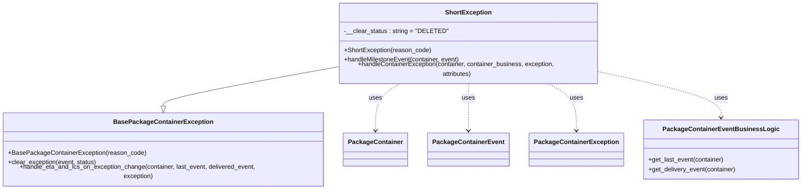

# Diagram: partview_service/partview_service/core/business/package_container_exception_status/package_container_exceptions/PackageContainerShortException.py

> Auto-generated by Obscura crawlers

## Mermaid

### SVG

<svg id="container" width="2002.4765625" xmlns="http://www.w3.org/2000/svg" class="classDiagram" height="456" viewBox="0 0 2002.4765625 456" role="graphics-document document" aria-roledescription="class"><g><defs><marker id="container_class-aggregationStart" class="marker aggregation class" refX="18" refY="7" markerWidth="190" markerHeight="240" orient="auto"><path d="M 18,7 L9,13 L1,7 L9,1 Z"></path></marker></defs><defs><marker id="container_class-aggregationEnd" class="marker aggregation class" refX="1" refY="7" markerWidth="20" markerHeight="28" orient="auto"><path d="M 18,7 L9,13 L1,7 L9,1 Z"></path></marker></defs><defs><marker id="container_class-extensionStart" class="marker extension class" refX="18" refY="7" markerWidth="190" markerHeight="240" orient="auto"><path d="M 1,7 L18,13 V 1 Z"></path></marker></defs><defs><marker id="container_class-extensionEnd" class="marker extension class" refX="1" refY="7" markerWidth="20" markerHeight="28" orient="auto"><path d="M 1,1 V 13 L18,7 Z"></path></marker></defs><defs><marker id="container_class-compositionStart" class="marker composition class" refX="18" refY="7" markerWidth="190" markerHeight="240" orient="auto"><path d="M 18,7 L9,13 L1,7 L9,1 Z"></path></marker></defs><defs><marker id="container_class-compositionEnd" class="marker composition class" refX="1" refY="7" markerWidth="20" markerHeight="28" orient="auto"><path d="M 18,7 L9,13 L1,7 L9,1 Z"></path></marker></defs><defs><marker id="container_class-dependencyStart" class="marker dependency class" refX="6" refY="7" markerWidth="190" markerHeight="240" orient="auto"><path d="M 5,7 L9,13 L1,7 L9,1 Z"></path></marker></defs><defs><marker id="container_class-dependencyEnd" class="marker dependency class" refX="13" refY="7" markerWidth="20" markerHeight="28" orient="auto"><path d="M 18,7 L9,13 L14,7 L9,1 Z"></path></marker></defs><defs><marker id="container_class-lollipopStart" class="marker lollipop class" refX="13" refY="7" markerWidth="190" markerHeight="240" orient="auto"><circle stroke="black" fill="transparent" cx="7" cy="7" r="6"></circle></marker></defs><defs><marker id="container_class-lollipopEnd" class="marker lollipop class" refX="1" refY="7" markerWidth="190" markerHeight="240" orient="auto"><circle stroke="black" fill="transparent" cx="7" cy="7" r="6"></circle></marker></defs><g class="root"><g class="clusters"></g><g class="edgePaths"><path d="M853.336,161.734L781.184,174.278C709.031,186.822,564.727,211.911,492.574,227.747C420.422,243.583,420.422,250.167,420.422,253.458L420.422,256.75" id="id_ShortException_BasePackageContainerException_1" class="edge-thickness-normal edge-pattern-solid relation" style=";;;" data-edge="true" data-et="edge" data-id="id_ShortException_BasePackageContainerException_1" data-points="W3sieCI6ODUzLjMzNTkzNzUsInkiOjE2MS43MzM2NjQ5MDMyODY0fSx7IngiOjQyMC40MjE4NzUsInkiOjIzN30seyJ4Ijo0MjAuNDIxODc1LCJ5IjoyNzR9XQ==" marker-end="url(#container_class-extensionEnd)"></path><path d="M1022.921,200L1012.484,206.167C1002.046,212.333,981.172,224.667,970.734,243.5C960.297,262.333,960.297,287.667,960.297,300.333L960.297,313" id="id_ShortException_PackageContainer_2" class="edge-thickness-normal edge-pattern-dashed relation" style=";;;" data-edge="true" data-et="edge" data-id="id_ShortException_PackageContainer_2" data-points="W3sieCI6MTAyMi45MjEyODc1OTM5ODUsInkiOjIwMH0seyJ4Ijo5NjAuMjk2ODc1LCJ5IjoyMzd9LHsieCI6OTYwLjI5Njg3NSwieSI6MzE5fV0=" marker-end="url(#container_class-dependencyEnd)"></path><path d="M1185.406,200L1185.406,206.167C1185.406,212.333,1185.406,224.667,1185.406,243.5C1185.406,262.333,1185.406,287.667,1185.406,300.333L1185.406,313" id="id_ShortException_PackageContainerEvent_3" class="edge-thickness-normal edge-pattern-dashed relation" style=";;;" data-edge="true" data-et="edge" data-id="id_ShortException_PackageContainerEvent_3" data-points="W3sieCI6MTE4NS40MDYyNSwieSI6MjAwfSx7IngiOjExODUuNDA2MjUsInkiOjIzN30seyJ4IjoxMTg1LjQwNjI1LCJ5IjozMTl9XQ==" marker-end="url(#container_class-dependencyEnd)"></path><path d="M1373.656,200L1385.749,206.167C1397.841,212.333,1422.026,224.667,1434.118,243.5C1446.211,262.333,1446.211,287.667,1446.211,300.333L1446.211,313" id="id_ShortException_PackageContainerException_4" class="edge-thickness-normal edge-pattern-dashed relation" style=";;;" data-edge="true" data-et="edge" data-id="id_ShortException_PackageContainerException_4" data-points="W3sieCI6MTM3My42NTYyNSwieSI6MjAwfSx7IngiOjE0NDYuMjEwOTM3NSwieSI6MjM3fSx7IngiOjE0NDYuMjEwOTM3NSwieSI6MzE5fV0=" marker-end="url(#container_class-dependencyEnd)"></path><path d="M1517.477,175.637L1564.883,185.865C1612.29,196.092,1707.104,216.546,1754.511,233.94C1801.918,251.333,1801.918,265.667,1801.918,272.833L1801.918,280" id="id_ShortException_PackageContainerEventBusinessLogic_5" class="edge-thickness-normal edge-pattern-dashed relation" style=";;;" data-edge="true" data-et="edge" data-id="id_ShortException_PackageContainerEventBusinessLogic_5" data-points="W3sieCI6MTUxNy40NzY1NjI1LCJ5IjoxNzUuNjM3NDg5MTQ5NTExOH0seyJ4IjoxODAxLjkxNzk2ODc1LCJ5IjoyMzd9LHsieCI6MTgwMS45MTc5Njg3NSwieSI6Mjg2fV0=" marker-end="url(#container_class-dependencyEnd)"></path></g><g class="edgeLabels"><g class="edgeLabel"><g class="label" data-id="id_ShortException_BasePackageContainerException_1" transform="translate(0, 0)"><foreignObject width="0" height="0">

</foreignObject></g></g><g class="edgeLabel" transform="translate(960.296875, 237)"><g class="label" data-id="id_ShortException_PackageContainer_2" transform="translate(-16.4921875, -12)"><foreignObject width="32.984375" height="24">

uses

</foreignObject></g></g><g class="edgeLabel" transform="translate(1185.40625, 237)"><g class="label" data-id="id_ShortException_PackageContainerEvent_3" transform="translate(-16.4921875, -12)"><foreignObject width="32.984375" height="24">

uses

</foreignObject></g></g><g class="edgeLabel" transform="translate(1446.2109375, 237)"><g class="label" data-id="id_ShortException_PackageContainerException_4" transform="translate(-16.4921875, -12)"><foreignObject width="32.984375" height="24">

uses

</foreignObject></g></g><g class="edgeLabel" transform="translate(1801.91796875, 237)"><g class="label" data-id="id_ShortException_PackageContainerEventBusinessLogic_5" transform="translate(-16.4921875, -12)"><foreignObject width="32.984375" height="24">

uses

</foreignObject></g></g></g><g class="nodes"><g class="node default" id="classId-BasePackageContainerException-0" transform="translate(420.421875, 361)"><g class="basic label-container"><path d="M-412.421875 -87 L412.421875 -87 L412.421875 87 L-412.421875 87" stroke="none" stroke-width="0" fill="#ECECFF" style=""></path><path d="M-412.421875 -87 C-132.13662875069082 -87, 148.14861749861836 -87, 412.421875 -87 M-412.421875 -87 C-137.65445559692773 -87, 137.11296380614453 -87, 412.421875 -87 M412.421875 -87 C412.421875 -43.59380415952819, 412.421875 -0.18760831905638042, 412.421875 87 M412.421875 -87 C412.421875 -22.7062505612392, 412.421875 41.5874988775216, 412.421875 87 M412.421875 87 C165.83558950216167 87, -80.75069599567667 87, -412.421875 87 M412.421875 87 C188.66968223178793 87, -35.08251053642414 87, -412.421875 87 M-412.421875 87 C-412.421875 21.068370738854682, -412.421875 -44.863258522290636, -412.421875 -87 M-412.421875 87 C-412.421875 49.37698426111358, -412.421875 11.753968522227154, -412.421875 -87" stroke="#9370DB" stroke-width="1.3" fill="none" stroke-dasharray="0 0" style=""></path></g><g class="annotation-group text" transform="translate(0, -63)"></g><g class="label-group text" transform="translate(-118.671875, -63)"><g class="label" style="font-weight: bolder" transform="translate(0,-12)"><foreignObject width="237.34375" height="24">

BasePackageContainerException

</foreignObject></g></g><g class="members-group text" transform="translate(-400.421875, -15)"></g><g class="methods-group text" transform="translate(-400.421875, 15)"><g class="label" style="" transform="translate(0,-12)"><foreignObject width="344.078125" height="24">

+BasePackageContainerException(reason_code)

</foreignObject></g><g class="label" style="" transform="translate(0,12)"><foreignObject width="224.40625" height="24">

+clear_exception(event, status)

</foreignObject></g><g class="label" style="" transform="translate(0,36)"><foreignObject width="682.171875" height="24">

+handle_eta_and_lcs_on_exception_change(container, last_event, delivered_event, exception)

</foreignObject></g></g><g class="divider" style=""><path d="M-412.421875 -39 C-192.528560239522 -39, 27.364754520956012 -39, 412.421875 -39 M-412.421875 -39 C-88.01830085156917 -39, 236.38527329686167 -39, 412.421875 -39" stroke="#9370DB" stroke-width="1.3" fill="none" stroke-dasharray="0 0" style=""></path></g><g class="divider" style=""><path d="M-412.421875 -15 C-234.10924961931264 -15, -55.79662423862527 -15, 412.421875 -15 M-412.421875 -15 C-119.96807847426408 -15, 172.48571805147185 -15, 412.421875 -15" stroke="#9370DB" stroke-width="1.3" fill="none" stroke-dasharray="0 0" style=""></path></g></g><g class="node default" id="classId-ShortException-1" transform="translate(1185.40625, 104)"><g class="basic label-container"><path d="M-332.0703125 -96 L332.0703125 -96 L332.0703125 96 L-332.0703125 96" stroke="none" stroke-width="0" fill="#ECECFF" style=""></path><path d="M-332.0703125 -96 C-120.83540803089917 -96, 90.39949643820165 -96, 332.0703125 -96 M-332.0703125 -96 C-104.68898193302394 -96, 122.69234863395212 -96, 332.0703125 -96 M332.0703125 -96 C332.0703125 -52.76943772166635, 332.0703125 -9.5388754433327, 332.0703125 96 M332.0703125 -96 C332.0703125 -47.348858543969094, 332.0703125 1.3022829120618127, 332.0703125 96 M332.0703125 96 C179.6423607164064 96, 27.214408932812773 96, -332.0703125 96 M332.0703125 96 C110.1214658410766 96, -111.8273808178468 96, -332.0703125 96 M-332.0703125 96 C-332.0703125 56.96519813736389, -332.0703125 17.930396274727784, -332.0703125 -96 M-332.0703125 96 C-332.0703125 54.636569550728375, -332.0703125 13.27313910145675, -332.0703125 -96" stroke="#9370DB" stroke-width="1.3" fill="none" stroke-dasharray="0 0" style=""></path></g><g class="annotation-group text" transform="translate(0, -72)"></g><g class="label-group text" transform="translate(-55.859375, -72)"><g class="label" style="font-weight: bolder" transform="translate(0,-12)"><foreignObject width="111.71875" height="24">

ShortException

</foreignObject></g></g><g class="members-group text" transform="translate(-320.0703125, -24)"><g class="label" style="" transform="translate(0,-12)"><foreignObject width="254.203125" height="24">

-__clear_status : string = "DELETED"

</foreignObject></g></g><g class="methods-group text" transform="translate(-320.0703125, 24)"><g class="label" style="" transform="translate(0,-12)"><foreignObject width="219.796875" height="24">

+ShortException(reason_code)

</foreignObject></g><g class="label" style="" transform="translate(0,12)"><foreignObject width="295.703125" height="24">

+handleMilestoneEvent(container, event)

</foreignObject></g><g class="label" style="" transform="translate(0,36)"><foreignObject width="584.28125" height="24">

+handleContainerException(container, container_business, exception, attributes)

</foreignObject></g></g><g class="divider" style=""><path d="M-332.0703125 -48 C-190.72609197795006 -48, -49.381871455900125 -48, 332.0703125 -48 M-332.0703125 -48 C-139.6591701270124 -48, 52.751972245975196 -48, 332.0703125 -48" stroke="#9370DB" stroke-width="1.3" fill="none" stroke-dasharray="0 0" style=""></path></g><g class="divider" style=""><path d="M-332.0703125 0 C-83.76934436644515 0, 164.5316237671097 0, 332.0703125 0 M-332.0703125 0 C-112.94152264047136 0, 106.18726721905728 0, 332.0703125 0" stroke="#9370DB" stroke-width="1.3" fill="none" stroke-dasharray="0 0" style=""></path></g></g><g class="node default" id="classId-PackageContainer-2" transform="translate(960.296875, 361)"><g class="basic label-container"><path d="M-77.453125 -42 L77.453125 -42 L77.453125 42 L-77.453125 42" stroke="none" stroke-width="0" fill="#ECECFF" style=""></path><path d="M-77.453125 -42 C-42.15940800527519 -42, -6.865691010550378 -42, 77.453125 -42 M-77.453125 -42 C-36.835308988175214 -42, 3.782507023649572 -42, 77.453125 -42 M77.453125 -42 C77.453125 -16.696151539861525, 77.453125 8.60769692027695, 77.453125 42 M77.453125 -42 C77.453125 -11.180674657922715, 77.453125 19.63865068415457, 77.453125 42 M77.453125 42 C21.24775306251044 42, -34.95761887497912 42, -77.453125 42 M77.453125 42 C35.15319570411808 42, -7.146733591763834 42, -77.453125 42 M-77.453125 42 C-77.453125 17.96433240239467, -77.453125 -6.071335195210658, -77.453125 -42 M-77.453125 42 C-77.453125 24.878421358795844, -77.453125 7.756842717591688, -77.453125 -42" stroke="#9370DB" stroke-width="1.3" fill="none" stroke-dasharray="0 0" style=""></path></g><g class="annotation-group text" transform="translate(0, -18)"></g><g class="label-group text" transform="translate(-65.453125, -18)"><g class="label" style="font-weight: bolder" transform="translate(0,-12)"><foreignObject width="130.90625" height="24">

PackageContainer

</foreignObject></g></g><g class="members-group text" transform="translate(-65.453125, 30)"></g><g class="methods-group text" transform="translate(-65.453125, 60)"></g><g class="divider" style=""><path d="M-77.453125 6 C-17.45591770770747 6, 42.54128958458506 6, 77.453125 6 M-77.453125 6 C-34.759214508266325 6, 7.93469598346735 6, 77.453125 6" stroke="#9370DB" stroke-width="1.3" fill="none" stroke-dasharray="0 0" style=""></path></g><g class="divider" style=""><path d="M-77.453125 24 C-22.2199639684435 24, 33.013197063113 24, 77.453125 24 M-77.453125 24 C-20.27380384532632 24, 36.90551730934736 24, 77.453125 24" stroke="#9370DB" stroke-width="1.3" fill="none" stroke-dasharray="0 0" style=""></path></g></g><g class="node default" id="classId-PackageContainerEvent-3" transform="translate(1185.40625, 361)"><g class="basic label-container"><path d="M-97.65625 -42 L97.65625 -42 L97.65625 42 L-97.65625 42" stroke="none" stroke-width="0" fill="#ECECFF" style=""></path><path d="M-97.65625 -42 C-27.26611654622974 -42, 43.12401690754052 -42, 97.65625 -42 M-97.65625 -42 C-56.50504054679323 -42, -15.353831093586464 -42, 97.65625 -42 M97.65625 -42 C97.65625 -12.388294832939664, 97.65625 17.223410334120672, 97.65625 42 M97.65625 -42 C97.65625 -11.415862098822135, 97.65625 19.16827580235573, 97.65625 42 M97.65625 42 C51.90460336150495 42, 6.152956723009893 42, -97.65625 42 M97.65625 42 C28.112584035102998 42, -41.431081929794004 42, -97.65625 42 M-97.65625 42 C-97.65625 16.518016702962242, -97.65625 -8.963966594075515, -97.65625 -42 M-97.65625 42 C-97.65625 19.930716325684823, -97.65625 -2.138567348630353, -97.65625 -42" stroke="#9370DB" stroke-width="1.3" fill="none" stroke-dasharray="0 0" style=""></path></g><g class="annotation-group text" transform="translate(0, -18)"></g><g class="label-group text" transform="translate(-85.65625, -18)"><g class="label" style="font-weight: bolder" transform="translate(0,-12)"><foreignObject width="171.3125" height="24">

PackageContainerEvent

</foreignObject></g></g><g class="members-group text" transform="translate(-85.65625, 30)"></g><g class="methods-group text" transform="translate(-85.65625, 60)"></g><g class="divider" style=""><path d="M-97.65625 6 C-44.52279178268085 6, 8.610666434638304 6, 97.65625 6 M-97.65625 6 C-39.55069662185906 6, 18.55485675628188 6, 97.65625 6" stroke="#9370DB" stroke-width="1.3" fill="none" stroke-dasharray="0 0" style=""></path></g><g class="divider" style=""><path d="M-97.65625 24 C-19.73435310736683 24, 58.18754378526634 24, 97.65625 24 M-97.65625 24 C-34.8479037133887 24, 27.960442573222593 24, 97.65625 24" stroke="#9370DB" stroke-width="1.3" fill="none" stroke-dasharray="0 0" style=""></path></g></g><g class="node default" id="classId-PackageContainerException-4" transform="translate(1446.2109375, 361)"><g class="basic label-container"><path d="M-113.1484375 -42 L113.1484375 -42 L113.1484375 42 L-113.1484375 42" stroke="none" stroke-width="0" fill="#ECECFF" style=""></path><path d="M-113.1484375 -42 C-31.127973478195415 -42, 50.89249054360917 -42, 113.1484375 -42 M-113.1484375 -42 C-33.013279723717815 -42, 47.12187805256437 -42, 113.1484375 -42 M113.1484375 -42 C113.1484375 -22.711212394001425, 113.1484375 -3.42242478800285, 113.1484375 42 M113.1484375 -42 C113.1484375 -23.270971924242176, 113.1484375 -4.541943848484351, 113.1484375 42 M113.1484375 42 C60.838944149463074 42, 8.529450798926149 42, -113.1484375 42 M113.1484375 42 C64.45412215909005 42, 15.759806818180081 42, -113.1484375 42 M-113.1484375 42 C-113.1484375 12.129567217231852, -113.1484375 -17.740865565536296, -113.1484375 -42 M-113.1484375 42 C-113.1484375 20.325588411214547, -113.1484375 -1.3488231775709068, -113.1484375 -42" stroke="#9370DB" stroke-width="1.3" fill="none" stroke-dasharray="0 0" style=""></path></g><g class="annotation-group text" transform="translate(0, -18)"></g><g class="label-group text" transform="translate(-101.1484375, -18)"><g class="label" style="font-weight: bolder" transform="translate(0,-12)"><foreignObject width="202.296875" height="24">

PackageContainerException

</foreignObject></g></g><g class="members-group text" transform="translate(-101.1484375, 30)"></g><g class="methods-group text" transform="translate(-101.1484375, 60)"></g><g class="divider" style=""><path d="M-113.1484375 6 C-35.53506212570548 6, 42.07831324858904 6, 113.1484375 6 M-113.1484375 6 C-23.85127636673684 6, 65.44588476652632 6, 113.1484375 6" stroke="#9370DB" stroke-width="1.3" fill="none" stroke-dasharray="0 0" style=""></path></g><g class="divider" style=""><path d="M-113.1484375 24 C-27.5438645981136 24, 58.0607083037728 24, 113.1484375 24 M-113.1484375 24 C-39.200387978774685 24, 34.74766154245063 24, 113.1484375 24" stroke="#9370DB" stroke-width="1.3" fill="none" stroke-dasharray="0 0" style=""></path></g></g><g class="node default" id="classId-PackageContainerEventBusinessLogic-5" transform="translate(1801.91796875, 361)"><g class="basic label-container"><path d="M-192.55859375 -75 L192.55859375 -75 L192.55859375 75 L-192.55859375 75" stroke="none" stroke-width="0" fill="#ECECFF" style=""></path><path d="M-192.55859375 -75 C-85.54448715998417 -75, 21.469619430031656 -75, 192.55859375 -75 M-192.55859375 -75 C-109.81920198420093 -75, -27.07981021840186 -75, 192.55859375 -75 M192.55859375 -75 C192.55859375 -18.877634463399787, 192.55859375 37.24473107320043, 192.55859375 75 M192.55859375 -75 C192.55859375 -44.548170246482115, 192.55859375 -14.096340492964224, 192.55859375 75 M192.55859375 75 C92.60445780782813 75, -7.349678134343748 75, -192.55859375 75 M192.55859375 75 C106.69700600016822 75, 20.83541825033643 75, -192.55859375 75 M-192.55859375 75 C-192.55859375 20.52657879168202, -192.55859375 -33.94684241663596, -192.55859375 -75 M-192.55859375 75 C-192.55859375 27.155662344199513, -192.55859375 -20.688675311600974, -192.55859375 -75" stroke="#9370DB" stroke-width="1.3" fill="none" stroke-dasharray="0 0" style=""></path></g><g class="annotation-group text" transform="translate(0, -51)"></g><g class="label-group text" transform="translate(-137.0703125, -51)"><g class="label" style="font-weight: bolder" transform="translate(0,-12)"><foreignObject width="274.140625" height="24">

PackageContainerEventBusinessLogic

</foreignObject></g></g><g class="members-group text" transform="translate(-180.55859375, -3)"></g><g class="methods-group text" transform="translate(-180.55859375, 27)"><g class="label" style="" transform="translate(0,-12)"><foreignObject width="193.015625" height="24">

+get_last_event(container)

</foreignObject></g><g class="label" style="" transform="translate(0,12)"><foreignObject width="224.046875" height="24">

+get_delivery_event(container)

</foreignObject></g></g><g class="divider" style=""><path d="M-192.55859375 -27 C-47.23681264713511 -27, 98.08496845572978 -27, 192.55859375 -27 M-192.55859375 -27 C-40.85362269440941 -27, 110.85134836118118 -27, 192.55859375 -27" stroke="#9370DB" stroke-width="1.3" fill="none" stroke-dasharray="0 0" style=""></path></g><g class="divider" style=""><path d="M-192.55859375 -3 C-56.86124193494064 -3, 78.83610988011873 -3, 192.55859375 -3 M-192.55859375 -3 C-112.47544369780263 -3, -32.392293645605264 -3, 192.55859375 -3" stroke="#9370DB" stroke-width="1.3" fill="none" stroke-dasharray="0 0" style=""></path></g></g></g></g></g></svg>
