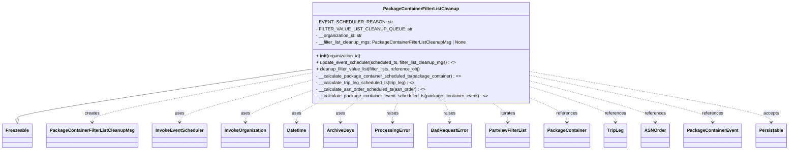
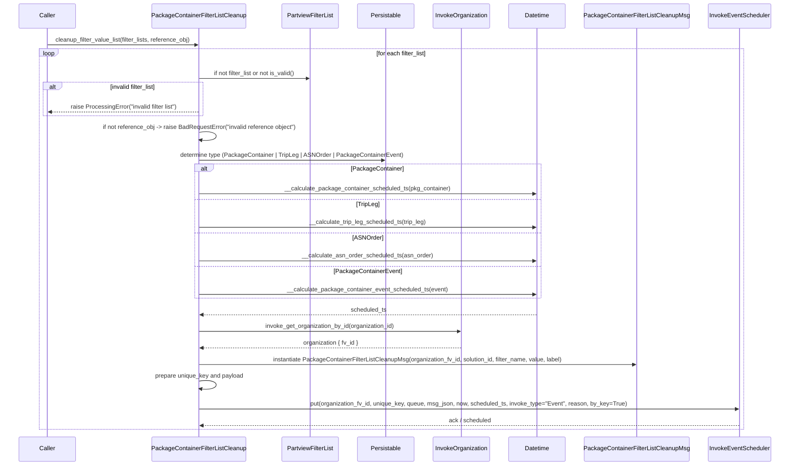

# Diagram: partview_service/partview_service/core/business/package_container_filter_list/package_container_filter_list_cleanup.py

> Auto-generated by Obscura crawlers

## Diagram 1

### SVG

<svg id="container" width="2700.640625" xmlns="http://www.w3.org/2000/svg" class="classDiagram" height="534" viewBox="0 0 2700.640625 534" role="graphics-document document" aria-roledescription="class"><g><defs><marker id="container_class-aggregationStart" class="marker aggregation class" refX="18" refY="7" markerWidth="190" markerHeight="240" orient="auto"><path d="M 18,7 L9,13 L1,7 L9,1 Z"></path></marker></defs><defs><marker id="container_class-aggregationEnd" class="marker aggregation class" refX="1" refY="7" markerWidth="20" markerHeight="28" orient="auto"><path d="M 18,7 L9,13 L1,7 L9,1 Z"></path></marker></defs><defs><marker id="container_class-extensionStart" class="marker extension class" refX="18" refY="7" markerWidth="190" markerHeight="240" orient="auto"><path d="M 1,7 L18,13 V 1 Z"></path></marker></defs><defs><marker id="container_class-extensionEnd" class="marker extension class" refX="1" refY="7" markerWidth="20" markerHeight="28" orient="auto"><path d="M 1,1 V 13 L18,7 Z"></path></marker></defs><defs><marker id="container_class-compositionStart" class="marker composition class" refX="18" refY="7" markerWidth="190" markerHeight="240" orient="auto"><path d="M 18,7 L9,13 L1,7 L9,1 Z"></path></marker></defs><defs><marker id="container_class-compositionEnd" class="marker composition class" refX="1" refY="7" markerWidth="20" markerHeight="28" orient="auto"><path d="M 18,7 L9,13 L1,7 L9,1 Z"></path></marker></defs><defs><marker id="container_class-dependencyStart" class="marker dependency class" refX="6" refY="7" markerWidth="190" markerHeight="240" orient="auto"><path d="M 5,7 L9,13 L1,7 L9,1 Z"></path></marker></defs><defs><marker id="container_class-dependencyEnd" class="marker dependency class" refX="13" refY="7" markerWidth="20" markerHeight="28" orient="auto"><path d="M 18,7 L9,13 L14,7 L9,1 Z"></path></marker></defs><defs><marker id="container_class-lollipopStart" class="marker lollipop class" refX="13" refY="7" markerWidth="190" markerHeight="240" orient="auto"><circle stroke="black" fill="transparent" cx="7" cy="7" r="6"></circle></marker></defs><defs><marker id="container_class-lollipopEnd" class="marker lollipop class" refX="1" refY="7" markerWidth="190" markerHeight="240" orient="auto"><circle stroke="black" fill="transparent" cx="7" cy="7" r="6"></circle></marker></defs><g class="root"><g class="clusters"></g><g class="edgePaths"><path d="M1060.145,247.719L893.32,273.932C726.495,300.146,392.845,352.573,226.02,382.078C59.195,411.583,59.195,418.167,59.195,421.458L59.195,424.75" id="id_PackageContainerFilterListCleanup_Freezeable_1" class="edge-thickness-normal edge-pattern-solid relation" style=";;;" data-edge="true" data-et="edge" data-id="id_PackageContainerFilterListCleanup_Freezeable_1" data-points="W3sieCI6MTA2MC4xNDQ1MzEyNSwieSI6MjQ3LjcxODc3OTA4MTExNDU4fSx7IngiOjU5LjE5NTMxMjUsInkiOjQwNX0seyJ4Ijo1OS4xOTUzMTI1LCJ5Ijo0NDJ9XQ==" marker-end="url(#container_class-extensionEnd)"></path><path d="M1060.145,261.238L935.808,285.199C811.471,309.159,562.798,357.079,438.462,386.206C314.125,415.333,314.125,425.667,314.125,430.833L314.125,436" id="id_PackageContainerFilterListCleanup_PackageContainerFilterListCleanupMsg_2" class="edge-thickness-normal edge-pattern-dashed relation" style=";;;" data-edge="true" data-et="edge" data-id="id_PackageContainerFilterListCleanup_PackageContainerFilterListCleanupMsg_2" data-points="W3sieCI6MTA2MC4xNDQ1MzEyNSwieSI6MjYxLjIzODM5Mzg5NDcxODU3fSx7IngiOjMxNC4xMjUsInkiOjQwNX0seyJ4IjozMTQuMTI1LCJ5Ijo0NDJ9XQ==" marker-end="url(#container_class-dependencyEnd)"></path><path d="M1060.145,287.484L985.321,307.07C910.497,326.656,760.85,365.828,686.027,390.581C611.203,415.333,611.203,425.667,611.203,430.833L611.203,436" id="id_PackageContainerFilterListCleanup_InvokeEventScheduler_3" class="edge-thickness-normal edge-pattern-dashed relation" style=";;;" data-edge="true" data-et="edge" data-id="id_PackageContainerFilterListCleanup_InvokeEventScheduler_3" data-points="W3sieCI6MTA2MC4xNDQ1MzEyNSwieSI6Mjg3LjQ4NDAyMzg4MDU0MDc1fSx7IngiOjYxMS4yMDMxMjUsInkiOjQwNX0seyJ4Ijo2MTEuMjAzMTI1LCJ5Ijo0NDJ9XQ==" marker-end="url(#container_class-dependencyEnd)"></path><path d="M1060.145,324.859L1023.053,338.216C985.961,351.573,911.777,378.286,874.686,396.81C837.594,415.333,837.594,425.667,837.594,430.833L837.594,436" id="id_PackageContainerFilterListCleanup_InvokeOrganization_4" class="edge-thickness-normal edge-pattern-dashed relation" style=";;;" data-edge="true" data-et="edge" data-id="id_PackageContainerFilterListCleanup_InvokeOrganization_4" data-points="W3sieCI6MTA2MC4xNDQ1MzEyNSwieSI6MzI0Ljg1ODgwOTcyNTk5NDU1fSx7IngiOjgzNy41OTM3NSwieSI6NDA1fSx7IngiOjgzNy41OTM3NSwieSI6NDQyfV0=" marker-end="url(#container_class-dependencyEnd)"></path><path d="M1088.361,368L1076.308,374.167C1064.254,380.333,1040.146,392.667,1028.093,404C1016.039,415.333,1016.039,425.667,1016.039,430.833L1016.039,436" id="id_PackageContainerFilterListCleanup_Datetime_5" class="edge-thickness-normal edge-pattern-dashed relation" style=";;;" data-edge="true" data-et="edge" data-id="id_PackageContainerFilterListCleanup_Datetime_5" data-points="W3sieCI6MTA4OC4zNjEzMDExMjMyNzIsInkiOjM2OH0seyJ4IjoxMDE2LjAzOTA2MjUsInkiOjQwNX0seyJ4IjoxMDE2LjAzOTA2MjUsInkiOjQ0Mn1d" marker-end="url(#container_class-dependencyEnd)"></path><path d="M1214.094,368L1206.348,374.167C1198.602,380.333,1183.11,392.667,1175.363,404C1167.617,415.333,1167.617,425.667,1167.617,430.833L1167.617,436" id="id_PackageContainerFilterListCleanup_ArchiveDays_6" class="edge-thickness-normal edge-pattern-dashed relation" style=";;;" data-edge="true" data-et="edge" data-id="id_PackageContainerFilterListCleanup_ArchiveDays_6" data-points="W3sieCI6MTIxNC4wOTQzMDgwMzU3MTQyLCJ5IjozNjh9LHsieCI6MTE2Ny42MTcxODc1LCJ5Ijo0MDV9LHsieCI6MTE2Ny42MTcxODc1LCJ5Ijo0NDJ9XQ==" marker-end="url(#container_class-dependencyEnd)"></path><path d="M1359.826,368L1357.072,374.167C1354.319,380.333,1348.812,392.667,1346.058,404C1343.305,415.333,1343.305,425.667,1343.305,430.833L1343.305,436" id="id_PackageContainerFilterListCleanup_ProcessingError_7" class="edge-thickness-normal edge-pattern-dashed relation" style=";;;" data-edge="true" data-et="edge" data-id="id_PackageContainerFilterListCleanup_ProcessingError_7" data-points="W3sieCI6MTM1OS44MjU4NzQ4NTU5OTA4LCJ5IjozNjh9LHsieCI6MTM0My4zMDQ2ODc1LCJ5Ijo0MDV9LHsieCI6MTM0My4zMDQ2ODc1LCJ5Ijo0NDJ9XQ==" marker-end="url(#container_class-dependencyEnd)"></path><path d="M1520.573,368L1523.326,374.167C1526.08,380.333,1531.587,392.667,1534.34,404C1537.094,415.333,1537.094,425.667,1537.094,430.833L1537.094,436" id="id_PackageContainerFilterListCleanup_BadRequestError_8" class="edge-thickness-normal edge-pattern-dashed relation" style=";;;" data-edge="true" data-et="edge" data-id="id_PackageContainerFilterListCleanup_BadRequestError_8" data-points="W3sieCI6MTUyMC41NzI1NjI2NDQwMDkyLCJ5IjozNjh9LHsieCI6MTUzNy4wOTM3NSwieSI6NDA1fSx7IngiOjE1MzcuMDkzNzUsInkiOjQ0Mn1d" marker-end="url(#container_class-dependencyEnd)"></path><path d="M1686.679,368L1695.123,374.167C1703.567,380.333,1720.455,392.667,1728.9,404C1737.344,415.333,1737.344,425.667,1737.344,430.833L1737.344,436" id="id_PackageContainerFilterListCleanup_PartviewFilterList_9" class="edge-thickness-normal edge-pattern-dashed relation" style=";;;" data-edge="true" data-et="edge" data-id="id_PackageContainerFilterListCleanup_PartviewFilterList_9" data-points="W3sieCI6MTY4Ni42Nzg1NTM0Mjc0MTkzLCJ5IjozNjh9LHsieCI6MTczNy4zNDM3NSwieSI6NDA1fSx7IngiOjE3MzcuMzQzNzUsInkiOjQ0Mn1d" marker-end="url(#container_class-dependencyEnd)"></path><path d="M1820.254,352.757L1840.339,361.464C1860.424,370.171,1900.595,387.586,1920.68,401.46C1940.766,415.333,1940.766,425.667,1940.766,430.833L1940.766,436" id="id_PackageContainerFilterListCleanup_PackageContainer_10" class="edge-thickness-normal edge-pattern-dashed relation" style=";;;" data-edge="true" data-et="edge" data-id="id_PackageContainerFilterListCleanup_PackageContainer_10" data-points="W3sieCI6MTgyMC4yNTM5MDYyNSwieSI6MzUyLjc1NzA5NTQ3Nzc3OTF9LHsieCI6MTk0MC43NjU2MjUsInkiOjQwNX0seyJ4IjoxOTQwLjc2NTYyNSwieSI6NDQyfV0=" marker-end="url(#container_class-dependencyEnd)"></path><path d="M1820.254,311.632L1868.09,327.194C1915.927,342.755,2011.6,373.877,2059.437,394.605C2107.273,415.333,2107.273,425.667,2107.273,430.833L2107.273,436" id="id_PackageContainerFilterListCleanup_TripLeg_11" class="edge-thickness-normal edge-pattern-dashed relation" style=";;;" data-edge="true" data-et="edge" data-id="id_PackageContainerFilterListCleanup_TripLeg_11" data-points="W3sieCI6MTgyMC4yNTM5MDYyNSwieSI6MzExLjYzMjIyMDkyNzQ0MDh9LHsieCI6MjEwNy4yNzM0Mzc1LCJ5Ijo0MDV9LHsieCI6MjEwNy4yNzM0Mzc1LCJ5Ijo0NDJ9XQ==" marker-end="url(#container_class-dependencyEnd)"></path><path d="M1820.254,290.621L1890.854,309.684C1961.453,328.748,2102.652,366.874,2173.252,391.104C2243.852,415.333,2243.852,425.667,2243.852,430.833L2243.852,436" id="id_PackageContainerFilterListCleanup_ASNOrder_12" class="edge-thickness-normal edge-pattern-dashed relation" style=";;;" data-edge="true" data-et="edge" data-id="id_PackageContainerFilterListCleanup_ASNOrder_12" data-points="W3sieCI6MTgyMC4yNTM5MDYyNSwieSI6MjkwLjYyMTMyMzU0NzI4MTd9LHsieCI6MjI0My44NTE1NjI1LCJ5Ijo0MDV9LHsieCI6MjI0My44NTE1NjI1LCJ5Ijo0NDJ9XQ==" marker-end="url(#container_class-dependencyEnd)"></path><path d="M1820.254,270.568L1923.383,292.974C2026.513,315.379,2232.772,360.189,2335.902,387.761C2439.031,415.333,2439.031,425.667,2439.031,430.833L2439.031,436" id="id_PackageContainerFilterListCleanup_PackageContainerEvent_13" class="edge-thickness-normal edge-pattern-dashed relation" style=";;;" data-edge="true" data-et="edge" data-id="id_PackageContainerFilterListCleanup_PackageContainerEvent_13" data-points="W3sieCI6MTgyMC4yNTM5MDYyNSwieSI6MjcwLjU2ODMwNDM4Njc2NDJ9LHsieCI6MjQzOS4wMzEyNSwieSI6NDA1fSx7IngiOjI0MzkuMDMxMjUsInkiOjQ0Mn1d" marker-end="url(#container_class-dependencyEnd)"></path><path d="M1820.254,256.757L1956.822,281.464C2093.391,306.171,2366.527,355.586,2503.096,385.46C2639.664,415.333,2639.664,425.667,2639.664,430.833L2639.664,436" id="id_PackageContainerFilterListCleanup_Persistable_14" class="edge-thickness-normal edge-pattern-dashed relation" style=";;;" data-edge="true" data-et="edge" data-id="id_PackageContainerFilterListCleanup_Persistable_14" data-points="W3sieCI6MTgyMC4yNTM5MDYyNSwieSI6MjU2Ljc1NzIxOTIwMjU3NDA1fSx7IngiOjI2MzkuNjY0MDYyNSwieSI6NDA1fSx7IngiOjI2MzkuNjY0MDYyNSwieSI6NDQyfV0=" marker-end="url(#container_class-dependencyEnd)"></path></g><g class="edgeLabels"><g class="edgeLabel"><g class="label" data-id="id_PackageContainerFilterListCleanup_Freezeable_1" transform="translate(0, 0)"><foreignObject width="0" height="0">

</foreignObject></g></g><g class="edgeLabel" transform="translate(314.125, 405)"><g class="label" data-id="id_PackageContainerFilterListCleanup_PackageContainerFilterListCleanupMsg_2" transform="translate(-26.171875, -12)"><foreignObject width="52.34375" height="24">

creates

</foreignObject></g></g><g class="edgeLabel" transform="translate(611.203125, 405)"><g class="label" data-id="id_PackageContainerFilterListCleanup_InvokeEventScheduler_3" transform="translate(-16.4921875, -12)"><foreignObject width="32.984375" height="24">

uses

</foreignObject></g></g><g class="edgeLabel" transform="translate(837.59375, 405)"><g class="label" data-id="id_PackageContainerFilterListCleanup_InvokeOrganization_4" transform="translate(-16.4921875, -12)"><foreignObject width="32.984375" height="24">

uses

</foreignObject></g></g><g class="edgeLabel" transform="translate(1016.0390625, 405)"><g class="label" data-id="id_PackageContainerFilterListCleanup_Datetime_5" transform="translate(-16.4921875, -12)"><foreignObject width="32.984375" height="24">

uses

</foreignObject></g></g><g class="edgeLabel" transform="translate(1167.6171875, 405)"><g class="label" data-id="id_PackageContainerFilterListCleanup_ArchiveDays_6" transform="translate(-16.4921875, -12)"><foreignObject width="32.984375" height="24">

uses

</foreignObject></g></g><g class="edgeLabel" transform="translate(1343.3046875, 405)"><g class="label" data-id="id_PackageContainerFilterListCleanup_ProcessingError_7" transform="translate(-21.25, -12)"><foreignObject width="42.5" height="24">

raises

</foreignObject></g></g><g class="edgeLabel" transform="translate(1537.09375, 405)"><g class="label" data-id="id_PackageContainerFilterListCleanup_BadRequestError_8" transform="translate(-21.25, -12)"><foreignObject width="42.5" height="24">

raises

</foreignObject></g></g><g class="edgeLabel" transform="translate(1737.34375, 405)"><g class="label" data-id="id_PackageContainerFilterListCleanup_PartviewFilterList_9" transform="translate(-27.4140625, -12)"><foreignObject width="54.828125" height="24">

iterates

</foreignObject></g></g><g class="edgeLabel" transform="translate(1940.765625, 405)"><g class="label" data-id="id_PackageContainerFilterListCleanup_PackageContainer_10" transform="translate(-37.828125, -12)"><foreignObject width="75.65625" height="24">

references

</foreignObject></g></g><g class="edgeLabel" transform="translate(2107.2734375, 405)"><g class="label" data-id="id_PackageContainerFilterListCleanup_TripLeg_11" transform="translate(-37.828125, -12)"><foreignObject width="75.65625" height="24">

references

</foreignObject></g></g><g class="edgeLabel" transform="translate(2243.8515625, 405)"><g class="label" data-id="id_PackageContainerFilterListCleanup_ASNOrder_12" transform="translate(-37.828125, -12)"><foreignObject width="75.65625" height="24">

references

</foreignObject></g></g><g class="edgeLabel" transform="translate(2439.03125, 405)"><g class="label" data-id="id_PackageContainerFilterListCleanup_PackageContainerEvent_13" transform="translate(-37.828125, -12)"><foreignObject width="75.65625" height="24">

references

</foreignObject></g></g><g class="edgeLabel" transform="translate(2639.6640625, 405)"><g class="label" data-id="id_PackageContainerFilterListCleanup_Persistable_14" transform="translate(-27.421875, -12)"><foreignObject width="54.84375" height="24">

accepts

</foreignObject></g></g></g><g class="nodes"><g class="node default" id="classId-PackageContainerFilterListCleanup-0" transform="translate(1440.19921875, 188)"><g class="basic label-container"><path d="M-380.0546875 -180 L380.0546875 -180 L380.0546875 180 L-380.0546875 180" stroke="none" stroke-width="0" fill="#ECECFF" style=""></path><path d="M-380.0546875 -180 C-211.5583989163516 -180, -43.062110332703185 -180, 380.0546875 -180 M-380.0546875 -180 C-159.5772379633599 -180, 60.90021157328022 -180, 380.0546875 -180 M380.0546875 -180 C380.0546875 -45.222756043000146, 380.0546875 89.55448791399971, 380.0546875 180 M380.0546875 -180 C380.0546875 -82.49985321933418, 380.0546875 15.000293561331631, 380.0546875 180 M380.0546875 180 C85.13666404059546 180, -209.78135941880907 180, -380.0546875 180 M380.0546875 180 C221.11677419431945 180, 62.178860888638894 180, -380.0546875 180 M-380.0546875 180 C-380.0546875 67.13713641003122, -380.0546875 -45.725727179937564, -380.0546875 -180 M-380.0546875 180 C-380.0546875 80.28679614967878, -380.0546875 -19.426407700642443, -380.0546875 -180" stroke="#9370DB" stroke-width="1.3" fill="none" stroke-dasharray="0 0" style=""></path></g><g class="annotation-group text" transform="translate(0, -156)"></g><g class="label-group text" transform="translate(-127.171875, -156)"><g class="label" style="font-weight: bolder" transform="translate(0,-12)"><foreignObject width="254.34375" height="24">

PackageContainerFilterListCleanup

</foreignObject></g></g><g class="members-group text" transform="translate(-368.0546875, -108)"><g class="label" style="" transform="translate(0,-12)"><foreignObject width="241.28125" height="24">

- EVENT_SCHEDULER_REASON: str

</foreignObject></g><g class="label" style="" transform="translate(0,12)"><foreignObject width="301.453125" height="24">

- FILTER_VALUE_LIST_CLEANUP_QUEUE: str

</foreignObject></g><g class="label" style="" transform="translate(0,36)"><foreignObject width="167.109375" height="24">

- __organization_id: str

</foreignObject></g><g class="label" style="" transform="translate(0,60)"><foreignObject width="533.3125" height="24">

- __filter_list_cleanup_mgs: PackageContainerFilterListCleanupMsg | None

</foreignObject></g></g><g class="methods-group text" transform="translate(-368.0546875, 12)"><g class="label" style="" transform="translate(0,-12)"><foreignObject width="159.796875" height="24">

+ <strong>init</strong>(organization_id)

</foreignObject></g><g class="label" style="" transform="translate(0,12)"><foreignObject width="501.265625" height="24">

+ update_event_scheduler(scheduled_ts, filter_list_cleanup_mgs) : &lt;&gt;

</foreignObject></g><g class="label" style="" transform="translate(0,36)"><foreignObject width="376.421875" height="24">

+ cleanup_filter_value_list(filter_lists, reference_obj)

</foreignObject></g><g class="label" style="" transform="translate(0,60)"><foreignObject width="513.546875" height="24">

- __calculate_package_container_scheduled_ts(package_container) : &lt;&gt;

</foreignObject></g><g class="label" style="" transform="translate(0,84)"><foreignObject width="353.765625" height="24">

- __calculate_trip_leg_scheduled_ts(trip_leg) : &lt;&gt;

</foreignObject></g><g class="label" style="" transform="translate(0,108)"><foreignObject width="387.296875" height="24">

- __calculate_asn_order_scheduled_ts(asn_order) : &lt;&gt;

</foreignObject></g><g class="label" style="" transform="translate(0,132)"><foreignObject width="608.9375" height="24">

- __calculate_package_container_event_scheduled_ts(package_container_event) : &lt;&gt;

</foreignObject></g></g><g class="divider" style=""><path d="M-380.0546875 -132 C-112.10739627763184 -132, 155.83989494473633 -132, 380.0546875 -132 M-380.0546875 -132 C-163.986562996362 -132, 52.08156150727598 -132, 380.0546875 -132" stroke="#9370DB" stroke-width="1.3" fill="none" stroke-dasharray="0 0" style=""></path></g><g class="divider" style=""><path d="M-380.0546875 -12 C-134.50735329500563 -12, 111.03998090998874 -12, 380.0546875 -12 M-380.0546875 -12 C-212.2998064343616 -12, -44.54492536872323 -12, 380.0546875 -12" stroke="#9370DB" stroke-width="1.3" fill="none" stroke-dasharray="0 0" style=""></path></g></g><g class="node default" id="classId-Freezeable-1" transform="translate(59.1953125, 484)"><g class="basic label-container"><path d="M-51.1953125 -42 L51.1953125 -42 L51.1953125 42 L-51.1953125 42" stroke="none" stroke-width="0" fill="#ECECFF" style=""></path><path d="M-51.1953125 -42 C-11.447609727577927 -42, 28.300093044844147 -42, 51.1953125 -42 M-51.1953125 -42 C-23.881562055696786 -42, 3.432188388606427 -42, 51.1953125 -42 M51.1953125 -42 C51.1953125 -11.677284838217634, 51.1953125 18.64543032356473, 51.1953125 42 M51.1953125 -42 C51.1953125 -22.7651232215296, 51.1953125 -3.530246443059198, 51.1953125 42 M51.1953125 42 C10.485876311903304 42, -30.22355987619339 42, -51.1953125 42 M51.1953125 42 C25.115970167337622 42, -0.9633721653247562 42, -51.1953125 42 M-51.1953125 42 C-51.1953125 24.630961603628446, -51.1953125 7.261923207256892, -51.1953125 -42 M-51.1953125 42 C-51.1953125 23.699614548462264, -51.1953125 5.399229096924529, -51.1953125 -42" stroke="#9370DB" stroke-width="1.3" fill="none" stroke-dasharray="0 0" style=""></path></g><g class="annotation-group text" transform="translate(0, -18)"></g><g class="label-group text" transform="translate(-39.1953125, -18)"><g class="label" style="font-weight: bolder" transform="translate(0,-12)"><foreignObject width="78.390625" height="24">

Freezeable

</foreignObject></g></g><g class="members-group text" transform="translate(-39.1953125, 30)"></g><g class="methods-group text" transform="translate(-39.1953125, 60)"></g><g class="divider" style=""><path d="M-51.1953125 6 C-12.83007094208137 6, 25.53517061583726 6, 51.1953125 6 M-51.1953125 6 C-23.242829072140825 6, 4.7096543557183494 6, 51.1953125 6" stroke="#9370DB" stroke-width="1.3" fill="none" stroke-dasharray="0 0" style=""></path></g><g class="divider" style=""><path d="M-51.1953125 24 C-23.768277329468013 24, 3.6587578410639736 24, 51.1953125 24 M-51.1953125 24 C-11.492720567325634 24, 28.209871365348732 24, 51.1953125 24" stroke="#9370DB" stroke-width="1.3" fill="none" stroke-dasharray="0 0" style=""></path></g></g><g class="node default" id="classId-PackageContainerFilterListCleanupMsg-2" transform="translate(314.125, 484)"><g class="basic label-container"><path d="M-153.734375 -42 L153.734375 -42 L153.734375 42 L-153.734375 42" stroke="none" stroke-width="0" fill="#ECECFF" style=""></path><path d="M-153.734375 -42 C-74.58252702737438 -42, 4.569320945251235 -42, 153.734375 -42 M-153.734375 -42 C-75.45411127787582 -42, 2.8261524442483505 -42, 153.734375 -42 M153.734375 -42 C153.734375 -19.29609079663797, 153.734375 3.4078184067240613, 153.734375 42 M153.734375 -42 C153.734375 -12.69408797534464, 153.734375 16.61182404931072, 153.734375 42 M153.734375 42 C45.176400961777105 42, -63.38157307644579 42, -153.734375 42 M153.734375 42 C71.02259554600181 42, -11.68918390799638 42, -153.734375 42 M-153.734375 42 C-153.734375 21.07138632751211, -153.734375 0.142772655024217, -153.734375 -42 M-153.734375 42 C-153.734375 24.108828952232003, -153.734375 6.217657904464005, -153.734375 -42" stroke="#9370DB" stroke-width="1.3" fill="none" stroke-dasharray="0 0" style=""></path></g><g class="annotation-group text" transform="translate(0, -18)"></g><g class="label-group text" transform="translate(-141.734375, -18)"><g class="label" style="font-weight: bolder" transform="translate(0,-12)"><foreignObject width="283.46875" height="24">

PackageContainerFilterListCleanupMsg

</foreignObject></g></g><g class="members-group text" transform="translate(-141.734375, 30)"></g><g class="methods-group text" transform="translate(-141.734375, 60)"></g><g class="divider" style=""><path d="M-153.734375 6 C-44.80842533675575 6, 64.1175243264885 6, 153.734375 6 M-153.734375 6 C-68.8353222357419 6, 16.063730528516203 6, 153.734375 6" stroke="#9370DB" stroke-width="1.3" fill="none" stroke-dasharray="0 0" style=""></path></g><g class="divider" style=""><path d="M-153.734375 24 C-49.37390908153425 24, 54.9865568369315 24, 153.734375 24 M-153.734375 24 C-84.5172997972468 24, -15.300224594493613 24, 153.734375 24" stroke="#9370DB" stroke-width="1.3" fill="none" stroke-dasharray="0 0" style=""></path></g></g><g class="node default" id="classId-PartviewFilterList-3" transform="translate(1737.34375, 484)"><g class="basic label-container"><path d="M-75.96875 -42 L75.96875 -42 L75.96875 42 L-75.96875 42" stroke="none" stroke-width="0" fill="#ECECFF" style=""></path><path d="M-75.96875 -42 C-39.791995905879844 -42, -3.615241811759688 -42, 75.96875 -42 M-75.96875 -42 C-15.625209912830073 -42, 44.718330174339854 -42, 75.96875 -42 M75.96875 -42 C75.96875 -14.237155221283935, 75.96875 13.52568955743213, 75.96875 42 M75.96875 -42 C75.96875 -22.568438189321956, 75.96875 -3.136876378643912, 75.96875 42 M75.96875 42 C15.264226021053716 42, -45.44029795789257 42, -75.96875 42 M75.96875 42 C19.772605454787914 42, -36.42353909042417 42, -75.96875 42 M-75.96875 42 C-75.96875 17.7213855726577, -75.96875 -6.5572288546846025, -75.96875 -42 M-75.96875 42 C-75.96875 11.127835846436277, -75.96875 -19.744328307127446, -75.96875 -42" stroke="#9370DB" stroke-width="1.3" fill="none" stroke-dasharray="0 0" style=""></path></g><g class="annotation-group text" transform="translate(0, -18)"></g><g class="label-group text" transform="translate(-63.96875, -18)"><g class="label" style="font-weight: bolder" transform="translate(0,-12)"><foreignObject width="127.9375" height="24">

PartviewFilterList

</foreignObject></g></g><g class="members-group text" transform="translate(-63.96875, 30)"></g><g class="methods-group text" transform="translate(-63.96875, 60)"></g><g class="divider" style=""><path d="M-75.96875 6 C-43.933045135480086 6, -11.897340270960171 6, 75.96875 6 M-75.96875 6 C-19.692896395981727 6, 36.58295720803655 6, 75.96875 6" stroke="#9370DB" stroke-width="1.3" fill="none" stroke-dasharray="0 0" style=""></path></g><g class="divider" style=""><path d="M-75.96875 24 C-28.633222934308186 24, 18.702304131383627 24, 75.96875 24 M-75.96875 24 C-40.174692554473125 24, -4.380635108946251 24, 75.96875 24" stroke="#9370DB" stroke-width="1.3" fill="none" stroke-dasharray="0 0" style=""></path></g></g><g class="node default" id="classId-PackageContainer-4" transform="translate(1940.765625, 484)"><g class="basic label-container"><path d="M-77.453125 -42 L77.453125 -42 L77.453125 42 L-77.453125 42" stroke="none" stroke-width="0" fill="#ECECFF" style=""></path><path d="M-77.453125 -42 C-20.65706515508826 -42, 36.13899468982348 -42, 77.453125 -42 M-77.453125 -42 C-24.15745889985986 -42, 29.138207200280277 -42, 77.453125 -42 M77.453125 -42 C77.453125 -20.322594027983715, 77.453125 1.3548119440325692, 77.453125 42 M77.453125 -42 C77.453125 -20.77067699166865, 77.453125 0.4586460166626978, 77.453125 42 M77.453125 42 C41.60948238954911 42, 5.765839779098215 42, -77.453125 42 M77.453125 42 C19.878916887287048 42, -37.695291225425905 42, -77.453125 42 M-77.453125 42 C-77.453125 20.083447282678843, -77.453125 -1.833105434642313, -77.453125 -42 M-77.453125 42 C-77.453125 15.49926564767366, -77.453125 -11.00146870465268, -77.453125 -42" stroke="#9370DB" stroke-width="1.3" fill="none" stroke-dasharray="0 0" style=""></path></g><g class="annotation-group text" transform="translate(0, -18)"></g><g class="label-group text" transform="translate(-65.453125, -18)"><g class="label" style="font-weight: bolder" transform="translate(0,-12)"><foreignObject width="130.90625" height="24">

PackageContainer

</foreignObject></g></g><g class="members-group text" transform="translate(-65.453125, 30)"></g><g class="methods-group text" transform="translate(-65.453125, 60)"></g><g class="divider" style=""><path d="M-77.453125 6 C-37.93545463407974 6, 1.5822157318405203 6, 77.453125 6 M-77.453125 6 C-25.719635696067485 6, 26.01385360786503 6, 77.453125 6" stroke="#9370DB" stroke-width="1.3" fill="none" stroke-dasharray="0 0" style=""></path></g><g class="divider" style=""><path d="M-77.453125 24 C-32.94657162182064 24, 11.559981756358724 24, 77.453125 24 M-77.453125 24 C-41.227428637243214 24, -5.001732274486429 24, 77.453125 24" stroke="#9370DB" stroke-width="1.3" fill="none" stroke-dasharray="0 0" style=""></path></g></g><g class="node default" id="classId-TripLeg-5" transform="translate(2107.2734375, 484)"><g class="basic label-container"><path d="M-39.0546875 -42 L39.0546875 -42 L39.0546875 42 L-39.0546875 42" stroke="none" stroke-width="0" fill="#ECECFF" style=""></path><path d="M-39.0546875 -42 C-14.935734425872099 -42, 9.183218648255803 -42, 39.0546875 -42 M-39.0546875 -42 C-9.954481130569583 -42, 19.145725238860834 -42, 39.0546875 -42 M39.0546875 -42 C39.0546875 -9.839500778409743, 39.0546875 22.320998443180514, 39.0546875 42 M39.0546875 -42 C39.0546875 -21.009373716555395, 39.0546875 -0.018747433110789302, 39.0546875 42 M39.0546875 42 C18.8619870564442 42, -1.3307133871116008 42, -39.0546875 42 M39.0546875 42 C8.33124330100194 42, -22.39220089799612 42, -39.0546875 42 M-39.0546875 42 C-39.0546875 20.805349757902697, -39.0546875 -0.3893004841946066, -39.0546875 -42 M-39.0546875 42 C-39.0546875 21.835290440408382, -39.0546875 1.6705808808167646, -39.0546875 -42" stroke="#9370DB" stroke-width="1.3" fill="none" stroke-dasharray="0 0" style=""></path></g><g class="annotation-group text" transform="translate(0, -18)"></g><g class="label-group text" transform="translate(-27.0546875, -18)"><g class="label" style="font-weight: bolder" transform="translate(0,-12)"><foreignObject width="54.109375" height="24">

TripLeg

</foreignObject></g></g><g class="members-group text" transform="translate(-27.0546875, 30)"></g><g class="methods-group text" transform="translate(-27.0546875, 60)"></g><g class="divider" style=""><path d="M-39.0546875 6 C-14.111536341942845 6, 10.83161481611431 6, 39.0546875 6 M-39.0546875 6 C-22.58268514349525 6, -6.110682786990502 6, 39.0546875 6" stroke="#9370DB" stroke-width="1.3" fill="none" stroke-dasharray="0 0" style=""></path></g><g class="divider" style=""><path d="M-39.0546875 24 C-12.424604882607557 24, 14.205477734784886 24, 39.0546875 24 M-39.0546875 24 C-10.974455781401005 24, 17.10577593719799 24, 39.0546875 24" stroke="#9370DB" stroke-width="1.3" fill="none" stroke-dasharray="0 0" style=""></path></g></g><g class="node default" id="classId-ASNOrder-6" transform="translate(2243.8515625, 484)"><g class="basic label-container"><path d="M-47.5234375 -42 L47.5234375 -42 L47.5234375 42 L-47.5234375 42" stroke="none" stroke-width="0" fill="#ECECFF" style=""></path><path d="M-47.5234375 -42 C-14.92104135880458 -42, 17.68135478239084 -42, 47.5234375 -42 M-47.5234375 -42 C-19.826355734997733 -42, 7.870726030004533 -42, 47.5234375 -42 M47.5234375 -42 C47.5234375 -11.02032859233794, 47.5234375 19.95934281532412, 47.5234375 42 M47.5234375 -42 C47.5234375 -8.484561917998086, 47.5234375 25.03087616400383, 47.5234375 42 M47.5234375 42 C11.149765248747848 42, -25.223907002504305 42, -47.5234375 42 M47.5234375 42 C10.822212486398648 42, -25.879012527202704 42, -47.5234375 42 M-47.5234375 42 C-47.5234375 11.451276643711406, -47.5234375 -19.097446712577188, -47.5234375 -42 M-47.5234375 42 C-47.5234375 21.033269328849737, -47.5234375 0.06653865769947487, -47.5234375 -42" stroke="#9370DB" stroke-width="1.3" fill="none" stroke-dasharray="0 0" style=""></path></g><g class="annotation-group text" transform="translate(0, -18)"></g><g class="label-group text" transform="translate(-35.5234375, -18)"><g class="label" style="font-weight: bolder" transform="translate(0,-12)"><foreignObject width="71.046875" height="24">

ASNOrder

</foreignObject></g></g><g class="members-group text" transform="translate(-35.5234375, 30)"></g><g class="methods-group text" transform="translate(-35.5234375, 60)"></g><g class="divider" style=""><path d="M-47.5234375 6 C-10.097028982712217 6, 27.329379534575565 6, 47.5234375 6 M-47.5234375 6 C-18.637272493726094 6, 10.248892512547812 6, 47.5234375 6" stroke="#9370DB" stroke-width="1.3" fill="none" stroke-dasharray="0 0" style=""></path></g><g class="divider" style=""><path d="M-47.5234375 24 C-9.673487140215052 24, 28.176463219569897 24, 47.5234375 24 M-47.5234375 24 C-20.57142138429206 24, 6.380594731415883 24, 47.5234375 24" stroke="#9370DB" stroke-width="1.3" fill="none" stroke-dasharray="0 0" style=""></path></g></g><g class="node default" id="classId-PackageContainerEvent-7" transform="translate(2439.03125, 484)"><g class="basic label-container"><path d="M-97.65625 -42 L97.65625 -42 L97.65625 42 L-97.65625 42" stroke="none" stroke-width="0" fill="#ECECFF" style=""></path><path d="M-97.65625 -42 C-56.490521481809395 -42, -15.32479296361879 -42, 97.65625 -42 M-97.65625 -42 C-53.047517707455945 -42, -8.43878541491189 -42, 97.65625 -42 M97.65625 -42 C97.65625 -8.433276218939248, 97.65625 25.133447562121503, 97.65625 42 M97.65625 -42 C97.65625 -16.41419751290633, 97.65625 9.171604974187339, 97.65625 42 M97.65625 42 C39.752147694077756 42, -18.151954611844488 42, -97.65625 42 M97.65625 42 C21.208090883470618 42, -55.240068233058764 42, -97.65625 42 M-97.65625 42 C-97.65625 13.944913994766392, -97.65625 -14.110172010467217, -97.65625 -42 M-97.65625 42 C-97.65625 18.08349288491253, -97.65625 -5.833014230174939, -97.65625 -42" stroke="#9370DB" stroke-width="1.3" fill="none" stroke-dasharray="0 0" style=""></path></g><g class="annotation-group text" transform="translate(0, -18)"></g><g class="label-group text" transform="translate(-85.65625, -18)"><g class="label" style="font-weight: bolder" transform="translate(0,-12)"><foreignObject width="171.3125" height="24">

PackageContainerEvent

</foreignObject></g></g><g class="members-group text" transform="translate(-85.65625, 30)"></g><g class="methods-group text" transform="translate(-85.65625, 60)"></g><g class="divider" style=""><path d="M-97.65625 6 C-52.18338325892351 6, -6.710516517847026 6, 97.65625 6 M-97.65625 6 C-25.58305823389422 6, 46.49013353221156 6, 97.65625 6" stroke="#9370DB" stroke-width="1.3" fill="none" stroke-dasharray="0 0" style=""></path></g><g class="divider" style=""><path d="M-97.65625 24 C-32.85328073772831 24, 31.949688524543376 24, 97.65625 24 M-97.65625 24 C-33.58640216725361 24, 30.48344566549278 24, 97.65625 24" stroke="#9370DB" stroke-width="1.3" fill="none" stroke-dasharray="0 0" style=""></path></g></g><g class="node default" id="classId-InvokeEventScheduler-8" transform="translate(611.203125, 484)"><g class="basic label-container"><path d="M-93.34375 -42 L93.34375 -42 L93.34375 42 L-93.34375 42" stroke="none" stroke-width="0" fill="#ECECFF" style=""></path><path d="M-93.34375 -42 C-29.18346812767679 -42, 34.97681374464642 -42, 93.34375 -42 M-93.34375 -42 C-40.0224549970998 -42, 13.2988400058004 -42, 93.34375 -42 M93.34375 -42 C93.34375 -10.299171222613715, 93.34375 21.40165755477257, 93.34375 42 M93.34375 -42 C93.34375 -23.97818025635343, 93.34375 -5.956360512706858, 93.34375 42 M93.34375 42 C29.015658314542733 42, -35.31243337091453 42, -93.34375 42 M93.34375 42 C37.660574713306104 42, -18.02260057338779 42, -93.34375 42 M-93.34375 42 C-93.34375 13.66499186508279, -93.34375 -14.67001626983442, -93.34375 -42 M-93.34375 42 C-93.34375 17.035860870144106, -93.34375 -7.928278259711789, -93.34375 -42" stroke="#9370DB" stroke-width="1.3" fill="none" stroke-dasharray="0 0" style=""></path></g><g class="annotation-group text" transform="translate(0, -18)"></g><g class="label-group text" transform="translate(-81.34375, -18)"><g class="label" style="font-weight: bolder" transform="translate(0,-12)"><foreignObject width="162.6875" height="24">

InvokeEventScheduler

</foreignObject></g></g><g class="members-group text" transform="translate(-81.34375, 30)"></g><g class="methods-group text" transform="translate(-81.34375, 60)"></g><g class="divider" style=""><path d="M-93.34375 6 C-40.24923225195323 6, 12.845285496093538 6, 93.34375 6 M-93.34375 6 C-29.854780286058435 6, 33.63418942788313 6, 93.34375 6" stroke="#9370DB" stroke-width="1.3" fill="none" stroke-dasharray="0 0" style=""></path></g><g class="divider" style=""><path d="M-93.34375 24 C-21.12058545063043 24, 51.10257909873914 24, 93.34375 24 M-93.34375 24 C-27.4960523190735 24, 38.351645361853 24, 93.34375 24" stroke="#9370DB" stroke-width="1.3" fill="none" stroke-dasharray="0 0" style=""></path></g></g><g class="node default" id="classId-InvokeOrganization-9" transform="translate(837.59375, 484)"><g class="basic label-container"><path d="M-83.046875 -42 L83.046875 -42 L83.046875 42 L-83.046875 42" stroke="none" stroke-width="0" fill="#ECECFF" style=""></path><path d="M-83.046875 -42 C-45.13418116116967 -42, -7.2214873223393425 -42, 83.046875 -42 M-83.046875 -42 C-46.01756352915778 -42, -8.988252058315567 -42, 83.046875 -42 M83.046875 -42 C83.046875 -23.107912584952558, 83.046875 -4.215825169905116, 83.046875 42 M83.046875 -42 C83.046875 -17.85296161881966, 83.046875 6.294076762360682, 83.046875 42 M83.046875 42 C48.01382289548765 42, 12.9807707909753 42, -83.046875 42 M83.046875 42 C36.82872768298776 42, -9.389419634024478 42, -83.046875 42 M-83.046875 42 C-83.046875 24.896956598320916, -83.046875 7.793913196641832, -83.046875 -42 M-83.046875 42 C-83.046875 18.453562911131115, -83.046875 -5.0928741777377695, -83.046875 -42" stroke="#9370DB" stroke-width="1.3" fill="none" stroke-dasharray="0 0" style=""></path></g><g class="annotation-group text" transform="translate(0, -18)"></g><g class="label-group text" transform="translate(-71.046875, -18)"><g class="label" style="font-weight: bolder" transform="translate(0,-12)"><foreignObject width="142.09375" height="24">

InvokeOrganization

</foreignObject></g></g><g class="members-group text" transform="translate(-71.046875, 30)"></g><g class="methods-group text" transform="translate(-71.046875, 60)"></g><g class="divider" style=""><path d="M-83.046875 6 C-36.124177180972566 6, 10.798520638054868 6, 83.046875 6 M-83.046875 6 C-17.24438605954218 6, 48.55810288091564 6, 83.046875 6" stroke="#9370DB" stroke-width="1.3" fill="none" stroke-dasharray="0 0" style=""></path></g><g class="divider" style=""><path d="M-83.046875 24 C-19.97552224209153 24, 43.09583051581694 24, 83.046875 24 M-83.046875 24 C-31.873873646088285 24, 19.29912770782343 24, 83.046875 24" stroke="#9370DB" stroke-width="1.3" fill="none" stroke-dasharray="0 0" style=""></path></g></g><g class="node default" id="classId-Datetime-10" transform="translate(1016.0390625, 484)"><g class="basic label-container"><path d="M-45.3984375 -42 L45.3984375 -42 L45.3984375 42 L-45.3984375 42" stroke="none" stroke-width="0" fill="#ECECFF" style=""></path><path d="M-45.3984375 -42 C-11.707462714503151 -42, 21.983512070993697 -42, 45.3984375 -42 M-45.3984375 -42 C-20.090082336168184 -42, 5.2182728276636325 -42, 45.3984375 -42 M45.3984375 -42 C45.3984375 -11.431219903328188, 45.3984375 19.137560193343624, 45.3984375 42 M45.3984375 -42 C45.3984375 -9.333335858240744, 45.3984375 23.33332828351851, 45.3984375 42 M45.3984375 42 C11.804134566599437 42, -21.790168366801126 42, -45.3984375 42 M45.3984375 42 C23.78893304722491 42, 2.179428594449817 42, -45.3984375 42 M-45.3984375 42 C-45.3984375 19.416039690047484, -45.3984375 -3.1679206199050327, -45.3984375 -42 M-45.3984375 42 C-45.3984375 19.982753667004598, -45.3984375 -2.034492665990804, -45.3984375 -42" stroke="#9370DB" stroke-width="1.3" fill="none" stroke-dasharray="0 0" style=""></path></g><g class="annotation-group text" transform="translate(0, -18)"></g><g class="label-group text" transform="translate(-33.3984375, -18)"><g class="label" style="font-weight: bolder" transform="translate(0,-12)"><foreignObject width="66.796875" height="24">

Datetime

</foreignObject></g></g><g class="members-group text" transform="translate(-33.3984375, 30)"></g><g class="methods-group text" transform="translate(-33.3984375, 60)"></g><g class="divider" style=""><path d="M-45.3984375 6 C-16.338801894977106 6, 12.720833710045788 6, 45.3984375 6 M-45.3984375 6 C-24.380336366773346 6, -3.3622352335466914 6, 45.3984375 6" stroke="#9370DB" stroke-width="1.3" fill="none" stroke-dasharray="0 0" style=""></path></g><g class="divider" style=""><path d="M-45.3984375 24 C-20.42342068183979 24, 4.55159613632042 24, 45.3984375 24 M-45.3984375 24 C-25.975033532444897 24, -6.551629564889794 24, 45.3984375 24" stroke="#9370DB" stroke-width="1.3" fill="none" stroke-dasharray="0 0" style=""></path></g></g><g class="node default" id="classId-ArchiveDays-11" transform="translate(1167.6171875, 484)"><g class="basic label-container"><path d="M-56.1796875 -42 L56.1796875 -42 L56.1796875 42 L-56.1796875 42" stroke="none" stroke-width="0" fill="#ECECFF" style=""></path><path d="M-56.1796875 -42 C-18.603591988740845 -42, 18.97250352251831 -42, 56.1796875 -42 M-56.1796875 -42 C-14.246011694847844 -42, 27.68766411030431 -42, 56.1796875 -42 M56.1796875 -42 C56.1796875 -13.129617355997517, 56.1796875 15.740765288004965, 56.1796875 42 M56.1796875 -42 C56.1796875 -15.005661771858584, 56.1796875 11.988676456282832, 56.1796875 42 M56.1796875 42 C24.402165983958334 42, -7.375355532083333 42, -56.1796875 42 M56.1796875 42 C31.060824451522773 42, 5.941961403045546 42, -56.1796875 42 M-56.1796875 42 C-56.1796875 14.82471395785543, -56.1796875 -12.35057208428914, -56.1796875 -42 M-56.1796875 42 C-56.1796875 10.779478939954434, -56.1796875 -20.441042120091133, -56.1796875 -42" stroke="#9370DB" stroke-width="1.3" fill="none" stroke-dasharray="0 0" style=""></path></g><g class="annotation-group text" transform="translate(0, -18)"></g><g class="label-group text" transform="translate(-44.1796875, -18)"><g class="label" style="font-weight: bolder" transform="translate(0,-12)"><foreignObject width="88.359375" height="24">

ArchiveDays

</foreignObject></g></g><g class="members-group text" transform="translate(-44.1796875, 30)"></g><g class="methods-group text" transform="translate(-44.1796875, 60)"></g><g class="divider" style=""><path d="M-56.1796875 6 C-14.99526175059755 6, 26.1891639988049 6, 56.1796875 6 M-56.1796875 6 C-13.234918008034953 6, 29.709851483930095 6, 56.1796875 6" stroke="#9370DB" stroke-width="1.3" fill="none" stroke-dasharray="0 0" style=""></path></g><g class="divider" style=""><path d="M-56.1796875 24 C-17.43836148297126 24, 21.30296453405748 24, 56.1796875 24 M-56.1796875 24 C-26.66071314626315 24, 2.858261207473703 24, 56.1796875 24" stroke="#9370DB" stroke-width="1.3" fill="none" stroke-dasharray="0 0" style=""></path></g></g><g class="node default" id="classId-ProcessingError-12" transform="translate(1343.3046875, 484)"><g class="basic label-container"><path d="M-69.5078125 -42 L69.5078125 -42 L69.5078125 42 L-69.5078125 42" stroke="none" stroke-width="0" fill="#ECECFF" style=""></path><path d="M-69.5078125 -42 C-34.55408201559979 -42, 0.3996484688004216 -42, 69.5078125 -42 M-69.5078125 -42 C-17.159647070972433 -42, 35.188518358055134 -42, 69.5078125 -42 M69.5078125 -42 C69.5078125 -13.053495189851233, 69.5078125 15.893009620297534, 69.5078125 42 M69.5078125 -42 C69.5078125 -15.757261630872904, 69.5078125 10.485476738254192, 69.5078125 42 M69.5078125 42 C16.683777520408924 42, -36.14025745918215 42, -69.5078125 42 M69.5078125 42 C33.79809875454842 42, -1.9116149909031606 42, -69.5078125 42 M-69.5078125 42 C-69.5078125 17.24772330708999, -69.5078125 -7.504553385820017, -69.5078125 -42 M-69.5078125 42 C-69.5078125 10.667663920729446, -69.5078125 -20.66467215854111, -69.5078125 -42" stroke="#9370DB" stroke-width="1.3" fill="none" stroke-dasharray="0 0" style=""></path></g><g class="annotation-group text" transform="translate(0, -18)"></g><g class="label-group text" transform="translate(-57.5078125, -18)"><g class="label" style="font-weight: bolder" transform="translate(0,-12)"><foreignObject width="115.015625" height="24">

ProcessingError

</foreignObject></g></g><g class="members-group text" transform="translate(-57.5078125, 30)"></g><g class="methods-group text" transform="translate(-57.5078125, 60)"></g><g class="divider" style=""><path d="M-69.5078125 6 C-27.226704918590613 6, 15.054402662818774 6, 69.5078125 6 M-69.5078125 6 C-23.556454027563674 6, 22.39490444487265 6, 69.5078125 6" stroke="#9370DB" stroke-width="1.3" fill="none" stroke-dasharray="0 0" style=""></path></g><g class="divider" style=""><path d="M-69.5078125 24 C-35.50561549888495 24, -1.5034184977698999 24, 69.5078125 24 M-69.5078125 24 C-19.599384310513123 24, 30.309043878973753 24, 69.5078125 24" stroke="#9370DB" stroke-width="1.3" fill="none" stroke-dasharray="0 0" style=""></path></g></g><g class="node default" id="classId-BadRequestError-13" transform="translate(1537.09375, 484)"><g class="basic label-container"><path d="M-74.28125 -42 L74.28125 -42 L74.28125 42 L-74.28125 42" stroke="none" stroke-width="0" fill="#ECECFF" style=""></path><path d="M-74.28125 -42 C-19.026320409104045 -42, 36.22860918179191 -42, 74.28125 -42 M-74.28125 -42 C-20.651848065624065 -42, 32.97755386875187 -42, 74.28125 -42 M74.28125 -42 C74.28125 -11.964646567344953, 74.28125 18.070706865310093, 74.28125 42 M74.28125 -42 C74.28125 -13.525367901761634, 74.28125 14.949264196476733, 74.28125 42 M74.28125 42 C14.877775843471376 42, -44.52569831305725 42, -74.28125 42 M74.28125 42 C17.655243927224888 42, -38.970762145550225 42, -74.28125 42 M-74.28125 42 C-74.28125 12.853735307054361, -74.28125 -16.292529385891278, -74.28125 -42 M-74.28125 42 C-74.28125 17.21484009847221, -74.28125 -7.5703198030555825, -74.28125 -42" stroke="#9370DB" stroke-width="1.3" fill="none" stroke-dasharray="0 0" style=""></path></g><g class="annotation-group text" transform="translate(0, -18)"></g><g class="label-group text" transform="translate(-62.28125, -18)"><g class="label" style="font-weight: bolder" transform="translate(0,-12)"><foreignObject width="124.5625" height="24">

BadRequestError

</foreignObject></g></g><g class="members-group text" transform="translate(-62.28125, 30)"></g><g class="methods-group text" transform="translate(-62.28125, 60)"></g><g class="divider" style=""><path d="M-74.28125 6 C-43.270955315112985 6, -12.260660630225978 6, 74.28125 6 M-74.28125 6 C-33.72652094821422 6, 6.828208103571555 6, 74.28125 6" stroke="#9370DB" stroke-width="1.3" fill="none" stroke-dasharray="0 0" style=""></path></g><g class="divider" style=""><path d="M-74.28125 24 C-26.52315854988769 24, 21.23493290022462 24, 74.28125 24 M-74.28125 24 C-26.357528851099453 24, 21.566192297801095 24, 74.28125 24" stroke="#9370DB" stroke-width="1.3" fill="none" stroke-dasharray="0 0" style=""></path></g></g><g class="node default" id="classId-Persistable-14" transform="translate(2639.6640625, 484)"><g class="basic label-container"><path d="M-52.9765625 -42 L52.9765625 -42 L52.9765625 42 L-52.9765625 42" stroke="none" stroke-width="0" fill="#ECECFF" style=""></path><path d="M-52.9765625 -42 C-21.201570835686834 -42, 10.573420828626332 -42, 52.9765625 -42 M-52.9765625 -42 C-28.77367961274382 -42, -4.570796725487639 -42, 52.9765625 -42 M52.9765625 -42 C52.9765625 -25.159395062089246, 52.9765625 -8.318790124178491, 52.9765625 42 M52.9765625 -42 C52.9765625 -20.281627030680884, 52.9765625 1.4367459386382322, 52.9765625 42 M52.9765625 42 C25.30648980073768 42, -2.3635828985246405 42, -52.9765625 42 M52.9765625 42 C17.028006927292076 42, -18.92054864541585 42, -52.9765625 42 M-52.9765625 42 C-52.9765625 22.25411721042801, -52.9765625 2.50823442085602, -52.9765625 -42 M-52.9765625 42 C-52.9765625 24.624671031423556, -52.9765625 7.249342062847113, -52.9765625 -42" stroke="#9370DB" stroke-width="1.3" fill="none" stroke-dasharray="0 0" style=""></path></g><g class="annotation-group text" transform="translate(0, -18)"></g><g class="label-group text" transform="translate(-40.9765625, -18)"><g class="label" style="font-weight: bolder" transform="translate(0,-12)"><foreignObject width="81.953125" height="24">

Persistable

</foreignObject></g></g><g class="members-group text" transform="translate(-40.9765625, 30)"></g><g class="methods-group text" transform="translate(-40.9765625, 60)"></g><g class="divider" style=""><path d="M-52.9765625 6 C-22.367676842916026 6, 8.241208814167948 6, 52.9765625 6 M-52.9765625 6 C-29.056455683337248 6, -5.136348866674496 6, 52.9765625 6" stroke="#9370DB" stroke-width="1.3" fill="none" stroke-dasharray="0 0" style=""></path></g><g class="divider" style=""><path d="M-52.9765625 24 C-28.44013485457982 24, -3.9037072091596414 24, 52.9765625 24 M-52.9765625 24 C-15.815467511981069 24, 21.345627476037862 24, 52.9765625 24" stroke="#9370DB" stroke-width="1.3" fill="none" stroke-dasharray="0 0" style=""></path></g></g></g></g></g></svg>

## Diagram 2

### SVG

<svg id="container" width="2194.5" xmlns="http://www.w3.org/2000/svg" height="1299" viewBox="-50 -10 2194.5 1299" role="graphics-document document" aria-roledescription="sequence"><g><rect x="1913.5" y="1213" fill="#eaeaea" stroke="#666" width="181" height="65" name="Scheduler" rx="3" ry="3" class="actor actor-bottom"></rect><text x="2004" y="1245.5" dominant-baseline="central" alignment-baseline="central" class="actor actor-box" style="text-anchor: middle; font-size: 16px; font-weight: 400;"><tspan x="2004" dy="0">InvokeEventScheduler</tspan></text></g><g><rect x="1564.5" y="1213" fill="#eaeaea" stroke="#666" width="299" height="65" name="Msg" rx="3" ry="3" class="actor actor-bottom"></rect><text x="1714" y="1245.5" dominant-baseline="central" alignment-baseline="central" class="actor actor-box" style="text-anchor: middle; font-size: 16px; font-weight: 400;"><tspan x="1714" dy="0">PackageContainerFilterListCleanupMsg</tspan></text></g><g><rect x="1364.5" y="1213" fill="#eaeaea" stroke="#666" width="150" height="65" name="Datetime" rx="3" ry="3" class="actor actor-bottom"></rect><text x="1439.5" y="1245.5" dominant-baseline="central" alignment-baseline="central" class="actor actor-box" style="text-anchor: middle; font-size: 16px; font-weight: 400;"><tspan x="1439.5" dy="0">Datetime</tspan></text></g><g><rect x="1154.5" y="1213" fill="#eaeaea" stroke="#666" width="160" height="65" name="Org" rx="3" ry="3" class="actor actor-bottom"></rect><text x="1234.5" y="1245.5" dominant-baseline="central" alignment-baseline="central" class="actor actor-box" style="text-anchor: middle; font-size: 16px; font-weight: 400;"><tspan x="1234.5" dy="0">InvokeOrganization</tspan></text></g><g><rect x="954.5" y="1213" fill="#eaeaea" stroke="#666" width="150" height="65" name="Reference" rx="3" ry="3" class="actor actor-bottom"></rect><text x="1029.5" y="1245.5" dominant-baseline="central" alignment-baseline="central" class="actor actor-box" style="text-anchor: middle; font-size: 16px; font-weight: 400;"><tspan x="1029.5" dy="0">Persistable</tspan></text></g><g><rect x="754.5" y="1213" fill="#eaeaea" stroke="#666" width="150" height="65" name="FilterList" rx="3" ry="3" class="actor actor-bottom"></rect><text x="829.5" y="1245.5" dominant-baseline="central" alignment-baseline="central" class="actor actor-box" style="text-anchor: middle; font-size: 16px; font-weight: 400;"><tspan x="829.5" dy="0">PartviewFilterList</tspan></text></g><g><rect x="374" y="1213" fill="#eaeaea" stroke="#666" width="270" height="65" name="Cleanup" rx="3" ry="3" class="actor actor-bottom"></rect><text x="509" y="1245.5" dominant-baseline="central" alignment-baseline="central" class="actor actor-box" style="text-anchor: middle; font-size: 16px; font-weight: 400;"><tspan x="509" dy="0">PackageContainerFilterListCleanup</tspan></text></g><g><rect x="0" y="1213" fill="#eaeaea" stroke="#666" width="150" height="65" name="Caller" rx="3" ry="3" class="actor actor-bottom"></rect><text x="75" y="1245.5" dominant-baseline="central" alignment-baseline="central" class="actor actor-box" style="text-anchor: middle; font-size: 16px; font-weight: 400;"><tspan x="75" dy="0">Caller</tspan></text></g><g><line id="actor7" x1="2004" y1="65" x2="2004" y2="1213" class="actor-line 200" stroke-width="0.5px" stroke="#999" name="Scheduler"></line><g id="root-7"><rect x="1913.5" y="0" fill="#eaeaea" stroke="#666" width="181" height="65" name="Scheduler" rx="3" ry="3" class="actor actor-top"></rect><text x="2004" y="32.5" dominant-baseline="central" alignment-baseline="central" class="actor actor-box" style="text-anchor: middle; font-size: 16px; font-weight: 400;"><tspan x="2004" dy="0">InvokeEventScheduler</tspan></text></g></g><g><line id="actor6" x1="1714" y1="65" x2="1714" y2="1213" class="actor-line 200" stroke-width="0.5px" stroke="#999" name="Msg"></line><g id="root-6"><rect x="1564.5" y="0" fill="#eaeaea" stroke="#666" width="299" height="65" name="Msg" rx="3" ry="3" class="actor actor-top"></rect><text x="1714" y="32.5" dominant-baseline="central" alignment-baseline="central" class="actor actor-box" style="text-anchor: middle; font-size: 16px; font-weight: 400;"><tspan x="1714" dy="0">PackageContainerFilterListCleanupMsg</tspan></text></g></g><g><line id="actor5" x1="1439.5" y1="65" x2="1439.5" y2="1213" class="actor-line 200" stroke-width="0.5px" stroke="#999" name="Datetime"></line><g id="root-5"><rect x="1364.5" y="0" fill="#eaeaea" stroke="#666" width="150" height="65" name="Datetime" rx="3" ry="3" class="actor actor-top"></rect><text x="1439.5" y="32.5" dominant-baseline="central" alignment-baseline="central" class="actor actor-box" style="text-anchor: middle; font-size: 16px; font-weight: 400;"><tspan x="1439.5" dy="0">Datetime</tspan></text></g></g><g><line id="actor4" x1="1234.5" y1="65" x2="1234.5" y2="1213" class="actor-line 200" stroke-width="0.5px" stroke="#999" name="Org"></line><g id="root-4"><rect x="1154.5" y="0" fill="#eaeaea" stroke="#666" width="160" height="65" name="Org" rx="3" ry="3" class="actor actor-top"></rect><text x="1234.5" y="32.5" dominant-baseline="central" alignment-baseline="central" class="actor actor-box" style="text-anchor: middle; font-size: 16px; font-weight: 400;"><tspan x="1234.5" dy="0">InvokeOrganization</tspan></text></g></g><g><line id="actor3" x1="1029.5" y1="65" x2="1029.5" y2="1213" class="actor-line 200" stroke-width="0.5px" stroke="#999" name="Reference"></line><g id="root-3"><rect x="954.5" y="0" fill="#eaeaea" stroke="#666" width="150" height="65" name="Reference" rx="3" ry="3" class="actor actor-top"></rect><text x="1029.5" y="32.5" dominant-baseline="central" alignment-baseline="central" class="actor actor-box" style="text-anchor: middle; font-size: 16px; font-weight: 400;"><tspan x="1029.5" dy="0">Persistable</tspan></text></g></g><g><line id="actor2" x1="829.5" y1="65" x2="829.5" y2="1213" class="actor-line 200" stroke-width="0.5px" stroke="#999" name="FilterList"></line><g id="root-2"><rect x="754.5" y="0" fill="#eaeaea" stroke="#666" width="150" height="65" name="FilterList" rx="3" ry="3" class="actor actor-top"></rect><text x="829.5" y="32.5" dominant-baseline="central" alignment-baseline="central" class="actor actor-box" style="text-anchor: middle; font-size: 16px; font-weight: 400;"><tspan x="829.5" dy="0">PartviewFilterList</tspan></text></g></g><g><line id="actor1" x1="509" y1="65" x2="509" y2="1213" class="actor-line 200" stroke-width="0.5px" stroke="#999" name="Cleanup"></line><g id="root-1"><rect x="374" y="0" fill="#eaeaea" stroke="#666" width="270" height="65" name="Cleanup" rx="3" ry="3" class="actor actor-top"></rect><text x="509" y="32.5" dominant-baseline="central" alignment-baseline="central" class="actor actor-box" style="text-anchor: middle; font-size: 16px; font-weight: 400;"><tspan x="509" dy="0">PackageContainerFilterListCleanup</tspan></text></g></g><g><line id="actor0" x1="75" y1="65" x2="75" y2="1213" class="actor-line 200" stroke-width="0.5px" stroke="#999" name="Caller"></line><g id="root-0"><rect x="0" y="0" fill="#eaeaea" stroke="#666" width="150" height="65" name="Caller" rx="3" ry="3" class="actor actor-top"></rect><text x="75" y="32.5" dominant-baseline="central" alignment-baseline="central" class="actor actor-box" style="text-anchor: middle; font-size: 16px; font-weight: 400;"><tspan x="75" dy="0">Caller</tspan></text></g></g><g></g><defs><symbol id="computer" width="24" height="24"><path transform="scale(.5)" d="M2 2v13h20v-13h-20zm18 11h-16v-9h16v9zm-10.228 6l.466-1h3.524l.467 1h-4.457zm14.228 3h-24l2-6h2.104l-1.33 4h18.45l-1.297-4h2.073l2 6zm-5-10h-14v-7h14v7z"></path></symbol></defs><defs><symbol id="database" fill-rule="evenodd" clip-rule="evenodd"><path transform="scale(.5)" d="M12.258.001l.256.004.255.005.253.008.251.01.249.012.247.015.246.016.242.019.241.02.239.023.236.024.233.027.231.028.229.031.225.032.223.034.22.036.217.038.214.04.211.041.208.043.205.045.201.046.198.048.194.05.191.051.187.053.183.054.18.056.175.057.172.059.168.06.163.061.16.063.155.064.15.066.074.033.073.033.071.034.07.034.069.035.068.035.067.035.066.035.064.036.064.036.062.036.06.036.06.037.058.037.058.037.055.038.055.038.053.038.052.038.051.039.05.039.048.039.047.039.045.04.044.04.043.04.041.04.04.041.039.041.037.041.036.041.034.041.033.042.032.042.03.042.029.042.027.042.026.043.024.043.023.043.021.043.02.043.018.044.017.043.015.044.013.044.012.044.011.045.009.044.007.045.006.045.004.045.002.045.001.045v17l-.001.045-.002.045-.004.045-.006.045-.007.045-.009.044-.011.045-.012.044-.013.044-.015.044-.017.043-.018.044-.02.043-.021.043-.023.043-.024.043-.026.043-.027.042-.029.042-.03.042-.032.042-.033.042-.034.041-.036.041-.037.041-.039.041-.04.041-.041.04-.043.04-.044.04-.045.04-.047.039-.048.039-.05.039-.051.039-.052.038-.053.038-.055.038-.055.038-.058.037-.058.037-.06.037-.06.036-.062.036-.064.036-.064.036-.066.035-.067.035-.068.035-.069.035-.07.034-.071.034-.073.033-.074.033-.15.066-.155.064-.16.063-.163.061-.168.06-.172.059-.175.057-.18.056-.183.054-.187.053-.191.051-.194.05-.198.048-.201.046-.205.045-.208.043-.211.041-.214.04-.217.038-.22.036-.223.034-.225.032-.229.031-.231.028-.233.027-.236.024-.239.023-.241.02-.242.019-.246.016-.247.015-.249.012-.251.01-.253.008-.255.005-.256.004-.258.001-.258-.001-.256-.004-.255-.005-.253-.008-.251-.01-.249-.012-.247-.015-.245-.016-.243-.019-.241-.02-.238-.023-.236-.024-.234-.027-.231-.028-.228-.031-.226-.032-.223-.034-.22-.036-.217-.038-.214-.04-.211-.041-.208-.043-.204-.045-.201-.046-.198-.048-.195-.05-.19-.051-.187-.053-.184-.054-.179-.056-.176-.057-.172-.059-.167-.06-.164-.061-.159-.063-.155-.064-.151-.066-.074-.033-.072-.033-.072-.034-.07-.034-.069-.035-.068-.035-.067-.035-.066-.035-.064-.036-.063-.036-.062-.036-.061-.036-.06-.037-.058-.037-.057-.037-.056-.038-.055-.038-.053-.038-.052-.038-.051-.039-.049-.039-.049-.039-.046-.039-.046-.04-.044-.04-.043-.04-.041-.04-.04-.041-.039-.041-.037-.041-.036-.041-.034-.041-.033-.042-.032-.042-.03-.042-.029-.042-.027-.042-.026-.043-.024-.043-.023-.043-.021-.043-.02-.043-.018-.044-.017-.043-.015-.044-.013-.044-.012-.044-.011-.045-.009-.044-.007-.045-.006-.045-.004-.045-.002-.045-.001-.045v-17l.001-.045.002-.045.004-.045.006-.045.007-.045.009-.044.011-.045.012-.044.013-.044.015-.044.017-.043.018-.044.02-.043.021-.043.023-.043.024-.043.026-.043.027-.042.029-.042.03-.042.032-.042.033-.042.034-.041.036-.041.037-.041.039-.041.04-.041.041-.04.043-.04.044-.04.046-.04.046-.039.049-.039.049-.039.051-.039.052-.038.053-.038.055-.038.056-.038.057-.037.058-.037.06-.037.061-.036.062-.036.063-.036.064-.036.066-.035.067-.035.068-.035.069-.035.07-.034.072-.034.072-.033.074-.033.151-.066.155-.064.159-.063.164-.061.167-.06.172-.059.176-.057.179-.056.184-.054.187-.053.19-.051.195-.05.198-.048.201-.046.204-.045.208-.043.211-.041.214-.04.217-.038.22-.036.223-.034.226-.032.228-.031.231-.028.234-.027.236-.024.238-.023.241-.02.243-.019.245-.016.247-.015.249-.012.251-.01.253-.008.255-.005.256-.004.258-.001.258.001zm-9.258 20.499v.01l.001.021.003.021.004.022.005.021.006.022.007.022.009.023.01.022.011.023.012.023.013.023.015.023.016.024.017.023.018.024.019.024.021.024.022.025.023.024.024.025.052.049.056.05.061.051.066.051.07.051.075.051.079.052.084.052.088.052.092.052.097.052.102.051.105.052.11.052.114.051.119.051.123.051.127.05.131.05.135.05.139.048.144.049.147.047.152.047.155.047.16.045.163.045.167.043.171.043.176.041.178.041.183.039.187.039.19.037.194.035.197.035.202.033.204.031.209.03.212.029.216.027.219.025.222.024.226.021.23.02.233.018.236.016.24.015.243.012.246.01.249.008.253.005.256.004.259.001.26-.001.257-.004.254-.005.25-.008.247-.011.244-.012.241-.014.237-.016.233-.018.231-.021.226-.021.224-.024.22-.026.216-.027.212-.028.21-.031.205-.031.202-.034.198-.034.194-.036.191-.037.187-.039.183-.04.179-.04.175-.042.172-.043.168-.044.163-.045.16-.046.155-.046.152-.047.148-.048.143-.049.139-.049.136-.05.131-.05.126-.05.123-.051.118-.052.114-.051.11-.052.106-.052.101-.052.096-.052.092-.052.088-.053.083-.051.079-.052.074-.052.07-.051.065-.051.06-.051.056-.05.051-.05.023-.024.023-.025.021-.024.02-.024.019-.024.018-.024.017-.024.015-.023.014-.024.013-.023.012-.023.01-.023.01-.022.008-.022.006-.022.006-.022.004-.022.004-.021.001-.021.001-.021v-4.127l-.077.055-.08.053-.083.054-.085.053-.087.052-.09.052-.093.051-.095.05-.097.05-.1.049-.102.049-.105.048-.106.047-.109.047-.111.046-.114.045-.115.045-.118.044-.12.043-.122.042-.124.042-.126.041-.128.04-.13.04-.132.038-.134.038-.135.037-.138.037-.139.035-.142.035-.143.034-.144.033-.147.032-.148.031-.15.03-.151.03-.153.029-.154.027-.156.027-.158.026-.159.025-.161.024-.162.023-.163.022-.165.021-.166.02-.167.019-.169.018-.169.017-.171.016-.173.015-.173.014-.175.013-.175.012-.177.011-.178.01-.179.008-.179.008-.181.006-.182.005-.182.004-.184.003-.184.002h-.37l-.184-.002-.184-.003-.182-.004-.182-.005-.181-.006-.179-.008-.179-.008-.178-.01-.176-.011-.176-.012-.175-.013-.173-.014-.172-.015-.171-.016-.17-.017-.169-.018-.167-.019-.166-.02-.165-.021-.163-.022-.162-.023-.161-.024-.159-.025-.157-.026-.156-.027-.155-.027-.153-.029-.151-.03-.15-.03-.148-.031-.146-.032-.145-.033-.143-.034-.141-.035-.14-.035-.137-.037-.136-.037-.134-.038-.132-.038-.13-.04-.128-.04-.126-.041-.124-.042-.122-.042-.12-.044-.117-.043-.116-.045-.113-.045-.112-.046-.109-.047-.106-.047-.105-.048-.102-.049-.1-.049-.097-.05-.095-.05-.093-.052-.09-.051-.087-.052-.085-.053-.083-.054-.08-.054-.077-.054v4.127zm0-5.654v.011l.001.021.003.021.004.021.005.022.006.022.007.022.009.022.01.022.011.023.012.023.013.023.015.024.016.023.017.024.018.024.019.024.021.024.022.024.023.025.024.024.052.05.056.05.061.05.066.051.07.051.075.052.079.051.084.052.088.052.092.052.097.052.102.052.105.052.11.051.114.051.119.052.123.05.127.051.131.05.135.049.139.049.144.048.147.048.152.047.155.046.16.045.163.045.167.044.171.042.176.042.178.04.183.04.187.038.19.037.194.036.197.034.202.033.204.032.209.03.212.028.216.027.219.025.222.024.226.022.23.02.233.018.236.016.24.014.243.012.246.01.249.008.253.006.256.003.259.001.26-.001.257-.003.254-.006.25-.008.247-.01.244-.012.241-.015.237-.016.233-.018.231-.02.226-.022.224-.024.22-.025.216-.027.212-.029.21-.03.205-.032.202-.033.198-.035.194-.036.191-.037.187-.039.183-.039.179-.041.175-.042.172-.043.168-.044.163-.045.16-.045.155-.047.152-.047.148-.048.143-.048.139-.05.136-.049.131-.05.126-.051.123-.051.118-.051.114-.052.11-.052.106-.052.101-.052.096-.052.092-.052.088-.052.083-.052.079-.052.074-.051.07-.052.065-.051.06-.05.056-.051.051-.049.023-.025.023-.024.021-.025.02-.024.019-.024.018-.024.017-.024.015-.023.014-.023.013-.024.012-.022.01-.023.01-.023.008-.022.006-.022.006-.022.004-.021.004-.022.001-.021.001-.021v-4.139l-.077.054-.08.054-.083.054-.085.052-.087.053-.09.051-.093.051-.095.051-.097.05-.1.049-.102.049-.105.048-.106.047-.109.047-.111.046-.114.045-.115.044-.118.044-.12.044-.122.042-.124.042-.126.041-.128.04-.13.039-.132.039-.134.038-.135.037-.138.036-.139.036-.142.035-.143.033-.144.033-.147.033-.148.031-.15.03-.151.03-.153.028-.154.028-.156.027-.158.026-.159.025-.161.024-.162.023-.163.022-.165.021-.166.02-.167.019-.169.018-.169.017-.171.016-.173.015-.173.014-.175.013-.175.012-.177.011-.178.009-.179.009-.179.007-.181.007-.182.005-.182.004-.184.003-.184.002h-.37l-.184-.002-.184-.003-.182-.004-.182-.005-.181-.007-.179-.007-.179-.009-.178-.009-.176-.011-.176-.012-.175-.013-.173-.014-.172-.015-.171-.016-.17-.017-.169-.018-.167-.019-.166-.02-.165-.021-.163-.022-.162-.023-.161-.024-.159-.025-.157-.026-.156-.027-.155-.028-.153-.028-.151-.03-.15-.03-.148-.031-.146-.033-.145-.033-.143-.033-.141-.035-.14-.036-.137-.036-.136-.037-.134-.038-.132-.039-.13-.039-.128-.04-.126-.041-.124-.042-.122-.043-.12-.043-.117-.044-.116-.044-.113-.046-.112-.046-.109-.046-.106-.047-.105-.048-.102-.049-.1-.049-.097-.05-.095-.051-.093-.051-.09-.051-.087-.053-.085-.052-.083-.054-.08-.054-.077-.054v4.139zm0-5.666v.011l.001.02.003.022.004.021.005.022.006.021.007.022.009.023.01.022.011.023.012.023.013.023.015.023.016.024.017.024.018.023.019.024.021.025.022.024.023.024.024.025.052.05.056.05.061.05.066.051.07.051.075.052.079.051.084.052.088.052.092.052.097.052.102.052.105.051.11.052.114.051.119.051.123.051.127.05.131.05.135.05.139.049.144.048.147.048.152.047.155.046.16.045.163.045.167.043.171.043.176.042.178.04.183.04.187.038.19.037.194.036.197.034.202.033.204.032.209.03.212.028.216.027.219.025.222.024.226.021.23.02.233.018.236.017.24.014.243.012.246.01.249.008.253.006.256.003.259.001.26-.001.257-.003.254-.006.25-.008.247-.01.244-.013.241-.014.237-.016.233-.018.231-.02.226-.022.224-.024.22-.025.216-.027.212-.029.21-.03.205-.032.202-.033.198-.035.194-.036.191-.037.187-.039.183-.039.179-.041.175-.042.172-.043.168-.044.163-.045.16-.045.155-.047.152-.047.148-.048.143-.049.139-.049.136-.049.131-.051.126-.05.123-.051.118-.052.114-.051.11-.052.106-.052.101-.052.096-.052.092-.052.088-.052.083-.052.079-.052.074-.052.07-.051.065-.051.06-.051.056-.05.051-.049.023-.025.023-.025.021-.024.02-.024.019-.024.018-.024.017-.024.015-.023.014-.024.013-.023.012-.023.01-.022.01-.023.008-.022.006-.022.006-.022.004-.022.004-.021.001-.021.001-.021v-4.153l-.077.054-.08.054-.083.053-.085.053-.087.053-.09.051-.093.051-.095.051-.097.05-.1.049-.102.048-.105.048-.106.048-.109.046-.111.046-.114.046-.115.044-.118.044-.12.043-.122.043-.124.042-.126.041-.128.04-.13.039-.132.039-.134.038-.135.037-.138.036-.139.036-.142.034-.143.034-.144.033-.147.032-.148.032-.15.03-.151.03-.153.028-.154.028-.156.027-.158.026-.159.024-.161.024-.162.023-.163.023-.165.021-.166.02-.167.019-.169.018-.169.017-.171.016-.173.015-.173.014-.175.013-.175.012-.177.01-.178.01-.179.009-.179.007-.181.006-.182.006-.182.004-.184.003-.184.001-.185.001-.185-.001-.184-.001-.184-.003-.182-.004-.182-.006-.181-.006-.179-.007-.179-.009-.178-.01-.176-.01-.176-.012-.175-.013-.173-.014-.172-.015-.171-.016-.17-.017-.169-.018-.167-.019-.166-.02-.165-.021-.163-.023-.162-.023-.161-.024-.159-.024-.157-.026-.156-.027-.155-.028-.153-.028-.151-.03-.15-.03-.148-.032-.146-.032-.145-.033-.143-.034-.141-.034-.14-.036-.137-.036-.136-.037-.134-.038-.132-.039-.13-.039-.128-.041-.126-.041-.124-.041-.122-.043-.12-.043-.117-.044-.116-.044-.113-.046-.112-.046-.109-.046-.106-.048-.105-.048-.102-.048-.1-.05-.097-.049-.095-.051-.093-.051-.09-.052-.087-.052-.085-.053-.083-.053-.08-.054-.077-.054v4.153zm8.74-8.179l-.257.004-.254.005-.25.008-.247.011-.244.012-.241.014-.237.016-.233.018-.231.021-.226.022-.224.023-.22.026-.216.027-.212.028-.21.031-.205.032-.202.033-.198.034-.194.036-.191.038-.187.038-.183.04-.179.041-.175.042-.172.043-.168.043-.163.045-.16.046-.155.046-.152.048-.148.048-.143.048-.139.049-.136.05-.131.05-.126.051-.123.051-.118.051-.114.052-.11.052-.106.052-.101.052-.096.052-.092.052-.088.052-.083.052-.079.052-.074.051-.07.052-.065.051-.06.05-.056.05-.051.05-.023.025-.023.024-.021.024-.02.025-.019.024-.018.024-.017.023-.015.024-.014.023-.013.023-.012.023-.01.023-.01.022-.008.022-.006.023-.006.021-.004.022-.004.021-.001.021-.001.021.001.021.001.021.004.021.004.022.006.021.006.023.008.022.01.022.01.023.012.023.013.023.014.023.015.024.017.023.018.024.019.024.02.025.021.024.023.024.023.025.051.05.056.05.06.05.065.051.07.052.074.051.079.052.083.052.088.052.092.052.096.052.101.052.106.052.11.052.114.052.118.051.123.051.126.051.131.05.136.05.139.049.143.048.148.048.152.048.155.046.16.046.163.045.168.043.172.043.175.042.179.041.183.04.187.038.191.038.194.036.198.034.202.033.205.032.21.031.212.028.216.027.22.026.224.023.226.022.231.021.233.018.237.016.241.014.244.012.247.011.25.008.254.005.257.004.26.001.26-.001.257-.004.254-.005.25-.008.247-.011.244-.012.241-.014.237-.016.233-.018.231-.021.226-.022.224-.023.22-.026.216-.027.212-.028.21-.031.205-.032.202-.033.198-.034.194-.036.191-.038.187-.038.183-.04.179-.041.175-.042.172-.043.168-.043.163-.045.16-.046.155-.046.152-.048.148-.048.143-.048.139-.049.136-.05.131-.05.126-.051.123-.051.118-.051.114-.052.11-.052.106-.052.101-.052.096-.052.092-.052.088-.052.083-.052.079-.052.074-.051.07-.052.065-.051.06-.05.056-.05.051-.05.023-.025.023-.024.021-.024.02-.025.019-.024.018-.024.017-.023.015-.024.014-.023.013-.023.012-.023.01-.023.01-.022.008-.022.006-.023.006-.021.004-.022.004-.021.001-.021.001-.021-.001-.021-.001-.021-.004-.021-.004-.022-.006-.021-.006-.023-.008-.022-.01-.022-.01-.023-.012-.023-.013-.023-.014-.023-.015-.024-.017-.023-.018-.024-.019-.024-.02-.025-.021-.024-.023-.024-.023-.025-.051-.05-.056-.05-.06-.05-.065-.051-.07-.052-.074-.051-.079-.052-.083-.052-.088-.052-.092-.052-.096-.052-.101-.052-.106-.052-.11-.052-.114-.052-.118-.051-.123-.051-.126-.051-.131-.05-.136-.05-.139-.049-.143-.048-.148-.048-.152-.048-.155-.046-.16-.046-.163-.045-.168-.043-.172-.043-.175-.042-.179-.041-.183-.04-.187-.038-.191-.038-.194-.036-.198-.034-.202-.033-.205-.032-.21-.031-.212-.028-.216-.027-.22-.026-.224-.023-.226-.022-.231-.021-.233-.018-.237-.016-.241-.014-.244-.012-.247-.011-.25-.008-.254-.005-.257-.004-.26-.001-.26.001z"></path></symbol></defs><defs><symbol id="clock" width="24" height="24"><path transform="scale(.5)" d="M12 2c5.514 0 10 4.486 10 10s-4.486 10-10 10-10-4.486-10-10 4.486-10 10-10zm0-2c-6.627 0-12 5.373-12 12s5.373 12 12 12 12-5.373 12-12-5.373-12-12-12zm5.848 12.459c.202.038.202.333.001.372-1.907.361-6.045 1.111-6.547 1.111-.719 0-1.301-.582-1.301-1.301 0-.512.77-5.447 1.125-7.445.034-.192.312-.181.343.014l.985 6.238 5.394 1.011z"></path></symbol></defs><defs><marker id="arrowhead" refX="7.9" refY="5" markerUnits="userSpaceOnUse" markerWidth="12" markerHeight="12" orient="auto-start-reverse"><path d="M -1 0 L 10 5 L 0 10 z"></path></marker></defs><defs><marker id="crosshead" markerWidth="15" markerHeight="8" orient="auto" refX="4" refY="4.5"><path fill="none" stroke="#000000" stroke-width="1pt" d="M 1,2 L 6,7 M 6,2 L 1,7" style="stroke-dasharray: 0, 0;"></path></marker></defs><defs><marker id="filled-head" refX="15.5" refY="7" markerWidth="20" markerHeight="28" orient="auto"><path d="M 18,7 L9,13 L14,7 L9,1 Z"></path></marker></defs><defs><marker id="sequencenumber" refX="15" refY="15" markerWidth="60" markerHeight="40" orient="auto"><circle cx="15" cy="15" r="6"></circle></marker></defs><g><line x1="64" y1="216" x2="520" y2="216" class="loopLine"></line><line x1="520" y1="216" x2="520" y2="309" class="loopLine"></line><line x1="64" y1="309" x2="520" y2="309" class="loopLine"></line><line x1="64" y1="216" x2="64" y2="309" class="loopLine"></line><polygon points="64,216 114,216 114,229 105.6,236 64,236" class="labelBox"></polygon><text x="89" y="229" text-anchor="middle" dominant-baseline="middle" alignment-baseline="middle" class="labelText" style="font-size: 16px; font-weight: 400;">alt</text><text x="317" y="234" text-anchor="middle" class="loopText" style="font-size: 16px; font-weight: 400;"><tspan x="317">[invalid filter_list]</tspan></text></g><g><line x1="498" y1="445" x2="1450.5" y2="445" class="loopLine"></line><line x1="1450.5" y1="445" x2="1450.5" y2="817" class="loopLine"></line><line x1="498" y1="817" x2="1450.5" y2="817" class="loopLine"></line><line x1="498" y1="445" x2="498" y2="817" class="loopLine"></line><line x1="498" y1="543" x2="1450.5" y2="543" class="loopLine" style="stroke-dasharray: 3, 3;"></line><line x1="498" y1="636" x2="1450.5" y2="636" class="loopLine" style="stroke-dasharray: 3, 3;"></line><line x1="498" y1="729" x2="1450.5" y2="729" class="loopLine" style="stroke-dasharray: 3, 3;"></line><polygon points="498,445 548,445 548,458 539.6,465 498,465" class="labelBox"></polygon><text x="523" y="458" text-anchor="middle" dominant-baseline="middle" alignment-baseline="middle" class="labelText" style="font-size: 16px; font-weight: 400;">alt</text><text x="999.25" y="463" text-anchor="middle" class="loopText" style="font-size: 16px; font-weight: 400;"><tspan x="999.25">[PackageContainer]</tspan></text><text x="974.25" y="561" text-anchor="middle" class="loopText" style="font-size: 16px; font-weight: 400;">[TripLeg]</text><text x="974.25" y="654" text-anchor="middle" class="loopText" style="font-size: 16px; font-weight: 400;">[ASNOrder]</text><text x="974.25" y="747" text-anchor="middle" class="loopText" style="font-size: 16px; font-weight: 400;">[PackageContainerEvent]</text></g><g><line x1="54" y1="123" x2="2015" y2="123" class="loopLine"></line><line x1="2015" y1="123" x2="2015" y2="1193" class="loopLine"></line><line x1="54" y1="1193" x2="2015" y2="1193" class="loopLine"></line><line x1="54" y1="123" x2="54" y2="1193" class="loopLine"></line><polygon points="54,123 104,123 104,136 95.6,143 54,143" class="labelBox"></polygon><text x="79" y="136" text-anchor="middle" dominant-baseline="middle" alignment-baseline="middle" class="labelText" style="font-size: 16px; font-weight: 400;">loop</text><text x="1059.5" y="141" text-anchor="middle" class="loopText" style="font-size: 16px; font-weight: 400;"><tspan x="1059.5">[for each filter_list]</tspan></text></g><text x="291" y="80" text-anchor="middle" dominant-baseline="middle" alignment-baseline="middle" class="messageText" dy="1em" style="font-size: 16px; font-weight: 400;">cleanup_filter_value_list(filter_lists, reference_obj)</text><line x1="76" y1="113" x2="505" y2="113" class="messageLine0" stroke-width="2" stroke="none" marker-end="url(#arrowhead)" style="fill: none;"></line><text x="668" y="173" text-anchor="middle" dominant-baseline="middle" alignment-baseline="middle" class="messageText" dy="1em" style="font-size: 16px; font-weight: 400;">if not filter_list or not is_valid()</text><line x1="510" y1="206" x2="825.5" y2="206" class="messageLine0" stroke-width="2" stroke="none" marker-end="url(#arrowhead)" style="fill: none;"></line><text x="294" y="266" text-anchor="middle" dominant-baseline="middle" alignment-baseline="middle" class="messageText" dy="1em" style="font-size: 16px; font-weight: 400;">raise ProcessingError("invalid filter list")</text><line x1="508" y1="299" x2="79" y2="299" class="messageLine1" stroke-width="2" stroke="none" marker-end="url(#arrowhead)" style="stroke-dasharray: 3, 3; fill: none;"></line><text x="510" y="324" text-anchor="middle" dominant-baseline="middle" alignment-baseline="middle" class="messageText" dy="1em" style="font-size: 16px; font-weight: 400;">if not reference_obj -&gt; raise BadRequestError("invalid reference object")</text><path d="M 510,357 C 570,347 570,387 510,377" class="messageLine0" stroke-width="2" stroke="none" marker-end="url(#arrowhead)" style="fill: none;"></path><text x="768" y="402" text-anchor="middle" dominant-baseline="middle" alignment-baseline="middle" class="messageText" dy="1em" style="font-size: 16px; font-weight: 400;">determine type (PackageContainer | TripLeg | ASNOrder | PackageContainerEvent)</text><line x1="510" y1="435" x2="1025.5" y2="435" class="messageLine0" stroke-width="2" stroke="none" marker-end="url(#arrowhead)" style="fill: none;"></line><text x="973" y="495" text-anchor="middle" dominant-baseline="middle" alignment-baseline="middle" class="messageText" dy="1em" style="font-size: 16px; font-weight: 400;">__calculate_package_container_scheduled_ts(pkg_container)</text><line x1="510" y1="528" x2="1435.5" y2="528" class="messageLine0" stroke-width="2" stroke="none" marker-end="url(#arrowhead)" style="fill: none;"></line><text x="973" y="588" text-anchor="middle" dominant-baseline="middle" alignment-baseline="middle" class="messageText" dy="1em" style="font-size: 16px; font-weight: 400;">__calculate_trip_leg_scheduled_ts(trip_leg)</text><line x1="510" y1="621" x2="1435.5" y2="621" class="messageLine0" stroke-width="2" stroke="none" marker-end="url(#arrowhead)" style="fill: none;"></line><text x="973" y="681" text-anchor="middle" dominant-baseline="middle" alignment-baseline="middle" class="messageText" dy="1em" style="font-size: 16px; font-weight: 400;">__calculate_asn_order_scheduled_ts(asn_order)</text><line x1="510" y1="714" x2="1435.5" y2="714" class="messageLine0" stroke-width="2" stroke="none" marker-end="url(#arrowhead)" style="fill: none;"></line><text x="973" y="774" text-anchor="middle" dominant-baseline="middle" alignment-baseline="middle" class="messageText" dy="1em" style="font-size: 16px; font-weight: 400;">__calculate_package_container_event_scheduled_ts(event)</text><line x1="510" y1="807" x2="1435.5" y2="807" class="messageLine0" stroke-width="2" stroke="none" marker-end="url(#arrowhead)" style="fill: none;"></line><text x="976" y="832" text-anchor="middle" dominant-baseline="middle" alignment-baseline="middle" class="messageText" dy="1em" style="font-size: 16px; font-weight: 400;">scheduled_ts</text><line x1="1438.5" y1="865" x2="513" y2="865" class="messageLine1" stroke-width="2" stroke="none" marker-end="url(#arrowhead)" style="stroke-dasharray: 3, 3; fill: none;"></line><text x="870" y="880" text-anchor="middle" dominant-baseline="middle" alignment-baseline="middle" class="messageText" dy="1em" style="font-size: 16px; font-weight: 400;">invoke_get_organization_by_id(organization_id)</text><line x1="510" y1="913" x2="1230.5" y2="913" class="messageLine0" stroke-width="2" stroke="none" marker-end="url(#arrowhead)" style="fill: none;"></line><text x="873" y="928" text-anchor="middle" dominant-baseline="middle" alignment-baseline="middle" class="messageText" dy="1em" style="font-size: 16px; font-weight: 400;">organization { fv_id }</text><line x1="1233.5" y1="961" x2="513" y2="961" class="messageLine1" stroke-width="2" stroke="none" marker-end="url(#arrowhead)" style="stroke-dasharray: 3, 3; fill: none;"></line><text x="1110" y="976" text-anchor="middle" dominant-baseline="middle" alignment-baseline="middle" class="messageText" dy="1em" style="font-size: 16px; font-weight: 400;">instantiate PackageContainerFilterListCleanupMsg(organization_fv_id, solution_id, filter_name, value, label)</text><line x1="510" y1="1009" x2="1710" y2="1009" class="messageLine0" stroke-width="2" stroke="none" marker-end="url(#arrowhead)" style="fill: none;"></line><text x="510" y="1024" text-anchor="middle" dominant-baseline="middle" alignment-baseline="middle" class="messageText" dy="1em" style="font-size: 16px; font-weight: 400;">prepare unique_key and payload</text><path d="M 510,1057 C 570,1047 570,1087 510,1077" class="messageLine0" stroke-width="2" stroke="none" marker-end="url(#arrowhead)" style="fill: none;"></path><text x="1255" y="1102" text-anchor="middle" dominant-baseline="middle" alignment-baseline="middle" class="messageText" dy="1em" style="font-size: 16px; font-weight: 400;">put(organization_fv_id, unique_key, queue, msg_json, now, scheduled_ts, invoke_type="Event", reason, by_key=True)</text><line x1="510" y1="1135" x2="2000" y2="1135" class="messageLine0" stroke-width="2" stroke="none" marker-end="url(#arrowhead)" style="fill: none;"></line><text x="1258" y="1150" text-anchor="middle" dominant-baseline="middle" alignment-baseline="middle" class="messageText" dy="1em" style="font-size: 16px; font-weight: 400;">ack / scheduled</text><line x1="2003" y1="1183" x2="513" y2="1183" class="messageLine1" stroke-width="2" stroke="none" marker-end="url(#arrowhead)" style="stroke-dasharray: 3, 3; fill: none;"></line></svg>
