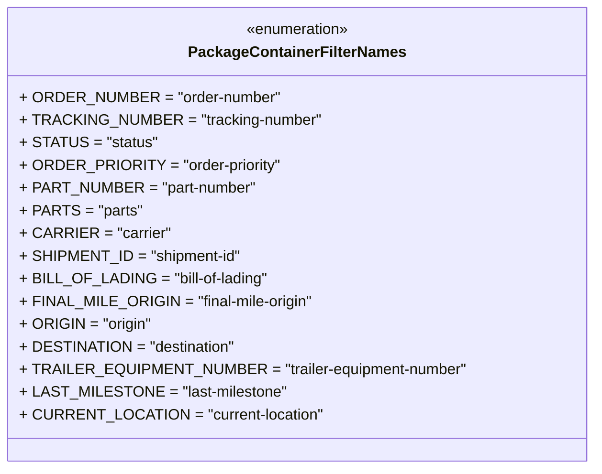

# Diagram: partview_service/partview_service/core/business/package_container_filter_list/package_container_filter_names.py

> Auto-generated by Obscura crawlers

## Mermaid

### SVG

<svg id="container" width="602.171875" xmlns="http://www.w3.org/2000/svg" class="classDiagram" height="496" viewBox="0 0 602.171875 496" role="graphics-document document" aria-roledescription="class"><g><defs><marker id="container_class-aggregationStart" class="marker aggregation class" refX="18" refY="7" markerWidth="190" markerHeight="240" orient="auto"><path d="M 18,7 L9,13 L1,7 L9,1 Z"></path></marker></defs><defs><marker id="container_class-aggregationEnd" class="marker aggregation class" refX="1" refY="7" markerWidth="20" markerHeight="28" orient="auto"><path d="M 18,7 L9,13 L1,7 L9,1 Z"></path></marker></defs><defs><marker id="container_class-extensionStart" class="marker extension class" refX="18" refY="7" markerWidth="190" markerHeight="240" orient="auto"><path d="M 1,7 L18,13 V 1 Z"></path></marker></defs><defs><marker id="container_class-extensionEnd" class="marker extension class" refX="1" refY="7" markerWidth="20" markerHeight="28" orient="auto"><path d="M 1,1 V 13 L18,7 Z"></path></marker></defs><defs><marker id="container_class-compositionStart" class="marker composition class" refX="18" refY="7" markerWidth="190" markerHeight="240" orient="auto"><path d="M 18,7 L9,13 L1,7 L9,1 Z"></path></marker></defs><defs><marker id="container_class-compositionEnd" class="marker composition class" refX="1" refY="7" markerWidth="20" markerHeight="28" orient="auto"><path d="M 18,7 L9,13 L1,7 L9,1 Z"></path></marker></defs><defs><marker id="container_class-dependencyStart" class="marker dependency class" refX="6" refY="7" markerWidth="190" markerHeight="240" orient="auto"><path d="M 5,7 L9,13 L1,7 L9,1 Z"></path></marker></defs><defs><marker id="container_class-dependencyEnd" class="marker dependency class" refX="13" refY="7" markerWidth="20" markerHeight="28" orient="auto"><path d="M 18,7 L9,13 L14,7 L9,1 Z"></path></marker></defs><defs><marker id="container_class-lollipopStart" class="marker lollipop class" refX="13" refY="7" markerWidth="190" markerHeight="240" orient="auto"><circle stroke="black" fill="transparent" cx="7" cy="7" r="6"></circle></marker></defs><defs><marker id="container_class-lollipopEnd" class="marker lollipop class" refX="1" refY="7" markerWidth="190" markerHeight="240" orient="auto"><circle stroke="black" fill="transparent" cx="7" cy="7" r="6"></circle></marker></defs><g class="root"><g class="clusters"></g><g class="edgePaths"></g><g class="edgeLabels"></g><g class="nodes"><g class="node default" id="classId-PackageContainerFilterNames-0" transform="translate(301.0859375, 248)"><g class="basic label-container"><path d="M-293.0859375 -240 L293.0859375 -240 L293.0859375 240 L-293.0859375 240" stroke="none" stroke-width="0" fill="#ECECFF" style=""></path><path d="M-293.0859375 -240 C-120.93026005527102 -240, 51.22541738945796 -240, 293.0859375 -240 M-293.0859375 -240 C-67.21514120792239 -240, 158.65565508415523 -240, 293.0859375 -240 M293.0859375 -240 C293.0859375 -95.02180645055043, 293.0859375 49.95638709889914, 293.0859375 240 M293.0859375 -240 C293.0859375 -73.80561374673283, 293.0859375 92.38877250653434, 293.0859375 240 M293.0859375 240 C86.36240920522286 240, -120.36111908955428 240, -293.0859375 240 M293.0859375 240 C62.66546107706051 240, -167.75501534587897 240, -293.0859375 240 M-293.0859375 240 C-293.0859375 120.34065344619637, -293.0859375 0.6813068923927403, -293.0859375 -240 M-293.0859375 240 C-293.0859375 65.61175926621007, -293.0859375 -108.77648146757986, -293.0859375 -240" stroke="#9370DB" stroke-width="1.3" fill="none" stroke-dasharray="0 0" style=""></path></g><g class="annotation-group text" transform="translate(-55.5546875, -216)"><g class="label" style="" transform="translate(0,-12)"><foreignObject width="111.109375" height="24">

«enumeration»

</foreignObject></g></g><g class="label-group text" transform="translate(-109.046875, -192)"><g class="label" style="font-weight: bolder" transform="translate(0,-12)"><foreignObject width="218.09375" height="24">

PackageContainerFilterNames

</foreignObject></g></g><g class="members-group text" transform="translate(-281.0859375, -144)"><g class="label" style="" transform="translate(0,-12)"><foreignObject width="263.15625" height="24">

+ ORDER_NUMBER = "order-number"

</foreignObject></g><g class="label" style="" transform="translate(0,12)"><foreignObject width="304.28125" height="24">

+ TRACKING_NUMBER = "tracking-number"

</foreignObject></g><g class="label" style="" transform="translate(0,36)"><foreignObject width="137.15625" height="24">

+ STATUS = "status"

</foreignObject></g><g class="label" style="" transform="translate(0,60)"><foreignObject width="264.390625" height="24">

+ ORDER_PRIORITY = "order-priority"

</foreignObject></g><g class="label" style="" transform="translate(0,84)"><foreignObject width="238.75" height="24">

+ PART_NUMBER = "part-number"

</foreignObject></g><g class="label" style="" transform="translate(0,108)"><foreignObject width="122.25" height="24">

+ PARTS = "parts"

</foreignObject></g><g class="label" style="" transform="translate(0,132)"><foreignObject width="149.78125" height="24">

+ CARRIER = "carrier"

</foreignObject></g><g class="label" style="" transform="translate(0,156)"><foreignObject width="225.546875" height="24">

+ SHIPMENT_ID = "shipment-id"

</foreignObject></g><g class="label" style="" transform="translate(0,180)"><foreignObject width="253.96875" height="24">

+ BILL_OF_LADING = "bill-of-lading"

</foreignObject></g><g class="label" style="" transform="translate(0,204)"><foreignObject width="301.203125" height="24">

+ FINAL_MILE_ORIGIN = "final-mile-origin"

</foreignObject></g><g class="label" style="" transform="translate(0,228)"><foreignObject width="134.609375" height="24">

+ ORIGIN = "origin"

</foreignObject></g><g class="label" style="" transform="translate(0,252)"><foreignObject width="218.640625" height="24">

+ DESTINATION = "destination"

</foreignObject></g><g class="label" style="" transform="translate(0,276)"><foreignObject width="453.125" height="24">

+ TRAILER_EQUIPMENT_NUMBER = "trailer-equipment-number"

</foreignObject></g><g class="label" style="" transform="translate(0,300)"><foreignObject width="267" height="24">

+ LAST_MILESTONE = "last-milestone"

</foreignObject></g><g class="label" style="" transform="translate(0,324)"><foreignObject width="303.34375" height="24">

+ CURRENT_LOCATION = "current-location"

</foreignObject></g></g><g class="methods-group text" transform="translate(-281.0859375, 240)"></g><g class="divider" style=""><path d="M-293.0859375 -168 C-173.26267826788686 -168, -53.43941903577371 -168, 293.0859375 -168 M-293.0859375 -168 C-100.7444456990473 -168, 91.59704610190539 -168, 293.0859375 -168" stroke="#9370DB" stroke-width="1.3" fill="none" stroke-dasharray="0 0" style=""></path></g><g class="divider" style=""><path d="M-293.0859375 216 C-149.49601365983412 216, -5.906089819668239 216, 293.0859375 216 M-293.0859375 216 C-147.6247691705254 216, -2.1636008410508225 216, 293.0859375 216" stroke="#9370DB" stroke-width="1.3" fill="none" stroke-dasharray="0 0" style=""></path></g></g></g></g></g></svg>
