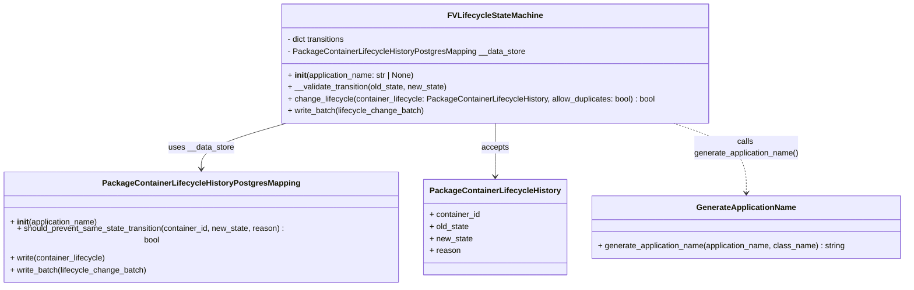

# Diagram: partview_service/partview_service/core/business/package_container_lifecycle_state/FVLifecycleStateMachine.py


> Auto-generated by Obscura crawlers

## Diagram 1

```mermaid
stateDiagram
    [*] --> "Created/Packaged"
    [*] --> "Available for Pickup"
    [*] --> "In Route"
    [*] --> "Delivered"

    "Created/Packaged" --> "In Route"
    "Created/Packaged" --> "Available for Pickup"
    "Created/Packaged" --> "Delivered"
    "Created/Packaged" --> "Delayed"

    "Available for Pickup" --> "In Route"
    "Available for Pickup" --> "Delivered"
    "Available for Pickup" --> "Delayed"

    "In Route" --> "Delivered"
    "In Route" --> "Delayed"
    "In Route" --> "Available for Pickup"

    "Delayed" --> "In Route"
    "Delayed" --> "Delivered"
    "Delayed" --> "Available for Pickup"

    "Delivered" --> "In Route"
    "Delivered" --> "Delayed"
```

> SVG rendering failed for this diagram.

## Diagram 2



### SVG

<svg id="container" width="1799.6875" xmlns="http://www.w3.org/2000/svg" class="classDiagram" height="552" viewBox="0 0 1799.6875 552" role="graphics-document document" aria-roledescription="class"><style>#container{font-family:"trebuchet ms",verdana,arial,sans-serif;font-size:16px;fill:#333;}@keyframes edge-animation-frame{from{stroke-dashoffset:0;}}@keyframes dash{to{stroke-dashoffset:0;}}#container .edge-animation-slow{stroke-dasharray:9,5!important;stroke-dashoffset:900;animation:dash 50s linear infinite;stroke-linecap:round;}#container .edge-animation-fast{stroke-dasharray:9,5!important;stroke-dashoffset:900;animation:dash 20s linear infinite;stroke-linecap:round;}#container .error-icon{fill:#552222;}#container .error-text{fill:#552222;stroke:#552222;}#container .edge-thickness-normal{stroke-width:1px;}#container .edge-thickness-thick{stroke-width:3.5px;}#container .edge-pattern-solid{stroke-dasharray:0;}#container .edge-thickness-invisible{stroke-width:0;fill:none;}#container .edge-pattern-dashed{stroke-dasharray:3;}#container .edge-pattern-dotted{stroke-dasharray:2;}#container .marker{fill:#333333;stroke:#333333;}#container .marker.cross{stroke:#333333;}#container svg{font-family:"trebuchet ms",verdana,arial,sans-serif;font-size:16px;}#container p{margin:0;}#container g.classGroup text{fill:#9370DB;stroke:none;font-family:"trebuchet ms",verdana,arial,sans-serif;font-size:10px;}#container g.classGroup text .title{font-weight:bolder;}#container .nodeLabel,#container .edgeLabel{color:#131300;}#container .edgeLabel .label rect{fill:#ECECFF;}#container .label text{fill:#131300;}#container .labelBkg{background:#ECECFF;}#container .edgeLabel .label span{background:#ECECFF;}#container .classTitle{font-weight:bolder;}#container .node rect,#container .node circle,#container .node ellipse,#container .node polygon,#container .node path{fill:#ECECFF;stroke:#9370DB;stroke-width:1px;}#container .divider{stroke:#9370DB;stroke-width:1;}#container g.clickable{cursor:pointer;}#container g.classGroup rect{fill:#ECECFF;stroke:#9370DB;}#container g.classGroup line{stroke:#9370DB;stroke-width:1;}#container .classLabel .box{stroke:none;stroke-width:0;fill:#ECECFF;opacity:0.5;}#container .classLabel .label{fill:#9370DB;font-size:10px;}#container .relation{stroke:#333333;stroke-width:1;fill:none;}#container .dashed-line{stroke-dasharray:3;}#container .dotted-line{stroke-dasharray:1 2;}#container #compositionStart,#container .composition{fill:#333333!important;stroke:#333333!important;stroke-width:1;}#container #compositionEnd,#container .composition{fill:#333333!important;stroke:#333333!important;stroke-width:1;}#container #dependencyStart,#container .dependency{fill:#333333!important;stroke:#333333!important;stroke-width:1;}#container #dependencyStart,#container .dependency{fill:#333333!important;stroke:#333333!important;stroke-width:1;}#container #extensionStart,#container .extension{fill:transparent!important;stroke:#333333!important;stroke-width:1;}#container #extensionEnd,#container .extension{fill:transparent!important;stroke:#333333!important;stroke-width:1;}#container #aggregationStart,#container .aggregation{fill:transparent!important;stroke:#333333!important;stroke-width:1;}#container #aggregationEnd,#container .aggregation{fill:transparent!important;stroke:#333333!important;stroke-width:1;}#container #lollipopStart,#container .lollipop{fill:#ECECFF!important;stroke:#333333!important;stroke-width:1;}#container #lollipopEnd,#container .lollipop{fill:#ECECFF!important;stroke:#333333!important;stroke-width:1;}#container .edgeTerminals{font-size:11px;line-height:initial;}#container .classTitleText{text-anchor:middle;font-size:18px;fill:#333;}#container .label-icon{display:inline-block;height:1em;overflow:visible;vertical-align:-0.125em;}#container .node .label-icon path{fill:currentColor;stroke:revert;stroke-width:revert;}#container :root{--mermaid-font-family:"trebuchet ms",verdana,arial,sans-serif;}</style><g><defs><marker id="container_class-aggregationStart" class="marker aggregation class" refX="18" refY="7" markerWidth="190" markerHeight="240" orient="auto"><path d="M 18,7 L9,13 L1,7 L9,1 Z"></path></marker></defs><defs><marker id="container_class-aggregationEnd" class="marker aggregation class" refX="1" refY="7" markerWidth="20" markerHeight="28" orient="auto"><path d="M 18,7 L9,13 L1,7 L9,1 Z"></path></marker></defs><defs><marker id="container_class-extensionStart" class="marker extension class" refX="18" refY="7" markerWidth="190" markerHeight="240" orient="auto"><path d="M 1,7 L18,13 V 1 Z"></path></marker></defs><defs><marker id="container_class-extensionEnd" class="marker extension class" refX="1" refY="7" markerWidth="20" markerHeight="28" orient="auto"><path d="M 1,1 V 13 L18,7 Z"></path></marker></defs><defs><marker id="container_class-compositionStart" class="marker composition class" refX="18" refY="7" markerWidth="190" markerHeight="240" orient="auto"><path d="M 18,7 L9,13 L1,7 L9,1 Z"></path></marker></defs><defs><marker id="container_class-compositionEnd" class="marker composition class" refX="1" refY="7" markerWidth="20" markerHeight="28" orient="auto"><path d="M 18,7 L9,13 L1,7 L9,1 Z"></path></marker></defs><defs><marker id="container_class-dependencyStart" class="marker dependency class" refX="6" refY="7" markerWidth="190" markerHeight="240" orient="auto"><path d="M 5,7 L9,13 L1,7 L9,1 Z"></path></marker></defs><defs><marker id="container_class-dependencyEnd" class="marker dependency class" refX="13" refY="7" markerWidth="20" markerHeight="28" orient="auto"><path d="M 18,7 L9,13 L14,7 L9,1 Z"></path></marker></defs><defs><marker id="container_class-lollipopStart" class="marker lollipop class" refX="13" refY="7" markerWidth="190" markerHeight="240" orient="auto"><circle stroke="black" fill="transparent" cx="7" cy="7" r="6"></circle></marker></defs><defs><marker id="container_class-lollipopEnd" class="marker lollipop class" refX="1" refY="7" markerWidth="190" markerHeight="240" orient="auto"><circle stroke="black" fill="transparent" cx="7" cy="7" r="6"></circle></marker></defs><g class="root"><g class="clusters"></g><g class="edgePaths"><path d="M571.726,248L543.643,256.167C515.561,264.333,459.396,280.667,431.313,296C403.23,311.333,403.23,325.667,403.23,332.833L403.23,340" id="id_FVLifecycleStateMachine_PackageContainerLifecycleHistoryPostgresMapping_1" class="edge-thickness-normal edge-pattern-solid relation" style=";;;" data-edge="true" data-et="edge" data-id="id_FVLifecycleStateMachine_PackageContainerLifecycleHistoryPostgresMapping_1" data-points="W3sieCI6NTcxLjcyNTczMDM5OTQwODMsInkiOjI0OH0seyJ4Ijo0MDMuMjMwNDY4NzUsInkiOjI5N30seyJ4Ijo0MDMuMjMwNDY4NzUsInkiOjM0Nn1d" marker-end="url(#container_class-dependencyEnd)"></path><path d="M984.367,248L984.367,256.167C984.367,264.333,984.367,280.667,984.367,296.5C984.367,312.333,984.367,327.667,984.367,335.333L984.367,343" id="id_FVLifecycleStateMachine_PackageContainerLifecycleHistory_2" class="edge-thickness-normal edge-pattern-solid relation" style=";;;" data-edge="true" data-et="edge" data-id="id_FVLifecycleStateMachine_PackageContainerLifecycleHistory_2" data-points="W3sieCI6OTg0LjM2NzE4NzUsInkiOjI0OH0seyJ4Ijo5ODQuMzY3MTg3NSwieSI6Mjk3fSx7IngiOjk4NC4zNjcxODc1LCJ5IjozNDl9XQ==" marker-end="url(#container_class-dependencyEnd)"></path><path d="M1336.992,248L1360.99,256.167C1384.988,264.333,1432.984,280.667,1456.982,302C1480.98,323.333,1480.98,349.667,1480.98,362.833L1480.98,376" id="id_FVLifecycleStateMachine_GenerateApplicationName_3" class="edge-thickness-normal edge-pattern-dashed relation" style=";;;" data-edge="true" data-et="edge" data-id="id_FVLifecycleStateMachine_GenerateApplicationName_3" data-points="W3sieCI6MTMzNi45OTIwMDI1ODg3NTczLCJ5IjoyNDh9LHsieCI6MTQ4MC45ODA0Njg3NSwieSI6Mjk3fSx7IngiOjE0ODAuOTgwNDY4NzUsInkiOjM4Mn1d" marker-end="url(#container_class-dependencyEnd)"></path></g><g class="edgeLabels"><g class="edgeLabel" transform="translate(403.23046875, 297)"><g class="label" data-id="id_FVLifecycleStateMachine_PackageContainerLifecycleHistoryPostgresMapping_1" transform="translate(-65.5546875, -12)"><foreignObject width="131.109375" height="24"><div xmlns="http://www.w3.org/1999/xhtml" class="labelBkg" style="display: table-cell; white-space: nowrap; line-height: 1.5; max-width: 200px; text-align: center;"><span class="edgeLabel"><p>uses __data_store</p></span></div></foreignObject></g></g><g class="edgeLabel" transform="translate(984.3671875, 297)"><g class="label" data-id="id_FVLifecycleStateMachine_PackageContainerLifecycleHistory_2" transform="translate(-27.421875, -12)"><foreignObject width="54.84375" height="24"><div xmlns="http://www.w3.org/1999/xhtml" class="labelBkg" style="display: table-cell; white-space: nowrap; line-height: 1.5; max-width: 200px; text-align: center;"><span class="edgeLabel"><p>accepts</p></span></div></foreignObject></g></g><g class="edgeLabel" transform="translate(1480.98046875, 297)"><g class="label" data-id="id_FVLifecycleStateMachine_GenerateApplicationName_3" transform="translate(-106.2265625, -24)"><foreignObject width="212.453125" height="48"><div xmlns="http://www.w3.org/1999/xhtml" class="labelBkg" style="display: table; white-space: break-spaces; line-height: 1.5; max-width: 200px; text-align: center; width: 200px;"><span class="edgeLabel"><p>calls generate_application_name()</p></span></div></foreignObject></g></g></g><g class="nodes"><g class="node default" id="classId-FVLifecycleStateMachine-0" transform="translate(984.3671875, 128)"><g class="basic label-container"><path d="M-429.21875 -120 L429.21875 -120 L429.21875 120 L-429.21875 120" stroke="none" stroke-width="0" fill="#ECECFF" style=""></path><path d="M-429.21875 -120 C-205.2143224033705 -120, 18.790105193259024 -120, 429.21875 -120 M-429.21875 -120 C-163.14804531480917 -120, 102.92265937038167 -120, 429.21875 -120 M429.21875 -120 C429.21875 -25.994903071813894, 429.21875 68.01019385637221, 429.21875 120 M429.21875 -120 C429.21875 -69.32382400085135, 429.21875 -18.647648001702706, 429.21875 120 M429.21875 120 C160.55362766216507 120, -108.11149467566986 120, -429.21875 120 M429.21875 120 C197.77659779960106 120, -33.66555440079787 120, -429.21875 120 M-429.21875 120 C-429.21875 32.45905784476025, -429.21875 -55.081884310479495, -429.21875 -120 M-429.21875 120 C-429.21875 70.03987492080789, -429.21875 20.07974984161578, -429.21875 -120" stroke="#9370DB" stroke-width="1.3" fill="none" stroke-dasharray="0 0" style=""></path></g><g class="annotation-group text" transform="translate(0, -96)"></g><g class="label-group text" transform="translate(-90.21875, -96)"><g class="label" style="font-weight: bolder" transform="translate(0,-12)"><foreignObject width="180.4375" height="24"><div xmlns="http://www.w3.org/1999/xhtml" style="display: table-cell; white-space: nowrap; line-height: 1.5; max-width: 228px; text-align: center;"><span class="nodeLabel markdown-node-label" style=""><p>FVLifecycleStateMachine</p></span></div></foreignObject></g></g><g class="members-group text" transform="translate(-417.21875, -48)"><g class="label" style="" transform="translate(0,-12)"><foreignObject width="120.375" height="24"><div xmlns="http://www.w3.org/1999/xhtml" style="display: table-cell; white-space: nowrap; line-height: 1.5; max-width: 178px; text-align: center;"><span class="nodeLabel markdown-node-label" style=""><p>- dict transitions</p></span></div></foreignObject></g><g class="label" style="" transform="translate(0,12)"><foreignObject width="475.75" height="24"><div xmlns="http://www.w3.org/1999/xhtml" style="display: table-cell; white-space: nowrap; line-height: 1.5; max-width: 533px; text-align: center;"><span class="nodeLabel markdown-node-label" style=""><p>- PackageContainerLifecycleHistoryPostgresMapping __data_store</p></span></div></foreignObject></g></g><g class="methods-group text" transform="translate(-417.21875, 24)"><g class="label" style="" transform="translate(0,-12)"><foreignObject width="258.796875" height="24"><div xmlns="http://www.w3.org/1999/xhtml" style="display: table-cell; white-space: nowrap; line-height: 1.5; max-width: 349px; text-align: center;"><span class="nodeLabel markdown-node-label" style=""><p>+ <strong>init</strong>(application_name: str | None)</p></span></div></foreignObject></g><g class="label" style="" transform="translate(0,12)"><foreignObject width="324.15625" height="24"><div xmlns="http://www.w3.org/1999/xhtml" style="display: table-cell; white-space: nowrap; line-height: 1.5; max-width: 382px; text-align: center;"><span class="nodeLabel markdown-node-label" style=""><p>+ __validate_transition(old_state, new_state)</p></span></div></foreignObject></g><g class="label" style="" transform="translate(0,36)"><foreignObject width="744.21875" height="24"><div xmlns="http://www.w3.org/1999/xhtml" style="display: table-cell; white-space: nowrap; line-height: 1.5; max-width: 802px; text-align: center;"><span class="nodeLabel markdown-node-label" style=""><p>+ change_lifecycle(container_lifecycle: PackageContainerLifecycleHistory, allow_duplicates: bool) : bool</p></span></div></foreignObject></g><g class="label" style="" transform="translate(0,60)"><foreignObject width="275.359375" height="24"><div xmlns="http://www.w3.org/1999/xhtml" style="display: table-cell; white-space: nowrap; line-height: 1.5; max-width: 333px; text-align: center;"><span class="nodeLabel markdown-node-label" style=""><p>+ write_batch(lifecycle_change_batch)</p></span></div></foreignObject></g></g><g class="divider" style=""><path d="M-429.21875 -72 C-191.2863148095745 -72, 46.646120380851016 -72, 429.21875 -72 M-429.21875 -72 C-140.9259143648785 -72, 147.36692127024298 -72, 429.21875 -72" stroke="#9370DB" stroke-width="1.3" fill="none" stroke-dasharray="0 0" style=""></path></g><g class="divider" style=""><path d="M-429.21875 0 C-200.43665457277305 0, 28.345440854453898 0, 429.21875 0 M-429.21875 0 C-137.81029419718737 0, 153.59816160562525 0, 429.21875 0" stroke="#9370DB" stroke-width="1.3" fill="none" stroke-dasharray="0 0" style=""></path></g></g><g class="node default" id="classId-PackageContainerLifecycleHistoryPostgresMapping-1" transform="translate(403.23046875, 445)"><g class="basic label-container"><path d="M-395.23046875 -99 L395.23046875 -99 L395.23046875 99 L-395.23046875 99" stroke="none" stroke-width="0" fill="#ECECFF" style=""></path><path d="M-395.23046875 -99 C-149.29171094913247 -99, 96.64704685173507 -99, 395.23046875 -99 M-395.23046875 -99 C-216.43022060859104 -99, -37.629972467182085 -99, 395.23046875 -99 M395.23046875 -99 C395.23046875 -46.52763335016391, 395.23046875 5.94473329967218, 395.23046875 99 M395.23046875 -99 C395.23046875 -32.444056912964015, 395.23046875 34.11188617407197, 395.23046875 99 M395.23046875 99 C177.56096975167895 99, -40.10852924664209 99, -395.23046875 99 M395.23046875 99 C87.52844742338607 99, -220.17357390322786 99, -395.23046875 99 M-395.23046875 99 C-395.23046875 54.119209930891934, -395.23046875 9.238419861783868, -395.23046875 -99 M-395.23046875 99 C-395.23046875 38.43019958757131, -395.23046875 -22.139600824857382, -395.23046875 -99" stroke="#9370DB" stroke-width="1.3" fill="none" stroke-dasharray="0 0" style=""></path></g><g class="annotation-group text" transform="translate(0, -75)"></g><g class="label-group text" transform="translate(-187.1328125, -75)"><g class="label" style="font-weight: bolder" transform="translate(0,-12)"><foreignObject width="374.265625" height="24"><div xmlns="http://www.w3.org/1999/xhtml" style="display: table-cell; white-space: nowrap; line-height: 1.5; max-width: 418px; text-align: center;"><span class="nodeLabel markdown-node-label" style=""><p>PackageContainerLifecycleHistoryPostgresMapping</p></span></div></foreignObject></g></g><g class="members-group text" transform="translate(-383.23046875, -27)"></g><g class="methods-group text" transform="translate(-383.23046875, 3)"><g class="label" style="" transform="translate(0,-12)"><foreignObject width="177.984375" height="24"><div xmlns="http://www.w3.org/1999/xhtml" style="display: table-cell; white-space: nowrap; line-height: 1.5; max-width: 268px; text-align: center;"><span class="nodeLabel markdown-node-label" style=""><p>+ <strong>init</strong>(application_name)</p></span></div></foreignObject></g><g class="label" style="" transform="translate(0,12)"><foreignObject width="579.328125" height="24"><div xmlns="http://www.w3.org/1999/xhtml" style="display: table-cell; white-space: nowrap; line-height: 1.5; max-width: 637px; text-align: center;"><span class="nodeLabel markdown-node-label" style=""><p>+ should_prevent_same_state_transition(container_id, new_state, reason) : bool</p></span></div></foreignObject></g><g class="label" style="" transform="translate(0,36)"><foreignObject width="194.640625" height="24"><div xmlns="http://www.w3.org/1999/xhtml" style="display: table-cell; white-space: nowrap; line-height: 1.5; max-width: 252px; text-align: center;"><span class="nodeLabel markdown-node-label" style=""><p>+ write(container_lifecycle)</p></span></div></foreignObject></g><g class="label" style="" transform="translate(0,60)"><foreignObject width="275.359375" height="24"><div xmlns="http://www.w3.org/1999/xhtml" style="display: table-cell; white-space: nowrap; line-height: 1.5; max-width: 333px; text-align: center;"><span class="nodeLabel markdown-node-label" style=""><p>+ write_batch(lifecycle_change_batch)</p></span></div></foreignObject></g></g><g class="divider" style=""><path d="M-395.23046875 -51 C-110.35277634680438 -51, 174.52491605639125 -51, 395.23046875 -51 M-395.23046875 -51 C-151.41207032924515 -51, 92.40632809150969 -51, 395.23046875 -51" stroke="#9370DB" stroke-width="1.3" fill="none" stroke-dasharray="0 0" style=""></path></g><g class="divider" style=""><path d="M-395.23046875 -27 C-136.4655628475585 -27, 122.29934305488302 -27, 395.23046875 -27 M-395.23046875 -27 C-197.1284749705349 -27, 0.9735188089301801 -27, 395.23046875 -27" stroke="#9370DB" stroke-width="1.3" fill="none" stroke-dasharray="0 0" style=""></path></g></g><g class="node default" id="classId-PackageContainerLifecycleHistory-2" transform="translate(984.3671875, 445)"><g class="basic label-container"><path d="M-135.90625 -96 L135.90625 -96 L135.90625 96 L-135.90625 96" stroke="none" stroke-width="0" fill="#ECECFF" style=""></path><path d="M-135.90625 -96 C-34.09847930432613 -96, 67.70929139134773 -96, 135.90625 -96 M-135.90625 -96 C-53.95941799591617 -96, 27.98741400816766 -96, 135.90625 -96 M135.90625 -96 C135.90625 -21.527202404449753, 135.90625 52.945595191100495, 135.90625 96 M135.90625 -96 C135.90625 -34.84843861565204, 135.90625 26.303122768695914, 135.90625 96 M135.90625 96 C78.51902680603618 96, 21.131803612072346 96, -135.90625 96 M135.90625 96 C49.12718689919838 96, -37.651876201603244 96, -135.90625 96 M-135.90625 96 C-135.90625 33.95260202323774, -135.90625 -28.094795953524525, -135.90625 -96 M-135.90625 96 C-135.90625 42.03840644691841, -135.90625 -11.923187106163184, -135.90625 -96" stroke="#9370DB" stroke-width="1.3" fill="none" stroke-dasharray="0 0" style=""></path></g><g class="annotation-group text" transform="translate(0, -72)"></g><g class="label-group text" transform="translate(-123.90625, -72)"><g class="label" style="font-weight: bolder" transform="translate(0,-12)"><foreignObject width="247.8125" height="24"><div xmlns="http://www.w3.org/1999/xhtml" style="display: table-cell; white-space: nowrap; line-height: 1.5; max-width: 293px; text-align: center;"><span class="nodeLabel markdown-node-label" style=""><p>PackageContainerLifecycleHistory</p></span></div></foreignObject></g></g><g class="members-group text" transform="translate(-123.90625, -24)"><g class="label" style="" transform="translate(0,-12)"><foreignObject width="102.546875" height="24"><div xmlns="http://www.w3.org/1999/xhtml" style="display: table-cell; white-space: nowrap; line-height: 1.5; max-width: 160px; text-align: center;"><span class="nodeLabel markdown-node-label" style=""><p>+ container_id</p></span></div></foreignObject></g><g class="label" style="" transform="translate(0,12)"><foreignObject width="80.171875" height="24"><div xmlns="http://www.w3.org/1999/xhtml" style="display: table-cell; white-space: nowrap; line-height: 1.5; max-width: 138px; text-align: center;"><span class="nodeLabel markdown-node-label" style=""><p>+ old_state</p></span></div></foreignObject></g><g class="label" style="" transform="translate(0,36)"><foreignObject width="85.890625" height="24"><div xmlns="http://www.w3.org/1999/xhtml" style="display: table-cell; white-space: nowrap; line-height: 1.5; max-width: 143px; text-align: center;"><span class="nodeLabel markdown-node-label" style=""><p>+ new_state</p></span></div></foreignObject></g><g class="label" style="" transform="translate(0,60)"><foreignObject width="61.21875" height="24"><div xmlns="http://www.w3.org/1999/xhtml" style="display: table-cell; white-space: nowrap; line-height: 1.5; max-width: 119px; text-align: center;"><span class="nodeLabel markdown-node-label" style=""><p>+ reason</p></span></div></foreignObject></g></g><g class="methods-group text" transform="translate(-123.90625, 96)"></g><g class="divider" style=""><path d="M-135.90625 -48 C-62.07492873330935 -48, 11.756392533381302 -48, 135.90625 -48 M-135.90625 -48 C-77.61005494348431 -48, -19.31385988696863 -48, 135.90625 -48" stroke="#9370DB" stroke-width="1.3" fill="none" stroke-dasharray="0 0" style=""></path></g><g class="divider" style=""><path d="M-135.90625 72 C-35.108865365531656 72, 65.68851926893669 72, 135.90625 72 M-135.90625 72 C-74.85957657037366 72, -13.812903140747324 72, 135.90625 72" stroke="#9370DB" stroke-width="1.3" fill="none" stroke-dasharray="0 0" style=""></path></g></g><g class="node default" id="classId-GenerateApplicationName-3" transform="translate(1480.98046875, 445)"><g class="basic label-container"><path d="M-310.70703125 -63 L310.70703125 -63 L310.70703125 63 L-310.70703125 63" stroke="none" stroke-width="0" fill="#ECECFF" style=""></path><path d="M-310.70703125 -63 C-119.54789228497461 -63, 71.61124668005078 -63, 310.70703125 -63 M-310.70703125 -63 C-155.83818440215148 -63, -0.9693375543029674 -63, 310.70703125 -63 M310.70703125 -63 C310.70703125 -36.792057654021534, 310.70703125 -10.584115308043074, 310.70703125 63 M310.70703125 -63 C310.70703125 -22.042372173826273, 310.70703125 18.915255652347454, 310.70703125 63 M310.70703125 63 C151.7979167579761 63, -7.111197734047778 63, -310.70703125 63 M310.70703125 63 C171.78019572737318 63, 32.853360204746366 63, -310.70703125 63 M-310.70703125 63 C-310.70703125 13.116999670821244, -310.70703125 -36.76600065835751, -310.70703125 -63 M-310.70703125 63 C-310.70703125 17.95379986477831, -310.70703125 -27.092400270443378, -310.70703125 -63" stroke="#9370DB" stroke-width="1.3" fill="none" stroke-dasharray="0 0" style=""></path></g><g class="annotation-group text" transform="translate(0, -39)"></g><g class="label-group text" transform="translate(-95.8203125, -39)"><g class="label" style="font-weight: bolder" transform="translate(0,-12)"><foreignObject width="191.640625" height="24"><div xmlns="http://www.w3.org/1999/xhtml" style="display: table-cell; white-space: nowrap; line-height: 1.5; max-width: 240px; text-align: center;"><span class="nodeLabel markdown-node-label" style=""><p>GenerateApplicationName</p></span></div></foreignObject></g></g><g class="members-group text" transform="translate(-298.70703125, 9)"></g><g class="methods-group text" transform="translate(-298.70703125, 39)"><g class="label" style="" transform="translate(0,-12)"><foreignObject width="501.59375" height="24"><div xmlns="http://www.w3.org/1999/xhtml" style="display: table-cell; white-space: nowrap; line-height: 1.5; max-width: 560px; text-align: center;"><span class="nodeLabel markdown-node-label" style=""><p>+ generate_application_name(application_name, class_name) : string</p></span></div></foreignObject></g></g><g class="divider" style=""><path d="M-310.70703125 -15 C-100.1586357557922 -15, 110.38975973841559 -15, 310.70703125 -15 M-310.70703125 -15 C-135.03564586930753 -15, 40.63573951138494 -15, 310.70703125 -15" stroke="#9370DB" stroke-width="1.3" fill="none" stroke-dasharray="0 0" style=""></path></g><g class="divider" style=""><path d="M-310.70703125 9 C-174.27812560870058 9, -37.849219967401154 9, 310.70703125 9 M-310.70703125 9 C-180.53683727667442 9, -50.36664330334884 9, 310.70703125 9" stroke="#9370DB" stroke-width="1.3" fill="none" stroke-dasharray="0 0" style=""></path></g></g></g></g></g></svg>
