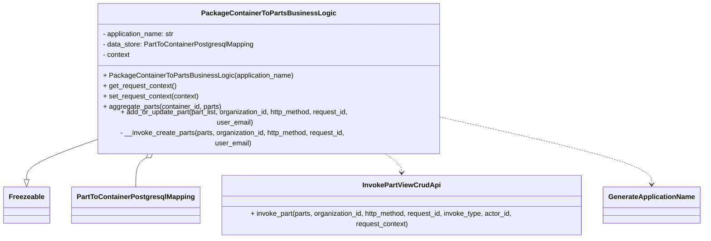
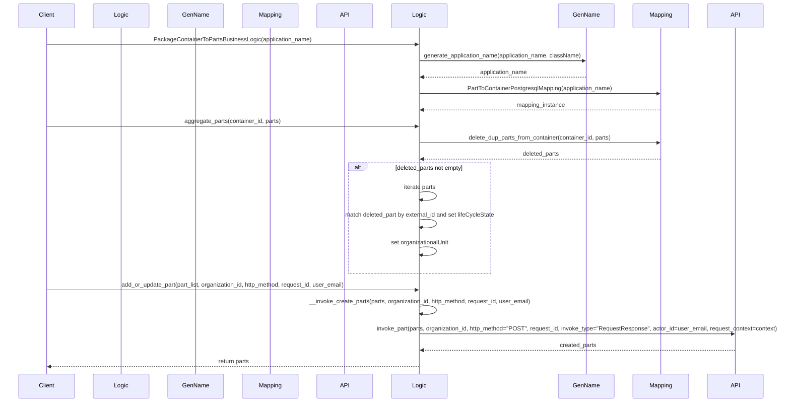

# Diagram: partview_service/partview_service/core/business/part/PackageContainerToPartsBusinessLogic.py

> Auto-generated by Obscura crawlers

## Diagram 1

### SVG

<svg id="container" width="1618.84375" xmlns="http://www.w3.org/2000/svg" class="classDiagram" height="504" viewBox="0 0 1618.84375 504" role="graphics-document document" aria-roledescription="class"><g><defs><marker id="container_class-aggregationStart" class="marker aggregation class" refX="18" refY="7" markerWidth="190" markerHeight="240" orient="auto"><path d="M 18,7 L9,13 L1,7 L9,1 Z"></path></marker></defs><defs><marker id="container_class-aggregationEnd" class="marker aggregation class" refX="1" refY="7" markerWidth="20" markerHeight="28" orient="auto"><path d="M 18,7 L9,13 L1,7 L9,1 Z"></path></marker></defs><defs><marker id="container_class-extensionStart" class="marker extension class" refX="18" refY="7" markerWidth="190" markerHeight="240" orient="auto"><path d="M 1,7 L18,13 V 1 Z"></path></marker></defs><defs><marker id="container_class-extensionEnd" class="marker extension class" refX="1" refY="7" markerWidth="20" markerHeight="28" orient="auto"><path d="M 1,1 V 13 L18,7 Z"></path></marker></defs><defs><marker id="container_class-compositionStart" class="marker composition class" refX="18" refY="7" markerWidth="190" markerHeight="240" orient="auto"><path d="M 18,7 L9,13 L1,7 L9,1 Z"></path></marker></defs><defs><marker id="container_class-compositionEnd" class="marker composition class" refX="1" refY="7" markerWidth="20" markerHeight="28" orient="auto"><path d="M 18,7 L9,13 L1,7 L9,1 Z"></path></marker></defs><defs><marker id="container_class-dependencyStart" class="marker dependency class" refX="6" refY="7" markerWidth="190" markerHeight="240" orient="auto"><path d="M 5,7 L9,13 L1,7 L9,1 Z"></path></marker></defs><defs><marker id="container_class-dependencyEnd" class="marker dependency class" refX="13" refY="7" markerWidth="20" markerHeight="28" orient="auto"><path d="M 18,7 L9,13 L14,7 L9,1 Z"></path></marker></defs><defs><marker id="container_class-lollipopStart" class="marker lollipop class" refX="13" refY="7" markerWidth="190" markerHeight="240" orient="auto"><circle stroke="black" fill="transparent" cx="7" cy="7" r="6"></circle></marker></defs><defs><marker id="container_class-lollipopEnd" class="marker lollipop class" refX="1" refY="7" markerWidth="190" markerHeight="240" orient="auto"><circle stroke="black" fill="transparent" cx="7" cy="7" r="6"></circle></marker></defs><g class="root"><g class="clusters"></g><g class="edgePaths"><path d="M212.992,294.526L187.359,302.938C161.727,311.351,110.461,328.175,84.828,341.379C59.195,354.583,59.195,364.167,59.195,368.958L59.195,373.75" id="id_PackageContainerToPartsBusinessLogic_Freezeable_1" class="edge-thickness-normal edge-pattern-solid relation" style=";;;" data-edge="true" data-et="edge" data-id="id_PackageContainerToPartsBusinessLogic_Freezeable_1" data-points="W3sieCI6MjEyLjk5MjE4NzUsInkiOjI5NC41MjU5MzcwNDg0NzQzNn0seyJ4Ijo1OS4xOTUzMTI1LCJ5IjozNDV9LHsieCI6NTkuMTk1MzEyNSwieSI6MzkxfV0=" marker-end="url(#container_class-extensionEnd)"></path><path d="M329.766,328.725L325.139,331.437C320.513,334.15,311.26,339.575,306.634,349.954C302.008,360.333,302.008,375.667,302.008,383.333L302.008,391" id="id_PackageContainerToPartsBusinessLogic_PartToContainerPostgresqlMapping_2" class="edge-thickness-normal edge-pattern-solid relation" style=";;;" data-edge="true" data-et="edge" data-id="id_PackageContainerToPartsBusinessLogic_PartToContainerPostgresqlMapping_2" data-points="W3sieCI6MzQ0LjY0NjM2NTY3Njc5NTYsInkiOjMyMH0seyJ4IjozMDIuMDA3ODEyNSwieSI6MzQ1fSx7IngiOjMwMi4wMDc4MTI1LCJ5IjozOTF9XQ==" marker-start="url(#container_class-aggregationStart)"></path><path d="M876.776,320L883.882,324.167C890.988,328.333,905.201,336.667,912.308,344C919.414,351.333,919.414,357.667,919.414,360.833L919.414,364" id="id_PackageContainerToPartsBusinessLogic_InvokePartViewCrudApi_3" class="edge-thickness-normal edge-pattern-dashed relation" style=";;;" data-edge="true" data-et="edge" data-id="id_PackageContainerToPartsBusinessLogic_InvokePartViewCrudApi_3" data-points="W3sieCI6ODc2Ljc3NTUwOTMyMzIwNDUsInkiOjMyMH0seyJ4Ijo5MTkuNDE0MDYyNSwieSI6MzQ1fSx7IngiOjkxOS40MTQwNjI1LCJ5IjozNzB9XQ==" marker-end="url(#container_class-dependencyEnd)"></path><path d="M1008.43,244.675L1090.862,261.396C1173.294,278.117,1338.159,311.558,1420.591,334.946C1503.023,358.333,1503.023,371.667,1503.023,378.333L1503.023,385" id="id_PackageContainerToPartsBusinessLogic_GenerateApplicationName_4" class="edge-thickness-normal edge-pattern-dashed relation" style=";;;" data-edge="true" data-et="edge" data-id="id_PackageContainerToPartsBusinessLogic_GenerateApplicationName_4" data-points="W3sieCI6MTAwOC40Mjk2ODc1LCJ5IjoyNDQuNjc0NzU2NjAxNTI2OTV9LHsieCI6MTUwMy4wMjM0Mzc1LCJ5IjozNDV9LHsieCI6MTUwMy4wMjM0Mzc1LCJ5IjozOTF9XQ==" marker-end="url(#container_class-dependencyEnd)"></path></g><g class="edgeLabels"><g class="edgeLabel"><g class="label" data-id="id_PackageContainerToPartsBusinessLogic_Freezeable_1" transform="translate(0, 0)"><foreignObject width="0" height="0">

</foreignObject></g></g><g class="edgeLabel"><g class="label" data-id="id_PackageContainerToPartsBusinessLogic_PartToContainerPostgresqlMapping_2" transform="translate(0, 0)"><foreignObject width="0" height="0">

</foreignObject></g></g><g class="edgeLabel"><g class="label" data-id="id_PackageContainerToPartsBusinessLogic_InvokePartViewCrudApi_3" transform="translate(0, 0)"><foreignObject width="0" height="0">

</foreignObject></g></g><g class="edgeLabel"><g class="label" data-id="id_PackageContainerToPartsBusinessLogic_GenerateApplicationName_4" transform="translate(0, 0)"><foreignObject width="0" height="0">

</foreignObject></g></g></g><g class="nodes"><g class="node default" id="classId-Freezeable-0" transform="translate(59.1953125, 433)"><g class="basic label-container"><path d="M-51.1953125 -42 L51.1953125 -42 L51.1953125 42 L-51.1953125 42" stroke="none" stroke-width="0" fill="#ECECFF" style=""></path><path d="M-51.1953125 -42 C-15.466711582590747 -42, 20.261889334818505 -42, 51.1953125 -42 M-51.1953125 -42 C-23.052856932607423 -42, 5.089598634785155 -42, 51.1953125 -42 M51.1953125 -42 C51.1953125 -13.837982658839664, 51.1953125 14.324034682320672, 51.1953125 42 M51.1953125 -42 C51.1953125 -19.043778980332394, 51.1953125 3.912442039335211, 51.1953125 42 M51.1953125 42 C10.658323257266467 42, -29.878665985467066 42, -51.1953125 42 M51.1953125 42 C17.570501447408063 42, -16.054309605183875 42, -51.1953125 42 M-51.1953125 42 C-51.1953125 8.467629024579715, -51.1953125 -25.06474195084057, -51.1953125 -42 M-51.1953125 42 C-51.1953125 14.061385363371574, -51.1953125 -13.877229273256852, -51.1953125 -42" stroke="#9370DB" stroke-width="1.3" fill="none" stroke-dasharray="0 0" style=""></path></g><g class="annotation-group text" transform="translate(0, -18)"></g><g class="label-group text" transform="translate(-39.1953125, -18)"><g class="label" style="font-weight: bolder" transform="translate(0,-12)"><foreignObject width="78.390625" height="24">

Freezeable

</foreignObject></g></g><g class="members-group text" transform="translate(-39.1953125, 30)"></g><g class="methods-group text" transform="translate(-39.1953125, 60)"></g><g class="divider" style=""><path d="M-51.1953125 6 C-26.895573296168575 6, -2.5958340923371495 6, 51.1953125 6 M-51.1953125 6 C-14.6997497593035 6, 21.795812981393 6, 51.1953125 6" stroke="#9370DB" stroke-width="1.3" fill="none" stroke-dasharray="0 0" style=""></path></g><g class="divider" style=""><path d="M-51.1953125 24 C-18.428098103132477 24, 14.339116293735046 24, 51.1953125 24 M-51.1953125 24 C-12.868332757698603 24, 25.458646984602794 24, 51.1953125 24" stroke="#9370DB" stroke-width="1.3" fill="none" stroke-dasharray="0 0" style=""></path></g></g><g class="node default" id="classId-PackageContainerToPartsBusinessLogic-1" transform="translate(610.7109375, 164)"><g class="basic label-container"><path d="M-397.71875 -156 L397.71875 -156 L397.71875 156 L-397.71875 156" stroke="none" stroke-width="0" fill="#ECECFF" style=""></path><path d="M-397.71875 -156 C-119.91913831302486 -156, 157.88047337395028 -156, 397.71875 -156 M-397.71875 -156 C-122.90573301246621 -156, 151.90728397506757 -156, 397.71875 -156 M397.71875 -156 C397.71875 -55.08842167360356, 397.71875 45.823156652792875, 397.71875 156 M397.71875 -156 C397.71875 -53.42353596722667, 397.71875 49.15292806554666, 397.71875 156 M397.71875 156 C149.03662784874652 156, -99.64549430250696 156, -397.71875 156 M397.71875 156 C218.6808877641971 156, 39.64302552839422 156, -397.71875 156 M-397.71875 156 C-397.71875 64.28281907093466, -397.71875 -27.43436185813067, -397.71875 -156 M-397.71875 156 C-397.71875 53.108514478530324, -397.71875 -49.78297104293935, -397.71875 -156" stroke="#9370DB" stroke-width="1.3" fill="none" stroke-dasharray="0 0" style=""></path></g><g class="annotation-group text" transform="translate(0, -132)"></g><g class="label-group text" transform="translate(-144.34375, -132)"><g class="label" style="font-weight: bolder" transform="translate(0,-12)"><foreignObject width="288.6875" height="24">

PackageContainerToPartsBusinessLogic

</foreignObject></g></g><g class="members-group text" transform="translate(-385.71875, -84)"><g class="label" style="" transform="translate(0,-12)"><foreignObject width="169.140625" height="24">

- application_name: str

</foreignObject></g><g class="label" style="" transform="translate(0,12)"><foreignObject width="350.828125" height="24">

- data_store: PartToContainerPostgresqlMapping

</foreignObject></g><g class="label" style="" transform="translate(0,36)"><foreignObject width="64.390625" height="24">

- context

</foreignObject></g></g><g class="methods-group text" transform="translate(-385.71875, 12)"><g class="label" style="" transform="translate(0,-12)"><foreignObject width="436.6875" height="24">

+ PackageContainerToPartsBusinessLogic(application_name)

</foreignObject></g><g class="label" style="" transform="translate(0,12)"><foreignObject width="170.4375" height="24">

+ get_request_context()

</foreignObject></g><g class="label" style="" transform="translate(0,36)"><foreignObject width="223.546875" height="24">

+ set_request_context(context)

</foreignObject></g><g class="label" style="" transform="translate(0,60)"><foreignObject width="274.515625" height="24">

+ aggregate_parts(container_id, parts)

</foreignObject></g><g class="label" style="" transform="translate(0,84)"><foreignObject width="627.09375" height="24">

+ add_or_update_part(part_list, organization_id, http_method, request_id, user_email)

</foreignObject></g><g class="label" style="" transform="translate(0,108)"><foreignObject width="617.125" height="24">

- __invoke_create_parts(parts, organization_id, http_method, request_id, user_email)

</foreignObject></g></g><g class="divider" style=""><path d="M-397.71875 -108 C-232.52608081072137 -108, -67.33341162144274 -108, 397.71875 -108 M-397.71875 -108 C-110.33670610452538 -108, 177.04533779094925 -108, 397.71875 -108" stroke="#9370DB" stroke-width="1.3" fill="none" stroke-dasharray="0 0" style=""></path></g><g class="divider" style=""><path d="M-397.71875 -12 C-188.89793719147787 -12, 19.92287561704427 -12, 397.71875 -12 M-397.71875 -12 C-180.00677299655968 -12, 37.70520400688065 -12, 397.71875 -12" stroke="#9370DB" stroke-width="1.3" fill="none" stroke-dasharray="0 0" style=""></path></g></g><g class="node default" id="classId-PartToContainerPostgresqlMapping-2" transform="translate(302.0078125, 433)"><g class="basic label-container"><path d="M-141.6171875 -42 L141.6171875 -42 L141.6171875 42 L-141.6171875 42" stroke="none" stroke-width="0" fill="#ECECFF" style=""></path><path d="M-141.6171875 -42 C-75.13029726843742 -42, -8.643407036874834 -42, 141.6171875 -42 M-141.6171875 -42 C-74.7179191677652 -42, -7.818650835530406 -42, 141.6171875 -42 M141.6171875 -42 C141.6171875 -21.201938286121983, 141.6171875 -0.40387657224396634, 141.6171875 42 M141.6171875 -42 C141.6171875 -22.71946076892553, 141.6171875 -3.4389215378510585, 141.6171875 42 M141.6171875 42 C62.10361281660481 42, -17.409961866790383 42, -141.6171875 42 M141.6171875 42 C73.58548427255782 42, 5.553781045115642 42, -141.6171875 42 M-141.6171875 42 C-141.6171875 9.714070349773593, -141.6171875 -22.571859300452815, -141.6171875 -42 M-141.6171875 42 C-141.6171875 20.972063460116527, -141.6171875 -0.05587307976694689, -141.6171875 -42" stroke="#9370DB" stroke-width="1.3" fill="none" stroke-dasharray="0 0" style=""></path></g><g class="annotation-group text" transform="translate(0, -18)"></g><g class="label-group text" transform="translate(-129.6171875, -18)"><g class="label" style="font-weight: bolder" transform="translate(0,-12)"><foreignObject width="259.234375" height="24">

PartToContainerPostgresqlMapping

</foreignObject></g></g><g class="members-group text" transform="translate(-129.6171875, 30)"></g><g class="methods-group text" transform="translate(-129.6171875, 60)"></g><g class="divider" style=""><path d="M-141.6171875 6 C-33.49380311992846 6, 74.62958126014308 6, 141.6171875 6 M-141.6171875 6 C-74.68899150875137 6, -7.760795517502743 6, 141.6171875 6" stroke="#9370DB" stroke-width="1.3" fill="none" stroke-dasharray="0 0" style=""></path></g><g class="divider" style=""><path d="M-141.6171875 24 C-44.553095958605965 24, 52.51099558278807 24, 141.6171875 24 M-141.6171875 24 C-39.43461311256213 24, 62.747961274875735 24, 141.6171875 24" stroke="#9370DB" stroke-width="1.3" fill="none" stroke-dasharray="0 0" style=""></path></g></g><g class="node default" id="classId-InvokePartViewCrudApi-3" transform="translate(919.4140625, 433)"><g class="basic label-container"><path d="M-425.7890625 -63 L425.7890625 -63 L425.7890625 63 L-425.7890625 63" stroke="none" stroke-width="0" fill="#ECECFF" style=""></path><path d="M-425.7890625 -63 C-251.00028185980253 -63, -76.21150121960505 -63, 425.7890625 -63 M-425.7890625 -63 C-138.4371058504595 -63, 148.91485079908102 -63, 425.7890625 -63 M425.7890625 -63 C425.7890625 -13.021423500467137, 425.7890625 36.95715299906573, 425.7890625 63 M425.7890625 -63 C425.7890625 -18.90394582020099, 425.7890625 25.192108359598024, 425.7890625 63 M425.7890625 63 C233.90481742668842 63, 42.02057235337685 63, -425.7890625 63 M425.7890625 63 C91.84420921317115 63, -242.1006440736577 63, -425.7890625 63 M-425.7890625 63 C-425.7890625 25.971632884634268, -425.7890625 -11.056734230731465, -425.7890625 -63 M-425.7890625 63 C-425.7890625 15.810164944386912, -425.7890625 -31.379670111226176, -425.7890625 -63" stroke="#9370DB" stroke-width="1.3" fill="none" stroke-dasharray="0 0" style=""></path></g><g class="annotation-group text" transform="translate(0, -39)"></g><g class="label-group text" transform="translate(-85.484375, -39)"><g class="label" style="font-weight: bolder" transform="translate(0,-12)"><foreignObject width="170.96875" height="24">

InvokePartViewCrudApi

</foreignObject></g></g><g class="members-group text" transform="translate(-413.7890625, 9)"></g><g class="methods-group text" transform="translate(-413.7890625, 39)"><g class="label" style="" transform="translate(0,-12)"><foreignObject width="742.09375" height="24">

+ invoke_part(parts, organization_id, http_method, request_id, invoke_type, actor_id, request_context)

</foreignObject></g></g><g class="divider" style=""><path d="M-425.7890625 -15 C-92.5286124634406 -15, 240.7318375731188 -15, 425.7890625 -15 M-425.7890625 -15 C-181.60677158471066 -15, 62.575519330578686 -15, 425.7890625 -15" stroke="#9370DB" stroke-width="1.3" fill="none" stroke-dasharray="0 0" style=""></path></g><g class="divider" style=""><path d="M-425.7890625 9 C-176.18534407097124 9, 73.41837435805752 9, 425.7890625 9 M-425.7890625 9 C-129.09959707332223 9, 167.58986835335554 9, 425.7890625 9" stroke="#9370DB" stroke-width="1.3" fill="none" stroke-dasharray="0 0" style=""></path></g></g><g class="node default" id="classId-GenerateApplicationName-4" transform="translate(1503.0234375, 433)"><g class="basic label-container"><path d="M-107.8203125 -42 L107.8203125 -42 L107.8203125 42 L-107.8203125 42" stroke="none" stroke-width="0" fill="#ECECFF" style=""></path><path d="M-107.8203125 -42 C-36.39938564571817 -42, 35.02154120856366 -42, 107.8203125 -42 M-107.8203125 -42 C-40.327180673391894 -42, 27.165951153216213 -42, 107.8203125 -42 M107.8203125 -42 C107.8203125 -14.475337188868867, 107.8203125 13.049325622262266, 107.8203125 42 M107.8203125 -42 C107.8203125 -16.788066327112592, 107.8203125 8.423867345774816, 107.8203125 42 M107.8203125 42 C24.606792579818773 42, -58.606727340362454 42, -107.8203125 42 M107.8203125 42 C42.415615611359385 42, -22.98908127728123 42, -107.8203125 42 M-107.8203125 42 C-107.8203125 16.025280541972453, -107.8203125 -9.949438916055094, -107.8203125 -42 M-107.8203125 42 C-107.8203125 17.707571002581957, -107.8203125 -6.584857994836085, -107.8203125 -42" stroke="#9370DB" stroke-width="1.3" fill="none" stroke-dasharray="0 0" style=""></path></g><g class="annotation-group text" transform="translate(0, -18)"></g><g class="label-group text" transform="translate(-95.8203125, -18)"><g class="label" style="font-weight: bolder" transform="translate(0,-12)"><foreignObject width="191.640625" height="24">

GenerateApplicationName

</foreignObject></g></g><g class="members-group text" transform="translate(-95.8203125, 30)"></g><g class="methods-group text" transform="translate(-95.8203125, 60)"></g><g class="divider" style=""><path d="M-107.8203125 6 C-54.06519112885126 6, -0.31006975770252154 6, 107.8203125 6 M-107.8203125 6 C-56.917078335074 6, -6.013844170148005 6, 107.8203125 6" stroke="#9370DB" stroke-width="1.3" fill="none" stroke-dasharray="0 0" style=""></path></g><g class="divider" style=""><path d="M-107.8203125 24 C-26.682721013422224 24, 54.45487047315555 24, 107.8203125 24 M-107.8203125 24 C-46.21664257833257 24, 15.387027343334864 24, 107.8203125 24" stroke="#9370DB" stroke-width="1.3" fill="none" stroke-dasharray="0 0" style=""></path></g></g></g></g></g></svg>

## Diagram 2

### SVG

<svg id="container" width="2149" xmlns="http://www.w3.org/2000/svg" height="1144" viewBox="-50 -10 2149 1144" role="graphics-document document" aria-roledescription="sequence"><g><rect x="1899" y="1058" fill="#eaeaea" stroke="#666" width="150" height="65" name="API" rx="3" ry="3" class="actor actor-bottom"></rect><text x="1974" y="1090.5" dominant-baseline="central" alignment-baseline="central" class="actor actor-box" style="text-anchor: middle; font-size: 16px; font-weight: 400;"><tspan x="1974" dy="0">API</tspan></text></g><g><rect x="1699" y="1058" fill="#eaeaea" stroke="#666" width="150" height="65" name="Mapping" rx="3" ry="3" class="actor actor-bottom"></rect><text x="1774" y="1090.5" dominant-baseline="central" alignment-baseline="central" class="actor actor-box" style="text-anchor: middle; font-size: 16px; font-weight: 400;"><tspan x="1774" dy="0">Mapping</tspan></text></g><g><rect x="1499" y="1058" fill="#eaeaea" stroke="#666" width="150" height="65" name="GenName" rx="3" ry="3" class="actor actor-bottom"></rect><text x="1574" y="1090.5" dominant-baseline="central" alignment-baseline="central" class="actor actor-box" style="text-anchor: middle; font-size: 16px; font-weight: 400;"><tspan x="1574" dy="0">GenName</tspan></text></g><g><rect x="1000" y="1058" fill="#eaeaea" stroke="#666" width="150" height="65" name="Logic" rx="3" ry="3" class="actor actor-bottom"></rect><text x="1075" y="1090.5" dominant-baseline="central" alignment-baseline="central" class="actor actor-box" style="text-anchor: middle; font-size: 16px; font-weight: 400;"><tspan x="1075" dy="0">Logic</tspan></text></g><g><rect x="800" y="1058" fill="#eaeaea" stroke="#666" width="150" height="65" name="InvokePartViewCrudApi" rx="3" ry="3" class="actor actor-bottom"></rect><text x="875" y="1090.5" dominant-baseline="central" alignment-baseline="central" class="actor actor-box" style="text-anchor: middle; font-size: 16px; font-weight: 400;"><tspan x="875" dy="0">API</tspan></text></g><g><rect x="600" y="1058" fill="#eaeaea" stroke="#666" width="150" height="65" name="PartToContainerPostgresqlMapping" rx="3" ry="3" class="actor actor-bottom"></rect><text x="675" y="1090.5" dominant-baseline="central" alignment-baseline="central" class="actor actor-box" style="text-anchor: middle; font-size: 16px; font-weight: 400;"><tspan x="675" dy="0">Mapping</tspan></text></g><g><rect x="400" y="1058" fill="#eaeaea" stroke="#666" width="150" height="65" name="GenerateApplicationName" rx="3" ry="3" class="actor actor-bottom"></rect><text x="475" y="1090.5" dominant-baseline="central" alignment-baseline="central" class="actor actor-box" style="text-anchor: middle; font-size: 16px; font-weight: 400;"><tspan x="475" dy="0">GenName</tspan></text></g><g><rect x="200" y="1058" fill="#eaeaea" stroke="#666" width="150" height="65" name="PackageContainerToPartsBusinessLogic" rx="3" ry="3" class="actor actor-bottom"></rect><text x="275" y="1090.5" dominant-baseline="central" alignment-baseline="central" class="actor actor-box" style="text-anchor: middle; font-size: 16px; font-weight: 400;"><tspan x="275" dy="0">Logic</tspan></text></g><g><rect x="0" y="1058" fill="#eaeaea" stroke="#666" width="150" height="65" name="Client" rx="3" ry="3" class="actor actor-bottom"></rect><text x="75" y="1090.5" dominant-baseline="central" alignment-baseline="central" class="actor actor-box" style="text-anchor: middle; font-size: 16px; font-weight: 400;"><tspan x="75" dy="0">Client</tspan></text></g><g><line id="actor8" x1="1974" y1="65" x2="1974" y2="1058" class="actor-line 200" stroke-width="0.5px" stroke="#999" name="API"></line><g id="root-8"><rect x="1899" y="0" fill="#eaeaea" stroke="#666" width="150" height="65" name="API" rx="3" ry="3" class="actor actor-top"></rect><text x="1974" y="32.5" dominant-baseline="central" alignment-baseline="central" class="actor actor-box" style="text-anchor: middle; font-size: 16px; font-weight: 400;"><tspan x="1974" dy="0">API</tspan></text></g></g><g><line id="actor7" x1="1774" y1="65" x2="1774" y2="1058" class="actor-line 200" stroke-width="0.5px" stroke="#999" name="Mapping"></line><g id="root-7"><rect x="1699" y="0" fill="#eaeaea" stroke="#666" width="150" height="65" name="Mapping" rx="3" ry="3" class="actor actor-top"></rect><text x="1774" y="32.5" dominant-baseline="central" alignment-baseline="central" class="actor actor-box" style="text-anchor: middle; font-size: 16px; font-weight: 400;"><tspan x="1774" dy="0">Mapping</tspan></text></g></g><g><line id="actor6" x1="1574" y1="65" x2="1574" y2="1058" class="actor-line 200" stroke-width="0.5px" stroke="#999" name="GenName"></line><g id="root-6"><rect x="1499" y="0" fill="#eaeaea" stroke="#666" width="150" height="65" name="GenName" rx="3" ry="3" class="actor actor-top"></rect><text x="1574" y="32.5" dominant-baseline="central" alignment-baseline="central" class="actor actor-box" style="text-anchor: middle; font-size: 16px; font-weight: 400;"><tspan x="1574" dy="0">GenName</tspan></text></g></g><g><line id="actor5" x1="1075" y1="65" x2="1075" y2="1058" class="actor-line 200" stroke-width="0.5px" stroke="#999" name="Logic"></line><g id="root-5"><rect x="1000" y="0" fill="#eaeaea" stroke="#666" width="150" height="65" name="Logic" rx="3" ry="3" class="actor actor-top"></rect><text x="1075" y="32.5" dominant-baseline="central" alignment-baseline="central" class="actor actor-box" style="text-anchor: middle; font-size: 16px; font-weight: 400;"><tspan x="1075" dy="0">Logic</tspan></text></g></g><g><line id="actor4" x1="875" y1="65" x2="875" y2="1058" class="actor-line 200" stroke-width="0.5px" stroke="#999" name="InvokePartViewCrudApi"></line><g id="root-4"><rect x="800" y="0" fill="#eaeaea" stroke="#666" width="150" height="65" name="InvokePartViewCrudApi" rx="3" ry="3" class="actor actor-top"></rect><text x="875" y="32.5" dominant-baseline="central" alignment-baseline="central" class="actor actor-box" style="text-anchor: middle; font-size: 16px; font-weight: 400;"><tspan x="875" dy="0">API</tspan></text></g></g><g><line id="actor3" x1="675" y1="65" x2="675" y2="1058" class="actor-line 200" stroke-width="0.5px" stroke="#999" name="PartToContainerPostgresqlMapping"></line><g id="root-3"><rect x="600" y="0" fill="#eaeaea" stroke="#666" width="150" height="65" name="PartToContainerPostgresqlMapping" rx="3" ry="3" class="actor actor-top"></rect><text x="675" y="32.5" dominant-baseline="central" alignment-baseline="central" class="actor actor-box" style="text-anchor: middle; font-size: 16px; font-weight: 400;"><tspan x="675" dy="0">Mapping</tspan></text></g></g><g><line id="actor2" x1="475" y1="65" x2="475" y2="1058" class="actor-line 200" stroke-width="0.5px" stroke="#999" name="GenerateApplicationName"></line><g id="root-2"><rect x="400" y="0" fill="#eaeaea" stroke="#666" width="150" height="65" name="GenerateApplicationName" rx="3" ry="3" class="actor actor-top"></rect><text x="475" y="32.5" dominant-baseline="central" alignment-baseline="central" class="actor actor-box" style="text-anchor: middle; font-size: 16px; font-weight: 400;"><tspan x="475" dy="0">GenName</tspan></text></g></g><g><line id="actor1" x1="275" y1="65" x2="275" y2="1058" class="actor-line 200" stroke-width="0.5px" stroke="#999" name="PackageContainerToPartsBusinessLogic"></line><g id="root-1"><rect x="200" y="0" fill="#eaeaea" stroke="#666" width="150" height="65" name="PackageContainerToPartsBusinessLogic" rx="3" ry="3" class="actor actor-top"></rect><text x="275" y="32.5" dominant-baseline="central" alignment-baseline="central" class="actor actor-box" style="text-anchor: middle; font-size: 16px; font-weight: 400;"><tspan x="275" dy="0">Logic</tspan></text></g></g><g><line id="actor0" x1="75" y1="65" x2="75" y2="1058" class="actor-line 200" stroke-width="0.5px" stroke="#999" name="Client"></line><g id="root-0"><rect x="0" y="0" fill="#eaeaea" stroke="#666" width="150" height="65" name="Client" rx="3" ry="3" class="actor actor-top"></rect><text x="75" y="32.5" dominant-baseline="central" alignment-baseline="central" class="actor actor-box" style="text-anchor: middle; font-size: 16px; font-weight: 400;"><tspan x="75" dy="0">Client</tspan></text></g></g><g></g><defs><symbol id="computer" width="24" height="24"><path transform="scale(.5)" d="M2 2v13h20v-13h-20zm18 11h-16v-9h16v9zm-10.228 6l.466-1h3.524l.467 1h-4.457zm14.228 3h-24l2-6h2.104l-1.33 4h18.45l-1.297-4h2.073l2 6zm-5-10h-14v-7h14v7z"></path></symbol></defs><defs><symbol id="database" fill-rule="evenodd" clip-rule="evenodd"><path transform="scale(.5)" d="M12.258.001l.256.004.255.005.253.008.251.01.249.012.247.015.246.016.242.019.241.02.239.023.236.024.233.027.231.028.229.031.225.032.223.034.22.036.217.038.214.04.211.041.208.043.205.045.201.046.198.048.194.05.191.051.187.053.183.054.18.056.175.057.172.059.168.06.163.061.16.063.155.064.15.066.074.033.073.033.071.034.07.034.069.035.068.035.067.035.066.035.064.036.064.036.062.036.06.036.06.037.058.037.058.037.055.038.055.038.053.038.052.038.051.039.05.039.048.039.047.039.045.04.044.04.043.04.041.04.04.041.039.041.037.041.036.041.034.041.033.042.032.042.03.042.029.042.027.042.026.043.024.043.023.043.021.043.02.043.018.044.017.043.015.044.013.044.012.044.011.045.009.044.007.045.006.045.004.045.002.045.001.045v17l-.001.045-.002.045-.004.045-.006.045-.007.045-.009.044-.011.045-.012.044-.013.044-.015.044-.017.043-.018.044-.02.043-.021.043-.023.043-.024.043-.026.043-.027.042-.029.042-.03.042-.032.042-.033.042-.034.041-.036.041-.037.041-.039.041-.04.041-.041.04-.043.04-.044.04-.045.04-.047.039-.048.039-.05.039-.051.039-.052.038-.053.038-.055.038-.055.038-.058.037-.058.037-.06.037-.06.036-.062.036-.064.036-.064.036-.066.035-.067.035-.068.035-.069.035-.07.034-.071.034-.073.033-.074.033-.15.066-.155.064-.16.063-.163.061-.168.06-.172.059-.175.057-.18.056-.183.054-.187.053-.191.051-.194.05-.198.048-.201.046-.205.045-.208.043-.211.041-.214.04-.217.038-.22.036-.223.034-.225.032-.229.031-.231.028-.233.027-.236.024-.239.023-.241.02-.242.019-.246.016-.247.015-.249.012-.251.01-.253.008-.255.005-.256.004-.258.001-.258-.001-.256-.004-.255-.005-.253-.008-.251-.01-.249-.012-.247-.015-.245-.016-.243-.019-.241-.02-.238-.023-.236-.024-.234-.027-.231-.028-.228-.031-.226-.032-.223-.034-.22-.036-.217-.038-.214-.04-.211-.041-.208-.043-.204-.045-.201-.046-.198-.048-.195-.05-.19-.051-.187-.053-.184-.054-.179-.056-.176-.057-.172-.059-.167-.06-.164-.061-.159-.063-.155-.064-.151-.066-.074-.033-.072-.033-.072-.034-.07-.034-.069-.035-.068-.035-.067-.035-.066-.035-.064-.036-.063-.036-.062-.036-.061-.036-.06-.037-.058-.037-.057-.037-.056-.038-.055-.038-.053-.038-.052-.038-.051-.039-.049-.039-.049-.039-.046-.039-.046-.04-.044-.04-.043-.04-.041-.04-.04-.041-.039-.041-.037-.041-.036-.041-.034-.041-.033-.042-.032-.042-.03-.042-.029-.042-.027-.042-.026-.043-.024-.043-.023-.043-.021-.043-.02-.043-.018-.044-.017-.043-.015-.044-.013-.044-.012-.044-.011-.045-.009-.044-.007-.045-.006-.045-.004-.045-.002-.045-.001-.045v-17l.001-.045.002-.045.004-.045.006-.045.007-.045.009-.044.011-.045.012-.044.013-.044.015-.044.017-.043.018-.044.02-.043.021-.043.023-.043.024-.043.026-.043.027-.042.029-.042.03-.042.032-.042.033-.042.034-.041.036-.041.037-.041.039-.041.04-.041.041-.04.043-.04.044-.04.046-.04.046-.039.049-.039.049-.039.051-.039.052-.038.053-.038.055-.038.056-.038.057-.037.058-.037.06-.037.061-.036.062-.036.063-.036.064-.036.066-.035.067-.035.068-.035.069-.035.07-.034.072-.034.072-.033.074-.033.151-.066.155-.064.159-.063.164-.061.167-.06.172-.059.176-.057.179-.056.184-.054.187-.053.19-.051.195-.05.198-.048.201-.046.204-.045.208-.043.211-.041.214-.04.217-.038.22-.036.223-.034.226-.032.228-.031.231-.028.234-.027.236-.024.238-.023.241-.02.243-.019.245-.016.247-.015.249-.012.251-.01.253-.008.255-.005.256-.004.258-.001.258.001zm-9.258 20.499v.01l.001.021.003.021.004.022.005.021.006.022.007.022.009.023.01.022.011.023.012.023.013.023.015.023.016.024.017.023.018.024.019.024.021.024.022.025.023.024.024.025.052.049.056.05.061.051.066.051.07.051.075.051.079.052.084.052.088.052.092.052.097.052.102.051.105.052.11.052.114.051.119.051.123.051.127.05.131.05.135.05.139.048.144.049.147.047.152.047.155.047.16.045.163.045.167.043.171.043.176.041.178.041.183.039.187.039.19.037.194.035.197.035.202.033.204.031.209.03.212.029.216.027.219.025.222.024.226.021.23.02.233.018.236.016.24.015.243.012.246.01.249.008.253.005.256.004.259.001.26-.001.257-.004.254-.005.25-.008.247-.011.244-.012.241-.014.237-.016.233-.018.231-.021.226-.021.224-.024.22-.026.216-.027.212-.028.21-.031.205-.031.202-.034.198-.034.194-.036.191-.037.187-.039.183-.04.179-.04.175-.042.172-.043.168-.044.163-.045.16-.046.155-.046.152-.047.148-.048.143-.049.139-.049.136-.05.131-.05.126-.05.123-.051.118-.052.114-.051.11-.052.106-.052.101-.052.096-.052.092-.052.088-.053.083-.051.079-.052.074-.052.07-.051.065-.051.06-.051.056-.05.051-.05.023-.024.023-.025.021-.024.02-.024.019-.024.018-.024.017-.024.015-.023.014-.024.013-.023.012-.023.01-.023.01-.022.008-.022.006-.022.006-.022.004-.022.004-.021.001-.021.001-.021v-4.127l-.077.055-.08.053-.083.054-.085.053-.087.052-.09.052-.093.051-.095.05-.097.05-.1.049-.102.049-.105.048-.106.047-.109.047-.111.046-.114.045-.115.045-.118.044-.12.043-.122.042-.124.042-.126.041-.128.04-.13.04-.132.038-.134.038-.135.037-.138.037-.139.035-.142.035-.143.034-.144.033-.147.032-.148.031-.15.03-.151.03-.153.029-.154.027-.156.027-.158.026-.159.025-.161.024-.162.023-.163.022-.165.021-.166.02-.167.019-.169.018-.169.017-.171.016-.173.015-.173.014-.175.013-.175.012-.177.011-.178.01-.179.008-.179.008-.181.006-.182.005-.182.004-.184.003-.184.002h-.37l-.184-.002-.184-.003-.182-.004-.182-.005-.181-.006-.179-.008-.179-.008-.178-.01-.176-.011-.176-.012-.175-.013-.173-.014-.172-.015-.171-.016-.17-.017-.169-.018-.167-.019-.166-.02-.165-.021-.163-.022-.162-.023-.161-.024-.159-.025-.157-.026-.156-.027-.155-.027-.153-.029-.151-.03-.15-.03-.148-.031-.146-.032-.145-.033-.143-.034-.141-.035-.14-.035-.137-.037-.136-.037-.134-.038-.132-.038-.13-.04-.128-.04-.126-.041-.124-.042-.122-.042-.12-.044-.117-.043-.116-.045-.113-.045-.112-.046-.109-.047-.106-.047-.105-.048-.102-.049-.1-.049-.097-.05-.095-.05-.093-.052-.09-.051-.087-.052-.085-.053-.083-.054-.08-.054-.077-.054v4.127zm0-5.654v.011l.001.021.003.021.004.021.005.022.006.022.007.022.009.022.01.022.011.023.012.023.013.023.015.024.016.023.017.024.018.024.019.024.021.024.022.024.023.025.024.024.052.05.056.05.061.05.066.051.07.051.075.052.079.051.084.052.088.052.092.052.097.052.102.052.105.052.11.051.114.051.119.052.123.05.127.051.131.05.135.049.139.049.144.048.147.048.152.047.155.046.16.045.163.045.167.044.171.042.176.042.178.04.183.04.187.038.19.037.194.036.197.034.202.033.204.032.209.03.212.028.216.027.219.025.222.024.226.022.23.02.233.018.236.016.24.014.243.012.246.01.249.008.253.006.256.003.259.001.26-.001.257-.003.254-.006.25-.008.247-.01.244-.012.241-.015.237-.016.233-.018.231-.02.226-.022.224-.024.22-.025.216-.027.212-.029.21-.03.205-.032.202-.033.198-.035.194-.036.191-.037.187-.039.183-.039.179-.041.175-.042.172-.043.168-.044.163-.045.16-.045.155-.047.152-.047.148-.048.143-.048.139-.05.136-.049.131-.05.126-.051.123-.051.118-.051.114-.052.11-.052.106-.052.101-.052.096-.052.092-.052.088-.052.083-.052.079-.052.074-.051.07-.052.065-.051.06-.05.056-.051.051-.049.023-.025.023-.024.021-.025.02-.024.019-.024.018-.024.017-.024.015-.023.014-.023.013-.024.012-.022.01-.023.01-.023.008-.022.006-.022.006-.022.004-.021.004-.022.001-.021.001-.021v-4.139l-.077.054-.08.054-.083.054-.085.052-.087.053-.09.051-.093.051-.095.051-.097.05-.1.049-.102.049-.105.048-.106.047-.109.047-.111.046-.114.045-.115.044-.118.044-.12.044-.122.042-.124.042-.126.041-.128.04-.13.039-.132.039-.134.038-.135.037-.138.036-.139.036-.142.035-.143.033-.144.033-.147.033-.148.031-.15.03-.151.03-.153.028-.154.028-.156.027-.158.026-.159.025-.161.024-.162.023-.163.022-.165.021-.166.02-.167.019-.169.018-.169.017-.171.016-.173.015-.173.014-.175.013-.175.012-.177.011-.178.009-.179.009-.179.007-.181.007-.182.005-.182.004-.184.003-.184.002h-.37l-.184-.002-.184-.003-.182-.004-.182-.005-.181-.007-.179-.007-.179-.009-.178-.009-.176-.011-.176-.012-.175-.013-.173-.014-.172-.015-.171-.016-.17-.017-.169-.018-.167-.019-.166-.02-.165-.021-.163-.022-.162-.023-.161-.024-.159-.025-.157-.026-.156-.027-.155-.028-.153-.028-.151-.03-.15-.03-.148-.031-.146-.033-.145-.033-.143-.033-.141-.035-.14-.036-.137-.036-.136-.037-.134-.038-.132-.039-.13-.039-.128-.04-.126-.041-.124-.042-.122-.043-.12-.043-.117-.044-.116-.044-.113-.046-.112-.046-.109-.046-.106-.047-.105-.048-.102-.049-.1-.049-.097-.05-.095-.051-.093-.051-.09-.051-.087-.053-.085-.052-.083-.054-.08-.054-.077-.054v4.139zm0-5.666v.011l.001.02.003.022.004.021.005.022.006.021.007.022.009.023.01.022.011.023.012.023.013.023.015.023.016.024.017.024.018.023.019.024.021.025.022.024.023.024.024.025.052.05.056.05.061.05.066.051.07.051.075.052.079.051.084.052.088.052.092.052.097.052.102.052.105.051.11.052.114.051.119.051.123.051.127.05.131.05.135.05.139.049.144.048.147.048.152.047.155.046.16.045.163.045.167.043.171.043.176.042.178.04.183.04.187.038.19.037.194.036.197.034.202.033.204.032.209.03.212.028.216.027.219.025.222.024.226.021.23.02.233.018.236.017.24.014.243.012.246.01.249.008.253.006.256.003.259.001.26-.001.257-.003.254-.006.25-.008.247-.01.244-.013.241-.014.237-.016.233-.018.231-.02.226-.022.224-.024.22-.025.216-.027.212-.029.21-.03.205-.032.202-.033.198-.035.194-.036.191-.037.187-.039.183-.039.179-.041.175-.042.172-.043.168-.044.163-.045.16-.045.155-.047.152-.047.148-.048.143-.049.139-.049.136-.049.131-.051.126-.05.123-.051.118-.052.114-.051.11-.052.106-.052.101-.052.096-.052.092-.052.088-.052.083-.052.079-.052.074-.052.07-.051.065-.051.06-.051.056-.05.051-.049.023-.025.023-.025.021-.024.02-.024.019-.024.018-.024.017-.024.015-.023.014-.024.013-.023.012-.023.01-.022.01-.023.008-.022.006-.022.006-.022.004-.022.004-.021.001-.021.001-.021v-4.153l-.077.054-.08.054-.083.053-.085.053-.087.053-.09.051-.093.051-.095.051-.097.05-.1.049-.102.048-.105.048-.106.048-.109.046-.111.046-.114.046-.115.044-.118.044-.12.043-.122.043-.124.042-.126.041-.128.04-.13.039-.132.039-.134.038-.135.037-.138.036-.139.036-.142.034-.143.034-.144.033-.147.032-.148.032-.15.03-.151.03-.153.028-.154.028-.156.027-.158.026-.159.024-.161.024-.162.023-.163.023-.165.021-.166.02-.167.019-.169.018-.169.017-.171.016-.173.015-.173.014-.175.013-.175.012-.177.01-.178.01-.179.009-.179.007-.181.006-.182.006-.182.004-.184.003-.184.001-.185.001-.185-.001-.184-.001-.184-.003-.182-.004-.182-.006-.181-.006-.179-.007-.179-.009-.178-.01-.176-.01-.176-.012-.175-.013-.173-.014-.172-.015-.171-.016-.17-.017-.169-.018-.167-.019-.166-.02-.165-.021-.163-.023-.162-.023-.161-.024-.159-.024-.157-.026-.156-.027-.155-.028-.153-.028-.151-.03-.15-.03-.148-.032-.146-.032-.145-.033-.143-.034-.141-.034-.14-.036-.137-.036-.136-.037-.134-.038-.132-.039-.13-.039-.128-.041-.126-.041-.124-.041-.122-.043-.12-.043-.117-.044-.116-.044-.113-.046-.112-.046-.109-.046-.106-.048-.105-.048-.102-.048-.1-.05-.097-.049-.095-.051-.093-.051-.09-.052-.087-.052-.085-.053-.083-.053-.08-.054-.077-.054v4.153zm8.74-8.179l-.257.004-.254.005-.25.008-.247.011-.244.012-.241.014-.237.016-.233.018-.231.021-.226.022-.224.023-.22.026-.216.027-.212.028-.21.031-.205.032-.202.033-.198.034-.194.036-.191.038-.187.038-.183.04-.179.041-.175.042-.172.043-.168.043-.163.045-.16.046-.155.046-.152.048-.148.048-.143.048-.139.049-.136.05-.131.05-.126.051-.123.051-.118.051-.114.052-.11.052-.106.052-.101.052-.096.052-.092.052-.088.052-.083.052-.079.052-.074.051-.07.052-.065.051-.06.05-.056.05-.051.05-.023.025-.023.024-.021.024-.02.025-.019.024-.018.024-.017.023-.015.024-.014.023-.013.023-.012.023-.01.023-.01.022-.008.022-.006.023-.006.021-.004.022-.004.021-.001.021-.001.021.001.021.001.021.004.021.004.022.006.021.006.023.008.022.01.022.01.023.012.023.013.023.014.023.015.024.017.023.018.024.019.024.02.025.021.024.023.024.023.025.051.05.056.05.06.05.065.051.07.052.074.051.079.052.083.052.088.052.092.052.096.052.101.052.106.052.11.052.114.052.118.051.123.051.126.051.131.05.136.05.139.049.143.048.148.048.152.048.155.046.16.046.163.045.168.043.172.043.175.042.179.041.183.04.187.038.191.038.194.036.198.034.202.033.205.032.21.031.212.028.216.027.22.026.224.023.226.022.231.021.233.018.237.016.241.014.244.012.247.011.25.008.254.005.257.004.26.001.26-.001.257-.004.254-.005.25-.008.247-.011.244-.012.241-.014.237-.016.233-.018.231-.021.226-.022.224-.023.22-.026.216-.027.212-.028.21-.031.205-.032.202-.033.198-.034.194-.036.191-.038.187-.038.183-.04.179-.041.175-.042.172-.043.168-.043.163-.045.16-.046.155-.046.152-.048.148-.048.143-.048.139-.049.136-.05.131-.05.126-.051.123-.051.118-.051.114-.052.11-.052.106-.052.101-.052.096-.052.092-.052.088-.052.083-.052.079-.052.074-.051.07-.052.065-.051.06-.05.056-.05.051-.05.023-.025.023-.024.021-.024.02-.025.019-.024.018-.024.017-.023.015-.024.014-.023.013-.023.012-.023.01-.023.01-.022.008-.022.006-.023.006-.021.004-.022.004-.021.001-.021.001-.021-.001-.021-.001-.021-.004-.021-.004-.022-.006-.021-.006-.023-.008-.022-.01-.022-.01-.023-.012-.023-.013-.023-.014-.023-.015-.024-.017-.023-.018-.024-.019-.024-.02-.025-.021-.024-.023-.024-.023-.025-.051-.05-.056-.05-.06-.05-.065-.051-.07-.052-.074-.051-.079-.052-.083-.052-.088-.052-.092-.052-.096-.052-.101-.052-.106-.052-.11-.052-.114-.052-.118-.051-.123-.051-.126-.051-.131-.05-.136-.05-.139-.049-.143-.048-.148-.048-.152-.048-.155-.046-.16-.046-.163-.045-.168-.043-.172-.043-.175-.042-.179-.041-.183-.04-.187-.038-.191-.038-.194-.036-.198-.034-.202-.033-.205-.032-.21-.031-.212-.028-.216-.027-.22-.026-.224-.023-.226-.022-.231-.021-.233-.018-.237-.016-.241-.014-.244-.012-.247-.011-.25-.008-.254-.005-.257-.004-.26-.001-.26.001z"></path></symbol></defs><defs><symbol id="clock" width="24" height="24"><path transform="scale(.5)" d="M12 2c5.514 0 10 4.486 10 10s-4.486 10-10 10-10-4.486-10-10 4.486-10 10-10zm0-2c-6.627 0-12 5.373-12 12s5.373 12 12 12 12-5.373 12-12-5.373-12-12-12zm5.848 12.459c.202.038.202.333.001.372-1.907.361-6.045 1.111-6.547 1.111-.719 0-1.301-.582-1.301-1.301 0-.512.77-5.447 1.125-7.445.034-.192.312-.181.343.014l.985 6.238 5.394 1.011z"></path></symbol></defs><defs><marker id="arrowhead" refX="7.9" refY="5" markerUnits="userSpaceOnUse" markerWidth="12" markerHeight="12" orient="auto-start-reverse"><path d="M -1 0 L 10 5 L 0 10 z"></path></marker></defs><defs><marker id="crosshead" markerWidth="15" markerHeight="8" orient="auto" refX="4" refY="4.5"><path fill="none" stroke="#000000" stroke-width="1pt" d="M 1,2 L 6,7 M 6,2 L 1,7" style="stroke-dasharray: 0, 0;"></path></marker></defs><defs><marker id="filled-head" refX="15.5" refY="7" markerWidth="20" markerHeight="28" orient="auto"><path d="M 18,7 L9,13 L14,7 L9,1 Z"></path></marker></defs><defs><marker id="sequencenumber" refX="15" refY="15" markerWidth="60" markerHeight="40" orient="auto"><circle cx="15" cy="15" r="6"></circle></marker></defs><g><line x1="861" y1="459" x2="1291" y2="459" class="loopLine"></line><line x1="1291" y1="459" x2="1291" y2="768" class="loopLine"></line><line x1="861" y1="768" x2="1291" y2="768" class="loopLine"></line><line x1="861" y1="459" x2="861" y2="768" class="loopLine"></line><polygon points="861,459 911,459 911,472 902.6,479 861,479" class="labelBox"></polygon><text x="886" y="472" text-anchor="middle" dominant-baseline="middle" alignment-baseline="middle" class="labelText" style="font-size: 16px; font-weight: 400;">alt</text><text x="1101" y="477" text-anchor="middle" class="loopText" style="font-size: 16px; font-weight: 400;"><tspan x="1101">[deleted_parts not empty]</tspan></text></g><text x="574" y="80" text-anchor="middle" dominant-baseline="middle" alignment-baseline="middle" class="messageText" dy="1em" style="font-size: 16px; font-weight: 400;">PackageContainerToPartsBusinessLogic(application_name)</text><line x1="76" y1="113" x2="1071" y2="113" class="messageLine0" stroke-width="2" stroke="none" marker-end="url(#arrowhead)" style="fill: none;"></line><text x="1323" y="128" text-anchor="middle" dominant-baseline="middle" alignment-baseline="middle" class="messageText" dy="1em" style="font-size: 16px; font-weight: 400;">generate_application_name(application_name, className)</text><line x1="1076" y1="161" x2="1570" y2="161" class="messageLine0" stroke-width="2" stroke="none" marker-end="url(#arrowhead)" style="fill: none;"></line><text x="1326" y="176" text-anchor="middle" dominant-baseline="middle" alignment-baseline="middle" class="messageText" dy="1em" style="font-size: 16px; font-weight: 400;">application_name</text><line x1="1573" y1="209" x2="1079" y2="209" class="messageLine1" stroke-width="2" stroke="none" marker-end="url(#arrowhead)" style="stroke-dasharray: 3, 3; fill: none;"></line><text x="1423" y="224" text-anchor="middle" dominant-baseline="middle" alignment-baseline="middle" class="messageText" dy="1em" style="font-size: 16px; font-weight: 400;">PartToContainerPostgresqlMapping(application_name)</text><line x1="1076" y1="257" x2="1770" y2="257" class="messageLine0" stroke-width="2" stroke="none" marker-end="url(#arrowhead)" style="fill: none;"></line><text x="1426" y="272" text-anchor="middle" dominant-baseline="middle" alignment-baseline="middle" class="messageText" dy="1em" style="font-size: 16px; font-weight: 400;">mapping_instance</text><line x1="1773" y1="305" x2="1079" y2="305" class="messageLine1" stroke-width="2" stroke="none" marker-end="url(#arrowhead)" style="stroke-dasharray: 3, 3; fill: none;"></line><text x="574" y="320" text-anchor="middle" dominant-baseline="middle" alignment-baseline="middle" class="messageText" dy="1em" style="font-size: 16px; font-weight: 400;">aggregate_parts(container_id, parts)</text><line x1="76" y1="353" x2="1071" y2="353" class="messageLine0" stroke-width="2" stroke="none" marker-end="url(#arrowhead)" style="fill: none;"></line><text x="1423" y="368" text-anchor="middle" dominant-baseline="middle" alignment-baseline="middle" class="messageText" dy="1em" style="font-size: 16px; font-weight: 400;">delete_dup_parts_from_container(container_id, parts)</text><line x1="1076" y1="401" x2="1770" y2="401" class="messageLine0" stroke-width="2" stroke="none" marker-end="url(#arrowhead)" style="fill: none;"></line><text x="1426" y="416" text-anchor="middle" dominant-baseline="middle" alignment-baseline="middle" class="messageText" dy="1em" style="font-size: 16px; font-weight: 400;">deleted_parts</text><line x1="1773" y1="449" x2="1079" y2="449" class="messageLine1" stroke-width="2" stroke="none" marker-end="url(#arrowhead)" style="stroke-dasharray: 3, 3; fill: none;"></line><text x="1076" y="509" text-anchor="middle" dominant-baseline="middle" alignment-baseline="middle" class="messageText" dy="1em" style="font-size: 16px; font-weight: 400;">iterate parts</text><path d="M 1076,542 C 1136,532 1136,572 1076,562" class="messageLine0" stroke-width="2" stroke="none" marker-end="url(#arrowhead)" style="fill: none;"></path><text x="1076" y="587" text-anchor="middle" dominant-baseline="middle" alignment-baseline="middle" class="messageText" dy="1em" style="font-size: 16px; font-weight: 400;">match deleted_part by external_id and set lifeCycleState</text><path d="M 1076,620 C 1136,610 1136,650 1076,640" class="messageLine0" stroke-width="2" stroke="none" marker-end="url(#arrowhead)" style="fill: none;"></path><text x="1076" y="665" text-anchor="middle" dominant-baseline="middle" alignment-baseline="middle" class="messageText" dy="1em" style="font-size: 16px; font-weight: 400;">set organizationalUnit</text><path d="M 1076,698 C 1136,688 1136,728 1076,718" class="messageLine0" stroke-width="2" stroke="none" marker-end="url(#arrowhead)" style="fill: none;"></path><text x="574" y="783" text-anchor="middle" dominant-baseline="middle" alignment-baseline="middle" class="messageText" dy="1em" style="font-size: 16px; font-weight: 400;">add_or_update_part(part_list, organization_id, http_method, request_id, user_email)</text><line x1="76" y1="816" x2="1071" y2="816" class="messageLine0" stroke-width="2" stroke="none" marker-end="url(#arrowhead)" style="fill: none;"></line><text x="1076" y="831" text-anchor="middle" dominant-baseline="middle" alignment-baseline="middle" class="messageText" dy="1em" style="font-size: 16px; font-weight: 400;">__invoke_create_parts(parts, organization_id, http_method, request_id, user_email)</text><path d="M 1076,864 C 1136,854 1136,894 1076,884" class="messageLine0" stroke-width="2" stroke="none" marker-end="url(#arrowhead)" style="fill: none;"></path><text x="1523" y="909" text-anchor="middle" dominant-baseline="middle" alignment-baseline="middle" class="messageText" dy="1em" style="font-size: 16px; font-weight: 400;">invoke_part(parts, organization_id, http_method="POST", request_id, invoke_type="RequestResponse", actor_id=user_email, request_context=context)</text><line x1="1076" y1="942" x2="1970" y2="942" class="messageLine0" stroke-width="2" stroke="none" marker-end="url(#arrowhead)" style="fill: none;"></line><text x="1526" y="957" text-anchor="middle" dominant-baseline="middle" alignment-baseline="middle" class="messageText" dy="1em" style="font-size: 16px; font-weight: 400;">created_parts</text><line x1="1973" y1="990" x2="1079" y2="990" class="messageLine1" stroke-width="2" stroke="none" marker-end="url(#arrowhead)" style="stroke-dasharray: 3, 3; fill: none;"></line><text x="577" y="1005" text-anchor="middle" dominant-baseline="middle" alignment-baseline="middle" class="messageText" dy="1em" style="font-size: 16px; font-weight: 400;">return parts</text><line x1="1074" y1="1038" x2="79" y2="1038" class="messageLine1" stroke-width="2" stroke="none" marker-end="url(#arrowhead)" style="stroke-dasharray: 3, 3; fill: none;"></line></svg>
