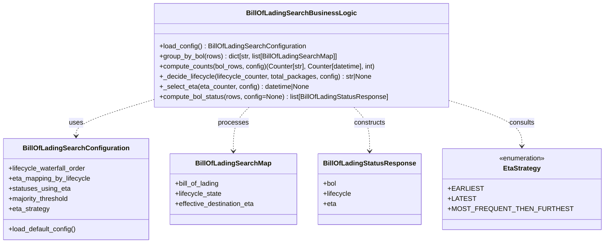

# Diagram: partview_service/partview_service/core/business/trip_leg/BillOfLadingSearchBusinessLogic.py


> Auto-generated by Obscura crawlers

## Diagram 1



### SVG

<svg id="container" width="1373.6953125" xmlns="http://www.w3.org/2000/svg" class="classDiagram" height="576" viewBox="0 0 1373.6953125 576" role="graphics-document document" aria-roledescription="class"><style>#container{font-family:"trebuchet ms",verdana,arial,sans-serif;font-size:16px;fill:#333;}@keyframes edge-animation-frame{from{stroke-dashoffset:0;}}@keyframes dash{to{stroke-dashoffset:0;}}#container .edge-animation-slow{stroke-dasharray:9,5!important;stroke-dashoffset:900;animation:dash 50s linear infinite;stroke-linecap:round;}#container .edge-animation-fast{stroke-dasharray:9,5!important;stroke-dashoffset:900;animation:dash 20s linear infinite;stroke-linecap:round;}#container .error-icon{fill:#552222;}#container .error-text{fill:#552222;stroke:#552222;}#container .edge-thickness-normal{stroke-width:1px;}#container .edge-thickness-thick{stroke-width:3.5px;}#container .edge-pattern-solid{stroke-dasharray:0;}#container .edge-thickness-invisible{stroke-width:0;fill:none;}#container .edge-pattern-dashed{stroke-dasharray:3;}#container .edge-pattern-dotted{stroke-dasharray:2;}#container .marker{fill:#333333;stroke:#333333;}#container .marker.cross{stroke:#333333;}#container svg{font-family:"trebuchet ms",verdana,arial,sans-serif;font-size:16px;}#container p{margin:0;}#container g.classGroup text{fill:#9370DB;stroke:none;font-family:"trebuchet ms",verdana,arial,sans-serif;font-size:10px;}#container g.classGroup text .title{font-weight:bolder;}#container .nodeLabel,#container .edgeLabel{color:#131300;}#container .edgeLabel .label rect{fill:#ECECFF;}#container .label text{fill:#131300;}#container .labelBkg{background:#ECECFF;}#container .edgeLabel .label span{background:#ECECFF;}#container .classTitle{font-weight:bolder;}#container .node rect,#container .node circle,#container .node ellipse,#container .node polygon,#container .node path{fill:#ECECFF;stroke:#9370DB;stroke-width:1px;}#container .divider{stroke:#9370DB;stroke-width:1;}#container g.clickable{cursor:pointer;}#container g.classGroup rect{fill:#ECECFF;stroke:#9370DB;}#container g.classGroup line{stroke:#9370DB;stroke-width:1;}#container .classLabel .box{stroke:none;stroke-width:0;fill:#ECECFF;opacity:0.5;}#container .classLabel .label{fill:#9370DB;font-size:10px;}#container .relation{stroke:#333333;stroke-width:1;fill:none;}#container .dashed-line{stroke-dasharray:3;}#container .dotted-line{stroke-dasharray:1 2;}#container #compositionStart,#container .composition{fill:#333333!important;stroke:#333333!important;stroke-width:1;}#container #compositionEnd,#container .composition{fill:#333333!important;stroke:#333333!important;stroke-width:1;}#container #dependencyStart,#container .dependency{fill:#333333!important;stroke:#333333!important;stroke-width:1;}#container #dependencyStart,#container .dependency{fill:#333333!important;stroke:#333333!important;stroke-width:1;}#container #extensionStart,#container .extension{fill:transparent!important;stroke:#333333!important;stroke-width:1;}#container #extensionEnd,#container .extension{fill:transparent!important;stroke:#333333!important;stroke-width:1;}#container #aggregationStart,#container .aggregation{fill:transparent!important;stroke:#333333!important;stroke-width:1;}#container #aggregationEnd,#container .aggregation{fill:transparent!important;stroke:#333333!important;stroke-width:1;}#container #lollipopStart,#container .lollipop{fill:#ECECFF!important;stroke:#333333!important;stroke-width:1;}#container #lollipopEnd,#container .lollipop{fill:#ECECFF!important;stroke:#333333!important;stroke-width:1;}#container .edgeTerminals{font-size:11px;line-height:initial;}#container .classTitleText{text-anchor:middle;font-size:18px;fill:#333;}#container .label-icon{display:inline-block;height:1em;overflow:visible;vertical-align:-0.125em;}#container .node .label-icon path{fill:currentColor;stroke:revert;stroke-width:revert;}#container :root{--mermaid-font-family:"trebuchet ms",verdana,arial,sans-serif;}</style><g><defs><marker id="container_class-aggregationStart" class="marker aggregation class" refX="18" refY="7" markerWidth="190" markerHeight="240" orient="auto"><path d="M 18,7 L9,13 L1,7 L9,1 Z"></path></marker></defs><defs><marker id="container_class-aggregationEnd" class="marker aggregation class" refX="1" refY="7" markerWidth="20" markerHeight="28" orient="auto"><path d="M 18,7 L9,13 L1,7 L9,1 Z"></path></marker></defs><defs><marker id="container_class-extensionStart" class="marker extension class" refX="18" refY="7" markerWidth="190" markerHeight="240" orient="auto"><path d="M 1,7 L18,13 V 1 Z"></path></marker></defs><defs><marker id="container_class-extensionEnd" class="marker extension class" refX="1" refY="7" markerWidth="20" markerHeight="28" orient="auto"><path d="M 1,1 V 13 L18,7 Z"></path></marker></defs><defs><marker id="container_class-compositionStart" class="marker composition class" refX="18" refY="7" markerWidth="190" markerHeight="240" orient="auto"><path d="M 18,7 L9,13 L1,7 L9,1 Z"></path></marker></defs><defs><marker id="container_class-compositionEnd" class="marker composition class" refX="1" refY="7" markerWidth="20" markerHeight="28" orient="auto"><path d="M 18,7 L9,13 L1,7 L9,1 Z"></path></marker></defs><defs><marker id="container_class-dependencyStart" class="marker dependency class" refX="6" refY="7" markerWidth="190" markerHeight="240" orient="auto"><path d="M 5,7 L9,13 L1,7 L9,1 Z"></path></marker></defs><defs><marker id="container_class-dependencyEnd" class="marker dependency class" refX="13" refY="7" markerWidth="20" markerHeight="28" orient="auto"><path d="M 18,7 L9,13 L14,7 L9,1 Z"></path></marker></defs><defs><marker id="container_class-lollipopStart" class="marker lollipop class" refX="13" refY="7" markerWidth="190" markerHeight="240" orient="auto"><circle stroke="black" fill="transparent" cx="7" cy="7" r="6"></circle></marker></defs><defs><marker id="container_class-lollipopEnd" class="marker lollipop class" refX="1" refY="7" markerWidth="190" markerHeight="240" orient="auto"><circle stroke="black" fill="transparent" cx="7" cy="7" r="6"></circle></marker></defs><g class="root"><g class="clusters"></g><g class="edgePaths"><path d="M359.656,235.807L329.284,245.006C298.911,254.205,238.167,272.602,207.794,286.968C177.422,301.333,177.422,311.667,177.422,316.833L177.422,322" id="id_BillOfLadingSearchBusinessLogic_BillOfLadingSearchConfiguration_1" class="edge-thickness-normal edge-pattern-dashed relation" style=";;;" data-edge="true" data-et="edge" data-id="id_BillOfLadingSearchBusinessLogic_BillOfLadingSearchConfiguration_1" data-points="W3sieCI6MzU5LjY1NjI1LCJ5IjoyMzUuODA3MjY5OTg0Njk0fSx7IngiOjE3Ny40MjE4NzUsInkiOjI5MX0seyJ4IjoxNzcuNDIxODc1LCJ5IjozMjh9XQ==" marker-end="url(#container_class-dependencyEnd)"></path><path d="M584.091,254L577.994,260.167C571.897,266.333,559.702,278.667,553.605,296C547.508,313.333,547.508,335.667,547.508,346.833L547.508,358" id="id_BillOfLadingSearchBusinessLogic_BillOfLadingSearchMap_2" class="edge-thickness-normal edge-pattern-dashed relation" style=";;;" data-edge="true" data-et="edge" data-id="id_BillOfLadingSearchBusinessLogic_BillOfLadingSearchMap_2" data-points="W3sieCI6NTg0LjA5MTM4MTgzNTkzNzUsInkiOjI1NH0seyJ4Ijo1NDcuNTA3ODEyNSwieSI6MjkxfSx7IngiOjU0Ny41MDc4MTI1LCJ5IjozNjR9XQ==" marker-end="url(#container_class-dependencyEnd)"></path><path d="M827.323,254L833.42,260.167C839.517,266.333,851.712,278.667,857.809,296C863.906,313.333,863.906,335.667,863.906,346.833L863.906,358" id="id_BillOfLadingSearchBusinessLogic_BillOfLadingStatusResponse_3" class="edge-thickness-normal edge-pattern-dashed relation" style=";;;" data-edge="true" data-et="edge" data-id="id_BillOfLadingSearchBusinessLogic_BillOfLadingStatusResponse_3" data-points="W3sieCI6ODI3LjMyMjY4MDY2NDA2MjUsInkiOjI1NH0seyJ4Ijo4NjMuOTA2MjUsInkiOjI5MX0seyJ4Ijo4NjMuOTA2MjUsInkiOjM2NH1d" marker-end="url(#container_class-dependencyEnd)"></path><path d="M1051.758,243.546L1076.076,251.455C1100.395,259.364,1149.031,275.182,1173.35,292.258C1197.668,309.333,1197.668,327.667,1197.668,336.833L1197.668,346" id="id_BillOfLadingSearchBusinessLogic_EtaStrategy_4" class="edge-thickness-normal edge-pattern-dashed relation" style=";;;" data-edge="true" data-et="edge" data-id="id_BillOfLadingSearchBusinessLogic_EtaStrategy_4" data-points="W3sieCI6MTA1MS43NTc4MTI1LCJ5IjoyNDMuNTQ1Nzc1MDM5MzAzOH0seyJ4IjoxMTk3LjY2Nzk2ODc1LCJ5IjoyOTF9LHsieCI6MTE5Ny42Njc5Njg3NSwieSI6MzUyfV0=" marker-end="url(#container_class-dependencyEnd)"></path></g><g class="edgeLabels"><g class="edgeLabel" transform="translate(177.421875, 291)"><g class="label" data-id="id_BillOfLadingSearchBusinessLogic_BillOfLadingSearchConfiguration_1" transform="translate(-16.4921875, -12)"><foreignObject width="32.984375" height="24"><div xmlns="http://www.w3.org/1999/xhtml" class="labelBkg" style="display: table-cell; white-space: nowrap; line-height: 1.5; max-width: 200px; text-align: center;"><span class="edgeLabel"><p>uses</p></span></div></foreignObject></g></g><g class="edgeLabel" transform="translate(547.5078125, 291)"><g class="label" data-id="id_BillOfLadingSearchBusinessLogic_BillOfLadingSearchMap_2" transform="translate(-35.7890625, -12)"><foreignObject width="71.578125" height="24"><div xmlns="http://www.w3.org/1999/xhtml" class="labelBkg" style="display: table-cell; white-space: nowrap; line-height: 1.5; max-width: 200px; text-align: center;"><span class="edgeLabel"><p>processes</p></span></div></foreignObject></g></g><g class="edgeLabel" transform="translate(863.90625, 291)"><g class="label" data-id="id_BillOfLadingSearchBusinessLogic_BillOfLadingStatusResponse_3" transform="translate(-37.84375, -12)"><foreignObject width="75.6875" height="24"><div xmlns="http://www.w3.org/1999/xhtml" class="labelBkg" style="display: table-cell; white-space: nowrap; line-height: 1.5; max-width: 200px; text-align: center;"><span class="edgeLabel"><p>constructs</p></span></div></foreignObject></g></g><g class="edgeLabel" transform="translate(1197.66796875, 291)"><g class="label" data-id="id_BillOfLadingSearchBusinessLogic_EtaStrategy_4" transform="translate(-30.390625, -12)"><foreignObject width="60.78125" height="24"><div xmlns="http://www.w3.org/1999/xhtml" class="labelBkg" style="display: table-cell; white-space: nowrap; line-height: 1.5; max-width: 200px; text-align: center;"><span class="edgeLabel"><p>consults</p></span></div></foreignObject></g></g></g><g class="nodes"><g class="node default" id="classId-BillOfLadingSearchBusinessLogic-0" transform="translate(705.70703125, 131)"><g class="basic label-container"><path d="M-346.05078125 -123 L346.05078125 -123 L346.05078125 123 L-346.05078125 123" stroke="none" stroke-width="0" fill="#ECECFF" style=""></path><path d="M-346.05078125 -123 C-109.86423329576203 -123, 126.32231465847593 -123, 346.05078125 -123 M-346.05078125 -123 C-105.11332102434272 -123, 135.82413920131455 -123, 346.05078125 -123 M346.05078125 -123 C346.05078125 -51.64956243213082, 346.05078125 19.700875135738357, 346.05078125 123 M346.05078125 -123 C346.05078125 -26.284224110841578, 346.05078125 70.43155177831684, 346.05078125 123 M346.05078125 123 C130.30445358016698 123, -85.44187408966604 123, -346.05078125 123 M346.05078125 123 C176.6293316248777 123, 7.2078819997553865 123, -346.05078125 123 M-346.05078125 123 C-346.05078125 59.027646513092655, -346.05078125 -4.944706973814689, -346.05078125 -123 M-346.05078125 123 C-346.05078125 50.62038104763782, -346.05078125 -21.75923790472436, -346.05078125 -123" stroke="#9370DB" stroke-width="1.3" fill="none" stroke-dasharray="0 0" style=""></path></g><g class="annotation-group text" transform="translate(0, -99)"></g><g class="label-group text" transform="translate(-120.9296875, -99)"><g class="label" style="font-weight: bolder" transform="translate(0,-12)"><foreignObject width="241.859375" height="24"><div xmlns="http://www.w3.org/1999/xhtml" style="display: table-cell; white-space: nowrap; line-height: 1.5; max-width: 289px; text-align: center;"><span class="nodeLabel markdown-node-label" style=""><p>BillOfLadingSearchBusinessLogic</p></span></div></foreignObject></g></g><g class="members-group text" transform="translate(-334.05078125, -51)"></g><g class="methods-group text" transform="translate(-334.05078125, -21)"><g class="label" style="" transform="translate(0,-12)"><foreignObject width="348.71875" height="24"><div xmlns="http://www.w3.org/1999/xhtml" style="display: table-cell; white-space: nowrap; line-height: 1.5; max-width: 406px; text-align: center;"><span class="nodeLabel markdown-node-label" style=""><p>+load_config() : BillOfLadingSearchConfiguration</p></span></div></foreignObject></g><g class="label" style="" transform="translate(0,12)"><foreignObject width="428.015625" height="24"><div xmlns="http://www.w3.org/1999/xhtml" style="display: table-cell; white-space: nowrap; line-height: 1.5; max-width: 485px; text-align: center;"><span class="nodeLabel markdown-node-label" style=""><p>+group_by_bol(rows) : dict[str, list[BillOfLadingSearchMap]]</p></span></div></foreignObject></g><g class="label" style="" transform="translate(0,36)"><foreignObject width="521.265625" height="24"><div xmlns="http://www.w3.org/1999/xhtml" style="display: table-cell; white-space: nowrap; line-height: 1.5; max-width: 579px; text-align: center;"><span class="nodeLabel markdown-node-label" style=""><p>+compute_counts(bol_rows, config)(Counter[str], Counter[datetime], int)</p></span></div></foreignObject></g><g class="label" style="" transform="translate(0,60)"><foreignObject width="507.78125" height="24"><div xmlns="http://www.w3.org/1999/xhtml" style="display: table-cell; white-space: nowrap; line-height: 1.5; max-width: 565px; text-align: center;"><span class="nodeLabel markdown-node-label" style=""><p>+_decide_lifecycle(lifecycle_counter, total_packages, config) : str|None</p></span></div></foreignObject></g><g class="label" style="" transform="translate(0,84)"><foreignObject width="359.0625" height="24"><div xmlns="http://www.w3.org/1999/xhtml" style="display: table-cell; white-space: nowrap; line-height: 1.5; max-width: 416px; text-align: center;"><span class="nodeLabel markdown-node-label" style=""><p>+_select_eta(eta_counter, config) : datetime|None</p></span></div></foreignObject></g><g class="label" style="" transform="translate(0,108)"><foreignObject width="547.171875" height="24"><div xmlns="http://www.w3.org/1999/xhtml" style="display: table-cell; white-space: nowrap; line-height: 1.5; max-width: 605px; text-align: center;"><span class="nodeLabel markdown-node-label" style=""><p>+compute_bol_status(rows, config=None) : list[BillOfLadingStatusResponse]</p></span></div></foreignObject></g></g><g class="divider" style=""><path d="M-346.05078125 -75 C-193.93180186080014 -75, -41.81282247160027 -75, 346.05078125 -75 M-346.05078125 -75 C-125.37810593140446 -75, 95.29456938719107 -75, 346.05078125 -75" stroke="#9370DB" stroke-width="1.3" fill="none" stroke-dasharray="0 0" style=""></path></g><g class="divider" style=""><path d="M-346.05078125 -51 C-93.50196560753156 -51, 159.04685003493688 -51, 346.05078125 -51 M-346.05078125 -51 C-163.7438939707208 -51, 18.56299330855842 -51, 346.05078125 -51" stroke="#9370DB" stroke-width="1.3" fill="none" stroke-dasharray="0 0" style=""></path></g></g><g class="node default" id="classId-BillOfLadingSearchConfiguration-1" transform="translate(177.421875, 448)"><g class="basic label-container"><path d="M-169.421875 -120 L169.421875 -120 L169.421875 120 L-169.421875 120" stroke="none" stroke-width="0" fill="#ECECFF" style=""></path><path d="M-169.421875 -120 C-94.1725707126664 -120, -18.9232664253328 -120, 169.421875 -120 M-169.421875 -120 C-58.72843236623861 -120, 51.965010267522786 -120, 169.421875 -120 M169.421875 -120 C169.421875 -54.97710446798996, 169.421875 10.04579106402008, 169.421875 120 M169.421875 -120 C169.421875 -59.941535673578045, 169.421875 0.11692865284391019, 169.421875 120 M169.421875 120 C101.2482139404769 120, 33.0745528809538 120, -169.421875 120 M169.421875 120 C72.57256468066295 120, -24.2767456386741 120, -169.421875 120 M-169.421875 120 C-169.421875 39.212836703727106, -169.421875 -41.57432659254579, -169.421875 -120 M-169.421875 120 C-169.421875 55.14174511298724, -169.421875 -9.716509774025525, -169.421875 -120" stroke="#9370DB" stroke-width="1.3" fill="none" stroke-dasharray="0 0" style=""></path></g><g class="annotation-group text" transform="translate(0, -96)"></g><g class="label-group text" transform="translate(-118.890625, -96)"><g class="label" style="font-weight: bolder" transform="translate(0,-12)"><foreignObject width="237.78125" height="24"><div xmlns="http://www.w3.org/1999/xhtml" style="display: table-cell; white-space: nowrap; line-height: 1.5; max-width: 284px; text-align: center;"><span class="nodeLabel markdown-node-label" style=""><p>BillOfLadingSearchConfiguration</p></span></div></foreignObject></g></g><g class="members-group text" transform="translate(-157.421875, -48)"><g class="label" style="" transform="translate(0,-12)"><foreignObject width="186.078125" height="24"><div xmlns="http://www.w3.org/1999/xhtml" style="display: table-cell; white-space: nowrap; line-height: 1.5; max-width: 244px; text-align: center;"><span class="nodeLabel markdown-node-label" style=""><p>+lifecycle_waterfall_order</p></span></div></foreignObject></g><g class="label" style="" transform="translate(0,12)"><foreignObject width="195.953125" height="24"><div xmlns="http://www.w3.org/1999/xhtml" style="display: table-cell; white-space: nowrap; line-height: 1.5; max-width: 253px; text-align: center;"><span class="nodeLabel markdown-node-label" style=""><p>+eta_mapping_by_lifecycle</p></span></div></foreignObject></g><g class="label" style="" transform="translate(0,36)"><foreignObject width="146.40625" height="24"><div xmlns="http://www.w3.org/1999/xhtml" style="display: table-cell; white-space: nowrap; line-height: 1.5; max-width: 204px; text-align: center;"><span class="nodeLabel markdown-node-label" style=""><p>+statuses_using_eta</p></span></div></foreignObject></g><g class="label" style="" transform="translate(0,60)"><foreignObject width="145.78125" height="24"><div xmlns="http://www.w3.org/1999/xhtml" style="display: table-cell; white-space: nowrap; line-height: 1.5; max-width: 203px; text-align: center;"><span class="nodeLabel markdown-node-label" style=""><p>+majority_threshold</p></span></div></foreignObject></g><g class="label" style="" transform="translate(0,84)"><foreignObject width="97.421875" height="24"><div xmlns="http://www.w3.org/1999/xhtml" style="display: table-cell; white-space: nowrap; line-height: 1.5; max-width: 155px; text-align: center;"><span class="nodeLabel markdown-node-label" style=""><p>+eta_strategy</p></span></div></foreignObject></g></g><g class="methods-group text" transform="translate(-157.421875, 96)"><g class="label" style="" transform="translate(0,-12)"><foreignObject width="161.765625" height="24"><div xmlns="http://www.w3.org/1999/xhtml" style="display: table-cell; white-space: nowrap; line-height: 1.5; max-width: 219px; text-align: center;"><span class="nodeLabel markdown-node-label" style=""><p>+load_default_config()</p></span></div></foreignObject></g></g><g class="divider" style=""><path d="M-169.421875 -72 C-91.05440042687893 -72, -12.686925853757856 -72, 169.421875 -72 M-169.421875 -72 C-51.08724905482475 -72, 67.2473768903505 -72, 169.421875 -72" stroke="#9370DB" stroke-width="1.3" fill="none" stroke-dasharray="0 0" style=""></path></g><g class="divider" style=""><path d="M-169.421875 72 C-72.05331912936914 72, 25.315236741261714 72, 169.421875 72 M-169.421875 72 C-95.775429741915 72, -22.12898448383001 72, 169.421875 72" stroke="#9370DB" stroke-width="1.3" fill="none" stroke-dasharray="0 0" style=""></path></g></g><g class="node default" id="classId-BillOfLadingSearchMap-2" transform="translate(547.5078125, 448)"><g class="basic label-container"><path d="M-150.6640625 -84 L150.6640625 -84 L150.6640625 84 L-150.6640625 84" stroke="none" stroke-width="0" fill="#ECECFF" style=""></path><path d="M-150.6640625 -84 C-48.14670257252874 -84, 54.37065735494252 -84, 150.6640625 -84 M-150.6640625 -84 C-30.93232051126344 -84, 88.79942147747312 -84, 150.6640625 -84 M150.6640625 -84 C150.6640625 -28.248302367947772, 150.6640625 27.503395264104455, 150.6640625 84 M150.6640625 -84 C150.6640625 -32.31649777840082, 150.6640625 19.367004443198354, 150.6640625 84 M150.6640625 84 C83.1063945855901 84, 15.54872667118019 84, -150.6640625 84 M150.6640625 84 C38.11078191008862 84, -74.44249867982276 84, -150.6640625 84 M-150.6640625 84 C-150.6640625 44.501352815356334, -150.6640625 5.0027056307126685, -150.6640625 -84 M-150.6640625 84 C-150.6640625 28.031936425135164, -150.6640625 -27.93612714972967, -150.6640625 -84" stroke="#9370DB" stroke-width="1.3" fill="none" stroke-dasharray="0 0" style=""></path></g><g class="annotation-group text" transform="translate(0, -60)"></g><g class="label-group text" transform="translate(-84.96875, -60)"><g class="label" style="font-weight: bolder" transform="translate(0,-12)"><foreignObject width="169.9375" height="24"><div xmlns="http://www.w3.org/1999/xhtml" style="display: table-cell; white-space: nowrap; line-height: 1.5; max-width: 218px; text-align: center;"><span class="nodeLabel markdown-node-label" style=""><p>BillOfLadingSearchMap</p></span></div></foreignObject></g></g><g class="members-group text" transform="translate(-138.6640625, -12)"><g class="label" style="" transform="translate(0,-12)"><foreignObject width="106.859375" height="24"><div xmlns="http://www.w3.org/1999/xhtml" style="display: table-cell; white-space: nowrap; line-height: 1.5; max-width: 165px; text-align: center;"><span class="nodeLabel markdown-node-label" style=""><p>+bill_of_lading</p></span></div></foreignObject></g><g class="label" style="" transform="translate(0,12)"><foreignObject width="111.640625" height="24"><div xmlns="http://www.w3.org/1999/xhtml" style="display: table-cell; white-space: nowrap; line-height: 1.5; max-width: 169px; text-align: center;"><span class="nodeLabel markdown-node-label" style=""><p>+lifecycle_state</p></span></div></foreignObject></g><g class="label" style="" transform="translate(0,36)"><foreignObject width="192.359375" height="24"><div xmlns="http://www.w3.org/1999/xhtml" style="display: table-cell; white-space: nowrap; line-height: 1.5; max-width: 250px; text-align: center;"><span class="nodeLabel markdown-node-label" style=""><p>+effective_destination_eta</p></span></div></foreignObject></g></g><g class="methods-group text" transform="translate(-138.6640625, 84)"></g><g class="divider" style=""><path d="M-150.6640625 -36 C-68.72025580639256 -36, 13.223550887214884 -36, 150.6640625 -36 M-150.6640625 -36 C-55.495121256630966 -36, 39.67381998673807 -36, 150.6640625 -36" stroke="#9370DB" stroke-width="1.3" fill="none" stroke-dasharray="0 0" style=""></path></g><g class="divider" style=""><path d="M-150.6640625 60 C-33.22896005246331 60, 84.20614239507339 60, 150.6640625 60 M-150.6640625 60 C-40.284698963215774 60, 70.09466457356845 60, 150.6640625 60" stroke="#9370DB" stroke-width="1.3" fill="none" stroke-dasharray="0 0" style=""></path></g></g><g class="node default" id="classId-BillOfLadingStatusResponse-3" transform="translate(863.90625, 448)"><g class="basic label-container"><path d="M-115.734375 -84 L115.734375 -84 L115.734375 84 L-115.734375 84" stroke="none" stroke-width="0" fill="#ECECFF" style=""></path><path d="M-115.734375 -84 C-59.839036321948484 -84, -3.943697643896968 -84, 115.734375 -84 M-115.734375 -84 C-66.01316041585098 -84, -16.291945831701952 -84, 115.734375 -84 M115.734375 -84 C115.734375 -46.921822588507666, 115.734375 -9.843645177015333, 115.734375 84 M115.734375 -84 C115.734375 -42.39658600106947, 115.734375 -0.7931720021389452, 115.734375 84 M115.734375 84 C66.77017532325503 84, 17.805975646510063 84, -115.734375 84 M115.734375 84 C36.242867381956145 84, -43.24864023608771 84, -115.734375 84 M-115.734375 84 C-115.734375 29.331474147935488, -115.734375 -25.337051704129024, -115.734375 -84 M-115.734375 84 C-115.734375 45.109448686356494, -115.734375 6.218897372712988, -115.734375 -84" stroke="#9370DB" stroke-width="1.3" fill="none" stroke-dasharray="0 0" style=""></path></g><g class="annotation-group text" transform="translate(0, -60)"></g><g class="label-group text" transform="translate(-103.734375, -60)"><g class="label" style="font-weight: bolder" transform="translate(0,-12)"><foreignObject width="207.46875" height="24"><div xmlns="http://www.w3.org/1999/xhtml" style="display: table-cell; white-space: nowrap; line-height: 1.5; max-width: 254px; text-align: center;"><span class="nodeLabel markdown-node-label" style=""><p>BillOfLadingStatusResponse</p></span></div></foreignObject></g></g><g class="members-group text" transform="translate(-103.734375, -12)"><g class="label" style="" transform="translate(0,-12)"><foreignObject width="31.53125" height="24"><div xmlns="http://www.w3.org/1999/xhtml" style="display: table-cell; white-space: nowrap; line-height: 1.5; max-width: 89px; text-align: center;"><span class="nodeLabel markdown-node-label" style=""><p>+bol</p></span></div></foreignObject></g><g class="label" style="" transform="translate(0,12)"><foreignObject width="67.546875" height="24"><div xmlns="http://www.w3.org/1999/xhtml" style="display: table-cell; white-space: nowrap; line-height: 1.5; max-width: 125px; text-align: center;"><span class="nodeLabel markdown-node-label" style=""><p>+lifecycle</p></span></div></foreignObject></g><g class="label" style="" transform="translate(0,36)"><foreignObject width="31.078125" height="24"><div xmlns="http://www.w3.org/1999/xhtml" style="display: table-cell; white-space: nowrap; line-height: 1.5; max-width: 88px; text-align: center;"><span class="nodeLabel markdown-node-label" style=""><p>+eta</p></span></div></foreignObject></g></g><g class="methods-group text" transform="translate(-103.734375, 84)"></g><g class="divider" style=""><path d="M-115.734375 -36 C-31.067936460370717 -36, 53.598502079258566 -36, 115.734375 -36 M-115.734375 -36 C-23.22331400469811 -36, 69.28774699060378 -36, 115.734375 -36" stroke="#9370DB" stroke-width="1.3" fill="none" stroke-dasharray="0 0" style=""></path></g><g class="divider" style=""><path d="M-115.734375 60 C-40.258383108742166 60, 35.21760878251567 60, 115.734375 60 M-115.734375 60 C-65.60600536353265 60, -15.477635727065291 60, 115.734375 60" stroke="#9370DB" stroke-width="1.3" fill="none" stroke-dasharray="0 0" style=""></path></g></g><g class="node default" id="classId-EtaStrategy-4" transform="translate(1197.66796875, 448)"><g class="basic label-container"><path d="M-168.02734375 -96 L168.02734375 -96 L168.02734375 96 L-168.02734375 96" stroke="none" stroke-width="0" fill="#ECECFF" style=""></path><path d="M-168.02734375 -96 C-92.84517337710957 -96, -17.66300300421915 -96, 168.02734375 -96 M-168.02734375 -96 C-94.5162987624809 -96, -21.0052537749618 -96, 168.02734375 -96 M168.02734375 -96 C168.02734375 -46.67793241001807, 168.02734375 2.644135179963854, 168.02734375 96 M168.02734375 -96 C168.02734375 -40.476512180428024, 168.02734375 15.046975639143952, 168.02734375 96 M168.02734375 96 C87.94940051015317 96, 7.871457270306337 96, -168.02734375 96 M168.02734375 96 C54.615873811462706 96, -58.79559612707459 96, -168.02734375 96 M-168.02734375 96 C-168.02734375 50.37243131132153, -168.02734375 4.744862622643055, -168.02734375 -96 M-168.02734375 96 C-168.02734375 28.541484316578973, -168.02734375 -38.91703136684205, -168.02734375 -96" stroke="#9370DB" stroke-width="1.3" fill="none" stroke-dasharray="0 0" style=""></path></g><g class="annotation-group text" transform="translate(-55.5546875, -72)"><g class="label" style="" transform="translate(0,-12)"><foreignObject width="111.109375" height="24"><div xmlns="http://www.w3.org/1999/xhtml" style="display: table-cell; white-space: nowrap; line-height: 1.5; max-width: 161px; text-align: center;"><span class="nodeLabel markdown-node-label" style=""><p>«enumeration»</p></span></div></foreignObject></g></g><g class="label-group text" transform="translate(-42.328125, -48)"><g class="label" style="font-weight: bolder" transform="translate(0,-12)"><foreignObject width="84.65625" height="24"><div xmlns="http://www.w3.org/1999/xhtml" style="display: table-cell; white-space: nowrap; line-height: 1.5; max-width: 132px; text-align: center;"><span class="nodeLabel markdown-node-label" style=""><p>EtaStrategy</p></span></div></foreignObject></g></g><g class="members-group text" transform="translate(-156.02734375, 0)"><g class="label" style="" transform="translate(0,-12)"><foreignObject width="73.125" height="24"><div xmlns="http://www.w3.org/1999/xhtml" style="display: table-cell; white-space: nowrap; line-height: 1.5; max-width: 131px; text-align: center;"><span class="nodeLabel markdown-node-label" style=""><p>+EARLIEST</p></span></div></foreignObject></g><g class="label" style="" transform="translate(0,12)"><foreignObject width="57.640625" height="24"><div xmlns="http://www.w3.org/1999/xhtml" style="display: table-cell; white-space: nowrap; line-height: 1.5; max-width: 116px; text-align: center;"><span class="nodeLabel markdown-node-label" style=""><p>+LATEST</p></span></div></foreignObject></g><g class="label" style="" transform="translate(0,36)"><foreignObject width="256.5" height="24"><div xmlns="http://www.w3.org/1999/xhtml" style="display: table-cell; white-space: nowrap; line-height: 1.5; max-width: 315px; text-align: center;"><span class="nodeLabel markdown-node-label" style=""><p>+MOST_FREQUENT_THEN_FURTHEST</p></span></div></foreignObject></g></g><g class="methods-group text" transform="translate(-156.02734375, 96)"></g><g class="divider" style=""><path d="M-168.02734375 -24 C-54.36093688072475 -24, 59.3054699885505 -24, 168.02734375 -24 M-168.02734375 -24 C-100.74043969903256 -24, -33.45353564806513 -24, 168.02734375 -24" stroke="#9370DB" stroke-width="1.3" fill="none" stroke-dasharray="0 0" style=""></path></g><g class="divider" style=""><path d="M-168.02734375 72 C-91.67632588636427 72, -15.325308022728535 72, 168.02734375 72 M-168.02734375 72 C-59.918177724364114 72, 48.19098830127177 72, 168.02734375 72" stroke="#9370DB" stroke-width="1.3" fill="none" stroke-dasharray="0 0" style=""></path></g></g></g></g></g></svg>

## Diagram 2

```mermaid
flowchart LR
Start([Start]) --> CheckConfig{config provided?}
CheckConfig -- No --> LoadConfig[load_config() -> BillOfLadingSearchConfiguration]
CheckConfig -- Yes --> UseProvided[use provided config]
LoadConfig --> GroupByBOL[group_by_bol(rows) -> grouped_by_bol]
UseProvided --> GroupByBOL
GroupByBOL --> ForEachBol{iterate bol_number, bol_rows}
ForEachBol --> ComputeCounts[compute_counts(bol_rows, final_config)\n(lifecycle_counter, eta_counter, total)]
ComputeCounts --> DecideLifecycle[_decide_lifecycle(lifecycle_counter, total, final_config) -> lifecycle]
DecideLifecycle --> CheckLifecycleUsesETA{lifecycle in statuses_using_eta?}
CheckLifecycleUsesETA -- Yes --> SelectETA[_select_eta(eta_counter, final_config) -> eta_value]
CheckLifecycleUsesETA -- No --> MapETA[final_config.eta_mapping_by_lifecycle.get(lifecycle) -> eta_value]
SelectETA --> BuildResponse[Create BillOfLadingStatusResponse(bol, lifecycle, eta_value)]
MapETA --> BuildResponse
BuildResponse --> Append[append response to results]
Append --> ForEachBol
ForEachBol --> End([Return results])
```

> SVG rendering failed for this diagram.
