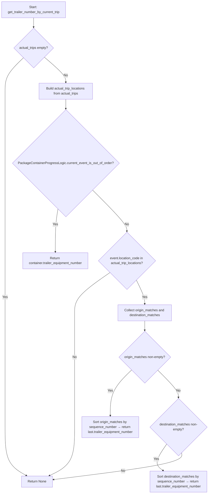

# Diagram: partview_service/partview_service/core/business/trip_leg/PackageContainerTrailerNumberLogic.py

> Auto-generated by Obscura crawlers

## Mermaid

### SVG

<svg id="container" width="1031.265625" xmlns="http://www.w3.org/2000/svg" class="flowchart" height="2417.953125" viewBox="0 0 1031.265625 2417.953125" role="graphics-document document" aria-roledescription="flowchart-v2"><g><marker id="container_flowchart-v2-pointEnd" class="marker flowchart-v2" viewBox="0 0 10 10" refX="5" refY="5" markerUnits="userSpaceOnUse" markerWidth="8" markerHeight="8" orient="auto"><path d="M 0 0 L 10 5 L 0 10 z" class="arrowMarkerPath" style="stroke-width: 1; stroke-dasharray: 1, 0;"></path></marker><marker id="container_flowchart-v2-pointStart" class="marker flowchart-v2" viewBox="0 0 10 10" refX="4.5" refY="5" markerUnits="userSpaceOnUse" markerWidth="8" markerHeight="8" orient="auto"><path d="M 0 5 L 10 10 L 10 0 z" class="arrowMarkerPath" style="stroke-width: 1; stroke-dasharray: 1, 0;"></path></marker><marker id="container_flowchart-v2-circleEnd" class="marker flowchart-v2" viewBox="0 0 10 10" refX="11" refY="5" markerUnits="userSpaceOnUse" markerWidth="11" markerHeight="11" orient="auto"><circle cx="5" cy="5" r="5" class="arrowMarkerPath" style="stroke-width: 1; stroke-dasharray: 1, 0;"></circle></marker><marker id="container_flowchart-v2-circleStart" class="marker flowchart-v2" viewBox="0 0 10 10" refX="-1" refY="5" markerUnits="userSpaceOnUse" markerWidth="11" markerHeight="11" orient="auto"><circle cx="5" cy="5" r="5" class="arrowMarkerPath" style="stroke-width: 1; stroke-dasharray: 1, 0;"></circle></marker><marker id="container_flowchart-v2-crossEnd" class="marker cross flowchart-v2" viewBox="0 0 11 11" refX="12" refY="5.2" markerUnits="userSpaceOnUse" markerWidth="11" markerHeight="11" orient="auto"><path d="M 1,1 l 9,9 M 10,1 l -9,9" class="arrowMarkerPath" style="stroke-width: 2; stroke-dasharray: 1, 0;"></path></marker><marker id="container_flowchart-v2-crossStart" class="marker cross flowchart-v2" viewBox="0 0 11 11" refX="-1" refY="5.2" markerUnits="userSpaceOnUse" markerWidth="11" markerHeight="11" orient="auto"><path d="M 1,1 l 9,9 M 10,1 l -9,9" class="arrowMarkerPath" style="stroke-width: 2; stroke-dasharray: 1, 0;"></path></marker><g class="root"><g class="clusters"></g><g class="edgePaths"><path d="M166.453,86L166.453,90.167C166.453,94.333,166.453,102.667,166.453,110.333C166.453,118,166.453,125,166.453,128.5L166.453,132" id="L_Start_CheckActual_0" class="edge-thickness-normal edge-pattern-solid edge-thickness-normal edge-pattern-solid flowchart-link" style=";" data-edge="true" data-et="edge" data-id="L_Start_CheckActual_0" data-points="W3sieCI6MTY2LjQ1MzEyNSwieSI6ODZ9LHsieCI6MTY2LjQ1MzEyNSwieSI6MTExfSx7IngiOjE2Ni40NTMxMjUsInkiOjEzNn1d" marker-end="url(#container_flowchart-v2-pointEnd)"></path><path d="M116.246,282.527L101.094,297.062C85.941,311.596,55.637,340.665,40.484,367.867C25.332,395.068,25.332,420.401,25.332,443.734C25.332,467.068,25.332,488.401,25.332,546.169C25.332,603.938,25.332,698.141,25.332,794.344C25.332,890.547,25.332,988.75,25.332,1067.185C25.332,1145.62,25.332,1204.286,25.332,1262.953C25.332,1321.62,25.332,1380.286,25.332,1422.286C25.332,1464.286,25.332,1489.62,25.332,1512.953C25.332,1536.286,25.332,1557.62,25.332,1595.62C25.332,1633.62,25.332,1688.286,25.332,1744.953C25.332,1801.62,25.332,1860.286,25.332,1918.953C25.332,1977.62,25.332,2036.286,25.332,2094.953C25.332,2153.62,25.332,2212.286,42.904,2251.461C60.477,2290.635,95.622,2310.317,113.194,2320.158L130.766,2329.999" id="L_CheckActual_ReturnNone_0" class="edge-thickness-normal edge-pattern-solid edge-thickness-normal edge-pattern-solid flowchart-link" style=";" data-edge="true" data-et="edge" data-id="L_CheckActual_ReturnNone_0" data-points="W3sieCI6MTE2LjI0NTk4NzczNDE3MzAxLCJ5IjoyODIuNTI3MjM3NzM0MTczfSx7IngiOjI1LjMzMjAzMTI1LCJ5IjozNjkuNzM0Mzc1fSx7IngiOjI1LjMzMjAzMTI1LCJ5Ijo0NDUuNzM0Mzc1fSx7IngiOjI1LjMzMjAzMTI1LCJ5Ijo1MDkuNzM0Mzc1fSx7IngiOjI1LjMzMjAzMTI1LCJ5Ijo3OTIuMzQzNzV9LHsieCI6MjUuMzMyMDMxMjUsInkiOjEwODYuOTUzMTI1fSx7IngiOjI1LjMzMjAzMTI1LCJ5IjoxMjYyLjk1MzEyNX0seyJ4IjoyNS4zMzIwMzEyNSwieSI6MTQzOC45NTMxMjV9LHsieCI6MjUuMzMyMDMxMjUsInkiOjE1MTQuOTUzMTI1fSx7IngiOjI1LjMzMjAzMTI1LCJ5IjoxNTc4Ljk1MzEyNX0seyJ4IjoyNS4zMzIwMzEyNSwieSI6MTc0Mi45NTMxMjV9LHsieCI6MjUuMzMyMDMxMjUsInkiOjE5MTguOTUzMTI1fSx7IngiOjI1LjMzMjAzMTI1LCJ5IjoyMDk0Ljk1MzEyNX0seyJ4IjoyNS4zMzIwMzEyNSwieSI6MjI3MC45NTMxMjV9LHsieCI6MTM0LjI1NjM0NzY1NjI1LCJ5IjoyMzMxLjk1MzEyNX1d" marker-end="url(#container_flowchart-v2-pointEnd)"></path><path d="M218.401,280.787L234.991,295.611C251.581,310.436,284.761,340.085,301.351,360.41C317.941,380.734,317.941,391.734,317.941,397.234L317.941,402.734" id="L_CheckActual_BuildLocations_0" class="edge-thickness-normal edge-pattern-solid edge-thickness-normal edge-pattern-solid flowchart-link" style=";" data-edge="true" data-et="edge" data-id="L_CheckActual_BuildLocations_0" data-points="W3sieCI6MjE4LjQwMDgwNTI0MDE3ODM5LCJ5IjoyODAuNzg2Njk0NzU5ODIxNn0seyJ4IjozMTcuOTQxNDA2MjUsInkiOjM2OS43MzQzNzV9LHsieCI6MzE3Ljk0MTQwNjI1LCJ5Ijo0MDYuNzM0Mzc1fV0=" marker-end="url(#container_flowchart-v2-pointEnd)"></path><path d="M317.941,484.734L317.941,488.901C317.941,493.068,317.941,501.401,317.941,509.068C317.941,516.734,317.941,523.734,317.941,527.234L317.941,530.734" id="L_BuildLocations_OutOfOrder_0" class="edge-thickness-normal edge-pattern-solid edge-thickness-normal edge-pattern-solid flowchart-link" style=";" data-edge="true" data-et="edge" data-id="L_BuildLocations_OutOfOrder_0" data-points="W3sieCI6MzE3Ljk0MTQwNjI1LCJ5Ijo0ODQuNzM0Mzc1fSx7IngiOjMxNy45NDE0MDYyNSwieSI6NTA5LjczNDM3NX0seyJ4IjozMTcuOTQxNDA2MjUsInkiOjUzNC43MzQzNzV9XQ==" marker-end="url(#container_flowchart-v2-pointEnd)"></path><path d="M282.372,1014.383L280.434,1026.478C278.496,1038.573,274.621,1062.763,272.684,1097.025C270.746,1131.286,270.746,1175.62,270.746,1197.786L270.746,1219.953" id="L_OutOfOrder_ReturnContainer_0" class="edge-thickness-normal edge-pattern-solid edge-thickness-normal edge-pattern-solid flowchart-link" style=";" data-edge="true" data-et="edge" data-id="L_OutOfOrder_ReturnContainer_0" data-points="W3sieCI6MjgyLjM3MTUxNjc3NjA0NTEsInkiOjEwMTQuMzgzMjM1NTI2MDQ1Mn0seyJ4IjoyNzAuNzQ2MDkzNzUsInkiOjEwODYuOTUzMTI1fSx7IngiOjI3MC43NDYwOTM3NSwieSI6MTIyMy45NTMxMjV9XQ==" marker-end="url(#container_flowchart-v2-pointEnd)"></path><path d="M448.983,918.911L477.98,946.918C506.977,974.925,564.971,1030.939,593.968,1064.446C622.965,1097.953,622.965,1108.953,622.965,1114.453L622.965,1119.953" id="L_OutOfOrder_InActual_0" class="edge-thickness-normal edge-pattern-solid edge-thickness-normal edge-pattern-solid flowchart-link" style=";" data-edge="true" data-et="edge" data-id="L_OutOfOrder_InActual_0" data-points="W3sieCI6NDQ4Ljk4MzA5NjE5MjA4NywieSI6OTE4LjkxMTQzNTA1NzkxMzF9LHsieCI6NjIyLjk2NDg0Mzc1LCJ5IjoxMDg2Ljk1MzEyNX0seyJ4Ijo2MjIuOTY0ODQzNzUsInkiOjExMjMuOTUzMTI1fV0=" marker-end="url(#container_flowchart-v2-pointEnd)"></path><path d="M540.178,1319.166L510.775,1339.13C481.372,1359.095,422.567,1399.024,393.164,1431.655C363.762,1464.286,363.762,1489.62,363.762,1512.953C363.762,1536.286,363.762,1557.62,363.762,1595.62C363.762,1633.62,363.762,1688.286,363.762,1744.953C363.762,1801.62,363.762,1860.286,363.762,1918.953C363.762,1977.62,363.762,2036.286,363.762,2094.953C363.762,2153.62,363.762,2212.286,343.417,2251.495C323.072,2290.704,282.381,2310.455,262.036,2320.331L241.691,2330.206" id="L_InActual_ReturnNone_0" class="edge-thickness-normal edge-pattern-solid edge-thickness-normal edge-pattern-solid flowchart-link" style=";" data-edge="true" data-et="edge" data-id="L_InActual_ReturnNone_0" data-points="W3sieCI6NTQwLjE3NzY3NTQwMTg4NjcsInkiOjEzMTkuMTY1OTU2NjUxODg2N30seyJ4IjozNjMuNzYxNzE4NzUsInkiOjE0MzguOTUzMTI1fSx7IngiOjM2My43NjE3MTg3NSwieSI6MTUxNC45NTMxMjV9LHsieCI6MzYzLjc2MTcxODc1LCJ5IjoxNTc4Ljk1MzEyNX0seyJ4IjozNjMuNzYxNzE4NzUsInkiOjE3NDIuOTUzMTI1fSx7IngiOjM2My43NjE3MTg3NSwieSI6MTkxOC45NTMxMjV9LHsieCI6MzYzLjc2MTcxODc1LCJ5IjoyMDk0Ljk1MzEyNX0seyJ4IjozNjMuNzYxNzE4NzUsInkiOjIyNzAuOTUzMTI1fSx7IngiOjIzOC4wOTI3MjkwNDgyOTU0NCwieSI6MjMzMS45NTMxMjV9XQ==" marker-end="url(#container_flowchart-v2-pointEnd)"></path><path d="M670.705,1354.213L678.094,1368.336C685.482,1382.46,700.259,1410.706,707.647,1430.33C715.035,1449.953,715.035,1460.953,715.035,1466.453L715.035,1471.953" id="L_InActual_FindMatches_0" class="edge-thickness-normal edge-pattern-solid edge-thickness-normal edge-pattern-solid flowchart-link" style=";" data-edge="true" data-et="edge" data-id="L_InActual_FindMatches_0" data-points="W3sieCI6NjcwLjcwNTIwNDU0NjE5OTYsInkiOjEzNTQuMjEyNzY0MjAzODAwNH0seyJ4Ijo3MTUuMDM1MTU2MjUsInkiOjE0MzguOTUzMTI1fSx7IngiOjcxNS4wMzUxNTYyNSwieSI6MTQ3NS45NTMxMjV9XQ==" marker-end="url(#container_flowchart-v2-pointEnd)"></path><path d="M715.035,1553.953L715.035,1558.12C715.035,1562.286,715.035,1570.62,715.035,1578.286C715.035,1585.953,715.035,1592.953,715.035,1596.453L715.035,1599.953" id="L_FindMatches_HasOrigin_0" class="edge-thickness-normal edge-pattern-solid edge-thickness-normal edge-pattern-solid flowchart-link" style=";" data-edge="true" data-et="edge" data-id="L_FindMatches_HasOrigin_0" data-points="W3sieCI6NzE1LjAzNTE1NjI1LCJ5IjoxNTUzLjk1MzEyNX0seyJ4Ijo3MTUuMDM1MTU2MjUsInkiOjE1NzguOTUzMTI1fSx7IngiOjcxNS4wMzUxNTYyNSwieSI6MTYwMy45NTMxMjV9XQ==" marker-end="url(#container_flowchart-v2-pointEnd)"></path><path d="M646.647,1813.565L629.636,1831.13C612.624,1848.694,578.601,1883.824,561.59,1921.555C544.578,1959.286,544.578,1999.62,544.578,2019.786L544.578,2039.953" id="L_HasOrigin_UseOrigin_0" class="edge-thickness-normal edge-pattern-solid edge-thickness-normal edge-pattern-solid flowchart-link" style=";" data-edge="true" data-et="edge" data-id="L_HasOrigin_UseOrigin_0" data-points="W3sieCI6NjQ2LjY0NzA4NzI5MzAzNjEsInkiOjE4MTMuNTY1MDU2MDQzMDM2fSx7IngiOjU0NC41NzgxMjUsInkiOjE5MTguOTUzMTI1fSx7IngiOjU0NC41NzgxMjUsInkiOjIwNDMuOTUzMTI1fV0=" marker-end="url(#container_flowchart-v2-pointEnd)"></path><path d="M782.45,1814.538L798.838,1831.941C815.227,1849.343,848.004,1884.148,864.393,1907.051C880.781,1929.953,880.781,1940.953,880.781,1946.453L880.781,1951.953" id="L_HasOrigin_HasDestination_0" class="edge-thickness-normal edge-pattern-solid edge-thickness-normal edge-pattern-solid flowchart-link" style=";" data-edge="true" data-et="edge" data-id="L_HasOrigin_HasDestination_0" data-points="W3sieCI6NzgyLjQ0OTg0NjQzMjU0MTQsInkiOjE4MTQuNTM4NDM0ODE3NDU4N30seyJ4Ijo4ODAuNzgxMjUsInkiOjE5MTguOTUzMTI1fSx7IngiOjg4MC43ODEyNSwieSI6MTk1NS45NTMxMjV9XQ==" marker-end="url(#container_flowchart-v2-pointEnd)"></path><path d="M823.029,2176.2L811.803,2191.993C800.578,2207.785,778.127,2239.369,775.123,2260.944C772.119,2282.519,788.562,2294.086,796.784,2299.869L805.005,2305.652" id="L_HasDestination_UseDestination_0" class="edge-thickness-normal edge-pattern-solid edge-thickness-normal edge-pattern-solid flowchart-link" style=";" data-edge="true" data-et="edge" data-id="L_HasDestination_UseDestination_0" data-points="W3sieCI6ODIzLjAyODUyODkwNzE1MiwieSI6MjE3Ni4yMDA0MDM5MDcxNTJ9LHsieCI6NzU1LjY3NTc4MTI1LCJ5IjoyMjcwLjk1MzEyNX0seyJ4Ijo4MDguMjc2OTQ0MjQ3MTU5MSwieSI6MjMwNy45NTMxMjV9XQ==" marker-end="url(#container_flowchart-v2-pointEnd)"></path><path d="M895.653,2219.082L896.688,2227.727C897.724,2236.372,899.796,2253.663,794.212,2275.35C688.628,2297.037,475.389,2323.122,368.77,2336.164L262.15,2349.206" id="L_HasDestination_ReturnNone_0" class="edge-thickness-normal edge-pattern-solid edge-thickness-normal edge-pattern-solid flowchart-link" style=";" data-edge="true" data-et="edge" data-id="L_HasDestination_ReturnNone_0" data-points="W3sieCI6ODk1LjY1MjY1NzYxODgyMTEsInkiOjIyMTkuMDgxNzE3MzgxMTc5fSx7IngiOjkwMS44NjcxODc1LCJ5IjoyMjcwLjk1MzEyNX0seyJ4IjoyNTguMTc5Njg3NSwieSI6MjM0OS42OTE4MjgxMjY1Mjd9XQ==" marker-end="url(#container_flowchart-v2-pointEnd)"></path></g><g class="edgeLabels"><g class="edgeLabel"><g class="label" data-id="L_Start_CheckActual_0" transform="translate(0, 0)"><foreignObject width="0" height="0">

</foreignObject></g></g><g class="edgeLabel" transform="translate(25.33203125, 1438.953125)"><g class="label" data-id="L_CheckActual_ReturnNone_0" transform="translate(-12.03125, -12)"><foreignObject width="24.0625" height="24">

Yes

</foreignObject></g></g><g class="edgeLabel" transform="translate(317.94140625, 369.734375)"><g class="label" data-id="L_CheckActual_BuildLocations_0" transform="translate(-10.140625, -12)"><foreignObject width="20.28125" height="24">

No

</foreignObject></g></g><g class="edgeLabel"><g class="label" data-id="L_BuildLocations_OutOfOrder_0" transform="translate(0, 0)"><foreignObject width="0" height="0">

</foreignObject></g></g><g class="edgeLabel" transform="translate(270.74609375, 1086.953125)"><g class="label" data-id="L_OutOfOrder_ReturnContainer_0" transform="translate(-12.03125, -12)"><foreignObject width="24.0625" height="24">

Yes

</foreignObject></g></g><g class="edgeLabel" transform="translate(622.96484375, 1086.953125)"><g class="label" data-id="L_OutOfOrder_InActual_0" transform="translate(-10.140625, -12)"><foreignObject width="20.28125" height="24">

No

</foreignObject></g></g><g class="edgeLabel" transform="translate(363.76171875, 1742.953125)"><g class="label" data-id="L_InActual_ReturnNone_0" transform="translate(-10.140625, -12)"><foreignObject width="20.28125" height="24">

No

</foreignObject></g></g><g class="edgeLabel" transform="translate(715.03515625, 1438.953125)"><g class="label" data-id="L_InActual_FindMatches_0" transform="translate(-12.03125, -12)"><foreignObject width="24.0625" height="24">

Yes

</foreignObject></g></g><g class="edgeLabel"><g class="label" data-id="L_FindMatches_HasOrigin_0" transform="translate(0, 0)"><foreignObject width="0" height="0">

</foreignObject></g></g><g class="edgeLabel" transform="translate(544.578125, 1918.953125)"><g class="label" data-id="L_HasOrigin_UseOrigin_0" transform="translate(-12.03125, -12)"><foreignObject width="24.0625" height="24">

Yes

</foreignObject></g></g><g class="edgeLabel" transform="translate(880.78125, 1918.953125)"><g class="label" data-id="L_HasOrigin_HasDestination_0" transform="translate(-10.140625, -12)"><foreignObject width="20.28125" height="24">

No

</foreignObject></g></g><g class="edgeLabel" transform="translate(770.72228, 2249.78551)"><g class="label" data-id="L_HasDestination_UseDestination_0" transform="translate(-12.03125, -12)"><foreignObject width="24.0625" height="24">

Yes

</foreignObject></g></g><g class="edgeLabel" transform="translate(605.95135, 2307.15086)"><g class="label" data-id="L_HasDestination_ReturnNone_0" transform="translate(-10.140625, -12)"><foreignObject width="20.28125" height="24">

No

</foreignObject></g></g></g><g class="nodes"><g class="node default" id="flowchart-Start-0" transform="translate(166.453125, 47)"><rect class="basic label-container" style="" x="-158.453125" y="-39" width="316.90625" height="78"></rect><g class="label" style="" transform="translate(-128.453125, -24)"><rect></rect><foreignObject width="256.90625" height="48">

Start: get_trailer_number_by_current_trip

</foreignObject></g></g><g class="node default" id="flowchart-CheckActual-1" transform="translate(166.453125, 234.3671875)"><polygon points="98.3671875,0 196.734375,-98.3671875 98.3671875,-196.734375 0,-98.3671875" class="label-container" transform="translate(-97.8671875, 98.3671875)"></polygon><g class="label" style="" transform="translate(-71.3671875, -12)"><rect></rect><foreignObject width="142.734375" height="24">

actual_trips empty?

</foreignObject></g></g><g class="node default" id="flowchart-ReturnNone-3" transform="translate(182.46875, 2358.953125)"><rect class="basic label-container" style="" x="-75.7109375" y="-27" width="151.421875" height="54"></rect><g class="label" style="" transform="translate(-45.7109375, -12)"><rect></rect><foreignObject width="91.421875" height="24">

Return None

</foreignObject></g></g><g class="node default" id="flowchart-BuildLocations-5" transform="translate(317.94140625, 445.734375)"><rect class="basic label-container" style="" x="-130" y="-39" width="260" height="78"></rect><g class="label" style="" transform="translate(-100, -24)"><rect></rect><foreignObject width="200" height="48">

Build actual_trip_locations from actual_trips

</foreignObject></g></g><g class="node default" id="flowchart-OutOfOrder-7" transform="translate(317.94140625, 792.34375)"><polygon points="257.609375,0 515.21875,-257.609375 257.609375,-515.21875 0,-257.609375" class="label-container" transform="translate(-257.109375, 257.609375)"></polygon><g class="label" style="" transform="translate(-230.609375, -12)"><rect></rect><foreignObject width="461.21875" height="24">

PackageContainerProgressLogic.current_event_is_out_of_order?

</foreignObject></g></g><g class="node default" id="flowchart-ReturnContainer-9" transform="translate(270.74609375, 1262.953125)"><rect class="basic label-container" style="" x="-163.21875" y="-39" width="326.4375" height="78"></rect><g class="label" style="" transform="translate(-133.21875, -24)"><rect></rect><foreignObject width="266.4375" height="48">

Return container.trailer_equipment_number

</foreignObject></g></g><g class="node default" id="flowchart-InActual-11" transform="translate(622.96484375, 1262.953125)"><polygon points="139,0 278,-139 139,-278 0,-139" class="label-container" transform="translate(-138.5, 139)"></polygon><g class="label" style="" transform="translate(-100, -24)"><rect></rect><foreignObject width="200" height="48">

event.location_code in actual_trip_locations?

</foreignObject></g></g><g class="node default" id="flowchart-FindMatches-15" transform="translate(715.03515625, 1514.953125)"><rect class="basic label-container" style="" x="-130" y="-39" width="260" height="78"></rect><g class="label" style="" transform="translate(-100, -24)"><rect></rect><foreignObject width="200" height="48">

Collect origin_matches and destination_matches

</foreignObject></g></g><g class="node default" id="flowchart-HasOrigin-17" transform="translate(715.03515625, 1742.953125)"><polygon points="139,0 278,-139 139,-278 0,-139" class="label-container" transform="translate(-138.5, 139)"></polygon><g class="label" style="" transform="translate(-100, -24)"><rect></rect><foreignObject width="200" height="48">

origin_matches non-empty?

</foreignObject></g></g><g class="node default" id="flowchart-UseOrigin-19" transform="translate(544.578125, 2094.953125)"><rect class="basic label-container" style="" x="-142.4921875" y="-51" width="284.984375" height="102"></rect><g class="label" style="" transform="translate(-112.4921875, -36)"><rect></rect><foreignObject width="224.984375" height="72">

Sort origin_matches by sequence_number → return last.trailer_equipment_number

</foreignObject></g></g><g class="node default" id="flowchart-HasDestination-21" transform="translate(880.78125, 2094.953125)"><polygon points="139,0 278,-139 139,-278 0,-139" class="label-container" transform="translate(-138.5, 139)"></polygon><g class="label" style="" transform="translate(-100, -24)"><rect></rect><foreignObject width="200" height="48">

destination_matches non-empty?

</foreignObject></g></g><g class="node default" id="flowchart-UseDestination-23" transform="translate(880.78125, 2358.953125)"><rect class="basic label-container" style="" x="-142.484375" y="-51" width="284.96875" height="102"></rect><g class="label" style="" transform="translate(-112.484375, -36)"><rect></rect><foreignObject width="224.96875" height="72">

Sort destination_matches by sequence_number → return last.trailer_equipment_number

</foreignObject></g></g></g></g></g></svg>
