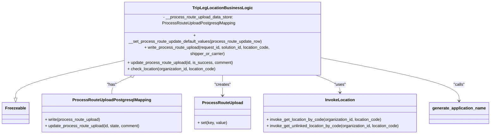

# Diagram: partview_service/partview_service/core/business/trip_leg/TripLegLocationBusinessLogic.py


> Auto-generated by Obscura crawlers

## Diagram 1



### SVG

<svg id="container" width="1918.4140625" xmlns="http://www.w3.org/2000/svg" class="classDiagram" height="456" viewBox="0 0 1918.4140625 456" role="graphics-document document" aria-roledescription="class"><style>#container{font-family:"trebuchet ms",verdana,arial,sans-serif;font-size:16px;fill:#333;}@keyframes edge-animation-frame{from{stroke-dashoffset:0;}}@keyframes dash{to{stroke-dashoffset:0;}}#container .edge-animation-slow{stroke-dasharray:9,5!important;stroke-dashoffset:900;animation:dash 50s linear infinite;stroke-linecap:round;}#container .edge-animation-fast{stroke-dasharray:9,5!important;stroke-dashoffset:900;animation:dash 20s linear infinite;stroke-linecap:round;}#container .error-icon{fill:#552222;}#container .error-text{fill:#552222;stroke:#552222;}#container .edge-thickness-normal{stroke-width:1px;}#container .edge-thickness-thick{stroke-width:3.5px;}#container .edge-pattern-solid{stroke-dasharray:0;}#container .edge-thickness-invisible{stroke-width:0;fill:none;}#container .edge-pattern-dashed{stroke-dasharray:3;}#container .edge-pattern-dotted{stroke-dasharray:2;}#container .marker{fill:#333333;stroke:#333333;}#container .marker.cross{stroke:#333333;}#container svg{font-family:"trebuchet ms",verdana,arial,sans-serif;font-size:16px;}#container p{margin:0;}#container g.classGroup text{fill:#9370DB;stroke:none;font-family:"trebuchet ms",verdana,arial,sans-serif;font-size:10px;}#container g.classGroup text .title{font-weight:bolder;}#container .nodeLabel,#container .edgeLabel{color:#131300;}#container .edgeLabel .label rect{fill:#ECECFF;}#container .label text{fill:#131300;}#container .labelBkg{background:#ECECFF;}#container .edgeLabel .label span{background:#ECECFF;}#container .classTitle{font-weight:bolder;}#container .node rect,#container .node circle,#container .node ellipse,#container .node polygon,#container .node path{fill:#ECECFF;stroke:#9370DB;stroke-width:1px;}#container .divider{stroke:#9370DB;stroke-width:1;}#container g.clickable{cursor:pointer;}#container g.classGroup rect{fill:#ECECFF;stroke:#9370DB;}#container g.classGroup line{stroke:#9370DB;stroke-width:1;}#container .classLabel .box{stroke:none;stroke-width:0;fill:#ECECFF;opacity:0.5;}#container .classLabel .label{fill:#9370DB;font-size:10px;}#container .relation{stroke:#333333;stroke-width:1;fill:none;}#container .dashed-line{stroke-dasharray:3;}#container .dotted-line{stroke-dasharray:1 2;}#container #compositionStart,#container .composition{fill:#333333!important;stroke:#333333!important;stroke-width:1;}#container #compositionEnd,#container .composition{fill:#333333!important;stroke:#333333!important;stroke-width:1;}#container #dependencyStart,#container .dependency{fill:#333333!important;stroke:#333333!important;stroke-width:1;}#container #dependencyStart,#container .dependency{fill:#333333!important;stroke:#333333!important;stroke-width:1;}#container #extensionStart,#container .extension{fill:transparent!important;stroke:#333333!important;stroke-width:1;}#container #extensionEnd,#container .extension{fill:transparent!important;stroke:#333333!important;stroke-width:1;}#container #aggregationStart,#container .aggregation{fill:transparent!important;stroke:#333333!important;stroke-width:1;}#container #aggregationEnd,#container .aggregation{fill:transparent!important;stroke:#333333!important;stroke-width:1;}#container #lollipopStart,#container .lollipop{fill:#ECECFF!important;stroke:#333333!important;stroke-width:1;}#container #lollipopEnd,#container .lollipop{fill:#ECECFF!important;stroke:#333333!important;stroke-width:1;}#container .edgeTerminals{font-size:11px;line-height:initial;}#container .classTitleText{text-anchor:middle;font-size:18px;fill:#333;}#container .label-icon{display:inline-block;height:1em;overflow:visible;vertical-align:-0.125em;}#container .node .label-icon path{fill:currentColor;stroke:revert;stroke-width:revert;}#container :root{--mermaid-font-family:"trebuchet ms",verdana,arial,sans-serif;}</style><g><defs><marker id="container_class-aggregationStart" class="marker aggregation class" refX="18" refY="7" markerWidth="190" markerHeight="240" orient="auto"><path d="M 18,7 L9,13 L1,7 L9,1 Z"></path></marker></defs><defs><marker id="container_class-aggregationEnd" class="marker aggregation class" refX="1" refY="7" markerWidth="20" markerHeight="28" orient="auto"><path d="M 18,7 L9,13 L1,7 L9,1 Z"></path></marker></defs><defs><marker id="container_class-extensionStart" class="marker extension class" refX="18" refY="7" markerWidth="190" markerHeight="240" orient="auto"><path d="M 1,7 L18,13 V 1 Z"></path></marker></defs><defs><marker id="container_class-extensionEnd" class="marker extension class" refX="1" refY="7" markerWidth="20" markerHeight="28" orient="auto"><path d="M 1,1 V 13 L18,7 Z"></path></marker></defs><defs><marker id="container_class-compositionStart" class="marker composition class" refX="18" refY="7" markerWidth="190" markerHeight="240" orient="auto"><path d="M 18,7 L9,13 L1,7 L9,1 Z"></path></marker></defs><defs><marker id="container_class-compositionEnd" class="marker composition class" refX="1" refY="7" markerWidth="20" markerHeight="28" orient="auto"><path d="M 18,7 L9,13 L1,7 L9,1 Z"></path></marker></defs><defs><marker id="container_class-dependencyStart" class="marker dependency class" refX="6" refY="7" markerWidth="190" markerHeight="240" orient="auto"><path d="M 5,7 L9,13 L1,7 L9,1 Z"></path></marker></defs><defs><marker id="container_class-dependencyEnd" class="marker dependency class" refX="13" refY="7" markerWidth="20" markerHeight="28" orient="auto"><path d="M 18,7 L9,13 L14,7 L9,1 Z"></path></marker></defs><defs><marker id="container_class-lollipopStart" class="marker lollipop class" refX="13" refY="7" markerWidth="190" markerHeight="240" orient="auto"><circle stroke="black" fill="transparent" cx="7" cy="7" r="6"></circle></marker></defs><defs><marker id="container_class-lollipopEnd" class="marker lollipop class" refX="1" refY="7" markerWidth="190" markerHeight="240" orient="auto"><circle stroke="black" fill="transparent" cx="7" cy="7" r="6"></circle></marker></defs><g class="root"><g class="clusters"></g><g class="edgePaths"><path d="M474.684,186.188L405.436,198.657C336.188,211.125,197.691,236.063,128.443,257.323C59.195,278.583,59.195,296.167,59.195,304.958L59.195,313.75" id="id_TripLegLocationBusinessLogic_Freezeable_1" class="edge-thickness-normal edge-pattern-solid relation" style=";;;" data-edge="true" data-et="edge" data-id="id_TripLegLocationBusinessLogic_Freezeable_1" data-points="W3sieCI6NDc0LjY4MzU5Mzc1LCJ5IjoxODYuMTg4MDg1NzIxNDkyNDZ9LHsieCI6NTkuMTk1MzEyNSwieSI6MjYxfSx7IngiOjU5LjE5NTMxMjUsInkiOjMzMX1d" marker-end="url(#container_class-extensionEnd)"></path><path d="M527.265,229.503L511.668,234.752C496.071,240.002,464.877,250.501,449.281,261.917C433.684,273.333,433.684,285.667,433.684,291.833L433.684,298" id="id_TripLegLocationBusinessLogic_ProcessRouteUploadPostgresqlMapping_2" class="edge-thickness-normal edge-pattern-solid relation" style=";;;" data-edge="true" data-et="edge" data-id="id_TripLegLocationBusinessLogic_ProcessRouteUploadPostgresqlMapping_2" data-points="W3sieCI6NTQzLjYxNDA2MjUsInkiOjIyNH0seyJ4Ijo0MzMuNjgzNTkzNzUsInkiOjI2MX0seyJ4Ijo0MzMuNjgzNTkzNzUsInkiOjI5OH1d" marker-start="url(#container_class-aggregationStart)"></path><path d="M864.492,224L864.492,230.167C864.492,236.333,864.492,248.667,864.492,262C864.492,275.333,864.492,289.667,864.492,296.833L864.492,304" id="id_TripLegLocationBusinessLogic_ProcessRouteUpload_3" class="edge-thickness-normal edge-pattern-solid relation" style=";;;" data-edge="true" data-et="edge" data-id="id_TripLegLocationBusinessLogic_ProcessRouteUpload_3" data-points="W3sieCI6ODY0LjQ5MjE4NzUsInkiOjIyNH0seyJ4Ijo4NjQuNDkyMTg3NSwieSI6MjYxfSx7IngiOjg2NC40OTIxODc1LCJ5IjozMTB9XQ==" marker-end="url(#container_class-dependencyEnd)"></path><path d="M1209.237,224L1228.921,230.167C1248.606,236.333,1287.975,248.667,1307.659,260C1327.344,271.333,1327.344,281.667,1327.344,286.833L1327.344,292" id="id_TripLegLocationBusinessLogic_InvokeLocation_4" class="edge-thickness-normal edge-pattern-solid relation" style=";;;" data-edge="true" data-et="edge" data-id="id_TripLegLocationBusinessLogic_InvokeLocation_4" data-points="W3sieCI6MTIwOS4yMzY3OTk1Njg5NjU2LCJ5IjoyMjR9LHsieCI6MTMyNy4zNDM3NSwieSI6MjYxfSx7IngiOjEzMjcuMzQzNzUsInkiOjI5OH1d" marker-end="url(#container_class-dependencyEnd)"></path><path d="M1254.301,176.643L1344.675,190.702C1435.049,204.762,1615.798,232.881,1706.173,257.607C1796.547,282.333,1796.547,303.667,1796.547,314.333L1796.547,325" id="id_TripLegLocationBusinessLogic_generate_application_name_5" class="edge-thickness-normal edge-pattern-solid relation" style=";;;" data-edge="true" data-et="edge" data-id="id_TripLegLocationBusinessLogic_generate_application_name_5" data-points="W3sieCI6MTI1NC4zMDA3ODEyNSwieSI6MTc2LjY0MjYyODQzMzQ4NDV9LHsieCI6MTc5Ni41NDY4NzUsInkiOjI2MX0seyJ4IjoxNzk2LjU0Njg3NSwieSI6MzMxfV0=" marker-end="url(#container_class-dependencyEnd)"></path></g><g class="edgeLabels"><g class="edgeLabel"><g class="label" data-id="id_TripLegLocationBusinessLogic_Freezeable_1" transform="translate(0, 0)"><foreignObject width="0" height="0"><div xmlns="http://www.w3.org/1999/xhtml" class="labelBkg" style="display: table-cell; white-space: nowrap; line-height: 1.5; max-width: 200px; text-align: center;"><span class="edgeLabel"></span></div></foreignObject></g></g><g class="edgeLabel" transform="translate(433.68359375, 261)"><g class="label" data-id="id_TripLegLocationBusinessLogic_ProcessRouteUploadPostgresqlMapping_2" transform="translate(-18.9609375, -12)"><foreignObject width="37.921875" height="24"><div xmlns="http://www.w3.org/1999/xhtml" class="labelBkg" style="display: table-cell; white-space: nowrap; line-height: 1.5; max-width: 200px; text-align: center;"><span class="edgeLabel"><p>"has"</p></span></div></foreignObject></g></g><g class="edgeLabel" transform="translate(864.4921875, 261)"><g class="label" data-id="id_TripLegLocationBusinessLogic_ProcessRouteUpload_3" transform="translate(-32.359375, -12)"><foreignObject width="64.71875" height="24"><div xmlns="http://www.w3.org/1999/xhtml" class="labelBkg" style="display: table-cell; white-space: nowrap; line-height: 1.5; max-width: 200px; text-align: center;"><span class="edgeLabel"><p>"creates"</p></span></div></foreignObject></g></g><g class="edgeLabel" transform="translate(1327.34375, 261)"><g class="label" data-id="id_TripLegLocationBusinessLogic_InvokeLocation_4" transform="translate(-22.7578125, -12)"><foreignObject width="45.515625" height="24"><div xmlns="http://www.w3.org/1999/xhtml" class="labelBkg" style="display: table-cell; white-space: nowrap; line-height: 1.5; max-width: 200px; text-align: center;"><span class="edgeLabel"><p>"uses"</p></span></div></foreignObject></g></g><g class="edgeLabel" transform="translate(1796.546875, 261)"><g class="label" data-id="id_TripLegLocationBusinessLogic_generate_application_name_5" transform="translate(-22.625, -12)"><foreignObject width="45.25" height="24"><div xmlns="http://www.w3.org/1999/xhtml" class="labelBkg" style="display: table-cell; white-space: nowrap; line-height: 1.5; max-width: 200px; text-align: center;"><span class="edgeLabel"><p>"calls"</p></span></div></foreignObject></g></g></g><g class="nodes"><g class="node default" id="classId-Freezeable-0" transform="translate(59.1953125, 373)"><g class="basic label-container"><path d="M-51.1953125 -42 L51.1953125 -42 L51.1953125 42 L-51.1953125 42" stroke="none" stroke-width="0" fill="#ECECFF" style=""></path><path d="M-51.1953125 -42 C-19.657238812365428 -42, 11.880834875269144 -42, 51.1953125 -42 M-51.1953125 -42 C-26.84807107397804 -42, -2.500829647956081 -42, 51.1953125 -42 M51.1953125 -42 C51.1953125 -11.695218719593026, 51.1953125 18.60956256081395, 51.1953125 42 M51.1953125 -42 C51.1953125 -23.45921276261778, 51.1953125 -4.918425525235563, 51.1953125 42 M51.1953125 42 C18.622127383620523 42, -13.951057732758954 42, -51.1953125 42 M51.1953125 42 C14.23208872442082 42, -22.73113505115836 42, -51.1953125 42 M-51.1953125 42 C-51.1953125 12.575221827011458, -51.1953125 -16.849556345977085, -51.1953125 -42 M-51.1953125 42 C-51.1953125 18.01253406853214, -51.1953125 -5.974931862935719, -51.1953125 -42" stroke="#9370DB" stroke-width="1.3" fill="none" stroke-dasharray="0 0" style=""></path></g><g class="annotation-group text" transform="translate(0, -18)"></g><g class="label-group text" transform="translate(-39.1953125, -18)"><g class="label" style="font-weight: bolder" transform="translate(0,-12)"><foreignObject width="78.390625" height="24"><div xmlns="http://www.w3.org/1999/xhtml" style="display: table-cell; white-space: nowrap; line-height: 1.5; max-width: 127px; text-align: center;"><span class="nodeLabel markdown-node-label" style=""><p>Freezeable</p></span></div></foreignObject></g></g><g class="members-group text" transform="translate(-39.1953125, 30)"></g><g class="methods-group text" transform="translate(-39.1953125, 60)"></g><g class="divider" style=""><path d="M-51.1953125 6 C-18.079593962981008 6, 15.036124574037984 6, 51.1953125 6 M-51.1953125 6 C-13.206286134480472 6, 24.782740231039057 6, 51.1953125 6" stroke="#9370DB" stroke-width="1.3" fill="none" stroke-dasharray="0 0" style=""></path></g><g class="divider" style=""><path d="M-51.1953125 24 C-26.964115682271224 24, -2.732918864542448 24, 51.1953125 24 M-51.1953125 24 C-27.290255998445918 24, -3.385199496891836 24, 51.1953125 24" stroke="#9370DB" stroke-width="1.3" fill="none" stroke-dasharray="0 0" style=""></path></g></g><g class="node default" id="classId-ProcessRouteUploadPostgresqlMapping-1" transform="translate(433.68359375, 373)"><g class="basic label-container"><path d="M-273.29296875 -75 L273.29296875 -75 L273.29296875 75 L-273.29296875 75" stroke="none" stroke-width="0" fill="#ECECFF" style=""></path><path d="M-273.29296875 -75 C-122.10259162612397 -75, 29.087785497752066 -75, 273.29296875 -75 M-273.29296875 -75 C-78.16087833850966 -75, 116.97121207298068 -75, 273.29296875 -75 M273.29296875 -75 C273.29296875 -28.706948396883583, 273.29296875 17.586103206232835, 273.29296875 75 M273.29296875 -75 C273.29296875 -32.29388918987314, 273.29296875 10.412221620253717, 273.29296875 75 M273.29296875 75 C76.38904314539957 75, -120.51488245920086 75, -273.29296875 75 M273.29296875 75 C127.67470716737179 75, -17.943554415256415 75, -273.29296875 75 M-273.29296875 75 C-273.29296875 37.53687677865671, -273.29296875 0.07375355731342381, -273.29296875 -75 M-273.29296875 75 C-273.29296875 26.725314620986644, -273.29296875 -21.54937075802671, -273.29296875 -75" stroke="#9370DB" stroke-width="1.3" fill="none" stroke-dasharray="0 0" style=""></path></g><g class="annotation-group text" transform="translate(0, -51)"></g><g class="label-group text" transform="translate(-145.9609375, -51)"><g class="label" style="font-weight: bolder" transform="translate(0,-12)"><foreignObject width="291.921875" height="24"><div xmlns="http://www.w3.org/1999/xhtml" style="display: table-cell; white-space: nowrap; line-height: 1.5; max-width: 338px; text-align: center;"><span class="nodeLabel markdown-node-label" style=""><p>ProcessRouteUploadPostgresqlMapping</p></span></div></foreignObject></g></g><g class="members-group text" transform="translate(-261.29296875, -3)"></g><g class="methods-group text" transform="translate(-261.29296875, 27)"><g class="label" style="" transform="translate(0,-12)"><foreignObject width="219.5625" height="24"><div xmlns="http://www.w3.org/1999/xhtml" style="display: table-cell; white-space: nowrap; line-height: 1.5; max-width: 277px; text-align: center;"><span class="nodeLabel markdown-node-label" style=""><p>+ write(process_route_upload)</p></span></div></foreignObject></g><g class="label" style="" transform="translate(0,12)"><foreignObject width="376.625" height="24"><div xmlns="http://www.w3.org/1999/xhtml" style="display: table-cell; white-space: nowrap; line-height: 1.5; max-width: 434px; text-align: center;"><span class="nodeLabel markdown-node-label" style=""><p>+ update_process_route_upload(id, state, comment)</p></span></div></foreignObject></g></g><g class="divider" style=""><path d="M-273.29296875 -27 C-125.39406830617418 -27, 22.504832137651647 -27, 273.29296875 -27 M-273.29296875 -27 C-161.11805008771898 -27, -48.94313142543794 -27, 273.29296875 -27" stroke="#9370DB" stroke-width="1.3" fill="none" stroke-dasharray="0 0" style=""></path></g><g class="divider" style=""><path d="M-273.29296875 -3 C-106.05518991831016 -3, 61.182588913379675 -3, 273.29296875 -3 M-273.29296875 -3 C-135.97919850212907 -3, 1.3345717457418687 -3, 273.29296875 -3" stroke="#9370DB" stroke-width="1.3" fill="none" stroke-dasharray="0 0" style=""></path></g></g><g class="node default" id="classId-ProcessRouteUpload-2" transform="translate(864.4921875, 373)"><g class="basic label-container"><path d="M-107.515625 -63 L107.515625 -63 L107.515625 63 L-107.515625 63" stroke="none" stroke-width="0" fill="#ECECFF" style=""></path><path d="M-107.515625 -63 C-44.014417067180524 -63, 19.48679086563895 -63, 107.515625 -63 M-107.515625 -63 C-37.84635071855894 -63, 31.822923562882124 -63, 107.515625 -63 M107.515625 -63 C107.515625 -27.09362870997436, 107.515625 8.812742580051278, 107.515625 63 M107.515625 -63 C107.515625 -25.022206029921463, 107.515625 12.955587940157073, 107.515625 63 M107.515625 63 C58.760126183692364 63, 10.004627367384728 63, -107.515625 63 M107.515625 63 C30.560654183729213 63, -46.394316632541575 63, -107.515625 63 M-107.515625 63 C-107.515625 32.40415653487581, -107.515625 1.8083130697516197, -107.515625 -63 M-107.515625 63 C-107.515625 28.97286229459184, -107.515625 -5.054275410816317, -107.515625 -63" stroke="#9370DB" stroke-width="1.3" fill="none" stroke-dasharray="0 0" style=""></path></g><g class="annotation-group text" transform="translate(0, -39)"></g><g class="label-group text" transform="translate(-75.5625, -39)"><g class="label" style="font-weight: bolder" transform="translate(0,-12)"><foreignObject width="151.125" height="24"><div xmlns="http://www.w3.org/1999/xhtml" style="display: table-cell; white-space: nowrap; line-height: 1.5; max-width: 199px; text-align: center;"><span class="nodeLabel markdown-node-label" style=""><p>ProcessRouteUpload</p></span></div></foreignObject></g></g><g class="members-group text" transform="translate(-95.515625, 9)"></g><g class="methods-group text" transform="translate(-95.515625, 39)"><g class="label" style="" transform="translate(0,-12)"><foreignObject width="115.46875" height="24"><div xmlns="http://www.w3.org/1999/xhtml" style="display: table-cell; white-space: nowrap; line-height: 1.5; max-width: 173px; text-align: center;"><span class="nodeLabel markdown-node-label" style=""><p>+ set(key, value)</p></span></div></foreignObject></g></g><g class="divider" style=""><path d="M-107.515625 -15 C-29.750671790525743 -15, 48.014281418948514 -15, 107.515625 -15 M-107.515625 -15 C-59.568429211682805 -15, -11.62123342336561 -15, 107.515625 -15" stroke="#9370DB" stroke-width="1.3" fill="none" stroke-dasharray="0 0" style=""></path></g><g class="divider" style=""><path d="M-107.515625 9 C-23.13818926758408 9, 61.23924646483184 9, 107.515625 9 M-107.515625 9 C-38.96485857934478 9, 29.585907841310444 9, 107.515625 9" stroke="#9370DB" stroke-width="1.3" fill="none" stroke-dasharray="0 0" style=""></path></g></g><g class="node default" id="classId-InvokeLocation-3" transform="translate(1327.34375, 373)"><g class="basic label-container"><path d="M-305.3359375 -75 L305.3359375 -75 L305.3359375 75 L-305.3359375 75" stroke="none" stroke-width="0" fill="#ECECFF" style=""></path><path d="M-305.3359375 -75 C-175.25825688076222 -75, -45.180576261524436 -75, 305.3359375 -75 M-305.3359375 -75 C-156.11852358336728 -75, -6.9011096667345555 -75, 305.3359375 -75 M305.3359375 -75 C305.3359375 -35.894360081986356, 305.3359375 3.2112798360272876, 305.3359375 75 M305.3359375 -75 C305.3359375 -22.710130557208473, 305.3359375 29.579738885583055, 305.3359375 75 M305.3359375 75 C136.22190285439393 75, -32.89213179121214 75, -305.3359375 75 M305.3359375 75 C87.08365174313528 75, -131.16863401372945 75, -305.3359375 75 M-305.3359375 75 C-305.3359375 33.74300491372791, -305.3359375 -7.513990172544183, -305.3359375 -75 M-305.3359375 75 C-305.3359375 29.59466172345573, -305.3359375 -15.810676553088541, -305.3359375 -75" stroke="#9370DB" stroke-width="1.3" fill="none" stroke-dasharray="0 0" style=""></path></g><g class="annotation-group text" transform="translate(0, -51)"></g><g class="label-group text" transform="translate(-55.703125, -51)"><g class="label" style="font-weight: bolder" transform="translate(0,-12)"><foreignObject width="111.40625" height="24"><div xmlns="http://www.w3.org/1999/xhtml" style="display: table-cell; white-space: nowrap; line-height: 1.5; max-width: 160px; text-align: center;"><span class="nodeLabel markdown-node-label" style=""><p>InvokeLocation</p></span></div></foreignObject></g></g><g class="members-group text" transform="translate(-293.3359375, -3)"></g><g class="methods-group text" transform="translate(-293.3359375, 27)"><g class="label" style="" transform="translate(0,-12)"><foreignObject width="459.375" height="24"><div xmlns="http://www.w3.org/1999/xhtml" style="display: table-cell; white-space: nowrap; line-height: 1.5; max-width: 517px; text-align: center;"><span class="nodeLabel markdown-node-label" style=""><p>+ invoke_get_location_by_code(organization_id, location_code)</p></span></div></foreignObject></g><g class="label" style="" transform="translate(0,12)"><foreignObject width="530.96875" height="24"><div xmlns="http://www.w3.org/1999/xhtml" style="display: table-cell; white-space: nowrap; line-height: 1.5; max-width: 588px; text-align: center;"><span class="nodeLabel markdown-node-label" style=""><p>+ invoke_get_unlinked_location_by_code(organization_id, location_code)</p></span></div></foreignObject></g></g><g class="divider" style=""><path d="M-305.3359375 -27 C-85.59253823198296 -27, 134.1508610360341 -27, 305.3359375 -27 M-305.3359375 -27 C-83.8767083270993 -27, 137.5825208458014 -27, 305.3359375 -27" stroke="#9370DB" stroke-width="1.3" fill="none" stroke-dasharray="0 0" style=""></path></g><g class="divider" style=""><path d="M-305.3359375 -3 C-165.08803611083866 -3, -24.840134721677316 -3, 305.3359375 -3 M-305.3359375 -3 C-181.013352660059 -3, -56.690767820118 -3, 305.3359375 -3" stroke="#9370DB" stroke-width="1.3" fill="none" stroke-dasharray="0 0" style=""></path></g></g><g class="node default" id="classId-TripLegLocationBusinessLogic-4" transform="translate(864.4921875, 116)"><g class="basic label-container"><path d="M-389.80859375 -108 L389.80859375 -108 L389.80859375 108 L-389.80859375 108" stroke="none" stroke-width="0" fill="#ECECFF" style=""></path><path d="M-389.80859375 -108 C-138.74829209338023 -108, 112.31200956323954 -108, 389.80859375 -108 M-389.80859375 -108 C-107.63314255706666 -108, 174.54230863586668 -108, 389.80859375 -108 M389.80859375 -108 C389.80859375 -31.208862064843558, 389.80859375 45.582275870312884, 389.80859375 108 M389.80859375 -108 C389.80859375 -35.059880889008824, 389.80859375 37.88023822198235, 389.80859375 108 M389.80859375 108 C136.55468444164734 108, -116.69922486670532 108, -389.80859375 108 M389.80859375 108 C153.32363891831312 108, -83.16131591337376 108, -389.80859375 108 M-389.80859375 108 C-389.80859375 37.89029290418604, -389.80859375 -32.21941419162792, -389.80859375 -108 M-389.80859375 108 C-389.80859375 50.656505927559195, -389.80859375 -6.68698814488161, -389.80859375 -108" stroke="#9370DB" stroke-width="1.3" fill="none" stroke-dasharray="0 0" style=""></path></g><g class="annotation-group text" transform="translate(0, -84)"></g><g class="label-group text" transform="translate(-109.8046875, -84)"><g class="label" style="font-weight: bolder" transform="translate(0,-12)"><foreignObject width="219.609375" height="24"><div xmlns="http://www.w3.org/1999/xhtml" style="display: table-cell; white-space: nowrap; line-height: 1.5; max-width: 266px; text-align: center;"><span class="nodeLabel markdown-node-label" style=""><p>TripLegLocationBusinessLogic</p></span></div></foreignObject></g></g><g class="members-group text" transform="translate(-377.80859375, -36)"><g class="label" style="" transform="translate(0,-12)"><foreignObject width="568.890625" height="24"><div xmlns="http://www.w3.org/1999/xhtml" style="display: table-cell; white-space: nowrap; line-height: 1.5; max-width: 627px; text-align: center;"><span class="nodeLabel markdown-node-label" style=""><p>- __process_route_upload_data_store: ProcessRouteUploadPostgresqlMapping</p></span></div></foreignObject></g></g><g class="methods-group text" transform="translate(-377.80859375, 12)"><g class="label" style="" transform="translate(0,-12)"><foreignObject width="539.546875" height="24"><div xmlns="http://www.w3.org/1999/xhtml" style="display: table-cell; white-space: nowrap; line-height: 1.5; max-width: 597px; text-align: center;"><span class="nodeLabel markdown-node-label" style=""><p>+ __set_process_route_update_default_values(process_route_update_row)</p></span></div></foreignObject></g><g class="label" style="" transform="translate(0,12)"><foreignObject width="645.8125" height="24"><div xmlns="http://www.w3.org/1999/xhtml" style="display: table-cell; white-space: nowrap; line-height: 1.5; max-width: 703px; text-align: center;"><span class="nodeLabel markdown-node-label" style=""><p>+ write_process_route_upload(request_id, solution_id, location_code, shipper_or_carrier)</p></span></div></foreignObject></g><g class="label" style="" transform="translate(0,36)"><foreignObject width="415.625" height="24"><div xmlns="http://www.w3.org/1999/xhtml" style="display: table-cell; white-space: nowrap; line-height: 1.5; max-width: 473px; text-align: center;"><span class="nodeLabel markdown-node-label" style=""><p>+ update_process_route_upload(id, is_success, comment)</p></span></div></foreignObject></g><g class="label" style="" transform="translate(0,60)"><foreignObject width="354.4375" height="24"><div xmlns="http://www.w3.org/1999/xhtml" style="display: table-cell; white-space: nowrap; line-height: 1.5; max-width: 412px; text-align: center;"><span class="nodeLabel markdown-node-label" style=""><p>+ check_location(organization_id, location_code)</p></span></div></foreignObject></g></g><g class="divider" style=""><path d="M-389.80859375 -60 C-215.12369089011014 -60, -40.43878803022028 -60, 389.80859375 -60 M-389.80859375 -60 C-151.59128739324126 -60, 86.62601896351748 -60, 389.80859375 -60" stroke="#9370DB" stroke-width="1.3" fill="none" stroke-dasharray="0 0" style=""></path></g><g class="divider" style=""><path d="M-389.80859375 -12 C-130.54653979128898 -12, 128.71551416742204 -12, 389.80859375 -12 M-389.80859375 -12 C-233.78005488610282 -12, -77.75151602220564 -12, 389.80859375 -12" stroke="#9370DB" stroke-width="1.3" fill="none" stroke-dasharray="0 0" style=""></path></g></g><g class="node default" id="classId-generate_application_name-5" transform="translate(1796.546875, 373)"><g class="basic label-container"><path d="M-113.8671875 -42 L113.8671875 -42 L113.8671875 42 L-113.8671875 42" stroke="none" stroke-width="0" fill="#ECECFF" style=""></path><path d="M-113.8671875 -42 C-28.0132142678775 -42, 57.840758964245 -42, 113.8671875 -42 M-113.8671875 -42 C-33.43096551862678 -42, 47.005256462746445 -42, 113.8671875 -42 M113.8671875 -42 C113.8671875 -10.825656556092117, 113.8671875 20.348686887815767, 113.8671875 42 M113.8671875 -42 C113.8671875 -11.833357362335821, 113.8671875 18.333285275328357, 113.8671875 42 M113.8671875 42 C68.00251129905635 42, 22.13783509811269 42, -113.8671875 42 M113.8671875 42 C33.53095309789521 42, -46.805281304209586 42, -113.8671875 42 M-113.8671875 42 C-113.8671875 13.727726206845997, -113.8671875 -14.544547586308006, -113.8671875 -42 M-113.8671875 42 C-113.8671875 11.998560097571001, -113.8671875 -18.002879804857997, -113.8671875 -42" stroke="#9370DB" stroke-width="1.3" fill="none" stroke-dasharray="0 0" style=""></path></g><g class="annotation-group text" transform="translate(0, -18)"></g><g class="label-group text" transform="translate(-101.8671875, -18)"><g class="label" style="font-weight: bolder" transform="translate(0,-12)"><foreignObject width="203.734375" height="24"><div xmlns="http://www.w3.org/1999/xhtml" style="display: table-cell; white-space: nowrap; line-height: 1.5; max-width: 252px; text-align: center;"><span class="nodeLabel markdown-node-label" style=""><p>generate_application_name</p></span></div></foreignObject></g></g><g class="members-group text" transform="translate(-101.8671875, 30)"></g><g class="methods-group text" transform="translate(-101.8671875, 60)"></g><g class="divider" style=""><path d="M-113.8671875 6 C-33.25056761880509 6, 47.366052262389815 6, 113.8671875 6 M-113.8671875 6 C-53.54402217641165 6, 6.779143147176697 6, 113.8671875 6" stroke="#9370DB" stroke-width="1.3" fill="none" stroke-dasharray="0 0" style=""></path></g><g class="divider" style=""><path d="M-113.8671875 24 C-59.679247860047624 24, -5.491308220095249 24, 113.8671875 24 M-113.8671875 24 C-27.429167626802823 24, 59.008852246394355 24, 113.8671875 24" stroke="#9370DB" stroke-width="1.3" fill="none" stroke-dasharray="0 0" style=""></path></g></g></g></g></g></svg>

## Diagram 2

```mermaid
flowchart LR
    subgraph Write_ProcessRouteUpload
      A[write_process_route_upload(req_id, sol_id, loc_code, shipper_or_carrier)] --> B[Create ProcessRouteUpload instance]
      B --> C[__set_process_route_update_default_values(process_route_upload)]
      C --> D[Set group_id, solution_id, identifier]
      D --> E{shipper_or_carrier == "SHIPPER" / "CARRIER" / other}
      E -->|SHIPPER| F[set identifier_key = "shipper_location_code"]
      E -->|CARRIER| G[set identifier_key = "carrier_location_code"]
      E -->|other| H[no identifier_key set]
      F --> I[Call ProcessRouteUploadPostgresqlMapping.write(process_route_upload)]
      G --> I
      H --> I
      I --> J[Return write result]
    end

    subgraph Update_ProcessRouteUpload
      K[update_process_route_upload(id, is_success, comment)] --> L{is_success?}
      L -->|true| M[set state = "SUCCESS"]
      L -->|false| N[set state = "FAILURE"]
      M --> O[Call data_store.update_process_route_upload(id, state, comment)]
      N --> O
      O --> P[Return update result]
    end

    subgraph Check_Location
      Q[check_location(organization_id, location_code)] --> R[InvokeLocation.invoke_get_location_by_code(organization_id, location_code)]
      R --> S{location found?}
      S -->|yes| T[Return {"success": True, "comment": "Resolved location is created"}]
      S -->|no| U[InvokeLocation.invoke_get_unlinked_location_by_code(organization_id, location_code)]
      U --> V{unresolved_location found?}
      V -->|yes| W[Return {"success": False, "comment": "Unresolved location is created"}]
      V -->|no| X[Return {"success": False, "comment": "Location is not valid"}]
    end
```

> SVG rendering failed for this diagram.
