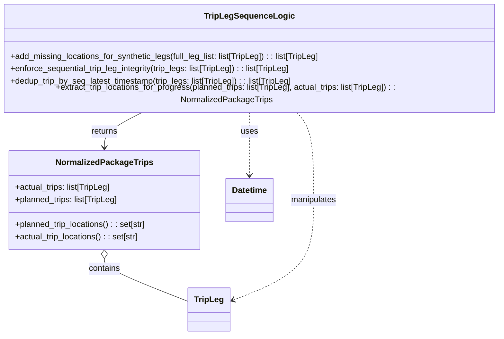

# Diagram: partview_service/partview_service/core/business/trip_leg/TripLegSequenceLogic.py


> Auto-generated by Obscura crawlers

## Diagram 1



### SVG

<svg id="container" width="975.203125" xmlns="http://www.w3.org/2000/svg" class="classDiagram" height="638" viewBox="0 0 975.203125 638" role="graphics-document document" aria-roledescription="class"><style>#container{font-family:"trebuchet ms",verdana,arial,sans-serif;font-size:16px;fill:#333;}@keyframes edge-animation-frame{from{stroke-dashoffset:0;}}@keyframes dash{to{stroke-dashoffset:0;}}#container .edge-animation-slow{stroke-dasharray:9,5!important;stroke-dashoffset:900;animation:dash 50s linear infinite;stroke-linecap:round;}#container .edge-animation-fast{stroke-dasharray:9,5!important;stroke-dashoffset:900;animation:dash 20s linear infinite;stroke-linecap:round;}#container .error-icon{fill:#552222;}#container .error-text{fill:#552222;stroke:#552222;}#container .edge-thickness-normal{stroke-width:1px;}#container .edge-thickness-thick{stroke-width:3.5px;}#container .edge-pattern-solid{stroke-dasharray:0;}#container .edge-thickness-invisible{stroke-width:0;fill:none;}#container .edge-pattern-dashed{stroke-dasharray:3;}#container .edge-pattern-dotted{stroke-dasharray:2;}#container .marker{fill:#333333;stroke:#333333;}#container .marker.cross{stroke:#333333;}#container svg{font-family:"trebuchet ms",verdana,arial,sans-serif;font-size:16px;}#container p{margin:0;}#container g.classGroup text{fill:#9370DB;stroke:none;font-family:"trebuchet ms",verdana,arial,sans-serif;font-size:10px;}#container g.classGroup text .title{font-weight:bolder;}#container .nodeLabel,#container .edgeLabel{color:#131300;}#container .edgeLabel .label rect{fill:#ECECFF;}#container .label text{fill:#131300;}#container .labelBkg{background:#ECECFF;}#container .edgeLabel .label span{background:#ECECFF;}#container .classTitle{font-weight:bolder;}#container .node rect,#container .node circle,#container .node ellipse,#container .node polygon,#container .node path{fill:#ECECFF;stroke:#9370DB;stroke-width:1px;}#container .divider{stroke:#9370DB;stroke-width:1;}#container g.clickable{cursor:pointer;}#container g.classGroup rect{fill:#ECECFF;stroke:#9370DB;}#container g.classGroup line{stroke:#9370DB;stroke-width:1;}#container .classLabel .box{stroke:none;stroke-width:0;fill:#ECECFF;opacity:0.5;}#container .classLabel .label{fill:#9370DB;font-size:10px;}#container .relation{stroke:#333333;stroke-width:1;fill:none;}#container .dashed-line{stroke-dasharray:3;}#container .dotted-line{stroke-dasharray:1 2;}#container #compositionStart,#container .composition{fill:#333333!important;stroke:#333333!important;stroke-width:1;}#container #compositionEnd,#container .composition{fill:#333333!important;stroke:#333333!important;stroke-width:1;}#container #dependencyStart,#container .dependency{fill:#333333!important;stroke:#333333!important;stroke-width:1;}#container #dependencyStart,#container .dependency{fill:#333333!important;stroke:#333333!important;stroke-width:1;}#container #extensionStart,#container .extension{fill:transparent!important;stroke:#333333!important;stroke-width:1;}#container #extensionEnd,#container .extension{fill:transparent!important;stroke:#333333!important;stroke-width:1;}#container #aggregationStart,#container .aggregation{fill:transparent!important;stroke:#333333!important;stroke-width:1;}#container #aggregationEnd,#container .aggregation{fill:transparent!important;stroke:#333333!important;stroke-width:1;}#container #lollipopStart,#container .lollipop{fill:#ECECFF!important;stroke:#333333!important;stroke-width:1;}#container #lollipopEnd,#container .lollipop{fill:#ECECFF!important;stroke:#333333!important;stroke-width:1;}#container .edgeTerminals{font-size:11px;line-height:initial;}#container .classTitleText{text-anchor:middle;font-size:18px;fill:#333;}#container .label-icon{display:inline-block;height:1em;overflow:visible;vertical-align:-0.125em;}#container .node .label-icon path{fill:currentColor;stroke:revert;stroke-width:revert;}#container :root{--mermaid-font-family:"trebuchet ms",verdana,arial,sans-serif;}</style><g><defs><marker id="container_class-aggregationStart" class="marker aggregation class" refX="18" refY="7" markerWidth="190" markerHeight="240" orient="auto"><path d="M 18,7 L9,13 L1,7 L9,1 Z"></path></marker></defs><defs><marker id="container_class-aggregationEnd" class="marker aggregation class" refX="1" refY="7" markerWidth="20" markerHeight="28" orient="auto"><path d="M 18,7 L9,13 L1,7 L9,1 Z"></path></marker></defs><defs><marker id="container_class-extensionStart" class="marker extension class" refX="18" refY="7" markerWidth="190" markerHeight="240" orient="auto"><path d="M 1,7 L18,13 V 1 Z"></path></marker></defs><defs><marker id="container_class-extensionEnd" class="marker extension class" refX="1" refY="7" markerWidth="20" markerHeight="28" orient="auto"><path d="M 1,1 V 13 L18,7 Z"></path></marker></defs><defs><marker id="container_class-compositionStart" class="marker composition class" refX="18" refY="7" markerWidth="190" markerHeight="240" orient="auto"><path d="M 18,7 L9,13 L1,7 L9,1 Z"></path></marker></defs><defs><marker id="container_class-compositionEnd" class="marker composition class" refX="1" refY="7" markerWidth="20" markerHeight="28" orient="auto"><path d="M 18,7 L9,13 L1,7 L9,1 Z"></path></marker></defs><defs><marker id="container_class-dependencyStart" class="marker dependency class" refX="6" refY="7" markerWidth="190" markerHeight="240" orient="auto"><path d="M 5,7 L9,13 L1,7 L9,1 Z"></path></marker></defs><defs><marker id="container_class-dependencyEnd" class="marker dependency class" refX="13" refY="7" markerWidth="20" markerHeight="28" orient="auto"><path d="M 18,7 L9,13 L14,7 L9,1 Z"></path></marker></defs><defs><marker id="container_class-lollipopStart" class="marker lollipop class" refX="13" refY="7" markerWidth="190" markerHeight="240" orient="auto"><circle stroke="black" fill="transparent" cx="7" cy="7" r="6"></circle></marker></defs><defs><marker id="container_class-lollipopEnd" class="marker lollipop class" refX="1" refY="7" markerWidth="190" markerHeight="240" orient="auto"><circle stroke="black" fill="transparent" cx="7" cy="7" r="6"></circle></marker></defs><g class="root"><g class="clusters"></g><g class="edgePaths"><path d="M205.961,489.25L205.961,492.542C205.961,495.833,205.961,502.417,233.379,516.349C260.797,530.281,315.633,551.562,343.051,562.203L370.469,572.843" id="id_NormalizedPackageTrips_TripLeg_1" class="edge-thickness-normal edge-pattern-solid relation" style=";;;" data-edge="true" data-et="edge" data-id="id_NormalizedPackageTrips_TripLeg_1" data-points="W3sieCI6MjA1Ljk2MDkzNzUsInkiOjQ3Mn0seyJ4IjoyMDUuOTYwOTM3NSwieSI6NTA5fSx7IngiOjM3MC40Njg3NSwieSI6NTcyLjg0MzM3NTgwNTk1NjR9XQ==" marker-start="url(#container_class-aggregationStart)"></path><path d="M578.947,206L584.637,212.167C590.327,218.333,601.706,230.667,607.396,259C613.086,287.333,613.086,331.667,613.086,376C613.086,420.333,613.086,464.667,586.6,497.112C560.115,529.558,507.143,550.115,480.657,560.394L454.172,570.673" id="id_TripLegSequenceLogic_TripLeg_2" class="edge-thickness-normal edge-pattern-dashed relation" style=";;;" data-edge="true" data-et="edge" data-id="id_TripLegSequenceLogic_TripLeg_2" data-points="W3sieCI6NTc4Ljk0NjgwNjA2NjE3NjUsInkiOjIwNn0seyJ4Ijo2MTMuMDg1OTM3NSwieSI6MjQzfSx7IngiOjYxMy4wODU5Mzc1LCJ5IjozNzZ9LHsieCI6NjEzLjA4NTkzNzUsInkiOjUwOX0seyJ4Ijo0NDguNTc4MTI1LCJ5Ijo1NzIuODQzMzc1ODA1OTU2NH1d" marker-end="url(#container_class-dependencyEnd)"></path><path d="M487.602,206L487.602,212.167C487.602,218.333,487.602,230.667,487.602,251C487.602,271.333,487.602,299.667,487.602,313.833L487.602,328" id="id_TripLegSequenceLogic_Datetime_3" class="edge-thickness-normal edge-pattern-dashed relation" style=";;;" data-edge="true" data-et="edge" data-id="id_TripLegSequenceLogic_Datetime_3" data-points="W3sieCI6NDg3LjYwMTU2MjUsInkiOjIwNn0seyJ4Ijo0ODcuNjAxNTYyNSwieSI6MjQzfSx7IngiOjQ4Ny42MDE1NjI1LCJ5IjozMzR9XQ==" marker-end="url(#container_class-dependencyEnd)"></path><path d="M282.584,206L269.813,212.167C257.043,218.333,231.502,230.667,218.731,242C205.961,253.333,205.961,263.667,205.961,268.833L205.961,274" id="id_TripLegSequenceLogic_NormalizedPackageTrips_4" class="edge-thickness-normal edge-pattern-solid relation" style=";;;" data-edge="true" data-et="edge" data-id="id_TripLegSequenceLogic_NormalizedPackageTrips_4" data-points="W3sieCI6MjgyLjU4Mzc1NDU5NTU4ODIzLCJ5IjoyMDZ9LHsieCI6MjA1Ljk2MDkzNzUsInkiOjI0M30seyJ4IjoyMDUuOTYwOTM3NSwieSI6MjgwfV0=" marker-end="url(#container_class-dependencyEnd)"></path></g><g class="edgeLabels"><g class="edgeLabel" transform="translate(205.9609375, 509)"><g class="label" data-id="id_NormalizedPackageTrips_TripLeg_1" transform="translate(-30.890625, -12)"><foreignObject width="61.78125" height="24"><div xmlns="http://www.w3.org/1999/xhtml" class="labelBkg" style="display: table-cell; white-space: nowrap; line-height: 1.5; max-width: 200px; text-align: center;"><span class="edgeLabel"><p>contains</p></span></div></foreignObject></g></g><g class="edgeLabel" transform="translate(613.0859375, 376)"><g class="label" data-id="id_TripLegSequenceLogic_TripLeg_2" transform="translate(-45.0859375, -12)"><foreignObject width="90.171875" height="24"><div xmlns="http://www.w3.org/1999/xhtml" class="labelBkg" style="display: table-cell; white-space: nowrap; line-height: 1.5; max-width: 200px; text-align: center;"><span class="edgeLabel"><p>manipulates</p></span></div></foreignObject></g></g><g class="edgeLabel" transform="translate(487.6015625, 243)"><g class="label" data-id="id_TripLegSequenceLogic_Datetime_3" transform="translate(-16.4921875, -12)"><foreignObject width="32.984375" height="24"><div xmlns="http://www.w3.org/1999/xhtml" class="labelBkg" style="display: table-cell; white-space: nowrap; line-height: 1.5; max-width: 200px; text-align: center;"><span class="edgeLabel"><p>uses</p></span></div></foreignObject></g></g><g class="edgeLabel" transform="translate(205.9609375, 243)"><g class="label" data-id="id_TripLegSequenceLogic_NormalizedPackageTrips_4" transform="translate(-26.265625, -12)"><foreignObject width="52.53125" height="24"><div xmlns="http://www.w3.org/1999/xhtml" class="labelBkg" style="display: table-cell; white-space: nowrap; line-height: 1.5; max-width: 200px; text-align: center;"><span class="edgeLabel"><p>returns</p></span></div></foreignObject></g></g></g><g class="nodes"><g class="node default" id="classId-NormalizedPackageTrips-0" transform="translate(205.9609375, 376)"><g class="basic label-container"><path d="M-186.2421875 -96 L186.2421875 -96 L186.2421875 96 L-186.2421875 96" stroke="none" stroke-width="0" fill="#ECECFF" style=""></path><path d="M-186.2421875 -96 C-42.22354015052866 -96, 101.79510719894267 -96, 186.2421875 -96 M-186.2421875 -96 C-68.48335761738448 -96, 49.27547226523103 -96, 186.2421875 -96 M186.2421875 -96 C186.2421875 -42.40826608487397, 186.2421875 11.183467830252056, 186.2421875 96 M186.2421875 -96 C186.2421875 -49.083070268253415, 186.2421875 -2.1661405365068305, 186.2421875 96 M186.2421875 96 C40.266514346204616 96, -105.70915880759077 96, -186.2421875 96 M186.2421875 96 C46.382017710177905 96, -93.47815207964419 96, -186.2421875 96 M-186.2421875 96 C-186.2421875 46.106132262430435, -186.2421875 -3.7877354751391294, -186.2421875 -96 M-186.2421875 96 C-186.2421875 44.96652969062527, -186.2421875 -6.066940618749456, -186.2421875 -96" stroke="#9370DB" stroke-width="1.3" fill="none" stroke-dasharray="0 0" style=""></path></g><g class="annotation-group text" transform="translate(0, -72)"></g><g class="label-group text" transform="translate(-89.734375, -72)"><g class="label" style="font-weight: bolder" transform="translate(0,-12)"><foreignObject width="179.46875" height="24"><div xmlns="http://www.w3.org/1999/xhtml" style="display: table-cell; white-space: nowrap; line-height: 1.5; max-width: 227px; text-align: center;"><span class="nodeLabel markdown-node-label" style=""><p>NormalizedPackageTrips</p></span></div></foreignObject></g></g><g class="members-group text" transform="translate(-174.2421875, -24)"><g class="label" style="" transform="translate(0,-12)"><foreignObject width="187.359375" height="24"><div xmlns="http://www.w3.org/1999/xhtml" style="display: table-cell; white-space: nowrap; line-height: 1.5; max-width: 245px; text-align: center;"><span class="nodeLabel markdown-node-label" style=""><p>+actual_trips: list[TripLeg]</p></span></div></foreignObject></g><g class="label" style="" transform="translate(0,12)"><foreignObject width="202.78125" height="24"><div xmlns="http://www.w3.org/1999/xhtml" style="display: table-cell; white-space: nowrap; line-height: 1.5; max-width: 260px; text-align: center;"><span class="nodeLabel markdown-node-label" style=""><p>+planned_trips: list[TripLeg]</p></span></div></foreignObject></g></g><g class="methods-group text" transform="translate(-174.2421875, 48)"><g class="label" style="" transform="translate(0,-12)"><foreignObject width="258.75" height="24"><div xmlns="http://www.w3.org/1999/xhtml" style="display: table-cell; white-space: nowrap; line-height: 1.5; max-width: 316px; text-align: center;"><span class="nodeLabel markdown-node-label" style=""><p>+planned_trip_locations() : : set[str]</p></span></div></foreignObject></g><g class="label" style="" transform="translate(0,12)"><foreignObject width="243.3125" height="24"><div xmlns="http://www.w3.org/1999/xhtml" style="display: table-cell; white-space: nowrap; line-height: 1.5; max-width: 301px; text-align: center;"><span class="nodeLabel markdown-node-label" style=""><p>+actual_trip_locations() : : set[str]</p></span></div></foreignObject></g></g><g class="divider" style=""><path d="M-186.2421875 -48 C-94.2161087991219 -48, -2.1900300982437955 -48, 186.2421875 -48 M-186.2421875 -48 C-105.34331659486642 -48, -24.444445689732845 -48, 186.2421875 -48" stroke="#9370DB" stroke-width="1.3" fill="none" stroke-dasharray="0 0" style=""></path></g><g class="divider" style=""><path d="M-186.2421875 24 C-52.24985580583413 24, 81.74247588833174 24, 186.2421875 24 M-186.2421875 24 C-98.11018518796813 24, -9.978182875936255 24, 186.2421875 24" stroke="#9370DB" stroke-width="1.3" fill="none" stroke-dasharray="0 0" style=""></path></g></g><g class="node default" id="classId-TripLegSequenceLogic-1" transform="translate(487.6015625, 107)"><g class="basic label-container"><path d="M-479.6015625 -99 L479.6015625 -99 L479.6015625 99 L-479.6015625 99" stroke="none" stroke-width="0" fill="#ECECFF" style=""></path><path d="M-479.6015625 -99 C-132.87004393819132 -99, 213.86147462361737 -99, 479.6015625 -99 M-479.6015625 -99 C-259.2873855466694 -99, -38.973208593338825 -99, 479.6015625 -99 M479.6015625 -99 C479.6015625 -28.99182081578489, 479.6015625 41.01635836843022, 479.6015625 99 M479.6015625 -99 C479.6015625 -47.395889190297964, 479.6015625 4.208221619404071, 479.6015625 99 M479.6015625 99 C119.14120003819181 99, -241.31916242361638 99, -479.6015625 99 M479.6015625 99 C253.35207402996483 99, 27.10258555992965 99, -479.6015625 99 M-479.6015625 99 C-479.6015625 38.57985308734931, -479.6015625 -21.840293825301373, -479.6015625 -99 M-479.6015625 99 C-479.6015625 58.80315819937802, -479.6015625 18.606316398756036, -479.6015625 -99" stroke="#9370DB" stroke-width="1.3" fill="none" stroke-dasharray="0 0" style=""></path></g><g class="annotation-group text" transform="translate(0, -75)"></g><g class="label-group text" transform="translate(-81.609375, -75)"><g class="label" style="font-weight: bolder" transform="translate(0,-12)"><foreignObject width="163.21875" height="24"><div xmlns="http://www.w3.org/1999/xhtml" style="display: table-cell; white-space: nowrap; line-height: 1.5; max-width: 211px; text-align: center;"><span class="nodeLabel markdown-node-label" style=""><p>TripLegSequenceLogic</p></span></div></foreignObject></g></g><g class="members-group text" transform="translate(-467.6015625, -27)"></g><g class="methods-group text" transform="translate(-467.6015625, 3)"><g class="label" style="" transform="translate(0,-12)"><foreignObject width="607.09375" height="24"><div xmlns="http://www.w3.org/1999/xhtml" style="display: table-cell; white-space: nowrap; line-height: 1.5; max-width: 664px; text-align: center;"><span class="nodeLabel markdown-node-label" style=""><p>+add_missing_locations_for_synthetic_legs(full_leg_list: list[TripLeg]) : : list[TripLeg]</p></span></div></foreignObject></g><g class="label" style="" transform="translate(0,12)"><foreignObject width="552.109375" height="24"><div xmlns="http://www.w3.org/1999/xhtml" style="display: table-cell; white-space: nowrap; line-height: 1.5; max-width: 609px; text-align: center;"><span class="nodeLabel markdown-node-label" style=""><p>+enforce_sequential_trip_leg_integrity(trip_legs: list[TripLeg]) : : list[TripLeg]</p></span></div></foreignObject></g><g class="label" style="" transform="translate(0,36)"><foreignObject width="554.453125" height="24"><div xmlns="http://www.w3.org/1999/xhtml" style="display: table-cell; white-space: nowrap; line-height: 1.5; max-width: 612px; text-align: center;"><span class="nodeLabel markdown-node-label" style=""><p>+dedup_trip_by_seq_latest_timestamp(trip_legs: list[TripLeg]) : : list[TripLeg]</p></span></div></foreignObject></g><g class="label" style="" transform="translate(0,60)"><foreignObject width="853.59375" height="24"><div xmlns="http://www.w3.org/1999/xhtml" style="display: table-cell; white-space: nowrap; line-height: 1.5; max-width: 911px; text-align: center;"><span class="nodeLabel markdown-node-label" style=""><p>+extract_trip_locations_for_progress(planned_trips: list[TripLeg], actual_trips: list[TripLeg]) : : NormalizedPackageTrips</p></span></div></foreignObject></g></g><g class="divider" style=""><path d="M-479.6015625 -51 C-207.30055706691587 -51, 65.00044836616826 -51, 479.6015625 -51 M-479.6015625 -51 C-99.28114472858863 -51, 281.03927304282274 -51, 479.6015625 -51" stroke="#9370DB" stroke-width="1.3" fill="none" stroke-dasharray="0 0" style=""></path></g><g class="divider" style=""><path d="M-479.6015625 -27 C-272.2880970063853 -27, -64.9746315127706 -27, 479.6015625 -27 M-479.6015625 -27 C-148.06392581333245 -27, 183.4737108733351 -27, 479.6015625 -27" stroke="#9370DB" stroke-width="1.3" fill="none" stroke-dasharray="0 0" style=""></path></g></g><g class="node default" id="classId-TripLeg-2" transform="translate(409.5234375, 588)"><g class="basic label-container"><path d="M-39.0546875 -42 L39.0546875 -42 L39.0546875 42 L-39.0546875 42" stroke="none" stroke-width="0" fill="#ECECFF" style=""></path><path d="M-39.0546875 -42 C-7.97841085508049 -42, 23.09786578983902 -42, 39.0546875 -42 M-39.0546875 -42 C-15.17072899640382 -42, 8.71322950719236 -42, 39.0546875 -42 M39.0546875 -42 C39.0546875 -13.733195825834727, 39.0546875 14.533608348330546, 39.0546875 42 M39.0546875 -42 C39.0546875 -23.639300081179304, 39.0546875 -5.278600162358607, 39.0546875 42 M39.0546875 42 C8.786158678297213 42, -21.482370143405575 42, -39.0546875 42 M39.0546875 42 C12.930134357579746 42, -13.194418784840508 42, -39.0546875 42 M-39.0546875 42 C-39.0546875 18.499368542310116, -39.0546875 -5.001262915379769, -39.0546875 -42 M-39.0546875 42 C-39.0546875 24.0621689562854, -39.0546875 6.124337912570802, -39.0546875 -42" stroke="#9370DB" stroke-width="1.3" fill="none" stroke-dasharray="0 0" style=""></path></g><g class="annotation-group text" transform="translate(0, -18)"></g><g class="label-group text" transform="translate(-27.0546875, -18)"><g class="label" style="font-weight: bolder" transform="translate(0,-12)"><foreignObject width="54.109375" height="24"><div xmlns="http://www.w3.org/1999/xhtml" style="display: table-cell; white-space: nowrap; line-height: 1.5; max-width: 103px; text-align: center;"><span class="nodeLabel markdown-node-label" style=""><p>TripLeg</p></span></div></foreignObject></g></g><g class="members-group text" transform="translate(-27.0546875, 30)"></g><g class="methods-group text" transform="translate(-27.0546875, 60)"></g><g class="divider" style=""><path d="M-39.0546875 6 C-13.00782195761142 6, 13.039043584777161 6, 39.0546875 6 M-39.0546875 6 C-19.09971592998092 6, 0.855255640038159 6, 39.0546875 6" stroke="#9370DB" stroke-width="1.3" fill="none" stroke-dasharray="0 0" style=""></path></g><g class="divider" style=""><path d="M-39.0546875 24 C-15.703528073388522 24, 7.647631353222955 24, 39.0546875 24 M-39.0546875 24 C-11.665758216208964 24, 15.723171067582072 24, 39.0546875 24" stroke="#9370DB" stroke-width="1.3" fill="none" stroke-dasharray="0 0" style=""></path></g></g><g class="node default" id="classId-Datetime-3" transform="translate(487.6015625, 376)"><g class="basic label-container"><path d="M-45.3984375 -42 L45.3984375 -42 L45.3984375 42 L-45.3984375 42" stroke="none" stroke-width="0" fill="#ECECFF" style=""></path><path d="M-45.3984375 -42 C-10.106244779940788 -42, 25.185947940118425 -42, 45.3984375 -42 M-45.3984375 -42 C-17.21367913599812 -42, 10.97107922800376 -42, 45.3984375 -42 M45.3984375 -42 C45.3984375 -22.883576284424276, 45.3984375 -3.7671525688485517, 45.3984375 42 M45.3984375 -42 C45.3984375 -14.638675735311349, 45.3984375 12.722648529377302, 45.3984375 42 M45.3984375 42 C14.309838506828768 42, -16.778760486342463 42, -45.3984375 42 M45.3984375 42 C9.770883581001819 42, -25.856670337996363 42, -45.3984375 42 M-45.3984375 42 C-45.3984375 10.962348105539633, -45.3984375 -20.075303788920735, -45.3984375 -42 M-45.3984375 42 C-45.3984375 14.858427017668905, -45.3984375 -12.28314596466219, -45.3984375 -42" stroke="#9370DB" stroke-width="1.3" fill="none" stroke-dasharray="0 0" style=""></path></g><g class="annotation-group text" transform="translate(0, -18)"></g><g class="label-group text" transform="translate(-33.3984375, -18)"><g class="label" style="font-weight: bolder" transform="translate(0,-12)"><foreignObject width="66.796875" height="24"><div xmlns="http://www.w3.org/1999/xhtml" style="display: table-cell; white-space: nowrap; line-height: 1.5; max-width: 116px; text-align: center;"><span class="nodeLabel markdown-node-label" style=""><p>Datetime</p></span></div></foreignObject></g></g><g class="members-group text" transform="translate(-33.3984375, 30)"></g><g class="methods-group text" transform="translate(-33.3984375, 60)"></g><g class="divider" style=""><path d="M-45.3984375 6 C-16.72929229619833 6, 11.939852907603338 6, 45.3984375 6 M-45.3984375 6 C-26.37561144584607 6, -7.352785391692137 6, 45.3984375 6" stroke="#9370DB" stroke-width="1.3" fill="none" stroke-dasharray="0 0" style=""></path></g><g class="divider" style=""><path d="M-45.3984375 24 C-14.759128685877577 24, 15.880180128244845 24, 45.3984375 24 M-45.3984375 24 C-17.960369378860545 24, 9.47769874227891 24, 45.3984375 24" stroke="#9370DB" stroke-width="1.3" fill="none" stroke-dasharray="0 0" style=""></path></g></g></g></g></g></svg>

## Diagram 2

```mermaid
flowchart TD
    Planned[Planned Trips] -->|present| EnforcePlanned[enforce_sequential_trip_leg_integrity(planned_trips)]
    Actual[Actual Trips] --> Check{Planned present?}
    Check -->|yes| Merge[Supplement actual with planned missing legs]
    Check -->|no| SkipMerge[No supplement]
    Merge --> EnforceActual[enforce_sequential_trip_leg_integrity(actual_trips)]
    SkipMerge --> EnforceActual
    EnforcePlanned --> AddMissing[add_missing_locations_for_synthetic_legs]
    EnforceActual --> AddMissing
    AddMissing --> Normalize[NormalizedPackageTrips]
    EnforceActual --> Dedup[dedup_trip_by_seq_latest_timestamp]
    Dedup --> EnforcePlanned
```

> SVG rendering failed for this diagram.
