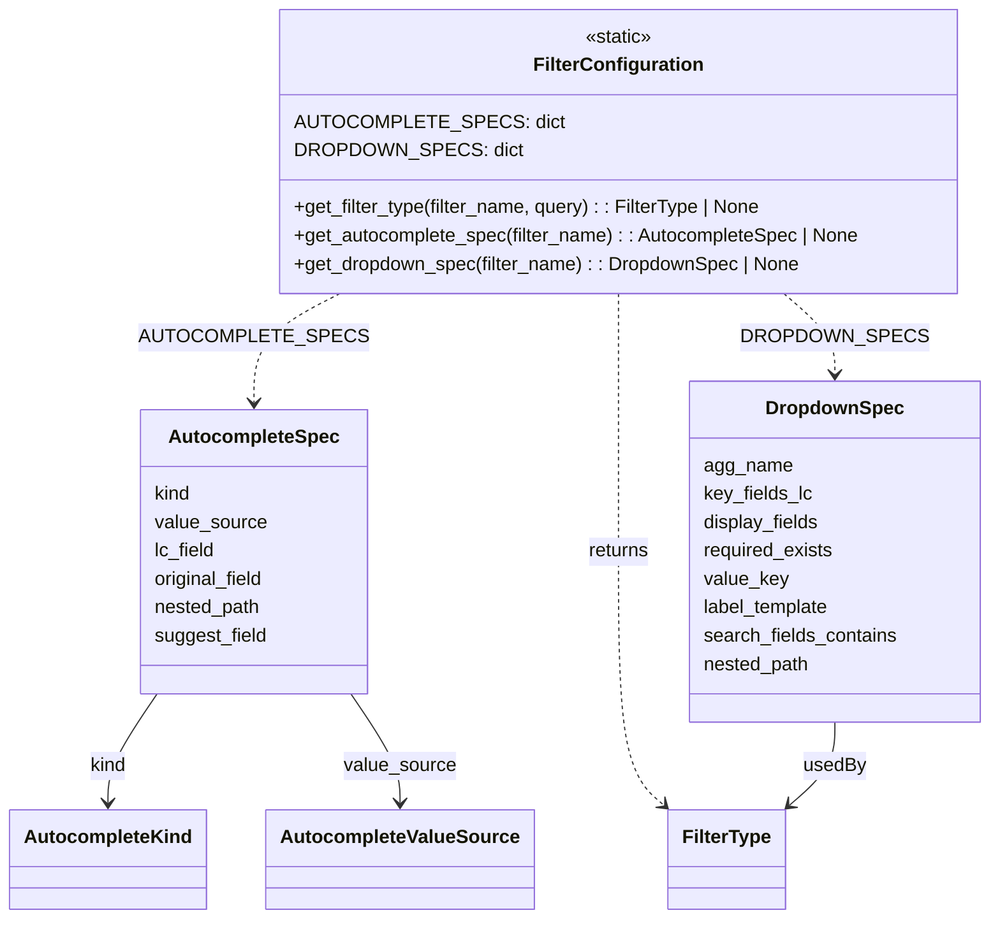

# Diagram: partview_service/partview_service/core/configuration/filter_configuration.py


> Auto-generated by Obscura crawlers

## Diagram 1



### SVG

<svg id="container" width="818.646484375" xmlns="http://www.w3.org/2000/svg" class="classDiagram" height="776" viewBox="0 0 818.646484375 776" role="graphics-document document" aria-roledescription="class"><style>#container{font-family:"trebuchet ms",verdana,arial,sans-serif;font-size:16px;fill:#333;}@keyframes edge-animation-frame{from{stroke-dashoffset:0;}}@keyframes dash{to{stroke-dashoffset:0;}}#container .edge-animation-slow{stroke-dasharray:9,5!important;stroke-dashoffset:900;animation:dash 50s linear infinite;stroke-linecap:round;}#container .edge-animation-fast{stroke-dasharray:9,5!important;stroke-dashoffset:900;animation:dash 20s linear infinite;stroke-linecap:round;}#container .error-icon{fill:#552222;}#container .error-text{fill:#552222;stroke:#552222;}#container .edge-thickness-normal{stroke-width:1px;}#container .edge-thickness-thick{stroke-width:3.5px;}#container .edge-pattern-solid{stroke-dasharray:0;}#container .edge-thickness-invisible{stroke-width:0;fill:none;}#container .edge-pattern-dashed{stroke-dasharray:3;}#container .edge-pattern-dotted{stroke-dasharray:2;}#container .marker{fill:#333333;stroke:#333333;}#container .marker.cross{stroke:#333333;}#container svg{font-family:"trebuchet ms",verdana,arial,sans-serif;font-size:16px;}#container p{margin:0;}#container g.classGroup text{fill:#9370DB;stroke:none;font-family:"trebuchet ms",verdana,arial,sans-serif;font-size:10px;}#container g.classGroup text .title{font-weight:bolder;}#container .nodeLabel,#container .edgeLabel{color:#131300;}#container .edgeLabel .label rect{fill:#ECECFF;}#container .label text{fill:#131300;}#container .labelBkg{background:#ECECFF;}#container .edgeLabel .label span{background:#ECECFF;}#container .classTitle{font-weight:bolder;}#container .node rect,#container .node circle,#container .node ellipse,#container .node polygon,#container .node path{fill:#ECECFF;stroke:#9370DB;stroke-width:1px;}#container .divider{stroke:#9370DB;stroke-width:1;}#container g.clickable{cursor:pointer;}#container g.classGroup rect{fill:#ECECFF;stroke:#9370DB;}#container g.classGroup line{stroke:#9370DB;stroke-width:1;}#container .classLabel .box{stroke:none;stroke-width:0;fill:#ECECFF;opacity:0.5;}#container .classLabel .label{fill:#9370DB;font-size:10px;}#container .relation{stroke:#333333;stroke-width:1;fill:none;}#container .dashed-line{stroke-dasharray:3;}#container .dotted-line{stroke-dasharray:1 2;}#container #compositionStart,#container .composition{fill:#333333!important;stroke:#333333!important;stroke-width:1;}#container #compositionEnd,#container .composition{fill:#333333!important;stroke:#333333!important;stroke-width:1;}#container #dependencyStart,#container .dependency{fill:#333333!important;stroke:#333333!important;stroke-width:1;}#container #dependencyStart,#container .dependency{fill:#333333!important;stroke:#333333!important;stroke-width:1;}#container #extensionStart,#container .extension{fill:transparent!important;stroke:#333333!important;stroke-width:1;}#container #extensionEnd,#container .extension{fill:transparent!important;stroke:#333333!important;stroke-width:1;}#container #aggregationStart,#container .aggregation{fill:transparent!important;stroke:#333333!important;stroke-width:1;}#container #aggregationEnd,#container .aggregation{fill:transparent!important;stroke:#333333!important;stroke-width:1;}#container #lollipopStart,#container .lollipop{fill:#ECECFF!important;stroke:#333333!important;stroke-width:1;}#container #lollipopEnd,#container .lollipop{fill:#ECECFF!important;stroke:#333333!important;stroke-width:1;}#container .edgeTerminals{font-size:11px;line-height:initial;}#container .classTitleText{text-anchor:middle;font-size:18px;fill:#333;}#container .label-icon{display:inline-block;height:1em;overflow:visible;vertical-align:-0.125em;}#container .node .label-icon path{fill:currentColor;stroke:revert;stroke-width:revert;}#container :root{--mermaid-font-family:"trebuchet ms",verdana,arial,sans-serif;}</style><g><defs><marker id="container_class-aggregationStart" class="marker aggregation class" refX="18" refY="7" markerWidth="190" markerHeight="240" orient="auto"><path d="M 18,7 L9,13 L1,7 L9,1 Z"></path></marker></defs><defs><marker id="container_class-aggregationEnd" class="marker aggregation class" refX="1" refY="7" markerWidth="20" markerHeight="28" orient="auto"><path d="M 18,7 L9,13 L1,7 L9,1 Z"></path></marker></defs><defs><marker id="container_class-extensionStart" class="marker extension class" refX="18" refY="7" markerWidth="190" markerHeight="240" orient="auto"><path d="M 1,7 L18,13 V 1 Z"></path></marker></defs><defs><marker id="container_class-extensionEnd" class="marker extension class" refX="1" refY="7" markerWidth="20" markerHeight="28" orient="auto"><path d="M 1,1 V 13 L18,7 Z"></path></marker></defs><defs><marker id="container_class-compositionStart" class="marker composition class" refX="18" refY="7" markerWidth="190" markerHeight="240" orient="auto"><path d="M 18,7 L9,13 L1,7 L9,1 Z"></path></marker></defs><defs><marker id="container_class-compositionEnd" class="marker composition class" refX="1" refY="7" markerWidth="20" markerHeight="28" orient="auto"><path d="M 18,7 L9,13 L1,7 L9,1 Z"></path></marker></defs><defs><marker id="container_class-dependencyStart" class="marker dependency class" refX="6" refY="7" markerWidth="190" markerHeight="240" orient="auto"><path d="M 5,7 L9,13 L1,7 L9,1 Z"></path></marker></defs><defs><marker id="container_class-dependencyEnd" class="marker dependency class" refX="13" refY="7" markerWidth="20" markerHeight="28" orient="auto"><path d="M 18,7 L9,13 L14,7 L9,1 Z"></path></marker></defs><defs><marker id="container_class-lollipopStart" class="marker lollipop class" refX="13" refY="7" markerWidth="190" markerHeight="240" orient="auto"><circle stroke="black" fill="transparent" cx="7" cy="7" r="6"></circle></marker></defs><defs><marker id="container_class-lollipopEnd" class="marker lollipop class" refX="1" refY="7" markerWidth="190" markerHeight="240" orient="auto"><circle stroke="black" fill="transparent" cx="7" cy="7" r="6"></circle></marker></defs><g class="root"><g class="clusters"></g><g class="edgePaths"><path d="M276.843,248L265.088,254.167C253.333,260.333,229.823,272.667,218.068,288C206.313,303.333,206.313,321.667,206.313,330.833L206.313,340" id="id_FilterConfiguration_AutocompleteSpec_1" class="edge-thickness-normal edge-pattern-dashed relation" style=";;;" data-edge="true" data-et="edge" data-id="id_FilterConfiguration_AutocompleteSpec_1" data-points="W3sieCI6Mjc2Ljg0MzI4OTcwOTM5NDg3LCJ5IjoyNDh9LHsieCI6MjA2LjMxMjUsInkiOjI4NX0seyJ4IjoyMDYuMzEyNSwieSI6MzQ2fV0=" marker-end="url(#container_class-dependencyEnd)"></path><path d="M645.587,248L652.781,254.167C659.975,260.333,674.364,272.667,681.558,284C688.752,295.333,688.752,305.667,688.752,310.833L688.752,316" id="id_FilterConfiguration_DropdownSpec_2" class="edge-thickness-normal edge-pattern-dashed relation" style=";;;" data-edge="true" data-et="edge" data-id="id_FilterConfiguration_DropdownSpec_2" data-points="W3sieCI6NjQ1LjU4NjgyMDc2MDM1MDMsInkiOjI0OH0seyJ4Ijo2ODguNzUxOTUzMTI1LCJ5IjoyODV9LHsieCI6Njg4Ljc1MTk1MzEyNSwieSI6MzIyfV0=" marker-end="url(#container_class-dependencyEnd)"></path><path d="M505.592,248L505.592,254.167C505.592,260.333,505.592,272.667,505.592,309C505.592,345.333,505.592,405.667,505.592,466C505.592,526.333,505.592,586.667,512.064,622.417C518.536,658.166,531.481,669.333,537.953,674.916L544.426,680.499" id="id_FilterConfiguration_FilterType_3" class="edge-thickness-normal edge-pattern-dashed relation" style=";;;" data-edge="true" data-et="edge" data-id="id_FilterConfiguration_FilterType_3" data-points="W3sieCI6NTA1LjU5MTc5Njg3NSwieSI6MjQ4fSx7IngiOjUwNS41OTE3OTY4NzUsInkiOjI4NX0seyJ4Ijo1MDUuNTkxNzk2ODc1LCJ5Ijo0NjZ9LHsieCI6NTA1LjU5MTc5Njg3NSwieSI6NjQ3fSx7IngiOjU0OC45Njg3NSwieSI6Njg0LjQxODM5MjM3MzQ3Nzh9XQ==" marker-end="url(#container_class-dependencyEnd)"></path><path d="M127.635,586L120.969,596.167C114.304,606.333,100.972,626.667,94.306,642C87.641,657.333,87.641,667.667,87.641,672.833L87.641,678" id="id_AutocompleteSpec_AutocompleteKind_4" class="edge-thickness-normal edge-pattern-solid relation" style=";;;" data-edge="true" data-et="edge" data-id="id_AutocompleteSpec_AutocompleteKind_4" data-points="W3sieCI6MTI3LjYzNTAxMzgxMjE1NDcsInkiOjU4Nn0seyJ4Ijo4Ny42NDA2MjUsInkiOjY0N30seyJ4Ijo4Ny42NDA2MjUsInkiOjY4NH1d" marker-end="url(#container_class-dependencyEnd)"></path><path d="M284.99,586L291.656,596.167C298.321,606.333,311.653,626.667,318.319,642C324.984,657.333,324.984,667.667,324.984,672.833L324.984,678" id="id_AutocompleteSpec_AutocompleteValueSource_5" class="edge-thickness-normal edge-pattern-solid relation" style=";;;" data-edge="true" data-et="edge" data-id="id_AutocompleteSpec_AutocompleteValueSource_5" data-points="W3sieCI6Mjg0Ljk4OTk4NjE4Nzg0NTMsInkiOjU4Nn0seyJ4IjozMjQuOTg0Mzc1LCJ5Ijo2NDd9LHsieCI6MzI0Ljk4NDM3NSwieSI6Njg0fV0=" marker-end="url(#container_class-dependencyEnd)"></path><path d="M688.752,610L688.752,616.167C688.752,622.333,688.752,634.667,682.28,646.417C675.807,658.166,662.863,669.333,656.39,674.916L649.918,680.499" id="id_DropdownSpec_FilterType_6" class="edge-thickness-normal edge-pattern-solid relation" style=";;;" data-edge="true" data-et="edge" data-id="id_DropdownSpec_FilterType_6" data-points="W3sieCI6Njg4Ljc1MTk1MzEyNSwieSI6NjEwfSx7IngiOjY4OC43NTE5NTMxMjUsInkiOjY0N30seyJ4Ijo2NDUuMzc1LCJ5Ijo2ODQuNDE4MzkyMzczNDc3OH1d" marker-end="url(#container_class-dependencyEnd)"></path></g><g class="edgeLabels"><g class="edgeLabel" transform="translate(206.3125, 285)"><g class="label" data-id="id_FilterConfiguration_AutocompleteSpec_1" transform="translate(-82.5, -12)"><foreignObject width="165" height="24"><div xmlns="http://www.w3.org/1999/xhtml" class="labelBkg" style="display: table-cell; white-space: nowrap; line-height: 1.5; max-width: 200px; text-align: center;"><span class="edgeLabel"><p>AUTOCOMPLETE_SPECS</p></span></div></foreignObject></g></g><g class="edgeLabel" transform="translate(688.751953125, 285)"><g class="label" data-id="id_FilterConfiguration_DropdownSpec_2" transform="translate(-68.8203125, -12)"><foreignObject width="137.640625" height="24"><div xmlns="http://www.w3.org/1999/xhtml" class="labelBkg" style="display: table-cell; white-space: nowrap; line-height: 1.5; max-width: 200px; text-align: center;"><span class="edgeLabel"><p>DROPDOWN_SPECS</p></span></div></foreignObject></g></g><g class="edgeLabel" transform="translate(505.591796875, 466)"><g class="label" data-id="id_FilterConfiguration_FilterType_3" transform="translate(-26.265625, -12)"><foreignObject width="52.53125" height="24"><div xmlns="http://www.w3.org/1999/xhtml" class="labelBkg" style="display: table-cell; white-space: nowrap; line-height: 1.5; max-width: 200px; text-align: center;"><span class="edgeLabel"><p>returns</p></span></div></foreignObject></g></g><g class="edgeLabel" transform="translate(87.640625, 647)"><g class="label" data-id="id_AutocompleteSpec_AutocompleteKind_4" transform="translate(-15.828125, -12)"><foreignObject width="31.65625" height="24"><div xmlns="http://www.w3.org/1999/xhtml" class="labelBkg" style="display: table-cell; white-space: nowrap; line-height: 1.5; max-width: 200px; text-align: center;"><span class="edgeLabel"><p>kind</p></span></div></foreignObject></g></g><g class="edgeLabel" transform="translate(324.984375, 647)"><g class="label" data-id="id_AutocompleteSpec_AutocompleteValueSource_5" transform="translate(-47.3828125, -12)"><foreignObject width="94.765625" height="24"><div xmlns="http://www.w3.org/1999/xhtml" class="labelBkg" style="display: table-cell; white-space: nowrap; line-height: 1.5; max-width: 200px; text-align: center;"><span class="edgeLabel"><p>value_source</p></span></div></foreignObject></g></g><g class="edgeLabel" transform="translate(688.751953125, 647)"><g class="label" data-id="id_DropdownSpec_FilterType_6" transform="translate(-26.34375, -12)"><foreignObject width="52.6875" height="24"><div xmlns="http://www.w3.org/1999/xhtml" class="labelBkg" style="display: table-cell; white-space: nowrap; line-height: 1.5; max-width: 200px; text-align: center;"><span class="edgeLabel"><p>usedBy</p></span></div></foreignObject></g></g></g><g class="nodes"><g class="node default" id="classId-FilterConfiguration-0" transform="translate(505.591796875, 128)"><g class="basic label-container"><path d="M-286.9296875 -120 L286.9296875 -120 L286.9296875 120 L-286.9296875 120" stroke="none" stroke-width="0" fill="#ECECFF" style=""></path><path d="M-286.9296875 -120 C-79.57771190790842 -120, 127.77426368418315 -120, 286.9296875 -120 M-286.9296875 -120 C-138.21420793383282 -120, 10.501271632334351 -120, 286.9296875 -120 M286.9296875 -120 C286.9296875 -44.75026685153419, 286.9296875 30.499466296931615, 286.9296875 120 M286.9296875 -120 C286.9296875 -70.12185141975272, 286.9296875 -20.243702839505445, 286.9296875 120 M286.9296875 120 C153.71316217572297 120, 20.496636851445942 120, -286.9296875 120 M286.9296875 120 C106.92252030363832 120, -73.08464689272336 120, -286.9296875 120 M-286.9296875 120 C-286.9296875 49.799270313302415, -286.9296875 -20.40145937339517, -286.9296875 -120 M-286.9296875 120 C-286.9296875 68.83531527325741, -286.9296875 17.67063054651483, -286.9296875 -120" stroke="#9370DB" stroke-width="1.3" fill="none" stroke-dasharray="0 0" style=""></path></g><g class="annotation-group text" transform="translate(-29.0234375, -96)"><g class="label" style="" transform="translate(0,-12)"><foreignObject width="58.046875" height="24"><div xmlns="http://www.w3.org/1999/xhtml" style="display: table-cell; white-space: nowrap; line-height: 1.5; max-width: 108px; text-align: center;"><span class="nodeLabel markdown-node-label" style=""><p>«static»</p></span></div></foreignObject></g></g><g class="label-group text" transform="translate(-68.234375, -72)"><g class="label" style="font-weight: bolder" transform="translate(0,-12)"><foreignObject width="136.46875" height="24"><div xmlns="http://www.w3.org/1999/xhtml" style="display: table-cell; white-space: nowrap; line-height: 1.5; max-width: 184px; text-align: center;"><span class="nodeLabel markdown-node-label" style=""><p>FilterConfiguration</p></span></div></foreignObject></g></g><g class="members-group text" transform="translate(-274.9296875, -24)"><g class="label" style="" transform="translate(0,-12)"><foreignObject width="200.578125" height="24"><div xmlns="http://www.w3.org/1999/xhtml" style="display: table-cell; white-space: nowrap; line-height: 1.5; max-width: 251px; text-align: center;"><span class="nodeLabel markdown-node-label" style=""><p>AUTOCOMPLETE_SPECS: dict</p></span></div></foreignObject></g><g class="label" style="" transform="translate(0,12)"><foreignObject width="173.21875" height="24"><div xmlns="http://www.w3.org/1999/xhtml" style="display: table-cell; white-space: nowrap; line-height: 1.5; max-width: 223px; text-align: center;"><span class="nodeLabel markdown-node-label" style=""><p>DROPDOWN_SPECS: dict</p></span></div></foreignObject></g></g><g class="methods-group text" transform="translate(-274.9296875, 48)"><g class="label" style="" transform="translate(0,-12)"><foreignObject width="397.546875" height="24"><div xmlns="http://www.w3.org/1999/xhtml" style="display: table-cell; white-space: nowrap; line-height: 1.5; max-width: 455px; text-align: center;"><span class="nodeLabel markdown-node-label" style=""><p>+get_filter_type(filter_name, query) : : FilterType | None</p></span></div></foreignObject></g><g class="label" style="" transform="translate(0,12)"><foreignObject width="481.625" height="24"><div xmlns="http://www.w3.org/1999/xhtml" style="display: table-cell; white-space: nowrap; line-height: 1.5; max-width: 539px; text-align: center;"><span class="nodeLabel markdown-node-label" style=""><p>+get_autocomplete_spec(filter_name) : : AutocompleteSpec | None</p></span></div></foreignObject></g><g class="label" style="" transform="translate(0,36)"><foreignObject width="429.21875" height="24"><div xmlns="http://www.w3.org/1999/xhtml" style="display: table-cell; white-space: nowrap; line-height: 1.5; max-width: 487px; text-align: center;"><span class="nodeLabel markdown-node-label" style=""><p>+get_dropdown_spec(filter_name) : : DropdownSpec | None</p></span></div></foreignObject></g></g><g class="divider" style=""><path d="M-286.9296875 -48 C-92.95716812743473 -48, 101.01535124513055 -48, 286.9296875 -48 M-286.9296875 -48 C-72.47379403656058 -48, 141.98209942687885 -48, 286.9296875 -48" stroke="#9370DB" stroke-width="1.3" fill="none" stroke-dasharray="0 0" style=""></path></g><g class="divider" style=""><path d="M-286.9296875 24 C-98.70963161885376 24, 89.51042426229247 24, 286.9296875 24 M-286.9296875 24 C-58.634190818396036 24, 169.66130586320793 24, 286.9296875 24" stroke="#9370DB" stroke-width="1.3" fill="none" stroke-dasharray="0 0" style=""></path></g></g><g class="node default" id="classId-AutocompleteSpec-1" transform="translate(206.3125, 466)"><g class="basic label-container"><path d="M-94.04296875 -120 L94.04296875 -120 L94.04296875 120 L-94.04296875 120" stroke="none" stroke-width="0" fill="#ECECFF" style=""></path><path d="M-94.04296875 -120 C-31.52520268544145 -120, 30.9925633791171 -120, 94.04296875 -120 M-94.04296875 -120 C-47.504633645488965 -120, -0.966298540977931 -120, 94.04296875 -120 M94.04296875 -120 C94.04296875 -65.15772912260509, 94.04296875 -10.31545824521018, 94.04296875 120 M94.04296875 -120 C94.04296875 -59.39235276148714, 94.04296875 1.2152944770257221, 94.04296875 120 M94.04296875 120 C54.308274213056656 120, 14.573579676113312 120, -94.04296875 120 M94.04296875 120 C44.09639830562587 120, -5.850172138748263 120, -94.04296875 120 M-94.04296875 120 C-94.04296875 62.03287241951814, -94.04296875 4.0657448390362845, -94.04296875 -120 M-94.04296875 120 C-94.04296875 25.726809670984125, -94.04296875 -68.54638065803175, -94.04296875 -120" stroke="#9370DB" stroke-width="1.3" fill="none" stroke-dasharray="0 0" style=""></path></g><g class="annotation-group text" transform="translate(0, -96)"></g><g class="label-group text" transform="translate(-68.5078125, -96)"><g class="label" style="font-weight: bolder" transform="translate(0,-12)"><foreignObject width="137.015625" height="24"><div xmlns="http://www.w3.org/1999/xhtml" style="display: table-cell; white-space: nowrap; line-height: 1.5; max-width: 186px; text-align: center;"><span class="nodeLabel markdown-node-label" style=""><p>AutocompleteSpec</p></span></div></foreignObject></g></g><g class="members-group text" transform="translate(-82.04296875, -48)"><g class="label" style="" transform="translate(0,-12)"><foreignObject width="31.65625" height="24"><div xmlns="http://www.w3.org/1999/xhtml" style="display: table-cell; white-space: nowrap; line-height: 1.5; max-width: 82px; text-align: center;"><span class="nodeLabel markdown-node-label" style=""><p>kind</p></span></div></foreignObject></g><g class="label" style="" transform="translate(0,12)"><foreignObject width="94.765625" height="24"><div xmlns="http://www.w3.org/1999/xhtml" style="display: table-cell; white-space: nowrap; line-height: 1.5; max-width: 145px; text-align: center;"><span class="nodeLabel markdown-node-label" style=""><p>value_source</p></span></div></foreignObject></g><g class="label" style="" transform="translate(0,36)"><foreignObject width="52.359375" height="24"><div xmlns="http://www.w3.org/1999/xhtml" style="display: table-cell; white-space: nowrap; line-height: 1.5; max-width: 102px; text-align: center;"><span class="nodeLabel markdown-node-label" style=""><p>lc_field</p></span></div></foreignObject></g><g class="label" style="" transform="translate(0,60)"><foreignObject width="95.578125" height="24"><div xmlns="http://www.w3.org/1999/xhtml" style="display: table-cell; white-space: nowrap; line-height: 1.5; max-width: 146px; text-align: center;"><span class="nodeLabel markdown-node-label" style=""><p>original_field</p></span></div></foreignObject></g><g class="label" style="" transform="translate(0,84)"><foreignObject width="90.921875" height="24"><div xmlns="http://www.w3.org/1999/xhtml" style="display: table-cell; white-space: nowrap; line-height: 1.5; max-width: 141px; text-align: center;"><span class="nodeLabel markdown-node-label" style=""><p>nested_path</p></span></div></foreignObject></g><g class="label" style="" transform="translate(0,108)"><foreignObject width="95.234375" height="24"><div xmlns="http://www.w3.org/1999/xhtml" style="display: table-cell; white-space: nowrap; line-height: 1.5; max-width: 145px; text-align: center;"><span class="nodeLabel markdown-node-label" style=""><p>suggest_field</p></span></div></foreignObject></g></g><g class="methods-group text" transform="translate(-82.04296875, 120)"></g><g class="divider" style=""><path d="M-94.04296875 -72 C-50.047540610824065 -72, -6.05211247164813 -72, 94.04296875 -72 M-94.04296875 -72 C-35.36931979361393 -72, 23.304329162772135 -72, 94.04296875 -72" stroke="#9370DB" stroke-width="1.3" fill="none" stroke-dasharray="0 0" style=""></path></g><g class="divider" style=""><path d="M-94.04296875 96 C-40.69667167956771 96, 12.649625390864585 96, 94.04296875 96 M-94.04296875 96 C-41.456520704719665 96, 11.12992734056067 96, 94.04296875 96" stroke="#9370DB" stroke-width="1.3" fill="none" stroke-dasharray="0 0" style=""></path></g></g><g class="node default" id="classId-DropdownSpec-2" transform="translate(688.751953125, 466)"><g class="basic label-container"><path d="M-121.89453125 -144 L121.89453125 -144 L121.89453125 144 L-121.89453125 144" stroke="none" stroke-width="0" fill="#ECECFF" style=""></path><path d="M-121.89453125 -144 C-24.76063632255756 -144, 72.37325860488488 -144, 121.89453125 -144 M-121.89453125 -144 C-32.69918151220847 -144, 56.49616822558306 -144, 121.89453125 -144 M121.89453125 -144 C121.89453125 -46.91254566556978, 121.89453125 50.17490866886044, 121.89453125 144 M121.89453125 -144 C121.89453125 -76.00754945910867, 121.89453125 -8.015098918217348, 121.89453125 144 M121.89453125 144 C44.46165005184835 144, -32.971231146303296 144, -121.89453125 144 M121.89453125 144 C64.27538650957499 144, 6.656241769149958 144, -121.89453125 144 M-121.89453125 144 C-121.89453125 56.47706142457277, -121.89453125 -31.045877150854466, -121.89453125 -144 M-121.89453125 144 C-121.89453125 33.19105513334745, -121.89453125 -77.6178897333051, -121.89453125 -144" stroke="#9370DB" stroke-width="1.3" fill="none" stroke-dasharray="0 0" style=""></path></g><g class="annotation-group text" transform="translate(0, -120)"></g><g class="label-group text" transform="translate(-55.3046875, -120)"><g class="label" style="font-weight: bolder" transform="translate(0,-12)"><foreignObject width="110.609375" height="24"><div xmlns="http://www.w3.org/1999/xhtml" style="display: table-cell; white-space: nowrap; line-height: 1.5; max-width: 160px; text-align: center;"><span class="nodeLabel markdown-node-label" style=""><p>DropdownSpec</p></span></div></foreignObject></g></g><g class="members-group text" transform="translate(-109.89453125, -72)"><g class="label" style="" transform="translate(0,-12)"><foreignObject width="74.09375" height="24"><div xmlns="http://www.w3.org/1999/xhtml" style="display: table-cell; white-space: nowrap; line-height: 1.5; max-width: 124px; text-align: center;"><span class="nodeLabel markdown-node-label" style=""><p>agg_name</p></span></div></foreignObject></g><g class="label" style="" transform="translate(0,12)"><foreignObject width="91.765625" height="24"><div xmlns="http://www.w3.org/1999/xhtml" style="display: table-cell; white-space: nowrap; line-height: 1.5; max-width: 142px; text-align: center;"><span class="nodeLabel markdown-node-label" style=""><p>key_fields_lc</p></span></div></foreignObject></g><g class="label" style="" transform="translate(0,36)"><foreignObject width="99.09375" height="24"><div xmlns="http://www.w3.org/1999/xhtml" style="display: table-cell; white-space: nowrap; line-height: 1.5; max-width: 149px; text-align: center;"><span class="nodeLabel markdown-node-label" style=""><p>display_fields</p></span></div></foreignObject></g><g class="label" style="" transform="translate(0,60)"><foreignObject width="111.375" height="24"><div xmlns="http://www.w3.org/1999/xhtml" style="display: table-cell; white-space: nowrap; line-height: 1.5; max-width: 161px; text-align: center;"><span class="nodeLabel markdown-node-label" style=""><p>required_exists</p></span></div></foreignObject></g><g class="label" style="" transform="translate(0,84)"><foreignObject width="71.46875" height="24"><div xmlns="http://www.w3.org/1999/xhtml" style="display: table-cell; white-space: nowrap; line-height: 1.5; max-width: 122px; text-align: center;"><span class="nodeLabel markdown-node-label" style=""><p>value_key</p></span></div></foreignObject></g><g class="label" style="" transform="translate(0,108)"><foreignObject width="109.265625" height="24"><div xmlns="http://www.w3.org/1999/xhtml" style="display: table-cell; white-space: nowrap; line-height: 1.5; max-width: 159px; text-align: center;"><span class="nodeLabel markdown-node-label" style=""><p>label_template</p></span></div></foreignObject></g><g class="label" style="" transform="translate(0,132)"><foreignObject width="164.484375" height="24"><div xmlns="http://www.w3.org/1999/xhtml" style="display: table-cell; white-space: nowrap; line-height: 1.5; max-width: 214px; text-align: center;"><span class="nodeLabel markdown-node-label" style=""><p>search_fields_contains</p></span></div></foreignObject></g><g class="label" style="" transform="translate(0,156)"><foreignObject width="90.921875" height="24"><div xmlns="http://www.w3.org/1999/xhtml" style="display: table-cell; white-space: nowrap; line-height: 1.5; max-width: 141px; text-align: center;"><span class="nodeLabel markdown-node-label" style=""><p>nested_path</p></span></div></foreignObject></g></g><g class="methods-group text" transform="translate(-109.89453125, 144)"></g><g class="divider" style=""><path d="M-121.89453125 -96 C-40.57201244349312 -96, 40.750506363013756 -96, 121.89453125 -96 M-121.89453125 -96 C-60.82554200242312 -96, 0.24344724515376015 -96, 121.89453125 -96" stroke="#9370DB" stroke-width="1.3" fill="none" stroke-dasharray="0 0" style=""></path></g><g class="divider" style=""><path d="M-121.89453125 120 C-46.407341544387975 120, 29.07984816122405 120, 121.89453125 120 M-121.89453125 120 C-30.936396050406756 120, 60.02173914918649 120, 121.89453125 120" stroke="#9370DB" stroke-width="1.3" fill="none" stroke-dasharray="0 0" style=""></path></g></g><g class="node default" id="classId-FilterType-3" transform="translate(597.171875, 726)"><g class="basic label-container"><path d="M-48.203125 -42 L48.203125 -42 L48.203125 42 L-48.203125 42" stroke="none" stroke-width="0" fill="#ECECFF" style=""></path><path d="M-48.203125 -42 C-21.56625534605876 -42, 5.0706143078824795 -42, 48.203125 -42 M-48.203125 -42 C-21.59990466375695 -42, 5.003315672486103 -42, 48.203125 -42 M48.203125 -42 C48.203125 -14.766852698892837, 48.203125 12.466294602214326, 48.203125 42 M48.203125 -42 C48.203125 -18.827626155416834, 48.203125 4.344747689166333, 48.203125 42 M48.203125 42 C17.499579219479976 42, -13.203966561040048 42, -48.203125 42 M48.203125 42 C12.508095488552392 42, -23.186934022895215 42, -48.203125 42 M-48.203125 42 C-48.203125 18.717935745408077, -48.203125 -4.5641285091838455, -48.203125 -42 M-48.203125 42 C-48.203125 9.787595765874912, -48.203125 -22.424808468250177, -48.203125 -42" stroke="#9370DB" stroke-width="1.3" fill="none" stroke-dasharray="0 0" style=""></path></g><g class="annotation-group text" transform="translate(0, -18)"></g><g class="label-group text" transform="translate(-36.203125, -18)"><g class="label" style="font-weight: bolder" transform="translate(0,-12)"><foreignObject width="72.40625" height="24"><div xmlns="http://www.w3.org/1999/xhtml" style="display: table-cell; white-space: nowrap; line-height: 1.5; max-width: 121px; text-align: center;"><span class="nodeLabel markdown-node-label" style=""><p>FilterType</p></span></div></foreignObject></g></g><g class="members-group text" transform="translate(-36.203125, 30)"></g><g class="methods-group text" transform="translate(-36.203125, 60)"></g><g class="divider" style=""><path d="M-48.203125 6 C-15.098019951556566 6, 18.00708509688687 6, 48.203125 6 M-48.203125 6 C-28.4714330471444 6, -8.739741094288803 6, 48.203125 6" stroke="#9370DB" stroke-width="1.3" fill="none" stroke-dasharray="0 0" style=""></path></g><g class="divider" style=""><path d="M-48.203125 24 C-21.997747769061657 24, 4.207629461876685 24, 48.203125 24 M-48.203125 24 C-25.788068892809466 24, -3.3730127856189327 24, 48.203125 24" stroke="#9370DB" stroke-width="1.3" fill="none" stroke-dasharray="0 0" style=""></path></g></g><g class="node default" id="classId-AutocompleteKind-4" transform="translate(87.640625, 726)"><g class="basic label-container"><path d="M-79.640625 -42 L79.640625 -42 L79.640625 42 L-79.640625 42" stroke="none" stroke-width="0" fill="#ECECFF" style=""></path><path d="M-79.640625 -42 C-17.73236620507994 -42, 44.17589258984012 -42, 79.640625 -42 M-79.640625 -42 C-22.848835637891845 -42, 33.94295372421631 -42, 79.640625 -42 M79.640625 -42 C79.640625 -9.98233909043045, 79.640625 22.0353218191391, 79.640625 42 M79.640625 -42 C79.640625 -11.178240493037794, 79.640625 19.64351901392441, 79.640625 42 M79.640625 42 C28.881975720242025 42, -21.87667355951595 42, -79.640625 42 M79.640625 42 C39.01212623357468 42, -1.616372532850633 42, -79.640625 42 M-79.640625 42 C-79.640625 17.24886305028533, -79.640625 -7.5022738994293405, -79.640625 -42 M-79.640625 42 C-79.640625 10.626191505639529, -79.640625 -20.747616988720942, -79.640625 -42" stroke="#9370DB" stroke-width="1.3" fill="none" stroke-dasharray="0 0" style=""></path></g><g class="annotation-group text" transform="translate(0, -18)"></g><g class="label-group text" transform="translate(-67.640625, -18)"><g class="label" style="font-weight: bolder" transform="translate(0,-12)"><foreignObject width="135.28125" height="24"><div xmlns="http://www.w3.org/1999/xhtml" style="display: table-cell; white-space: nowrap; line-height: 1.5; max-width: 184px; text-align: center;"><span class="nodeLabel markdown-node-label" style=""><p>AutocompleteKind</p></span></div></foreignObject></g></g><g class="members-group text" transform="translate(-67.640625, 30)"></g><g class="methods-group text" transform="translate(-67.640625, 60)"></g><g class="divider" style=""><path d="M-79.640625 6 C-35.24167834383283 6, 9.157268312334338 6, 79.640625 6 M-79.640625 6 C-30.307953049350076 6, 19.02471890129985 6, 79.640625 6" stroke="#9370DB" stroke-width="1.3" fill="none" stroke-dasharray="0 0" style=""></path></g><g class="divider" style=""><path d="M-79.640625 24 C-34.63249315381228 24, 10.375638692375446 24, 79.640625 24 M-79.640625 24 C-24.441926129886284 24, 30.756772740227433 24, 79.640625 24" stroke="#9370DB" stroke-width="1.3" fill="none" stroke-dasharray="0 0" style=""></path></g></g><g class="node default" id="classId-AutocompleteValueSource-5" transform="translate(324.984375, 726)"><g class="basic label-container"><path d="M-107.703125 -42 L107.703125 -42 L107.703125 42 L-107.703125 42" stroke="none" stroke-width="0" fill="#ECECFF" style=""></path><path d="M-107.703125 -42 C-46.73351093018954 -42, 14.236103139620923 -42, 107.703125 -42 M-107.703125 -42 C-44.85223992505608 -42, 17.998645149887835 -42, 107.703125 -42 M107.703125 -42 C107.703125 -20.668126819108082, 107.703125 0.6637463617838364, 107.703125 42 M107.703125 -42 C107.703125 -9.503449986115626, 107.703125 22.993100027768747, 107.703125 42 M107.703125 42 C28.7131182981647 42, -50.2768884036706 42, -107.703125 42 M107.703125 42 C50.550293556226144 42, -6.602537887547712 42, -107.703125 42 M-107.703125 42 C-107.703125 17.046666115590387, -107.703125 -7.906667768819226, -107.703125 -42 M-107.703125 42 C-107.703125 20.823760041915587, -107.703125 -0.352479916168825, -107.703125 -42" stroke="#9370DB" stroke-width="1.3" fill="none" stroke-dasharray="0 0" style=""></path></g><g class="annotation-group text" transform="translate(0, -18)"></g><g class="label-group text" transform="translate(-95.703125, -18)"><g class="label" style="font-weight: bolder" transform="translate(0,-12)"><foreignObject width="191.40625" height="24"><div xmlns="http://www.w3.org/1999/xhtml" style="display: table-cell; white-space: nowrap; line-height: 1.5; max-width: 239px; text-align: center;"><span class="nodeLabel markdown-node-label" style=""><p>AutocompleteValueSource</p></span></div></foreignObject></g></g><g class="members-group text" transform="translate(-95.703125, 30)"></g><g class="methods-group text" transform="translate(-95.703125, 60)"></g><g class="divider" style=""><path d="M-107.703125 6 C-29.736915597451656 6, 48.22929380509669 6, 107.703125 6 M-107.703125 6 C-63.158275122379656 6, -18.613425244759313 6, 107.703125 6" stroke="#9370DB" stroke-width="1.3" fill="none" stroke-dasharray="0 0" style=""></path></g><g class="divider" style=""><path d="M-107.703125 24 C-26.058170095771672 24, 55.586784808456656 24, 107.703125 24 M-107.703125 24 C-34.16403884627124 24, 39.37504730745752 24, 107.703125 24" stroke="#9370DB" stroke-width="1.3" fill="none" stroke-dasharray="0 0" style=""></path></g></g></g></g></g></svg>

## Diagram 2

```mermaid
flowchart TD
Start["get_filter_type(filter_name, query)"]
CheckAuto{filter_name in AUTOCOMPLETE_SPECS?}
ReturnAuto["Return FilterType.AUTOCOMPLETE"]
CheckDropdown{filter_name in DROPDOWN_SPECS?}
QueryPresent{query != null and len(query) > 0?}
ReturnDropdownSearch["Return FilterType.DROPDOWN_SEARCH"]
ReturnDropdownList["Return FilterType.DROPDOWN_LIST"]
ReturnNone["Return None"]

Start --> CheckAuto
CheckAuto -- yes --> ReturnAuto
CheckAuto -- no --> CheckDropdown
CheckDropdown -- yes --> QueryPresent
QueryPresent -- yes --> ReturnDropdownSearch
QueryPresent -- no --> ReturnDropdownList
CheckDropdown -- no --> ReturnNone
```

> SVG rendering failed for this diagram.
