# Diagram: partview_service/partview_service/core/datamodel/ASNOrder.py

> Auto-generated by Obscura crawlers

## Mermaid

```mermaid
classDiagram
class Persistable {
  +__init__(id, ts, modified)
  +add_dirty_field(name, value)
}
class ASNOrder {
  -status: str
  -solution_id: str
  -external_id: str
  -order_ts: datetime
  -purpose_code: str
  -order_written_ts: datetime
  -priority: str
  -point_of_loading_code: str
  -ownership_code: str
  -asn_match_type: str
  -customer: str
  -record_count: int
  -total_line_items: int
  -total_quantity_line_items: int
  -serial_number: str
  -ship_to: str
  -ship_from: str
  -intermediate_consignee: str
  -promised_delivery_date: datetime
  -packing_slip: str
  -part_per_asn: int
  -packaging_quantity: int
  -conveyance_trailer: str
  -needed_delivery_date: datetime
  -ship_date: datetime
  -delivery_date: datetime
  +solution_id(): str
  +solution_id=(solution_id): ASNOrder
  +external_id(): str
  +external_id=(external_id): ASNOrder
  +purpose_code(): str
  +purpose_code=(purpose_code): ASNOrder
  +status(): str
  +status=(status): ASNOrder
  +packing_slip(): str
  +packing_slip=(packing_slip): ASNOrder
  +part_per_asn(): int
  +part_per_asn=(part_per_asn): ASNOrder
  +packaging_quantity(): int
  +packaging_quantity=(packaging_quantity): ASNOrder
  +priority(): str
  +priority=(priority): ASNOrder
  +order_written_ts(): datetime
  +order_written_ts=(order_written_ts): ASNOrder
  +order_ts(): datetime
  +order_ts=(order_ts): ASNOrder
  +conveyance_trailer(): str
  +conveyance_trailer=(conveyance_trailer): ASNOrder
  +needed_delivery_date(): datetime
  +needed_delivery_date=(needed_delivery_date): ASNOrder
  +promised_delivery_date(): datetime
  +promised_delivery_date=(promised_delivery_date): ASNOrder
  +ship_date(): datetime
  +ship_date=(ship_date): ASNOrder
  +delivery_date(): datetime
  +delivery_date=(delivery_date): ASNOrder
  +record_count(): int
  +record_count=(record_count): ASNOrder
  +customer(): str
  +customer=(customer): ASNOrder
  +total_line_items(): int
  +total_line_items=(total_line_items): ASNOrder
  +total_quantity_line_items(): int
  +total_quantity_line_items=(total_quantity_line_items): ASNOrder
  +serial_number(): str
  +serial_number=(serial_number): ASNOrder
  +ship_to(): str
  +ship_to=(ship_to): ASNOrder
  +ship_from(): str
  +ship_from=(ship_from): ASNOrder
  +intermediate_consignee(): str
  +intermediate_consignee=(intermediate_consignee): ASNOrder
  +asn_match_type(): str
  +asn_match_type=(asn_match_type): ASNOrder
  +point_of_loading_code(): str
  +point_of_loading_code=(point_of_loading_code): ASNOrder
  +ownership_code(): str
  +ownership_code=(ownership_code): ASNOrder
  +is_valid(): bool
}
Persistable <|-- ASNOrder
```

### SVG

<svg id="container" width="563.2890625" xmlns="http://www.w3.org/2000/svg" class="classDiagram" height="2208" viewBox="0 0 563.2890625 2208" role="graphics-document document" aria-roledescription="class"><g><defs><marker id="container_class-aggregationStart" class="marker aggregation class" refX="18" refY="7" markerWidth="190" markerHeight="240" orient="auto"><path d="M 18,7 L9,13 L1,7 L9,1 Z"></path></marker></defs><defs><marker id="container_class-aggregationEnd" class="marker aggregation class" refX="1" refY="7" markerWidth="20" markerHeight="28" orient="auto"><path d="M 18,7 L9,13 L1,7 L9,1 Z"></path></marker></defs><defs><marker id="container_class-extensionStart" class="marker extension class" refX="18" refY="7" markerWidth="190" markerHeight="240" orient="auto"><path d="M 1,7 L18,13 V 1 Z"></path></marker></defs><defs><marker id="container_class-extensionEnd" class="marker extension class" refX="1" refY="7" markerWidth="20" markerHeight="28" orient="auto"><path d="M 1,1 V 13 L18,7 Z"></path></marker></defs><defs><marker id="container_class-compositionStart" class="marker composition class" refX="18" refY="7" markerWidth="190" markerHeight="240" orient="auto"><path d="M 18,7 L9,13 L1,7 L9,1 Z"></path></marker></defs><defs><marker id="container_class-compositionEnd" class="marker composition class" refX="1" refY="7" markerWidth="20" markerHeight="28" orient="auto"><path d="M 18,7 L9,13 L1,7 L9,1 Z"></path></marker></defs><defs><marker id="container_class-dependencyStart" class="marker dependency class" refX="6" refY="7" markerWidth="190" markerHeight="240" orient="auto"><path d="M 5,7 L9,13 L1,7 L9,1 Z"></path></marker></defs><defs><marker id="container_class-dependencyEnd" class="marker dependency class" refX="13" refY="7" markerWidth="20" markerHeight="28" orient="auto"><path d="M 18,7 L9,13 L14,7 L9,1 Z"></path></marker></defs><defs><marker id="container_class-lollipopStart" class="marker lollipop class" refX="13" refY="7" markerWidth="190" markerHeight="240" orient="auto"><circle stroke="black" fill="transparent" cx="7" cy="7" r="6"></circle></marker></defs><defs><marker id="container_class-lollipopEnd" class="marker lollipop class" refX="1" refY="7" markerWidth="190" markerHeight="240" orient="auto"><circle stroke="black" fill="transparent" cx="7" cy="7" r="6"></circle></marker></defs><g class="root"><g class="clusters"></g><g class="edgePaths"><path d="M281.645,175.25L281.645,176.542C281.645,177.833,281.645,180.417,281.645,185.875C281.645,191.333,281.645,199.667,281.645,203.833L281.645,208" id="id_Persistable_ASNOrder_1" class="edge-thickness-normal edge-pattern-solid relation" style=";;;" data-edge="true" data-et="edge" data-id="id_Persistable_ASNOrder_1" data-points="W3sieCI6MjgxLjY0NDUzMTI1LCJ5IjoxNTh9LHsieCI6MjgxLjY0NDUzMTI1LCJ5IjoxODN9LHsieCI6MjgxLjY0NDUzMTI1LCJ5IjoyMDh9XQ==" marker-start="url(#container_class-extensionStart)"></path></g><g class="edgeLabels"><g class="edgeLabel"><g class="label" data-id="id_Persistable_ASNOrder_1" transform="translate(0, 0)"><foreignObject width="0" height="0">

</foreignObject></g></g></g><g class="nodes"><g class="node default" id="classId-Persistable-0" transform="translate(281.64453125, 83)"><g class="basic label-container"><path d="M-139.84765625 -75 L139.84765625 -75 L139.84765625 75 L-139.84765625 75" stroke="none" stroke-width="0" fill="#ECECFF" style=""></path><path d="M-139.84765625 -75 C-54.46648875025652 -75, 30.914678749486967 -75, 139.84765625 -75 M-139.84765625 -75 C-54.39677100932404 -75, 31.054114231351917 -75, 139.84765625 -75 M139.84765625 -75 C139.84765625 -30.250293528052815, 139.84765625 14.49941294389437, 139.84765625 75 M139.84765625 -75 C139.84765625 -43.75033390102148, 139.84765625 -12.500667802042955, 139.84765625 75 M139.84765625 75 C29.512262001195026 75, -80.82313224760995 75, -139.84765625 75 M139.84765625 75 C50.89572905426952 75, -38.05619814146095 75, -139.84765625 75 M-139.84765625 75 C-139.84765625 38.22250819981115, -139.84765625 1.445016399622304, -139.84765625 -75 M-139.84765625 75 C-139.84765625 33.17167027037875, -139.84765625 -8.656659459242505, -139.84765625 -75" stroke="#9370DB" stroke-width="1.3" fill="none" stroke-dasharray="0 0" style=""></path></g><g class="annotation-group text" transform="translate(0, -51)"></g><g class="label-group text" transform="translate(-40.9765625, -51)"><g class="label" style="font-weight: bolder" transform="translate(0,-12)"><foreignObject width="81.953125" height="24">

Persistable

</foreignObject></g></g><g class="members-group text" transform="translate(-127.84765625, -3)"></g><g class="methods-group text" transform="translate(-127.84765625, 27)"><g class="label" style="" transform="translate(0,-12)"><foreignObject width="150.90625" height="24">

+<strong>init</strong>(id, ts, modified)

</foreignObject></g><g class="label" style="" transform="translate(0,12)"><foreignObject width="214.71875" height="24">

+add_dirty_field(name, value)

</foreignObject></g></g><g class="divider" style=""><path d="M-139.84765625 -27 C-46.36475596477335 -27, 47.1181443204533 -27, 139.84765625 -27 M-139.84765625 -27 C-41.633496405081075 -27, 56.58066343983785 -27, 139.84765625 -27" stroke="#9370DB" stroke-width="1.3" fill="none" stroke-dasharray="0 0" style=""></path></g><g class="divider" style=""><path d="M-139.84765625 -3 C-35.49516394723463 -3, 68.85732835553074 -3, 139.84765625 -3 M-139.84765625 -3 C-46.10629769772075 -3, 47.6350608545585 -3, 139.84765625 -3" stroke="#9370DB" stroke-width="1.3" fill="none" stroke-dasharray="0 0" style=""></path></g></g><g class="node default" id="classId-ASNOrder-1" transform="translate(281.64453125, 1204)"><g class="basic label-container"><path d="M-273.64453125 -996 L273.64453125 -996 L273.64453125 996 L-273.64453125 996" stroke="none" stroke-width="0" fill="#ECECFF" style=""></path><path d="M-273.64453125 -996 C-143.3525979271431 -996, -13.060664604286217 -996, 273.64453125 -996 M-273.64453125 -996 C-126.70029570134525 -996, 20.24393984730949 -996, 273.64453125 -996 M273.64453125 -996 C273.64453125 -414.0940879859777, 273.64453125 167.8118240280446, 273.64453125 996 M273.64453125 -996 C273.64453125 -410.9756613852976, 273.64453125 174.0486772294048, 273.64453125 996 M273.64453125 996 C159.64450029871716 996, 45.644469347434324 996, -273.64453125 996 M273.64453125 996 C128.40877295929764 996, -16.826985331404728 996, -273.64453125 996 M-273.64453125 996 C-273.64453125 420.0979615983978, -273.64453125 -155.80407680320445, -273.64453125 -996 M-273.64453125 996 C-273.64453125 532.5212351977358, -273.64453125 69.04247039547158, -273.64453125 -996" stroke="#9370DB" stroke-width="1.3" fill="none" stroke-dasharray="0 0" style=""></path></g><g class="annotation-group text" transform="translate(0, -972)"></g><g class="label-group text" transform="translate(-35.5234375, -972)"><g class="label" style="font-weight: bolder" transform="translate(0,-12)"><foreignObject width="71.046875" height="24">

ASNOrder

</foreignObject></g></g><g class="members-group text" transform="translate(-261.64453125, -924)"><g class="label" style="" transform="translate(0,-12)"><foreignObject width="78.359375" height="24">

-status: str

</foreignObject></g><g class="label" style="" transform="translate(0,12)"><foreignObject width="116.1875" height="24">

-solution_id: str

</foreignObject></g><g class="label" style="" transform="translate(0,36)"><foreignObject width="115.734375" height="24">

-external_id: str

</foreignObject></g><g class="label" style="" transform="translate(0,60)"><foreignObject width="139.25" height="24">

-order_ts: datetime

</foreignObject></g><g class="label" style="" transform="translate(0,84)"><foreignObject width="136.625" height="24">

-purpose_code: str

</foreignObject></g><g class="label" style="" transform="translate(0,108)"><foreignObject width="198.828125" height="24">

-order_written_ts: datetime

</foreignObject></g><g class="label" style="" transform="translate(0,132)"><foreignObject width="87.8125" height="24">

-priority: str

</foreignObject></g><g class="label" style="" transform="translate(0,156)"><foreignObject width="200.15625" height="24">

-point_of_loading_code: str

</foreignObject></g><g class="label" style="" transform="translate(0,180)"><foreignObject width="152.3125" height="24">

-ownership_code: str

</foreignObject></g><g class="label" style="" transform="translate(0,204)"><foreignObject width="152.203125" height="24">

-asn_match_type: str

</foreignObject></g><g class="label" style="" transform="translate(0,228)"><foreignObject width="101.875" height="24">

-customer: str

</foreignObject></g><g class="label" style="" transform="translate(0,252)"><foreignObject width="129.75" height="24">

-record_count: int

</foreignObject></g><g class="label" style="" transform="translate(0,276)"><foreignObject width="151.296875" height="24">

-total_line_items: int

</foreignObject></g><g class="label" style="" transform="translate(0,300)"><foreignObject width="219.640625" height="24">

-total_quantity_line_items: int

</foreignObject></g><g class="label" style="" transform="translate(0,324)"><foreignObject width="139.359375" height="24">

-serial_number: str

</foreignObject></g><g class="label" style="" transform="translate(0,348)"><foreignObject width="87.390625" height="24">

-ship_to: str

</foreignObject></g><g class="label" style="" transform="translate(0,372)"><foreignObject width="106.609375" height="24">

-ship_from: str

</foreignObject></g><g class="label" style="" transform="translate(0,396)"><foreignObject width="208.59375" height="24">

-intermediate_consignee: str

</foreignObject></g><g class="label" style="" transform="translate(0,420)"><foreignObject width="254.421875" height="24">

-promised_delivery_date: datetime

</foreignObject></g><g class="label" style="" transform="translate(0,444)"><foreignObject width="124.609375" height="24">

-packing_slip: str

</foreignObject></g><g class="label" style="" transform="translate(0,468)"><foreignObject width="129.03125" height="24">

-part_per_asn: int

</foreignObject></g><g class="label" style="" transform="translate(0,492)"><foreignObject width="175.859375" height="24">

-packaging_quantity: int

</foreignObject></g><g class="label" style="" transform="translate(0,516)"><foreignObject width="170.0625" height="24">

-conveyance_trailer: str

</foreignObject></g><g class="label" style="" transform="translate(0,540)"><foreignObject width="240.5625" height="24">

-needed_delivery_date: datetime

</foreignObject></g><g class="label" style="" transform="translate(0,564)"><foreignObject width="150.859375" height="24">

-ship_date: datetime

</foreignObject></g><g class="label" style="" transform="translate(0,588)"><foreignObject width="177.890625" height="24">

-delivery_date: datetime

</foreignObject></g></g><g class="methods-group text" transform="translate(-261.64453125, -276)"><g class="label" style="" transform="translate(0,-12)"><foreignObject width="140.40625" height="24">

+solution_id() : : str

</foreignObject></g><g class="label" style="" transform="translate(0,12)"><foreignObject width="281.25" height="24">

+solution_id=(solution_id) : : ASNOrder

</foreignObject></g><g class="label" style="" transform="translate(0,36)"><foreignObject width="139.953125" height="24">

+external_id() : : str

</foreignObject></g><g class="label" style="" transform="translate(0,60)"><foreignObject width="280.359375" height="24">

+external_id=(external_id) : : ASNOrder

</foreignObject></g><g class="label" style="" transform="translate(0,84)"><foreignObject width="160.859375" height="24">

+purpose_code() : : str

</foreignObject></g><g class="label" style="" transform="translate(0,108)"><foreignObject width="322.15625" height="24">

+purpose_code=(purpose_code) : : ASNOrder

</foreignObject></g><g class="label" style="" transform="translate(0,132)"><foreignObject width="102.578125" height="24">

+status() : : str

</foreignObject></g><g class="label" style="" transform="translate(0,156)"><foreignObject width="205.609375" height="24">

+status=(status) : : ASNOrder

</foreignObject></g><g class="label" style="" transform="translate(0,180)"><foreignObject width="148.84375" height="24">

+packing_slip() : : str

</foreignObject></g><g class="label" style="" transform="translate(0,204)"><foreignObject width="298.125" height="24">

+packing_slip=(packing_slip) : : ASNOrder

</foreignObject></g><g class="label" style="" transform="translate(0,228)"><foreignObject width="153.25" height="24">

+part_per_asn() : : int

</foreignObject></g><g class="label" style="" transform="translate(0,252)"><foreignObject width="306.46875" height="24">

+part_per_asn=(part_per_asn) : : ASNOrder

</foreignObject></g><g class="label" style="" transform="translate(0,276)"><foreignObject width="200.03125" height="24">

+packaging_quantity() : : int

</foreignObject></g><g class="label" style="" transform="translate(0,300)"><foreignObject width="400.015625" height="24">

+packaging_quantity=(packaging_quantity) : : ASNOrder

</foreignObject></g><g class="label" style="" transform="translate(0,324)"><foreignObject width="111.96875" height="24">

+priority() : : str

</foreignObject></g><g class="label" style="" transform="translate(0,348)"><foreignObject width="224.390625" height="24">

+priority=(priority) : : ASNOrder

</foreignObject></g><g class="label" style="" transform="translate(0,372)"><foreignObject width="223.046875" height="24">

+order_written_ts() : : datetime

</foreignObject></g><g class="label" style="" transform="translate(0,396)"><foreignObject width="354.890625" height="24">

+order_written_ts=(order_written_ts) : : ASNOrder

</foreignObject></g><g class="label" style="" transform="translate(0,420)"><foreignObject width="163.484375" height="24">

+order_ts() : : datetime

</foreignObject></g><g class="label" style="" transform="translate(0,444)"><foreignObject width="235.75" height="24">

+order_ts=(order_ts) : : ASNOrder

</foreignObject></g><g class="label" style="" transform="translate(0,468)"><foreignObject width="194.125" height="24">

+conveyance_trailer() : : str

</foreignObject></g><g class="label" style="" transform="translate(0,492)"><foreignObject width="388.6875" height="24">

+conveyance_trailer=(conveyance_trailer) : : ASNOrder

</foreignObject></g><g class="label" style="" transform="translate(0,516)"><foreignObject width="264.796875" height="24">

+needed_delivery_date() : : datetime

</foreignObject></g><g class="label" style="" transform="translate(0,540)"><foreignObject width="438.375" height="24">

+needed_delivery_date=(needed_delivery_date) : : ASNOrder

</foreignObject></g><g class="label" style="" transform="translate(0,564)"><foreignObject width="278.640625" height="24">

+promised_delivery_date() : : datetime

</foreignObject></g><g class="label" style="" transform="translate(0,588)"><foreignObject width="466.09375" height="24">

+promised_delivery_date=(promised_delivery_date) : : ASNOrder

</foreignObject></g><g class="label" style="" transform="translate(0,612)"><foreignObject width="175.078125" height="24">

+ship_date() : : datetime

</foreignObject></g><g class="label" style="" transform="translate(0,636)"><foreignObject width="258.953125" height="24">

+ship_date=(ship_date) : : ASNOrder

</foreignObject></g><g class="label" style="" transform="translate(0,660)"><foreignObject width="202.125" height="24">

+delivery_date() : : datetime

</foreignObject></g><g class="label" style="" transform="translate(0,684)"><foreignObject width="313.03125" height="24">

+delivery_date=(delivery_date) : : ASNOrder

</foreignObject></g><g class="label" style="" transform="translate(0,708)"><foreignObject width="153.90625" height="24">

+record_count() : : int

</foreignObject></g><g class="label" style="" transform="translate(0,732)"><foreignObject width="307.78125" height="24">

+record_count=(record_count) : : ASNOrder

</foreignObject></g><g class="label" style="" transform="translate(0,756)"><foreignObject width="125.9375" height="24">

+customer() : : str

</foreignObject></g><g class="label" style="" transform="translate(0,780)"><foreignObject width="252.328125" height="24">

+customer=(customer) : : ASNOrder

</foreignObject></g><g class="label" style="" transform="translate(0,804)"><foreignObject width="175.53125" height="24">

+total_line_items() : : int

</foreignObject></g><g class="label" style="" transform="translate(0,828)"><foreignObject width="351.09375" height="24">

+total_line_items=(total_line_items) : : ASNOrder

</foreignObject></g><g class="label" style="" transform="translate(0,852)"><foreignObject width="243.859375" height="24">

+total_quantity_line_items() : : int

</foreignObject></g><g class="label" style="" transform="translate(0,876)"><foreignObject width="487.765625" height="24">

+total_quantity_line_items=(total_quantity_line_items) : : ASNOrder

</foreignObject></g><g class="label" style="" transform="translate(0,900)"><foreignObject width="163.421875" height="24">

+serial_number() : : str

</foreignObject></g><g class="label" style="" transform="translate(0,924)"><foreignObject width="327.265625" height="24">

+serial_number=(serial_number) : : ASNOrder

</foreignObject></g><g class="label" style="" transform="translate(0,948)"><foreignObject width="111.609375" height="24">

+ship_to() : : str

</foreignObject></g><g class="label" style="" transform="translate(0,972)"><foreignObject width="223.65625" height="24">

+ship_to=(ship_to) : : ASNOrder

</foreignObject></g><g class="label" style="" transform="translate(0,996)"><foreignObject width="130.84375" height="24">

+ship_from() : : str

</foreignObject></g><g class="label" style="" transform="translate(0,1020)"><foreignObject width="262.125" height="24">

+ship_from=(ship_from) : : ASNOrder

</foreignObject></g><g class="label" style="" transform="translate(0,1044)"><foreignObject width="232.828125" height="24">

+intermediate_consignee() : : str

</foreignObject></g><g class="label" style="" transform="translate(0,1068)"><foreignObject width="466.09375" height="24">

+intermediate_consignee=(intermediate_consignee) : : ASNOrder

</foreignObject></g><g class="label" style="" transform="translate(0,1092)"><foreignObject width="176.421875" height="24">

+asn_match_type() : : str

</foreignObject></g><g class="label" style="" transform="translate(0,1116)"><foreignObject width="353.53125" height="24">

+asn_match_type=(asn_match_type) : : ASNOrder

</foreignObject></g><g class="label" style="" transform="translate(0,1140)"><foreignObject width="224.375" height="24">

+point_of_loading_code() : : str

</foreignObject></g><g class="label" style="" transform="translate(0,1164)"><foreignObject width="449.1875" height="24">

+point_of_loading_code=(point_of_loading_code) : : ASNOrder

</foreignObject></g><g class="label" style="" transform="translate(0,1188)"><foreignObject width="176.53125" height="24">

+ownership_code() : : str

</foreignObject></g><g class="label" style="" transform="translate(0,1212)"><foreignObject width="353.515625" height="24">

+ownership_code=(ownership_code) : : ASNOrder

</foreignObject></g><g class="label" style="" transform="translate(0,1236)"><foreignObject width="126.078125" height="24">

+is_valid() : : bool

</foreignObject></g></g><g class="divider" style=""><path d="M-273.64453125 -948 C-137.42709068776477 -948, -1.2096501255295493 -948, 273.64453125 -948 M-273.64453125 -948 C-132.60359087932608 -948, 8.437349491347845 -948, 273.64453125 -948" stroke="#9370DB" stroke-width="1.3" fill="none" stroke-dasharray="0 0" style=""></path></g><g class="divider" style=""><path d="M-273.64453125 -300 C-133.40023188581577 -300, 6.8440674783684585 -300, 273.64453125 -300 M-273.64453125 -300 C-95.86800767315432 -300, 81.90851590369135 -300, 273.64453125 -300" stroke="#9370DB" stroke-width="1.3" fill="none" stroke-dasharray="0 0" style=""></path></g></g></g></g></g></svg>
