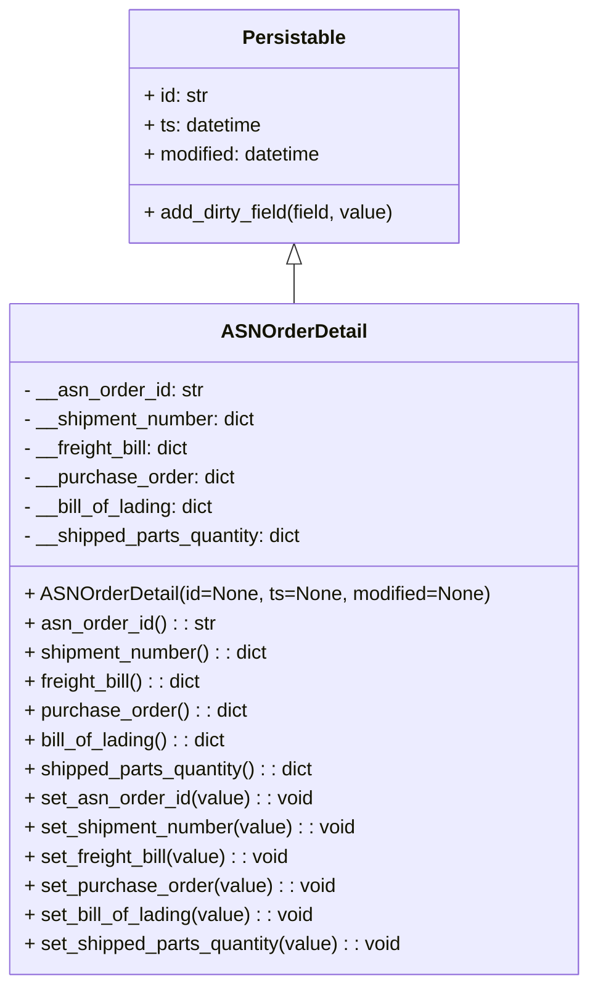

# Diagram: partview_service/partview_service/core/datamodel/ASNOrderDetail.py

> Auto-generated by Obscura crawlers

## Mermaid

### SVG

<svg id="container" width="479.296875" xmlns="http://www.w3.org/2000/svg" class="classDiagram" height="810" viewBox="0 0 479.296875 810" role="graphics-document document" aria-roledescription="class"><g><defs><marker id="container_class-aggregationStart" class="marker aggregation class" refX="18" refY="7" markerWidth="190" markerHeight="240" orient="auto"><path d="M 18,7 L9,13 L1,7 L9,1 Z"></path></marker></defs><defs><marker id="container_class-aggregationEnd" class="marker aggregation class" refX="1" refY="7" markerWidth="20" markerHeight="28" orient="auto"><path d="M 18,7 L9,13 L1,7 L9,1 Z"></path></marker></defs><defs><marker id="container_class-extensionStart" class="marker extension class" refX="18" refY="7" markerWidth="190" markerHeight="240" orient="auto"><path d="M 1,7 L18,13 V 1 Z"></path></marker></defs><defs><marker id="container_class-extensionEnd" class="marker extension class" refX="1" refY="7" markerWidth="20" markerHeight="28" orient="auto"><path d="M 1,1 V 13 L18,7 Z"></path></marker></defs><defs><marker id="container_class-compositionStart" class="marker composition class" refX="18" refY="7" markerWidth="190" markerHeight="240" orient="auto"><path d="M 18,7 L9,13 L1,7 L9,1 Z"></path></marker></defs><defs><marker id="container_class-compositionEnd" class="marker composition class" refX="1" refY="7" markerWidth="20" markerHeight="28" orient="auto"><path d="M 18,7 L9,13 L1,7 L9,1 Z"></path></marker></defs><defs><marker id="container_class-dependencyStart" class="marker dependency class" refX="6" refY="7" markerWidth="190" markerHeight="240" orient="auto"><path d="M 5,7 L9,13 L1,7 L9,1 Z"></path></marker></defs><defs><marker id="container_class-dependencyEnd" class="marker dependency class" refX="13" refY="7" markerWidth="20" markerHeight="28" orient="auto"><path d="M 18,7 L9,13 L14,7 L9,1 Z"></path></marker></defs><defs><marker id="container_class-lollipopStart" class="marker lollipop class" refX="13" refY="7" markerWidth="190" markerHeight="240" orient="auto"><circle stroke="black" fill="transparent" cx="7" cy="7" r="6"></circle></marker></defs><defs><marker id="container_class-lollipopEnd" class="marker lollipop class" refX="1" refY="7" markerWidth="190" markerHeight="240" orient="auto"><circle stroke="black" fill="transparent" cx="7" cy="7" r="6"></circle></marker></defs><g class="root"><g class="clusters"></g><g class="edgePaths"><path d="M239.648,217.25L239.648,218.542C239.648,219.833,239.648,222.417,239.648,227.875C239.648,233.333,239.648,241.667,239.648,245.833L239.648,250" id="id_Persistable_ASNOrderDetail_1" class="edge-thickness-normal edge-pattern-solid relation" style=";;;" data-edge="true" data-et="edge" data-id="id_Persistable_ASNOrderDetail_1" data-points="W3sieCI6MjM5LjY0ODQzNzUsInkiOjIwMH0seyJ4IjoyMzkuNjQ4NDM3NSwieSI6MjI1fSx7IngiOjIzOS42NDg0Mzc1LCJ5IjoyNTB9XQ==" marker-start="url(#container_class-extensionStart)"></path></g><g class="edgeLabels"><g class="edgeLabel"><g class="label" data-id="id_Persistable_ASNOrderDetail_1" transform="translate(0, 0)"><foreignObject width="0" height="0">

</foreignObject></g></g></g><g class="nodes"><g class="node default" id="classId-Persistable-0" transform="translate(239.6484375, 104)"><g class="basic label-container"><path d="M-137.95703125 -96 L137.95703125 -96 L137.95703125 96 L-137.95703125 96" stroke="none" stroke-width="0" fill="#ECECFF" style=""></path><path d="M-137.95703125 -96 C-57.022595123916204 -96, 23.91184100216759 -96, 137.95703125 -96 M-137.95703125 -96 C-50.149379735242846 -96, 37.65827177951431 -96, 137.95703125 -96 M137.95703125 -96 C137.95703125 -51.742077696165865, 137.95703125 -7.484155392331729, 137.95703125 96 M137.95703125 -96 C137.95703125 -29.80901999066488, 137.95703125 36.38196001867024, 137.95703125 96 M137.95703125 96 C59.62269417238356 96, -18.71164290523288 96, -137.95703125 96 M137.95703125 96 C79.62371543130205 96, 21.29039961260409 96, -137.95703125 96 M-137.95703125 96 C-137.95703125 25.72288643068495, -137.95703125 -44.5542271386301, -137.95703125 -96 M-137.95703125 96 C-137.95703125 43.71204696247035, -137.95703125 -8.575906075059294, -137.95703125 -96" stroke="#9370DB" stroke-width="1.3" fill="none" stroke-dasharray="0 0" style=""></path></g><g class="annotation-group text" transform="translate(0, -72)"></g><g class="label-group text" transform="translate(-40.9765625, -72)"><g class="label" style="font-weight: bolder" transform="translate(0,-12)"><foreignObject width="81.953125" height="24">

Persistable

</foreignObject></g></g><g class="members-group text" transform="translate(-125.95703125, -24)"><g class="label" style="" transform="translate(0,-12)"><foreignObject width="53.8125" height="24">

+ id: str

</foreignObject></g><g class="label" style="" transform="translate(0,12)"><foreignObject width="98.8125" height="24">

+ ts: datetime

</foreignObject></g><g class="label" style="" transform="translate(0,36)"><foreignObject width="150.1875" height="24">

+ modified: datetime

</foreignObject></g></g><g class="methods-group text" transform="translate(-125.95703125, 72)"><g class="label" style="" transform="translate(0,-12)"><foreignObject width="210.9375" height="24">

+ add_dirty_field(field, value)

</foreignObject></g></g><g class="divider" style=""><path d="M-137.95703125 -48 C-57.608373578990566 -48, 22.740284092018868 -48, 137.95703125 -48 M-137.95703125 -48 C-75.31302571437311 -48, -12.669020178746209 -48, 137.95703125 -48" stroke="#9370DB" stroke-width="1.3" fill="none" stroke-dasharray="0 0" style=""></path></g><g class="divider" style=""><path d="M-137.95703125 48 C-79.01177464462495 48, -20.0665180392499 48, 137.95703125 48 M-137.95703125 48 C-34.2283083490385 48, 69.500414551923 48, 137.95703125 48" stroke="#9370DB" stroke-width="1.3" fill="none" stroke-dasharray="0 0" style=""></path></g></g><g class="node default" id="classId-ASNOrderDetail-1" transform="translate(239.6484375, 526)"><g class="basic label-container"><path d="M-231.6484375 -276 L231.6484375 -276 L231.6484375 276 L-231.6484375 276" stroke="none" stroke-width="0" fill="#ECECFF" style=""></path><path d="M-231.6484375 -276 C-105.26684139017101 -276, 21.11475471965798 -276, 231.6484375 -276 M-231.6484375 -276 C-58.596439165467956 -276, 114.45555916906409 -276, 231.6484375 -276 M231.6484375 -276 C231.6484375 -62.16805259038446, 231.6484375 151.66389481923107, 231.6484375 276 M231.6484375 -276 C231.6484375 -88.75965903814622, 231.6484375 98.48068192370755, 231.6484375 276 M231.6484375 276 C81.67403836540583 276, -68.30036076918833 276, -231.6484375 276 M231.6484375 276 C55.540333969821035 276, -120.56776956035793 276, -231.6484375 276 M-231.6484375 276 C-231.6484375 126.05143321119283, -231.6484375 -23.89713357761434, -231.6484375 -276 M-231.6484375 276 C-231.6484375 64.97338559123239, -231.6484375 -146.05322881753523, -231.6484375 -276" stroke="#9370DB" stroke-width="1.3" fill="none" stroke-dasharray="0 0" style=""></path></g><g class="annotation-group text" transform="translate(0, -252)"></g><g class="label-group text" transform="translate(-57.15625, -252)"><g class="label" style="font-weight: bolder" transform="translate(0,-12)"><foreignObject width="114.3125" height="24">

ASNOrderDetail

</foreignObject></g></g><g class="members-group text" transform="translate(-219.6484375, -204)"><g class="label" style="" transform="translate(0,-12)"><foreignObject width="148.375" height="24">

- __asn_order_id: str

</foreignObject></g><g class="label" style="" transform="translate(0,12)"><foreignObject width="196.484375" height="24">

- __shipment_number: dict

</foreignObject></g><g class="label" style="" transform="translate(0,36)"><foreignObject width="142.078125" height="24">

- __freight_bill: dict

</foreignObject></g><g class="label" style="" transform="translate(0,60)"><foreignObject width="176.375" height="24">

- __purchase_order: dict

</foreignObject></g><g class="label" style="" transform="translate(0,84)"><foreignObject width="161.625" height="24">

- __bill_of_lading: dict

</foreignObject></g><g class="label" style="" transform="translate(0,108)"><foreignObject width="235.765625" height="24">

- __shipped_parts_quantity: dict

</foreignObject></g></g><g class="methods-group text" transform="translate(-219.6484375, -36)"><g class="label" style="" transform="translate(0,-12)"><foreignObject width="382.140625" height="24">

+ ASNOrderDetail(id=None, ts=None, modified=None)

</foreignObject></g><g class="label" style="" transform="translate(0,12)"><foreignObject width="156.4375" height="24">

+ asn_order_id() : : str

</foreignObject></g><g class="label" style="" transform="translate(0,36)"><foreignObject width="204.078125" height="24">

+ shipment_number() : : dict

</foreignObject></g><g class="label" style="" transform="translate(0,60)"><foreignObject width="149.96875" height="24">

+ freight_bill() : : dict

</foreignObject></g><g class="label" style="" transform="translate(0,84)"><foreignObject width="183.953125" height="24">

+ purchase_order() : : dict

</foreignObject></g><g class="label" style="" transform="translate(0,108)"><foreignObject width="169.375" height="24">

+ bill_of_lading() : : dict

</foreignObject></g><g class="label" style="" transform="translate(0,132)"><foreignObject width="243.453125" height="24">

+ shipped_parts_quantity() : : dict

</foreignObject></g><g class="label" style="" transform="translate(0,156)"><foreignObject width="237.09375" height="24">

+ set_asn_order_id(value) : : void

</foreignObject></g><g class="label" style="" transform="translate(0,180)"><foreignObject width="276.96875" height="24">

+ set_shipment_number(value) : : void

</foreignObject></g><g class="label" style="" transform="translate(0,204)"><foreignObject width="222.546875" height="24">

+ set_freight_bill(value) : : void

</foreignObject></g><g class="label" style="" transform="translate(0,228)"><foreignObject width="256.859375" height="24">

+ set_purchase_order(value) : : void

</foreignObject></g><g class="label" style="" transform="translate(0,252)"><foreignObject width="242.265625" height="24">

+ set_bill_of_lading(value) : : void

</foreignObject></g><g class="label" style="" transform="translate(0,276)"><foreignObject width="316.34375" height="24">

+ set_shipped_parts_quantity(value) : : void

</foreignObject></g></g><g class="divider" style=""><path d="M-231.6484375 -228 C-131.60947815452346 -228, -31.570518809046888 -228, 231.6484375 -228 M-231.6484375 -228 C-51.435527794805466 -228, 128.77738191038907 -228, 231.6484375 -228" stroke="#9370DB" stroke-width="1.3" fill="none" stroke-dasharray="0 0" style=""></path></g><g class="divider" style=""><path d="M-231.6484375 -60 C-86.73803243737837 -60, 58.17237262524327 -60, 231.6484375 -60 M-231.6484375 -60 C-62.24959179077658 -60, 107.14925391844685 -60, 231.6484375 -60" stroke="#9370DB" stroke-width="1.3" fill="none" stroke-dasharray="0 0" style=""></path></g></g></g></g></g></svg>
