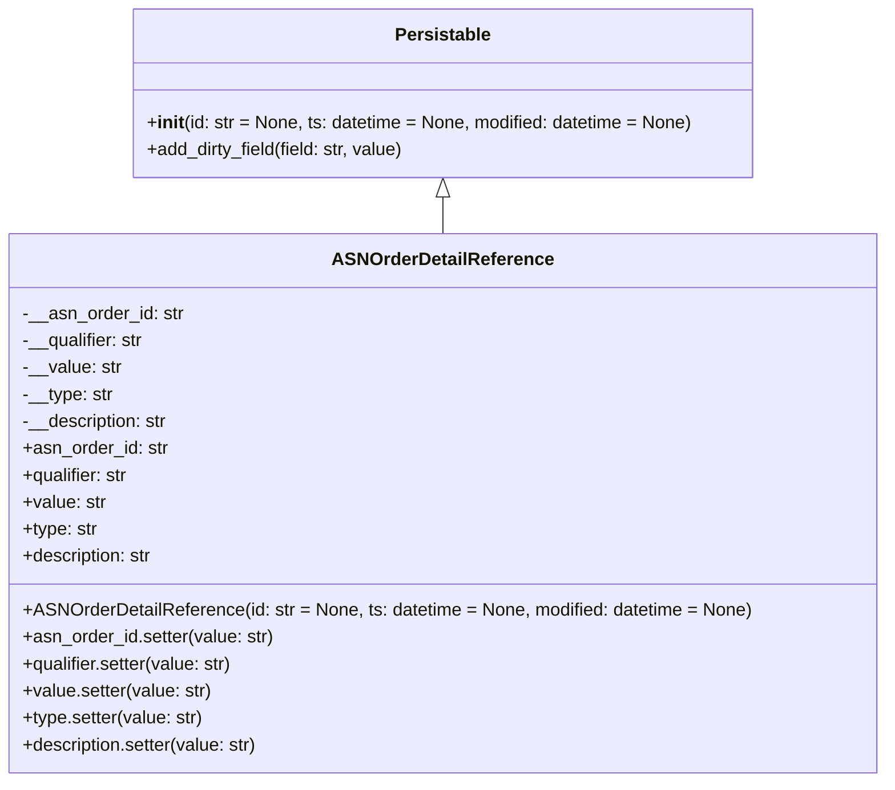

# Diagram: partview_service/partview_service/core/datamodel/ASNOrderDetailReference.py

> Auto-generated by Obscura crawlers

## Mermaid

### SVG

<svg id="container" width="782.90625" xmlns="http://www.w3.org/2000/svg" class="classDiagram" height="696" viewBox="0 0 782.90625 696" role="graphics-document document" aria-roledescription="class"><g><defs><marker id="container_class-aggregationStart" class="marker aggregation class" refX="18" refY="7" markerWidth="190" markerHeight="240" orient="auto"><path d="M 18,7 L9,13 L1,7 L9,1 Z"></path></marker></defs><defs><marker id="container_class-aggregationEnd" class="marker aggregation class" refX="1" refY="7" markerWidth="20" markerHeight="28" orient="auto"><path d="M 18,7 L9,13 L1,7 L9,1 Z"></path></marker></defs><defs><marker id="container_class-extensionStart" class="marker extension class" refX="18" refY="7" markerWidth="190" markerHeight="240" orient="auto"><path d="M 1,7 L18,13 V 1 Z"></path></marker></defs><defs><marker id="container_class-extensionEnd" class="marker extension class" refX="1" refY="7" markerWidth="20" markerHeight="28" orient="auto"><path d="M 1,1 V 13 L18,7 Z"></path></marker></defs><defs><marker id="container_class-compositionStart" class="marker composition class" refX="18" refY="7" markerWidth="190" markerHeight="240" orient="auto"><path d="M 18,7 L9,13 L1,7 L9,1 Z"></path></marker></defs><defs><marker id="container_class-compositionEnd" class="marker composition class" refX="1" refY="7" markerWidth="20" markerHeight="28" orient="auto"><path d="M 18,7 L9,13 L1,7 L9,1 Z"></path></marker></defs><defs><marker id="container_class-dependencyStart" class="marker dependency class" refX="6" refY="7" markerWidth="190" markerHeight="240" orient="auto"><path d="M 5,7 L9,13 L1,7 L9,1 Z"></path></marker></defs><defs><marker id="container_class-dependencyEnd" class="marker dependency class" refX="13" refY="7" markerWidth="20" markerHeight="28" orient="auto"><path d="M 18,7 L9,13 L14,7 L9,1 Z"></path></marker></defs><defs><marker id="container_class-lollipopStart" class="marker lollipop class" refX="13" refY="7" markerWidth="190" markerHeight="240" orient="auto"><circle stroke="black" fill="transparent" cx="7" cy="7" r="6"></circle></marker></defs><defs><marker id="container_class-lollipopEnd" class="marker lollipop class" refX="1" refY="7" markerWidth="190" markerHeight="240" orient="auto"><circle stroke="black" fill="transparent" cx="7" cy="7" r="6"></circle></marker></defs><g class="root"><g class="clusters"></g><g class="edgePaths"><path d="M391.453,175.25L391.453,176.542C391.453,177.833,391.453,180.417,391.453,185.875C391.453,191.333,391.453,199.667,391.453,203.833L391.453,208" id="id_Persistable_ASNOrderDetailReference_1" class="edge-thickness-normal edge-pattern-solid relation" style=";;;" data-edge="true" data-et="edge" data-id="id_Persistable_ASNOrderDetailReference_1" data-points="W3sieCI6MzkxLjQ1MzEyNSwieSI6MTU4fSx7IngiOjM5MS40NTMxMjUsInkiOjE4M30seyJ4IjozOTEuNDUzMTI1LCJ5IjoyMDh9XQ==" marker-start="url(#container_class-extensionStart)"></path></g><g class="edgeLabels"><g class="edgeLabel"><g class="label" data-id="id_Persistable_ASNOrderDetailReference_1" transform="translate(0, 0)"><foreignObject width="0" height="0">

</foreignObject></g></g></g><g class="nodes"><g class="node default" id="classId-Persistable-0" transform="translate(391.453125, 83)"><g class="basic label-container"><path d="M-277.13671875 -75 L277.13671875 -75 L277.13671875 75 L-277.13671875 75" stroke="none" stroke-width="0" fill="#ECECFF" style=""></path><path d="M-277.13671875 -75 C-152.82335334382827 -75, -28.50998793765652 -75, 277.13671875 -75 M-277.13671875 -75 C-87.89943226309992 -75, 101.33785422380015 -75, 277.13671875 -75 M277.13671875 -75 C277.13671875 -31.49277131037531, 277.13671875 12.014457379249379, 277.13671875 75 M277.13671875 -75 C277.13671875 -15.795588349346815, 277.13671875 43.40882330130637, 277.13671875 75 M277.13671875 75 C110.02629775419209 75, -57.08412324161583 75, -277.13671875 75 M277.13671875 75 C55.499732435117494 75, -166.137253879765 75, -277.13671875 75 M-277.13671875 75 C-277.13671875 36.96468993359477, -277.13671875 -1.0706201328104612, -277.13671875 -75 M-277.13671875 75 C-277.13671875 15.540478644859768, -277.13671875 -43.919042710280465, -277.13671875 -75" stroke="#9370DB" stroke-width="1.3" fill="none" stroke-dasharray="0 0" style=""></path></g><g class="annotation-group text" transform="translate(0, -51)"></g><g class="label-group text" transform="translate(-40.9765625, -51)"><g class="label" style="font-weight: bolder" transform="translate(0,-12)"><foreignObject width="81.953125" height="24">

Persistable

</foreignObject></g></g><g class="members-group text" transform="translate(-265.13671875, -3)"></g><g class="methods-group text" transform="translate(-265.13671875, 27)"><g class="label" style="" transform="translate(0,-12)"><foreignObject width="489.296875" height="24">

+<strong>init</strong>(id: str = None, ts: datetime = None, modified: datetime = None)

</foreignObject></g><g class="label" style="" transform="translate(0,12)"><foreignObject width="232.6875" height="24">

+add_dirty_field(field: str, value)

</foreignObject></g></g><g class="divider" style=""><path d="M-277.13671875 -27 C-89.67606189348155 -27, 97.78459496303691 -27, 277.13671875 -27 M-277.13671875 -27 C-145.81834198323375 -27, -14.499965216467501 -27, 277.13671875 -27" stroke="#9370DB" stroke-width="1.3" fill="none" stroke-dasharray="0 0" style=""></path></g><g class="divider" style=""><path d="M-277.13671875 -3 C-114.70673694793032 -3, 47.72324485413935 -3, 277.13671875 -3 M-277.13671875 -3 C-94.88242324900466 -3, 87.37187225199068 -3, 277.13671875 -3" stroke="#9370DB" stroke-width="1.3" fill="none" stroke-dasharray="0 0" style=""></path></g></g><g class="node default" id="classId-ASNOrderDetailReference-1" transform="translate(391.453125, 448)"><g class="basic label-container"><path d="M-383.453125 -240 L383.453125 -240 L383.453125 240 L-383.453125 240" stroke="none" stroke-width="0" fill="#ECECFF" style=""></path><path d="M-383.453125 -240 C-182.3960305661687 -240, 18.66106386766262 -240, 383.453125 -240 M-383.453125 -240 C-161.2397359908064 -240, 60.97365301838721 -240, 383.453125 -240 M383.453125 -240 C383.453125 -85.12851797671647, 383.453125 69.74296404656707, 383.453125 240 M383.453125 -240 C383.453125 -115.07214062303181, 383.453125 9.855718753936372, 383.453125 240 M383.453125 240 C110.40290130913144 240, -162.64732238173713 240, -383.453125 240 M383.453125 240 C161.6739008595228 240, -60.105323280954394 240, -383.453125 240 M-383.453125 240 C-383.453125 125.76700046973676, -383.453125 11.534000939473515, -383.453125 -240 M-383.453125 240 C-383.453125 90.95549774553132, -383.453125 -58.089004508937364, -383.453125 -240" stroke="#9370DB" stroke-width="1.3" fill="none" stroke-dasharray="0 0" style=""></path></g><g class="annotation-group text" transform="translate(0, -216)"></g><g class="label-group text" transform="translate(-93.65625, -216)"><g class="label" style="font-weight: bolder" transform="translate(0,-12)"><foreignObject width="187.3125" height="24">

ASNOrderDetailReference

</foreignObject></g></g><g class="members-group text" transform="translate(-371.453125, -168)"><g class="label" style="" transform="translate(0,-12)"><foreignObject width="142.859375" height="24">

-__asn_order_id: str

</foreignObject></g><g class="label" style="" transform="translate(0,12)"><foreignObject width="109.71875" height="24">

-__qualifier: str

</foreignObject></g><g class="label" style="" transform="translate(0,36)"><foreignObject width="87.5625" height="24">

-__value: str

</foreignObject></g><g class="label" style="" transform="translate(0,60)"><foreignObject width="80.625" height="24">

-__type: str

</foreignObject></g><g class="label" style="" transform="translate(0,84)"><foreignObject width="131.453125" height="24">

-__description: str

</foreignObject></g><g class="label" style="" transform="translate(0,108)"><foreignObject width="129.265625" height="24">

+asn_order_id: str

</foreignObject></g><g class="label" style="" transform="translate(0,132)"><foreignObject width="96.375" height="24">

+qualifier: str

</foreignObject></g><g class="label" style="" transform="translate(0,156)"><foreignObject width="74.21875" height="24">

+value: str

</foreignObject></g><g class="label" style="" transform="translate(0,180)"><foreignObject width="67.203125" height="24">

+type: str

</foreignObject></g><g class="label" style="" transform="translate(0,204)"><foreignObject width="118.109375" height="24">

+description: str

</foreignObject></g></g><g class="methods-group text" transform="translate(-371.453125, 96)"><g class="label" style="" transform="translate(0,-12)"><foreignObject width="649.25" height="24">

+ASNOrderDetailReference(id: str = None, ts: datetime = None, modified: datetime = None)

</foreignObject></g><g class="label" style="" transform="translate(0,12)"><foreignObject width="224.828125" height="24">

+asn_order_id.setter(value: str)

</foreignObject></g><g class="label" style="" transform="translate(0,36)"><foreignObject width="190.484375" height="24">

+qualifier.setter(value: str)

</foreignObject></g><g class="label" style="" transform="translate(0,60)"><foreignObject width="169.609375" height="24">

+value.setter(value: str)

</foreignObject></g><g class="label" style="" transform="translate(0,84)"><foreignObject width="162.59375" height="24">

+type.setter(value: str)

</foreignObject></g><g class="label" style="" transform="translate(0,108)"><foreignObject width="213.65625" height="24">

+description.setter(value: str)

</foreignObject></g></g><g class="divider" style=""><path d="M-383.453125 -192 C-85.6750254547 -192, 212.1030740906 -192, 383.453125 -192 M-383.453125 -192 C-84.26576838632292 -192, 214.92158822735416 -192, 383.453125 -192" stroke="#9370DB" stroke-width="1.3" fill="none" stroke-dasharray="0 0" style=""></path></g><g class="divider" style=""><path d="M-383.453125 72 C-190.94363218227716 72, 1.5658606354456879 72, 383.453125 72 M-383.453125 72 C-200.76417977056133 72, -18.075234541122654 72, 383.453125 72" stroke="#9370DB" stroke-width="1.3" fill="none" stroke-dasharray="0 0" style=""></path></g></g></g></g></g></svg>
