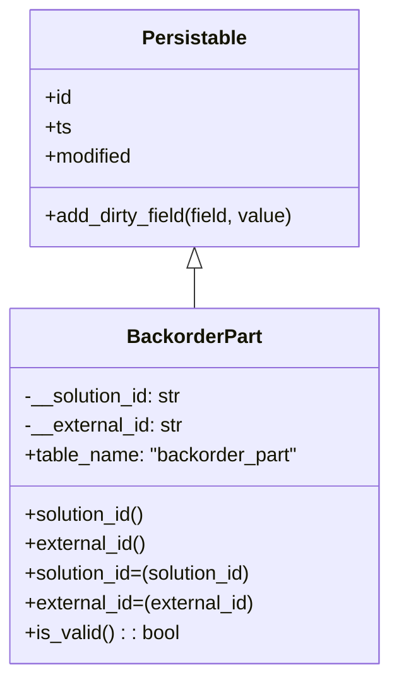

# Diagram: partview_service/partview_service/core/datamodel/BackorderPart.py


> Auto-generated by Obscura crawlers

## Diagram 1



### SVG

<svg id="container" width="317.109375" xmlns="http://www.w3.org/2000/svg" class="classDiagram" height="546" viewBox="0 0 317.109375 546" role="graphics-document document" aria-roledescription="class"><style>#container{font-family:"trebuchet ms",verdana,arial,sans-serif;font-size:16px;fill:#333;}@keyframes edge-animation-frame{from{stroke-dashoffset:0;}}@keyframes dash{to{stroke-dashoffset:0;}}#container .edge-animation-slow{stroke-dasharray:9,5!important;stroke-dashoffset:900;animation:dash 50s linear infinite;stroke-linecap:round;}#container .edge-animation-fast{stroke-dasharray:9,5!important;stroke-dashoffset:900;animation:dash 20s linear infinite;stroke-linecap:round;}#container .error-icon{fill:#552222;}#container .error-text{fill:#552222;stroke:#552222;}#container .edge-thickness-normal{stroke-width:1px;}#container .edge-thickness-thick{stroke-width:3.5px;}#container .edge-pattern-solid{stroke-dasharray:0;}#container .edge-thickness-invisible{stroke-width:0;fill:none;}#container .edge-pattern-dashed{stroke-dasharray:3;}#container .edge-pattern-dotted{stroke-dasharray:2;}#container .marker{fill:#333333;stroke:#333333;}#container .marker.cross{stroke:#333333;}#container svg{font-family:"trebuchet ms",verdana,arial,sans-serif;font-size:16px;}#container p{margin:0;}#container g.classGroup text{fill:#9370DB;stroke:none;font-family:"trebuchet ms",verdana,arial,sans-serif;font-size:10px;}#container g.classGroup text .title{font-weight:bolder;}#container .nodeLabel,#container .edgeLabel{color:#131300;}#container .edgeLabel .label rect{fill:#ECECFF;}#container .label text{fill:#131300;}#container .labelBkg{background:#ECECFF;}#container .edgeLabel .label span{background:#ECECFF;}#container .classTitle{font-weight:bolder;}#container .node rect,#container .node circle,#container .node ellipse,#container .node polygon,#container .node path{fill:#ECECFF;stroke:#9370DB;stroke-width:1px;}#container .divider{stroke:#9370DB;stroke-width:1;}#container g.clickable{cursor:pointer;}#container g.classGroup rect{fill:#ECECFF;stroke:#9370DB;}#container g.classGroup line{stroke:#9370DB;stroke-width:1;}#container .classLabel .box{stroke:none;stroke-width:0;fill:#ECECFF;opacity:0.5;}#container .classLabel .label{fill:#9370DB;font-size:10px;}#container .relation{stroke:#333333;stroke-width:1;fill:none;}#container .dashed-line{stroke-dasharray:3;}#container .dotted-line{stroke-dasharray:1 2;}#container #compositionStart,#container .composition{fill:#333333!important;stroke:#333333!important;stroke-width:1;}#container #compositionEnd,#container .composition{fill:#333333!important;stroke:#333333!important;stroke-width:1;}#container #dependencyStart,#container .dependency{fill:#333333!important;stroke:#333333!important;stroke-width:1;}#container #dependencyStart,#container .dependency{fill:#333333!important;stroke:#333333!important;stroke-width:1;}#container #extensionStart,#container .extension{fill:transparent!important;stroke:#333333!important;stroke-width:1;}#container #extensionEnd,#container .extension{fill:transparent!important;stroke:#333333!important;stroke-width:1;}#container #aggregationStart,#container .aggregation{fill:transparent!important;stroke:#333333!important;stroke-width:1;}#container #aggregationEnd,#container .aggregation{fill:transparent!important;stroke:#333333!important;stroke-width:1;}#container #lollipopStart,#container .lollipop{fill:#ECECFF!important;stroke:#333333!important;stroke-width:1;}#container #lollipopEnd,#container .lollipop{fill:#ECECFF!important;stroke:#333333!important;stroke-width:1;}#container .edgeTerminals{font-size:11px;line-height:initial;}#container .classTitleText{text-anchor:middle;font-size:18px;fill:#333;}#container .label-icon{display:inline-block;height:1em;overflow:visible;vertical-align:-0.125em;}#container .node .label-icon path{fill:currentColor;stroke:revert;stroke-width:revert;}#container :root{--mermaid-font-family:"trebuchet ms",verdana,arial,sans-serif;}</style><g><defs><marker id="container_class-aggregationStart" class="marker aggregation class" refX="18" refY="7" markerWidth="190" markerHeight="240" orient="auto"><path d="M 18,7 L9,13 L1,7 L9,1 Z"></path></marker></defs><defs><marker id="container_class-aggregationEnd" class="marker aggregation class" refX="1" refY="7" markerWidth="20" markerHeight="28" orient="auto"><path d="M 18,7 L9,13 L1,7 L9,1 Z"></path></marker></defs><defs><marker id="container_class-extensionStart" class="marker extension class" refX="18" refY="7" markerWidth="190" markerHeight="240" orient="auto"><path d="M 1,7 L18,13 V 1 Z"></path></marker></defs><defs><marker id="container_class-extensionEnd" class="marker extension class" refX="1" refY="7" markerWidth="20" markerHeight="28" orient="auto"><path d="M 1,1 V 13 L18,7 Z"></path></marker></defs><defs><marker id="container_class-compositionStart" class="marker composition class" refX="18" refY="7" markerWidth="190" markerHeight="240" orient="auto"><path d="M 18,7 L9,13 L1,7 L9,1 Z"></path></marker></defs><defs><marker id="container_class-compositionEnd" class="marker composition class" refX="1" refY="7" markerWidth="20" markerHeight="28" orient="auto"><path d="M 18,7 L9,13 L1,7 L9,1 Z"></path></marker></defs><defs><marker id="container_class-dependencyStart" class="marker dependency class" refX="6" refY="7" markerWidth="190" markerHeight="240" orient="auto"><path d="M 5,7 L9,13 L1,7 L9,1 Z"></path></marker></defs><defs><marker id="container_class-dependencyEnd" class="marker dependency class" refX="13" refY="7" markerWidth="20" markerHeight="28" orient="auto"><path d="M 18,7 L9,13 L14,7 L9,1 Z"></path></marker></defs><defs><marker id="container_class-lollipopStart" class="marker lollipop class" refX="13" refY="7" markerWidth="190" markerHeight="240" orient="auto"><circle stroke="black" fill="transparent" cx="7" cy="7" r="6"></circle></marker></defs><defs><marker id="container_class-lollipopEnd" class="marker lollipop class" refX="1" refY="7" markerWidth="190" markerHeight="240" orient="auto"><circle stroke="black" fill="transparent" cx="7" cy="7" r="6"></circle></marker></defs><g class="root"><g class="clusters"></g><g class="edgePaths"><path d="M158.555,217.25L158.555,218.542C158.555,219.833,158.555,222.417,158.555,227.875C158.555,233.333,158.555,241.667,158.555,245.833L158.555,250" id="id_Persistable_BackorderPart_1" class="edge-thickness-normal edge-pattern-solid relation" style=";;;" data-edge="true" data-et="edge" data-id="id_Persistable_BackorderPart_1" data-points="W3sieCI6MTU4LjU1NDY4NzUsInkiOjIwMH0seyJ4IjoxNTguNTU0Njg3NSwieSI6MjI1fSx7IngiOjE1OC41NTQ2ODc1LCJ5IjoyNTB9XQ==" marker-start="url(#container_class-extensionStart)"></path></g><g class="edgeLabels"><g class="edgeLabel"><g class="label" data-id="id_Persistable_BackorderPart_1" transform="translate(0, 0)"><foreignObject width="0" height="0"><div xmlns="http://www.w3.org/1999/xhtml" class="labelBkg" style="display: table-cell; white-space: nowrap; line-height: 1.5; max-width: 200px; text-align: center;"><span class="edgeLabel"></span></div></foreignObject></g></g></g><g class="nodes"><g class="node default" id="classId-Persistable-0" transform="translate(158.5546875, 104)"><g class="basic label-container"><path d="M-135.71484375 -96 L135.71484375 -96 L135.71484375 96 L-135.71484375 96" stroke="none" stroke-width="0" fill="#ECECFF" style=""></path><path d="M-135.71484375 -96 C-80.46913559416441 -96, -25.223427438328812 -96, 135.71484375 -96 M-135.71484375 -96 C-74.39682474517153 -96, -13.078805740343057 -96, 135.71484375 -96 M135.71484375 -96 C135.71484375 -36.922610088911526, 135.71484375 22.15477982217695, 135.71484375 96 M135.71484375 -96 C135.71484375 -54.23146049098824, 135.71484375 -12.462920981976481, 135.71484375 96 M135.71484375 96 C74.17954770286639 96, 12.644251655732788 96, -135.71484375 96 M135.71484375 96 C33.511490554324084 96, -68.69186264135183 96, -135.71484375 96 M-135.71484375 96 C-135.71484375 40.22066425876548, -135.71484375 -15.558671482469038, -135.71484375 -96 M-135.71484375 96 C-135.71484375 54.08688468665945, -135.71484375 12.173769373318905, -135.71484375 -96" stroke="#9370DB" stroke-width="1.3" fill="none" stroke-dasharray="0 0" style=""></path></g><g class="annotation-group text" transform="translate(0, -72)"></g><g class="label-group text" transform="translate(-40.9765625, -72)"><g class="label" style="font-weight: bolder" transform="translate(0,-12)"><foreignObject width="81.953125" height="24"><div xmlns="http://www.w3.org/1999/xhtml" style="display: table-cell; white-space: nowrap; line-height: 1.5; max-width: 130px; text-align: center;"><span class="nodeLabel markdown-node-label" style=""><p>Persistable</p></span></div></foreignObject></g></g><g class="members-group text" transform="translate(-123.71484375, -24)"><g class="label" style="" transform="translate(0,-12)"><foreignObject width="22.078125" height="24"><div xmlns="http://www.w3.org/1999/xhtml" style="display: table-cell; white-space: nowrap; line-height: 1.5; max-width: 79px; text-align: center;"><span class="nodeLabel markdown-node-label" style=""><p>+id</p></span></div></foreignObject></g><g class="label" style="" transform="translate(0,12)"><foreignObject width="21.15625" height="24"><div xmlns="http://www.w3.org/1999/xhtml" style="display: table-cell; white-space: nowrap; line-height: 1.5; max-width: 79px; text-align: center;"><span class="nodeLabel markdown-node-label" style=""><p>+ts</p></span></div></foreignObject></g><g class="label" style="" transform="translate(0,36)"><foreignObject width="72.609375" height="24"><div xmlns="http://www.w3.org/1999/xhtml" style="display: table-cell; white-space: nowrap; line-height: 1.5; max-width: 130px; text-align: center;"><span class="nodeLabel markdown-node-label" style=""><p>+modified</p></span></div></foreignObject></g></g><g class="methods-group text" transform="translate(-123.71484375, 72)"><g class="label" style="" transform="translate(0,-12)"><foreignObject width="206.453125" height="24"><div xmlns="http://www.w3.org/1999/xhtml" style="display: table-cell; white-space: nowrap; line-height: 1.5; max-width: 264px; text-align: center;"><span class="nodeLabel markdown-node-label" style=""><p>+add_dirty_field(field, value)</p></span></div></foreignObject></g></g><g class="divider" style=""><path d="M-135.71484375 -48 C-63.92286536448802 -48, 7.8691130210239635 -48, 135.71484375 -48 M-135.71484375 -48 C-34.223479259286236 -48, 67.26788523142753 -48, 135.71484375 -48" stroke="#9370DB" stroke-width="1.3" fill="none" stroke-dasharray="0 0" style=""></path></g><g class="divider" style=""><path d="M-135.71484375 48 C-72.06508020015883 48, -8.41531665031765 48, 135.71484375 48 M-135.71484375 48 C-50.09776725607915 48, 35.519309237841696 48, 135.71484375 48" stroke="#9370DB" stroke-width="1.3" fill="none" stroke-dasharray="0 0" style=""></path></g></g><g class="node default" id="classId-BackorderPart-1" transform="translate(158.5546875, 394)"><g class="basic label-container"><path d="M-150.5546875 -144 L150.5546875 -144 L150.5546875 144 L-150.5546875 144" stroke="none" stroke-width="0" fill="#ECECFF" style=""></path><path d="M-150.5546875 -144 C-73.42254691522884 -144, 3.709593669542329 -144, 150.5546875 -144 M-150.5546875 -144 C-62.964660157990195 -144, 24.62536718401961 -144, 150.5546875 -144 M150.5546875 -144 C150.5546875 -49.76858272522824, 150.5546875 44.462834549543516, 150.5546875 144 M150.5546875 -144 C150.5546875 -55.51673833438376, 150.5546875 32.96652333123248, 150.5546875 144 M150.5546875 144 C38.18240127678449 144, -74.18988494643102 144, -150.5546875 144 M150.5546875 144 C72.52449017313444 144, -5.505707153731123 144, -150.5546875 144 M-150.5546875 144 C-150.5546875 40.65172525857656, -150.5546875 -62.696549482846876, -150.5546875 -144 M-150.5546875 144 C-150.5546875 36.719948394909636, -150.5546875 -70.56010321018073, -150.5546875 -144" stroke="#9370DB" stroke-width="1.3" fill="none" stroke-dasharray="0 0" style=""></path></g><g class="annotation-group text" transform="translate(0, -120)"></g><g class="label-group text" transform="translate(-52.59375, -120)"><g class="label" style="font-weight: bolder" transform="translate(0,-12)"><foreignObject width="105.1875" height="24"><div xmlns="http://www.w3.org/1999/xhtml" style="display: table-cell; white-space: nowrap; line-height: 1.5; max-width: 153px; text-align: center;"><span class="nodeLabel markdown-node-label" style=""><p>BackorderPart</p></span></div></foreignObject></g></g><g class="members-group text" transform="translate(-138.5546875, -72)"><g class="label" style="" transform="translate(0,-12)"><foreignObject width="131.390625" height="24"><div xmlns="http://www.w3.org/1999/xhtml" style="display: table-cell; white-space: nowrap; line-height: 1.5; max-width: 190px; text-align: center;"><span class="nodeLabel markdown-node-label" style=""><p>-__solution_id: str</p></span></div></foreignObject></g><g class="label" style="" transform="translate(0,12)"><foreignObject width="130.609375" height="24"><div xmlns="http://www.w3.org/1999/xhtml" style="display: table-cell; white-space: nowrap; line-height: 1.5; max-width: 189px; text-align: center;"><span class="nodeLabel markdown-node-label" style=""><p>-__external_id: str</p></span></div></foreignObject></g><g class="label" style="" transform="translate(0,36)"><foreignObject width="224.515625" height="24"><div xmlns="http://www.w3.org/1999/xhtml" style="display: table-cell; white-space: nowrap; line-height: 1.5; max-width: 282px; text-align: center;"><span class="nodeLabel markdown-node-label" style=""><p>+table_name: "backorder_part"</p></span></div></foreignObject></g></g><g class="methods-group text" transform="translate(-138.5546875, 24)"><g class="label" style="" transform="translate(0,-12)"><foreignObject width="100.578125" height="24"><div xmlns="http://www.w3.org/1999/xhtml" style="display: table-cell; white-space: nowrap; line-height: 1.5; max-width: 158px; text-align: center;"><span class="nodeLabel markdown-node-label" style=""><p>+solution_id()</p></span></div></foreignObject></g><g class="label" style="" transform="translate(0,12)"><foreignObject width="100.140625" height="24"><div xmlns="http://www.w3.org/1999/xhtml" style="display: table-cell; white-space: nowrap; line-height: 1.5; max-width: 158px; text-align: center;"><span class="nodeLabel markdown-node-label" style=""><p>+external_id()</p></span></div></foreignObject></g><g class="label" style="" transform="translate(0,36)"><foreignObject width="190.8125" height="24"><div xmlns="http://www.w3.org/1999/xhtml" style="display: table-cell; white-space: nowrap; line-height: 1.5; max-width: 248px; text-align: center;"><span class="nodeLabel markdown-node-label" style=""><p>+solution_id=(solution_id)</p></span></div></foreignObject></g><g class="label" style="" transform="translate(0,60)"><foreignObject width="189.90625" height="24"><div xmlns="http://www.w3.org/1999/xhtml" style="display: table-cell; white-space: nowrap; line-height: 1.5; max-width: 247px; text-align: center;"><span class="nodeLabel markdown-node-label" style=""><p>+external_id=(external_id)</p></span></div></foreignObject></g><g class="label" style="" transform="translate(0,84)"><foreignObject width="126.078125" height="24"><div xmlns="http://www.w3.org/1999/xhtml" style="display: table-cell; white-space: nowrap; line-height: 1.5; max-width: 184px; text-align: center;"><span class="nodeLabel markdown-node-label" style=""><p>+is_valid() : : bool</p></span></div></foreignObject></g></g><g class="divider" style=""><path d="M-150.5546875 -96 C-77.4191726664184 -96, -4.283657832836809 -96, 150.5546875 -96 M-150.5546875 -96 C-70.5990454306585 -96, 9.356596638682987 -96, 150.5546875 -96" stroke="#9370DB" stroke-width="1.3" fill="none" stroke-dasharray="0 0" style=""></path></g><g class="divider" style=""><path d="M-150.5546875 0 C-64.25631231722137 0, 22.042062865557256 0, 150.5546875 0 M-150.5546875 0 C-84.68862672118843 0, -18.822565942376855 0, 150.5546875 0" stroke="#9370DB" stroke-width="1.3" fill="none" stroke-dasharray="0 0" style=""></path></g></g></g></g></g></svg>

## Diagram 2

```mermaid
flowchart TD
    subgraph Setters
        S1[Set solution_id(value)]
        S2{Type valid?}
        S3{Different from current?}
        S4[Assign __solution_id and add_dirty_field("solution_id", value)]
        S5[Return self]
        AF1[AssertionError]
        S1 --> S2
        S2 -->|valid| S3
        S2 -->|invalid| AF1
        S3 -->|changed| S4
        S3 -->|unchanged| S5
        S4 --> S5
    end
    subgraph External
        E1[Set external_id(value)]
        E2{Type valid?}
        E3{Different from current?}
        E4[Assign __external_id and add_dirty_field("external_id", value)]
        E5[Return self]
        AF2[AssertionError]
        E1 --> E2
        E2 -->|valid| E3
        E2 -->|invalid| AF2
        E3 -->|changed| E4
        E3 -->|unchanged| E5
        E4 --> E5
    end
    subgraph Validation
        V1[Call is_valid()]
        V2{__solution_id is str?}
        V3{__external_id is str?}
        V4[Return True]
        V5[Return False]
        V1 --> V2
        V2 -->|yes| V3
        V2 -->|no| V5
        V3 -->|yes| V4
        V3 -->|no| V5
    end
```

> SVG rendering failed for this diagram.
