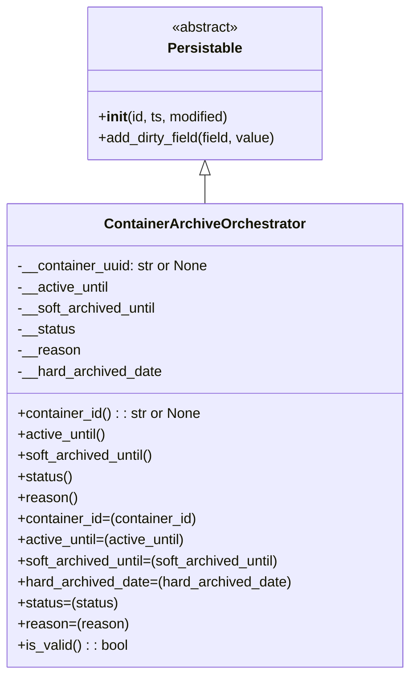

# Diagram: partview_service/partview_service/core/datamodel/ContainerArchiveOrchestrator.py

> Auto-generated by Obscura crawlers

## Mermaid

### SVG

<svg id="container" width="463.0703125" xmlns="http://www.w3.org/2000/svg" class="classDiagram" height="768" viewBox="0 0 463.0703125 768" role="graphics-document document" aria-roledescription="class"><g><defs><marker id="container_class-aggregationStart" class="marker aggregation class" refX="18" refY="7" markerWidth="190" markerHeight="240" orient="auto"><path d="M 18,7 L9,13 L1,7 L9,1 Z"></path></marker></defs><defs><marker id="container_class-aggregationEnd" class="marker aggregation class" refX="1" refY="7" markerWidth="20" markerHeight="28" orient="auto"><path d="M 18,7 L9,13 L1,7 L9,1 Z"></path></marker></defs><defs><marker id="container_class-extensionStart" class="marker extension class" refX="18" refY="7" markerWidth="190" markerHeight="240" orient="auto"><path d="M 1,7 L18,13 V 1 Z"></path></marker></defs><defs><marker id="container_class-extensionEnd" class="marker extension class" refX="1" refY="7" markerWidth="20" markerHeight="28" orient="auto"><path d="M 1,1 V 13 L18,7 Z"></path></marker></defs><defs><marker id="container_class-compositionStart" class="marker composition class" refX="18" refY="7" markerWidth="190" markerHeight="240" orient="auto"><path d="M 18,7 L9,13 L1,7 L9,1 Z"></path></marker></defs><defs><marker id="container_class-compositionEnd" class="marker composition class" refX="1" refY="7" markerWidth="20" markerHeight="28" orient="auto"><path d="M 18,7 L9,13 L1,7 L9,1 Z"></path></marker></defs><defs><marker id="container_class-dependencyStart" class="marker dependency class" refX="6" refY="7" markerWidth="190" markerHeight="240" orient="auto"><path d="M 5,7 L9,13 L1,7 L9,1 Z"></path></marker></defs><defs><marker id="container_class-dependencyEnd" class="marker dependency class" refX="13" refY="7" markerWidth="20" markerHeight="28" orient="auto"><path d="M 18,7 L9,13 L14,7 L9,1 Z"></path></marker></defs><defs><marker id="container_class-lollipopStart" class="marker lollipop class" refX="13" refY="7" markerWidth="190" markerHeight="240" orient="auto"><circle stroke="black" fill="transparent" cx="7" cy="7" r="6"></circle></marker></defs><defs><marker id="container_class-lollipopEnd" class="marker lollipop class" refX="1" refY="7" markerWidth="190" markerHeight="240" orient="auto"><circle stroke="black" fill="transparent" cx="7" cy="7" r="6"></circle></marker></defs><g class="root"><g class="clusters"></g><g class="edgePaths"><path d="M231.535,199.25L231.535,200.542C231.535,201.833,231.535,204.417,231.535,209.875C231.535,215.333,231.535,223.667,231.535,227.833L231.535,232" id="id_Persistable_ContainerArchiveOrchestrator_1" class="edge-thickness-normal edge-pattern-solid relation" style=";;;" data-edge="true" data-et="edge" data-id="id_Persistable_ContainerArchiveOrchestrator_1" data-points="W3sieCI6MjMxLjUzNTE1NjI1LCJ5IjoxODJ9LHsieCI6MjMxLjUzNTE1NjI1LCJ5IjoyMDd9LHsieCI6MjMxLjUzNTE1NjI1LCJ5IjoyMzJ9XQ==" marker-start="url(#container_class-extensionStart)"></path></g><g class="edgeLabels"><g class="edgeLabel"><g class="label" data-id="id_Persistable_ContainerArchiveOrchestrator_1" transform="translate(0, 0)"><foreignObject width="0" height="0">

</foreignObject></g></g></g><g class="nodes"><g class="node default" id="classId-Persistable-0" transform="translate(231.53515625, 95)"><g class="basic label-container"><path d="M-135.71484375 -87 L135.71484375 -87 L135.71484375 87 L-135.71484375 87" stroke="none" stroke-width="0" fill="#ECECFF" style=""></path><path d="M-135.71484375 -87 C-59.76294373270092 -87, 16.188956284598163 -87, 135.71484375 -87 M-135.71484375 -87 C-80.49375044221921 -87, -25.27265713443842 -87, 135.71484375 -87 M135.71484375 -87 C135.71484375 -34.43673933326038, 135.71484375 18.126521333479246, 135.71484375 87 M135.71484375 -87 C135.71484375 -28.712323341156036, 135.71484375 29.575353317687927, 135.71484375 87 M135.71484375 87 C78.62899874588771 87, 21.54315374177544 87, -135.71484375 87 M135.71484375 87 C76.34685208077462 87, 16.978860411549235 87, -135.71484375 87 M-135.71484375 87 C-135.71484375 46.2813465141913, -135.71484375 5.562693028382597, -135.71484375 -87 M-135.71484375 87 C-135.71484375 34.47040416053965, -135.71484375 -18.059191678920698, -135.71484375 -87" stroke="#9370DB" stroke-width="1.3" fill="none" stroke-dasharray="0 0" style=""></path></g><g class="annotation-group text" transform="translate(-38.609375, -63)"><g class="label" style="" transform="translate(0,-12)"><foreignObject width="77.21875" height="24">

«abstract»

</foreignObject></g></g><g class="label-group text" transform="translate(-40.9765625, -39)"><g class="label" style="font-weight: bolder" transform="translate(0,-12)"><foreignObject width="81.953125" height="24">

Persistable

</foreignObject></g></g><g class="members-group text" transform="translate(-123.71484375, 9)"></g><g class="methods-group text" transform="translate(-123.71484375, 39)"><g class="label" style="" transform="translate(0,-12)"><foreignObject width="150.90625" height="24">

+<strong>init</strong>(id, ts, modified)

</foreignObject></g><g class="label" style="" transform="translate(0,12)"><foreignObject width="206.453125" height="24">

+add_dirty_field(field, value)

</foreignObject></g></g><g class="divider" style=""><path d="M-135.71484375 -15 C-74.88879982882457 -15, -14.062755907649162 -15, 135.71484375 -15 M-135.71484375 -15 C-40.96585570204087 -15, 53.78313234591826 -15, 135.71484375 -15" stroke="#9370DB" stroke-width="1.3" fill="none" stroke-dasharray="0 0" style=""></path></g><g class="divider" style=""><path d="M-135.71484375 9 C-52.83416716008594 9, 30.04650942982812 9, 135.71484375 9 M-135.71484375 9 C-72.92140512681459 9, -10.127966503629196 9, 135.71484375 9" stroke="#9370DB" stroke-width="1.3" fill="none" stroke-dasharray="0 0" style=""></path></g></g><g class="node default" id="classId-ContainerArchiveOrchestrator-1" transform="translate(231.53515625, 496)"><g class="basic label-container"><path d="M-223.53515625 -264 L223.53515625 -264 L223.53515625 264 L-223.53515625 264" stroke="none" stroke-width="0" fill="#ECECFF" style=""></path><path d="M-223.53515625 -264 C-85.25785176822052 -264, 53.01945271355896 -264, 223.53515625 -264 M-223.53515625 -264 C-56.99471774716349 -264, 109.54572075567302 -264, 223.53515625 -264 M223.53515625 -264 C223.53515625 -86.3184648342664, 223.53515625 91.36307033146721, 223.53515625 264 M223.53515625 -264 C223.53515625 -135.8558466537119, 223.53515625 -7.711693307423786, 223.53515625 264 M223.53515625 264 C50.76337639775966 264, -122.00840345448069 264, -223.53515625 264 M223.53515625 264 C81.93408321916684 264, -59.666989811666326 264, -223.53515625 264 M-223.53515625 264 C-223.53515625 140.69160780826, -223.53515625 17.383215616519976, -223.53515625 -264 M-223.53515625 264 C-223.53515625 79.98902678943432, -223.53515625 -104.02194642113136, -223.53515625 -264" stroke="#9370DB" stroke-width="1.3" fill="none" stroke-dasharray="0 0" style=""></path></g><g class="annotation-group text" transform="translate(0, -240)"></g><g class="label-group text" transform="translate(-108.8984375, -240)"><g class="label" style="font-weight: bolder" transform="translate(0,-12)"><foreignObject width="217.796875" height="24">

ContainerArchiveOrchestrator

</foreignObject></g></g><g class="members-group text" transform="translate(-211.53515625, -192)"><g class="label" style="" transform="translate(0,-12)"><foreignObject width="219.828125" height="24">

-__container_uuid: str or None

</foreignObject></g><g class="label" style="" transform="translate(0,12)"><foreignObject width="105.84375" height="24">

-__active_until

</foreignObject></g><g class="label" style="" transform="translate(0,36)"><foreignObject width="161.296875" height="24">

-__soft_archived_until

</foreignObject></g><g class="label" style="" transform="translate(0,60)"><foreignObject width="66.0625" height="24">

-__status

</foreignObject></g><g class="label" style="" transform="translate(0,84)"><foreignObject width="70.640625" height="24">

-__reason

</foreignObject></g><g class="label" style="" transform="translate(0,108)"><foreignObject width="165.5625" height="24">

-__hard_archived_date

</foreignObject></g></g><g class="methods-group text" transform="translate(-211.53515625, -24)"><g class="label" style="" transform="translate(0,-12)"><foreignObject width="210.875" height="24">

+container_id() : : str or None

</foreignObject></g><g class="label" style="" transform="translate(0,12)"><foreignObject width="102.625" height="24">

+active_until()

</foreignObject></g><g class="label" style="" transform="translate(0,36)"><foreignObject width="158.015625" height="24">

+soft_archived_until()

</foreignObject></g><g class="label" style="" transform="translate(0,60)"><foreignObject width="62.765625" height="24">

+status()

</foreignObject></g><g class="label" style="" transform="translate(0,84)"><foreignObject width="67.359375" height="24">

+reason()

</foreignObject></g><g class="label" style="" transform="translate(0,108)"><foreignObject width="207" height="24">

+container_id=(container_id)

</foreignObject></g><g class="label" style="" transform="translate(0,132)"><foreignObject width="195.140625" height="24">

+active_until=(active_until)

</foreignObject></g><g class="label" style="" transform="translate(0,156)"><foreignObject width="305.65625" height="24">

+soft_archived_until=(soft_archived_until)

</foreignObject></g><g class="label" style="" transform="translate(0,180)"><foreignObject width="314.171875" height="24">

+hard_archived_date=(hard_archived_date)

</foreignObject></g><g class="label" style="" transform="translate(0,204)"><foreignObject width="115.15625" height="24">

+status=(status)

</foreignObject></g><g class="label" style="" transform="translate(0,228)"><foreignObject width="124.34375" height="24">

+reason=(reason)

</foreignObject></g><g class="label" style="" transform="translate(0,252)"><foreignObject width="126.078125" height="24">

+is_valid() : : bool

</foreignObject></g></g><g class="divider" style=""><path d="M-223.53515625 -216 C-128.24207266532096 -216, -32.94898908064195 -216, 223.53515625 -216 M-223.53515625 -216 C-101.80668536705262 -216, 19.921785515894754 -216, 223.53515625 -216" stroke="#9370DB" stroke-width="1.3" fill="none" stroke-dasharray="0 0" style=""></path></g><g class="divider" style=""><path d="M-223.53515625 -48 C-56.614131012415925 -48, 110.30689422516815 -48, 223.53515625 -48 M-223.53515625 -48 C-71.87751409070282 -48, 79.78012806859437 -48, 223.53515625 -48" stroke="#9370DB" stroke-width="1.3" fill="none" stroke-dasharray="0 0" style=""></path></g></g></g></g></g></svg>
