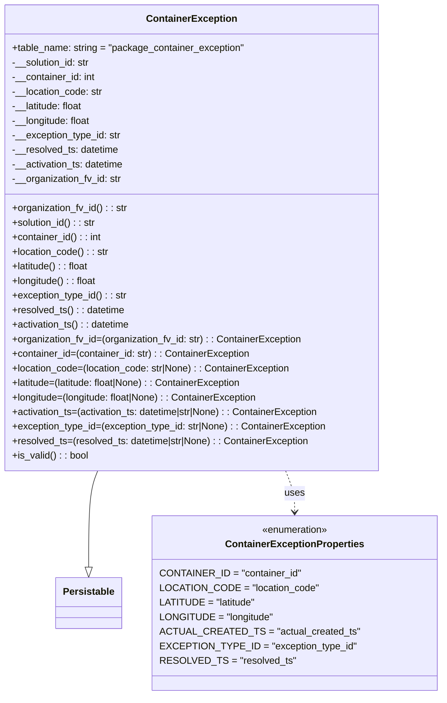

# Diagram: partview_service/partview_service/core/datamodel/ContainerException.py

> Auto-generated by Obscura crawlers

## Mermaid

### SVG

<svg id="container" width="707.544921875" xmlns="http://www.w3.org/2000/svg" class="classDiagram" height="1146" viewBox="0 0 707.544921875 1146" role="graphics-document document" aria-roledescription="class"><g><defs><marker id="container_class-aggregationStart" class="marker aggregation class" refX="18" refY="7" markerWidth="190" markerHeight="240" orient="auto"><path d="M 18,7 L9,13 L1,7 L9,1 Z"></path></marker></defs><defs><marker id="container_class-aggregationEnd" class="marker aggregation class" refX="1" refY="7" markerWidth="20" markerHeight="28" orient="auto"><path d="M 18,7 L9,13 L1,7 L9,1 Z"></path></marker></defs><defs><marker id="container_class-extensionStart" class="marker extension class" refX="18" refY="7" markerWidth="190" markerHeight="240" orient="auto"><path d="M 1,7 L18,13 V 1 Z"></path></marker></defs><defs><marker id="container_class-extensionEnd" class="marker extension class" refX="1" refY="7" markerWidth="20" markerHeight="28" orient="auto"><path d="M 1,1 V 13 L18,7 Z"></path></marker></defs><defs><marker id="container_class-compositionStart" class="marker composition class" refX="18" refY="7" markerWidth="190" markerHeight="240" orient="auto"><path d="M 18,7 L9,13 L1,7 L9,1 Z"></path></marker></defs><defs><marker id="container_class-compositionEnd" class="marker composition class" refX="1" refY="7" markerWidth="20" markerHeight="28" orient="auto"><path d="M 18,7 L9,13 L1,7 L9,1 Z"></path></marker></defs><defs><marker id="container_class-dependencyStart" class="marker dependency class" refX="6" refY="7" markerWidth="190" markerHeight="240" orient="auto"><path d="M 5,7 L9,13 L1,7 L9,1 Z"></path></marker></defs><defs><marker id="container_class-dependencyEnd" class="marker dependency class" refX="13" refY="7" markerWidth="20" markerHeight="28" orient="auto"><path d="M 18,7 L9,13 L14,7 L9,1 Z"></path></marker></defs><defs><marker id="container_class-lollipopStart" class="marker lollipop class" refX="13" refY="7" markerWidth="190" markerHeight="240" orient="auto"><circle stroke="black" fill="transparent" cx="7" cy="7" r="6"></circle></marker></defs><defs><marker id="container_class-lollipopEnd" class="marker lollipop class" refX="1" refY="7" markerWidth="190" markerHeight="240" orient="auto"><circle stroke="black" fill="transparent" cx="7" cy="7" r="6"></circle></marker></defs><g class="root"><g class="clusters"></g><g class="edgePaths"><path d="M171.258,776L168.894,782.167C166.53,788.333,161.803,800.667,159.44,827.125C157.076,853.583,157.076,894.167,157.076,914.458L157.076,934.75" id="id_ContainerException_Persistable_1" class="edge-thickness-normal edge-pattern-solid relation" style=";;;" data-edge="true" data-et="edge" data-id="id_ContainerException_Persistable_1" data-points="W3sieCI6MTcxLjI1NzU3MTI1ODkwNzM4LCJ5Ijo3NzZ9LHsieCI6MTU3LjA3NjE3MTg3NSwieSI6ODEzfSx7IngiOjE1Ny4wNzYxNzE4NzUsInkiOjk1Mn1d" marker-end="url(#container_class-extensionEnd)"></path><path d="M465.617,776L467.981,782.167C470.345,788.333,475.072,800.667,477.435,812C479.799,823.333,479.799,833.667,479.799,838.833L479.799,844" id="id_ContainerException_ContainerExceptionProperties_2" class="edge-thickness-normal edge-pattern-dashed relation" style=";;;" data-edge="true" data-et="edge" data-id="id_ContainerException_ContainerExceptionProperties_2" data-points="W3sieCI6NDY1LjYxNzQyODc0MTA5MjYsInkiOjc3Nn0seyJ4Ijo0NzkuNzk4ODI4MTI1LCJ5Ijo4MTN9LHsieCI6NDc5Ljc5ODgyODEyNSwieSI6ODUwfV0=" marker-end="url(#container_class-dependencyEnd)"></path></g><g class="edgeLabels"><g class="edgeLabel"><g class="label" data-id="id_ContainerException_Persistable_1" transform="translate(0, 0)"><foreignObject width="0" height="0">

</foreignObject></g></g><g class="edgeLabel" transform="translate(479.798828125, 813)"><g class="label" data-id="id_ContainerException_ContainerExceptionProperties_2" transform="translate(-16.4921875, -12)"><foreignObject width="32.984375" height="24">

uses

</foreignObject></g></g></g><g class="nodes"><g class="node default" id="classId-Persistable-0" transform="translate(157.076171875, 994)"><g class="basic label-container"><path d="M-52.9765625 -42 L52.9765625 -42 L52.9765625 42 L-52.9765625 42" stroke="none" stroke-width="0" fill="#ECECFF" style=""></path><path d="M-52.9765625 -42 C-11.585613891246474 -42, 29.80533471750705 -42, 52.9765625 -42 M-52.9765625 -42 C-23.82135434561596 -42, 5.333853808768083 -42, 52.9765625 -42 M52.9765625 -42 C52.9765625 -15.359653209927423, 52.9765625 11.280693580145154, 52.9765625 42 M52.9765625 -42 C52.9765625 -22.70936928064241, 52.9765625 -3.418738561284819, 52.9765625 42 M52.9765625 42 C26.984747567877175 42, 0.9929326357543502 42, -52.9765625 42 M52.9765625 42 C13.758752267654096 42, -25.45905796469181 42, -52.9765625 42 M-52.9765625 42 C-52.9765625 23.82823566581484, -52.9765625 5.656471331629682, -52.9765625 -42 M-52.9765625 42 C-52.9765625 13.288962158871112, -52.9765625 -15.422075682257777, -52.9765625 -42" stroke="#9370DB" stroke-width="1.3" fill="none" stroke-dasharray="0 0" style=""></path></g><g class="annotation-group text" transform="translate(0, -18)"></g><g class="label-group text" transform="translate(-40.9765625, -18)"><g class="label" style="font-weight: bolder" transform="translate(0,-12)"><foreignObject width="81.953125" height="24">

Persistable

</foreignObject></g></g><g class="members-group text" transform="translate(-40.9765625, 30)"></g><g class="methods-group text" transform="translate(-40.9765625, 60)"></g><g class="divider" style=""><path d="M-52.9765625 6 C-21.773948145314726 6, 9.428666209370547 6, 52.9765625 6 M-52.9765625 6 C-29.24016936746416 6, -5.503776234928317 6, 52.9765625 6" stroke="#9370DB" stroke-width="1.3" fill="none" stroke-dasharray="0 0" style=""></path></g><g class="divider" style=""><path d="M-52.9765625 24 C-12.013869714898057 24, 28.948823070203886 24, 52.9765625 24 M-52.9765625 24 C-13.850852416719441 24, 25.274857666561118 24, 52.9765625 24" stroke="#9370DB" stroke-width="1.3" fill="none" stroke-dasharray="0 0" style=""></path></g></g><g class="node default" id="classId-ContainerExceptionProperties-1" transform="translate(479.798828125, 994)"><g class="basic label-container"><path d="M-219.74609375 -144 L219.74609375 -144 L219.74609375 144 L-219.74609375 144" stroke="none" stroke-width="0" fill="#ECECFF" style=""></path><path d="M-219.74609375 -144 C-57.087486757732364 -144, 105.57112023453527 -144, 219.74609375 -144 M-219.74609375 -144 C-83.30609128414102 -144, 53.13391118171796 -144, 219.74609375 -144 M219.74609375 -144 C219.74609375 -67.4230452333766, 219.74609375 9.153909533246804, 219.74609375 144 M219.74609375 -144 C219.74609375 -78.72542596301258, 219.74609375 -13.450851926025166, 219.74609375 144 M219.74609375 144 C90.34691381136008 144, -39.052266127279836 144, -219.74609375 144 M219.74609375 144 C54.526414253803665 144, -110.69326524239267 144, -219.74609375 144 M-219.74609375 144 C-219.74609375 36.99138993447468, -219.74609375 -70.01722013105064, -219.74609375 -144 M-219.74609375 144 C-219.74609375 80.63138893520939, -219.74609375 17.262777870418773, -219.74609375 -144" stroke="#9370DB" stroke-width="1.3" fill="none" stroke-dasharray="0 0" style=""></path></g><g class="annotation-group text" transform="translate(-55.5546875, -120)"><g class="label" style="" transform="translate(0,-12)"><foreignObject width="111.109375" height="24">

«enumeration»

</foreignObject></g></g><g class="label-group text" transform="translate(-109.6015625, -96)"><g class="label" style="font-weight: bolder" transform="translate(0,-12)"><foreignObject width="219.203125" height="24">

ContainerExceptionProperties

</foreignObject></g></g><g class="members-group text" transform="translate(-207.74609375, -48)"><g class="label" style="" transform="translate(0,-12)"><foreignObject width="223.921875" height="24">

CONTAINER_ID = "container_id"

</foreignObject></g><g class="label" style="" transform="translate(0,12)"><foreignObject width="248.109375" height="24">

LOCATION_CODE = "location_code"

</foreignObject></g><g class="label" style="" transform="translate(0,36)"><foreignObject width="153.125" height="24">

LATITUDE = "latitude"

</foreignObject></g><g class="label" style="" transform="translate(0,60)"><foreignObject width="180.421875" height="24">

LONGITUDE = "longitude"

</foreignObject></g><g class="label" style="" transform="translate(0,84)"><foreignObject width="304.71875" height="24">

ACTUAL_CREATED_TS = "actual_created_ts"

</foreignObject></g><g class="label" style="" transform="translate(0,108)"><foreignObject width="305.890625" height="24">

EXCEPTION_TYPE_ID = "exception_type_id"

</foreignObject></g><g class="label" style="" transform="translate(0,132)"><foreignObject width="208.03125" height="24">

RESOLVED_TS = "resolved_ts"

</foreignObject></g></g><g class="methods-group text" transform="translate(-207.74609375, 144)"></g><g class="divider" style=""><path d="M-219.74609375 -72 C-68.8299840752149 -72, 82.08612559957021 -72, 219.74609375 -72 M-219.74609375 -72 C-90.54217547444318 -72, 38.66174280111363 -72, 219.74609375 -72" stroke="#9370DB" stroke-width="1.3" fill="none" stroke-dasharray="0 0" style=""></path></g><g class="divider" style=""><path d="M-219.74609375 120 C-65.29902284344755 120, 89.14804806310491 120, 219.74609375 120 M-219.74609375 120 C-63.99790101760209 120, 91.75029171479582 120, 219.74609375 120" stroke="#9370DB" stroke-width="1.3" fill="none" stroke-dasharray="0 0" style=""></path></g></g><g class="node default" id="classId-ContainerException-2" transform="translate(318.4375, 392)"><g class="basic label-container"><path d="M-310.4375 -384 L310.4375 -384 L310.4375 384 L-310.4375 384" stroke="none" stroke-width="0" fill="#ECECFF" style=""></path><path d="M-310.4375 -384 C-135.53528898949406 -384, 39.366922021011874 -384, 310.4375 -384 M-310.4375 -384 C-152.8426933470604 -384, 4.75211330587922 -384, 310.4375 -384 M310.4375 -384 C310.4375 -134.47160758592975, 310.4375 115.05678482814051, 310.4375 384 M310.4375 -384 C310.4375 -211.9258527628771, 310.4375 -39.8517055257542, 310.4375 384 M310.4375 384 C111.28436671788751 384, -87.86876656422498 384, -310.4375 384 M310.4375 384 C132.2150107948662 384, -46.007478410267595 384, -310.4375 384 M-310.4375 384 C-310.4375 206.38378728177372, -310.4375 28.76757456354744, -310.4375 -384 M-310.4375 384 C-310.4375 111.87968070783069, -310.4375 -160.24063858433863, -310.4375 -384" stroke="#9370DB" stroke-width="1.3" fill="none" stroke-dasharray="0 0" style=""></path></g><g class="annotation-group text" transform="translate(0, -360)"></g><g class="label-group text" transform="translate(-71.296875, -360)"><g class="label" style="font-weight: bolder" transform="translate(0,-12)"><foreignObject width="142.59375" height="24">

ContainerException

</foreignObject></g></g><g class="members-group text" transform="translate(-298.4375, -312)"><g class="label" style="" transform="translate(0,-12)"><foreignObject width="385.75" height="24">

+table_name: string = "package_container_exception"

</foreignObject></g><g class="label" style="" transform="translate(0,12)"><foreignObject width="131.390625" height="24">

-__solution_id: str

</foreignObject></g><g class="label" style="" transform="translate(0,36)"><foreignObject width="139.40625" height="24">

-__container_id: int

</foreignObject></g><g class="label" style="" transform="translate(0,60)"><foreignObject width="151.109375" height="24">

-__location_code: str

</foreignObject></g><g class="label" style="" transform="translate(0,84)"><foreignObject width="119.609375" height="24">

-__latitude: float

</foreignObject></g><g class="label" style="" transform="translate(0,108)"><foreignObject width="132.171875" height="24">

-__longitude: float

</foreignObject></g><g class="label" style="" transform="translate(0,132)"><foreignObject width="181.46875" height="24">

-__exception_type_id: str

</foreignObject></g><g class="label" style="" transform="translate(0,156)"><foreignObject width="178.09375" height="24">

-__resolved_ts: datetime

</foreignObject></g><g class="label" style="" transform="translate(0,180)"><foreignObject width="187.875" height="24">

-__activation_ts: datetime

</foreignObject></g><g class="label" style="" transform="translate(0,204)"><foreignObject width="182.34375" height="24">

-__organization_fv_id: str

</foreignObject></g></g><g class="methods-group text" transform="translate(-298.4375, -48)"><g class="label" style="" transform="translate(0,-12)"><foreignObject width="191.6875" height="24">

+organization_fv_id() : : str

</foreignObject></g><g class="label" style="" transform="translate(0,12)"><foreignObject width="140.40625" height="24">

+solution_id() : : str

</foreignObject></g><g class="label" style="" transform="translate(0,36)"><foreignObject width="148.75" height="24">

+container_id() : : int

</foreignObject></g><g class="label" style="" transform="translate(0,60)"><foreignObject width="160.296875" height="24">

+location_code() : : str

</foreignObject></g><g class="label" style="" transform="translate(0,84)"><foreignObject width="128.796875" height="24">

+latitude() : : float

</foreignObject></g><g class="label" style="" transform="translate(0,108)"><foreignObject width="141.359375" height="24">

+longitude() : : float

</foreignObject></g><g class="label" style="" transform="translate(0,132)"><foreignObject width="190.8125" height="24">

+exception_type_id() : : str

</foreignObject></g><g class="label" style="" transform="translate(0,156)"><foreignObject width="187.109375" height="24">

+resolved_ts() : : datetime

</foreignObject></g><g class="label" style="" transform="translate(0,180)"><foreignObject width="196.984375" height="24">

+activation_ts() : : datetime

</foreignObject></g><g class="label" style="" transform="translate(0,204)"><foreignObject width="482.515625" height="24">

+organization_fv_id=(organization_fv_id: str) : : ContainerException

</foreignObject></g><g class="label" style="" transform="translate(0,228)"><foreignObject width="396.15625" height="24">

+container_id=(container_id: str) : : ContainerException

</foreignObject></g><g class="label" style="" transform="translate(0,252)"><foreignObject width="464.546875" height="24">

+location_code=(location_code: str|None) : : ContainerException

</foreignObject></g><g class="label" style="" transform="translate(0,276)"><foreignObject width="387.90625" height="24">

+latitude=(latitude: float|None) : : ContainerException

</foreignObject></g><g class="label" style="" transform="translate(0,300)"><foreignObject width="413.03125" height="24">

+longitude=(longitude: float|None) : : ContainerException

</foreignObject></g><g class="label" style="" transform="translate(0,324)"><foreignObject width="518.21875" height="24">

+activation_ts=(activation_ts: datetime|str|None) : : ContainerException

</foreignObject></g><g class="label" style="" transform="translate(0,348)"><foreignObject width="525.578125" height="24">

+exception_type_id=(exception_type_id: str|None) : : ContainerException

</foreignObject></g><g class="label" style="" transform="translate(0,372)"><foreignObject width="498.234375" height="24">

+resolved_ts=(resolved_ts: datetime|str|None) : : ContainerException

</foreignObject></g><g class="label" style="" transform="translate(0,396)"><foreignObject width="126.078125" height="24">

+is_valid() : : bool

</foreignObject></g></g><g class="divider" style=""><path d="M-310.4375 -336 C-87.41543846376837 -336, 135.60662307246326 -336, 310.4375 -336 M-310.4375 -336 C-88.83246429190356 -336, 132.77257141619287 -336, 310.4375 -336" stroke="#9370DB" stroke-width="1.3" fill="none" stroke-dasharray="0 0" style=""></path></g><g class="divider" style=""><path d="M-310.4375 -72 C-108.9245839885183 -72, 92.58833202296341 -72, 310.4375 -72 M-310.4375 -72 C-171.66932332889013 -72, -32.90114665778026 -72, 310.4375 -72" stroke="#9370DB" stroke-width="1.3" fill="none" stroke-dasharray="0 0" style=""></path></g></g></g></g></g></svg>
