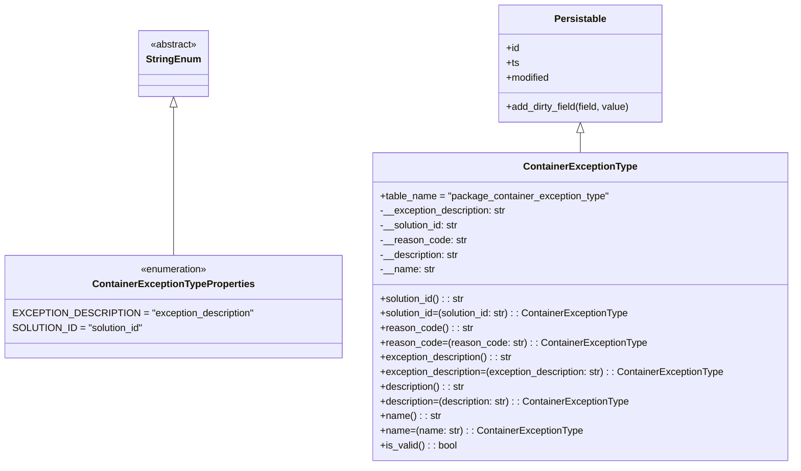

# Diagram: partview_service/partview_service/core/datamodel/ContainerExceptionType.py

> Auto-generated by Obscura crawlers

## Mermaid

### SVG

<svg id="container" width="1273.1953125" xmlns="http://www.w3.org/2000/svg" class="classDiagram" height="762" viewBox="0 0 1273.1953125 762" role="graphics-document document" aria-roledescription="class"><g><defs><marker id="container_class-aggregationStart" class="marker aggregation class" refX="18" refY="7" markerWidth="190" markerHeight="240" orient="auto"><path d="M 18,7 L9,13 L1,7 L9,1 Z"></path></marker></defs><defs><marker id="container_class-aggregationEnd" class="marker aggregation class" refX="1" refY="7" markerWidth="20" markerHeight="28" orient="auto"><path d="M 18,7 L9,13 L1,7 L9,1 Z"></path></marker></defs><defs><marker id="container_class-extensionStart" class="marker extension class" refX="18" refY="7" markerWidth="190" markerHeight="240" orient="auto"><path d="M 1,7 L18,13 V 1 Z"></path></marker></defs><defs><marker id="container_class-extensionEnd" class="marker extension class" refX="1" refY="7" markerWidth="20" markerHeight="28" orient="auto"><path d="M 1,1 V 13 L18,7 Z"></path></marker></defs><defs><marker id="container_class-compositionStart" class="marker composition class" refX="18" refY="7" markerWidth="190" markerHeight="240" orient="auto"><path d="M 18,7 L9,13 L1,7 L9,1 Z"></path></marker></defs><defs><marker id="container_class-compositionEnd" class="marker composition class" refX="1" refY="7" markerWidth="20" markerHeight="28" orient="auto"><path d="M 18,7 L9,13 L1,7 L9,1 Z"></path></marker></defs><defs><marker id="container_class-dependencyStart" class="marker dependency class" refX="6" refY="7" markerWidth="190" markerHeight="240" orient="auto"><path d="M 5,7 L9,13 L1,7 L9,1 Z"></path></marker></defs><defs><marker id="container_class-dependencyEnd" class="marker dependency class" refX="13" refY="7" markerWidth="20" markerHeight="28" orient="auto"><path d="M 18,7 L9,13 L14,7 L9,1 Z"></path></marker></defs><defs><marker id="container_class-lollipopStart" class="marker lollipop class" refX="13" refY="7" markerWidth="190" markerHeight="240" orient="auto"><circle stroke="black" fill="transparent" cx="7" cy="7" r="6"></circle></marker></defs><defs><marker id="container_class-lollipopEnd" class="marker lollipop class" refX="1" refY="7" markerWidth="190" markerHeight="240" orient="auto"><circle stroke="black" fill="transparent" cx="7" cy="7" r="6"></circle></marker></defs><g class="root"><g class="clusters"></g><g class="edgePaths"><path d="M269.305,175.25L269.305,183.542C269.305,191.833,269.305,208.417,269.305,248.875C269.305,289.333,269.305,353.667,269.305,385.833L269.305,418" id="id_StringEnum_ContainerExceptionTypeProperties_1" class="edge-thickness-normal edge-pattern-solid relation" style=";;;" data-edge="true" data-et="edge" data-id="id_StringEnum_ContainerExceptionTypeProperties_1" data-points="W3sieCI6MjY5LjMwNDY4NzUsInkiOjE1OH0seyJ4IjoyNjkuMzA0Njg3NSwieSI6MjI1fSx7IngiOjI2OS4zMDQ2ODc1LCJ5Ijo0MTh9XQ==" marker-start="url(#container_class-extensionStart)"></path><path d="M922.902,217.25L922.902,218.542C922.902,219.833,922.902,222.417,922.902,227.875C922.902,233.333,922.902,241.667,922.902,245.833L922.902,250" id="id_Persistable_ContainerExceptionType_2" class="edge-thickness-normal edge-pattern-solid relation" style=";;;" data-edge="true" data-et="edge" data-id="id_Persistable_ContainerExceptionType_2" data-points="W3sieCI6OTIyLjkwMjM0Mzc1LCJ5IjoyMDB9LHsieCI6OTIyLjkwMjM0Mzc1LCJ5IjoyMjV9LHsieCI6OTIyLjkwMjM0Mzc1LCJ5IjoyNTB9XQ==" marker-start="url(#container_class-extensionStart)"></path></g><g class="edgeLabels"><g class="edgeLabel"><g class="label" data-id="id_StringEnum_ContainerExceptionTypeProperties_1" transform="translate(0, 0)"><foreignObject width="0" height="0">

</foreignObject></g></g><g class="edgeLabel"><g class="label" data-id="id_Persistable_ContainerExceptionType_2" transform="translate(0, 0)"><foreignObject width="0" height="0">

</foreignObject></g></g></g><g class="nodes"><g class="node default" id="classId-StringEnum-0" transform="translate(269.3046875, 104)"><g class="basic label-container"><path d="M-54.234375 -54 L54.234375 -54 L54.234375 54 L-54.234375 54" stroke="none" stroke-width="0" fill="#ECECFF" style=""></path><path d="M-54.234375 -54 C-28.140990314651496 -54, -2.0476056293029927 -54, 54.234375 -54 M-54.234375 -54 C-18.22580691793143 -54, 17.782761164137142 -54, 54.234375 -54 M54.234375 -54 C54.234375 -29.885956208849276, 54.234375 -5.771912417698552, 54.234375 54 M54.234375 -54 C54.234375 -28.23970808815693, 54.234375 -2.479416176313862, 54.234375 54 M54.234375 54 C25.980414463358876 54, -2.2735460732822474 54, -54.234375 54 M54.234375 54 C25.880190719162428 54, -2.473993561675144 54, -54.234375 54 M-54.234375 54 C-54.234375 13.543172539042395, -54.234375 -26.91365492191521, -54.234375 -54 M-54.234375 54 C-54.234375 17.232035379654064, -54.234375 -19.53592924069187, -54.234375 -54" stroke="#9370DB" stroke-width="1.3" fill="none" stroke-dasharray="0 0" style=""></path></g><g class="annotation-group text" transform="translate(-38.609375, -30)"><g class="label" style="" transform="translate(0,-12)"><foreignObject width="77.21875" height="24">

«abstract»

</foreignObject></g></g><g class="label-group text" transform="translate(-42.234375, -6)"><g class="label" style="font-weight: bolder" transform="translate(0,-12)"><foreignObject width="84.46875" height="24">

StringEnum

</foreignObject></g></g><g class="members-group text" transform="translate(-42.234375, 42)"></g><g class="methods-group text" transform="translate(-42.234375, 72)"></g><g class="divider" style=""><path d="M-54.234375 18 C-26.100198348137805 18, 2.033978303724389 18, 54.234375 18 M-54.234375 18 C-25.229408387698587 18, 3.7755582246028254 18, 54.234375 18" stroke="#9370DB" stroke-width="1.3" fill="none" stroke-dasharray="0 0" style=""></path></g><g class="divider" style=""><path d="M-54.234375 36 C-20.306399991224907 36, 13.621575017550185 36, 54.234375 36 M-54.234375 36 C-28.655493403859865 36, -3.076611807719729 36, 54.234375 36" stroke="#9370DB" stroke-width="1.3" fill="none" stroke-dasharray="0 0" style=""></path></g></g><g class="node default" id="classId-ContainerExceptionTypeProperties-1" transform="translate(269.3046875, 502)"><g class="basic label-container"><path d="M-261.3046875 -84 L261.3046875 -84 L261.3046875 84 L-261.3046875 84" stroke="none" stroke-width="0" fill="#ECECFF" style=""></path><path d="M-261.3046875 -84 C-150.68804004056375 -84, -40.0713925811275 -84, 261.3046875 -84 M-261.3046875 -84 C-134.94694681698132 -84, -8.58920613396262 -84, 261.3046875 -84 M261.3046875 -84 C261.3046875 -39.27281646882071, 261.3046875 5.454367062358585, 261.3046875 84 M261.3046875 -84 C261.3046875 -37.81987503100801, 261.3046875 8.36024993798398, 261.3046875 84 M261.3046875 84 C72.44878961885277 84, -116.40710826229446 84, -261.3046875 84 M261.3046875 84 C131.90021581584583 84, 2.4957441316916515 84, -261.3046875 84 M-261.3046875 84 C-261.3046875 31.460051850935486, -261.3046875 -21.07989629812903, -261.3046875 -84 M-261.3046875 84 C-261.3046875 35.47287512997103, -261.3046875 -13.05424974005794, -261.3046875 -84" stroke="#9370DB" stroke-width="1.3" fill="none" stroke-dasharray="0 0" style=""></path></g><g class="annotation-group text" transform="translate(-55.5546875, -60)"><g class="label" style="" transform="translate(0,-12)"><foreignObject width="111.109375" height="24">

«enumeration»

</foreignObject></g></g><g class="label-group text" transform="translate(-126.9375, -36)"><g class="label" style="font-weight: bolder" transform="translate(0,-12)"><foreignObject width="253.875" height="24">

ContainerExceptionTypeProperties

</foreignObject></g></g><g class="members-group text" transform="translate(-249.3046875, 12)"><g class="label" style="" transform="translate(0,-12)"><foreignObject width="371.671875" height="24">

EXCEPTION_DESCRIPTION = "exception_description"

</foreignObject></g><g class="label" style="" transform="translate(0,12)"><foreignObject width="207.609375" height="24">

SOLUTION_ID = "solution_id"

</foreignObject></g></g><g class="methods-group text" transform="translate(-249.3046875, 84)"></g><g class="divider" style=""><path d="M-261.3046875 -12 C-130.17997423609592 -12, 0.9447390278081684 -12, 261.3046875 -12 M-261.3046875 -12 C-147.46594020556765 -12, -33.627192911135296 -12, 261.3046875 -12" stroke="#9370DB" stroke-width="1.3" fill="none" stroke-dasharray="0 0" style=""></path></g><g class="divider" style=""><path d="M-261.3046875 60 C-69.0616873505918 60, 123.1813127988164 60, 261.3046875 60 M-261.3046875 60 C-56.570972354870094 60, 148.1627427902598 60, 261.3046875 60" stroke="#9370DB" stroke-width="1.3" fill="none" stroke-dasharray="0 0" style=""></path></g></g><g class="node default" id="classId-Persistable-2" transform="translate(922.90234375, 104)"><g class="basic label-container"><path d="M-135.71484375 -96 L135.71484375 -96 L135.71484375 96 L-135.71484375 96" stroke="none" stroke-width="0" fill="#ECECFF" style=""></path><path d="M-135.71484375 -96 C-74.63335121079075 -96, -13.551858671581485 -96, 135.71484375 -96 M-135.71484375 -96 C-69.04421376170116 -96, -2.3735837734023164 -96, 135.71484375 -96 M135.71484375 -96 C135.71484375 -40.27608227047455, 135.71484375 15.447835459050907, 135.71484375 96 M135.71484375 -96 C135.71484375 -51.1474426013045, 135.71484375 -6.294885202608995, 135.71484375 96 M135.71484375 96 C37.969226613303974 96, -59.77639052339205 96, -135.71484375 96 M135.71484375 96 C76.77920210795614 96, 17.84356046591226 96, -135.71484375 96 M-135.71484375 96 C-135.71484375 41.92067632500286, -135.71484375 -12.158647349994283, -135.71484375 -96 M-135.71484375 96 C-135.71484375 43.970220404796876, -135.71484375 -8.059559190406247, -135.71484375 -96" stroke="#9370DB" stroke-width="1.3" fill="none" stroke-dasharray="0 0" style=""></path></g><g class="annotation-group text" transform="translate(0, -72)"></g><g class="label-group text" transform="translate(-40.9765625, -72)"><g class="label" style="font-weight: bolder" transform="translate(0,-12)"><foreignObject width="81.953125" height="24">

Persistable

</foreignObject></g></g><g class="members-group text" transform="translate(-123.71484375, -24)"><g class="label" style="" transform="translate(0,-12)"><foreignObject width="22.078125" height="24">

+id

</foreignObject></g><g class="label" style="" transform="translate(0,12)"><foreignObject width="21.15625" height="24">

+ts

</foreignObject></g><g class="label" style="" transform="translate(0,36)"><foreignObject width="72.609375" height="24">

+modified

</foreignObject></g></g><g class="methods-group text" transform="translate(-123.71484375, 72)"><g class="label" style="" transform="translate(0,-12)"><foreignObject width="206.453125" height="24">

+add_dirty_field(field, value)

</foreignObject></g></g><g class="divider" style=""><path d="M-135.71484375 -48 C-42.648873008153984 -48, 50.41709773369203 -48, 135.71484375 -48 M-135.71484375 -48 C-72.93756280026776 -48, -10.160281850535526 -48, 135.71484375 -48" stroke="#9370DB" stroke-width="1.3" fill="none" stroke-dasharray="0 0" style=""></path></g><g class="divider" style=""><path d="M-135.71484375 48 C-70.71848938072633 48, -5.72213501145265 48, 135.71484375 48 M-135.71484375 48 C-41.98059271503848 48, 51.753658319923034 48, 135.71484375 48" stroke="#9370DB" stroke-width="1.3" fill="none" stroke-dasharray="0 0" style=""></path></g></g><g class="node default" id="classId-ContainerExceptionType-3" transform="translate(922.90234375, 502)"><g class="basic label-container"><path d="M-342.29296875 -252 L342.29296875 -252 L342.29296875 252 L-342.29296875 252" stroke="none" stroke-width="0" fill="#ECECFF" style=""></path><path d="M-342.29296875 -252 C-150.30393181164746 -252, 41.68510512670508 -252, 342.29296875 -252 M-342.29296875 -252 C-73.75756877374971 -252, 194.77783120250058 -252, 342.29296875 -252 M342.29296875 -252 C342.29296875 -146.34925316813622, 342.29296875 -40.69850633627243, 342.29296875 252 M342.29296875 -252 C342.29296875 -62.77438391014897, 342.29296875 126.45123217970206, 342.29296875 252 M342.29296875 252 C123.71329219711944 252, -94.86638435576111 252, -342.29296875 252 M342.29296875 252 C102.60983246142948 252, -137.07330382714105 252, -342.29296875 252 M-342.29296875 252 C-342.29296875 147.4654498779165, -342.29296875 42.93089975583305, -342.29296875 -252 M-342.29296875 252 C-342.29296875 85.07897270936499, -342.29296875 -81.84205458127002, -342.29296875 -252" stroke="#9370DB" stroke-width="1.3" fill="none" stroke-dasharray="0 0" style=""></path></g><g class="annotation-group text" transform="translate(0, -228)"></g><g class="label-group text" transform="translate(-88.6328125, -228)"><g class="label" style="font-weight: bolder" transform="translate(0,-12)"><foreignObject width="177.265625" height="24">

ContainerExceptionType

</foreignObject></g></g><g class="members-group text" transform="translate(-330.29296875, -180)"><g class="label" style="" transform="translate(0,-12)"><foreignObject width="375.828125" height="24">

+table_name = "package_container_exception_type"

</foreignObject></g><g class="label" style="" transform="translate(0,12)"><foreignObject width="210.203125" height="24">

-__exception_description: str

</foreignObject></g><g class="label" style="" transform="translate(0,36)"><foreignObject width="131.390625" height="24">

-__solution_id: str

</foreignObject></g><g class="label" style="" transform="translate(0,60)"><foreignObject width="141.109375" height="24">

-__reason_code: str

</foreignObject></g><g class="label" style="" transform="translate(0,84)"><foreignObject width="131.453125" height="24">

-__description: str

</foreignObject></g><g class="label" style="" transform="translate(0,108)"><foreignObject width="89.671875" height="24">

-__name: str

</foreignObject></g></g><g class="methods-group text" transform="translate(-330.29296875, -12)"><g class="label" style="" transform="translate(0,-12)"><foreignObject width="140.40625" height="24">

+solution_id() : : str

</foreignObject></g><g class="label" style="" transform="translate(0,12)"><foreignObject width="413.6875" height="24">

+solution_id=(solution_id: str) : : ContainerExceptionType

</foreignObject></g><g class="label" style="" transform="translate(0,36)"><foreignObject width="150.140625" height="24">

+reason_code() : : str

</foreignObject></g><g class="label" style="" transform="translate(0,60)"><foreignObject width="433.140625" height="24">

+reason_code=(reason_code: str) : : ContainerExceptionType

</foreignObject></g><g class="label" style="" transform="translate(0,84)"><foreignObject width="219.546875" height="24">

+exception_description() : : str

</foreignObject></g><g class="label" style="" transform="translate(0,108)"><foreignObject width="571.953125" height="24">

+exception_description=(exception_description: str) : : ContainerExceptionType

</foreignObject></g><g class="label" style="" transform="translate(0,132)"><foreignObject width="140.796875" height="24">

+description() : : str

</foreignObject></g><g class="label" style="" transform="translate(0,156)"><foreignObject width="414.453125" height="24">

+description=(description: str) : : ContainerExceptionType

</foreignObject></g><g class="label" style="" transform="translate(0,180)"><foreignObject width="98.703125" height="24">

+name() : : str

</foreignObject></g><g class="label" style="" transform="translate(0,204)"><foreignObject width="330.265625" height="24">

+name=(name: str) : : ContainerExceptionType

</foreignObject></g><g class="label" style="" transform="translate(0,228)"><foreignObject width="126.078125" height="24">

+is_valid() : : bool

</foreignObject></g></g><g class="divider" style=""><path d="M-342.29296875 -204 C-122.91899741413914 -204, 96.45497392172172 -204, 342.29296875 -204 M-342.29296875 -204 C-118.2199333475784 -204, 105.85310205484319 -204, 342.29296875 -204" stroke="#9370DB" stroke-width="1.3" fill="none" stroke-dasharray="0 0" style=""></path></g><g class="divider" style=""><path d="M-342.29296875 -36 C-163.70533061227636 -36, 14.882307525447288 -36, 342.29296875 -36 M-342.29296875 -36 C-95.69000247715613 -36, 150.91296379568774 -36, 342.29296875 -36" stroke="#9370DB" stroke-width="1.3" fill="none" stroke-dasharray="0 0" style=""></path></g></g></g></g></g></svg>
