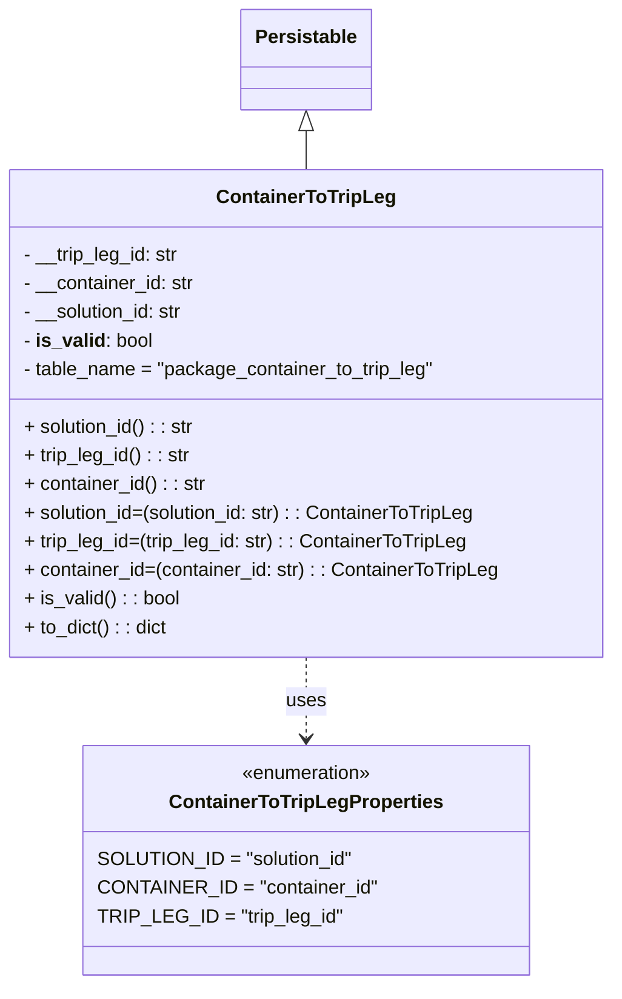
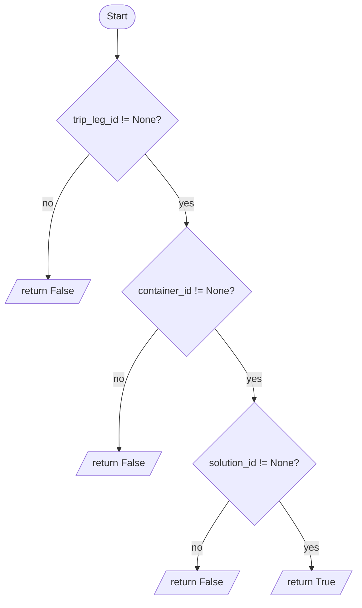

# Diagram: partview_service/partview_service/core/datamodel/ContainerToTripLeg.py

> Auto-generated by Obscura crawlers

## Diagram 1

> SVG rendering failed for this diagram.

## Diagram 2

### SVG

<svg id="container" width="582.1875" xmlns="http://www.w3.org/2000/svg" class="flowchart" height="974.71875" viewBox="0 0 582.1875 974.71875" role="graphics-document document" aria-roledescription="flowchart-v2"><g><marker id="container_flowchart-v2-pointEnd" class="marker flowchart-v2" viewBox="0 0 10 10" refX="5" refY="5" markerUnits="userSpaceOnUse" markerWidth="8" markerHeight="8" orient="auto"><path d="M 0 0 L 10 5 L 0 10 z" class="arrowMarkerPath" style="stroke-width: 1; stroke-dasharray: 1, 0;"></path></marker><marker id="container_flowchart-v2-pointStart" class="marker flowchart-v2" viewBox="0 0 10 10" refX="4.5" refY="5" markerUnits="userSpaceOnUse" markerWidth="8" markerHeight="8" orient="auto"><path d="M 0 5 L 10 10 L 10 0 z" class="arrowMarkerPath" style="stroke-width: 1; stroke-dasharray: 1, 0;"></path></marker><marker id="container_flowchart-v2-circleEnd" class="marker flowchart-v2" viewBox="0 0 10 10" refX="11" refY="5" markerUnits="userSpaceOnUse" markerWidth="11" markerHeight="11" orient="auto"><circle cx="5" cy="5" r="5" class="arrowMarkerPath" style="stroke-width: 1; stroke-dasharray: 1, 0;"></circle></marker><marker id="container_flowchart-v2-circleStart" class="marker flowchart-v2" viewBox="0 0 10 10" refX="-1" refY="5" markerUnits="userSpaceOnUse" markerWidth="11" markerHeight="11" orient="auto"><circle cx="5" cy="5" r="5" class="arrowMarkerPath" style="stroke-width: 1; stroke-dasharray: 1, 0;"></circle></marker><marker id="container_flowchart-v2-crossEnd" class="marker cross flowchart-v2" viewBox="0 0 11 11" refX="12" refY="5.2" markerUnits="userSpaceOnUse" markerWidth="11" markerHeight="11" orient="auto"><path d="M 1,1 l 9,9 M 10,1 l -9,9" class="arrowMarkerPath" style="stroke-width: 2; stroke-dasharray: 1, 0;"></path></marker><marker id="container_flowchart-v2-crossStart" class="marker cross flowchart-v2" viewBox="0 0 11 11" refX="-1" refY="5.2" markerUnits="userSpaceOnUse" markerWidth="11" markerHeight="11" orient="auto"><path d="M 1,1 l 9,9 M 10,1 l -9,9" class="arrowMarkerPath" style="stroke-width: 2; stroke-dasharray: 1, 0;"></path></marker><g class="root"><g class="clusters"></g><g class="edgePaths"><path d="M190.652,47.5L190.569,51.583C190.486,55.667,190.319,63.833,190.236,71.417C190.152,79,190.152,86,190.152,89.5L190.152,93" id="L_Start_CheckTrip_0" class="edge-thickness-normal edge-pattern-solid edge-thickness-normal edge-pattern-solid flowchart-link" style=";" data-edge="true" data-et="edge" data-id="L_Start_CheckTrip_0" data-points="W3sieCI6MTkwLjY1MjM0Mzc1LCJ5Ijo0Ny41fSx7IngiOjE5MC4xNTIzNDM3NSwieSI6NzJ9LHsieCI6MTkwLjE1MjM0Mzc1LCJ5Ijo5N31d" marker-end="url(#container_flowchart-v2-pointEnd)"></path><path d="M145.458,249.649L134.184,263.265C122.909,276.881,100.361,304.112,89.167,337.539C77.974,370.966,78.135,410.589,78.216,430.4L78.296,450.211" id="L_CheckTrip_ReturnFalse1_0" class="edge-thickness-normal edge-pattern-solid edge-thickness-normal edge-pattern-solid flowchart-link" style=";" data-edge="true" data-et="edge" data-id="L_CheckTrip_ReturnFalse1_0" data-points="W3sieCI6MTQ1LjQ1Nzc0OTk3ODgzNTU4LCJ5IjoyNDkuNjQ5MTU2MjI4ODM1NTh9LHsieCI6NzcuODEyNSwieSI6MzMxLjM0Mzc1fSx7IngiOjc4LjMxMjUsInkiOjQ1NC4yMTA5Mzc1fV0=" marker-end="url(#container_flowchart-v2-pointEnd)"></path><path d="M234.847,249.649L246.121,263.265C257.395,276.881,279.944,304.112,291.218,323.228C302.492,342.344,302.492,353.344,302.492,358.844L302.492,364.344" id="L_CheckTrip_CheckContainer_0" class="edge-thickness-normal edge-pattern-solid edge-thickness-normal edge-pattern-solid flowchart-link" style=";" data-edge="true" data-et="edge" data-id="L_CheckTrip_CheckContainer_0" data-points="W3sieCI6MjM0Ljg0NjkzNzUyMTE2NDQyLCJ5IjoyNDkuNjQ5MTU2MjI4ODM1NTh9LHsieCI6MzAyLjQ5MjE4NzUsInkiOjMzMS4zNDM3NX0seyJ4IjozMDIuNDkyMTg3NSwieSI6MzY4LjM0Mzc1fV0=" marker-end="url(#container_flowchart-v2-pointEnd)"></path><path d="M256.619,532.205L245.878,546.017C235.138,559.829,213.657,587.454,202.997,620.403C192.337,653.352,192.498,691.625,192.578,710.762L192.659,729.898" id="L_CheckContainer_ReturnFalse2_0" class="edge-thickness-normal edge-pattern-solid edge-thickness-normal edge-pattern-solid flowchart-link" style=";" data-edge="true" data-et="edge" data-id="L_CheckContainer_ReturnFalse2_0" data-points="W3sieCI6MjU2LjYxODU3OTc1ODQzODA1LCJ5Ijo1MzIuMjA0NTE3MjU4NDM4fSx7IngiOjE5Mi4xNzU3ODEyNSwieSI6NjE1LjA3ODEyNX0seyJ4IjoxOTIuNjc1NzgxMjUsInkiOjczMy44OTg0Mzc1fV0=" marker-end="url(#container_flowchart-v2-pointEnd)"></path><path d="M348.366,532.205L359.106,546.017C369.847,559.829,391.328,587.454,402.068,606.766C412.809,626.078,412.809,637.078,412.809,642.578L412.809,648.078" id="L_CheckContainer_CheckSolution_0" class="edge-thickness-normal edge-pattern-solid edge-thickness-normal edge-pattern-solid flowchart-link" style=";" data-edge="true" data-et="edge" data-id="L_CheckContainer_CheckSolution_0" data-points="W3sieCI6MzQ4LjM2NTc5NTI0MTU2MTk1LCJ5Ijo1MzIuMjA0NTE3MjU4NDM4fSx7IngiOjQxMi44MDg1OTM3NSwieSI6NjE1LjA3ODEyNX0seyJ4Ijo0MTIuODA4NTkzNzUsInkiOjY1Mi4wNzgxMjV9XQ==" marker-end="url(#container_flowchart-v2-pointEnd)"></path><path d="M371.997,812.907L363.177,825.876C354.357,838.844,336.718,864.782,327.972,883.334C319.227,901.886,319.376,913.052,319.45,918.636L319.525,924.219" id="L_CheckSolution_ReturnFalse3_0" class="edge-thickness-normal edge-pattern-solid edge-thickness-normal edge-pattern-solid flowchart-link" style=";" data-edge="true" data-et="edge" data-id="L_CheckSolution_ReturnFalse3_0" data-points="W3sieCI6MzcxLjk5NzA5MTg0NDc1MDA2LCJ5Ijo4MTIuOTA3MjQ4MDk0NzUwMX0seyJ4IjozMTkuMDc4MTI1LCJ5Ijo4OTAuNzE4NzV9LHsieCI6MzE5LjU3ODEyNSwieSI6OTI4LjIxODc1fV0=" marker-end="url(#container_flowchart-v2-pointEnd)"></path><path d="M453.62,812.907L462.44,825.876C471.26,838.844,488.899,864.782,497.794,883.334C506.688,901.886,506.837,913.052,506.911,918.636L506.986,924.219" id="L_CheckSolution_ReturnTrue_0" class="edge-thickness-normal edge-pattern-solid edge-thickness-normal edge-pattern-solid flowchart-link" style=";" data-edge="true" data-et="edge" data-id="L_CheckSolution_ReturnTrue_0" data-points="W3sieCI6NDUzLjYyMDA5NTY1NTI0OTk0LCJ5Ijo4MTIuOTA3MjQ4MDk0NzUwMX0seyJ4Ijo1MDYuNTM5MDYyNSwieSI6ODkwLjcxODc1fSx7IngiOjUwNy4wMzkwNjI1LCJ5Ijo5MjguMjE4NzV9XQ==" marker-end="url(#container_flowchart-v2-pointEnd)"></path></g><g class="edgeLabels"><g class="edgeLabel"><g class="label" data-id="L_Start_CheckTrip_0" transform="translate(0, 0)"><foreignObject width="0" height="0">

</foreignObject></g></g><g class="edgeLabel" transform="translate(77.8125, 331.34375)"><g class="label" data-id="L_CheckTrip_ReturnFalse1_0" transform="translate(-9.3671875, -12)"><foreignObject width="18.734375" height="24">

no

</foreignObject></g></g><g class="edgeLabel" transform="translate(302.4921875, 331.34375)"><g class="label" data-id="L_CheckTrip_CheckContainer_0" transform="translate(-12.0078125, -12)"><foreignObject width="24.015625" height="24">

yes

</foreignObject></g></g><g class="edgeLabel" transform="translate(192.17578125, 615.078125)"><g class="label" data-id="L_CheckContainer_ReturnFalse2_0" transform="translate(-9.3671875, -12)"><foreignObject width="18.734375" height="24">

no

</foreignObject></g></g><g class="edgeLabel" transform="translate(412.80859375, 615.078125)"><g class="label" data-id="L_CheckContainer_CheckSolution_0" transform="translate(-12.0078125, -12)"><foreignObject width="24.015625" height="24">

yes

</foreignObject></g></g><g class="edgeLabel" transform="translate(319.078125, 890.71875)"><g class="label" data-id="L_CheckSolution_ReturnFalse3_0" transform="translate(-9.3671875, -12)"><foreignObject width="18.734375" height="24">

no

</foreignObject></g></g><g class="edgeLabel" transform="translate(506.5390625, 890.71875)"><g class="label" data-id="L_CheckSolution_ReturnTrue_0" transform="translate(-12.0078125, -12)"><foreignObject width="24.015625" height="24">

yes

</foreignObject></g></g></g><g class="nodes"><g class="node default" id="flowchart-Start-0" transform="translate(190.15234375, 27.5)"><g class="basic label-container outer-path"><path d="M-10.3984375 -19.5 C-5.516983840613327 -19.5, -0.6355301812266543 -19.5, 10.3984375 -19.5 C10.3984375 -19.5, 10.398437499999998 -19.5, 10.398437499999998 -19.5 C10.772790841422752 -19.487995216975147, 11.147144182845507 -19.475990433950297, 11.6478067896239 -19.45993515863156 C12.075862430406728 -19.418641145777467, 12.503918071189554 -19.377347132923376, 12.892042152847864 -19.3399052695533 C13.245311035109614 -19.282791496310317, 13.598579917371364 -19.22567772306734, 14.126030759676757 -19.140403561325776 C14.433630336889783 -19.070195965101732, 14.74122991410281 -18.99998836887769, 15.34470188623539 -18.862249829261074 C15.72677814182956 -18.748851602159917, 16.108854397423727 -18.63545337505876, 16.543047751460602 -18.50658706670804 C16.861928503308647 -18.3892360023266, 17.180809255156692 -18.271884937945163, 17.716144095147794 -18.074876768247425 C18.123733954554194 -17.894448828211807, 18.531323813960594 -17.71402088817619, 18.85917041279238 -17.568892924097174 C19.099192752367117 -17.44367342328268, 19.339215091941856 -17.318453922468187, 19.967429764076783 -16.990714730406097 C20.32461290858584 -16.774188209163558, 20.6817960530949 -16.55766168792102, 21.036368073605697 -16.342718045390892 C21.298119703847515 -16.16013143917965, 21.559871334089333 -15.977544832968407, 22.061592844578712 -15.627565626425154 C22.34307617648712 -15.403090159814246, 22.624559508395528 -15.178614693203338, 23.03889120850187 -14.848196188198123 C23.22935112561617 -14.675225530768179, 23.419811042730466 -14.502254873338236, 23.964247236767985 -14.007812326905688 C24.237378459341443 -13.72578191510818, 24.5105096819149 -13.443751503310674, 24.833858442968648 -13.10986736009568 C25.052865348843717 -12.852609386608853, 25.271872254718787 -12.595351413122023, 25.644151408126582 -12.158051136245305 C25.803974663647228 -11.943902534045748, 25.963797919167874 -11.72975393184619, 26.391796464640635 -11.156274872382312 C26.597103908123216 -10.840867506425177, 26.802411351605798 -10.525460140468041, 27.073721378604247 -10.108655082055241 C27.26864946122026 -9.762540532761765, 27.463577543836273 -9.416425983468287, 27.6871239742735 -9.019496659696287 C27.898647938137888 -8.580262622844094, 28.110171902002275 -8.141028585991899, 28.22948364880834 -7.893275190886684 C28.41537770907696 -7.434113268006041, 28.601271769345576 -6.974951345125398, 28.698571729970325 -6.734618561215508 C28.847504028177408 -6.286058208155016, 28.99643632638449 -5.837497855094524, 29.09246063421488 -5.548287939305138 C29.169194783881885 -5.255667369834019, 29.245928933548885 -4.9630468003629, 29.40953178754556 -4.339158212148133 C29.496428283657938 -3.8929630701920366, 29.583324779770315 -3.44676792823594, 29.648482276581777 -3.1121979531509023 C29.710456804338776 -2.631535754122363, 29.772431332095778 -2.150873555093824, 29.808330202509367 -1.872449005199798 C29.82519575135149 -1.6097544683577045, 29.842061300193617 -1.347059931515611, 29.888418715913414 -0.6250057626472757 C29.888418715913414 -0.33581811986396876, 29.888418715913414 -0.046630477080661814, 29.888418715913414 0.625005762647271 C29.86142667928461 1.0454285207207326, 29.834434642655804 1.4658512787941942, 29.808330202509367 1.8724490051997846 C29.759944172862497 2.2477214962386216, 29.711558143215626 2.6229939872774586, 29.648482276581777 3.1121979531508885 C29.576273566452087 3.4829744183505618, 29.504064856322398 3.853750883550235, 29.40953178754556 4.339158212148129 C29.31334806754186 4.70594842281018, 29.217164347538162 5.072738633472231, 29.092460634214884 5.548287939305125 C28.98267225297219 5.878953051205083, 28.872883871729496 6.2096181631050404, 28.69857172997033 6.734618561215495 C28.583070763610873 7.019908181182623, 28.467569797251418 7.305197801149751, 28.229483648808344 7.893275190886679 C28.045417339287447 8.275492820994927, 27.861351029766553 8.657710451103174, 27.687123974273504 9.019496659696284 C27.51024210285817 9.333568333625912, 27.33336023144284 9.647640007555541, 27.07372137860425 10.108655082055236 C26.922402748389715 10.341121132806377, 26.771084118175178 10.573587183557517, 26.39179646464064 11.156274872382301 C26.191646158208773 11.42445804893298, 25.991495851776904 11.69264122548366, 25.644151408126582 12.158051136245302 C25.473800774434622 12.358154683805532, 25.30345014074266 12.55825823136576, 24.83385844296866 13.10986736009567 C24.501561254846777 13.452991488938034, 24.1692640667249 13.796115617780398, 23.96424723676799 14.007812326905684 C23.658894901152365 14.28512523893172, 23.353542565536742 14.562438150957753, 23.038891208501887 14.848196188198111 C22.695036041821 15.122411533255843, 22.351180875140113 15.396626878313572, 22.061592844578715 15.627565626425152 C21.700905461590626 15.879165530892486, 21.340218078602536 16.13076543535982, 21.036368073605708 16.34271804539089 C20.69944551938193 16.546962477738045, 20.36252296515815 16.751206910085205, 19.967429764076787 16.990714730406093 C19.743159411665847 17.107716429606864, 19.518889059254903 17.224718128807638, 18.859170412792388 17.56889292409717 C18.508635808614464 17.724064195127152, 18.158101204436544 17.879235466157137, 17.716144095147804 18.07487676824742 C17.338890300413727 18.21370965200541, 16.961636505679653 18.3525425357634, 16.543047751460616 18.506587066708033 C16.276039678508532 18.585833661206237, 16.009031605556444 18.665080255704442, 15.344701886235413 18.86224982926107 C14.91509704538748 18.96030433075103, 14.485492204539545 19.058358832240987, 14.126030759676766 19.140403561325773 C13.792980083679527 19.19424861177444, 13.459929407682289 19.248093662223106, 12.892042152847878 19.3399052695533 C12.43425741002159 19.384067213127047, 11.976472667195301 19.428229156700795, 11.6478067896239 19.45993515863156 C11.31381843848906 19.470645514983566, 10.97983008735422 19.48135587133557, 10.398437500000004 19.5 C10.398437500000002 19.5, 10.398437500000002 19.5, 10.3984375 19.5 C2.6174845824936543 19.5, -5.163468335012691 19.5, -10.398437499999996 19.5 C-10.834559528945213 19.48601441539176, -11.27068155789043 19.47202883078352, -11.647806789623893 19.45993515863156 C-12.051734454367766 19.42096874260781, -12.45566211911164 19.382002326584058, -12.892042152847871 19.3399052695533 C-13.26396307074765 19.27977597983706, -13.635883988647429 19.219646690120815, -14.126030759676759 19.140403561325773 C-14.474185236363105 19.060939573942395, -14.82233971304945 18.98147558655902, -15.344701886235388 18.862249829261074 C-15.707595252340715 18.754544983067163, -16.070488618446042 18.64684013687325, -16.54304775146059 18.506587066708043 C-16.881442561020204 18.382054648702777, -17.219837370579818 18.25752223069751, -17.716144095147797 18.074876768247425 C-18.16337400188246 17.876901355139807, -18.610603908617126 17.678925942032194, -18.85917041279238 17.568892924097174 C-19.13427686100624 17.425370066278095, -19.409383309220093 17.281847208459016, -19.96742976407678 16.990714730406097 C-20.313111412361295 16.78116048376517, -20.65879306064581 16.571606237124247, -21.036368073605686 16.3427180453909 C-21.31130923099928 16.150930996004007, -21.586250388392877 15.959143946617113, -22.061592844578712 15.627565626425156 C-22.341445989430905 15.404390190610478, -22.621299134283102 15.1812147547958, -23.03889120850187 14.848196188198125 C-23.36471091423844 14.552295352165183, -23.690530619975014 14.256394516132241, -23.964247236767974 14.007812326905697 C-24.2209290892201 13.74276724027687, -24.477610941672225 13.477722153648042, -24.833858442968655 13.109867360095677 C-25.012705374264062 12.89978357791741, -25.191552305559465 12.689699795739143, -25.64415140812658 12.158051136245307 C-25.863690042647207 11.863889366368717, -26.083228677167835 11.569727596492127, -26.391796464640635 11.156274872382316 C-26.6418685744451 10.772096957958766, -26.89194068424956 10.387919043535216, -27.073721378604244 10.108655082055249 C-27.29704670519403 9.712118350553569, -27.520372031783822 9.315581619051887, -27.6871239742735 9.019496659696289 C-27.816816939237434 8.750186442963772, -27.94650990420137 8.480876226231256, -28.22948364880834 7.893275190886686 C-28.338508473015594 7.623981767243187, -28.44753329722285 7.354688343599689, -28.698571729970325 6.73461856121551 C-28.82024756672313 6.368150327327918, -28.941923403475936 6.0016820934403246, -29.09246063421488 5.5482879393051325 C-29.201332656032502 5.133111734681812, -29.31020467785012 4.71793553005849, -29.409531787545557 4.339158212148136 C-29.485463383514006 3.949265514998652, -29.561394979482454 3.5593728178491686, -29.648482276581777 3.112197953150904 C-29.703922401254435 2.6822152940806783, -29.75936252592709 2.252232635010452, -29.808330202509364 1.872449005199809 C-29.826127047516827 1.595248778853834, -29.84392389252429 1.3180485525078591, -29.888418715913414 0.6250057626472781 C-29.888418715913414 0.3288548866440971, -29.888418715913414 0.032704010640916104, -29.888418715913414 -0.6250057626472687 C-29.86767693939463 -0.9480756743879548, -29.84693516287585 -1.271145586128641, -29.808330202509367 -1.8724490051997822 C-29.771528714489833 -2.1578740790034905, -29.7347272264703 -2.443299152807199, -29.648482276581777 -3.112197953150895 C-29.575459853637078 -3.4871526616773765, -29.50243743069238 -3.862107370203858, -29.40953178754556 -4.339158212148126 C-29.306171752833993 -4.733314821025739, -29.20281171812243 -5.127471429903352, -29.092460634214884 -5.548287939305123 C-28.95973840946254 -5.948026133844417, -28.827016184710192 -6.347764328383712, -28.698571729970332 -6.734618561215485 C-28.565694114642387 -7.062828840089434, -28.43281649931444 -7.391039118963382, -28.229483648808344 -7.893275190886676 C-28.039890121873082 -8.28697020621936, -27.850296594937824 -8.680665221552042, -27.687123974273504 -9.019496659696282 C-27.50913186648733 -9.335539670725964, -27.33113975870116 -9.651582681755645, -27.073721378604247 -10.108655082055243 C-26.84408668771555 -10.461435632808781, -26.614451996826848 -10.81421618356232, -26.39179646464064 -11.156274872382308 C-26.23264937639409 -11.369517472034685, -26.073502288147537 -11.58276007168706, -25.644151408126586 -12.158051136245302 C-25.45755553682884 -12.377237264277497, -25.27095966553109 -12.596423392309692, -24.833858442968662 -13.10986736009567 C-24.49063947845134 -13.464269119760846, -24.147420513934016 -13.818670879426024, -23.964247236767996 -14.007812326905677 C-23.675525168656556 -14.27002206999718, -23.386803100545112 -14.532231813088682, -23.038891208501887 -14.848196188198107 C-22.770734168089046 -15.062044291968814, -22.502577127676204 -15.275892395739518, -22.06159284457872 -15.627565626425149 C-21.81961063665972 -15.796361939428493, -21.577628428740724 -15.965158252431836, -21.03636807360571 -16.342718045390885 C-20.67444499866322 -16.562117940317094, -20.312521923720727 -16.781517835243303, -19.96742976407679 -16.99071473040609 C-19.64750342004868 -17.15762009916295, -19.327577076020567 -17.324525467919816, -18.859170412792388 -17.56889292409717 C-18.447018552935447 -17.75134032640531, -18.034866693078506 -17.933787728713448, -17.716144095147804 -18.07487676824742 C-17.474155680132355 -18.163930741889494, -17.232167265116907 -18.252984715531564, -16.54304775146062 -18.506587066708033 C-16.286639677607056 -18.582687637114326, -16.030231603753496 -18.65878820752062, -15.344701886235413 -18.862249829261067 C-14.919746910429133 -18.959243029398475, -14.494791934622853 -19.056236229535884, -14.126030759676768 -19.140403561325773 C-13.863540115638175 -19.182841013008584, -13.601049471599582 -19.2252784646914, -12.89204215284788 -19.3399052695533 C-12.547365610824547 -19.373155801028098, -12.202689068801215 -19.4064063325029, -11.647806789623903 -19.45993515863156 C-11.364427129945495 -19.4690225927524, -11.081047470267087 -19.47811002687324, -10.398437500000005 -19.5 C-10.398437500000004 -19.5, -10.398437500000002 -19.5, -10.3984375 -19.5" stroke="none" stroke-width="0" fill="#ECECFF" style=""></path><path d="M-10.3984375 -19.5 C-5.50582810978025 -19.5, -0.6132187195604999 -19.5, 10.3984375 -19.5 M-10.3984375 -19.5 C-3.3435281434590056 -19.5, 3.7113812130819888 -19.5, 10.3984375 -19.5 M10.3984375 -19.5 C10.3984375 -19.5, 10.398437499999998 -19.5, 10.398437499999998 -19.5 M10.3984375 -19.5 C10.3984375 -19.5, 10.3984375 -19.5, 10.398437499999998 -19.5 M10.398437499999998 -19.5 C10.827364127488627 -19.486245157911473, 11.256290754977254 -19.472490315822945, 11.6478067896239 -19.45993515863156 M10.398437499999998 -19.5 C10.673864896384137 -19.491167579484866, 10.949292292768275 -19.482335158969732, 11.6478067896239 -19.45993515863156 M11.6478067896239 -19.45993515863156 C11.907425519380826 -19.434890052009113, 12.167044249137753 -19.409844945386666, 12.892042152847864 -19.3399052695533 M11.6478067896239 -19.45993515863156 C12.032691398094673 -19.42280580334385, 12.417576006565449 -19.385676448056138, 12.892042152847864 -19.3399052695533 M12.892042152847864 -19.3399052695533 C13.182896596360866 -19.292882178736015, 13.47375103987387 -19.24585908791873, 14.126030759676757 -19.140403561325776 M12.892042152847864 -19.3399052695533 C13.266919434312102 -19.2792980179029, 13.64179671577634 -19.2186907662525, 14.126030759676757 -19.140403561325776 M14.126030759676757 -19.140403561325776 C14.494160977926494 -19.05638024128445, 14.86229119617623 -18.972356921243126, 15.34470188623539 -18.862249829261074 M14.126030759676757 -19.140403561325776 C14.420764988994687 -19.07313239680455, 14.715499218312617 -19.00586123228332, 15.34470188623539 -18.862249829261074 M15.34470188623539 -18.862249829261074 C15.757560313700782 -18.739715615127455, 16.170418741166177 -18.617181400993836, 16.543047751460602 -18.50658706670804 M15.34470188623539 -18.862249829261074 C15.65364475703164 -18.77055720688297, 15.962587627827892 -18.67886458450486, 16.543047751460602 -18.50658706670804 M16.543047751460602 -18.50658706670804 C16.936691137009305 -18.36172266202655, 17.330334522558008 -18.21685825734506, 17.716144095147794 -18.074876768247425 M16.543047751460602 -18.50658706670804 C16.984790735786 -18.34402156504891, 17.426533720111394 -18.18145606338978, 17.716144095147794 -18.074876768247425 M17.716144095147794 -18.074876768247425 C17.957863229866604 -17.967874877650775, 18.199582364585414 -17.86087298705413, 18.85917041279238 -17.568892924097174 M17.716144095147794 -18.074876768247425 C18.13538177638555 -17.889292683007422, 18.554619457623307 -17.70370859776742, 18.85917041279238 -17.568892924097174 M18.85917041279238 -17.568892924097174 C19.278818715638906 -17.34996267329971, 19.69846701848543 -17.131032422502244, 19.967429764076783 -16.990714730406097 M18.85917041279238 -17.568892924097174 C19.17086991297168 -17.40627949450669, 19.482569413150976 -17.243666064916212, 19.967429764076783 -16.990714730406097 M19.967429764076783 -16.990714730406097 C20.334708810158588 -16.768068014300056, 20.70198785624039 -16.545421298194015, 21.036368073605697 -16.342718045390892 M19.967429764076783 -16.990714730406097 C20.347716196170342 -16.760182860459846, 20.728002628263898 -16.529650990513595, 21.036368073605697 -16.342718045390892 M21.036368073605697 -16.342718045390892 C21.295347767844955 -16.16206502173986, 21.554327462084213 -15.981411998088825, 22.061592844578712 -15.627565626425154 M21.036368073605697 -16.342718045390892 C21.26966805543422 -16.179978077460756, 21.502968037262743 -16.017238109530616, 22.061592844578712 -15.627565626425154 M22.061592844578712 -15.627565626425154 C22.42213492276908 -15.340042913495978, 22.782677000959445 -15.052520200566802, 23.03889120850187 -14.848196188198123 M22.061592844578712 -15.627565626425154 C22.39176843274168 -15.36425938120659, 22.721944020904647 -15.100953135988027, 23.03889120850187 -14.848196188198123 M23.03889120850187 -14.848196188198123 C23.262085482048196 -14.645497054360222, 23.485279755594522 -14.442797920522322, 23.964247236767985 -14.007812326905688 M23.03889120850187 -14.848196188198123 C23.25435433977629 -14.652518273216751, 23.46981747105071 -14.45684035823538, 23.964247236767985 -14.007812326905688 M23.964247236767985 -14.007812326905688 C24.24023604016018 -13.722831228301086, 24.516224843552376 -13.437850129696482, 24.833858442968648 -13.10986736009568 M23.964247236767985 -14.007812326905688 C24.191291755626185 -13.77337022048293, 24.418336274484382 -13.53892811406017, 24.833858442968648 -13.10986736009568 M24.833858442968648 -13.10986736009568 C25.033390920632428 -12.875485158112191, 25.232923398296204 -12.641102956128703, 25.644151408126582 -12.158051136245305 M24.833858442968648 -13.10986736009568 C25.015540887577483 -12.896452822634183, 25.19722333218632 -12.683038285172685, 25.644151408126582 -12.158051136245305 M25.644151408126582 -12.158051136245305 C25.82306148892099 -11.918327927024457, 26.001971569715405 -11.678604717803609, 26.391796464640635 -11.156274872382312 M25.644151408126582 -12.158051136245305 C25.900705351561797 -11.814292224587183, 26.15725929499701 -11.47053331292906, 26.391796464640635 -11.156274872382312 M26.391796464640635 -11.156274872382312 C26.583869627885807 -10.861198914771675, 26.77594279113098 -10.566122957161038, 27.073721378604247 -10.108655082055241 M26.391796464640635 -11.156274872382312 C26.53814867135678 -10.931438581796142, 26.684500878072924 -10.706602291209974, 27.073721378604247 -10.108655082055241 M27.073721378604247 -10.108655082055241 C27.281773710517548 -9.73923709916008, 27.48982604243085 -9.369819116264917, 27.6871239742735 -9.019496659696287 M27.073721378604247 -10.108655082055241 C27.299205997626565 -9.708284308187539, 27.524690616648883 -9.307913534319834, 27.6871239742735 -9.019496659696287 M27.6871239742735 -9.019496659696287 C27.879351603932164 -8.620331873697689, 28.07157923359083 -8.221167087699092, 28.22948364880834 -7.893275190886684 M27.6871239742735 -9.019496659696287 C27.888881277380836 -8.600543302879178, 28.090638580488168 -8.181589946062068, 28.22948364880834 -7.893275190886684 M28.22948364880834 -7.893275190886684 C28.33245256266141 -7.638939982901089, 28.435421476514477 -7.384604774915495, 28.698571729970325 -6.734618561215508 M28.22948364880834 -7.893275190886684 C28.330796582151095 -7.643030286777767, 28.43210951549385 -7.392785382668851, 28.698571729970325 -6.734618561215508 M28.698571729970325 -6.734618561215508 C28.83468221992434 -6.3246754517355415, 28.970792709878353 -5.914732342255575, 29.09246063421488 -5.548287939305138 M28.698571729970325 -6.734618561215508 C28.81269759593501 -6.39088963641725, 28.926823461899698 -6.047160711618992, 29.09246063421488 -5.548287939305138 M29.09246063421488 -5.548287939305138 C29.209462082036044 -5.102110710014785, 29.32646352985721 -4.655933480724433, 29.40953178754556 -4.339158212148133 M29.09246063421488 -5.548287939305138 C29.2030406821197 -5.126598290948137, 29.31362073002452 -4.704908642591136, 29.40953178754556 -4.339158212148133 M29.40953178754556 -4.339158212148133 C29.488168591992768 -3.9353748412062233, 29.566805396439978 -3.531591470264313, 29.648482276581777 -3.1121979531509023 M29.40953178754556 -4.339158212148133 C29.46882211040257 -4.034714935291559, 29.528112433259583 -3.7302716584349844, 29.648482276581777 -3.1121979531509023 M29.648482276581777 -3.1121979531509023 C29.70573722086167 -2.668139911583632, 29.76299216514156 -2.224081870016362, 29.808330202509367 -1.872449005199798 M29.648482276581777 -3.1121979531509023 C29.710097273263045 -2.6343242061482974, 29.771712269944313 -2.1564504591456926, 29.808330202509367 -1.872449005199798 M29.808330202509367 -1.872449005199798 C29.83481818209135 -1.4598773424980849, 29.861306161673337 -1.0473056797963718, 29.888418715913414 -0.6250057626472757 M29.808330202509367 -1.872449005199798 C29.827365248298193 -1.5759628022264185, 29.84640029408702 -1.279476599253039, 29.888418715913414 -0.6250057626472757 M29.888418715913414 -0.6250057626472757 C29.888418715913414 -0.22858441373746258, 29.888418715913414 0.16783693517235054, 29.888418715913414 0.625005762647271 M29.888418715913414 -0.6250057626472757 C29.888418715913414 -0.16105993337986174, 29.888418715913414 0.3028858958875522, 29.888418715913414 0.625005762647271 M29.888418715913414 0.625005762647271 C29.871673700430602 0.8858228951252827, 29.85492868494779 1.1466400276032942, 29.808330202509367 1.8724490051997846 M29.888418715913414 0.625005762647271 C29.871813750597976 0.883641500721949, 29.855208785282542 1.142277238796627, 29.808330202509367 1.8724490051997846 M29.808330202509367 1.8724490051997846 C29.76227954189651 2.2296088351815775, 29.71622888128366 2.5867686651633703, 29.648482276581777 3.1121979531508885 M29.808330202509367 1.8724490051997846 C29.74836765740842 2.337506664058915, 29.688405112307468 2.8025643229180455, 29.648482276581777 3.1121979531508885 M29.648482276581777 3.1121979531508885 C29.59493279641442 3.3871632161236342, 29.54138331624706 3.6621284790963804, 29.40953178754556 4.339158212148129 M29.648482276581777 3.1121979531508885 C29.555749374017527 3.5883618087124303, 29.463016471453273 4.0645256642739716, 29.40953178754556 4.339158212148129 M29.40953178754556 4.339158212148129 C29.33589642479126 4.619961764098363, 29.262261062036963 4.900765316048597, 29.092460634214884 5.548287939305125 M29.40953178754556 4.339158212148129 C29.32529943006063 4.660372697772837, 29.241067072575696 4.981587183397544, 29.092460634214884 5.548287939305125 M29.092460634214884 5.548287939305125 C28.94887232573671 5.980753046751285, 28.805284017258533 6.413218154197443, 28.69857172997033 6.734618561215495 M29.092460634214884 5.548287939305125 C28.984403875060302 5.873737681372202, 28.87634711590572 6.19918742343928, 28.69857172997033 6.734618561215495 M28.69857172997033 6.734618561215495 C28.51415974537615 7.190119728526284, 28.329747760781977 7.645620895837073, 28.229483648808344 7.893275190886679 M28.69857172997033 6.734618561215495 C28.588307019478084 7.006974527954489, 28.47804230898584 7.279330494693483, 28.229483648808344 7.893275190886679 M28.229483648808344 7.893275190886679 C28.08906629927327 8.184854821646233, 27.9486489497382 8.476434452405789, 27.687123974273504 9.019496659696284 M28.229483648808344 7.893275190886679 C28.04095399545975 8.284761049953405, 27.852424342111153 8.676246909020131, 27.687123974273504 9.019496659696284 M27.687123974273504 9.019496659696284 C27.522140324542708 9.312441836199426, 27.357156674811915 9.60538701270257, 27.07372137860425 10.108655082055236 M27.687123974273504 9.019496659696284 C27.494885226483266 9.360836022681916, 27.302646478693028 9.702175385667548, 27.07372137860425 10.108655082055236 M27.07372137860425 10.108655082055236 C26.818397393018504 10.50090128800495, 26.563073407432757 10.893147493954666, 26.39179646464064 11.156274872382301 M27.07372137860425 10.108655082055236 C26.87485511146416 10.414167071452278, 26.675988844324067 10.71967906084932, 26.39179646464064 11.156274872382301 M26.39179646464064 11.156274872382301 C26.194946125643806 11.420036393203254, 25.998095786646967 11.68379791402421, 25.644151408126582 12.158051136245302 M26.39179646464064 11.156274872382301 C26.105880443140922 11.53937629370652, 25.819964421641206 11.922477715030736, 25.644151408126582 12.158051136245302 M25.644151408126582 12.158051136245302 C25.37659838910753 12.472334136583143, 25.10904537008848 12.786617136920984, 24.83385844296866 13.10986736009567 M25.644151408126582 12.158051136245302 C25.326995179253323 12.530600889380496, 25.009838950380065 12.903150642515689, 24.83385844296866 13.10986736009567 M24.83385844296866 13.10986736009567 C24.511860224196468 13.442356957523373, 24.189862005424274 13.774846554951075, 23.96424723676799 14.007812326905684 M24.83385844296866 13.10986736009567 C24.53500952808746 13.418453400662726, 24.236160613206263 13.727039441229781, 23.96424723676799 14.007812326905684 M23.96424723676799 14.007812326905684 C23.60426327013916 14.334740240744164, 23.244279303510332 14.661668154582646, 23.038891208501887 14.848196188198111 M23.96424723676799 14.007812326905684 C23.70229443014828 14.245710934986242, 23.440341623528575 14.483609543066798, 23.038891208501887 14.848196188198111 M23.038891208501887 14.848196188198111 C22.71847226580185 15.103721768295229, 22.39805332310181 15.359247348392344, 22.061592844578715 15.627565626425152 M23.038891208501887 14.848196188198111 C22.72146857992303 15.101332287518854, 22.404045951344173 15.354468386839596, 22.061592844578715 15.627565626425152 M22.061592844578715 15.627565626425152 C21.818975653480507 15.796804876206334, 21.5763584623823 15.966044125987516, 21.036368073605708 16.34271804539089 M22.061592844578715 15.627565626425152 C21.83407616295799 15.786271414485359, 21.60655948133727 15.944977202545568, 21.036368073605708 16.34271804539089 M21.036368073605708 16.34271804539089 C20.73880092091053 16.523105002053395, 20.441233768215355 16.703491958715905, 19.967429764076787 16.990714730406093 M21.036368073605708 16.34271804539089 C20.7500047768227 16.516313158758276, 20.46364148003969 16.68990827212566, 19.967429764076787 16.990714730406093 M19.967429764076787 16.990714730406093 C19.671271652584746 17.145220227473168, 19.375113541092706 17.299725724540238, 18.859170412792388 17.56889292409717 M19.967429764076787 16.990714730406093 C19.672340994441363 17.144662352511517, 19.37725222480594 17.298609974616937, 18.859170412792388 17.56889292409717 M18.859170412792388 17.56889292409717 C18.601569187391878 17.682925345113127, 18.343967961991368 17.796957766129083, 17.716144095147804 18.07487676824742 M18.859170412792388 17.56889292409717 C18.48745607174079 17.733439836366557, 18.115741730689194 17.897986748635947, 17.716144095147804 18.07487676824742 M17.716144095147804 18.07487676824742 C17.436175985269976 18.1779076206793, 17.15620787539215 18.280938473111178, 16.543047751460616 18.506587066708033 M17.716144095147804 18.07487676824742 C17.383021769204703 18.197468863543506, 17.049899443261605 18.32006095883959, 16.543047751460616 18.506587066708033 M16.543047751460616 18.506587066708033 C16.101217631224863 18.637719927180378, 15.65938751098911 18.768852787652722, 15.344701886235413 18.86224982926107 M16.543047751460616 18.506587066708033 C16.18203590600021 18.613733487450837, 15.821024060539806 18.720879908193638, 15.344701886235413 18.86224982926107 M15.344701886235413 18.86224982926107 C14.91160593557906 18.961101153783183, 14.478509984922706 19.05995247830529, 14.126030759676766 19.140403561325773 M15.344701886235413 18.86224982926107 C15.095995267455942 18.919015492035122, 14.847288648676471 18.975781154809177, 14.126030759676766 19.140403561325773 M14.126030759676766 19.140403561325773 C13.785304161185802 19.195489595395557, 13.444577562694837 19.25057562946534, 12.892042152847878 19.3399052695533 M14.126030759676766 19.140403561325773 C13.786033237431203 19.19537172400227, 13.44603571518564 19.25033988667877, 12.892042152847878 19.3399052695533 M12.892042152847878 19.3399052695533 C12.555242928048745 19.37239588570934, 12.218443703249612 19.404886501865384, 11.6478067896239 19.45993515863156 M12.892042152847878 19.3399052695533 C12.512818685817956 19.37648850133473, 12.133595218788034 19.41307173311616, 11.6478067896239 19.45993515863156 M11.6478067896239 19.45993515863156 C11.270045571501427 19.472049225629142, 10.892284353378953 19.484163292626725, 10.398437500000004 19.5 M11.6478067896239 19.45993515863156 C11.30538624574621 19.47091591899256, 10.962965701868521 19.48189667935356, 10.398437500000004 19.5 M10.398437500000004 19.5 C10.398437500000002 19.5, 10.3984375 19.5, 10.3984375 19.5 M10.398437500000004 19.5 C10.398437500000002 19.5, 10.398437500000002 19.5, 10.3984375 19.5 M10.3984375 19.5 C3.7328366068676475 19.5, -2.932764286264705 19.5, -10.398437499999996 19.5 M10.3984375 19.5 C4.741895992799601 19.5, -0.9146455144007977 19.5, -10.398437499999996 19.5 M-10.398437499999996 19.5 C-10.845339992439404 19.4856687069104, -11.292242484878814 19.471337413820798, -11.647806789623893 19.45993515863156 M-10.398437499999996 19.5 C-10.772655431998135 19.487999559291836, -11.146873363996274 19.475999118583672, -11.647806789623893 19.45993515863156 M-11.647806789623893 19.45993515863156 C-12.021366825162875 19.423898271274787, -12.39492686070186 19.387861383918015, -12.892042152847871 19.3399052695533 M-11.647806789623893 19.45993515863156 C-12.104145424542754 19.41591271934844, -12.560484059461615 19.371890280065323, -12.892042152847871 19.3399052695533 M-12.892042152847871 19.3399052695533 C-13.345867306849572 19.266534338120938, -13.799692460851272 19.193163406688573, -14.126030759676759 19.140403561325773 M-12.892042152847871 19.3399052695533 C-13.314147729680707 19.271662513368604, -13.736253306513545 19.20341975718391, -14.126030759676759 19.140403561325773 M-14.126030759676759 19.140403561325773 C-14.48522923180306 19.058418854052032, -14.84442770392936 18.976434146778292, -15.344701886235388 18.862249829261074 M-14.126030759676759 19.140403561325773 C-14.425715698968215 19.07200242955949, -14.725400638259671 19.003601297793207, -15.344701886235388 18.862249829261074 M-15.344701886235388 18.862249829261074 C-15.731721097779053 18.74738455878021, -16.118740309322718 18.63251928829935, -16.54304775146059 18.506587066708043 M-15.344701886235388 18.862249829261074 C-15.78660512565472 18.731095267398857, -16.228508365074052 18.599940705536635, -16.54304775146059 18.506587066708043 M-16.54304775146059 18.506587066708043 C-16.87919545929942 18.382881602908007, -17.21534316713825 18.259176139107968, -17.716144095147797 18.074876768247425 M-16.54304775146059 18.506587066708043 C-16.90241534791301 18.37433646925591, -17.261782944365432 18.24208587180377, -17.716144095147797 18.074876768247425 M-17.716144095147797 18.074876768247425 C-18.152149758349772 17.881869994796375, -18.58815542155175 17.688863221345326, -18.85917041279238 17.568892924097174 M-17.716144095147797 18.074876768247425 C-18.050666535933747 17.926793606967117, -18.385188976719693 17.77871044568681, -18.85917041279238 17.568892924097174 M-18.85917041279238 17.568892924097174 C-19.148271364570544 17.418069142732502, -19.43737231634871 17.26724536136783, -19.96742976407678 16.990714730406097 M-18.85917041279238 17.568892924097174 C-19.187327671089278 17.39769349263844, -19.51548492938618 17.2264940611797, -19.96742976407678 16.990714730406097 M-19.96742976407678 16.990714730406097 C-20.3616158288556 16.751756821442733, -20.755801893634423 16.512798912479365, -21.036368073605686 16.3427180453909 M-19.96742976407678 16.990714730406097 C-20.335947149689108 16.76731732559936, -20.704464535301437 16.54391992079263, -21.036368073605686 16.3427180453909 M-21.036368073605686 16.3427180453909 C-21.438057606136212 16.062516816357213, -21.839747138666734 15.782315587323524, -22.061592844578712 15.627565626425156 M-21.036368073605686 16.3427180453909 C-21.41432843973371 16.07906925562054, -21.792288805861734 15.815420465850178, -22.061592844578712 15.627565626425156 M-22.061592844578712 15.627565626425156 C-22.38483666276738 15.36978728329895, -22.70808048095605 15.112008940172744, -23.03889120850187 14.848196188198125 M-22.061592844578712 15.627565626425156 C-22.314497709853146 15.425880726449904, -22.56740257512758 15.224195826474652, -23.03889120850187 14.848196188198125 M-23.03889120850187 14.848196188198125 C-23.39228932507947 14.527249369124124, -23.745687441657076 14.206302550050124, -23.964247236767974 14.007812326905697 M-23.03889120850187 14.848196188198125 C-23.390186474072898 14.529159122769906, -23.741481739643927 14.210122057341687, -23.964247236767974 14.007812326905697 M-23.964247236767974 14.007812326905697 C-24.174166459739133 13.79105349449925, -24.38408568271029 13.574294662092804, -24.833858442968655 13.109867360095677 M-23.964247236767974 14.007812326905697 C-24.224250797988148 13.739337303256496, -24.484254359208325 13.470862279607296, -24.833858442968655 13.109867360095677 M-24.833858442968655 13.109867360095677 C-25.053093568239742 12.852341307120232, -25.27232869351083 12.594815254144788, -25.64415140812658 12.158051136245307 M-24.833858442968655 13.109867360095677 C-25.07044365683125 12.831960905812638, -25.30702887069385 12.554054451529598, -25.64415140812658 12.158051136245307 M-25.64415140812658 12.158051136245307 C-25.809764517549002 11.93614465728391, -25.975377626971426 11.714238178322512, -26.391796464640635 11.156274872382316 M-25.64415140812658 12.158051136245307 C-25.930345545831337 11.774577064543246, -26.216539683536094 11.391102992841184, -26.391796464640635 11.156274872382316 M-26.391796464640635 11.156274872382316 C-26.63636255808738 10.78055567765663, -26.880928651534127 10.404836482930945, -27.073721378604244 10.108655082055249 M-26.391796464640635 11.156274872382316 C-26.642246786072928 10.771515923334377, -26.892697107505217 10.386756974286438, -27.073721378604244 10.108655082055249 M-27.073721378604244 10.108655082055249 C-27.30646837865011 9.695389215284417, -27.53921537869597 9.282123348513585, -27.6871239742735 9.019496659696289 M-27.073721378604244 10.108655082055249 C-27.29951020119483 9.707744163948128, -27.525299023785422 9.306833245841007, -27.6871239742735 9.019496659696289 M-27.6871239742735 9.019496659696289 C-27.814518593085875 8.754959007924219, -27.94191321189825 8.490421356152147, -28.22948364880834 7.893275190886686 M-27.6871239742735 9.019496659696289 C-27.838216298028023 8.705750216562187, -27.989308621782545 8.392003773428087, -28.22948364880834 7.893275190886686 M-28.22948364880834 7.893275190886686 C-28.339195073881637 7.6222858498295425, -28.44890649895493 7.351296508772399, -28.698571729970325 6.73461856121551 M-28.22948364880834 7.893275190886686 C-28.37843180900649 7.525370355480491, -28.527379969204635 7.157465520074297, -28.698571729970325 6.73461856121551 M-28.698571729970325 6.73461856121551 C-28.845727176852243 6.291409801243599, -28.992882623734157 5.848201041271689, -29.09246063421488 5.5482879393051325 M-28.698571729970325 6.73461856121551 C-28.838455039058587 6.313312321620276, -28.978338348146853 5.892006082025042, -29.09246063421488 5.5482879393051325 M-29.09246063421488 5.5482879393051325 C-29.181727388225646 5.207875117806166, -29.27099414223641 4.867462296307201, -29.409531787545557 4.339158212148136 M-29.09246063421488 5.5482879393051325 C-29.179313121206096 5.21708176430165, -29.266165608197312 4.885875589298166, -29.409531787545557 4.339158212148136 M-29.409531787545557 4.339158212148136 C-29.467247011339058 4.042802736085375, -29.524962235132563 3.7464472600226144, -29.648482276581777 3.112197953150904 M-29.409531787545557 4.339158212148136 C-29.503668631502702 3.8557854142572205, -29.597805475459847 3.3724126163663053, -29.648482276581777 3.112197953150904 M-29.648482276581777 3.112197953150904 C-29.697045389549032 2.735552038848203, -29.74560850251629 2.358906124545502, -29.808330202509364 1.872449005199809 M-29.648482276581777 3.112197953150904 C-29.700429504292213 2.7093055131691597, -29.752376732002645 2.3064130731874153, -29.808330202509364 1.872449005199809 M-29.808330202509364 1.872449005199809 C-29.83435719858625 1.467057532689184, -29.86038419466314 1.0616660601785588, -29.888418715913414 0.6250057626472781 M-29.808330202509364 1.872449005199809 C-29.83791334039265 1.4116677535885578, -29.867496478275932 0.9508865019773066, -29.888418715913414 0.6250057626472781 M-29.888418715913414 0.6250057626472781 C-29.888418715913414 0.128491304524661, -29.888418715913414 -0.3680231535979561, -29.888418715913414 -0.6250057626472687 M-29.888418715913414 0.6250057626472781 C-29.888418715913414 0.1291854936025375, -29.888418715913414 -0.36663477544220313, -29.888418715913414 -0.6250057626472687 M-29.888418715913414 -0.6250057626472687 C-29.861457852412485 -1.0449429740915723, -29.834496988911557 -1.464880185535876, -29.808330202509367 -1.8724490051997822 M-29.888418715913414 -0.6250057626472687 C-29.859011243336308 -1.0830508853202971, -29.829603770759206 -1.5410960079933256, -29.808330202509367 -1.8724490051997822 M-29.808330202509367 -1.8724490051997822 C-29.76737273730304 -2.190107017373724, -29.726415272096716 -2.5077650295476666, -29.648482276581777 -3.112197953150895 M-29.808330202509367 -1.8724490051997822 C-29.756637164266262 -2.2733700018683205, -29.704944126023154 -2.6742909985368586, -29.648482276581777 -3.112197953150895 M-29.648482276581777 -3.112197953150895 C-29.568402115592136 -3.5233926548846886, -29.488321954602494 -3.934587356618482, -29.40953178754556 -4.339158212148126 M-29.648482276581777 -3.112197953150895 C-29.585619552363134 -3.4349847559721667, -29.522756828144487 -3.7577715587934377, -29.40953178754556 -4.339158212148126 M-29.40953178754556 -4.339158212148126 C-29.285584472362505 -4.811823044047331, -29.16163715717945 -5.284487875946535, -29.092460634214884 -5.548287939305123 M-29.40953178754556 -4.339158212148126 C-29.3414198912179 -4.598898392728102, -29.27330799489024 -4.858638573308077, -29.092460634214884 -5.548287939305123 M-29.092460634214884 -5.548287939305123 C-28.96422044161658 -5.934526967111294, -28.83598024901827 -6.320765994917466, -28.698571729970332 -6.734618561215485 M-29.092460634214884 -5.548287939305123 C-28.991294808194393 -5.852983288693412, -28.890128982173902 -6.157678638081701, -28.698571729970332 -6.734618561215485 M-28.698571729970332 -6.734618561215485 C-28.51572057755396 -7.186264442870464, -28.332869425137584 -7.637910324525443, -28.229483648808344 -7.893275190886676 M-28.698571729970332 -6.734618561215485 C-28.516742183394616 -7.183741056692639, -28.334912636818895 -7.632863552169794, -28.229483648808344 -7.893275190886676 M-28.229483648808344 -7.893275190886676 C-28.100301008765474 -8.161525707001402, -27.9711183687226 -8.429776223116129, -27.687123974273504 -9.019496659696282 M-28.229483648808344 -7.893275190886676 C-28.0438039287023 -8.278843102596438, -27.85812420859626 -8.6644110143062, -27.687123974273504 -9.019496659696282 M-27.687123974273504 -9.019496659696282 C-27.494605461843346 -9.361332773129334, -27.302086949413187 -9.703168886562386, -27.073721378604247 -10.108655082055243 M-27.687123974273504 -9.019496659696282 C-27.549900622479033 -9.263150616178496, -27.41267727068456 -9.506804572660712, -27.073721378604247 -10.108655082055243 M-27.073721378604247 -10.108655082055243 C-26.85437899002537 -10.445623892590747, -26.63503660144649 -10.782592703126252, -26.39179646464064 -11.156274872382308 M-27.073721378604247 -10.108655082055243 C-26.851961398454637 -10.449337962457625, -26.63020141830503 -10.790020842860006, -26.39179646464064 -11.156274872382308 M-26.39179646464064 -11.156274872382308 C-26.242013737934556 -11.356970080681347, -26.09223101122847 -11.557665288980383, -25.644151408126586 -12.158051136245302 M-26.39179646464064 -11.156274872382308 C-26.096390332558954 -11.552092177319505, -25.800984200477266 -11.947909482256701, -25.644151408126586 -12.158051136245302 M-25.644151408126586 -12.158051136245302 C-25.390450744088678 -12.456062372200964, -25.13675008005077 -12.754073608156629, -24.833858442968662 -13.10986736009567 M-25.644151408126586 -12.158051136245302 C-25.466896414945765 -12.366264937330332, -25.289641421764944 -12.574478738415362, -24.833858442968662 -13.10986736009567 M-24.833858442968662 -13.10986736009567 C-24.646880549373297 -13.30293738640344, -24.45990265577793 -13.496007412711213, -23.964247236767996 -14.007812326905677 M-24.833858442968662 -13.10986736009567 C-24.48970678166372 -13.46523220576989, -24.145555120358782 -13.820597051444112, -23.964247236767996 -14.007812326905677 M-23.964247236767996 -14.007812326905677 C-23.72996244200347 -14.220583578674836, -23.495677647238946 -14.433354830443994, -23.038891208501887 -14.848196188198107 M-23.964247236767996 -14.007812326905677 C-23.61554927012567 -14.324490594167612, -23.266851303483342 -14.641168861429547, -23.038891208501887 -14.848196188198107 M-23.038891208501887 -14.848196188198107 C-22.758968146283927 -15.071427381251404, -22.47904508406597 -15.294658574304702, -22.06159284457872 -15.627565626425149 M-23.038891208501887 -14.848196188198107 C-22.79771313366732 -15.040529284860567, -22.556535058832747 -15.232862381523026, -22.06159284457872 -15.627565626425149 M-22.06159284457872 -15.627565626425149 C-21.72417430698298 -15.862934191638862, -21.386755769387243 -16.098302756852576, -21.03636807360571 -16.342718045390885 M-22.06159284457872 -15.627565626425149 C-21.851759698441533 -15.773936145639952, -21.64192655230435 -15.920306664854758, -21.03636807360571 -16.342718045390885 M-21.03636807360571 -16.342718045390885 C-20.695552460529143 -16.549322472892754, -20.35473684745258 -16.755926900394627, -19.96742976407679 -16.99071473040609 M-21.03636807360571 -16.342718045390885 C-20.77367742965852 -16.501962657493248, -20.51098678571133 -16.66120726959561, -19.96742976407679 -16.99071473040609 M-19.96742976407679 -16.99071473040609 C-19.549782375396543 -17.208601105564654, -19.132134986716295 -17.42648748072322, -18.859170412792388 -17.56889292409717 M-19.96742976407679 -16.99071473040609 C-19.704092858397537 -17.12809742542362, -19.440755952718284 -17.265480120441147, -18.859170412792388 -17.56889292409717 M-18.859170412792388 -17.56889292409717 C-18.47945529291617 -17.736981543817546, -18.09974017303995 -17.90507016353792, -17.716144095147804 -18.07487676824742 M-18.859170412792388 -17.56889292409717 C-18.572259192658827 -17.695900010331346, -18.28534797252527 -17.82290709656552, -17.716144095147804 -18.07487676824742 M-17.716144095147804 -18.07487676824742 C-17.293117549220728 -18.230554447563108, -16.870091003293652 -18.386232126878795, -16.54304775146062 -18.506587066708033 M-17.716144095147804 -18.07487676824742 C-17.394292345297895 -18.19332118735715, -17.072440595447986 -18.311765606466878, -16.54304775146062 -18.506587066708033 M-16.54304775146062 -18.506587066708033 C-16.208659657085903 -18.605831697879523, -15.874271562711188 -18.705076329051014, -15.344701886235413 -18.862249829261067 M-16.54304775146062 -18.506587066708033 C-16.170087799709925 -18.617279622680904, -15.79712784795923 -18.727972178653772, -15.344701886235413 -18.862249829261067 M-15.344701886235413 -18.862249829261067 C-14.860838863096125 -18.9726884067913, -14.376975839956838 -19.083126984321535, -14.126030759676768 -19.140403561325773 M-15.344701886235413 -18.862249829261067 C-14.936988501114486 -18.955307748836436, -14.529275115993558 -19.048365668411808, -14.126030759676768 -19.140403561325773 M-14.126030759676768 -19.140403561325773 C-13.83768455191312 -19.187021140038762, -13.549338344149476 -19.23363871875175, -12.89204215284788 -19.3399052695533 M-14.126030759676768 -19.140403561325773 C-13.822745748298006 -19.1894363299551, -13.519460736919244 -19.238469098584428, -12.89204215284788 -19.3399052695533 M-12.89204215284788 -19.3399052695533 C-12.568209905594703 -19.371144976980556, -12.244377658341524 -19.40238468440781, -11.647806789623903 -19.45993515863156 M-12.89204215284788 -19.3399052695533 C-12.505044284480299 -19.377238488481687, -12.118046416112719 -19.414571707410076, -11.647806789623903 -19.45993515863156 M-11.647806789623903 -19.45993515863156 C-11.193380261258806 -19.47450773290865, -10.73895373289371 -19.489080307185738, -10.398437500000005 -19.5 M-11.647806789623903 -19.45993515863156 C-11.248568810748338 -19.472737943544516, -10.849330831872773 -19.48554072845747, -10.398437500000005 -19.5 M-10.398437500000005 -19.5 C-10.398437500000004 -19.5, -10.398437500000004 -19.5, -10.3984375 -19.5 M-10.398437500000005 -19.5 C-10.398437500000004 -19.5, -10.398437500000002 -19.5, -10.3984375 -19.5" stroke="#9370DB" stroke-width="1.3" fill="none" stroke-dasharray="0 0" style=""></path></g><g class="label" style="" transform="translate(-17.5234375, -12)"><rect></rect><foreignObject width="35.046875" height="24">

Start

</foreignObject></g></g><g class="node default" id="flowchart-CheckTrip-1" transform="translate(190.15234375, 195.671875)"><polygon points="98.671875,0 197.34375,-98.671875 98.671875,-197.34375 0,-98.671875" class="label-container" transform="translate(-98.171875, 98.671875)"></polygon><g class="label" style="" transform="translate(-71.671875, -12)"><rect></rect><foreignObject width="143.34375" height="24">

trip_leg_id != None?

</foreignObject></g></g><g class="node default" id="flowchart-ReturnFalse1-3" transform="translate(77.8125, 473.2109375)"><polygon points="-19.5,0 100.625,0 120.125,-39 0,-39" class="label-container" transform="translate(-50.3125,19.5)"></polygon><g class="label" style="" transform="translate(-42.8125, -12)"><rect></rect><foreignObject width="85.625" height="24">

return False

</foreignObject></g></g><g class="node default" id="flowchart-CheckContainer-5" transform="translate(302.4921875, 473.2109375)"><polygon points="104.8671875,0 209.734375,-104.8671875 104.8671875,-209.734375 0,-104.8671875" class="label-container" transform="translate(-104.3671875, 104.8671875)"></polygon><g class="label" style="" transform="translate(-77.8671875, -12)"><rect></rect><foreignObject width="155.734375" height="24">

container_id != None?

</foreignObject></g></g><g class="node default" id="flowchart-ReturnFalse2-7" transform="translate(192.17578125, 752.8984375)"><polygon points="-19.5,0 100.625,0 120.125,-39 0,-39" class="label-container" transform="translate(-50.3125,19.5)"></polygon><g class="label" style="" transform="translate(-42.8125, -12)"><rect></rect><foreignObject width="85.625" height="24">

return False

</foreignObject></g></g><g class="node default" id="flowchart-CheckSolution-9" transform="translate(412.80859375, 752.8984375)"><polygon points="100.8203125,0 201.640625,-100.8203125 100.8203125,-201.640625 0,-100.8203125" class="label-container" transform="translate(-100.3203125, 100.8203125)"></polygon><g class="label" style="" transform="translate(-73.8203125, -12)"><rect></rect><foreignObject width="147.640625" height="24">

solution_id != None?

</foreignObject></g></g><g class="node default" id="flowchart-ReturnFalse3-11" transform="translate(319.078125, 947.21875)"><polygon points="-19.5,0 100.625,0 120.125,-39 0,-39" class="label-container" transform="translate(-50.3125,19.5)"></polygon><g class="label" style="" transform="translate(-42.8125, -12)"><rect></rect><foreignObject width="85.625" height="24">

return False

</foreignObject></g></g><g class="node default" id="flowchart-ReturnTrue-13" transform="translate(506.5390625, 947.21875)"><polygon points="-19.5,0 96.296875,0 115.796875,-39 0,-39" class="label-container" transform="translate(-48.1484375,19.5)"></polygon><g class="label" style="" transform="translate(-40.6484375, -12)"><rect></rect><foreignObject width="81.296875" height="24">

return True

</foreignObject></g></g></g></g></g></svg>
