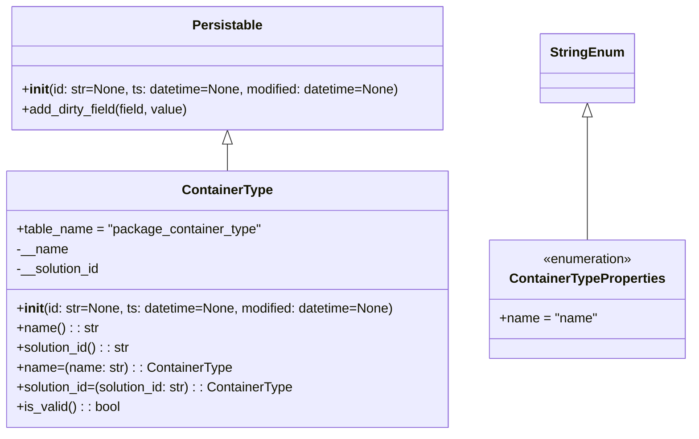

# Diagram: partview_service/partview_service/core/datamodel/ContainerType.py

> Auto-generated by Obscura crawlers

## Mermaid

```mermaid
classDiagram
class Persistable {
  +__init__(id: str=None, ts: datetime=None, modified: datetime=None)
  +add_dirty_field(field, value)
}
class StringEnum
class ContainerTypeProperties <<enumeration>> {
  +name = "name"
}
class ContainerType {
  +table_name = "package_container_type"
  -__name
  -__solution_id
  +__init__(id: str=None, ts: datetime=None, modified: datetime=None)
  +name() : str
  +solution_id() : str
  +name=(name: str) : ContainerType
  +solution_id=(solution_id: str) : ContainerType
  +is_valid() : bool
}
StringEnum <|-- ContainerTypeProperties
Persistable <|-- ContainerType
```

> SVG rendering failed for this diagram.
