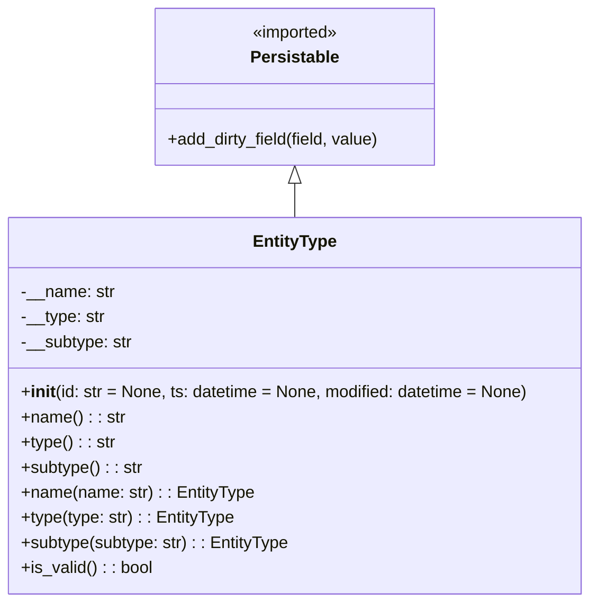

# Diagram: partview_service/partview_service/core/datamodel/EntityType.py

> Auto-generated by Obscura crawlers

## Mermaid

### SVG

<svg id="container" width="567.9140625" xmlns="http://www.w3.org/2000/svg" class="classDiagram" height="576" viewBox="0 0 567.9140625 576" role="graphics-document document" aria-roledescription="class"><g><defs><marker id="container_class-aggregationStart" class="marker aggregation class" refX="18" refY="7" markerWidth="190" markerHeight="240" orient="auto"><path d="M 18,7 L9,13 L1,7 L9,1 Z"></path></marker></defs><defs><marker id="container_class-aggregationEnd" class="marker aggregation class" refX="1" refY="7" markerWidth="20" markerHeight="28" orient="auto"><path d="M 18,7 L9,13 L1,7 L9,1 Z"></path></marker></defs><defs><marker id="container_class-extensionStart" class="marker extension class" refX="18" refY="7" markerWidth="190" markerHeight="240" orient="auto"><path d="M 1,7 L18,13 V 1 Z"></path></marker></defs><defs><marker id="container_class-extensionEnd" class="marker extension class" refX="1" refY="7" markerWidth="20" markerHeight="28" orient="auto"><path d="M 1,1 V 13 L18,7 Z"></path></marker></defs><defs><marker id="container_class-compositionStart" class="marker composition class" refX="18" refY="7" markerWidth="190" markerHeight="240" orient="auto"><path d="M 18,7 L9,13 L1,7 L9,1 Z"></path></marker></defs><defs><marker id="container_class-compositionEnd" class="marker composition class" refX="1" refY="7" markerWidth="20" markerHeight="28" orient="auto"><path d="M 18,7 L9,13 L1,7 L9,1 Z"></path></marker></defs><defs><marker id="container_class-dependencyStart" class="marker dependency class" refX="6" refY="7" markerWidth="190" markerHeight="240" orient="auto"><path d="M 5,7 L9,13 L1,7 L9,1 Z"></path></marker></defs><defs><marker id="container_class-dependencyEnd" class="marker dependency class" refX="13" refY="7" markerWidth="20" markerHeight="28" orient="auto"><path d="M 18,7 L9,13 L14,7 L9,1 Z"></path></marker></defs><defs><marker id="container_class-lollipopStart" class="marker lollipop class" refX="13" refY="7" markerWidth="190" markerHeight="240" orient="auto"><circle stroke="black" fill="transparent" cx="7" cy="7" r="6"></circle></marker></defs><defs><marker id="container_class-lollipopEnd" class="marker lollipop class" refX="1" refY="7" markerWidth="190" markerHeight="240" orient="auto"><circle stroke="black" fill="transparent" cx="7" cy="7" r="6"></circle></marker></defs><g class="root"><g class="clusters"></g><g class="edgePaths"><path d="M283.957,175.25L283.957,176.542C283.957,177.833,283.957,180.417,283.957,185.875C283.957,191.333,283.957,199.667,283.957,203.833L283.957,208" id="id_Persistable_EntityType_1" class="edge-thickness-normal edge-pattern-solid relation" style=";;;" data-edge="true" data-et="edge" data-id="id_Persistable_EntityType_1" data-points="W3sieCI6MjgzLjk1NzAzMTI1LCJ5IjoxNTh9LHsieCI6MjgzLjk1NzAzMTI1LCJ5IjoxODN9LHsieCI6MjgzLjk1NzAzMTI1LCJ5IjoyMDh9XQ==" marker-start="url(#container_class-extensionStart)"></path></g><g class="edgeLabels"><g class="edgeLabel"><g class="label" data-id="id_Persistable_EntityType_1" transform="translate(0, 0)"><foreignObject width="0" height="0">

</foreignObject></g></g></g><g class="nodes"><g class="node default" id="classId-Persistable-0" transform="translate(283.95703125, 83)"><g class="basic label-container"><path d="M-136.5625 -75 L136.5625 -75 L136.5625 75 L-136.5625 75" stroke="none" stroke-width="0" fill="#ECECFF" style=""></path><path d="M-136.5625 -75 C-39.80894917649351 -75, 56.94460164701297 -75, 136.5625 -75 M-136.5625 -75 C-41.93634619514681 -75, 52.68980760970638 -75, 136.5625 -75 M136.5625 -75 C136.5625 -35.23711675858382, 136.5625 4.525766482832367, 136.5625 75 M136.5625 -75 C136.5625 -41.79562192605477, 136.5625 -8.591243852109542, 136.5625 75 M136.5625 75 C29.330796192044517 75, -77.90090761591097 75, -136.5625 75 M136.5625 75 C41.66275844283129 75, -53.23698311433742 75, -136.5625 75 M-136.5625 75 C-136.5625 28.94807128669656, -136.5625 -17.10385742660688, -136.5625 -75 M-136.5625 75 C-136.5625 38.62874689260824, -136.5625 2.2574937852164823, -136.5625 -75" stroke="#9370DB" stroke-width="1.3" fill="none" stroke-dasharray="0 0" style=""></path></g><g class="annotation-group text" transform="translate(-42.671875, -51)"><g class="label" style="" transform="translate(0,-12)"><foreignObject width="85.34375" height="24">

«imported»

</foreignObject></g></g><g class="label-group text" transform="translate(-40.9765625, -27)"><g class="label" style="font-weight: bolder" transform="translate(0,-12)"><foreignObject width="81.953125" height="24">

Persistable

</foreignObject></g></g><g class="members-group text" transform="translate(-124.5625, 21)"></g><g class="methods-group text" transform="translate(-124.5625, 51)"><g class="label" style="" transform="translate(0,-12)"><foreignObject width="206.453125" height="24">

+add_dirty_field(field, value)

</foreignObject></g></g><g class="divider" style=""><path d="M-136.5625 -3 C-75.70661997811126 -3, -14.85073995622254 -3, 136.5625 -3 M-136.5625 -3 C-70.44818272061009 -3, -4.333865441220183 -3, 136.5625 -3" stroke="#9370DB" stroke-width="1.3" fill="none" stroke-dasharray="0 0" style=""></path></g><g class="divider" style=""><path d="M-136.5625 21 C-75.28184317189303 21, -14.001186343786046 21, 136.5625 21 M-136.5625 21 C-41.32515784118709 21, 53.912184317625815 21, 136.5625 21" stroke="#9370DB" stroke-width="1.3" fill="none" stroke-dasharray="0 0" style=""></path></g></g><g class="node default" id="classId-EntityType-1" transform="translate(283.95703125, 388)"><g class="basic label-container"><path d="M-275.95703125 -180 L275.95703125 -180 L275.95703125 180 L-275.95703125 180" stroke="none" stroke-width="0" fill="#ECECFF" style=""></path><path d="M-275.95703125 -180 C-60.75999163847493 -180, 154.43704797305014 -180, 275.95703125 -180 M-275.95703125 -180 C-134.25829721664763 -180, 7.440436816704732 -180, 275.95703125 -180 M275.95703125 -180 C275.95703125 -70.14669644700561, 275.95703125 39.70660710598878, 275.95703125 180 M275.95703125 -180 C275.95703125 -70.54936148168454, 275.95703125 38.901277036630916, 275.95703125 180 M275.95703125 180 C80.8588140650248 180, -114.2394031199504 180, -275.95703125 180 M275.95703125 180 C156.11886836400407 180, 36.280705478008144 180, -275.95703125 180 M-275.95703125 180 C-275.95703125 64.97359287070645, -275.95703125 -50.05281425858709, -275.95703125 -180 M-275.95703125 180 C-275.95703125 53.663461954497535, -275.95703125 -72.67307609100493, -275.95703125 -180" stroke="#9370DB" stroke-width="1.3" fill="none" stroke-dasharray="0 0" style=""></path></g><g class="annotation-group text" transform="translate(0, -156)"></g><g class="label-group text" transform="translate(-38.6171875, -156)"><g class="label" style="font-weight: bolder" transform="translate(0,-12)"><foreignObject width="77.234375" height="24">

EntityType

</foreignObject></g></g><g class="members-group text" transform="translate(-263.95703125, -108)"><g class="label" style="" transform="translate(0,-12)"><foreignObject width="89.671875" height="24">

-__name: str

</foreignObject></g><g class="label" style="" transform="translate(0,12)"><foreignObject width="80.625" height="24">

-__type: str

</foreignObject></g><g class="label" style="" transform="translate(0,36)"><foreignObject width="107.234375" height="24">

-__subtype: str

</foreignObject></g></g><g class="methods-group text" transform="translate(-263.95703125, -12)"><g class="label" style="" transform="translate(0,-12)"><foreignObject width="489.296875" height="24">

+<strong>init</strong>(id: str = None, ts: datetime = None, modified: datetime = None)

</foreignObject></g><g class="label" style="" transform="translate(0,12)"><foreignObject width="98.703125" height="24">

+name() : : str

</foreignObject></g><g class="label" style="" transform="translate(0,36)"><foreignObject width="89.890625" height="24">

+type() : : str

</foreignObject></g><g class="label" style="" transform="translate(0,60)"><foreignObject width="116.265625" height="24">

+subtype() : : str

</foreignObject></g><g class="label" style="" transform="translate(0,84)"><foreignObject width="222.640625" height="24">

+name(name: str) : : EntityType

</foreignObject></g><g class="label" style="" transform="translate(0,108)"><foreignObject width="205.125" height="24">

+type(type: str) : : EntityType

</foreignObject></g><g class="label" style="" transform="translate(0,132)"><foreignObject width="257.78125" height="24">

+subtype(subtype: str) : : EntityType

</foreignObject></g><g class="label" style="" transform="translate(0,156)"><foreignObject width="126.078125" height="24">

+is_valid() : : bool

</foreignObject></g></g><g class="divider" style=""><path d="M-275.95703125 -132 C-153.050723731897 -132, -30.144416213794017 -132, 275.95703125 -132 M-275.95703125 -132 C-55.98792512197673 -132, 163.98118100604654 -132, 275.95703125 -132" stroke="#9370DB" stroke-width="1.3" fill="none" stroke-dasharray="0 0" style=""></path></g><g class="divider" style=""><path d="M-275.95703125 -36 C-113.53641993409875 -36, 48.88419138180251 -36, 275.95703125 -36 M-275.95703125 -36 C-161.56394007235787 -36, -47.17084889471573 -36, 275.95703125 -36" stroke="#9370DB" stroke-width="1.3" fill="none" stroke-dasharray="0 0" style=""></path></g></g></g></g></g></svg>
