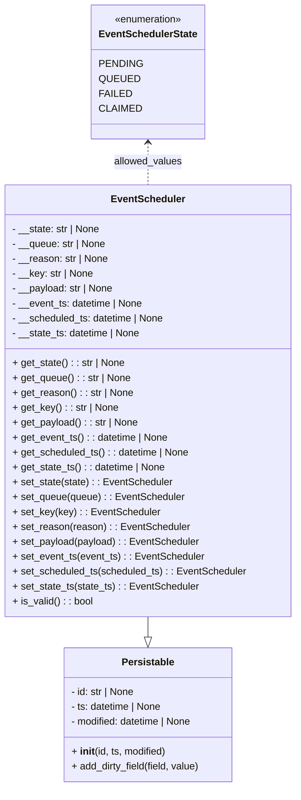
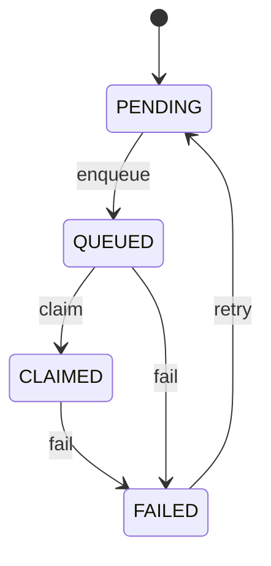

# Diagram: partview_service/partview_service/core/datamodel/EventScheduler.py

> Auto-generated by Obscura crawlers

## Diagram 1

### SVG

<svg id="container" width="475.515625" xmlns="http://www.w3.org/2000/svg" class="classDiagram" height="1268" viewBox="0 0 475.515625 1268" role="graphics-document document" aria-roledescription="class"><g><defs><marker id="container_class-aggregationStart" class="marker aggregation class" refX="18" refY="7" markerWidth="190" markerHeight="240" orient="auto"><path d="M 18,7 L9,13 L1,7 L9,1 Z"></path></marker></defs><defs><marker id="container_class-aggregationEnd" class="marker aggregation class" refX="1" refY="7" markerWidth="20" markerHeight="28" orient="auto"><path d="M 18,7 L9,13 L1,7 L9,1 Z"></path></marker></defs><defs><marker id="container_class-extensionStart" class="marker extension class" refX="18" refY="7" markerWidth="190" markerHeight="240" orient="auto"><path d="M 1,7 L18,13 V 1 Z"></path></marker></defs><defs><marker id="container_class-extensionEnd" class="marker extension class" refX="1" refY="7" markerWidth="20" markerHeight="28" orient="auto"><path d="M 1,1 V 13 L18,7 Z"></path></marker></defs><defs><marker id="container_class-compositionStart" class="marker composition class" refX="18" refY="7" markerWidth="190" markerHeight="240" orient="auto"><path d="M 18,7 L9,13 L1,7 L9,1 Z"></path></marker></defs><defs><marker id="container_class-compositionEnd" class="marker composition class" refX="1" refY="7" markerWidth="20" markerHeight="28" orient="auto"><path d="M 18,7 L9,13 L1,7 L9,1 Z"></path></marker></defs><defs><marker id="container_class-dependencyStart" class="marker dependency class" refX="6" refY="7" markerWidth="190" markerHeight="240" orient="auto"><path d="M 5,7 L9,13 L1,7 L9,1 Z"></path></marker></defs><defs><marker id="container_class-dependencyEnd" class="marker dependency class" refX="13" refY="7" markerWidth="20" markerHeight="28" orient="auto"><path d="M 18,7 L9,13 L14,7 L9,1 Z"></path></marker></defs><defs><marker id="container_class-lollipopStart" class="marker lollipop class" refX="13" refY="7" markerWidth="190" markerHeight="240" orient="auto"><circle stroke="black" fill="transparent" cx="7" cy="7" r="6"></circle></marker></defs><defs><marker id="container_class-lollipopEnd" class="marker lollipop class" refX="1" refY="7" markerWidth="190" markerHeight="240" orient="auto"><circle stroke="black" fill="transparent" cx="7" cy="7" r="6"></circle></marker></defs><g class="root"><g class="clusters"></g><g class="edgePaths"><path d="M237.758,994L237.758,998.167C237.758,1002.333,237.758,1010.667,237.758,1016.125C237.758,1021.583,237.758,1024.167,237.758,1025.458L237.758,1026.75" id="id_EventScheduler_Persistable_1" class="edge-thickness-normal edge-pattern-solid relation" style=";;;" data-edge="true" data-et="edge" data-id="id_EventScheduler_Persistable_1" data-points="W3sieCI6MjM3Ljc1NzgxMjUsInkiOjk5NH0seyJ4IjoyMzcuNzU3ODEyNSwieSI6MTAxOX0seyJ4IjoyMzcuNzU3ODEyNSwieSI6MTA0NH1d" marker-end="url(#container_class-extensionEnd)"></path><path d="M237.758,230L237.758,235.167C237.758,240.333,237.758,250.667,237.758,262C237.758,273.333,237.758,285.667,237.758,291.833L237.758,298" id="id_EventSchedulerState_EventScheduler_2" class="edge-thickness-normal edge-pattern-dashed relation" style=";;;" data-edge="true" data-et="edge" data-id="id_EventSchedulerState_EventScheduler_2" data-points="W3sieCI6MjM3Ljc1NzgxMjUsInkiOjIyNH0seyJ4IjoyMzcuNzU3ODEyNSwieSI6MjYxfSx7IngiOjIzNy43NTc4MTI1LCJ5IjoyOTh9XQ==" marker-start="url(#container_class-dependencyStart)"></path></g><g class="edgeLabels"><g class="edgeLabel"><g class="label" data-id="id_EventScheduler_Persistable_1" transform="translate(0, 0)"><foreignObject width="0" height="0">

</foreignObject></g></g><g class="edgeLabel" transform="translate(237.7578125, 261)"><g class="label" data-id="id_EventSchedulerState_EventScheduler_2" transform="translate(-55.5703125, -12)"><foreignObject width="111.140625" height="24">

allowed_values

</foreignObject></g></g></g><g class="nodes"><g class="node default" id="classId-Persistable-0" transform="translate(237.7578125, 1152)"><g class="basic label-container"><path d="M-137.95703125 -108 L137.95703125 -108 L137.95703125 108 L-137.95703125 108" stroke="none" stroke-width="0" fill="#ECECFF" style=""></path><path d="M-137.95703125 -108 C-45.87649227146383 -108, 46.20404670707234 -108, 137.95703125 -108 M-137.95703125 -108 C-49.89115132472452 -108, 38.174728600550964 -108, 137.95703125 -108 M137.95703125 -108 C137.95703125 -42.40660752362233, 137.95703125 23.186784952755346, 137.95703125 108 M137.95703125 -108 C137.95703125 -40.72959472137384, 137.95703125 26.540810557252314, 137.95703125 108 M137.95703125 108 C73.01833168824395 108, 8.079632126487894 108, -137.95703125 108 M137.95703125 108 C81.03328386245167 108, 24.109536474903337 108, -137.95703125 108 M-137.95703125 108 C-137.95703125 50.59149689108964, -137.95703125 -6.817006217820719, -137.95703125 -108 M-137.95703125 108 C-137.95703125 31.34693027715855, -137.95703125 -45.3061394456829, -137.95703125 -108" stroke="#9370DB" stroke-width="1.3" fill="none" stroke-dasharray="0 0" style=""></path></g><g class="annotation-group text" transform="translate(0, -84)"></g><g class="label-group text" transform="translate(-40.9765625, -84)"><g class="label" style="font-weight: bolder" transform="translate(0,-12)"><foreignObject width="81.953125" height="24">

Persistable

</foreignObject></g></g><g class="members-group text" transform="translate(-125.95703125, -36)"><g class="label" style="" transform="translate(0,-12)"><foreignObject width="105.578125" height="24">

- id: str | None

</foreignObject></g><g class="label" style="" transform="translate(0,12)"><foreignObject width="150.5625" height="24">

- ts: datetime | None

</foreignObject></g><g class="label" style="" transform="translate(0,36)"><foreignObject width="201.9375" height="24">

- modified: datetime | None

</foreignObject></g></g><g class="methods-group text" transform="translate(-125.95703125, 60)"><g class="label" style="" transform="translate(0,-12)"><foreignObject width="155.15625" height="24">

+ <strong>init</strong>(id, ts, modified)

</foreignObject></g><g class="label" style="" transform="translate(0,12)"><foreignObject width="210.9375" height="24">

+ add_dirty_field(field, value)

</foreignObject></g></g><g class="divider" style=""><path d="M-137.95703125 -60 C-81.84069772333967 -60, -25.72436419667936 -60, 137.95703125 -60 M-137.95703125 -60 C-28.232873609781223 -60, 81.49128403043755 -60, 137.95703125 -60" stroke="#9370DB" stroke-width="1.3" fill="none" stroke-dasharray="0 0" style=""></path></g><g class="divider" style=""><path d="M-137.95703125 36 C-54.66240334497941 36, 28.63222456004118 36, 137.95703125 36 M-137.95703125 36 C-41.41627209122123 36, 55.12448706755754 36, 137.95703125 36" stroke="#9370DB" stroke-width="1.3" fill="none" stroke-dasharray="0 0" style=""></path></g></g><g class="node default" id="classId-EventSchedulerState-1" transform="translate(237.7578125, 116)"><g class="basic label-container"><path d="M-88.296875 -108 L88.296875 -108 L88.296875 108 L-88.296875 108" stroke="none" stroke-width="0" fill="#ECECFF" style=""></path><path d="M-88.296875 -108 C-49.99331439223426 -108, -11.689753784468522 -108, 88.296875 -108 M-88.296875 -108 C-25.26214815883582 -108, 37.77257868232836 -108, 88.296875 -108 M88.296875 -108 C88.296875 -46.251185462009424, 88.296875 15.497629075981152, 88.296875 108 M88.296875 -108 C88.296875 -62.76188877065072, 88.296875 -17.523777541301442, 88.296875 108 M88.296875 108 C38.94072619600213 108, -10.415422607995737 108, -88.296875 108 M88.296875 108 C31.686629709232186 108, -24.92361558153563 108, -88.296875 108 M-88.296875 108 C-88.296875 29.894303264363415, -88.296875 -48.21139347127317, -88.296875 -108 M-88.296875 108 C-88.296875 63.55534067516865, -88.296875 19.110681350337302, -88.296875 -108" stroke="#9370DB" stroke-width="1.3" fill="none" stroke-dasharray="0 0" style=""></path></g><g class="annotation-group text" transform="translate(-55.5546875, -84)"><g class="label" style="" transform="translate(0,-12)"><foreignObject width="111.109375" height="24">

«enumeration»

</foreignObject></g></g><g class="label-group text" transform="translate(-76.296875, -60)"><g class="label" style="font-weight: bolder" transform="translate(0,-12)"><foreignObject width="152.59375" height="24">

EventSchedulerState

</foreignObject></g></g><g class="members-group text" transform="translate(-76.296875, -12)"><g class="label" style="" transform="translate(0,-12)"><foreignObject width="64.84375" height="24">

PENDING

</foreignObject></g><g class="label" style="" transform="translate(0,12)"><foreignObject width="59.671875" height="24">

QUEUED

</foreignObject></g><g class="label" style="" transform="translate(0,36)"><foreignObject width="47.78125" height="24">

FAILED

</foreignObject></g><g class="label" style="" transform="translate(0,60)"><foreignObject width="62.140625" height="24">

CLAIMED

</foreignObject></g></g><g class="methods-group text" transform="translate(-76.296875, 108)"></g><g class="divider" style=""><path d="M-88.296875 -36 C-47.23412370819864 -36, -6.171372416397276 -36, 88.296875 -36 M-88.296875 -36 C-45.55028999733076 -36, -2.8037049946615156 -36, 88.296875 -36" stroke="#9370DB" stroke-width="1.3" fill="none" stroke-dasharray="0 0" style=""></path></g><g class="divider" style=""><path d="M-88.296875 84 C-31.47175779897784 84, 25.35335940204432 84, 88.296875 84 M-88.296875 84 C-36.78023557140639 84, 14.736403857187213 84, 88.296875 84" stroke="#9370DB" stroke-width="1.3" fill="none" stroke-dasharray="0 0" style=""></path></g></g><g class="node default" id="classId-EventScheduler-2" transform="translate(237.7578125, 646)"><g class="basic label-container"><path d="M-229.7578125 -348 L229.7578125 -348 L229.7578125 348 L-229.7578125 348" stroke="none" stroke-width="0" fill="#ECECFF" style=""></path><path d="M-229.7578125 -348 C-76.59601176208616 -348, 76.56578897582767 -348, 229.7578125 -348 M-229.7578125 -348 C-95.25066044161224 -348, 39.25649161677552 -348, 229.7578125 -348 M229.7578125 -348 C229.7578125 -153.79537744702498, 229.7578125 40.40924510595005, 229.7578125 348 M229.7578125 -348 C229.7578125 -125.38900419834965, 229.7578125 97.2219916033007, 229.7578125 348 M229.7578125 348 C60.592424032347026 348, -108.57296443530595 348, -229.7578125 348 M229.7578125 348 C133.13708336959832 348, 36.5163542391966 348, -229.7578125 348 M-229.7578125 348 C-229.7578125 181.97495425445712, -229.7578125 15.949908508914234, -229.7578125 -348 M-229.7578125 348 C-229.7578125 114.21694780414862, -229.7578125 -119.56610439170277, -229.7578125 -348" stroke="#9370DB" stroke-width="1.3" fill="none" stroke-dasharray="0 0" style=""></path></g><g class="annotation-group text" transform="translate(0, -324)"></g><g class="label-group text" transform="translate(-56.984375, -324)"><g class="label" style="font-weight: bolder" transform="translate(0,-12)"><foreignObject width="113.96875" height="24">

EventScheduler

</foreignObject></g></g><g class="members-group text" transform="translate(-217.7578125, -276)"><g class="label" style="" transform="translate(0,-12)"><foreignObject width="144.078125" height="24">

- __state: str | None

</foreignObject></g><g class="label" style="" transform="translate(0,12)"><foreignObject width="153.28125" height="24">

- __queue: str | None

</foreignObject></g><g class="label" style="" transform="translate(0,36)"><foreignObject width="156.96875" height="24">

- __reason: str | None

</foreignObject></g><g class="label" style="" transform="translate(0,60)"><foreignObject width="132.609375" height="24">

- __key: str | None

</foreignObject></g><g class="label" style="" transform="translate(0,84)"><foreignObject width="165.71875" height="24">

- __payload: str | None

</foreignObject></g><g class="label" style="" transform="translate(0,108)"><foreignObject width="215.0625" height="24">

- __event_ts: datetime | None

</foreignObject></g><g class="label" style="" transform="translate(0,132)"><foreignObject width="250.046875" height="24">

- __scheduled_ts: datetime | None

</foreignObject></g><g class="label" style="" transform="translate(0,156)"><foreignObject width="210.828125" height="24">

- __state_ts: datetime | None

</foreignObject></g></g><g class="methods-group text" transform="translate(-217.7578125, -60)"><g class="label" style="" transform="translate(0,-12)"><foreignObject width="182.703125" height="24">

+ get_state() : : str | None

</foreignObject></g><g class="label" style="" transform="translate(0,12)"><foreignObject width="191.90625" height="24">

+ get_queue() : : str | None

</foreignObject></g><g class="label" style="" transform="translate(0,36)"><foreignObject width="195.59375" height="24">

+ get_reason() : : str | None

</foreignObject></g><g class="label" style="" transform="translate(0,60)"><foreignObject width="171.171875" height="24">

+ get_key() : : str | None

</foreignObject></g><g class="label" style="" transform="translate(0,84)"><foreignObject width="204.34375" height="24">

+ get_payload() : : str | None

</foreignObject></g><g class="label" style="" transform="translate(0,108)"><foreignObject width="253.6875" height="24">

+ get_event_ts() : : datetime | None

</foreignObject></g><g class="label" style="" transform="translate(0,132)"><foreignObject width="288.671875" height="24">

+ get_scheduled_ts() : : datetime | None

</foreignObject></g><g class="label" style="" transform="translate(0,156)"><foreignObject width="249.453125" height="24">

+ get_state_ts() : : datetime | None

</foreignObject></g><g class="label" style="" transform="translate(0,180)"><foreignObject width="258.25" height="24">

+ set_state(state) : : EventScheduler

</foreignObject></g><g class="label" style="" transform="translate(0,204)"><foreignObject width="277" height="24">

+ set_queue(queue) : : EventScheduler

</foreignObject></g><g class="label" style="" transform="translate(0,228)"><foreignObject width="235.203125" height="24">

+ set_key(key) : : EventScheduler

</foreignObject></g><g class="label" style="" transform="translate(0,252)"><foreignObject width="284.046875" height="24">

+ set_reason(reason) : : EventScheduler

</foreignObject></g><g class="label" style="" transform="translate(0,276)"><foreignObject width="301.546875" height="24">

+ set_payload(payload) : : EventScheduler

</foreignObject></g><g class="label" style="" transform="translate(0,300)"><foreignObject width="308.90625" height="24">

+ set_event_ts(event_ts) : : EventScheduler

</foreignObject></g><g class="label" style="" transform="translate(0,324)"><foreignObject width="378.53125" height="24">

+ set_scheduled_ts(scheduled_ts) : : EventScheduler

</foreignObject></g><g class="label" style="" transform="translate(0,348)"><foreignObject width="300.109375" height="24">

+ set_state_ts(state_ts) : : EventScheduler

</foreignObject></g><g class="label" style="" transform="translate(0,372)"><foreignObject width="130.3125" height="24">

+ is_valid() : : bool

</foreignObject></g></g><g class="divider" style=""><path d="M-229.7578125 -300 C-61.89141843010049 -300, 105.97497563979903 -300, 229.7578125 -300 M-229.7578125 -300 C-86.04055612029111 -300, 57.67670025941777 -300, 229.7578125 -300" stroke="#9370DB" stroke-width="1.3" fill="none" stroke-dasharray="0 0" style=""></path></g><g class="divider" style=""><path d="M-229.7578125 -84 C-130.69821165152237 -84, -31.63861080304474 -84, 229.7578125 -84 M-229.7578125 -84 C-102.87793218865026 -84, 24.001948122699474 -84, 229.7578125 -84" stroke="#9370DB" stroke-width="1.3" fill="none" stroke-dasharray="0 0" style=""></path></g></g></g></g></g></svg>

## Diagram 2

### SVG

<svg id="container" width="212.70703125" xmlns="http://www.w3.org/2000/svg" class="statediagram" height="462" viewBox="0 0 212.70703125 462" role="graphics-document document" aria-roledescription="stateDiagram"><g><defs><marker id="container_stateDiagram-barbEnd" refX="19" refY="7" markerWidth="20" markerHeight="14" markerUnits="userSpaceOnUse" orient="auto"><path d="M 19,7 L9,13 L14,7 L9,1 Z"></path></marker></defs><g class="root"><g class="clusters"></g><g class="edgePaths"><path d="M126.254,22L126.254,26.167C126.254,30.333,126.254,38.667,126.337,47.083C126.421,55.5,126.587,64,126.671,68.25L126.754,72.5" id="edge0" class="edge-thickness-normal edge-pattern-solid transition" style="fill:none;;;fill:none" data-edge="true" data-et="edge" data-id="edge0" data-points="W3sieCI6MTI2LjI1MzkwNjI1LCJ5IjoyMn0seyJ4IjoxMjYuMjUzOTA2MjUsInkiOjQ3fSx7IngiOjEyNi43NTM5MDYyNSwieSI6NzIuNX1d" marker-end="url(#container_stateDiagram-barbEnd)"></path><path d="M113.976,112.5L109.952,118.583C105.929,124.667,97.883,136.833,93.943,149.167C90.003,161.5,90.169,174,90.253,180.25L90.336,186.5" id="edge1" class="edge-thickness-normal edge-pattern-solid transition" style="fill:none;;;fill:none" data-edge="true" data-et="edge" data-id="edge1" data-points="W3sieCI6MTEzLjk3NTY3MTYwMDg3NzE5LCJ5IjoxMTIuNX0seyJ4Ijo4OS44MzU5Mzc1LCJ5IjoxNDl9LHsieCI6OTAuMzM1OTM3NSwieSI6MTg2LjV9XQ==" marker-end="url(#container_stateDiagram-barbEnd)"></path><path d="M75.33,226.5L70.62,232.583C65.91,238.667,56.49,250.833,51.864,263.167C47.237,275.5,47.404,288,47.487,294.25L47.57,300.5" id="edge2" class="edge-thickness-normal edge-pattern-solid transition" style="fill:none;;;fill:none" data-edge="true" data-et="edge" data-id="edge2" data-points="W3sieCI6NzUuMzMwNDU1MDQzODU5NjQsInkiOjIyNi41fSx7IngiOjQ3LjA3MDMxMjUsInkiOjI2M30seyJ4Ijo0Ny41NzAzMTI1LCJ5IjozMDAuNX1d" marker-end="url(#container_stateDiagram-barbEnd)"></path><path d="M47.57,340.5L47.487,346.583C47.404,352.667,47.237,364.833,56.63,377.259C66.022,389.685,84.974,402.371,94.45,408.714L103.926,415.056" id="edge3" class="edge-thickness-normal edge-pattern-solid transition" style="fill:none;;;fill:none" data-edge="true" data-et="edge" data-id="edge3" data-points="W3sieCI6NDcuNTcwMzEyNSwieSI6MzQwLjV9LHsieCI6NDcuMDcwMzEyNSwieSI6Mzc3fSx7IngiOjEwMy45MjU2MTQ5NDc2Njk3OSwieSI6NDE1LjA1NjQ3NDg1MDAzNjR9XQ==" marker-end="url(#container_stateDiagram-barbEnd)"></path><path d="M105.341,226.5L109.885,232.583C114.428,238.667,123.515,250.833,128.058,266.417C132.602,282,132.602,301,132.602,320C132.602,339,132.602,358,132.685,373.75C132.768,389.5,132.935,402,133.018,408.25L133.102,414.5" id="edge4" class="edge-thickness-normal edge-pattern-solid transition" style="fill:none;;;fill:none" data-edge="true" data-et="edge" data-id="edge4" data-points="W3sieCI6MTA1LjM0MTQxOTk1NjE0MDM2LCJ5IjoyMjYuNX0seyJ4IjoxMzIuNjAxNTYyNSwieSI6MjYzfSx7IngiOjEzMi42MDE1NjI1LCJ5IjozMjB9LHsieCI6MTMyLjYwMTU2MjUsInkiOjM3N30seyJ4IjoxMzMuMTAxNTYyNSwieSI6NDE0LjV9XQ==" marker-end="url(#container_stateDiagram-barbEnd)"></path><path d="M152.393,414.5L158.258,408.25C164.123,402,175.852,389.5,181.717,373.75C187.582,358,187.582,339,187.582,320C187.582,301,187.582,282,187.582,263C187.582,244,187.582,225,187.582,206C187.582,187,187.582,168,181.03,152.417C174.479,136.833,161.376,124.667,154.824,118.583L148.273,112.5" id="edge5" class="edge-thickness-normal edge-pattern-solid transition" style="fill:none;;;fill:none" data-edge="true" data-et="edge" data-id="edge5" data-points="W3sieCI6MTUyLjM5Mjk1NTA0Mzg1OTY0LCJ5Ijo0MTQuNX0seyJ4IjoxODcuNTgyMDMxMjUsInkiOjM3N30seyJ4IjoxODcuNTgyMDMxMjUsInkiOjMyMH0seyJ4IjoxODcuNTgyMDMxMjUsInkiOjI2M30seyJ4IjoxODcuNTgyMDMxMjUsInkiOjIwNn0seyJ4IjoxODcuNTgyMDMxMjUsInkiOjE0OX0seyJ4IjoxNDguMjcyNTQ2NjAwODc3MiwieSI6MTEyLjV9XQ==" marker-end="url(#container_stateDiagram-barbEnd)"></path></g><g class="edgeLabels"><g class="edgeLabel"><g class="label" data-id="edge0" transform="translate(0, 0)"><foreignObject width="0" height="0">

</foreignObject></g></g><g class="edgeLabel" transform="translate(89.8359375, 149)"><g class="label" data-id="edge1" transform="translate(-31.8671875, -12)"><foreignObject width="63.734375" height="24">

enqueue

</foreignObject></g></g><g class="edgeLabel" transform="translate(47.0703125, 263)"><g class="label" data-id="edge2" transform="translate(-19.59375, -12)"><foreignObject width="39.1875" height="24">

claim

</foreignObject></g></g><g class="edgeLabel" transform="translate(47.0703125, 377)"><g class="label" data-id="edge3" transform="translate(-11.4609375, -12)"><foreignObject width="22.921875" height="24">

fail

</foreignObject></g></g><g class="edgeLabel" transform="translate(132.6015625, 320)"><g class="label" data-id="edge4" transform="translate(-11.4609375, -12)"><foreignObject width="22.921875" height="24">

fail

</foreignObject></g></g><g class="edgeLabel" transform="translate(187.58203125, 263)"><g class="label" data-id="edge5" transform="translate(-17.125, -12)"><foreignObject width="34.25" height="24">

retry

</foreignObject></g></g></g><g class="nodes"><g class="node default" id="state-root_start-0" transform="translate(126.25390625, 15)"><circle class="state-start" r="7" width="14" height="14"></circle></g><g class="node  statediagram-state" id="state-PENDING-5" transform="translate(126.25390625, 92)"><g class="basic label-container outer-path"><path d="M-35.421875 -20 C-18.54519680670714 -20, -1.6685186134142782 -20, 35.421875 -20 C35.421875 -20, 35.421875 -20, 35.421875 -20 C35.51195479947571 -19.996274271934375, 35.60203459895141 -19.992548543868754, 35.83477172736166 -19.982922465033347 C35.98827251286703 -19.963788612074154, 36.14177329837239 -19.94465475911496, 36.24484795140367 -19.931806517013612 C36.326913755993225 -19.914599127305536, 36.40897956058278 -19.897391737597463, 36.649302435703994 -19.847001329696653 C36.77555773161604 -19.80941349954116, 36.901813027528085 -19.77182566938567, 37.04537234602342 -19.729086208503173 C37.163623011317775 -19.682944655722874, 37.28187367661213 -19.636803102942576, 37.430352123264846 -19.578866633275286 C37.54635572827808 -19.522155926419664, 37.66235933329131 -19.465445219564042, 37.801611965185366 -19.397368756032446 C37.93454074291605 -19.31816039715352, 38.06746952064673 -19.238952038274594, 38.156615790612136 -19.185832391312644 C38.250459173093425 -19.118829504066376, 38.34430255557472 -19.051826616820108, 38.49293856344834 -18.94570254698197 C38.59445023855149 -18.85972654382949, 38.69596191365464 -18.773750540677007, 38.808282858128706 -18.678619553365657 C38.91307741014612 -18.573825001348236, 39.01787196216355 -18.469030449330816, 39.10049455336566 -18.386407858128706 C39.159336777704176 -18.316932975133682, 39.218179002042696 -18.247458092138658, 39.36757754698197 -18.07106356344834 C39.44566433707684 -17.961696209133063, 39.523751127171714 -17.85232885481778, 39.607707391312644 -17.734740790612136 C39.664622789572554 -17.63922442804857, 39.72153818783246 -17.54370806548501, 39.81924375603245 -17.37973696518537 C39.87514830093183 -17.26538239081085, 39.93105284583122 -17.151027816436326, 40.00074163327529 -17.008477123264846 C40.057337792295506 -16.863433598416165, 40.11393395131573 -16.718390073567484, 40.150961208503176 -16.623497346023417 C40.187380389587275 -16.501167473146307, 40.22379957067138 -16.3788376002692, 40.26887632969665 -16.227427435703994 C40.29738560353814 -16.091460474081234, 40.32589487737963 -15.955493512458476, 40.35368151701361 -15.82297295140367 C40.37124192648096 -15.682095071094698, 40.38880233594832 -15.541217190785725, 40.40479746503335 -15.412896727361662 C40.41149361117392 -15.250998840296855, 40.41818975731449 -15.089100953232046, 40.421875 -15 C40.421875 -15, 40.421875 -15, 40.421875 -15 C40.421875 -3.0881427603442475, 40.421875 8.823714479311505, 40.421875 15 C40.421875 15, 40.421875 15, 40.421875 15 C40.41528610948337 15.159304685165319, 40.40869721896673 15.318609370330638, 40.40479746503335 15.412896727361662 C40.38493187733444 15.572267833788137, 40.365066289635536 15.73163894021461, 40.35368151701361 15.822972951403669 C40.32039958360571 15.981701770228156, 40.28711765019781 16.140430589052645, 40.26887632969665 16.227427435703994 C40.22209362665418 16.384567765213824, 40.1753109236117 16.54170809472365, 40.150961208503176 16.623497346023417 C40.1084456721725 16.732455327571778, 40.06593013584183 16.84141330912014, 40.00074163327529 17.008477123264846 C39.9599565023961 17.091904441936208, 39.91917137151692 17.17533176060757, 39.81924375603245 17.379736965185366 C39.76892091611121 17.464189587324544, 39.718598076189984 17.54864220946372, 39.607707391312644 17.734740790612133 C39.52734181202669 17.847299787772098, 39.446976232740745 17.95985878493206, 39.36757754698197 18.07106356344834 C39.27894492423364 18.17571190338119, 39.190312301485314 18.280360243314036, 39.10049455336566 18.386407858128706 C39.03061215585097 18.4562902556434, 38.96072975833627 18.526172653158092, 38.808282858128706 18.678619553365657 C38.68607752727769 18.782122188898175, 38.56387219642668 18.885624824430693, 38.49293856344834 18.94570254698197 C38.3708671759 19.032859842463377, 38.24879578835167 19.120017137944785, 38.156615790612136 19.185832391312644 C38.02001236337533 19.26723036602799, 37.88340893613852 19.348628340743343, 37.801611965185366 19.397368756032446 C37.69981423137043 19.4471346356384, 37.598016497555506 19.496900515244352, 37.430352123264846 19.578866633275286 C37.28727641013338 19.634694949780748, 37.14420069700191 19.69052326628621, 37.04537234602342 19.729086208503173 C36.91502602941124 19.767891988291023, 36.784679712799054 19.806697768078873, 36.649302435703994 19.847001329696653 C36.52835745384061 19.872360825610546, 36.40741247197724 19.897720321524442, 36.24484795140367 19.931806517013612 C36.129627773939085 19.94616869715674, 36.0144075964745 19.960530877299867, 35.83477172736166 19.982922465033347 C35.73425464651821 19.987079882249557, 35.63373756567475 19.991237299465766, 35.421875 20 C35.421875 20, 35.421875 20, 35.421875 20 C19.83518703402857 20, 4.248499068057146 20, -35.421875 20 C-35.421875 20, -35.421875 20, -35.421875 20 C-35.56870571276294 19.993927036798258, -35.71553642552588 19.987854073596512, -35.83477172736166 19.982922465033347 C-35.99111455478864 19.96343435191807, -36.14745738221562 19.943946238802795, -36.24484795140367 19.931806517013612 C-36.39450323363549 19.90042710416176, -36.544158515867316 19.869047691309913, -36.649302435703994 19.847001329696653 C-36.76090696882843 19.81377522060269, -36.872511501952864 19.780549111508726, -37.04537234602342 19.729086208503173 C-37.19150121014048 19.672066548786262, -37.33763007425754 19.61504688906935, -37.430352123264846 19.578866633275286 C-37.538106367852265 19.526188792991366, -37.64586061243968 19.47351095270745, -37.801611965185366 19.397368756032446 C-37.89742119862105 19.34027884461188, -37.99323043205675 19.28318893319131, -38.156615790612136 19.185832391312644 C-38.23040214201073 19.133149949009805, -38.304188493409335 19.08046750670697, -38.49293856344834 18.94570254698197 C-38.58330112803725 18.869169358754434, -38.67366369262615 18.792636170526897, -38.808282858128706 18.67861955336566 C-38.905397376984894 18.58150503450947, -39.00251189584109 18.484390515653278, -39.10049455336566 18.386407858128706 C-39.195604938410845 18.274111238704332, -39.29071532345604 18.161814619279955, -39.36757754698197 18.07106356344834 C-39.455297595212066 17.948203991635, -39.543017643442155 17.82534441982166, -39.607707391312644 17.734740790612133 C-39.665540442083525 17.637684408429536, -39.7233734928544 17.540628026246935, -39.81924375603244 17.37973696518537 C-39.85716087291852 17.302176262905792, -39.8950779898046 17.224615560626212, -40.00074163327528 17.00847712326485 C-40.049727630858676 16.882936770691003, -40.09871362844206 16.757396418117157, -40.150961208503176 16.623497346023417 C-40.19477954911896 16.47631413438456, -40.238597889734756 16.3291309227457, -40.26887632969665 16.227427435703994 C-40.29153169381977 16.119379049715473, -40.31418705794289 16.01133066372695, -40.35368151701361 15.82297295140367 C-40.36774305344591 15.710164679469429, -40.381804589878215 15.597356407535187, -40.40479746503335 15.412896727361664 C-40.410028475812425 15.286422547353041, -40.41525948659151 15.159948367344416, -40.421875 15 C-40.421875 15, -40.421875 15, -40.421875 15 C-40.421875 7.865166089492846, -40.421875 0.7303321789856927, -40.421875 -15 C-40.421875 -15, -40.421875 -15, -40.421875 -15 C-40.41719481476394 -15.113156446243002, -40.41251462952787 -15.226312892486003, -40.40479746503335 -15.41289672736166 C-40.385433268545974 -15.568245437202364, -40.3660690720586 -15.72359414704307, -40.35368151701361 -15.822972951403669 C-40.33037022750051 -15.934149589020867, -40.307058937987414 -16.045326226638064, -40.26887632969665 -16.227427435703994 C-40.22806981766042 -16.364494093474896, -40.18726330562418 -16.501560751245794, -40.150961208503176 -16.623497346023417 C-40.10822973301967 -16.73300873219184, -40.06549825753616 -16.842520118360262, -40.00074163327529 -17.008477123264846 C-39.95532871247017 -17.101370737533948, -39.90991579166506 -17.194264351803046, -39.81924375603245 -17.379736965185366 C-39.7357240468325 -17.519901122321116, -39.65220433763256 -17.660065279456862, -39.607707391312644 -17.734740790612133 C-39.53773439876841 -17.832744064389793, -39.46776140622416 -17.93074733816745, -39.36757754698197 -18.07106356344834 C-39.30784701072471 -18.14158727434393, -39.24811647446745 -18.212110985239523, -39.10049455336566 -18.386407858128706 C-39.024837960698115 -18.462064450796248, -38.94918136803057 -18.53772104346379, -38.808282858128706 -18.678619553365657 C-38.74287388421738 -18.734018128371794, -38.67746491030606 -18.78941670337793, -38.49293856344834 -18.945702546981966 C-38.36089092265431 -19.03998275037321, -38.22884328186028 -19.13426295376445, -38.156615790612136 -19.185832391312644 C-38.033434246532934 -19.25923265961612, -37.91025270245374 -19.3326329279196, -37.801611965185366 -19.397368756032446 C-37.68788867922101 -19.452964682833574, -37.57416539325665 -19.5085606096347, -37.430352123264846 -19.578866633275286 C-37.33774350634725 -19.615002627730597, -37.24513488942966 -19.651138622185908, -37.04537234602342 -19.729086208503173 C-36.961756140529744 -19.753979831441036, -36.87813993503607 -19.778873454378903, -36.649302435703994 -19.847001329696653 C-36.5586671400671 -19.8660055527239, -36.46803184443021 -19.885009775751154, -36.24484795140367 -19.931806517013612 C-36.156365980466965 -19.942835783188823, -36.06788400953026 -19.953865049364033, -35.83477172736166 -19.982922465033347 C-35.68266694767837 -19.98921356525648, -35.53056216799508 -19.995504665479615, -35.421875 -20 C-35.421875 -20, -35.421875 -20, -35.421875 -20" stroke="none" stroke-width="0" fill="#ECECFF" style=""></path><path d="M-35.421875 -20 C-7.610788085136054 -20, 20.200298829727892 -20, 35.421875 -20 M-35.421875 -20 C-11.891635372712795 -20, 11.63860425457441 -20, 35.421875 -20 M35.421875 -20 C35.421875 -20, 35.421875 -20, 35.421875 -20 M35.421875 -20 C35.421875 -20, 35.421875 -20, 35.421875 -20 M35.421875 -20 C35.560026925599395 -19.994285994090557, 35.69817885119879 -19.988571988181114, 35.83477172736166 -19.982922465033347 M35.421875 -20 C35.52167250324664 -19.995872344733346, 35.621470006493276 -19.99174468946669, 35.83477172736166 -19.982922465033347 M35.83477172736166 -19.982922465033347 C35.93329039131791 -19.970642126377953, 36.03180905527417 -19.958361787722556, 36.24484795140367 -19.931806517013612 M35.83477172736166 -19.982922465033347 C35.97927748552459 -19.964909841063097, 36.12378324368751 -19.946897217092847, 36.24484795140367 -19.931806517013612 M36.24484795140367 -19.931806517013612 C36.344427132566295 -19.9109269584003, 36.44400631372892 -19.890047399786987, 36.649302435703994 -19.847001329696653 M36.24484795140367 -19.931806517013612 C36.38218427057298 -19.903010119088336, 36.519520589742285 -19.87421372116306, 36.649302435703994 -19.847001329696653 M36.649302435703994 -19.847001329696653 C36.80302334114452 -19.801236633306633, 36.95674424658504 -19.755471936916614, 37.04537234602342 -19.729086208503173 M36.649302435703994 -19.847001329696653 C36.77347548361009 -19.810033411631373, 36.89764853151619 -19.773065493566094, 37.04537234602342 -19.729086208503173 M37.04537234602342 -19.729086208503173 C37.18089496717885 -19.676205117632335, 37.316417588334275 -19.623324026761498, 37.430352123264846 -19.578866633275286 M37.04537234602342 -19.729086208503173 C37.1308973850053 -19.695714234735444, 37.21642242398718 -19.662342260967716, 37.430352123264846 -19.578866633275286 M37.430352123264846 -19.578866633275286 C37.56269879176296 -19.51416628952598, 37.69504546026108 -19.449465945776677, 37.801611965185366 -19.397368756032446 M37.430352123264846 -19.578866633275286 C37.56564178498359 -19.51272754780934, 37.700931446702334 -19.4465884623434, 37.801611965185366 -19.397368756032446 M37.801611965185366 -19.397368756032446 C37.88680610099254 -19.34660406987046, 37.97200023679971 -19.295839383708476, 38.156615790612136 -19.185832391312644 M37.801611965185366 -19.397368756032446 C37.93064822585598 -19.32047983387369, 38.059684486526606 -19.243590911714932, 38.156615790612136 -19.185832391312644 M38.156615790612136 -19.185832391312644 C38.27295691985358 -19.102766421624032, 38.38929804909502 -19.01970045193542, 38.49293856344834 -18.94570254698197 M38.156615790612136 -19.185832391312644 C38.249663879026635 -19.11939733311597, 38.34271196744113 -19.052962274919295, 38.49293856344834 -18.94570254698197 M38.49293856344834 -18.94570254698197 C38.603851248321284 -18.85176429471102, 38.71476393319423 -18.757826042440072, 38.808282858128706 -18.678619553365657 M38.49293856344834 -18.94570254698197 C38.592647346757595 -18.861253515287682, 38.69235613006685 -18.77680448359339, 38.808282858128706 -18.678619553365657 M38.808282858128706 -18.678619553365657 C38.87947443374734 -18.607427977747022, 38.950666009365975 -18.53623640212839, 39.10049455336566 -18.386407858128706 M38.808282858128706 -18.678619553365657 C38.869013634198396 -18.617888777295963, 38.92974441026809 -18.557158001226274, 39.10049455336566 -18.386407858128706 M39.10049455336566 -18.386407858128706 C39.18049546620372 -18.29195095882891, 39.26049637904178 -18.197494059529113, 39.36757754698197 -18.07106356344834 M39.10049455336566 -18.386407858128706 C39.17561855945325 -18.297709111748443, 39.25074256554084 -18.20901036536818, 39.36757754698197 -18.07106356344834 M39.36757754698197 -18.07106356344834 C39.42946928595493 -17.984378789529213, 39.49136102492788 -17.89769401561009, 39.607707391312644 -17.734740790612136 M39.36757754698197 -18.07106356344834 C39.42915843592922 -17.9848141620789, 39.49073932487647 -17.89856476070946, 39.607707391312644 -17.734740790612136 M39.607707391312644 -17.734740790612136 C39.687614840038336 -17.600638788739847, 39.76752228876402 -17.466536786867557, 39.81924375603245 -17.37973696518537 M39.607707391312644 -17.734740790612136 C39.65123553210597 -17.661691144912613, 39.694763672899306 -17.58864149921309, 39.81924375603245 -17.37973696518537 M39.81924375603245 -17.37973696518537 C39.87542551226492 -17.26481534596568, 39.93160726849739 -17.149893726745987, 40.00074163327529 -17.008477123264846 M39.81924375603245 -17.37973696518537 C39.88770528689317 -17.23969666547993, 39.95616681775389 -17.09965636577449, 40.00074163327529 -17.008477123264846 M40.00074163327529 -17.008477123264846 C40.04928108663987 -16.88408116544531, 40.09782054000445 -16.75968520762577, 40.150961208503176 -16.623497346023417 M40.00074163327529 -17.008477123264846 C40.05290951354686 -16.87478230422652, 40.105077393818426 -16.741087485188196, 40.150961208503176 -16.623497346023417 M40.150961208503176 -16.623497346023417 C40.176056072027336 -16.53920518531585, 40.201150935551496 -16.45491302460828, 40.26887632969665 -16.227427435703994 M40.150961208503176 -16.623497346023417 C40.18087825717638 -16.523007750922403, 40.210795305849594 -16.42251815582139, 40.26887632969665 -16.227427435703994 M40.26887632969665 -16.227427435703994 C40.29106568726791 -16.121601536871943, 40.31325504483917 -16.015775638039887, 40.35368151701361 -15.82297295140367 M40.26887632969665 -16.227427435703994 C40.29700731310965 -16.09326462386276, 40.32513829652265 -15.959101812021522, 40.35368151701361 -15.82297295140367 M40.35368151701361 -15.82297295140367 C40.36411155821487 -15.739298245600235, 40.37454159941613 -15.655623539796798, 40.40479746503335 -15.412896727361662 M40.35368151701361 -15.82297295140367 C40.371679063377684 -15.678588152902991, 40.38967660974176 -15.53420335440231, 40.40479746503335 -15.412896727361662 M40.40479746503335 -15.412896727361662 C40.40905799380161 -15.309886639039172, 40.41331852256987 -15.206876550716682, 40.421875 -15 M40.40479746503335 -15.412896727361662 C40.40965530245789 -15.295445047211956, 40.41451313988243 -15.177993367062248, 40.421875 -15 M40.421875 -15 C40.421875 -15, 40.421875 -15, 40.421875 -15 M40.421875 -15 C40.421875 -15, 40.421875 -15, 40.421875 -15 M40.421875 -15 C40.421875 -7.612156107027609, 40.421875 -0.2243122140552174, 40.421875 15 M40.421875 -15 C40.421875 -7.216712469776038, 40.421875 0.5665750604479243, 40.421875 15 M40.421875 15 C40.421875 15, 40.421875 15, 40.421875 15 M40.421875 15 C40.421875 15, 40.421875 15, 40.421875 15 M40.421875 15 C40.417155927124874 15.114096662669722, 40.41243685424975 15.228193325339443, 40.40479746503335 15.412896727361662 M40.421875 15 C40.41576015836741 15.147843239868092, 40.409645316734824 15.295686479736183, 40.40479746503335 15.412896727361662 M40.40479746503335 15.412896727361662 C40.391209659246414 15.521904508807289, 40.37762185345948 15.630912290252914, 40.35368151701361 15.822972951403669 M40.40479746503335 15.412896727361662 C40.384567927360955 15.575187611991423, 40.364338389688555 15.737478496621184, 40.35368151701361 15.822972951403669 M40.35368151701361 15.822972951403669 C40.329404535931154 15.938755183301542, 40.305127554848696 16.054537415199412, 40.26887632969665 16.227427435703994 M40.35368151701361 15.822972951403669 C40.33223347431783 15.925263357476954, 40.31078543162205 16.02755376355024, 40.26887632969665 16.227427435703994 M40.26887632969665 16.227427435703994 C40.243713858966565 16.31194668501324, 40.21855138823648 16.39646593432248, 40.150961208503176 16.623497346023417 M40.26887632969665 16.227427435703994 C40.23540377243323 16.339859773637425, 40.2019312151698 16.452292111570856, 40.150961208503176 16.623497346023417 M40.150961208503176 16.623497346023417 C40.09921489329521 16.75611178639583, 40.04746857808724 16.88872622676825, 40.00074163327529 17.008477123264846 M40.150961208503176 16.623497346023417 C40.09724452616842 16.761161404572466, 40.04352784383365 16.89882546312152, 40.00074163327529 17.008477123264846 M40.00074163327529 17.008477123264846 C39.950094293955566 17.112077911743363, 39.89944695463584 17.21567870022188, 39.81924375603245 17.379736965185366 M40.00074163327529 17.008477123264846 C39.935235906851695 17.142471228354978, 39.8697301804281 17.276465333445113, 39.81924375603245 17.379736965185366 M39.81924375603245 17.379736965185366 C39.76392322274242 17.472576798982374, 39.708602689452384 17.56541663277938, 39.607707391312644 17.734740790612133 M39.81924375603245 17.379736965185366 C39.76058921600722 17.478171984219493, 39.70193467598199 17.576607003253624, 39.607707391312644 17.734740790612133 M39.607707391312644 17.734740790612133 C39.53039868958879 17.843018364358148, 39.45308998786494 17.95129593810416, 39.36757754698197 18.07106356344834 M39.607707391312644 17.734740790612133 C39.517032790522826 17.8617384707566, 39.426358189733016 17.98873615090106, 39.36757754698197 18.07106356344834 M39.36757754698197 18.07106356344834 C39.30026728689209 18.150536637362173, 39.2329570268022 18.230009711276004, 39.10049455336566 18.386407858128706 M39.36757754698197 18.07106356344834 C39.27589347458349 18.17931474317511, 39.184209402185004 18.287565922901877, 39.10049455336566 18.386407858128706 M39.10049455336566 18.386407858128706 C39.02423356316974 18.462668848324626, 38.94797257297382 18.538929838520545, 38.808282858128706 18.678619553365657 M39.10049455336566 18.386407858128706 C39.02651901720109 18.460383394293274, 38.95254348103652 18.534358930457838, 38.808282858128706 18.678619553365657 M38.808282858128706 18.678619553365657 C38.68222924162211 18.785381520589038, 38.55617562511551 18.89214348781242, 38.49293856344834 18.94570254698197 M38.808282858128706 18.678619553365657 C38.69583547180103 18.773857631464285, 38.58338808547336 18.869095709562913, 38.49293856344834 18.94570254698197 M38.49293856344834 18.94570254698197 C38.41621906858017 19.000479213469536, 38.339499573712 19.0552558799571, 38.156615790612136 19.185832391312644 M38.49293856344834 18.94570254698197 C38.36967506759163 19.03371099143584, 38.246411571734924 19.12171943588971, 38.156615790612136 19.185832391312644 M38.156615790612136 19.185832391312644 C38.03147548591778 19.260399827601958, 37.90633518122342 19.33496726389127, 37.801611965185366 19.397368756032446 M38.156615790612136 19.185832391312644 C38.06990955318241 19.237498094470535, 37.98320331575269 19.28916379762843, 37.801611965185366 19.397368756032446 M37.801611965185366 19.397368756032446 C37.69059320295497 19.45164252174519, 37.57957444072458 19.505916287457932, 37.430352123264846 19.578866633275286 M37.801611965185366 19.397368756032446 C37.7140457382088 19.44017727588796, 37.62647951123224 19.48298579574348, 37.430352123264846 19.578866633275286 M37.430352123264846 19.578866633275286 C37.34700155171027 19.61139012721995, 37.2636509801557 19.643913621164614, 37.04537234602342 19.729086208503173 M37.430352123264846 19.578866633275286 C37.32136581641954 19.62139322217113, 37.21237950957423 19.663919811066968, 37.04537234602342 19.729086208503173 M37.04537234602342 19.729086208503173 C36.94238170583095 19.759747850561, 36.83939106563847 19.790409492618824, 36.649302435703994 19.847001329696653 M37.04537234602342 19.729086208503173 C36.945631140340595 19.75878045199314, 36.84588993465778 19.788474695483103, 36.649302435703994 19.847001329696653 M36.649302435703994 19.847001329696653 C36.51410933048875 19.875348342912673, 36.37891622527351 19.903695356128694, 36.24484795140367 19.931806517013612 M36.649302435703994 19.847001329696653 C36.488654523009146 19.880685654774005, 36.3280066103143 19.914369979851358, 36.24484795140367 19.931806517013612 M36.24484795140367 19.931806517013612 C36.15175830985167 19.943410128732054, 36.058668668299674 19.955013740450493, 35.83477172736166 19.982922465033347 M36.24484795140367 19.931806517013612 C36.14205539508595 19.94461959579629, 36.03926283876822 19.957432674578964, 35.83477172736166 19.982922465033347 M35.83477172736166 19.982922465033347 C35.70152019791982 19.98843378905847, 35.56826866847798 19.993945113083594, 35.421875 20 M35.83477172736166 19.982922465033347 C35.69802738325068 19.98857825294179, 35.561283039139695 19.99423404085023, 35.421875 20 M35.421875 20 C35.421875 20, 35.421875 20, 35.421875 20 M35.421875 20 C35.421875 20, 35.421875 20, 35.421875 20 M35.421875 20 C12.695549873910377 20, -10.030775252179247 20, -35.421875 20 M35.421875 20 C11.844369397143279 20, -11.733136205713443 20, -35.421875 20 M-35.421875 20 C-35.421875 20, -35.421875 20, -35.421875 20 M-35.421875 20 C-35.421875 20, -35.421875 20, -35.421875 20 M-35.421875 20 C-35.569803965336035 19.99388161273583, -35.71773293067207 19.98776322547166, -35.83477172736166 19.982922465033347 M-35.421875 20 C-35.56922905710024 19.993905391116353, -35.716583114200475 19.987810782232703, -35.83477172736166 19.982922465033347 M-35.83477172736166 19.982922465033347 C-35.978548865234835 19.9650006634875, -36.12232600310801 19.94707886194165, -36.24484795140367 19.931806517013612 M-35.83477172736166 19.982922465033347 C-35.968214116036904 19.966288888631574, -36.101656504712146 19.949655312229805, -36.24484795140367 19.931806517013612 M-36.24484795140367 19.931806517013612 C-36.34042717119994 19.911765662101462, -36.436006390996205 19.891724807189313, -36.649302435703994 19.847001329696653 M-36.24484795140367 19.931806517013612 C-36.37549519847382 19.904412670016473, -36.50614244554398 19.877018823019338, -36.649302435703994 19.847001329696653 M-36.649302435703994 19.847001329696653 C-36.739659854010455 19.820100760749764, -36.830017272316915 19.79320019180287, -37.04537234602342 19.729086208503173 M-36.649302435703994 19.847001329696653 C-36.7335341778437 19.82192445355948, -36.81776591998341 19.79684757742231, -37.04537234602342 19.729086208503173 M-37.04537234602342 19.729086208503173 C-37.15344073258102 19.686917793215052, -37.26150911913861 19.64474937792693, -37.430352123264846 19.578866633275286 M-37.04537234602342 19.729086208503173 C-37.13572639578699 19.69382994888128, -37.22608044555056 19.658573689259384, -37.430352123264846 19.578866633275286 M-37.430352123264846 19.578866633275286 C-37.557135541078665 19.51688599706167, -37.68391895889249 19.454905360848052, -37.801611965185366 19.397368756032446 M-37.430352123264846 19.578866633275286 C-37.526102276635385 19.53205723559702, -37.621852430005916 19.48524783791875, -37.801611965185366 19.397368756032446 M-37.801611965185366 19.397368756032446 C-37.91070301727594 19.332364598528066, -38.01979406936652 19.267360441023683, -38.156615790612136 19.185832391312644 M-37.801611965185366 19.397368756032446 C-37.90896366946888 19.333401024858535, -38.01631537375239 19.269433293684624, -38.156615790612136 19.185832391312644 M-38.156615790612136 19.185832391312644 C-38.26700988941468 19.107012519744238, -38.377403988217225 19.028192648175832, -38.49293856344834 18.94570254698197 M-38.156615790612136 19.185832391312644 C-38.24456532432228 19.123037631205637, -38.33251485803243 19.060242871098627, -38.49293856344834 18.94570254698197 M-38.49293856344834 18.94570254698197 C-38.589966000063065 18.86352450009438, -38.686993436677795 18.781346453206783, -38.808282858128706 18.67861955336566 M-38.49293856344834 18.94570254698197 C-38.593940735904674 18.86015807055905, -38.694942908361 18.774613594136127, -38.808282858128706 18.67861955336566 M-38.808282858128706 18.67861955336566 C-38.911265221128815 18.575637190365548, -39.01424758412893 18.47265482736543, -39.10049455336566 18.386407858128706 M-38.808282858128706 18.67861955336566 C-38.89820888617202 18.588693525322345, -38.98813491421534 18.49876749727903, -39.10049455336566 18.386407858128706 M-39.10049455336566 18.386407858128706 C-39.18959186320825 18.281210863180412, -39.27868917305084 18.17601386823212, -39.36757754698197 18.07106356344834 M-39.10049455336566 18.386407858128706 C-39.18739511506737 18.283804558809237, -39.27429567676908 18.18120125948977, -39.36757754698197 18.07106356344834 M-39.36757754698197 18.07106356344834 C-39.452105476520316 17.952674832036465, -39.53663340605866 17.834286100624585, -39.607707391312644 17.734740790612133 M-39.36757754698197 18.07106356344834 C-39.447472146153636 17.95916421498148, -39.527366745325295 17.847264866514617, -39.607707391312644 17.734740790612133 M-39.607707391312644 17.734740790612133 C-39.673663667038724 17.624051877976818, -39.73961994276481 17.513362965341503, -39.81924375603244 17.37973696518537 M-39.607707391312644 17.734740790612133 C-39.677212563746274 17.618096060834493, -39.7467177361799 17.501451331056856, -39.81924375603244 17.37973696518537 M-39.81924375603244 17.37973696518537 C-39.88577299382535 17.243649234125904, -39.952302231618255 17.107561503066442, -40.00074163327528 17.00847712326485 M-39.81924375603244 17.37973696518537 C-39.88830960546114 17.238460512091123, -39.95737545488983 17.097184058996874, -40.00074163327528 17.00847712326485 M-40.00074163327528 17.00847712326485 C-40.036585488965976 16.916617193835926, -40.07242934465667 16.824757264407, -40.150961208503176 16.623497346023417 M-40.00074163327528 17.00847712326485 C-40.05670873211715 16.86504574148718, -40.11267583095902 16.72161435970951, -40.150961208503176 16.623497346023417 M-40.150961208503176 16.623497346023417 C-40.180314220880106 16.524902315444944, -40.209667233257036 16.42630728486647, -40.26887632969665 16.227427435703994 M-40.150961208503176 16.623497346023417 C-40.180723193477064 16.52352860070709, -40.210485178450945 16.42355985539076, -40.26887632969665 16.227427435703994 M-40.26887632969665 16.227427435703994 C-40.288285299960506 16.134861811981864, -40.30769427022435 16.042296188259733, -40.35368151701361 15.82297295140367 M-40.26887632969665 16.227427435703994 C-40.288887881259036 16.131987969991098, -40.30889943282142 16.0365485042782, -40.35368151701361 15.82297295140367 M-40.35368151701361 15.82297295140367 C-40.36832299093159 15.705512147656593, -40.38296446484956 15.588051343909516, -40.40479746503335 15.412896727361664 M-40.35368151701361 15.82297295140367 C-40.368984838028915 15.700202498338133, -40.38428815904422 15.577432045272593, -40.40479746503335 15.412896727361664 M-40.40479746503335 15.412896727361664 C-40.41008467490521 15.2850637785651, -40.41537188477706 15.157230829768535, -40.421875 15 M-40.40479746503335 15.412896727361664 C-40.40935981658958 15.302589236829753, -40.41392216814582 15.192281746297843, -40.421875 15 M-40.421875 15 C-40.421875 15, -40.421875 15, -40.421875 15 M-40.421875 15 C-40.421875 15, -40.421875 15, -40.421875 15 M-40.421875 15 C-40.421875 3.807978216596643, -40.421875 -7.384043566806714, -40.421875 -15 M-40.421875 15 C-40.421875 6.866497676388448, -40.421875 -1.2670046472231036, -40.421875 -15 M-40.421875 -15 C-40.421875 -15, -40.421875 -15, -40.421875 -15 M-40.421875 -15 C-40.421875 -15, -40.421875 -15, -40.421875 -15 M-40.421875 -15 C-40.4180998301648 -15.091275191251631, -40.414324660329605 -15.182550382503264, -40.40479746503335 -15.41289672736166 M-40.421875 -15 C-40.416979611763686 -15.118359575072468, -40.41208422352737 -15.236719150144935, -40.40479746503335 -15.41289672736166 M-40.40479746503335 -15.41289672736166 C-40.38816494413921 -15.546330648257234, -40.37153242324507 -15.679764569152809, -40.35368151701361 -15.822972951403669 M-40.40479746503335 -15.41289672736166 C-40.39203022961404 -15.515321506614153, -40.37926299419474 -15.617746285866648, -40.35368151701361 -15.822972951403669 M-40.35368151701361 -15.822972951403669 C-40.33111096861368 -15.93061683266002, -40.30854042021375 -16.03826071391637, -40.26887632969665 -16.227427435703994 M-40.35368151701361 -15.822972951403669 C-40.32583502824641 -15.955778946063182, -40.2979885394792 -16.088584940722697, -40.26887632969665 -16.227427435703994 M-40.26887632969665 -16.227427435703994 C-40.22573634694069 -16.37233208345735, -40.18259636418473 -16.51723673121071, -40.150961208503176 -16.623497346023417 M-40.26887632969665 -16.227427435703994 C-40.23733270944568 -16.33338058842521, -40.2057890891947 -16.43933374114643, -40.150961208503176 -16.623497346023417 M-40.150961208503176 -16.623497346023417 C-40.099258277703775 -16.75600060168559, -40.04755534690437 -16.88850385734776, -40.00074163327529 -17.008477123264846 M-40.150961208503176 -16.623497346023417 C-40.11711861768986 -16.71022847312731, -40.08327602687655 -16.796959600231204, -40.00074163327529 -17.008477123264846 M-40.00074163327529 -17.008477123264846 C-39.936835148713 -17.139199926840927, -39.87292866415071 -17.269922730417008, -39.81924375603245 -17.379736965185366 M-40.00074163327529 -17.008477123264846 C-39.954686284161134 -17.102684845644088, -39.908630935046986 -17.196892568023326, -39.81924375603245 -17.379736965185366 M-39.81924375603245 -17.379736965185366 C-39.77613998269484 -17.452074430402977, -39.73303620935724 -17.524411895620585, -39.607707391312644 -17.734740790612133 M-39.81924375603245 -17.379736965185366 C-39.766701690314314 -17.467913928756005, -39.71415962459617 -17.556090892326647, -39.607707391312644 -17.734740790612133 M-39.607707391312644 -17.734740790612133 C-39.518359332626474 -17.859880532940387, -39.429011273940304 -17.985020275268642, -39.36757754698197 -18.07106356344834 M-39.607707391312644 -17.734740790612133 C-39.532258174493116 -17.840413993706875, -39.45680895767359 -17.946087196801617, -39.36757754698197 -18.07106356344834 M-39.36757754698197 -18.07106356344834 C-39.30912247198009 -18.14008134008536, -39.2506673969782 -18.209099116722378, -39.10049455336566 -18.386407858128706 M-39.36757754698197 -18.07106356344834 C-39.296814504428625 -18.154613329913357, -39.22605146187529 -18.238163096378372, -39.10049455336566 -18.386407858128706 M-39.10049455336566 -18.386407858128706 C-39.022963783758904 -18.46393862773546, -38.94543301415215 -18.541469397342215, -38.808282858128706 -18.678619553365657 M-39.10049455336566 -18.386407858128706 C-39.01513676739064 -18.47176564410372, -38.92977898141563 -18.557123430078736, -38.808282858128706 -18.678619553365657 M-38.808282858128706 -18.678619553365657 C-38.69149837991605 -18.777530960913303, -38.57471390170339 -18.87644236846095, -38.49293856344834 -18.945702546981966 M-38.808282858128706 -18.678619553365657 C-38.70481095074565 -18.766255788570312, -38.6013390433626 -18.85389202377497, -38.49293856344834 -18.945702546981966 M-38.49293856344834 -18.945702546981966 C-38.38445179323395 -19.02316061211337, -38.27596502301955 -19.100618677244768, -38.156615790612136 -19.185832391312644 M-38.49293856344834 -18.945702546981966 C-38.381886882534914 -19.024991923153316, -38.27083520162149 -19.10428129932467, -38.156615790612136 -19.185832391312644 M-38.156615790612136 -19.185832391312644 C-38.05518003622785 -19.24627498149957, -37.95374428184357 -19.3067175716865, -37.801611965185366 -19.397368756032446 M-38.156615790612136 -19.185832391312644 C-38.0389607356741 -19.255939586869147, -37.92130568073607 -19.326046782425646, -37.801611965185366 -19.397368756032446 M-37.801611965185366 -19.397368756032446 C-37.66600734378185 -19.46366181590593, -37.530402722378334 -19.529954875779413, -37.430352123264846 -19.578866633275286 M-37.801611965185366 -19.397368756032446 C-37.716569881450575 -19.438943297448848, -37.63152779771579 -19.48051783886525, -37.430352123264846 -19.578866633275286 M-37.430352123264846 -19.578866633275286 C-37.29842620295369 -19.630344287121662, -37.16650028264254 -19.68182194096804, -37.04537234602342 -19.729086208503173 M-37.430352123264846 -19.578866633275286 C-37.30619789848481 -19.627311762115156, -37.182043673704776 -19.67575689095502, -37.04537234602342 -19.729086208503173 M-37.04537234602342 -19.729086208503173 C-36.92536660174713 -19.76481346652396, -36.80536085747084 -19.80054072454475, -36.649302435703994 -19.847001329696653 M-37.04537234602342 -19.729086208503173 C-36.95870007459083 -19.754889661691134, -36.87202780315824 -19.7806931148791, -36.649302435703994 -19.847001329696653 M-36.649302435703994 -19.847001329696653 C-36.53587637519198 -19.870784273592026, -36.42245031467997 -19.894567217487396, -36.24484795140367 -19.931806517013612 M-36.649302435703994 -19.847001329696653 C-36.5301291921797 -19.871989331146878, -36.41095594865541 -19.896977332597107, -36.24484795140367 -19.931806517013612 M-36.24484795140367 -19.931806517013612 C-36.120069572346274 -19.947360125742783, -35.99529119328888 -19.96291373447195, -35.83477172736166 -19.982922465033347 M-36.24484795140367 -19.931806517013612 C-36.11096678301164 -19.948494787250045, -35.977085614619604 -19.965183057486477, -35.83477172736166 -19.982922465033347 M-35.83477172736166 -19.982922465033347 C-35.69514660025582 -19.988697403007812, -35.555521473149966 -19.994472340982277, -35.421875 -20 M-35.83477172736166 -19.982922465033347 C-35.710826890254154 -19.988048861416203, -35.586882053146645 -19.99317525779906, -35.421875 -20 M-35.421875 -20 C-35.421875 -20, -35.421875 -20, -35.421875 -20 M-35.421875 -20 C-35.421875 -20, -35.421875 -20, -35.421875 -20" stroke="#9370DB" stroke-width="1.3" fill="none" stroke-dasharray="0 0" style=""></path></g><g class="label" style="" transform="translate(-32.421875, -12)"><rect></rect><foreignObject width="64.84375" height="24">

PENDING

</foreignObject></g></g><g class="node  statediagram-state" id="state-QUEUED-4" transform="translate(89.8359375, 206)"><g class="basic label-container outer-path"><path d="M-32.8359375 -20 C-17.27169710468267 -20, -1.7074567093653386 -20, 32.8359375 -20 C32.8359375 -20, 32.8359375 -20, 32.8359375 -20 C32.93930432808471 -19.99572471636603, 33.042671156169426 -19.99144943273206, 33.24883422736166 -19.982922465033347 C33.406723957448186 -19.963241530702646, 33.56461368753471 -19.943560596371945, 33.65891045140367 -19.931806517013612 C33.76331142978447 -19.90991593384212, 33.867712408165275 -19.888025350670635, 34.063364935703994 -19.847001329696653 C34.208905596183065 -19.80367199774834, 34.354446256662136 -19.760342665800028, 34.45943484602342 -19.729086208503173 C34.55384412530766 -19.692247593412084, 34.6482534045919 -19.655408978321, 34.844414623264846 -19.578866633275286 C34.95910439413689 -19.522798220793444, 35.073794165008934 -19.4667298083116, 35.215674465185366 -19.397368756032446 C35.29152447864838 -19.352171958244067, 35.367374492111395 -19.306975160455693, 35.570678290612136 -19.185832391312644 C35.641964285820286 -19.13493516901653, 35.71325028102844 -19.084037946720414, 35.90700106344834 -18.94570254698197 C35.987748896953136 -18.87731262059262, 36.06849673045793 -18.808922694203268, 36.222345358128706 -18.678619553365657 C36.33172263723964 -18.569242274254716, 36.44109991635059 -18.459864995143775, 36.51455705336566 -18.386407858128706 C36.56961476582187 -18.321401339869592, 36.62467247827808 -18.256394821610478, 36.78164004698197 -18.07106356344834 C36.87187861870019 -17.944676580015926, 36.9621171904184 -17.818289596583515, 37.021769891312644 -17.734740790612136 C37.07138032169082 -17.651483745949164, 37.12099075206899 -17.568226701286196, 37.23330625603245 -17.37973696518537 C37.303119692641175 -17.236931298072225, 37.372933129249894 -17.094125630959084, 37.41480413327529 -17.008477123264846 C37.45459162963519 -16.906510508977785, 37.49437912599509 -16.804543894690724, 37.565023708503176 -16.623497346023417 C37.596553766313924 -16.517589748735894, 37.628083824124666 -16.41168215144837, 37.68293882969665 -16.227427435703994 C37.71615696563635 -16.0690028809572, 37.74937510157604 -15.910578326210407, 37.76774401701361 -15.82297295140367 C37.78793423780602 -15.66099748531372, 37.808124458598435 -15.499022019223771, 37.81885996503335 -15.412896727361662 C37.82519177099511 -15.259807773656965, 37.83152357695687 -15.106718819952267, 37.8359375 -15 C37.8359375 -15, 37.8359375 -15, 37.8359375 -15 C37.8359375 -3.6796533186955056, 37.8359375 7.640693362608989, 37.8359375 15 C37.8359375 15, 37.8359375 15, 37.8359375 15 C37.82951405175372 15.155304659861269, 37.823090603507445 15.310609319722536, 37.81885996503335 15.412896727361662 C37.80687519772555 15.509044178675781, 37.79489043041776 15.6051916299899, 37.76774401701361 15.822972951403669 C37.7363798839161 15.97255536114554, 37.70501575081858 16.122137770887413, 37.68293882969665 16.227427435703994 C37.64798913986563 16.34482137447077, 37.61303945003461 16.462215313237543, 37.565023708503176 16.623497346023417 C37.5108419494964 16.76235329393389, 37.45666019048962 16.90120924184437, 37.41480413327529 17.008477123264846 C37.37247287148073 17.095067103273898, 37.33014160968618 17.181657083282953, 37.23330625603245 17.379736965185366 C37.148691860518824 17.521738242995443, 37.0640774650052 17.663739520805517, 37.021769891312644 17.734740790612133 C36.92603095960591 17.868831507531283, 36.83029202789918 18.002922224450437, 36.78164004698197 18.07106356344834 C36.70128231015666 18.16594176403378, 36.62092457333135 18.260819964619216, 36.51455705336566 18.386407858128706 C36.42976791439249 18.47119699710187, 36.34497877541933 18.555986136075035, 36.222345358128706 18.678619553365657 C36.09661077148865 18.785111316075284, 35.970876184848585 18.891603078784915, 35.90700106344834 18.94570254698197 C35.826967866300215 19.00284515142233, 35.7469346691521 19.059987755862693, 35.570678290612136 19.185832391312644 C35.42880889047255 19.270368204791353, 35.286939490332976 19.354904018270062, 35.215674465185366 19.397368756032446 C35.10813059042277 19.449943752775724, 35.00058671566017 19.502518749519005, 34.844414623264846 19.578866633275286 C34.761571055194565 19.61119229384648, 34.67872748712429 19.64351795441767, 34.45943484602342 19.729086208503173 C34.32685220855136 19.76855776985723, 34.194269571079296 19.80802933121129, 34.063364935703994 19.847001329696653 C33.9657554563073 19.867467885280693, 33.86814597691061 19.887934440864736, 33.65891045140367 19.931806517013612 C33.52127561525636 19.94896268144779, 33.383640779109044 19.966118845881965, 33.24883422736166 19.982922465033347 C33.14564704479595 19.98719031847369, 33.04245986223023 19.99145817191403, 32.8359375 20 C32.8359375 20, 32.8359375 20, 32.8359375 20 C15.069049116159597 20, -2.6978392676808056 20, -32.8359375 20 C-32.8359375 20, -32.8359375 20, -32.8359375 20 C-32.98875246684161 19.99367952621872, -33.14156743368322 19.98735905243744, -33.24883422736166 19.982922465033347 C-33.37469110228917 19.967234421934165, -33.500547977216684 19.951546378834983, -33.65891045140367 19.931806517013612 C-33.807232216228144 19.90070671335862, -33.955553981052624 19.869606909703627, -34.063364935703994 19.847001329696653 C-34.15534915650145 19.819616440664127, -34.24733337729891 19.792231551631602, -34.45943484602342 19.729086208503173 C-34.60818698298084 19.671042944547594, -34.75693911993827 19.612999680592015, -34.844414623264846 19.578866633275286 C-34.93472042951516 19.534718814722254, -35.025026235765466 19.49057099616922, -35.215674465185366 19.397368756032446 C-35.350740261616295 19.31688701040439, -35.485806058047224 19.236405264776337, -35.570678290612136 19.185832391312644 C-35.64180575408037 19.13504835850324, -35.71293321754861 19.084264325693837, -35.90700106344834 18.94570254698197 C-36.01322442604658 18.855735948082554, -36.11944778864481 18.765769349183138, -36.222345358128706 18.67861955336566 C-36.29532752194434 18.605637389550026, -36.368309685759975 18.53265522573439, -36.51455705336566 18.386407858128706 C-36.594582246906995 18.29192229065673, -36.67460744044833 18.19743672318475, -36.78164004698197 18.07106356344834 C-36.863734703496974 17.95608284295056, -36.94582936001197 17.841102122452778, -37.021769891312644 17.734740790612133 C-37.099482368048385 17.604322427031384, -37.177194844784125 17.473904063450636, -37.23330625603244 17.37973696518537 C-37.28911215061388 17.265584183261545, -37.34491804519533 17.151431401337717, -37.41480413327528 17.00847712326485 C-37.47118207088712 16.863992851955942, -37.52756000849895 16.71950858064703, -37.565023708503176 16.623497346023417 C-37.597108705444064 16.51572574105577, -37.629193702384946 16.40795413608813, -37.68293882969665 16.227427435703994 C-37.706257456714255 16.116215803923204, -37.72957608373185 16.005004172142417, -37.76774401701361 15.82297295140367 C-37.786463675844516 15.672795026389586, -37.80518333467542 15.522617101375502, -37.81885996503335 15.412896727361664 C-37.82457400695776 15.274743931000629, -37.83028804888217 15.136591134639593, -37.8359375 15 C-37.8359375 15, -37.8359375 15, -37.8359375 15 C-37.8359375 7.15020555659015, -37.8359375 -0.6995888868197007, -37.8359375 -15 C-37.8359375 -15, -37.8359375 -15, -37.8359375 -15 C-37.83075923050915 -15.125199013226602, -37.825580961018304 -15.250398026453206, -37.81885996503335 -15.41289672736166 C-37.80293173381722 -15.540680504554967, -37.78700350260109 -15.668464281748273, -37.76774401701361 -15.822972951403669 C-37.749989291340675 -15.90764912090616, -37.73223456566774 -15.992325290408653, -37.68293882969665 -16.227427435703994 C-37.64383789305293 -16.35876516671878, -37.604736956409205 -16.49010289773356, -37.565023708503176 -16.623497346023417 C-37.523042362309425 -16.73108631557979, -37.48106101611568 -16.838675285136166, -37.41480413327529 -17.008477123264846 C-37.366814258252454 -17.10664198163906, -37.31882438322962 -17.204806840013276, -37.23330625603245 -17.379736965185366 C-37.156686833124986 -17.50832094775578, -37.080067410217524 -17.636904930326196, -37.021769891312644 -17.734740790612133 C-36.952307930913804 -17.83202831933682, -36.88284597051497 -17.929315848061513, -36.78164004698197 -18.07106356344834 C-36.708870676375476 -18.15698219696944, -36.63610130576899 -18.242900830490537, -36.51455705336566 -18.386407858128706 C-36.4170111135676 -18.483953797926763, -36.319465173769544 -18.581499737724823, -36.222345358128706 -18.678619553365657 C-36.14988900946015 -18.739986950319896, -36.0774326607916 -18.801354347274135, -35.90700106344834 -18.945702546981966 C-35.80052315986785 -19.021726308905137, -35.69404525628736 -19.097750070828305, -35.570678290612136 -19.185832391312644 C-35.45244612567234 -19.25628346978835, -35.334213960732534 -19.326734548264056, -35.215674465185366 -19.397368756032446 C-35.141231055891524 -19.433761921238943, -35.06678764659768 -19.470155086445445, -34.844414623264846 -19.578866633275286 C-34.754257909231505 -19.614045892256303, -34.66410119519816 -19.649225151237324, -34.45943484602342 -19.729086208503173 C-34.30166759011156 -19.776055555622236, -34.14390033419971 -19.8230249027413, -34.063364935703994 -19.847001329696653 C-33.94215233749463 -19.872416938857477, -33.82093973928528 -19.897832548018304, -33.65891045140367 -19.931806517013612 C-33.54047237804208 -19.946569807461994, -33.4220343046805 -19.961333097910376, -33.24883422736166 -19.982922465033347 C-33.090699915289704 -19.98946294856077, -32.932565603217746 -19.996003432088198, -32.8359375 -20 C-32.8359375 -20, -32.8359375 -20, -32.8359375 -20" stroke="none" stroke-width="0" fill="#ECECFF" style=""></path><path d="M-32.8359375 -20 C-15.27452628048653 -20, 2.2868849390269403 -20, 32.8359375 -20 M-32.8359375 -20 C-18.886572467055032 -20, -4.937207434110061 -20, 32.8359375 -20 M32.8359375 -20 C32.8359375 -20, 32.8359375 -20, 32.8359375 -20 M32.8359375 -20 C32.8359375 -20, 32.8359375 -20, 32.8359375 -20 M32.8359375 -20 C32.97504328084428 -19.994246542345802, 33.11414906168856 -19.988493084691605, 33.24883422736166 -19.982922465033347 M32.8359375 -20 C32.99445058663304 -19.993443850240844, 33.15296367326609 -19.98688770048169, 33.24883422736166 -19.982922465033347 M33.24883422736166 -19.982922465033347 C33.35193347379957 -19.97007115736706, 33.45503272023748 -19.95721984970077, 33.65891045140367 -19.931806517013612 M33.24883422736166 -19.982922465033347 C33.40114774168646 -19.963936605272476, 33.55346125601125 -19.944950745511605, 33.65891045140367 -19.931806517013612 M33.65891045140367 -19.931806517013612 C33.815909186550385 -19.898887344005367, 33.9729079216971 -19.86596817099712, 34.063364935703994 -19.847001329696653 M33.65891045140367 -19.931806517013612 C33.80177402723635 -19.901851175239567, 33.944637603069026 -19.871895833465526, 34.063364935703994 -19.847001329696653 M34.063364935703994 -19.847001329696653 C34.17075829659644 -19.81502894089591, 34.27815165748888 -19.78305655209517, 34.45943484602342 -19.729086208503173 M34.063364935703994 -19.847001329696653 C34.15711208751692 -19.819091593360838, 34.250859239329856 -19.791181857025023, 34.45943484602342 -19.729086208503173 M34.45943484602342 -19.729086208503173 C34.58929217812531 -19.678415720280775, 34.7191495102272 -19.62774523205838, 34.844414623264846 -19.578866633275286 M34.45943484602342 -19.729086208503173 C34.5855056574538 -19.679893225231663, 34.711576468884175 -19.630700241960156, 34.844414623264846 -19.578866633275286 M34.844414623264846 -19.578866633275286 C34.97089572914465 -19.517033788360628, 35.097376835024455 -19.455200943445973, 35.215674465185366 -19.397368756032446 M34.844414623264846 -19.578866633275286 C34.940555435058435 -19.531866254331323, 35.03669624685203 -19.48486587538736, 35.215674465185366 -19.397368756032446 M35.215674465185366 -19.397368756032446 C35.33066786901553 -19.32884756028548, 35.44566127284569 -19.260326364538518, 35.570678290612136 -19.185832391312644 M35.215674465185366 -19.397368756032446 C35.324332566683104 -19.33262258108474, 35.43299066818085 -19.26787640613703, 35.570678290612136 -19.185832391312644 M35.570678290612136 -19.185832391312644 C35.63841398958045 -19.13747003180982, 35.70614968854877 -19.089107672306994, 35.90700106344834 -18.94570254698197 M35.570678290612136 -19.185832391312644 C35.678239547075954 -19.10903513029801, 35.785800803539765 -19.032237869283374, 35.90700106344834 -18.94570254698197 M35.90700106344834 -18.94570254698197 C35.973818388328944 -18.889111159550545, 36.040635713209554 -18.83251977211912, 36.222345358128706 -18.678619553365657 M35.90700106344834 -18.94570254698197 C36.01976798496169 -18.85019383638612, 36.13253490647503 -18.754685125790267, 36.222345358128706 -18.678619553365657 M36.222345358128706 -18.678619553365657 C36.33468705170681 -18.56627785978755, 36.44702874528492 -18.453936166209445, 36.51455705336566 -18.386407858128706 M36.222345358128706 -18.678619553365657 C36.332680323651 -18.568284587843365, 36.44301528917329 -18.45794962232107, 36.51455705336566 -18.386407858128706 M36.51455705336566 -18.386407858128706 C36.61430416830132 -18.268636662067554, 36.71405128323697 -18.150865466006405, 36.78164004698197 -18.07106356344834 M36.51455705336566 -18.386407858128706 C36.57091102320431 -18.31987085167019, 36.627264993042964 -18.25333384521167, 36.78164004698197 -18.07106356344834 M36.78164004698197 -18.07106356344834 C36.86179118436943 -17.958804910854514, 36.9419423217569 -17.846546258260688, 37.021769891312644 -17.734740790612136 M36.78164004698197 -18.07106356344834 C36.8513937677225 -17.973367398939985, 36.92114748846302 -17.875671234431625, 37.021769891312644 -17.734740790612136 M37.021769891312644 -17.734740790612136 C37.08756258628653 -17.62432640190028, 37.15335528126042 -17.51391201318842, 37.23330625603245 -17.37973696518537 M37.021769891312644 -17.734740790612136 C37.08906748847285 -17.621800850164792, 37.156365085633055 -17.508860909717452, 37.23330625603245 -17.37973696518537 M37.23330625603245 -17.37973696518537 C37.303159775252034 -17.236849307781224, 37.37301329447161 -17.09396165037708, 37.41480413327529 -17.008477123264846 M37.23330625603245 -17.37973696518537 C37.279633805767446 -17.284972447536667, 37.32596135550245 -17.190207929887965, 37.41480413327529 -17.008477123264846 M37.41480413327529 -17.008477123264846 C37.45988969373249 -16.89293273435756, 37.50497525418969 -16.777388345450277, 37.565023708503176 -16.623497346023417 M37.41480413327529 -17.008477123264846 C37.44809231521988 -16.923166824321726, 37.481380497164466 -16.8378565253786, 37.565023708503176 -16.623497346023417 M37.565023708503176 -16.623497346023417 C37.59360195025057 -16.527504724115282, 37.62218019199796 -16.431512102207144, 37.68293882969665 -16.227427435703994 M37.565023708503176 -16.623497346023417 C37.60317408333523 -16.495352495851122, 37.6413244581673 -16.367207645678832, 37.68293882969665 -16.227427435703994 M37.68293882969665 -16.227427435703994 C37.705353267766924 -16.120528078749455, 37.72776770583719 -16.01362872179492, 37.76774401701361 -15.82297295140367 M37.68293882969665 -16.227427435703994 C37.70784379065027 -16.1086502304681, 37.732748751603886 -15.989873025232205, 37.76774401701361 -15.82297295140367 M37.76774401701361 -15.82297295140367 C37.77857431745705 -15.736087177332328, 37.78940461790049 -15.649201403260983, 37.81885996503335 -15.412896727361662 M37.76774401701361 -15.82297295140367 C37.78769533914998 -15.66291404291648, 37.80764666128634 -15.50285513442929, 37.81885996503335 -15.412896727361662 M37.81885996503335 -15.412896727361662 C37.82330641374611 -15.305391509221748, 37.82775286245888 -15.197886291081831, 37.8359375 -15 M37.81885996503335 -15.412896727361662 C37.824267413850514 -15.28215666889626, 37.82967486266769 -15.151416610430857, 37.8359375 -15 M37.8359375 -15 C37.8359375 -15, 37.8359375 -15, 37.8359375 -15 M37.8359375 -15 C37.8359375 -15, 37.8359375 -15, 37.8359375 -15 M37.8359375 -15 C37.8359375 -7.199944776760492, 37.8359375 0.6001104464790163, 37.8359375 15 M37.8359375 -15 C37.8359375 -3.510954837353509, 37.8359375 7.978090325292982, 37.8359375 15 M37.8359375 15 C37.8359375 15, 37.8359375 15, 37.8359375 15 M37.8359375 15 C37.8359375 15, 37.8359375 15, 37.8359375 15 M37.8359375 15 C37.831135429936474 15.116103349673276, 37.82633335987295 15.232206699346552, 37.81885996503335 15.412896727361662 M37.8359375 15 C37.83034848481517 15.135129928499518, 37.82475946963034 15.270259856999036, 37.81885996503335 15.412896727361662 M37.81885996503335 15.412896727361662 C37.80771088199225 15.502339925661694, 37.79656179895115 15.591783123961724, 37.76774401701361 15.822972951403669 M37.81885996503335 15.412896727361662 C37.799117929965355 15.571276636357238, 37.779375894897356 15.729656545352814, 37.76774401701361 15.822972951403669 M37.76774401701361 15.822972951403669 C37.75062273602865 15.904628084661622, 37.733501455043694 15.986283217919576, 37.68293882969665 16.227427435703994 M37.76774401701361 15.822972951403669 C37.74811248490473 15.916600021236647, 37.72848095279585 16.010227091069623, 37.68293882969665 16.227427435703994 M37.68293882969665 16.227427435703994 C37.64965564003991 16.339223699059062, 37.61637245038317 16.45101996241413, 37.565023708503176 16.623497346023417 M37.68293882969665 16.227427435703994 C37.63684678864795 16.382247872470906, 37.590754747599256 16.537068309237814, 37.565023708503176 16.623497346023417 M37.565023708503176 16.623497346023417 C37.51906454368864 16.74128059102101, 37.47310537887411 16.859063836018606, 37.41480413327529 17.008477123264846 M37.565023708503176 16.623497346023417 C37.525345974376194 16.72518266381558, 37.485668240249204 16.82686798160774, 37.41480413327529 17.008477123264846 M37.41480413327529 17.008477123264846 C37.3570915927874 17.126530011727553, 37.2993790522995 17.24458290019026, 37.23330625603245 17.379736965185366 M37.41480413327529 17.008477123264846 C37.34251250492773 17.156352012603527, 37.270220876580176 17.304226901942208, 37.23330625603245 17.379736965185366 M37.23330625603245 17.379736965185366 C37.15846868553264 17.50533061357896, 37.08363111503283 17.630924261972552, 37.021769891312644 17.734740790612133 M37.23330625603245 17.379736965185366 C37.190120263429264 17.452212412134124, 37.14693427082608 17.52468785908288, 37.021769891312644 17.734740790612133 M37.021769891312644 17.734740790612133 C36.94032809257401 17.84880712690154, 36.858886293835376 17.962873463190945, 36.78164004698197 18.07106356344834 M37.021769891312644 17.734740790612133 C36.93291428545501 17.859190809839756, 36.84405867959739 17.983640829067383, 36.78164004698197 18.07106356344834 M36.78164004698197 18.07106356344834 C36.682718524895215 18.187859983874755, 36.58379700280845 18.30465640430117, 36.51455705336566 18.386407858128706 M36.78164004698197 18.07106356344834 C36.725894799313 18.13688185299922, 36.67014955164403 18.202700142550096, 36.51455705336566 18.386407858128706 M36.51455705336566 18.386407858128706 C36.41386449967253 18.48710041182183, 36.313171945979406 18.58779296551496, 36.222345358128706 18.678619553365657 M36.51455705336566 18.386407858128706 C36.44307919994785 18.45788571154651, 36.37160134653005 18.529363564964317, 36.222345358128706 18.678619553365657 M36.222345358128706 18.678619553365657 C36.1468370378462 18.742571838421053, 36.07132871756369 18.80652412347645, 35.90700106344834 18.94570254698197 M36.222345358128706 18.678619553365657 C36.10114554202103 18.78127056135233, 35.979945725913346 18.883921569339, 35.90700106344834 18.94570254698197 M35.90700106344834 18.94570254698197 C35.78841548070748 19.030371025667755, 35.669829897966615 19.115039504353536, 35.570678290612136 19.185832391312644 M35.90700106344834 18.94570254698197 C35.77397851022088 19.040678824471616, 35.64095595699342 19.135655101961262, 35.570678290612136 19.185832391312644 M35.570678290612136 19.185832391312644 C35.4385045013106 19.264590874735962, 35.30633071200906 19.34334935815928, 35.215674465185366 19.397368756032446 M35.570678290612136 19.185832391312644 C35.46178567337143 19.250718307311526, 35.352893056130725 19.31560422331041, 35.215674465185366 19.397368756032446 M35.215674465185366 19.397368756032446 C35.10647566660043 19.45075279573388, 34.997276868015504 19.504136835435315, 34.844414623264846 19.578866633275286 M35.215674465185366 19.397368756032446 C35.1316268336288 19.438457139402683, 35.04757920207224 19.479545522772924, 34.844414623264846 19.578866633275286 M34.844414623264846 19.578866633275286 C34.75375024063962 19.61424398515556, 34.66308585801439 19.64962133703584, 34.45943484602342 19.729086208503173 M34.844414623264846 19.578866633275286 C34.7121002858315 19.630495847953053, 34.579785948398154 19.68212506263082, 34.45943484602342 19.729086208503173 M34.45943484602342 19.729086208503173 C34.32212198342147 19.7699660188934, 34.184809120819516 19.81084582928363, 34.063364935703994 19.847001329696653 M34.45943484602342 19.729086208503173 C34.317295475774955 19.771402932476715, 34.1751561055265 19.813719656450253, 34.063364935703994 19.847001329696653 M34.063364935703994 19.847001329696653 C33.946218767864245 19.871564298071945, 33.829072600024496 19.896127266447238, 33.65891045140367 19.931806517013612 M34.063364935703994 19.847001329696653 C33.91002988927315 19.87915230796388, 33.7566948428423 19.91130328623111, 33.65891045140367 19.931806517013612 M33.65891045140367 19.931806517013612 C33.52122498092065 19.948968993011153, 33.38353951043763 19.966131469008694, 33.24883422736166 19.982922465033347 M33.65891045140367 19.931806517013612 C33.504897894771126 19.95100416217728, 33.35088533813859 19.97020180734095, 33.24883422736166 19.982922465033347 M33.24883422736166 19.982922465033347 C33.125150016902545 19.98803808181829, 33.00146580644342 19.99315369860323, 32.8359375 20 M33.24883422736166 19.982922465033347 C33.16156924001435 19.986531771608167, 33.074304252667034 19.990141078182987, 32.8359375 20 M32.8359375 20 C32.8359375 20, 32.8359375 20, 32.8359375 20 M32.8359375 20 C32.8359375 20, 32.8359375 20, 32.8359375 20 M32.8359375 20 C8.872840999756374 20, -15.090255500487253 20, -32.8359375 20 M32.8359375 20 C7.70989594776545 20, -17.4161456044691 20, -32.8359375 20 M-32.8359375 20 C-32.8359375 20, -32.8359375 20, -32.8359375 20 M-32.8359375 20 C-32.8359375 20, -32.8359375 20, -32.8359375 20 M-32.8359375 20 C-32.9932454977764 19.993493693084645, -33.1505534955528 19.98698738616929, -33.24883422736166 19.982922465033347 M-32.8359375 20 C-32.958175715874006 19.994944189993493, -33.08041393174801 19.989888379986983, -33.24883422736166 19.982922465033347 M-33.24883422736166 19.982922465033347 C-33.38234368859475 19.966280528045957, -33.51585314982785 19.94963859105857, -33.65891045140367 19.931806517013612 M-33.24883422736166 19.982922465033347 C-33.388603435754995 19.96550025137616, -33.52837264414833 19.948078037718968, -33.65891045140367 19.931806517013612 M-33.65891045140367 19.931806517013612 C-33.79939243880125 19.90235054182145, -33.93987442619882 19.872894566629284, -34.063364935703994 19.847001329696653 M-33.65891045140367 19.931806517013612 C-33.80673375541442 19.900811229600418, -33.95455705942518 19.869815942187223, -34.063364935703994 19.847001329696653 M-34.063364935703994 19.847001329696653 C-34.17314088075341 19.814319614859514, -34.282916825802815 19.78163790002238, -34.45943484602342 19.729086208503173 M-34.063364935703994 19.847001329696653 C-34.171192018628034 19.81489981625254, -34.279019101552066 19.78279830280843, -34.45943484602342 19.729086208503173 M-34.45943484602342 19.729086208503173 C-34.60197706319288 19.673466062768068, -34.744519280362326 19.617845917032962, -34.844414623264846 19.578866633275286 M-34.45943484602342 19.729086208503173 C-34.541287417709746 19.697147235920934, -34.62313998939607 19.665208263338698, -34.844414623264846 19.578866633275286 M-34.844414623264846 19.578866633275286 C-34.94253363724248 19.530899170212276, -35.040652651220114 19.48293170714927, -35.215674465185366 19.397368756032446 M-34.844414623264846 19.578866633275286 C-34.95736013967696 19.523650934839246, -35.07030565608907 19.46843523640321, -35.215674465185366 19.397368756032446 M-35.215674465185366 19.397368756032446 C-35.33178860860259 19.32817974444502, -35.44790275201981 19.258990732857598, -35.570678290612136 19.185832391312644 M-35.215674465185366 19.397368756032446 C-35.35317040262449 19.315438960671372, -35.49066634006361 19.2335091653103, -35.570678290612136 19.185832391312644 M-35.570678290612136 19.185832391312644 C-35.64899821755633 19.12991303828608, -35.727318144500536 19.073993685259516, -35.90700106344834 18.94570254698197 M-35.570678290612136 19.185832391312644 C-35.63834108399948 19.137522085394124, -35.70600387738683 19.089211779475605, -35.90700106344834 18.94570254698197 M-35.90700106344834 18.94570254698197 C-36.025566602033024 18.84528265824726, -36.14413214061771 18.74486276951255, -36.222345358128706 18.67861955336566 M-35.90700106344834 18.94570254698197 C-35.99099905739806 18.874559875114084, -36.07499705134778 18.803417203246195, -36.222345358128706 18.67861955336566 M-36.222345358128706 18.67861955336566 C-36.29124776171329 18.60971714978108, -36.36015016529787 18.5408147461965, -36.51455705336566 18.386407858128706 M-36.222345358128706 18.67861955336566 C-36.320359748531104 18.580605162963263, -36.4183741389335 18.48259077256086, -36.51455705336566 18.386407858128706 M-36.51455705336566 18.386407858128706 C-36.61199920082569 18.27135813202346, -36.70944134828573 18.15630840591822, -36.78164004698197 18.07106356344834 M-36.51455705336566 18.386407858128706 C-36.581504168905774 18.307363548174582, -36.64845128444589 18.228319238220458, -36.78164004698197 18.07106356344834 M-36.78164004698197 18.07106356344834 C-36.83010594659648 18.003182847530717, -36.878571846210995 17.93530213161309, -37.021769891312644 17.734740790612133 M-36.78164004698197 18.07106356344834 C-36.852107698507126 17.972367476661397, -36.92257535003228 17.87367138987445, -37.021769891312644 17.734740790612133 M-37.021769891312644 17.734740790612133 C-37.094038338823374 17.613458686904117, -37.166306786334104 17.492176583196105, -37.23330625603244 17.37973696518537 M-37.021769891312644 17.734740790612133 C-37.075195133011185 17.645081666506197, -37.128620374709726 17.55542254240026, -37.23330625603244 17.37973696518537 M-37.23330625603244 17.37973696518537 C-37.276061325890346 17.29228007192646, -37.31881639574825 17.204823178667553, -37.41480413327528 17.00847712326485 M-37.23330625603244 17.37973696518537 C-37.271459064431085 17.30169414821098, -37.30961187282972 17.223651331236592, -37.41480413327528 17.00847712326485 M-37.41480413327528 17.00847712326485 C-37.45271784722848 16.911312601730607, -37.490631561181665 16.814148080196368, -37.565023708503176 16.623497346023417 M-37.41480413327528 17.00847712326485 C-37.46570983653733 16.878016986678727, -37.516615539799375 16.7475568500926, -37.565023708503176 16.623497346023417 M-37.565023708503176 16.623497346023417 C-37.60904415845574 16.47563526108926, -37.6530646084083 16.3277731761551, -37.68293882969665 16.227427435703994 M-37.565023708503176 16.623497346023417 C-37.60955507423605 16.47391912523459, -37.654086439968914 16.324340904445762, -37.68293882969665 16.227427435703994 M-37.68293882969665 16.227427435703994 C-37.703525661048296 16.129244334868577, -37.72411249239995 16.031061234033157, -37.76774401701361 15.82297295140367 M-37.68293882969665 16.227427435703994 C-37.710924964855664 16.09395543686279, -37.738911100014676 15.960483438021582, -37.76774401701361 15.82297295140367 M-37.76774401701361 15.82297295140367 C-37.7851591038718 15.683260917550527, -37.802574190729985 15.543548883697383, -37.81885996503335 15.412896727361664 M-37.76774401701361 15.82297295140367 C-37.783032191788145 15.700324008619418, -37.798320366562685 15.577675065835166, -37.81885996503335 15.412896727361664 M-37.81885996503335 15.412896727361664 C-37.82394548460241 15.289940200491605, -37.82903100417148 15.166983673621544, -37.8359375 15 M-37.81885996503335 15.412896727361664 C-37.823284334223345 15.305925342863953, -37.82770870341335 15.198953958366243, -37.8359375 15 M-37.8359375 15 C-37.8359375 15, -37.8359375 15, -37.8359375 15 M-37.8359375 15 C-37.8359375 15, -37.8359375 15, -37.8359375 15 M-37.8359375 15 C-37.8359375 8.114656853405462, -37.8359375 1.229313706810924, -37.8359375 -15 M-37.8359375 15 C-37.8359375 8.224770113489846, -37.8359375 1.4495402269796926, -37.8359375 -15 M-37.8359375 -15 C-37.8359375 -15, -37.8359375 -15, -37.8359375 -15 M-37.8359375 -15 C-37.8359375 -15, -37.8359375 -15, -37.8359375 -15 M-37.8359375 -15 C-37.82985492431268 -15.147063121236748, -37.823772348625354 -15.294126242473496, -37.81885996503335 -15.41289672736166 M-37.8359375 -15 C-37.83081359101286 -15.123884697423765, -37.825689682025725 -15.247769394847529, -37.81885996503335 -15.41289672736166 M-37.81885996503335 -15.41289672736166 C-37.80304969118894 -15.53973419493015, -37.78723941734453 -15.66657166249864, -37.76774401701361 -15.822972951403669 M-37.81885996503335 -15.41289672736166 C-37.80781715809576 -15.501487328675394, -37.79677435115818 -15.590077929989127, -37.76774401701361 -15.822972951403669 M-37.76774401701361 -15.822972951403669 C-37.74373444592076 -15.93747984658143, -37.7197248748279 -16.051986741759194, -37.68293882969665 -16.227427435703994 M-37.76774401701361 -15.822972951403669 C-37.744979208030394 -15.931543303864434, -37.722214399047175 -16.0401136563252, -37.68293882969665 -16.227427435703994 M-37.68293882969665 -16.227427435703994 C-37.65569045490659 -16.31895311324404, -37.62844208011653 -16.410478790784083, -37.565023708503176 -16.623497346023417 M-37.68293882969665 -16.227427435703994 C-37.64157371316232 -16.366370412908957, -37.600208596627986 -16.505313390113923, -37.565023708503176 -16.623497346023417 M-37.565023708503176 -16.623497346023417 C-37.51194712851949 -16.75952096283807, -37.45887054853579 -16.895544579652725, -37.41480413327529 -17.008477123264846 M-37.565023708503176 -16.623497346023417 C-37.53258694739138 -16.70662564037726, -37.50015018627958 -16.789753934731106, -37.41480413327529 -17.008477123264846 M-37.41480413327529 -17.008477123264846 C-37.3468511357837 -17.147477201337363, -37.27889813829212 -17.286477279409883, -37.23330625603245 -17.379736965185366 M-37.41480413327529 -17.008477123264846 C-37.36768302708415 -17.10486488658968, -37.32056192089301 -17.201252649914515, -37.23330625603245 -17.379736965185366 M-37.23330625603245 -17.379736965185366 C-37.1863633542967 -17.45851731916799, -37.139420452560955 -17.537297673150608, -37.021769891312644 -17.734740790612133 M-37.23330625603245 -17.379736965185366 C-37.15973016026422 -17.503213585823556, -37.08615406449598 -17.626690206461745, -37.021769891312644 -17.734740790612133 M-37.021769891312644 -17.734740790612133 C-36.94421595273658 -17.84336183994057, -36.86666201416051 -17.951982889269004, -36.78164004698197 -18.07106356344834 M-37.021769891312644 -17.734740790612133 C-36.94943207714303 -17.836056203155913, -36.87709426297341 -17.937371615699696, -36.78164004698197 -18.07106356344834 M-36.78164004698197 -18.07106356344834 C-36.71209267998077 -18.153177984501202, -36.64254531297958 -18.235292405554063, -36.51455705336566 -18.386407858128706 M-36.78164004698197 -18.07106356344834 C-36.69850287767048 -18.169223433769087, -36.615365708358986 -18.267383304089837, -36.51455705336566 -18.386407858128706 M-36.51455705336566 -18.386407858128706 C-36.4289818942251 -18.47198301726926, -36.34340673508455 -18.557558176409813, -36.222345358128706 -18.678619553365657 M-36.51455705336566 -18.386407858128706 C-36.41670175588921 -18.484263155605156, -36.31884645841276 -18.582118453081602, -36.222345358128706 -18.678619553365657 M-36.222345358128706 -18.678619553365657 C-36.13733419175084 -18.75062033850759, -36.052323025372964 -18.822621123649522, -35.90700106344834 -18.945702546981966 M-36.222345358128706 -18.678619553365657 C-36.110645568255734 -18.773224449565937, -35.99894577838276 -18.867829345766218, -35.90700106344834 -18.945702546981966 M-35.90700106344834 -18.945702546981966 C-35.80094390178831 -19.021425904947918, -35.694886740128275 -19.097149262913867, -35.570678290612136 -19.185832391312644 M-35.90700106344834 -18.945702546981966 C-35.830411469823915 -19.00038646576418, -35.75382187619949 -19.05507038454639, -35.570678290612136 -19.185832391312644 M-35.570678290612136 -19.185832391312644 C-35.46180175090842 -19.250708727178903, -35.35292521120471 -19.315585063045162, -35.215674465185366 -19.397368756032446 M-35.570678290612136 -19.185832391312644 C-35.487225048801335 -19.235559729815314, -35.403771806990534 -19.28528706831798, -35.215674465185366 -19.397368756032446 M-35.215674465185366 -19.397368756032446 C-35.074414554981736 -19.466426518134714, -34.933154644778114 -19.53548428023698, -34.844414623264846 -19.578866633275286 M-35.215674465185366 -19.397368756032446 C-35.07444181714639 -19.466413190474526, -34.93320916910742 -19.53545762491661, -34.844414623264846 -19.578866633275286 M-34.844414623264846 -19.578866633275286 C-34.73622536972886 -19.62108221100473, -34.62803611619286 -19.663297788734173, -34.45943484602342 -19.729086208503173 M-34.844414623264846 -19.578866633275286 C-34.74795359075193 -19.616505844960543, -34.65149255823903 -19.6541450566458, -34.45943484602342 -19.729086208503173 M-34.45943484602342 -19.729086208503173 C-34.33497376560214 -19.766139877563543, -34.21051268518087 -19.80319354662391, -34.063364935703994 -19.847001329696653 M-34.45943484602342 -19.729086208503173 C-34.31011940575961 -19.77353934108415, -34.160803965495795 -19.81799247366513, -34.063364935703994 -19.847001329696653 M-34.063364935703994 -19.847001329696653 C-33.92064044574613 -19.87692750822953, -33.77791595578826 -19.906853686762407, -33.65891045140367 -19.931806517013612 M-34.063364935703994 -19.847001329696653 C-33.90674927601167 -19.879840180228754, -33.75013361631935 -19.912679030760856, -33.65891045140367 -19.931806517013612 M-33.65891045140367 -19.931806517013612 C-33.56945490580967 -19.942957139143296, -33.47999936021567 -19.95410776127298, -33.24883422736166 -19.982922465033347 M-33.65891045140367 -19.931806517013612 C-33.561687929311155 -19.94392529175418, -33.46446540721865 -19.95604406649475, -33.24883422736166 -19.982922465033347 M-33.24883422736166 -19.982922465033347 C-33.09797998901775 -19.98916184248409, -32.94712575067385 -19.995401219934834, -32.8359375 -20 M-33.24883422736166 -19.982922465033347 C-33.12803335956771 -19.98791882588352, -33.007232491773756 -19.992915186733686, -32.8359375 -20 M-32.8359375 -20 C-32.8359375 -20, -32.8359375 -20, -32.8359375 -20 M-32.8359375 -20 C-32.8359375 -20, -32.8359375 -20, -32.8359375 -20" stroke="#9370DB" stroke-width="1.3" fill="none" stroke-dasharray="0 0" style=""></path></g><g class="label" style="" transform="translate(-29.8359375, -12)"><rect></rect><foreignObject width="59.671875" height="24">

QUEUED

</foreignObject></g></g><g class="node  statediagram-state" id="state-CLAIMED-3" transform="translate(47.0703125, 320)"><g class="basic label-container outer-path"><path d="M-34.0703125 -20 C-12.147781159327728 -20, 9.774750181344544 -20, 34.0703125 -20 C34.0703125 -20, 34.0703125 -20, 34.0703125 -20 C34.20063038913235 -19.994610012235604, 34.3309482782647 -19.98922002447121, 34.48320922736166 -19.982922465033347 C34.5965257284768 -19.968797577899714, 34.70984222959193 -19.95467269076608, 34.89328545140367 -19.931806517013612 C35.00442654516045 -19.908502680264316, 35.11556763891723 -19.88519884351502, 35.297739935703994 -19.847001329696653 C35.42269583381993 -19.80980034702595, 35.54765173193586 -19.772599364355244, 35.69380984602342 -19.729086208503173 C35.81337585373769 -19.682431407517957, 35.93294186145196 -19.63577660653274, 36.078789623264846 -19.578866633275286 C36.175530171587624 -19.531573061007773, 36.27227071991041 -19.484279488740263, 36.450049465185366 -19.397368756032446 C36.56609928159398 -19.32821807502227, 36.68214909800259 -19.2590673940121, 36.805053290612136 -19.185832391312644 C36.888323459298036 -19.126378633616394, 36.97159362798394 -19.066924875920144, 37.14137606344834 -18.94570254698197 C37.23604958808547 -18.865518161842157, 37.3307231127226 -18.785333776702345, 37.456720358128706 -18.678619553365657 C37.55619320564035 -18.579146705854015, 37.65566605315199 -18.479673858342373, 37.74893205336566 -18.386407858128706 C37.81462323041075 -18.308846431953558, 37.880314407455856 -18.231285005778407, 38.01601504698197 -18.07106356344834 C38.07442232950007 -17.98925907444337, 38.13282961201816 -17.907454585438398, 38.256144891312644 -17.734740790612136 C38.333976936530405 -17.604121765227575, 38.411808981748166 -17.473502739843017, 38.46768125603245 -17.37973696518537 C38.51893343811546 -17.274898951059384, 38.57018562019847 -17.170060936933403, 38.64917913327529 -17.008477123264846 C38.68865797052504 -16.907301534483537, 38.72813680777479 -16.80612594570223, 38.799398708503176 -16.623497346023417 C38.82424387466028 -16.540043903987183, 38.84908904081738 -16.456590461950945, 38.91731382969665 -16.227427435703994 C38.94759342941144 -16.08301740284017, 38.97787302912623 -15.938607369976348, 39.00211901701361 -15.82297295140367 C39.02164031041508 -15.666363936084233, 39.04116160381655 -15.509754920764793, 39.05323496503335 -15.412896727361662 C39.059584817274036 -15.25937145486012, 39.065934669514725 -15.105846182358576, 39.0703125 -15 C39.0703125 -15, 39.0703125 -15, 39.0703125 -15 C39.0703125 -5.1058519071521715, 39.0703125 4.788296185695657, 39.0703125 15 C39.0703125 15, 39.0703125 15, 39.0703125 15 C39.065947860043394 15.105527264778754, 39.06158322008679 15.21105452955751, 39.05323496503335 15.412896727361662 C39.03781970955666 15.536565171426982, 39.02240445407997 15.660233615492302, 39.00211901701361 15.822972951403669 C38.97900290287069 15.933218754997732, 38.95588678872777 16.043464558591797, 38.91731382969665 16.227427435703994 C38.87071283295329 16.383957424513948, 38.82411183620993 16.540487413323902, 38.799398708503176 16.623497346023417 C38.763782204340025 16.714774623422503, 38.72816570017687 16.80605190082159, 38.64917913327529 17.008477123264846 C38.578918889842626 17.152196748344576, 38.50865864640996 17.295916373424305, 38.46768125603245 17.379736965185366 C38.40043683210207 17.492587669439093, 38.33319240817169 17.60543837369282, 38.256144891312644 17.734740790612133 C38.19680459751336 17.817852043222643, 38.13746430371408 17.900963295833154, 38.01601504698197 18.07106356344834 C37.953856117632945 18.14445447264945, 37.89169718828391 18.217845381850562, 37.74893205336566 18.386407858128706 C37.64699955700866 18.4883403544857, 37.545067060651675 18.59027285084269, 37.456720358128706 18.678619553365657 C37.35191227146767 18.767387474691144, 37.24710418480663 18.85615539601663, 37.14137606344834 18.94570254698197 C37.032235144056116 19.023627665649222, 36.9230942246639 19.101552784316475, 36.805053290612136 19.185832391312644 C36.702787365585145 19.2467696558306, 36.60052144055815 19.307706920348558, 36.450049465185366 19.397368756032446 C36.351755076449116 19.445421954590696, 36.25346068771287 19.493475153148946, 36.078789623264846 19.578866633275286 C35.92598094787383 19.638492763439466, 35.773172272482824 19.698118893603645, 35.69380984602342 19.729086208503173 C35.57635513198309 19.76405399191707, 35.45890041794276 19.799021775330967, 35.297739935703994 19.847001329696653 C35.173478376311074 19.873056238789438, 35.04921681691815 19.899111147882223, 34.89328545140367 19.931806517013612 C34.74859571380106 19.949842073997104, 34.60390597619845 19.967877630980592, 34.48320922736166 19.982922465033347 C34.32354774965813 19.98952611259852, 34.163886271954595 19.996129760163694, 34.0703125 20 C34.0703125 20, 34.0703125 20, 34.0703125 20 C8.746374873036835 20, -16.57756275392633 20, -34.0703125 20 C-34.0703125 20, -34.0703125 20, -34.0703125 20 C-34.1919994704891 19.994966989671262, -34.313686440978195 19.989933979342524, -34.48320922736166 19.982922465033347 C-34.57596033562246 19.971361051445648, -34.66871144388326 19.959799637857948, -34.89328545140367 19.931806517013612 C-35.04908345138025 19.899139111694872, -35.204881451356826 19.866471706376128, -35.297739935703994 19.847001329696653 C-35.43485538248735 19.80618029254208, -35.571970829270704 19.76535925538751, -35.69380984602342 19.729086208503173 C-35.79381342554274 19.690064690686565, -35.89381700506205 19.651043172869958, -36.078789623264846 19.578866633275286 C-36.16349415146974 19.537457112701993, -36.24819867967464 19.4960475921287, -36.450049465185366 19.397368756032446 C-36.55174792278497 19.336769628706513, -36.653446380384565 19.276170501380577, -36.805053290612136 19.185832391312644 C-36.889006748559055 19.125890774461045, -36.972960206505974 19.06594915760944, -37.14137606344834 18.94570254698197 C-37.263107587528346 18.842601205314388, -37.38483911160834 18.739499863646806, -37.456720358128706 18.67861955336566 C-37.52070081714129 18.61463909435308, -37.584681276153866 18.5506586353405, -37.74893205336566 18.386407858128706 C-37.815086778177346 18.30829912213975, -37.88124150298904 18.230190386150795, -38.01601504698197 18.07106356344834 C-38.079617936525075 17.981982174039388, -38.14322082606818 17.892900784630434, -38.256144891312644 17.734740790612133 C-38.30311766872887 17.65591029876848, -38.350090446145096 17.577079806924825, -38.46768125603244 17.37973696518537 C-38.539306819275794 17.23322453379415, -38.61093238251914 17.08671210240293, -38.64917913327528 17.00847712326485 C-38.70902755314149 16.855098768191013, -38.7688759730077 16.701720413117172, -38.799398708503176 16.623497346023417 C-38.82407006440355 16.5406277223482, -38.84874142030393 16.457758098672986, -38.91731382969665 16.227427435703994 C-38.940082670067454 16.11883785667422, -38.96285151043826 16.01024827764444, -39.00211901701361 15.82297295140367 C-39.0123657984158 15.740768442071863, -39.02261257981799 15.658563932740055, -39.05323496503335 15.412896727361664 C-39.06005334996393 15.248043378841105, -39.06687173489451 15.083190030320548, -39.0703125 15 C-39.0703125 15, -39.0703125 15, -39.0703125 15 C-39.0703125 4.314432135072661, -39.0703125 -6.371135729854679, -39.0703125 -15 C-39.0703125 -15, -39.0703125 -15, -39.0703125 -15 C-39.065026931854746 -15.127793255506875, -39.0597413637095 -15.25558651101375, -39.05323496503335 -15.41289672736166 C-39.035090571371974 -15.558459604084913, -39.016946177710594 -15.704022480808163, -39.00211901701361 -15.822972951403669 C-38.96846801621592 -15.983461933321157, -38.934817015418226 -16.143950915238644, -38.91731382969665 -16.227427435703994 C-38.872087381934854 -16.379340395872088, -38.82686093417306 -16.531253356040178, -38.799398708503176 -16.623497346023417 C-38.76731378159333 -16.70572396659415, -38.735228854683484 -16.787950587164886, -38.64917913327529 -17.008477123264846 C-38.610509613994495 -17.087576889242396, -38.5718400947137 -17.166676655219945, -38.46768125603245 -17.379736965185366 C-38.408838900253116 -17.478487179723917, -38.34999654447378 -17.57723739426247, -38.256144891312644 -17.734740790612133 C-38.194900580094476 -17.8205187855413, -38.1336562688763 -17.90629678047047, -38.01601504698197 -18.07106356344834 C-37.93107793851033 -18.17134861791968, -37.84614083003868 -18.271633672391022, -37.74893205336566 -18.386407858128706 C-37.66902545942337 -18.466314452070993, -37.58911886548108 -18.546221046013276, -37.456720358128706 -18.678619553365657 C-37.38843087913883 -18.736457791725417, -37.320141400148955 -18.79429603008518, -37.14137606344834 -18.945702546981966 C-37.0283137386045 -19.026427495326864, -36.915251413760664 -19.10715244367176, -36.805053290612136 -19.185832391312644 C-36.72089047553387 -19.235982543708438, -36.6367276604556 -19.28613269610423, -36.450049465185366 -19.397368756032446 C-36.308807966593285 -19.466417517246292, -36.167566468001205 -19.535466278460138, -36.078789623264846 -19.578866633275286 C-35.98050136082479 -19.617218832290593, -35.88221309838474 -19.6555710313059, -35.69380984602342 -19.729086208503173 C-35.599759551834374 -19.75708619423458, -35.50570925764533 -19.785086179965987, -35.297739935703994 -19.847001329696653 C-35.15645265285287 -19.876626157589023, -35.01516537000175 -19.90625098548139, -34.89328545140367 -19.931806517013612 C-34.75587967405078 -19.94893412929884, -34.61847389669789 -19.966061741584067, -34.48320922736166 -19.982922465033347 C-34.36623158562759 -19.987760696083992, -34.24925394389352 -19.992598927134633, -34.0703125 -20 C-34.0703125 -20, -34.0703125 -20, -34.0703125 -20" stroke="none" stroke-width="0" fill="#ECECFF" style=""></path><path d="M-34.0703125 -20 C-19.82896328957609 -20, -5.587614079152182 -20, 34.0703125 -20 M-34.0703125 -20 C-13.032113576644914 -20, 8.006085346710172 -20, 34.0703125 -20 M34.0703125 -20 C34.0703125 -20, 34.0703125 -20, 34.0703125 -20 M34.0703125 -20 C34.0703125 -20, 34.0703125 -20, 34.0703125 -20 M34.0703125 -20 C34.203082558936764 -19.99450858974227, 34.33585261787353 -19.989017179484538, 34.48320922736166 -19.982922465033347 M34.0703125 -20 C34.18940490571497 -19.995074301664108, 34.308497311429946 -19.99014860332822, 34.48320922736166 -19.982922465033347 M34.48320922736166 -19.982922465033347 C34.60395334697651 -19.967871726219265, 34.724697466591365 -19.952820987405183, 34.89328545140367 -19.931806517013612 M34.48320922736166 -19.982922465033347 C34.63424451747795 -19.964095935753907, 34.78527980759424 -19.945269406474463, 34.89328545140367 -19.931806517013612 M34.89328545140367 -19.931806517013612 C35.03478636267031 -19.90213689595292, 35.17628727393694 -19.87246727489223, 35.297739935703994 -19.847001329696653 M34.89328545140367 -19.931806517013612 C35.02344430134038 -19.90451507612642, 35.153603151277096 -19.877223635239222, 35.297739935703994 -19.847001329696653 M35.297739935703994 -19.847001329696653 C35.384704292345745 -19.821110918974327, 35.471668648987496 -19.795220508252, 35.69380984602342 -19.729086208503173 M35.297739935703994 -19.847001329696653 C35.408100538489094 -19.814145554710123, 35.518461141274194 -19.78128977972359, 35.69380984602342 -19.729086208503173 M35.69380984602342 -19.729086208503173 C35.812438351370524 -19.682797222076786, 35.931066856717635 -19.6365082356504, 36.078789623264846 -19.578866633275286 M35.69380984602342 -19.729086208503173 C35.77714889376824 -19.69656721116303, 35.860487941513064 -19.66404821382288, 36.078789623264846 -19.578866633275286 M36.078789623264846 -19.578866633275286 C36.16702604827912 -19.535730473563685, 36.25526247329339 -19.49259431385208, 36.450049465185366 -19.397368756032446 M36.078789623264846 -19.578866633275286 C36.21629547507463 -19.511644118491997, 36.35380132688441 -19.444421603708705, 36.450049465185366 -19.397368756032446 M36.450049465185366 -19.397368756032446 C36.538109758777686 -19.344896210531605, 36.626170052370014 -19.292423665030764, 36.805053290612136 -19.185832391312644 M36.450049465185366 -19.397368756032446 C36.559946871590775 -19.331884115648112, 36.66984427799618 -19.266399475263782, 36.805053290612136 -19.185832391312644 M36.805053290612136 -19.185832391312644 C36.87453799717423 -19.1362212643901, 36.94402270373633 -19.086610137467556, 37.14137606344834 -18.94570254698197 M36.805053290612136 -19.185832391312644 C36.906804396998496 -19.113183497718605, 37.00855550338485 -19.040534604124566, 37.14137606344834 -18.94570254698197 M37.14137606344834 -18.94570254698197 C37.26084256351299 -18.844519582798423, 37.380309063577634 -18.743336618614876, 37.456720358128706 -18.678619553365657 M37.14137606344834 -18.94570254698197 C37.25498826579152 -18.849477920042343, 37.368600468134694 -18.753253293102716, 37.456720358128706 -18.678619553365657 M37.456720358128706 -18.678619553365657 C37.5426633705037 -18.592676540990656, 37.62860638287871 -18.50673352861566, 37.74893205336566 -18.386407858128706 M37.456720358128706 -18.678619553365657 C37.54731897390713 -18.58802093758723, 37.63791758968556 -18.497422321808802, 37.74893205336566 -18.386407858128706 M37.74893205336566 -18.386407858128706 C37.8169980604904 -18.306042475376945, 37.88506406761515 -18.225677092625187, 38.01601504698197 -18.07106356344834 M37.74893205336566 -18.386407858128706 C37.83446483645712 -18.285419491962735, 37.919997619548596 -18.184431125796763, 38.01601504698197 -18.07106356344834 M38.01601504698197 -18.07106356344834 C38.0784893938994 -17.983562796332244, 38.140963740816844 -17.896062029216147, 38.256144891312644 -17.734740790612136 M38.01601504698197 -18.07106356344834 C38.102176984332374 -17.950386261701862, 38.188338921682785 -17.829708959955383, 38.256144891312644 -17.734740790612136 M38.256144891312644 -17.734740790612136 C38.31393502763427 -17.637756428167947, 38.371725163955894 -17.540772065723758, 38.46768125603245 -17.37973696518537 M38.256144891312644 -17.734740790612136 C38.32726019592806 -17.61539391038044, 38.39837550054348 -17.49604703014874, 38.46768125603245 -17.37973696518537 M38.46768125603245 -17.37973696518537 C38.52964406037684 -17.252990023043058, 38.59160686472123 -17.126243080900746, 38.64917913327529 -17.008477123264846 M38.46768125603245 -17.37973696518537 C38.53134673683199 -17.24950714268553, 38.595012217631535 -17.119277320185688, 38.64917913327529 -17.008477123264846 M38.64917913327529 -17.008477123264846 C38.69066007578695 -16.90217057843753, 38.73214101829861 -16.795864033610215, 38.799398708503176 -16.623497346023417 M38.64917913327529 -17.008477123264846 C38.69608436012949 -16.88826932905165, 38.74298958698368 -16.768061534838456, 38.799398708503176 -16.623497346023417 M38.799398708503176 -16.623497346023417 C38.829267691147706 -16.523169201866743, 38.859136673792236 -16.42284105771007, 38.91731382969665 -16.227427435703994 M38.799398708503176 -16.623497346023417 C38.8461066667767 -16.466608079766868, 38.892814625050214 -16.309718813510322, 38.91731382969665 -16.227427435703994 M38.91731382969665 -16.227427435703994 C38.93958821314798 -16.121196029855646, 38.9618625965993 -16.0149646240073, 39.00211901701361 -15.82297295140367 M38.91731382969665 -16.227427435703994 C38.94862528905233 -16.078096238556114, 38.979936748408015 -15.928765041408232, 39.00211901701361 -15.82297295140367 M39.00211901701361 -15.82297295140367 C39.01723193757193 -15.701729980532653, 39.032344858130244 -15.580487009661633, 39.05323496503335 -15.412896727361662 M39.00211901701361 -15.82297295140367 C39.016853042819584 -15.70476965279483, 39.031587068625555 -15.586566354185988, 39.05323496503335 -15.412896727361662 M39.05323496503335 -15.412896727361662 C39.05841101214551 -15.28775144629753, 39.063587059257685 -15.1626061652334, 39.0703125 -15 M39.05323496503335 -15.412896727361662 C39.058734342981516 -15.279934027431166, 39.064233720929685 -15.146971327500669, 39.0703125 -15 M39.0703125 -15 C39.0703125 -15, 39.0703125 -15, 39.0703125 -15 M39.0703125 -15 C39.0703125 -15, 39.0703125 -15, 39.0703125 -15 M39.0703125 -15 C39.0703125 -6.41986783237787, 39.0703125 2.1602643352442605, 39.0703125 15 M39.0703125 -15 C39.0703125 -4.69283405831586, 39.0703125 5.61433188336828, 39.0703125 15 M39.0703125 15 C39.0703125 15, 39.0703125 15, 39.0703125 15 M39.0703125 15 C39.0703125 15, 39.0703125 15, 39.0703125 15 M39.0703125 15 C39.064575829780686 15.138699898090227, 39.05883915956137 15.277399796180456, 39.05323496503335 15.412896727361662 M39.0703125 15 C39.06375930076057 15.158441749643194, 39.05720610152114 15.316883499286385, 39.05323496503335 15.412896727361662 M39.05323496503335 15.412896727361662 C39.04282909624448 15.496377510681295, 39.032423227455624 15.57985829400093, 39.00211901701361 15.822972951403669 M39.05323496503335 15.412896727361662 C39.03514261244619 15.558042106062548, 39.017050259859026 15.703187484763433, 39.00211901701361 15.822972951403669 M39.00211901701361 15.822972951403669 C38.97813468553397 15.93735947334637, 38.95415035405433 16.051745995289075, 38.91731382969665 16.227427435703994 M39.00211901701361 15.822972951403669 C38.97219280709963 15.965697591024865, 38.94226659718566 16.108422230646063, 38.91731382969665 16.227427435703994 M38.91731382969665 16.227427435703994 C38.8727381640746 16.37715445719758, 38.82816249845255 16.52688147869117, 38.799398708503176 16.623497346023417 M38.91731382969665 16.227427435703994 C38.87476580882632 16.370343718533675, 38.832217787955976 16.51326000136336, 38.799398708503176 16.623497346023417 M38.799398708503176 16.623497346023417 C38.76699892525644 16.706530874230904, 38.73459914200969 16.789564402438387, 38.64917913327529 17.008477123264846 M38.799398708503176 16.623497346023417 C38.75795433774058 16.729710165490467, 38.71650996697798 16.835922984957516, 38.64917913327529 17.008477123264846 M38.64917913327529 17.008477123264846 C38.60467685758665 17.099507983174917, 38.56017458189801 17.190538843084987, 38.46768125603245 17.379736965185366 M38.64917913327529 17.008477123264846 C38.60828307810987 17.09213134119033, 38.56738702294446 17.175785559115816, 38.46768125603245 17.379736965185366 M38.46768125603245 17.379736965185366 C38.3916258320033 17.50737443551141, 38.31557040797415 17.635011905837448, 38.256144891312644 17.734740790612133 M38.46768125603245 17.379736965185366 C38.4115170689838 17.473992632671504, 38.35535288193515 17.568248300157638, 38.256144891312644 17.734740790612133 M38.256144891312644 17.734740790612133 C38.1841820913248 17.835530963114138, 38.11221929133696 17.936321135616144, 38.01601504698197 18.07106356344834 M38.256144891312644 17.734740790612133 C38.180666819066424 17.84045440824653, 38.105188746820204 17.946168025880926, 38.01601504698197 18.07106356344834 M38.01601504698197 18.07106356344834 C37.93034122926094 18.17221844888678, 37.8446674115399 18.273373334325218, 37.74893205336566 18.386407858128706 M38.01601504698197 18.07106356344834 C37.92093882551196 18.183319846015717, 37.82586260404196 18.295576128583093, 37.74893205336566 18.386407858128706 M37.74893205336566 18.386407858128706 C37.64622149438378 18.489118417110582, 37.543510935401905 18.591828976092454, 37.456720358128706 18.678619553365657 M37.74893205336566 18.386407858128706 C37.64512688610711 18.49021302538726, 37.54132171884855 18.594018192645812, 37.456720358128706 18.678619553365657 M37.456720358128706 18.678619553365657 C37.361519358337006 18.759250687172614, 37.266318358545306 18.839881820979574, 37.14137606344834 18.94570254698197 M37.456720358128706 18.678619553365657 C37.354883543274745 18.764870935839898, 37.253046728420784 18.851122318314136, 37.14137606344834 18.94570254698197 M37.14137606344834 18.94570254698197 C37.0604099728723 19.003511224527443, 36.979443882296266 19.061319902072913, 36.805053290612136 19.185832391312644 M37.14137606344834 18.94570254698197 C37.03693126634349 19.02027469878256, 36.93248646923863 19.094846850583156, 36.805053290612136 19.185832391312644 M36.805053290612136 19.185832391312644 C36.71203562348109 19.241258890269275, 36.619017956350056 19.296685389225907, 36.450049465185366 19.397368756032446 M36.805053290612136 19.185832391312644 C36.69496708245148 19.251429533124, 36.58488087429081 19.317026674935356, 36.450049465185366 19.397368756032446 M36.450049465185366 19.397368756032446 C36.35452062472825 19.44406996042004, 36.25899178427113 19.490771164807636, 36.078789623264846 19.578866633275286 M36.450049465185366 19.397368756032446 C36.34329545868383 19.449557609712304, 36.236541452182294 19.501746463392163, 36.078789623264846 19.578866633275286 M36.078789623264846 19.578866633275286 C35.97198551829998 19.620541724355085, 35.865181413335115 19.66221681543488, 35.69380984602342 19.729086208503173 M36.078789623264846 19.578866633275286 C35.972295088901255 19.620420929531626, 35.865800554537664 19.66197522578797, 35.69380984602342 19.729086208503173 M35.69380984602342 19.729086208503173 C35.57397383016929 19.764762936183363, 35.45413781431516 19.800439663863553, 35.297739935703994 19.847001329696653 M35.69380984602342 19.729086208503173 C35.60246204994646 19.756281625687187, 35.51111425386949 19.783477042871205, 35.297739935703994 19.847001329696653 M35.297739935703994 19.847001329696653 C35.16318268109859 19.87521501906001, 35.028625426493186 19.903428708423373, 34.89328545140367 19.931806517013612 M35.297739935703994 19.847001329696653 C35.13712108735287 19.88067956062198, 34.97650223900174 19.914357791547314, 34.89328545140367 19.931806517013612 M34.89328545140367 19.931806517013612 C34.798676016579975 19.94359957076581, 34.70406658175627 19.955392624518, 34.48320922736166 19.982922465033347 M34.89328545140367 19.931806517013612 C34.731348604154945 19.951991923972486, 34.56941175690622 19.972177330931355, 34.48320922736166 19.982922465033347 M34.48320922736166 19.982922465033347 C34.33642278916162 19.988993597025623, 34.18963635096157 19.9950647290179, 34.0703125 20 M34.48320922736166 19.982922465033347 C34.343626119203776 19.98869566509127, 34.20404301104588 19.99446886514919, 34.0703125 20 M34.0703125 20 C34.0703125 20, 34.0703125 20, 34.0703125 20 M34.0703125 20 C34.0703125 20, 34.0703125 20, 34.0703125 20 M34.0703125 20 C10.031759791977898 20, -14.006792916044205 20, -34.0703125 20 M34.0703125 20 C13.036138535427071 20, -7.998035429145858 20, -34.0703125 20 M-34.0703125 20 C-34.0703125 20, -34.0703125 20, -34.0703125 20 M-34.0703125 20 C-34.0703125 20, -34.0703125 20, -34.0703125 20 M-34.0703125 20 C-34.20045956005774 19.994617077778393, -34.33060662011547 19.98923415555679, -34.48320922736166 19.982922465033347 M-34.0703125 20 C-34.21687111277175 19.99393829093714, -34.363429725543504 19.98787658187428, -34.48320922736166 19.982922465033347 M-34.48320922736166 19.982922465033347 C-34.606515345479025 19.96755237343897, -34.72982146359638 19.952182281844593, -34.89328545140367 19.931806517013612 M-34.48320922736166 19.982922465033347 C-34.64545742919788 19.96269824776562, -34.8077056310341 19.942474030497888, -34.89328545140367 19.931806517013612 M-34.89328545140367 19.931806517013612 C-35.00047252300837 19.909331751525183, -35.107659594613075 19.886856986036754, -35.297739935703994 19.847001329696653 M-34.89328545140367 19.931806517013612 C-34.989693364508206 19.911591903387034, -35.08610127761275 19.89137728976046, -35.297739935703994 19.847001329696653 M-35.297739935703994 19.847001329696653 C-35.443340058577775 19.803654295026433, -35.588940181451555 19.76030726035621, -35.69380984602342 19.729086208503173 M-35.297739935703994 19.847001329696653 C-35.400939638211305 19.81627744709101, -35.504139340718616 19.785553564485372, -35.69380984602342 19.729086208503173 M-35.69380984602342 19.729086208503173 C-35.82336189311836 19.678534842860138, -35.95291394021331 19.627983477217104, -36.078789623264846 19.578866633275286 M-35.69380984602342 19.729086208503173 C-35.8235947295623 19.678443989797785, -35.953379613101184 19.6278017710924, -36.078789623264846 19.578866633275286 M-36.078789623264846 19.578866633275286 C-36.193672093234916 19.522704015944736, -36.30855456320499 19.466541398614186, -36.450049465185366 19.397368756032446 M-36.078789623264846 19.578866633275286 C-36.21067004453265 19.51439422390783, -36.34255046580044 19.44992181454037, -36.450049465185366 19.397368756032446 M-36.450049465185366 19.397368756032446 C-36.577596173059995 19.321367414685373, -36.70514288093462 19.245366073338296, -36.805053290612136 19.185832391312644 M-36.450049465185366 19.397368756032446 C-36.58514040245741 19.316872029714737, -36.72023133972945 19.236375303397026, -36.805053290612136 19.185832391312644 M-36.805053290612136 19.185832391312644 C-36.88644617601612 19.12771898811707, -36.96783906142011 19.069605584921497, -37.14137606344834 18.94570254698197 M-36.805053290612136 19.185832391312644 C-36.90116750437972 19.11720816169137, -36.997281718147306 19.048583932070095, -37.14137606344834 18.94570254698197 M-37.14137606344834 18.94570254698197 C-37.240529824948176 18.86172359478137, -37.33968358644801 18.777744642580775, -37.456720358128706 18.67861955336566 M-37.14137606344834 18.94570254698197 C-37.221243327936385 18.87805842450614, -37.30111059242443 18.81041430203031, -37.456720358128706 18.67861955336566 M-37.456720358128706 18.67861955336566 C-37.53079695654649 18.604542954947878, -37.60487355496427 18.530466356530095, -37.74893205336566 18.386407858128706 M-37.456720358128706 18.67861955336566 C-37.550289372590726 18.58505053890364, -37.643858387052745 18.491481524441618, -37.74893205336566 18.386407858128706 M-37.74893205336566 18.386407858128706 C-37.84343595605769 18.274827311065597, -37.93793985874973 18.163246764002484, -38.01601504698197 18.07106356344834 M-37.74893205336566 18.386407858128706 C-37.813751185619125 18.309876053293433, -37.8785703178726 18.233344248458163, -38.01601504698197 18.07106356344834 M-38.01601504698197 18.07106356344834 C-38.072732350732075 17.99162603697928, -38.12944965448218 17.91218851051022, -38.256144891312644 17.734740790612133 M-38.01601504698197 18.07106356344834 C-38.06626937972934 18.000677991077108, -38.11652371247671 17.93029241870588, -38.256144891312644 17.734740790612133 M-38.256144891312644 17.734740790612133 C-38.3206527840861 17.626482578199667, -38.385160676859556 17.518224365787205, -38.46768125603244 17.37973696518537 M-38.256144891312644 17.734740790612133 C-38.3317502366306 17.60785864982212, -38.40735558194855 17.480976509032107, -38.46768125603244 17.37973696518537 M-38.46768125603244 17.37973696518537 C-38.515098766061456 17.28274289811933, -38.56251627609047 17.185748831053292, -38.64917913327528 17.00847712326485 M-38.46768125603244 17.37973696518537 C-38.51741713009484 17.278000608690792, -38.56715300415725 17.176264252196216, -38.64917913327528 17.00847712326485 M-38.64917913327528 17.00847712326485 C-38.692992342032724 16.896193492306086, -38.73680555079016 16.783909861347322, -38.799398708503176 16.623497346023417 M-38.64917913327528 17.00847712326485 C-38.68110841035848 16.92664939901306, -38.71303768744168 16.844821674761263, -38.799398708503176 16.623497346023417 M-38.799398708503176 16.623497346023417 C-38.832754852801656 16.511456032346413, -38.86611099710014 16.39941471866941, -38.91731382969665 16.227427435703994 M-38.799398708503176 16.623497346023417 C-38.83409483541791 16.50695511007896, -38.86879096233264 16.3904128741345, -38.91731382969665 16.227427435703994 M-38.91731382969665 16.227427435703994 C-38.938969219375196 16.12414814652534, -38.960624609053745 16.02086885734668, -39.00211901701361 15.82297295140367 M-38.91731382969665 16.227427435703994 C-38.94241885799986 16.10769606552531, -38.96752388630307 15.98796469534663, -39.00211901701361 15.82297295140367 M-39.00211901701361 15.82297295140367 C-39.01790488447063 15.696331283376647, -39.03369075192765 15.569689615349624, -39.05323496503335 15.412896727361664 M-39.00211901701361 15.82297295140367 C-39.01854513963288 15.691194854736887, -39.03497126225214 15.559416758070103, -39.05323496503335 15.412896727361664 M-39.05323496503335 15.412896727361664 C-39.05698927909668 15.322125782183404, -39.06074359316001 15.231354837005144, -39.0703125 15 M-39.05323496503335 15.412896727361664 C-39.057458539676595 15.310780107406233, -39.061682114319844 15.2086634874508, -39.0703125 15 M-39.0703125 15 C-39.0703125 15, -39.0703125 15, -39.0703125 15 M-39.0703125 15 C-39.0703125 15, -39.0703125 15, -39.0703125 15 M-39.0703125 15 C-39.0703125 5.397637993167443, -39.0703125 -4.204724013665114, -39.0703125 -15 M-39.0703125 15 C-39.0703125 4.58489165223156, -39.0703125 -5.83021669553688, -39.0703125 -15 M-39.0703125 -15 C-39.0703125 -15, -39.0703125 -15, -39.0703125 -15 M-39.0703125 -15 C-39.0703125 -15, -39.0703125 -15, -39.0703125 -15 M-39.0703125 -15 C-39.064035246523545 -15.151769996214846, -39.05775799304709 -15.303539992429693, -39.05323496503335 -15.41289672736166 M-39.0703125 -15 C-39.06403932644551 -15.151671352796354, -39.05776615289103 -15.30334270559271, -39.05323496503335 -15.41289672736166 M-39.05323496503335 -15.41289672736166 C-39.037983742368006 -15.535249222911803, -39.02273251970267 -15.657601718461946, -39.00211901701361 -15.822972951403669 M-39.05323496503335 -15.41289672736166 C-39.04069282768512 -15.513515663807683, -39.0281506903369 -15.614134600253703, -39.00211901701361 -15.822972951403669 M-39.00211901701361 -15.822972951403669 C-38.97570540253127 -15.94894525524443, -38.949291788048924 -16.07491755908519, -38.91731382969665 -16.227427435703994 M-39.00211901701361 -15.822972951403669 C-38.97197484345782 -15.966737107298988, -38.94183066990203 -16.110501263194305, -38.91731382969665 -16.227427435703994 M-38.91731382969665 -16.227427435703994 C-38.87667000010942 -16.363947652761134, -38.83602617052219 -16.50046786981827, -38.799398708503176 -16.623497346023417 M-38.91731382969665 -16.227427435703994 C-38.878503771382675 -16.357788123632115, -38.8396937130687 -16.488148811560233, -38.799398708503176 -16.623497346023417 M-38.799398708503176 -16.623497346023417 C-38.751453627255586 -16.74637005865437, -38.703508546007996 -16.86924277128532, -38.64917913327529 -17.008477123264846 M-38.799398708503176 -16.623497346023417 C-38.758625442512496 -16.72799027136077, -38.71785217652182 -16.832483196698128, -38.64917913327529 -17.008477123264846 M-38.64917913327529 -17.008477123264846 C-38.5897646764736 -17.130011337191085, -38.53035021967191 -17.251545551117324, -38.46768125603245 -17.379736965185366 M-38.64917913327529 -17.008477123264846 C-38.5916938092687 -17.12606523298627, -38.534208485262106 -17.243653342707695, -38.46768125603245 -17.379736965185366 M-38.46768125603245 -17.379736965185366 C-38.40625846329105 -17.482817711706062, -38.34483567054966 -17.585898458226758, -38.256144891312644 -17.734740790612133 M-38.46768125603245 -17.379736965185366 C-38.42010920334395 -17.459573170701095, -38.372537150655454 -17.539409376216824, -38.256144891312644 -17.734740790612133 M-38.256144891312644 -17.734740790612133 C-38.20756891663524 -17.80277567624771, -38.158992941957834 -17.87081056188328, -38.01601504698197 -18.07106356344834 M-38.256144891312644 -17.734740790612133 C-38.19721533660961 -17.817276767324945, -38.138285781906575 -17.89981274403776, -38.01601504698197 -18.07106356344834 M-38.01601504698197 -18.07106356344834 C-37.943674836171375 -18.156475488955913, -37.87133462536078 -18.241887414463484, -37.74893205336566 -18.386407858128706 M-38.01601504698197 -18.07106356344834 C-37.9595622119441 -18.137717299826992, -37.90310937690624 -18.204371036205643, -37.74893205336566 -18.386407858128706 M-37.74893205336566 -18.386407858128706 C-37.65019714030239 -18.485142771191978, -37.551462227239114 -18.58387768425525, -37.456720358128706 -18.678619553365657 M-37.74893205336566 -18.386407858128706 C-37.66510069182824 -18.47023921966612, -37.58126933029083 -18.554070581203533, -37.456720358128706 -18.678619553365657 M-37.456720358128706 -18.678619553365657 C-37.349341712877774 -18.769564626759646, -37.24196306762685 -18.86050970015364, -37.14137606344834 -18.945702546981966 M-37.456720358128706 -18.678619553365657 C-37.393252292828855 -18.732374262631925, -37.329784227529004 -18.786128971898194, -37.14137606344834 -18.945702546981966 M-37.14137606344834 -18.945702546981966 C-37.04059540614449 -19.017658553248907, -36.93981474884064 -19.089614559515848, -36.805053290612136 -19.185832391312644 M-37.14137606344834 -18.945702546981966 C-37.02899320773958 -19.025942363689012, -36.916610352030816 -19.106182180396054, -36.805053290612136 -19.185832391312644 M-36.805053290612136 -19.185832391312644 C-36.67103057445691 -19.265692596005564, -36.53700785830167 -19.345552800698485, -36.450049465185366 -19.397368756032446 M-36.805053290612136 -19.185832391312644 C-36.696254681964874 -19.25066229034865, -36.58745607331762 -19.31549218938466, -36.450049465185366 -19.397368756032446 M-36.450049465185366 -19.397368756032446 C-36.31996004786855 -19.460965596920545, -36.18987063055173 -19.524562437808644, -36.078789623264846 -19.578866633275286 M-36.450049465185366 -19.397368756032446 C-36.36228315661452 -19.44027508981917, -36.27451684804367 -19.4831814236059, -36.078789623264846 -19.578866633275286 M-36.078789623264846 -19.578866633275286 C-35.95931488534747 -19.625485820675244, -35.83984014743009 -19.6721050080752, -35.69380984602342 -19.729086208503173 M-36.078789623264846 -19.578866633275286 C-35.987343500489196 -19.614549021108818, -35.89589737771354 -19.650231408942354, -35.69380984602342 -19.729086208503173 M-35.69380984602342 -19.729086208503173 C-35.55544601918976 -19.77027890450153, -35.417082192356105 -19.811471600499885, -35.297739935703994 -19.847001329696653 M-35.69380984602342 -19.729086208503173 C-35.60715606904405 -19.75488415565385, -35.520502292064684 -19.780682102804533, -35.297739935703994 -19.847001329696653 M-35.297739935703994 -19.847001329696653 C-35.20310016311624 -19.866845203243567, -35.10846039052849 -19.886689076790486, -34.89328545140367 -19.931806517013612 M-35.297739935703994 -19.847001329696653 C-35.19523298327524 -19.868494777388424, -35.09272603084649 -19.88998822508019, -34.89328545140367 -19.931806517013612 M-34.89328545140367 -19.931806517013612 C-34.735843149042374 -19.951431679536526, -34.57840084668108 -19.97105684205944, -34.48320922736166 -19.982922465033347 M-34.89328545140367 -19.931806517013612 C-34.739986420810844 -19.950915221249183, -34.58668739021802 -19.970023925484757, -34.48320922736166 -19.982922465033347 M-34.48320922736166 -19.982922465033347 C-34.36738181528804 -19.98771312223333, -34.25155440321442 -19.99250377943331, -34.0703125 -20 M-34.48320922736166 -19.982922465033347 C-34.325291100652144 -19.98945400706804, -34.167372973942626 -19.995985549102734, -34.0703125 -20 M-34.0703125 -20 C-34.0703125 -20, -34.0703125 -20, -34.0703125 -20 M-34.0703125 -20 C-34.0703125 -20, -34.0703125 -20, -34.0703125 -20" stroke="#9370DB" stroke-width="1.3" fill="none" stroke-dasharray="0 0" style=""></path></g><g class="label" style="" transform="translate(-31.0703125, -12)"><rect></rect><foreignObject width="62.140625" height="24">

CLAIMED

</foreignObject></g></g><g class="node  statediagram-state" id="state-FAILED-5" transform="translate(132.6015625, 434)"><g class="basic label-container outer-path"><path d="M-26.890625 -20 C-5.733012027649519 -20, 15.424600944700963 -20, 26.890625 -20 C26.890625 -20, 26.890625 -20, 26.890625 -20 C27.03385997579761 -19.994075757579235, 27.17709495159522 -19.988151515158467, 27.303521727361662 -19.982922465033347 C27.386259639364727 -19.972609195057526, 27.468997551367792 -19.96229592508171, 27.71359795140367 -19.931806517013612 C27.82800672703801 -19.907817519425517, 27.942415502672347 -19.883828521837426, 28.118052435703998 -19.847001329696653 C28.205072061389437 -19.821094464667105, 28.292091687074876 -19.79518759963756, 28.514122346023417 -19.729086208503173 C28.665517175965142 -19.670011762545244, 28.816912005906865 -19.610937316587318, 28.899102123264846 -19.578866633275286 C29.04509658787908 -19.507494288559478, 29.191091052493316 -19.436121943843666, 29.27036196518537 -19.397368756032446 C29.39193675459913 -19.32492590569627, 29.513511544012886 -19.252483055360088, 29.625365790612136 -19.185832391312644 C29.72547009713498 -19.114359290221547, 29.825574403657825 -19.042886189130446, 29.96168856344834 -18.94570254698197 C30.03237606119264 -18.88583329034002, 30.103063558936938 -18.825964033698067, 30.277032858128706 -18.678619553365657 C30.353551755237888 -18.602100656256475, 30.43007065234707 -18.525581759147293, 30.569244553365657 -18.386407858128706 C30.65224384047881 -18.28841078501191, 30.735243127591964 -18.190413711895115, 30.83632754698197 -18.07106356344834 C30.915179756739278 -17.960624172194162, 30.994031966496586 -17.850184780939987, 31.076457391312644 -17.734740790612136 C31.16053354082852 -17.593642806136398, 31.244609690344394 -17.452544821660663, 31.287993756032446 -17.37973696518537 C31.324649670134303 -17.304756094435575, 31.361305584236156 -17.229775223685785, 31.469491633275286 -17.008477123264846 C31.5001423364732 -16.92992610305642, 31.530793039671117 -16.851375082847998, 31.619711208503173 -16.623497346023417 C31.65145423009048 -16.516874416020045, 31.683197251677786 -16.41025148601667, 31.737626329696653 -16.227427435703994 C31.767420046073507 -16.08533468673626, 31.79721376245036 -15.943241937768523, 31.822431517013612 -15.82297295140367 C31.83300556670205 -15.73814294165029, 31.84357961639049 -15.653312931896911, 31.873547465033347 -15.412896727361662 C31.878228221448964 -15.299726471270272, 31.882908977864584 -15.18655621517888, 31.890625 -15 C31.890625 -15, 31.890625 -15, 31.890625 -15 C31.890625 -6.2321786541135324, 31.890625 2.535642691772935, 31.890625 15 C31.890625 15, 31.890625 15, 31.890625 15 C31.88585037793382 15.115439718282733, 31.88107575586764 15.230879436565468, 31.873547465033347 15.412896727361662 C31.857551442003665 15.541224362431034, 31.841555418973982 15.669551997500404, 31.822431517013612 15.822972951403669 C31.79885889398175 15.935395945722691, 31.775286270949888 16.04781894004171, 31.737626329696653 16.227427435703994 C31.693017521520527 16.377265781074332, 31.648408713344406 16.527104126444666, 31.619711208503173 16.623497346023417 C31.58437788327339 16.714048898013395, 31.549044558043608 16.804600450003377, 31.469491633275286 17.008477123264846 C31.427685062961874 17.093993829694586, 31.38587849264846 17.179510536124322, 31.287993756032446 17.379736965185366 C31.2133006181877 17.505088224308768, 31.138607480342948 17.630439483432173, 31.076457391312644 17.734740790612133 C30.990181133400764 17.855578208267296, 30.903904875488884 17.97641562592246, 30.83632754698197 18.07106356344834 C30.737154489126365 18.18815697159584, 30.63798143127076 18.305250379743338, 30.569244553365657 18.386407858128706 C30.482167092361735 18.473485319132628, 30.395089631357816 18.560562780136546, 30.277032858128706 18.678619553365657 C30.17022026513451 18.769085204953633, 30.06340767214032 18.85955085654161, 29.96168856344834 18.94570254698197 C29.846050869744982 19.02826627334988, 29.73041317604162 19.110829999717797, 29.625365790612136 19.185832391312644 C29.49420662990085 19.263986287325487, 29.363047469189567 19.342140183338334, 29.27036196518537 19.397368756032446 C29.124373812549905 19.468738015009862, 28.978385659914444 19.540107273987278, 28.899102123264846 19.578866633275286 C28.746403578446092 19.63844979035682, 28.593705033627337 19.698032947438353, 28.514122346023417 19.729086208503173 C28.411042226045193 19.759774489847413, 28.307962106066967 19.790462771191656, 28.118052435703998 19.847001329696653 C28.021656311103854 19.867213471533788, 27.92526018650371 19.887425613370926, 27.71359795140367 19.931806517013612 C27.562318124440026 19.950663527779287, 27.411038297476377 19.969520538544966, 27.303521727361662 19.982922465033347 C27.173455854447706 19.988302029329848, 27.043389981533746 19.993681593626345, 26.890625 20 C26.890625 20, 26.890625 20, 26.890625 20 C11.37565880204454 20, -4.139307395910919 20, -26.890625 20 C-26.890625 20, -26.890625 20, -26.890625 20 C-27.00400297796346 19.9953106521442, -27.11738095592692 19.990621304288403, -27.303521727361662 19.982922465033347 C-27.393739007488044 19.971676892793223, -27.483956287614426 19.9604313205531, -27.71359795140367 19.931806517013612 C-27.808480878617203 19.911911659303122, -27.903363805830736 19.89201680159263, -28.118052435703994 19.847001329696653 C-28.21669225536395 19.817634983032434, -28.315332075023907 19.788268636368212, -28.514122346023417 19.729086208503173 C-28.614568840090914 19.689891864893568, -28.715015334158416 19.65069752128396, -28.899102123264846 19.578866633275286 C-28.974959709571944 19.541782119053973, -29.05081729587904 19.50469760483266, -29.27036196518537 19.397368756032446 C-29.3995726249524 19.320375914568537, -29.528783284719424 19.243383073104628, -29.625365790612133 19.185832391312644 C-29.71784091436095 19.119806422024276, -29.81031603810976 19.053780452735907, -29.96168856344834 18.94570254698197 C-30.031198244010383 18.886830850607563, -30.100707924572422 18.82795915423316, -30.277032858128706 18.67861955336566 C-30.380440087526466 18.5752123239679, -30.483847316924226 18.47180509457014, -30.569244553365657 18.386407858128706 C-30.642386903162663 18.30004884890951, -30.71552925295967 18.21368983969031, -30.836327546981966 18.07106356344834 C-30.889425057686353 17.996695872582695, -30.94252256839074 17.922328181717052, -31.076457391312644 17.734740790612133 C-31.128281874707028 17.6477680855638, -31.18010635810141 17.56079538051547, -31.287993756032446 17.37973696518537 C-31.345057600544834 17.263011005549483, -31.402121445057222 17.1462850459136, -31.469491633275286 17.00847712326485 C-31.50045486761145 16.929125154393102, -31.531418101947615 16.84977318552135, -31.619711208503173 16.623497346023417 C-31.655490017344412 16.50331844559356, -31.691268826185652 16.383139545163704, -31.737626329696653 16.227427435703994 C-31.759437669201954 16.123404387696986, -31.781249008707253 16.01938133968998, -31.822431517013612 15.82297295140367 C-31.838179298143604 15.696636829840719, -31.853927079273596 15.570300708277768, -31.873547465033347 15.412896727361664 C-31.879485916307868 15.269318213153685, -31.88542436758239 15.125739698945704, -31.890625 15 C-31.890625 15, -31.890625 15, -31.890625 15 C-31.890625 5.749932801694527, -31.890625 -3.500134396610946, -31.890625 -15 C-31.890625 -15, -31.890625 -15, -31.890625 -15 C-31.886114968669645 -15.10904250409904, -31.881604937339286 -15.21808500819808, -31.873547465033347 -15.41289672736166 C-31.861647671099707 -15.508362482223541, -31.84974787716607 -15.60382823708542, -31.822431517013612 -15.822972951403669 C-31.80276446197663 -15.916769437849238, -31.783097406939646 -16.010565924294806, -31.737626329696653 -16.227427435703994 C-31.695826675088107 -16.36783000057118, -31.65402702047956 -16.508232565438362, -31.619711208503173 -16.623497346023417 C-31.559711988364366 -16.777262169074323, -31.499712768225557 -16.93102699212523, -31.46949163327529 -17.008477123264846 C-31.40814723960345 -17.13395908615769, -31.346802845931613 -17.25944104905054, -31.287993756032446 -17.379736965185366 C-31.22531597487169 -17.484923854025034, -31.162638193710936 -17.590110742864702, -31.076457391312644 -17.734740790612133 C-30.986090752552027 -17.86130714309769, -30.895724113791413 -17.987873495583248, -30.83632754698197 -18.07106356344834 C-30.773240535819937 -18.145550256775447, -30.710153524657905 -18.220036950102553, -30.56924455336566 -18.386407858128706 C-30.47756316229129 -18.478089249203073, -30.385881771216923 -18.56977064027744, -30.277032858128706 -18.678619553365657 C-30.199881441126564 -18.74396347035505, -30.12273002412442 -18.809307387344443, -29.96168856344834 -18.945702546981966 C-29.83082536372473 -19.039137075703422, -29.69996216400112 -19.132571604424882, -29.625365790612136 -19.185832391312644 C-29.550440043537414 -19.230478445875715, -29.47551429646269 -19.275124500438785, -29.270361965185366 -19.397368756032446 C-29.182664819393366 -19.440241278196886, -29.094967673601367 -19.483113800361327, -28.89910212326485 -19.578866633275286 C-28.775508096172928 -19.62709317229894, -28.651914069081005 -19.6753197113226, -28.51412234602342 -19.729086208503173 C-28.376928627120574 -19.769930548277348, -28.239734908217727 -19.810774888051522, -28.118052435703994 -19.847001329696653 C-27.977116302161235 -19.876552529321742, -27.836180168618473 -19.906103728946835, -27.713597951403674 -19.931806517013612 C-27.564086263005045 -19.950443129537007, -27.41457457460642 -19.969079742060398, -27.303521727361662 -19.982922465033347 C-27.182935131751524 -19.98790996352044, -27.062348536141386 -19.992897462007534, -26.890625 -20 C-26.890625 -20, -26.890625 -20, -26.890625 -20" stroke="none" stroke-width="0" fill="#ECECFF" style=""></path><path d="M-26.890625 -20 C-11.690923311305587 -20, 3.5087783773888255 -20, 26.890625 -20 M-26.890625 -20 C-6.514613886883499 -20, 13.861397226233002 -20, 26.890625 -20 M26.890625 -20 C26.890625 -20, 26.890625 -20, 26.890625 -20 M26.890625 -20 C26.890625 -20, 26.890625 -20, 26.890625 -20 M26.890625 -20 C27.016519949075732 -19.994792946389516, 27.14241489815146 -19.989585892779033, 27.303521727361662 -19.982922465033347 M26.890625 -20 C27.030845244589617 -19.994200447784333, 27.171065489179234 -19.988400895568667, 27.303521727361662 -19.982922465033347 M27.303521727361662 -19.982922465033347 C27.395025955734237 -19.97151647486163, 27.48653018410681 -19.96011048468991, 27.71359795140367 -19.931806517013612 M27.303521727361662 -19.982922465033347 C27.44581889305731 -19.965185141827043, 27.588116058752956 -19.947447818620738, 27.71359795140367 -19.931806517013612 M27.71359795140367 -19.931806517013612 C27.848645676008175 -19.903489986906088, 27.983693400612676 -19.87517345679856, 28.118052435703998 -19.847001329696653 M27.71359795140367 -19.931806517013612 C27.864340662187537 -19.90019909437171, 28.015083372971404 -19.868591671729813, 28.118052435703998 -19.847001329696653 M28.118052435703998 -19.847001329696653 C28.265912259876472 -19.802981552802006, 28.413772084048944 -19.75896177590736, 28.514122346023417 -19.729086208503173 M28.118052435703998 -19.847001329696653 C28.212675894773014 -19.818830705387246, 28.307299353842026 -19.79066008107784, 28.514122346023417 -19.729086208503173 M28.514122346023417 -19.729086208503173 C28.650373999460516 -19.675920648353287, 28.786625652897616 -19.622755088203405, 28.899102123264846 -19.578866633275286 M28.514122346023417 -19.729086208503173 C28.61728978487615 -19.688830148943744, 28.720457223728886 -19.648574089384315, 28.899102123264846 -19.578866633275286 M28.899102123264846 -19.578866633275286 C29.002693228026274 -19.52822402803638, 29.106284332787702 -19.477581422797474, 29.27036196518537 -19.397368756032446 M28.899102123264846 -19.578866633275286 C29.007109945382677 -19.52606482649058, 29.115117767500504 -19.473263019705872, 29.27036196518537 -19.397368756032446 M29.27036196518537 -19.397368756032446 C29.377461032194383 -19.333551563998714, 29.484560099203392 -19.269734371964987, 29.625365790612136 -19.185832391312644 M29.27036196518537 -19.397368756032446 C29.401281496272716 -19.31935764828242, 29.532201027360063 -19.241346540532398, 29.625365790612136 -19.185832391312644 M29.625365790612136 -19.185832391312644 C29.70124029458159 -19.131659036730657, 29.777114798551047 -19.077485682148673, 29.96168856344834 -18.94570254698197 M29.625365790612136 -19.185832391312644 C29.74882165728015 -19.097686596739475, 29.872277523948163 -19.009540802166306, 29.96168856344834 -18.94570254698197 M29.96168856344834 -18.94570254698197 C30.026101364123203 -18.891147687668944, 30.090514164798066 -18.836592828355915, 30.277032858128706 -18.678619553365657 M29.96168856344834 -18.94570254698197 C30.069519374850884 -18.854374508392723, 30.177350186253424 -18.763046469803477, 30.277032858128706 -18.678619553365657 M30.277032858128706 -18.678619553365657 C30.391382878919536 -18.564269532574826, 30.505732899710367 -18.449919511783996, 30.569244553365657 -18.386407858128706 M30.277032858128706 -18.678619553365657 C30.367769637727523 -18.58788277376684, 30.45850641732634 -18.497145994168022, 30.569244553365657 -18.386407858128706 M30.569244553365657 -18.386407858128706 C30.648507937880257 -18.29282175687494, 30.727771322394858 -18.199235655621173, 30.83632754698197 -18.07106356344834 M30.569244553365657 -18.386407858128706 C30.65111521927985 -18.289743345543485, 30.732985885194037 -18.193078832958268, 30.83632754698197 -18.07106356344834 M30.83632754698197 -18.07106356344834 C30.891233142799926 -17.994163491817552, 30.946138738617883 -17.91726342018676, 31.076457391312644 -17.734740790612136 M30.83632754698197 -18.07106356344834 C30.887042922168174 -18.000032260964492, 30.937758297354375 -17.92900095848064, 31.076457391312644 -17.734740790612136 M31.076457391312644 -17.734740790612136 C31.138319855978487 -17.63092217939703, 31.200182320644327 -17.527103568181925, 31.287993756032446 -17.37973696518537 M31.076457391312644 -17.734740790612136 C31.157650107200865 -17.598481832133356, 31.238842823089087 -17.46222287365458, 31.287993756032446 -17.37973696518537 M31.287993756032446 -17.37973696518537 C31.335960794085572 -17.281618820579347, 31.383927832138696 -17.183500675973324, 31.469491633275286 -17.008477123264846 M31.287993756032446 -17.37973696518537 C31.352184904032686 -17.24843187323997, 31.416376052032923 -17.117126781294573, 31.469491633275286 -17.008477123264846 M31.469491633275286 -17.008477123264846 C31.515643106303738 -16.890201034553346, 31.56179457933219 -16.77192494584185, 31.619711208503173 -16.623497346023417 M31.469491633275286 -17.008477123264846 C31.52883121033168 -16.856402820550866, 31.588170787388076 -16.70432851783688, 31.619711208503173 -16.623497346023417 M31.619711208503173 -16.623497346023417 C31.666804875290687 -16.46531250770622, 31.7138985420782 -16.307127669389022, 31.737626329696653 -16.227427435703994 M31.619711208503173 -16.623497346023417 C31.661013509279915 -16.48476536322887, 31.70231581005666 -16.346033380434328, 31.737626329696653 -16.227427435703994 M31.737626329696653 -16.227427435703994 C31.76630020713712 -16.09067544352065, 31.794974084577593 -15.953923451337303, 31.822431517013612 -15.82297295140367 M31.737626329696653 -16.227427435703994 C31.756222048531622 -16.13874038589558, 31.774817767366592 -16.050053336087164, 31.822431517013612 -15.82297295140367 M31.822431517013612 -15.82297295140367 C31.833004501806045 -15.73815148474791, 31.843577486598473 -15.653330018092149, 31.873547465033347 -15.412896727361662 M31.822431517013612 -15.82297295140367 C31.83880158714348 -15.691644534222265, 31.855171657273345 -15.560316117040859, 31.873547465033347 -15.412896727361662 M31.873547465033347 -15.412896727361662 C31.877434603180482 -15.318914391919897, 31.881321741327614 -15.22493205647813, 31.890625 -15 M31.873547465033347 -15.412896727361662 C31.878879264371353 -15.283985704669515, 31.884211063709362 -15.155074681977366, 31.890625 -15 M31.890625 -15 C31.890625 -15, 31.890625 -15, 31.890625 -15 M31.890625 -15 C31.890625 -15, 31.890625 -15, 31.890625 -15 M31.890625 -15 C31.890625 -4.157329566626579, 31.890625 6.6853408667468415, 31.890625 15 M31.890625 -15 C31.890625 -3.7644070542752655, 31.890625 7.471185891449469, 31.890625 15 M31.890625 15 C31.890625 15, 31.890625 15, 31.890625 15 M31.890625 15 C31.890625 15, 31.890625 15, 31.890625 15 M31.890625 15 C31.887038346522775 15.086717285944237, 31.883451693045554 15.173434571888475, 31.873547465033347 15.412896727361662 M31.890625 15 C31.88601681947376 15.111415532867719, 31.88140863894752 15.22283106573544, 31.873547465033347 15.412896727361662 M31.873547465033347 15.412896727361662 C31.860794161525334 15.515209738256193, 31.848040858017324 15.617522749150723, 31.822431517013612 15.822972951403669 M31.873547465033347 15.412896727361662 C31.86299335852197 15.497566743550196, 31.85243925201059 15.58223675973873, 31.822431517013612 15.822972951403669 M31.822431517013612 15.822972951403669 C31.789157543156165 15.98166380939138, 31.755883569298714 16.14035466737909, 31.737626329696653 16.227427435703994 M31.822431517013612 15.822972951403669 C31.79439788565982 15.956671469984702, 31.766364254306023 16.090369988565733, 31.737626329696653 16.227427435703994 M31.737626329696653 16.227427435703994 C31.705754660185775 16.33448248646539, 31.673882990674894 16.441537537226786, 31.619711208503173 16.623497346023417 M31.737626329696653 16.227427435703994 C31.70354086056078 16.341918508326394, 31.6694553914249 16.456409580948794, 31.619711208503173 16.623497346023417 M31.619711208503173 16.623497346023417 C31.56835246397026 16.755118527881272, 31.51699371943735 16.886739709739132, 31.469491633275286 17.008477123264846 M31.619711208503173 16.623497346023417 C31.576880797792196 16.733262281449818, 31.53405038708122 16.843027216876223, 31.469491633275286 17.008477123264846 M31.469491633275286 17.008477123264846 C31.406531535663138 17.137264061392568, 31.34357143805099 17.26605099952029, 31.287993756032446 17.379736965185366 M31.469491633275286 17.008477123264846 C31.425246713264812 17.09898155372106, 31.381001793254338 17.18948598417727, 31.287993756032446 17.379736965185366 M31.287993756032446 17.379736965185366 C31.20719442284939 17.515335742303005, 31.126395089666335 17.650934519420648, 31.076457391312644 17.734740790612133 M31.287993756032446 17.379736965185366 C31.235237771658074 17.468272930582447, 31.182481787283702 17.55680889597953, 31.076457391312644 17.734740790612133 M31.076457391312644 17.734740790612133 C30.985385852707545 17.86229441675761, 30.894314314102445 17.989848042903088, 30.83632754698197 18.07106356344834 M31.076457391312644 17.734740790612133 C31.00214764451033 17.838818066649903, 30.927837897708017 17.942895342687674, 30.83632754698197 18.07106356344834 M30.83632754698197 18.07106356344834 C30.77335283730757 18.14541766265955, 30.71037812763317 18.21977176187076, 30.569244553365657 18.386407858128706 M30.83632754698197 18.07106356344834 C30.758809514983106 18.16258893088079, 30.681291482984246 18.254114298313237, 30.569244553365657 18.386407858128706 M30.569244553365657 18.386407858128706 C30.497113693539795 18.458538717954568, 30.424982833713933 18.53066957778043, 30.277032858128706 18.678619553365657 M30.569244553365657 18.386407858128706 C30.491224671312164 18.4644277401822, 30.413204789258675 18.542447622235688, 30.277032858128706 18.678619553365657 M30.277032858128706 18.678619553365657 C30.17929206923465 18.761401778814527, 30.081551280340594 18.844184004263393, 29.96168856344834 18.94570254698197 M30.277032858128706 18.678619553365657 C30.161109758404848 18.77680141054786, 30.045186658680986 18.874983267730066, 29.96168856344834 18.94570254698197 M29.96168856344834 18.94570254698197 C29.844354886626537 19.029477182021886, 29.727021209804732 19.1132518170618, 29.625365790612136 19.185832391312644 M29.96168856344834 18.94570254698197 C29.834127149629303 19.03677964587912, 29.706565735810262 19.12785674477627, 29.625365790612136 19.185832391312644 M29.625365790612136 19.185832391312644 C29.542930103887958 19.234953398591507, 29.460494417163783 19.28407440587037, 29.27036196518537 19.397368756032446 M29.625365790612136 19.185832391312644 C29.543725234176048 19.23447960377981, 29.462084677739956 19.283126816246973, 29.27036196518537 19.397368756032446 M29.27036196518537 19.397368756032446 C29.166918201972088 19.447939330377626, 29.063474438758806 19.498509904722805, 28.899102123264846 19.578866633275286 M29.27036196518537 19.397368756032446 C29.189807867138423 19.43674925493882, 29.109253769091477 19.476129753845196, 28.899102123264846 19.578866633275286 M28.899102123264846 19.578866633275286 C28.79459323660306 19.619646127394084, 28.69008434994127 19.660425621512882, 28.514122346023417 19.729086208503173 M28.899102123264846 19.578866633275286 C28.809470385373555 19.613841045930016, 28.71983864748226 19.648815458584743, 28.514122346023417 19.729086208503173 M28.514122346023417 19.729086208503173 C28.382145262835497 19.76837748853582, 28.25016817964758 19.807668768568465, 28.118052435703998 19.847001329696653 M28.514122346023417 19.729086208503173 C28.38064294172136 19.768824748909882, 28.2471635374193 19.808563289316595, 28.118052435703998 19.847001329696653 M28.118052435703998 19.847001329696653 C28.01566792215067 19.86846910465597, 27.91328340859734 19.889936879615284, 27.71359795140367 19.931806517013612 M28.118052435703998 19.847001329696653 C27.975027701703365 19.876990462785052, 27.83200296770273 19.906979595873448, 27.71359795140367 19.931806517013612 M27.71359795140367 19.931806517013612 C27.556442404915494 19.95139593545422, 27.399286858427313 19.970985353894825, 27.303521727361662 19.982922465033347 M27.71359795140367 19.931806517013612 C27.598608101374637 19.946139986871838, 27.4836182513456 19.960473456730064, 27.303521727361662 19.982922465033347 M27.303521727361662 19.982922465033347 C27.163246671776236 19.98872428424857, 27.02297161619081 19.99452610346379, 26.890625 20 M27.303521727361662 19.982922465033347 C27.145214169255333 19.989470114069757, 26.986906611149003 19.996017763106167, 26.890625 20 M26.890625 20 C26.890625 20, 26.890625 20, 26.890625 20 M26.890625 20 C26.890625 20, 26.890625 20, 26.890625 20 M26.890625 20 C15.138060792479505 20, 3.385496584959011 20, -26.890625 20 M26.890625 20 C10.960452083302563 20, -4.969720833394874 20, -26.890625 20 M-26.890625 20 C-26.890625 20, -26.890625 20, -26.890625 20 M-26.890625 20 C-26.890625 20, -26.890625 20, -26.890625 20 M-26.890625 20 C-27.029795525494098 19.994243864487277, -27.1689660509882 19.988487728974558, -27.303521727361662 19.982922465033347 M-26.890625 20 C-27.01148672360841 19.995001122134724, -27.132348447216817 19.99000224426945, -27.303521727361662 19.982922465033347 M-27.303521727361662 19.982922465033347 C-27.459872416377998 19.96343337197198, -27.616223105394337 19.943944278910614, -27.71359795140367 19.931806517013612 M-27.303521727361662 19.982922465033347 C-27.426668425454178 19.96757224512434, -27.549815123546697 19.952222025215338, -27.71359795140367 19.931806517013612 M-27.71359795140367 19.931806517013612 C-27.79718315517199 19.914280542799823, -27.88076835894031 19.896754568586037, -28.118052435703994 19.847001329696653 M-27.71359795140367 19.931806517013612 C-27.813356760924457 19.910889294294318, -27.913115570445242 19.889972071575023, -28.118052435703994 19.847001329696653 M-28.118052435703994 19.847001329696653 C-28.23959017366601 19.810817977394493, -28.361127911628024 19.774634625092332, -28.514122346023417 19.729086208503173 M-28.118052435703994 19.847001329696653 C-28.220475212031108 19.816508748036398, -28.322897988358218 19.786016166376147, -28.514122346023417 19.729086208503173 M-28.514122346023417 19.729086208503173 C-28.660248185445287 19.672067729025986, -28.806374024867154 19.615049249548804, -28.899102123264846 19.578866633275286 M-28.514122346023417 19.729086208503173 C-28.633879661590935 19.682356758961976, -28.753636977158454 19.635627309420776, -28.899102123264846 19.578866633275286 M-28.899102123264846 19.578866633275286 C-29.032388603492432 19.51370684356753, -29.165675083720014 19.448547053859773, -29.27036196518537 19.397368756032446 M-28.899102123264846 19.578866633275286 C-29.006778064910993 19.526227072966787, -29.11445400655714 19.473587512658288, -29.27036196518537 19.397368756032446 M-29.27036196518537 19.397368756032446 C-29.34712494326188 19.351627949414798, -29.423887921338387 19.30588714279715, -29.625365790612133 19.185832391312644 M-29.27036196518537 19.397368756032446 C-29.38030555308935 19.331856597447953, -29.490249140993335 19.266344438863456, -29.625365790612133 19.185832391312644 M-29.625365790612133 19.185832391312644 C-29.72945729867936 19.11151248303661, -29.83354880674659 19.037192574760574, -29.96168856344834 18.94570254698197 M-29.625365790612133 19.185832391312644 C-29.71981147372146 19.118399469683542, -29.814257156830784 19.05096654805444, -29.96168856344834 18.94570254698197 M-29.96168856344834 18.94570254698197 C-30.082704398292282 18.84320736317705, -30.203720233136224 18.74071217937213, -30.277032858128706 18.67861955336566 M-29.96168856344834 18.94570254698197 C-30.06475970955517 18.858405739263983, -30.167830855661997 18.771108931546, -30.277032858128706 18.67861955336566 M-30.277032858128706 18.67861955336566 C-30.354989675245687 18.60066273624868, -30.432946492362667 18.5227059191317, -30.569244553365657 18.386407858128706 M-30.277032858128706 18.67861955336566 C-30.37660445074451 18.579047960749858, -30.47617604336031 18.47947636813405, -30.569244553365657 18.386407858128706 M-30.569244553365657 18.386407858128706 C-30.66729783116926 18.270636571790288, -30.765351108972865 18.15486528545187, -30.836327546981966 18.07106356344834 M-30.569244553365657 18.386407858128706 C-30.628014512496947 18.317018298502628, -30.686784471628233 18.247628738876553, -30.836327546981966 18.07106356344834 M-30.836327546981966 18.07106356344834 C-30.90208895982386 17.978958974057296, -30.967850372665755 17.88685438466625, -31.076457391312644 17.734740790612133 M-30.836327546981966 18.07106356344834 C-30.930089139745693 17.939742282031897, -31.023850732509416 17.808421000615457, -31.076457391312644 17.734740790612133 M-31.076457391312644 17.734740790612133 C-31.132772295247694 17.64023218755485, -31.189087199182747 17.545723584497573, -31.287993756032446 17.37973696518537 M-31.076457391312644 17.734740790612133 C-31.125912121933396 17.651745043856852, -31.175366852554152 17.56874929710157, -31.287993756032446 17.37973696518537 M-31.287993756032446 17.37973696518537 C-31.351955029117125 17.248902089895445, -31.415916302201804 17.11806721460552, -31.469491633275286 17.00847712326485 M-31.287993756032446 17.37973696518537 C-31.348177513407514 17.256629121784233, -31.40836127078258 17.133521278383096, -31.469491633275286 17.00847712326485 M-31.469491633275286 17.00847712326485 C-31.507514797310666 16.91103210520945, -31.54553796134605 16.813587087154055, -31.619711208503173 16.623497346023417 M-31.469491633275286 17.00847712326485 C-31.527696781124618 16.85931011344374, -31.585901928973954 16.71014310362263, -31.619711208503173 16.623497346023417 M-31.619711208503173 16.623497346023417 C-31.64670887231522 16.532813791813894, -31.673706536127266 16.442130237604367, -31.737626329696653 16.227427435703994 M-31.619711208503173 16.623497346023417 C-31.64942462312951 16.523691745628646, -31.67913803775585 16.42388614523388, -31.737626329696653 16.227427435703994 M-31.737626329696653 16.227427435703994 C-31.75630563278887 16.138341754293783, -31.774984935881086 16.049256072883573, -31.822431517013612 15.82297295140367 M-31.737626329696653 16.227427435703994 C-31.75467162303191 16.14613470416514, -31.771716916367172 16.064841972626283, -31.822431517013612 15.82297295140367 M-31.822431517013612 15.82297295140367 C-31.83306179661309 15.737691838804876, -31.84369207621257 15.652410726206082, -31.873547465033347 15.412896727361664 M-31.822431517013612 15.82297295140367 C-31.836953545815184 15.70647039267037, -31.851475574616753 15.589967833937068, -31.873547465033347 15.412896727361664 M-31.873547465033347 15.412896727361664 C-31.88017327327368 15.252699453931875, -31.886799081514013 15.092502180502086, -31.890625 15 M-31.873547465033347 15.412896727361664 C-31.877571966219012 15.31559325984901, -31.881596467404677 15.218289792336353, -31.890625 15 M-31.890625 15 C-31.890625 15, -31.890625 15, -31.890625 15 M-31.890625 15 C-31.890625 15, -31.890625 15, -31.890625 15 M-31.890625 15 C-31.890625 8.55451736530685, -31.890625 2.1090347306137023, -31.890625 -15 M-31.890625 15 C-31.890625 8.48365462210053, -31.890625 1.9673092442010631, -31.890625 -15 M-31.890625 -15 C-31.890625 -15, -31.890625 -15, -31.890625 -15 M-31.890625 -15 C-31.890625 -15, -31.890625 -15, -31.890625 -15 M-31.890625 -15 C-31.884103490594086 -15.157675560109732, -31.87758198118817 -15.315351120219463, -31.873547465033347 -15.41289672736166 M-31.890625 -15 C-31.88607117358644 -15.110101371585703, -31.881517347172885 -15.220202743171404, -31.873547465033347 -15.41289672736166 M-31.873547465033347 -15.41289672736166 C-31.857066882271045 -15.545111728960912, -31.840586299508743 -15.67732673056016, -31.822431517013612 -15.822972951403669 M-31.873547465033347 -15.41289672736166 C-31.85372523692738 -15.5719199826998, -31.83390300882142 -15.73094323803794, -31.822431517013612 -15.822972951403669 M-31.822431517013612 -15.822972951403669 C-31.79597641556783 -15.949143115645816, -31.76952131412205 -16.07531327988796, -31.737626329696653 -16.227427435703994 M-31.822431517013612 -15.822972951403669 C-31.804435474484748 -15.90880001376548, -31.786439431955888 -15.994627076127294, -31.737626329696653 -16.227427435703994 M-31.737626329696653 -16.227427435703994 C-31.698704543755277 -16.358163410117125, -31.659782757813904 -16.48889938453026, -31.619711208503173 -16.623497346023417 M-31.737626329696653 -16.227427435703994 C-31.700708014867732 -16.35143386927617, -31.663789700038812 -16.475440302848348, -31.619711208503173 -16.623497346023417 M-31.619711208503173 -16.623497346023417 C-31.579900744007183 -16.725522822598585, -31.540090279511194 -16.827548299173753, -31.46949163327529 -17.008477123264846 M-31.619711208503173 -16.623497346023417 C-31.584764188102948 -16.713058883582825, -31.54981716770272 -16.802620421142237, -31.46949163327529 -17.008477123264846 M-31.46949163327529 -17.008477123264846 C-31.430579355184484 -17.088073460325198, -31.39166707709368 -17.16766979738555, -31.287993756032446 -17.379736965185366 M-31.46949163327529 -17.008477123264846 C-31.400693881729318 -17.1492051733746, -31.331896130183345 -17.28993322348435, -31.287993756032446 -17.379736965185366 M-31.287993756032446 -17.379736965185366 C-31.239658385021745 -17.46085418413233, -31.191323014011044 -17.54197140307929, -31.076457391312644 -17.734740790612133 M-31.287993756032446 -17.379736965185366 C-31.222263327692993 -17.490046857001623, -31.15653289935354 -17.600356748817884, -31.076457391312644 -17.734740790612133 M-31.076457391312644 -17.734740790612133 C-31.006357564993195 -17.832921706144766, -30.936257738673742 -17.9311026216774, -30.83632754698197 -18.07106356344834 M-31.076457391312644 -17.734740790612133 C-31.002578881293747 -17.838214081955076, -30.928700371274847 -17.94168737329802, -30.83632754698197 -18.07106356344834 M-30.83632754698197 -18.07106356344834 C-30.74422069042532 -18.179813923487398, -30.652113833868665 -18.288564283526455, -30.56924455336566 -18.386407858128706 M-30.83632754698197 -18.07106356344834 C-30.75760289233382 -18.164013587550738, -30.678878237685673 -18.25696361165313, -30.56924455336566 -18.386407858128706 M-30.56924455336566 -18.386407858128706 C-30.46205069223697 -18.493601719257395, -30.354856831108282 -18.600795580386084, -30.277032858128706 -18.678619553365657 M-30.56924455336566 -18.386407858128706 C-30.489872962277076 -18.46577944921729, -30.41050137118849 -18.54515104030587, -30.277032858128706 -18.678619553365657 M-30.277032858128706 -18.678619553365657 C-30.186772184703962 -18.755066444179203, -30.096511511279218 -18.83151333499275, -29.96168856344834 -18.945702546981966 M-30.277032858128706 -18.678619553365657 C-30.203859067388798 -18.740594592758324, -30.130685276648887 -18.80256963215099, -29.96168856344834 -18.945702546981966 M-29.96168856344834 -18.945702546981966 C-29.852726346844673 -19.023500074310594, -29.743764130241 -19.101297601639224, -29.625365790612136 -19.185832391312644 M-29.96168856344834 -18.945702546981966 C-29.855409790328274 -19.02158413248913, -29.74913101720821 -19.097465717996293, -29.625365790612136 -19.185832391312644 M-29.625365790612136 -19.185832391312644 C-29.51099033922034 -19.25398536733064, -29.39661488782854 -19.322138343348634, -29.270361965185366 -19.397368756032446 M-29.625365790612136 -19.185832391312644 C-29.506781995801262 -19.256492995712655, -29.388198200990388 -19.327153600112663, -29.270361965185366 -19.397368756032446 M-29.270361965185366 -19.397368756032446 C-29.132750683814468 -19.46464281218752, -28.99513940244357 -19.531916868342595, -28.89910212326485 -19.578866633275286 M-29.270361965185366 -19.397368756032446 C-29.177793529248287 -19.44262270683779, -29.085225093311205 -19.487876657643127, -28.89910212326485 -19.578866633275286 M-28.89910212326485 -19.578866633275286 C-28.775610440983055 -19.627053237230108, -28.65211875870126 -19.67523984118493, -28.51412234602342 -19.729086208503173 M-28.89910212326485 -19.578866633275286 C-28.803522557817445 -19.616161895444268, -28.70794299237004 -19.65345715761325, -28.51412234602342 -19.729086208503173 M-28.51412234602342 -19.729086208503173 C-28.40373212871713 -19.761950800114658, -28.29334191141084 -19.794815391726143, -28.118052435703994 -19.847001329696653 M-28.51412234602342 -19.729086208503173 C-28.40526033409788 -19.761495833660543, -28.296398322172337 -19.793905458817918, -28.118052435703994 -19.847001329696653 M-28.118052435703994 -19.847001329696653 C-27.958624753638425 -19.880429799316587, -27.79919707157286 -19.91385826893652, -27.713597951403674 -19.931806517013612 M-28.118052435703994 -19.847001329696653 C-28.032782060485737 -19.864880647206213, -27.947511685267482 -19.882759964715778, -27.713597951403674 -19.931806517013612 M-27.713597951403674 -19.931806517013612 C-27.55978391635095 -19.950979416488163, -27.405969881298223 -19.970152315962714, -27.303521727361662 -19.982922465033347 M-27.713597951403674 -19.931806517013612 C-27.605840151094508 -19.945238512814374, -27.498082350785342 -19.958670508615135, -27.303521727361662 -19.982922465033347 M-27.303521727361662 -19.982922465033347 C-27.181316729223038 -19.987976901144158, -27.059111731084418 -19.993031337254966, -26.890625 -20 M-27.303521727361662 -19.982922465033347 C-27.145274105614046 -19.989467635083624, -26.987026483866433 -19.996012805133898, -26.890625 -20 M-26.890625 -20 C-26.890625 -20, -26.890625 -20, -26.890625 -20 M-26.890625 -20 C-26.890625 -20, -26.890625 -20, -26.890625 -20" stroke="#9370DB" stroke-width="1.3" fill="none" stroke-dasharray="0 0" style=""></path></g><g class="label" style="" transform="translate(-23.890625, -12)"><rect></rect><foreignObject width="47.78125" height="24">

FAILED

</foreignObject></g></g></g></g></g></svg>
