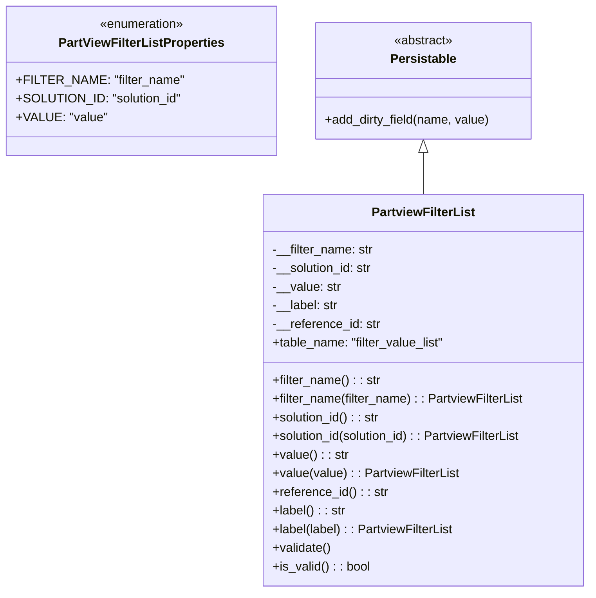

# Diagram: partview_service/partview_service/core/datamodel/FilterList.py

> Auto-generated by Obscura crawlers

## Mermaid

```mermaid
classDiagram
    class PartViewFilterListProperties <<enumeration>> {
        +FILTER_NAME: "filter_name"
        +SOLUTION_ID: "solution_id"
        +VALUE: "value"
    }
    class Persistable {
        <<abstract>>
        +add_dirty_field(name, value)
    }
    class PartviewFilterList {
        -__filter_name: str
        -__solution_id: str
        -__value: str
        -__label: str
        -__reference_id: str
        +table_name: "filter_value_list"
        +filter_name(): str
        +filter_name(filter_name): PartviewFilterList
        +solution_id(): str
        +solution_id(solution_id): PartviewFilterList
        +value(): str
        +value(value): PartviewFilterList
        +reference_id(): str
        +label(): str
        +label(label): PartviewFilterList
        +validate()
        +is_valid(): bool
    }
    Persistable <|-- PartviewFilterList
```

> SVG rendering failed for this diagram.
