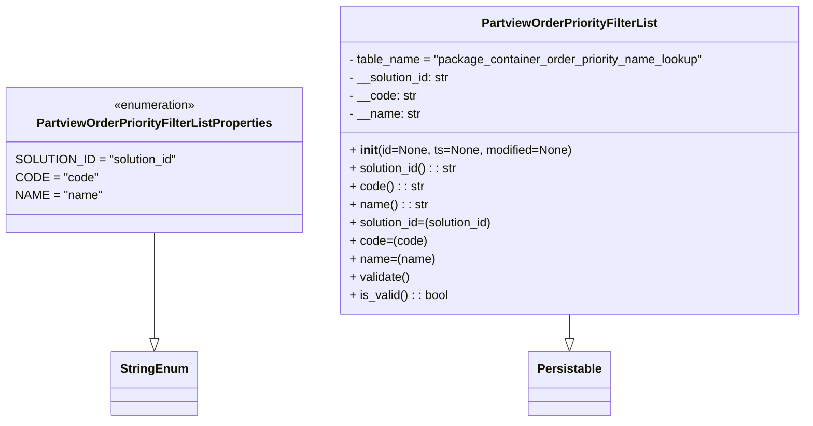

# Diagram: partview_service/partview_service/core/datamodel/OrderPriorityFilterList.py

> Auto-generated by Obscura crawlers

## Mermaid

### SVG

<svg id="container" width="1059.3515625" xmlns="http://www.w3.org/2000/svg" class="classDiagram" height="558" viewBox="0 0 1059.3515625 558" role="graphics-document document" aria-roledescription="class"><g><defs><marker id="container_class-aggregationStart" class="marker aggregation class" refX="18" refY="7" markerWidth="190" markerHeight="240" orient="auto"><path d="M 18,7 L9,13 L1,7 L9,1 Z"></path></marker></defs><defs><marker id="container_class-aggregationEnd" class="marker aggregation class" refX="1" refY="7" markerWidth="20" markerHeight="28" orient="auto"><path d="M 18,7 L9,13 L1,7 L9,1 Z"></path></marker></defs><defs><marker id="container_class-extensionStart" class="marker extension class" refX="18" refY="7" markerWidth="190" markerHeight="240" orient="auto"><path d="M 1,7 L18,13 V 1 Z"></path></marker></defs><defs><marker id="container_class-extensionEnd" class="marker extension class" refX="1" refY="7" markerWidth="20" markerHeight="28" orient="auto"><path d="M 1,1 V 13 L18,7 Z"></path></marker></defs><defs><marker id="container_class-compositionStart" class="marker composition class" refX="18" refY="7" markerWidth="190" markerHeight="240" orient="auto"><path d="M 18,7 L9,13 L1,7 L9,1 Z"></path></marker></defs><defs><marker id="container_class-compositionEnd" class="marker composition class" refX="1" refY="7" markerWidth="20" markerHeight="28" orient="auto"><path d="M 18,7 L9,13 L1,7 L9,1 Z"></path></marker></defs><defs><marker id="container_class-dependencyStart" class="marker dependency class" refX="6" refY="7" markerWidth="190" markerHeight="240" orient="auto"><path d="M 5,7 L9,13 L1,7 L9,1 Z"></path></marker></defs><defs><marker id="container_class-dependencyEnd" class="marker dependency class" refX="13" refY="7" markerWidth="20" markerHeight="28" orient="auto"><path d="M 18,7 L9,13 L14,7 L9,1 Z"></path></marker></defs><defs><marker id="container_class-lollipopStart" class="marker lollipop class" refX="13" refY="7" markerWidth="190" markerHeight="240" orient="auto"><circle stroke="black" fill="transparent" cx="7" cy="7" r="6"></circle></marker></defs><defs><marker id="container_class-lollipopEnd" class="marker lollipop class" refX="1" refY="7" markerWidth="190" markerHeight="240" orient="auto"><circle stroke="black" fill="transparent" cx="7" cy="7" r="6"></circle></marker></defs><g class="root"><g class="clusters"></g><g class="edgePaths"><path d="M745.793,416L745.793,420.167C745.793,424.333,745.793,432.667,745.793,438.125C745.793,443.583,745.793,446.167,745.793,447.458L745.793,448.75" id="id_PartviewOrderPriorityFilterList_Persistable_1" class="edge-thickness-normal edge-pattern-solid relation" style=";;;" data-edge="true" data-et="edge" data-id="id_PartviewOrderPriorityFilterList_Persistable_1" data-points="W3sieCI6NzQ1Ljc5Mjk2ODc1LCJ5Ijo0MTZ9LHsieCI6NzQ1Ljc5Mjk2ODc1LCJ5Ijo0NDF9LHsieCI6NzQ1Ljc5Mjk2ODc1LCJ5Ijo0NjZ9XQ==" marker-end="url(#container_class-extensionEnd)"></path><path d="M199.117,308L199.117,330.167C199.117,352.333,199.117,396.667,199.117,420.125C199.117,443.583,199.117,446.167,199.117,447.458L199.117,448.75" id="id_PartviewOrderPriorityFilterListProperties_StringEnum_2" class="edge-thickness-normal edge-pattern-solid relation" style=";;;" data-edge="true" data-et="edge" data-id="id_PartviewOrderPriorityFilterListProperties_StringEnum_2" data-points="W3sieCI6MTk5LjExNzE4NzUsInkiOjMwOH0seyJ4IjoxOTkuMTE3MTg3NSwieSI6NDQxfSx7IngiOjE5OS4xMTcxODc1LCJ5Ijo0NjZ9XQ==" marker-end="url(#container_class-extensionEnd)"></path></g><g class="edgeLabels"><g class="edgeLabel"><g class="label" data-id="id_PartviewOrderPriorityFilterList_Persistable_1" transform="translate(0, 0)"><foreignObject width="0" height="0">

</foreignObject></g></g><g class="edgeLabel"><g class="label" data-id="id_PartviewOrderPriorityFilterListProperties_StringEnum_2" transform="translate(0, 0)"><foreignObject width="0" height="0">

</foreignObject></g></g></g><g class="nodes"><g class="node default" id="classId-PartviewOrderPriorityFilterListProperties-0" transform="translate(199.1171875, 212)"><g class="basic label-container"><path d="M-191.1171875 -96 L191.1171875 -96 L191.1171875 96 L-191.1171875 96" stroke="none" stroke-width="0" fill="#ECECFF" style=""></path><path d="M-191.1171875 -96 C-77.33881564799631 -96, 36.439556204007374 -96, 191.1171875 -96 M-191.1171875 -96 C-40.520562110588344 -96, 110.07606327882331 -96, 191.1171875 -96 M191.1171875 -96 C191.1171875 -25.339999257540256, 191.1171875 45.32000148491949, 191.1171875 96 M191.1171875 -96 C191.1171875 -43.86358000760711, 191.1171875 8.272839984785776, 191.1171875 96 M191.1171875 96 C104.07361758031217 96, 17.030047660624348 96, -191.1171875 96 M191.1171875 96 C84.39679875620875 96, -22.323589987582494 96, -191.1171875 96 M-191.1171875 96 C-191.1171875 27.737460663004327, -191.1171875 -40.525078673991345, -191.1171875 -96 M-191.1171875 96 C-191.1171875 36.318181752077905, -191.1171875 -23.36363649584419, -191.1171875 -96" stroke="#9370DB" stroke-width="1.3" fill="none" stroke-dasharray="0 0" style=""></path></g><g class="annotation-group text" transform="translate(-55.5546875, -72)"><g class="label" style="" transform="translate(0,-12)"><foreignObject width="111.109375" height="24">

«enumeration»

</foreignObject></g></g><g class="label-group text" transform="translate(-150.625, -48)"><g class="label" style="font-weight: bolder" transform="translate(0,-12)"><foreignObject width="301.25" height="24">

PartviewOrderPriorityFilterListProperties

</foreignObject></g></g><g class="members-group text" transform="translate(-179.1171875, 0)"><g class="label" style="" transform="translate(0,-12)"><foreignObject width="207.609375" height="24">

SOLUTION_ID = "solution_id"

</foreignObject></g><g class="label" style="" transform="translate(0,12)"><foreignObject width="102.46875" height="24">

CODE = "code"

</foreignObject></g><g class="label" style="" transform="translate(0,36)"><foreignObject width="110.71875" height="24">

NAME = "name"

</foreignObject></g></g><g class="methods-group text" transform="translate(-179.1171875, 96)"></g><g class="divider" style=""><path d="M-191.1171875 -24 C-47.955640951670006 -24, 95.20590559665999 -24, 191.1171875 -24 M-191.1171875 -24 C-72.60250083873821 -24, 45.91218582252358 -24, 191.1171875 -24" stroke="#9370DB" stroke-width="1.3" fill="none" stroke-dasharray="0 0" style=""></path></g><g class="divider" style=""><path d="M-191.1171875 72 C-111.68512495535668 72, -32.25306241071337 72, 191.1171875 72 M-191.1171875 72 C-43.445901174721 72, 104.225385150558 72, 191.1171875 72" stroke="#9370DB" stroke-width="1.3" fill="none" stroke-dasharray="0 0" style=""></path></g></g><g class="node default" id="classId-StringEnum-1" transform="translate(199.1171875, 508)"><g class="basic label-container"><path d="M-54.234375 -42 L54.234375 -42 L54.234375 42 L-54.234375 42" stroke="none" stroke-width="0" fill="#ECECFF" style=""></path><path d="M-54.234375 -42 C-22.703359150865115 -42, 8.82765669826977 -42, 54.234375 -42 M-54.234375 -42 C-29.1200681315144 -42, -4.005761263028802 -42, 54.234375 -42 M54.234375 -42 C54.234375 -22.201331434724928, 54.234375 -2.4026628694498555, 54.234375 42 M54.234375 -42 C54.234375 -12.310907750570774, 54.234375 17.378184498858452, 54.234375 42 M54.234375 42 C30.09155961207336 42, 5.948744224146722 42, -54.234375 42 M54.234375 42 C30.044867467148162 42, 5.855359934296324 42, -54.234375 42 M-54.234375 42 C-54.234375 10.905366971285986, -54.234375 -20.18926605742803, -54.234375 -42 M-54.234375 42 C-54.234375 15.828744087958025, -54.234375 -10.34251182408395, -54.234375 -42" stroke="#9370DB" stroke-width="1.3" fill="none" stroke-dasharray="0 0" style=""></path></g><g class="annotation-group text" transform="translate(0, -18)"></g><g class="label-group text" transform="translate(-42.234375, -18)"><g class="label" style="font-weight: bolder" transform="translate(0,-12)"><foreignObject width="84.46875" height="24">

StringEnum

</foreignObject></g></g><g class="members-group text" transform="translate(-42.234375, 30)"></g><g class="methods-group text" transform="translate(-42.234375, 60)"></g><g class="divider" style=""><path d="M-54.234375 6 C-25.718323076426344 6, 2.7977288471473116 6, 54.234375 6 M-54.234375 6 C-24.560602444514135 6, 5.11317011097173 6, 54.234375 6" stroke="#9370DB" stroke-width="1.3" fill="none" stroke-dasharray="0 0" style=""></path></g><g class="divider" style=""><path d="M-54.234375 24 C-21.100528775932965 24, 12.03331744813407 24, 54.234375 24 M-54.234375 24 C-12.019998368947427 24, 30.194378262105147 24, 54.234375 24" stroke="#9370DB" stroke-width="1.3" fill="none" stroke-dasharray="0 0" style=""></path></g></g><g class="node default" id="classId-Persistable-2" transform="translate(745.79296875, 508)"><g class="basic label-container"><path d="M-52.9765625 -42 L52.9765625 -42 L52.9765625 42 L-52.9765625 42" stroke="none" stroke-width="0" fill="#ECECFF" style=""></path><path d="M-52.9765625 -42 C-25.16334998239582 -42, 2.6498625352083565 -42, 52.9765625 -42 M-52.9765625 -42 C-15.54354013828646 -42, 21.88948222342708 -42, 52.9765625 -42 M52.9765625 -42 C52.9765625 -21.53108833836162, 52.9765625 -1.0621766767232401, 52.9765625 42 M52.9765625 -42 C52.9765625 -20.049475619914634, 52.9765625 1.901048760170731, 52.9765625 42 M52.9765625 42 C28.42326796365873 42, 3.8699734273174613 42, -52.9765625 42 M52.9765625 42 C24.15761074376336 42, -4.6613410124732795 42, -52.9765625 42 M-52.9765625 42 C-52.9765625 19.353765547955444, -52.9765625 -3.2924689040891124, -52.9765625 -42 M-52.9765625 42 C-52.9765625 8.64019557795983, -52.9765625 -24.71960884408034, -52.9765625 -42" stroke="#9370DB" stroke-width="1.3" fill="none" stroke-dasharray="0 0" style=""></path></g><g class="annotation-group text" transform="translate(0, -18)"></g><g class="label-group text" transform="translate(-40.9765625, -18)"><g class="label" style="font-weight: bolder" transform="translate(0,-12)"><foreignObject width="81.953125" height="24">

Persistable

</foreignObject></g></g><g class="members-group text" transform="translate(-40.9765625, 30)"></g><g class="methods-group text" transform="translate(-40.9765625, 60)"></g><g class="divider" style=""><path d="M-52.9765625 6 C-26.38410235060145 6, 0.2083577987971026 6, 52.9765625 6 M-52.9765625 6 C-19.2877395647373 6, 14.401083370525399 6, 52.9765625 6" stroke="#9370DB" stroke-width="1.3" fill="none" stroke-dasharray="0 0" style=""></path></g><g class="divider" style=""><path d="M-52.9765625 24 C-16.928464208242175 24, 19.11963408351565 24, 52.9765625 24 M-52.9765625 24 C-12.95883895009328 24, 27.05888459981344 24, 52.9765625 24" stroke="#9370DB" stroke-width="1.3" fill="none" stroke-dasharray="0 0" style=""></path></g></g><g class="node default" id="classId-PartviewOrderPriorityFilterList-3" transform="translate(745.79296875, 212)"><g class="basic label-container"><path d="M-305.55859375 -204 L305.55859375 -204 L305.55859375 204 L-305.55859375 204" stroke="none" stroke-width="0" fill="#ECECFF" style=""></path><path d="M-305.55859375 -204 C-92.10390771909655 -204, 121.35077831180689 -204, 305.55859375 -204 M-305.55859375 -204 C-149.4450024203649 -204, 6.668588909270227 -204, 305.55859375 -204 M305.55859375 -204 C305.55859375 -53.865967259262305, 305.55859375 96.26806548147539, 305.55859375 204 M305.55859375 -204 C305.55859375 -45.22025095648985, 305.55859375 113.5594980870203, 305.55859375 204 M305.55859375 204 C166.21813256318913 204, 26.87767137637826 204, -305.55859375 204 M305.55859375 204 C162.39619552439183 204, 19.233797298783657 204, -305.55859375 204 M-305.55859375 204 C-305.55859375 89.81904539418564, -305.55859375 -24.361909211628728, -305.55859375 -204 M-305.55859375 204 C-305.55859375 104.44084313370139, -305.55859375 4.8816862674027846, -305.55859375 -204" stroke="#9370DB" stroke-width="1.3" fill="none" stroke-dasharray="0 0" style=""></path></g><g class="annotation-group text" transform="translate(0, -180)"></g><g class="label-group text" transform="translate(-112.3203125, -180)"><g class="label" style="font-weight: bolder" transform="translate(0,-12)"><foreignObject width="224.640625" height="24">

PartviewOrderPriorityFilterList

</foreignObject></g></g><g class="members-group text" transform="translate(-293.55859375, -132)"><g class="label" style="" transform="translate(0,-12)"><foreignObject width="474.796875" height="24">

- table_name = "package_container_order_priority_name_lookup"

</foreignObject></g><g class="label" style="" transform="translate(0,12)"><foreignObject width="136.90625" height="24">

- __solution_id: str

</foreignObject></g><g class="label" style="" transform="translate(0,36)"><foreignObject width="89.3125" height="24">

- __code: str

</foreignObject></g><g class="label" style="" transform="translate(0,60)"><foreignObject width="95.1875" height="24">

- __name: str

</foreignObject></g></g><g class="methods-group text" transform="translate(-293.55859375, -12)"><g class="label" style="" transform="translate(0,-12)"><foreignObject width="293.9375" height="24">

+ <strong>init</strong>(id=None, ts=None, modified=None)

</foreignObject></g><g class="label" style="" transform="translate(0,12)"><foreignObject width="144.640625" height="24">

+ solution_id() : : str

</foreignObject></g><g class="label" style="" transform="translate(0,36)"><foreignObject width="97.390625" height="24">

+ code() : : str

</foreignObject></g><g class="label" style="" transform="translate(0,60)"><foreignObject width="102.9375" height="24">

+ name() : : str

</foreignObject></g><g class="label" style="" transform="translate(0,84)"><foreignObject width="195.046875" height="24">

+ solution_id=(solution_id)

</foreignObject></g><g class="label" style="" transform="translate(0,108)"><foreignObject width="100.515625" height="24">

+ code=(code)

</foreignObject></g><g class="label" style="" transform="translate(0,132)"><foreignObject width="111.625" height="24">

+ name=(name)

</foreignObject></g><g class="label" style="" transform="translate(0,156)"><foreignObject width="80.484375" height="24">

+ validate()

</foreignObject></g><g class="label" style="" transform="translate(0,180)"><foreignObject width="130.3125" height="24">

+ is_valid() : : bool

</foreignObject></g></g><g class="divider" style=""><path d="M-305.55859375 -156 C-127.99647276916329 -156, 49.56564821167342 -156, 305.55859375 -156 M-305.55859375 -156 C-70.16042836305633 -156, 165.23773702388735 -156, 305.55859375 -156" stroke="#9370DB" stroke-width="1.3" fill="none" stroke-dasharray="0 0" style=""></path></g><g class="divider" style=""><path d="M-305.55859375 -36 C-121.00669463692111 -36, 63.54520447615778 -36, 305.55859375 -36 M-305.55859375 -36 C-107.44294726989554 -36, 90.67269921020892 -36, 305.55859375 -36" stroke="#9370DB" stroke-width="1.3" fill="none" stroke-dasharray="0 0" style=""></path></g></g></g></g></g></svg>
