# Diagram: partview_service/partview_service/core/datamodel/PackageContainer.py

> Auto-generated by Obscura crawlers

## Mermaid

```mermaid
classDiagram
class Persistable {
  +id: str
  +ts: datetime
  +modified: datetime
  +__init__(id, ts, modified)
  +add_dirty_field(name, value)
  +clear_dirty_field(name)
  +is_valid(): bool
}
class PackageContainer {
  -solution_id: str
  -tracking_number: str
  -description: str
  -lifecycle_state: str
  -lifecycle_change_ts: datetime
  -status: str
  -last_reported_ts: datetime
  -destination_eta: datetime
  -eta_update_ts: datetime
  -remaining_distance: str
  -origin_location_code: str
  -destination_location_code: str
  -last_milestone_id: str
  -last_event_id: str
  -destination_planned_trip_leg_id: str
  -origin_actual_trip_leg_id: str
  -destination_actual_trip_leg_id: str
  -origin_planned_trip_leg_id: str
  -destination_departed_ts: datetime
  -destination_arrived_ts: datetime
  -origin_departed_ts: datetime
  -origin_arrived_ts: datetime
  -route_id: str
  -rfid_tag_id: str
  -classification_id: str
  -container_type_id: str
  -original_unit_of_measurement: str
  -weight: float
  -owner_org_fv_id: str
  -manufacturer: str
  -number_of_shipments: int
  -order_csl: str
  -freight_piece_number: str
  -commodity_code: str
  -pro_number: str
  -container_identifier: str
  -parts_per_container: int
  -internal_doc_identifier: str
  -actor_id: str
  -organizational_unit: str
  -trailer_equipment_number: str
  -customer_number: str
  -delayed_ts: datetime
  -effective_destination_eta: datetime
  -next_milestone_eta: str
  +__init__(id: str = None, ts: datetime = None, modified: datetime = None)
  +solution_id: str
  +tracking_number: str
  +description: str
  +lifecycle_state: str
  +status: str
  +last_reported_ts: datetime
  +last_event_id: str
  +last_milestone_id: str
  +route_id: str
  +rfid_tag_id: str
  +classification_id: str
  +container_type_id: str
  +weight: float
  +number_of_shipments: int
  +destination_departed_ts: datetime
  +destination_arrived_ts: datetime
  +origin_departed_ts: datetime
  +origin_arrived_ts: datetime
  +destination_eta: datetime
  +remaining_distance: str
  +entity_type_id: str
  +order_csl: str
  +freight_piece_number: str
  +commodity_code: str
  +pro_number: str
  +container_identifier: str
  +parts_per_container: int
  +internal_doc_identifier: str
  +origin_actual_trip_leg_id: str
  +destination_actual_trip_leg_id: str
  +origin_planned_trip_leg_id: str
  +destination_planned_trip_leg_id: str
  +origin_location_code: str
  +destination_location_code: str
  +eta_update_ts: datetime
  +customer_number: str
  +set_delayed_ts(delayed_ts: datetime)
  +set_effective_destination_eta(effective_destination_eta: datetime)
  +is_valid(): bool
  +to_dict(): dict
  +is_empty(): bool
}
Persistable <|-- PackageContainer
```

### SVG

<svg id="container" width="595.84375" xmlns="http://www.w3.org/2000/svg" class="classDiagram" height="2514" viewBox="0 0 595.84375 2514" role="graphics-document document" aria-roledescription="class"><g><defs><marker id="container_class-aggregationStart" class="marker aggregation class" refX="18" refY="7" markerWidth="190" markerHeight="240" orient="auto"><path d="M 18,7 L9,13 L1,7 L9,1 Z"></path></marker></defs><defs><marker id="container_class-aggregationEnd" class="marker aggregation class" refX="1" refY="7" markerWidth="20" markerHeight="28" orient="auto"><path d="M 18,7 L9,13 L1,7 L9,1 Z"></path></marker></defs><defs><marker id="container_class-extensionStart" class="marker extension class" refX="18" refY="7" markerWidth="190" markerHeight="240" orient="auto"><path d="M 1,7 L18,13 V 1 Z"></path></marker></defs><defs><marker id="container_class-extensionEnd" class="marker extension class" refX="1" refY="7" markerWidth="20" markerHeight="28" orient="auto"><path d="M 1,1 V 13 L18,7 Z"></path></marker></defs><defs><marker id="container_class-compositionStart" class="marker composition class" refX="18" refY="7" markerWidth="190" markerHeight="240" orient="auto"><path d="M 18,7 L9,13 L1,7 L9,1 Z"></path></marker></defs><defs><marker id="container_class-compositionEnd" class="marker composition class" refX="1" refY="7" markerWidth="20" markerHeight="28" orient="auto"><path d="M 18,7 L9,13 L1,7 L9,1 Z"></path></marker></defs><defs><marker id="container_class-dependencyStart" class="marker dependency class" refX="6" refY="7" markerWidth="190" markerHeight="240" orient="auto"><path d="M 5,7 L9,13 L1,7 L9,1 Z"></path></marker></defs><defs><marker id="container_class-dependencyEnd" class="marker dependency class" refX="13" refY="7" markerWidth="20" markerHeight="28" orient="auto"><path d="M 18,7 L9,13 L14,7 L9,1 Z"></path></marker></defs><defs><marker id="container_class-lollipopStart" class="marker lollipop class" refX="13" refY="7" markerWidth="190" markerHeight="240" orient="auto"><circle stroke="black" fill="transparent" cx="7" cy="7" r="6"></circle></marker></defs><defs><marker id="container_class-lollipopEnd" class="marker lollipop class" refX="1" refY="7" markerWidth="190" markerHeight="240" orient="auto"><circle stroke="black" fill="transparent" cx="7" cy="7" r="6"></circle></marker></defs><g class="root"><g class="clusters"></g><g class="edgePaths"><path d="M297.922,289.25L297.922,290.542C297.922,291.833,297.922,294.417,297.922,299.875C297.922,305.333,297.922,313.667,297.922,317.833L297.922,322" id="id_Persistable_PackageContainer_1" class="edge-thickness-normal edge-pattern-solid relation" style=";;;" data-edge="true" data-et="edge" data-id="id_Persistable_PackageContainer_1" data-points="W3sieCI6Mjk3LjkyMTg3NSwieSI6MjcyfSx7IngiOjI5Ny45MjE4NzUsInkiOjI5N30seyJ4IjoyOTcuOTIxODc1LCJ5IjozMjJ9XQ==" marker-start="url(#container_class-extensionStart)"></path></g><g class="edgeLabels"><g class="edgeLabel"><g class="label" data-id="id_Persistable_PackageContainer_1" transform="translate(0, 0)"><foreignObject width="0" height="0">

</foreignObject></g></g></g><g class="nodes"><g class="node default" id="classId-Persistable-0" transform="translate(297.921875, 140)"><g class="basic label-container"><path d="M-139.84765625 -132 L139.84765625 -132 L139.84765625 132 L-139.84765625 132" stroke="none" stroke-width="0" fill="#ECECFF" style=""></path><path d="M-139.84765625 -132 C-34.19993649513586 -132, 71.44778325972828 -132, 139.84765625 -132 M-139.84765625 -132 C-38.48419222124508 -132, 62.87927180750984 -132, 139.84765625 -132 M139.84765625 -132 C139.84765625 -28.957763517343253, 139.84765625 74.0844729653135, 139.84765625 132 M139.84765625 -132 C139.84765625 -35.654943693922476, 139.84765625 60.69011261215505, 139.84765625 132 M139.84765625 132 C49.33248092442936 132, -41.182694401141276 132, -139.84765625 132 M139.84765625 132 C80.98368165937038 132, 22.119707068740738 132, -139.84765625 132 M-139.84765625 132 C-139.84765625 64.1600399223616, -139.84765625 -3.6799201552767897, -139.84765625 -132 M-139.84765625 132 C-139.84765625 71.2334762677517, -139.84765625 10.466952535503395, -139.84765625 -132" stroke="#9370DB" stroke-width="1.3" fill="none" stroke-dasharray="0 0" style=""></path></g><g class="annotation-group text" transform="translate(0, -108)"></g><g class="label-group text" transform="translate(-40.9765625, -108)"><g class="label" style="font-weight: bolder" transform="translate(0,-12)"><foreignObject width="81.953125" height="24">

Persistable

</foreignObject></g></g><g class="members-group text" transform="translate(-127.84765625, -60)"><g class="label" style="" transform="translate(0,-12)"><foreignObject width="49.578125" height="24">

+id: str

</foreignObject></g><g class="label" style="" transform="translate(0,12)"><foreignObject width="94.484375" height="24">

+ts: datetime

</foreignObject></g><g class="label" style="" transform="translate(0,36)"><foreignObject width="145.9375" height="24">

+modified: datetime

</foreignObject></g></g><g class="methods-group text" transform="translate(-127.84765625, 36)"><g class="label" style="" transform="translate(0,-12)"><foreignObject width="150.90625" height="24">

+<strong>init</strong>(id, ts, modified)

</foreignObject></g><g class="label" style="" transform="translate(0,12)"><foreignObject width="214.71875" height="24">

+add_dirty_field(name, value)

</foreignObject></g><g class="label" style="" transform="translate(0,36)"><foreignObject width="174.734375" height="24">

+clear_dirty_field(name)

</foreignObject></g><g class="label" style="" transform="translate(0,60)"><foreignObject width="126.078125" height="24">

+is_valid() : : bool

</foreignObject></g></g><g class="divider" style=""><path d="M-139.84765625 -84 C-28.84314512624954 -84, 82.16136599750092 -84, 139.84765625 -84 M-139.84765625 -84 C-53.11387450778868 -84, 33.61990723442264 -84, 139.84765625 -84" stroke="#9370DB" stroke-width="1.3" fill="none" stroke-dasharray="0 0" style=""></path></g><g class="divider" style=""><path d="M-139.84765625 12 C-28.304092670435864 12, 83.23947090912827 12, 139.84765625 12 M-139.84765625 12 C-59.02239545070081 12, 21.802865348598374 12, 139.84765625 12" stroke="#9370DB" stroke-width="1.3" fill="none" stroke-dasharray="0 0" style=""></path></g></g><g class="node default" id="classId-PackageContainer-1" transform="translate(297.921875, 1414)"><g class="basic label-container"><path d="M-289.921875 -1092 L289.921875 -1092 L289.921875 1092 L-289.921875 1092" stroke="none" stroke-width="0" fill="#ECECFF" style=""></path><path d="M-289.921875 -1092 C-105.36590038691787 -1092, 79.19007422616426 -1092, 289.921875 -1092 M-289.921875 -1092 C-166.28996173784208 -1092, -42.65804847568418 -1092, 289.921875 -1092 M289.921875 -1092 C289.921875 -493.9600908311129, 289.921875 104.07981833777421, 289.921875 1092 M289.921875 -1092 C289.921875 -653.8505884874533, 289.921875 -215.7011769749064, 289.921875 1092 M289.921875 1092 C137.34128655133193 1092, -15.239301897336134 1092, -289.921875 1092 M289.921875 1092 C127.59788032314853 1092, -34.72611435370294 1092, -289.921875 1092 M-289.921875 1092 C-289.921875 331.3716093361303, -289.921875 -429.2567813277394, -289.921875 -1092 M-289.921875 1092 C-289.921875 341.52654618973224, -289.921875 -408.9469076205355, -289.921875 -1092" stroke="#9370DB" stroke-width="1.3" fill="none" stroke-dasharray="0 0" style=""></path></g><g class="annotation-group text" transform="translate(0, -1068)"></g><g class="label-group text" transform="translate(-65.453125, -1068)"><g class="label" style="font-weight: bolder" transform="translate(0,-12)"><foreignObject width="130.90625" height="24">

PackageContainer

</foreignObject></g></g><g class="members-group text" transform="translate(-277.921875, -1020)"><g class="label" style="" transform="translate(0,-12)"><foreignObject width="116.1875" height="24">

-solution_id: str

</foreignObject></g><g class="label" style="" transform="translate(0,12)"><foreignObject width="157.375" height="24">

-tracking_number: str

</foreignObject></g><g class="label" style="" transform="translate(0,36)"><foreignObject width="116.5625" height="24">

-description: str

</foreignObject></g><g class="label" style="" transform="translate(0,60)"><foreignObject width="137.609375" height="24">

-lifecycle_state: str

</foreignObject></g><g class="label" style="" transform="translate(0,84)"><foreignObject width="219.828125" height="24">

-lifecycle_change_ts: datetime

</foreignObject></g><g class="label" style="" transform="translate(0,108)"><foreignObject width="78.359375" height="24">

-status: str

</foreignObject></g><g class="label" style="" transform="translate(0,132)"><foreignObject width="199.015625" height="24">

-last_reported_ts: datetime

</foreignObject></g><g class="label" style="" transform="translate(0,156)"><foreignObject width="194.015625" height="24">

-destination_eta: datetime

</foreignObject></g><g class="label" style="" transform="translate(0,180)"><foreignObject width="183.140625" height="24">

-eta_update_ts: datetime

</foreignObject></g><g class="label" style="" transform="translate(0,204)"><foreignObject width="176.296875" height="24">

-remaining_distance: str

</foreignObject></g><g class="label" style="" transform="translate(0,228)"><foreignObject width="186.46875" height="24">

-origin_location_code: str

</foreignObject></g><g class="label" style="" transform="translate(0,252)"><foreignObject width="227.375" height="24">

-destination_location_code: str

</foreignObject></g><g class="label" style="" transform="translate(0,276)"><foreignObject width="162.765625" height="24">

-last_milestone_id: str

</foreignObject></g><g class="label" style="" transform="translate(0,300)"><foreignObject width="131.09375" height="24">

-last_event_id: str

</foreignObject></g><g class="label" style="" transform="translate(0,324)"><foreignObject width="271.1875" height="24">

-destination_planned_trip_leg_id: str

</foreignObject></g><g class="label" style="" transform="translate(0,348)"><foreignObject width="214.796875" height="24">

-origin_actual_trip_leg_id: str

</foreignObject></g><g class="label" style="" transform="translate(0,372)"><foreignObject width="255.6875" height="24">

-destination_actual_trip_leg_id: str

</foreignObject></g><g class="label" style="" transform="translate(0,396)"><foreignObject width="230.296875" height="24">

-origin_planned_trip_leg_id: str

</foreignObject></g><g class="label" style="" transform="translate(0,420)"><foreignObject width="258.5" height="24">

-destination_departed_ts: datetime

</foreignObject></g><g class="label" style="" transform="translate(0,444)"><foreignObject width="243.828125" height="24">

-destination_arrived_ts: datetime

</foreignObject></g><g class="label" style="" transform="translate(0,468)"><foreignObject width="217.609375" height="24">

-origin_departed_ts: datetime

</foreignObject></g><g class="label" style="" transform="translate(0,492)"><foreignObject width="202.9375" height="24">

-origin_arrived_ts: datetime

</foreignObject></g><g class="label" style="" transform="translate(0,516)"><foreignObject width="94.640625" height="24">

-route_id: str

</foreignObject></g><g class="label" style="" transform="translate(0,540)"><foreignObject width="111.890625" height="24">

-rfid_tag_id: str

</foreignObject></g><g class="label" style="" transform="translate(0,564)"><foreignObject width="150.859375" height="24">

-classification_id: str

</foreignObject></g><g class="label" style="" transform="translate(0,588)"><foreignObject width="163.75" height="24">

-container_type_id: str

</foreignObject></g><g class="label" style="" transform="translate(0,612)"><foreignObject width="256.609375" height="24">

-original_unit_of_measurement: str

</foreignObject></g><g class="label" style="" transform="translate(0,636)"><foreignObject width="95.828125" height="24">

-weight: float

</foreignObject></g><g class="label" style="" transform="translate(0,660)"><foreignObject width="152.578125" height="24">

-owner_org_fv_id: str

</foreignObject></g><g class="label" style="" transform="translate(0,684)"><foreignObject width="132.265625" height="24">

-manufacturer: str

</foreignObject></g><g class="label" style="" transform="translate(0,708)"><foreignObject width="196.1875" height="24">

-number_of_shipments: int

</foreignObject></g><g class="label" style="" transform="translate(0,732)"><foreignObject width="100.15625" height="24">

-order_csl: str

</foreignObject></g><g class="label" style="" transform="translate(0,756)"><foreignObject width="193.546875" height="24">

-freight_piece_number: str

</foreignObject></g><g class="label" style="" transform="translate(0,780)"><foreignObject width="157.53125" height="24">

-commodity_code: str

</foreignObject></g><g class="label" style="" transform="translate(0,804)"><foreignObject width="123.46875" height="24">

-pro_number: str

</foreignObject></g><g class="label" style="" transform="translate(0,828)"><foreignObject width="176.921875" height="24">

-container_identifier: str

</foreignObject></g><g class="label" style="" transform="translate(0,852)"><foreignObject width="180.15625" height="24">

-parts_per_container: int

</foreignObject></g><g class="label" style="" transform="translate(0,876)"><foreignObject width="200.484375" height="24">

-internal_doc_identifier: str

</foreignObject></g><g class="label" style="" transform="translate(0,900)"><foreignObject width="92.25" height="24">

-actor_id: str

</foreignObject></g><g class="label" style="" transform="translate(0,924)"><foreignObject width="174.578125" height="24">

-organizational_unit: str

</foreignObject></g><g class="label" style="" transform="translate(0,948)"><foreignObject width="229.1875" height="24">

-trailer_equipment_number: str

</foreignObject></g><g class="label" style="" transform="translate(0,972)"><foreignObject width="165.71875" height="24">

-customer_number: str

</foreignObject></g><g class="label" style="" transform="translate(0,996)"><foreignObject width="158.484375" height="24">

-delayed_ts: datetime

</foreignObject></g><g class="label" style="" transform="translate(0,1020)"><foreignObject width="264.15625" height="24">

-effective_destination_eta: datetime

</foreignObject></g><g class="label" style="" transform="translate(0,1044)"><foreignObject width="176.53125" height="24">

-next_milestone_eta: str

</foreignObject></g><g class="label" style="" transform="translate(0,1068)"><foreignObject width="117.71875" height="24">

+solution_id: str

</foreignObject></g><g class="label" style="" transform="translate(0,1092)"><foreignObject width="158.90625" height="24">

+tracking_number: str

</foreignObject></g><g class="label" style="" transform="translate(0,1116)"><foreignObject width="118.109375" height="24">

+description: str

</foreignObject></g><g class="label" style="" transform="translate(0,1140)"><foreignObject width="139.140625" height="24">

+lifecycle_state: str

</foreignObject></g><g class="label" style="" transform="translate(0,1164)"><foreignObject width="79.890625" height="24">

+status: str

</foreignObject></g><g class="label" style="" transform="translate(0,1188)"><foreignObject width="200.546875" height="24">

+last_reported_ts: datetime

</foreignObject></g><g class="label" style="" transform="translate(0,1212)"><foreignObject width="132.625" height="24">

+last_event_id: str

</foreignObject></g><g class="label" style="" transform="translate(0,1236)"><foreignObject width="164.296875" height="24">

+last_milestone_id: str

</foreignObject></g><g class="label" style="" transform="translate(0,1260)"><foreignObject width="96.1875" height="24">

+route_id: str

</foreignObject></g><g class="label" style="" transform="translate(0,1284)"><foreignObject width="113.4375" height="24">

+rfid_tag_id: str

</foreignObject></g><g class="label" style="" transform="translate(0,1308)"><foreignObject width="152.390625" height="24">

+classification_id: str

</foreignObject></g><g class="label" style="" transform="translate(0,1332)"><foreignObject width="165.28125" height="24">

+container_type_id: str

</foreignObject></g><g class="label" style="" transform="translate(0,1356)"><foreignObject width="97.375" height="24">

+weight: float

</foreignObject></g><g class="label" style="" transform="translate(0,1380)"><foreignObject width="197.71875" height="24">

+number_of_shipments: int

</foreignObject></g><g class="label" style="" transform="translate(0,1404)"><foreignObject width="260.046875" height="24">

+destination_departed_ts: datetime

</foreignObject></g><g class="label" style="" transform="translate(0,1428)"><foreignObject width="245.375" height="24">

+destination_arrived_ts: datetime

</foreignObject></g><g class="label" style="" transform="translate(0,1452)"><foreignObject width="219.140625" height="24">

+origin_departed_ts: datetime

</foreignObject></g><g class="label" style="" transform="translate(0,1476)"><foreignObject width="204.46875" height="24">

+origin_arrived_ts: datetime

</foreignObject></g><g class="label" style="" transform="translate(0,1500)"><foreignObject width="195.546875" height="24">

+destination_eta: datetime

</foreignObject></g><g class="label" style="" transform="translate(0,1524)"><foreignObject width="177.828125" height="24">

+remaining_distance: str

</foreignObject></g><g class="label" style="" transform="translate(0,1548)"><foreignObject width="138.84375" height="24">

+entity_type_id: str

</foreignObject></g><g class="label" style="" transform="translate(0,1572)"><foreignObject width="101.6875" height="24">

+order_csl: str

</foreignObject></g><g class="label" style="" transform="translate(0,1596)"><foreignObject width="195.078125" height="24">

+freight_piece_number: str

</foreignObject></g><g class="label" style="" transform="translate(0,1620)"><foreignObject width="159.0625" height="24">

+commodity_code: str

</foreignObject></g><g class="label" style="" transform="translate(0,1644)"><foreignObject width="125" height="24">

+pro_number: str

</foreignObject></g><g class="label" style="" transform="translate(0,1668)"><foreignObject width="178.453125" height="24">

+container_identifier: str

</foreignObject></g><g class="label" style="" transform="translate(0,1692)"><foreignObject width="181.6875" height="24">

+parts_per_container: int

</foreignObject></g><g class="label" style="" transform="translate(0,1716)"><foreignObject width="202.03125" height="24">

+internal_doc_identifier: str

</foreignObject></g><g class="label" style="" transform="translate(0,1740)"><foreignObject width="216.328125" height="24">

+origin_actual_trip_leg_id: str

</foreignObject></g><g class="label" style="" transform="translate(0,1764)"><foreignObject width="257.21875" height="24">

+destination_actual_trip_leg_id: str

</foreignObject></g><g class="label" style="" transform="translate(0,1788)"><foreignObject width="231.828125" height="24">

+origin_planned_trip_leg_id: str

</foreignObject></g><g class="label" style="" transform="translate(0,1812)"><foreignObject width="272.734375" height="24">

+destination_planned_trip_leg_id: str

</foreignObject></g><g class="label" style="" transform="translate(0,1836)"><foreignObject width="188.015625" height="24">

+origin_location_code: str

</foreignObject></g><g class="label" style="" transform="translate(0,1860)"><foreignObject width="228.90625" height="24">

+destination_location_code: str

</foreignObject></g><g class="label" style="" transform="translate(0,1884)"><foreignObject width="184.6875" height="24">

+eta_update_ts: datetime

</foreignObject></g><g class="label" style="" transform="translate(0,1908)"><foreignObject width="167.25" height="24">

+customer_number: str

</foreignObject></g></g><g class="methods-group text" transform="translate(-277.921875, 948)"><g class="label" style="" transform="translate(0,-12)"><foreignObject width="489.296875" height="24">

+<strong>init</strong>(id: str = None, ts: datetime = None, modified: datetime = None)

</foreignObject></g><g class="label" style="" transform="translate(0,12)"><foreignObject width="279.0625" height="24">

+set_delayed_ts(delayed_ts: datetime)

</foreignObject></g><g class="label" style="" transform="translate(0,36)"><foreignObject width="490.390625" height="24">

+set_effective_destination_eta(effective_destination_eta: datetime)

</foreignObject></g><g class="label" style="" transform="translate(0,60)"><foreignObject width="126.078125" height="24">

+is_valid() : : bool

</foreignObject></g><g class="label" style="" transform="translate(0,84)"><foreignObject width="116.25" height="24">

+to_dict() : : dict

</foreignObject></g><g class="label" style="" transform="translate(0,108)"><foreignObject width="136.8125" height="24">

+is_empty() : : bool

</foreignObject></g></g><g class="divider" style=""><path d="M-289.921875 -1044 C-150.4976384135165 -1044, -11.073401827033024 -1044, 289.921875 -1044 M-289.921875 -1044 C-131.75928100175332 -1044, 26.403312996493355 -1044, 289.921875 -1044" stroke="#9370DB" stroke-width="1.3" fill="none" stroke-dasharray="0 0" style=""></path></g><g class="divider" style=""><path d="M-289.921875 924 C-139.76970648620184 924, 10.382462027596318 924, 289.921875 924 M-289.921875 924 C-74.10905658930861 924, 141.70376182138278 924, 289.921875 924" stroke="#9370DB" stroke-width="1.3" fill="none" stroke-dasharray="0 0" style=""></path></g></g></g></g></g></svg>
