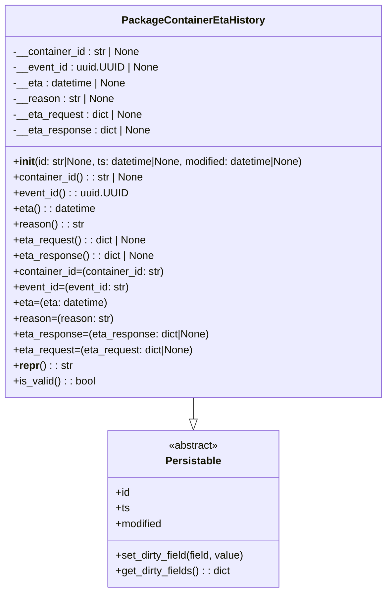

# Diagram: partview_service/partview_service/core/datamodel/PackageContainerEtaHistory.py

> Auto-generated by Obscura crawlers

## Mermaid

### SVG

<svg id="container" width="602.5078125" xmlns="http://www.w3.org/2000/svg" class="classDiagram" height="906" viewBox="0 0 602.5078125 906" role="graphics-document document" aria-roledescription="class"><g><defs><marker id="container_class-aggregationStart" class="marker aggregation class" refX="18" refY="7" markerWidth="190" markerHeight="240" orient="auto"><path d="M 18,7 L9,13 L1,7 L9,1 Z"></path></marker></defs><defs><marker id="container_class-aggregationEnd" class="marker aggregation class" refX="1" refY="7" markerWidth="20" markerHeight="28" orient="auto"><path d="M 18,7 L9,13 L1,7 L9,1 Z"></path></marker></defs><defs><marker id="container_class-extensionStart" class="marker extension class" refX="18" refY="7" markerWidth="190" markerHeight="240" orient="auto"><path d="M 1,7 L18,13 V 1 Z"></path></marker></defs><defs><marker id="container_class-extensionEnd" class="marker extension class" refX="1" refY="7" markerWidth="20" markerHeight="28" orient="auto"><path d="M 1,1 V 13 L18,7 Z"></path></marker></defs><defs><marker id="container_class-compositionStart" class="marker composition class" refX="18" refY="7" markerWidth="190" markerHeight="240" orient="auto"><path d="M 18,7 L9,13 L1,7 L9,1 Z"></path></marker></defs><defs><marker id="container_class-compositionEnd" class="marker composition class" refX="1" refY="7" markerWidth="20" markerHeight="28" orient="auto"><path d="M 18,7 L9,13 L1,7 L9,1 Z"></path></marker></defs><defs><marker id="container_class-dependencyStart" class="marker dependency class" refX="6" refY="7" markerWidth="190" markerHeight="240" orient="auto"><path d="M 5,7 L9,13 L1,7 L9,1 Z"></path></marker></defs><defs><marker id="container_class-dependencyEnd" class="marker dependency class" refX="13" refY="7" markerWidth="20" markerHeight="28" orient="auto"><path d="M 18,7 L9,13 L14,7 L9,1 Z"></path></marker></defs><defs><marker id="container_class-lollipopStart" class="marker lollipop class" refX="13" refY="7" markerWidth="190" markerHeight="240" orient="auto"><circle stroke="black" fill="transparent" cx="7" cy="7" r="6"></circle></marker></defs><defs><marker id="container_class-lollipopEnd" class="marker lollipop class" refX="1" refY="7" markerWidth="190" markerHeight="240" orient="auto"><circle stroke="black" fill="transparent" cx="7" cy="7" r="6"></circle></marker></defs><g class="root"><g class="clusters"></g><g class="edgePaths"><path d="M301.254,608L301.254,612.167C301.254,616.333,301.254,624.667,301.254,630.125C301.254,635.583,301.254,638.167,301.254,639.458L301.254,640.75" id="id_PackageContainerEtaHistory_Persistable_1" class="edge-thickness-normal edge-pattern-solid relation" style=";;;" data-edge="true" data-et="edge" data-id="id_PackageContainerEtaHistory_Persistable_1" data-points="W3sieCI6MzAxLjI1MzkwNjI1LCJ5Ijo2MDh9LHsieCI6MzAxLjI1MzkwNjI1LCJ5Ijo2MzN9LHsieCI6MzAxLjI1MzkwNjI1LCJ5Ijo2NTh9XQ==" marker-end="url(#container_class-extensionEnd)"></path></g><g class="edgeLabels"><g class="edgeLabel"><g class="label" data-id="id_PackageContainerEtaHistory_Persistable_1" transform="translate(0, 0)"><foreignObject width="0" height="0">

</foreignObject></g></g></g><g class="nodes"><g class="node default" id="classId-Persistable-0" transform="translate(301.25390625, 778)"><g class="basic label-container"><path d="M-132.90234375 -120 L132.90234375 -120 L132.90234375 120 L-132.90234375 120" stroke="none" stroke-width="0" fill="#ECECFF" style=""></path><path d="M-132.90234375 -120 C-65.17148360419822 -120, 2.5593765416035694 -120, 132.90234375 -120 M-132.90234375 -120 C-71.21606788482973 -120, -9.529792019659453 -120, 132.90234375 -120 M132.90234375 -120 C132.90234375 -24.277665219628872, 132.90234375 71.44466956074226, 132.90234375 120 M132.90234375 -120 C132.90234375 -53.950051986480844, 132.90234375 12.099896027038312, 132.90234375 120 M132.90234375 120 C67.76248784768352 120, 2.622631945367033 120, -132.90234375 120 M132.90234375 120 C51.397800024471294 120, -30.10674370105741 120, -132.90234375 120 M-132.90234375 120 C-132.90234375 24.76652474368497, -132.90234375 -70.46695051263006, -132.90234375 -120 M-132.90234375 120 C-132.90234375 48.39987015444048, -132.90234375 -23.200259691119044, -132.90234375 -120" stroke="#9370DB" stroke-width="1.3" fill="none" stroke-dasharray="0 0" style=""></path></g><g class="annotation-group text" transform="translate(-38.609375, -96)"><g class="label" style="" transform="translate(0,-12)"><foreignObject width="77.21875" height="24">

«abstract»

</foreignObject></g></g><g class="label-group text" transform="translate(-40.9765625, -72)"><g class="label" style="font-weight: bolder" transform="translate(0,-12)"><foreignObject width="81.953125" height="24">

Persistable

</foreignObject></g></g><g class="members-group text" transform="translate(-120.90234375, -24)"><g class="label" style="" transform="translate(0,-12)"><foreignObject width="22.078125" height="24">

+id

</foreignObject></g><g class="label" style="" transform="translate(0,12)"><foreignObject width="21.15625" height="24">

+ts

</foreignObject></g><g class="label" style="" transform="translate(0,36)"><foreignObject width="72.609375" height="24">

+modified

</foreignObject></g></g><g class="methods-group text" transform="translate(-120.90234375, 72)"><g class="label" style="" transform="translate(0,-12)"><foreignObject width="200.828125" height="24">

+set_dirty_field(field, value)

</foreignObject></g><g class="label" style="" transform="translate(0,12)"><foreignObject width="177.734375" height="24">

+get_dirty_fields() : : dict

</foreignObject></g></g><g class="divider" style=""><path d="M-132.90234375 -48 C-49.718515578990505 -48, 33.46531259201899 -48, 132.90234375 -48 M-132.90234375 -48 C-74.4744715088301 -48, -16.046599267660213 -48, 132.90234375 -48" stroke="#9370DB" stroke-width="1.3" fill="none" stroke-dasharray="0 0" style=""></path></g><g class="divider" style=""><path d="M-132.90234375 48 C-65.67808451431932 48, 1.5461747213613535 48, 132.90234375 48 M-132.90234375 48 C-39.17258219350359 48, 54.55717936299283 48, 132.90234375 48" stroke="#9370DB" stroke-width="1.3" fill="none" stroke-dasharray="0 0" style=""></path></g></g><g class="node default" id="classId-PackageContainerEtaHistory-1" transform="translate(301.25390625, 308)"><g class="basic label-container"><path d="M-293.25390625 -300 L293.25390625 -300 L293.25390625 300 L-293.25390625 300" stroke="none" stroke-width="0" fill="#ECECFF" style=""></path><path d="M-293.25390625 -300 C-122.44106086113612 -300, 48.371784527727755 -300, 293.25390625 -300 M-293.25390625 -300 C-59.53315147419855 -300, 174.1876033016029 -300, 293.25390625 -300 M293.25390625 -300 C293.25390625 -85.48739354699222, 293.25390625 129.02521290601555, 293.25390625 300 M293.25390625 -300 C293.25390625 -155.08138843253604, 293.25390625 -10.16277686507209, 293.25390625 300 M293.25390625 300 C122.28822370576253 300, -48.677458838474934 300, -293.25390625 300 M293.25390625 300 C71.58605781605834 300, -150.0817906178833 300, -293.25390625 300 M-293.25390625 300 C-293.25390625 150.1478361578319, -293.25390625 0.2956723156638077, -293.25390625 -300 M-293.25390625 300 C-293.25390625 94.45860537854188, -293.25390625 -111.08278924291625, -293.25390625 -300" stroke="#9370DB" stroke-width="1.3" fill="none" stroke-dasharray="0 0" style=""></path></g><g class="annotation-group text" transform="translate(0, -276)"></g><g class="label-group text" transform="translate(-103.3046875, -276)"><g class="label" style="font-weight: bolder" transform="translate(0,-12)"><foreignObject width="206.609375" height="24">

PackageContainerEtaHistory

</foreignObject></g></g><g class="members-group text" transform="translate(-281.25390625, -228)"><g class="label" style="" transform="translate(0,-12)"><foreignObject width="196.703125" height="24">

-__container_id : str | None

</foreignObject></g><g class="label" style="" transform="translate(0,12)"><foreignObject width="222.28125" height="24">

-__event_id : uuid.UUID | None

</foreignObject></g><g class="label" style="" transform="translate(0,36)"><foreignObject width="175.28125" height="24">

-__eta : datetime | None

</foreignObject></g><g class="label" style="" transform="translate(0,60)"><foreignObject width="155.6875" height="24">

-__reason : str | None

</foreignObject></g><g class="label" style="" transform="translate(0,84)"><foreignObject width="201.125" height="24">

-__eta_request : dict | None

</foreignObject></g><g class="label" style="" transform="translate(0,108)"><foreignObject width="212.171875" height="24">

-__eta_response : dict | None

</foreignObject></g></g><g class="methods-group text" transform="translate(-281.25390625, -60)"><g class="label" style="" transform="translate(0,-12)"><foreignObject width="459.203125" height="24">

+<strong>init</strong>(id: str|None, ts: datetime|None, modified: datetime|None)

</foreignObject></g><g class="label" style="" transform="translate(0,12)"><foreignObject width="201.796875" height="24">

+container_id() : : str | None

</foreignObject></g><g class="label" style="" transform="translate(0,36)"><foreignObject width="174.09375" height="24">

+event_id() : : uuid.UUID

</foreignObject></g><g class="label" style="" transform="translate(0,60)"><foreignObject width="127.09375" height="24">

+eta() : : datetime

</foreignObject></g><g class="label" style="" transform="translate(0,84)"><foreignObject width="107.171875" height="24">

+reason() : : str

</foreignObject></g><g class="label" style="" transform="translate(0,108)"><foreignObject width="206.234375" height="24">

+eta_request() : : dict | None

</foreignObject></g><g class="label" style="" transform="translate(0,132)"><foreignObject width="217.265625" height="24">

+eta_response() : : dict | None

</foreignObject></g><g class="label" style="" transform="translate(0,156)"><foreignObject width="234.5" height="24">

+container_id=(container_id: str)

</foreignObject></g><g class="label" style="" transform="translate(0,180)"><foreignObject width="179.34375" height="24">

+event_id=(event_id: str)

</foreignObject></g><g class="label" style="" transform="translate(0,204)"><foreignObject width="145.859375" height="24">

+eta=(eta: datetime)

</foreignObject></g><g class="label" style="" transform="translate(0,228)"><foreignObject width="151.84375" height="24">

+reason=(reason: str)

</foreignObject></g><g class="label" style="" transform="translate(0,252)"><foreignObject width="302.1875" height="24">

+eta_response=(eta_response: dict|None)

</foreignObject></g><g class="label" style="" transform="translate(0,276)"><foreignObject width="280.171875" height="24">

+eta_request=(eta_request: dict|None)

</foreignObject></g><g class="label" style="" transform="translate(0,300)"><foreignObject width="88.9375" height="24">

+<strong>repr</strong>() : : str

</foreignObject></g><g class="label" style="" transform="translate(0,324)"><foreignObject width="126.078125" height="24">

+is_valid() : : bool

</foreignObject></g></g><g class="divider" style=""><path d="M-293.25390625 -252 C-160.2930784498451 -252, -27.332250649690195 -252, 293.25390625 -252 M-293.25390625 -252 C-80.59590280926906 -252, 132.06210063146187 -252, 293.25390625 -252" stroke="#9370DB" stroke-width="1.3" fill="none" stroke-dasharray="0 0" style=""></path></g><g class="divider" style=""><path d="M-293.25390625 -84 C-128.434220216224 -84, 36.38546581755202 -84, 293.25390625 -84 M-293.25390625 -84 C-154.41136097781 -84, -15.568815705620011 -84, 293.25390625 -84" stroke="#9370DB" stroke-width="1.3" fill="none" stroke-dasharray="0 0" style=""></path></g></g></g></g></g></svg>
