# Diagram: partview_service/partview_service/core/datamodel/PackageContainerEvent.py

> Auto-generated by Obscura crawlers

## Mermaid

```mermaid
classDiagram
    class Persistable {
        <<abstract>>
        +__init__(id, ts, modified)
        +add_dirty_field(field, value)
    }

    class PackageContainerEvent {
        +ACTOR_ID : str
        +ACTOR_TYPE : str
        +CONTAINER_ID : str
        +EVENT_CODE : str
        +EVENT_TYPE : str
        +EVENT_REASON_CODE : str
        +EVENT_TS : str
        +FV_INTERNAL_CODE : str
        +LOCATION_CODE : str
        +LATITUDE : str
        +LONGITUDE : str
        +ORGANIZATION_FV_ID : str
        +SOLUTION_ID : str
        +DETAILS : str
        +LOCATION_DETAIL : str
        +IS_EXCEPTION : str
        +DESTINATION_ETA : str
        +PROCESSED_TS : str
        -__actor_id : str|None
        -__actor_type : str|None
        -__location_code : str|None
        -__latitude : float|None
        -__longitude : float|None
        -__is_exception : bool|None
        -__event_code : str|None
        -__event_type : str|None
        -__event_reason_code : str|None
        -__event_ts : datetime|None
        -__container_id : str|None
        -__solution_id : str|None
        -__organization_fv_id : str|None
        -__location_detail : dict|None
        -__details : dict|None
        -__destination_eta : datetime|None
        -__fv_internal_code : str|None
        -__processed_ts : datetime|None
        +__init__(id=None, ts=None, modified=None)
        +processed_ts() : datetime
        +container_id() : str|None
        +organization_fv_id() : str
        +actor_id() : str
        +location_code() : str
        +latitude() : float
        +longitude() : float
        +is_exception() : bool
        +event_code() : str
        +event_type() : str
        +event_reason_code() : str
        +event_ts() : datetime
        +solution_id() : str
        +location_detail() : dict
        +details() : str
        +actor_type() : str
        +destination_eta() : datetime
        +fv_internal_code() : str
        +set_container_id(container_id) : PackageContainerEvent
        +set_processed_ts(processed_ts) : PackageContainerEvent
        +set_organization_fv_id(organization_fv_id) : PackageContainerEvent
        +set_actor_id(actor_id) : PackageContainerEvent
        +set_location_code(location_code) : PackageContainerEvent
        +set_latitude(latitude) : PackageContainerEvent
        +set_longitude(longitude) : PackageContainerEvent
        +set_exception() : PackageContainerEvent
        +clear_exception() : PackageContainerEvent
        +set_is_exception(is_exception) : PackageContainerEvent
        +set_event_code(event_code) : PackageContainerEvent
        +set_event_type(event_type) : PackageContainerEvent
        +set_event_reason_code(event_reason_code) : PackageContainerEvent
        +set_event_ts(event_ts) : PackageContainerEvent
        +set_solution_id(solution_id) : PackageContainerEvent
        +set_location_detail(location_detail) : PackageContainerEvent
        +set_details(details) : PackageContainerEvent
        +set_actor_type(actor_type) : PackageContainerEvent
        +set_destination_eta(destination_eta) : PackageContainerEvent
        +set_fv_internal_code(fv_internal_code) : PackageContainerEvent
        +is_valid() : bool
        +clone() : PackageContainerEvent
    }

    PackageContainerEvent --|> Persistable
```

### SVG

<svg id="container" width="644.078125" xmlns="http://www.w3.org/2000/svg" class="classDiagram" height="2184" viewBox="0 0 644.078125 2184" role="graphics-document document" aria-roledescription="class"><g><defs><marker id="container_class-aggregationStart" class="marker aggregation class" refX="18" refY="7" markerWidth="190" markerHeight="240" orient="auto"><path d="M 18,7 L9,13 L1,7 L9,1 Z"></path></marker></defs><defs><marker id="container_class-aggregationEnd" class="marker aggregation class" refX="1" refY="7" markerWidth="20" markerHeight="28" orient="auto"><path d="M 18,7 L9,13 L1,7 L9,1 Z"></path></marker></defs><defs><marker id="container_class-extensionStart" class="marker extension class" refX="18" refY="7" markerWidth="190" markerHeight="240" orient="auto"><path d="M 1,7 L18,13 V 1 Z"></path></marker></defs><defs><marker id="container_class-extensionEnd" class="marker extension class" refX="1" refY="7" markerWidth="20" markerHeight="28" orient="auto"><path d="M 1,1 V 13 L18,7 Z"></path></marker></defs><defs><marker id="container_class-compositionStart" class="marker composition class" refX="18" refY="7" markerWidth="190" markerHeight="240" orient="auto"><path d="M 18,7 L9,13 L1,7 L9,1 Z"></path></marker></defs><defs><marker id="container_class-compositionEnd" class="marker composition class" refX="1" refY="7" markerWidth="20" markerHeight="28" orient="auto"><path d="M 18,7 L9,13 L1,7 L9,1 Z"></path></marker></defs><defs><marker id="container_class-dependencyStart" class="marker dependency class" refX="6" refY="7" markerWidth="190" markerHeight="240" orient="auto"><path d="M 5,7 L9,13 L1,7 L9,1 Z"></path></marker></defs><defs><marker id="container_class-dependencyEnd" class="marker dependency class" refX="13" refY="7" markerWidth="20" markerHeight="28" orient="auto"><path d="M 18,7 L9,13 L14,7 L9,1 Z"></path></marker></defs><defs><marker id="container_class-lollipopStart" class="marker lollipop class" refX="13" refY="7" markerWidth="190" markerHeight="240" orient="auto"><circle stroke="black" fill="transparent" cx="7" cy="7" r="6"></circle></marker></defs><defs><marker id="container_class-lollipopEnd" class="marker lollipop class" refX="1" refY="7" markerWidth="190" markerHeight="240" orient="auto"><circle stroke="black" fill="transparent" cx="7" cy="7" r="6"></circle></marker></defs><g class="root"><g class="clusters"></g><g class="edgePaths"><path d="M322.039,1952L322.039,1956.167C322.039,1960.333,322.039,1968.667,322.039,1974.125C322.039,1979.583,322.039,1982.167,322.039,1983.458L322.039,1984.75" id="id_PackageContainerEvent_Persistable_1" class="edge-thickness-normal edge-pattern-solid relation" style=";;;" data-edge="true" data-et="edge" data-id="id_PackageContainerEvent_Persistable_1" data-points="W3sieCI6MzIyLjAzOTA2MjUsInkiOjE5NTJ9LHsieCI6MzIyLjAzOTA2MjUsInkiOjE5Nzd9LHsieCI6MzIyLjAzOTA2MjUsInkiOjIwMDJ9XQ==" marker-end="url(#container_class-extensionEnd)"></path></g><g class="edgeLabels"><g class="edgeLabel"><g class="label" data-id="id_PackageContainerEvent_Persistable_1" transform="translate(0, 0)"><foreignObject width="0" height="0">

</foreignObject></g></g></g><g class="nodes"><g class="node default" id="classId-Persistable-0" transform="translate(322.0390625, 2089)"><g class="basic label-container"><path d="M-135.71484375 -87 L135.71484375 -87 L135.71484375 87 L-135.71484375 87" stroke="none" stroke-width="0" fill="#ECECFF" style=""></path><path d="M-135.71484375 -87 C-34.46799627167003 -87, 66.77885120665994 -87, 135.71484375 -87 M-135.71484375 -87 C-54.28451211404756 -87, 27.145819521904883 -87, 135.71484375 -87 M135.71484375 -87 C135.71484375 -20.781657488754377, 135.71484375 45.43668502249125, 135.71484375 87 M135.71484375 -87 C135.71484375 -33.718266201836144, 135.71484375 19.563467596327712, 135.71484375 87 M135.71484375 87 C46.272826646835995 87, -43.16919045632801 87, -135.71484375 87 M135.71484375 87 C28.686742034853253 87, -78.3413596802935 87, -135.71484375 87 M-135.71484375 87 C-135.71484375 38.87827866312765, -135.71484375 -9.243442673744696, -135.71484375 -87 M-135.71484375 87 C-135.71484375 31.26553321288344, -135.71484375 -24.46893357423312, -135.71484375 -87" stroke="#9370DB" stroke-width="1.3" fill="none" stroke-dasharray="0 0" style=""></path></g><g class="annotation-group text" transform="translate(-38.609375, -63)"><g class="label" style="" transform="translate(0,-12)"><foreignObject width="77.21875" height="24">

«abstract»

</foreignObject></g></g><g class="label-group text" transform="translate(-40.9765625, -39)"><g class="label" style="font-weight: bolder" transform="translate(0,-12)"><foreignObject width="81.953125" height="24">

Persistable

</foreignObject></g></g><g class="members-group text" transform="translate(-123.71484375, 9)"></g><g class="methods-group text" transform="translate(-123.71484375, 39)"><g class="label" style="" transform="translate(0,-12)"><foreignObject width="150.90625" height="24">

+<strong>init</strong>(id, ts, modified)

</foreignObject></g><g class="label" style="" transform="translate(0,12)"><foreignObject width="206.453125" height="24">

+add_dirty_field(field, value)

</foreignObject></g></g><g class="divider" style=""><path d="M-135.71484375 -15 C-70.73870976057508 -15, -5.7625757711501535 -15, 135.71484375 -15 M-135.71484375 -15 C-65.86931386257541 -15, 3.9762160248491796 -15, 135.71484375 -15" stroke="#9370DB" stroke-width="1.3" fill="none" stroke-dasharray="0 0" style=""></path></g><g class="divider" style=""><path d="M-135.71484375 9 C-50.69477075261797 9, 34.32530224476406 9, 135.71484375 9 M-135.71484375 9 C-49.82918792852267 9, 36.05646789295466 9, 135.71484375 9" stroke="#9370DB" stroke-width="1.3" fill="none" stroke-dasharray="0 0" style=""></path></g></g><g class="node default" id="classId-PackageContainerEvent-1" transform="translate(322.0390625, 980)"><g class="basic label-container"><path d="M-314.0390625 -972 L314.0390625 -972 L314.0390625 972 L-314.0390625 972" stroke="none" stroke-width="0" fill="#ECECFF" style=""></path><path d="M-314.0390625 -972 C-127.7023979877251 -972, 58.63426652454979 -972, 314.0390625 -972 M-314.0390625 -972 C-175.59801128164756 -972, -37.15696006329512 -972, 314.0390625 -972 M314.0390625 -972 C314.0390625 -491.61329385829464, 314.0390625 -11.226587716589279, 314.0390625 972 M314.0390625 -972 C314.0390625 -479.8808652632468, 314.0390625 12.23826947350642, 314.0390625 972 M314.0390625 972 C179.17003358466349 972, 44.30100466932697 972, -314.0390625 972 M314.0390625 972 C155.3353530252485 972, -3.3683564495029827 972, -314.0390625 972 M-314.0390625 972 C-314.0390625 480.36089866417734, -314.0390625 -11.278202671645317, -314.0390625 -972 M-314.0390625 972 C-314.0390625 435.3649994197983, -314.0390625 -101.27000116040335, -314.0390625 -972" stroke="#9370DB" stroke-width="1.3" fill="none" stroke-dasharray="0 0" style=""></path></g><g class="annotation-group text" transform="translate(0, -948)"></g><g class="label-group text" transform="translate(-85.65625, -948)"><g class="label" style="font-weight: bolder" transform="translate(0,-12)"><foreignObject width="171.3125" height="24">

PackageContainerEvent

</foreignObject></g></g><g class="members-group text" transform="translate(-302.0390625, -900)"><g class="label" style="" transform="translate(0,-12)"><foreignObject width="109.1875" height="24">

+ACTOR_ID : str

</foreignObject></g><g class="label" style="" transform="translate(0,12)"><foreignObject width="128.296875" height="24">

+ACTOR_TYPE : str

</foreignObject></g><g class="label" style="" transform="translate(0,36)"><foreignObject width="144.25" height="24">

+CONTAINER_ID : str

</foreignObject></g><g class="label" style="" transform="translate(0,60)"><foreignObject width="130.40625" height="24">

+EVENT_CODE : str

</foreignObject></g><g class="label" style="" transform="translate(0,84)"><foreignObject width="126.59375" height="24">

+EVENT_TYPE : str

</foreignObject></g><g class="label" style="" transform="translate(0,108)"><foreignObject width="196.859375" height="24">

+EVENT_REASON_CODE : str

</foreignObject></g><g class="label" style="" transform="translate(0,132)"><foreignObject width="108.34375" height="24">

+EVENT_TS : str

</foreignObject></g><g class="label" style="" transform="translate(0,156)"><foreignObject width="180.484375" height="24">

+FV_INTERNAL_CODE : str

</foreignObject></g><g class="label" style="" transform="translate(0,180)"><foreignObject width="156.625" height="24">

+LOCATION_CODE : str

</foreignObject></g><g class="label" style="" transform="translate(0,204)"><foreignObject width="106.796875" height="24">

+LATITUDE : str

</foreignObject></g><g class="label" style="" transform="translate(0,228)"><foreignObject width="121.53125" height="24">

+LONGITUDE : str

</foreignObject></g><g class="label" style="" transform="translate(0,252)"><foreignObject width="194.578125" height="24">

+ORGANIZATION_FV_ID : str

</foreignObject></g><g class="label" style="" transform="translate(0,276)"><foreignObject width="135.390625" height="24">

+SOLUTION_ID : str

</foreignObject></g><g class="label" style="" transform="translate(0,300)"><foreignObject width="96.40625" height="24">

+DETAILS : str

</foreignObject></g><g class="label" style="" transform="translate(0,324)"><foreignObject width="166.890625" height="24">

+LOCATION_DETAIL : str

</foreignObject></g><g class="label" style="" transform="translate(0,348)"><foreignObject width="139.40625" height="24">

+IS_EXCEPTION : str

</foreignObject></g><g class="label" style="" transform="translate(0,372)"><foreignObject width="167.609375" height="24">

+DESTINATION_ETA : str

</foreignObject></g><g class="label" style="" transform="translate(0,396)"><foreignObject width="146.671875" height="24">

+PROCESSED_TS : str

</foreignObject></g><g class="label" style="" transform="translate(0,420)"><foreignObject width="156.421875" height="24">

-__actor_id : str|None

</foreignObject></g><g class="label" style="" transform="translate(0,444)"><foreignObject width="173.8125" height="24">

-__actor_type : str|None

</foreignObject></g><g class="label" style="" transform="translate(0,468)"><foreignObject width="200.171875" height="24">

-__location_code : str|None

</foreignObject></g><g class="label" style="" transform="translate(0,492)"><foreignObject width="168.671875" height="24">

-__latitude : float|None

</foreignObject></g><g class="label" style="" transform="translate(0,516)"><foreignObject width="181.21875" height="24">

-__longitude : float|None

</foreignObject></g><g class="label" style="" transform="translate(0,540)"><foreignObject width="202.09375" height="24">

-__is_exception : bool|None

</foreignObject></g><g class="label" style="" transform="translate(0,564)"><foreignObject width="181.1875" height="24">

-__event_code : str|None

</foreignObject></g><g class="label" style="" transform="translate(0,588)"><foreignObject width="178.03125" height="24">

-__event_type : str|None

</foreignObject></g><g class="label" style="" transform="translate(0,612)"><foreignObject width="238.5" height="24">

-__event_reason_code : str|None

</foreignObject></g><g class="label" style="" transform="translate(0,636)"><foreignObject width="205.296875" height="24">

-__event_ts : datetime|None

</foreignObject></g><g class="label" style="" transform="translate(0,660)"><foreignObject width="188.21875" height="24">

-__container_id : str|None

</foreignObject></g><g class="label" style="" transform="translate(0,684)"><foreignObject width="180.4375" height="24">

-__solution_id : str|None

</foreignObject></g><g class="label" style="" transform="translate(0,708)"><foreignObject width="231.40625" height="24">

-__organization_fv_id : str|None

</foreignObject></g><g class="label" style="" transform="translate(0,732)"><foreignObject width="215.140625" height="24">

-__location_detail : dict|None

</foreignObject></g><g class="label" style="" transform="translate(0,756)"><foreignObject width="155.296875" height="24">

-__details : dict|None

</foreignObject></g><g class="label" style="" transform="translate(0,780)"><foreignObject width="257.9375" height="24">

-__destination_eta : datetime|None

</foreignObject></g><g class="label" style="" transform="translate(0,804)"><foreignObject width="218.859375" height="24">

-__fv_internal_code : str|None

</foreignObject></g><g class="label" style="" transform="translate(0,828)"><foreignObject width="238.953125" height="24">

-__processed_ts : datetime|None

</foreignObject></g></g><g class="methods-group text" transform="translate(-302.0390625, -12)"><g class="label" style="" transform="translate(0,-12)"><foreignObject width="289.6875" height="24">

+<strong>init</strong>(id=None, ts=None, modified=None)

</foreignObject></g><g class="label" style="" transform="translate(0,12)"><foreignObject width="198.921875" height="24">

+processed_ts() : : datetime

</foreignObject></g><g class="label" style="" transform="translate(0,36)"><foreignObject width="193.3125" height="24">

+container_id() : : str|None

</foreignObject></g><g class="label" style="" transform="translate(0,60)"><foreignObject width="191.6875" height="24">

+organization_fv_id() : : str

</foreignObject></g><g class="label" style="" transform="translate(0,84)"><foreignObject width="116.46875" height="24">

+actor_id() : : str

</foreignObject></g><g class="label" style="" transform="translate(0,108)"><foreignObject width="160.296875" height="24">

+location_code() : : str

</foreignObject></g><g class="label" style="" transform="translate(0,132)"><foreignObject width="128.796875" height="24">

+latitude() : : float

</foreignObject></g><g class="label" style="" transform="translate(0,156)"><foreignObject width="141.359375" height="24">

+longitude() : : float

</foreignObject></g><g class="label" style="" transform="translate(0,180)"><foreignObject width="162.0625" height="24">

+is_exception() : : bool

</foreignObject></g><g class="label" style="" transform="translate(0,204)"><foreignObject width="141.484375" height="24">

+event_code() : : str

</foreignObject></g><g class="label" style="" transform="translate(0,228)"><foreignObject width="138.3125" height="24">

+event_type() : : str

</foreignObject></g><g class="label" style="" transform="translate(0,252)"><foreignObject width="198.796875" height="24">

+event_reason_code() : : str

</foreignObject></g><g class="label" style="" transform="translate(0,276)"><foreignObject width="165.59375" height="24">

+event_ts() : : datetime

</foreignObject></g><g class="label" style="" transform="translate(0,300)"><foreignObject width="140.40625" height="24">

+solution_id() : : str

</foreignObject></g><g class="label" style="" transform="translate(0,324)"><foreignObject width="175.265625" height="24">

+location_detail() : : dict

</foreignObject></g><g class="label" style="" transform="translate(0,348)"><foreignObject width="107.515625" height="24">

+details() : : str

</foreignObject></g><g class="label" style="" transform="translate(0,372)"><foreignObject width="133.859375" height="24">

+actor_type() : : str

</foreignObject></g><g class="label" style="" transform="translate(0,396)"><foreignObject width="218.234375" height="24">

+destination_eta() : : datetime

</foreignObject></g><g class="label" style="" transform="translate(0,420)"><foreignObject width="178.90625" height="24">

+fv_internal_code() : : str

</foreignObject></g><g class="label" style="" transform="translate(0,444)"><foreignObject width="417.84375" height="24">

+set_container_id(container_id) : : PackageContainerEvent

</foreignObject></g><g class="label" style="" transform="translate(0,468)"><foreignObject width="427.359375" height="24">

+set_processed_ts(processed_ts) : : PackageContainerEvent

</foreignObject></g><g class="label" style="" transform="translate(0,492)"><foreignObject width="504.21875" height="24">

+set_organization_fv_id(organization_fv_id) : : PackageContainerEvent

</foreignObject></g><g class="label" style="" transform="translate(0,516)"><foreignObject width="354.265625" height="24">

+set_actor_id(actor_id) : : PackageContainerEvent

</foreignObject></g><g class="label" style="" transform="translate(0,540)"><foreignObject width="441.59375" height="24">

+set_location_code(location_code) : : PackageContainerEvent

</foreignObject></g><g class="label" style="" transform="translate(0,564)"><foreignObject width="351.328125" height="24">

+set_latitude(latitude) : : PackageContainerEvent

</foreignObject></g><g class="label" style="" transform="translate(0,588)"><foreignObject width="376.4375" height="24">

+set_longitude(longitude) : : PackageContainerEvent

</foreignObject></g><g class="label" style="" transform="translate(0,612)"><foreignObject width="307.953125" height="24">

+set_exception() : : PackageContainerEvent

</foreignObject></g><g class="label" style="" transform="translate(0,636)"><foreignObject width="320.40625" height="24">

+clear_exception() : : PackageContainerEvent

</foreignObject></g><g class="label" style="" transform="translate(0,660)"><foreignObject width="418.359375" height="24">

+set_is_exception(is_exception) : : PackageContainerEvent

</foreignObject></g><g class="label" style="" transform="translate(0,684)"><foreignObject width="403.796875" height="24">

+set_event_code(event_code) : : PackageContainerEvent

</foreignObject></g><g class="label" style="" transform="translate(0,708)"><foreignObject width="397.46875" height="24">

+set_event_type(event_type) : : PackageContainerEvent

</foreignObject></g><g class="label" style="" transform="translate(0,732)"><foreignObject width="518.421875" height="24">

+set_event_reason_code(event_reason_code) : : PackageContainerEvent

</foreignObject></g><g class="label" style="" transform="translate(0,756)"><foreignObject width="360.375" height="24">

+set_event_ts(event_ts) : : PackageContainerEvent

</foreignObject></g><g class="label" style="" transform="translate(0,780)"><foreignObject width="401.984375" height="24">

+set_solution_id(solution_id) : : PackageContainerEvent

</foreignObject></g><g class="label" style="" transform="translate(0,804)"><foreignObject width="455.390625" height="24">

+set_location_detail(location_detail) : : PackageContainerEvent

</foreignObject></g><g class="label" style="" transform="translate(0,828)"><foreignObject width="335.859375" height="24">

+set_details(details) : : PackageContainerEvent

</foreignObject></g><g class="label" style="" transform="translate(0,852)"><foreignObject width="389.046875" height="24">

+set_actor_type(actor_type) : : PackageContainerEvent

</foreignObject></g><g class="label" style="" transform="translate(0,876)"><foreignObject width="465.65625" height="24">

+set_destination_eta(destination_eta) : : PackageContainerEvent

</foreignObject></g><g class="label" style="" transform="translate(0,900)"><foreignObject width="479.125" height="24">

+set_fv_internal_code(fv_internal_code) : : PackageContainerEvent

</foreignObject></g><g class="label" style="" transform="translate(0,924)"><foreignObject width="126.078125" height="24">

+is_valid() : : bool

</foreignObject></g><g class="label" style="" transform="translate(0,948)"><foreignObject width="246.9375" height="24">

+clone() : : PackageContainerEvent

</foreignObject></g></g><g class="divider" style=""><path d="M-314.0390625 -924 C-110.79159274669604 -924, 92.45587700660792 -924, 314.0390625 -924 M-314.0390625 -924 C-182.31940932811364 -924, -50.59975615622727 -924, 314.0390625 -924" stroke="#9370DB" stroke-width="1.3" fill="none" stroke-dasharray="0 0" style=""></path></g><g class="divider" style=""><path d="M-314.0390625 -36 C-175.87662642788055 -36, -37.714190355761104 -36, 314.0390625 -36 M-314.0390625 -36 C-156.91482925908105 -36, 0.20940398183790876 -36, 314.0390625 -36" stroke="#9370DB" stroke-width="1.3" fill="none" stroke-dasharray="0 0" style=""></path></g></g></g></g></g></svg>
