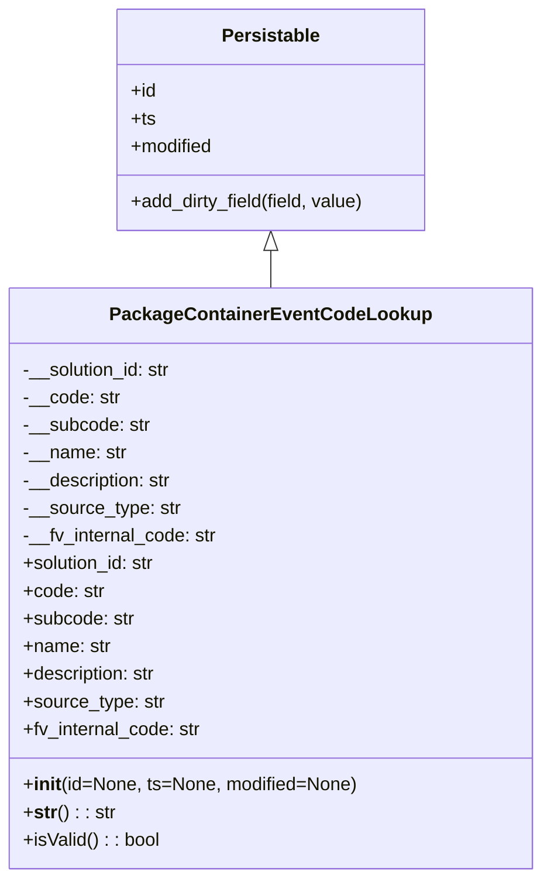

# Diagram: partview_service/partview_service/core/datamodel/PackageContainerEventCodeLookup.py

> Auto-generated by Obscura crawlers

## Mermaid

### SVG

<svg id="container" width="460.6171875" xmlns="http://www.w3.org/2000/svg" class="classDiagram" height="762" viewBox="0 0 460.6171875 762" role="graphics-document document" aria-roledescription="class"><g><defs><marker id="container_class-aggregationStart" class="marker aggregation class" refX="18" refY="7" markerWidth="190" markerHeight="240" orient="auto"><path d="M 18,7 L9,13 L1,7 L9,1 Z"></path></marker></defs><defs><marker id="container_class-aggregationEnd" class="marker aggregation class" refX="1" refY="7" markerWidth="20" markerHeight="28" orient="auto"><path d="M 18,7 L9,13 L1,7 L9,1 Z"></path></marker></defs><defs><marker id="container_class-extensionStart" class="marker extension class" refX="18" refY="7" markerWidth="190" markerHeight="240" orient="auto"><path d="M 1,7 L18,13 V 1 Z"></path></marker></defs><defs><marker id="container_class-extensionEnd" class="marker extension class" refX="1" refY="7" markerWidth="20" markerHeight="28" orient="auto"><path d="M 1,1 V 13 L18,7 Z"></path></marker></defs><defs><marker id="container_class-compositionStart" class="marker composition class" refX="18" refY="7" markerWidth="190" markerHeight="240" orient="auto"><path d="M 18,7 L9,13 L1,7 L9,1 Z"></path></marker></defs><defs><marker id="container_class-compositionEnd" class="marker composition class" refX="1" refY="7" markerWidth="20" markerHeight="28" orient="auto"><path d="M 18,7 L9,13 L1,7 L9,1 Z"></path></marker></defs><defs><marker id="container_class-dependencyStart" class="marker dependency class" refX="6" refY="7" markerWidth="190" markerHeight="240" orient="auto"><path d="M 5,7 L9,13 L1,7 L9,1 Z"></path></marker></defs><defs><marker id="container_class-dependencyEnd" class="marker dependency class" refX="13" refY="7" markerWidth="20" markerHeight="28" orient="auto"><path d="M 18,7 L9,13 L14,7 L9,1 Z"></path></marker></defs><defs><marker id="container_class-lollipopStart" class="marker lollipop class" refX="13" refY="7" markerWidth="190" markerHeight="240" orient="auto"><circle stroke="black" fill="transparent" cx="7" cy="7" r="6"></circle></marker></defs><defs><marker id="container_class-lollipopEnd" class="marker lollipop class" refX="1" refY="7" markerWidth="190" markerHeight="240" orient="auto"><circle stroke="black" fill="transparent" cx="7" cy="7" r="6"></circle></marker></defs><g class="root"><g class="clusters"></g><g class="edgePaths"><path d="M230.309,217.25L230.309,218.542C230.309,219.833,230.309,222.417,230.309,227.875C230.309,233.333,230.309,241.667,230.309,245.833L230.309,250" id="id_Persistable_PackageContainerEventCodeLookup_1" class="edge-thickness-normal edge-pattern-solid relation" style=";;;" data-edge="true" data-et="edge" data-id="id_Persistable_PackageContainerEventCodeLookup_1" data-points="W3sieCI6MjMwLjMwODU5Mzc1LCJ5IjoyMDB9LHsieCI6MjMwLjMwODU5Mzc1LCJ5IjoyMjV9LHsieCI6MjMwLjMwODU5Mzc1LCJ5IjoyNTB9XQ==" marker-start="url(#container_class-extensionStart)"></path></g><g class="edgeLabels"><g class="edgeLabel"><g class="label" data-id="id_Persistable_PackageContainerEventCodeLookup_1" transform="translate(0, 0)"><foreignObject width="0" height="0">

</foreignObject></g></g></g><g class="nodes"><g class="node default" id="classId-Persistable-0" transform="translate(230.30859375, 104)"><g class="basic label-container"><path d="M-135.71484375 -96 L135.71484375 -96 L135.71484375 96 L-135.71484375 96" stroke="none" stroke-width="0" fill="#ECECFF" style=""></path><path d="M-135.71484375 -96 C-35.65327593534501 -96, 64.40829187930999 -96, 135.71484375 -96 M-135.71484375 -96 C-42.982961453728564 -96, 49.74892084254287 -96, 135.71484375 -96 M135.71484375 -96 C135.71484375 -51.29553597239567, 135.71484375 -6.591071944791338, 135.71484375 96 M135.71484375 -96 C135.71484375 -24.21210733182056, 135.71484375 47.57578533635888, 135.71484375 96 M135.71484375 96 C30.046286999424396 96, -75.62226975115121 96, -135.71484375 96 M135.71484375 96 C80.28937431109404 96, 24.86390487218806 96, -135.71484375 96 M-135.71484375 96 C-135.71484375 56.948359694040164, -135.71484375 17.896719388080328, -135.71484375 -96 M-135.71484375 96 C-135.71484375 32.67412420284921, -135.71484375 -30.651751594301587, -135.71484375 -96" stroke="#9370DB" stroke-width="1.3" fill="none" stroke-dasharray="0 0" style=""></path></g><g class="annotation-group text" transform="translate(0, -72)"></g><g class="label-group text" transform="translate(-40.9765625, -72)"><g class="label" style="font-weight: bolder" transform="translate(0,-12)"><foreignObject width="81.953125" height="24">

Persistable

</foreignObject></g></g><g class="members-group text" transform="translate(-123.71484375, -24)"><g class="label" style="" transform="translate(0,-12)"><foreignObject width="22.078125" height="24">

+id

</foreignObject></g><g class="label" style="" transform="translate(0,12)"><foreignObject width="21.15625" height="24">

+ts

</foreignObject></g><g class="label" style="" transform="translate(0,36)"><foreignObject width="72.609375" height="24">

+modified

</foreignObject></g></g><g class="methods-group text" transform="translate(-123.71484375, 72)"><g class="label" style="" transform="translate(0,-12)"><foreignObject width="206.453125" height="24">

+add_dirty_field(field, value)

</foreignObject></g></g><g class="divider" style=""><path d="M-135.71484375 -48 C-65.74497186580771 -48, 4.224900018384574 -48, 135.71484375 -48 M-135.71484375 -48 C-45.821266920638394 -48, 44.07230990872321 -48, 135.71484375 -48" stroke="#9370DB" stroke-width="1.3" fill="none" stroke-dasharray="0 0" style=""></path></g><g class="divider" style=""><path d="M-135.71484375 48 C-32.43077136177874 48, 70.85330102644252 48, 135.71484375 48 M-135.71484375 48 C-65.55057124202452 48, 4.613701265950965 48, 135.71484375 48" stroke="#9370DB" stroke-width="1.3" fill="none" stroke-dasharray="0 0" style=""></path></g></g><g class="node default" id="classId-PackageContainerEventCodeLookup-1" transform="translate(230.30859375, 502)"><g class="basic label-container"><path d="M-222.30859375 -252 L222.30859375 -252 L222.30859375 252 L-222.30859375 252" stroke="none" stroke-width="0" fill="#ECECFF" style=""></path><path d="M-222.30859375 -252 C-104.77317051308064 -252, 12.762252723838714 -252, 222.30859375 -252 M-222.30859375 -252 C-130.63912180212594 -252, -38.969649854251855 -252, 222.30859375 -252 M222.30859375 -252 C222.30859375 -134.04117017805805, 222.30859375 -16.082340356116134, 222.30859375 252 M222.30859375 -252 C222.30859375 -66.20390629724506, 222.30859375 119.59218740550989, 222.30859375 252 M222.30859375 252 C72.15775850145769 252, -77.99307674708461 252, -222.30859375 252 M222.30859375 252 C56.01647211801287 252, -110.27564951397426 252, -222.30859375 252 M-222.30859375 252 C-222.30859375 145.3327179633947, -222.30859375 38.665435926789456, -222.30859375 -252 M-222.30859375 252 C-222.30859375 80.30931745768609, -222.30859375 -91.38136508462782, -222.30859375 -252" stroke="#9370DB" stroke-width="1.3" fill="none" stroke-dasharray="0 0" style=""></path></g><g class="annotation-group text" transform="translate(0, -228)"></g><g class="label-group text" transform="translate(-130.9296875, -228)"><g class="label" style="font-weight: bolder" transform="translate(0,-12)"><foreignObject width="261.859375" height="24">

PackageContainerEventCodeLookup

</foreignObject></g></g><g class="members-group text" transform="translate(-210.30859375, -180)"><g class="label" style="" transform="translate(0,-12)"><foreignObject width="131.390625" height="24">

-__solution_id: str

</foreignObject></g><g class="label" style="" transform="translate(0,12)"><foreignObject width="83.796875" height="24">

-__code: str

</foreignObject></g><g class="label" style="" transform="translate(0,36)"><foreignObject width="110.40625" height="24">

-__subcode: str

</foreignObject></g><g class="label" style="" transform="translate(0,60)"><foreignObject width="89.671875" height="24">

-__name: str

</foreignObject></g><g class="label" style="" transform="translate(0,84)"><foreignObject width="131.453125" height="24">

-__description: str

</foreignObject></g><g class="label" style="" transform="translate(0,108)"><foreignObject width="136.5" height="24">

-__source_type: str

</foreignObject></g><g class="label" style="" transform="translate(0,132)"><foreignObject width="169.796875" height="24">

-__fv_internal_code: str

</foreignObject></g><g class="label" style="" transform="translate(0,156)"><foreignObject width="117.71875" height="24">

+solution_id: str

</foreignObject></g><g class="label" style="" transform="translate(0,180)"><foreignObject width="70.453125" height="24">

+code: str

</foreignObject></g><g class="label" style="" transform="translate(0,204)"><foreignObject width="96.75" height="24">

+subcode: str

</foreignObject></g><g class="label" style="" transform="translate(0,228)"><foreignObject width="76.015625" height="24">

+name: str

</foreignObject></g><g class="label" style="" transform="translate(0,252)"><foreignObject width="118.109375" height="24">

+description: str

</foreignObject></g><g class="label" style="" transform="translate(0,276)"><foreignObject width="122.84375" height="24">

+source_type: str

</foreignObject></g><g class="label" style="" transform="translate(0,300)"><foreignObject width="156.21875" height="24">

+fv_internal_code: str

</foreignObject></g></g><g class="methods-group text" transform="translate(-210.30859375, 180)"><g class="label" style="" transform="translate(0,-12)"><foreignObject width="289.6875" height="24">

+<strong>init</strong>(id=None, ts=None, modified=None)

</foreignObject></g><g class="label" style="" transform="translate(0,12)"><foreignObject width="78.515625" height="24">

+<strong>str</strong>() : : str

</foreignObject></g><g class="label" style="" transform="translate(0,36)"><foreignObject width="119.1875" height="24">

+isValid() : : bool

</foreignObject></g></g><g class="divider" style=""><path d="M-222.30859375 -204 C-110.50613133622412 -204, 1.2963310775517698 -204, 222.30859375 -204 M-222.30859375 -204 C-90.10557875997927 -204, 42.09743623004147 -204, 222.30859375 -204" stroke="#9370DB" stroke-width="1.3" fill="none" stroke-dasharray="0 0" style=""></path></g><g class="divider" style=""><path d="M-222.30859375 156 C-69.80844108279672 156, 82.69171158440656 156, 222.30859375 156 M-222.30859375 156 C-123.12653149602039 156, -23.944469242040782 156, 222.30859375 156" stroke="#9370DB" stroke-width="1.3" fill="none" stroke-dasharray="0 0" style=""></path></g></g></g></g></g></svg>
