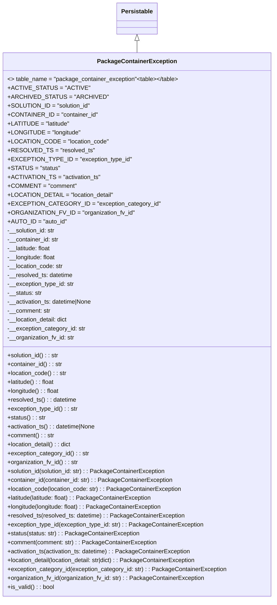

# Diagram: partview_service/partview_service/core/datamodel/PackageContainerException.py

> Auto-generated by Obscura crawlers

## Mermaid

### SVG

<svg id="container" width="731.8671875" xmlns="http://www.w3.org/2000/svg" class="classDiagram" height="1614" viewBox="0 0 731.8671875 1614" role="graphics-document document" aria-roledescription="class"><g><defs><marker id="container_class-aggregationStart" class="marker aggregation class" refX="18" refY="7" markerWidth="190" markerHeight="240" orient="auto"><path d="M 18,7 L9,13 L1,7 L9,1 Z"></path></marker></defs><defs><marker id="container_class-aggregationEnd" class="marker aggregation class" refX="1" refY="7" markerWidth="20" markerHeight="28" orient="auto"><path d="M 18,7 L9,13 L1,7 L9,1 Z"></path></marker></defs><defs><marker id="container_class-extensionStart" class="marker extension class" refX="18" refY="7" markerWidth="190" markerHeight="240" orient="auto"><path d="M 1,7 L18,13 V 1 Z"></path></marker></defs><defs><marker id="container_class-extensionEnd" class="marker extension class" refX="1" refY="7" markerWidth="20" markerHeight="28" orient="auto"><path d="M 1,1 V 13 L18,7 Z"></path></marker></defs><defs><marker id="container_class-compositionStart" class="marker composition class" refX="18" refY="7" markerWidth="190" markerHeight="240" orient="auto"><path d="M 18,7 L9,13 L1,7 L9,1 Z"></path></marker></defs><defs><marker id="container_class-compositionEnd" class="marker composition class" refX="1" refY="7" markerWidth="20" markerHeight="28" orient="auto"><path d="M 18,7 L9,13 L1,7 L9,1 Z"></path></marker></defs><defs><marker id="container_class-dependencyStart" class="marker dependency class" refX="6" refY="7" markerWidth="190" markerHeight="240" orient="auto"><path d="M 5,7 L9,13 L1,7 L9,1 Z"></path></marker></defs><defs><marker id="container_class-dependencyEnd" class="marker dependency class" refX="13" refY="7" markerWidth="20" markerHeight="28" orient="auto"><path d="M 18,7 L9,13 L14,7 L9,1 Z"></path></marker></defs><defs><marker id="container_class-lollipopStart" class="marker lollipop class" refX="13" refY="7" markerWidth="190" markerHeight="240" orient="auto"><circle stroke="black" fill="transparent" cx="7" cy="7" r="6"></circle></marker></defs><defs><marker id="container_class-lollipopEnd" class="marker lollipop class" refX="1" refY="7" markerWidth="190" markerHeight="240" orient="auto"><circle stroke="black" fill="transparent" cx="7" cy="7" r="6"></circle></marker></defs><g class="root"><g class="clusters"></g><g class="edgePaths"><path d="M365.934,109.25L365.934,110.542C365.934,111.833,365.934,114.417,365.934,119.875C365.934,125.333,365.934,133.667,365.934,137.833L365.934,142" id="id_Persistable_PackageContainerException_1" class="edge-thickness-normal edge-pattern-solid relation" style=";;;" data-edge="true" data-et="edge" data-id="id_Persistable_PackageContainerException_1" data-points="W3sieCI6MzY1LjkzMzU5Mzc1LCJ5Ijo5Mn0seyJ4IjozNjUuOTMzNTkzNzUsInkiOjExN30seyJ4IjozNjUuOTMzNTkzNzUsInkiOjE0Mn1d" marker-start="url(#container_class-extensionStart)"></path></g><g class="edgeLabels"><g class="edgeLabel"><g class="label" data-id="id_Persistable_PackageContainerException_1" transform="translate(0, 0)"><foreignObject width="0" height="0">

</foreignObject></g></g></g><g class="nodes"><g class="node default" id="classId-Persistable-0" transform="translate(365.93359375, 50)"><g class="basic label-container"><path d="M-52.9765625 -42 L52.9765625 -42 L52.9765625 42 L-52.9765625 42" stroke="none" stroke-width="0" fill="#ECECFF" style=""></path><path d="M-52.9765625 -42 C-13.80158005851213 -42, 25.37340238297574 -42, 52.9765625 -42 M-52.9765625 -42 C-22.344764571707902 -42, 8.287033356584196 -42, 52.9765625 -42 M52.9765625 -42 C52.9765625 -13.878560594380353, 52.9765625 14.242878811239294, 52.9765625 42 M52.9765625 -42 C52.9765625 -8.556196405886112, 52.9765625 24.887607188227776, 52.9765625 42 M52.9765625 42 C16.075449480021113 42, -20.825663539957773 42, -52.9765625 42 M52.9765625 42 C21.17624453711308 42, -10.624073425773837 42, -52.9765625 42 M-52.9765625 42 C-52.9765625 14.438827632413648, -52.9765625 -13.122344735172703, -52.9765625 -42 M-52.9765625 42 C-52.9765625 13.994219376285734, -52.9765625 -14.011561247428531, -52.9765625 -42" stroke="#9370DB" stroke-width="1.3" fill="none" stroke-dasharray="0 0" style=""></path></g><g class="annotation-group text" transform="translate(0, -18)"></g><g class="label-group text" transform="translate(-40.9765625, -18)"><g class="label" style="font-weight: bolder" transform="translate(0,-12)"><foreignObject width="81.953125" height="24">

Persistable

</foreignObject></g></g><g class="members-group text" transform="translate(-40.9765625, 30)"></g><g class="methods-group text" transform="translate(-40.9765625, 60)"></g><g class="divider" style=""><path d="M-52.9765625 6 C-22.241586289591883 6, 8.493389920816234 6, 52.9765625 6 M-52.9765625 6 C-23.179359467096273 6, 6.617843565807455 6, 52.9765625 6" stroke="#9370DB" stroke-width="1.3" fill="none" stroke-dasharray="0 0" style=""></path></g><g class="divider" style=""><path d="M-52.9765625 24 C-18.501068427133013 24, 15.974425645733973 24, 52.9765625 24 M-52.9765625 24 C-27.522872443028486 24, -2.0691823860569727 24, 52.9765625 24" stroke="#9370DB" stroke-width="1.3" fill="none" stroke-dasharray="0 0" style=""></path></g></g><g class="node default" id="classId-PackageContainerException-1" transform="translate(365.93359375, 874)"><g class="basic label-container"><path d="M-357.93359375 -732 L357.93359375 -732 L357.93359375 732 L-357.93359375 732" stroke="none" stroke-width="0" fill="#ECECFF" style=""></path><path d="M-357.93359375 -732 C-96.65008246735914 -732, 164.63342881528172 -732, 357.93359375 -732 M-357.93359375 -732 C-101.40245653391116 -732, 155.12868068217767 -732, 357.93359375 -732 M357.93359375 -732 C357.93359375 -195.18675841569132, 357.93359375 341.62648316861737, 357.93359375 732 M357.93359375 -732 C357.93359375 -389.17977669000845, 357.93359375 -46.359553380016905, 357.93359375 732 M357.93359375 732 C98.50044515197243 732, -160.93270344605514 732, -357.93359375 732 M357.93359375 732 C156.73137469884173 732, -44.47084435231653 732, -357.93359375 732 M-357.93359375 732 C-357.93359375 374.5634351149662, -357.93359375 17.126870229932365, -357.93359375 -732 M-357.93359375 732 C-357.93359375 405.56954592754647, -357.93359375 79.13909185509294, -357.93359375 -732" stroke="#9370DB" stroke-width="1.3" fill="none" stroke-dasharray="0 0" style=""></path></g><g class="annotation-group text" transform="translate(0, -708)"></g><g class="label-group text" transform="translate(-101.1484375, -708)"><g class="label" style="font-weight: bolder" transform="translate(0,-12)"><foreignObject width="202.296875" height="24">

PackageContainerException

</foreignObject></g></g><g class="members-group text" transform="translate(-345.93359375, -660)"><g class="label" style="" transform="translate(0,-12)"><foreignObject width="462.609375" height="24">

&lt;&gt; table_name = "package_container_exception"&lt;table&gt;&lt;/table&gt;

</foreignObject></g><g class="label" style="" transform="translate(0,12)"><foreignObject width="192.796875" height="24">

+ACTIVE_STATUS = "ACTIVE"

</foreignObject></g><g class="label" style="" transform="translate(0,36)"><foreignObject width="237.6875" height="24">

+ARCHIVED_STATUS = "ARCHIVED"

</foreignObject></g><g class="label" style="" transform="translate(0,60)"><foreignObject width="214.953125" height="24">

+SOLUTION_ID = "solution_id"

</foreignObject></g><g class="label" style="" transform="translate(0,84)"><foreignObject width="231.90625" height="24">

+CONTAINER_ID = "container_id"

</foreignObject></g><g class="label" style="" transform="translate(0,108)"><foreignObject width="161.109375" height="24">

+LATITUDE = "latitude"

</foreignObject></g><g class="label" style="" transform="translate(0,132)"><foreignObject width="188.40625" height="24">

+LONGITUDE = "longitude"

</foreignObject></g><g class="label" style="" transform="translate(0,156)"><foreignObject width="256.09375" height="24">

+LOCATION_CODE = "location_code"

</foreignObject></g><g class="label" style="" transform="translate(0,180)"><foreignObject width="216.015625" height="24">

+RESOLVED_TS = "resolved_ts"

</foreignObject></g><g class="label" style="" transform="translate(0,204)"><foreignObject width="313.875" height="24">

+EXCEPTION_TYPE_ID = "exception_type_id"

</foreignObject></g><g class="label" style="" transform="translate(0,228)"><foreignObject width="132.28125" height="24">

+STATUS = "status"

</foreignObject></g><g class="label" style="" transform="translate(0,252)"><foreignObject width="236.84375" height="24">

+ACTIVATION_TS = "activation_ts"

</foreignObject></g><g class="label" style="" transform="translate(0,276)"><foreignObject width="177.0625" height="24">

+COMMENT = "comment"

</foreignObject></g><g class="label" style="" transform="translate(0,300)"><foreignObject width="273.15625" height="24">

+LOCATION_DETAIL = "location_detail"

</foreignObject></g><g class="label" style="" transform="translate(0,324)"><foreignObject width="380.984375" height="24">

+EXCEPTION_CATEGORY_ID = "exception_category_id"

</foreignObject></g><g class="label" style="" transform="translate(0,348)"><foreignObject width="325.4375" height="24">

+ORGANIZATION_FV_ID = "organization_fv_id"

</foreignObject></g><g class="label" style="" transform="translate(0,372)"><foreignObject width="152.90625" height="24">

+AUTO_ID = "auto_id"

</foreignObject></g><g class="label" style="" transform="translate(0,396)"><foreignObject width="131.390625" height="24">

-__solution_id: str

</foreignObject></g><g class="label" style="" transform="translate(0,420)"><foreignObject width="139.15625" height="24">

-__container_id: str

</foreignObject></g><g class="label" style="" transform="translate(0,444)"><foreignObject width="119.609375" height="24">

-__latitude: float

</foreignObject></g><g class="label" style="" transform="translate(0,468)"><foreignObject width="132.171875" height="24">

-__longitude: float

</foreignObject></g><g class="label" style="" transform="translate(0,492)"><foreignObject width="151.109375" height="24">

-__location_code: str

</foreignObject></g><g class="label" style="" transform="translate(0,516)"><foreignObject width="178.09375" height="24">

-__resolved_ts: datetime

</foreignObject></g><g class="label" style="" transform="translate(0,540)"><foreignObject width="181.46875" height="24">

-__exception_type_id: str

</foreignObject></g><g class="label" style="" transform="translate(0,564)"><foreignObject width="93.5625" height="24">

-__status: str

</foreignObject></g><g class="label" style="" transform="translate(0,588)"><foreignObject width="232.703125" height="24">

-__activation_ts: datetime|None

</foreignObject></g><g class="label" style="" transform="translate(0,612)"><foreignObject width="116.875" height="24">

-__comment: str

</foreignObject></g><g class="label" style="" transform="translate(0,636)"><foreignObject width="166.25" height="24">

-__location_detail: dict

</foreignObject></g><g class="label" style="" transform="translate(0,660)"><foreignObject width="211.421875" height="24">

-__exception_category_id: str

</foreignObject></g><g class="label" style="" transform="translate(0,684)"><foreignObject width="182.34375" height="24">

-__organization_fv_id: str

</foreignObject></g></g><g class="methods-group text" transform="translate(-345.93359375, 84)"><g class="label" style="" transform="translate(0,-12)"><foreignObject width="140.40625" height="24">

+solution_id() : : str

</foreignObject></g><g class="label" style="" transform="translate(0,12)"><foreignObject width="148.5" height="24">

+container_id() : : str

</foreignObject></g><g class="label" style="" transform="translate(0,36)"><foreignObject width="160.296875" height="24">

+location_code() : : str

</foreignObject></g><g class="label" style="" transform="translate(0,60)"><foreignObject width="128.796875" height="24">

+latitude() : : float

</foreignObject></g><g class="label" style="" transform="translate(0,84)"><foreignObject width="141.359375" height="24">

+longitude() : : float

</foreignObject></g><g class="label" style="" transform="translate(0,108)"><foreignObject width="187.109375" height="24">

+resolved_ts() : : datetime

</foreignObject></g><g class="label" style="" transform="translate(0,132)"><foreignObject width="190.8125" height="24">

+exception_type_id() : : str

</foreignObject></g><g class="label" style="" transform="translate(0,156)"><foreignObject width="102.578125" height="24">

+status() : : str

</foreignObject></g><g class="label" style="" transform="translate(0,180)"><foreignObject width="241.796875" height="24">

+activation_ts() : : datetime|None

</foreignObject></g><g class="label" style="" transform="translate(0,204)"><foreignObject width="126.15625" height="24">

+comment() : : str

</foreignObject></g><g class="label" style="" transform="translate(0,228)"><foreignObject width="175.265625" height="24">

+location_detail() : : dict

</foreignObject></g><g class="label" style="" transform="translate(0,252)"><foreignObject width="220.765625" height="24">

+exception_category_id() : : str

</foreignObject></g><g class="label" style="" transform="translate(0,276)"><foreignObject width="191.6875" height="24">

+organization_fv_id() : : str

</foreignObject></g><g class="label" style="" transform="translate(0,300)"><foreignObject width="430.015625" height="24">

+solution_id(solution_id: str) : : PackageContainerException

</foreignObject></g><g class="label" style="" transform="translate(0,324)"><foreignObject width="446.203125" height="24">

+container_id(container_id: str) : : PackageContainerException

</foreignObject></g><g class="label" style="" transform="translate(0,348)"><foreignObject width="469.78125" height="24">

+location_code(location_code: str) : : PackageContainerException

</foreignObject></g><g class="label" style="" transform="translate(0,372)"><foreignObject width="393.140625" height="24">

+latitude(latitude: float) : : PackageContainerException

</foreignObject></g><g class="label" style="" transform="translate(0,396)"><foreignObject width="418.265625" height="24">

+longitude(longitude: float) : : PackageContainerException

</foreignObject></g><g class="label" style="" transform="translate(0,420)"><foreignObject width="477.59375" height="24">

+resolved_ts(resolved_ts: datetime) : : PackageContainerException

</foreignObject></g><g class="label" style="" transform="translate(0,444)"><foreignObject width="530.8125" height="24">

+exception_type_id(exception_type_id: str) : : PackageContainerException

</foreignObject></g><g class="label" style="" transform="translate(0,468)"><foreignObject width="354.359375" height="24">

+status(status: str) : : PackageContainerException

</foreignObject></g><g class="label" style="" transform="translate(0,492)"><foreignObject width="401.5625" height="24">

+comment(comment: str) : : PackageContainerException

</foreignObject></g><g class="label" style="" transform="translate(0,516)"><foreignObject width="497.578125" height="24">

+activation_ts(activation_ts: datetime) : : PackageContainerException

</foreignObject></g><g class="label" style="" transform="translate(0,540)"><foreignObject width="517.6875" height="24">

+location_detail(location_detail: str|dict) : : PackageContainerException

</foreignObject></g><g class="label" style="" transform="translate(0,564)"><foreignObject width="590.71875" height="24">

+exception_category_id(exception_category_id: str) : : PackageContainerException

</foreignObject></g><g class="label" style="" transform="translate(0,588)"><foreignObject width="532.5625" height="24">

+organization_fv_id(organization_fv_id: str) : : PackageContainerException

</foreignObject></g><g class="label" style="" transform="translate(0,612)"><foreignObject width="126.078125" height="24">

+is_valid() : : bool

</foreignObject></g></g><g class="divider" style=""><path d="M-357.93359375 -684 C-141.26330058326639 -684, 75.40699258346723 -684, 357.93359375 -684 M-357.93359375 -684 C-94.41119680890631 -684, 169.11120013218738 -684, 357.93359375 -684" stroke="#9370DB" stroke-width="1.3" fill="none" stroke-dasharray="0 0" style=""></path></g><g class="divider" style=""><path d="M-357.93359375 60 C-213.14714723760397 60, -68.36070072520795 60, 357.93359375 60 M-357.93359375 60 C-179.81544587055865 60, -1.6972979911172956 60, 357.93359375 60" stroke="#9370DB" stroke-width="1.3" fill="none" stroke-dasharray="0 0" style=""></path></g></g></g></g></g></svg>
