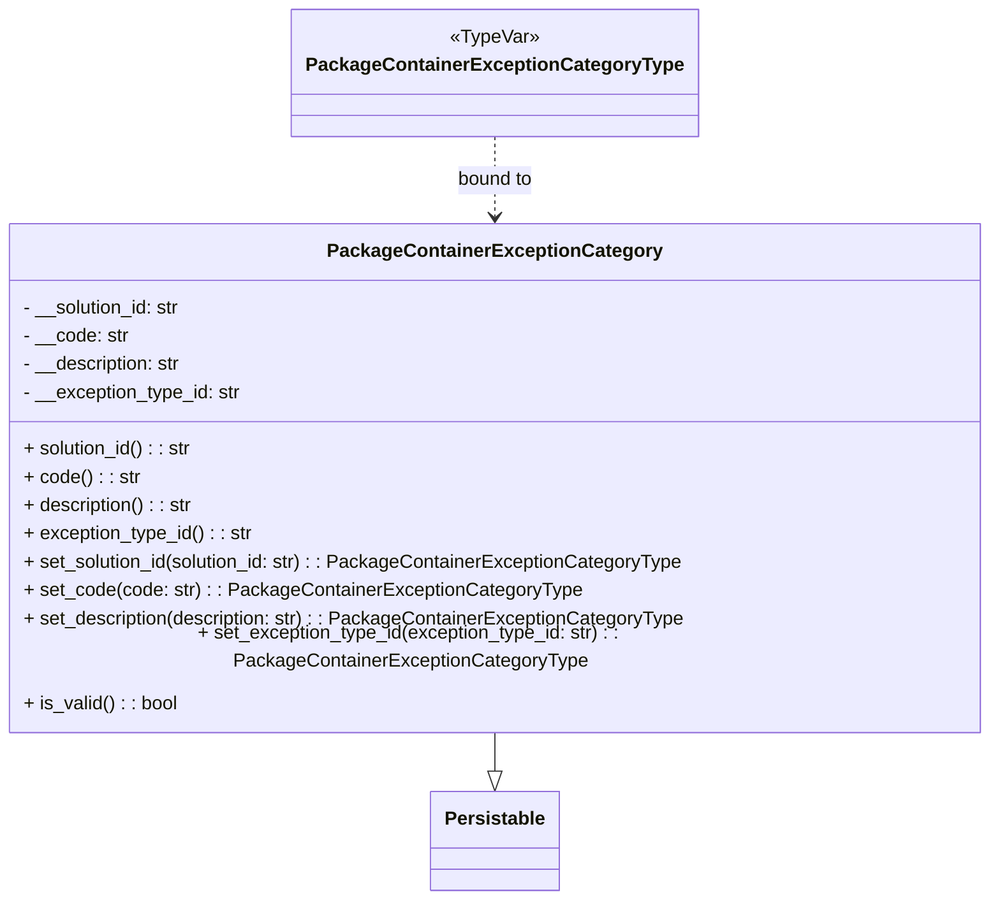

# Diagram: partview_service/partview_service/core/datamodel/PackageContainerExceptionCategory.py

> Auto-generated by Obscura crawlers

## Mermaid

```mermaid
classDiagram
class Persistable

class PackageContainerExceptionCategory {
  - __solution_id: str
  - __code: str
  - __description: str
  - __exception_type_id: str
  + solution_id(): str
  + code(): str
  + description(): str
  + exception_type_id(): str
  + set_solution_id(solution_id: str): PackageContainerExceptionCategoryType
  + set_code(code: str): PackageContainerExceptionCategoryType
  + set_description(description: str): PackageContainerExceptionCategoryType
  + set_exception_type_id(exception_type_id: str): PackageContainerExceptionCategoryType
  + is_valid(): bool
}

PackageContainerExceptionCategory --|> Persistable

class PackageContainerExceptionCategoryType <<TypeVar>>
PackageContainerExceptionCategoryType ..> PackageContainerExceptionCategory : bound to
```

> SVG rendering failed for this diagram.
