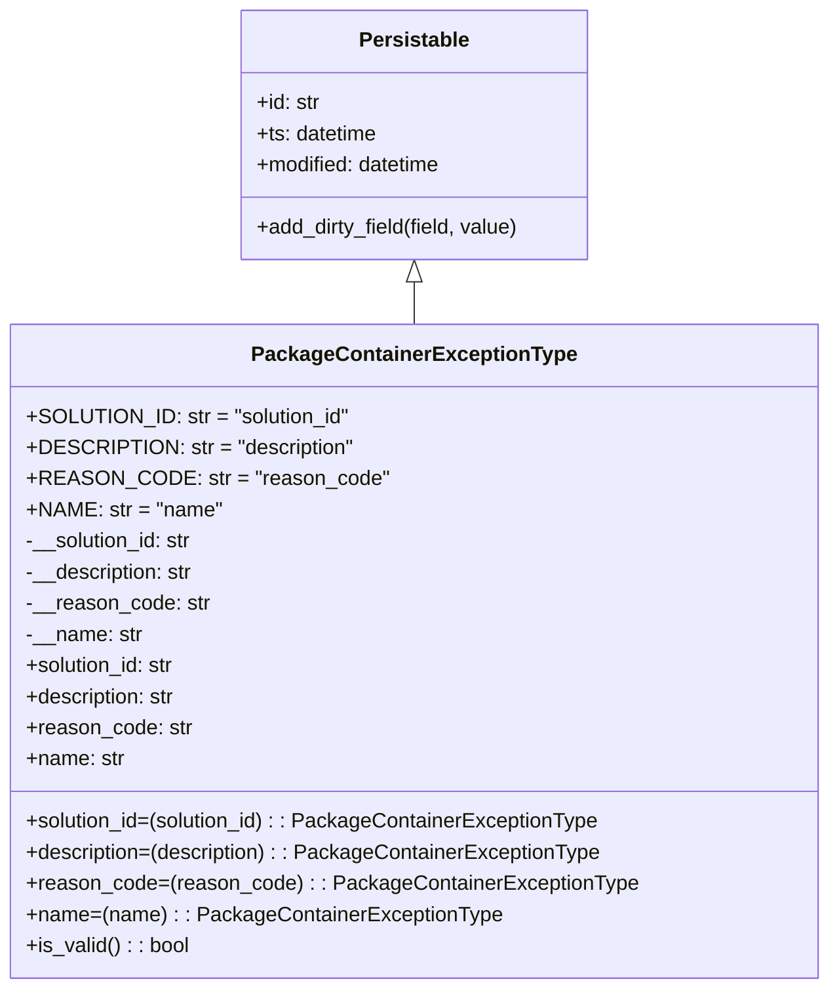

# Diagram: partview_service/partview_service/core/datamodel/PackageContainerExceptionType.py

> Auto-generated by Obscura crawlers

## Mermaid

### SVG

<svg id="container" width="622.171875" xmlns="http://www.w3.org/2000/svg" class="classDiagram" height="762" viewBox="0 0 622.171875 762" role="graphics-document document" aria-roledescription="class"><g><defs><marker id="container_class-aggregationStart" class="marker aggregation class" refX="18" refY="7" markerWidth="190" markerHeight="240" orient="auto"><path d="M 18,7 L9,13 L1,7 L9,1 Z"></path></marker></defs><defs><marker id="container_class-aggregationEnd" class="marker aggregation class" refX="1" refY="7" markerWidth="20" markerHeight="28" orient="auto"><path d="M 18,7 L9,13 L1,7 L9,1 Z"></path></marker></defs><defs><marker id="container_class-extensionStart" class="marker extension class" refX="18" refY="7" markerWidth="190" markerHeight="240" orient="auto"><path d="M 1,7 L18,13 V 1 Z"></path></marker></defs><defs><marker id="container_class-extensionEnd" class="marker extension class" refX="1" refY="7" markerWidth="20" markerHeight="28" orient="auto"><path d="M 1,1 V 13 L18,7 Z"></path></marker></defs><defs><marker id="container_class-compositionStart" class="marker composition class" refX="18" refY="7" markerWidth="190" markerHeight="240" orient="auto"><path d="M 18,7 L9,13 L1,7 L9,1 Z"></path></marker></defs><defs><marker id="container_class-compositionEnd" class="marker composition class" refX="1" refY="7" markerWidth="20" markerHeight="28" orient="auto"><path d="M 18,7 L9,13 L1,7 L9,1 Z"></path></marker></defs><defs><marker id="container_class-dependencyStart" class="marker dependency class" refX="6" refY="7" markerWidth="190" markerHeight="240" orient="auto"><path d="M 5,7 L9,13 L1,7 L9,1 Z"></path></marker></defs><defs><marker id="container_class-dependencyEnd" class="marker dependency class" refX="13" refY="7" markerWidth="20" markerHeight="28" orient="auto"><path d="M 18,7 L9,13 L14,7 L9,1 Z"></path></marker></defs><defs><marker id="container_class-lollipopStart" class="marker lollipop class" refX="13" refY="7" markerWidth="190" markerHeight="240" orient="auto"><circle stroke="black" fill="transparent" cx="7" cy="7" r="6"></circle></marker></defs><defs><marker id="container_class-lollipopEnd" class="marker lollipop class" refX="1" refY="7" markerWidth="190" markerHeight="240" orient="auto"><circle stroke="black" fill="transparent" cx="7" cy="7" r="6"></circle></marker></defs><g class="root"><g class="clusters"></g><g class="edgePaths"><path d="M311.086,217.25L311.086,218.542C311.086,219.833,311.086,222.417,311.086,227.875C311.086,233.333,311.086,241.667,311.086,245.833L311.086,250" id="id_Persistable_PackageContainerExceptionType_1" class="edge-thickness-normal edge-pattern-solid relation" style=";;;" data-edge="true" data-et="edge" data-id="id_Persistable_PackageContainerExceptionType_1" data-points="W3sieCI6MzExLjA4NTkzNzUsInkiOjIwMH0seyJ4IjozMTEuMDg1OTM3NSwieSI6MjI1fSx7IngiOjMxMS4wODU5Mzc1LCJ5IjoyNTB9XQ==" marker-start="url(#container_class-extensionStart)"></path></g><g class="edgeLabels"><g class="edgeLabel"><g class="label" data-id="id_Persistable_PackageContainerExceptionType_1" transform="translate(0, 0)"><foreignObject width="0" height="0">

</foreignObject></g></g></g><g class="nodes"><g class="node default" id="classId-Persistable-0" transform="translate(311.0859375, 104)"><g class="basic label-container"><path d="M-135.71484375 -96 L135.71484375 -96 L135.71484375 96 L-135.71484375 96" stroke="none" stroke-width="0" fill="#ECECFF" style=""></path><path d="M-135.71484375 -96 C-76.98688367857736 -96, -18.2589236071547 -96, 135.71484375 -96 M-135.71484375 -96 C-79.35262112553914 -96, -22.990398501078275 -96, 135.71484375 -96 M135.71484375 -96 C135.71484375 -20.9298446288673, 135.71484375 54.1403107422654, 135.71484375 96 M135.71484375 -96 C135.71484375 -49.548815857731185, 135.71484375 -3.09763171546237, 135.71484375 96 M135.71484375 96 C39.23341232973873 96, -57.24801909052255 96, -135.71484375 96 M135.71484375 96 C54.58008088976197 96, -26.554681970476054 96, -135.71484375 96 M-135.71484375 96 C-135.71484375 52.38983495450468, -135.71484375 8.779669909009357, -135.71484375 -96 M-135.71484375 96 C-135.71484375 54.7129668839358, -135.71484375 13.425933767871598, -135.71484375 -96" stroke="#9370DB" stroke-width="1.3" fill="none" stroke-dasharray="0 0" style=""></path></g><g class="annotation-group text" transform="translate(0, -72)"></g><g class="label-group text" transform="translate(-40.9765625, -72)"><g class="label" style="font-weight: bolder" transform="translate(0,-12)"><foreignObject width="81.953125" height="24">

Persistable

</foreignObject></g></g><g class="members-group text" transform="translate(-123.71484375, -24)"><g class="label" style="" transform="translate(0,-12)"><foreignObject width="49.578125" height="24">

+id: str

</foreignObject></g><g class="label" style="" transform="translate(0,12)"><foreignObject width="94.484375" height="24">

+ts: datetime

</foreignObject></g><g class="label" style="" transform="translate(0,36)"><foreignObject width="145.9375" height="24">

+modified: datetime

</foreignObject></g></g><g class="methods-group text" transform="translate(-123.71484375, 72)"><g class="label" style="" transform="translate(0,-12)"><foreignObject width="206.453125" height="24">

+add_dirty_field(field, value)

</foreignObject></g></g><g class="divider" style=""><path d="M-135.71484375 -48 C-40.45975881133104 -48, 54.795326127337916 -48, 135.71484375 -48 M-135.71484375 -48 C-51.96268653203194 -48, 31.789470685936124 -48, 135.71484375 -48" stroke="#9370DB" stroke-width="1.3" fill="none" stroke-dasharray="0 0" style=""></path></g><g class="divider" style=""><path d="M-135.71484375 48 C-52.66454590977867 48, 30.385751930442666 48, 135.71484375 48 M-135.71484375 48 C-46.23840477007457 48, 43.238034209850866 48, 135.71484375 48" stroke="#9370DB" stroke-width="1.3" fill="none" stroke-dasharray="0 0" style=""></path></g></g><g class="node default" id="classId-PackageContainerExceptionType-1" transform="translate(311.0859375, 502)"><g class="basic label-container"><path d="M-303.0859375 -252 L303.0859375 -252 L303.0859375 252 L-303.0859375 252" stroke="none" stroke-width="0" fill="#ECECFF" style=""></path><path d="M-303.0859375 -252 C-137.12871115339937 -252, 28.82851519320127 -252, 303.0859375 -252 M-303.0859375 -252 C-71.96583051639868 -252, 159.15427646720264 -252, 303.0859375 -252 M303.0859375 -252 C303.0859375 -90.3641459317694, 303.0859375 71.2717081364612, 303.0859375 252 M303.0859375 -252 C303.0859375 -133.87521820326947, 303.0859375 -15.750436406538967, 303.0859375 252 M303.0859375 252 C143.52088449720375 252, -16.044168505592495 252, -303.0859375 252 M303.0859375 252 C155.87024299790164 252, 8.654548495803283 252, -303.0859375 252 M-303.0859375 252 C-303.0859375 55.67844874807162, -303.0859375 -140.64310250385677, -303.0859375 -252 M-303.0859375 252 C-303.0859375 114.03597269953474, -303.0859375 -23.928054600930523, -303.0859375 -252" stroke="#9370DB" stroke-width="1.3" fill="none" stroke-dasharray="0 0" style=""></path></g><g class="annotation-group text" transform="translate(0, -228)"></g><g class="label-group text" transform="translate(-118.484375, -228)"><g class="label" style="font-weight: bolder" transform="translate(0,-12)"><foreignObject width="236.96875" height="24">

PackageContainerExceptionType

</foreignObject></g></g><g class="members-group text" transform="translate(-291.0859375, -180)"><g class="label" style="" transform="translate(0,-12)"><foreignObject width="242.453125" height="24">

+SOLUTION_ID: str = "solution_id"

</foreignObject></g><g class="label" style="" transform="translate(0,12)"><foreignObject width="241.703125" height="24">

+DESCRIPTION: str = "description"

</foreignObject></g><g class="label" style="" transform="translate(0,36)"><foreignObject width="260.921875" height="24">

+REASON_CODE: str = "reason_code"

</foreignObject></g><g class="label" style="" transform="translate(0,60)"><foreignObject width="146.203125" height="24">

+NAME: str = "name"

</foreignObject></g><g class="label" style="" transform="translate(0,84)"><foreignObject width="131.390625" height="24">

-__solution_id: str

</foreignObject></g><g class="label" style="" transform="translate(0,108)"><foreignObject width="131.453125" height="24">

-__description: str

</foreignObject></g><g class="label" style="" transform="translate(0,132)"><foreignObject width="141.109375" height="24">

-__reason_code: str

</foreignObject></g><g class="label" style="" transform="translate(0,156)"><foreignObject width="89.671875" height="24">

-__name: str

</foreignObject></g><g class="label" style="" transform="translate(0,180)"><foreignObject width="117.71875" height="24">

+solution_id: str

</foreignObject></g><g class="label" style="" transform="translate(0,204)"><foreignObject width="118.109375" height="24">

+description: str

</foreignObject></g><g class="label" style="" transform="translate(0,228)"><foreignObject width="127.453125" height="24">

+reason_code: str

</foreignObject></g><g class="label" style="" transform="translate(0,252)"><foreignObject width="76.015625" height="24">

+name: str

</foreignObject></g></g><g class="methods-group text" transform="translate(-291.0859375, 132)"><g class="label" style="" transform="translate(0,-12)"><foreignObject width="444.234375" height="24">

+solution_id=(solution_id) : : PackageContainerExceptionType

</foreignObject></g><g class="label" style="" transform="translate(0,12)"><foreignObject width="445" height="24">

+description=(description) : : PackageContainerExceptionType

</foreignObject></g><g class="label" style="" transform="translate(0,36)"><foreignObject width="463.6875" height="24">

+reason_code=(reason_code) : : PackageContainerExceptionType

</foreignObject></g><g class="label" style="" transform="translate(0,60)"><foreignObject width="360.8125" height="24">

+name=(name) : : PackageContainerExceptionType

</foreignObject></g><g class="label" style="" transform="translate(0,84)"><foreignObject width="126.078125" height="24">

+is_valid() : : bool

</foreignObject></g></g><g class="divider" style=""><path d="M-303.0859375 -204 C-88.24121417700206 -204, 126.60350914599587 -204, 303.0859375 -204 M-303.0859375 -204 C-134.16065873061947 -204, 34.76462003876105 -204, 303.0859375 -204" stroke="#9370DB" stroke-width="1.3" fill="none" stroke-dasharray="0 0" style=""></path></g><g class="divider" style=""><path d="M-303.0859375 108 C-91.31722361874742 108, 120.45149026250516 108, 303.0859375 108 M-303.0859375 108 C-145.49593127566544 108, 12.094074948669117 108, 303.0859375 108" stroke="#9370DB" stroke-width="1.3" fill="none" stroke-dasharray="0 0" style=""></path></g></g></g></g></g></svg>
