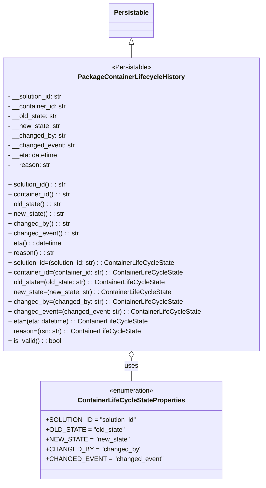

# Diagram: partview_service/partview_service/core/datamodel/PackageContainerLifecycleHistory.py

> Auto-generated by Obscura crawlers

## Mermaid

### SVG

<svg id="container" width="633.265625" xmlns="http://www.w3.org/2000/svg" class="classDiagram" height="1184" viewBox="0 0 633.265625 1184" role="graphics-document document" aria-roledescription="class"><g><defs><marker id="container_class-aggregationStart" class="marker aggregation class" refX="18" refY="7" markerWidth="190" markerHeight="240" orient="auto"><path d="M 18,7 L9,13 L1,7 L9,1 Z"></path></marker></defs><defs><marker id="container_class-aggregationEnd" class="marker aggregation class" refX="1" refY="7" markerWidth="20" markerHeight="28" orient="auto"><path d="M 18,7 L9,13 L1,7 L9,1 Z"></path></marker></defs><defs><marker id="container_class-extensionStart" class="marker extension class" refX="18" refY="7" markerWidth="190" markerHeight="240" orient="auto"><path d="M 1,7 L18,13 V 1 Z"></path></marker></defs><defs><marker id="container_class-extensionEnd" class="marker extension class" refX="1" refY="7" markerWidth="20" markerHeight="28" orient="auto"><path d="M 1,1 V 13 L18,7 Z"></path></marker></defs><defs><marker id="container_class-compositionStart" class="marker composition class" refX="18" refY="7" markerWidth="190" markerHeight="240" orient="auto"><path d="M 18,7 L9,13 L1,7 L9,1 Z"></path></marker></defs><defs><marker id="container_class-compositionEnd" class="marker composition class" refX="1" refY="7" markerWidth="20" markerHeight="28" orient="auto"><path d="M 18,7 L9,13 L1,7 L9,1 Z"></path></marker></defs><defs><marker id="container_class-dependencyStart" class="marker dependency class" refX="6" refY="7" markerWidth="190" markerHeight="240" orient="auto"><path d="M 5,7 L9,13 L1,7 L9,1 Z"></path></marker></defs><defs><marker id="container_class-dependencyEnd" class="marker dependency class" refX="13" refY="7" markerWidth="20" markerHeight="28" orient="auto"><path d="M 18,7 L9,13 L14,7 L9,1 Z"></path></marker></defs><defs><marker id="container_class-lollipopStart" class="marker lollipop class" refX="13" refY="7" markerWidth="190" markerHeight="240" orient="auto"><circle stroke="black" fill="transparent" cx="7" cy="7" r="6"></circle></marker></defs><defs><marker id="container_class-lollipopEnd" class="marker lollipop class" refX="1" refY="7" markerWidth="190" markerHeight="240" orient="auto"><circle stroke="black" fill="transparent" cx="7" cy="7" r="6"></circle></marker></defs><g class="root"><g class="clusters"></g><g class="edgePaths"><path d="M316.633,109.25L316.633,110.542C316.633,111.833,316.633,114.417,316.633,119.875C316.633,125.333,316.633,133.667,316.633,137.833L316.633,142" id="id_Persistable_PackageContainerLifecycleHistory_1" class="edge-thickness-normal edge-pattern-solid relation" style=";;;" data-edge="true" data-et="edge" data-id="id_Persistable_PackageContainerLifecycleHistory_1" data-points="W3sieCI6MzE2LjYzMjgxMjUsInkiOjkyfSx7IngiOjMxNi42MzI4MTI1LCJ5IjoxMTd9LHsieCI6MzE2LjYzMjgxMjUsInkiOjE0Mn1d" marker-start="url(#container_class-extensionStart)"></path><path d="M316.633,879.25L316.633,882.542C316.633,885.833,316.633,892.417,316.633,901.875C316.633,911.333,316.633,923.667,316.633,929.833L316.633,936" id="id_PackageContainerLifecycleHistory_ContainerLifeCycleStateProperties_2" class="edge-thickness-normal edge-pattern-solid relation" style=";;;" data-edge="true" data-et="edge" data-id="id_PackageContainerLifecycleHistory_ContainerLifeCycleStateProperties_2" data-points="W3sieCI6MzE2LjYzMjgxMjUsInkiOjg2Mn0seyJ4IjozMTYuNjMyODEyNSwieSI6ODk5fSx7IngiOjMxNi42MzI4MTI1LCJ5Ijo5MzZ9XQ==" marker-start="url(#container_class-aggregationStart)"></path></g><g class="edgeLabels"><g class="edgeLabel"><g class="label" data-id="id_Persistable_PackageContainerLifecycleHistory_1" transform="translate(0, 0)"><foreignObject width="0" height="0">

</foreignObject></g></g><g class="edgeLabel" transform="translate(316.6328125, 899)"><g class="label" data-id="id_PackageContainerLifecycleHistory_ContainerLifeCycleStateProperties_2" transform="translate(-16.4921875, -12)"><foreignObject width="32.984375" height="24">

uses

</foreignObject></g></g></g><g class="nodes"><g class="node default" id="classId-Persistable-0" transform="translate(316.6328125, 50)"><g class="basic label-container"><path d="M-52.9765625 -42 L52.9765625 -42 L52.9765625 42 L-52.9765625 42" stroke="none" stroke-width="0" fill="#ECECFF" style=""></path><path d="M-52.9765625 -42 C-31.530962451078405 -42, -10.085362402156811 -42, 52.9765625 -42 M-52.9765625 -42 C-16.887062357628672 -42, 19.202437784742656 -42, 52.9765625 -42 M52.9765625 -42 C52.9765625 -20.36700995574128, 52.9765625 1.2659800885174377, 52.9765625 42 M52.9765625 -42 C52.9765625 -22.78474427185191, 52.9765625 -3.5694885437038195, 52.9765625 42 M52.9765625 42 C28.897012802847552 42, 4.817463105695104 42, -52.9765625 42 M52.9765625 42 C22.872478440504835 42, -7.231605618990329 42, -52.9765625 42 M-52.9765625 42 C-52.9765625 10.46517882863867, -52.9765625 -21.06964234272266, -52.9765625 -42 M-52.9765625 42 C-52.9765625 11.674978184435972, -52.9765625 -18.650043631128057, -52.9765625 -42" stroke="#9370DB" stroke-width="1.3" fill="none" stroke-dasharray="0 0" style=""></path></g><g class="annotation-group text" transform="translate(0, -18)"></g><g class="label-group text" transform="translate(-40.9765625, -18)"><g class="label" style="font-weight: bolder" transform="translate(0,-12)"><foreignObject width="81.953125" height="24">

Persistable

</foreignObject></g></g><g class="members-group text" transform="translate(-40.9765625, 30)"></g><g class="methods-group text" transform="translate(-40.9765625, 60)"></g><g class="divider" style=""><path d="M-52.9765625 6 C-18.10532190627309 6, 16.76591868745382 6, 52.9765625 6 M-52.9765625 6 C-22.36681739926711 6, 8.242927701465781 6, 52.9765625 6" stroke="#9370DB" stroke-width="1.3" fill="none" stroke-dasharray="0 0" style=""></path></g><g class="divider" style=""><path d="M-52.9765625 24 C-26.729872790545592 24, -0.4831830810911839 24, 52.9765625 24 M-52.9765625 24 C-14.81430260481332 24, 23.34795729037336 24, 52.9765625 24" stroke="#9370DB" stroke-width="1.3" fill="none" stroke-dasharray="0 0" style=""></path></g></g><g class="node default" id="classId-ContainerLifeCycleStateProperties-1" transform="translate(316.6328125, 1056)"><g class="basic label-container"><path d="M-209.0234375 -120 L209.0234375 -120 L209.0234375 120 L-209.0234375 120" stroke="none" stroke-width="0" fill="#ECECFF" style=""></path><path d="M-209.0234375 -120 C-119.22534667477039 -120, -29.427255849540785 -120, 209.0234375 -120 M-209.0234375 -120 C-50.36056912522335 -120, 108.3022992495533 -120, 209.0234375 -120 M209.0234375 -120 C209.0234375 -61.48885147225356, 209.0234375 -2.977702944507115, 209.0234375 120 M209.0234375 -120 C209.0234375 -71.0700963106426, 209.0234375 -22.140192621285195, 209.0234375 120 M209.0234375 120 C47.67042653721617 120, -113.68258442556765 120, -209.0234375 120 M209.0234375 120 C51.385827590819616 120, -106.25178231836077 120, -209.0234375 120 M-209.0234375 120 C-209.0234375 37.85312507892246, -209.0234375 -44.29374984215508, -209.0234375 -120 M-209.0234375 120 C-209.0234375 26.926336159274456, -209.0234375 -66.14732768145109, -209.0234375 -120" stroke="#9370DB" stroke-width="1.3" fill="none" stroke-dasharray="0 0" style=""></path></g><g class="annotation-group text" transform="translate(-55.5546875, -96)"><g class="label" style="" transform="translate(0,-12)"><foreignObject width="111.109375" height="24">

«enumeration»

</foreignObject></g></g><g class="label-group text" transform="translate(-125.625, -72)"><g class="label" style="font-weight: bolder" transform="translate(0,-12)"><foreignObject width="251.25" height="24">

ContainerLifeCycleStateProperties

</foreignObject></g></g><g class="members-group text" transform="translate(-197.0234375, -24)"><g class="label" style="" transform="translate(0,-12)"><foreignObject width="214.953125" height="24">

+SOLUTION_ID = "solution_id"

</foreignObject></g><g class="label" style="" transform="translate(0,12)"><foreignObject width="182.59375" height="24">

+OLD_STATE = "old_state"

</foreignObject></g><g class="label" style="" transform="translate(0,36)"><foreignObject width="191.53125" height="24">

+NEW_STATE = "new_state"

</foreignObject></g><g class="label" style="" transform="translate(0,60)"><foreignObject width="218.890625" height="24">

+CHANGED_BY = "changed_by"

</foreignObject></g><g class="label" style="" transform="translate(0,84)"><foreignObject width="268.421875" height="24">

+CHANGED_EVENT = "changed_event"

</foreignObject></g></g><g class="methods-group text" transform="translate(-197.0234375, 120)"></g><g class="divider" style=""><path d="M-209.0234375 -48 C-78.45574288870708 -48, 52.11195172258584 -48, 209.0234375 -48 M-209.0234375 -48 C-93.27336811475807 -48, 22.476701270483858 -48, 209.0234375 -48" stroke="#9370DB" stroke-width="1.3" fill="none" stroke-dasharray="0 0" style=""></path></g><g class="divider" style=""><path d="M-209.0234375 96 C-64.85349495568528 96, 79.31644758862944 96, 209.0234375 96 M-209.0234375 96 C-45.58600470452319 96, 117.85142809095362 96, 209.0234375 96" stroke="#9370DB" stroke-width="1.3" fill="none" stroke-dasharray="0 0" style=""></path></g></g><g class="node default" id="classId-PackageContainerLifecycleHistory-2" transform="translate(316.6328125, 502)"><g class="basic label-container"><path d="M-308.6328125 -360 L308.6328125 -360 L308.6328125 360 L-308.6328125 360" stroke="none" stroke-width="0" fill="#ECECFF" style=""></path><path d="M-308.6328125 -360 C-76.81137190987954 -360, 155.01006868024092 -360, 308.6328125 -360 M-308.6328125 -360 C-142.40751540850894 -360, 23.817781682982115 -360, 308.6328125 -360 M308.6328125 -360 C308.6328125 -133.61335385377188, 308.6328125 92.77329229245623, 308.6328125 360 M308.6328125 -360 C308.6328125 -117.80384082015371, 308.6328125 124.39231835969258, 308.6328125 360 M308.6328125 360 C107.1663628311876 360, -94.3000868376248 360, -308.6328125 360 M308.6328125 360 C108.45353894516981 360, -91.72573460966038 360, -308.6328125 360 M-308.6328125 360 C-308.6328125 207.68916570928286, -308.6328125 55.37833141856572, -308.6328125 -360 M-308.6328125 360 C-308.6328125 83.79437220130615, -308.6328125 -192.4112555973877, -308.6328125 -360" stroke="#9370DB" stroke-width="1.3" fill="none" stroke-dasharray="0 0" style=""></path></g><g class="annotation-group text" transform="translate(-49.0390625, -336)"><g class="label" style="" transform="translate(0,-12)"><foreignObject width="98.078125" height="24">

«Persistable»

</foreignObject></g></g><g class="label-group text" transform="translate(-123.90625, -312)"><g class="label" style="font-weight: bolder" transform="translate(0,-12)"><foreignObject width="247.8125" height="24">

PackageContainerLifecycleHistory

</foreignObject></g></g><g class="members-group text" transform="translate(-296.6328125, -264)"><g class="label" style="" transform="translate(0,-12)"><foreignObject width="136.90625" height="24">

- __solution_id: str

</foreignObject></g><g class="label" style="" transform="translate(0,12)"><foreignObject width="144.6875" height="24">

- __container_id: str

</foreignObject></g><g class="label" style="" transform="translate(0,36)"><foreignObject width="122.296875" height="24">

- __old_state: str

</foreignObject></g><g class="label" style="" transform="translate(0,60)"><foreignObject width="128.34375" height="24">

- __new_state: str

</foreignObject></g><g class="label" style="" transform="translate(0,84)"><foreignObject width="141.515625" height="24">

- __changed_by: str

</foreignObject></g><g class="label" style="" transform="translate(0,108)"><foreignObject width="164.21875" height="24">

- __changed_event: str

</foreignObject></g><g class="label" style="" transform="translate(0,132)"><foreignObject width="123.265625" height="24">

- __eta: datetime

</foreignObject></g><g class="label" style="" transform="translate(0,156)"><foreignObject width="103.671875" height="24">

- __reason: str

</foreignObject></g></g><g class="methods-group text" transform="translate(-296.6328125, -48)"><g class="label" style="" transform="translate(0,-12)"><foreignObject width="144.640625" height="24">

+ solution_id() : : str

</foreignObject></g><g class="label" style="" transform="translate(0,12)"><foreignObject width="152.75" height="24">

+ container_id() : : str

</foreignObject></g><g class="label" style="" transform="translate(0,36)"><foreignObject width="130.359375" height="24">

+ old_state() : : str

</foreignObject></g><g class="label" style="" transform="translate(0,60)"><foreignObject width="136.09375" height="24">

+ new_state() : : str

</foreignObject></g><g class="label" style="" transform="translate(0,84)"><foreignObject width="149.515625" height="24">

+ changed_by() : : str

</foreignObject></g><g class="label" style="" transform="translate(0,108)"><foreignObject width="172.21875" height="24">

+ changed_event() : : str

</foreignObject></g><g class="label" style="" transform="translate(0,132)"><foreignObject width="131.34375" height="24">

+ eta() : : datetime

</foreignObject></g><g class="label" style="" transform="translate(0,156)"><foreignObject width="111.421875" height="24">

+ reason() : : str

</foreignObject></g><g class="label" style="" transform="translate(0,180)"><foreignObject width="414.15625" height="24">

+ solution_id=(solution_id: str) : : ContainerLifeCycleState

</foreignObject></g><g class="label" style="" transform="translate(0,204)"><foreignObject width="430.34375" height="24">

+ container_id=(container_id: str) : : ContainerLifeCycleState

</foreignObject></g><g class="label" style="" transform="translate(0,228)"><foreignObject width="385.578125" height="24">

+ old_state=(old_state: str) : : ContainerLifeCycleState

</foreignObject></g><g class="label" style="" transform="translate(0,252)"><foreignObject width="397.03125" height="24">

+ new_state=(new_state: str) : : ContainerLifeCycleState

</foreignObject></g><g class="label" style="" transform="translate(0,276)"><foreignObject width="423.9375" height="24">

+ changed_by=(changed_by: str) : : ContainerLifeCycleState

</foreignObject></g><g class="label" style="" transform="translate(0,300)"><foreignObject width="469.359375" height="24">

+ changed_event=(changed_event: str) : : ContainerLifeCycleState

</foreignObject></g><g class="label" style="" transform="translate(0,324)"><foreignObject width="341.703125" height="24">

+ eta=(eta: datetime) : : ContainerLifeCycleState

</foreignObject></g><g class="label" style="" transform="translate(0,348)"><foreignObject width="321.484375" height="24">

+ reason=(rsn: str) : : ContainerLifeCycleState

</foreignObject></g><g class="label" style="" transform="translate(0,372)"><foreignObject width="130.3125" height="24">

+ is_valid() : : bool

</foreignObject></g></g><g class="divider" style=""><path d="M-308.6328125 -288 C-95.06671416271234 -288, 118.49938417457531 -288, 308.6328125 -288 M-308.6328125 -288 C-119.51089277780073 -288, 69.61102694439853 -288, 308.6328125 -288" stroke="#9370DB" stroke-width="1.3" fill="none" stroke-dasharray="0 0" style=""></path></g><g class="divider" style=""><path d="M-308.6328125 -72 C-65.3144680880356 -72, 178.0038763239288 -72, 308.6328125 -72 M-308.6328125 -72 C-173.39881403076518 -72, -38.16481556153036 -72, 308.6328125 -72" stroke="#9370DB" stroke-width="1.3" fill="none" stroke-dasharray="0 0" style=""></path></g></g></g></g></g></svg>
