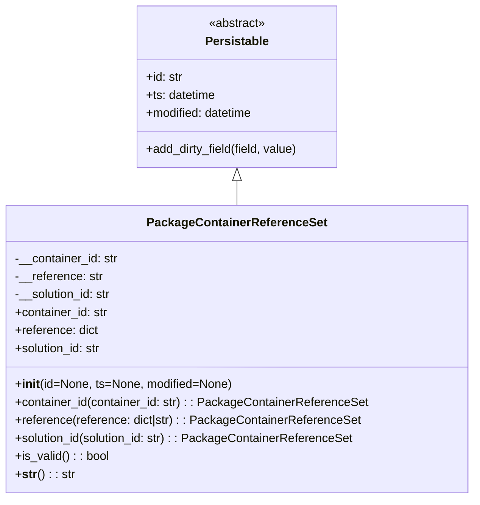

# Diagram: partview_service/partview_service/core/datamodel/PackageContainerReferenceSet.py


> Auto-generated by Obscura crawlers

## Diagram 1



### SVG

<svg id="container" width="624.6328125" xmlns="http://www.w3.org/2000/svg" class="classDiagram" height="666" viewBox="0 0 624.6328125 666" role="graphics-document document" aria-roledescription="class"><style>#container{font-family:"trebuchet ms",verdana,arial,sans-serif;font-size:16px;fill:#333;}@keyframes edge-animation-frame{from{stroke-dashoffset:0;}}@keyframes dash{to{stroke-dashoffset:0;}}#container .edge-animation-slow{stroke-dasharray:9,5!important;stroke-dashoffset:900;animation:dash 50s linear infinite;stroke-linecap:round;}#container .edge-animation-fast{stroke-dasharray:9,5!important;stroke-dashoffset:900;animation:dash 20s linear infinite;stroke-linecap:round;}#container .error-icon{fill:#552222;}#container .error-text{fill:#552222;stroke:#552222;}#container .edge-thickness-normal{stroke-width:1px;}#container .edge-thickness-thick{stroke-width:3.5px;}#container .edge-pattern-solid{stroke-dasharray:0;}#container .edge-thickness-invisible{stroke-width:0;fill:none;}#container .edge-pattern-dashed{stroke-dasharray:3;}#container .edge-pattern-dotted{stroke-dasharray:2;}#container .marker{fill:#333333;stroke:#333333;}#container .marker.cross{stroke:#333333;}#container svg{font-family:"trebuchet ms",verdana,arial,sans-serif;font-size:16px;}#container p{margin:0;}#container g.classGroup text{fill:#9370DB;stroke:none;font-family:"trebuchet ms",verdana,arial,sans-serif;font-size:10px;}#container g.classGroup text .title{font-weight:bolder;}#container .nodeLabel,#container .edgeLabel{color:#131300;}#container .edgeLabel .label rect{fill:#ECECFF;}#container .label text{fill:#131300;}#container .labelBkg{background:#ECECFF;}#container .edgeLabel .label span{background:#ECECFF;}#container .classTitle{font-weight:bolder;}#container .node rect,#container .node circle,#container .node ellipse,#container .node polygon,#container .node path{fill:#ECECFF;stroke:#9370DB;stroke-width:1px;}#container .divider{stroke:#9370DB;stroke-width:1;}#container g.clickable{cursor:pointer;}#container g.classGroup rect{fill:#ECECFF;stroke:#9370DB;}#container g.classGroup line{stroke:#9370DB;stroke-width:1;}#container .classLabel .box{stroke:none;stroke-width:0;fill:#ECECFF;opacity:0.5;}#container .classLabel .label{fill:#9370DB;font-size:10px;}#container .relation{stroke:#333333;stroke-width:1;fill:none;}#container .dashed-line{stroke-dasharray:3;}#container .dotted-line{stroke-dasharray:1 2;}#container #compositionStart,#container .composition{fill:#333333!important;stroke:#333333!important;stroke-width:1;}#container #compositionEnd,#container .composition{fill:#333333!important;stroke:#333333!important;stroke-width:1;}#container #dependencyStart,#container .dependency{fill:#333333!important;stroke:#333333!important;stroke-width:1;}#container #dependencyStart,#container .dependency{fill:#333333!important;stroke:#333333!important;stroke-width:1;}#container #extensionStart,#container .extension{fill:transparent!important;stroke:#333333!important;stroke-width:1;}#container #extensionEnd,#container .extension{fill:transparent!important;stroke:#333333!important;stroke-width:1;}#container #aggregationStart,#container .aggregation{fill:transparent!important;stroke:#333333!important;stroke-width:1;}#container #aggregationEnd,#container .aggregation{fill:transparent!important;stroke:#333333!important;stroke-width:1;}#container #lollipopStart,#container .lollipop{fill:#ECECFF!important;stroke:#333333!important;stroke-width:1;}#container #lollipopEnd,#container .lollipop{fill:#ECECFF!important;stroke:#333333!important;stroke-width:1;}#container .edgeTerminals{font-size:11px;line-height:initial;}#container .classTitleText{text-anchor:middle;font-size:18px;fill:#333;}#container .label-icon{display:inline-block;height:1em;overflow:visible;vertical-align:-0.125em;}#container .node .label-icon path{fill:currentColor;stroke:revert;stroke-width:revert;}#container :root{--mermaid-font-family:"trebuchet ms",verdana,arial,sans-serif;}</style><g><defs><marker id="container_class-aggregationStart" class="marker aggregation class" refX="18" refY="7" markerWidth="190" markerHeight="240" orient="auto"><path d="M 18,7 L9,13 L1,7 L9,1 Z"></path></marker></defs><defs><marker id="container_class-aggregationEnd" class="marker aggregation class" refX="1" refY="7" markerWidth="20" markerHeight="28" orient="auto"><path d="M 18,7 L9,13 L1,7 L9,1 Z"></path></marker></defs><defs><marker id="container_class-extensionStart" class="marker extension class" refX="18" refY="7" markerWidth="190" markerHeight="240" orient="auto"><path d="M 1,7 L18,13 V 1 Z"></path></marker></defs><defs><marker id="container_class-extensionEnd" class="marker extension class" refX="1" refY="7" markerWidth="20" markerHeight="28" orient="auto"><path d="M 1,1 V 13 L18,7 Z"></path></marker></defs><defs><marker id="container_class-compositionStart" class="marker composition class" refX="18" refY="7" markerWidth="190" markerHeight="240" orient="auto"><path d="M 18,7 L9,13 L1,7 L9,1 Z"></path></marker></defs><defs><marker id="container_class-compositionEnd" class="marker composition class" refX="1" refY="7" markerWidth="20" markerHeight="28" orient="auto"><path d="M 18,7 L9,13 L1,7 L9,1 Z"></path></marker></defs><defs><marker id="container_class-dependencyStart" class="marker dependency class" refX="6" refY="7" markerWidth="190" markerHeight="240" orient="auto"><path d="M 5,7 L9,13 L1,7 L9,1 Z"></path></marker></defs><defs><marker id="container_class-dependencyEnd" class="marker dependency class" refX="13" refY="7" markerWidth="20" markerHeight="28" orient="auto"><path d="M 18,7 L9,13 L14,7 L9,1 Z"></path></marker></defs><defs><marker id="container_class-lollipopStart" class="marker lollipop class" refX="13" refY="7" markerWidth="190" markerHeight="240" orient="auto"><circle stroke="black" fill="transparent" cx="7" cy="7" r="6"></circle></marker></defs><defs><marker id="container_class-lollipopEnd" class="marker lollipop class" refX="1" refY="7" markerWidth="190" markerHeight="240" orient="auto"><circle stroke="black" fill="transparent" cx="7" cy="7" r="6"></circle></marker></defs><g class="root"><g class="clusters"></g><g class="edgePaths"><path d="M312.316,241.25L312.316,242.542C312.316,243.833,312.316,246.417,312.316,251.875C312.316,257.333,312.316,265.667,312.316,269.833L312.316,274" id="id_Persistable_PackageContainerReferenceSet_1" class="edge-thickness-normal edge-pattern-solid relation" style=";;;" data-edge="true" data-et="edge" data-id="id_Persistable_PackageContainerReferenceSet_1" data-points="W3sieCI6MzEyLjMxNjQwNjI1LCJ5IjoyMjR9LHsieCI6MzEyLjMxNjQwNjI1LCJ5IjoyNDl9LHsieCI6MzEyLjMxNjQwNjI1LCJ5IjoyNzR9XQ==" marker-start="url(#container_class-extensionStart)"></path></g><g class="edgeLabels"><g class="edgeLabel"><g class="label" data-id="id_Persistable_PackageContainerReferenceSet_1" transform="translate(0, 0)"><foreignObject width="0" height="0"><div xmlns="http://www.w3.org/1999/xhtml" class="labelBkg" style="display: table-cell; white-space: nowrap; line-height: 1.5; max-width: 200px; text-align: center;"><span class="edgeLabel"></span></div></foreignObject></g></g></g><g class="nodes"><g class="node default" id="classId-Persistable-0" transform="translate(312.31640625, 116)"><g class="basic label-container"><path d="M-135.71484375 -108 L135.71484375 -108 L135.71484375 108 L-135.71484375 108" stroke="none" stroke-width="0" fill="#ECECFF" style=""></path><path d="M-135.71484375 -108 C-37.485443086906 -108, 60.743957576187995 -108, 135.71484375 -108 M-135.71484375 -108 C-58.026980807128936 -108, 19.660882135742128 -108, 135.71484375 -108 M135.71484375 -108 C135.71484375 -35.11383436831275, 135.71484375 37.7723312633745, 135.71484375 108 M135.71484375 -108 C135.71484375 -36.68079556924174, 135.71484375 34.638408861516524, 135.71484375 108 M135.71484375 108 C53.52567742537447 108, -28.663488899251064 108, -135.71484375 108 M135.71484375 108 C39.705584490727276 108, -56.30367476854545 108, -135.71484375 108 M-135.71484375 108 C-135.71484375 23.711770241433996, -135.71484375 -60.57645951713201, -135.71484375 -108 M-135.71484375 108 C-135.71484375 34.19864349078986, -135.71484375 -39.602713018420275, -135.71484375 -108" stroke="#9370DB" stroke-width="1.3" fill="none" stroke-dasharray="0 0" style=""></path></g><g class="annotation-group text" transform="translate(-38.609375, -84)"><g class="label" style="" transform="translate(0,-12)"><foreignObject width="77.21875" height="24"><div xmlns="http://www.w3.org/1999/xhtml" style="display: table-cell; white-space: nowrap; line-height: 1.5; max-width: 127px; text-align: center;"><span class="nodeLabel markdown-node-label" style=""><p>«abstract»</p></span></div></foreignObject></g></g><g class="label-group text" transform="translate(-40.9765625, -60)"><g class="label" style="font-weight: bolder" transform="translate(0,-12)"><foreignObject width="81.953125" height="24"><div xmlns="http://www.w3.org/1999/xhtml" style="display: table-cell; white-space: nowrap; line-height: 1.5; max-width: 130px; text-align: center;"><span class="nodeLabel markdown-node-label" style=""><p>Persistable</p></span></div></foreignObject></g></g><g class="members-group text" transform="translate(-123.71484375, -12)"><g class="label" style="" transform="translate(0,-12)"><foreignObject width="49.578125" height="24"><div xmlns="http://www.w3.org/1999/xhtml" style="display: table-cell; white-space: nowrap; line-height: 1.5; max-width: 108px; text-align: center;"><span class="nodeLabel markdown-node-label" style=""><p>+id: str</p></span></div></foreignObject></g><g class="label" style="" transform="translate(0,12)"><foreignObject width="94.484375" height="24"><div xmlns="http://www.w3.org/1999/xhtml" style="display: table-cell; white-space: nowrap; line-height: 1.5; max-width: 152px; text-align: center;"><span class="nodeLabel markdown-node-label" style=""><p>+ts: datetime</p></span></div></foreignObject></g><g class="label" style="" transform="translate(0,36)"><foreignObject width="145.9375" height="24"><div xmlns="http://www.w3.org/1999/xhtml" style="display: table-cell; white-space: nowrap; line-height: 1.5; max-width: 203px; text-align: center;"><span class="nodeLabel markdown-node-label" style=""><p>+modified: datetime</p></span></div></foreignObject></g></g><g class="methods-group text" transform="translate(-123.71484375, 84)"><g class="label" style="" transform="translate(0,-12)"><foreignObject width="206.453125" height="24"><div xmlns="http://www.w3.org/1999/xhtml" style="display: table-cell; white-space: nowrap; line-height: 1.5; max-width: 264px; text-align: center;"><span class="nodeLabel markdown-node-label" style=""><p>+add_dirty_field(field, value)</p></span></div></foreignObject></g></g><g class="divider" style=""><path d="M-135.71484375 -36 C-50.02613564631261 -36, 35.66257245737478 -36, 135.71484375 -36 M-135.71484375 -36 C-51.67655926119039 -36, 32.36172522761922 -36, 135.71484375 -36" stroke="#9370DB" stroke-width="1.3" fill="none" stroke-dasharray="0 0" style=""></path></g><g class="divider" style=""><path d="M-135.71484375 60 C-38.975563817989666 60, 57.76371611402067 60, 135.71484375 60 M-135.71484375 60 C-40.784344269216135 60, 54.14615521156773 60, 135.71484375 60" stroke="#9370DB" stroke-width="1.3" fill="none" stroke-dasharray="0 0" style=""></path></g></g><g class="node default" id="classId-PackageContainerReferenceSet-1" transform="translate(312.31640625, 466)"><g class="basic label-container"><path d="M-304.31640625 -192 L304.31640625 -192 L304.31640625 192 L-304.31640625 192" stroke="none" stroke-width="0" fill="#ECECFF" style=""></path><path d="M-304.31640625 -192 C-137.3644716545542 -192, 29.587462940891612 -192, 304.31640625 -192 M-304.31640625 -192 C-132.3384612812404 -192, 39.6394836875192 -192, 304.31640625 -192 M304.31640625 -192 C304.31640625 -83.0297405466585, 304.31640625 25.940518906682996, 304.31640625 192 M304.31640625 -192 C304.31640625 -66.96347143070415, 304.31640625 58.07305713859171, 304.31640625 192 M304.31640625 192 C153.817205987693 192, 3.3180057253860014 192, -304.31640625 192 M304.31640625 192 C154.0281291136601 192, 3.7398519773201997 192, -304.31640625 192 M-304.31640625 192 C-304.31640625 53.799388744366354, -304.31640625 -84.40122251126729, -304.31640625 -192 M-304.31640625 192 C-304.31640625 101.64481107105334, -304.31640625 11.28962214210668, -304.31640625 -192" stroke="#9370DB" stroke-width="1.3" fill="none" stroke-dasharray="0 0" style=""></path></g><g class="annotation-group text" transform="translate(0, -168)"></g><g class="label-group text" transform="translate(-114.0390625, -168)"><g class="label" style="font-weight: bolder" transform="translate(0,-12)"><foreignObject width="228.078125" height="24"><div xmlns="http://www.w3.org/1999/xhtml" style="display: table-cell; white-space: nowrap; line-height: 1.5; max-width: 274px; text-align: center;"><span class="nodeLabel markdown-node-label" style=""><p>PackageContainerReferenceSet</p></span></div></foreignObject></g></g><g class="members-group text" transform="translate(-292.31640625, -120)"><g class="label" style="" transform="translate(0,-12)"><foreignObject width="139.15625" height="24"><div xmlns="http://www.w3.org/1999/xhtml" style="display: table-cell; white-space: nowrap; line-height: 1.5; max-width: 197px; text-align: center;"><span class="nodeLabel markdown-node-label" style=""><p>-__container_id: str</p></span></div></foreignObject></g><g class="label" style="" transform="translate(0,12)"><foreignObject width="117.34375" height="24"><div xmlns="http://www.w3.org/1999/xhtml" style="display: table-cell; white-space: nowrap; line-height: 1.5; max-width: 176px; text-align: center;"><span class="nodeLabel markdown-node-label" style=""><p>-__reference: str</p></span></div></foreignObject></g><g class="label" style="" transform="translate(0,36)"><foreignObject width="131.390625" height="24"><div xmlns="http://www.w3.org/1999/xhtml" style="display: table-cell; white-space: nowrap; line-height: 1.5; max-width: 190px; text-align: center;"><span class="nodeLabel markdown-node-label" style=""><p>-__solution_id: str</p></span></div></foreignObject></g><g class="label" style="" transform="translate(0,60)"><foreignObject width="125.8125" height="24"><div xmlns="http://www.w3.org/1999/xhtml" style="display: table-cell; white-space: nowrap; line-height: 1.5; max-width: 184px; text-align: center;"><span class="nodeLabel markdown-node-label" style=""><p>+container_id: str</p></span></div></foreignObject></g><g class="label" style="" transform="translate(0,84)"><foreignObject width="111.75" height="24"><div xmlns="http://www.w3.org/1999/xhtml" style="display: table-cell; white-space: nowrap; line-height: 1.5; max-width: 169px; text-align: center;"><span class="nodeLabel markdown-node-label" style=""><p>+reference: dict</p></span></div></foreignObject></g><g class="label" style="" transform="translate(0,108)"><foreignObject width="117.71875" height="24"><div xmlns="http://www.w3.org/1999/xhtml" style="display: table-cell; white-space: nowrap; line-height: 1.5; max-width: 176px; text-align: center;"><span class="nodeLabel markdown-node-label" style=""><p>+solution_id: str</p></span></div></foreignObject></g></g><g class="methods-group text" transform="translate(-292.31640625, 48)"><g class="label" style="" transform="translate(0,-12)"><foreignObject width="289.6875" height="24"><div xmlns="http://www.w3.org/1999/xhtml" style="display: table-cell; white-space: nowrap; line-height: 1.5; max-width: 378px; text-align: center;"><span class="nodeLabel markdown-node-label" style=""><p>+<strong>init</strong>(id=None, ts=None, modified=None)</p></span></div></foreignObject></g><g class="label" style="" transform="translate(0,12)"><foreignObject width="470.59375" height="24"><div xmlns="http://www.w3.org/1999/xhtml" style="display: table-cell; white-space: nowrap; line-height: 1.5; max-width: 528px; text-align: center;"><span class="nodeLabel markdown-node-label" style=""><p>+container_id(container_id: str) : : PackageContainerReferenceSet</p></span></div></foreignObject></g><g class="label" style="" transform="translate(0,36)"><foreignObject width="460.265625" height="24"><div xmlns="http://www.w3.org/1999/xhtml" style="display: table-cell; white-space: nowrap; line-height: 1.5; max-width: 518px; text-align: center;"><span class="nodeLabel markdown-node-label" style=""><p>+reference(reference: dict|str) : : PackageContainerReferenceSet</p></span></div></foreignObject></g><g class="label" style="" transform="translate(0,60)"><foreignObject width="454.40625" height="24"><div xmlns="http://www.w3.org/1999/xhtml" style="display: table-cell; white-space: nowrap; line-height: 1.5; max-width: 512px; text-align: center;"><span class="nodeLabel markdown-node-label" style=""><p>+solution_id(solution_id: str) : : PackageContainerReferenceSet</p></span></div></foreignObject></g><g class="label" style="" transform="translate(0,84)"><foreignObject width="126.078125" height="24"><div xmlns="http://www.w3.org/1999/xhtml" style="display: table-cell; white-space: nowrap; line-height: 1.5; max-width: 184px; text-align: center;"><span class="nodeLabel markdown-node-label" style=""><p>+is_valid() : : bool</p></span></div></foreignObject></g><g class="label" style="" transform="translate(0,108)"><foreignObject width="78.515625" height="24"><div xmlns="http://www.w3.org/1999/xhtml" style="display: table-cell; white-space: nowrap; line-height: 1.5; max-width: 166px; text-align: center;"><span class="nodeLabel markdown-node-label" style=""><p>+<strong>str</strong>() : : str</p></span></div></foreignObject></g></g><g class="divider" style=""><path d="M-304.31640625 -144 C-164.78683532843544 -144, -25.25726440687089 -144, 304.31640625 -144 M-304.31640625 -144 C-87.59557572537366 -144, 129.12525479925267 -144, 304.31640625 -144" stroke="#9370DB" stroke-width="1.3" fill="none" stroke-dasharray="0 0" style=""></path></g><g class="divider" style=""><path d="M-304.31640625 24 C-114.61055768236349 24, 75.09529088527302 24, 304.31640625 24 M-304.31640625 24 C-170.26878260284786 24, -36.22115895569573 24, 304.31640625 24" stroke="#9370DB" stroke-width="1.3" fill="none" stroke-dasharray="0 0" style=""></path></g></g></g></g></g></svg>

## Diagram 2

```mermaid
flowchart LR
A[Set reference(reference)] --> B{reference is dict?}
B -- yes --> C[parsed_reference = json.dumps(reference, ensure_ascii=False)]
B -- no --> D[parsed_reference = reference]
C --> E{parsed_reference is None or str?}
D --> E
E -- false --> F[AssertionError: "value must be a json"]
E -- true --> G{__reference != parsed_reference?}
G -- false --> H[return self]
G -- true --> I[__reference = parsed_reference]
I --> J[add_dirty_field("reference", parsed_reference)]
J --> H
```

> SVG rendering failed for this diagram.
