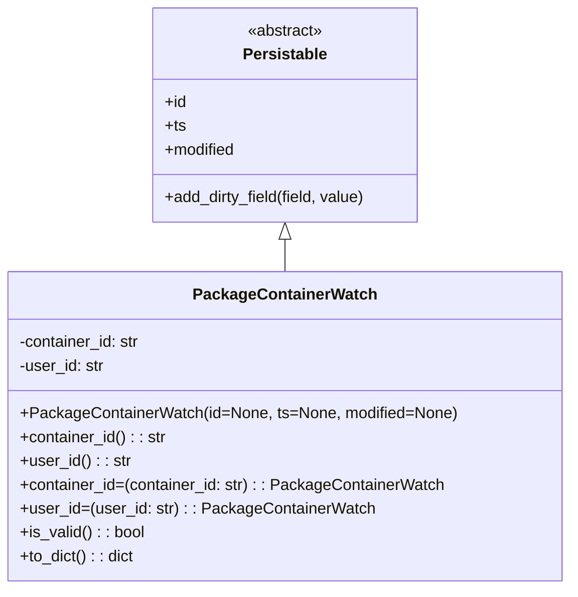

# Diagram: partview_service/partview_service/core/datamodel/PackageContainerWatch.py


> Auto-generated by Obscura crawlers

## Diagram 1



### SVG

<svg id="container" width="565.578125" xmlns="http://www.w3.org/2000/svg" class="classDiagram" height="594" viewBox="0 0 565.578125 594" role="graphics-document document" aria-roledescription="class"><style>#container{font-family:"trebuchet ms",verdana,arial,sans-serif;font-size:16px;fill:#333;}@keyframes edge-animation-frame{from{stroke-dashoffset:0;}}@keyframes dash{to{stroke-dashoffset:0;}}#container .edge-animation-slow{stroke-dasharray:9,5!important;stroke-dashoffset:900;animation:dash 50s linear infinite;stroke-linecap:round;}#container .edge-animation-fast{stroke-dasharray:9,5!important;stroke-dashoffset:900;animation:dash 20s linear infinite;stroke-linecap:round;}#container .error-icon{fill:#552222;}#container .error-text{fill:#552222;stroke:#552222;}#container .edge-thickness-normal{stroke-width:1px;}#container .edge-thickness-thick{stroke-width:3.5px;}#container .edge-pattern-solid{stroke-dasharray:0;}#container .edge-thickness-invisible{stroke-width:0;fill:none;}#container .edge-pattern-dashed{stroke-dasharray:3;}#container .edge-pattern-dotted{stroke-dasharray:2;}#container .marker{fill:#333333;stroke:#333333;}#container .marker.cross{stroke:#333333;}#container svg{font-family:"trebuchet ms",verdana,arial,sans-serif;font-size:16px;}#container p{margin:0;}#container g.classGroup text{fill:#9370DB;stroke:none;font-family:"trebuchet ms",verdana,arial,sans-serif;font-size:10px;}#container g.classGroup text .title{font-weight:bolder;}#container .nodeLabel,#container .edgeLabel{color:#131300;}#container .edgeLabel .label rect{fill:#ECECFF;}#container .label text{fill:#131300;}#container .labelBkg{background:#ECECFF;}#container .edgeLabel .label span{background:#ECECFF;}#container .classTitle{font-weight:bolder;}#container .node rect,#container .node circle,#container .node ellipse,#container .node polygon,#container .node path{fill:#ECECFF;stroke:#9370DB;stroke-width:1px;}#container .divider{stroke:#9370DB;stroke-width:1;}#container g.clickable{cursor:pointer;}#container g.classGroup rect{fill:#ECECFF;stroke:#9370DB;}#container g.classGroup line{stroke:#9370DB;stroke-width:1;}#container .classLabel .box{stroke:none;stroke-width:0;fill:#ECECFF;opacity:0.5;}#container .classLabel .label{fill:#9370DB;font-size:10px;}#container .relation{stroke:#333333;stroke-width:1;fill:none;}#container .dashed-line{stroke-dasharray:3;}#container .dotted-line{stroke-dasharray:1 2;}#container #compositionStart,#container .composition{fill:#333333!important;stroke:#333333!important;stroke-width:1;}#container #compositionEnd,#container .composition{fill:#333333!important;stroke:#333333!important;stroke-width:1;}#container #dependencyStart,#container .dependency{fill:#333333!important;stroke:#333333!important;stroke-width:1;}#container #dependencyStart,#container .dependency{fill:#333333!important;stroke:#333333!important;stroke-width:1;}#container #extensionStart,#container .extension{fill:transparent!important;stroke:#333333!important;stroke-width:1;}#container #extensionEnd,#container .extension{fill:transparent!important;stroke:#333333!important;stroke-width:1;}#container #aggregationStart,#container .aggregation{fill:transparent!important;stroke:#333333!important;stroke-width:1;}#container #aggregationEnd,#container .aggregation{fill:transparent!important;stroke:#333333!important;stroke-width:1;}#container #lollipopStart,#container .lollipop{fill:#ECECFF!important;stroke:#333333!important;stroke-width:1;}#container #lollipopEnd,#container .lollipop{fill:#ECECFF!important;stroke:#333333!important;stroke-width:1;}#container .edgeTerminals{font-size:11px;line-height:initial;}#container .classTitleText{text-anchor:middle;font-size:18px;fill:#333;}#container .label-icon{display:inline-block;height:1em;overflow:visible;vertical-align:-0.125em;}#container .node .label-icon path{fill:currentColor;stroke:revert;stroke-width:revert;}#container :root{--mermaid-font-family:"trebuchet ms",verdana,arial,sans-serif;}</style><g><defs><marker id="container_class-aggregationStart" class="marker aggregation class" refX="18" refY="7" markerWidth="190" markerHeight="240" orient="auto"><path d="M 18,7 L9,13 L1,7 L9,1 Z"></path></marker></defs><defs><marker id="container_class-aggregationEnd" class="marker aggregation class" refX="1" refY="7" markerWidth="20" markerHeight="28" orient="auto"><path d="M 18,7 L9,13 L1,7 L9,1 Z"></path></marker></defs><defs><marker id="container_class-extensionStart" class="marker extension class" refX="18" refY="7" markerWidth="190" markerHeight="240" orient="auto"><path d="M 1,7 L18,13 V 1 Z"></path></marker></defs><defs><marker id="container_class-extensionEnd" class="marker extension class" refX="1" refY="7" markerWidth="20" markerHeight="28" orient="auto"><path d="M 1,1 V 13 L18,7 Z"></path></marker></defs><defs><marker id="container_class-compositionStart" class="marker composition class" refX="18" refY="7" markerWidth="190" markerHeight="240" orient="auto"><path d="M 18,7 L9,13 L1,7 L9,1 Z"></path></marker></defs><defs><marker id="container_class-compositionEnd" class="marker composition class" refX="1" refY="7" markerWidth="20" markerHeight="28" orient="auto"><path d="M 18,7 L9,13 L1,7 L9,1 Z"></path></marker></defs><defs><marker id="container_class-dependencyStart" class="marker dependency class" refX="6" refY="7" markerWidth="190" markerHeight="240" orient="auto"><path d="M 5,7 L9,13 L1,7 L9,1 Z"></path></marker></defs><defs><marker id="container_class-dependencyEnd" class="marker dependency class" refX="13" refY="7" markerWidth="20" markerHeight="28" orient="auto"><path d="M 18,7 L9,13 L14,7 L9,1 Z"></path></marker></defs><defs><marker id="container_class-lollipopStart" class="marker lollipop class" refX="13" refY="7" markerWidth="190" markerHeight="240" orient="auto"><circle stroke="black" fill="transparent" cx="7" cy="7" r="6"></circle></marker></defs><defs><marker id="container_class-lollipopEnd" class="marker lollipop class" refX="1" refY="7" markerWidth="190" markerHeight="240" orient="auto"><circle stroke="black" fill="transparent" cx="7" cy="7" r="6"></circle></marker></defs><g class="root"><g class="clusters"></g><g class="edgePaths"><path d="M282.789,241.25L282.789,242.542C282.789,243.833,282.789,246.417,282.789,251.875C282.789,257.333,282.789,265.667,282.789,269.833L282.789,274" id="id_Persistable_PackageContainerWatch_1" class="edge-thickness-normal edge-pattern-solid relation" style=";;;" data-edge="true" data-et="edge" data-id="id_Persistable_PackageContainerWatch_1" data-points="W3sieCI6MjgyLjc4OTA2MjUsInkiOjIyNH0seyJ4IjoyODIuNzg5MDYyNSwieSI6MjQ5fSx7IngiOjI4Mi43ODkwNjI1LCJ5IjoyNzR9XQ==" marker-start="url(#container_class-extensionStart)"></path></g><g class="edgeLabels"><g class="edgeLabel"><g class="label" data-id="id_Persistable_PackageContainerWatch_1" transform="translate(0, 0)"><foreignObject width="0" height="0"><div xmlns="http://www.w3.org/1999/xhtml" class="labelBkg" style="display: table-cell; white-space: nowrap; line-height: 1.5; max-width: 200px; text-align: center;"><span class="edgeLabel"></span></div></foreignObject></g></g></g><g class="nodes"><g class="node default" id="classId-Persistable-0" transform="translate(282.7890625, 116)"><g class="basic label-container"><path d="M-135.71484375 -108 L135.71484375 -108 L135.71484375 108 L-135.71484375 108" stroke="none" stroke-width="0" fill="#ECECFF" style=""></path><path d="M-135.71484375 -108 C-41.136199549942475 -108, 53.44244465011505 -108, 135.71484375 -108 M-135.71484375 -108 C-73.66684481362115 -108, -11.618845877242308 -108, 135.71484375 -108 M135.71484375 -108 C135.71484375 -27.152894723482163, 135.71484375 53.694210553035674, 135.71484375 108 M135.71484375 -108 C135.71484375 -64.30756271498785, 135.71484375 -20.61512542997572, 135.71484375 108 M135.71484375 108 C58.53590471217926 108, -18.64303432564148 108, -135.71484375 108 M135.71484375 108 C80.64783895174202 108, 25.58083415348402 108, -135.71484375 108 M-135.71484375 108 C-135.71484375 52.35554583364965, -135.71484375 -3.2889083327007, -135.71484375 -108 M-135.71484375 108 C-135.71484375 49.3517903549312, -135.71484375 -9.296419290137607, -135.71484375 -108" stroke="#9370DB" stroke-width="1.3" fill="none" stroke-dasharray="0 0" style=""></path></g><g class="annotation-group text" transform="translate(-38.609375, -84)"><g class="label" style="" transform="translate(0,-12)"><foreignObject width="77.21875" height="24"><div xmlns="http://www.w3.org/1999/xhtml" style="display: table-cell; white-space: nowrap; line-height: 1.5; max-width: 127px; text-align: center;"><span class="nodeLabel markdown-node-label" style=""><p>«abstract»</p></span></div></foreignObject></g></g><g class="label-group text" transform="translate(-40.9765625, -60)"><g class="label" style="font-weight: bolder" transform="translate(0,-12)"><foreignObject width="81.953125" height="24"><div xmlns="http://www.w3.org/1999/xhtml" style="display: table-cell; white-space: nowrap; line-height: 1.5; max-width: 130px; text-align: center;"><span class="nodeLabel markdown-node-label" style=""><p>Persistable</p></span></div></foreignObject></g></g><g class="members-group text" transform="translate(-123.71484375, -12)"><g class="label" style="" transform="translate(0,-12)"><foreignObject width="22.078125" height="24"><div xmlns="http://www.w3.org/1999/xhtml" style="display: table-cell; white-space: nowrap; line-height: 1.5; max-width: 79px; text-align: center;"><span class="nodeLabel markdown-node-label" style=""><p>+id</p></span></div></foreignObject></g><g class="label" style="" transform="translate(0,12)"><foreignObject width="21.15625" height="24"><div xmlns="http://www.w3.org/1999/xhtml" style="display: table-cell; white-space: nowrap; line-height: 1.5; max-width: 79px; text-align: center;"><span class="nodeLabel markdown-node-label" style=""><p>+ts</p></span></div></foreignObject></g><g class="label" style="" transform="translate(0,36)"><foreignObject width="72.609375" height="24"><div xmlns="http://www.w3.org/1999/xhtml" style="display: table-cell; white-space: nowrap; line-height: 1.5; max-width: 130px; text-align: center;"><span class="nodeLabel markdown-node-label" style=""><p>+modified</p></span></div></foreignObject></g></g><g class="methods-group text" transform="translate(-123.71484375, 84)"><g class="label" style="" transform="translate(0,-12)"><foreignObject width="206.453125" height="24"><div xmlns="http://www.w3.org/1999/xhtml" style="display: table-cell; white-space: nowrap; line-height: 1.5; max-width: 264px; text-align: center;"><span class="nodeLabel markdown-node-label" style=""><p>+add_dirty_field(field, value)</p></span></div></foreignObject></g></g><g class="divider" style=""><path d="M-135.71484375 -36 C-77.02353109644923 -36, -18.332218442898466 -36, 135.71484375 -36 M-135.71484375 -36 C-37.110164246744034 -36, 61.49451525651193 -36, 135.71484375 -36" stroke="#9370DB" stroke-width="1.3" fill="none" stroke-dasharray="0 0" style=""></path></g><g class="divider" style=""><path d="M-135.71484375 60 C-30.165258528798105 60, 75.38432669240379 60, 135.71484375 60 M-135.71484375 60 C-64.66542186005735 60, 6.3840000298853 60, 135.71484375 60" stroke="#9370DB" stroke-width="1.3" fill="none" stroke-dasharray="0 0" style=""></path></g></g><g class="node default" id="classId-PackageContainerWatch-1" transform="translate(282.7890625, 430)"><g class="basic label-container"><path d="M-274.7890625 -156 L274.7890625 -156 L274.7890625 156 L-274.7890625 156" stroke="none" stroke-width="0" fill="#ECECFF" style=""></path><path d="M-274.7890625 -156 C-82.03662335221063 -156, 110.71581579557875 -156, 274.7890625 -156 M-274.7890625 -156 C-140.08366834231273 -156, -5.378274184625468 -156, 274.7890625 -156 M274.7890625 -156 C274.7890625 -81.91571621569906, 274.7890625 -7.831432431398127, 274.7890625 156 M274.7890625 -156 C274.7890625 -56.73575629499847, 274.7890625 42.528487410003066, 274.7890625 156 M274.7890625 156 C75.13009978179491 156, -124.52886293641018 156, -274.7890625 156 M274.7890625 156 C84.38269297092242 156, -106.02367655815516 156, -274.7890625 156 M-274.7890625 156 C-274.7890625 44.808075745252296, -274.7890625 -66.38384850949541, -274.7890625 -156 M-274.7890625 156 C-274.7890625 79.86233480900408, -274.7890625 3.724669618008164, -274.7890625 -156" stroke="#9370DB" stroke-width="1.3" fill="none" stroke-dasharray="0 0" style=""></path></g><g class="annotation-group text" transform="translate(0, -132)"></g><g class="label-group text" transform="translate(-87.765625, -132)"><g class="label" style="font-weight: bolder" transform="translate(0,-12)"><foreignObject width="175.53125" height="24"><div xmlns="http://www.w3.org/1999/xhtml" style="display: table-cell; white-space: nowrap; line-height: 1.5; max-width: 223px; text-align: center;"><span class="nodeLabel markdown-node-label" style=""><p>PackageContainerWatch</p></span></div></foreignObject></g></g><g class="members-group text" transform="translate(-262.7890625, -84)"><g class="label" style="" transform="translate(0,-12)"><foreignObject width="124.28125" height="24"><div xmlns="http://www.w3.org/1999/xhtml" style="display: table-cell; white-space: nowrap; line-height: 1.5; max-width: 182px; text-align: center;"><span class="nodeLabel markdown-node-label" style=""><p>-container_id: str</p></span></div></foreignObject></g><g class="label" style="" transform="translate(0,12)"><foreignObject width="86.765625" height="24"><div xmlns="http://www.w3.org/1999/xhtml" style="display: table-cell; white-space: nowrap; line-height: 1.5; max-width: 145px; text-align: center;"><span class="nodeLabel markdown-node-label" style=""><p>-user_id: str</p></span></div></foreignObject></g></g><g class="methods-group text" transform="translate(-262.7890625, -12)"><g class="label" style="" transform="translate(0,-12)"><foreignObject width="437.8125" height="24"><div xmlns="http://www.w3.org/1999/xhtml" style="display: table-cell; white-space: nowrap; line-height: 1.5; max-width: 495px; text-align: center;"><span class="nodeLabel markdown-node-label" style=""><p>+PackageContainerWatch(id=None, ts=None, modified=None)</p></span></div></foreignObject></g><g class="label" style="" transform="translate(0,12)"><foreignObject width="148.5" height="24"><div xmlns="http://www.w3.org/1999/xhtml" style="display: table-cell; white-space: nowrap; line-height: 1.5; max-width: 207px; text-align: center;"><span class="nodeLabel markdown-node-label" style=""><p>+container_id() : : str</p></span></div></foreignObject></g><g class="label" style="" transform="translate(0,36)"><foreignObject width="110.984375" height="24"><div xmlns="http://www.w3.org/1999/xhtml" style="display: table-cell; white-space: nowrap; line-height: 1.5; max-width: 169px; text-align: center;"><span class="nodeLabel markdown-node-label" style=""><p>+user_id() : : str</p></span></div></foreignObject></g><g class="label" style="" transform="translate(0,60)"><foreignObject width="427.46875" height="24"><div xmlns="http://www.w3.org/1999/xhtml" style="display: table-cell; white-space: nowrap; line-height: 1.5; max-width: 485px; text-align: center;"><span class="nodeLabel markdown-node-label" style=""><p>+container_id=(container_id: str) : : PackageContainerWatch</p></span></div></foreignObject></g><g class="label" style="" transform="translate(0,84)"><foreignObject width="352.421875" height="24"><div xmlns="http://www.w3.org/1999/xhtml" style="display: table-cell; white-space: nowrap; line-height: 1.5; max-width: 410px; text-align: center;"><span class="nodeLabel markdown-node-label" style=""><p>+user_id=(user_id: str) : : PackageContainerWatch</p></span></div></foreignObject></g><g class="label" style="" transform="translate(0,108)"><foreignObject width="126.078125" height="24"><div xmlns="http://www.w3.org/1999/xhtml" style="display: table-cell; white-space: nowrap; line-height: 1.5; max-width: 184px; text-align: center;"><span class="nodeLabel markdown-node-label" style=""><p>+is_valid() : : bool</p></span></div></foreignObject></g><g class="label" style="" transform="translate(0,132)"><foreignObject width="116.25" height="24"><div xmlns="http://www.w3.org/1999/xhtml" style="display: table-cell; white-space: nowrap; line-height: 1.5; max-width: 174px; text-align: center;"><span class="nodeLabel markdown-node-label" style=""><p>+to_dict() : : dict</p></span></div></foreignObject></g></g><g class="divider" style=""><path d="M-274.7890625 -108 C-108.701509108625 -108, 57.38604428274999 -108, 274.7890625 -108 M-274.7890625 -108 C-79.14290064839466 -108, 116.50326120321068 -108, 274.7890625 -108" stroke="#9370DB" stroke-width="1.3" fill="none" stroke-dasharray="0 0" style=""></path></g><g class="divider" style=""><path d="M-274.7890625 -36 C-60.48154620689971 -36, 153.82597008620058 -36, 274.7890625 -36 M-274.7890625 -36 C-129.9432764488845 -36, 14.90250960223102 -36, 274.7890625 -36" stroke="#9370DB" stroke-width="1.3" fill="none" stroke-dasharray="0 0" style=""></path></g></g></g></g></g></svg>

## Diagram 2

```mermaid
flowchart TD
    subgraph SetContainerId
        A1[container_id.setter(container_id)]
        A1 --> A2{container_id is not None and is str?}
        A2 -- No --> A3[AssertionError]
        A2 -- Yes --> A4{self.__container_id != container_id?}
        A4 -- Yes --> A5[set __container_id = container_id]
        A5 --> A6[add_dirty_field("container_id", container_id)]
        A6 --> A7[return self]
        A4 -- No --> A7
    end
    subgraph SetUserId
        B1[user_id.setter(user_id)]
        B1 --> B2{user_id is not None and is str?}
        B2 -- No --> B3[AssertionError]
        B2 -- Yes --> B4{self.__user_id != user_id?}
        B4 -- Yes --> B5[set __user_id = user_id]
        B5 --> B6[add_dirty_field("user_id", user_id)]
        B6 --> B7[return self]
        B4 -- No --> B7
    end
    subgraph Validation
        C1[is_valid()]
        C1 --> C2{container_id is not None and is str?}
        C2 -- No --> C4[return False]
        C2 -- Yes --> C3{user_id is not None and is str?}
        C3 -- No --> C4
        C3 -- Yes --> C5[return True]
    end
```

> SVG rendering failed for this diagram.
