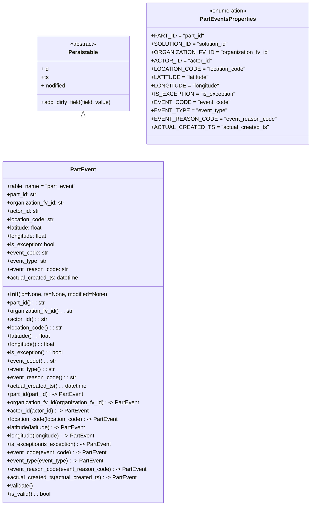

# Diagram: partview_service/partview_service/core/datamodel/PartEvent.py

> Auto-generated by Obscura crawlers

## Mermaid

### SVG

<svg id="container" width="867.2421875" xmlns="http://www.w3.org/2000/svg" class="classDiagram" height="1458" viewBox="0 0 867.2421875 1458" role="graphics-document document" aria-roledescription="class"><g><defs><marker id="container_class-aggregationStart" class="marker aggregation class" refX="18" refY="7" markerWidth="190" markerHeight="240" orient="auto"><path d="M 18,7 L9,13 L1,7 L9,1 Z"></path></marker></defs><defs><marker id="container_class-aggregationEnd" class="marker aggregation class" refX="1" refY="7" markerWidth="20" markerHeight="28" orient="auto"><path d="M 18,7 L9,13 L1,7 L9,1 Z"></path></marker></defs><defs><marker id="container_class-extensionStart" class="marker extension class" refX="18" refY="7" markerWidth="190" markerHeight="240" orient="auto"><path d="M 1,7 L18,13 V 1 Z"></path></marker></defs><defs><marker id="container_class-extensionEnd" class="marker extension class" refX="1" refY="7" markerWidth="20" markerHeight="28" orient="auto"><path d="M 1,1 V 13 L18,7 Z"></path></marker></defs><defs><marker id="container_class-compositionStart" class="marker composition class" refX="18" refY="7" markerWidth="190" markerHeight="240" orient="auto"><path d="M 18,7 L9,13 L1,7 L9,1 Z"></path></marker></defs><defs><marker id="container_class-compositionEnd" class="marker composition class" refX="1" refY="7" markerWidth="20" markerHeight="28" orient="auto"><path d="M 18,7 L9,13 L1,7 L9,1 Z"></path></marker></defs><defs><marker id="container_class-dependencyStart" class="marker dependency class" refX="6" refY="7" markerWidth="190" markerHeight="240" orient="auto"><path d="M 5,7 L9,13 L1,7 L9,1 Z"></path></marker></defs><defs><marker id="container_class-dependencyEnd" class="marker dependency class" refX="13" refY="7" markerWidth="20" markerHeight="28" orient="auto"><path d="M 18,7 L9,13 L14,7 L9,1 Z"></path></marker></defs><defs><marker id="container_class-lollipopStart" class="marker lollipop class" refX="13" refY="7" markerWidth="190" markerHeight="240" orient="auto"><circle stroke="black" fill="transparent" cx="7" cy="7" r="6"></circle></marker></defs><defs><marker id="container_class-lollipopEnd" class="marker lollipop class" refX="1" refY="7" markerWidth="190" markerHeight="240" orient="auto"><circle stroke="black" fill="transparent" cx="7" cy="7" r="6"></circle></marker></defs><g class="root"><g class="clusters"></g><g class="edgePaths"><path d="M237.426,337.25L237.426,354.542C237.426,371.833,237.426,406.417,237.426,427.875C237.426,449.333,237.426,457.667,237.426,461.833L237.426,466" id="id_Persistable_PartEvent_1" class="edge-thickness-normal edge-pattern-solid relation" style=";;;" data-edge="true" data-et="edge" data-id="id_Persistable_PartEvent_1" data-points="W3sieCI6MjM3LjQyNTc4MTI1LCJ5IjozMjB9LHsieCI6MjM3LjQyNTc4MTI1LCJ5Ijo0NDF9LHsieCI6MjM3LjQyNTc4MTI1LCJ5Ijo0NjZ9XQ==" marker-start="url(#container_class-extensionStart)"></path></g><g class="edgeLabels"><g class="edgeLabel"><g class="label" data-id="id_Persistable_PartEvent_1" transform="translate(0, 0)"><foreignObject width="0" height="0">

</foreignObject></g></g></g><g class="nodes"><g class="node default" id="classId-Persistable-0" transform="translate(237.42578125, 212)"><g class="basic label-container"><path d="M-135.71484375 -108 L135.71484375 -108 L135.71484375 108 L-135.71484375 108" stroke="none" stroke-width="0" fill="#ECECFF" style=""></path><path d="M-135.71484375 -108 C-77.18340702090978 -108, -18.651970291819566 -108, 135.71484375 -108 M-135.71484375 -108 C-34.54690219748542 -108, 66.62103935502915 -108, 135.71484375 -108 M135.71484375 -108 C135.71484375 -38.924650041943465, 135.71484375 30.15069991611307, 135.71484375 108 M135.71484375 -108 C135.71484375 -29.700897579160284, 135.71484375 48.59820484167943, 135.71484375 108 M135.71484375 108 C36.15206604223194 108, -63.41071166553613 108, -135.71484375 108 M135.71484375 108 C53.39120973399045 108, -28.9324242820191 108, -135.71484375 108 M-135.71484375 108 C-135.71484375 63.141406434124335, -135.71484375 18.28281286824867, -135.71484375 -108 M-135.71484375 108 C-135.71484375 54.7757966322337, -135.71484375 1.5515932644673995, -135.71484375 -108" stroke="#9370DB" stroke-width="1.3" fill="none" stroke-dasharray="0 0" style=""></path></g><g class="annotation-group text" transform="translate(-38.609375, -84)"><g class="label" style="" transform="translate(0,-12)"><foreignObject width="77.21875" height="24">

«abstract»

</foreignObject></g></g><g class="label-group text" transform="translate(-40.9765625, -60)"><g class="label" style="font-weight: bolder" transform="translate(0,-12)"><foreignObject width="81.953125" height="24">

Persistable

</foreignObject></g></g><g class="members-group text" transform="translate(-123.71484375, -12)"><g class="label" style="" transform="translate(0,-12)"><foreignObject width="22.078125" height="24">

+id

</foreignObject></g><g class="label" style="" transform="translate(0,12)"><foreignObject width="21.15625" height="24">

+ts

</foreignObject></g><g class="label" style="" transform="translate(0,36)"><foreignObject width="72.609375" height="24">

+modified

</foreignObject></g></g><g class="methods-group text" transform="translate(-123.71484375, 84)"><g class="label" style="" transform="translate(0,-12)"><foreignObject width="206.453125" height="24">

+add_dirty_field(field, value)

</foreignObject></g></g><g class="divider" style=""><path d="M-135.71484375 -36 C-65.61548717076788 -36, 4.483869408464244 -36, 135.71484375 -36 M-135.71484375 -36 C-42.04091030252222 -36, 51.63302314495556 -36, 135.71484375 -36" stroke="#9370DB" stroke-width="1.3" fill="none" stroke-dasharray="0 0" style=""></path></g><g class="divider" style=""><path d="M-135.71484375 60 C-44.32755449986024 60, 47.05973475027952 60, 135.71484375 60 M-135.71484375 60 C-34.39640486521151 60, 66.92203401957698 60, 135.71484375 60" stroke="#9370DB" stroke-width="1.3" fill="none" stroke-dasharray="0 0" style=""></path></g></g><g class="node default" id="classId-PartEvent-1" transform="translate(237.42578125, 958)"><g class="basic label-container"><path d="M-229.42578125 -492 L229.42578125 -492 L229.42578125 492 L-229.42578125 492" stroke="none" stroke-width="0" fill="#ECECFF" style=""></path><path d="M-229.42578125 -492 C-94.52460604117334 -492, 40.376569167653315 -492, 229.42578125 -492 M-229.42578125 -492 C-58.60606199354848 -492, 112.21365726290304 -492, 229.42578125 -492 M229.42578125 -492 C229.42578125 -246.71470802595823, 229.42578125 -1.429416051916462, 229.42578125 492 M229.42578125 -492 C229.42578125 -142.22519942827984, 229.42578125 207.54960114344033, 229.42578125 492 M229.42578125 492 C115.90897614431925 492, 2.3921710386385087 492, -229.42578125 492 M229.42578125 492 C91.97589447596624 492, -45.473992298067515 492, -229.42578125 492 M-229.42578125 492 C-229.42578125 140.1636248811467, -229.42578125 -211.67275023770662, -229.42578125 -492 M-229.42578125 492 C-229.42578125 126.90628584423791, -229.42578125 -238.18742831152417, -229.42578125 -492" stroke="#9370DB" stroke-width="1.3" fill="none" stroke-dasharray="0 0" style=""></path></g><g class="annotation-group text" transform="translate(0, -468)"></g><g class="label-group text" transform="translate(-35.2734375, -468)"><g class="label" style="font-weight: bolder" transform="translate(0,-12)"><foreignObject width="70.546875" height="24">

PartEvent

</foreignObject></g></g><g class="members-group text" transform="translate(-217.42578125, -420)"><g class="label" style="" transform="translate(0,-12)"><foreignObject width="200.96875" height="24">

+table_name = "part_event"

</foreignObject></g><g class="label" style="" transform="translate(0,12)"><foreignObject width="87.890625" height="24">

+part_id: str

</foreignObject></g><g class="label" style="" transform="translate(0,36)"><foreignObject width="169" height="24">

+organization_fv_id: str

</foreignObject></g><g class="label" style="" transform="translate(0,60)"><foreignObject width="93.78125" height="24">

+actor_id: str

</foreignObject></g><g class="label" style="" transform="translate(0,84)"><foreignObject width="137.609375" height="24">

+location_code: str

</foreignObject></g><g class="label" style="" transform="translate(0,108)"><foreignObject width="106.109375" height="24">

+latitude: float

</foreignObject></g><g class="label" style="" transform="translate(0,132)"><foreignObject width="118.65625" height="24">

+longitude: float

</foreignObject></g><g class="label" style="" transform="translate(0,156)"><foreignObject width="139.375" height="24">

+is_exception: bool

</foreignObject></g><g class="label" style="" transform="translate(0,180)"><foreignObject width="118.796875" height="24">

+event_code: str

</foreignObject></g><g class="label" style="" transform="translate(0,204)"><foreignObject width="115.625" height="24">

+event_type: str

</foreignObject></g><g class="label" style="" transform="translate(0,228)"><foreignObject width="176.109375" height="24">

+event_reason_code: str

</foreignObject></g><g class="label" style="" transform="translate(0,252)"><foreignObject width="209.4375" height="24">

+actual_created_ts: datetime

</foreignObject></g></g><g class="methods-group text" transform="translate(-217.42578125, -108)"><g class="label" style="" transform="translate(0,-12)"><foreignObject width="289.6875" height="24">

+<strong>init</strong>(id=None, ts=None, modified=None)

</foreignObject></g><g class="label" style="" transform="translate(0,12)"><foreignObject width="110.578125" height="24">

+part_id() : : str

</foreignObject></g><g class="label" style="" transform="translate(0,36)"><foreignObject width="191.6875" height="24">

+organization_fv_id() : : str

</foreignObject></g><g class="label" style="" transform="translate(0,60)"><foreignObject width="116.46875" height="24">

+actor_id() : : str

</foreignObject></g><g class="label" style="" transform="translate(0,84)"><foreignObject width="160.296875" height="24">

+location_code() : : str

</foreignObject></g><g class="label" style="" transform="translate(0,108)"><foreignObject width="128.796875" height="24">

+latitude() : : float

</foreignObject></g><g class="label" style="" transform="translate(0,132)"><foreignObject width="141.359375" height="24">

+longitude() : : float

</foreignObject></g><g class="label" style="" transform="translate(0,156)"><foreignObject width="162.0625" height="24">

+is_exception() : : bool

</foreignObject></g><g class="label" style="" transform="translate(0,180)"><foreignObject width="141.484375" height="24">

+event_code() : : str

</foreignObject></g><g class="label" style="" transform="translate(0,204)"><foreignObject width="138.3125" height="24">

+event_type() : : str

</foreignObject></g><g class="label" style="" transform="translate(0,228)"><foreignObject width="198.796875" height="24">

+event_reason_code() : : str

</foreignObject></g><g class="label" style="" transform="translate(0,252)"><foreignObject width="232.125" height="24">

+actual_created_ts() : : datetime

</foreignObject></g><g class="label" style="" transform="translate(0,276)"><foreignObject width="223.15625" height="24">

+part_id(part_id) : -&gt; PartEvent

</foreignObject></g><g class="label" style="" transform="translate(0,300)"><foreignObject width="385.375" height="24">

+organization_fv_id(organization_fv_id) : -&gt; PartEvent

</foreignObject></g><g class="label" style="" transform="translate(0,324)"><foreignObject width="235.171875" height="24">

+actor_id(actor_id) : -&gt; PartEvent

</foreignObject></g><g class="label" style="" transform="translate(0,348)"><foreignObject width="322.578125" height="24">

+location_code(location_code) : -&gt; PartEvent

</foreignObject></g><g class="label" style="" transform="translate(0,372)"><foreignObject width="232.3125" height="24">

+latitude(latitude) : -&gt; PartEvent

</foreignObject></g><g class="label" style="" transform="translate(0,396)"><foreignObject width="257.4375" height="24">

+longitude(longitude) : -&gt; PartEvent

</foreignObject></g><g class="label" style="" transform="translate(0,420)"><foreignObject width="299.1875" height="24">

+is_exception(is_exception) : -&gt; PartEvent

</foreignObject></g><g class="label" style="" transform="translate(0,444)"><foreignObject width="284.953125" height="24">

+event_code(event_code) : -&gt; PartEvent

</foreignObject></g><g class="label" style="" transform="translate(0,468)"><foreignObject width="278.609375" height="24">

+event_type(event_type) : -&gt; PartEvent

</foreignObject></g><g class="label" style="" transform="translate(0,492)"><foreignObject width="399.578125" height="24">

+event_reason_code(event_reason_code) : -&gt; PartEvent

</foreignObject></g><g class="label" style="" transform="translate(0,516)"><foreignObject width="374.828125" height="24">

+actual_created_ts(actual_created_ts) : -&gt; PartEvent

</foreignObject></g><g class="label" style="" transform="translate(0,540)"><foreignObject width="76.09375" height="24">

+validate()

</foreignObject></g><g class="label" style="" transform="translate(0,564)"><foreignObject width="126.078125" height="24">

+is_valid() : : bool

</foreignObject></g></g><g class="divider" style=""><path d="M-229.42578125 -444 C-71.93358192424341 -444, 85.55861740151317 -444, 229.42578125 -444 M-229.42578125 -444 C-70.96250924614066 -444, 87.50076275771869 -444, 229.42578125 -444" stroke="#9370DB" stroke-width="1.3" fill="none" stroke-dasharray="0 0" style=""></path></g><g class="divider" style=""><path d="M-229.42578125 -132 C-98.41447029231549 -132, 32.59684066536903 -132, 229.42578125 -132 M-229.42578125 -132 C-131.17244531232 -132, -32.919109374640016 -132, 229.42578125 -132" stroke="#9370DB" stroke-width="1.3" fill="none" stroke-dasharray="0 0" style=""></path></g></g><g class="node default" id="classId-PartEventsProperties-2" transform="translate(641.19140625, 212)"><g class="basic label-container"><path d="M-218.05078125 -204 L218.05078125 -204 L218.05078125 204 L-218.05078125 204" stroke="none" stroke-width="0" fill="#ECECFF" style=""></path><path d="M-218.05078125 -204 C-86.08303527870243 -204, 45.88471069259515 -204, 218.05078125 -204 M-218.05078125 -204 C-84.2578096572654 -204, 49.535161935469205 -204, 218.05078125 -204 M218.05078125 -204 C218.05078125 -68.12052349175522, 218.05078125 67.75895301648956, 218.05078125 204 M218.05078125 -204 C218.05078125 -57.43727807317032, 218.05078125 89.12544385365936, 218.05078125 204 M218.05078125 204 C48.70967426608479 204, -120.63143271783042 204, -218.05078125 204 M218.05078125 204 C74.70539140381732 204, -68.63999844236537 204, -218.05078125 204 M-218.05078125 204 C-218.05078125 59.56809224810945, -218.05078125 -84.8638155037811, -218.05078125 -204 M-218.05078125 204 C-218.05078125 65.34231720498127, -218.05078125 -73.31536559003746, -218.05078125 -204" stroke="#9370DB" stroke-width="1.3" fill="none" stroke-dasharray="0 0" style=""></path></g><g class="annotation-group text" transform="translate(-55.5546875, -180)"><g class="label" style="" transform="translate(0,-12)"><foreignObject width="111.109375" height="24">

«enumeration»

</foreignObject></g></g><g class="label-group text" transform="translate(-77.4453125, -156)"><g class="label" style="font-weight: bolder" transform="translate(0,-12)"><foreignObject width="154.890625" height="24">

PartEventsProperties

</foreignObject></g></g><g class="members-group text" transform="translate(-206.05078125, -108)"><g class="label" style="" transform="translate(0,-12)"><foreignObject width="147.3125" height="24">

+PART_ID = "part_id"

</foreignObject></g><g class="label" style="" transform="translate(0,12)"><foreignObject width="214.953125" height="24">

+SOLUTION_ID = "solution_id"

</foreignObject></g><g class="label" style="" transform="translate(0,36)"><foreignObject width="325.4375" height="24">

+ORGANIZATION_FV_ID = "organization_fv_id"

</foreignObject></g><g class="label" style="" transform="translate(0,60)"><foreignObject width="164.984375" height="24">

+ACTOR_ID = "actor_id"

</foreignObject></g><g class="label" style="" transform="translate(0,84)"><foreignObject width="256.09375" height="24">

+LOCATION_CODE = "location_code"

</foreignObject></g><g class="label" style="" transform="translate(0,108)"><foreignObject width="161.109375" height="24">

+LATITUDE = "latitude"

</foreignObject></g><g class="label" style="" transform="translate(0,132)"><foreignObject width="188.40625" height="24">

+LONGITUDE = "longitude"

</foreignObject></g><g class="label" style="" transform="translate(0,156)"><foreignObject width="227.15625" height="24">

+IS_EXCEPTION = "is_exception"

</foreignObject></g><g class="label" style="" transform="translate(0,180)"><foreignObject width="210.890625" height="24">

+EVENT_CODE = "event_code"

</foreignObject></g><g class="label" style="" transform="translate(0,204)"><foreignObject width="203.90625" height="24">

+EVENT_TYPE = "event_type"

</foreignObject></g><g class="label" style="" transform="translate(0,228)"><foreignObject width="334.65625" height="24">

+EVENT_REASON_CODE = "event_reason_code"

</foreignObject></g><g class="label" style="" transform="translate(0,252)"><foreignObject width="312.53125" height="24">

+ACTUAL_CREATED_TS = "actual_created_ts"

</foreignObject></g></g><g class="methods-group text" transform="translate(-206.05078125, 204)"></g><g class="divider" style=""><path d="M-218.05078125 -132 C-123.4635541980238 -132, -28.8763271460476 -132, 218.05078125 -132 M-218.05078125 -132 C-95.49917087409982 -132, 27.052439501800364 -132, 218.05078125 -132" stroke="#9370DB" stroke-width="1.3" fill="none" stroke-dasharray="0 0" style=""></path></g><g class="divider" style=""><path d="M-218.05078125 180 C-58.14940531170626 180, 101.75197062658748 180, 218.05078125 180 M-218.05078125 180 C-50.659222075475185 180, 116.73233709904963 180, 218.05078125 180" stroke="#9370DB" stroke-width="1.3" fill="none" stroke-dasharray="0 0" style=""></path></g></g></g></g></g></svg>
