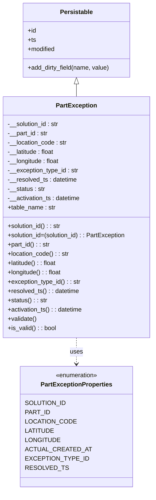

# Diagram: partview_service/partview_service/core/datamodel/PartException.py

> Auto-generated by Obscura crawlers

## Mermaid

### SVG

<svg id="container" width="401.78125" xmlns="http://www.w3.org/2000/svg" class="classDiagram" height="1268" viewBox="0 0 401.78125 1268" role="graphics-document document" aria-roledescription="class"><g><defs><marker id="container_class-aggregationStart" class="marker aggregation class" refX="18" refY="7" markerWidth="190" markerHeight="240" orient="auto"><path d="M 18,7 L9,13 L1,7 L9,1 Z"></path></marker></defs><defs><marker id="container_class-aggregationEnd" class="marker aggregation class" refX="1" refY="7" markerWidth="20" markerHeight="28" orient="auto"><path d="M 18,7 L9,13 L1,7 L9,1 Z"></path></marker></defs><defs><marker id="container_class-extensionStart" class="marker extension class" refX="18" refY="7" markerWidth="190" markerHeight="240" orient="auto"><path d="M 1,7 L18,13 V 1 Z"></path></marker></defs><defs><marker id="container_class-extensionEnd" class="marker extension class" refX="1" refY="7" markerWidth="20" markerHeight="28" orient="auto"><path d="M 1,1 V 13 L18,7 Z"></path></marker></defs><defs><marker id="container_class-compositionStart" class="marker composition class" refX="18" refY="7" markerWidth="190" markerHeight="240" orient="auto"><path d="M 18,7 L9,13 L1,7 L9,1 Z"></path></marker></defs><defs><marker id="container_class-compositionEnd" class="marker composition class" refX="1" refY="7" markerWidth="20" markerHeight="28" orient="auto"><path d="M 18,7 L9,13 L1,7 L9,1 Z"></path></marker></defs><defs><marker id="container_class-dependencyStart" class="marker dependency class" refX="6" refY="7" markerWidth="190" markerHeight="240" orient="auto"><path d="M 5,7 L9,13 L1,7 L9,1 Z"></path></marker></defs><defs><marker id="container_class-dependencyEnd" class="marker dependency class" refX="13" refY="7" markerWidth="20" markerHeight="28" orient="auto"><path d="M 18,7 L9,13 L14,7 L9,1 Z"></path></marker></defs><defs><marker id="container_class-lollipopStart" class="marker lollipop class" refX="13" refY="7" markerWidth="190" markerHeight="240" orient="auto"><circle stroke="black" fill="transparent" cx="7" cy="7" r="6"></circle></marker></defs><defs><marker id="container_class-lollipopEnd" class="marker lollipop class" refX="1" refY="7" markerWidth="190" markerHeight="240" orient="auto"><circle stroke="black" fill="transparent" cx="7" cy="7" r="6"></circle></marker></defs><g class="root"><g class="clusters"></g><g class="edgePaths"><path d="M200.891,217.25L200.891,218.542C200.891,219.833,200.891,222.417,200.891,227.875C200.891,233.333,200.891,241.667,200.891,245.833L200.891,250" id="id_Persistable_PartException_1" class="edge-thickness-normal edge-pattern-solid relation" style=";;;" data-edge="true" data-et="edge" data-id="id_Persistable_PartException_1" data-points="W3sieCI6MjAwLjg5MDYyNSwieSI6MjAwfSx7IngiOjIwMC44OTA2MjUsInkiOjIyNX0seyJ4IjoyMDAuODkwNjI1LCJ5IjoyNTB9XQ==" marker-start="url(#container_class-extensionStart)"></path><path d="M200.891,874L200.891,880.167C200.891,886.333,200.891,898.667,200.891,910C200.891,921.333,200.891,931.667,200.891,936.833L200.891,942" id="id_PartException_PartExceptionProperties_2" class="edge-thickness-normal edge-pattern-dashed relation" style=";;;" data-edge="true" data-et="edge" data-id="id_PartException_PartExceptionProperties_2" data-points="W3sieCI6MjAwLjg5MDYyNSwieSI6ODc0fSx7IngiOjIwMC44OTA2MjUsInkiOjkxMX0seyJ4IjoyMDAuODkwNjI1LCJ5Ijo5NDh9XQ==" marker-end="url(#container_class-dependencyEnd)"></path></g><g class="edgeLabels"><g class="edgeLabel"><g class="label" data-id="id_Persistable_PartException_1" transform="translate(0, 0)"><foreignObject width="0" height="0">

</foreignObject></g></g><g class="edgeLabel" transform="translate(200.890625, 911)"><g class="label" data-id="id_PartException_PartExceptionProperties_2" transform="translate(-16.4921875, -12)"><foreignObject width="32.984375" height="24">

uses

</foreignObject></g></g></g><g class="nodes"><g class="node default" id="classId-Persistable-0" transform="translate(200.890625, 104)"><g class="basic label-container"><path d="M-139.84765625 -96 L139.84765625 -96 L139.84765625 96 L-139.84765625 96" stroke="none" stroke-width="0" fill="#ECECFF" style=""></path><path d="M-139.84765625 -96 C-33.511161983951624 -96, 72.82533228209675 -96, 139.84765625 -96 M-139.84765625 -96 C-42.01214395525653 -96, 55.82336833948693 -96, 139.84765625 -96 M139.84765625 -96 C139.84765625 -26.285939963765628, 139.84765625 43.428120072468744, 139.84765625 96 M139.84765625 -96 C139.84765625 -22.106172246912323, 139.84765625 51.787655506175355, 139.84765625 96 M139.84765625 96 C62.399254561381554 96, -15.049147127236893 96, -139.84765625 96 M139.84765625 96 C69.60128830780727 96, -0.6450796343854677 96, -139.84765625 96 M-139.84765625 96 C-139.84765625 33.376630634276246, -139.84765625 -29.246738731447508, -139.84765625 -96 M-139.84765625 96 C-139.84765625 28.63761618827374, -139.84765625 -38.72476762345252, -139.84765625 -96" stroke="#9370DB" stroke-width="1.3" fill="none" stroke-dasharray="0 0" style=""></path></g><g class="annotation-group text" transform="translate(0, -72)"></g><g class="label-group text" transform="translate(-40.9765625, -72)"><g class="label" style="font-weight: bolder" transform="translate(0,-12)"><foreignObject width="81.953125" height="24">

Persistable

</foreignObject></g></g><g class="members-group text" transform="translate(-127.84765625, -24)"><g class="label" style="" transform="translate(0,-12)"><foreignObject width="22.078125" height="24">

+id

</foreignObject></g><g class="label" style="" transform="translate(0,12)"><foreignObject width="21.15625" height="24">

+ts

</foreignObject></g><g class="label" style="" transform="translate(0,36)"><foreignObject width="72.609375" height="24">

+modified

</foreignObject></g></g><g class="methods-group text" transform="translate(-127.84765625, 72)"><g class="label" style="" transform="translate(0,-12)"><foreignObject width="214.71875" height="24">

+add_dirty_field(name, value)

</foreignObject></g></g><g class="divider" style=""><path d="M-139.84765625 -48 C-37.19668464521426 -48, 65.45428695957148 -48, 139.84765625 -48 M-139.84765625 -48 C-30.40117824683813 -48, 79.04529975632374 -48, 139.84765625 -48" stroke="#9370DB" stroke-width="1.3" fill="none" stroke-dasharray="0 0" style=""></path></g><g class="divider" style=""><path d="M-139.84765625 48 C-44.95988560521609 48, 49.927885039567826 48, 139.84765625 48 M-139.84765625 48 C-80.52227614576194 48, -21.196896041523885 48, 139.84765625 48" stroke="#9370DB" stroke-width="1.3" fill="none" stroke-dasharray="0 0" style=""></path></g></g><g class="node default" id="classId-PartExceptionProperties-1" transform="translate(200.890625, 1104)"><g class="basic label-container"><path d="M-130.71484375 -156 L130.71484375 -156 L130.71484375 156 L-130.71484375 156" stroke="none" stroke-width="0" fill="#ECECFF" style=""></path><path d="M-130.71484375 -156 C-52.423186772668885 -156, 25.86847020466223 -156, 130.71484375 -156 M-130.71484375 -156 C-34.628822154929196 -156, 61.45719944014161 -156, 130.71484375 -156 M130.71484375 -156 C130.71484375 -35.365859336056104, 130.71484375 85.26828132788779, 130.71484375 156 M130.71484375 -156 C130.71484375 -40.5319361004976, 130.71484375 74.9361277990048, 130.71484375 156 M130.71484375 156 C62.5785827892967 156, -5.557678171406593 156, -130.71484375 156 M130.71484375 156 C57.784943621712685 156, -15.14495650657463 156, -130.71484375 156 M-130.71484375 156 C-130.71484375 31.219027022687825, -130.71484375 -93.56194595462435, -130.71484375 -156 M-130.71484375 156 C-130.71484375 59.253363025120905, -130.71484375 -37.49327394975819, -130.71484375 -156" stroke="#9370DB" stroke-width="1.3" fill="none" stroke-dasharray="0 0" style=""></path></g><g class="annotation-group text" transform="translate(-55.5546875, -132)"><g class="label" style="" transform="translate(0,-12)"><foreignObject width="111.109375" height="24">

«enumeration»

</foreignObject></g></g><g class="label-group text" transform="translate(-89.0703125, -108)"><g class="label" style="font-weight: bolder" transform="translate(0,-12)"><foreignObject width="178.140625" height="24">

PartExceptionProperties

</foreignObject></g></g><g class="members-group text" transform="translate(-118.71484375, -60)"><g class="label" style="" transform="translate(0,-12)"><foreignObject width="96.296875" height="24">

SOLUTION_ID

</foreignObject></g><g class="label" style="" transform="translate(0,12)"><foreignObject width="57.6875" height="24">

PART_ID

</foreignObject></g><g class="label" style="" transform="translate(0,36)"><foreignObject width="116.90625" height="24">

LOCATION_CODE

</foreignObject></g><g class="label" style="" transform="translate(0,60)"><foreignObject width="67.0625" height="24">

LATITUDE

</foreignObject></g><g class="label" style="" transform="translate(0,84)"><foreignObject width="81.796875" height="24">

LONGITUDE

</foreignObject></g><g class="label" style="" transform="translate(0,108)"><foreignObject width="148.359375" height="24">

ACTUAL_CREATED_AT

</foreignObject></g><g class="label" style="" transform="translate(0,132)"><foreignObject width="144.1875" height="24">

EXCEPTION_TYPE_ID

</foreignObject></g><g class="label" style="" transform="translate(0,156)"><foreignObject width="95.90625" height="24">

RESOLVED_TS

</foreignObject></g></g><g class="methods-group text" transform="translate(-118.71484375, 156)"></g><g class="divider" style=""><path d="M-130.71484375 -84 C-30.125576650283563 -84, 70.46369044943287 -84, 130.71484375 -84 M-130.71484375 -84 C-29.290412233553397 -84, 72.1340192828932 -84, 130.71484375 -84" stroke="#9370DB" stroke-width="1.3" fill="none" stroke-dasharray="0 0" style=""></path></g><g class="divider" style=""><path d="M-130.71484375 132 C-27.95373590459755 132, 74.8073719408049 132, 130.71484375 132 M-130.71484375 132 C-71.36422114566139 132, -12.013598541322779 132, 130.71484375 132" stroke="#9370DB" stroke-width="1.3" fill="none" stroke-dasharray="0 0" style=""></path></g></g><g class="node default" id="classId-PartException-2" transform="translate(200.890625, 562)"><g class="basic label-container"><path d="M-192.890625 -312 L192.890625 -312 L192.890625 312 L-192.890625 312" stroke="none" stroke-width="0" fill="#ECECFF" style=""></path><path d="M-192.890625 -312 C-47.64204295755144 -312, 97.60653908489712 -312, 192.890625 -312 M-192.890625 -312 C-61.96527750618827 -312, 68.96006998762346 -312, 192.890625 -312 M192.890625 -312 C192.890625 -160.84523407124055, 192.890625 -9.690468142481109, 192.890625 312 M192.890625 -312 C192.890625 -74.49031616500451, 192.890625 163.01936766999097, 192.890625 312 M192.890625 312 C96.79403008531581 312, 0.6974351706316213 312, -192.890625 312 M192.890625 312 C97.98130163647127 312, 3.0719782729425447 312, -192.890625 312 M-192.890625 312 C-192.890625 113.76963157324897, -192.890625 -84.46073685350206, -192.890625 -312 M-192.890625 312 C-192.890625 100.93057763626268, -192.890625 -110.13884472747463, -192.890625 -312" stroke="#9370DB" stroke-width="1.3" fill="none" stroke-dasharray="0 0" style=""></path></g><g class="annotation-group text" transform="translate(0, -288)"></g><g class="label-group text" transform="translate(-50.765625, -288)"><g class="label" style="font-weight: bolder" transform="translate(0,-12)"><foreignObject width="101.53125" height="24">

PartException

</foreignObject></g></g><g class="members-group text" transform="translate(-180.890625, -240)"><g class="label" style="" transform="translate(0,-12)"><foreignObject width="135.625" height="24">

-__solution_id : str

</foreignObject></g><g class="label" style="" transform="translate(0,12)"><foreignObject width="105.796875" height="24">

-__part_id : str

</foreignObject></g><g class="label" style="" transform="translate(0,36)"><foreignObject width="155.359375" height="24">

-__location_code : str

</foreignObject></g><g class="label" style="" transform="translate(0,60)"><foreignObject width="123.84375" height="24">

-__latitude : float

</foreignObject></g><g class="label" style="" transform="translate(0,84)"><foreignObject width="136.40625" height="24">

-__longitude : float

</foreignObject></g><g class="label" style="" transform="translate(0,108)"><foreignObject width="185.703125" height="24">

-__exception_type_id : str

</foreignObject></g><g class="label" style="" transform="translate(0,132)"><foreignObject width="182.328125" height="24">

-__resolved_ts : datetime

</foreignObject></g><g class="label" style="" transform="translate(0,156)"><foreignObject width="97.796875" height="24">

-__status : str

</foreignObject></g><g class="label" style="" transform="translate(0,180)"><foreignObject width="192.125" height="24">

-__activation_ts : datetime

</foreignObject></g><g class="label" style="" transform="translate(0,204)"><foreignObject width="125.375" height="24">

+table_name : str

</foreignObject></g></g><g class="methods-group text" transform="translate(-180.890625, 24)"><g class="label" style="" transform="translate(0,-12)"><foreignObject width="140.40625" height="24">

+solution_id() : : str

</foreignObject></g><g class="label" style="" transform="translate(0,12)"><foreignObject width="311.015625" height="24">

+solution_id=(solution_id) : : PartException

</foreignObject></g><g class="label" style="" transform="translate(0,36)"><foreignObject width="110.578125" height="24">

+part_id() : : str

</foreignObject></g><g class="label" style="" transform="translate(0,60)"><foreignObject width="160.296875" height="24">

+location_code() : : str

</foreignObject></g><g class="label" style="" transform="translate(0,84)"><foreignObject width="128.796875" height="24">

+latitude() : : float

</foreignObject></g><g class="label" style="" transform="translate(0,108)"><foreignObject width="141.359375" height="24">

+longitude() : : float

</foreignObject></g><g class="label" style="" transform="translate(0,132)"><foreignObject width="190.8125" height="24">

+exception_type_id() : : str

</foreignObject></g><g class="label" style="" transform="translate(0,156)"><foreignObject width="187.109375" height="24">

+resolved_ts() : : datetime

</foreignObject></g><g class="label" style="" transform="translate(0,180)"><foreignObject width="102.578125" height="24">

+status() : : str

</foreignObject></g><g class="label" style="" transform="translate(0,204)"><foreignObject width="196.984375" height="24">

+activation_ts() : : datetime

</foreignObject></g><g class="label" style="" transform="translate(0,228)"><foreignObject width="76.09375" height="24">

+validate()

</foreignObject></g><g class="label" style="" transform="translate(0,252)"><foreignObject width="126.078125" height="24">

+is_valid() : : bool

</foreignObject></g></g><g class="divider" style=""><path d="M-192.890625 -264 C-50.843706424135775 -264, 91.20321215172845 -264, 192.890625 -264 M-192.890625 -264 C-106.9732747359063 -264, -21.055924471812602 -264, 192.890625 -264" stroke="#9370DB" stroke-width="1.3" fill="none" stroke-dasharray="0 0" style=""></path></g><g class="divider" style=""><path d="M-192.890625 0 C-58.08582624725278 0, 76.71897250549443 0, 192.890625 0 M-192.890625 0 C-68.17047782235898 0, 56.54966935528205 0, 192.890625 0" stroke="#9370DB" stroke-width="1.3" fill="none" stroke-dasharray="0 0" style=""></path></g></g></g></g></g></svg>
