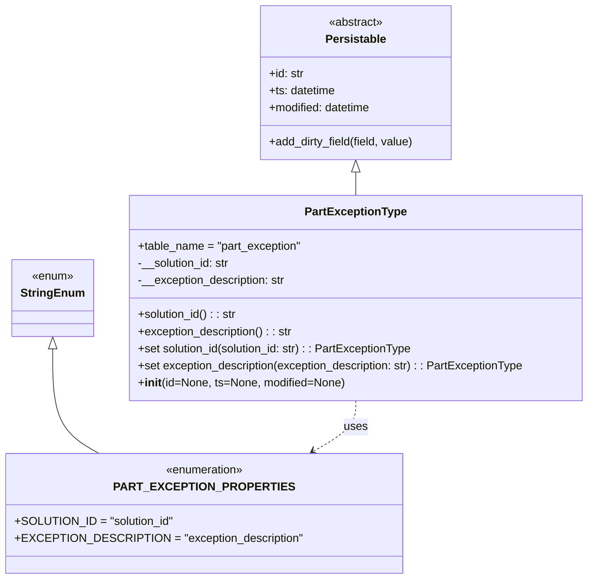

# Diagram: partview_service/partview_service/core/datamodel/PartExceptionType.py

> Auto-generated by Obscura crawlers

## Mermaid

### SVG

<svg id="container" width="815.3046875" xmlns="http://www.w3.org/2000/svg" class="classDiagram" height="812" viewBox="0 0 815.3046875 812" role="graphics-document document" aria-roledescription="class"><g><defs><marker id="container_class-aggregationStart" class="marker aggregation class" refX="18" refY="7" markerWidth="190" markerHeight="240" orient="auto"><path d="M 18,7 L9,13 L1,7 L9,1 Z"></path></marker></defs><defs><marker id="container_class-aggregationEnd" class="marker aggregation class" refX="1" refY="7" markerWidth="20" markerHeight="28" orient="auto"><path d="M 18,7 L9,13 L1,7 L9,1 Z"></path></marker></defs><defs><marker id="container_class-extensionStart" class="marker extension class" refX="18" refY="7" markerWidth="190" markerHeight="240" orient="auto"><path d="M 1,7 L18,13 V 1 Z"></path></marker></defs><defs><marker id="container_class-extensionEnd" class="marker extension class" refX="1" refY="7" markerWidth="20" markerHeight="28" orient="auto"><path d="M 1,1 V 13 L18,7 Z"></path></marker></defs><defs><marker id="container_class-compositionStart" class="marker composition class" refX="18" refY="7" markerWidth="190" markerHeight="240" orient="auto"><path d="M 18,7 L9,13 L1,7 L9,1 Z"></path></marker></defs><defs><marker id="container_class-compositionEnd" class="marker composition class" refX="1" refY="7" markerWidth="20" markerHeight="28" orient="auto"><path d="M 18,7 L9,13 L1,7 L9,1 Z"></path></marker></defs><defs><marker id="container_class-dependencyStart" class="marker dependency class" refX="6" refY="7" markerWidth="190" markerHeight="240" orient="auto"><path d="M 5,7 L9,13 L1,7 L9,1 Z"></path></marker></defs><defs><marker id="container_class-dependencyEnd" class="marker dependency class" refX="13" refY="7" markerWidth="20" markerHeight="28" orient="auto"><path d="M 18,7 L9,13 L14,7 L9,1 Z"></path></marker></defs><defs><marker id="container_class-lollipopStart" class="marker lollipop class" refX="13" refY="7" markerWidth="190" markerHeight="240" orient="auto"><circle stroke="black" fill="transparent" cx="7" cy="7" r="6"></circle></marker></defs><defs><marker id="container_class-lollipopEnd" class="marker lollipop class" refX="1" refY="7" markerWidth="190" markerHeight="240" orient="auto"><circle stroke="black" fill="transparent" cx="7" cy="7" r="6"></circle></marker></defs><g class="root"><g class="clusters"></g><g class="edgePaths"><path d="M486.887,241.25L486.887,242.542C486.887,243.833,486.887,246.417,486.887,251.875C486.887,257.333,486.887,265.667,486.887,269.833L486.887,274" id="id_Persistable_PartExceptionType_1" class="edge-thickness-normal edge-pattern-solid relation" style=";;;" data-edge="true" data-et="edge" data-id="id_Persistable_PartExceptionType_1" data-points="W3sieCI6NDg2Ljg4NjcxODc1LCJ5IjoyMjR9LHsieCI6NDg2Ljg4NjcxODc1LCJ5IjoyNDl9LHsieCI6NDg2Ljg4NjcxODc1LCJ5IjoyNzR9XQ==" marker-start="url(#container_class-extensionStart)"></path><path d="M62.234,489.25L62.234,507.542C62.234,525.833,62.234,562.417,73.055,586.875C83.876,611.333,105.518,623.667,116.34,629.833L127.161,636" id="id_StringEnum_PART_EXCEPTION_PROPERTIES_2" class="edge-thickness-normal edge-pattern-solid relation" style=";;;" data-edge="true" data-et="edge" data-id="id_StringEnum_PART_EXCEPTION_PROPERTIES_2" data-points="W3sieCI6NjIuMjM0Mzc1LCJ5Ijo0NzJ9LHsieCI6NjIuMjM0Mzc1LCJ5Ijo1OTl9LHsieCI6MTI3LjE2MDU1OTc4ODIyMzE0LCJ5Ijo2MzZ9XQ==" marker-start="url(#container_class-extensionStart)"></path><path d="M486.887,562L486.887,568.167C486.887,574.333,486.887,586.667,476.935,598.505C466.982,610.343,447.078,621.686,437.126,627.358L427.173,633.029" id="id_PartExceptionType_PART_EXCEPTION_PROPERTIES_3" class="edge-thickness-normal edge-pattern-dashed relation" style=";;;" data-edge="true" data-et="edge" data-id="id_PartExceptionType_PART_EXCEPTION_PROPERTIES_3" data-points="W3sieCI6NDg2Ljg4NjcxODc1LCJ5Ijo1NjJ9LHsieCI6NDg2Ljg4NjcxODc1LCJ5Ijo1OTl9LHsieCI6NDIxLjk2MDUzMzk2MTc3NjgzLCJ5Ijo2MzZ9XQ==" marker-end="url(#container_class-dependencyEnd)"></path></g><g class="edgeLabels"><g class="edgeLabel"><g class="label" data-id="id_Persistable_PartExceptionType_1" transform="translate(0, 0)"><foreignObject width="0" height="0">

</foreignObject></g></g><g class="edgeLabel"><g class="label" data-id="id_StringEnum_PART_EXCEPTION_PROPERTIES_2" transform="translate(0, 0)"><foreignObject width="0" height="0">

</foreignObject></g></g><g class="edgeLabel" transform="translate(486.88671875, 599)"><g class="label" data-id="id_PartExceptionType_PART_EXCEPTION_PROPERTIES_3" transform="translate(-16.4921875, -12)"><foreignObject width="32.984375" height="24">

uses

</foreignObject></g></g></g><g class="nodes"><g class="node default" id="classId-Persistable-0" transform="translate(486.88671875, 116)"><g class="basic label-container"><path d="M-135.71484375 -108 L135.71484375 -108 L135.71484375 108 L-135.71484375 108" stroke="none" stroke-width="0" fill="#ECECFF" style=""></path><path d="M-135.71484375 -108 C-29.587678150320556 -108, 76.53948744935889 -108, 135.71484375 -108 M-135.71484375 -108 C-44.59856114554077 -108, 46.51772145891846 -108, 135.71484375 -108 M135.71484375 -108 C135.71484375 -59.79055541772383, 135.71484375 -11.58111083544766, 135.71484375 108 M135.71484375 -108 C135.71484375 -30.365108090077143, 135.71484375 47.26978381984571, 135.71484375 108 M135.71484375 108 C76.28635546570354 108, 16.857867181407087 108, -135.71484375 108 M135.71484375 108 C46.36167371877232 108, -42.991496312455354 108, -135.71484375 108 M-135.71484375 108 C-135.71484375 40.42688198310104, -135.71484375 -27.14623603379792, -135.71484375 -108 M-135.71484375 108 C-135.71484375 50.168270997366335, -135.71484375 -7.66345800526733, -135.71484375 -108" stroke="#9370DB" stroke-width="1.3" fill="none" stroke-dasharray="0 0" style=""></path></g><g class="annotation-group text" transform="translate(-38.609375, -84)"><g class="label" style="" transform="translate(0,-12)"><foreignObject width="77.21875" height="24">

«abstract»

</foreignObject></g></g><g class="label-group text" transform="translate(-40.9765625, -60)"><g class="label" style="font-weight: bolder" transform="translate(0,-12)"><foreignObject width="81.953125" height="24">

Persistable

</foreignObject></g></g><g class="members-group text" transform="translate(-123.71484375, -12)"><g class="label" style="" transform="translate(0,-12)"><foreignObject width="49.578125" height="24">

+id: str

</foreignObject></g><g class="label" style="" transform="translate(0,12)"><foreignObject width="94.484375" height="24">

+ts: datetime

</foreignObject></g><g class="label" style="" transform="translate(0,36)"><foreignObject width="145.9375" height="24">

+modified: datetime

</foreignObject></g></g><g class="methods-group text" transform="translate(-123.71484375, 84)"><g class="label" style="" transform="translate(0,-12)"><foreignObject width="206.453125" height="24">

+add_dirty_field(field, value)

</foreignObject></g></g><g class="divider" style=""><path d="M-135.71484375 -36 C-51.01335772277116 -36, 33.68812830445768 -36, 135.71484375 -36 M-135.71484375 -36 C-28.850395874167035 -36, 78.01405200166593 -36, 135.71484375 -36" stroke="#9370DB" stroke-width="1.3" fill="none" stroke-dasharray="0 0" style=""></path></g><g class="divider" style=""><path d="M-135.71484375 60 C-54.25677972423006 60, 27.201284301539886 60, 135.71484375 60 M-135.71484375 60 C-48.37477326405832 60, 38.96529722188336 60, 135.71484375 60" stroke="#9370DB" stroke-width="1.3" fill="none" stroke-dasharray="0 0" style=""></path></g></g><g class="node default" id="classId-StringEnum-1" transform="translate(62.234375, 418)"><g class="basic label-container"><path d="M-54.234375 -54 L54.234375 -54 L54.234375 54 L-54.234375 54" stroke="none" stroke-width="0" fill="#ECECFF" style=""></path><path d="M-54.234375 -54 C-19.6897281565493 -54, 14.8549186869014 -54, 54.234375 -54 M-54.234375 -54 C-25.59368923380398 -54, 3.0469965323920434 -54, 54.234375 -54 M54.234375 -54 C54.234375 -19.088724379840507, 54.234375 15.822551240318987, 54.234375 54 M54.234375 -54 C54.234375 -24.92998391593118, 54.234375 4.140032168137637, 54.234375 54 M54.234375 54 C31.46735556083062 54, 8.700336121661238 54, -54.234375 54 M54.234375 54 C29.56844193619748 54, 4.902508872394961 54, -54.234375 54 M-54.234375 54 C-54.234375 20.727588233364365, -54.234375 -12.54482353327127, -54.234375 -54 M-54.234375 54 C-54.234375 21.094722249272017, -54.234375 -11.810555501455966, -54.234375 -54" stroke="#9370DB" stroke-width="1.3" fill="none" stroke-dasharray="0 0" style=""></path></g><g class="annotation-group text" transform="translate(-29.53125, -30)"><g class="label" style="" transform="translate(0,-12)"><foreignObject width="59.0625" height="24">

«enum»

</foreignObject></g></g><g class="label-group text" transform="translate(-42.234375, -6)"><g class="label" style="font-weight: bolder" transform="translate(0,-12)"><foreignObject width="84.46875" height="24">

StringEnum

</foreignObject></g></g><g class="members-group text" transform="translate(-42.234375, 42)"></g><g class="methods-group text" transform="translate(-42.234375, 72)"></g><g class="divider" style=""><path d="M-54.234375 18 C-22.375036906789195 18, 9.484301186421611 18, 54.234375 18 M-54.234375 18 C-14.369223237602327 18, 25.495928524795346 18, 54.234375 18" stroke="#9370DB" stroke-width="1.3" fill="none" stroke-dasharray="0 0" style=""></path></g><g class="divider" style=""><path d="M-54.234375 36 C-24.190880849289876 36, 5.852613301420249 36, 54.234375 36 M-54.234375 36 C-11.031989416468093 36, 32.170396167063814 36, 54.234375 36" stroke="#9370DB" stroke-width="1.3" fill="none" stroke-dasharray="0 0" style=""></path></g></g><g class="node default" id="classId-PART_EXCEPTION_PROPERTIES-2" transform="translate(274.560546875, 720)"><g class="basic label-container"><path d="M-256.8203125 -84 L256.8203125 -84 L256.8203125 84 L-256.8203125 84" stroke="none" stroke-width="0" fill="#ECECFF" style=""></path><path d="M-256.8203125 -84 C-103.38699569002605 -84, 50.04632111994789 -84, 256.8203125 -84 M-256.8203125 -84 C-125.87317288832753 -84, 5.073966723344938 -84, 256.8203125 -84 M256.8203125 -84 C256.8203125 -36.10796144956112, 256.8203125 11.784077100877766, 256.8203125 84 M256.8203125 -84 C256.8203125 -17.001750458373024, 256.8203125 49.99649908325395, 256.8203125 84 M256.8203125 84 C107.0769274235389 84, -42.66645765292219 84, -256.8203125 84 M256.8203125 84 C79.5330639422659 84, -97.7541846154682 84, -256.8203125 84 M-256.8203125 84 C-256.8203125 17.707919274524713, -256.8203125 -48.584161450950575, -256.8203125 -84 M-256.8203125 84 C-256.8203125 41.08636790038491, -256.8203125 -1.8272641992301857, -256.8203125 -84" stroke="#9370DB" stroke-width="1.3" fill="none" stroke-dasharray="0 0" style=""></path></g><g class="annotation-group text" transform="translate(-55.5546875, -60)"><g class="label" style="" transform="translate(0,-12)"><foreignObject width="111.109375" height="24">

«enumeration»

</foreignObject></g></g><g class="label-group text" transform="translate(-109.984375, -36)"><g class="label" style="font-weight: bolder" transform="translate(0,-12)"><foreignObject width="219.96875" height="24">

PART_EXCEPTION_PROPERTIES

</foreignObject></g></g><g class="members-group text" transform="translate(-244.8203125, 12)"><g class="label" style="" transform="translate(0,-12)"><foreignObject width="214.953125" height="24">

+SOLUTION_ID = "solution_id"

</foreignObject></g><g class="label" style="" transform="translate(0,12)"><foreignObject width="379.65625" height="24">

+EXCEPTION_DESCRIPTION = "exception_description"

</foreignObject></g></g><g class="methods-group text" transform="translate(-244.8203125, 84)"></g><g class="divider" style=""><path d="M-256.8203125 -12 C-127.63781594802174 -12, 1.5446806039565217 -12, 256.8203125 -12 M-256.8203125 -12 C-66.12333957625773 -12, 124.57363334748453 -12, 256.8203125 -12" stroke="#9370DB" stroke-width="1.3" fill="none" stroke-dasharray="0 0" style=""></path></g><g class="divider" style=""><path d="M-256.8203125 60 C-86.24160190730197 60, 84.33710868539606 60, 256.8203125 60 M-256.8203125 60 C-133.19016315368208 60, -9.560013807364129 60, 256.8203125 60" stroke="#9370DB" stroke-width="1.3" fill="none" stroke-dasharray="0 0" style=""></path></g></g><g class="node default" id="classId-PartExceptionType-3" transform="translate(486.88671875, 418)"><g class="basic label-container"><path d="M-320.41796875 -144 L320.41796875 -144 L320.41796875 144 L-320.41796875 144" stroke="none" stroke-width="0" fill="#ECECFF" style=""></path><path d="M-320.41796875 -144 C-103.52504013158887 -144, 113.36788848682227 -144, 320.41796875 -144 M-320.41796875 -144 C-140.63678205567612 -144, 39.14440463864776 -144, 320.41796875 -144 M320.41796875 -144 C320.41796875 -35.12826791569947, 320.41796875 73.74346416860107, 320.41796875 144 M320.41796875 -144 C320.41796875 -45.10447238048643, 320.41796875 53.791055239027145, 320.41796875 144 M320.41796875 144 C130.2949932376997 144, -59.82798227460057 144, -320.41796875 144 M320.41796875 144 C164.19306319609785 144, 7.968157642195706 144, -320.41796875 144 M-320.41796875 144 C-320.41796875 68.6694436266233, -320.41796875 -6.661112746753389, -320.41796875 -144 M-320.41796875 144 C-320.41796875 43.760271346984084, -320.41796875 -56.47945730603183, -320.41796875 -144" stroke="#9370DB" stroke-width="1.3" fill="none" stroke-dasharray="0 0" style=""></path></g><g class="annotation-group text" transform="translate(0, -120)"></g><g class="label-group text" transform="translate(-68.1015625, -120)"><g class="label" style="font-weight: bolder" transform="translate(0,-12)"><foreignObject width="136.203125" height="24">

PartExceptionType

</foreignObject></g></g><g class="members-group text" transform="translate(-308.41796875, -72)"><g class="label" style="" transform="translate(0,-12)"><foreignObject width="231.46875" height="24">

+table_name = "part_exception"

</foreignObject></g><g class="label" style="" transform="translate(0,12)"><foreignObject width="131.390625" height="24">

-__solution_id: str

</foreignObject></g><g class="label" style="" transform="translate(0,36)"><foreignObject width="210.203125" height="24">

-__exception_description: str

</foreignObject></g></g><g class="methods-group text" transform="translate(-308.41796875, 24)"><g class="label" style="" transform="translate(0,-12)"><foreignObject width="140.40625" height="24">

+solution_id() : : str

</foreignObject></g><g class="label" style="" transform="translate(0,12)"><foreignObject width="219.546875" height="24">

+exception_description() : : str

</foreignObject></g><g class="label" style="" transform="translate(0,36)"><foreignObject width="390.453125" height="24">

+set solution_id(solution_id: str) : : PartExceptionType

</foreignObject></g><g class="label" style="" transform="translate(0,60)"><foreignObject width="548.734375" height="24">

+set exception_description(exception_description: str) : : PartExceptionType

</foreignObject></g><g class="label" style="" transform="translate(0,84)"><foreignObject width="289.6875" height="24">

+<strong>init</strong>(id=None, ts=None, modified=None)

</foreignObject></g></g><g class="divider" style=""><path d="M-320.41796875 -96 C-83.08128264002553 -96, 154.25540346994893 -96, 320.41796875 -96 M-320.41796875 -96 C-78.1555888170447 -96, 164.1067911159106 -96, 320.41796875 -96" stroke="#9370DB" stroke-width="1.3" fill="none" stroke-dasharray="0 0" style=""></path></g><g class="divider" style=""><path d="M-320.41796875 0 C-164.5345587586722 0, -8.65114876734441 0, 320.41796875 0 M-320.41796875 0 C-131.6149413011173 0, 57.188086147765375 0, 320.41796875 0" stroke="#9370DB" stroke-width="1.3" fill="none" stroke-dasharray="0 0" style=""></path></g></g></g></g></g></svg>
