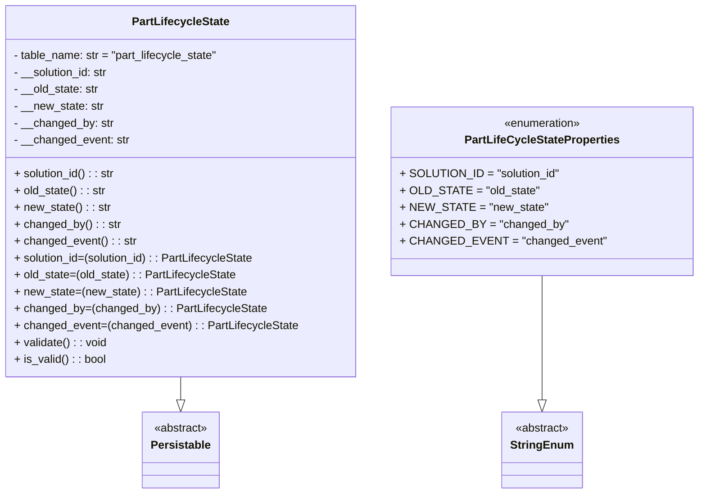

# Diagram: partview_service/partview_service/core/datamodel/PartLifecycleState.py

> Auto-generated by Obscura crawlers

## Mermaid

### SVG

<svg id="container" width="958.015625" xmlns="http://www.w3.org/2000/svg" class="classDiagram" height="702" viewBox="0 0 958.015625 702" role="graphics-document document" aria-roledescription="class"><g><defs><marker id="container_class-aggregationStart" class="marker aggregation class" refX="18" refY="7" markerWidth="190" markerHeight="240" orient="auto"><path d="M 18,7 L9,13 L1,7 L9,1 Z"></path></marker></defs><defs><marker id="container_class-aggregationEnd" class="marker aggregation class" refX="1" refY="7" markerWidth="20" markerHeight="28" orient="auto"><path d="M 18,7 L9,13 L1,7 L9,1 Z"></path></marker></defs><defs><marker id="container_class-extensionStart" class="marker extension class" refX="18" refY="7" markerWidth="190" markerHeight="240" orient="auto"><path d="M 1,7 L18,13 V 1 Z"></path></marker></defs><defs><marker id="container_class-extensionEnd" class="marker extension class" refX="1" refY="7" markerWidth="20" markerHeight="28" orient="auto"><path d="M 1,1 V 13 L18,7 Z"></path></marker></defs><defs><marker id="container_class-compositionStart" class="marker composition class" refX="18" refY="7" markerWidth="190" markerHeight="240" orient="auto"><path d="M 18,7 L9,13 L1,7 L9,1 Z"></path></marker></defs><defs><marker id="container_class-compositionEnd" class="marker composition class" refX="1" refY="7" markerWidth="20" markerHeight="28" orient="auto"><path d="M 18,7 L9,13 L1,7 L9,1 Z"></path></marker></defs><defs><marker id="container_class-dependencyStart" class="marker dependency class" refX="6" refY="7" markerWidth="190" markerHeight="240" orient="auto"><path d="M 5,7 L9,13 L1,7 L9,1 Z"></path></marker></defs><defs><marker id="container_class-dependencyEnd" class="marker dependency class" refX="13" refY="7" markerWidth="20" markerHeight="28" orient="auto"><path d="M 18,7 L9,13 L14,7 L9,1 Z"></path></marker></defs><defs><marker id="container_class-lollipopStart" class="marker lollipop class" refX="13" refY="7" markerWidth="190" markerHeight="240" orient="auto"><circle stroke="black" fill="transparent" cx="7" cy="7" r="6"></circle></marker></defs><defs><marker id="container_class-lollipopEnd" class="marker lollipop class" refX="1" refY="7" markerWidth="190" markerHeight="240" orient="auto"><circle stroke="black" fill="transparent" cx="7" cy="7" r="6"></circle></marker></defs><g class="root"><g class="clusters"></g><g class="edgePaths"><path d="M253.125,536L253.125,540.167C253.125,544.333,253.125,552.667,253.125,558.125C253.125,563.583,253.125,566.167,253.125,567.458L253.125,568.75" id="id_PartLifecycleState_Persistable_1" class="edge-thickness-normal edge-pattern-solid relation" style=";;;" data-edge="true" data-et="edge" data-id="id_PartLifecycleState_Persistable_1" data-points="W3sieCI6MjUzLjEyNSwieSI6NTM2fSx7IngiOjI1My4xMjUsInkiOjU2MX0seyJ4IjoyNTMuMTI1LCJ5Ijo1ODZ9XQ==" marker-end="url(#container_class-extensionEnd)"></path><path d="M749.133,392L749.133,420.167C749.133,448.333,749.133,504.667,749.133,534.125C749.133,563.583,749.133,566.167,749.133,567.458L749.133,568.75" id="id_PartLifeCycleStateProperties_StringEnum_2" class="edge-thickness-normal edge-pattern-solid relation" style=";;;" data-edge="true" data-et="edge" data-id="id_PartLifeCycleStateProperties_StringEnum_2" data-points="W3sieCI6NzQ5LjEzMjgxMjUsInkiOjM5Mn0seyJ4Ijo3NDkuMTMyODEyNSwieSI6NTYxfSx7IngiOjc0OS4xMzI4MTI1LCJ5Ijo1ODZ9XQ==" marker-end="url(#container_class-extensionEnd)"></path></g><g class="edgeLabels"><g class="edgeLabel"><g class="label" data-id="id_PartLifecycleState_Persistable_1" transform="translate(0, 0)"><foreignObject width="0" height="0">

</foreignObject></g></g><g class="edgeLabel"><g class="label" data-id="id_PartLifeCycleStateProperties_StringEnum_2" transform="translate(0, 0)"><foreignObject width="0" height="0">

</foreignObject></g></g></g><g class="nodes"><g class="node default" id="classId-PartLifecycleState-0" transform="translate(253.125, 272)"><g class="basic label-container"><path d="M-245.125 -264 L245.125 -264 L245.125 264 L-245.125 264" stroke="none" stroke-width="0" fill="#ECECFF" style=""></path><path d="M-245.125 -264 C-143.30181679124956 -264, -41.4786335824991 -264, 245.125 -264 M-245.125 -264 C-123.74083843879535 -264, -2.3566768775907008 -264, 245.125 -264 M245.125 -264 C245.125 -121.0407945692275, 245.125 21.918410861545, 245.125 264 M245.125 -264 C245.125 -151.06003904445836, 245.125 -38.12007808891673, 245.125 264 M245.125 264 C128.06859239940684 264, 11.012184798813678 264, -245.125 264 M245.125 264 C132.17724739844004 264, 19.22949479688009 264, -245.125 264 M-245.125 264 C-245.125 142.37365135350782, -245.125 20.74730270701565, -245.125 -264 M-245.125 264 C-245.125 72.09233675027426, -245.125 -119.81532649945149, -245.125 -264" stroke="#9370DB" stroke-width="1.3" fill="none" stroke-dasharray="0 0" style=""></path></g><g class="annotation-group text" transform="translate(0, -240)"></g><g class="label-group text" transform="translate(-66.421875, -240)"><g class="label" style="font-weight: bolder" transform="translate(0,-12)"><foreignObject width="132.84375" height="24">

PartLifecycleState

</foreignObject></g></g><g class="members-group text" transform="translate(-233.125, -192)"><g class="label" style="" transform="translate(0,-12)"><foreignObject width="294.8125" height="24">

- table_name: str = "part_lifecycle_state"

</foreignObject></g><g class="label" style="" transform="translate(0,12)"><foreignObject width="136.90625" height="24">

- __solution_id: str

</foreignObject></g><g class="label" style="" transform="translate(0,36)"><foreignObject width="122.296875" height="24">

- __old_state: str

</foreignObject></g><g class="label" style="" transform="translate(0,60)"><foreignObject width="128.34375" height="24">

- __new_state: str

</foreignObject></g><g class="label" style="" transform="translate(0,84)"><foreignObject width="141.515625" height="24">

- __changed_by: str

</foreignObject></g><g class="label" style="" transform="translate(0,108)"><foreignObject width="164.21875" height="24">

- __changed_event: str

</foreignObject></g></g><g class="methods-group text" transform="translate(-233.125, -24)"><g class="label" style="" transform="translate(0,-12)"><foreignObject width="144.640625" height="24">

+ solution_id() : : str

</foreignObject></g><g class="label" style="" transform="translate(0,12)"><foreignObject width="130.359375" height="24">

+ old_state() : : str

</foreignObject></g><g class="label" style="" transform="translate(0,36)"><foreignObject width="136.09375" height="24">

+ new_state() : : str

</foreignObject></g><g class="label" style="" transform="translate(0,60)"><foreignObject width="149.515625" height="24">

+ changed_by() : : str

</foreignObject></g><g class="label" style="" transform="translate(0,84)"><foreignObject width="172.21875" height="24">

+ changed_event() : : str

</foreignObject></g><g class="label" style="" transform="translate(0,108)"><foreignObject width="344.703125" height="24">

+ solution_id=(solution_id) : : PartLifecycleState

</foreignObject></g><g class="label" style="" transform="translate(0,132)"><foreignObject width="316.125" height="24">

+ old_state=(old_state) : : PartLifecycleState

</foreignObject></g><g class="label" style="" transform="translate(0,156)"><foreignObject width="327.578125" height="24">

+ new_state=(new_state) : : PartLifecycleState

</foreignObject></g><g class="label" style="" transform="translate(0,180)"><foreignObject width="354.421875" height="24">

+ changed_by=(changed_by) : : PartLifecycleState

</foreignObject></g><g class="label" style="" transform="translate(0,204)"><foreignObject width="399.828125" height="24">

+ changed_event=(changed_event) : : PartLifecycleState

</foreignObject></g><g class="label" style="" transform="translate(0,228)"><foreignObject width="132.125" height="24">

+ validate() : : void

</foreignObject></g><g class="label" style="" transform="translate(0,252)"><foreignObject width="130.3125" height="24">

+ is_valid() : : bool

</foreignObject></g></g><g class="divider" style=""><path d="M-245.125 -216 C-101.89031055406016 -216, 41.34437889187967 -216, 245.125 -216 M-245.125 -216 C-134.8594284385876 -216, -24.5938568771752 -216, 245.125 -216" stroke="#9370DB" stroke-width="1.3" fill="none" stroke-dasharray="0 0" style=""></path></g><g class="divider" style=""><path d="M-245.125 -48 C-53.85654176572368 -48, 137.41191646855265 -48, 245.125 -48 M-245.125 -48 C-65.16669249429413 -48, 114.79161501141175 -48, 245.125 -48" stroke="#9370DB" stroke-width="1.3" fill="none" stroke-dasharray="0 0" style=""></path></g></g><g class="node default" id="classId-Persistable-1" transform="translate(253.125, 640)"><g class="basic label-container"><path d="M-52.9765625 -54 L52.9765625 -54 L52.9765625 54 L-52.9765625 54" stroke="none" stroke-width="0" fill="#ECECFF" style=""></path><path d="M-52.9765625 -54 C-21.626506061538258 -54, 9.723550376923484 -54, 52.9765625 -54 M-52.9765625 -54 C-30.484612549129178 -54, -7.992662598258356 -54, 52.9765625 -54 M52.9765625 -54 C52.9765625 -31.00517765105553, 52.9765625 -8.010355302111059, 52.9765625 54 M52.9765625 -54 C52.9765625 -14.361917290940724, 52.9765625 25.276165418118552, 52.9765625 54 M52.9765625 54 C25.454328874357365 54, -2.067904751285269 54, -52.9765625 54 M52.9765625 54 C25.333328020429057 54, -2.309906459141885 54, -52.9765625 54 M-52.9765625 54 C-52.9765625 21.40078904154229, -52.9765625 -11.198421916915422, -52.9765625 -54 M-52.9765625 54 C-52.9765625 19.573986050274108, -52.9765625 -14.852027899451784, -52.9765625 -54" stroke="#9370DB" stroke-width="1.3" fill="none" stroke-dasharray="0 0" style=""></path></g><g class="annotation-group text" transform="translate(-38.609375, -30)"><g class="label" style="" transform="translate(0,-12)"><foreignObject width="77.21875" height="24">

«abstract»

</foreignObject></g></g><g class="label-group text" transform="translate(-40.9765625, -6)"><g class="label" style="font-weight: bolder" transform="translate(0,-12)"><foreignObject width="81.953125" height="24">

Persistable

</foreignObject></g></g><g class="members-group text" transform="translate(-40.9765625, 42)"></g><g class="methods-group text" transform="translate(-40.9765625, 72)"></g><g class="divider" style=""><path d="M-52.9765625 18 C-29.460296357792778 18, -5.944030215585556 18, 52.9765625 18 M-52.9765625 18 C-12.908505379512896 18, 27.15955174097421 18, 52.9765625 18" stroke="#9370DB" stroke-width="1.3" fill="none" stroke-dasharray="0 0" style=""></path></g><g class="divider" style=""><path d="M-52.9765625 36 C-20.820504115532543 36, 11.335554268934914 36, 52.9765625 36 M-52.9765625 36 C-30.296910300914647 36, -7.617258101829293 36, 52.9765625 36" stroke="#9370DB" stroke-width="1.3" fill="none" stroke-dasharray="0 0" style=""></path></g></g><g class="node default" id="classId-PartLifeCycleStateProperties-2" transform="translate(749.1328125, 272)"><g class="basic label-container"><path d="M-200.8828125 -120 L200.8828125 -120 L200.8828125 120 L-200.8828125 120" stroke="none" stroke-width="0" fill="#ECECFF" style=""></path><path d="M-200.8828125 -120 C-67.77296642363822 -120, 65.33687965272355 -120, 200.8828125 -120 M-200.8828125 -120 C-108.2412899327351 -120, -15.5997673654702 -120, 200.8828125 -120 M200.8828125 -120 C200.8828125 -57.871475073071444, 200.8828125 4.2570498538571115, 200.8828125 120 M200.8828125 -120 C200.8828125 -68.17982733230397, 200.8828125 -16.359654664607945, 200.8828125 120 M200.8828125 120 C113.42995955655215 120, 25.977106613104297 120, -200.8828125 120 M200.8828125 120 C43.38143459669604 120, -114.11994330660792 120, -200.8828125 120 M-200.8828125 120 C-200.8828125 27.924281881529723, -200.8828125 -64.15143623694055, -200.8828125 -120 M-200.8828125 120 C-200.8828125 44.45776093762481, -200.8828125 -31.084478124750376, -200.8828125 -120" stroke="#9370DB" stroke-width="1.3" fill="none" stroke-dasharray="0 0" style=""></path></g><g class="annotation-group text" transform="translate(-55.5546875, -96)"><g class="label" style="" transform="translate(0,-12)"><foreignObject width="111.109375" height="24">

«enumeration»

</foreignObject></g></g><g class="label-group text" transform="translate(-105.09375, -72)"><g class="label" style="font-weight: bolder" transform="translate(0,-12)"><foreignObject width="210.1875" height="24">

PartLifeCycleStateProperties

</foreignObject></g></g><g class="members-group text" transform="translate(-188.8828125, -24)"><g class="label" style="" transform="translate(0,-12)"><foreignObject width="219.828125" height="24">

+ SOLUTION_ID = "solution_id"

</foreignObject></g><g class="label" style="" transform="translate(0,12)"><foreignObject width="186.84375" height="24">

+ OLD_STATE = "old_state"

</foreignObject></g><g class="label" style="" transform="translate(0,36)"><foreignObject width="195.765625" height="24">

+ NEW_STATE = "new_state"

</foreignObject></g><g class="label" style="" transform="translate(0,60)"><foreignObject width="223.125" height="24">

+ CHANGED_BY = "changed_by"

</foreignObject></g><g class="label" style="" transform="translate(0,84)"><foreignObject width="272.671875" height="24">

+ CHANGED_EVENT = "changed_event"

</foreignObject></g></g><g class="methods-group text" transform="translate(-188.8828125, 120)"></g><g class="divider" style=""><path d="M-200.8828125 -48 C-46.03981680707108 -48, 108.80317888585785 -48, 200.8828125 -48 M-200.8828125 -48 C-83.33360158614201 -48, 34.21560932771598 -48, 200.8828125 -48" stroke="#9370DB" stroke-width="1.3" fill="none" stroke-dasharray="0 0" style=""></path></g><g class="divider" style=""><path d="M-200.8828125 96 C-103.09948481125316 96, -5.3161571225063255 96, 200.8828125 96 M-200.8828125 96 C-58.84464101428651 96, 83.19353047142698 96, 200.8828125 96" stroke="#9370DB" stroke-width="1.3" fill="none" stroke-dasharray="0 0" style=""></path></g></g><g class="node default" id="classId-StringEnum-3" transform="translate(749.1328125, 640)"><g class="basic label-container"><path d="M-54.234375 -54 L54.234375 -54 L54.234375 54 L-54.234375 54" stroke="none" stroke-width="0" fill="#ECECFF" style=""></path><path d="M-54.234375 -54 C-13.698114383822016 -54, 26.838146232355967 -54, 54.234375 -54 M-54.234375 -54 C-23.138433767474964 -54, 7.957507465050071 -54, 54.234375 -54 M54.234375 -54 C54.234375 -20.422990382429603, 54.234375 13.154019235140794, 54.234375 54 M54.234375 -54 C54.234375 -23.738001592319158, 54.234375 6.523996815361684, 54.234375 54 M54.234375 54 C15.02178475167851 54, -24.19080549664298 54, -54.234375 54 M54.234375 54 C23.41133373788003 54, -7.411707524239937 54, -54.234375 54 M-54.234375 54 C-54.234375 13.217369824683857, -54.234375 -27.565260350632286, -54.234375 -54 M-54.234375 54 C-54.234375 25.396587907038693, -54.234375 -3.2068241859226134, -54.234375 -54" stroke="#9370DB" stroke-width="1.3" fill="none" stroke-dasharray="0 0" style=""></path></g><g class="annotation-group text" transform="translate(-38.609375, -30)"><g class="label" style="" transform="translate(0,-12)"><foreignObject width="77.21875" height="24">

«abstract»

</foreignObject></g></g><g class="label-group text" transform="translate(-42.234375, -6)"><g class="label" style="font-weight: bolder" transform="translate(0,-12)"><foreignObject width="84.46875" height="24">

StringEnum

</foreignObject></g></g><g class="members-group text" transform="translate(-42.234375, 42)"></g><g class="methods-group text" transform="translate(-42.234375, 72)"></g><g class="divider" style=""><path d="M-54.234375 18 C-24.864653115494733 18, 4.505068769010535 18, 54.234375 18 M-54.234375 18 C-18.2880463053364 18, 17.658282389327198 18, 54.234375 18" stroke="#9370DB" stroke-width="1.3" fill="none" stroke-dasharray="0 0" style=""></path></g><g class="divider" style=""><path d="M-54.234375 36 C-10.853510713115405 36, 32.52735357376919 36, 54.234375 36 M-54.234375 36 C-29.568474204289707 36, -4.902573408579414 36, 54.234375 36" stroke="#9370DB" stroke-width="1.3" fill="none" stroke-dasharray="0 0" style=""></path></g></g></g></g></g></svg>
