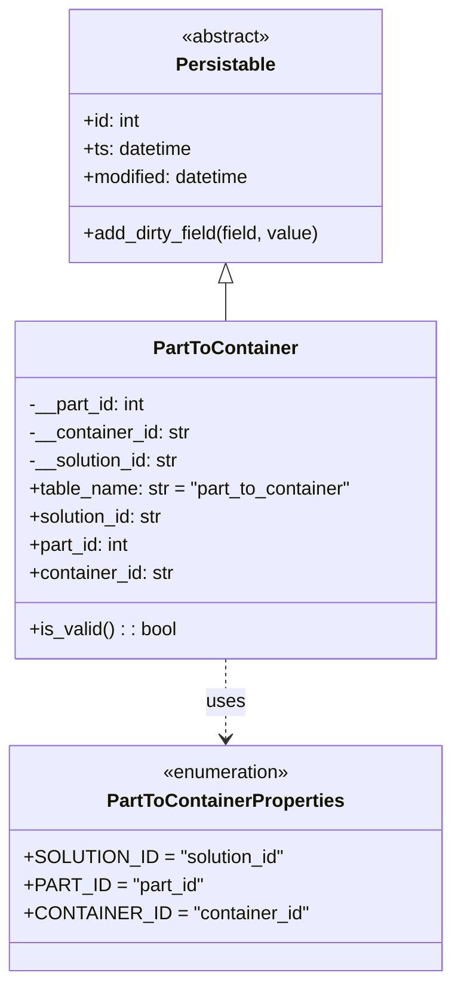
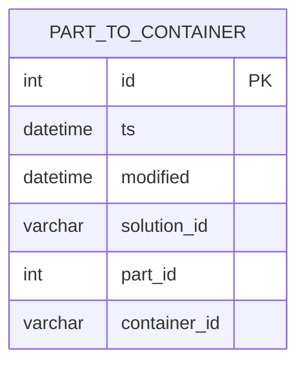

# Diagram: partview_service/partview_service/core/datamodel/PartToContainer.py

> Auto-generated by Obscura crawlers

## Diagram 1

### SVG

<svg id="container" width="379.421875" xmlns="http://www.w3.org/2000/svg" class="classDiagram" height="836" viewBox="0 0 379.421875 836" role="graphics-document document" aria-roledescription="class"><g><defs><marker id="container_class-aggregationStart" class="marker aggregation class" refX="18" refY="7" markerWidth="190" markerHeight="240" orient="auto"><path d="M 18,7 L9,13 L1,7 L9,1 Z"></path></marker></defs><defs><marker id="container_class-aggregationEnd" class="marker aggregation class" refX="1" refY="7" markerWidth="20" markerHeight="28" orient="auto"><path d="M 18,7 L9,13 L1,7 L9,1 Z"></path></marker></defs><defs><marker id="container_class-extensionStart" class="marker extension class" refX="18" refY="7" markerWidth="190" markerHeight="240" orient="auto"><path d="M 1,7 L18,13 V 1 Z"></path></marker></defs><defs><marker id="container_class-extensionEnd" class="marker extension class" refX="1" refY="7" markerWidth="20" markerHeight="28" orient="auto"><path d="M 1,1 V 13 L18,7 Z"></path></marker></defs><defs><marker id="container_class-compositionStart" class="marker composition class" refX="18" refY="7" markerWidth="190" markerHeight="240" orient="auto"><path d="M 18,7 L9,13 L1,7 L9,1 Z"></path></marker></defs><defs><marker id="container_class-compositionEnd" class="marker composition class" refX="1" refY="7" markerWidth="20" markerHeight="28" orient="auto"><path d="M 18,7 L9,13 L1,7 L9,1 Z"></path></marker></defs><defs><marker id="container_class-dependencyStart" class="marker dependency class" refX="6" refY="7" markerWidth="190" markerHeight="240" orient="auto"><path d="M 5,7 L9,13 L1,7 L9,1 Z"></path></marker></defs><defs><marker id="container_class-dependencyEnd" class="marker dependency class" refX="13" refY="7" markerWidth="20" markerHeight="28" orient="auto"><path d="M 18,7 L9,13 L14,7 L9,1 Z"></path></marker></defs><defs><marker id="container_class-lollipopStart" class="marker lollipop class" refX="13" refY="7" markerWidth="190" markerHeight="240" orient="auto"><circle stroke="black" fill="transparent" cx="7" cy="7" r="6"></circle></marker></defs><defs><marker id="container_class-lollipopEnd" class="marker lollipop class" refX="1" refY="7" markerWidth="190" markerHeight="240" orient="auto"><circle stroke="black" fill="transparent" cx="7" cy="7" r="6"></circle></marker></defs><g class="root"><g class="clusters"></g><g class="edgePaths"><path d="M189.711,241.25L189.711,242.542C189.711,243.833,189.711,246.417,189.711,251.875C189.711,257.333,189.711,265.667,189.711,269.833L189.711,274" id="id_Persistable_PartToContainer_1" class="edge-thickness-normal edge-pattern-solid relation" style=";;;" data-edge="true" data-et="edge" data-id="id_Persistable_PartToContainer_1" data-points="W3sieCI6MTg5LjcxMDkzNzUsInkiOjIyNH0seyJ4IjoxODkuNzEwOTM3NSwieSI6MjQ5fSx7IngiOjE4OS43MTA5Mzc1LCJ5IjoyNzR9XQ==" marker-start="url(#container_class-extensionStart)"></path><path d="M189.711,562L189.711,568.167C189.711,574.333,189.711,586.667,189.711,598C189.711,609.333,189.711,619.667,189.711,624.833L189.711,630" id="id_PartToContainer_PartToContainerProperties_2" class="edge-thickness-normal edge-pattern-dashed relation" style=";;;" data-edge="true" data-et="edge" data-id="id_PartToContainer_PartToContainerProperties_2" data-points="W3sieCI6MTg5LjcxMDkzNzUsInkiOjU2Mn0seyJ4IjoxODkuNzEwOTM3NSwieSI6NTk5fSx7IngiOjE4OS43MTA5Mzc1LCJ5Ijo2MzZ9XQ==" marker-end="url(#container_class-dependencyEnd)"></path></g><g class="edgeLabels"><g class="edgeLabel"><g class="label" data-id="id_Persistable_PartToContainer_1" transform="translate(0, 0)"><foreignObject width="0" height="0">

</foreignObject></g></g><g class="edgeLabel" transform="translate(189.7109375, 599)"><g class="label" data-id="id_PartToContainer_PartToContainerProperties_2" transform="translate(-16.4921875, -12)"><foreignObject width="32.984375" height="24">

uses

</foreignObject></g></g></g><g class="nodes"><g class="node default" id="classId-Persistable-0" transform="translate(189.7109375, 116)"><g class="basic label-container"><path d="M-135.71484375 -108 L135.71484375 -108 L135.71484375 108 L-135.71484375 108" stroke="none" stroke-width="0" fill="#ECECFF" style=""></path><path d="M-135.71484375 -108 C-48.78770373931377 -108, 38.13943627137246 -108, 135.71484375 -108 M-135.71484375 -108 C-75.5061320895758 -108, -15.2974204291516 -108, 135.71484375 -108 M135.71484375 -108 C135.71484375 -64.05611858354494, 135.71484375 -20.112237167089887, 135.71484375 108 M135.71484375 -108 C135.71484375 -22.471745591317358, 135.71484375 63.056508817365284, 135.71484375 108 M135.71484375 108 C73.53873017715037 108, 11.36261660430074 108, -135.71484375 108 M135.71484375 108 C56.61455183884985 108, -22.485740072300302 108, -135.71484375 108 M-135.71484375 108 C-135.71484375 44.436366039201744, -135.71484375 -19.127267921596513, -135.71484375 -108 M-135.71484375 108 C-135.71484375 61.22896880773979, -135.71484375 14.45793761547958, -135.71484375 -108" stroke="#9370DB" stroke-width="1.3" fill="none" stroke-dasharray="0 0" style=""></path></g><g class="annotation-group text" transform="translate(-38.609375, -84)"><g class="label" style="" transform="translate(0,-12)"><foreignObject width="77.21875" height="24">

«abstract»

</foreignObject></g></g><g class="label-group text" transform="translate(-40.9765625, -60)"><g class="label" style="font-weight: bolder" transform="translate(0,-12)"><foreignObject width="81.953125" height="24">

Persistable

</foreignObject></g></g><g class="members-group text" transform="translate(-123.71484375, -12)"><g class="label" style="" transform="translate(0,-12)"><foreignObject width="49.8125" height="24">

+id: int

</foreignObject></g><g class="label" style="" transform="translate(0,12)"><foreignObject width="94.484375" height="24">

+ts: datetime

</foreignObject></g><g class="label" style="" transform="translate(0,36)"><foreignObject width="145.9375" height="24">

+modified: datetime

</foreignObject></g></g><g class="methods-group text" transform="translate(-123.71484375, 84)"><g class="label" style="" transform="translate(0,-12)"><foreignObject width="206.453125" height="24">

+add_dirty_field(field, value)

</foreignObject></g></g><g class="divider" style=""><path d="M-135.71484375 -36 C-46.67564239122558 -36, 42.36355896754884 -36, 135.71484375 -36 M-135.71484375 -36 C-77.70139641177745 -36, -19.687949073554904 -36, 135.71484375 -36" stroke="#9370DB" stroke-width="1.3" fill="none" stroke-dasharray="0 0" style=""></path></g><g class="divider" style=""><path d="M-135.71484375 60 C-63.70499055571473 60, 8.30486263857054 60, 135.71484375 60 M-135.71484375 60 C-67.21088668688928 60, 1.2930703762214364 60, 135.71484375 60" stroke="#9370DB" stroke-width="1.3" fill="none" stroke-dasharray="0 0" style=""></path></g></g><g class="node default" id="classId-PartToContainerProperties-1" transform="translate(189.7109375, 732)"><g class="basic label-container"><path d="M-176.71484375 -96 L176.71484375 -96 L176.71484375 96 L-176.71484375 96" stroke="none" stroke-width="0" fill="#ECECFF" style=""></path><path d="M-176.71484375 -96 C-36.67808456434332 -96, 103.35867462131336 -96, 176.71484375 -96 M-176.71484375 -96 C-99.66782656188366 -96, -22.620809373767315 -96, 176.71484375 -96 M176.71484375 -96 C176.71484375 -28.17839293865086, 176.71484375 39.64321412269828, 176.71484375 96 M176.71484375 -96 C176.71484375 -22.5434130273361, 176.71484375 50.9131739453278, 176.71484375 96 M176.71484375 96 C77.33102120341644 96, -22.05280134316712 96, -176.71484375 96 M176.71484375 96 C54.95398576382958 96, -66.80687222234084 96, -176.71484375 96 M-176.71484375 96 C-176.71484375 29.557429761711347, -176.71484375 -36.885140476577305, -176.71484375 -96 M-176.71484375 96 C-176.71484375 46.82603069331226, -176.71484375 -2.347938613375476, -176.71484375 -96" stroke="#9370DB" stroke-width="1.3" fill="none" stroke-dasharray="0 0" style=""></path></g><g class="annotation-group text" transform="translate(-55.5546875, -72)"><g class="label" style="" transform="translate(0,-12)"><foreignObject width="111.109375" height="24">

«enumeration»

</foreignObject></g></g><g class="label-group text" transform="translate(-97.5234375, -48)"><g class="label" style="font-weight: bolder" transform="translate(0,-12)"><foreignObject width="195.046875" height="24">

PartToContainerProperties

</foreignObject></g></g><g class="members-group text" transform="translate(-164.71484375, 0)"><g class="label" style="" transform="translate(0,-12)"><foreignObject width="214.953125" height="24">

+SOLUTION_ID = "solution_id"

</foreignObject></g><g class="label" style="" transform="translate(0,12)"><foreignObject width="147.3125" height="24">

+PART_ID = "part_id"

</foreignObject></g><g class="label" style="" transform="translate(0,36)"><foreignObject width="231.90625" height="24">

+CONTAINER_ID = "container_id"

</foreignObject></g></g><g class="methods-group text" transform="translate(-164.71484375, 96)"></g><g class="divider" style=""><path d="M-176.71484375 -24 C-87.04054287633538 -24, 2.6337579973292407 -24, 176.71484375 -24 M-176.71484375 -24 C-43.60496383709935 -24, 89.5049160758013 -24, 176.71484375 -24" stroke="#9370DB" stroke-width="1.3" fill="none" stroke-dasharray="0 0" style=""></path></g><g class="divider" style=""><path d="M-176.71484375 72 C-37.01931718029019 72, 102.67620938941963 72, 176.71484375 72 M-176.71484375 72 C-76.6020836748417 72, 23.510676400316612 72, 176.71484375 72" stroke="#9370DB" stroke-width="1.3" fill="none" stroke-dasharray="0 0" style=""></path></g></g><g class="node default" id="classId-PartToContainer-2" transform="translate(189.7109375, 418)"><g class="basic label-container"><path d="M-181.7109375 -144 L181.7109375 -144 L181.7109375 144 L-181.7109375 144" stroke="none" stroke-width="0" fill="#ECECFF" style=""></path><path d="M-181.7109375 -144 C-73.74003430362934 -144, 34.23086889274131 -144, 181.7109375 -144 M-181.7109375 -144 C-59.63065706100544 -144, 62.44962337798913 -144, 181.7109375 -144 M181.7109375 -144 C181.7109375 -64.1581954945554, 181.7109375 15.6836090108892, 181.7109375 144 M181.7109375 -144 C181.7109375 -60.7044107759539, 181.7109375 22.591178448092194, 181.7109375 144 M181.7109375 144 C65.82528653762053 144, -50.060364424758944 144, -181.7109375 144 M181.7109375 144 C78.77646204371027 144, -24.158013412579464 144, -181.7109375 144 M-181.7109375 144 C-181.7109375 67.27865753861333, -181.7109375 -9.442684922773338, -181.7109375 -144 M-181.7109375 144 C-181.7109375 61.715445518259, -181.7109375 -20.569108963481995, -181.7109375 -144" stroke="#9370DB" stroke-width="1.3" fill="none" stroke-dasharray="0 0" style=""></path></g><g class="annotation-group text" transform="translate(0, -120)"></g><g class="label-group text" transform="translate(-59.21875, -120)"><g class="label" style="font-weight: bolder" transform="translate(0,-12)"><foreignObject width="118.4375" height="24">

PartToContainer

</foreignObject></g></g><g class="members-group text" transform="translate(-169.7109375, -72)"><g class="label" style="" transform="translate(0,-12)"><foreignObject width="101.796875" height="24">

-__part_id: int

</foreignObject></g><g class="label" style="" transform="translate(0,12)"><foreignObject width="139.15625" height="24">

-__container_id: str

</foreignObject></g><g class="label" style="" transform="translate(0,36)"><foreignObject width="131.390625" height="24">

-__solution_id: str

</foreignObject></g><g class="label" style="" transform="translate(0,60)"><foreignObject width="280.203125" height="24">

+table_name: str = "part_to_container"

</foreignObject></g><g class="label" style="" transform="translate(0,84)"><foreignObject width="117.71875" height="24">

+solution_id: str

</foreignObject></g><g class="label" style="" transform="translate(0,108)"><foreignObject width="88.140625" height="24">

+part_id: int

</foreignObject></g><g class="label" style="" transform="translate(0,132)"><foreignObject width="125.8125" height="24">

+container_id: str

</foreignObject></g></g><g class="methods-group text" transform="translate(-169.7109375, 120)"><g class="label" style="" transform="translate(0,-12)"><foreignObject width="126.078125" height="24">

+is_valid() : : bool

</foreignObject></g></g><g class="divider" style=""><path d="M-181.7109375 -96 C-66.54432208409048 -96, 48.62229333181904 -96, 181.7109375 -96 M-181.7109375 -96 C-37.92752871289554 -96, 105.85588007420893 -96, 181.7109375 -96" stroke="#9370DB" stroke-width="1.3" fill="none" stroke-dasharray="0 0" style=""></path></g><g class="divider" style=""><path d="M-181.7109375 96 C-82.58276729366268 96, 16.545402912674632 96, 181.7109375 96 M-181.7109375 96 C-38.26119480665869 96, 105.18854788668261 96, 181.7109375 96" stroke="#9370DB" stroke-width="1.3" fill="none" stroke-dasharray="0 0" style=""></path></g></g></g></g></g></svg>

## Diagram 2

### SVG

<svg id="container" width="265.3125" xmlns="http://www.w3.org/2000/svg" class="erDiagram" height="315.25" viewBox="0 0 265.3125 315.25" role="graphics-document document" aria-roledescription="er"><g><defs><marker id="container_er-onlyOneStart" class="marker onlyOne er" refX="0" refY="9" markerWidth="18" markerHeight="18" orient="auto"><path d="M9,0 L9,18 M15,0 L15,18"></path></marker></defs><defs><marker id="container_er-onlyOneEnd" class="marker onlyOne er" refX="18" refY="9" markerWidth="18" markerHeight="18" orient="auto"><path d="M3,0 L3,18 M9,0 L9,18"></path></marker></defs><defs><marker id="container_er-zeroOrOneStart" class="marker zeroOrOne er" refX="0" refY="9" markerWidth="30" markerHeight="18" orient="auto"><circle fill="white" cx="21" cy="9" r="6"></circle><path d="M9,0 L9,18"></path></marker></defs><defs><marker id="container_er-zeroOrOneEnd" class="marker zeroOrOne er" refX="30" refY="9" markerWidth="30" markerHeight="18" orient="auto"><circle fill="white" cx="9" cy="9" r="6"></circle><path d="M21,0 L21,18"></path></marker></defs><defs><marker id="container_er-oneOrMoreStart" class="marker oneOrMore er" refX="18" refY="18" markerWidth="45" markerHeight="36" orient="auto"><path d="M0,18 Q 18,0 36,18 Q 18,36 0,18 M42,9 L42,27"></path></marker></defs><defs><marker id="container_er-oneOrMoreEnd" class="marker oneOrMore er" refX="27" refY="18" markerWidth="45" markerHeight="36" orient="auto"><path d="M3,9 L3,27 M9,18 Q27,0 45,18 Q27,36 9,18"></path></marker></defs><defs><marker id="container_er-zeroOrMoreStart" class="marker zeroOrMore er" refX="18" refY="18" markerWidth="57" markerHeight="36" orient="auto"><circle fill="white" cx="48" cy="18" r="6"></circle><path d="M0,18 Q18,0 36,18 Q18,36 0,18"></path></marker></defs><defs><marker id="container_er-zeroOrMoreEnd" class="marker zeroOrMore er" refX="39" refY="18" markerWidth="57" markerHeight="36" orient="auto"><circle fill="white" cx="9" cy="18" r="6"></circle><path d="M21,18 Q39,0 57,18 Q39,36 21,18"></path></marker></defs><g class="root"><g class="clusters"></g><g class="edgePaths"></g><g class="edgeLabels"></g><g class="nodes"><g class="node default" id="entity-PART_TO_CONTAINER-0" transform="translate(132.65625, 157.625)"><g style=""><path d="M-124.65625 -149.625 L124.65625 -149.625 L124.65625 149.625 L-124.65625 149.625" stroke="none" stroke-width="0" fill="#ECECFF"></path><path d="M-124.65625 -149.625 C-74.4553373941938 -149.625, -24.254424788387624 -149.625, 124.65625 -149.625 M-124.65625 -149.625 C-41.541536131402324 -149.625, 41.57317773719535 -149.625, 124.65625 -149.625 M124.65625 -149.625 C124.65625 -32.144531480972006, 124.65625 85.33593703805599, 124.65625 149.625 M124.65625 -149.625 C124.65625 -54.214385178635254, 124.65625 41.19622964272949, 124.65625 149.625 M124.65625 149.625 C70.70528873176639 149.625, 16.754327463532775 149.625, -124.65625 149.625 M124.65625 149.625 C72.9515811555608 149.625, 21.246912311121605 149.625, -124.65625 149.625 M-124.65625 149.625 C-124.65625 33.7745998562488, -124.65625 -82.0758002875024, -124.65625 -149.625 M-124.65625 149.625 C-124.65625 66.30100767837098, -124.65625 -17.02298464325804, -124.65625 -149.625" stroke="#9370DB" stroke-width="1.3" fill="none" stroke-dasharray="0 0"></path></g><g style="" class="row-rect-odd"><path d="M-124.65625 -106.875 L124.65625 -106.875 L124.65625 -64.125 L-124.65625 -64.125" stroke="none" stroke-width="0" fill="hsl(240, 100%, 100%)"></path><path d="M-124.65625 -106.875 C-55.3956030503399 -106.875, 13.865043899320199 -106.875, 124.65625 -106.875 M-124.65625 -106.875 C-72.8771323709843 -106.875, -21.098014741968598 -106.875, 124.65625 -106.875 M124.65625 -106.875 C124.65625 -93.33500861908902, 124.65625 -79.79501723817805, 124.65625 -64.125 M124.65625 -106.875 C124.65625 -96.41311953256793, 124.65625 -85.95123906513585, 124.65625 -64.125 M124.65625 -64.125 C35.77867630271176 -64.125, -53.09889739457648 -64.125, -124.65625 -64.125 M124.65625 -64.125 C65.62028231649995 -64.125, 6.584314632999892 -64.125, -124.65625 -64.125 M-124.65625 -64.125 C-124.65625 -75.18391452540651, -124.65625 -86.24282905081301, -124.65625 -106.875 M-124.65625 -64.125 C-124.65625 -75.73141620494934, -124.65625 -87.3378324098987, -124.65625 -106.875" stroke="#9370DB" stroke-width="1.3" fill="none" stroke-dasharray="0 0"></path></g><g style="" class="row-rect-even"><path d="M-124.65625 -64.125 L124.65625 -64.125 L124.65625 -21.375 L-124.65625 -21.375" stroke="none" stroke-width="0" fill="hsl(240, 100%, 97.2745098039%)"></path><path d="M-124.65625 -64.125 C-27.74534793833952 -64.125, 69.16555412332096 -64.125, 124.65625 -64.125 M-124.65625 -64.125 C-68.40431817766536 -64.125, -12.15238635533072 -64.125, 124.65625 -64.125 M124.65625 -64.125 C124.65625 -54.68847826921493, 124.65625 -45.251956538429866, 124.65625 -21.375 M124.65625 -64.125 C124.65625 -47.50227629512014, 124.65625 -30.879552590240273, 124.65625 -21.375 M124.65625 -21.375 C73.71986854469662 -21.375, 22.78348708939326 -21.375, -124.65625 -21.375 M124.65625 -21.375 C41.34452015997282 -21.375, -41.96720968005437 -21.375, -124.65625 -21.375 M-124.65625 -21.375 C-124.65625 -37.88064096007936, -124.65625 -54.38628192015873, -124.65625 -64.125 M-124.65625 -21.375 C-124.65625 -30.923960852102073, -124.65625 -40.47292170420415, -124.65625 -64.125" stroke="#9370DB" stroke-width="1.3" fill="none" stroke-dasharray="0 0"></path></g><g style="" class="row-rect-odd"><path d="M-124.65625 -21.375 L124.65625 -21.375 L124.65625 21.375 L-124.65625 21.375" stroke="none" stroke-width="0" fill="hsl(240, 100%, 100%)"></path><path d="M-124.65625 -21.375 C-71.88411746946949 -21.375, -19.11198493893896 -21.375, 124.65625 -21.375 M-124.65625 -21.375 C-50.92668230846046 -21.375, 22.802885383079087 -21.375, 124.65625 -21.375 M124.65625 -21.375 C124.65625 -12.035492752694646, 124.65625 -2.6959855053892916, 124.65625 21.375 M124.65625 -21.375 C124.65625 -8.169686908168254, 124.65625 5.035626183663492, 124.65625 21.375 M124.65625 21.375 C49.840752714112 21.375, -24.974744571776 21.375, -124.65625 21.375 M124.65625 21.375 C54.742234858954134 21.375, -15.171780282091731 21.375, -124.65625 21.375 M-124.65625 21.375 C-124.65625 8.576708674053597, -124.65625 -4.221582651892806, -124.65625 -21.375 M-124.65625 21.375 C-124.65625 8.301894086092242, -124.65625 -4.771211827815517, -124.65625 -21.375" stroke="#9370DB" stroke-width="1.3" fill="none" stroke-dasharray="0 0"></path></g><g style="" class="row-rect-even"><path d="M-124.65625 21.375 L124.65625 21.375 L124.65625 64.125 L-124.65625 64.125" stroke="none" stroke-width="0" fill="hsl(240, 100%, 97.2745098039%)"></path><path d="M-124.65625 21.375 C-34.520449960641116 21.375, 55.61535007871777 21.375, 124.65625 21.375 M-124.65625 21.375 C-33.279147143223994 21.375, 58.09795571355201 21.375, 124.65625 21.375 M124.65625 21.375 C124.65625 36.857156509128046, 124.65625 52.33931301825609, 124.65625 64.125 M124.65625 21.375 C124.65625 32.01860324256511, 124.65625 42.66220648513023, 124.65625 64.125 M124.65625 64.125 C39.16703020023219 64.125, -46.32218959953562 64.125, -124.65625 64.125 M124.65625 64.125 C55.396467396211904 64.125, -13.863315207576193 64.125, -124.65625 64.125 M-124.65625 64.125 C-124.65625 49.352163351922854, -124.65625 34.5793267038457, -124.65625 21.375 M-124.65625 64.125 C-124.65625 54.04746585254483, -124.65625 43.969931705089664, -124.65625 21.375" stroke="#9370DB" stroke-width="1.3" fill="none" stroke-dasharray="0 0"></path></g><g style="" class="row-rect-odd"><path d="M-124.65625 64.125 L124.65625 64.125 L124.65625 106.875 L-124.65625 106.875" stroke="none" stroke-width="0" fill="hsl(240, 100%, 100%)"></path><path d="M-124.65625 64.125 C-44.44824150921063 64.125, 35.759766981578736 64.125, 124.65625 64.125 M-124.65625 64.125 C-68.70407598678989 64.125, -12.751901973579763 64.125, 124.65625 64.125 M124.65625 64.125 C124.65625 73.02171943682254, 124.65625 81.91843887364507, 124.65625 106.875 M124.65625 64.125 C124.65625 80.48737690115827, 124.65625 96.84975380231654, 124.65625 106.875 M124.65625 106.875 C32.39404165354563 106.875, -59.868166692908744 106.875, -124.65625 106.875 M124.65625 106.875 C42.78979514994525 106.875, -39.0766597001095 106.875, -124.65625 106.875 M-124.65625 106.875 C-124.65625 94.9218657788806, -124.65625 82.9687315577612, -124.65625 64.125 M-124.65625 106.875 C-124.65625 93.22703138160799, -124.65625 79.57906276321597, -124.65625 64.125" stroke="#9370DB" stroke-width="1.3" fill="none" stroke-dasharray="0 0"></path></g><g style="" class="row-rect-even"><path d="M-124.65625 106.875 L124.65625 106.875 L124.65625 149.625 L-124.65625 149.625" stroke="none" stroke-width="0" fill="hsl(240, 100%, 97.2745098039%)"></path><path d="M-124.65625 106.875 C-64.83138798882484 106.875, -5.006525977649673 106.875, 124.65625 106.875 M-124.65625 106.875 C-34.166898229910785 106.875, 56.32245354017843 106.875, 124.65625 106.875 M124.65625 106.875 C124.65625 117.22261032413805, 124.65625 127.57022064827609, 124.65625 149.625 M124.65625 106.875 C124.65625 117.22239812841134, 124.65625 127.5697962568227, 124.65625 149.625 M124.65625 149.625 C62.6616555601974 149.625, 0.6670611203948056 149.625, -124.65625 149.625 M124.65625 149.625 C31.883697801490243 149.625, -60.888854397019514 149.625, -124.65625 149.625 M-124.65625 149.625 C-124.65625 138.91358390546776, -124.65625 128.20216781093552, -124.65625 106.875 M-124.65625 149.625 C-124.65625 140.25963509305873, -124.65625 130.89427018611747, -124.65625 106.875" stroke="#9370DB" stroke-width="1.3" fill="none" stroke-dasharray="0 0"></path></g><g class="label name" transform="translate(-74.4296875, -140.25)" style=""><foreignObject width="148.859375" height="24">

PART_TO_CONTAINER

</foreignObject></g><g class="label attribute-type" transform="translate(-112.15625, -97.5)" style=""><foreignObject width="19.671875" height="24">

int

</foreignObject></g><g class="label attribute-name" transform="translate(-21.90625, -97.5)" style=""><foreignObject width="14.09375" height="24">

id

</foreignObject></g><g class="label attribute-keys" transform="translate(93.421875, -97.5)" style=""><foreignObject width="18.734375" height="24">

PK

</foreignObject></g><g class="label attribute-comment" transform="translate(137.15625, -97.5)" style=""><foreignObject width="0" height="0">

</foreignObject></g><g class="label attribute-type" transform="translate(-112.15625, -54.75)" style=""><foreignObject width="65.25" height="24">

datetime

</foreignObject></g><g class="label attribute-name" transform="translate(-21.90625, -54.75)" style=""><foreignObject width="13.25" height="24">

ts

</foreignObject></g><g class="label attribute-keys" transform="translate(93.421875, -54.75)" style=""><foreignObject width="0" height="0">

</foreignObject></g><g class="label attribute-comment" transform="translate(137.15625, -54.75)" style=""><foreignObject width="0" height="0">

</foreignObject></g><g class="label attribute-type" transform="translate(-112.15625, -12)" style=""><foreignObject width="65.25" height="24">

datetime

</foreignObject></g><g class="label attribute-name" transform="translate(-21.90625, -12)" style=""><foreignObject width="64.625" height="24">

modified

</foreignObject></g><g class="label attribute-keys" transform="translate(93.421875, -12)" style=""><foreignObject width="0" height="0">

</foreignObject></g><g class="label attribute-comment" transform="translate(137.15625, -12)" style=""><foreignObject width="0" height="0">

</foreignObject></g><g class="label attribute-type" transform="translate(-112.15625, 30.75)" style=""><foreignObject width="53.921875" height="24">

varchar

</foreignObject></g><g class="label attribute-name" transform="translate(-21.90625, 30.75)" style=""><foreignObject width="82.234375" height="24">

solution_id

</foreignObject></g><g class="label attribute-keys" transform="translate(93.421875, 30.75)" style=""><foreignObject width="0" height="0">

</foreignObject></g><g class="label attribute-comment" transform="translate(137.15625, 30.75)" style=""><foreignObject width="0" height="0">

</foreignObject></g><g class="label attribute-type" transform="translate(-112.15625, 73.5)" style=""><foreignObject width="19.671875" height="24">

int

</foreignObject></g><g class="label attribute-name" transform="translate(-21.90625, 73.5)" style=""><foreignObject width="52.40625" height="24">

part_id

</foreignObject></g><g class="label attribute-keys" transform="translate(93.421875, 73.5)" style=""><foreignObject width="0" height="0">

</foreignObject></g><g class="label attribute-comment" transform="translate(137.15625, 73.5)" style=""><foreignObject width="0" height="0">

</foreignObject></g><g class="label attribute-type" transform="translate(-112.15625, 116.25)" style=""><foreignObject width="53.921875" height="24">

varchar

</foreignObject></g><g class="label attribute-name" transform="translate(-21.90625, 116.25)" style=""><foreignObject width="90.328125" height="24">

container_id

</foreignObject></g><g class="label attribute-keys" transform="translate(93.421875, 116.25)" style=""><foreignObject width="0" height="0">

</foreignObject></g><g class="label attribute-comment" transform="translate(137.15625, 116.25)" style=""><foreignObject width="0" height="0">

</foreignObject></g><g class="divider"><path d="M-124.65625 -106.875 C-36.368670171761195 -106.875, 51.91890965647761 -106.875, 124.65625 -106.875 M-124.65625 -106.875 C-62.57183445750104 -106.875, -0.4874189150020811 -106.875, 124.65625 -106.875" stroke="#9370DB" stroke-width="1.3" fill="none" stroke-dasharray="0 0"></path></g><g class="divider"><path d="M-34.40625 -106.875 C-34.40625 -51.72246629287755, -34.40625 3.4300674142449026, -34.40625 149.625 M-34.40625 -106.875 C-34.40625 -22.470612833125116, -34.40625 61.93377433374977, -34.40625 149.625" stroke="#9370DB" stroke-width="1.3" fill="none" stroke-dasharray="0 0"></path></g><g class="divider"><path d="M80.921875 -106.875 C80.921875 -29.244869629612353, 80.921875 48.385260740775294, 80.921875 149.625 M80.921875 -106.875 C80.921875 -49.26974325264651, 80.921875 8.335513494706987, 80.921875 149.625" stroke="#9370DB" stroke-width="1.3" fill="none" stroke-dasharray="0 0"></path></g><g class="divider"><path d="M-124.65625 -106.875 C-65.98213753754032 -106.875, -7.308025075080636 -106.875, 124.65625 -106.875 M-124.65625 -106.875 C-45.26695302576472 -106.875, 34.12234394847056 -106.875, 124.65625 -106.875" stroke="#9370DB" stroke-width="1.3" fill="none" stroke-dasharray="0 0"></path></g></g></g></g></g></svg>
