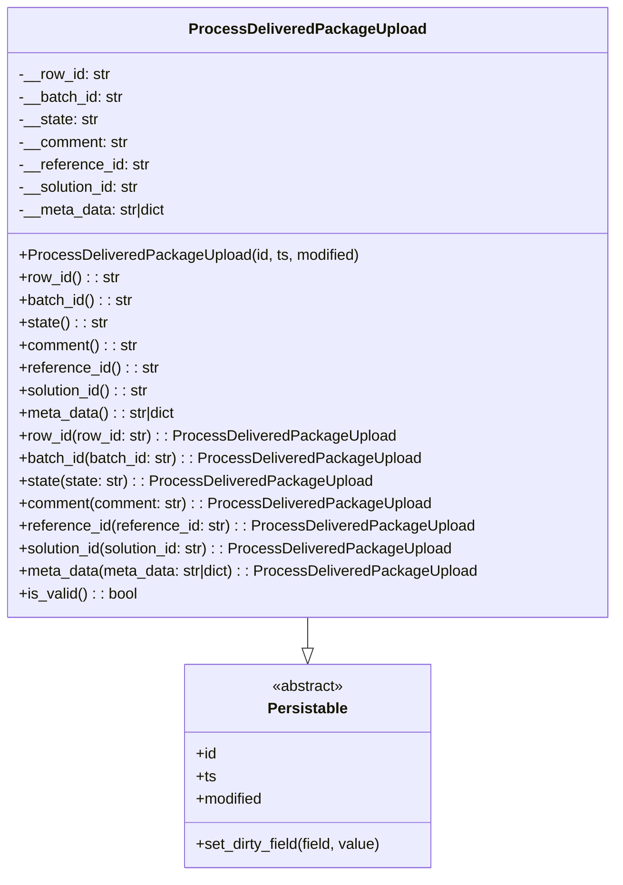

# Diagram: partview_service/partview_service/core/datamodel/ProcessDeliveredPackageUpload.py


> Auto-generated by Obscura crawlers

## Diagram 1



### SVG

<svg id="container" width="647.7734375" xmlns="http://www.w3.org/2000/svg" class="classDiagram" height="930" viewBox="0 0 647.7734375 930" role="graphics-document document" aria-roledescription="class"><style>#container{font-family:"trebuchet ms",verdana,arial,sans-serif;font-size:16px;fill:#333;}@keyframes edge-animation-frame{from{stroke-dashoffset:0;}}@keyframes dash{to{stroke-dashoffset:0;}}#container .edge-animation-slow{stroke-dasharray:9,5!important;stroke-dashoffset:900;animation:dash 50s linear infinite;stroke-linecap:round;}#container .edge-animation-fast{stroke-dasharray:9,5!important;stroke-dashoffset:900;animation:dash 20s linear infinite;stroke-linecap:round;}#container .error-icon{fill:#552222;}#container .error-text{fill:#552222;stroke:#552222;}#container .edge-thickness-normal{stroke-width:1px;}#container .edge-thickness-thick{stroke-width:3.5px;}#container .edge-pattern-solid{stroke-dasharray:0;}#container .edge-thickness-invisible{stroke-width:0;fill:none;}#container .edge-pattern-dashed{stroke-dasharray:3;}#container .edge-pattern-dotted{stroke-dasharray:2;}#container .marker{fill:#333333;stroke:#333333;}#container .marker.cross{stroke:#333333;}#container svg{font-family:"trebuchet ms",verdana,arial,sans-serif;font-size:16px;}#container p{margin:0;}#container g.classGroup text{fill:#9370DB;stroke:none;font-family:"trebuchet ms",verdana,arial,sans-serif;font-size:10px;}#container g.classGroup text .title{font-weight:bolder;}#container .nodeLabel,#container .edgeLabel{color:#131300;}#container .edgeLabel .label rect{fill:#ECECFF;}#container .label text{fill:#131300;}#container .labelBkg{background:#ECECFF;}#container .edgeLabel .label span{background:#ECECFF;}#container .classTitle{font-weight:bolder;}#container .node rect,#container .node circle,#container .node ellipse,#container .node polygon,#container .node path{fill:#ECECFF;stroke:#9370DB;stroke-width:1px;}#container .divider{stroke:#9370DB;stroke-width:1;}#container g.clickable{cursor:pointer;}#container g.classGroup rect{fill:#ECECFF;stroke:#9370DB;}#container g.classGroup line{stroke:#9370DB;stroke-width:1;}#container .classLabel .box{stroke:none;stroke-width:0;fill:#ECECFF;opacity:0.5;}#container .classLabel .label{fill:#9370DB;font-size:10px;}#container .relation{stroke:#333333;stroke-width:1;fill:none;}#container .dashed-line{stroke-dasharray:3;}#container .dotted-line{stroke-dasharray:1 2;}#container #compositionStart,#container .composition{fill:#333333!important;stroke:#333333!important;stroke-width:1;}#container #compositionEnd,#container .composition{fill:#333333!important;stroke:#333333!important;stroke-width:1;}#container #dependencyStart,#container .dependency{fill:#333333!important;stroke:#333333!important;stroke-width:1;}#container #dependencyStart,#container .dependency{fill:#333333!important;stroke:#333333!important;stroke-width:1;}#container #extensionStart,#container .extension{fill:transparent!important;stroke:#333333!important;stroke-width:1;}#container #extensionEnd,#container .extension{fill:transparent!important;stroke:#333333!important;stroke-width:1;}#container #aggregationStart,#container .aggregation{fill:transparent!important;stroke:#333333!important;stroke-width:1;}#container #aggregationEnd,#container .aggregation{fill:transparent!important;stroke:#333333!important;stroke-width:1;}#container #lollipopStart,#container .lollipop{fill:#ECECFF!important;stroke:#333333!important;stroke-width:1;}#container #lollipopEnd,#container .lollipop{fill:#ECECFF!important;stroke:#333333!important;stroke-width:1;}#container .edgeTerminals{font-size:11px;line-height:initial;}#container .classTitleText{text-anchor:middle;font-size:18px;fill:#333;}#container .label-icon{display:inline-block;height:1em;overflow:visible;vertical-align:-0.125em;}#container .node .label-icon path{fill:currentColor;stroke:revert;stroke-width:revert;}#container :root{--mermaid-font-family:"trebuchet ms",verdana,arial,sans-serif;}</style><g><defs><marker id="container_class-aggregationStart" class="marker aggregation class" refX="18" refY="7" markerWidth="190" markerHeight="240" orient="auto"><path d="M 18,7 L9,13 L1,7 L9,1 Z"></path></marker></defs><defs><marker id="container_class-aggregationEnd" class="marker aggregation class" refX="1" refY="7" markerWidth="20" markerHeight="28" orient="auto"><path d="M 18,7 L9,13 L1,7 L9,1 Z"></path></marker></defs><defs><marker id="container_class-extensionStart" class="marker extension class" refX="18" refY="7" markerWidth="190" markerHeight="240" orient="auto"><path d="M 1,7 L18,13 V 1 Z"></path></marker></defs><defs><marker id="container_class-extensionEnd" class="marker extension class" refX="1" refY="7" markerWidth="20" markerHeight="28" orient="auto"><path d="M 1,1 V 13 L18,7 Z"></path></marker></defs><defs><marker id="container_class-compositionStart" class="marker composition class" refX="18" refY="7" markerWidth="190" markerHeight="240" orient="auto"><path d="M 18,7 L9,13 L1,7 L9,1 Z"></path></marker></defs><defs><marker id="container_class-compositionEnd" class="marker composition class" refX="1" refY="7" markerWidth="20" markerHeight="28" orient="auto"><path d="M 18,7 L9,13 L1,7 L9,1 Z"></path></marker></defs><defs><marker id="container_class-dependencyStart" class="marker dependency class" refX="6" refY="7" markerWidth="190" markerHeight="240" orient="auto"><path d="M 5,7 L9,13 L1,7 L9,1 Z"></path></marker></defs><defs><marker id="container_class-dependencyEnd" class="marker dependency class" refX="13" refY="7" markerWidth="20" markerHeight="28" orient="auto"><path d="M 18,7 L9,13 L14,7 L9,1 Z"></path></marker></defs><defs><marker id="container_class-lollipopStart" class="marker lollipop class" refX="13" refY="7" markerWidth="190" markerHeight="240" orient="auto"><circle stroke="black" fill="transparent" cx="7" cy="7" r="6"></circle></marker></defs><defs><marker id="container_class-lollipopEnd" class="marker lollipop class" refX="1" refY="7" markerWidth="190" markerHeight="240" orient="auto"><circle stroke="black" fill="transparent" cx="7" cy="7" r="6"></circle></marker></defs><g class="root"><g class="clusters"></g><g class="edgePaths"><path d="M323.887,656L323.887,660.167C323.887,664.333,323.887,672.667,323.887,678.125C323.887,683.583,323.887,686.167,323.887,687.458L323.887,688.75" id="id_ProcessDeliveredPackageUpload_Persistable_1" class="edge-thickness-normal edge-pattern-solid relation" style=";;;" data-edge="true" data-et="edge" data-id="id_ProcessDeliveredPackageUpload_Persistable_1" data-points="W3sieCI6MzIzLjg4NjcxODc1LCJ5Ijo2NTZ9LHsieCI6MzIzLjg4NjcxODc1LCJ5Ijo2ODF9LHsieCI6MzIzLjg4NjcxODc1LCJ5Ijo3MDZ9XQ==" marker-end="url(#container_class-extensionEnd)"></path></g><g class="edgeLabels"><g class="edgeLabel"><g class="label" data-id="id_ProcessDeliveredPackageUpload_Persistable_1" transform="translate(0, 0)"><foreignObject width="0" height="0"><div xmlns="http://www.w3.org/1999/xhtml" class="labelBkg" style="display: table-cell; white-space: nowrap; line-height: 1.5; max-width: 200px; text-align: center;"><span class="edgeLabel"></span></div></foreignObject></g></g></g><g class="nodes"><g class="node default" id="classId-Persistable-0" transform="translate(323.88671875, 814)"><g class="basic label-container"><path d="M-132.90234375 -108 L132.90234375 -108 L132.90234375 108 L-132.90234375 108" stroke="none" stroke-width="0" fill="#ECECFF" style=""></path><path d="M-132.90234375 -108 C-56.11936226591928 -108, 20.663619218161443 -108, 132.90234375 -108 M-132.90234375 -108 C-28.721852125670324 -108, 75.45863949865935 -108, 132.90234375 -108 M132.90234375 -108 C132.90234375 -26.69943784861708, 132.90234375 54.60112430276584, 132.90234375 108 M132.90234375 -108 C132.90234375 -62.67892604346358, 132.90234375 -17.357852086927167, 132.90234375 108 M132.90234375 108 C77.5443437140456 108, 22.186343678091205 108, -132.90234375 108 M132.90234375 108 C78.25999403393683 108, 23.617644317873655 108, -132.90234375 108 M-132.90234375 108 C-132.90234375 56.12274724337952, -132.90234375 4.245494486759043, -132.90234375 -108 M-132.90234375 108 C-132.90234375 48.732509500845964, -132.90234375 -10.534980998308072, -132.90234375 -108" stroke="#9370DB" stroke-width="1.3" fill="none" stroke-dasharray="0 0" style=""></path></g><g class="annotation-group text" transform="translate(-38.609375, -84)"><g class="label" style="" transform="translate(0,-12)"><foreignObject width="77.21875" height="24"><div xmlns="http://www.w3.org/1999/xhtml" style="display: table-cell; white-space: nowrap; line-height: 1.5; max-width: 127px; text-align: center;"><span class="nodeLabel markdown-node-label" style=""><p>«abstract»</p></span></div></foreignObject></g></g><g class="label-group text" transform="translate(-40.9765625, -60)"><g class="label" style="font-weight: bolder" transform="translate(0,-12)"><foreignObject width="81.953125" height="24"><div xmlns="http://www.w3.org/1999/xhtml" style="display: table-cell; white-space: nowrap; line-height: 1.5; max-width: 130px; text-align: center;"><span class="nodeLabel markdown-node-label" style=""><p>Persistable</p></span></div></foreignObject></g></g><g class="members-group text" transform="translate(-120.90234375, -12)"><g class="label" style="" transform="translate(0,-12)"><foreignObject width="22.078125" height="24"><div xmlns="http://www.w3.org/1999/xhtml" style="display: table-cell; white-space: nowrap; line-height: 1.5; max-width: 79px; text-align: center;"><span class="nodeLabel markdown-node-label" style=""><p>+id</p></span></div></foreignObject></g><g class="label" style="" transform="translate(0,12)"><foreignObject width="21.15625" height="24"><div xmlns="http://www.w3.org/1999/xhtml" style="display: table-cell; white-space: nowrap; line-height: 1.5; max-width: 79px; text-align: center;"><span class="nodeLabel markdown-node-label" style=""><p>+ts</p></span></div></foreignObject></g><g class="label" style="" transform="translate(0,36)"><foreignObject width="72.609375" height="24"><div xmlns="http://www.w3.org/1999/xhtml" style="display: table-cell; white-space: nowrap; line-height: 1.5; max-width: 130px; text-align: center;"><span class="nodeLabel markdown-node-label" style=""><p>+modified</p></span></div></foreignObject></g></g><g class="methods-group text" transform="translate(-120.90234375, 84)"><g class="label" style="" transform="translate(0,-12)"><foreignObject width="200.828125" height="24"><div xmlns="http://www.w3.org/1999/xhtml" style="display: table-cell; white-space: nowrap; line-height: 1.5; max-width: 258px; text-align: center;"><span class="nodeLabel markdown-node-label" style=""><p>+set_dirty_field(field, value)</p></span></div></foreignObject></g></g><g class="divider" style=""><path d="M-132.90234375 -36 C-77.62820570679324 -36, -22.35406766358649 -36, 132.90234375 -36 M-132.90234375 -36 C-46.11677118572686 -36, 40.66880137854628 -36, 132.90234375 -36" stroke="#9370DB" stroke-width="1.3" fill="none" stroke-dasharray="0 0" style=""></path></g><g class="divider" style=""><path d="M-132.90234375 60 C-47.049320400510936 60, 38.80370294897813 60, 132.90234375 60 M-132.90234375 60 C-73.86936712513823 60, -14.836390500276451 60, 132.90234375 60" stroke="#9370DB" stroke-width="1.3" fill="none" stroke-dasharray="0 0" style=""></path></g></g><g class="node default" id="classId-ProcessDeliveredPackageUpload-1" transform="translate(323.88671875, 332)"><g class="basic label-container"><path d="M-315.88671875 -324 L315.88671875 -324 L315.88671875 324 L-315.88671875 324" stroke="none" stroke-width="0" fill="#ECECFF" style=""></path><path d="M-315.88671875 -324 C-142.4066342873837 -324, 31.073450175232608 -324, 315.88671875 -324 M-315.88671875 -324 C-106.48876187443207 -324, 102.90919500113586 -324, 315.88671875 -324 M315.88671875 -324 C315.88671875 -68.88739722772891, 315.88671875 186.22520554454218, 315.88671875 324 M315.88671875 -324 C315.88671875 -135.96653639845147, 315.88671875 52.066927203097066, 315.88671875 324 M315.88671875 324 C76.02844484542564 324, -163.82982905914872 324, -315.88671875 324 M315.88671875 324 C130.28808489023206 324, -55.31054896953589 324, -315.88671875 324 M-315.88671875 324 C-315.88671875 173.74066911103134, -315.88671875 23.481338222062675, -315.88671875 -324 M-315.88671875 324 C-315.88671875 169.21710307557782, -315.88671875 14.43420615115565, -315.88671875 -324" stroke="#9370DB" stroke-width="1.3" fill="none" stroke-dasharray="0 0" style=""></path></g><g class="annotation-group text" transform="translate(0, -300)"></g><g class="label-group text" transform="translate(-118.8828125, -300)"><g class="label" style="font-weight: bolder" transform="translate(0,-12)"><foreignObject width="237.765625" height="24"><div xmlns="http://www.w3.org/1999/xhtml" style="display: table-cell; white-space: nowrap; line-height: 1.5; max-width: 284px; text-align: center;"><span class="nodeLabel markdown-node-label" style=""><p>ProcessDeliveredPackageUpload</p></span></div></foreignObject></g></g><g class="members-group text" transform="translate(-303.88671875, -252)"><g class="label" style="" transform="translate(0,-12)"><foreignObject width="97.75" height="24"><div xmlns="http://www.w3.org/1999/xhtml" style="display: table-cell; white-space: nowrap; line-height: 1.5; max-width: 156px; text-align: center;"><span class="nodeLabel markdown-node-label" style=""><p>-__row_id: str</p></span></div></foreignObject></g><g class="label" style="" transform="translate(0,12)"><foreignObject width="112.171875" height="24"><div xmlns="http://www.w3.org/1999/xhtml" style="display: table-cell; white-space: nowrap; line-height: 1.5; max-width: 170px; text-align: center;"><span class="nodeLabel markdown-node-label" style=""><p>-__batch_id: str</p></span></div></foreignObject></g><g class="label" style="" transform="translate(0,36)"><foreignObject width="85.25" height="24"><div xmlns="http://www.w3.org/1999/xhtml" style="display: table-cell; white-space: nowrap; line-height: 1.5; max-width: 143px; text-align: center;"><span class="nodeLabel markdown-node-label" style=""><p>-__state: str</p></span></div></foreignObject></g><g class="label" style="" transform="translate(0,60)"><foreignObject width="116.875" height="24"><div xmlns="http://www.w3.org/1999/xhtml" style="display: table-cell; white-space: nowrap; line-height: 1.5; max-width: 175px; text-align: center;"><span class="nodeLabel markdown-node-label" style=""><p>-__comment: str</p></span></div></foreignObject></g><g class="label" style="" transform="translate(0,84)"><foreignObject width="139.421875" height="24"><div xmlns="http://www.w3.org/1999/xhtml" style="display: table-cell; white-space: nowrap; line-height: 1.5; max-width: 198px; text-align: center;"><span class="nodeLabel markdown-node-label" style=""><p>-__reference_id: str</p></span></div></foreignObject></g><g class="label" style="" transform="translate(0,108)"><foreignObject width="131.390625" height="24"><div xmlns="http://www.w3.org/1999/xhtml" style="display: table-cell; white-space: nowrap; line-height: 1.5; max-width: 190px; text-align: center;"><span class="nodeLabel markdown-node-label" style=""><p>-__solution_id: str</p></span></div></foreignObject></g><g class="label" style="" transform="translate(0,132)"><foreignObject width="160.546875" height="24"><div xmlns="http://www.w3.org/1999/xhtml" style="display: table-cell; white-space: nowrap; line-height: 1.5; max-width: 218px; text-align: center;"><span class="nodeLabel markdown-node-label" style=""><p>-__meta_data: str|dict</p></span></div></foreignObject></g></g><g class="methods-group text" transform="translate(-303.88671875, -60)"><g class="label" style="" transform="translate(0,-12)"><foreignObject width="360.265625" height="24"><div xmlns="http://www.w3.org/1999/xhtml" style="display: table-cell; white-space: nowrap; line-height: 1.5; max-width: 418px; text-align: center;"><span class="nodeLabel markdown-node-label" style=""><p>+ProcessDeliveredPackageUpload(id, ts, modified)</p></span></div></foreignObject></g><g class="label" style="" transform="translate(0,12)"><foreignObject width="106.78125" height="24"><div xmlns="http://www.w3.org/1999/xhtml" style="display: table-cell; white-space: nowrap; line-height: 1.5; max-width: 165px; text-align: center;"><span class="nodeLabel markdown-node-label" style=""><p>+row_id() : : str</p></span></div></foreignObject></g><g class="label" style="" transform="translate(0,36)"><foreignObject width="121.1875" height="24"><div xmlns="http://www.w3.org/1999/xhtml" style="display: table-cell; white-space: nowrap; line-height: 1.5; max-width: 179px; text-align: center;"><span class="nodeLabel markdown-node-label" style=""><p>+batch_id() : : str</p></span></div></foreignObject></g><g class="label" style="" transform="translate(0,60)"><foreignObject width="94.28125" height="24"><div xmlns="http://www.w3.org/1999/xhtml" style="display: table-cell; white-space: nowrap; line-height: 1.5; max-width: 152px; text-align: center;"><span class="nodeLabel markdown-node-label" style=""><p>+state() : : str</p></span></div></foreignObject></g><g class="label" style="" transform="translate(0,84)"><foreignObject width="126.15625" height="24"><div xmlns="http://www.w3.org/1999/xhtml" style="display: table-cell; white-space: nowrap; line-height: 1.5; max-width: 184px; text-align: center;"><span class="nodeLabel markdown-node-label" style=""><p>+comment() : : str</p></span></div></foreignObject></g><g class="label" style="" transform="translate(0,108)"><foreignObject width="148.4375" height="24"><div xmlns="http://www.w3.org/1999/xhtml" style="display: table-cell; white-space: nowrap; line-height: 1.5; max-width: 207px; text-align: center;"><span class="nodeLabel markdown-node-label" style=""><p>+reference_id() : : str</p></span></div></foreignObject></g><g class="label" style="" transform="translate(0,132)"><foreignObject width="140.40625" height="24"><div xmlns="http://www.w3.org/1999/xhtml" style="display: table-cell; white-space: nowrap; line-height: 1.5; max-width: 199px; text-align: center;"><span class="nodeLabel markdown-node-label" style=""><p>+solution_id() : : str</p></span></div></foreignObject></g><g class="label" style="" transform="translate(0,156)"><foreignObject width="169.578125" height="24"><div xmlns="http://www.w3.org/1999/xhtml" style="display: table-cell; white-space: nowrap; line-height: 1.5; max-width: 227px; text-align: center;"><span class="nodeLabel markdown-node-label" style=""><p>+meta_data() : : str|dict</p></span></div></foreignObject></g><g class="label" style="" transform="translate(0,180)"><foreignObject width="397.234375" height="24"><div xmlns="http://www.w3.org/1999/xhtml" style="display: table-cell; white-space: nowrap; line-height: 1.5; max-width: 455px; text-align: center;"><span class="nodeLabel markdown-node-label" style=""><p>+row_id(row_id: str) : : ProcessDeliveredPackageUpload</p></span></div></foreignObject></g><g class="label" style="" transform="translate(0,204)"><foreignObject width="426.078125" height="24"><div xmlns="http://www.w3.org/1999/xhtml" style="display: table-cell; white-space: nowrap; line-height: 1.5; max-width: 483px; text-align: center;"><span class="nodeLabel markdown-node-label" style=""><p>+batch_id(batch_id: str) : : ProcessDeliveredPackageUpload</p></span></div></foreignObject></g><g class="label" style="" transform="translate(0,228)"><foreignObject width="372.25" height="24"><div xmlns="http://www.w3.org/1999/xhtml" style="display: table-cell; white-space: nowrap; line-height: 1.5; max-width: 430px; text-align: center;"><span class="nodeLabel markdown-node-label" style=""><p>+state(state: str) : : ProcessDeliveredPackageUpload</p></span></div></foreignObject></g><g class="label" style="" transform="translate(0,252)"><foreignObject width="436.0625" height="24"><div xmlns="http://www.w3.org/1999/xhtml" style="display: table-cell; white-space: nowrap; line-height: 1.5; max-width: 493px; text-align: center;"><span class="nodeLabel markdown-node-label" style=""><p>+comment(comment: str) : : ProcessDeliveredPackageUpload</p></span></div></foreignObject></g><g class="label" style="" transform="translate(0,276)"><foreignObject width="480.5625" height="24"><div xmlns="http://www.w3.org/1999/xhtml" style="display: table-cell; white-space: nowrap; line-height: 1.5; max-width: 538px; text-align: center;"><span class="nodeLabel markdown-node-label" style=""><p>+reference_id(reference_id: str) : : ProcessDeliveredPackageUpload</p></span></div></foreignObject></g><g class="label" style="" transform="translate(0,300)"><foreignObject width="464.5" height="24"><div xmlns="http://www.w3.org/1999/xhtml" style="display: table-cell; white-space: nowrap; line-height: 1.5; max-width: 522px; text-align: center;"><span class="nodeLabel markdown-node-label" style=""><p>+solution_id(solution_id: str) : : ProcessDeliveredPackageUpload</p></span></div></foreignObject></g><g class="label" style="" transform="translate(0,324)"><foreignObject width="488.890625" height="24"><div xmlns="http://www.w3.org/1999/xhtml" style="display: table-cell; white-space: nowrap; line-height: 1.5; max-width: 546px; text-align: center;"><span class="nodeLabel markdown-node-label" style=""><p>+meta_data(meta_data: str|dict) : : ProcessDeliveredPackageUpload</p></span></div></foreignObject></g><g class="label" style="" transform="translate(0,348)"><foreignObject width="126.078125" height="24"><div xmlns="http://www.w3.org/1999/xhtml" style="display: table-cell; white-space: nowrap; line-height: 1.5; max-width: 184px; text-align: center;"><span class="nodeLabel markdown-node-label" style=""><p>+is_valid() : : bool</p></span></div></foreignObject></g></g><g class="divider" style=""><path d="M-315.88671875 -276 C-72.64323920990861 -276, 170.60024033018277 -276, 315.88671875 -276 M-315.88671875 -276 C-118.08417254971195 -276, 79.7183736505761 -276, 315.88671875 -276" stroke="#9370DB" stroke-width="1.3" fill="none" stroke-dasharray="0 0" style=""></path></g><g class="divider" style=""><path d="M-315.88671875 -84 C-140.29380530972264 -84, 35.299108130554714 -84, 315.88671875 -84 M-315.88671875 -84 C-107.76564507404032 -84, 100.35542860191936 -84, 315.88671875 -84" stroke="#9370DB" stroke-width="1.3" fill="none" stroke-dasharray="0 0" style=""></path></g></g></g></g></g></svg>

## Diagram 2

```mermaid
flowchart TD
Init[Create ProcessDeliveredPackageUpload(id, ts, modified)] --> Defaults[private fields set to None]
Defaults --> SetterCall[Call setter(name, value)]
SetterCall --> AssertType{assert type is valid or None}
AssertType --> Changed{new value != current value}
Changed -->|yes| Update[Update private field<br/>call set_dirty_field(field, value)]
Changed -->|no| Noop[No change]
Update --> ReturnSelf[Return self]
Noop --> ReturnSelf
ReturnSelf --> Validate[Call is_valid()]
Validate --> ValidTrue[Returns True]
```

> SVG rendering failed for this diagram.
