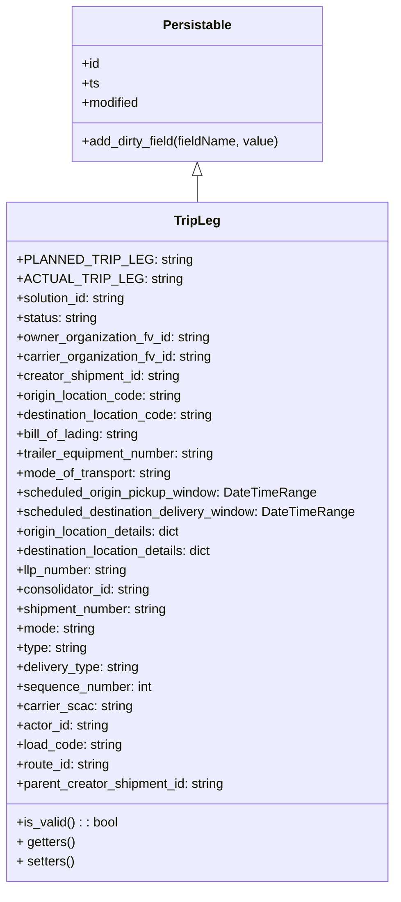

# Diagram: partview_service/partview_service/core/datamodel/TripLeg.py


> Auto-generated by Obscura crawlers

## Diagram 1



### SVG

<svg id="container" width="491.3515625" xmlns="http://www.w3.org/2000/svg" class="classDiagram" height="1098" viewBox="0 0 491.3515625 1098" role="graphics-document document" aria-roledescription="class"><style>#container{font-family:"trebuchet ms",verdana,arial,sans-serif;font-size:16px;fill:#333;}@keyframes edge-animation-frame{from{stroke-dashoffset:0;}}@keyframes dash{to{stroke-dashoffset:0;}}#container .edge-animation-slow{stroke-dasharray:9,5!important;stroke-dashoffset:900;animation:dash 50s linear infinite;stroke-linecap:round;}#container .edge-animation-fast{stroke-dasharray:9,5!important;stroke-dashoffset:900;animation:dash 20s linear infinite;stroke-linecap:round;}#container .error-icon{fill:#552222;}#container .error-text{fill:#552222;stroke:#552222;}#container .edge-thickness-normal{stroke-width:1px;}#container .edge-thickness-thick{stroke-width:3.5px;}#container .edge-pattern-solid{stroke-dasharray:0;}#container .edge-thickness-invisible{stroke-width:0;fill:none;}#container .edge-pattern-dashed{stroke-dasharray:3;}#container .edge-pattern-dotted{stroke-dasharray:2;}#container .marker{fill:#333333;stroke:#333333;}#container .marker.cross{stroke:#333333;}#container svg{font-family:"trebuchet ms",verdana,arial,sans-serif;font-size:16px;}#container p{margin:0;}#container g.classGroup text{fill:#9370DB;stroke:none;font-family:"trebuchet ms",verdana,arial,sans-serif;font-size:10px;}#container g.classGroup text .title{font-weight:bolder;}#container .nodeLabel,#container .edgeLabel{color:#131300;}#container .edgeLabel .label rect{fill:#ECECFF;}#container .label text{fill:#131300;}#container .labelBkg{background:#ECECFF;}#container .edgeLabel .label span{background:#ECECFF;}#container .classTitle{font-weight:bolder;}#container .node rect,#container .node circle,#container .node ellipse,#container .node polygon,#container .node path{fill:#ECECFF;stroke:#9370DB;stroke-width:1px;}#container .divider{stroke:#9370DB;stroke-width:1;}#container g.clickable{cursor:pointer;}#container g.classGroup rect{fill:#ECECFF;stroke:#9370DB;}#container g.classGroup line{stroke:#9370DB;stroke-width:1;}#container .classLabel .box{stroke:none;stroke-width:0;fill:#ECECFF;opacity:0.5;}#container .classLabel .label{fill:#9370DB;font-size:10px;}#container .relation{stroke:#333333;stroke-width:1;fill:none;}#container .dashed-line{stroke-dasharray:3;}#container .dotted-line{stroke-dasharray:1 2;}#container #compositionStart,#container .composition{fill:#333333!important;stroke:#333333!important;stroke-width:1;}#container #compositionEnd,#container .composition{fill:#333333!important;stroke:#333333!important;stroke-width:1;}#container #dependencyStart,#container .dependency{fill:#333333!important;stroke:#333333!important;stroke-width:1;}#container #dependencyStart,#container .dependency{fill:#333333!important;stroke:#333333!important;stroke-width:1;}#container #extensionStart,#container .extension{fill:transparent!important;stroke:#333333!important;stroke-width:1;}#container #extensionEnd,#container .extension{fill:transparent!important;stroke:#333333!important;stroke-width:1;}#container #aggregationStart,#container .aggregation{fill:transparent!important;stroke:#333333!important;stroke-width:1;}#container #aggregationEnd,#container .aggregation{fill:transparent!important;stroke:#333333!important;stroke-width:1;}#container #lollipopStart,#container .lollipop{fill:#ECECFF!important;stroke:#333333!important;stroke-width:1;}#container #lollipopEnd,#container .lollipop{fill:#ECECFF!important;stroke:#333333!important;stroke-width:1;}#container .edgeTerminals{font-size:11px;line-height:initial;}#container .classTitleText{text-anchor:middle;font-size:18px;fill:#333;}#container .label-icon{display:inline-block;height:1em;overflow:visible;vertical-align:-0.125em;}#container .node .label-icon path{fill:currentColor;stroke:revert;stroke-width:revert;}#container :root{--mermaid-font-family:"trebuchet ms",verdana,arial,sans-serif;}</style><g><defs><marker id="container_class-aggregationStart" class="marker aggregation class" refX="18" refY="7" markerWidth="190" markerHeight="240" orient="auto"><path d="M 18,7 L9,13 L1,7 L9,1 Z"></path></marker></defs><defs><marker id="container_class-aggregationEnd" class="marker aggregation class" refX="1" refY="7" markerWidth="20" markerHeight="28" orient="auto"><path d="M 18,7 L9,13 L1,7 L9,1 Z"></path></marker></defs><defs><marker id="container_class-extensionStart" class="marker extension class" refX="18" refY="7" markerWidth="190" markerHeight="240" orient="auto"><path d="M 1,7 L18,13 V 1 Z"></path></marker></defs><defs><marker id="container_class-extensionEnd" class="marker extension class" refX="1" refY="7" markerWidth="20" markerHeight="28" orient="auto"><path d="M 1,1 V 13 L18,7 Z"></path></marker></defs><defs><marker id="container_class-compositionStart" class="marker composition class" refX="18" refY="7" markerWidth="190" markerHeight="240" orient="auto"><path d="M 18,7 L9,13 L1,7 L9,1 Z"></path></marker></defs><defs><marker id="container_class-compositionEnd" class="marker composition class" refX="1" refY="7" markerWidth="20" markerHeight="28" orient="auto"><path d="M 18,7 L9,13 L1,7 L9,1 Z"></path></marker></defs><defs><marker id="container_class-dependencyStart" class="marker dependency class" refX="6" refY="7" markerWidth="190" markerHeight="240" orient="auto"><path d="M 5,7 L9,13 L1,7 L9,1 Z"></path></marker></defs><defs><marker id="container_class-dependencyEnd" class="marker dependency class" refX="13" refY="7" markerWidth="20" markerHeight="28" orient="auto"><path d="M 18,7 L9,13 L14,7 L9,1 Z"></path></marker></defs><defs><marker id="container_class-lollipopStart" class="marker lollipop class" refX="13" refY="7" markerWidth="190" markerHeight="240" orient="auto"><circle stroke="black" fill="transparent" cx="7" cy="7" r="6"></circle></marker></defs><defs><marker id="container_class-lollipopEnd" class="marker lollipop class" refX="1" refY="7" markerWidth="190" markerHeight="240" orient="auto"><circle stroke="black" fill="transparent" cx="7" cy="7" r="6"></circle></marker></defs><g class="root"><g class="clusters"></g><g class="edgePaths"><path d="M245.676,217.25L245.676,218.542C245.676,219.833,245.676,222.417,245.676,227.875C245.676,233.333,245.676,241.667,245.676,245.833L245.676,250" id="id_Persistable_TripLeg_1" class="edge-thickness-normal edge-pattern-solid relation" style=";;;" data-edge="true" data-et="edge" data-id="id_Persistable_TripLeg_1" data-points="W3sieCI6MjQ1LjY3NTc4MTI1LCJ5IjoyMDB9LHsieCI6MjQ1LjY3NTc4MTI1LCJ5IjoyMjV9LHsieCI6MjQ1LjY3NTc4MTI1LCJ5IjoyNTB9XQ==" marker-start="url(#container_class-extensionStart)"></path></g><g class="edgeLabels"><g class="edgeLabel"><g class="label" data-id="id_Persistable_TripLeg_1" transform="translate(0, 0)"><foreignObject width="0" height="0"><div xmlns="http://www.w3.org/1999/xhtml" class="labelBkg" style="display: table-cell; white-space: nowrap; line-height: 1.5; max-width: 200px; text-align: center;"><span class="edgeLabel"></span></div></foreignObject></g></g></g><g class="nodes"><g class="node default" id="classId-Persistable-0" transform="translate(245.67578125, 104)"><g class="basic label-container"><path d="M-156.66796875 -96 L156.66796875 -96 L156.66796875 96 L-156.66796875 96" stroke="none" stroke-width="0" fill="#ECECFF" style=""></path><path d="M-156.66796875 -96 C-34.62192084837329 -96, 87.42412705325341 -96, 156.66796875 -96 M-156.66796875 -96 C-54.02962983351709 -96, 48.60870908296582 -96, 156.66796875 -96 M156.66796875 -96 C156.66796875 -44.265865289686886, 156.66796875 7.468269420626228, 156.66796875 96 M156.66796875 -96 C156.66796875 -43.186791751022355, 156.66796875 9.62641649795529, 156.66796875 96 M156.66796875 96 C89.05357021418313 96, 21.43917167836625 96, -156.66796875 96 M156.66796875 96 C48.607453563574836 96, -59.45306162285033 96, -156.66796875 96 M-156.66796875 96 C-156.66796875 55.03584916019235, -156.66796875 14.071698320384698, -156.66796875 -96 M-156.66796875 96 C-156.66796875 56.62114055445722, -156.66796875 17.24228110891444, -156.66796875 -96" stroke="#9370DB" stroke-width="1.3" fill="none" stroke-dasharray="0 0" style=""></path></g><g class="annotation-group text" transform="translate(0, -72)"></g><g class="label-group text" transform="translate(-40.9765625, -72)"><g class="label" style="font-weight: bolder" transform="translate(0,-12)"><foreignObject width="81.953125" height="24"><div xmlns="http://www.w3.org/1999/xhtml" style="display: table-cell; white-space: nowrap; line-height: 1.5; max-width: 130px; text-align: center;"><span class="nodeLabel markdown-node-label" style=""><p>Persistable</p></span></div></foreignObject></g></g><g class="members-group text" transform="translate(-144.66796875, -24)"><g class="label" style="" transform="translate(0,-12)"><foreignObject width="22.078125" height="24"><div xmlns="http://www.w3.org/1999/xhtml" style="display: table-cell; white-space: nowrap; line-height: 1.5; max-width: 79px; text-align: center;"><span class="nodeLabel markdown-node-label" style=""><p>+id</p></span></div></foreignObject></g><g class="label" style="" transform="translate(0,12)"><foreignObject width="21.15625" height="24"><div xmlns="http://www.w3.org/1999/xhtml" style="display: table-cell; white-space: nowrap; line-height: 1.5; max-width: 79px; text-align: center;"><span class="nodeLabel markdown-node-label" style=""><p>+ts</p></span></div></foreignObject></g><g class="label" style="" transform="translate(0,36)"><foreignObject width="72.609375" height="24"><div xmlns="http://www.w3.org/1999/xhtml" style="display: table-cell; white-space: nowrap; line-height: 1.5; max-width: 130px; text-align: center;"><span class="nodeLabel markdown-node-label" style=""><p>+modified</p></span></div></foreignObject></g></g><g class="methods-group text" transform="translate(-144.66796875, 72)"><g class="label" style="" transform="translate(0,-12)"><foreignObject width="248.359375" height="24"><div xmlns="http://www.w3.org/1999/xhtml" style="display: table-cell; white-space: nowrap; line-height: 1.5; max-width: 306px; text-align: center;"><span class="nodeLabel markdown-node-label" style=""><p>+add_dirty_field(fieldName, value)</p></span></div></foreignObject></g></g><g class="divider" style=""><path d="M-156.66796875 -48 C-62.6622567924731 -48, 31.343455165053797 -48, 156.66796875 -48 M-156.66796875 -48 C-40.23234677608288 -48, 76.20327519783424 -48, 156.66796875 -48" stroke="#9370DB" stroke-width="1.3" fill="none" stroke-dasharray="0 0" style=""></path></g><g class="divider" style=""><path d="M-156.66796875 48 C-37.59011973922897 48, 81.48772927154207 48, 156.66796875 48 M-156.66796875 48 C-55.4407926391149 48, 45.78638347177019 48, 156.66796875 48" stroke="#9370DB" stroke-width="1.3" fill="none" stroke-dasharray="0 0" style=""></path></g></g><g class="node default" id="classId-TripLeg-1" transform="translate(245.67578125, 670)"><g class="basic label-container"><path d="M-237.67578125 -420 L237.67578125 -420 L237.67578125 420 L-237.67578125 420" stroke="none" stroke-width="0" fill="#ECECFF" style=""></path><path d="M-237.67578125 -420 C-65.07968563658176 -420, 107.51640997683648 -420, 237.67578125 -420 M-237.67578125 -420 C-79.42566173830019 -420, 78.82445777339962 -420, 237.67578125 -420 M237.67578125 -420 C237.67578125 -251.1802941225736, 237.67578125 -82.3605882451472, 237.67578125 420 M237.67578125 -420 C237.67578125 -187.98635481036789, 237.67578125 44.02729037926423, 237.67578125 420 M237.67578125 420 C67.93340192088513 420, -101.80897740822974 420, -237.67578125 420 M237.67578125 420 C89.03358512258595 420, -59.608611004828106 420, -237.67578125 420 M-237.67578125 420 C-237.67578125 191.8906441650826, -237.67578125 -36.21871166983482, -237.67578125 -420 M-237.67578125 420 C-237.67578125 158.03265049406087, -237.67578125 -103.93469901187825, -237.67578125 -420" stroke="#9370DB" stroke-width="1.3" fill="none" stroke-dasharray="0 0" style=""></path></g><g class="annotation-group text" transform="translate(0, -396)"></g><g class="label-group text" transform="translate(-27.0546875, -396)"><g class="label" style="font-weight: bolder" transform="translate(0,-12)"><foreignObject width="54.109375" height="24"><div xmlns="http://www.w3.org/1999/xhtml" style="display: table-cell; white-space: nowrap; line-height: 1.5; max-width: 103px; text-align: center;"><span class="nodeLabel markdown-node-label" style=""><p>TripLeg</p></span></div></foreignObject></g></g><g class="members-group text" transform="translate(-225.67578125, -348)"><g class="label" style="" transform="translate(0,-12)"><foreignObject width="196.859375" height="24"><div xmlns="http://www.w3.org/1999/xhtml" style="display: table-cell; white-space: nowrap; line-height: 1.5; max-width: 255px; text-align: center;"><span class="nodeLabel markdown-node-label" style=""><p>+PLANNED_TRIP_LEG: string</p></span></div></foreignObject></g><g class="label" style="" transform="translate(0,12)"><foreignObject width="183.828125" height="24"><div xmlns="http://www.w3.org/1999/xhtml" style="display: table-cell; white-space: nowrap; line-height: 1.5; max-width: 242px; text-align: center;"><span class="nodeLabel markdown-node-label" style=""><p>+ACTUAL_TRIP_LEG: string</p></span></div></foreignObject></g><g class="label" style="" transform="translate(0,36)"><foreignObject width="139.921875" height="24"><div xmlns="http://www.w3.org/1999/xhtml" style="display: table-cell; white-space: nowrap; line-height: 1.5; max-width: 198px; text-align: center;"><span class="nodeLabel markdown-node-label" style=""><p>+solution_id: string</p></span></div></foreignObject></g><g class="label" style="" transform="translate(0,60)"><foreignObject width="102.109375" height="24"><div xmlns="http://www.w3.org/1999/xhtml" style="display: table-cell; white-space: nowrap; line-height: 1.5; max-width: 160px; text-align: center;"><span class="nodeLabel markdown-node-label" style=""><p>+status: string</p></span></div></foreignObject></g><g class="label" style="" transform="translate(0,84)"><foreignObject width="243.015625" height="24"><div xmlns="http://www.w3.org/1999/xhtml" style="display: table-cell; white-space: nowrap; line-height: 1.5; max-width: 301px; text-align: center;"><span class="nodeLabel markdown-node-label" style=""><p>+owner_organization_fv_id: string</p></span></div></foreignObject></g><g class="label" style="" transform="translate(0,108)"><foreignObject width="245.875" height="24"><div xmlns="http://www.w3.org/1999/xhtml" style="display: table-cell; white-space: nowrap; line-height: 1.5; max-width: 304px; text-align: center;"><span class="nodeLabel markdown-node-label" style=""><p>+carrier_organization_fv_id: string</p></span></div></foreignObject></g><g class="label" style="" transform="translate(0,132)"><foreignObject width="207.25" height="24"><div xmlns="http://www.w3.org/1999/xhtml" style="display: table-cell; white-space: nowrap; line-height: 1.5; max-width: 265px; text-align: center;"><span class="nodeLabel markdown-node-label" style=""><p>+creator_shipment_id: string</p></span></div></foreignObject></g><g class="label" style="" transform="translate(0,156)"><foreignObject width="210.21875" height="24"><div xmlns="http://www.w3.org/1999/xhtml" style="display: table-cell; white-space: nowrap; line-height: 1.5; max-width: 268px; text-align: center;"><span class="nodeLabel markdown-node-label" style=""><p>+origin_location_code: string</p></span></div></foreignObject></g><g class="label" style="" transform="translate(0,180)"><foreignObject width="251.109375" height="24"><div xmlns="http://www.w3.org/1999/xhtml" style="display: table-cell; white-space: nowrap; line-height: 1.5; max-width: 309px; text-align: center;"><span class="nodeLabel markdown-node-label" style=""><p>+destination_location_code: string</p></span></div></foreignObject></g><g class="label" style="" transform="translate(0,204)"><foreignObject width="156.5625" height="24"><div xmlns="http://www.w3.org/1999/xhtml" style="display: table-cell; white-space: nowrap; line-height: 1.5; max-width: 215px; text-align: center;"><span class="nodeLabel markdown-node-label" style=""><p>+bill_of_lading: string</p></span></div></foreignObject></g><g class="label" style="" transform="translate(0,228)"><foreignObject width="252.9375" height="24"><div xmlns="http://www.w3.org/1999/xhtml" style="display: table-cell; white-space: nowrap; line-height: 1.5; max-width: 311px; text-align: center;"><span class="nodeLabel markdown-node-label" style=""><p>+trailer_equipment_number: string</p></span></div></foreignObject></g><g class="label" style="" transform="translate(0,252)"><foreignObject width="196.765625" height="24"><div xmlns="http://www.w3.org/1999/xhtml" style="display: table-cell; white-space: nowrap; line-height: 1.5; max-width: 255px; text-align: center;"><span class="nodeLabel markdown-node-label" style=""><p>+mode_of_transport: string</p></span></div></foreignObject></g><g class="label" style="" transform="translate(0,276)"><foreignObject width="374.375" height="24"><div xmlns="http://www.w3.org/1999/xhtml" style="display: table-cell; white-space: nowrap; line-height: 1.5; max-width: 432px; text-align: center;"><span class="nodeLabel markdown-node-label" style=""><p>+scheduled_origin_pickup_window: DateTimeRange</p></span></div></foreignObject></g><g class="label" style="" transform="translate(0,300)"><foreignObject width="424.296875" height="24"><div xmlns="http://www.w3.org/1999/xhtml" style="display: table-cell; white-space: nowrap; line-height: 1.5; max-width: 482px; text-align: center;"><span class="nodeLabel markdown-node-label" style=""><p>+scheduled_destination_delivery_window: DateTimeRange</p></span></div></foreignObject></g><g class="label" style="" transform="translate(0,324)"><foreignObject width="210.453125" height="24"><div xmlns="http://www.w3.org/1999/xhtml" style="display: table-cell; white-space: nowrap; line-height: 1.5; max-width: 268px; text-align: center;"><span class="nodeLabel markdown-node-label" style=""><p>+origin_location_details: dict</p></span></div></foreignObject></g><g class="label" style="" transform="translate(0,348)"><foreignObject width="251.359375" height="24"><div xmlns="http://www.w3.org/1999/xhtml" style="display: table-cell; white-space: nowrap; line-height: 1.5; max-width: 309px; text-align: center;"><span class="nodeLabel markdown-node-label" style=""><p>+destination_location_details: dict</p></span></div></foreignObject></g><g class="label" style="" transform="translate(0,372)"><foreignObject width="141.546875" height="24"><div xmlns="http://www.w3.org/1999/xhtml" style="display: table-cell; white-space: nowrap; line-height: 1.5; max-width: 200px; text-align: center;"><span class="nodeLabel markdown-node-label" style=""><p>+llp_number: string</p></span></div></foreignObject></g><g class="label" style="" transform="translate(0,396)"><foreignObject width="170.21875" height="24"><div xmlns="http://www.w3.org/1999/xhtml" style="display: table-cell; white-space: nowrap; line-height: 1.5; max-width: 228px; text-align: center;"><span class="nodeLabel markdown-node-label" style=""><p>+consolidator_id: string</p></span></div></foreignObject></g><g class="label" style="" transform="translate(0,420)"><foreignObject width="191.4375" height="24"><div xmlns="http://www.w3.org/1999/xhtml" style="display: table-cell; white-space: nowrap; line-height: 1.5; max-width: 249px; text-align: center;"><span class="nodeLabel markdown-node-label" style=""><p>+shipment_number: string</p></span></div></foreignObject></g><g class="label" style="" transform="translate(0,444)"><foreignObject width="99.046875" height="24"><div xmlns="http://www.w3.org/1999/xhtml" style="display: table-cell; white-space: nowrap; line-height: 1.5; max-width: 157px; text-align: center;"><span class="nodeLabel markdown-node-label" style=""><p>+mode: string</p></span></div></foreignObject></g><g class="label" style="" transform="translate(0,468)"><foreignObject width="89.421875" height="24"><div xmlns="http://www.w3.org/1999/xhtml" style="display: table-cell; white-space: nowrap; line-height: 1.5; max-width: 147px; text-align: center;"><span class="nodeLabel markdown-node-label" style=""><p>+type: string</p></span></div></foreignObject></g><g class="label" style="" transform="translate(0,492)"><foreignObject width="155.078125" height="24"><div xmlns="http://www.w3.org/1999/xhtml" style="display: table-cell; white-space: nowrap; line-height: 1.5; max-width: 213px; text-align: center;"><span class="nodeLabel markdown-node-label" style=""><p>+delivery_type: string</p></span></div></foreignObject></g><g class="label" style="" transform="translate(0,516)"><foreignObject width="169.90625" height="24"><div xmlns="http://www.w3.org/1999/xhtml" style="display: table-cell; white-space: nowrap; line-height: 1.5; max-width: 227px; text-align: center;"><span class="nodeLabel markdown-node-label" style=""><p>+sequence_number: int</p></span></div></foreignObject></g><g class="label" style="" transform="translate(0,540)"><foreignObject width="144.078125" height="24"><div xmlns="http://www.w3.org/1999/xhtml" style="display: table-cell; white-space: nowrap; line-height: 1.5; max-width: 202px; text-align: center;"><span class="nodeLabel markdown-node-label" style=""><p>+carrier_scac: string</p></span></div></foreignObject></g><g class="label" style="" transform="translate(0,564)"><foreignObject width="115.984375" height="24"><div xmlns="http://www.w3.org/1999/xhtml" style="display: table-cell; white-space: nowrap; line-height: 1.5; max-width: 174px; text-align: center;"><span class="nodeLabel markdown-node-label" style=""><p>+actor_id: string</p></span></div></foreignObject></g><g class="label" style="" transform="translate(0,588)"><foreignObject width="132.734375" height="24"><div xmlns="http://www.w3.org/1999/xhtml" style="display: table-cell; white-space: nowrap; line-height: 1.5; max-width: 191px; text-align: center;"><span class="nodeLabel markdown-node-label" style=""><p>+load_code: string</p></span></div></foreignObject></g><g class="label" style="" transform="translate(0,612)"><foreignObject width="118.390625" height="24"><div xmlns="http://www.w3.org/1999/xhtml" style="display: table-cell; white-space: nowrap; line-height: 1.5; max-width: 176px; text-align: center;"><span class="nodeLabel markdown-node-label" style=""><p>+route_id: string</p></span></div></foreignObject></g><g class="label" style="" transform="translate(0,636)"><foreignObject width="262.875" height="24"><div xmlns="http://www.w3.org/1999/xhtml" style="display: table-cell; white-space: nowrap; line-height: 1.5; max-width: 321px; text-align: center;"><span class="nodeLabel markdown-node-label" style=""><p>+parent_creator_shipment_id: string</p></span></div></foreignObject></g></g><g class="methods-group text" transform="translate(-225.67578125, 348)"><g class="label" style="" transform="translate(0,-12)"><foreignObject width="126.078125" height="24"><div xmlns="http://www.w3.org/1999/xhtml" style="display: table-cell; white-space: nowrap; line-height: 1.5; max-width: 184px; text-align: center;"><span class="nodeLabel markdown-node-label" style=""><p>+is_valid() : : bool</p></span></div></foreignObject></g><g class="label" style="" transform="translate(0,12)"><foreignObject width="72.828125" height="24"><div xmlns="http://www.w3.org/1999/xhtml" style="display: table-cell; white-space: nowrap; line-height: 1.5; max-width: 130px; text-align: center;"><span class="nodeLabel markdown-node-label" style=""><p>+ getters()</p></span></div></foreignObject></g><g class="label" style="" transform="translate(0,36)"><foreignObject width="72.234375" height="24"><div xmlns="http://www.w3.org/1999/xhtml" style="display: table-cell; white-space: nowrap; line-height: 1.5; max-width: 130px; text-align: center;"><span class="nodeLabel markdown-node-label" style=""><p>+ setters()</p></span></div></foreignObject></g></g><g class="divider" style=""><path d="M-237.67578125 -372 C-100.96076948115424 -372, 35.75424228769151 -372, 237.67578125 -372 M-237.67578125 -372 C-120.74634035667503 -372, -3.816899463350069 -372, 237.67578125 -372" stroke="#9370DB" stroke-width="1.3" fill="none" stroke-dasharray="0 0" style=""></path></g><g class="divider" style=""><path d="M-237.67578125 324 C-82.43994159988353 324, 72.79589805023295 324, 237.67578125 324 M-237.67578125 324 C-89.14281190674413 324, 59.39015743651174 324, 237.67578125 324" stroke="#9370DB" stroke-width="1.3" fill="none" stroke-dasharray="0 0" style=""></path></g></g></g></g></g></svg>

## Diagram 2

```mermaid
flowchart LR
    S[Setter(name, value)] --> A{Type/assertion check}
    A -->|fails| X[Raise AssertionError]
    A -->|passes| C{Value != current private field?}
    C -->|no| R[Return self (no change)]
    C -->|yes| U[Set private field]
    U --> D[Call add_dirty_field(field, value)]
    D --> R[Return self]
    subgraph Notes
        style Notes fill:#f9f,stroke:#333,stroke-width:1px
        N1[Properties are exposed via @property getters]
        N2[Setters perform type checks, update field, mark dirty]
    end
    S --- N1
    S --- N2
```

> SVG rendering failed for this diagram.
