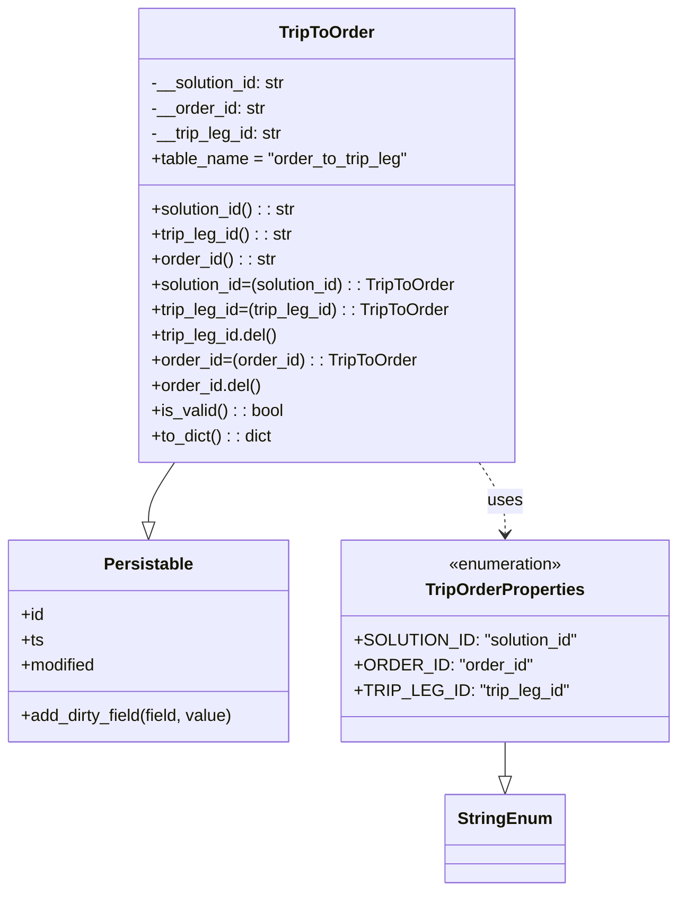

# Diagram: partview_service/partview_service/core/datamodel/TripToOrder.py


> Auto-generated by Obscura crawlers

## Diagram 1



### SVG

<svg id="container" width="641.5234375" xmlns="http://www.w3.org/2000/svg" class="classDiagram" height="848" viewBox="0 0 641.5234375 848" role="graphics-document document" aria-roledescription="class"><style>#container{font-family:"trebuchet ms",verdana,arial,sans-serif;font-size:16px;fill:#333;}@keyframes edge-animation-frame{from{stroke-dashoffset:0;}}@keyframes dash{to{stroke-dashoffset:0;}}#container .edge-animation-slow{stroke-dasharray:9,5!important;stroke-dashoffset:900;animation:dash 50s linear infinite;stroke-linecap:round;}#container .edge-animation-fast{stroke-dasharray:9,5!important;stroke-dashoffset:900;animation:dash 20s linear infinite;stroke-linecap:round;}#container .error-icon{fill:#552222;}#container .error-text{fill:#552222;stroke:#552222;}#container .edge-thickness-normal{stroke-width:1px;}#container .edge-thickness-thick{stroke-width:3.5px;}#container .edge-pattern-solid{stroke-dasharray:0;}#container .edge-thickness-invisible{stroke-width:0;fill:none;}#container .edge-pattern-dashed{stroke-dasharray:3;}#container .edge-pattern-dotted{stroke-dasharray:2;}#container .marker{fill:#333333;stroke:#333333;}#container .marker.cross{stroke:#333333;}#container svg{font-family:"trebuchet ms",verdana,arial,sans-serif;font-size:16px;}#container p{margin:0;}#container g.classGroup text{fill:#9370DB;stroke:none;font-family:"trebuchet ms",verdana,arial,sans-serif;font-size:10px;}#container g.classGroup text .title{font-weight:bolder;}#container .nodeLabel,#container .edgeLabel{color:#131300;}#container .edgeLabel .label rect{fill:#ECECFF;}#container .label text{fill:#131300;}#container .labelBkg{background:#ECECFF;}#container .edgeLabel .label span{background:#ECECFF;}#container .classTitle{font-weight:bolder;}#container .node rect,#container .node circle,#container .node ellipse,#container .node polygon,#container .node path{fill:#ECECFF;stroke:#9370DB;stroke-width:1px;}#container .divider{stroke:#9370DB;stroke-width:1;}#container g.clickable{cursor:pointer;}#container g.classGroup rect{fill:#ECECFF;stroke:#9370DB;}#container g.classGroup line{stroke:#9370DB;stroke-width:1;}#container .classLabel .box{stroke:none;stroke-width:0;fill:#ECECFF;opacity:0.5;}#container .classLabel .label{fill:#9370DB;font-size:10px;}#container .relation{stroke:#333333;stroke-width:1;fill:none;}#container .dashed-line{stroke-dasharray:3;}#container .dotted-line{stroke-dasharray:1 2;}#container #compositionStart,#container .composition{fill:#333333!important;stroke:#333333!important;stroke-width:1;}#container #compositionEnd,#container .composition{fill:#333333!important;stroke:#333333!important;stroke-width:1;}#container #dependencyStart,#container .dependency{fill:#333333!important;stroke:#333333!important;stroke-width:1;}#container #dependencyStart,#container .dependency{fill:#333333!important;stroke:#333333!important;stroke-width:1;}#container #extensionStart,#container .extension{fill:transparent!important;stroke:#333333!important;stroke-width:1;}#container #extensionEnd,#container .extension{fill:transparent!important;stroke:#333333!important;stroke-width:1;}#container #aggregationStart,#container .aggregation{fill:transparent!important;stroke:#333333!important;stroke-width:1;}#container #aggregationEnd,#container .aggregation{fill:transparent!important;stroke:#333333!important;stroke-width:1;}#container #lollipopStart,#container .lollipop{fill:#ECECFF!important;stroke:#333333!important;stroke-width:1;}#container #lollipopEnd,#container .lollipop{fill:#ECECFF!important;stroke:#333333!important;stroke-width:1;}#container .edgeTerminals{font-size:11px;line-height:initial;}#container .classTitleText{text-anchor:middle;font-size:18px;fill:#333;}#container .label-icon{display:inline-block;height:1em;overflow:visible;vertical-align:-0.125em;}#container .node .label-icon path{fill:currentColor;stroke:revert;stroke-width:revert;}#container :root{--mermaid-font-family:"trebuchet ms",verdana,arial,sans-serif;}</style><g><defs><marker id="container_class-aggregationStart" class="marker aggregation class" refX="18" refY="7" markerWidth="190" markerHeight="240" orient="auto"><path d="M 18,7 L9,13 L1,7 L9,1 Z"></path></marker></defs><defs><marker id="container_class-aggregationEnd" class="marker aggregation class" refX="1" refY="7" markerWidth="20" markerHeight="28" orient="auto"><path d="M 18,7 L9,13 L1,7 L9,1 Z"></path></marker></defs><defs><marker id="container_class-extensionStart" class="marker extension class" refX="18" refY="7" markerWidth="190" markerHeight="240" orient="auto"><path d="M 1,7 L18,13 V 1 Z"></path></marker></defs><defs><marker id="container_class-extensionEnd" class="marker extension class" refX="1" refY="7" markerWidth="20" markerHeight="28" orient="auto"><path d="M 1,1 V 13 L18,7 Z"></path></marker></defs><defs><marker id="container_class-compositionStart" class="marker composition class" refX="18" refY="7" markerWidth="190" markerHeight="240" orient="auto"><path d="M 18,7 L9,13 L1,7 L9,1 Z"></path></marker></defs><defs><marker id="container_class-compositionEnd" class="marker composition class" refX="1" refY="7" markerWidth="20" markerHeight="28" orient="auto"><path d="M 18,7 L9,13 L1,7 L9,1 Z"></path></marker></defs><defs><marker id="container_class-dependencyStart" class="marker dependency class" refX="6" refY="7" markerWidth="190" markerHeight="240" orient="auto"><path d="M 5,7 L9,13 L1,7 L9,1 Z"></path></marker></defs><defs><marker id="container_class-dependencyEnd" class="marker dependency class" refX="13" refY="7" markerWidth="20" markerHeight="28" orient="auto"><path d="M 18,7 L9,13 L14,7 L9,1 Z"></path></marker></defs><defs><marker id="container_class-lollipopStart" class="marker lollipop class" refX="13" refY="7" markerWidth="190" markerHeight="240" orient="auto"><circle stroke="black" fill="transparent" cx="7" cy="7" r="6"></circle></marker></defs><defs><marker id="container_class-lollipopEnd" class="marker lollipop class" refX="1" refY="7" markerWidth="190" markerHeight="240" orient="auto"><circle stroke="black" fill="transparent" cx="7" cy="7" r="6"></circle></marker></defs><g class="root"><g class="clusters"></g><g class="edgePaths"><path d="M168.413,440L164.297,446.167C160.18,452.333,151.948,464.667,147.831,474.125C143.715,483.583,143.715,490.167,143.715,493.458L143.715,496.75" id="id_TripToOrder_Persistable_1" class="edge-thickness-normal edge-pattern-solid relation" style=";;;" data-edge="true" data-et="edge" data-id="id_TripToOrder_Persistable_1" data-points="W3sieCI6MTY4LjQxMjgzNTA0MTk5NjA2LCJ5Ijo0NDB9LHsieCI6MTQzLjcxNDg0Mzc1LCJ5Ijo0Nzd9LHsieCI6MTQzLjcxNDg0Mzc1LCJ5Ijo1MTR9XQ==" marker-end="url(#container_class-extensionEnd)"></path><path d="M481.477,706L481.477,710.167C481.477,714.333,481.477,722.667,481.477,728.125C481.477,733.583,481.477,736.167,481.477,737.458L481.477,738.75" id="id_TripOrderProperties_StringEnum_2" class="edge-thickness-normal edge-pattern-solid relation" style=";;;" data-edge="true" data-et="edge" data-id="id_TripOrderProperties_StringEnum_2" data-points="W3sieCI6NDgxLjQ3NjU2MjUsInkiOjcwNn0seyJ4Ijo0ODEuNDc2NTYyNSwieSI6NzMxfSx7IngiOjQ4MS40NzY1NjI1LCJ5Ijo3NTZ9XQ==" marker-end="url(#container_class-extensionEnd)"></path><path d="M456.779,440L460.895,446.167C465.011,452.333,473.244,464.667,477.36,476C481.477,487.333,481.477,497.667,481.477,502.833L481.477,508" id="id_TripToOrder_TripOrderProperties_3" class="edge-thickness-normal edge-pattern-dashed relation" style=";;;" data-edge="true" data-et="edge" data-id="id_TripToOrder_TripOrderProperties_3" data-points="W3sieCI6NDU2Ljc3ODU3MTIwODAwMzk0LCJ5Ijo0NDB9LHsieCI6NDgxLjQ3NjU2MjUsInkiOjQ3N30seyJ4Ijo0ODEuNDc2NTYyNSwieSI6NTE0fV0=" marker-end="url(#container_class-dependencyEnd)"></path></g><g class="edgeLabels"><g class="edgeLabel"><g class="label" data-id="id_TripToOrder_Persistable_1" transform="translate(0, 0)"><foreignObject width="0" height="0"><div xmlns="http://www.w3.org/1999/xhtml" class="labelBkg" style="display: table-cell; white-space: nowrap; line-height: 1.5; max-width: 200px; text-align: center;"><span class="edgeLabel"></span></div></foreignObject></g></g><g class="edgeLabel"><g class="label" data-id="id_TripOrderProperties_StringEnum_2" transform="translate(0, 0)"><foreignObject width="0" height="0"><div xmlns="http://www.w3.org/1999/xhtml" class="labelBkg" style="display: table-cell; white-space: nowrap; line-height: 1.5; max-width: 200px; text-align: center;"><span class="edgeLabel"></span></div></foreignObject></g></g><g class="edgeLabel" transform="translate(481.4765625, 477)"><g class="label" data-id="id_TripToOrder_TripOrderProperties_3" transform="translate(-16.4921875, -12)"><foreignObject width="32.984375" height="24"><div xmlns="http://www.w3.org/1999/xhtml" class="labelBkg" style="display: table-cell; white-space: nowrap; line-height: 1.5; max-width: 200px; text-align: center;"><span class="edgeLabel"><p>uses</p></span></div></foreignObject></g></g></g><g class="nodes"><g class="node default" id="classId-Persistable-0" transform="translate(143.71484375, 610)"><g class="basic label-container"><path d="M-135.71484375 -96 L135.71484375 -96 L135.71484375 96 L-135.71484375 96" stroke="none" stroke-width="0" fill="#ECECFF" style=""></path><path d="M-135.71484375 -96 C-73.04484032496092 -96, -10.374836899921846 -96, 135.71484375 -96 M-135.71484375 -96 C-72.81235932177498 -96, -9.909874893549969 -96, 135.71484375 -96 M135.71484375 -96 C135.71484375 -31.028196861032328, 135.71484375 33.943606277935345, 135.71484375 96 M135.71484375 -96 C135.71484375 -45.05604643045398, 135.71484375 5.887907139092036, 135.71484375 96 M135.71484375 96 C81.35417355205433 96, 26.993503354108668 96, -135.71484375 96 M135.71484375 96 C68.08108160713311 96, 0.44731946426622926 96, -135.71484375 96 M-135.71484375 96 C-135.71484375 24.475877369499585, -135.71484375 -47.04824526100083, -135.71484375 -96 M-135.71484375 96 C-135.71484375 46.85354892528404, -135.71484375 -2.2929021494319244, -135.71484375 -96" stroke="#9370DB" stroke-width="1.3" fill="none" stroke-dasharray="0 0" style=""></path></g><g class="annotation-group text" transform="translate(0, -72)"></g><g class="label-group text" transform="translate(-40.9765625, -72)"><g class="label" style="font-weight: bolder" transform="translate(0,-12)"><foreignObject width="81.953125" height="24"><div xmlns="http://www.w3.org/1999/xhtml" style="display: table-cell; white-space: nowrap; line-height: 1.5; max-width: 130px; text-align: center;"><span class="nodeLabel markdown-node-label" style=""><p>Persistable</p></span></div></foreignObject></g></g><g class="members-group text" transform="translate(-123.71484375, -24)"><g class="label" style="" transform="translate(0,-12)"><foreignObject width="22.078125" height="24"><div xmlns="http://www.w3.org/1999/xhtml" style="display: table-cell; white-space: nowrap; line-height: 1.5; max-width: 79px; text-align: center;"><span class="nodeLabel markdown-node-label" style=""><p>+id</p></span></div></foreignObject></g><g class="label" style="" transform="translate(0,12)"><foreignObject width="21.15625" height="24"><div xmlns="http://www.w3.org/1999/xhtml" style="display: table-cell; white-space: nowrap; line-height: 1.5; max-width: 79px; text-align: center;"><span class="nodeLabel markdown-node-label" style=""><p>+ts</p></span></div></foreignObject></g><g class="label" style="" transform="translate(0,36)"><foreignObject width="72.609375" height="24"><div xmlns="http://www.w3.org/1999/xhtml" style="display: table-cell; white-space: nowrap; line-height: 1.5; max-width: 130px; text-align: center;"><span class="nodeLabel markdown-node-label" style=""><p>+modified</p></span></div></foreignObject></g></g><g class="methods-group text" transform="translate(-123.71484375, 72)"><g class="label" style="" transform="translate(0,-12)"><foreignObject width="206.453125" height="24"><div xmlns="http://www.w3.org/1999/xhtml" style="display: table-cell; white-space: nowrap; line-height: 1.5; max-width: 264px; text-align: center;"><span class="nodeLabel markdown-node-label" style=""><p>+add_dirty_field(field, value)</p></span></div></foreignObject></g></g><g class="divider" style=""><path d="M-135.71484375 -48 C-37.72676648751296 -48, 60.26131077497408 -48, 135.71484375 -48 M-135.71484375 -48 C-77.71990581684284 -48, -19.72496788368568 -48, 135.71484375 -48" stroke="#9370DB" stroke-width="1.3" fill="none" stroke-dasharray="0 0" style=""></path></g><g class="divider" style=""><path d="M-135.71484375 48 C-43.409011683165986 48, 48.89682038366803 48, 135.71484375 48 M-135.71484375 48 C-61.986065818366754 48, 11.742712113266492 48, 135.71484375 48" stroke="#9370DB" stroke-width="1.3" fill="none" stroke-dasharray="0 0" style=""></path></g></g><g class="node default" id="classId-StringEnum-1" transform="translate(481.4765625, 798)"><g class="basic label-container"><path d="M-54.234375 -42 L54.234375 -42 L54.234375 42 L-54.234375 42" stroke="none" stroke-width="0" fill="#ECECFF" style=""></path><path d="M-54.234375 -42 C-22.687036981327164 -42, 8.860301037345671 -42, 54.234375 -42 M-54.234375 -42 C-16.376497414392226 -42, 21.481380171215548 -42, 54.234375 -42 M54.234375 -42 C54.234375 -21.30812005703913, 54.234375 -0.6162401140782592, 54.234375 42 M54.234375 -42 C54.234375 -24.430472041709237, 54.234375 -6.860944083418474, 54.234375 42 M54.234375 42 C21.257362393422973 42, -11.719650213154054 42, -54.234375 42 M54.234375 42 C20.733695201354898 42, -12.766984597290204 42, -54.234375 42 M-54.234375 42 C-54.234375 15.438367354535309, -54.234375 -11.123265290929382, -54.234375 -42 M-54.234375 42 C-54.234375 9.37191181644232, -54.234375 -23.25617636711536, -54.234375 -42" stroke="#9370DB" stroke-width="1.3" fill="none" stroke-dasharray="0 0" style=""></path></g><g class="annotation-group text" transform="translate(0, -18)"></g><g class="label-group text" transform="translate(-42.234375, -18)"><g class="label" style="font-weight: bolder" transform="translate(0,-12)"><foreignObject width="84.46875" height="24"><div xmlns="http://www.w3.org/1999/xhtml" style="display: table-cell; white-space: nowrap; line-height: 1.5; max-width: 134px; text-align: center;"><span class="nodeLabel markdown-node-label" style=""><p>StringEnum</p></span></div></foreignObject></g></g><g class="members-group text" transform="translate(-42.234375, 30)"></g><g class="methods-group text" transform="translate(-42.234375, 60)"></g><g class="divider" style=""><path d="M-54.234375 6 C-25.41684157607429 6, 3.4006918478514194 6, 54.234375 6 M-54.234375 6 C-15.711245937377242 6, 22.811883125245515 6, 54.234375 6" stroke="#9370DB" stroke-width="1.3" fill="none" stroke-dasharray="0 0" style=""></path></g><g class="divider" style=""><path d="M-54.234375 24 C-18.543374503507394 24, 17.147625992985212 24, 54.234375 24 M-54.234375 24 C-21.222733906096714 24, 11.788907187806572 24, 54.234375 24" stroke="#9370DB" stroke-width="1.3" fill="none" stroke-dasharray="0 0" style=""></path></g></g><g class="node default" id="classId-TripOrderProperties-2" transform="translate(481.4765625, 610)"><g class="basic label-container"><path d="M-152.046875 -96 L152.046875 -96 L152.046875 96 L-152.046875 96" stroke="none" stroke-width="0" fill="#ECECFF" style=""></path><path d="M-152.046875 -96 C-80.10860434357389 -96, -8.170333687147775 -96, 152.046875 -96 M-152.046875 -96 C-88.45482494500516 -96, -24.862774890010314 -96, 152.046875 -96 M152.046875 -96 C152.046875 -27.44028229395518, 152.046875 41.11943541208964, 152.046875 96 M152.046875 -96 C152.046875 -39.28330886227509, 152.046875 17.433382275449816, 152.046875 96 M152.046875 96 C53.722907279532095 96, -44.60106044093581 96, -152.046875 96 M152.046875 96 C53.65117608832007 96, -44.74452282335986 96, -152.046875 96 M-152.046875 96 C-152.046875 33.02801529217773, -152.046875 -29.943969415644546, -152.046875 -96 M-152.046875 96 C-152.046875 57.13113703343133, -152.046875 18.26227406686266, -152.046875 -96" stroke="#9370DB" stroke-width="1.3" fill="none" stroke-dasharray="0 0" style=""></path></g><g class="annotation-group text" transform="translate(-55.5546875, -72)"><g class="label" style="" transform="translate(0,-12)"><foreignObject width="111.109375" height="24"><div xmlns="http://www.w3.org/1999/xhtml" style="display: table-cell; white-space: nowrap; line-height: 1.5; max-width: 161px; text-align: center;"><span class="nodeLabel markdown-node-label" style=""><p>«enumeration»</p></span></div></foreignObject></g></g><g class="label-group text" transform="translate(-73.546875, -48)"><g class="label" style="font-weight: bolder" transform="translate(0,-12)"><foreignObject width="147.09375" height="24"><div xmlns="http://www.w3.org/1999/xhtml" style="display: table-cell; white-space: nowrap; line-height: 1.5; max-width: 194px; text-align: center;"><span class="nodeLabel markdown-node-label" style=""><p>TripOrderProperties</p></span></div></foreignObject></g></g><g class="members-group text" transform="translate(-140.046875, 0)"><g class="label" style="" transform="translate(0,-12)"><foreignObject width="206.546875" height="24"><div xmlns="http://www.w3.org/1999/xhtml" style="display: table-cell; white-space: nowrap; line-height: 1.5; max-width: 264px; text-align: center;"><span class="nodeLabel markdown-node-label" style=""><p>+SOLUTION_ID: "solution_id"</p></span></div></foreignObject></g><g class="label" style="" transform="translate(0,12)"><foreignObject width="161.9375" height="24"><div xmlns="http://www.w3.org/1999/xhtml" style="display: table-cell; white-space: nowrap; line-height: 1.5; max-width: 219px; text-align: center;"><span class="nodeLabel markdown-node-label" style=""><p>+ORDER_ID: "order_id"</p></span></div></foreignObject></g><g class="label" style="" transform="translate(0,36)"><foreignObject width="194.578125" height="24"><div xmlns="http://www.w3.org/1999/xhtml" style="display: table-cell; white-space: nowrap; line-height: 1.5; max-width: 252px; text-align: center;"><span class="nodeLabel markdown-node-label" style=""><p>+TRIP_LEG_ID: "trip_leg_id"</p></span></div></foreignObject></g></g><g class="methods-group text" transform="translate(-140.046875, 96)"></g><g class="divider" style=""><path d="M-152.046875 -24 C-73.98770259688611 -24, 4.071469806227782 -24, 152.046875 -24 M-152.046875 -24 C-76.33828153680932 -24, -0.6296880736186381 -24, 152.046875 -24" stroke="#9370DB" stroke-width="1.3" fill="none" stroke-dasharray="0 0" style=""></path></g><g class="divider" style=""><path d="M-152.046875 72 C-71.18398705592583 72, 9.678900888148348 72, 152.046875 72 M-152.046875 72 C-77.30875685568267 72, -2.5706387113653477 72, 152.046875 72" stroke="#9370DB" stroke-width="1.3" fill="none" stroke-dasharray="0 0" style=""></path></g></g><g class="node default" id="classId-TripToOrder-3" transform="translate(312.595703125, 224)"><g class="basic label-container"><path d="M-182.4765625 -216 L182.4765625 -216 L182.4765625 216 L-182.4765625 216" stroke="none" stroke-width="0" fill="#ECECFF" style=""></path><path d="M-182.4765625 -216 C-54.24729809334195 -216, 73.9819663133161 -216, 182.4765625 -216 M-182.4765625 -216 C-64.99262744535329 -216, 52.491307609293415 -216, 182.4765625 -216 M182.4765625 -216 C182.4765625 -58.45223303921938, 182.4765625 99.09553392156124, 182.4765625 216 M182.4765625 -216 C182.4765625 -74.73770666617872, 182.4765625 66.52458666764255, 182.4765625 216 M182.4765625 216 C44.553323354734346 216, -93.36991579053131 216, -182.4765625 216 M182.4765625 216 C88.50970077416922 216, -5.457160951661564 216, -182.4765625 216 M-182.4765625 216 C-182.4765625 114.18547102994037, -182.4765625 12.370942059880747, -182.4765625 -216 M-182.4765625 216 C-182.4765625 78.19355793488498, -182.4765625 -59.61288413023004, -182.4765625 -216" stroke="#9370DB" stroke-width="1.3" fill="none" stroke-dasharray="0 0" style=""></path></g><g class="annotation-group text" transform="translate(0, -192)"></g><g class="label-group text" transform="translate(-43.796875, -192)"><g class="label" style="font-weight: bolder" transform="translate(0,-12)"><foreignObject width="87.59375" height="24"><div xmlns="http://www.w3.org/1999/xhtml" style="display: table-cell; white-space: nowrap; line-height: 1.5; max-width: 137px; text-align: center;"><span class="nodeLabel markdown-node-label" style=""><p>TripToOrder</p></span></div></foreignObject></g></g><g class="members-group text" transform="translate(-170.4765625, -144)"><g class="label" style="" transform="translate(0,-12)"><foreignObject width="131.390625" height="24"><div xmlns="http://www.w3.org/1999/xhtml" style="display: table-cell; white-space: nowrap; line-height: 1.5; max-width: 190px; text-align: center;"><span class="nodeLabel markdown-node-label" style=""><p>-__solution_id: str</p></span></div></foreignObject></g><g class="label" style="" transform="translate(0,12)"><foreignObject width="109.46875" height="24"><div xmlns="http://www.w3.org/1999/xhtml" style="display: table-cell; white-space: nowrap; line-height: 1.5; max-width: 168px; text-align: center;"><span class="nodeLabel markdown-node-label" style=""><p>-__order_id: str</p></span></div></foreignObject></g><g class="label" style="" transform="translate(0,36)"><foreignObject width="126.765625" height="24"><div xmlns="http://www.w3.org/1999/xhtml" style="display: table-cell; white-space: nowrap; line-height: 1.5; max-width: 185px; text-align: center;"><span class="nodeLabel markdown-node-label" style=""><p>-__trip_leg_id: str</p></span></div></foreignObject></g><g class="label" style="" transform="translate(0,60)"><foreignObject width="246.953125" height="24"><div xmlns="http://www.w3.org/1999/xhtml" style="display: table-cell; white-space: nowrap; line-height: 1.5; max-width: 304px; text-align: center;"><span class="nodeLabel markdown-node-label" style=""><p>+table_name = "order_to_trip_leg"</p></span></div></foreignObject></g></g><g class="methods-group text" transform="translate(-170.4765625, -24)"><g class="label" style="" transform="translate(0,-12)"><foreignObject width="140.40625" height="24"><div xmlns="http://www.w3.org/1999/xhtml" style="display: table-cell; white-space: nowrap; line-height: 1.5; max-width: 199px; text-align: center;"><span class="nodeLabel markdown-node-label" style=""><p>+solution_id() : : str</p></span></div></foreignObject></g><g class="label" style="" transform="translate(0,12)"><foreignObject width="136.03125" height="24"><div xmlns="http://www.w3.org/1999/xhtml" style="display: table-cell; white-space: nowrap; line-height: 1.5; max-width: 194px; text-align: center;"><span class="nodeLabel markdown-node-label" style=""><p>+trip_leg_id() : : str</p></span></div></foreignObject></g><g class="label" style="" transform="translate(0,36)"><foreignObject width="118.8125" height="24"><div xmlns="http://www.w3.org/1999/xhtml" style="display: table-cell; white-space: nowrap; line-height: 1.5; max-width: 177px; text-align: center;"><span class="nodeLabel markdown-node-label" style=""><p>+order_id() : : str</p></span></div></foreignObject></g><g class="label" style="" transform="translate(0,60)"><foreignObject width="297.15625" height="24"><div xmlns="http://www.w3.org/1999/xhtml" style="display: table-cell; white-space: nowrap; line-height: 1.5; max-width: 355px; text-align: center;"><span class="nodeLabel markdown-node-label" style=""><p>+solution_id=(solution_id) : : TripToOrder</p></span></div></foreignObject></g><g class="label" style="" transform="translate(0,84)"><foreignObject width="288.46875" height="24"><div xmlns="http://www.w3.org/1999/xhtml" style="display: table-cell; white-space: nowrap; line-height: 1.5; max-width: 347px; text-align: center;"><span class="nodeLabel markdown-node-label" style=""><p>+trip_leg_id=(trip_leg_id) : : TripToOrder</p></span></div></foreignObject></g><g class="label" style="" transform="translate(0,108)"><foreignObject width="122.859375" height="24"><div xmlns="http://www.w3.org/1999/xhtml" style="display: table-cell; white-space: nowrap; line-height: 1.5; max-width: 180px; text-align: center;"><span class="nodeLabel markdown-node-label" style=""><p>+trip_leg_id.del()</p></span></div></foreignObject></g><g class="label" style="" transform="translate(0,132)"><foreignObject width="253.953125" height="24"><div xmlns="http://www.w3.org/1999/xhtml" style="display: table-cell; white-space: nowrap; line-height: 1.5; max-width: 312px; text-align: center;"><span class="nodeLabel markdown-node-label" style=""><p>+order_id=(order_id) : : TripToOrder</p></span></div></foreignObject></g><g class="label" style="" transform="translate(0,156)"><foreignObject width="105.640625" height="24"><div xmlns="http://www.w3.org/1999/xhtml" style="display: table-cell; white-space: nowrap; line-height: 1.5; max-width: 163px; text-align: center;"><span class="nodeLabel markdown-node-label" style=""><p>+order_id.del()</p></span></div></foreignObject></g><g class="label" style="" transform="translate(0,180)"><foreignObject width="126.078125" height="24"><div xmlns="http://www.w3.org/1999/xhtml" style="display: table-cell; white-space: nowrap; line-height: 1.5; max-width: 184px; text-align: center;"><span class="nodeLabel markdown-node-label" style=""><p>+is_valid() : : bool</p></span></div></foreignObject></g><g class="label" style="" transform="translate(0,204)"><foreignObject width="116.25" height="24"><div xmlns="http://www.w3.org/1999/xhtml" style="display: table-cell; white-space: nowrap; line-height: 1.5; max-width: 174px; text-align: center;"><span class="nodeLabel markdown-node-label" style=""><p>+to_dict() : : dict</p></span></div></foreignObject></g></g><g class="divider" style=""><path d="M-182.4765625 -168 C-93.15046791847813 -168, -3.8243733369562563 -168, 182.4765625 -168 M-182.4765625 -168 C-65.1721859630185 -168, 52.13219057396299 -168, 182.4765625 -168" stroke="#9370DB" stroke-width="1.3" fill="none" stroke-dasharray="0 0" style=""></path></g><g class="divider" style=""><path d="M-182.4765625 -48 C-48.07681400460456 -48, 86.32293449079089 -48, 182.4765625 -48 M-182.4765625 -48 C-74.20634930506502 -48, 34.063863889869964 -48, 182.4765625 -48" stroke="#9370DB" stroke-width="1.3" fill="none" stroke-dasharray="0 0" style=""></path></g></g></g></g></g></svg>

## Diagram 2

```mermaid
flowchart TD
    A[TripToOrder.to_dict()] --> B[create trip_leg_to_order dict]
    B --> C["trip_leg_to_order['id'] = self.id"]
    B --> D["trip_leg_to_order['ts'] = self.ts"]
    B --> E["trip_leg_to_order['modified'] = self.modified"]
    B --> F["trip_leg_to_order['solution_id'] = self.solution_id"]
    B --> G["trip_leg_to_order['order_id'] = self.order_id"]
    B --> H["trip_leg_to_order['trip_leg_id'] = self.trip_leg_id"]
    C --> I[return trip_leg_to_order]
    D --> I
    E --> I
    F --> I
    G --> I
    H --> I
```

> SVG rendering failed for this diagram.
