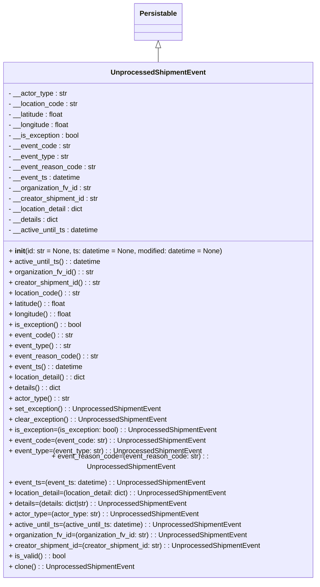

# Diagram: partview_service/partview_service/core/datamodel/UnprocessedShipmentEvent.py

> Auto-generated by Obscura crawlers

## Mermaid

### SVG

<svg id="container" width="723.390625" xmlns="http://www.w3.org/2000/svg" class="classDiagram" height="1302" viewBox="0 0 723.390625 1302" role="graphics-document document" aria-roledescription="class"><g><defs><marker id="container_class-aggregationStart" class="marker aggregation class" refX="18" refY="7" markerWidth="190" markerHeight="240" orient="auto"><path d="M 18,7 L9,13 L1,7 L9,1 Z"></path></marker></defs><defs><marker id="container_class-aggregationEnd" class="marker aggregation class" refX="1" refY="7" markerWidth="20" markerHeight="28" orient="auto"><path d="M 18,7 L9,13 L1,7 L9,1 Z"></path></marker></defs><defs><marker id="container_class-extensionStart" class="marker extension class" refX="18" refY="7" markerWidth="190" markerHeight="240" orient="auto"><path d="M 1,7 L18,13 V 1 Z"></path></marker></defs><defs><marker id="container_class-extensionEnd" class="marker extension class" refX="1" refY="7" markerWidth="20" markerHeight="28" orient="auto"><path d="M 1,1 V 13 L18,7 Z"></path></marker></defs><defs><marker id="container_class-compositionStart" class="marker composition class" refX="18" refY="7" markerWidth="190" markerHeight="240" orient="auto"><path d="M 18,7 L9,13 L1,7 L9,1 Z"></path></marker></defs><defs><marker id="container_class-compositionEnd" class="marker composition class" refX="1" refY="7" markerWidth="20" markerHeight="28" orient="auto"><path d="M 18,7 L9,13 L1,7 L9,1 Z"></path></marker></defs><defs><marker id="container_class-dependencyStart" class="marker dependency class" refX="6" refY="7" markerWidth="190" markerHeight="240" orient="auto"><path d="M 5,7 L9,13 L1,7 L9,1 Z"></path></marker></defs><defs><marker id="container_class-dependencyEnd" class="marker dependency class" refX="13" refY="7" markerWidth="20" markerHeight="28" orient="auto"><path d="M 18,7 L9,13 L14,7 L9,1 Z"></path></marker></defs><defs><marker id="container_class-lollipopStart" class="marker lollipop class" refX="13" refY="7" markerWidth="190" markerHeight="240" orient="auto"><circle stroke="black" fill="transparent" cx="7" cy="7" r="6"></circle></marker></defs><defs><marker id="container_class-lollipopEnd" class="marker lollipop class" refX="1" refY="7" markerWidth="190" markerHeight="240" orient="auto"><circle stroke="black" fill="transparent" cx="7" cy="7" r="6"></circle></marker></defs><g class="root"><g class="clusters"></g><g class="edgePaths"><path d="M361.695,109.25L361.695,110.542C361.695,111.833,361.695,114.417,361.695,119.875C361.695,125.333,361.695,133.667,361.695,137.833L361.695,142" id="id_Persistable_UnprocessedShipmentEvent_1" class="edge-thickness-normal edge-pattern-solid relation" style=";;;" data-edge="true" data-et="edge" data-id="id_Persistable_UnprocessedShipmentEvent_1" data-points="W3sieCI6MzYxLjY5NTMxMjUsInkiOjkyfSx7IngiOjM2MS42OTUzMTI1LCJ5IjoxMTd9LHsieCI6MzYxLjY5NTMxMjUsInkiOjE0Mn1d" marker-start="url(#container_class-extensionStart)"></path></g><g class="edgeLabels"><g class="edgeLabel"><g class="label" data-id="id_Persistable_UnprocessedShipmentEvent_1" transform="translate(0, 0)"><foreignObject width="0" height="0">

</foreignObject></g></g></g><g class="nodes"><g class="node default" id="classId-Persistable-0" transform="translate(361.6953125, 50)"><g class="basic label-container"><path d="M-52.9765625 -42 L52.9765625 -42 L52.9765625 42 L-52.9765625 42" stroke="none" stroke-width="0" fill="#ECECFF" style=""></path><path d="M-52.9765625 -42 C-11.022430407330376 -42, 30.93170168533925 -42, 52.9765625 -42 M-52.9765625 -42 C-19.48338170743625 -42, 14.009799085127497 -42, 52.9765625 -42 M52.9765625 -42 C52.9765625 -24.28173979621094, 52.9765625 -6.563479592421878, 52.9765625 42 M52.9765625 -42 C52.9765625 -8.772684197723734, 52.9765625 24.45463160455253, 52.9765625 42 M52.9765625 42 C28.325878704610407 42, 3.6751949092208136 42, -52.9765625 42 M52.9765625 42 C30.485824500553594 42, 7.995086501107188 42, -52.9765625 42 M-52.9765625 42 C-52.9765625 14.688279013112833, -52.9765625 -12.623441973774334, -52.9765625 -42 M-52.9765625 42 C-52.9765625 10.509117897648462, -52.9765625 -20.981764204703076, -52.9765625 -42" stroke="#9370DB" stroke-width="1.3" fill="none" stroke-dasharray="0 0" style=""></path></g><g class="annotation-group text" transform="translate(0, -18)"></g><g class="label-group text" transform="translate(-40.9765625, -18)"><g class="label" style="font-weight: bolder" transform="translate(0,-12)"><foreignObject width="81.953125" height="24">

Persistable

</foreignObject></g></g><g class="members-group text" transform="translate(-40.9765625, 30)"></g><g class="methods-group text" transform="translate(-40.9765625, 60)"></g><g class="divider" style=""><path d="M-52.9765625 6 C-25.939472089681775 6, 1.0976183206364496 6, 52.9765625 6 M-52.9765625 6 C-16.182825718952785 6, 20.61091106209443 6, 52.9765625 6" stroke="#9370DB" stroke-width="1.3" fill="none" stroke-dasharray="0 0" style=""></path></g><g class="divider" style=""><path d="M-52.9765625 24 C-27.770531780281402 24, -2.5645010605628045 24, 52.9765625 24 M-52.9765625 24 C-21.97782322700414 24, 9.020916045991719 24, 52.9765625 24" stroke="#9370DB" stroke-width="1.3" fill="none" stroke-dasharray="0 0" style=""></path></g></g><g class="node default" id="classId-UnprocessedShipmentEvent-1" transform="translate(361.6953125, 718)"><g class="basic label-container"><path d="M-353.6953125 -576 L353.6953125 -576 L353.6953125 576 L-353.6953125 576" stroke="none" stroke-width="0" fill="#ECECFF" style=""></path><path d="M-353.6953125 -576 C-127.38663133692773 -576, 98.92204982614453 -576, 353.6953125 -576 M-353.6953125 -576 C-107.48601402677443 -576, 138.72328444645115 -576, 353.6953125 -576 M353.6953125 -576 C353.6953125 -182.29570301820718, 353.6953125 211.40859396358564, 353.6953125 576 M353.6953125 -576 C353.6953125 -201.07857935262246, 353.6953125 173.8428412947551, 353.6953125 576 M353.6953125 576 C112.86244852458958 576, -127.97041545082084 576, -353.6953125 576 M353.6953125 576 C209.40745365174686 576, 65.11959480349373 576, -353.6953125 576 M-353.6953125 576 C-353.6953125 295.91653423482876, -353.6953125 15.833068469657519, -353.6953125 -576 M-353.6953125 576 C-353.6953125 311.59628697209143, -353.6953125 47.19257394418287, -353.6953125 -576" stroke="#9370DB" stroke-width="1.3" fill="none" stroke-dasharray="0 0" style=""></path></g><g class="annotation-group text" transform="translate(0, -552)"></g><g class="label-group text" transform="translate(-102.53125, -552)"><g class="label" style="font-weight: bolder" transform="translate(0,-12)"><foreignObject width="205.0625" height="24">

UnprocessedShipmentEvent

</foreignObject></g></g><g class="members-group text" transform="translate(-341.6953125, -504)"><g class="label" style="" transform="translate(0,-12)"><foreignObject width="134.515625" height="24">

- __actor_type : str

</foreignObject></g><g class="label" style="" transform="translate(0,12)"><foreignObject width="160.875" height="24">

- __location_code : str

</foreignObject></g><g class="label" style="" transform="translate(0,36)"><foreignObject width="129.375" height="24">

- __latitude : float

</foreignObject></g><g class="label" style="" transform="translate(0,60)"><foreignObject width="141.921875" height="24">

- __longitude : float

</foreignObject></g><g class="label" style="" transform="translate(0,84)"><foreignObject width="162.796875" height="24">

- __is_exception : bool

</foreignObject></g><g class="label" style="" transform="translate(0,108)"><foreignObject width="141.890625" height="24">

- __event_code : str

</foreignObject></g><g class="label" style="" transform="translate(0,132)"><foreignObject width="138.734375" height="24">

- __event_type : str

</foreignObject></g><g class="label" style="" transform="translate(0,156)"><foreignObject width="199.203125" height="24">

- __event_reason_code : str

</foreignObject></g><g class="label" style="" transform="translate(0,180)"><foreignObject width="166.015625" height="24">

- __event_ts : datetime

</foreignObject></g><g class="label" style="" transform="translate(0,204)"><foreignObject width="192.109375" height="24">

- __organization_fv_id : str

</foreignObject></g><g class="label" style="" transform="translate(0,228)"><foreignObject width="208.15625" height="24">

- __creator_shipment_id : str

</foreignObject></g><g class="label" style="" transform="translate(0,252)"><foreignObject width="175.84375" height="24">

- __location_detail : dict

</foreignObject></g><g class="label" style="" transform="translate(0,276)"><foreignObject width="116.015625" height="24">

- __details : dict

</foreignObject></g><g class="label" style="" transform="translate(0,300)"><foreignObject width="210.1875" height="24">

- __active_until_ts : datetime

</foreignObject></g></g><g class="methods-group text" transform="translate(-341.6953125, -144)"><g class="label" style="" transform="translate(0,-12)"><foreignObject width="493.546875" height="24">

+ <strong>init</strong>(id: str = None, ts: datetime = None, modified: datetime = None)

</foreignObject></g><g class="label" style="" transform="translate(0,12)"><foreignObject width="214.015625" height="24">

+ active_until_ts() : : datetime

</foreignObject></g><g class="label" style="" transform="translate(0,36)"><foreignObject width="195.921875" height="24">

+ organization_fv_id() : : str

</foreignObject></g><g class="label" style="" transform="translate(0,60)"><foreignObject width="211.96875" height="24">

+ creator_shipment_id() : : str

</foreignObject></g><g class="label" style="" transform="translate(0,84)"><foreignObject width="164.53125" height="24">

+ location_code() : : str

</foreignObject></g><g class="label" style="" transform="translate(0,108)"><foreignObject width="133.03125" height="24">

+ latitude() : : float

</foreignObject></g><g class="label" style="" transform="translate(0,132)"><foreignObject width="145.59375" height="24">

+ longitude() : : float

</foreignObject></g><g class="label" style="" transform="translate(0,156)"><foreignObject width="166.296875" height="24">

+ is_exception() : : bool

</foreignObject></g><g class="label" style="" transform="translate(0,180)"><foreignObject width="145.71875" height="24">

+ event_code() : : str

</foreignObject></g><g class="label" style="" transform="translate(0,204)"><foreignObject width="142.546875" height="24">

+ event_type() : : str

</foreignObject></g><g class="label" style="" transform="translate(0,228)"><foreignObject width="203.03125" height="24">

+ event_reason_code() : : str

</foreignObject></g><g class="label" style="" transform="translate(0,252)"><foreignObject width="169.828125" height="24">

+ event_ts() : : datetime

</foreignObject></g><g class="label" style="" transform="translate(0,276)"><foreignObject width="179.515625" height="24">

+ location_detail() : : dict

</foreignObject></g><g class="label" style="" transform="translate(0,300)"><foreignObject width="119.828125" height="24">

+ details() : : dict

</foreignObject></g><g class="label" style="" transform="translate(0,324)"><foreignObject width="138.34375" height="24">

+ actor_type() : : str

</foreignObject></g><g class="label" style="" transform="translate(0,348)"><foreignObject width="346.96875" height="24">

+ set_exception() : : UnprocessedShipmentEvent

</foreignObject></g><g class="label" style="" transform="translate(0,372)"><foreignObject width="359.421875" height="24">

+ clear_exception() : : UnprocessedShipmentEvent

</foreignObject></g><g class="label" style="" transform="translate(0,396)"><foreignObject width="476.046875" height="24">

+ is_exception=(is_exception: bool) : : UnprocessedShipmentEvent

</foreignObject></g><g class="label" style="" transform="translate(0,420)"><foreignObject width="448.34375" height="24">

+ event_code=(event_code: str) : : UnprocessedShipmentEvent

</foreignObject></g><g class="label" style="" transform="translate(0,444)"><foreignObject width="442.015625" height="24">

+ event_type=(event_type: str) : : UnprocessedShipmentEvent

</foreignObject></g><g class="label" style="" transform="translate(0,468)"><foreignObject width="562.96875" height="24">

+ event_reason_code=(event_reason_code: str) : : UnprocessedShipmentEvent

</foreignObject></g><g class="label" style="" transform="translate(0,492)"><foreignObject width="450.75" height="24">

+ event_ts=(event_ts: datetime) : : UnprocessedShipmentEvent

</foreignObject></g><g class="label" style="" transform="translate(0,516)"><foreignObject width="508.015625" height="24">

+ location_detail=(location_detail: dict) : : UnprocessedShipmentEvent

</foreignObject></g><g class="label" style="" transform="translate(0,540)"><foreignObject width="414.359375" height="24">

+ details=(details: dict|str) : : UnprocessedShipmentEvent

</foreignObject></g><g class="label" style="" transform="translate(0,564)"><foreignObject width="433.59375" height="24">

+ actor_type=(actor_type: str) : : UnprocessedShipmentEvent

</foreignObject></g><g class="label" style="" transform="translate(0,588)"><foreignObject width="539.09375" height="24">

+ active_until_ts=(active_until_ts: datetime) : : UnprocessedShipmentEvent

</foreignObject></g><g class="label" style="" transform="translate(0,612)"><foreignObject width="548.765625" height="24">

+ organization_fv_id=(organization_fv_id: str) : : UnprocessedShipmentEvent

</foreignObject></g><g class="label" style="" transform="translate(0,636)"><foreignObject width="580.859375" height="24">

+ creator_shipment_id=(creator_shipment_id: str) : : UnprocessedShipmentEvent

</foreignObject></g><g class="label" style="" transform="translate(0,660)"><foreignObject width="130.3125" height="24">

+ is_valid() : : bool

</foreignObject></g><g class="label" style="" transform="translate(0,684)"><foreignObject width="285.9375" height="24">

+ clone() : : UnprocessedShipmentEvent

</foreignObject></g></g><g class="divider" style=""><path d="M-353.6953125 -528 C-103.05965859802046 -528, 147.57599530395908 -528, 353.6953125 -528 M-353.6953125 -528 C-126.04849467634185 -528, 101.59832314731631 -528, 353.6953125 -528" stroke="#9370DB" stroke-width="1.3" fill="none" stroke-dasharray="0 0" style=""></path></g><g class="divider" style=""><path d="M-353.6953125 -168 C-191.75742234600474 -168, -29.81953219200949 -168, 353.6953125 -168 M-353.6953125 -168 C-73.03854576834055 -168, 207.6182209633189 -168, 353.6953125 -168" stroke="#9370DB" stroke-width="1.3" fill="none" stroke-dasharray="0 0" style=""></path></g></g></g></g></g></svg>
