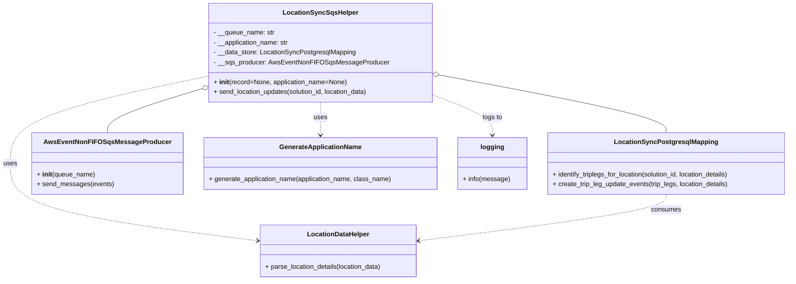

# Diagram: partview_service/partview_service/core/helpers/location_sync_helper.py


> Auto-generated by Obscura crawlers

## Diagram 1



### SVG

<svg id="container" width="1900.8828125" xmlns="http://www.w3.org/2000/svg" class="classDiagram" height="680" viewBox="0 0 1900.8828125 680" role="graphics-document document" aria-roledescription="class"><style>#container{font-family:"trebuchet ms",verdana,arial,sans-serif;font-size:16px;fill:#333;}@keyframes edge-animation-frame{from{stroke-dashoffset:0;}}@keyframes dash{to{stroke-dashoffset:0;}}#container .edge-animation-slow{stroke-dasharray:9,5!important;stroke-dashoffset:900;animation:dash 50s linear infinite;stroke-linecap:round;}#container .edge-animation-fast{stroke-dasharray:9,5!important;stroke-dashoffset:900;animation:dash 20s linear infinite;stroke-linecap:round;}#container .error-icon{fill:#552222;}#container .error-text{fill:#552222;stroke:#552222;}#container .edge-thickness-normal{stroke-width:1px;}#container .edge-thickness-thick{stroke-width:3.5px;}#container .edge-pattern-solid{stroke-dasharray:0;}#container .edge-thickness-invisible{stroke-width:0;fill:none;}#container .edge-pattern-dashed{stroke-dasharray:3;}#container .edge-pattern-dotted{stroke-dasharray:2;}#container .marker{fill:#333333;stroke:#333333;}#container .marker.cross{stroke:#333333;}#container svg{font-family:"trebuchet ms",verdana,arial,sans-serif;font-size:16px;}#container p{margin:0;}#container g.classGroup text{fill:#9370DB;stroke:none;font-family:"trebuchet ms",verdana,arial,sans-serif;font-size:10px;}#container g.classGroup text .title{font-weight:bolder;}#container .nodeLabel,#container .edgeLabel{color:#131300;}#container .edgeLabel .label rect{fill:#ECECFF;}#container .label text{fill:#131300;}#container .labelBkg{background:#ECECFF;}#container .edgeLabel .label span{background:#ECECFF;}#container .classTitle{font-weight:bolder;}#container .node rect,#container .node circle,#container .node ellipse,#container .node polygon,#container .node path{fill:#ECECFF;stroke:#9370DB;stroke-width:1px;}#container .divider{stroke:#9370DB;stroke-width:1;}#container g.clickable{cursor:pointer;}#container g.classGroup rect{fill:#ECECFF;stroke:#9370DB;}#container g.classGroup line{stroke:#9370DB;stroke-width:1;}#container .classLabel .box{stroke:none;stroke-width:0;fill:#ECECFF;opacity:0.5;}#container .classLabel .label{fill:#9370DB;font-size:10px;}#container .relation{stroke:#333333;stroke-width:1;fill:none;}#container .dashed-line{stroke-dasharray:3;}#container .dotted-line{stroke-dasharray:1 2;}#container #compositionStart,#container .composition{fill:#333333!important;stroke:#333333!important;stroke-width:1;}#container #compositionEnd,#container .composition{fill:#333333!important;stroke:#333333!important;stroke-width:1;}#container #dependencyStart,#container .dependency{fill:#333333!important;stroke:#333333!important;stroke-width:1;}#container #dependencyStart,#container .dependency{fill:#333333!important;stroke:#333333!important;stroke-width:1;}#container #extensionStart,#container .extension{fill:transparent!important;stroke:#333333!important;stroke-width:1;}#container #extensionEnd,#container .extension{fill:transparent!important;stroke:#333333!important;stroke-width:1;}#container #aggregationStart,#container .aggregation{fill:transparent!important;stroke:#333333!important;stroke-width:1;}#container #aggregationEnd,#container .aggregation{fill:transparent!important;stroke:#333333!important;stroke-width:1;}#container #lollipopStart,#container .lollipop{fill:#ECECFF!important;stroke:#333333!important;stroke-width:1;}#container #lollipopEnd,#container .lollipop{fill:#ECECFF!important;stroke:#333333!important;stroke-width:1;}#container .edgeTerminals{font-size:11px;line-height:initial;}#container .classTitleText{text-anchor:middle;font-size:18px;fill:#333;}#container .label-icon{display:inline-block;height:1em;overflow:visible;vertical-align:-0.125em;}#container .node .label-icon path{fill:currentColor;stroke:revert;stroke-width:revert;}#container :root{--mermaid-font-family:"trebuchet ms",verdana,arial,sans-serif;}</style><g><defs><marker id="container_class-aggregationStart" class="marker aggregation class" refX="18" refY="7" markerWidth="190" markerHeight="240" orient="auto"><path d="M 18,7 L9,13 L1,7 L9,1 Z"></path></marker></defs><defs><marker id="container_class-aggregationEnd" class="marker aggregation class" refX="1" refY="7" markerWidth="20" markerHeight="28" orient="auto"><path d="M 18,7 L9,13 L1,7 L9,1 Z"></path></marker></defs><defs><marker id="container_class-extensionStart" class="marker extension class" refX="18" refY="7" markerWidth="190" markerHeight="240" orient="auto"><path d="M 1,7 L18,13 V 1 Z"></path></marker></defs><defs><marker id="container_class-extensionEnd" class="marker extension class" refX="1" refY="7" markerWidth="20" markerHeight="28" orient="auto"><path d="M 1,1 V 13 L18,7 Z"></path></marker></defs><defs><marker id="container_class-compositionStart" class="marker composition class" refX="18" refY="7" markerWidth="190" markerHeight="240" orient="auto"><path d="M 18,7 L9,13 L1,7 L9,1 Z"></path></marker></defs><defs><marker id="container_class-compositionEnd" class="marker composition class" refX="1" refY="7" markerWidth="20" markerHeight="28" orient="auto"><path d="M 18,7 L9,13 L1,7 L9,1 Z"></path></marker></defs><defs><marker id="container_class-dependencyStart" class="marker dependency class" refX="6" refY="7" markerWidth="190" markerHeight="240" orient="auto"><path d="M 5,7 L9,13 L1,7 L9,1 Z"></path></marker></defs><defs><marker id="container_class-dependencyEnd" class="marker dependency class" refX="13" refY="7" markerWidth="20" markerHeight="28" orient="auto"><path d="M 18,7 L9,13 L14,7 L9,1 Z"></path></marker></defs><defs><marker id="container_class-lollipopStart" class="marker lollipop class" refX="13" refY="7" markerWidth="190" markerHeight="240" orient="auto"><circle stroke="black" fill="transparent" cx="7" cy="7" r="6"></circle></marker></defs><defs><marker id="container_class-lollipopEnd" class="marker lollipop class" refX="1" refY="7" markerWidth="190" markerHeight="240" orient="auto"><circle stroke="black" fill="transparent" cx="7" cy="7" r="6"></circle></marker></defs><g class="root"><g class="clusters"></g><g class="edgePaths"><path d="M1039.066,180.159L1132.631,197.633C1226.196,215.106,1413.327,250.053,1506.892,273.693C1600.457,297.333,1600.457,309.667,1600.457,315.833L1600.457,322" id="id_LocationSyncSqsHelper_LocationSyncPostgresqlMapping_1" class="edge-thickness-normal edge-pattern-solid relation" style=";;;" data-edge="true" data-et="edge" data-id="id_LocationSyncSqsHelper_LocationSyncPostgresqlMapping_1" data-points="W3sieCI6MTAyMi4xMDkzNzUsInkiOjE3Ni45OTI0NjgwMzIxMTY1Nn0seyJ4IjoxNjAwLjQ1NzAzMTI1LCJ5IjoyODV9LHsieCI6MTYwMC40NTcwMzEyNSwieSI6MzIyfV0=" marker-start="url(#container_class-aggregationStart)"></path><path d="M480.947,214.043L442.624,225.869C404.302,237.696,327.657,261.348,289.334,279.341C251.012,297.333,251.012,309.667,251.012,315.833L251.012,322" id="id_LocationSyncSqsHelper_AwsEventNonFIFOSqsMessageProducer_2" class="edge-thickness-normal edge-pattern-solid relation" style=";;;" data-edge="true" data-et="edge" data-id="id_LocationSyncSqsHelper_AwsEventNonFIFOSqsMessageProducer_2" data-points="W3sieCI6NDk3LjQyOTY4NzUsInkiOjIwOC45NTY3MDM2NzQ2OTc4OH0seyJ4IjoyNTEuMDExNzE4NzUsInkiOjI4NX0seyJ4IjoyNTEuMDExNzE4NzUsInkiOjMyMn1d" marker-start="url(#container_class-aggregationStart)"></path><path d="M497.43,184.016L418.607,200.847C339.784,217.677,182.138,251.339,103.315,286.836C24.492,322.333,24.492,359.667,24.492,397C24.492,434.333,24.492,471.667,122.86,502.817C221.228,533.967,417.963,558.934,516.33,571.417L614.698,583.901" id="id_LocationSyncSqsHelper_LocationDataHelper_3" class="edge-thickness-normal edge-pattern-dashed relation" style=";;;" data-edge="true" data-et="edge" data-id="id_LocationSyncSqsHelper_LocationDataHelper_3" data-points="W3sieCI6NDk3LjQyOTY4NzUsInkiOjE4NC4wMTYwODEzMDQzNTQ3N30seyJ4IjoyNC40OTIxODc1LCJ5IjoyODV9LHsieCI6MjQuNDkyMTg3NSwieSI6Mzk3fSx7IngiOjI0LjQ5MjE4NzUsInkiOjUwOX0seyJ4Ijo2MjAuNjUwMzkwNjI1LCJ5Ijo1ODQuNjU2MjgxOTg5OTUxNn1d" marker-end="url(#container_class-dependencyEnd)"></path><path d="M759.77,248L759.77,254.167C759.77,260.333,759.77,272.667,759.77,286C759.77,299.333,759.77,313.667,759.77,320.833L759.77,328" id="id_LocationSyncSqsHelper_GenerateApplicationName_4" class="edge-thickness-normal edge-pattern-dashed relation" style=";;;" data-edge="true" data-et="edge" data-id="id_LocationSyncSqsHelper_GenerateApplicationName_4" data-points="W3sieCI6NzU5Ljc2OTUzMTI1LCJ5IjoyNDh9LHsieCI6NzU5Ljc2OTUzMTI1LCJ5IjoyODV9LHsieCI6NzU5Ljc2OTUzMTI1LCJ5IjozMzR9XQ==" marker-end="url(#container_class-dependencyEnd)"></path><path d="M1022.109,227.009L1047.719,236.674C1073.328,246.339,1124.547,265.67,1150.156,282.501C1175.766,299.333,1175.766,313.667,1175.766,320.833L1175.766,328" id="id_LocationSyncSqsHelper_logging_5" class="edge-thickness-normal edge-pattern-dashed relation" style=";;;" data-edge="true" data-et="edge" data-id="id_LocationSyncSqsHelper_logging_5" data-points="W3sieCI6MTAyMi4xMDkzNzUsInkiOjIyNy4wMDg5OTU3Mjc0OTg5M30seyJ4IjoxMTc1Ljc2NTYyNSwieSI6Mjg1fSx7IngiOjExNzUuNzY1NjI1LCJ5IjozMzR9XQ==" marker-end="url(#container_class-dependencyEnd)"></path><path d="M1600.457,472L1600.457,478.167C1600.457,484.333,1600.457,496.667,1502.089,515.317C1403.722,533.967,1206.986,558.934,1108.619,571.417L1010.251,583.901" id="id_LocationSyncPostgresqlMapping_LocationDataHelper_6" class="edge-thickness-normal edge-pattern-dashed relation" style=";;;" data-edge="true" data-et="edge" data-id="id_LocationSyncPostgresqlMapping_LocationDataHelper_6" data-points="W3sieCI6MTYwMC40NTcwMzEyNSwieSI6NDcyfSx7IngiOjE2MDAuNDU3MDMxMjUsInkiOjUwOX0seyJ4IjoxMDA0LjI5ODgyODEyNSwieSI6NTg0LjY1NjI4MTk4OTk1MTZ9XQ==" marker-end="url(#container_class-dependencyEnd)"></path></g><g class="edgeLabels"><g class="edgeLabel"><g class="label" data-id="id_LocationSyncSqsHelper_LocationSyncPostgresqlMapping_1" transform="translate(0, 0)"><foreignObject width="0" height="0"><div xmlns="http://www.w3.org/1999/xhtml" class="labelBkg" style="display: table-cell; white-space: nowrap; line-height: 1.5; max-width: 200px; text-align: center;"><span class="edgeLabel"></span></div></foreignObject></g></g><g class="edgeLabel"><g class="label" data-id="id_LocationSyncSqsHelper_AwsEventNonFIFOSqsMessageProducer_2" transform="translate(0, 0)"><foreignObject width="0" height="0"><div xmlns="http://www.w3.org/1999/xhtml" class="labelBkg" style="display: table-cell; white-space: nowrap; line-height: 1.5; max-width: 200px; text-align: center;"><span class="edgeLabel"></span></div></foreignObject></g></g><g class="edgeLabel" transform="translate(24.4921875, 397)"><g class="label" data-id="id_LocationSyncSqsHelper_LocationDataHelper_3" transform="translate(-16.4921875, -12)"><foreignObject width="32.984375" height="24"><div xmlns="http://www.w3.org/1999/xhtml" class="labelBkg" style="display: table-cell; white-space: nowrap; line-height: 1.5; max-width: 200px; text-align: center;"><span class="edgeLabel"><p>uses</p></span></div></foreignObject></g></g><g class="edgeLabel" transform="translate(759.76953125, 285)"><g class="label" data-id="id_LocationSyncSqsHelper_GenerateApplicationName_4" transform="translate(-16.4921875, -12)"><foreignObject width="32.984375" height="24"><div xmlns="http://www.w3.org/1999/xhtml" class="labelBkg" style="display: table-cell; white-space: nowrap; line-height: 1.5; max-width: 200px; text-align: center;"><span class="edgeLabel"><p>uses</p></span></div></foreignObject></g></g><g class="edgeLabel" transform="translate(1175.765625, 285)"><g class="label" data-id="id_LocationSyncSqsHelper_logging_5" transform="translate(-24.3828125, -12)"><foreignObject width="48.765625" height="24"><div xmlns="http://www.w3.org/1999/xhtml" class="labelBkg" style="display: table-cell; white-space: nowrap; line-height: 1.5; max-width: 200px; text-align: center;"><span class="edgeLabel"><p>logs to</p></span></div></foreignObject></g></g><g class="edgeLabel" transform="translate(1600.45703125, 509)"><g class="label" data-id="id_LocationSyncPostgresqlMapping_LocationDataHelper_6" transform="translate(-36.375, -12)"><foreignObject width="72.75" height="24"><div xmlns="http://www.w3.org/1999/xhtml" class="labelBkg" style="display: table-cell; white-space: nowrap; line-height: 1.5; max-width: 200px; text-align: center;"><span class="edgeLabel"><p>consumes</p></span></div></foreignObject></g></g></g><g class="nodes"><g class="node default" id="classId-LocationSyncSqsHelper-0" transform="translate(759.76953125, 128)"><g class="basic label-container"><path d="M-262.33984375 -120 L262.33984375 -120 L262.33984375 120 L-262.33984375 120" stroke="none" stroke-width="0" fill="#ECECFF" style=""></path><path d="M-262.33984375 -120 C-111.07335310030993 -120, 40.19313754938014 -120, 262.33984375 -120 M-262.33984375 -120 C-101.56127366547622 -120, 59.21729641904756 -120, 262.33984375 -120 M262.33984375 -120 C262.33984375 -31.9291785877203, 262.33984375 56.1416428245594, 262.33984375 120 M262.33984375 -120 C262.33984375 -54.06526332096982, 262.33984375 11.869473358060361, 262.33984375 120 M262.33984375 120 C83.34117538239445 120, -95.65749298521109 120, -262.33984375 120 M262.33984375 120 C63.9020545205897 120, -134.5357347088206 120, -262.33984375 120 M-262.33984375 120 C-262.33984375 25.821104605313565, -262.33984375 -68.35779078937287, -262.33984375 -120 M-262.33984375 120 C-262.33984375 66.20904485071476, -262.33984375 12.418089701429523, -262.33984375 -120" stroke="#9370DB" stroke-width="1.3" fill="none" stroke-dasharray="0 0" style=""></path></g><g class="annotation-group text" transform="translate(0, -96)"></g><g class="label-group text" transform="translate(-86.1953125, -96)"><g class="label" style="font-weight: bolder" transform="translate(0,-12)"><foreignObject width="172.390625" height="24"><div xmlns="http://www.w3.org/1999/xhtml" style="display: table-cell; white-space: nowrap; line-height: 1.5; max-width: 221px; text-align: center;"><span class="nodeLabel markdown-node-label" style=""><p>LocationSyncSqsHelper</p></span></div></foreignObject></g></g><g class="members-group text" transform="translate(-250.33984375, -48)"><g class="label" style="" transform="translate(0,-12)"><foreignObject width="148.5" height="24"><div xmlns="http://www.w3.org/1999/xhtml" style="display: table-cell; white-space: nowrap; line-height: 1.5; max-width: 207px; text-align: center;"><span class="nodeLabel markdown-node-label" style=""><p>- __queue_name: str</p></span></div></foreignObject></g><g class="label" style="" transform="translate(0,12)"><foreignObject width="185.296875" height="24"><div xmlns="http://www.w3.org/1999/xhtml" style="display: table-cell; white-space: nowrap; line-height: 1.5; max-width: 243px; text-align: center;"><span class="nodeLabel markdown-node-label" style=""><p>- __application_name: str</p></span></div></foreignObject></g><g class="label" style="" transform="translate(0,36)"><foreignObject width="346.234375" height="24"><div xmlns="http://www.w3.org/1999/xhtml" style="display: table-cell; white-space: nowrap; line-height: 1.5; max-width: 404px; text-align: center;"><span class="nodeLabel markdown-node-label" style=""><p>- __data_store: LocationSyncPostgresqlMapping</p></span></div></foreignObject></g><g class="label" style="" transform="translate(0,60)"><foreignObject width="414.484375" height="24"><div xmlns="http://www.w3.org/1999/xhtml" style="display: table-cell; white-space: nowrap; line-height: 1.5; max-width: 473px; text-align: center;"><span class="nodeLabel markdown-node-label" style=""><p>- __sqs_producer: AwsEventNonFIFOSqsMessageProducer</p></span></div></foreignObject></g></g><g class="methods-group text" transform="translate(-250.33984375, 72)"><g class="label" style="" transform="translate(0,-12)"><foreignObject width="325" height="24"><div xmlns="http://www.w3.org/1999/xhtml" style="display: table-cell; white-space: nowrap; line-height: 1.5; max-width: 415px; text-align: center;"><span class="nodeLabel markdown-node-label" style=""><p>+ <strong>init</strong>(record=None, application_name=None)</p></span></div></foreignObject></g><g class="label" style="" transform="translate(0,12)"><foreignObject width="381.953125" height="24"><div xmlns="http://www.w3.org/1999/xhtml" style="display: table-cell; white-space: nowrap; line-height: 1.5; max-width: 439px; text-align: center;"><span class="nodeLabel markdown-node-label" style=""><p>+ send_location_updates(solution_id, location_data)</p></span></div></foreignObject></g></g><g class="divider" style=""><path d="M-262.33984375 -72 C-110.37435946133843 -72, 41.59112482732314 -72, 262.33984375 -72 M-262.33984375 -72 C-66.64910108663176 -72, 129.04164157673648 -72, 262.33984375 -72" stroke="#9370DB" stroke-width="1.3" fill="none" stroke-dasharray="0 0" style=""></path></g><g class="divider" style=""><path d="M-262.33984375 48 C-67.71029945926773 48, 126.91924483146454 48, 262.33984375 48 M-262.33984375 48 C-136.07969771239857 48, -9.819551674797111 48, 262.33984375 48" stroke="#9370DB" stroke-width="1.3" fill="none" stroke-dasharray="0 0" style=""></path></g></g><g class="node default" id="classId-LocationSyncPostgresqlMapping-1" transform="translate(1600.45703125, 397)"><g class="basic label-container"><path d="M-292.42578125 -75 L292.42578125 -75 L292.42578125 75 L-292.42578125 75" stroke="none" stroke-width="0" fill="#ECECFF" style=""></path><path d="M-292.42578125 -75 C-109.40644297648774 -75, 73.61289529702452 -75, 292.42578125 -75 M-292.42578125 -75 C-93.77232289920235 -75, 104.8811354515953 -75, 292.42578125 -75 M292.42578125 -75 C292.42578125 -26.317726420173194, 292.42578125 22.36454715965361, 292.42578125 75 M292.42578125 -75 C292.42578125 -38.146563763074894, 292.42578125 -1.2931275261497888, 292.42578125 75 M292.42578125 75 C142.3395460584517 75, -7.746689133096595 75, -292.42578125 75 M292.42578125 75 C137.71126729826588 75, -17.00324665346824 75, -292.42578125 75 M-292.42578125 75 C-292.42578125 42.31003319761483, -292.42578125 9.620066395229657, -292.42578125 -75 M-292.42578125 75 C-292.42578125 15.598008984938211, -292.42578125 -43.80398203012358, -292.42578125 -75" stroke="#9370DB" stroke-width="1.3" fill="none" stroke-dasharray="0 0" style=""></path></g><g class="annotation-group text" transform="translate(0, -51)"></g><g class="label-group text" transform="translate(-118.8359375, -51)"><g class="label" style="font-weight: bolder" transform="translate(0,-12)"><foreignObject width="237.671875" height="24"><div xmlns="http://www.w3.org/1999/xhtml" style="display: table-cell; white-space: nowrap; line-height: 1.5; max-width: 284px; text-align: center;"><span class="nodeLabel markdown-node-label" style=""><p>LocationSyncPostgresqlMapping</p></span></div></foreignObject></g></g><g class="members-group text" transform="translate(-280.42578125, -3)"></g><g class="methods-group text" transform="translate(-280.42578125, 27)"><g class="label" style="" transform="translate(0,-12)"><foreignObject width="442.015625" height="24"><div xmlns="http://www.w3.org/1999/xhtml" style="display: table-cell; white-space: nowrap; line-height: 1.5; max-width: 499px; text-align: center;"><span class="nodeLabel markdown-node-label" style=""><p>+ identify_triplegs_for_location(solution_id, location_details)</p></span></div></foreignObject></g><g class="label" style="" transform="translate(0,12)"><foreignObject width="432.875" height="24"><div xmlns="http://www.w3.org/1999/xhtml" style="display: table-cell; white-space: nowrap; line-height: 1.5; max-width: 490px; text-align: center;"><span class="nodeLabel markdown-node-label" style=""><p>+ create_trip_leg_update_events(trip_legs, location_details)</p></span></div></foreignObject></g></g><g class="divider" style=""><path d="M-292.42578125 -27 C-166.89849249790228 -27, -41.371203745804564 -27, 292.42578125 -27 M-292.42578125 -27 C-67.03722999404391 -27, 158.35132126191218 -27, 292.42578125 -27" stroke="#9370DB" stroke-width="1.3" fill="none" stroke-dasharray="0 0" style=""></path></g><g class="divider" style=""><path d="M-292.42578125 -3 C-163.96269013893135 -3, -35.4995990278627 -3, 292.42578125 -3 M-292.42578125 -3 C-88.10828127920752 -3, 116.20921869158497 -3, 292.42578125 -3" stroke="#9370DB" stroke-width="1.3" fill="none" stroke-dasharray="0 0" style=""></path></g></g><g class="node default" id="classId-AwsEventNonFIFOSqsMessageProducer-2" transform="translate(251.01171875, 397)"><g class="basic label-container"><path d="M-175.02734375 -75 L175.02734375 -75 L175.02734375 75 L-175.02734375 75" stroke="none" stroke-width="0" fill="#ECECFF" style=""></path><path d="M-175.02734375 -75 C-87.15993628401174 -75, 0.7074711819765298 -75, 175.02734375 -75 M-175.02734375 -75 C-99.41281491233995 -75, -23.798286074679908 -75, 175.02734375 -75 M175.02734375 -75 C175.02734375 -32.1929206978805, 175.02734375 10.614158604238995, 175.02734375 75 M175.02734375 -75 C175.02734375 -27.86150796516769, 175.02734375 19.27698406966462, 175.02734375 75 M175.02734375 75 C70.24872418057339 75, -34.52989538885322 75, -175.02734375 75 M175.02734375 75 C47.881563558120334 75, -79.26421663375933 75, -175.02734375 75 M-175.02734375 75 C-175.02734375 31.24007834537081, -175.02734375 -12.519843309258377, -175.02734375 -75 M-175.02734375 75 C-175.02734375 39.72367107093143, -175.02734375 4.447342141862862, -175.02734375 -75" stroke="#9370DB" stroke-width="1.3" fill="none" stroke-dasharray="0 0" style=""></path></g><g class="annotation-group text" transform="translate(0, -51)"></g><g class="label-group text" transform="translate(-142.3359375, -51)"><g class="label" style="font-weight: bolder" transform="translate(0,-12)"><foreignObject width="284.671875" height="24"><div xmlns="http://www.w3.org/1999/xhtml" style="display: table-cell; white-space: nowrap; line-height: 1.5; max-width: 332px; text-align: center;"><span class="nodeLabel markdown-node-label" style=""><p>AwsEventNonFIFOSqsMessageProducer</p></span></div></foreignObject></g></g><g class="members-group text" transform="translate(-163.02734375, -3)"></g><g class="methods-group text" transform="translate(-163.02734375, 27)"><g class="label" style="" transform="translate(0,-12)"><foreignObject width="141.1875" height="24"><div xmlns="http://www.w3.org/1999/xhtml" style="display: table-cell; white-space: nowrap; line-height: 1.5; max-width: 231px; text-align: center;"><span class="nodeLabel markdown-node-label" style=""><p>+ <strong>init</strong>(queue_name)</p></span></div></foreignObject></g><g class="label" style="" transform="translate(0,12)"><foreignObject width="183.71875" height="24"><div xmlns="http://www.w3.org/1999/xhtml" style="display: table-cell; white-space: nowrap; line-height: 1.5; max-width: 241px; text-align: center;"><span class="nodeLabel markdown-node-label" style=""><p>+ send_messages(events)</p></span></div></foreignObject></g></g><g class="divider" style=""><path d="M-175.02734375 -27 C-56.730178825448704 -27, 61.56698609910259 -27, 175.02734375 -27 M-175.02734375 -27 C-85.94988100185893 -27, 3.1275817462821465 -27, 175.02734375 -27" stroke="#9370DB" stroke-width="1.3" fill="none" stroke-dasharray="0 0" style=""></path></g><g class="divider" style=""><path d="M-175.02734375 -3 C-67.33323070167634 -3, 40.360882346647315 -3, 175.02734375 -3 M-175.02734375 -3 C-52.17641107985523 -3, 70.67452159028954 -3, 175.02734375 -3" stroke="#9370DB" stroke-width="1.3" fill="none" stroke-dasharray="0 0" style=""></path></g></g><g class="node default" id="classId-LocationDataHelper-3" transform="translate(812.474609375, 609)"><g class="basic label-container"><path d="M-191.82421875 -63 L191.82421875 -63 L191.82421875 63 L-191.82421875 63" stroke="none" stroke-width="0" fill="#ECECFF" style=""></path><path d="M-191.82421875 -63 C-92.9381387938267 -63, 5.947941162346609 -63, 191.82421875 -63 M-191.82421875 -63 C-102.38492283947025 -63, -12.945626928940499 -63, 191.82421875 -63 M191.82421875 -63 C191.82421875 -17.366061637747165, 191.82421875 28.26787672450567, 191.82421875 63 M191.82421875 -63 C191.82421875 -35.55843817897744, 191.82421875 -8.11687635795488, 191.82421875 63 M191.82421875 63 C44.1268869850978 63, -103.5704447798044 63, -191.82421875 63 M191.82421875 63 C66.55664057175152 63, -58.71093760649697 63, -191.82421875 63 M-191.82421875 63 C-191.82421875 25.819872645627648, -191.82421875 -11.360254708744705, -191.82421875 -63 M-191.82421875 63 C-191.82421875 34.172481073756444, -191.82421875 5.344962147512888, -191.82421875 -63" stroke="#9370DB" stroke-width="1.3" fill="none" stroke-dasharray="0 0" style=""></path></g><g class="annotation-group text" transform="translate(0, -39)"></g><g class="label-group text" transform="translate(-72.7578125, -39)"><g class="label" style="font-weight: bolder" transform="translate(0,-12)"><foreignObject width="145.515625" height="24"><div xmlns="http://www.w3.org/1999/xhtml" style="display: table-cell; white-space: nowrap; line-height: 1.5; max-width: 195px; text-align: center;"><span class="nodeLabel markdown-node-label" style=""><p>LocationDataHelper</p></span></div></foreignObject></g></g><g class="members-group text" transform="translate(-179.82421875, 9)"></g><g class="methods-group text" transform="translate(-179.82421875, 39)"><g class="label" style="" transform="translate(0,-12)"><foreignObject width="286.890625" height="24"><div xmlns="http://www.w3.org/1999/xhtml" style="display: table-cell; white-space: nowrap; line-height: 1.5; max-width: 344px; text-align: center;"><span class="nodeLabel markdown-node-label" style=""><p>+ parse_location_details(location_data)</p></span></div></foreignObject></g></g><g class="divider" style=""><path d="M-191.82421875 -15 C-99.80471721613999 -15, -7.785215682279983 -15, 191.82421875 -15 M-191.82421875 -15 C-70.18156196621598 -15, 51.46109481756804 -15, 191.82421875 -15" stroke="#9370DB" stroke-width="1.3" fill="none" stroke-dasharray="0 0" style=""></path></g><g class="divider" style=""><path d="M-191.82421875 9 C-43.807748391341306 9, 104.20872196731739 9, 191.82421875 9 M-191.82421875 9 C-83.80783621578625 9, 24.208546318427494 9, 191.82421875 9" stroke="#9370DB" stroke-width="1.3" fill="none" stroke-dasharray="0 0" style=""></path></g></g><g class="node default" id="classId-GenerateApplicationName-4" transform="translate(759.76953125, 397)"><g class="basic label-container"><path d="M-283.73046875 -63 L283.73046875 -63 L283.73046875 63 L-283.73046875 63" stroke="none" stroke-width="0" fill="#ECECFF" style=""></path><path d="M-283.73046875 -63 C-64.65443346743493 -63, 154.42160181513015 -63, 283.73046875 -63 M-283.73046875 -63 C-82.18245718296635 -63, 119.36555438406731 -63, 283.73046875 -63 M283.73046875 -63 C283.73046875 -25.10936156496203, 283.73046875 12.781276870075942, 283.73046875 63 M283.73046875 -63 C283.73046875 -14.139972907479304, 283.73046875 34.72005418504139, 283.73046875 63 M283.73046875 63 C80.71033271169853 63, -122.30980332660295 63, -283.73046875 63 M283.73046875 63 C107.44442176981943 63, -68.84162521036114 63, -283.73046875 63 M-283.73046875 63 C-283.73046875 24.700824281310958, -283.73046875 -13.598351437378085, -283.73046875 -63 M-283.73046875 63 C-283.73046875 26.42541047154036, -283.73046875 -10.14917905691928, -283.73046875 -63" stroke="#9370DB" stroke-width="1.3" fill="none" stroke-dasharray="0 0" style=""></path></g><g class="annotation-group text" transform="translate(0, -39)"></g><g class="label-group text" transform="translate(-95.8203125, -39)"><g class="label" style="font-weight: bolder" transform="translate(0,-12)"><foreignObject width="191.640625" height="24"><div xmlns="http://www.w3.org/1999/xhtml" style="display: table-cell; white-space: nowrap; line-height: 1.5; max-width: 240px; text-align: center;"><span class="nodeLabel markdown-node-label" style=""><p>GenerateApplicationName</p></span></div></foreignObject></g></g><g class="members-group text" transform="translate(-271.73046875, 9)"></g><g class="methods-group text" transform="translate(-271.73046875, 39)"><g class="label" style="" transform="translate(0,-12)"><foreignObject width="447.640625" height="24"><div xmlns="http://www.w3.org/1999/xhtml" style="display: table-cell; white-space: nowrap; line-height: 1.5; max-width: 505px; text-align: center;"><span class="nodeLabel markdown-node-label" style=""><p>+ generate_application_name(application_name, class_name)</p></span></div></foreignObject></g></g><g class="divider" style=""><path d="M-283.73046875 -15 C-135.97402389903007 -15, 11.782420951939855 -15, 283.73046875 -15 M-283.73046875 -15 C-86.42786292789759 -15, 110.87474289420481 -15, 283.73046875 -15" stroke="#9370DB" stroke-width="1.3" fill="none" stroke-dasharray="0 0" style=""></path></g><g class="divider" style=""><path d="M-283.73046875 9 C-68.38611166963906 9, 146.95824541072187 9, 283.73046875 9 M-283.73046875 9 C-117.68256981287001 9, 48.36532912425997 9, 283.73046875 9" stroke="#9370DB" stroke-width="1.3" fill="none" stroke-dasharray="0 0" style=""></path></g></g><g class="node default" id="classId-logging-5" transform="translate(1175.765625, 397)"><g class="basic label-container"><path d="M-82.265625 -63 L82.265625 -63 L82.265625 63 L-82.265625 63" stroke="none" stroke-width="0" fill="#ECECFF" style=""></path><path d="M-82.265625 -63 C-29.791257740331012 -63, 22.683109519337975 -63, 82.265625 -63 M-82.265625 -63 C-42.18132249232795 -63, -2.0970199846559012 -63, 82.265625 -63 M82.265625 -63 C82.265625 -34.162441521111546, 82.265625 -5.3248830422230995, 82.265625 63 M82.265625 -63 C82.265625 -13.192449644820712, 82.265625 36.615100710358575, 82.265625 63 M82.265625 63 C31.332809565840726 63, -19.600005868318547 63, -82.265625 63 M82.265625 63 C19.97831024264994 63, -42.30900451470012 63, -82.265625 63 M-82.265625 63 C-82.265625 18.453502807179127, -82.265625 -26.092994385641745, -82.265625 -63 M-82.265625 63 C-82.265625 29.854118810576097, -82.265625 -3.2917623788478068, -82.265625 -63" stroke="#9370DB" stroke-width="1.3" fill="none" stroke-dasharray="0 0" style=""></path></g><g class="annotation-group text" transform="translate(0, -39)"></g><g class="label-group text" transform="translate(-27.109375, -39)"><g class="label" style="font-weight: bolder" transform="translate(0,-12)"><foreignObject width="54.21875" height="24"><div xmlns="http://www.w3.org/1999/xhtml" style="display: table-cell; white-space: nowrap; line-height: 1.5; max-width: 103px; text-align: center;"><span class="nodeLabel markdown-node-label" style=""><p>logging</p></span></div></foreignObject></g></g><g class="members-group text" transform="translate(-70.265625, 9)"></g><g class="methods-group text" transform="translate(-70.265625, 39)"><g class="label" style="" transform="translate(0,-12)"><foreignObject width="113.421875" height="24"><div xmlns="http://www.w3.org/1999/xhtml" style="display: table-cell; white-space: nowrap; line-height: 1.5; max-width: 171px; text-align: center;"><span class="nodeLabel markdown-node-label" style=""><p>+ info(message)</p></span></div></foreignObject></g></g><g class="divider" style=""><path d="M-82.265625 -15 C-27.545188771833374 -15, 27.175247456333253 -15, 82.265625 -15 M-82.265625 -15 C-33.60377073164378 -15, 15.058083536712445 -15, 82.265625 -15" stroke="#9370DB" stroke-width="1.3" fill="none" stroke-dasharray="0 0" style=""></path></g><g class="divider" style=""><path d="M-82.265625 9 C-47.779824007020814 9, -13.294023014041628 9, 82.265625 9 M-82.265625 9 C-44.41982718053209 9, -6.574029361064177 9, 82.265625 9" stroke="#9370DB" stroke-width="1.3" fill="none" stroke-dasharray="0 0" style=""></path></g></g></g></g></g></svg>

## Diagram 2

```mermaid
flowchart TD
    A[receive solution_id + location_data] --> B[parse_location_details]
    B --> C[create LocationSyncPostgresqlMapping instance]
    C --> D[identify_triplegs_for_location(solution_id, location_details)]
    D --> E{trip_legs found?}
    E -- Yes --> F[create_trip_leg_update_events(trip_legs, location_details)]
    F --> G[send_messages(events) via AwsEventNonFIFOSqsMessageProducer]
    G --> H[return self]
    E -- No --> I[logging.info("NO trip legs to update")]
    I --> H
```

> SVG rendering failed for this diagram.
