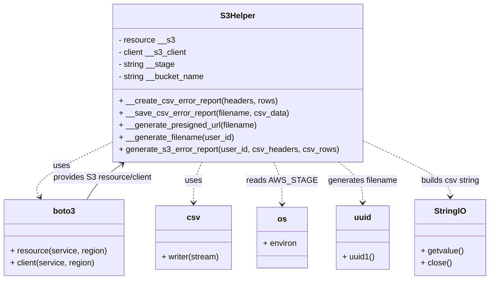
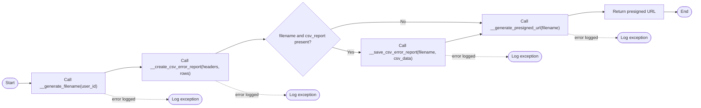

# Diagram: partview_service/partview_service/core/helpers/s3_helper.py

> Auto-generated by Obscura crawlers

## Diagram 1

### SVG

<svg id="container" width="956.921875" xmlns="http://www.w3.org/2000/svg" class="classDiagram" height="552" viewBox="0 0 956.921875 552" role="graphics-document document" aria-roledescription="class"><g><defs><marker id="container_class-aggregationStart" class="marker aggregation class" refX="18" refY="7" markerWidth="190" markerHeight="240" orient="auto"><path d="M 18,7 L9,13 L1,7 L9,1 Z"></path></marker></defs><defs><marker id="container_class-aggregationEnd" class="marker aggregation class" refX="1" refY="7" markerWidth="20" markerHeight="28" orient="auto"><path d="M 18,7 L9,13 L1,7 L9,1 Z"></path></marker></defs><defs><marker id="container_class-extensionStart" class="marker extension class" refX="18" refY="7" markerWidth="190" markerHeight="240" orient="auto"><path d="M 1,7 L18,13 V 1 Z"></path></marker></defs><defs><marker id="container_class-extensionEnd" class="marker extension class" refX="1" refY="7" markerWidth="20" markerHeight="28" orient="auto"><path d="M 1,1 V 13 L18,7 Z"></path></marker></defs><defs><marker id="container_class-compositionStart" class="marker composition class" refX="18" refY="7" markerWidth="190" markerHeight="240" orient="auto"><path d="M 18,7 L9,13 L1,7 L9,1 Z"></path></marker></defs><defs><marker id="container_class-compositionEnd" class="marker composition class" refX="1" refY="7" markerWidth="20" markerHeight="28" orient="auto"><path d="M 18,7 L9,13 L1,7 L9,1 Z"></path></marker></defs><defs><marker id="container_class-dependencyStart" class="marker dependency class" refX="6" refY="7" markerWidth="190" markerHeight="240" orient="auto"><path d="M 5,7 L9,13 L1,7 L9,1 Z"></path></marker></defs><defs><marker id="container_class-dependencyEnd" class="marker dependency class" refX="13" refY="7" markerWidth="20" markerHeight="28" orient="auto"><path d="M 18,7 L9,13 L14,7 L9,1 Z"></path></marker></defs><defs><marker id="container_class-lollipopStart" class="marker lollipop class" refX="13" refY="7" markerWidth="190" markerHeight="240" orient="auto"><circle stroke="black" fill="transparent" cx="7" cy="7" r="6"></circle></marker></defs><defs><marker id="container_class-lollipopEnd" class="marker lollipop class" refX="1" refY="7" markerWidth="190" markerHeight="240" orient="auto"><circle stroke="black" fill="transparent" cx="7" cy="7" r="6"></circle></marker></defs><g class="root"><g class="clusters"></g><g class="edgePaths"><path d="M227.313,277.53L199.009,290.775C170.706,304.02,114.099,330.51,89.012,349.066C63.926,367.623,70.359,378.245,73.576,383.557L76.793,388.868" id="id_S3Helper_boto3_1" class="edge-thickness-normal edge-pattern-dashed relation" style=";;;" data-edge="true" data-et="edge" data-id="id_S3Helper_boto3_1" data-points="W3sieCI6MjI3LjMxMjUsInkiOjI3Ny41MzAzNzk1MTkwNDIyNH0seyJ4Ijo1Ny40OTIxODc1LCJ5IjozNTd9LHsieCI6NzkuOTAwOTgzNTM3OTQ2NDMsInkiOjM5NH1d" marker-end="url(#container_class-dependencyEnd)"></path><path d="M399.129,320L396.331,326.167C393.533,332.333,387.936,344.667,385.138,358C382.34,371.333,382.34,385.667,382.34,392.833L382.34,400" id="id_S3Helper_csv_2" class="edge-thickness-normal edge-pattern-dashed relation" style=";;;" data-edge="true" data-et="edge" data-id="id_S3Helper_csv_2" data-points="W3sieCI6Mzk5LjEyOTQzMjQ4MDU2OTk2LCJ5IjozMjB9LHsieCI6MzgyLjMzOTg0Mzc1LCJ5IjozNTd9LHsieCI6MzgyLjMzOTg0Mzc1LCJ5Ijo0MDZ9XQ==" marker-end="url(#container_class-dependencyEnd)"></path><path d="M540.707,320L543.505,326.167C546.303,332.333,551.9,344.667,554.698,358.5C557.496,372.333,557.496,387.667,557.496,395.333L557.496,403" id="id_S3Helper_os_3" class="edge-thickness-normal edge-pattern-dashed relation" style=";;;" data-edge="true" data-et="edge" data-id="id_S3Helper_os_3" data-points="W3sieCI6NTQwLjcwNjUwNTAxOTQzMDEsInkiOjMyMH0seyJ4Ijo1NTcuNDk2MDkzNzUsInkiOjM1N30seyJ4Ijo1NTcuNDk2MDkzNzUsInkiOjQwOX1d" marker-end="url(#container_class-dependencyEnd)"></path><path d="M663.743,320L671.405,326.167C679.067,332.333,694.391,344.667,702.053,358C709.715,371.333,709.715,385.667,709.715,392.833L709.715,400" id="id_S3Helper_uuid_4" class="edge-thickness-normal edge-pattern-dashed relation" style=";;;" data-edge="true" data-et="edge" data-id="id_S3Helper_uuid_4" data-points="W3sieCI6NjYzLjc0MzQyMjExNzg3NTYsInkiOjMyMH0seyJ4Ijo3MDkuNzE0ODQzNzUsInkiOjM1N30seyJ4Ijo3MDkuNzE0ODQzNzUsInkiOjQwNn1d" marker-end="url(#container_class-dependencyEnd)"></path><path d="M712.523,278.199L740.424,291.332C768.326,304.466,824.128,330.733,852.029,349.033C879.93,367.333,879.93,377.667,879.93,382.833L879.93,388" id="id_S3Helper_StringIO_5" class="edge-thickness-normal edge-pattern-dashed relation" style=";;;" data-edge="true" data-et="edge" data-id="id_S3Helper_StringIO_5" data-points="W3sieCI6NzEyLjUyMzQzNzUsInkiOjI3OC4xOTg4MjI0NDIxOTM5fSx7IngiOjg3OS45Mjk2ODc1LCJ5IjozNTd9LHsieCI6ODc5LjkyOTY4NzUsInkiOjM5NH1d" marker-end="url(#container_class-dependencyEnd)"></path><path d="M170.747,394L174.482,387.833C178.217,381.667,185.687,369.333,197.444,357.572C209.202,345.811,225.247,334.621,233.27,329.027L241.293,323.432" id="id_boto3_S3Helper_6" class="edge-thickness-normal edge-pattern-solid relation" style=";;;" data-edge="true" data-et="edge" data-id="id_boto3_S3Helper_6" data-points="W3sieCI6MTcwLjc0NzQ1Mzk2MjA1MzU2LCJ5IjozOTR9LHsieCI6MTkzLjE1NjI1LCJ5IjozNTd9LHsieCI6MjQ2LjIxNDE5NjA4MTYwNjIyLCJ5IjozMjB9XQ==" marker-end="url(#container_class-dependencyEnd)"></path></g><g class="edgeLabels"><g class="edgeLabel" transform="translate(122.81278, 326.43238)"><g class="label" data-id="id_S3Helper_boto3_1" transform="translate(-16.4921875, -12)"><foreignObject width="32.984375" height="24">

uses

</foreignObject></g></g><g class="edgeLabel" transform="translate(382.33984375, 357)"><g class="label" data-id="id_S3Helper_csv_2" transform="translate(-16.4921875, -12)"><foreignObject width="32.984375" height="24">

uses

</foreignObject></g></g><g class="edgeLabel" transform="translate(557.49609375, 357)"><g class="label" data-id="id_S3Helper_os_3" transform="translate(-63.109375, -12)"><foreignObject width="126.21875" height="24">

reads AWS_STAGE

</foreignObject></g></g><g class="edgeLabel" transform="translate(709.71484375, 357)"><g class="label" data-id="id_S3Helper_uuid_4" transform="translate(-69.109375, -12)"><foreignObject width="138.21875" height="24">

generates filename

</foreignObject></g></g><g class="edgeLabel" transform="translate(879.9296875, 357)"><g class="label" data-id="id_S3Helper_StringIO_5" transform="translate(-58.90625, -12)"><foreignObject width="117.8125" height="24">

builds csv string

</foreignObject></g></g><g class="edgeLabel" transform="translate(201.94448, 350.87152)"><g class="label" data-id="id_boto3_S3Helper_6" transform="translate(-99.171875, -12)"><foreignObject width="198.34375" height="24">

provides S3 resource/client

</foreignObject></g></g></g><g class="nodes"><g class="node default" id="classId-S3Helper-0" transform="translate(469.91796875, 164)"><g class="basic label-container"><path d="M-242.60546875 -156 L242.60546875 -156 L242.60546875 156 L-242.60546875 156" stroke="none" stroke-width="0" fill="#ECECFF" style=""></path><path d="M-242.60546875 -156 C-64.28130093674781 -156, 114.04286687650438 -156, 242.60546875 -156 M-242.60546875 -156 C-134.42951036817996 -156, -26.253551986359923 -156, 242.60546875 -156 M242.60546875 -156 C242.60546875 -41.054714721930054, 242.60546875 73.89057055613989, 242.60546875 156 M242.60546875 -156 C242.60546875 -85.42234735001067, 242.60546875 -14.844694700021336, 242.60546875 156 M242.60546875 156 C93.94348435152335 156, -54.718500046953295 156, -242.60546875 156 M242.60546875 156 C97.96161731480788 156, -46.68223412038424 156, -242.60546875 156 M-242.60546875 156 C-242.60546875 54.47333985911119, -242.60546875 -47.053320281777616, -242.60546875 -156 M-242.60546875 156 C-242.60546875 79.12269803698389, -242.60546875 2.2453960739677825, -242.60546875 -156" stroke="#9370DB" stroke-width="1.3" fill="none" stroke-dasharray="0 0" style=""></path></g><g class="annotation-group text" transform="translate(0, -132)"></g><g class="label-group text" transform="translate(-33.2578125, -132)"><g class="label" style="font-weight: bolder" transform="translate(0,-12)"><foreignObject width="66.515625" height="24">

S3Helper

</foreignObject></g></g><g class="members-group text" transform="translate(-230.60546875, -84)"><g class="label" style="" transform="translate(0,-12)"><foreignObject width="109.15625" height="24">

- resource __s3

</foreignObject></g><g class="label" style="" transform="translate(0,12)"><foreignObject width="135.984375" height="24">

- client __s3_client

</foreignObject></g><g class="label" style="" transform="translate(0,36)"><foreignObject width="111.515625" height="24">

- string __stage

</foreignObject></g><g class="label" style="" transform="translate(0,60)"><foreignObject width="170.890625" height="24">

- string __bucket_name

</foreignObject></g></g><g class="methods-group text" transform="translate(-230.60546875, 36)"><g class="label" style="" transform="translate(0,-12)"><foreignObject width="310.3125" height="24">

+ __create_csv_error_report(headers, rows)

</foreignObject></g><g class="label" style="" transform="translate(0,12)"><foreignObject width="331.515625" height="24">

+ __save_csv_error_report(filename, csv_data)

</foreignObject></g><g class="label" style="" transform="translate(0,36)"><foreignObject width="273.78125" height="24">

+ __generate_presigned_url(filename)

</foreignObject></g><g class="label" style="" transform="translate(0,60)"><foreignObject width="226.203125" height="24">

+ __generate_filename(user_id)

</foreignObject></g><g class="label" style="" transform="translate(0,84)"><foreignObject width="427.953125" height="24">

+ generate_s3_error_report(user_id, csv_headers, csv_rows)

</foreignObject></g></g><g class="divider" style=""><path d="M-242.60546875 -108 C-63.58086125195376 -108, 115.44374624609247 -108, 242.60546875 -108 M-242.60546875 -108 C-124.06028555106245 -108, -5.515102352124899 -108, 242.60546875 -108" stroke="#9370DB" stroke-width="1.3" fill="none" stroke-dasharray="0 0" style=""></path></g><g class="divider" style=""><path d="M-242.60546875 12 C-123.4285039813895 12, -4.251539212778994 12, 242.60546875 12 M-242.60546875 12 C-66.83822477962045 12, 108.9290191907591 12, 242.60546875 12" stroke="#9370DB" stroke-width="1.3" fill="none" stroke-dasharray="0 0" style=""></path></g></g><g class="node default" id="classId-boto3-1" transform="translate(125.32421875, 469)"><g class="basic label-container"><path d="M-117.32421875 -75 L117.32421875 -75 L117.32421875 75 L-117.32421875 75" stroke="none" stroke-width="0" fill="#ECECFF" style=""></path><path d="M-117.32421875 -75 C-63.85949363128078 -75, -10.394768512561555 -75, 117.32421875 -75 M-117.32421875 -75 C-60.89977642476269 -75, -4.475334099525384 -75, 117.32421875 -75 M117.32421875 -75 C117.32421875 -39.38308783061571, 117.32421875 -3.766175661231415, 117.32421875 75 M117.32421875 -75 C117.32421875 -42.598192572778025, 117.32421875 -10.19638514555605, 117.32421875 75 M117.32421875 75 C38.51422170091372 75, -40.295775348172555 75, -117.32421875 75 M117.32421875 75 C31.41305485114451 75, -54.49810904771098 75, -117.32421875 75 M-117.32421875 75 C-117.32421875 21.00280856469155, -117.32421875 -32.9943828706169, -117.32421875 -75 M-117.32421875 75 C-117.32421875 25.057219931794194, -117.32421875 -24.885560136411613, -117.32421875 -75" stroke="#9370DB" stroke-width="1.3" fill="none" stroke-dasharray="0 0" style=""></path></g><g class="annotation-group text" transform="translate(0, -51)"></g><g class="label-group text" transform="translate(-21.0703125, -51)"><g class="label" style="font-weight: bolder" transform="translate(0,-12)"><foreignObject width="42.140625" height="24">

boto3

</foreignObject></g></g><g class="members-group text" transform="translate(-105.32421875, -3)"></g><g class="methods-group text" transform="translate(-105.32421875, 27)"><g class="label" style="" transform="translate(0,-12)"><foreignObject width="189.578125" height="24">

+ resource(service, region)

</foreignObject></g><g class="label" style="" transform="translate(0,12)"><foreignObject width="168.015625" height="24">

+ client(service, region)

</foreignObject></g></g><g class="divider" style=""><path d="M-117.32421875 -27 C-39.79459697511214 -27, 37.735024799775715 -27, 117.32421875 -27 M-117.32421875 -27 C-39.85518733526074 -27, 37.613844079478525 -27, 117.32421875 -27" stroke="#9370DB" stroke-width="1.3" fill="none" stroke-dasharray="0 0" style=""></path></g><g class="divider" style=""><path d="M-117.32421875 -3 C-40.119519908701875 -3, 37.08517893259625 -3, 117.32421875 -3 M-117.32421875 -3 C-70.2878739178015 -3, -23.251529085603025 -3, 117.32421875 -3" stroke="#9370DB" stroke-width="1.3" fill="none" stroke-dasharray="0 0" style=""></path></g></g><g class="node default" id="classId-csv-2" transform="translate(382.33984375, 469)"><g class="basic label-container"><path d="M-75.37890625 -63 L75.37890625 -63 L75.37890625 63 L-75.37890625 63" stroke="none" stroke-width="0" fill="#ECECFF" style=""></path><path d="M-75.37890625 -63 C-31.302621267992905 -63, 12.77366371401419 -63, 75.37890625 -63 M-75.37890625 -63 C-42.79401243469876 -63, -10.209118619397515 -63, 75.37890625 -63 M75.37890625 -63 C75.37890625 -17.74590803333522, 75.37890625 27.508183933329562, 75.37890625 63 M75.37890625 -63 C75.37890625 -18.39420527169797, 75.37890625 26.21158945660406, 75.37890625 63 M75.37890625 63 C23.131182487805937 63, -29.116541274388126 63, -75.37890625 63 M75.37890625 63 C25.824604892477588 63, -23.729696465044825 63, -75.37890625 63 M-75.37890625 63 C-75.37890625 21.224990769919465, -75.37890625 -20.55001846016107, -75.37890625 -63 M-75.37890625 63 C-75.37890625 31.559597748290003, -75.37890625 0.11919549658000506, -75.37890625 -63" stroke="#9370DB" stroke-width="1.3" fill="none" stroke-dasharray="0 0" style=""></path></g><g class="annotation-group text" transform="translate(0, -39)"></g><g class="label-group text" transform="translate(-11.6484375, -39)"><g class="label" style="font-weight: bolder" transform="translate(0,-12)"><foreignObject width="23.296875" height="24">

csv

</foreignObject></g></g><g class="members-group text" transform="translate(-63.37890625, 9)"></g><g class="methods-group text" transform="translate(-63.37890625, 39)"><g class="label" style="" transform="translate(0,-12)"><foreignObject width="115.109375" height="24">

+ writer(stream)

</foreignObject></g></g><g class="divider" style=""><path d="M-75.37890625 -15 C-28.52587954236276 -15, 18.327147165274482 -15, 75.37890625 -15 M-75.37890625 -15 C-20.59416246446777 -15, 34.19058132106446 -15, 75.37890625 -15" stroke="#9370DB" stroke-width="1.3" fill="none" stroke-dasharray="0 0" style=""></path></g><g class="divider" style=""><path d="M-75.37890625 9 C-44.27648759048647 9, -13.174068930972943 9, 75.37890625 9 M-75.37890625 9 C-19.14683471219127 9, 37.08523682561746 9, 75.37890625 9" stroke="#9370DB" stroke-width="1.3" fill="none" stroke-dasharray="0 0" style=""></path></g></g><g class="node default" id="classId-os-3" transform="translate(557.49609375, 469)"><g class="basic label-container"><path d="M-49.77734375 -60 L49.77734375 -60 L49.77734375 60 L-49.77734375 60" stroke="none" stroke-width="0" fill="#ECECFF" style=""></path><path d="M-49.77734375 -60 C-25.07017567822465 -60, -0.3630076064493011 -60, 49.77734375 -60 M-49.77734375 -60 C-21.00658818217571 -60, 7.764167385648577 -60, 49.77734375 -60 M49.77734375 -60 C49.77734375 -33.80156814099151, 49.77734375 -7.603136281983026, 49.77734375 60 M49.77734375 -60 C49.77734375 -34.66933784923552, 49.77734375 -9.338675698471043, 49.77734375 60 M49.77734375 60 C20.975405778761964 60, -7.826532192476073 60, -49.77734375 60 M49.77734375 60 C16.26370489518869 60, -17.249933959622624 60, -49.77734375 60 M-49.77734375 60 C-49.77734375 20.969053211770685, -49.77734375 -18.06189357645863, -49.77734375 -60 M-49.77734375 60 C-49.77734375 34.74825378580398, -49.77734375 9.496507571607964, -49.77734375 -60" stroke="#9370DB" stroke-width="1.3" fill="none" stroke-dasharray="0 0" style=""></path></g><g class="annotation-group text" transform="translate(0, -36)"></g><g class="label-group text" transform="translate(-8.5390625, -36)"><g class="label" style="font-weight: bolder" transform="translate(0,-12)"><foreignObject width="17.078125" height="24">

os

</foreignObject></g></g><g class="members-group text" transform="translate(-37.77734375, 12)"><g class="label" style="" transform="translate(0,-12)"><foreignObject width="67.015625" height="24">

+ environ

</foreignObject></g></g><g class="methods-group text" transform="translate(-37.77734375, 60)"></g><g class="divider" style=""><path d="M-49.77734375 -12 C-20.899979216273454 -12, 7.977385317453091 -12, 49.77734375 -12 M-49.77734375 -12 C-13.40610025336396 -12, 22.96514324327208 -12, 49.77734375 -12" stroke="#9370DB" stroke-width="1.3" fill="none" stroke-dasharray="0 0" style=""></path></g><g class="divider" style=""><path d="M-49.77734375 36 C-14.494955539375098 36, 20.787432671249803 36, 49.77734375 36 M-49.77734375 36 C-23.56115165170489 36, 2.6550404465902204 36, 49.77734375 36" stroke="#9370DB" stroke-width="1.3" fill="none" stroke-dasharray="0 0" style=""></path></g></g><g class="node default" id="classId-uuid-4" transform="translate(709.71484375, 469)"><g class="basic label-container"><path d="M-51.22265625 -63 L51.22265625 -63 L51.22265625 63 L-51.22265625 63" stroke="none" stroke-width="0" fill="#ECECFF" style=""></path><path d="M-51.22265625 -63 C-27.862845053940383 -63, -4.503033857880766 -63, 51.22265625 -63 M-51.22265625 -63 C-16.33781699160224 -63, 18.547022266795523 -63, 51.22265625 -63 M51.22265625 -63 C51.22265625 -30.407589967487695, 51.22265625 2.18482006502461, 51.22265625 63 M51.22265625 -63 C51.22265625 -12.884379246184714, 51.22265625 37.23124150763057, 51.22265625 63 M51.22265625 63 C21.51889687857731 63, -8.184862492845383 63, -51.22265625 63 M51.22265625 63 C12.116200387709533 63, -26.990255474580934 63, -51.22265625 63 M-51.22265625 63 C-51.22265625 25.688019240561317, -51.22265625 -11.623961518877366, -51.22265625 -63 M-51.22265625 63 C-51.22265625 35.256482725659374, -51.22265625 7.512965451318749, -51.22265625 -63" stroke="#9370DB" stroke-width="1.3" fill="none" stroke-dasharray="0 0" style=""></path></g><g class="annotation-group text" transform="translate(0, -39)"></g><g class="label-group text" transform="translate(-16.2109375, -39)"><g class="label" style="font-weight: bolder" transform="translate(0,-12)"><foreignObject width="32.421875" height="24">

uuid

</foreignObject></g></g><g class="members-group text" transform="translate(-39.22265625, 9)"></g><g class="methods-group text" transform="translate(-39.22265625, 39)"><g class="label" style="" transform="translate(0,-12)"><foreignObject width="62.234375" height="24">

+ uuid1()

</foreignObject></g></g><g class="divider" style=""><path d="M-51.22265625 -15 C-26.934657902423815 -15, -2.6466595548476306 -15, 51.22265625 -15 M-51.22265625 -15 C-10.257066908707756 -15, 30.708522432584488 -15, 51.22265625 -15" stroke="#9370DB" stroke-width="1.3" fill="none" stroke-dasharray="0 0" style=""></path></g><g class="divider" style=""><path d="M-51.22265625 9 C-10.544044381164824 9, 30.134567487670353 9, 51.22265625 9 M-51.22265625 9 C-25.07821405994619 9, 1.0662281301076177 9, 51.22265625 9" stroke="#9370DB" stroke-width="1.3" fill="none" stroke-dasharray="0 0" style=""></path></g></g><g class="node default" id="classId-StringIO-5" transform="translate(879.9296875, 469)"><g class="basic label-container"><path d="M-68.9921875 -75 L68.9921875 -75 L68.9921875 75 L-68.9921875 75" stroke="none" stroke-width="0" fill="#ECECFF" style=""></path><path d="M-68.9921875 -75 C-21.734463155240782 -75, 25.523261189518436 -75, 68.9921875 -75 M-68.9921875 -75 C-15.196691681341079 -75, 38.59880413731784 -75, 68.9921875 -75 M68.9921875 -75 C68.9921875 -15.717348609674936, 68.9921875 43.56530278065013, 68.9921875 75 M68.9921875 -75 C68.9921875 -35.16775423703005, 68.9921875 4.664491525939894, 68.9921875 75 M68.9921875 75 C37.496151736096664 75, 6.000115972193328 75, -68.9921875 75 M68.9921875 75 C18.94900750736342 75, -31.094172485273162 75, -68.9921875 75 M-68.9921875 75 C-68.9921875 28.013069502602832, -68.9921875 -18.973860994794336, -68.9921875 -75 M-68.9921875 75 C-68.9921875 21.73089840667319, -68.9921875 -31.538203186653618, -68.9921875 -75" stroke="#9370DB" stroke-width="1.3" fill="none" stroke-dasharray="0 0" style=""></path></g><g class="annotation-group text" transform="translate(0, -51)"></g><g class="label-group text" transform="translate(-30.03125, -51)"><g class="label" style="font-weight: bolder" transform="translate(0,-12)"><foreignObject width="60.0625" height="24">

StringIO

</foreignObject></g></g><g class="members-group text" transform="translate(-56.9921875, -3)"></g><g class="methods-group text" transform="translate(-56.9921875, 27)"><g class="label" style="" transform="translate(0,-12)"><foreignObject width="83.953125" height="24">

+ getvalue()

</foreignObject></g><g class="label" style="" transform="translate(0,12)"><foreignObject width="60.390625" height="24">

+ close()

</foreignObject></g></g><g class="divider" style=""><path d="M-68.9921875 -27 C-35.64262830760612 -27, -2.2930691152122336 -27, 68.9921875 -27 M-68.9921875 -27 C-23.167012777994998 -27, 22.658161944010004 -27, 68.9921875 -27" stroke="#9370DB" stroke-width="1.3" fill="none" stroke-dasharray="0 0" style=""></path></g><g class="divider" style=""><path d="M-68.9921875 -3 C-20.195531165425564 -3, 28.601125169148872 -3, 68.9921875 -3 M-68.9921875 -3 C-16.039125194180087 -3, 36.913937111639825 -3, 68.9921875 -3" stroke="#9370DB" stroke-width="1.3" fill="none" stroke-dasharray="0 0" style=""></path></g></g></g></g></g></svg>

## Diagram 2

### SVG

<svg id="container" width="2578.9287109375" xmlns="http://www.w3.org/2000/svg" class="flowchart" height="399.25" viewBox="0.0000019073486328125 0 2578.9287109375 399.25" role="graphics-document document" aria-roledescription="flowchart-v2"><g><marker id="container_flowchart-v2-pointEnd" class="marker flowchart-v2" viewBox="0 0 10 10" refX="5" refY="5" markerUnits="userSpaceOnUse" markerWidth="8" markerHeight="8" orient="auto"><path d="M 0 0 L 10 5 L 0 10 z" class="arrowMarkerPath" style="stroke-width: 1; stroke-dasharray: 1, 0;"></path></marker><marker id="container_flowchart-v2-pointStart" class="marker flowchart-v2" viewBox="0 0 10 10" refX="4.5" refY="5" markerUnits="userSpaceOnUse" markerWidth="8" markerHeight="8" orient="auto"><path d="M 0 5 L 10 10 L 10 0 z" class="arrowMarkerPath" style="stroke-width: 1; stroke-dasharray: 1, 0;"></path></marker><marker id="container_flowchart-v2-circleEnd" class="marker flowchart-v2" viewBox="0 0 10 10" refX="11" refY="5" markerUnits="userSpaceOnUse" markerWidth="11" markerHeight="11" orient="auto"><circle cx="5" cy="5" r="5" class="arrowMarkerPath" style="stroke-width: 1; stroke-dasharray: 1, 0;"></circle></marker><marker id="container_flowchart-v2-circleStart" class="marker flowchart-v2" viewBox="0 0 10 10" refX="-1" refY="5" markerUnits="userSpaceOnUse" markerWidth="11" markerHeight="11" orient="auto"><circle cx="5" cy="5" r="5" class="arrowMarkerPath" style="stroke-width: 1; stroke-dasharray: 1, 0;"></circle></marker><marker id="container_flowchart-v2-crossEnd" class="marker cross flowchart-v2" viewBox="0 0 11 11" refX="12" refY="5.2" markerUnits="userSpaceOnUse" markerWidth="11" markerHeight="11" orient="auto"><path d="M 1,1 l 9,9 M 10,1 l -9,9" class="arrowMarkerPath" style="stroke-width: 2; stroke-dasharray: 1, 0;"></path></marker><marker id="container_flowchart-v2-crossStart" class="marker cross flowchart-v2" viewBox="0 0 11 11" refX="-1" refY="5.2" markerUnits="userSpaceOnUse" markerWidth="11" markerHeight="11" orient="auto"><path d="M 1,1 l 9,9 M 10,1 l -9,9" class="arrowMarkerPath" style="stroke-width: 2; stroke-dasharray: 1, 0;"></path></marker><g class="root"><g class="clusters"></g><g class="edgePaths"><path d="M68.277,312L72.36,311.917C76.444,311.833,84.61,311.667,92.194,311.583C99.777,311.5,106.777,311.5,110.277,311.5L113.777,311.5" id="L_Start_GenFilename_0" class="edge-thickness-normal edge-pattern-solid edge-thickness-normal edge-pattern-solid flowchart-link" style=";" data-edge="true" data-et="edge" data-id="L_Start_GenFilename_0" data-points="W3sieCI6NjguMjc2ODM3NDMxODI3MjksInkiOjMxMi4wMDAwMDAwMDAwMDAwNn0seyJ4Ijo5Mi43NzY4MzYzOTUyNjM2NywieSI6MzExLjV9LHsieCI6MTE3Ljc3NjgzNjM5NTI2MzY3LCJ5IjozMTEuNX1d" marker-end="url(#container_flowchart-v2-pointEnd)"></path><path d="M388.414,272.5L400.551,268.958C412.689,265.417,436.963,258.333,460.016,254.792C483.069,251.25,504.899,251.25,515.815,251.25L526.73,251.25" id="L_GenFilename_CreateCSV_0" class="edge-thickness-normal edge-pattern-solid edge-thickness-normal edge-pattern-solid flowchart-link" style=";" data-edge="true" data-et="edge" data-id="L_GenFilename_CreateCSV_0" data-points="W3sieCI6Mzg4LjQxNDA5MDAyNTk2OTEsInkiOjI3Mi41fSx7IngiOjQ2MS4yMzc3NzM4OTUyNjM3LCJ5IjoyNTEuMjV9LHsieCI6NTMwLjcyOTk2MTM5NTI2MzcsInkiOjI1MS4yNX1d" marker-end="url(#container_flowchart-v2-pointEnd)"></path><path d="M802.185,200.25L821.676,191.375C841.166,182.5,880.147,164.75,910.553,155.875C940.959,147,962.79,147,973.705,147L984.621,147" id="L_CreateCSV_Check_0" class="edge-thickness-normal edge-pattern-solid edge-thickness-normal edge-pattern-solid flowchart-link" style=";" data-edge="true" data-et="edge" data-id="L_CreateCSV_Check_0" data-points="W3sieCI6ODAyLjE4NTEwOTc3NjU1ODYsInkiOjIwMC4yNX0seyJ4Ijo5MTkuMTI4Mzk4ODk1MjYzNywieSI6MTQ3fSx7IngiOjk4OC42MjA1ODYzOTUyNjM3LCJ5IjoxNDd9XQ==" marker-end="url(#container_flowchart-v2-pointEnd)"></path><path d="M1236.354,177.267L1247.57,180.389C1258.786,183.511,1281.219,189.756,1297.941,192.878C1314.662,196,1325.673,196,1331.178,196L1336.683,196" id="L_Check_SaveS3_0" class="edge-thickness-normal edge-pattern-solid edge-thickness-normal edge-pattern-solid flowchart-link" style=";" data-edge="true" data-et="edge" data-id="L_Check_SaveS3_0" data-points="W3sieCI6MTIzNi4zNTM2NzkwMjEyODgsInkiOjE3Ny4yNjY5MDczNzM5NzU4NH0seyJ4IjoxMzAzLjY1MTgzNjM5NTI2MzcsInkiOjE5Nn0seyJ4IjoxMzQwLjY4MzA4NjM5NTI2MzcsInkiOjE5Nn1d" marker-end="url(#container_flowchart-v2-pointEnd)"></path><path d="M1651.902,158.498L1663.484,155.706C1675.066,152.915,1698.23,147.333,1720.742,142.215C1743.254,137.098,1765.114,132.447,1776.044,130.121L1786.974,127.795" id="L_SaveS3_Presign_0" class="edge-thickness-normal edge-pattern-solid edge-thickness-normal edge-pattern-solid flowchart-link" style=";" data-edge="true" data-et="edge" data-id="L_SaveS3_Presign_0" data-points="W3sieCI6MTY1MS45MDE4MzYzOTUyNjM3LCJ5IjoxNTguNDk3Nzc4NzgwNDExNjR9LHsieCI6MTcyMS4zOTQwMjM4OTUyNjM3LCJ5IjoxNDEuNzV9LHsieCI6MTc5MC44ODYyMTEzOTUyNjM3LCJ5IjoxMjYuOTYyMjIwOTQwNDg5OTF9XQ==" marker-end="url(#container_flowchart-v2-pointEnd)"></path><path d="M1229.453,109.832L1241.819,105.318C1254.186,100.805,1278.919,91.777,1323.392,87.264C1367.865,82.75,1432.079,82.75,1501.703,82.75C1571.326,82.75,1646.36,82.75,1694.793,83.224C1743.226,83.698,1765.058,84.646,1775.974,85.12L1786.89,85.594" id="L_Check_Presign_0" class="edge-thickness-normal edge-pattern-solid edge-thickness-normal edge-pattern-solid flowchart-link" style=";" data-edge="true" data-et="edge" data-id="L_Check_Presign_0" data-points="W3sieCI6MTIyOS40NTI2ODQxOTczMTg2LCJ5IjoxMDkuODMyMDk3ODAyMDU0ODl9LHsieCI6MTMwMy42NTE4MzYzOTUyNjM3LCJ5Ijo4Mi43NX0seyJ4IjoxNDk2LjI5MjQ2MTM5NTI2MzcsInkiOjgyLjc1fSx7IngiOjE3MjEuMzk0MDIzODk1MjYzNywieSI6ODIuNzV9LHsieCI6MTc5MC44ODYyMTEzOTUyNjM3LCJ5Ijo4NS43Njc5MTQwOTM3Nzc1Nn1d" marker-end="url(#container_flowchart-v2-pointEnd)"></path><path d="M2112.433,59.061L2124.015,56.635C2135.597,54.208,2158.761,49.354,2181.259,46.927C2203.756,44.5,2225.587,44.5,2236.502,44.5L2247.417,44.5" id="L_Presign_Return_0" class="edge-thickness-normal edge-pattern-solid edge-thickness-normal edge-pattern-solid flowchart-link" style=";" data-edge="true" data-et="edge" data-id="L_Presign_Return_0" data-points="W3sieCI6MjExMi40MzMwODYzOTUyNjM3LCJ5Ijo1OS4wNjE0MzU1MDI0NzY3Nn0seyJ4IjoyMTgxLjkyNTI3Mzg5NTI2MzcsInkiOjQ0LjV9LHsieCI6MjI1MS40MTc0NjEzOTUyNjM3LCJ5Ijo0NC41fV0=" marker-end="url(#container_flowchart-v2-pointEnd)"></path><path d="M2468.839,44.5L2473.006,44.5C2477.173,44.5,2485.506,44.5,2493.256,44.57C2501.006,44.641,2508.173,44.781,2511.757,44.851L2515.34,44.922" id="L_Return_End_0" class="edge-thickness-normal edge-pattern-solid edge-thickness-normal edge-pattern-solid flowchart-link" style=";" data-edge="true" data-et="edge" data-id="L_Return_End_0" data-points="W3sieCI6MjQ2OC44MzkzMzYzOTUyNjM3LCJ5Ijo0NC41fSx7IngiOjI0OTMuODM5MzM2Mzk1MjYzNywieSI6NDQuNX0seyJ4IjoyNTE5LjMzOTMzNjM5NTI2OCwieSI6NDV9XQ==" marker-end="url(#container_flowchart-v2-pointEnd)"></path><path d="M388.414,350.5L400.551,354.042C412.689,357.583,436.963,364.667,476.261,368.29C515.559,371.913,569.88,372.075,597.04,372.157L624.201,372.238" id="L_GenFilename_LogError1_0" class="edge-thickness-normal edge-pattern-dotted edge-thickness-normal edge-pattern-solid flowchart-link" style=";" data-edge="true" data-et="edge" data-id="L_GenFilename_LogError1_0" data-points="W3sieCI6Mzg4LjQxNDA5MDAyNTk2OTEsInkiOjM1MC41fSx7IngiOjQ2MS4yMzc3NzM4OTUyNjM3LCJ5IjozNzEuNzV9LHsieCI6NjI4LjIwMDkxNjI5MDMwMDUsInkiOjM3Mi4yNX1d" marker-end="url(#container_flowchart-v2-pointEnd)"></path><path d="M802.185,302.25L821.676,311.125C841.166,320,880.147,337.75,923.39,346.706C966.632,355.662,1014.135,355.824,1037.887,355.905L1061.638,355.986" id="L_CreateCSV_LogError2_0" class="edge-thickness-normal edge-pattern-dotted edge-thickness-normal edge-pattern-solid flowchart-link" style=";" data-edge="true" data-et="edge" data-id="L_CreateCSV_LogError2_0" data-points="W3sieCI6ODAyLjE4NTEwOTc3NjU1ODYsInkiOjMwMi4yNX0seyJ4Ijo5MTkuMTI4Mzk4ODk1MjYzNywieSI6MzU1LjV9LHsieCI6MTA2NS42Mzg0MTYyOTAyODI3LCJ5IjozNTUuOTk5OTk5OTk5OTk5OTR9XQ==" marker-end="url(#container_flowchart-v2-pointEnd)"></path><path d="M1651.902,207.061L1663.484,207.884C1675.066,208.707,1698.23,210.354,1737.193,211.258C1776.155,212.163,1830.916,212.325,1858.297,212.407L1885.677,212.488" id="L_SaveS3_LogError3_0" class="edge-thickness-normal edge-pattern-dotted edge-thickness-normal edge-pattern-solid flowchart-link" style=";" data-edge="true" data-et="edge" data-id="L_SaveS3_LogError3_0" data-points="W3sieCI6MTY1MS45MDE4MzYzOTUyNjM3LCJ5IjoyMDcuMDYwNTYyOTQwMzM5NDJ9LHsieCI6MTcyMS4zOTQwMjM4OTUyNjM3LCJ5IjoyMTJ9LHsieCI6MTg4OS42Nzc0Nzg3OTAyODUyLCJ5IjoyMTIuNTAwMDAwMDAwMDAwMDN9XQ==" marker-end="url(#container_flowchart-v2-pointEnd)"></path><path d="M2112.433,126.439L2124.015,128.865C2135.597,131.292,2158.761,136.146,2189.047,138.654C2219.332,141.161,2256.739,141.322,2275.443,141.402L2294.146,141.483" id="L_Presign_LogError4_0" class="edge-thickness-normal edge-pattern-dotted edge-thickness-normal edge-pattern-solid flowchart-link" style=";" data-edge="true" data-et="edge" data-id="L_Presign_LogError4_0" data-points="W3sieCI6MjExMi40MzMwODYzOTUyNjM3LCJ5IjoxMjYuNDM4NTY0NDk3NTIzMjN9LHsieCI6MjE4MS45MjUyNzM4OTUyNjM3LCJ5IjoxNDF9LHsieCI6MjI5OC4xNDYyMjg3OTAzMTEsInkiOjE0MS41fV0=" marker-end="url(#container_flowchart-v2-pointEnd)"></path></g><g class="edgeLabels"><g class="edgeLabel"><g class="label" data-id="L_Start_GenFilename_0" transform="translate(0, 0)"><foreignObject width="0" height="0">

</foreignObject></g></g><g class="edgeLabel"><g class="label" data-id="L_GenFilename_CreateCSV_0" transform="translate(0, 0)"><foreignObject width="0" height="0">

</foreignObject></g></g><g class="edgeLabel"><g class="label" data-id="L_CreateCSV_Check_0" transform="translate(0, 0)"><foreignObject width="0" height="0">

</foreignObject></g></g><g class="edgeLabel" transform="translate(1303.6518363952637, 196)"><g class="label" data-id="L_Check_SaveS3_0" transform="translate(-12.03125, -12)"><foreignObject width="24.0625" height="24">

Yes

</foreignObject></g></g><g class="edgeLabel"><g class="label" data-id="L_SaveS3_Presign_0" transform="translate(0, 0)"><foreignObject width="0" height="0">

</foreignObject></g></g><g class="edgeLabel" transform="translate(1496.2924613952637, 82.75)"><g class="label" data-id="L_Check_Presign_0" transform="translate(-10.140625, -12)"><foreignObject width="20.28125" height="24">

No

</foreignObject></g></g><g class="edgeLabel"><g class="label" data-id="L_Presign_Return_0" transform="translate(0, 0)"><foreignObject width="0" height="0">

</foreignObject></g></g><g class="edgeLabel"><g class="label" data-id="L_Return_End_0" transform="translate(0, 0)"><foreignObject width="0" height="0">

</foreignObject></g></g><g class="edgeLabel" transform="translate(461.2377738952637, 371.75)"><g class="label" data-id="L_GenFilename_LogError1_0" transform="translate(-44.4921875, -12)"><foreignObject width="88.984375" height="24">

error logged

</foreignObject></g></g><g class="edgeLabel" transform="translate(919.1283988952637, 355.5)"><g class="label" data-id="L_CreateCSV_LogError2_0" transform="translate(-44.4921875, -12)"><foreignObject width="88.984375" height="24">

error logged

</foreignObject></g></g><g class="edgeLabel" transform="translate(1721.3940238952637, 212)"><g class="label" data-id="L_SaveS3_LogError3_0" transform="translate(-44.4921875, -12)"><foreignObject width="88.984375" height="24">

error logged

</foreignObject></g></g><g class="edgeLabel" transform="translate(2181.9252738952637, 141)"><g class="label" data-id="L_Presign_LogError4_0" transform="translate(-44.4921875, -12)"><foreignObject width="88.984375" height="24">

error logged

</foreignObject></g></g></g><g class="nodes"><g class="node default" id="flowchart-Start-0" transform="translate(37.888418197631836, 311.5)"><g class="basic label-container outer-path"><path d="M-10.3984375 -19.5 C-4.114224041403697 -19.5, 2.169989417192607 -19.5, 10.3984375 -19.5 C10.3984375 -19.5, 10.398437499999998 -19.5, 10.398437499999998 -19.5 C10.654666686142109 -19.491783228720276, 10.91089587228422 -19.483566457440556, 11.6478067896239 -19.45993515863156 C12.098026303313945 -19.416503023614066, 12.548245817003993 -19.37307088859657, 12.892042152847864 -19.3399052695533 C13.231559775210838 -19.28501469336814, 13.571077397573811 -19.230124117182978, 14.126030759676757 -19.140403561325776 C14.44599981050742 -19.067372713466867, 14.76596886133808 -18.994341865607957, 15.34470188623539 -18.862249829261074 C15.660733239328076 -18.76845338254559, 15.976764592420762 -18.674656935830104, 16.543047751460602 -18.50658706670804 C16.865051893141384 -18.388086565995856, 17.187056034822163 -18.269586065283672, 17.716144095147794 -18.074876768247425 C18.162000966465342 -17.877509157189316, 18.607857837782895 -17.68014154613121, 18.85917041279238 -17.568892924097174 C19.300146803884093 -17.338835823323485, 19.74112319497581 -17.1087787225498, 19.967429764076783 -16.990714730406097 C20.230498148113824 -16.83124113004142, 20.49356653215086 -16.671767529676742, 21.036368073605697 -16.342718045390892 C21.428547507136393 -16.069150649733935, 21.82072694066709 -15.795583254076975, 22.061592844578712 -15.627565626425154 C22.288990353001132 -15.446222164760112, 22.51638786142355 -15.26487870309507, 23.03889120850187 -14.848196188198123 C23.25415784664066 -14.65269672308361, 23.46942448477945 -14.457197257969096, 23.964247236767985 -14.007812326905688 C24.291095324677737 -13.670314841411793, 24.61794341258749 -13.332817355917898, 24.833858442968648 -13.10986736009568 C25.023037335269436 -12.887647068615255, 25.212216227570227 -12.665426777134831, 25.644151408126582 -12.158051136245305 C25.94148529915322 -11.759650809944327, 26.238819190179857 -11.36125048364335, 26.391796464640635 -11.156274872382312 C26.611741903151586 -10.818379615209567, 26.831687341662533 -10.480484358036824, 27.073721378604247 -10.108655082055241 C27.20504253251743 -9.875481075573592, 27.33636368643062 -9.642307069091943, 27.6871239742735 -9.019496659696287 C27.795849490705802 -8.793725798471234, 27.904575007138106 -8.56795493724618, 28.22948364880834 -7.893275190886684 C28.400217681838633 -7.471558828383893, 28.570951714868926 -7.049842465881101, 28.698571729970325 -6.734618561215508 C28.811769658183547 -6.393684437077854, 28.92496758639677 -6.0527503129402, 29.09246063421488 -5.548287939305138 C29.183512511531134 -5.201067668965004, 29.27456438884739 -4.853847398624871, 29.40953178754556 -4.339158212148133 C29.4818496177194 -3.9678214385842825, 29.554167447893242 -3.596484665020432, 29.648482276581777 -3.1121979531509023 C29.701234109612017 -2.7030651531960452, 29.753985942642256 -2.293932353241188, 29.808330202509367 -1.872449005199798 C29.835151024581627 -1.4546930520464068, 29.86197184665389 -1.0369370988930156, 29.888418715913414 -0.6250057626472757 C29.888418715913414 -0.21084674762694539, 29.888418715913414 0.20331226739338493, 29.888418715913414 0.625005762647271 C29.860028515759197 1.067206046206288, 29.831638315604984 1.509406329765305, 29.808330202509367 1.8724490051997846 C29.762320312402906 2.229292627185031, 29.716310422296445 2.5861362491702775, 29.648482276581777 3.1121979531508885 C29.59504578756994 3.3865830304207245, 29.541609298558104 3.660968107690561, 29.40953178754556 4.339158212148129 C29.336031521303966 4.6194465825442315, 29.262531255062367 4.899734952940335, 29.092460634214884 5.548287939305125 C28.938144342908206 6.013064021758796, 28.783828051601528 6.477840104212467, 28.69857172997033 6.734618561215495 C28.545649311488006 7.112339891420663, 28.392726893005683 7.490061221625831, 28.229483648808344 7.893275190886679 C28.028588704142255 8.310437841949026, 27.82769375947617 8.727600493011375, 27.687123974273504 9.019496659696284 C27.556091363872934 9.252158327953088, 27.42505875347236 9.484819996209891, 27.07372137860425 10.108655082055236 C26.93566519441079 10.320746454252594, 26.79760901021733 10.532837826449953, 26.39179646464064 11.156274872382301 C26.108827848614638 11.535427038885905, 25.825859232588634 11.914579205389506, 25.644151408126582 12.158051136245302 C25.376811328434982 12.47208400593253, 25.109471248743382 12.786116875619756, 24.83385844296866 13.10986736009567 C24.53223857013138 13.42131464225226, 24.2306186972941 13.732761924408848, 23.96424723676799 14.007812326905684 C23.679492254826965 14.266419267300563, 23.39473727288594 14.52502620769544, 23.038891208501887 14.848196188198111 C22.73818802071641 15.087998978409138, 22.43748483293093 15.327801768620164, 22.061592844578715 15.627565626425152 C21.73098974070252 15.858180040111481, 21.400386636826326 16.08879445379781, 21.036368073605708 16.34271804539089 C20.738320119382493 16.5233964667652, 20.440272165159275 16.704074888139505, 19.967429764076787 16.990714730406093 C19.52742020046823 17.2202674379011, 19.08741063685968 17.449820145396107, 18.859170412792388 17.56889292409717 C18.41125021865381 17.76717390696185, 17.963330024515226 17.965454889826532, 17.716144095147804 18.07487676824742 C17.273234987305703 18.237871414140226, 16.8303258794636 18.40086606003303, 16.543047751460616 18.506587066708033 C16.183805694755115 18.61320822343819, 15.824563638049616 18.71982938016835, 15.344701886235413 18.86224982926107 C14.865293588972532 18.971671644679816, 14.385885291709654 19.08109346009856, 14.126030759676766 19.140403561325773 C13.874934509630611 19.180998855752733, 13.623838259584456 19.221594150179694, 12.892042152847878 19.3399052695533 C12.55893717821279 19.372039505839002, 12.225832203577703 19.404173742124705, 11.6478067896239 19.45993515863156 C11.256324790755874 19.472489224361773, 10.86484279188785 19.485043290091983, 10.398437500000004 19.5 C10.398437500000002 19.5, 10.3984375 19.5, 10.3984375 19.5 C4.558386708556002 19.5, -1.2816640828879962 19.5, -10.398437499999996 19.5 C-10.818428101311103 19.486531718878066, -11.23841870262221 19.47306343775613, -11.647806789623893 19.45993515863156 C-11.93608858294952 19.432124960739017, -12.224370376275145 19.404314762846475, -12.892042152847871 19.3399052695533 C-13.288979552422123 19.27573150908564, -13.685916951996374 19.211557748617984, -14.126030759676759 19.140403561325773 C-14.540142541015818 19.045885249567053, -14.954254322354878 18.95136693780833, -15.344701886235388 18.862249829261074 C-15.687724151330706 18.760442621541397, -16.030746416426023 18.65863541382172, -16.54304775146059 18.506587066708043 C-16.973419070850625 18.348206442863646, -17.40379039024066 18.189825819019248, -17.716144095147797 18.074876768247425 C-18.07684719231804 17.915204207007367, -18.437550289488286 17.75553164576731, -18.85917041279238 17.568892924097174 C-19.183710661476823 17.399580484236452, -19.508250910161262 17.23026804437573, -19.96742976407678 16.990714730406097 C-20.27011069779941 16.80722776963283, -20.572791631522044 16.62374080885957, -21.036368073605686 16.3427180453909 C-21.242150662245617 16.19917301974037, -21.447933250885544 16.055627994089846, -22.061592844578712 15.627565626425156 C-22.388993680047818 15.366472172640679, -22.71639451551692 15.1053787188562, -23.03889120850187 14.848196188198125 C-23.385727912965073 14.53320827000097, -23.73256461742828 14.218220351803811, -23.964247236767974 14.007812326905697 C-24.218807015353907 13.744958455769218, -24.47336679393984 13.48210458463274, -24.833858442968655 13.109867360095677 C-25.03366339719873 12.875165091633058, -25.233468351428805 12.64046282317044, -25.64415140812658 12.158051136245307 C-25.93318776893524 11.770768744515864, -26.222224129743903 11.383486352786422, -26.391796464640635 11.156274872382316 C-26.61574948086232 10.812222899660584, -26.839702497084005 10.468170926938853, -27.073721378604244 10.108655082055249 C-27.318383140286798 9.674233349498026, -27.563044901969356 9.239811616940804, -27.6871239742735 9.019496659696289 C-27.863332829681436 8.653595201176191, -28.03954168508937 8.287693742656092, -28.22948364880834 7.893275190886686 C-28.405008135273476 7.459726315782717, -28.580532621738612 7.026177440678749, -28.698571729970325 6.73461856121551 C-28.80683279656726 6.40855347768403, -28.9150938631642 6.0824883941525485, -29.09246063421488 5.5482879393051325 C-29.193533884508074 5.162851830513414, -29.294607134801264 4.777415721721696, -29.409531787545557 4.339158212148136 C-29.46759539216008 4.041013874199732, -29.52565899677461 3.742869536251327, -29.648482276581777 3.112197953150904 C-29.702656851296116 2.692030649646306, -29.75683142601045 2.2718633461417084, -29.808330202509364 1.872449005199809 C-29.831843364789112 1.5062125232097543, -29.85535652706886 1.1399760412196998, -29.888418715913414 0.6250057626472781 C-29.888418715913414 0.2303516380367604, -29.888418715913414 -0.16430248657375734, -29.888418715913414 -0.6250057626472687 C-29.857285042805213 -1.109937851956122, -29.826151369697012 -1.5948699412649754, -29.808330202509367 -1.8724490051997822 C-29.754588580746223 -2.28925841111115, -29.70084695898308 -2.706067817022518, -29.648482276581777 -3.112197953150895 C-29.577446204188462 -3.47695317141136, -29.506410131795143 -3.841708389671825, -29.40953178754556 -4.339158212148126 C-29.304863855217317 -4.738302401484541, -29.200195922889076 -5.1374465908209554, -29.092460634214884 -5.548287939305123 C-28.98566868149844 -5.869928285900071, -28.878876728781993 -6.191568632495019, -28.698571729970332 -6.734618561215485 C-28.551469071892406 -7.0979649707043775, -28.404366413814483 -7.46131138019327, -28.229483648808344 -7.893275190886676 C-28.083464658980468 -8.196486747570141, -27.93744566915259 -8.499698304253606, -27.687123974273504 -9.019496659696282 C-27.452382304620315 -9.436304264337119, -27.21764063496713 -9.853111868977956, -27.073721378604247 -10.108655082055243 C-26.927874573538205 -10.332714939987511, -26.78202776847216 -10.556774797919779, -26.39179646464064 -11.156274872382308 C-26.23110150115439 -11.371591483841543, -26.07040653766814 -11.586908095300778, -25.644151408126586 -12.158051136245302 C-25.406944779115634 -12.436687540121122, -25.16973815010468 -12.715323943996943, -24.833858442968662 -13.10986736009567 C-24.561501094192476 -13.391098683661271, -24.289143745416293 -13.672330007226874, -23.964247236767996 -14.007812326905677 C-23.638966776925493 -14.30322343408529, -23.31368631708299 -14.5986345412649, -23.038891208501887 -14.848196188198107 C-22.679638300327184 -15.134690822346046, -22.320385392152485 -15.421185456493987, -22.06159284457872 -15.627565626425149 C-21.834215708487214 -15.786174073565004, -21.606838572395706 -15.944782520704859, -21.03636807360571 -16.342718045390885 C-20.617873591629753 -16.59641185971127, -20.19937910965379 -16.850105674031656, -19.96742976407679 -16.99071473040609 C-19.56700907012109 -17.199613949961083, -19.166588376165393 -17.408513169516077, -18.859170412792388 -17.56889292409717 C-18.522835808132175 -17.717778276568684, -18.186501203471966 -17.866663629040193, -17.716144095147804 -18.07487676824742 C-17.40075848861754 -18.190941586843145, -17.085372882087277 -18.30700640543887, -16.54304775146062 -18.506587066708033 C-16.265242653854393 -18.589038161448848, -15.98743755624817 -18.67148925618966, -15.344701886235413 -18.862249829261067 C-14.95582975689004 -18.951007355156353, -14.566957627544667 -19.039764881051635, -14.126030759676768 -19.140403561325773 C-13.767097347867653 -19.19843313177689, -13.408163936058536 -19.256462702228006, -12.89204215284788 -19.3399052695533 C-12.571155732489547 -19.370860796602884, -12.250269312131215 -19.40181632365247, -11.647806789623903 -19.45993515863156 C-11.379799987457892 -19.46852961513343, -11.111793185291878 -19.4771240716353, -10.398437500000005 -19.5 C-10.398437500000004 -19.5, -10.398437500000002 -19.5, -10.3984375 -19.5" stroke="none" stroke-width="0" fill="#ECECFF" style=""></path><path d="M-10.3984375 -19.5 C-2.9851267691808454 -19.5, 4.428183961638309 -19.5, 10.3984375 -19.5 M-10.3984375 -19.5 C-3.859645849844198 -19.5, 2.6791458003116038 -19.5, 10.3984375 -19.5 M10.3984375 -19.5 C10.3984375 -19.5, 10.3984375 -19.5, 10.398437499999998 -19.5 M10.3984375 -19.5 C10.3984375 -19.5, 10.398437499999998 -19.5, 10.398437499999998 -19.5 M10.398437499999998 -19.5 C10.851735513823693 -19.485463614987733, 11.305033527647387 -19.470927229975466, 11.6478067896239 -19.45993515863156 M10.398437499999998 -19.5 C10.705160222185173 -19.49016399929908, 11.011882944370345 -19.480327998598167, 11.6478067896239 -19.45993515863156 M11.6478067896239 -19.45993515863156 C12.057183672844388 -19.420443063055014, 12.466560556064877 -19.380950967478466, 12.892042152847864 -19.3399052695533 M11.6478067896239 -19.45993515863156 C12.014955138116353 -19.424516799012984, 12.382103486608806 -19.389098439394406, 12.892042152847864 -19.3399052695533 M12.892042152847864 -19.3399052695533 C13.28482457788469 -19.276403253146544, 13.677607002921517 -19.212901236739793, 14.126030759676757 -19.140403561325776 M12.892042152847864 -19.3399052695533 C13.250690761948274 -19.281921743795447, 13.609339371048684 -19.2239382180376, 14.126030759676757 -19.140403561325776 M14.126030759676757 -19.140403561325776 C14.415618375752429 -19.074307077692303, 14.7052059918281 -19.00821059405883, 15.34470188623539 -18.862249829261074 M14.126030759676757 -19.140403561325776 C14.474489224648023 -19.060870190600074, 14.822947689619289 -18.981336819874375, 15.34470188623539 -18.862249829261074 M15.34470188623539 -18.862249829261074 C15.774603092078666 -18.734657407964267, 16.20450429792194 -18.607064986667464, 16.543047751460602 -18.50658706670804 M15.34470188623539 -18.862249829261074 C15.759685680523955 -18.739084817410617, 16.174669474812518 -18.615919805560157, 16.543047751460602 -18.50658706670804 M16.543047751460602 -18.50658706670804 C16.934399536614464 -18.362565992155172, 17.325751321768323 -18.21854491760231, 17.716144095147794 -18.074876768247425 M16.543047751460602 -18.50658706670804 C16.825513274983496 -18.40263714296894, 17.107978798506387 -18.298687219229837, 17.716144095147794 -18.074876768247425 M17.716144095147794 -18.074876768247425 C18.04096567357179 -17.931087890968897, 18.36578725199579 -17.787299013690365, 18.85917041279238 -17.568892924097174 M17.716144095147794 -18.074876768247425 C18.14331591965388 -17.88578047314053, 18.570487744159966 -17.69668417803364, 18.85917041279238 -17.568892924097174 M18.85917041279238 -17.568892924097174 C19.12069905205375 -17.432453600511607, 19.38222769131512 -17.296014276926037, 19.967429764076783 -16.990714730406097 M18.85917041279238 -17.568892924097174 C19.107618019857807 -17.43927796662943, 19.35606562692323 -17.309663009161685, 19.967429764076783 -16.990714730406097 M19.967429764076783 -16.990714730406097 C20.188958560352106 -16.856422672256286, 20.410487356627424 -16.722130614106476, 21.036368073605697 -16.342718045390892 M19.967429764076783 -16.990714730406097 C20.220427164348024 -16.837346219583917, 20.473424564619265 -16.683977708761738, 21.036368073605697 -16.342718045390892 M21.036368073605697 -16.342718045390892 C21.280825729766704 -16.172194966854352, 21.52528338592771 -16.00167188831781, 22.061592844578712 -15.627565626425154 M21.036368073605697 -16.342718045390892 C21.37005051563165 -16.10995561871369, 21.703732957657607 -15.877193192036492, 22.061592844578712 -15.627565626425154 M22.061592844578712 -15.627565626425154 C22.367996621066084 -15.383216768423402, 22.67440039755346 -15.13886791042165, 23.03889120850187 -14.848196188198123 M22.061592844578712 -15.627565626425154 C22.33651880850245 -15.408319486283126, 22.611444772426193 -15.1890733461411, 23.03889120850187 -14.848196188198123 M23.03889120850187 -14.848196188198123 C23.254208593444652 -14.65265063617891, 23.469525978387434 -14.457105084159695, 23.964247236767985 -14.007812326905688 M23.03889120850187 -14.848196188198123 C23.365704289490584 -14.551393195044456, 23.692517370479294 -14.25459020189079, 23.964247236767985 -14.007812326905688 M23.964247236767985 -14.007812326905688 C24.205258443162396 -13.758948468915417, 24.44626964955681 -13.510084610925144, 24.833858442968648 -13.10986736009568 M23.964247236767985 -14.007812326905688 C24.185454131219245 -13.779398046960969, 24.40666102567051 -13.55098376701625, 24.833858442968648 -13.10986736009568 M24.833858442968648 -13.10986736009568 C25.090994024851792 -12.807821274186642, 25.348129606734936 -12.505775188277603, 25.644151408126582 -12.158051136245305 M24.833858442968648 -13.10986736009568 C25.027774531568937 -12.882082488287756, 25.22169062016923 -12.65429761647983, 25.644151408126582 -12.158051136245305 M25.644151408126582 -12.158051136245305 C25.87481451351537 -11.848983588865522, 26.10547761890416 -11.539916041485741, 26.391796464640635 -11.156274872382312 M25.644151408126582 -12.158051136245305 C25.85684497711462 -11.873061130584087, 26.069538546102656 -11.58807112492287, 26.391796464640635 -11.156274872382312 M26.391796464640635 -11.156274872382312 C26.563693116553882 -10.892195454329414, 26.735589768467133 -10.628116036276518, 27.073721378604247 -10.108655082055241 M26.391796464640635 -11.156274872382312 C26.662191333548364 -10.740875742551214, 26.932586202456093 -10.325476612720115, 27.073721378604247 -10.108655082055241 M27.073721378604247 -10.108655082055241 C27.234048481260317 -9.823978076409796, 27.394375583916386 -9.539301070764353, 27.6871239742735 -9.019496659696287 M27.073721378604247 -10.108655082055241 C27.22712603965289 -9.836269572457002, 27.380530700701538 -9.563884062858763, 27.6871239742735 -9.019496659696287 M27.6871239742735 -9.019496659696287 C27.835793444612353 -8.710781323520584, 27.984462914951205 -8.40206598734488, 28.22948364880834 -7.893275190886684 M27.6871239742735 -9.019496659696287 C27.828431164129615 -8.72606925647056, 27.969738353985726 -8.432641853244832, 28.22948364880834 -7.893275190886684 M28.22948364880834 -7.893275190886684 C28.35678636439773 -7.57883502215032, 28.484089079987122 -7.264394853413954, 28.698571729970325 -6.734618561215508 M28.22948364880834 -7.893275190886684 C28.404524389832275 -7.460921176375062, 28.57956513085621 -7.028567161863439, 28.698571729970325 -6.734618561215508 M28.698571729970325 -6.734618561215508 C28.826359025334188 -6.34974358772011, 28.95414632069805 -5.964868614224712, 29.09246063421488 -5.548287939305138 M28.698571729970325 -6.734618561215508 C28.832308998801718 -6.331823215635441, 28.96604626763311 -5.929027870055373, 29.09246063421488 -5.548287939305138 M29.09246063421488 -5.548287939305138 C29.16338838734193 -5.277809676349045, 29.234316140468977 -5.007331413392951, 29.40953178754556 -4.339158212148133 M29.09246063421488 -5.548287939305138 C29.20683929195337 -5.11211254532445, 29.321217949691853 -4.675937151343762, 29.40953178754556 -4.339158212148133 M29.40953178754556 -4.339158212148133 C29.48185255145186 -3.967806374488158, 29.554173315358156 -3.596454536828183, 29.648482276581777 -3.1121979531509023 M29.40953178754556 -4.339158212148133 C29.46074603171935 -4.07618389245007, 29.511960275893138 -3.813209572752006, 29.648482276581777 -3.1121979531509023 M29.648482276581777 -3.1121979531509023 C29.71160819718851 -2.6226057785480656, 29.774734117795244 -2.1330136039452285, 29.808330202509367 -1.872449005199798 M29.648482276581777 -3.1121979531509023 C29.684003285927044 -2.8367040190857007, 29.719524295272308 -2.561210085020499, 29.808330202509367 -1.872449005199798 M29.808330202509367 -1.872449005199798 C29.836141151987544 -1.4392710184828026, 29.86395210146572 -1.006093031765807, 29.888418715913414 -0.6250057626472757 M29.808330202509367 -1.872449005199798 C29.825434065440874 -1.6060425340518993, 29.84253792837238 -1.3396360629040007, 29.888418715913414 -0.6250057626472757 M29.888418715913414 -0.6250057626472757 C29.888418715913414 -0.2825397172913206, 29.888418715913414 0.05992632806463449, 29.888418715913414 0.625005762647271 M29.888418715913414 -0.6250057626472757 C29.888418715913414 -0.26491330761409526, 29.888418715913414 0.09517914741908517, 29.888418715913414 0.625005762647271 M29.888418715913414 0.625005762647271 C29.8613428280207 1.0467345718396577, 29.834266940127982 1.468463381032044, 29.808330202509367 1.8724490051997846 M29.888418715913414 0.625005762647271 C29.86213093472147 1.0344591738268591, 29.835843153529527 1.4439125850064474, 29.808330202509367 1.8724490051997846 M29.808330202509367 1.8724490051997846 C29.744948506870053 2.364024920446824, 29.68156681123074 2.8556008356938634, 29.648482276581777 3.1121979531508885 M29.808330202509367 1.8724490051997846 C29.775247863416848 2.129029094354603, 29.742165524324328 2.3856091835094206, 29.648482276581777 3.1121979531508885 M29.648482276581777 3.1121979531508885 C29.595499099644904 3.3842553687233266, 29.54251592270803 3.6563127842957646, 29.40953178754556 4.339158212148129 M29.648482276581777 3.1121979531508885 C29.572050978062542 3.504656517286504, 29.495619679543307 3.89711508142212, 29.40953178754556 4.339158212148129 M29.40953178754556 4.339158212148129 C29.289504228645736 4.796875314506247, 29.169476669745915 5.254592416864366, 29.092460634214884 5.548287939305125 M29.40953178754556 4.339158212148129 C29.33527034098691 4.622349292990793, 29.26100889442826 4.905540373833459, 29.092460634214884 5.548287939305125 M29.092460634214884 5.548287939305125 C28.93583813237916 6.02000996042753, 28.779215630543437 6.491731981549936, 28.69857172997033 6.734618561215495 M29.092460634214884 5.548287939305125 C28.969092989324587 5.919851629749821, 28.84572534443429 6.291415320194515, 28.69857172997033 6.734618561215495 M28.69857172997033 6.734618561215495 C28.543767968890066 7.116986844010856, 28.388964207809806 7.499355126806217, 28.229483648808344 7.893275190886679 M28.69857172997033 6.734618561215495 C28.528599911295274 7.154452239524439, 28.35862809262022 7.574285917833384, 28.229483648808344 7.893275190886679 M28.229483648808344 7.893275190886679 C28.073255871847486 8.217685512484827, 27.917028094886632 8.542095834082978, 27.687123974273504 9.019496659696284 M28.229483648808344 7.893275190886679 C28.084344856813498 8.194658997936639, 27.939206064818652 8.4960428049866, 27.687123974273504 9.019496659696284 M27.687123974273504 9.019496659696284 C27.446656089002108 9.446471740009457, 27.206188203730708 9.873446820322632, 27.07372137860425 10.108655082055236 M27.687123974273504 9.019496659696284 C27.523863750699256 9.309381718542651, 27.36060352712501 9.599266777389019, 27.07372137860425 10.108655082055236 M27.07372137860425 10.108655082055236 C26.90926871047773 10.36129854202219, 26.744816042351207 10.613942001989145, 26.39179646464064 11.156274872382301 M27.07372137860425 10.108655082055236 C26.827506504525896 10.486907246590665, 26.58129163044754 10.865159411126092, 26.39179646464064 11.156274872382301 M26.39179646464064 11.156274872382301 C26.2343384128538 11.367254317053057, 26.07688036106695 11.578233761723812, 25.644151408126582 12.158051136245302 M26.39179646464064 11.156274872382301 C26.167293112517104 11.457088911551715, 25.942789760393566 11.757902950721126, 25.644151408126582 12.158051136245302 M25.644151408126582 12.158051136245302 C25.47165213856385 12.360678593760184, 25.29915286900112 12.563306051275068, 24.83385844296866 13.10986736009567 M25.644151408126582 12.158051136245302 C25.46727214452497 12.365823583986975, 25.29039288092336 12.573596031728648, 24.83385844296866 13.10986736009567 M24.83385844296866 13.10986736009567 C24.63770726711554 13.31240955347505, 24.441556091262427 13.514951746854429, 23.96424723676799 14.007812326905684 M24.83385844296866 13.10986736009567 C24.58575154468859 13.36605810252502, 24.33764464640852 13.622248844954369, 23.96424723676799 14.007812326905684 M23.96424723676799 14.007812326905684 C23.699075021811336 14.24863471645698, 23.433902806854682 14.489457106008274, 23.038891208501887 14.848196188198111 M23.96424723676799 14.007812326905684 C23.774728296286867 14.179928414254254, 23.585209355805745 14.352044501602826, 23.038891208501887 14.848196188198111 M23.038891208501887 14.848196188198111 C22.671883189630805 15.14087531675425, 22.304875170759722 15.43355444531039, 22.061592844578715 15.627565626425152 M23.038891208501887 14.848196188198111 C22.711934606283055 15.10893537778704, 22.38497800406422 15.36967456737597, 22.061592844578715 15.627565626425152 M22.061592844578715 15.627565626425152 C21.805217132459642 15.806402224873713, 21.548841420340572 15.985238823322273, 21.036368073605708 16.34271804539089 M22.061592844578715 15.627565626425152 C21.747891386859994 15.846390183412497, 21.434189929141276 16.065214740399842, 21.036368073605708 16.34271804539089 M21.036368073605708 16.34271804539089 C20.765063008280713 16.507184770356435, 20.493757942955718 16.671651495321985, 19.967429764076787 16.990714730406093 M21.036368073605708 16.34271804539089 C20.692138817978517 16.551391843067737, 20.347909562351326 16.760065640744585, 19.967429764076787 16.990714730406093 M19.967429764076787 16.990714730406093 C19.540275020744527 17.21356108639686, 19.11312027741227 17.43640744238763, 18.859170412792388 17.56889292409717 M19.967429764076787 16.990714730406093 C19.71991800881471 17.119841454587476, 19.472406253552627 17.248968178768855, 18.859170412792388 17.56889292409717 M18.859170412792388 17.56889292409717 C18.621276842326566 17.674201350880352, 18.383383271860744 17.779509777663534, 17.716144095147804 18.07487676824742 M18.859170412792388 17.56889292409717 C18.513886610602263 17.72173982084666, 18.168602808412142 17.874586717596152, 17.716144095147804 18.07487676824742 M17.716144095147804 18.07487676824742 C17.27739132366282 18.236341843940053, 16.838638552177834 18.39780691963269, 16.543047751460616 18.506587066708033 M17.716144095147804 18.07487676824742 C17.465750614257587 18.167023883826985, 17.21535713336737 18.25917099940655, 16.543047751460616 18.506587066708033 M16.543047751460616 18.506587066708033 C16.28287345646059 18.5838054317813, 16.022699161460558 18.661023796854565, 15.344701886235413 18.86224982926107 M16.543047751460616 18.506587066708033 C16.10318846697743 18.637134993474145, 15.66332918249424 18.767682920240258, 15.344701886235413 18.86224982926107 M15.344701886235413 18.86224982926107 C14.929744425188433 18.956961161894547, 14.514786964141452 19.051672494528027, 14.126030759676766 19.140403561325773 M15.344701886235413 18.86224982926107 C15.027885231517958 18.934561163278445, 14.711068576800503 19.006872497295824, 14.126030759676766 19.140403561325773 M14.126030759676766 19.140403561325773 C13.70079623225421 19.20915218197644, 13.275561704831654 19.27790080262711, 12.892042152847878 19.3399052695533 M14.126030759676766 19.140403561325773 C13.643428577715213 19.2184269394695, 13.160826395753658 19.29645031761323, 12.892042152847878 19.3399052695533 M12.892042152847878 19.3399052695533 C12.62272078310081 19.365886378186463, 12.35339941335374 19.391867486819624, 11.6478067896239 19.45993515863156 M12.892042152847878 19.3399052695533 C12.469070863111236 19.38070880117679, 12.046099573374594 19.421512332800283, 11.6478067896239 19.45993515863156 M11.6478067896239 19.45993515863156 C11.34277539318105 19.469716921807887, 11.037743996738199 19.479498684984215, 10.398437500000004 19.5 M11.6478067896239 19.45993515863156 C11.21131298339597 19.473932665413635, 10.774819177168041 19.487930172195714, 10.398437500000004 19.5 M10.398437500000004 19.5 C10.398437500000002 19.5, 10.398437500000002 19.5, 10.3984375 19.5 M10.398437500000004 19.5 C10.398437500000002 19.5, 10.398437500000002 19.5, 10.3984375 19.5 M10.3984375 19.5 C5.335557379539037 19.5, 0.2726772590780744 19.5, -10.398437499999996 19.5 M10.3984375 19.5 C2.885851171368561 19.5, -4.626735157262878 19.5, -10.398437499999996 19.5 M-10.398437499999996 19.5 C-10.722852158995988 19.489596653320827, -11.047266817991979 19.47919330664165, -11.647806789623893 19.45993515863156 M-10.398437499999996 19.5 C-10.839086952771824 19.485869229721736, -11.279736405543654 19.471738459443472, -11.647806789623893 19.45993515863156 M-11.647806789623893 19.45993515863156 C-11.962038855551961 19.42962156915083, -12.276270921480029 19.3993079796701, -12.892042152847871 19.3399052695533 M-11.647806789623893 19.45993515863156 C-12.024131004460878 19.42363161422232, -12.400455219297864 19.387328069813083, -12.892042152847871 19.3399052695533 M-12.892042152847871 19.3399052695533 C-13.161390762768127 19.296359075131058, -13.430739372688382 19.252812880708817, -14.126030759676759 19.140403561325773 M-12.892042152847871 19.3399052695533 C-13.270181431800296 19.278770643446176, -13.64832071075272 19.217636017339053, -14.126030759676759 19.140403561325773 M-14.126030759676759 19.140403561325773 C-14.537755330402414 19.046430114811557, -14.949479901128068 18.95245666829734, -15.344701886235388 18.862249829261074 M-14.126030759676759 19.140403561325773 C-14.43241529303254 19.070473290933244, -14.73879982638832 19.000543020540718, -15.344701886235388 18.862249829261074 M-15.344701886235388 18.862249829261074 C-15.639849437905134 18.774651585186607, -15.934996989574882 18.68705334111214, -16.54304775146059 18.506587066708043 M-15.344701886235388 18.862249829261074 C-15.74916064280649 18.742208593358107, -16.153619399377593 18.622167357455144, -16.54304775146059 18.506587066708043 M-16.54304775146059 18.506587066708043 C-16.903295656314846 18.37401250762655, -17.2635435611691 18.241437948545055, -17.716144095147797 18.074876768247425 M-16.54304775146059 18.506587066708043 C-16.911980833559685 18.370816282115552, -17.28091391565878 18.23504549752306, -17.716144095147797 18.074876768247425 M-17.716144095147797 18.074876768247425 C-17.963026987715395 17.965589035228554, -18.20990988028299 17.85630130220968, -18.85917041279238 17.568892924097174 M-17.716144095147797 18.074876768247425 C-17.94518870893297 17.97348551209179, -18.174233322718145 17.872094255936158, -18.85917041279238 17.568892924097174 M-18.85917041279238 17.568892924097174 C-19.229483318048167 17.375700918621966, -19.599796223303954 17.18250891314676, -19.96742976407678 16.990714730406097 M-18.85917041279238 17.568892924097174 C-19.252125198845082 17.363888663913034, -19.64507998489778 17.15888440372889, -19.96742976407678 16.990714730406097 M-19.96742976407678 16.990714730406097 C-20.211440949199112 16.842793716016047, -20.45545213432144 16.694872701626, -21.036368073605686 16.3427180453909 M-19.96742976407678 16.990714730406097 C-20.372817084808176 16.744966554258394, -20.77820440553957 16.499218378110694, -21.036368073605686 16.3427180453909 M-21.036368073605686 16.3427180453909 C-21.39991182629104 16.08912566107301, -21.76345557897639 15.835533276755118, -22.061592844578712 15.627565626425156 M-21.036368073605686 16.3427180453909 C-21.385143846393238 16.099427164554168, -21.733919619180785 15.856136283717438, -22.061592844578712 15.627565626425156 M-22.061592844578712 15.627565626425156 C-22.41721869284311 15.343963476035565, -22.772844541107514 15.060361325645975, -23.03889120850187 14.848196188198125 M-22.061592844578712 15.627565626425156 C-22.26628698223664 15.464327498782726, -22.470981119894567 15.301089371140298, -23.03889120850187 14.848196188198125 M-23.03889120850187 14.848196188198125 C-23.302016603363327 14.609232666501397, -23.565141998224785 14.370269144804668, -23.964247236767974 14.007812326905697 M-23.03889120850187 14.848196188198125 C-23.26202729833612 14.645549895268076, -23.485163388170367 14.442903602338026, -23.964247236767974 14.007812326905697 M-23.964247236767974 14.007812326905697 C-24.252777697596155 13.709880937309215, -24.54130815842434 13.411949547712732, -24.833858442968655 13.109867360095677 M-23.964247236767974 14.007812326905697 C-24.25986686943615 13.702560785352588, -24.555486502104326 13.397309243799482, -24.833858442968655 13.109867360095677 M-24.833858442968655 13.109867360095677 C-25.13865031495163 12.751841484115648, -25.443442186934604 12.39381560813562, -25.64415140812658 12.158051136245307 M-24.833858442968655 13.109867360095677 C-25.00030350645168 12.914351517536105, -25.1667485699347 12.71883567497653, -25.64415140812658 12.158051136245307 M-25.64415140812658 12.158051136245307 C-25.931989080711404 11.77237487753306, -26.219826753296232 11.386698618820816, -26.391796464640635 11.156274872382316 M-25.64415140812658 12.158051136245307 C-25.927963943392797 11.777768194842444, -26.21177647865901 11.397485253439584, -26.391796464640635 11.156274872382316 M-26.391796464640635 11.156274872382316 C-26.562156137325008 10.894556667161684, -26.732515810009378 10.632838461941052, -27.073721378604244 10.108655082055249 M-26.391796464640635 11.156274872382316 C-26.541549661580216 10.926213747519196, -26.6913028585198 10.696152622656077, -27.073721378604244 10.108655082055249 M-27.073721378604244 10.108655082055249 C-27.2173612321013 9.85360797705884, -27.361001085598357 9.598560872062432, -27.6871239742735 9.019496659696289 M-27.073721378604244 10.108655082055249 C-27.203131526444555 9.878874260366336, -27.33254167428487 9.649093438677424, -27.6871239742735 9.019496659696289 M-27.6871239742735 9.019496659696289 C-27.831704435365754 8.71927223871193, -27.976284896458008 8.419047817727572, -28.22948364880834 7.893275190886686 M-27.6871239742735 9.019496659696289 C-27.88789654590191 8.602588118865047, -28.08866911753032 8.185679578033804, -28.22948364880834 7.893275190886686 M-28.22948364880834 7.893275190886686 C-28.386886436027794 7.504487263278769, -28.54428922324725 7.1156993356708504, -28.698571729970325 6.73461856121551 M-28.22948364880834 7.893275190886686 C-28.391809186233065 7.492327975096852, -28.55413472365779 7.091380759307018, -28.698571729970325 6.73461856121551 M-28.698571729970325 6.73461856121551 C-28.814417713632132 6.385708915977058, -28.930263697293938 6.036799270738605, -29.09246063421488 5.5482879393051325 M-28.698571729970325 6.73461856121551 C-28.837822477779806 6.315217495407013, -28.97707322558929 5.895816429598516, -29.09246063421488 5.5482879393051325 M-29.09246063421488 5.5482879393051325 C-29.170968550954466 5.2489032272307465, -29.24947646769405 4.94951851515636, -29.409531787545557 4.339158212148136 M-29.09246063421488 5.5482879393051325 C-29.213299174791302 5.087478212332462, -29.334137715367724 4.626668485359791, -29.409531787545557 4.339158212148136 M-29.409531787545557 4.339158212148136 C-29.47572777870781 3.999255788057663, -29.54192376987006 3.6593533639671905, -29.648482276581777 3.112197953150904 M-29.409531787545557 4.339158212148136 C-29.479991248281596 3.977363772880876, -29.550450709017635 3.6155693336136165, -29.648482276581777 3.112197953150904 M-29.648482276581777 3.112197953150904 C-29.69974472277749 2.7146165433719482, -29.7510071689732 2.3170351335929924, -29.808330202509364 1.872449005199809 M-29.648482276581777 3.112197953150904 C-29.70105918700947 2.704421818359007, -29.753636097437166 2.29664568356711, -29.808330202509364 1.872449005199809 M-29.808330202509364 1.872449005199809 C-29.828451920510464 1.559037005374262, -29.84857363851156 1.2456250055487148, -29.888418715913414 0.6250057626472781 M-29.808330202509364 1.872449005199809 C-29.829480234655275 1.5430201825285583, -29.850630266801186 1.2135913598573076, -29.888418715913414 0.6250057626472781 M-29.888418715913414 0.6250057626472781 C-29.888418715913414 0.3282244599302656, -29.888418715913414 0.03144315721325308, -29.888418715913414 -0.6250057626472687 M-29.888418715913414 0.6250057626472781 C-29.888418715913414 0.20302278336171203, -29.888418715913414 -0.21896019592385407, -29.888418715913414 -0.6250057626472687 M-29.888418715913414 -0.6250057626472687 C-29.86615187786004 -0.9718297387967403, -29.84388503980667 -1.3186537149462119, -29.808330202509367 -1.8724490051997822 M-29.888418715913414 -0.6250057626472687 C-29.8686598043521 -0.932766759321118, -29.84890089279078 -1.2405277559949672, -29.808330202509367 -1.8724490051997822 M-29.808330202509367 -1.8724490051997822 C-29.749213577106254 -2.3309458779282406, -29.69009695170314 -2.789442750656699, -29.648482276581777 -3.112197953150895 M-29.808330202509367 -1.8724490051997822 C-29.755627750246454 -2.2811988176746008, -29.70292529798354 -2.689948630149419, -29.648482276581777 -3.112197953150895 M-29.648482276581777 -3.112197953150895 C-29.57785108276415 -3.4748742054963175, -29.50721988894652 -3.8375504578417394, -29.40953178754556 -4.339158212148126 M-29.648482276581777 -3.112197953150895 C-29.584459029958662 -3.440943793242626, -29.520435783335547 -3.769689633334357, -29.40953178754556 -4.339158212148126 M-29.40953178754556 -4.339158212148126 C-29.335413935759014 -4.621801703890388, -29.261296083972468 -4.90444519563265, -29.092460634214884 -5.548287939305123 M-29.40953178754556 -4.339158212148126 C-29.342830955836693 -4.593517391777373, -29.27613012412782 -4.847876571406619, -29.092460634214884 -5.548287939305123 M-29.092460634214884 -5.548287939305123 C-28.953924546199442 -5.965536563679545, -28.815388458184 -6.382785188053967, -28.698571729970332 -6.734618561215485 M-29.092460634214884 -5.548287939305123 C-28.93965133746114 -6.00852519427233, -28.7868420407074 -6.468762449239538, -28.698571729970332 -6.734618561215485 M-28.698571729970332 -6.734618561215485 C-28.53417702219967 -7.14067666776447, -28.369782314429013 -7.546734774313455, -28.229483648808344 -7.893275190886676 M-28.698571729970332 -6.734618561215485 C-28.54246305893077 -7.1202099968390336, -28.38635438789121 -7.505801432462583, -28.229483648808344 -7.893275190886676 M-28.229483648808344 -7.893275190886676 C-28.11811692229059 -8.124530581367011, -28.006750195772838 -8.355785971847348, -27.687123974273504 -9.019496659696282 M-28.229483648808344 -7.893275190886676 C-28.025215349597204 -8.317442684840051, -27.820947050386064 -8.741610178793426, -27.687123974273504 -9.019496659696282 M-27.687123974273504 -9.019496659696282 C-27.530029109630814 -9.298434499449385, -27.37293424498812 -9.577372339202489, -27.073721378604247 -10.108655082055243 M-27.687123974273504 -9.019496659696282 C-27.47385254792745 -9.398181673247414, -27.2605811215814 -9.776866686798547, -27.073721378604247 -10.108655082055243 M-27.073721378604247 -10.108655082055243 C-26.911103942171813 -10.358479133311366, -26.74848650573938 -10.608303184567488, -26.39179646464064 -11.156274872382308 M-27.073721378604247 -10.108655082055243 C-26.880458604169213 -10.405558601908842, -26.68719582973418 -10.702462121762439, -26.39179646464064 -11.156274872382308 M-26.39179646464064 -11.156274872382308 C-26.136778463982548 -11.497975760646352, -25.881760463324458 -11.839676648910395, -25.644151408126586 -12.158051136245302 M-26.39179646464064 -11.156274872382308 C-26.17196954797965 -11.450822914063943, -25.952142631318655 -11.74537095574558, -25.644151408126586 -12.158051136245302 M-25.644151408126586 -12.158051136245302 C-25.415849725485078 -12.42622728340977, -25.187548042843574 -12.694403430574235, -24.833858442968662 -13.10986736009567 M-25.644151408126586 -12.158051136245302 C-25.35125857937123 -12.502099718975428, -25.058365750615874 -12.846148301705554, -24.833858442968662 -13.10986736009567 M-24.833858442968662 -13.10986736009567 C-24.524429907707678 -13.42937772730784, -24.215001372446697 -13.748888094520009, -23.964247236767996 -14.007812326905677 M-24.833858442968662 -13.10986736009567 C-24.495270160591698 -13.459487560264852, -24.156681878214734 -13.809107760434035, -23.964247236767996 -14.007812326905677 M-23.964247236767996 -14.007812326905677 C-23.634879677032078 -14.306935230069753, -23.30551211729616 -14.606058133233827, -23.038891208501887 -14.848196188198107 M-23.964247236767996 -14.007812326905677 C-23.597909869077554 -14.340510231486533, -23.231572501387113 -14.67320813606739, -23.038891208501887 -14.848196188198107 M-23.038891208501887 -14.848196188198107 C-22.70830381718292 -15.11183083547504, -22.37771642586395 -15.375465482751972, -22.06159284457872 -15.627565626425149 M-23.038891208501887 -14.848196188198107 C-22.77166059721945 -15.061305489390628, -22.50442998593702 -15.274414790583148, -22.06159284457872 -15.627565626425149 M-22.06159284457872 -15.627565626425149 C-21.701046042342888 -15.87906746784535, -21.340499240107057 -16.13056930926555, -21.03636807360571 -16.342718045390885 M-22.06159284457872 -15.627565626425149 C-21.693082749612806 -15.884622316128468, -21.324572654646897 -16.141679005831786, -21.03636807360571 -16.342718045390885 M-21.03636807360571 -16.342718045390885 C-20.814346100061847 -16.477309070499118, -20.59232412651798 -16.61190009560735, -19.96742976407679 -16.99071473040609 M-21.03636807360571 -16.342718045390885 C-20.634131179490467 -16.586556414409916, -20.231894285375223 -16.830394783428943, -19.96742976407679 -16.99071473040609 M-19.96742976407679 -16.99071473040609 C-19.614655030718072 -17.174757082836333, -19.26188029735935 -17.358799435266576, -18.859170412792388 -17.56889292409717 M-19.96742976407679 -16.99071473040609 C-19.626923683163195 -17.16835653471416, -19.2864176022496 -17.34599833902223, -18.859170412792388 -17.56889292409717 M-18.859170412792388 -17.56889292409717 C-18.53322616551533 -17.71317877357416, -18.207281918238273 -17.85746462305115, -17.716144095147804 -18.07487676824742 M-18.859170412792388 -17.56889292409717 C-18.603842012054788 -17.681919233055805, -18.348513611317188 -17.79494554201444, -17.716144095147804 -18.07487676824742 M-17.716144095147804 -18.07487676824742 C-17.292655724842515 -18.23072440320335, -16.869167354537222 -18.38657203815928, -16.54304775146062 -18.506587066708033 M-17.716144095147804 -18.07487676824742 C-17.261168490799804 -18.242311996395866, -16.806192886451804 -18.409747224544315, -16.54304775146062 -18.506587066708033 M-16.54304775146062 -18.506587066708033 C-16.228981577762323 -18.5998002584947, -15.914915404064024 -18.69301345028137, -15.344701886235413 -18.862249829261067 M-16.54304775146062 -18.506587066708033 C-16.145242228095544 -18.624653657918984, -15.747436704730465 -18.74272024912994, -15.344701886235413 -18.862249829261067 M-15.344701886235413 -18.862249829261067 C-14.940216330299942 -18.954571017888412, -14.535730774364472 -19.046892206515754, -14.126030759676768 -19.140403561325773 M-15.344701886235413 -18.862249829261067 C-15.034373961148864 -18.933080153083107, -14.724046036062315 -19.003910476905148, -14.126030759676768 -19.140403561325773 M-14.126030759676768 -19.140403561325773 C-13.767333053213246 -19.198395024764537, -13.408635346749724 -19.2563864882033, -12.89204215284788 -19.3399052695533 M-14.126030759676768 -19.140403561325773 C-13.669987215019512 -19.21413314495545, -13.213943670362257 -19.287862728585125, -12.89204215284788 -19.3399052695533 M-12.89204215284788 -19.3399052695533 C-12.444592579655126 -19.38307019174236, -11.99714300646237 -19.426235113931423, -11.647806789623903 -19.45993515863156 M-12.89204215284788 -19.3399052695533 C-12.532492651111246 -19.37459057756429, -12.17294314937461 -19.409275885575283, -11.647806789623903 -19.45993515863156 M-11.647806789623903 -19.45993515863156 C-11.354156463196915 -19.469351953044388, -11.060506136769925 -19.478768747457213, -10.398437500000005 -19.5 M-11.647806789623903 -19.45993515863156 C-11.231854192893923 -19.473273948806074, -10.815901596163945 -19.486612738980593, -10.398437500000005 -19.5 M-10.398437500000005 -19.5 C-10.398437500000004 -19.5, -10.398437500000004 -19.5, -10.3984375 -19.5 M-10.398437500000005 -19.5 C-10.398437500000004 -19.5, -10.398437500000004 -19.5, -10.3984375 -19.5" stroke="#9370DB" stroke-width="1.3" fill="none" stroke-dasharray="0 0" style=""></path></g><g class="label" style="" transform="translate(-17.5234375, -12)"><rect></rect><foreignObject width="35.046875" height="24">

Start

</foreignObject></g></g><g class="node default" id="flowchart-GenFilename-1" transform="translate(254.76121139526367, 311.5)"><rect class="basic label-container" style="" x="-136.984375" y="-39" width="273.96875" height="78"></rect><g class="label" style="" transform="translate(-106.984375, -24)"><rect></rect><foreignObject width="213.96875" height="48">

Call __generate_filename(user_id)

</foreignObject></g></g><g class="node default" id="flowchart-CreateCSV-3" transform="translate(690.1830863952637, 251.25)"><rect class="basic label-container" style="" x="-159.453125" y="-51" width="318.90625" height="102"></rect><g class="label" style="" transform="translate(-129.453125, -36)"><rect></rect><foreignObject width="258.90625" height="72">

Call __create_csv_error_report(headers, rows)

</foreignObject></g></g><g class="node default" id="flowchart-Check-5" transform="translate(1127.6205863952637, 147)"><polygon points="139,0 278,-139 139,-278 0,-139" class="label-container" transform="translate(-138.5, 139)"></polygon><g class="label" style="" transform="translate(-100, -24)"><rect></rect><foreignObject width="200" height="48">

filename and csv_report present?

</foreignObject></g></g><g class="node default" id="flowchart-SaveS3-7" transform="translate(1496.2924613952637, 196)"><rect class="basic label-container" style="" x="-155.609375" y="-51" width="311.21875" height="102"></rect><g class="label" style="" transform="translate(-125.609375, -36)"><rect></rect><foreignObject width="251.21875" height="72">

Call __save_csv_error_report(filename, csv_data)

</foreignObject></g></g><g class="node default" id="flowchart-Presign-9" transform="translate(1951.6596488952637, 92.75)"><rect class="basic label-container" style="" x="-160.7734375" y="-39" width="321.546875" height="78"></rect><g class="label" style="" transform="translate(-130.7734375, -24)"><rect></rect><foreignObject width="261.546875" height="48">

Call __generate_presigned_url(filename)

</foreignObject></g></g><g class="node default" id="flowchart-Return-13" transform="translate(2360.1283988952637, 44.5)"><rect class="basic label-container" style="" x="-108.7109375" y="-27" width="217.421875" height="54"></rect><g class="label" style="" transform="translate(-78.7109375, -12)"><rect></rect><foreignObject width="157.421875" height="24">

Return presigned URL

</foreignObject></g></g><g class="node default" id="flowchart-End-15" transform="translate(2544.8840045928955, 44.5)"><g class="basic label-container outer-path"><path d="M-6.5546875 -19.5 C-3.0596735670327173 -19.5, 0.4353403659345654 -19.5, 6.5546875 -19.5 C6.5546875 -19.5, 6.554687499999999 -19.5, 6.554687499999999 -19.5 C6.872511809310747 -19.489807993007894, 7.190336118621494 -19.479615986015787, 7.8040567896239 -19.45993515863156 C8.126070950249407 -19.428870839834705, 8.448085110874915 -19.39780652103785, 9.048292152847864 -19.3399052695533 C9.355014902743218 -19.29031671402067, 9.66173765263857 -19.24072815848804, 10.282280759676757 -19.140403561325776 C10.646896285803017 -19.057182446826125, 11.011511811929275 -18.973961332326475, 11.50095188623539 -18.862249829261074 C11.86093844092986 -18.75540770943574, 12.220924995624333 -18.648565589610406, 12.699297751460602 -18.50658706670804 C13.145456761808749 -18.34239642665124, 13.591615772156896 -18.17820578659444, 13.872394095147794 -18.074876768247425 C14.13468169865625 -17.958769826659548, 14.396969302164706 -17.84266288507167, 15.015420412792382 -17.568892924097174 C15.314751050487956 -17.412732322141817, 15.614081688183532 -17.25657172018646, 16.123679764076783 -16.990714730406097 C16.534474228130268 -16.74168871220064, 16.945268692183753 -16.492662693995186, 17.192618073605697 -16.342718045390892 C17.484391371799738 -16.13918962323324, 17.77616466999378 -15.935661201075584, 18.217842844578712 -15.627565626425154 C18.58747466439469 -15.332794086437737, 18.957106484210666 -15.038022546450318, 19.19514120850187 -14.848196188198123 C19.560972944350397 -14.515957485077807, 19.926804680198927 -14.183718781957491, 20.120497236767985 -14.007812326905688 C20.321053251151753 -13.80072177609944, 20.52160926553552 -13.593631225293194, 20.990108442968648 -13.10986736009568 C21.313018892364095 -12.730558372110702, 21.635929341759546 -12.351249384125724, 21.800401408126582 -12.158051136245305 C22.044484853226145 -11.831001556271184, 22.28856829832571 -11.503951976297063, 22.548046464640635 -11.156274872382312 C22.72180222212161 -10.889339368937643, 22.895557979602582 -10.622403865492974, 23.229971378604247 -10.108655082055241 C23.43850783372786 -9.738377489377376, 23.647044288851475 -9.36809989669951, 23.8433739742735 -9.019496659696287 C23.973606857542308 -8.749065291051304, 24.103839740811114 -8.47863392240632, 24.38573364880834 -7.893275190886684 C24.481913018617725 -7.655710287955893, 24.57809238842711 -7.418145385025101, 24.854821729970325 -6.734618561215508 C24.934261667011157 -6.495358127883636, 25.013701604051985 -6.256097694551763, 25.24871063421488 -5.548287939305138 C25.355561183575475 -5.140820485272159, 25.462411732936072 -4.733353031239179, 25.56578178754556 -4.339158212148133 C25.633175958569925 -3.993103387701112, 25.70057012959429 -3.647048563254091, 25.804732276581777 -3.1121979531509023 C25.858419341626398 -2.6958116783749646, 25.912106406671015 -2.279425403599027, 25.964580202509367 -1.872449005199798 C25.988130214274605 -1.5056385627288524, 26.011680226039843 -1.138828120257907, 26.044668715913414 -0.6250057626472757 C26.044668715913414 -0.30194762979778905, 26.044668715913414 0.021110503051697593, 26.044668715913414 0.625005762647271 C26.026705496296508 0.9047974078304897, 26.0087422766796 1.1845890530137084, 25.964580202509367 1.8724490051997846 C25.903288055176237 2.3478187964120565, 25.841995907843106 2.8231885876243283, 25.804732276581777 3.1121979531508885 C25.719179021226456 3.5514958377135457, 25.633625765871134 3.9907937222762024, 25.56578178754556 4.339158212148129 C25.464248084116228 4.726350228309595, 25.3627143806869 5.113542244471063, 25.248710634214884 5.548287939305125 C25.121110750146368 5.932598459838872, 24.993510866077855 6.31690898037262, 24.85482172997033 6.734618561215495 C24.67412262076897 7.180948854522461, 24.493423511567613 7.6272791478294275, 24.385733648808344 7.893275190886679 C24.267781503026214 8.138205345374894, 24.149829357244084 8.383135499863108, 23.843373974273504 9.019496659696284 C23.70445299932312 9.266164917994805, 23.565532024372736 9.512833176293327, 23.22997137860425 10.108655082055236 C23.013697816447984 10.440909351110331, 22.797424254291712 10.773163620165427, 22.54804646464064 11.156274872382301 C22.36844946974499 11.396918483919647, 22.188852474849345 11.63756209545699, 21.800401408126582 12.158051136245302 C21.637343079939974 12.349588726815007, 21.474284751753366 12.541126317384713, 20.99010844296866 13.10986736009567 C20.746644662927075 13.361263701736686, 20.50318088288549 13.612660043377703, 20.12049723676799 14.007812326905684 C19.924790755314664 14.185547775251845, 19.729084273861343 14.363283223598007, 19.195141208501887 14.848196188198111 C18.879231325694224 15.10012591302218, 18.56332144288656 15.35205563784625, 18.217842844578715 15.627565626425152 C18.01097644216344 15.77186667364782, 17.804110039748167 15.916167720870485, 17.192618073605708 16.34271804539089 C16.825143621415148 16.56548321782839, 16.45766916922459 16.788248390265892, 16.123679764076787 16.990714730406093 C15.758917468793571 17.181010986213945, 15.394155173510356 17.371307242021796, 15.015420412792386 17.56889292409717 C14.703729543619179 17.706869225899027, 14.392038674445974 17.84484552770088, 13.872394095147804 18.07487676824742 C13.483135790007529 18.21812742280337, 13.093877484867255 18.36137807735932, 12.699297751460616 18.506587066708033 C12.226289803598752 18.646973342764053, 11.753281855736887 18.78735961882007, 11.500951886235413 18.86224982926107 C11.237641180765923 18.92234877952155, 10.974330475296433 18.982447729782024, 10.282280759676766 19.140403561325773 C9.963223737221798 19.191986226392128, 9.644166714766827 19.243568891458487, 9.048292152847878 19.3399052695533 C8.598376606058508 19.38330808124946, 8.148461059269136 19.426710892945618, 7.804056789623901 19.45993515863156 C7.468545873014417 19.470694340694845, 7.1330349564049325 19.481453522758127, 6.5546875000000036 19.5 C6.554687500000002 19.5, 6.554687500000001 19.5, 6.5546875 19.5 C2.290074664076161 19.5, -1.9745381718476782 19.5, -6.5546874999999964 19.5 C-6.975424529172275 19.486507782389392, -7.396161558344555 19.473015564778784, -7.8040567896238935 19.45993515863156 C-8.20203939148469 19.421542255674154, -8.600021993345484 19.38314935271675, -9.048292152847871 19.3399052695533 C-9.350977663993246 19.29096942347251, -9.653663175138622 19.242033577391723, -10.282280759676759 19.140403561325773 C-10.607720352078097 19.066124098051976, -10.933159944479437 18.991844634778182, -11.500951886235388 18.862249829261074 C-11.950029109867172 18.728966066541613, -12.399106333498956 18.595682303822148, -12.699297751460593 18.506587066708043 C-12.96408788303981 18.40914185059375, -13.228878014619026 18.31169663447945, -13.872394095147797 18.074876768247425 C-14.179848451859694 17.938775844840514, -14.487302808571592 17.802674921433603, -15.01542041279238 17.568892924097174 C-15.43814779111241 17.34835632159742, -15.86087516943244 17.127819719097673, -16.12367976407678 16.990714730406097 C-16.473888890108984 16.778415900148108, -16.824098016141193 16.56611706989012, -17.192618073605686 16.3427180453909 C-17.507914867491248 16.122780650954557, -17.82321166137681 15.902843256518214, -18.217842844578712 15.627565626425156 C-18.48804960732884 15.412082923635868, -18.758256370078968 15.196600220846578, -19.19514120850187 14.848196188198125 C-19.520219167250335 14.552968987154232, -19.8452971259988 14.257741786110339, -20.120497236767974 14.007812326905697 C-20.356624902568498 13.763991125524754, -20.592752568369026 13.520169924143811, -20.990108442968655 13.109867360095677 C-21.30292095352487 12.742419985660261, -21.615733464081078 12.374972611224845, -21.80040140812658 12.158051136245307 C-22.098430867384565 11.758718811881893, -22.39646032664255 11.359386487518481, -22.548046464640635 11.156274872382316 C-22.817182679733307 10.74280937280702, -23.086318894825975 10.329343873231725, -23.229971378604244 10.108655082055249 C-23.44821139140243 9.721147840134416, -23.666451404200618 9.333640598213584, -23.8433739742735 9.019496659696289 C-23.99953367350519 8.695227702959384, -24.15569337273688 8.370958746222481, -24.38573364880834 7.893275190886686 C-24.485443940228247 7.646988843312181, -24.58515423164815 7.400702495737677, -24.854821729970325 6.73461856121551 C-24.961703781997223 6.412706849852853, -25.06858583402412 6.090795138490196, -25.24871063421488 5.5482879393051325 C-25.375466684088085 5.064912184719073, -25.502222733961293 4.581536430133012, -25.565781787545557 4.339158212148136 C-25.628370176593343 4.017780062448474, -25.69095856564113 3.696401912748813, -25.804732276581777 3.112197953150904 C-25.846718226560302 2.7865632161810794, -25.888704176538823 2.4609284792112547, -25.964580202509364 1.872449005199809 C-25.994870961569564 1.400645982576559, -26.025161720629765 0.9288429599533087, -26.044668715913414 0.6250057626472781 C-26.044668715913414 0.21401468389482908, -26.044668715913414 -0.19697639485761997, -26.044668715913414 -0.6250057626472687 C-26.02606972363637 -0.9147000801986233, -26.00747073135932 -1.2043943977499778, -25.964580202509367 -1.8724490051997822 C-25.91217670062553 -2.278880217568903, -25.859773198741696 -2.6853114299380234, -25.804732276581777 -3.112197953150895 C-25.75511425099893 -3.366976027745393, -25.705496225416084 -3.621754102339891, -25.56578178754556 -4.339158212148126 C-25.49398316689668 -4.61295747040134, -25.4221845462478 -4.886756728654554, -25.248710634214884 -5.548287939305123 C-25.105711249592066 -5.978979301931218, -24.96271186496925 -6.4096706645573125, -24.854821729970332 -6.734618561215485 C-24.675584962921334 -7.177336841133661, -24.496348195872336 -7.620055121051837, -24.385733648808344 -7.893275190886676 C-24.2075723676125 -8.263230903330589, -24.029411086416655 -8.633186615774504, -23.843373974273504 -9.019496659696282 C-23.62063391463756 -9.41499419045671, -23.397893855001612 -9.810491721217138, -23.229971378604247 -10.108655082055243 C-23.0658763325499 -10.36074913848436, -22.90178128649556 -10.612843194913477, -22.54804646464064 -11.156274872382308 C-22.31551732040259 -11.467842741820464, -22.08298817616454 -11.77941061125862, -21.800401408126586 -12.158051136245302 C-21.63782527471229 -12.34902231339779, -21.475249141297994 -12.539993490550277, -20.990108442968662 -13.10986736009567 C-20.787965091825022 -13.318596966429256, -20.585821740681382 -13.52732657276284, -20.120497236767996 -14.007812326905677 C-19.931806335484126 -14.179176410964018, -19.743115434200256 -14.350540495022361, -19.195141208501887 -14.848196188198107 C-18.851520001139637 -15.122224956925146, -18.507898793777386 -15.396253725652185, -18.21784284457872 -15.627565626425149 C-17.852179931906907 -15.88263624501264, -17.486517019235094 -16.13770686360013, -17.19261807360571 -16.342718045390885 C-16.943522390618114 -16.493721312266686, -16.694426707630516 -16.644724579142483, -16.12367976407679 -16.99071473040609 C-15.901432729365663 -17.106660866058867, -15.679185694654533 -17.222607001711644, -15.01542041279239 -17.56889292409717 C-14.672921208165684 -17.720507162107488, -14.330422003538981 -17.872121400117805, -13.872394095147806 -18.07487676824742 C-13.635137560332987 -18.16218936623464, -13.397881025518169 -18.24950196422186, -12.699297751460618 -18.506587066708033 C-12.28666167028007 -18.62905528963143, -11.87402558909952 -18.751523512554826, -11.500951886235413 -18.862249829261067 C-11.03660294416874 -18.968234445127756, -10.572254002102067 -19.074219060994444, -10.282280759676768 -19.140403561325773 C-9.959167681650678 -19.19264197800169, -9.63605460362459 -19.2448803946776, -9.04829215284788 -19.3399052695533 C-8.730649400313334 -19.370547883869005, -8.413006647778786 -19.40119049818471, -7.804056789623903 -19.45993515863156 C-7.322042434084092 -19.475392420829692, -6.840028078544281 -19.49084968302783, -6.554687500000006 -19.5 C-6.554687500000004 -19.5, -6.554687500000003 -19.5, -6.5546875 -19.5" stroke="none" stroke-width="0" fill="#ECECFF" style=""></path><path d="M-6.5546875 -19.5 C-3.644779708711921 -19.5, -0.7348719174238418 -19.5, 6.5546875 -19.5 M-6.5546875 -19.5 C-1.5674199762114291 -19.5, 3.4198475475771417 -19.5, 6.5546875 -19.5 M6.5546875 -19.5 C6.5546875 -19.5, 6.554687499999999 -19.5, 6.554687499999999 -19.5 M6.5546875 -19.5 C6.5546875 -19.5, 6.554687499999999 -19.5, 6.554687499999999 -19.5 M6.554687499999999 -19.5 C6.858546557073886 -19.490255831465415, 7.162405614147772 -19.48051166293083, 7.8040567896239 -19.45993515863156 M6.554687499999999 -19.5 C6.820535136794032 -19.49147478372905, 7.086382773588064 -19.4829495674581, 7.8040567896239 -19.45993515863156 M7.8040567896239 -19.45993515863156 C8.156747308806871 -19.425911528418386, 8.509437827989844 -19.391887898205212, 9.048292152847864 -19.3399052695533 M7.8040567896239 -19.45993515863156 C8.084768047052615 -19.43285528123209, 8.36547930448133 -19.405775403832624, 9.048292152847864 -19.3399052695533 M9.048292152847864 -19.3399052695533 C9.52039942356636 -19.2635786272701, 9.992506694284858 -19.187251984986897, 10.282280759676757 -19.140403561325776 M9.048292152847864 -19.3399052695533 C9.535985014033372 -19.26105886987145, 10.02367787521888 -19.182212470189604, 10.282280759676757 -19.140403561325776 M10.282280759676757 -19.140403561325776 C10.738338456461067 -19.036311368089354, 11.194396153245375 -18.932219174852936, 11.50095188623539 -18.862249829261074 M10.282280759676757 -19.140403561325776 C10.7253301790713 -19.039280422516626, 11.168379598465844 -18.938157283707476, 11.50095188623539 -18.862249829261074 M11.50095188623539 -18.862249829261074 C11.868354876114799 -18.753206550402513, 12.235757865994207 -18.644163271543952, 12.699297751460602 -18.50658706670804 M11.50095188623539 -18.862249829261074 C11.867713060918742 -18.753397037783746, 12.234474235602095 -18.64454424630642, 12.699297751460602 -18.50658706670804 M12.699297751460602 -18.50658706670804 C12.941342427847509 -18.417512388361196, 13.183387104234415 -18.328437710014352, 13.872394095147794 -18.074876768247425 M12.699297751460602 -18.50658706670804 C13.137513303885417 -18.345319692595545, 13.575728856310231 -18.184052318483054, 13.872394095147794 -18.074876768247425 M13.872394095147794 -18.074876768247425 C14.231957158483098 -17.915708866168195, 14.591520221818401 -17.756540964088963, 15.015420412792382 -17.568892924097174 M13.872394095147794 -18.074876768247425 C14.130536259061884 -17.960604889797878, 14.388678422975975 -17.84633301134833, 15.015420412792382 -17.568892924097174 M15.015420412792382 -17.568892924097174 C15.272753569028419 -17.434642381318586, 15.530086725264455 -17.30039183854, 16.123679764076783 -16.990714730406097 M15.015420412792382 -17.568892924097174 C15.435962092760553 -17.34949659902758, 15.856503772728722 -17.13010027395799, 16.123679764076783 -16.990714730406097 M16.123679764076783 -16.990714730406097 C16.340845603061567 -16.859067522605393, 16.558011442046354 -16.72742031480469, 17.192618073605697 -16.342718045390892 M16.123679764076783 -16.990714730406097 C16.473245423004414 -16.778805973688332, 16.82281108193205 -16.566897216970567, 17.192618073605697 -16.342718045390892 M17.192618073605697 -16.342718045390892 C17.452876829865154 -16.161172803444273, 17.713135586124608 -15.979627561497653, 18.217842844578712 -15.627565626425154 M17.192618073605697 -16.342718045390892 C17.516059117288883 -16.117099574854617, 17.839500160972072 -15.891481104318343, 18.217842844578712 -15.627565626425154 M18.217842844578712 -15.627565626425154 C18.567478913087875 -15.348740165995633, 18.917114981597035 -15.06991470556611, 19.19514120850187 -14.848196188198123 M18.217842844578712 -15.627565626425154 C18.566002520425048 -15.349917549855776, 18.914162196271384 -15.072269473286399, 19.19514120850187 -14.848196188198123 M19.19514120850187 -14.848196188198123 C19.447272517688504 -14.619217204223704, 19.699403826875137 -14.390238220249282, 20.120497236767985 -14.007812326905688 M19.19514120850187 -14.848196188198123 C19.432059008053074 -14.633033711147192, 19.66897680760428 -14.41787123409626, 20.120497236767985 -14.007812326905688 M20.120497236767985 -14.007812326905688 C20.398613910715536 -13.72063402725126, 20.676730584663087 -13.433455727596831, 20.990108442968648 -13.10986736009568 M20.120497236767985 -14.007812326905688 C20.420583304758267 -13.697948824181342, 20.720669372748553 -13.388085321456996, 20.990108442968648 -13.10986736009568 M20.990108442968648 -13.10986736009568 C21.225214407831388 -12.83369851585953, 21.460320372694127 -12.557529671623376, 21.800401408126582 -12.158051136245305 M20.990108442968648 -13.10986736009568 C21.299328118305137 -12.74664033434747, 21.608547793641623 -12.383413308599259, 21.800401408126582 -12.158051136245305 M21.800401408126582 -12.158051136245305 C22.085870729999506 -11.775548251725816, 22.371340051872433 -11.393045367206328, 22.548046464640635 -11.156274872382312 M21.800401408126582 -12.158051136245305 C22.07206905874464 -11.794041233849224, 22.343736709362695 -11.430031331453142, 22.548046464640635 -11.156274872382312 M22.548046464640635 -11.156274872382312 C22.716260799281745 -10.89785248250006, 22.88447513392285 -10.639430092617808, 23.229971378604247 -10.108655082055241 M22.548046464640635 -11.156274872382312 C22.724124952311914 -10.885771031624945, 22.900203439983194 -10.615267190867577, 23.229971378604247 -10.108655082055241 M23.229971378604247 -10.108655082055241 C23.43946476021983 -9.736678369491568, 23.64895814183542 -9.364701656927894, 23.8433739742735 -9.019496659696287 M23.229971378604247 -10.108655082055241 C23.377629401380776 -9.846473310619368, 23.525287424157305 -9.584291539183495, 23.8433739742735 -9.019496659696287 M23.8433739742735 -9.019496659696287 C23.961349824129535 -8.774517283191429, 24.07932567398557 -8.529537906686569, 24.38573364880834 -7.893275190886684 M23.8433739742735 -9.019496659696287 C23.969007645603472 -8.758615653049663, 24.094641316933444 -8.497734646403039, 24.38573364880834 -7.893275190886684 M24.38573364880834 -7.893275190886684 C24.54198356552139 -7.507334875718817, 24.698233482234443 -7.12139456055095, 24.854821729970325 -6.734618561215508 M24.38573364880834 -7.893275190886684 C24.53469617361748 -7.525334874613618, 24.68365869842662 -7.157394558340552, 24.854821729970325 -6.734618561215508 M24.854821729970325 -6.734618561215508 C25.0014390420444 -6.293030577544689, 25.14805635411847 -5.85144259387387, 25.24871063421488 -5.548287939305138 M24.854821729970325 -6.734618561215508 C24.945481579914535 -6.461565537869014, 25.03614142985874 -6.188512514522522, 25.24871063421488 -5.548287939305138 M25.24871063421488 -5.548287939305138 C25.362146700004196 -5.115707056948572, 25.47558276579351 -4.683126174592006, 25.56578178754556 -4.339158212148133 M25.24871063421488 -5.548287939305138 C25.372124888812497 -5.077655898448139, 25.495539143410113 -4.607023857591139, 25.56578178754556 -4.339158212148133 M25.56578178754556 -4.339158212148133 C25.6374017081482 -3.971405056729157, 25.70902162875084 -3.6036519013101804, 25.804732276581777 -3.1121979531509023 M25.56578178754556 -4.339158212148133 C25.61435396656169 -4.089750338633983, 25.662926145577817 -3.8403424651198326, 25.804732276581777 -3.1121979531509023 M25.804732276581777 -3.1121979531509023 C25.847159389713028 -2.783141641886055, 25.889586502844278 -2.454085330621208, 25.964580202509367 -1.872449005199798 M25.804732276581777 -3.1121979531509023 C25.85717911171824 -2.7054306566315294, 25.909625946854703 -2.298663360112156, 25.964580202509367 -1.872449005199798 M25.964580202509367 -1.872449005199798 C25.98664333315892 -1.5287979362944848, 26.008706463808473 -1.1851468673891716, 26.044668715913414 -0.6250057626472757 M25.964580202509367 -1.872449005199798 C25.992538682584154 -1.4369731103560346, 26.020497162658945 -1.0014972155122712, 26.044668715913414 -0.6250057626472757 M26.044668715913414 -0.6250057626472757 C26.044668715913414 -0.24307262754782089, 26.044668715913414 0.13886050755163393, 26.044668715913414 0.625005762647271 M26.044668715913414 -0.6250057626472757 C26.044668715913414 -0.3728996224624077, 26.044668715913414 -0.12079348227753972, 26.044668715913414 0.625005762647271 M26.044668715913414 0.625005762647271 C26.019318980882908 1.0198483476852334, 25.9939692458524 1.4146909327231958, 25.964580202509367 1.8724490051997846 M26.044668715913414 0.625005762647271 C26.016941166863436 1.0568847203754579, 25.989213617813455 1.4887636781036446, 25.964580202509367 1.8724490051997846 M25.964580202509367 1.8724490051997846 C25.91277109315083 2.274270226518762, 25.860961983792293 2.6760914478377393, 25.804732276581777 3.1121979531508885 M25.964580202509367 1.8724490051997846 C25.925325963014615 2.176897135094718, 25.886071723519866 2.4813452649896512, 25.804732276581777 3.1121979531508885 M25.804732276581777 3.1121979531508885 C25.743582710916336 3.426188048877658, 25.682433145250894 3.7401781446044273, 25.56578178754556 4.339158212148129 M25.804732276581777 3.1121979531508885 C25.709952798949768 3.598870539141577, 25.615173321317755 4.085543125132265, 25.56578178754556 4.339158212148129 M25.56578178754556 4.339158212148129 C25.465074362767613 4.723199269700443, 25.364366937989665 5.107240327252756, 25.248710634214884 5.548287939305125 M25.56578178754556 4.339158212148129 C25.49806687967282 4.597384503693615, 25.430351971800075 4.8556107952391, 25.248710634214884 5.548287939305125 M25.248710634214884 5.548287939305125 C25.11111938538515 5.962690858591868, 24.97352813655542 6.377093777878612, 24.85482172997033 6.734618561215495 M25.248710634214884 5.548287939305125 C25.09773893048059 6.002990656878439, 24.946767226746296 6.457693374451753, 24.85482172997033 6.734618561215495 M24.85482172997033 6.734618561215495 C24.728410522257764 7.046856688259965, 24.601999314545203 7.359094815304435, 24.385733648808344 7.893275190886679 M24.85482172997033 6.734618561215495 C24.680546324130997 7.165082183024402, 24.506270918291666 7.595545804833309, 24.385733648808344 7.893275190886679 M24.385733648808344 7.893275190886679 C24.252144694149464 8.170675513581573, 24.11855573949059 8.448075836276466, 23.843373974273504 9.019496659696284 M24.385733648808344 7.893275190886679 C24.215424964010154 8.246924818892214, 24.045116279211964 8.600574446897749, 23.843373974273504 9.019496659696284 M23.843373974273504 9.019496659696284 C23.67991019089395 9.30974315958964, 23.516446407514398 9.599989659482997, 23.22997137860425 10.108655082055236 M23.843373974273504 9.019496659696284 C23.62190990912286 9.412728533039607, 23.400445843972214 9.80596040638293, 23.22997137860425 10.108655082055236 M23.22997137860425 10.108655082055236 C22.990368547185312 10.476749373483743, 22.75076571576637 10.84484366491225, 22.54804646464064 11.156274872382301 M23.22997137860425 10.108655082055236 C22.96348166650373 10.518054842349033, 22.696991954403206 10.927454602642829, 22.54804646464064 11.156274872382301 M22.54804646464064 11.156274872382301 C22.33080701039575 11.44735595014904, 22.113567556150855 11.73843702791578, 21.800401408126582 12.158051136245302 M22.54804646464064 11.156274872382301 C22.3975161372669 11.357971797468174, 22.24698580989316 11.559668722554047, 21.800401408126582 12.158051136245302 M21.800401408126582 12.158051136245302 C21.553749773351313 12.447782181327941, 21.307098138576045 12.737513226410583, 20.99010844296866 13.10986736009567 M21.800401408126582 12.158051136245302 C21.615119765533045 12.375693496459801, 21.429838122939504 12.593335856674301, 20.99010844296866 13.10986736009567 M20.99010844296866 13.10986736009567 C20.650195600950674 13.460855276842576, 20.310282758932686 13.811843193589482, 20.12049723676799 14.007812326905684 M20.99010844296866 13.10986736009567 C20.691794603547283 13.417900891319945, 20.39348076412591 13.72593442254422, 20.12049723676799 14.007812326905684 M20.12049723676799 14.007812326905684 C19.78960886021988 14.308316395659986, 19.45872048367177 14.608820464414286, 19.195141208501887 14.848196188198111 M20.12049723676799 14.007812326905684 C19.751134313523796 14.343257960988645, 19.381771390279606 14.678703595071603, 19.195141208501887 14.848196188198111 M19.195141208501887 14.848196188198111 C18.81924364726073 15.147964490233727, 18.443346086019574 15.447732792269344, 18.217842844578715 15.627565626425152 M19.195141208501887 14.848196188198111 C18.9114494010191 15.074432855309583, 18.627757593536316 15.300669522421055, 18.217842844578715 15.627565626425152 M18.217842844578715 15.627565626425152 C17.978592608044334 15.794456234455723, 17.739342371509952 15.961346842486295, 17.192618073605708 16.34271804539089 M18.217842844578715 15.627565626425152 C17.830424622060125 15.897811807389571, 17.44300639954153 16.16805798835399, 17.192618073605708 16.34271804539089 M17.192618073605708 16.34271804539089 C16.80149829588156 16.579817153122207, 16.41037851815741 16.816916260853525, 16.123679764076787 16.990714730406093 M17.192618073605708 16.34271804539089 C16.811340902465336 16.573850507169546, 16.430063731324964 16.804982968948202, 16.123679764076787 16.990714730406093 M16.123679764076787 16.990714730406093 C15.74995982220976 17.185684184699074, 15.376239880342732 17.380653638992055, 15.015420412792386 17.56889292409717 M16.123679764076787 16.990714730406093 C15.836372375911232 17.140602810782898, 15.549064987745677 17.290490891159703, 15.015420412792386 17.56889292409717 M15.015420412792386 17.56889292409717 C14.782720323231764 17.67190235094276, 14.550020233671143 17.774911777788347, 13.872394095147804 18.07487676824742 M15.015420412792386 17.56889292409717 C14.596374028236102 17.754392327970898, 14.177327643679817 17.93989173184463, 13.872394095147804 18.07487676824742 M13.872394095147804 18.07487676824742 C13.63250174696294 18.16315936992001, 13.392609398778077 18.251441971592595, 12.699297751460616 18.506587066708033 M13.872394095147804 18.07487676824742 C13.601309075656127 18.174638561302807, 13.330224056164448 18.274400354358196, 12.699297751460616 18.506587066708033 M12.699297751460616 18.506587066708033 C12.222371309184298 18.648136331337664, 11.74544486690798 18.789685595967295, 11.500951886235413 18.86224982926107 M12.699297751460616 18.506587066708033 C12.432285618956326 18.585834866060022, 12.165273486452039 18.66508266541201, 11.500951886235413 18.86224982926107 M11.500951886235413 18.86224982926107 C11.21438586150363 18.927656654388027, 10.927819836771844 18.993063479514984, 10.282280759676766 19.140403561325773 M11.500951886235413 18.86224982926107 C11.2547819638742 18.918436507631146, 11.008612041512984 18.974623186001224, 10.282280759676766 19.140403561325773 M10.282280759676766 19.140403561325773 C10.01102531230332 19.1842580384397, 9.73976986492987 19.228112515553626, 9.048292152847878 19.3399052695533 M10.282280759676766 19.140403561325773 C9.902757499354419 19.20176193880785, 9.523234239032071 19.263120316289925, 9.048292152847878 19.3399052695533 M9.048292152847878 19.3399052695533 C8.638597871901533 19.37942798410673, 8.228903590955186 19.418950698660165, 7.804056789623901 19.45993515863156 M9.048292152847878 19.3399052695533 C8.749306844624586 19.368748022655158, 8.450321536401292 19.397590775757017, 7.804056789623901 19.45993515863156 M7.804056789623901 19.45993515863156 C7.368246998541248 19.47391073037928, 6.932437207458596 19.487886302127006, 6.5546875000000036 19.5 M7.804056789623901 19.45993515863156 C7.458247999978516 19.47102457343951, 7.1124392103331315 19.482113988247463, 6.5546875000000036 19.5 M6.5546875000000036 19.5 C6.554687500000003 19.5, 6.554687500000002 19.5, 6.5546875 19.5 M6.5546875000000036 19.5 C6.554687500000003 19.5, 6.554687500000001 19.5, 6.5546875 19.5 M6.5546875 19.5 C3.742248624962613 19.5, 0.9298097499252256 19.5, -6.5546874999999964 19.5 M6.5546875 19.5 C3.884793583281639 19.5, 1.2148996665632783 19.5, -6.5546874999999964 19.5 M-6.5546874999999964 19.5 C-6.9126779227282675 19.48851994392919, -7.270668345456539 19.477039887858382, -7.8040567896238935 19.45993515863156 M-6.5546874999999964 19.5 C-6.990805248461404 19.486014552658542, -7.426922996922813 19.472029105317088, -7.8040567896238935 19.45993515863156 M-7.8040567896238935 19.45993515863156 C-8.286576245170354 19.41338708706954, -8.769095700716813 19.366839015507523, -9.048292152847871 19.3399052695533 M-7.8040567896238935 19.45993515863156 C-8.143365484577732 19.42720245690777, -8.482674179531571 19.394469755183984, -9.048292152847871 19.3399052695533 M-9.048292152847871 19.3399052695533 C-9.489919205159266 19.268506432604532, -9.931546257470659 19.19710759565577, -10.282280759676759 19.140403561325773 M-9.048292152847871 19.3399052695533 C-9.318729679370785 19.296183027539414, -9.589167205893697 19.252460785525532, -10.282280759676759 19.140403561325773 M-10.282280759676759 19.140403561325773 C-10.568785539410614 19.075010714969935, -10.85529031914447 19.009617868614093, -11.500951886235388 18.862249829261074 M-10.282280759676759 19.140403561325773 C-10.741191831794156 19.03566010378959, -11.200102903911553 18.930916646253408, -11.500951886235388 18.862249829261074 M-11.500951886235388 18.862249829261074 C-11.944498373495945 18.730607560065163, -12.3880448607565 18.598965290869256, -12.699297751460593 18.506587066708043 M-11.500951886235388 18.862249829261074 C-11.939447050244388 18.732106766291288, -12.377942214253387 18.601963703321506, -12.699297751460593 18.506587066708043 M-12.699297751460593 18.506587066708043 C-13.105460649344666 18.357115365758034, -13.51162354722874 18.207643664808025, -13.872394095147797 18.074876768247425 M-12.699297751460593 18.506587066708043 C-12.997362096262105 18.396896632544486, -13.295426441063618 18.287206198380932, -13.872394095147797 18.074876768247425 M-13.872394095147797 18.074876768247425 C-14.215182833287498 17.92313436233961, -14.5579715714272 17.771391956431795, -15.01542041279238 17.568892924097174 M-13.872394095147797 18.074876768247425 C-14.299829639708593 17.88566373209529, -14.727265184269388 17.696450695943152, -15.01542041279238 17.568892924097174 M-15.01542041279238 17.568892924097174 C-15.448686972495528 17.34285803742052, -15.881953532198674 17.116823150743862, -16.12367976407678 16.990714730406097 M-15.01542041279238 17.568892924097174 C-15.433951371230233 17.35054559116202, -15.852482329668083 17.132198258226868, -16.12367976407678 16.990714730406097 M-16.12367976407678 16.990714730406097 C-16.49687660369081 16.764480613084007, -16.87007344330484 16.538246495761914, -17.192618073605686 16.3427180453909 M-16.12367976407678 16.990714730406097 C-16.47029656161942 16.780593590789348, -16.81691335916206 16.5704724511726, -17.192618073605686 16.3427180453909 M-17.192618073605686 16.3427180453909 C-17.509186897362614 16.12189333798158, -17.825755721119542 15.901068630572256, -18.217842844578712 15.627565626425156 M-17.192618073605686 16.3427180453909 C-17.588529856302983 16.06654712452611, -17.984441639000284 15.790376203661323, -18.217842844578712 15.627565626425156 M-18.217842844578712 15.627565626425156 C-18.470292516716842 15.42624373086291, -18.722742188854973 15.224921835300663, -19.19514120850187 14.848196188198125 M-18.217842844578712 15.627565626425156 C-18.483559081106733 15.415663998800076, -18.749275317634755 15.203762371174996, -19.19514120850187 14.848196188198125 M-19.19514120850187 14.848196188198125 C-19.51167506339682 14.560728516209396, -19.828208918291764 14.273260844220667, -20.120497236767974 14.007812326905697 M-19.19514120850187 14.848196188198125 C-19.522042959605123 14.551312667192514, -19.848944710708377 14.254429146186903, -20.120497236767974 14.007812326905697 M-20.120497236767974 14.007812326905697 C-20.443580246042583 13.674202594221295, -20.76666325531719 13.340592861536894, -20.990108442968655 13.109867360095677 M-20.120497236767974 14.007812326905697 C-20.40211059659465 13.717023411997824, -20.683723956421325 13.42623449708995, -20.990108442968655 13.109867360095677 M-20.990108442968655 13.109867360095677 C-21.277631259765954 12.77212669897382, -21.565154076563253 12.434386037851963, -21.80040140812658 12.158051136245307 M-20.990108442968655 13.109867360095677 C-21.25739811581412 12.795893701158153, -21.52468778865958 12.481920042220628, -21.80040140812658 12.158051136245307 M-21.80040140812658 12.158051136245307 C-22.0663530293099 11.801700192550776, -22.332304650493224 11.445349248856246, -22.548046464640635 11.156274872382316 M-21.80040140812658 12.158051136245307 C-21.981865960771163 11.9149051674624, -22.163330513415747 11.671759198679496, -22.548046464640635 11.156274872382316 M-22.548046464640635 11.156274872382316 C-22.701582971606125 10.920401567358411, -22.855119478571616 10.684528262334508, -23.229971378604244 10.108655082055249 M-22.548046464640635 11.156274872382316 C-22.817401180595468 10.742473696807041, -23.0867558965503 10.328672521231766, -23.229971378604244 10.108655082055249 M-23.229971378604244 10.108655082055249 C-23.38387792659523 9.83537842136932, -23.537784474586214 9.56210176068339, -23.8433739742735 9.019496659696289 M-23.229971378604244 10.108655082055249 C-23.422094351103116 9.767521289822954, -23.61421732360199 9.426387497590659, -23.8433739742735 9.019496659696289 M-23.8433739742735 9.019496659696289 C-24.04812201141867 8.594332979658157, -24.25287004856384 8.169169299620027, -24.38573364880834 7.893275190886686 M-23.8433739742735 9.019496659696289 C-24.04398626016217 8.60292095563318, -24.244598546050838 8.186345251570073, -24.38573364880834 7.893275190886686 M-24.38573364880834 7.893275190886686 C-24.480522108588833 7.659145862618672, -24.575310568369325 7.425016534350657, -24.854821729970325 6.73461856121551 M-24.38573364880834 7.893275190886686 C-24.55796349046425 7.467864152159126, -24.730193332120162 7.0424531134315655, -24.854821729970325 6.73461856121551 M-24.854821729970325 6.73461856121551 C-24.966604192085832 6.397947595440282, -25.078386654201335 6.061276629665054, -25.24871063421488 5.5482879393051325 M-24.854821729970325 6.73461856121551 C-24.95555701135938 6.431219943659129, -25.056292292748438 6.127821326102748, -25.24871063421488 5.5482879393051325 M-25.24871063421488 5.5482879393051325 C-25.349982704650742 5.162093643140222, -25.451254775086603 4.7758993469753115, -25.565781787545557 4.339158212148136 M-25.24871063421488 5.5482879393051325 C-25.357719355922058 5.132590438756826, -25.466728077629234 4.716892938208519, -25.565781787545557 4.339158212148136 M-25.565781787545557 4.339158212148136 C-25.650694788273714 3.903147899778108, -25.735607789001875 3.4671375874080805, -25.804732276581777 3.112197953150904 M-25.565781787545557 4.339158212148136 C-25.638661934794573 3.9649340592490248, -25.711542082043586 3.5907099063499137, -25.804732276581777 3.112197953150904 M-25.804732276581777 3.112197953150904 C-25.854196394439768 2.7285640228392016, -25.903660512297762 2.344930092527499, -25.964580202509364 1.872449005199809 M-25.804732276581777 3.112197953150904 C-25.85394396535532 2.730521812970428, -25.903155654128863 2.348845672789951, -25.964580202509364 1.872449005199809 M-25.964580202509364 1.872449005199809 C-25.991489028756842 1.4533223159817168, -26.018397855004324 1.0341956267636248, -26.044668715913414 0.6250057626472781 M-25.964580202509364 1.872449005199809 C-25.987245869803235 1.5194129417004028, -26.009911537097107 1.1663768782009964, -26.044668715913414 0.6250057626472781 M-26.044668715913414 0.6250057626472781 C-26.044668715913414 0.18708690253713078, -26.044668715913414 -0.2508319575730166, -26.044668715913414 -0.6250057626472687 M-26.044668715913414 0.6250057626472781 C-26.044668715913414 0.34470798611904035, -26.044668715913414 0.06441020959080257, -26.044668715913414 -0.6250057626472687 M-26.044668715913414 -0.6250057626472687 C-26.014526276644098 -1.0944985848059283, -25.984383837374782 -1.563991406964588, -25.964580202509367 -1.8724490051997822 M-26.044668715913414 -0.6250057626472687 C-26.01967431859987 -1.0143136759201128, -25.994679921286327 -1.4036215891929567, -25.964580202509367 -1.8724490051997822 M-25.964580202509367 -1.8724490051997822 C-25.918317362673402 -2.231254455336503, -25.872054522837434 -2.590059905473224, -25.804732276581777 -3.112197953150895 M-25.964580202509367 -1.8724490051997822 C-25.91421082425306 -2.263103956396928, -25.863841445996755 -2.6537589075940735, -25.804732276581777 -3.112197953150895 M-25.804732276581777 -3.112197953150895 C-25.717134273882767 -3.561995183165892, -25.629536271183756 -4.011792413180888, -25.56578178754556 -4.339158212148126 M-25.804732276581777 -3.112197953150895 C-25.747953283319276 -3.403746083309361, -25.691174290056775 -3.6952942134678275, -25.56578178754556 -4.339158212148126 M-25.56578178754556 -4.339158212148126 C-25.500051711401003 -4.589815480082527, -25.434321635256445 -4.8404727480169285, -25.248710634214884 -5.548287939305123 M-25.56578178754556 -4.339158212148126 C-25.47050984109865 -4.702471435072986, -25.375237894651736 -5.065784657997846, -25.248710634214884 -5.548287939305123 M-25.248710634214884 -5.548287939305123 C-25.147944652548873 -5.851779021204264, -25.047178670882865 -6.155270103103406, -24.854821729970332 -6.734618561215485 M-25.248710634214884 -5.548287939305123 C-25.119213549055527 -5.938312527246547, -24.98971646389617 -6.32833711518797, -24.854821729970332 -6.734618561215485 M-24.854821729970332 -6.734618561215485 C-24.725610143870192 -7.0537736770189, -24.596398557770055 -7.372928792822315, -24.385733648808344 -7.893275190886676 M-24.854821729970332 -6.734618561215485 C-24.715467694968176 -7.078825721897793, -24.57611365996602 -7.423032882580101, -24.385733648808344 -7.893275190886676 M-24.385733648808344 -7.893275190886676 C-24.271576906435378 -8.13032410898714, -24.15742016406241 -8.3673730270876, -23.843373974273504 -9.019496659696282 M-24.385733648808344 -7.893275190886676 C-24.217086319849855 -8.24347497794375, -24.04843899089137 -8.593674765000824, -23.843373974273504 -9.019496659696282 M-23.843373974273504 -9.019496659696282 C-23.655469532096056 -9.35314002417037, -23.467565089918608 -9.686783388644457, -23.229971378604247 -10.108655082055243 M-23.843373974273504 -9.019496659696282 C-23.66101269820079 -9.343297571444985, -23.47865142212807 -9.66709848319369, -23.229971378604247 -10.108655082055243 M-23.229971378604247 -10.108655082055243 C-22.97114621144476 -10.506280043101114, -22.71232104428528 -10.903905004146983, -22.54804646464064 -11.156274872382308 M-23.229971378604247 -10.108655082055243 C-22.985414637403597 -10.484359909219501, -22.740857896202943 -10.860064736383757, -22.54804646464064 -11.156274872382308 M-22.54804646464064 -11.156274872382308 C-22.261217508332674 -11.540599543179509, -21.974388552024703 -11.924924213976709, -21.800401408126586 -12.158051136245302 M-22.54804646464064 -11.156274872382308 C-22.32848976369269 -11.450460849625628, -22.108933062744736 -11.744646826868948, -21.800401408126586 -12.158051136245302 M-21.800401408126586 -12.158051136245302 C-21.487171372747508 -12.525988959095491, -21.17394133736843 -12.893926781945682, -20.990108442968662 -13.10986736009567 M-21.800401408126586 -12.158051136245302 C-21.561369216501532 -12.4388319498451, -21.322337024876482 -12.719612763444898, -20.990108442968662 -13.10986736009567 M-20.990108442968662 -13.10986736009567 C-20.67219128209614 -13.438142930180879, -20.354274121223614 -13.766418500266086, -20.120497236767996 -14.007812326905677 M-20.990108442968662 -13.10986736009567 C-20.689793552035084 -13.419967141295679, -20.389478661101506 -13.730066922495686, -20.120497236767996 -14.007812326905677 M-20.120497236767996 -14.007812326905677 C-19.870771281761517 -14.234606831855864, -19.62104532675504 -14.46140133680605, -19.195141208501887 -14.848196188198107 M-20.120497236767996 -14.007812326905677 C-19.90358460361426 -14.204806641142124, -19.686671970460523 -14.401800955378572, -19.195141208501887 -14.848196188198107 M-19.195141208501887 -14.848196188198107 C-18.807823084711934 -15.157072084952455, -18.420504960921985 -15.465947981706805, -18.21784284457872 -15.627565626425149 M-19.195141208501887 -14.848196188198107 C-18.987180279922043 -15.01403949466781, -18.7792193513422 -15.17988280113751, -18.21784284457872 -15.627565626425149 M-18.21784284457872 -15.627565626425149 C-17.852438991854793 -15.882455536007518, -17.487035139130867 -16.137345445589887, -17.19261807360571 -16.342718045390885 M-18.21784284457872 -15.627565626425149 C-17.943267806885846 -15.819097286557886, -17.668692769192972 -16.010628946690623, -17.19261807360571 -16.342718045390885 M-17.19261807360571 -16.342718045390885 C-16.903079100161463 -16.518238272612663, -16.613540126717215 -16.693758499834438, -16.12367976407679 -16.99071473040609 M-17.19261807360571 -16.342718045390885 C-16.936033605010675 -16.498261058110902, -16.679449136415638 -16.653804070830923, -16.12367976407679 -16.99071473040609 M-16.12367976407679 -16.99071473040609 C-15.753607922838912 -17.183780972937566, -15.383536081601033 -17.376847215469038, -15.01542041279239 -17.56889292409717 M-16.12367976407679 -16.99071473040609 C-15.808640618422324 -17.15507045090182, -15.493601472767859 -17.319426171397556, -15.01542041279239 -17.56889292409717 M-15.01542041279239 -17.56889292409717 C-14.63824336722145 -17.7358580136119, -14.26106632165051 -17.902823103126625, -13.872394095147806 -18.07487676824742 M-15.01542041279239 -17.56889292409717 C-14.6751375496351 -17.71952605348441, -14.33485468647781 -17.870159182871653, -13.872394095147806 -18.07487676824742 M-13.872394095147806 -18.07487676824742 C-13.510061193645596 -18.208218625368858, -13.147728292143384 -18.341560482490298, -12.699297751460618 -18.506587066708033 M-13.872394095147806 -18.07487676824742 C-13.44215627686727 -18.233208262449452, -13.011918458586734 -18.391539756651483, -12.699297751460618 -18.506587066708033 M-12.699297751460618 -18.506587066708033 C-12.393574005226215 -18.59732426981371, -12.087850258991812 -18.68806147291939, -11.500951886235413 -18.862249829261067 M-12.699297751460618 -18.506587066708033 C-12.376882593020339 -18.602278193341405, -12.054467434580058 -18.697969319974778, -11.500951886235413 -18.862249829261067 M-11.500951886235413 -18.862249829261067 C-11.076297101695934 -18.95917451270076, -10.651642317156455 -19.05609919614045, -10.282280759676768 -19.140403561325773 M-11.500951886235413 -18.862249829261067 C-11.245389541958655 -18.920580266642087, -10.989827197681896 -18.978910704023107, -10.282280759676768 -19.140403561325773 M-10.282280759676768 -19.140403561325773 C-9.836953219898987 -19.212400664390394, -9.391625680121209 -19.284397767455015, -9.04829215284788 -19.3399052695533 M-10.282280759676768 -19.140403561325773 C-9.888443378401327 -19.20407613487588, -9.494605997125886 -19.267748708425987, -9.04829215284788 -19.3399052695533 M-9.04829215284788 -19.3399052695533 C-8.560651891581522 -19.386947339084447, -8.073011630315161 -19.433989408615595, -7.804056789623903 -19.45993515863156 M-9.04829215284788 -19.3399052695533 C-8.68813046841541 -19.3746496340927, -8.327968783982941 -19.4093939986321, -7.804056789623903 -19.45993515863156 M-7.804056789623903 -19.45993515863156 C-7.535247199841155 -19.468555358969766, -7.266437610058408 -19.477175559307973, -6.554687500000006 -19.5 M-7.804056789623903 -19.45993515863156 C-7.3328581900306276 -19.47504558058808, -6.861659590437351 -19.4901560025446, -6.554687500000006 -19.5 M-6.554687500000006 -19.5 C-6.554687500000004 -19.5, -6.5546875000000036 -19.5, -6.5546875 -19.5 M-6.554687500000006 -19.5 C-6.554687500000004 -19.5, -6.554687500000003 -19.5, -6.5546875 -19.5" stroke="#9370DB" stroke-width="1.3" fill="none" stroke-dasharray="0 0" style=""></path></g><g class="label" style="" transform="translate(-13.6796875, -12)"><rect></rect><foreignObject width="27.359375" height="24">

End

</foreignObject></g></g><g class="node default" id="flowchart-LogError1-17" transform="translate(690.1830863952637, 371.75)"><g class="basic label-container outer-path"><path d="M-42.9921875 -19.5 C-10.681703005333304 -19.5, 21.62878148933339 -19.5, 42.9921875 -19.5 C42.9921875 -19.5, 42.9921875 -19.5, 42.9921875 -19.5 C43.402315642763995 -19.48684798872756, 43.81244378552798 -19.473695977455122, 44.2415567896239 -19.45993515863156 C44.66021752699298 -19.419547460810765, 45.07887826436206 -19.379159762989975, 45.485792152847864 -19.3399052695533 C45.86158104510718 -19.279150635739196, 46.2373699373665 -19.218396001925097, 46.71978075967676 -19.140403561325776 C47.01289386768687 -19.073502407164252, 47.30600697569699 -19.006601253002728, 47.93845188623539 -18.862249829261074 C48.26562979330058 -18.765145143836005, 48.592807700365775 -18.668040458410935, 49.136797751460605 -18.50658706670804 C49.463520022506714 -18.386350250775507, 49.79024229355282 -18.266113434842975, 50.3098940951478 -18.074876768247425 C50.653927698154725 -17.922583297590492, 50.99796130116165 -17.77028982693356, 51.45292041279238 -17.568892924097174 C51.70826775836982 -17.4356783774672, 51.96361510394727 -17.302463830837233, 52.56117976407678 -16.990714730406097 C52.857809698958945 -16.81089592068954, 53.15443963384111 -16.631077110972985, 53.6301180736057 -16.342718045390892 C53.86096373485415 -16.181690105251583, 54.09180939610261 -16.020662165112277, 54.65534284457871 -15.627565626425154 C54.9448525951444 -15.396689304527037, 55.23436234571008 -15.16581298262892, 55.632641208501866 -14.848196188198123 C55.873810527311136 -14.629172593846054, 56.114979846120406 -14.410148999493986, 56.55799723676799 -14.007812326905688 C56.82691714492544 -13.730130442998053, 57.09583705308288 -13.45244855909042, 57.42760844296865 -13.10986736009568 C57.6344076170062 -12.866949283064827, 57.84120679104374 -12.624031206033973, 58.23790140812658 -12.158051136245305 C58.4131321703921 -11.923257878660353, 58.58836293265763 -11.6884646210754, 58.985546464640635 -11.156274872382312 C59.23167065856071 -10.778162016921037, 59.47779485248078 -10.400049161459762, 59.66747137860425 -10.108655082055241 C59.86073879156865 -9.765489219889236, 60.05400620453305 -9.42232335772323, 60.280873974273504 -9.019496659696287 C60.41164508922413 -8.747947641447684, 60.54241620417476 -8.476398623199081, 60.82323364880834 -7.893275190886684 C60.98745938969899 -7.487634435798087, 61.151685130589634 -7.081993680709489, 61.292321729970325 -6.734618561215508 C61.43647970266245 -6.3004377159206, 61.58063767535457 -5.866256870625691, 61.68621063421488 -5.548287939305138 C61.75163075116828 -5.298812680103786, 61.817050868121676 -5.049337420902433, 62.00328178754556 -4.339158212148133 C62.05242209946739 -4.086833096238122, 62.101562411389224 -3.8345079803281106, 62.242232276581774 -3.1121979531509023 C62.28157663511667 -2.807050877776642, 62.32092099365156 -2.5019038024023814, 62.40208020250937 -1.872449005199798 C62.41899535026458 -1.608981925250824, 62.435910498019794 -1.34551484530185, 62.48216871591342 -0.6250057626472757 C62.48216871591342 -0.3578312147492348, 62.48216871591342 -0.09065666685119389, 62.48216871591342 0.625005762647271 C62.450196906715966 1.1229924980774069, 62.41822509751852 1.6209792335075428, 62.40208020250937 1.8724490051997846 C62.34077508947704 2.3479193558146365, 62.279469976444716 2.8233897064294884, 62.242232276581774 3.1121979531508885 C62.156195456562536 3.5539788400613297, 62.0701586365433 3.995759726971771, 62.00328178754556 4.339158212148129 C61.88954347022605 4.7728917105859665, 61.77580515290654 5.206625209023804, 61.68621063421489 5.548287939305125 C61.59607297836028 5.8197681972540645, 61.50593532250567 6.0912484552030035, 61.292321729970325 6.734618561215495 C61.184576369073746 7.0007516857448815, 61.07683100817717 7.266884810274267, 60.82323364880834 7.893275190886679 C60.65600974292057 8.240519209481045, 60.48878583703279 8.58776322807541, 60.280873974273504 9.019496659696284 C60.132723316472685 9.282553154502484, 59.98457265867187 9.545609649308682, 59.66747137860425 10.108655082055236 C59.50547272218321 10.357528521048161, 59.343474065762166 10.606401960041088, 58.98554646464064 11.156274872382301 C58.77856221281472 11.433614913175777, 58.5715779609888 11.710954953969251, 58.23790140812658 12.158051136245302 C57.99780582962398 12.4400810645799, 57.757710251121374 12.722110992914498, 57.42760844296866 13.10986736009567 C57.21176913976847 13.332739161386224, 56.99592983656827 13.555610962676777, 56.55799723676799 14.007812326905684 C56.32712354277024 14.21748570721124, 56.09624984877248 14.427159087516797, 55.63264120850189 14.848196188198111 C55.26205050218787 15.143732414650671, 54.89145979587386 15.439268641103233, 54.65534284457871 15.627565626425152 C54.32228492579048 15.859892412726895, 53.98922700700225 16.092219199028637, 53.63011807360571 16.34271804539089 C53.36699817559567 16.502222873828725, 53.103878277585636 16.661727702266564, 52.56117976407678 16.990714730406093 C52.163913829217186 17.19796811416137, 51.76664789435759 17.405221497916646, 51.45292041279239 17.56889292409717 C51.162772977877694 17.697332586616053, 50.87262554296301 17.825772249134932, 50.309894095147804 18.07487676824742 C50.07015865228064 18.163101627312678, 49.830423209413475 18.251326486377934, 49.13679775146062 18.506587066708033 C48.6892823976182 18.639407274672436, 48.24176704377578 18.77222748263684, 47.93845188623541 18.86224982926107 C47.532088117648016 18.95499970766973, 47.125724349060626 19.047749586078393, 46.719780759676766 19.140403561325773 C46.30014403685776 19.20824717233976, 45.88050731403875 19.27609078335375, 45.48579215284788 19.3399052695533 C45.233228812636376 19.364269751231646, 44.98066547242488 19.38863423290999, 44.2415567896239 19.45993515863156 C43.947221663102084 19.469373913250546, 43.65288653658027 19.47881266786953, 42.99218750000001 19.5 C42.99218750000001 19.5, 42.9921875 19.5, 42.9921875 19.5 C13.095218622374095 19.5, -16.80175025525181 19.5, -42.99218749999999 19.5 C-43.24563191881714 19.491872530788168, -43.499076337634285 19.483745061576336, -44.24155678962389 19.45993515863156 C-44.6617589751772 19.419398759158298, -45.08196116073051 19.378862359685037, -45.48579215284787 19.3399052695533 C-45.749514266196506 19.297268723462626, -46.013236379545134 19.254632177371953, -46.71978075967676 19.140403561325773 C-47.04867093449047 19.06533652513351, -47.37756110930417 18.990269488941244, -47.938451886235384 18.862249829261074 C-48.35497494616185 18.738627971449056, -48.77149800608832 18.615006113637037, -49.13679775146059 18.506587066708043 C-49.53121773851682 18.36143686549296, -49.92563772557305 18.216286664277874, -50.3098940951478 18.074876768247425 C-50.62400933849761 17.935827267914092, -50.93812458184741 17.79677776758076, -51.45292041279238 17.568892924097174 C-51.8187762357627 17.378026175595398, -52.184632058733015 17.187159427093626, -52.56117976407678 16.990714730406097 C-52.80136485978966 16.845113113900656, -53.04154995550254 16.699511497395214, -53.630118073605686 16.3427180453909 C-53.83690886158276 16.198469743527028, -54.04369964955983 16.05422144166316, -54.65534284457871 15.627565626425156 C-54.904180222566445 15.429124439320667, -55.15301760055418 15.230683252216178, -55.632641208501866 14.848196188198125 C-55.96432735545091 14.546967605473546, -56.29601350239996 14.245739022748964, -56.557997236767974 14.007812326905697 C-56.76808331263329 13.79088120518716, -56.97816938849859 13.573950083468624, -57.427608442968655 13.109867360095677 C-57.72462435688643 12.760975566923577, -58.02164027080421 12.412083773751476, -58.237901408126575 12.158051136245307 C-58.50642392757636 11.79825542308737, -58.774946447026146 11.438459709929433, -58.985546464640635 11.156274872382316 C-59.2552946539115 10.741869216131237, -59.52504284318237 10.327463559880156, -59.66747137860425 10.108655082055249 C-59.89236677640602 9.70933053012974, -60.117262174207795 9.310005978204233, -60.280873974273504 9.019496659696289 C-60.490280232126096 8.584660084689228, -60.699686489978696 8.149823509682166, -60.82323364880834 7.893275190886686 C-60.97984667325283 7.506437992601956, -61.13645969769732 7.1196007943172255, -61.292321729970325 6.73461856121551 C-61.407109021071825 6.388897529288946, -61.521896312173325 6.043176497362383, -61.68621063421488 5.5482879393051325 C-61.757840310815894 5.275132937927257, -61.82946998741691 5.001977936549381, -62.00328178754556 4.339158212148136 C-62.07022551084097 3.995416341587147, -62.13716923413637 3.651674471026159, -62.242232276581774 3.112197953150904 C-62.30613930083512 2.616547692911318, -62.37004632508847 2.1208974326717316, -62.40208020250937 1.872449005199809 C-62.418714547459196 1.6133556556046984, -62.43534889240902 1.3542623060095877, -62.48216871591342 0.6250057626472781 C-62.48216871591342 0.13431883956160512, -62.48216871591342 -0.3563680835240679, -62.48216871591342 -0.6250057626472687 C-62.4644197915817 -0.9014595857876406, -62.44667086724998 -1.1779134089280126, -62.40208020250937 -1.8724490051997822 C-62.34553217039505 -2.3110243756064053, -62.28898413828074 -2.749599746013028, -62.242232276581774 -3.112197953150895 C-62.15282113812616 -3.571305252069683, -62.06340999967054 -4.030412550988471, -62.00328178754556 -4.339158212148126 C-61.87923777525256 -4.812191792036351, -61.75519376295956 -5.285225371924574, -61.68621063421489 -5.548287939305123 C-61.604370040255944 -5.794778768781611, -61.522529446297 -6.041269598258099, -61.29232172997033 -6.734618561215485 C-61.1405514538892 -7.109494077414553, -60.988781177808065 -7.484369593613621, -60.82323364880834 -7.893275190886676 C-60.68807331572266 -8.173938514506933, -60.55291298263698 -8.454601838127191, -60.280873974273504 -9.019496659696282 C-60.067335246267966 -9.398656294411055, -59.853796518262435 -9.777815929125826, -59.66747137860425 -10.108655082055243 C-59.40561635581244 -10.510934714982517, -59.143761333020635 -10.91321434790979, -58.98554646464064 -11.156274872382308 C-58.83318020371546 -11.360431781170135, -58.680813942790266 -11.564588689957962, -58.23790140812659 -12.158051136245302 C-57.95294182874943 -12.492780872841122, -57.667982249372265 -12.82751060943694, -57.42760844296866 -13.10986736009567 C-57.20785497064522 -13.33678086236524, -56.988101498321775 -13.56369436463481, -56.557997236767996 -14.007812326905677 C-56.33097113675353 -14.213991424157369, -56.10394503673907 -14.42017052140906, -55.63264120850189 -14.848196188198107 C-55.412588601859866 -15.023682286149326, -55.19253599521785 -15.199168384100544, -54.65534284457872 -15.627565626425149 C-54.350460757662255 -15.84023817212525, -54.04557867074578 -16.052910717825352, -53.630118073605715 -16.342718045390885 C-53.3807653276865 -16.4938771453265, -53.13141258176728 -16.645036245262116, -52.56117976407679 -16.99071473040609 C-52.21512158012424 -17.17125306331329, -51.86906339617168 -17.351791396220495, -51.45292041279239 -17.56889292409717 C-51.20345524875333 -17.679323752096096, -50.95399008471427 -17.789754580095025, -50.309894095147804 -18.07487676824742 C-49.99872532154665 -18.189389753345257, -49.687556547945505 -18.303902738443092, -49.13679775146062 -18.506587066708033 C-48.84876163723016 -18.592074673479217, -48.5607255229997 -18.677562280250402, -47.93845188623541 -18.862249829261067 C-47.624719266310784 -18.93385725246219, -47.310986646386155 -19.005464675663312, -46.719780759676766 -19.140403561325773 C-46.275718310051204 -19.212196134425504, -45.83165586042564 -19.283988707525236, -45.48579215284788 -19.3399052695533 C-45.172485811443366 -19.370129555502587, -44.859179470038846 -19.400353841451878, -44.2415567896239 -19.45993515863156 C-43.9100584244355 -19.470565665980725, -43.57856005924709 -19.481196173329895, -42.99218750000001 -19.5 C-42.99218750000001 -19.5, -42.9921875 -19.5, -42.9921875 -19.5" stroke="none" stroke-width="0" fill="#ECECFF" style=""></path><path d="M-42.9921875 -19.5 C-16.96428011621117 -19.5, 9.063627267577658 -19.5, 42.9921875 -19.5 M-42.9921875 -19.5 C-15.837477930192655 -19.5, 11.31723163961469 -19.5, 42.9921875 -19.5 M42.9921875 -19.5 C42.9921875 -19.5, 42.9921875 -19.5, 42.9921875 -19.5 M42.9921875 -19.5 C42.9921875 -19.5, 42.9921875 -19.5, 42.9921875 -19.5 M42.9921875 -19.5 C43.259535112777634 -19.49142668241878, 43.52688272555527 -19.482853364837563, 44.2415567896239 -19.45993515863156 M42.9921875 -19.5 C43.39341209944374 -19.487133508032144, 43.79463669888748 -19.474267016064292, 44.2415567896239 -19.45993515863156 M44.2415567896239 -19.45993515863156 C44.73517569657841 -19.41231633634125, 45.228794603532926 -19.36469751405094, 45.485792152847864 -19.3399052695533 M44.2415567896239 -19.45993515863156 C44.68763050578905 -19.41690296371524, 45.133704221954204 -19.37387076879892, 45.485792152847864 -19.3399052695533 M45.485792152847864 -19.3399052695533 C45.81135056918096 -19.28727150954379, 46.136908985514054 -19.234637749534283, 46.71978075967676 -19.140403561325776 M45.485792152847864 -19.3399052695533 C45.962525138668006 -19.26283077752542, 46.43925812448815 -19.185756285497543, 46.71978075967676 -19.140403561325776 M46.71978075967676 -19.140403561325776 C47.073349201630116 -19.05970387169963, 47.42691764358347 -18.97900418207348, 47.93845188623539 -18.862249829261074 M46.71978075967676 -19.140403561325776 C47.12008918177325 -19.04903577623883, 47.520397603869746 -18.95766799115189, 47.93845188623539 -18.862249829261074 M47.93845188623539 -18.862249829261074 C48.336634443168606 -18.74407133646619, 48.73481700010181 -18.625892843671306, 49.136797751460605 -18.50658706670804 M47.93845188623539 -18.862249829261074 C48.195812448719295 -18.78586656522901, 48.4531730112032 -18.70948330119695, 49.136797751460605 -18.50658706670804 M49.136797751460605 -18.50658706670804 C49.39766413482726 -18.4105858262067, 49.65853051819391 -18.314584585705354, 50.3098940951478 -18.074876768247425 M49.136797751460605 -18.50658706670804 C49.400505282557 -18.409540257578872, 49.664212813653386 -18.312493448449704, 50.3098940951478 -18.074876768247425 M50.3098940951478 -18.074876768247425 C50.71218925818613 -17.896792633232362, 51.11448442122447 -17.7187084982173, 51.45292041279238 -17.568892924097174 M50.3098940951478 -18.074876768247425 C50.75653950926657 -17.87716009268251, 51.203184923385336 -17.679443417117593, 51.45292041279238 -17.568892924097174 M51.45292041279238 -17.568892924097174 C51.786786944446504 -17.39471496838494, 52.12065347610063 -17.220537012672704, 52.56117976407678 -16.990714730406097 M51.45292041279238 -17.568892924097174 C51.825518452557034 -17.37450876541239, 52.19811649232168 -17.18012460672761, 52.56117976407678 -16.990714730406097 M52.56117976407678 -16.990714730406097 C52.889145904142836 -16.791899728955087, 53.21711204420888 -16.593084727504078, 53.6301180736057 -16.342718045390892 M52.56117976407678 -16.990714730406097 C52.7839966122975 -16.855641847597557, 53.00681346051822 -16.720568964789013, 53.6301180736057 -16.342718045390892 M53.6301180736057 -16.342718045390892 C53.99731059551953 -16.08658043761189, 54.36450311743336 -15.830442829832887, 54.65534284457871 -15.627565626425154 M53.6301180736057 -16.342718045390892 C53.89593719758035 -16.15729413163059, 54.16175632155501 -15.971870217870284, 54.65534284457871 -15.627565626425154 M54.65534284457871 -15.627565626425154 C55.010588053591874 -15.344267025709188, 55.36583326260504 -15.060968424993224, 55.632641208501866 -14.848196188198123 M54.65534284457871 -15.627565626425154 C54.97663382866654 -15.371344616527267, 55.297924812754374 -15.115123606629382, 55.632641208501866 -14.848196188198123 M55.632641208501866 -14.848196188198123 C55.86236026627404 -14.639571417962642, 56.09207932404621 -14.430946647727161, 56.55799723676799 -14.007812326905688 M55.632641208501866 -14.848196188198123 C55.860173555895884 -14.641557330470892, 56.08770590328991 -14.434918472743663, 56.55799723676799 -14.007812326905688 M56.55799723676799 -14.007812326905688 C56.78346793906129 -13.774995315298925, 57.0089386413546 -13.542178303692163, 57.42760844296865 -13.10986736009568 M56.55799723676799 -14.007812326905688 C56.890033828031086 -13.664957285715415, 57.222070419294184 -13.322102244525142, 57.42760844296865 -13.10986736009568 M57.42760844296865 -13.10986736009568 C57.59139162301832 -12.91747831728238, 57.755174803067995 -12.725089274469081, 58.23790140812658 -12.158051136245305 M57.42760844296865 -13.10986736009568 C57.700788023982874 -12.788975079877856, 57.97396760499711 -12.468082799660031, 58.23790140812658 -12.158051136245305 M58.23790140812658 -12.158051136245305 C58.44399776789534 -11.881900789919797, 58.6500941276641 -11.605750443594287, 58.985546464640635 -11.156274872382312 M58.23790140812658 -12.158051136245305 C58.420063847417936 -11.91397006293451, 58.60222628670928 -11.669888989623717, 58.985546464640635 -11.156274872382312 M58.985546464640635 -11.156274872382312 C59.20438117642943 -10.820085989726685, 59.42321588821822 -10.483897107071058, 59.66747137860425 -10.108655082055241 M58.985546464640635 -11.156274872382312 C59.20513521460645 -10.81892758459918, 59.424723964572266 -10.481580296816048, 59.66747137860425 -10.108655082055241 M59.66747137860425 -10.108655082055241 C59.831851695444854 -9.816781184192706, 59.99623201228547 -9.524907286330171, 60.280873974273504 -9.019496659696287 M59.66747137860425 -10.108655082055241 C59.91118562592917 -9.675915757186226, 60.154899873254095 -9.243176432317211, 60.280873974273504 -9.019496659696287 M60.280873974273504 -9.019496659696287 C60.49122305292014 -8.582702297137264, 60.70157213156678 -8.145907934578242, 60.82323364880834 -7.893275190886684 M60.280873974273504 -9.019496659696287 C60.44700725474382 -8.674517348116908, 60.61314053521415 -8.329538036537526, 60.82323364880834 -7.893275190886684 M60.82323364880834 -7.893275190886684 C60.981910711281834 -7.501339778764854, 61.14058777375533 -7.109404366643024, 61.292321729970325 -6.734618561215508 M60.82323364880834 -7.893275190886684 C61.003364212811576 -7.448349215211155, 61.18349477681481 -7.003423239535626, 61.292321729970325 -6.734618561215508 M61.292321729970325 -6.734618561215508 C61.377038888050585 -6.479463978923864, 61.461756046130844 -6.224309396632219, 61.68621063421488 -5.548287939305138 M61.292321729970325 -6.734618561215508 C61.37622075263821 -6.481928072433749, 61.460119775306104 -6.229237583651989, 61.68621063421488 -5.548287939305138 M61.68621063421488 -5.548287939305138 C61.758801149519265 -5.271468843521181, 61.83139166482365 -4.994649747737224, 62.00328178754556 -4.339158212148133 M61.68621063421488 -5.548287939305138 C61.806951355615034 -5.087851239246675, 61.92769207701519 -4.627414539188211, 62.00328178754556 -4.339158212148133 M62.00328178754556 -4.339158212148133 C62.09686995994465 -3.8586027267460623, 62.190458132343736 -3.378047241343992, 62.242232276581774 -3.1121979531509023 M62.00328178754556 -4.339158212148133 C62.05121181749505 -4.093047638372898, 62.09914184744455 -3.846937064597662, 62.242232276581774 -3.1121979531509023 M62.242232276581774 -3.1121979531509023 C62.295809355421895 -2.696664709657804, 62.34938643426202 -2.2811314661647053, 62.40208020250937 -1.872449005199798 M62.242232276581774 -3.1121979531509023 C62.27526939846818 -2.8559685597175406, 62.30830652035459 -2.5997391662841793, 62.40208020250937 -1.872449005199798 M62.40208020250937 -1.872449005199798 C62.43034980019554 -1.4321272024290257, 62.458619397881726 -0.9918053996582534, 62.48216871591342 -0.6250057626472757 M62.40208020250937 -1.872449005199798 C62.431095712637784 -1.4205090140514476, 62.46011122276621 -0.9685690229030974, 62.48216871591342 -0.6250057626472757 M62.48216871591342 -0.6250057626472757 C62.48216871591342 -0.29318830367634235, 62.48216871591342 0.03862915529459099, 62.48216871591342 0.625005762647271 M62.48216871591342 -0.6250057626472757 C62.48216871591342 -0.36511012578484003, 62.48216871591342 -0.10521448892240437, 62.48216871591342 0.625005762647271 M62.48216871591342 0.625005762647271 C62.45114004091522 1.1083024216398594, 62.42011136591702 1.5915990806324478, 62.40208020250937 1.8724490051997846 M62.48216871591342 0.625005762647271 C62.454878151785444 1.050078327487327, 62.42758758765747 1.4751508923273828, 62.40208020250937 1.8724490051997846 M62.40208020250937 1.8724490051997846 C62.369170526516385 2.1276899534507896, 62.336260850523395 2.382930901701795, 62.242232276581774 3.1121979531508885 M62.40208020250937 1.8724490051997846 C62.34066978514099 2.3487360754503435, 62.27925936777262 2.8250231457009023, 62.242232276581774 3.1121979531508885 M62.242232276581774 3.1121979531508885 C62.155245096075376 3.558858740304129, 62.068257915568985 4.005519527457369, 62.00328178754556 4.339158212148129 M62.242232276581774 3.1121979531508885 C62.18167893710252 3.423126553424033, 62.12112559762327 3.734055153697178, 62.00328178754556 4.339158212148129 M62.00328178754556 4.339158212148129 C61.929342302909795 4.62112151263966, 61.85540281827403 4.903084813131191, 61.68621063421489 5.548287939305125 M62.00328178754556 4.339158212148129 C61.892122046175196 4.763058482930004, 61.78096230480483 5.186958753711878, 61.68621063421489 5.548287939305125 M61.68621063421489 5.548287939305125 C61.55036975162931 5.9574190343474624, 61.41452886904373 6.3665501293898, 61.292321729970325 6.734618561215495 M61.68621063421489 5.548287939305125 C61.534995413545964 6.003724091086369, 61.38378019287705 6.459160242867612, 61.292321729970325 6.734618561215495 M61.292321729970325 6.734618561215495 C61.136196077441824 7.120251941445045, 60.98007042491332 7.5058853216745955, 60.82323364880834 7.893275190886679 M61.292321729970325 6.734618561215495 C61.19138554245849 6.9839328958381515, 61.09044935494666 7.233247230460807, 60.82323364880834 7.893275190886679 M60.82323364880834 7.893275190886679 C60.6617491701052 8.228601166128078, 60.500264691402066 8.563927141369476, 60.280873974273504 9.019496659696284 M60.82323364880834 7.893275190886679 C60.699510720525694 8.150188498712184, 60.57578779224304 8.407101806537689, 60.280873974273504 9.019496659696284 M60.280873974273504 9.019496659696284 C60.10876892249618 9.32508660665319, 59.93666387071885 9.6306765536101, 59.66747137860425 10.108655082055236 M60.280873974273504 9.019496659696284 C60.04004972530456 9.447104499840181, 59.79922547633562 9.874712339984079, 59.66747137860425 10.108655082055236 M59.66747137860425 10.108655082055236 C59.426092769240995 10.47947744526936, 59.184714159877736 10.850299808483484, 58.98554646464064 11.156274872382301 M59.66747137860425 10.108655082055236 C59.524890701135035 10.327697290920714, 59.382310023665816 10.546739499786192, 58.98554646464064 11.156274872382301 M58.98554646464064 11.156274872382301 C58.75233584736204 11.468755853611322, 58.51912523008344 11.781236834840344, 58.23790140812658 12.158051136245302 M58.98554646464064 11.156274872382301 C58.738240956624466 11.48764172312871, 58.49093544860829 11.819008573875118, 58.23790140812658 12.158051136245302 M58.23790140812658 12.158051136245302 C58.06674408518078 12.359102266905017, 57.89558676223498 12.560153397564731, 57.42760844296866 13.10986736009567 M58.23790140812658 12.158051136245302 C57.969958041860146 12.472792660671315, 57.7020146755937 12.787534185097327, 57.42760844296866 13.10986736009567 M57.42760844296866 13.10986736009567 C57.14106953335565 13.405742309553094, 56.85453062374264 13.701617259010519, 56.55799723676799 14.007812326905684 M57.42760844296866 13.10986736009567 C57.153831166265356 13.392564875824275, 56.88005388956205 13.675262391552879, 56.55799723676799 14.007812326905684 M56.55799723676799 14.007812326905684 C56.26431382189915 14.274527833852215, 55.970630407030306 14.541243340798747, 55.63264120850189 14.848196188198111 M56.55799723676799 14.007812326905684 C56.339759273416924 14.206010270961034, 56.12152131006585 14.404208215016384, 55.63264120850189 14.848196188198111 M55.63264120850189 14.848196188198111 C55.422871710887335 15.015481780344944, 55.21310221327279 15.182767372491776, 54.65534284457871 15.627565626425152 M55.63264120850189 14.848196188198111 C55.27759872328294 15.131333122082893, 54.922556238064 15.414470055967676, 54.65534284457871 15.627565626425152 M54.65534284457871 15.627565626425152 C54.429305199795515 15.785239702413975, 54.20326755501232 15.942913778402797, 53.63011807360571 16.34271804539089 M54.65534284457871 15.627565626425152 C54.436631600253556 15.780129122609212, 54.2179203559284 15.93269261879327, 53.63011807360571 16.34271804539089 M53.63011807360571 16.34271804539089 C53.36866791844157 16.501210665903045, 53.10721776327743 16.6597032864152, 52.56117976407678 16.990714730406093 M53.63011807360571 16.34271804539089 C53.22887496878715 16.58595397349811, 52.82763186396859 16.829189901605336, 52.56117976407678 16.990714730406093 M52.56117976407678 16.990714730406093 C52.19078879331311 17.183947462606763, 51.82039782254943 17.377180194807433, 51.45292041279239 17.56889292409717 M52.56117976407678 16.990714730406093 C52.169616848987665 17.19499285240007, 51.77805393389854 17.39927097439405, 51.45292041279239 17.56889292409717 M51.45292041279239 17.56889292409717 C51.01511986887576 17.76269423799735, 50.57731932495913 17.956495551897536, 50.309894095147804 18.07487676824742 M51.45292041279239 17.56889292409717 C51.12996093966895 17.711857502596533, 50.807001466545515 17.854822081095897, 50.309894095147804 18.07487676824742 M50.309894095147804 18.07487676824742 C49.95473118441561 18.205580002486826, 49.59956827368342 18.33628323672623, 49.13679775146062 18.506587066708033 M50.309894095147804 18.07487676824742 C50.003477881964436 18.187640767179325, 49.69706166878107 18.30040476611123, 49.13679775146062 18.506587066708033 M49.13679775146062 18.506587066708033 C48.6930716037638 18.638282658178372, 48.249345456066976 18.769978249648712, 47.93845188623541 18.86224982926107 M49.13679775146062 18.506587066708033 C48.708410977932445 18.633730012443138, 48.28002420440426 18.76087295817824, 47.93845188623541 18.86224982926107 M47.93845188623541 18.86224982926107 C47.468655123330834 18.969477874683655, 46.99885836042626 19.076705920106242, 46.719780759676766 19.140403561325773 M47.93845188623541 18.86224982926107 C47.666047594879466 18.92442433115894, 47.393643303523525 18.986598833056803, 46.719780759676766 19.140403561325773 M46.719780759676766 19.140403561325773 C46.4137038407315 19.189887703918888, 46.107626921786235 19.239371846512, 45.48579215284788 19.3399052695533 M46.719780759676766 19.140403561325773 C46.24267065527995 19.21753902296053, 45.765560550883144 19.294674484595287, 45.48579215284788 19.3399052695533 M45.48579215284788 19.3399052695533 C45.001586988589935 19.386615959407354, 44.517381824331984 19.433326649261407, 44.2415567896239 19.45993515863156 M45.48579215284788 19.3399052695533 C45.21165098376738 19.366351338431503, 44.937509814686884 19.392797407309704, 44.2415567896239 19.45993515863156 M44.2415567896239 19.45993515863156 C43.963201660756184 19.468861465828958, 43.68484653188847 19.477787773026353, 42.99218750000001 19.5 M44.2415567896239 19.45993515863156 C43.83880610793189 19.472850589086775, 43.436055426239875 19.485766019541995, 42.99218750000001 19.5 M42.99218750000001 19.5 C42.99218750000001 19.5, 42.9921875 19.5, 42.9921875 19.5 M42.99218750000001 19.5 C42.99218750000001 19.5, 42.99218750000001 19.5, 42.9921875 19.5 M42.9921875 19.5 C25.484482518724562 19.5, 7.976777537449124 19.5, -42.99218749999999 19.5 M42.9921875 19.5 C9.427755110950564 19.5, -24.136677278098873 19.5, -42.99218749999999 19.5 M-42.99218749999999 19.5 C-43.470659578793814 19.484656331722487, -43.949131657587635 19.46931266344497, -44.24155678962389 19.45993515863156 M-42.99218749999999 19.5 C-43.244611590317476 19.491905250737204, -43.497035680634966 19.48381050147441, -44.24155678962389 19.45993515863156 M-44.24155678962389 19.45993515863156 C-44.6486717801137 19.42066126512642, -45.05578677060351 19.381387371621276, -45.48579215284787 19.3399052695533 M-44.24155678962389 19.45993515863156 C-44.6431415394996 19.421194760787373, -45.04472628937532 19.382454362943186, -45.48579215284787 19.3399052695533 M-45.48579215284787 19.3399052695533 C-45.76126300634007 19.295369278269053, -46.036733859832275 19.250833286984808, -46.71978075967676 19.140403561325773 M-45.48579215284787 19.3399052695533 C-45.884766346713604 19.275402215980172, -46.28374054057933 19.210899162407042, -46.71978075967676 19.140403561325773 M-46.71978075967676 19.140403561325773 C-46.98135584201733 19.08070075571847, -47.24293092435789 19.020997950111173, -47.938451886235384 18.862249829261074 M-46.71978075967676 19.140403561325773 C-47.18901705306482 19.033303439412926, -47.65825334645289 18.92620331750008, -47.938451886235384 18.862249829261074 M-47.938451886235384 18.862249829261074 C-48.26912327015462 18.76410829824336, -48.59979465407386 18.665966767225644, -49.13679775146059 18.506587066708043 M-47.938451886235384 18.862249829261074 C-48.3342299690624 18.744784971759568, -48.730008051889406 18.627320114258062, -49.13679775146059 18.506587066708043 M-49.13679775146059 18.506587066708043 C-49.40621471525394 18.407439133568978, -49.675631679047285 18.308291200429917, -50.3098940951478 18.074876768247425 M-49.13679775146059 18.506587066708043 C-49.55300317841235 18.35341962222901, -49.969208605364095 18.20025217774997, -50.3098940951478 18.074876768247425 M-50.3098940951478 18.074876768247425 C-50.731474668321795 17.88825555424667, -51.15305524149579 17.701634340245914, -51.45292041279238 17.568892924097174 M-50.3098940951478 18.074876768247425 C-50.696312831700766 17.903820656279976, -51.08273156825373 17.732764544312527, -51.45292041279238 17.568892924097174 M-51.45292041279238 17.568892924097174 C-51.676984195780385 17.451998992032035, -51.90104797876839 17.335105059966896, -52.56117976407678 16.990714730406097 M-51.45292041279238 17.568892924097174 C-51.7050712067893 17.437346016379276, -51.95722200078621 17.30579910866138, -52.56117976407678 16.990714730406097 M-52.56117976407678 16.990714730406097 C-52.83960650764726 16.82193080223651, -53.11803325121774 16.653146874066923, -53.630118073605686 16.3427180453909 M-52.56117976407678 16.990714730406097 C-52.83450611103209 16.825022692637884, -53.1078324579874 16.65933065486967, -53.630118073605686 16.3427180453909 M-53.630118073605686 16.3427180453909 C-53.90619974066011 16.15013542583648, -54.18228140771453 15.957552806282063, -54.65534284457871 15.627565626425156 M-53.630118073605686 16.3427180453909 C-53.97228434469407 16.10403766681879, -54.31445061578245 15.865357288246685, -54.65534284457871 15.627565626425156 M-54.65534284457871 15.627565626425156 C-54.91295636926815 15.422125695869125, -55.1705698939576 15.216685765313093, -55.632641208501866 14.848196188198125 M-54.65534284457871 15.627565626425156 C-55.04419568745786 15.317465832037765, -55.433048530337004 15.007366037650375, -55.632641208501866 14.848196188198125 M-55.632641208501866 14.848196188198125 C-55.8201493267719 14.677906276378227, -56.00765744504193 14.507616364558329, -56.557997236767974 14.007812326905697 M-55.632641208501866 14.848196188198125 C-55.95173676906536 14.558402042900239, -56.27083232962886 14.268607897602351, -56.557997236767974 14.007812326905697 M-56.557997236767974 14.007812326905697 C-56.89628551446366 13.658501906200778, -57.234573792159345 13.309191485495859, -57.427608442968655 13.109867360095677 M-56.557997236767974 14.007812326905697 C-56.87856139612273 13.67680351356497, -57.19912555547748 13.345794700224241, -57.427608442968655 13.109867360095677 M-57.427608442968655 13.109867360095677 C-57.708263018635115 12.78019452582009, -57.98891759430158 12.450521691544502, -58.237901408126575 12.158051136245307 M-57.427608442968655 13.109867360095677 C-57.68222085985087 12.810785127368883, -57.93683327673308 12.511702894642088, -58.237901408126575 12.158051136245307 M-58.237901408126575 12.158051136245307 C-58.42905595810046 11.901921453818057, -58.620210508074344 11.645791771390805, -58.985546464640635 11.156274872382316 M-58.237901408126575 12.158051136245307 C-58.4033634518736 11.93634707152658, -58.56882549562062 11.714643006807853, -58.985546464640635 11.156274872382316 M-58.985546464640635 11.156274872382316 C-59.18634318402179 10.847797189943996, -59.38713990340294 10.53931950750568, -59.66747137860425 10.108655082055249 M-58.985546464640635 11.156274872382316 C-59.19871887805297 10.828784800572933, -59.41189129146532 10.501294728763549, -59.66747137860425 10.108655082055249 M-59.66747137860425 10.108655082055249 C-59.88010577764471 9.731101174991199, -60.092740176685176 9.35354726792715, -60.280873974273504 9.019496659696289 M-59.66747137860425 10.108655082055249 C-59.88954606190304 9.71433899435809, -60.11162074520184 9.320022906660935, -60.280873974273504 9.019496659696289 M-60.280873974273504 9.019496659696289 C-60.402799509851334 8.766315676280382, -60.524725045429165 8.513134692864474, -60.82323364880834 7.893275190886686 M-60.280873974273504 9.019496659696289 C-60.40146911763854 8.76907826417608, -60.52206426100358 8.518659868655872, -60.82323364880834 7.893275190886686 M-60.82323364880834 7.893275190886686 C-61.00734022948058 7.438528377167659, -61.191446810152826 6.98378156344863, -61.292321729970325 6.73461856121551 M-60.82323364880834 7.893275190886686 C-60.945996576665614 7.590048385619481, -61.06875950452289 7.2868215803522745, -61.292321729970325 6.73461856121551 M-61.292321729970325 6.73461856121551 C-61.378204688240814 6.475952774495938, -61.464087646511295 6.217286987776366, -61.68621063421488 5.5482879393051325 M-61.292321729970325 6.73461856121551 C-61.39469779941507 6.426278151459472, -61.497073868859815 6.117937741703432, -61.68621063421488 5.5482879393051325 M-61.68621063421488 5.5482879393051325 C-61.78781931440014 5.160810004278198, -61.88942799458539 4.773332069251262, -62.00328178754556 4.339158212148136 M-61.68621063421488 5.5482879393051325 C-61.75205682342178 5.297187881940289, -61.81790301262869 5.046087824575446, -62.00328178754556 4.339158212148136 M-62.00328178754556 4.339158212148136 C-62.06785556606741 4.007585507111377, -62.132429344589255 3.6760128020746166, -62.242232276581774 3.112197953150904 M-62.00328178754556 4.339158212148136 C-62.05510138202453 4.073075546573783, -62.1069209765035 3.806992880999431, -62.242232276581774 3.112197953150904 M-62.242232276581774 3.112197953150904 C-62.28768448747664 2.759679581004578, -62.333136698371504 2.4071612088582524, -62.40208020250937 1.872449005199809 M-62.242232276581774 3.112197953150904 C-62.290893833359995 2.7347885280903323, -62.33955539013821 2.3573791030297606, -62.40208020250937 1.872449005199809 M-62.40208020250937 1.872449005199809 C-62.427047801080974 1.4835585039642107, -62.45201539965258 1.0946680027286124, -62.48216871591342 0.6250057626472781 M-62.40208020250937 1.872449005199809 C-62.429445182007996 1.4462173608948459, -62.45681016150662 1.0199857165898825, -62.48216871591342 0.6250057626472781 M-62.48216871591342 0.6250057626472781 C-62.48216871591342 0.3509341913029512, -62.48216871591342 0.07686261995862431, -62.48216871591342 -0.6250057626472687 M-62.48216871591342 0.6250057626472781 C-62.48216871591342 0.30012338684773293, -62.48216871591342 -0.024758988951812277, -62.48216871591342 -0.6250057626472687 M-62.48216871591342 -0.6250057626472687 C-62.45342711676056 -1.0726793692542733, -62.424685517607706 -1.5203529758612777, -62.40208020250937 -1.8724490051997822 M-62.48216871591342 -0.6250057626472687 C-62.46444454410674 -0.9010740452302314, -62.446720372300064 -1.177142327813194, -62.40208020250937 -1.8724490051997822 M-62.40208020250937 -1.8724490051997822 C-62.357717911727235 -2.21651417218084, -62.313355620945096 -2.560579339161898, -62.242232276581774 -3.112197953150895 M-62.40208020250937 -1.8724490051997822 C-62.35158086315679 -2.2641119089958908, -62.30108152380421 -2.655774812791999, -62.242232276581774 -3.112197953150895 M-62.242232276581774 -3.112197953150895 C-62.155338422414495 -3.5583795292772824, -62.06844456824722 -4.00456110540367, -62.00328178754556 -4.339158212148126 M-62.242232276581774 -3.112197953150895 C-62.1936903395578 -3.3614505404269943, -62.14514840253382 -3.610703127703093, -62.00328178754556 -4.339158212148126 M-62.00328178754556 -4.339158212148126 C-61.91880222576234 -4.661315394901229, -61.83432266397912 -4.983472577654332, -61.68621063421489 -5.548287939305123 M-62.00328178754556 -4.339158212148126 C-61.89986525751287 -4.73353026217041, -61.79644872748018 -5.127902312192693, -61.68621063421489 -5.548287939305123 M-61.68621063421489 -5.548287939305123 C-61.60570093176517 -5.790770335604597, -61.525191229315446 -6.03325273190407, -61.29232172997033 -6.734618561215485 M-61.68621063421489 -5.548287939305123 C-61.55953557368526 -5.929813038690354, -61.43286051315564 -6.311338138075587, -61.29232172997033 -6.734618561215485 M-61.29232172997033 -6.734618561215485 C-61.11658301325928 -7.168696589168722, -60.940844296548235 -7.60277461712196, -60.82323364880834 -7.893275190886676 M-61.29232172997033 -6.734618561215485 C-61.10987559864612 -7.18526403294227, -60.92742946732191 -7.635909504669057, -60.82323364880834 -7.893275190886676 M-60.82323364880834 -7.893275190886676 C-60.624784601613314 -8.305358883516544, -60.42633555441829 -8.71744257614641, -60.280873974273504 -9.019496659696282 M-60.82323364880834 -7.893275190886676 C-60.653142971292425 -8.246472122105962, -60.48305229377651 -8.599669053325247, -60.280873974273504 -9.019496659696282 M-60.280873974273504 -9.019496659696282 C-60.03898247066334 -9.448999518526925, -59.79709096705318 -9.878502377357568, -59.66747137860425 -10.108655082055243 M-60.280873974273504 -9.019496659696282 C-60.08146835636784 -9.373561526296143, -59.88206273846218 -9.727626392896005, -59.66747137860425 -10.108655082055243 M-59.66747137860425 -10.108655082055243 C-59.505026907573125 -10.35821341200724, -59.342582436542 -10.607771741959237, -58.98554646464064 -11.156274872382308 M-59.66747137860425 -10.108655082055243 C-59.515060403363925 -10.342799268101702, -59.3626494281236 -10.57694345414816, -58.98554646464064 -11.156274872382308 M-58.98554646464064 -11.156274872382308 C-58.799438537291486 -11.405642540249207, -58.613330609942324 -11.655010208116106, -58.23790140812659 -12.158051136245302 M-58.98554646464064 -11.156274872382308 C-58.81168822574397 -11.389229073692452, -58.637829986847294 -11.622183275002596, -58.23790140812659 -12.158051136245302 M-58.23790140812659 -12.158051136245302 C-57.96108232659783 -12.483218580860937, -57.684263245069076 -12.80838602547657, -57.42760844296866 -13.10986736009567 M-58.23790140812659 -12.158051136245302 C-57.949899819153195 -12.496354190408107, -57.6618982301798 -12.834657244570913, -57.42760844296866 -13.10986736009567 M-57.42760844296866 -13.10986736009567 C-57.09158661585079 -13.456837484499946, -56.75556478873291 -13.803807608904222, -56.557997236767996 -14.007812326905677 M-57.42760844296866 -13.10986736009567 C-57.1196806110935 -13.427828127851942, -56.81175277921833 -13.745788895608216, -56.557997236767996 -14.007812326905677 M-56.557997236767996 -14.007812326905677 C-56.314058617811106 -14.22935092638015, -56.07011999885422 -14.450889525854622, -55.63264120850189 -14.848196188198107 M-56.557997236767996 -14.007812326905677 C-56.30926241135888 -14.233706714179391, -56.060527585949764 -14.459601101453105, -55.63264120850189 -14.848196188198107 M-55.63264120850189 -14.848196188198107 C-55.376698968630116 -15.052303313586803, -55.120756728758344 -15.256410438975498, -54.65534284457872 -15.627565626425149 M-55.63264120850189 -14.848196188198107 C-55.377304802139285 -15.051820177485148, -55.12196839577668 -15.255444166772188, -54.65534284457872 -15.627565626425149 M-54.65534284457872 -15.627565626425149 C-54.35595378696157 -15.836406472675451, -54.05656472934442 -16.045247318925753, -53.630118073605715 -16.342718045390885 M-54.65534284457872 -15.627565626425149 C-54.44245712427958 -15.776065489231529, -54.22957140398044 -15.924565352037911, -53.630118073605715 -16.342718045390885 M-53.630118073605715 -16.342718045390885 C-53.40672970349906 -16.478137388125315, -53.183341333392406 -16.61355673085975, -52.56117976407679 -16.99071473040609 M-53.630118073605715 -16.342718045390885 C-53.32825448633522 -16.5257095259416, -53.02639089906473 -16.70870100649232, -52.56117976407679 -16.99071473040609 M-52.56117976407679 -16.99071473040609 C-52.200250781558005 -17.179011149400097, -51.83932179903921 -17.3673075683941, -51.45292041279239 -17.56889292409717 M-52.56117976407679 -16.99071473040609 C-52.155924770008966 -17.20213600123306, -51.75066977594114 -17.413557272060036, -51.45292041279239 -17.56889292409717 M-51.45292041279239 -17.56889292409717 C-51.11478616939147 -17.718574923254806, -50.776651925990556 -17.86825692241244, -50.309894095147804 -18.07487676824742 M-51.45292041279239 -17.56889292409717 C-51.03549972383765 -17.753672680752636, -50.618079034882925 -17.938452437408106, -50.309894095147804 -18.07487676824742 M-50.309894095147804 -18.07487676824742 C-50.00017877214085 -18.188854870091042, -49.690463449133894 -18.302832971934663, -49.13679775146062 -18.506587066708033 M-50.309894095147804 -18.07487676824742 C-49.865804085246154 -18.23830599701428, -49.4217140753445 -18.401735225781138, -49.13679775146062 -18.506587066708033 M-49.13679775146062 -18.506587066708033 C-48.705155209912434 -18.6346963073016, -48.273512668364255 -18.762805547895162, -47.93845188623541 -18.862249829261067 M-49.13679775146062 -18.506587066708033 C-48.78903427703823 -18.609801440468868, -48.44127080261585 -18.713015814229706, -47.93845188623541 -18.862249829261067 M-47.93845188623541 -18.862249829261067 C-47.45863555647278 -18.971764775435222, -46.97881922671014 -19.081279721609377, -46.719780759676766 -19.140403561325773 M-47.93845188623541 -18.862249829261067 C-47.69202773598999 -18.918494533486722, -47.44560358574457 -18.974739237712377, -46.719780759676766 -19.140403561325773 M-46.719780759676766 -19.140403561325773 C-46.3116751399255 -19.20638291302081, -45.90356952017423 -19.272362264715845, -45.48579215284788 -19.3399052695533 M-46.719780759676766 -19.140403561325773 C-46.26734184875483 -19.213550375727475, -45.8149029378329 -19.286697190129175, -45.48579215284788 -19.3399052695533 M-45.48579215284788 -19.3399052695533 C-45.09487698552046 -19.3776163856011, -44.703961818193044 -19.415327501648903, -44.2415567896239 -19.45993515863156 M-45.48579215284788 -19.3399052695533 C-45.209972778145584 -19.366513232909497, -44.93415340344329 -19.3931211962657, -44.2415567896239 -19.45993515863156 M-44.2415567896239 -19.45993515863156 C-43.89748200452383 -19.470968967288776, -43.55340721942376 -19.482002775945997, -42.99218750000001 -19.5 M-44.2415567896239 -19.45993515863156 C-43.87695785501136 -19.47162713681581, -43.512358920398825 -19.483319115000057, -42.99218750000001 -19.5 M-42.99218750000001 -19.5 C-42.99218750000001 -19.5, -42.9921875 -19.5, -42.9921875 -19.5 M-42.99218750000001 -19.5 C-42.99218750000001 -19.5, -42.9921875 -19.5, -42.9921875 -19.5" stroke="#9370DB" stroke-width="1.3" fill="none" stroke-dasharray="0 0" style=""></path></g><g class="label" style="" transform="translate(-50.1171875, -12)"><rect></rect><foreignObject width="100.234375" height="24">

Log exception

</foreignObject></g></g><g class="node default" id="flowchart-LogError2-19" transform="translate(1127.6205863952637, 355.5)"><g class="basic label-container outer-path"><path d="M-42.9921875 -19.5 C-23.989836200972896 -19.5, -4.987484901945791 -19.5, 42.9921875 -19.5 C42.9921875 -19.5, 42.9921875 -19.5, 42.9921875 -19.5 C43.33121521885729 -19.489128040933668, 43.670242937714576 -19.47825608186734, 44.2415567896239 -19.45993515863156 C44.49466745367447 -19.43551787728071, 44.747778117725034 -19.411100595929863, 45.485792152847864 -19.3399052695533 C45.96826520039971 -19.261902768859482, 46.45073824795156 -19.183900268165665, 46.71978075967676 -19.140403561325776 C47.19623604449374 -19.0316557517276, 47.67269132931071 -18.922907942129424, 47.93845188623539 -18.862249829261074 C48.39035896001635 -18.728126181871524, 48.8422660337973 -18.594002534481973, 49.136797751460605 -18.50658706670804 C49.410114859990806 -18.40600384425327, 49.683431968521006 -18.3054206217985, 50.3098940951478 -18.074876768247425 C50.65017818115452 -17.924243097541012, 50.99046226716125 -17.7736094268346, 51.45292041279238 -17.568892924097174 C51.70090665325847 -17.439518661288783, 51.94889289372456 -17.310144398480393, 52.56117976407678 -16.990714730406097 C52.81723428816162 -16.835492973162463, 53.07328881224645 -16.680271215918825, 53.6301180736057 -16.342718045390892 C53.93448488232569 -16.13040493545462, 54.23885169104568 -15.918091825518347, 54.65534284457871 -15.627565626425154 C54.956913628649026 -15.387070951264676, 55.25848441271934 -15.146576276104199, 55.632641208501866 -14.848196188198123 C55.920230890923804 -14.58701484782855, 56.207820573345735 -14.325833507458976, 56.55799723676799 -14.007812326905688 C56.88229155899038 -13.672951814152055, 57.20658588121277 -13.338091301398423, 57.42760844296865 -13.10986736009568 C57.68037275642712 -12.812956014810485, 57.93313706988558 -12.516044669525291, 58.23790140812658 -12.158051136245305 C58.52134089252449 -11.778268049020337, 58.8047803769224 -11.39848496179537, 58.985546464640635 -11.156274872382312 C59.25010108630621 -10.749847930641137, 59.514655707971784 -10.343420988899961, 59.66747137860425 -10.108655082055241 C59.82073228830873 -9.836524817524957, 59.973993198013225 -9.564394552994674, 60.280873974273504 -9.019496659696287 C60.48973069095089 -8.585801218697839, 60.69858740762828 -8.152105777699392, 60.82323364880834 -7.893275190886684 C60.99866311869833 -7.459961008560334, 61.17409258858833 -7.026646826233983, 61.292321729970325 -6.734618561215508 C61.37985969686716 -6.470968152203186, 61.467397663764 -6.207317743190864, 61.68621063421488 -5.548287939305138 C61.79846895760519 -5.120198299152774, 61.910727280995495 -4.692108659000409, 62.00328178754556 -4.339158212148133 C62.07208669087233 -3.9858595754866193, 62.140891594199104 -3.632560938825105, 62.242232276581774 -3.1121979531509023 C62.30211546174431 -2.6477557943027303, 62.36199864690684 -2.183313635454558, 62.40208020250937 -1.872449005199798 C62.42478520007091 -1.518800341034599, 62.447490197632455 -1.1651516768694, 62.48216871591342 -0.6250057626472757 C62.48216871591342 -0.32264352138433694, 62.48216871591342 -0.020281280121398182, 62.48216871591342 0.625005762647271 C62.460026735008725 0.9698849879231624, 62.43788475410403 1.3147642131990536, 62.40208020250937 1.8724490051997846 C62.34123198843843 2.3443757376949965, 62.28038377436749 2.816302470190208, 62.242232276581774 3.1121979531508885 C62.1570958381182 3.5493555710687046, 62.07195939965463 3.9865131889865206, 62.00328178754556 4.339158212148129 C61.87831692297865 4.8157034008566715, 61.753352058411735 5.292248589565215, 61.68621063421489 5.548287939305125 C61.59080198317863 5.835643594922163, 61.49539333214237 6.1229992505392, 61.292321729970325 6.734618561215495 C61.14102761485572 7.108317950621284, 60.98973349974112 7.482017340027074, 60.82323364880834 7.893275190886679 C60.63079599482813 8.292876096882777, 60.43835834084791 8.692477002878874, 60.280873974273504 9.019496659696284 C60.14779971421702 9.2557834836566, 60.01472545416054 9.492070307616915, 59.66747137860425 10.108655082055236 C59.49412594843801 10.374960212556163, 59.32078051827177 10.641265343057087, 58.98554646464064 11.156274872382301 C58.6888526886223 11.55381750288784, 58.39215891260395 11.951360133393381, 58.23790140812658 12.158051136245302 C58.07225997883148 12.352622984359657, 57.90661854953639 12.54719483247401, 57.42760844296866 13.10986736009567 C57.14064141403199 13.406184377904026, 56.85367438509531 13.702501395712382, 56.55799723676799 14.007812326905684 C56.24972605776715 14.287776055265807, 55.941454878766315 14.567739783625928, 55.63264120850189 14.848196188198111 C55.265767155441125 15.140768482585498, 54.89889310238036 15.433340776972887, 54.65534284457871 15.627565626425152 C54.276990016037715 15.891488180985384, 53.89863718749672 16.155410735545615, 53.63011807360571 16.34271804539089 C53.398039117965965 16.483405672147025, 53.16596016232623 16.624093298903166, 52.56117976407678 16.990714730406093 C52.31681472362336 17.11819981548737, 52.07244968316993 17.245684900568644, 51.45292041279239 17.56889292409717 C51.03866913663397 17.752269675725, 50.62441786047556 17.93564642735283, 50.309894095147804 18.07487676824742 C50.02444019438018 18.179926442436837, 49.738986293612555 18.284976116626257, 49.13679775146062 18.506587066708033 C48.66469041139397 18.64670604709782, 48.19258307132732 18.786825027487602, 47.93845188623541 18.86224982926107 C47.67735253609993 18.921844052097004, 47.41625318596445 18.981438274932934, 46.719780759676766 19.140403561325773 C46.376007880364305 19.195982094454514, 46.032235001051845 19.25156062758326, 45.48579215284788 19.3399052695533 C45.16433830899587 19.370915535264892, 44.84288446514386 19.401925800976485, 44.2415567896239 19.45993515863156 C43.98863537603877 19.468045856083567, 43.73571396245364 19.476156553535574, 42.99218750000001 19.5 C42.99218750000001 19.5, 42.9921875 19.5, 42.9921875 19.5 C20.888564406698002 19.5, -1.2150586866039959 19.5, -42.99218749999999 19.5 C-43.44766865111074 19.485393606024157, -43.90314980222149 19.47078721204831, -44.24155678962389 19.45993515863156 C-44.72159289636881 19.413626652741762, -45.20162900311373 19.367318146851964, -45.48579215284787 19.3399052695533 C-45.87402698722414 19.27713847233745, -46.262261821600404 19.2143716751216, -46.71978075967676 19.140403561325773 C-47.065455941379824 19.06150545684342, -47.41113112308289 18.982607352361065, -47.938451886235384 18.862249829261074 C-48.33226501585384 18.745368159557618, -48.7260781454723 18.62848648985416, -49.13679775146059 18.506587066708043 C-49.43356483377266 18.39737403713237, -49.730331916084715 18.288161007556692, -50.3098940951478 18.074876768247425 C-50.72976467431673 17.889012517867542, -51.14963525348566 17.70314826748766, -51.45292041279238 17.568892924097174 C-51.85546057091315 17.358887981444845, -52.25800072903393 17.148883038792512, -52.56117976407678 16.990714730406097 C-52.923607970318294 16.771008621917943, -53.286036176559804 16.551302513429786, -53.630118073605686 16.3427180453909 C-53.878012357232606 16.169797724303344, -54.125906640859526 15.99687740321579, -54.65534284457871 15.627565626425156 C-54.92394630702579 15.413361512961938, -55.19254976947286 15.19915739949872, -55.632641208501866 14.848196188198125 C-55.852431736809514 14.648588245727828, -56.07222226511716 14.44898030325753, -56.557997236767974 14.007812326905697 C-56.84688865793929 13.709508216119538, -57.135780079110596 13.41120410533338, -57.427608442968655 13.109867360095677 C-57.68123677351846 12.811941091171036, -57.93486510406825 12.514014822246395, -58.237901408126575 12.158051136245307 C-58.517959202852175 11.782799205102968, -58.79801699757778 11.40754727396063, -58.985546464640635 11.156274872382316 C-59.128337460258166 10.93690955836269, -59.271128455875704 10.717544244343063, -59.66747137860425 10.108655082055249 C-59.809838469984626 9.855867895078145, -59.952205561365005 9.60308070810104, -60.280873974273504 9.019496659696289 C-60.48912546704732 8.587057979083323, -60.69737695982114 8.154619298470354, -60.82323364880834 7.893275190886686 C-60.93869270515471 7.608089089462164, -61.054151761501075 7.32290298803764, -61.292321729970325 6.73461856121551 C-61.40325411816996 6.400507882633986, -61.514186506369605 6.066397204052462, -61.68621063421488 5.5482879393051325 C-61.76070396099249 5.26421259869006, -61.8351972877701 4.980137258074988, -62.00328178754556 4.339158212148136 C-62.06666833845563 4.013681669977217, -62.130054889365695 3.6882051278062984, -62.242232276581774 3.112197953150904 C-62.28301401100988 2.7959028741908583, -62.32379574543799 2.479607795230812, -62.40208020250937 1.872449005199809 C-62.42390407713098 1.5325245420536535, -62.445727951752595 1.192600078907498, -62.48216871591342 0.6250057626472781 C-62.48216871591342 0.1796781886639049, -62.48216871591342 -0.26564938531946836, -62.48216871591342 -0.6250057626472687 C-62.45639078901207 -1.0265177817038482, -62.43061286211072 -1.4280298007604277, -62.40208020250937 -1.8724490051997822 C-62.36749637999609 -2.140674303264549, -62.332912557482814 -2.408899601329317, -62.242232276581774 -3.112197953150895 C-62.181615645310195 -3.4234515434008994, -62.12099901403862 -3.7347051336509036, -62.00328178754556 -4.339158212148126 C-61.88553000588149 -4.788196789578235, -61.767778224217416 -5.237235367008345, -61.68621063421489 -5.548287939305123 C-61.58265649330547 -5.860176512612558, -61.479102352396055 -6.172065085919993, -61.29232172997033 -6.734618561215485 C-61.161716848001014 -7.057215144753309, -61.0311119660317 -7.379811728291132, -60.82323364880834 -7.893275190886676 C-60.684694616835706 -8.180954455038274, -60.54615558486307 -8.468633719189873, -60.280873974273504 -9.019496659696282 C-60.14976423562744 -9.252295276963046, -60.01865449698137 -9.48509389422981, -59.66747137860425 -10.108655082055243 C-59.43409567319652 -10.467182835713064, -59.20071996778879 -10.825710589370885, -58.98554646464064 -11.156274872382308 C-58.70838413324454 -11.52764714644525, -58.431221801848444 -11.899019420508195, -58.23790140812659 -12.158051136245302 C-57.93775440760957 -12.510620881900747, -57.637607407092545 -12.863190627556193, -57.42760844296866 -13.10986736009567 C-57.15847320599391 -13.387771588685997, -56.88933796901915 -13.665675817276322, -56.557997236767996 -14.007812326905677 C-56.19996722415025 -14.332965711410083, -55.8419372115325 -14.658119095914488, -55.63264120850189 -14.848196188198107 C-55.39393996133115 -15.038554080709815, -55.155238714160404 -15.228911973221523, -54.65534284457872 -15.627565626425149 C-54.33857119838808 -15.848531813984186, -54.02179955219744 -16.069498001543224, -53.630118073605715 -16.342718045390885 C-53.236221278930785 -16.58150059711733, -52.84232448425586 -16.82028314884377, -52.56117976407679 -16.99071473040609 C-52.25186562817048 -17.152083716983253, -51.94255149226417 -17.313452703560415, -51.45292041279239 -17.56889292409717 C-51.13951950363948 -17.707626209871506, -50.826118594486566 -17.846359495645842, -50.309894095147804 -18.07487676824742 C-50.056316585249434 -18.168195635934826, -49.80273907535107 -18.26151450362223, -49.13679775146062 -18.506587066708033 C-48.83844465006496 -18.59513670111488, -48.54009154866929 -18.683686335521724, -47.93845188623541 -18.862249829261067 C-47.61086259406767 -18.937019947478444, -47.28327330189993 -19.01179006569582, -46.719780759676766 -19.140403561325773 C-46.429735984232586 -19.18729575128876, -46.13969120878841 -19.234187941251747, -45.48579215284788 -19.3399052695533 C-45.13778182762081 -19.3734774070843, -44.789771502393755 -19.407049544615305, -44.2415567896239 -19.45993515863156 C-43.793627931774964 -19.474299365262144, -43.34569907392603 -19.48866357189273, -42.99218750000001 -19.5 C-42.99218750000001 -19.5, -42.9921875 -19.5, -42.9921875 -19.5" stroke="none" stroke-width="0" fill="#ECECFF" style=""></path><path d="M-42.9921875 -19.5 C-22.691136914735957 -19.5, -2.390086329471913 -19.5, 42.9921875 -19.5 M-42.9921875 -19.5 C-24.645614610164326 -19.5, -6.299041720328653 -19.5, 42.9921875 -19.5 M42.9921875 -19.5 C42.9921875 -19.5, 42.9921875 -19.5, 42.9921875 -19.5 M42.9921875 -19.5 C42.9921875 -19.5, 42.9921875 -19.5, 42.9921875 -19.5 M42.9921875 -19.5 C43.44323887722582 -19.485535660250616, 43.894290254451626 -19.471071320501228, 44.2415567896239 -19.45993515863156 M42.9921875 -19.5 C43.36324912493514 -19.488100775915967, 43.734310749870275 -19.476201551831938, 44.2415567896239 -19.45993515863156 M44.2415567896239 -19.45993515863156 C44.622606284228354 -19.423175772166132, 45.003655778832815 -19.386416385700706, 45.485792152847864 -19.3399052695533 M44.2415567896239 -19.45993515863156 C44.67804776888499 -19.417827398819448, 45.11453874814608 -19.375719639007336, 45.485792152847864 -19.3399052695533 M45.485792152847864 -19.3399052695533 C45.74709497718208 -19.29765985534861, 46.0083978015163 -19.255414441143923, 46.71978075967676 -19.140403561325776 M45.485792152847864 -19.3399052695533 C45.921166561933134 -19.26951731147136, 46.35654097101841 -19.199129353389424, 46.71978075967676 -19.140403561325776 M46.71978075967676 -19.140403561325776 C47.06023284259461 -19.06269759505724, 47.40068492551246 -18.98499162878871, 47.93845188623539 -18.862249829261074 M46.71978075967676 -19.140403561325776 C47.08521242809221 -19.056996167674445, 47.450644096507666 -18.97358877402311, 47.93845188623539 -18.862249829261074 M47.93845188623539 -18.862249829261074 C48.23557079654089 -18.77406649629139, 48.53268970684639 -18.6858831633217, 49.136797751460605 -18.50658706670804 M47.93845188623539 -18.862249829261074 C48.225329318711985 -18.777106113152392, 48.512206751188586 -18.69196239704371, 49.136797751460605 -18.50658706670804 M49.136797751460605 -18.50658706670804 C49.386413531887754 -18.41472615208787, 49.6360293123149 -18.3228652374677, 50.3098940951478 -18.074876768247425 M49.136797751460605 -18.50658706670804 C49.445143779114524 -18.393112878211966, 49.753489806768435 -18.27963868971589, 50.3098940951478 -18.074876768247425 M50.3098940951478 -18.074876768247425 C50.55207460699877 -17.967670639680634, 50.79425511884975 -17.86046451111384, 51.45292041279238 -17.568892924097174 M50.3098940951478 -18.074876768247425 C50.73736833482451 -17.885646602915322, 51.16484257450123 -17.696416437583217, 51.45292041279238 -17.568892924097174 M51.45292041279238 -17.568892924097174 C51.7002129546544 -17.43988056340619, 51.94750549651642 -17.31086820271521, 52.56117976407678 -16.990714730406097 M51.45292041279238 -17.568892924097174 C51.77772448815694 -17.399442846026425, 52.1025285635215 -17.22999276795567, 52.56117976407678 -16.990714730406097 M52.56117976407678 -16.990714730406097 C52.93198690331665 -16.765929263494264, 53.302794042556506 -16.541143796582432, 53.6301180736057 -16.342718045390892 M52.56117976407678 -16.990714730406097 C52.8504701959676 -16.8153451705346, 53.13976062785843 -16.6399756106631, 53.6301180736057 -16.342718045390892 M53.6301180736057 -16.342718045390892 C53.99830619864542 -16.08588594797023, 54.366494323685146 -15.829053850549569, 54.65534284457871 -15.627565626425154 M53.6301180736057 -16.342718045390892 C53.96555536590318 -16.108731511130518, 54.30099265820066 -15.874744976870144, 54.65534284457871 -15.627565626425154 M54.65534284457871 -15.627565626425154 C54.98938676251459 -15.361174491153273, 55.32343068045047 -15.09478335588139, 55.632641208501866 -14.848196188198123 M54.65534284457871 -15.627565626425154 C54.86542684471877 -15.46002922688349, 55.075510844858826 -15.292492827341826, 55.632641208501866 -14.848196188198123 M55.632641208501866 -14.848196188198123 C55.9279776110601 -14.579979481567745, 56.223314013618335 -14.31176277493737, 56.55799723676799 -14.007812326905688 M55.632641208501866 -14.848196188198123 C55.97790062779318 -14.5346407186614, 56.3231600470845 -14.221085249124677, 56.55799723676799 -14.007812326905688 M56.55799723676799 -14.007812326905688 C56.903154153231014 -13.651409472747755, 57.24831106969404 -13.295006618589824, 57.42760844296865 -13.10986736009568 M56.55799723676799 -14.007812326905688 C56.86609290728345 -13.689678251973499, 57.17418857779891 -13.37154417704131, 57.42760844296865 -13.10986736009568 M57.42760844296865 -13.10986736009568 C57.717118131062605 -12.769792806892593, 58.00662781915656 -12.429718253689506, 58.23790140812658 -12.158051136245305 M57.42760844296865 -13.10986736009568 C57.73347574595117 -12.750578221669828, 58.039343048933695 -12.391289083243974, 58.23790140812658 -12.158051136245305 M58.23790140812658 -12.158051136245305 C58.49546420841415 -11.812940448313785, 58.75302700870171 -11.467829760382264, 58.985546464640635 -11.156274872382312 M58.23790140812658 -12.158051136245305 C58.39768482516907 -11.943955913977117, 58.55746824221156 -11.72986069170893, 58.985546464640635 -11.156274872382312 M58.985546464640635 -11.156274872382312 C59.13732970531119 -10.923095055205357, 59.289112945981735 -10.689915238028403, 59.66747137860425 -10.108655082055241 M58.985546464640635 -11.156274872382312 C59.16957366888778 -10.873559668435153, 59.35360087313493 -10.590844464487992, 59.66747137860425 -10.108655082055241 M59.66747137860425 -10.108655082055241 C59.80358000703228 -9.866980429788123, 59.93968863546031 -9.625305777521007, 60.280873974273504 -9.019496659696287 M59.66747137860425 -10.108655082055241 C59.912468624392055 -9.6736376634977, 60.157465870179855 -9.23862024494016, 60.280873974273504 -9.019496659696287 M60.280873974273504 -9.019496659696287 C60.40839642247691 -8.754693567458617, 60.53591887068033 -8.489890475220948, 60.82323364880834 -7.893275190886684 M60.280873974273504 -9.019496659696287 C60.42732945973301 -8.715378710494239, 60.57378494519251 -8.411260761292192, 60.82323364880834 -7.893275190886684 M60.82323364880834 -7.893275190886684 C60.98838279902486 -7.485353596910266, 61.15353194924139 -7.077432002933847, 61.292321729970325 -6.734618561215508 M60.82323364880834 -7.893275190886684 C60.98917410916403 -7.483399045567584, 61.15511456951972 -7.073522900248483, 61.292321729970325 -6.734618561215508 M61.292321729970325 -6.734618561215508 C61.38814258578981 -6.446021410467301, 61.48396344160929 -6.157424259719094, 61.68621063421488 -5.548287939305138 M61.292321729970325 -6.734618561215508 C61.410153222825514 -6.379728878634511, 61.52798471568071 -6.024839196053514, 61.68621063421488 -5.548287939305138 M61.68621063421488 -5.548287939305138 C61.791494400684535 -5.146795307483325, 61.89677816715418 -4.745302675661513, 62.00328178754556 -4.339158212148133 M61.68621063421488 -5.548287939305138 C61.80361287682443 -5.100582305781109, 61.92101511943398 -4.652876672257081, 62.00328178754556 -4.339158212148133 M62.00328178754556 -4.339158212148133 C62.08698027003825 -3.909384194228726, 62.17067875253093 -3.4796101763093197, 62.242232276581774 -3.1121979531509023 M62.00328178754556 -4.339158212148133 C62.08909382217182 -3.898531550722215, 62.174905856798084 -3.457904889296297, 62.242232276581774 -3.1121979531509023 M62.242232276581774 -3.1121979531509023 C62.2744529113234 -2.862301072778847, 62.30667354606503 -2.6124041924067916, 62.40208020250937 -1.872449005199798 M62.242232276581774 -3.1121979531509023 C62.28987888396356 -2.742660275184616, 62.337525491345346 -2.37312259721833, 62.40208020250937 -1.872449005199798 M62.40208020250937 -1.872449005199798 C62.43318371258934 -1.3879867294027612, 62.46428722266931 -0.9035244536057244, 62.48216871591342 -0.6250057626472757 M62.40208020250937 -1.872449005199798 C62.426335355383706 -1.494655420774955, 62.450590508258045 -1.116861836350112, 62.48216871591342 -0.6250057626472757 M62.48216871591342 -0.6250057626472757 C62.48216871591342 -0.19025816777937088, 62.48216871591342 0.24448942708853394, 62.48216871591342 0.625005762647271 M62.48216871591342 -0.6250057626472757 C62.48216871591342 -0.13533626844464508, 62.48216871591342 0.35433322575798554, 62.48216871591342 0.625005762647271 M62.48216871591342 0.625005762647271 C62.451972001008414 1.0953439716422797, 62.421775286103404 1.5656821806372885, 62.40208020250937 1.8724490051997846 M62.48216871591342 0.625005762647271 C62.45752917247691 1.0087865403523466, 62.4328896290404 1.3925673180574223, 62.40208020250937 1.8724490051997846 M62.40208020250937 1.8724490051997846 C62.35564094634188 2.23262270556641, 62.3092016901744 2.5927964059330346, 62.242232276581774 3.1121979531508885 M62.40208020250937 1.8724490051997846 C62.35104730878158 2.2682500513677857, 62.30001441505379 2.6640510975357863, 62.242232276581774 3.1121979531508885 M62.242232276581774 3.1121979531508885 C62.14957868674897 3.587954554599213, 62.05692509691616 4.063711156047537, 62.00328178754556 4.339158212148129 M62.242232276581774 3.1121979531508885 C62.18697649945448 3.3959246903869023, 62.131720722327195 3.6796514276229164, 62.00328178754556 4.339158212148129 M62.00328178754556 4.339158212148129 C61.93855621100282 4.585984887747918, 61.873830634460084 4.832811563347706, 61.68621063421489 5.548287939305125 M62.00328178754556 4.339158212148129 C61.88874983287014 4.775918193788656, 61.774217878194726 5.2126781754291835, 61.68621063421489 5.548287939305125 M61.68621063421489 5.548287939305125 C61.58414641297097 5.855689111966514, 61.482082191727066 6.163090284627904, 61.292321729970325 6.734618561215495 M61.68621063421489 5.548287939305125 C61.602563937859074 5.800218461437655, 61.51891724150325 6.052148983570185, 61.292321729970325 6.734618561215495 M61.292321729970325 6.734618561215495 C61.16486599442816 7.049436692193655, 61.03741025888599 7.364254823171817, 60.82323364880834 7.893275190886679 M61.292321729970325 6.734618561215495 C61.19687606977732 6.970371187208526, 61.10143040958431 7.206123813201558, 60.82323364880834 7.893275190886679 M60.82323364880834 7.893275190886679 C60.685617944817274 8.179037144728495, 60.54800224082621 8.46479909857031, 60.280873974273504 9.019496659696284 M60.82323364880834 7.893275190886679 C60.66498720776491 8.221877311644793, 60.50674076672148 8.550479432402906, 60.280873974273504 9.019496659696284 M60.280873974273504 9.019496659696284 C60.03614957431682 9.454029612852022, 59.79142517436015 9.88856256600776, 59.66747137860425 10.108655082055236 M60.280873974273504 9.019496659696284 C60.132318182084894 9.283272511632308, 59.98376238989629 9.547048363568333, 59.66747137860425 10.108655082055236 M59.66747137860425 10.108655082055236 C59.487721136387925 10.384799723797935, 59.30797089417161 10.660944365540631, 58.98554646464064 11.156274872382301 M59.66747137860425 10.108655082055236 C59.51117623692887 10.348766390790669, 59.35488109525349 10.588877699526101, 58.98554646464064 11.156274872382301 M58.98554646464064 11.156274872382301 C58.81534783804398 11.38432552660797, 58.64514921144732 11.612376180833639, 58.23790140812658 12.158051136245302 M58.98554646464064 11.156274872382301 C58.719224420691255 11.51312214883715, 58.45290237674187 11.869969425291997, 58.23790140812658 12.158051136245302 M58.23790140812658 12.158051136245302 C58.002760384883466 12.434261162049925, 57.76761936164035 12.710471187854548, 57.42760844296866 13.10986736009567 M58.23790140812658 12.158051136245302 C58.04447161193961 12.385264781313715, 57.85104181575265 12.61247842638213, 57.42760844296866 13.10986736009567 M57.42760844296866 13.10986736009567 C57.11806518036147 13.42949619271209, 56.80852191775428 13.749125025328508, 56.55799723676799 14.007812326905684 M57.42760844296866 13.10986736009567 C57.13845832508192 13.40843859647991, 56.84930820719517 13.707009832864147, 56.55799723676799 14.007812326905684 M56.55799723676799 14.007812326905684 C56.213595092112605 14.320589242300299, 55.86919294745722 14.633366157694914, 55.63264120850189 14.848196188198111 M56.55799723676799 14.007812326905684 C56.25979702012677 14.278629873713863, 55.961596803485556 14.549447420522041, 55.63264120850189 14.848196188198111 M55.63264120850189 14.848196188198111 C55.37595759236862 15.052894541426497, 55.119273976235355 15.257592894654882, 54.65534284457871 15.627565626425152 M55.63264120850189 14.848196188198111 C55.25780176696883 15.147120667924266, 54.88296232543577 15.44604514765042, 54.65534284457871 15.627565626425152 M54.65534284457871 15.627565626425152 C54.32940945707848 15.854922648116377, 54.00347606957824 16.0822796698076, 53.63011807360571 16.34271804539089 M54.65534284457871 15.627565626425152 C54.383122716864534 15.817454603299165, 54.11090258915035 16.007343580173178, 53.63011807360571 16.34271804539089 M53.63011807360571 16.34271804539089 C53.306955799346234 16.538620915159303, 52.98379352508677 16.734523784927713, 52.56117976407678 16.990714730406093 M53.63011807360571 16.34271804539089 C53.36058338102194 16.50611155999684, 53.09104868843817 16.66950507460279, 52.56117976407678 16.990714730406093 M52.56117976407678 16.990714730406093 C52.2846469012484 17.13498174781591, 52.00811403842002 17.279248765225724, 51.45292041279239 17.56889292409717 M52.56117976407678 16.990714730406093 C52.12770801657103 17.21685666342794, 51.69423626906527 17.44299859644979, 51.45292041279239 17.56889292409717 M51.45292041279239 17.56889292409717 C51.21932147978388 17.67230024227389, 50.98572254677538 17.775707560450616, 50.309894095147804 18.07487676824742 M51.45292041279239 17.56889292409717 C51.033961332096304 17.754353681141765, 50.61500225140021 17.93981443818636, 50.309894095147804 18.07487676824742 M50.309894095147804 18.07487676824742 C49.95036702970502 18.207186051762125, 49.59083996426224 18.339495335276833, 49.13679775146062 18.506587066708033 M50.309894095147804 18.07487676824742 C49.88206312058862 18.232322521711378, 49.45423214602943 18.38976827517533, 49.13679775146062 18.506587066708033 M49.13679775146062 18.506587066708033 C48.89096869355999 18.579547840709882, 48.64513963565937 18.65250861471173, 47.93845188623541 18.86224982926107 M49.13679775146062 18.506587066708033 C48.851824892032745 18.591165515533163, 48.56685203260487 18.675743964358293, 47.93845188623541 18.86224982926107 M47.93845188623541 18.86224982926107 C47.62238712503111 18.934389548490632, 47.30632236382681 19.006529267720197, 46.719780759676766 19.140403561325773 M47.93845188623541 18.86224982926107 C47.48187998172721 18.96645938705495, 47.025308077219016 19.07066894484883, 46.719780759676766 19.140403561325773 M46.719780759676766 19.140403561325773 C46.43246479256922 19.186854578719117, 46.14514882546168 19.233305596112462, 45.48579215284788 19.3399052695533 M46.719780759676766 19.140403561325773 C46.305889129150486 19.20731835037173, 45.891997498624214 19.274233139417685, 45.48579215284788 19.3399052695533 M45.48579215284788 19.3399052695533 C45.0452644401215 19.382402448187925, 44.604736727395114 19.42489962682255, 44.2415567896239 19.45993515863156 M45.48579215284788 19.3399052695533 C45.180777018508635 19.369329712728636, 44.87576188416939 19.398754155903976, 44.2415567896239 19.45993515863156 M44.2415567896239 19.45993515863156 C43.75417237513888 19.47556462816788, 43.26678796065386 19.491194097704202, 42.99218750000001 19.5 M44.2415567896239 19.45993515863156 C43.810149893965985 19.473769538092725, 43.37874299830808 19.487603917553894, 42.99218750000001 19.5 M42.99218750000001 19.5 C42.99218750000001 19.5, 42.99218750000001 19.5, 42.9921875 19.5 M42.99218750000001 19.5 C42.99218750000001 19.5, 42.9921875 19.5, 42.9921875 19.5 M42.9921875 19.5 C12.56871248261622 19.5, -17.85476253476756 19.5, -42.99218749999999 19.5 M42.9921875 19.5 C14.531145259821628 19.5, -13.929896980356745 19.5, -42.99218749999999 19.5 M-42.99218749999999 19.5 C-43.41592082132638 19.48641169713194, -43.83965414265277 19.472823394263877, -44.24155678962389 19.45993515863156 M-42.99218749999999 19.5 C-43.42480049323206 19.486126943337155, -43.85741348646413 19.472253886674313, -44.24155678962389 19.45993515863156 M-44.24155678962389 19.45993515863156 C-44.610462876590205 19.4243472320964, -44.979368963556524 19.38875930556124, -45.48579215284787 19.3399052695533 M-44.24155678962389 19.45993515863156 C-44.63354131469049 19.42212088292875, -45.02552583975709 19.384306607225938, -45.48579215284787 19.3399052695533 M-45.48579215284787 19.3399052695533 C-45.90933581101858 19.271430015530385, -46.33287946918928 19.202954761507467, -46.71978075967676 19.140403561325773 M-45.48579215284787 19.3399052695533 C-45.80446865268854 19.288384124432223, -46.12314515252921 19.23686297931115, -46.71978075967676 19.140403561325773 M-46.71978075967676 19.140403561325773 C-47.11550629203141 19.050081790916256, -47.511231824386066 18.95976002050674, -47.938451886235384 18.862249829261074 M-46.71978075967676 19.140403561325773 C-46.98110302450119 19.080758459666743, -47.24242528932562 19.02111335800771, -47.938451886235384 18.862249829261074 M-47.938451886235384 18.862249829261074 C-48.3370908864848 18.743935866485863, -48.73572988673421 18.62562190371065, -49.13679775146059 18.506587066708043 M-47.938451886235384 18.862249829261074 C-48.280877037929145 18.760619841664667, -48.6233021896229 18.658989854068263, -49.13679775146059 18.506587066708043 M-49.13679775146059 18.506587066708043 C-49.395186604233814 18.411497580367126, -49.65357545700703 18.31640809402621, -50.3098940951478 18.074876768247425 M-49.13679775146059 18.506587066708043 C-49.53029218317885 18.36177747841307, -49.92378661489712 18.216967890118095, -50.3098940951478 18.074876768247425 M-50.3098940951478 18.074876768247425 C-50.687582611557254 17.90768526576473, -51.0652711279667 17.740493763282036, -51.45292041279238 17.568892924097174 M-50.3098940951478 18.074876768247425 C-50.55990471603571 17.96420448268191, -50.80991533692362 17.8535321971164, -51.45292041279238 17.568892924097174 M-51.45292041279238 17.568892924097174 C-51.76450948860264 17.406337102829287, -52.07609856441291 17.243781281561404, -52.56117976407678 16.990714730406097 M-51.45292041279238 17.568892924097174 C-51.74517493141413 17.41642392893016, -52.03742945003587 17.263954933763152, -52.56117976407678 16.990714730406097 M-52.56117976407678 16.990714730406097 C-52.90068675714043 16.784903596046362, -53.24019375020407 16.57909246168663, -53.630118073605686 16.3427180453909 M-52.56117976407678 16.990714730406097 C-52.89248010838604 16.789878514748896, -53.223780452695294 16.589042299091695, -53.630118073605686 16.3427180453909 M-53.630118073605686 16.3427180453909 C-53.92936024823665 16.1339796583533, -54.2286024228676 15.925241271315704, -54.65534284457871 15.627565626425156 M-53.630118073605686 16.3427180453909 C-53.88088132746389 16.167796454865723, -54.131644581322085 15.992874864340545, -54.65534284457871 15.627565626425156 M-54.65534284457871 15.627565626425156 C-54.872532674732746 15.454362516541424, -55.08972250488678 15.281159406657693, -55.632641208501866 14.848196188198125 M-54.65534284457871 15.627565626425156 C-55.00166449572447 15.351383325642601, -55.34798614687022 15.075201024860045, -55.632641208501866 14.848196188198125 M-55.632641208501866 14.848196188198125 C-55.90611293767738 14.599836399426376, -56.1795846668529 14.351476610654627, -56.557997236767974 14.007812326905697 M-55.632641208501866 14.848196188198125 C-55.87546625591297 14.62766890493805, -56.11829130332407 14.407141621677974, -56.557997236767974 14.007812326905697 M-56.557997236767974 14.007812326905697 C-56.821243410190526 13.735989039934127, -57.084489583613085 13.464165752962558, -57.427608442968655 13.109867360095677 M-56.557997236767974 14.007812326905697 C-56.86990874470581 13.685738086548827, -57.181820252643654 13.363663846191956, -57.427608442968655 13.109867360095677 M-57.427608442968655 13.109867360095677 C-57.731897353663655 12.752432291063808, -58.036186264358655 12.39499722203194, -58.237901408126575 12.158051136245307 M-57.427608442968655 13.109867360095677 C-57.63670670533946 12.864248643086738, -57.84580496771027 12.618629926077798, -58.237901408126575 12.158051136245307 M-58.237901408126575 12.158051136245307 C-58.51891182095385 11.781522783632019, -58.79992223378113 11.404994431018732, -58.985546464640635 11.156274872382316 M-58.237901408126575 12.158051136245307 C-58.39613130289 11.94603749230228, -58.55436119765342 11.73402384835925, -58.985546464640635 11.156274872382316 M-58.985546464640635 11.156274872382316 C-59.22358385811943 10.790585514008814, -59.46162125159823 10.424896155635313, -59.66747137860425 10.108655082055249 M-58.985546464640635 11.156274872382316 C-59.246786468204185 10.75494007414543, -59.50802647176774 10.353605275908546, -59.66747137860425 10.108655082055249 M-59.66747137860425 10.108655082055249 C-59.850903622212925 9.782952558999227, -60.034335865821596 9.457250035943208, -60.280873974273504 9.019496659696289 M-59.66747137860425 10.108655082055249 C-59.89669302800736 9.701648832331085, -60.12591467741047 9.29464258260692, -60.280873974273504 9.019496659696289 M-60.280873974273504 9.019496659696289 C-60.408039537214094 8.755434647342987, -60.535205100154684 8.491372634989684, -60.82323364880834 7.893275190886686 M-60.280873974273504 9.019496659696289 C-60.48829937941426 8.58877336772883, -60.695724784555004 8.15805007576137, -60.82323364880834 7.893275190886686 M-60.82323364880834 7.893275190886686 C-60.92947524462872 7.630856395168835, -61.0357168404491 7.368437599450985, -61.292321729970325 6.73461856121551 M-60.82323364880834 7.893275190886686 C-60.95586764799012 7.565666648603766, -61.0885016471719 7.238058106320844, -61.292321729970325 6.73461856121551 M-61.292321729970325 6.73461856121551 C-61.44713542683516 6.268344372471487, -61.60194912369999 5.802070183727465, -61.68621063421488 5.5482879393051325 M-61.292321729970325 6.73461856121551 C-61.4202208290941 6.349406852608767, -61.54811992821787 5.964195144002024, -61.68621063421488 5.5482879393051325 M-61.68621063421488 5.5482879393051325 C-61.77527335244215 5.20865319467831, -61.86433607066942 4.869018450051487, -62.00328178754556 4.339158212148136 M-61.68621063421488 5.5482879393051325 C-61.791942344529964 5.145087103460592, -61.897674054845055 4.741886267616052, -62.00328178754556 4.339158212148136 M-62.00328178754556 4.339158212148136 C-62.084924625176015 3.919939496135601, -62.16656746280646 3.5007207801230655, -62.242232276581774 3.112197953150904 M-62.00328178754556 4.339158212148136 C-62.060246801409406 4.0466549055172205, -62.11721181527326 3.754151598886305, -62.242232276581774 3.112197953150904 M-62.242232276581774 3.112197953150904 C-62.28401730655146 2.7881215120934586, -62.32580233652116 2.464045071036013, -62.40208020250937 1.872449005199809 M-62.242232276581774 3.112197953150904 C-62.28853300381668 2.753098655829717, -62.33483373105159 2.3939993585085295, -62.40208020250937 1.872449005199809 M-62.40208020250937 1.872449005199809 C-62.42420876561967 1.5277787729022323, -62.44633732872997 1.1831085406046555, -62.48216871591342 0.6250057626472781 M-62.40208020250937 1.872449005199809 C-62.42404612042201 1.5303121031405265, -62.44601203833466 1.1881752010812439, -62.48216871591342 0.6250057626472781 M-62.48216871591342 0.6250057626472781 C-62.48216871591342 0.19514930769221855, -62.48216871591342 -0.23470714726284103, -62.48216871591342 -0.6250057626472687 M-62.48216871591342 0.6250057626472781 C-62.48216871591342 0.351403490608827, -62.48216871591342 0.07780121857037581, -62.48216871591342 -0.6250057626472687 M-62.48216871591342 -0.6250057626472687 C-62.458778659101384 -0.989324777608706, -62.43538860228935 -1.3536437925701432, -62.40208020250937 -1.8724490051997822 M-62.48216871591342 -0.6250057626472687 C-62.45126382759963 -1.1063743441113023, -62.42035893928585 -1.587742925575336, -62.40208020250937 -1.8724490051997822 M-62.40208020250937 -1.8724490051997822 C-62.35610974852261 -2.228986768428133, -62.31013929453586 -2.5855245316564837, -62.242232276581774 -3.112197953150895 M-62.40208020250937 -1.8724490051997822 C-62.34721204382066 -2.297995609045941, -62.292343885131956 -2.7235422128920996, -62.242232276581774 -3.112197953150895 M-62.242232276581774 -3.112197953150895 C-62.14994971199832 -3.586049418360017, -62.05766714741486 -4.059900883569139, -62.00328178754556 -4.339158212148126 M-62.242232276581774 -3.112197953150895 C-62.193871601218774 -3.3605198001075474, -62.145510925855774 -3.6088416470641995, -62.00328178754556 -4.339158212148126 M-62.00328178754556 -4.339158212148126 C-61.88487055787657 -4.790711550627572, -61.766459328207574 -5.242264889107018, -61.68621063421489 -5.548287939305123 M-62.00328178754556 -4.339158212148126 C-61.88652635491323 -4.784397278899818, -61.76977092228089 -5.22963634565151, -61.68621063421489 -5.548287939305123 M-61.68621063421489 -5.548287939305123 C-61.53838380467327 -5.993518796877735, -61.39055697513166 -6.438749654450348, -61.29232172997033 -6.734618561215485 M-61.68621063421489 -5.548287939305123 C-61.580225476123175 -5.86749834903565, -61.474240318031455 -6.186708758766176, -61.29232172997033 -6.734618561215485 M-61.29232172997033 -6.734618561215485 C-61.14655323460702 -7.094669563005007, -61.0007847392437 -7.4547205647945285, -60.82323364880834 -7.893275190886676 M-61.29232172997033 -6.734618561215485 C-61.151373283127654 -7.082763949969726, -61.01042483628498 -7.430909338723968, -60.82323364880834 -7.893275190886676 M-60.82323364880834 -7.893275190886676 C-60.66296936204703 -8.22606741145294, -60.502705075285725 -8.558859632019203, -60.280873974273504 -9.019496659696282 M-60.82323364880834 -7.893275190886676 C-60.62640724262359 -8.30198943473975, -60.42958083643884 -8.710703678592825, -60.280873974273504 -9.019496659696282 M-60.280873974273504 -9.019496659696282 C-60.109611252471595 -9.32359096448668, -59.938348530669685 -9.62768526927708, -59.66747137860425 -10.108655082055243 M-60.280873974273504 -9.019496659696282 C-60.14739182300494 -9.256507735807125, -60.013909671736364 -9.493518811917967, -59.66747137860425 -10.108655082055243 M-59.66747137860425 -10.108655082055243 C-59.512743496109124 -10.346358659821789, -59.358015613614 -10.584062237588336, -58.98554646464064 -11.156274872382308 M-59.66747137860425 -10.108655082055243 C-59.408011875787366 -10.507254553013844, -59.14855237297049 -10.905854023972445, -58.98554646464064 -11.156274872382308 M-58.98554646464064 -11.156274872382308 C-58.802872791783166 -11.40104095209737, -58.6201991189257 -11.645807031812433, -58.23790140812659 -12.158051136245302 M-58.98554646464064 -11.156274872382308 C-58.81894215584622 -11.379509468202057, -58.65233784705181 -11.602744064021804, -58.23790140812659 -12.158051136245302 M-58.23790140812659 -12.158051136245302 C-57.921933985526024 -12.529204449887592, -57.60596656292546 -12.900357763529884, -57.42760844296866 -13.10986736009567 M-58.23790140812659 -12.158051136245302 C-57.97512791383039 -12.466719834881019, -57.71235441953419 -12.775388533516734, -57.42760844296866 -13.10986736009567 M-57.42760844296866 -13.10986736009567 C-57.15182289447243 -13.39463858133265, -56.8760373459762 -13.679409802569628, -56.557997236767996 -14.007812326905677 M-57.42760844296866 -13.10986736009567 C-57.133131518503184 -13.413938961611406, -56.838654594037706 -13.71801056312714, -56.557997236767996 -14.007812326905677 M-56.557997236767996 -14.007812326905677 C-56.2544078620059 -14.283524164529924, -55.95081848724381 -14.55923600215417, -55.63264120850189 -14.848196188198107 M-56.557997236767996 -14.007812326905677 C-56.356333084165165 -14.190958374558477, -56.15466893156234 -14.374104422211278, -55.63264120850189 -14.848196188198107 M-55.63264120850189 -14.848196188198107 C-55.41711521632804 -15.020072431569224, -55.201589224154205 -15.19194867494034, -54.65534284457872 -15.627565626425149 M-55.63264120850189 -14.848196188198107 C-55.428327010951044 -15.011131323715766, -55.22401281340021 -15.174066459233423, -54.65534284457872 -15.627565626425149 M-54.65534284457872 -15.627565626425149 C-54.24700688567291 -15.912403114779076, -53.8386709267671 -16.197240603133004, -53.630118073605715 -16.342718045390885 M-54.65534284457872 -15.627565626425149 C-54.2761479031768 -15.89207560246268, -53.89695296177488 -16.156585578500213, -53.630118073605715 -16.342718045390885 M-53.630118073605715 -16.342718045390885 C-53.34024812499344 -16.518438911704546, -53.050378176381166 -16.694159778018207, -52.56117976407679 -16.99071473040609 M-53.630118073605715 -16.342718045390885 C-53.365053504753234 -16.503401744721568, -53.099988935900754 -16.664085444052247, -52.56117976407679 -16.99071473040609 M-52.56117976407679 -16.99071473040609 C-52.167534949728484 -17.196078977910066, -51.77389013538017 -17.40144322541404, -51.45292041279239 -17.56889292409717 M-52.56117976407679 -16.99071473040609 C-52.203299636463946 -17.177420563748548, -51.8454195088511 -17.364126397091006, -51.45292041279239 -17.56889292409717 M-51.45292041279239 -17.56889292409717 C-51.13445687065435 -17.709867287316353, -50.815993328516306 -17.850841650535536, -50.309894095147804 -18.07487676824742 M-51.45292041279239 -17.56889292409717 C-51.2130707657934 -17.67506724793664, -50.9732211187944 -17.781241571776107, -50.309894095147804 -18.07487676824742 M-50.309894095147804 -18.07487676824742 C-49.98980523510007 -18.192672427613974, -49.66971637505233 -18.310468086980528, -49.13679775146062 -18.506587066708033 M-50.309894095147804 -18.07487676824742 C-49.852909968823774 -18.24305115104962, -49.39592584249974 -18.41122553385182, -49.13679775146062 -18.506587066708033 M-49.13679775146062 -18.506587066708033 C-48.82692393989906 -18.598555987418674, -48.5170501283375 -18.690524908129316, -47.93845188623541 -18.862249829261067 M-49.13679775146062 -18.506587066708033 C-48.862725825271156 -18.587930175768168, -48.588653899081685 -18.669273284828304, -47.93845188623541 -18.862249829261067 M-47.93845188623541 -18.862249829261067 C-47.64568483784597 -18.929071997572425, -47.35291778945652 -18.99589416588378, -46.719780759676766 -19.140403561325773 M-47.93845188623541 -18.862249829261067 C-47.572301381062275 -18.945821292711493, -47.20615087588914 -19.02939275616192, -46.719780759676766 -19.140403561325773 M-46.719780759676766 -19.140403561325773 C-46.346558210475 -19.200743288696618, -45.973335661273246 -19.261083016067463, -45.48579215284788 -19.3399052695533 M-46.719780759676766 -19.140403561325773 C-46.305127018392085 -19.20744156252889, -45.890473277107404 -19.274479563732008, -45.48579215284788 -19.3399052695533 M-45.48579215284788 -19.3399052695533 C-45.08446919204956 -19.378620412920036, -44.683146231251236 -19.417335556286773, -44.2415567896239 -19.45993515863156 M-45.48579215284788 -19.3399052695533 C-45.0494807715697 -19.381995703763998, -44.61316939029151 -19.424086137974694, -44.2415567896239 -19.45993515863156 M-44.2415567896239 -19.45993515863156 C-43.75304049729723 -19.475600925287196, -43.264524204970556 -19.491266691942833, -42.99218750000001 -19.5 M-44.2415567896239 -19.45993515863156 C-43.953481561772 -19.469173170484353, -43.66540633392011 -19.47841118233715, -42.99218750000001 -19.5 M-42.99218750000001 -19.5 C-42.99218750000001 -19.5, -42.9921875 -19.5, -42.9921875 -19.5 M-42.99218750000001 -19.5 C-42.99218750000001 -19.5, -42.9921875 -19.5, -42.9921875 -19.5" stroke="#9370DB" stroke-width="1.3" fill="none" stroke-dasharray="0 0" style=""></path></g><g class="label" style="" transform="translate(-50.1171875, -12)"><rect></rect><foreignObject width="100.234375" height="24">

Log exception

</foreignObject></g></g><g class="node default" id="flowchart-LogError3-21" transform="translate(1951.6596488952637, 212)"><g class="basic label-container outer-path"><path d="M-42.9921875 -19.5 C-13.392292749569261 -19.5, 16.207602000861478 -19.5, 42.9921875 -19.5 C42.9921875 -19.5, 42.9921875 -19.5, 42.9921875 -19.5 C43.359015254275846 -19.48823654790728, 43.7258430085517 -19.476473095814566, 44.2415567896239 -19.45993515863156 C44.562599351273875 -19.428964568819357, 44.88364191292385 -19.397993979007154, 45.485792152847864 -19.3399052695533 C45.907854331778495 -19.27166952960488, 46.329916510709126 -19.203433789656458, 46.71978075967676 -19.140403561325776 C46.98341052082417 -19.080231788688845, 47.247040281971586 -19.020060016051914, 47.93845188623539 -18.862249829261074 C48.40209729573358 -18.72464230544643, 48.865742705231774 -18.587034781631786, 49.136797751460605 -18.50658706670804 C49.42311798369775 -18.40121857452956, 49.709438215934895 -18.295850082351073, 50.3098940951478 -18.074876768247425 C50.64576220020898 -17.926197921310184, 50.981630305270166 -17.77751907437294, 51.45292041279238 -17.568892924097174 C51.713762611043386 -17.43281171634703, 51.974604809294384 -17.296730508596884, 52.56117976407678 -16.990714730406097 C52.933086083702605 -16.7652629338848, 53.30499240332842 -16.539811137363497, 53.6301180736057 -16.342718045390892 C53.900004354936314 -16.154457058723473, 54.169890636266935 -15.966196072056054, 54.65534284457871 -15.627565626425154 C54.86041045154642 -15.464029666946608, 55.06547805851413 -15.300493707468062, 55.632641208501866 -14.848196188198123 C56.00227695823485 -14.512502780316638, 56.37191270796784 -14.176809372435153, 56.55799723676799 -14.007812326905688 C56.822634644963976 -13.734552475808046, 57.087272053159964 -13.461292624710405, 57.42760844296865 -13.10986736009568 C57.61920696264328 -12.884804836621242, 57.81080548231791 -12.659742313146804, 58.23790140812658 -12.158051136245305 C58.47658940454751 -11.838230965965064, 58.715277400968446 -11.518410795684824, 58.985546464640635 -11.156274872382312 C59.2181265528331 -10.798969400420276, 59.45070664102556 -10.441663928458238, 59.66747137860425 -10.108655082055241 C59.854209077997474 -9.777083387540056, 60.0409467773907 -9.44551169302487, 60.280873974273504 -9.019496659696287 C60.4742977465961 -8.617848057862682, 60.66772151891869 -8.216199456029077, 60.82323364880834 -7.893275190886684 C60.94667382923644 -7.588375558675752, 61.070114009664536 -7.28347592646482, 61.292321729970325 -6.734618561215508 C61.39679474712527 -6.419962479059601, 61.50126776428021 -6.105306396903693, 61.68621063421488 -5.548287939305138 C61.75699415989885 -5.278359678098072, 61.827777685582824 -5.008431416891007, 62.00328178754556 -4.339158212148133 C62.06380804991664 -4.028368647102735, 62.124334312287715 -3.7175790820573376, 62.242232276581774 -3.1121979531509023 C62.279400103032735 -2.8239316308147373, 62.3165679294837 -2.5356653084785727, 62.40208020250937 -1.872449005199798 C62.4232068739974 -1.543384043631384, 62.444333545485435 -1.21431908206297, 62.48216871591342 -0.6250057626472757 C62.48216871591342 -0.3669695402213672, 62.48216871591342 -0.10893331779545867, 62.48216871591342 0.625005762647271 C62.45349659405375 1.0715972043317112, 62.42482447219409 1.5181886460161516, 62.40208020250937 1.8724490051997846 C62.36703420586037 2.1442588345945843, 62.331988209211374 2.416068663989384, 62.242232276581774 3.1121979531508885 C62.1481117030995 3.595487205592117, 62.05399112961723 4.078776458033345, 62.00328178754556 4.339158212148129 C61.89013460321016 4.770637464318923, 61.776987418874754 5.2021167164897175, 61.68621063421489 5.548287939305125 C61.549185948185674 5.960984461706216, 61.41216126215647 6.373680984107307, 61.292321729970325 6.734618561215495 C61.16695389088096 7.044279547588507, 61.0415860517916 7.353940533961519, 60.82323364880834 7.893275190886679 C60.68254800983012 8.185411930415407, 60.5418623708519 8.477548669944134, 60.280873974273504 9.019496659696284 C60.143153066765365 9.264034076731091, 60.005432159257225 9.5085714937659, 59.66747137860425 10.108655082055236 C59.397325963056524 10.523670984537763, 59.1271805475088 10.938686887020287, 58.98554646464064 11.156274872382301 C58.72244900845566 11.508801494998837, 58.459351552270675 11.861328117615372, 58.23790140812658 12.158051136245302 C58.06787486502379 12.357773988558224, 57.89784832192099 12.557496840871146, 57.42760844296866 13.10986736009567 C57.24838864343112 13.29492651733737, 57.06916884389358 13.479985674579067, 56.55799723676799 14.007812326905684 C56.29427129390653 14.24732125040638, 56.030545351045085 14.486830173907075, 55.63264120850189 14.848196188198111 C55.365375386557595 15.061333568956469, 55.098109564613296 15.274470949714827, 54.65534284457871 15.627565626425152 C54.30184645080001 15.874149408112926, 53.9483500570213 16.1207331898007, 53.63011807360571 16.34271804539089 C53.40249748050175 16.480702986577587, 53.1748768873978 16.618687927764284, 52.56117976407678 16.990714730406093 C52.32010830046129 17.116481558560654, 52.0790368368458 17.242248386715215, 51.45292041279239 17.56889292409717 C51.06515460617603 17.74054534402227, 50.677388799559665 17.912197763947372, 50.309894095147804 18.07487676824742 C49.977135358014806 18.19733505950041, 49.64437662088181 18.3197933507534, 49.13679775146062 18.506587066708033 C48.77119634915192 18.615095643832333, 48.405594946843216 18.723604220956638, 47.93845188623541 18.86224982926107 C47.59011881435372 18.94175457983234, 47.241785742472025 19.021259330403613, 46.719780759676766 19.140403561325773 C46.36908708596554 19.197100994821348, 46.01839341225431 19.25379842831692, 45.48579215284788 19.3399052695533 C45.017170273484126 19.385112658655252, 44.548548394120374 19.430320047757206, 44.2415567896239 19.45993515863156 C43.871596495048486 19.471799065194563, 43.501636200473065 19.483662971757568, 42.99218750000001 19.5 C42.99218750000001 19.5, 42.9921875 19.5, 42.9921875 19.5 C10.444460826136769 19.5, -22.103265847726462 19.5, -42.99218749999999 19.5 C-43.480095277802576 19.484353747220748, -43.96800305560516 19.4687074944415, -44.24155678962389 19.45993515863156 C-44.52460856569055 19.432629494213973, -44.807660341757206 19.40532382979639, -45.48579215284787 19.3399052695533 C-45.93961319926523 19.266535002203316, -46.393434245682585 19.193164734853337, -46.71978075967676 19.140403561325773 C-47.070682459313694 19.06031253823123, -47.42158415895063 18.980221515136687, -47.938451886235384 18.862249829261074 C-48.25941689809025 18.766989098522277, -48.58038190994512 18.671728367783484, -49.13679775146059 18.506587066708043 C-49.442978741954285 18.393909631900314, -49.74915973244797 18.28123219709259, -50.3098940951478 18.074876768247425 C-50.70569376260815 17.899667996442705, -51.101493430068494 17.724459224637986, -51.45292041279238 17.568892924097174 C-51.82815004017403 17.373135867838215, -52.20337966755568 17.177378811579256, -52.56117976407678 16.990714730406097 C-52.832989640995876 16.825941985685603, -53.10479951791497 16.66116924096511, -53.630118073605686 16.3427180453909 C-54.0287453891231 16.064652886384316, -54.42737270464052 15.786587727377734, -54.65534284457871 15.627565626425156 C-54.9714075282208 15.375512452055052, -55.28747221186289 15.123459277684947, -55.632641208501866 14.848196188198125 C-55.91095676533419 14.595437363309117, -56.18927232216652 14.34267853842011, -56.557997236767974 14.007812326905697 C-56.86863757785619 13.687050670685798, -57.179277918944415 13.3662890144659, -57.427608442968655 13.109867360095677 C-57.655599063443255 12.842056604252397, -57.88358968391785 12.574245848409118, -58.237901408126575 12.158051136245307 C-58.431141780378816 11.89912664198738, -58.62438215263106 11.64020214772945, -58.985546464640635 11.156274872382316 C-59.24155278822378 10.762980412035192, -59.49755911180692 10.36968595168807, -59.66747137860425 10.108655082055249 C-59.8905504178016 9.712555658758143, -60.11362945699895 9.316456235461038, -60.280873974273504 9.019496659696289 C-60.43134555096015 8.70703921113049, -60.581817127646794 8.394581762564695, -60.82323364880834 7.893275190886686 C-60.925574712016754 7.640490786132058, -61.02791577522516 7.38770638137743, -61.292321729970325 6.73461856121551 C-61.425016283906004 6.334963706767271, -61.55771083784168 5.935308852319031, -61.68621063421488 5.5482879393051325 C-61.75882785656297 5.271366997988624, -61.83144507891106 4.994446056672114, -62.00328178754556 4.339158212148136 C-62.09140579031841 3.886660082924108, -62.17952979309127 3.4341619537000803, -62.242232276581774 3.112197953150904 C-62.30550584413245 2.6214606580070363, -62.36877941168313 2.130723362863169, -62.40208020250937 1.872449005199809 C-62.41918604893501 1.606011639529687, -62.436291895360654 1.339574273859565, -62.48216871591342 0.6250057626472781 C-62.48216871591342 0.3548509221536888, -62.48216871591342 0.08469608166009945, -62.48216871591342 -0.6250057626472687 C-62.4641659826674 -0.9054128644986643, -62.44616324942139 -1.18581996635006, -62.40208020250937 -1.8724490051997822 C-62.35212162627799 -2.259917857013572, -62.30216305004662 -2.6473867088273613, -62.242232276581774 -3.112197953150895 C-62.17397449347857 -3.4626872430982982, -62.10571671037536 -3.813176533045701, -62.00328178754556 -4.339158212148126 C-61.91152752534249 -4.689056980477217, -61.819773263139425 -5.038955748806308, -61.68621063421489 -5.548287939305123 C-61.572992288588935 -5.889283557436836, -61.45977394296299 -6.230279175568549, -61.29232172997033 -6.734618561215485 C-61.18788166923575 -6.992587530441118, -61.08344160850116 -7.250556499666752, -60.82323364880834 -7.893275190886676 C-60.6862818527147 -8.177658525774133, -60.54933005662106 -8.46204186066159, -60.280873974273504 -9.019496659696282 C-60.113059472179586 -9.317468301225032, -59.94524497008567 -9.615439942753783, -59.66747137860425 -10.108655082055243 C-59.42493015169304 -10.481263538029548, -59.18238892478183 -10.853871994003851, -58.98554646464064 -11.156274872382308 C-58.739983181625036 -11.485307300347918, -58.49441989860943 -11.814339728313527, -58.23790140812659 -12.158051136245302 C-58.02389998250907 -12.409429387801715, -57.809898556891554 -12.66080763935813, -57.42760844296866 -13.10986736009567 C-57.189900975530804 -13.355319836371285, -56.95219350809295 -13.600772312646901, -56.557997236767996 -14.007812326905677 C-56.33169410086298 -14.213334847281748, -56.10539096495797 -14.418857367657818, -55.63264120850189 -14.848196188198107 C-55.434296189456994 -15.006371062703785, -55.2359511704121 -15.164545937209462, -54.65534284457872 -15.627565626425149 C-54.302458145835494 -15.873722716136024, -53.94957344709227 -16.1198798058469, -53.630118073605715 -16.342718045390885 C-53.28174189582791 -16.553905731645454, -52.933365718050105 -16.765093417900026, -52.56117976407679 -16.99071473040609 C-52.28209207469095 -17.136314599194485, -52.00300438530511 -17.281914467982883, -51.45292041279239 -17.56889292409717 C-51.16864208220024 -17.694734508233253, -50.884363751608106 -17.820576092369336, -50.309894095147804 -18.07487676824742 C-50.071700013132684 -18.162534392270942, -49.83350593111757 -18.250192016294463, -49.13679775146062 -18.506587066708033 C-48.79388735393762 -18.608361072719454, -48.450976956414614 -18.710135078730872, -47.93845188623541 -18.862249829261067 C-47.46355662499896 -18.970641573657094, -46.9886613637625 -19.07903331805312, -46.719780759676766 -19.140403561325773 C-46.35755484107269 -19.198965438741727, -45.995328922468616 -19.25752731615768, -45.48579215284788 -19.3399052695533 C-45.20670990444722 -19.366827998411, -44.92762765604656 -19.393750727268703, -44.2415567896239 -19.45993515863156 C-43.874187323228846 -19.47171598237756, -43.50681785683379 -19.48349680612356, -42.99218750000001 -19.5 C-42.99218750000001 -19.5, -42.99218750000001 -19.5, -42.9921875 -19.5" stroke="none" stroke-width="0" fill="#ECECFF" style=""></path><path d="M-42.9921875 -19.5 C-19.48745888574273 -19.5, 4.017269728514542 -19.5, 42.9921875 -19.5 M-42.9921875 -19.5 C-21.3509249562916 -19.5, 0.2903375874168006 -19.5, 42.9921875 -19.5 M42.9921875 -19.5 C42.9921875 -19.5, 42.9921875 -19.5, 42.9921875 -19.5 M42.9921875 -19.5 C42.9921875 -19.5, 42.9921875 -19.5, 42.9921875 -19.5 M42.9921875 -19.5 C43.46261728620871 -19.484914232392317, 43.93304707241742 -19.469828464784634, 44.2415567896239 -19.45993515863156 M42.9921875 -19.5 C43.45642289022826 -19.48511287461475, 43.92065828045653 -19.4702257492295, 44.2415567896239 -19.45993515863156 M44.2415567896239 -19.45993515863156 C44.697662779500135 -19.415935162335906, 45.15376876937637 -19.371935166040252, 45.485792152847864 -19.3399052695533 M44.2415567896239 -19.45993515863156 C44.54228053162799 -19.43092470091364, 44.84300427363207 -19.40191424319572, 45.485792152847864 -19.3399052695533 M45.485792152847864 -19.3399052695533 C45.79589869882711 -19.289769648111555, 46.10600524480636 -19.239634026669815, 46.71978075967676 -19.140403561325776 M45.485792152847864 -19.3399052695533 C45.95252575585216 -19.264447400192715, 46.41925935885645 -19.18898953083213, 46.71978075967676 -19.140403561325776 M46.71978075967676 -19.140403561325776 C47.124204999505274 -19.04809636769972, 47.52862923933379 -18.955789174073665, 47.93845188623539 -18.862249829261074 M46.71978075967676 -19.140403561325776 C47.007410640925144 -19.07475391789122, 47.29504052217353 -19.00910427445666, 47.93845188623539 -18.862249829261074 M47.93845188623539 -18.862249829261074 C48.182755211413905 -18.789741884722414, 48.42705853659241 -18.717233940183757, 49.136797751460605 -18.50658706670804 M47.93845188623539 -18.862249829261074 C48.34557265920087 -18.741418520865466, 48.752693432166346 -18.62058721246986, 49.136797751460605 -18.50658706670804 M49.136797751460605 -18.50658706670804 C49.419771524310214 -18.4024501025185, 49.70274529715983 -18.29831313832896, 50.3098940951478 -18.074876768247425 M49.136797751460605 -18.50658706670804 C49.58519426041879 -18.341573006479535, 50.03359076937697 -18.176558946251035, 50.3098940951478 -18.074876768247425 M50.3098940951478 -18.074876768247425 C50.58583610257114 -17.952725427089927, 50.86177810999449 -17.83057408593243, 51.45292041279238 -17.568892924097174 M50.3098940951478 -18.074876768247425 C50.68050905192091 -17.910816520786046, 51.05112400869402 -17.74675627332467, 51.45292041279238 -17.568892924097174 M51.45292041279238 -17.568892924097174 C51.68349776417068 -17.448600867574957, 51.91407511554898 -17.32830881105274, 52.56117976407678 -16.990714730406097 M51.45292041279238 -17.568892924097174 C51.736477392048165 -17.420961429646344, 52.02003437130395 -17.273029935195513, 52.56117976407678 -16.990714730406097 M52.56117976407678 -16.990714730406097 C52.90355321441727 -16.783165932799967, 53.24592666475777 -16.575617135193838, 53.6301180736057 -16.342718045390892 M52.56117976407678 -16.990714730406097 C52.942378717901086 -16.759629684424095, 53.323577671725396 -16.528544638442092, 53.6301180736057 -16.342718045390892 M53.6301180736057 -16.342718045390892 C53.838249535782204 -16.197534547242345, 54.046380997958714 -16.0523510490938, 54.65534284457871 -15.627565626425154 M53.6301180736057 -16.342718045390892 C53.8400395415518 -16.196285916705577, 54.049961009497906 -16.04985378802026, 54.65534284457871 -15.627565626425154 M54.65534284457871 -15.627565626425154 C54.91887565491437 -15.417405223085069, 55.182408465250035 -15.207244819744984, 55.632641208501866 -14.848196188198123 M54.65534284457871 -15.627565626425154 C55.00612504088597 -15.347826159576394, 55.35690723719322 -15.068086692727634, 55.632641208501866 -14.848196188198123 M55.632641208501866 -14.848196188198123 C55.96666491580155 -14.544844695011548, 56.300688623101244 -14.241493201824975, 56.55799723676799 -14.007812326905688 M55.632641208501866 -14.848196188198123 C55.8384249809611 -14.661308810790906, 56.044208753420335 -14.47442143338369, 56.55799723676799 -14.007812326905688 M56.55799723676799 -14.007812326905688 C56.80956349825474 -13.74804950794644, 57.06112975974148 -13.488286688987191, 57.42760844296865 -13.10986736009568 M56.55799723676799 -14.007812326905688 C56.84408266939756 -13.712405629664818, 57.13016810202713 -13.41699893242395, 57.42760844296865 -13.10986736009568 M57.42760844296865 -13.10986736009568 C57.70225462472194 -12.787252327197809, 57.97690080647523 -12.464637294299935, 58.23790140812658 -12.158051136245305 M57.42760844296865 -13.10986736009568 C57.72311891288595 -12.762743947108733, 58.018629382803255 -12.415620534121784, 58.23790140812658 -12.158051136245305 M58.23790140812658 -12.158051136245305 C58.454169584332725 -11.868271482565243, 58.67043776053887 -11.578491828885179, 58.985546464640635 -11.156274872382312 M58.23790140812658 -12.158051136245305 C58.40352883568134 -11.936125472290986, 58.5691562632361 -11.714199808336666, 58.985546464640635 -11.156274872382312 M58.985546464640635 -11.156274872382312 C59.24551336115887 -10.756895908444138, 59.505480257677114 -10.357516944505962, 59.66747137860425 -10.108655082055241 M58.985546464640635 -11.156274872382312 C59.24986205392549 -10.7502151485671, 59.514177643210346 -10.34415542475189, 59.66747137860425 -10.108655082055241 M59.66747137860425 -10.108655082055241 C59.90023022709085 -9.695368177178096, 60.13298907557745 -9.282081272300953, 60.280873974273504 -9.019496659696287 M59.66747137860425 -10.108655082055241 C59.79737538382134 -9.877997366585372, 59.92727938903843 -9.647339651115505, 60.280873974273504 -9.019496659696287 M60.280873974273504 -9.019496659696287 C60.44012597218882 -8.688806478578249, 60.59937797010413 -8.35811629746021, 60.82323364880834 -7.893275190886684 M60.280873974273504 -9.019496659696287 C60.39443331077983 -8.783688267660345, 60.50799264728615 -8.547879875624403, 60.82323364880834 -7.893275190886684 M60.82323364880834 -7.893275190886684 C60.950914627667906 -7.57790070455976, 61.07859560652748 -7.262526218232836, 61.292321729970325 -6.734618561215508 M60.82323364880834 -7.893275190886684 C60.92753267645279 -7.635654576120372, 61.03183170409724 -7.378033961354058, 61.292321729970325 -6.734618561215508 M61.292321729970325 -6.734618561215508 C61.39376997554965 -6.429072609113451, 61.49521822112898 -6.123526657011395, 61.68621063421488 -5.548287939305138 M61.292321729970325 -6.734618561215508 C61.400135179400806 -6.409901629271291, 61.50794862883128 -6.0851846973270725, 61.68621063421488 -5.548287939305138 M61.68621063421488 -5.548287939305138 C61.766403922879405 -5.242476173636154, 61.84659721154392 -4.93666440796717, 62.00328178754556 -4.339158212148133 M61.68621063421488 -5.548287939305138 C61.79272249540501 -5.142112050054538, 61.89923435659513 -4.73593616080394, 62.00328178754556 -4.339158212148133 M62.00328178754556 -4.339158212148133 C62.0644200375208 -4.02522622009901, 62.12555828749603 -3.711294228049887, 62.242232276581774 -3.1121979531509023 M62.00328178754556 -4.339158212148133 C62.09572402288619 -3.8644868713473697, 62.188166258226815 -3.3898155305466062, 62.242232276581774 -3.1121979531509023 M62.242232276581774 -3.1121979531509023 C62.293059255814924 -2.717993939140883, 62.34388623504808 -2.323789925130864, 62.40208020250937 -1.872449005199798 M62.242232276581774 -3.1121979531509023 C62.279854659217875 -2.820406182805062, 62.317477041853984 -2.5286144124592216, 62.40208020250937 -1.872449005199798 M62.40208020250937 -1.872449005199798 C62.42543999865805 -1.5086013244960115, 62.44879979480673 -1.144753643792225, 62.48216871591342 -0.6250057626472757 M62.40208020250937 -1.872449005199798 C62.42852718869775 -1.460515847692676, 62.45497417488614 -1.0485826901855542, 62.48216871591342 -0.6250057626472757 M62.48216871591342 -0.6250057626472757 C62.48216871591342 -0.25148348100409124, 62.48216871591342 0.12203880063909323, 62.48216871591342 0.625005762647271 M62.48216871591342 -0.6250057626472757 C62.48216871591342 -0.30356646823822664, 62.48216871591342 0.01787282617082242, 62.48216871591342 0.625005762647271 M62.48216871591342 0.625005762647271 C62.45920934478602 0.9826165004273184, 62.43624997365862 1.340227238207366, 62.40208020250937 1.8724490051997846 M62.48216871591342 0.625005762647271 C62.459735486375 0.9744214204850312, 62.43730225683659 1.3238370783227915, 62.40208020250937 1.8724490051997846 M62.40208020250937 1.8724490051997846 C62.3557038103563 2.2321351446844533, 62.30932741820324 2.5918212841691224, 62.242232276581774 3.1121979531508885 M62.40208020250937 1.8724490051997846 C62.36591357229734 2.15295024721533, 62.32974694208531 2.4334514892308756, 62.242232276581774 3.1121979531508885 M62.242232276581774 3.1121979531508885 C62.15872847907034 3.5409723048382507, 62.07522468155891 3.9697466565256128, 62.00328178754556 4.339158212148129 M62.242232276581774 3.1121979531508885 C62.16528587873622 3.5073014434608605, 62.088339480890674 3.902404933770832, 62.00328178754556 4.339158212148129 M62.00328178754556 4.339158212148129 C61.88368291374852 4.7952405524160255, 61.76408403995149 5.251322892683923, 61.68621063421489 5.548287939305125 M62.00328178754556 4.339158212148129 C61.921497994987746 4.651035258490995, 61.83971420242993 4.9629123048338615, 61.68621063421489 5.548287939305125 M61.68621063421489 5.548287939305125 C61.53761727879447 5.995827450695367, 61.38902392337406 6.443366962085607, 61.292321729970325 6.734618561215495 M61.68621063421489 5.548287939305125 C61.53999816813654 5.9886565913402645, 61.39378570205819 6.429025243375403, 61.292321729970325 6.734618561215495 M61.292321729970325 6.734618561215495 C61.12094963562799 7.157910947495123, 60.94957754128564 7.58120333377475, 60.82323364880834 7.893275190886679 M61.292321729970325 6.734618561215495 C61.17303342915215 7.029262970518792, 61.05374512833397 7.323907379822088, 60.82323364880834 7.893275190886679 M60.82323364880834 7.893275190886679 C60.68075360246326 8.189138055706858, 60.53827355611818 8.485000920527037, 60.280873974273504 9.019496659696284 M60.82323364880834 7.893275190886679 C60.64437377796942 8.264681539671866, 60.4655139071305 8.636087888457052, 60.280873974273504 9.019496659696284 M60.280873974273504 9.019496659696284 C60.130141193975035 9.287137974465326, 59.97940841367656 9.554779289234368, 59.66747137860425 10.108655082055236 M60.280873974273504 9.019496659696284 C60.09460148925807 9.350242318975639, 59.90832900424263 9.680987978254992, 59.66747137860425 10.108655082055236 M59.66747137860425 10.108655082055236 C59.412317539061014 10.500639897993043, 59.15716369951778 10.892624713930848, 58.98554646464064 11.156274872382301 M59.66747137860425 10.108655082055236 C59.40430628204679 10.512947340090616, 59.141141185489325 10.917239598125995, 58.98554646464064 11.156274872382301 M58.98554646464064 11.156274872382301 C58.71212523621756 11.522634409282889, 58.438704007794485 11.888993946183476, 58.23790140812658 12.158051136245302 M58.98554646464064 11.156274872382301 C58.73748234264208 11.488658196753953, 58.48941822064352 11.821041521125604, 58.23790140812658 12.158051136245302 M58.23790140812658 12.158051136245302 C57.92211776367186 12.52898857362022, 57.60633411921713 12.89992601099514, 57.42760844296866 13.10986736009567 M58.23790140812658 12.158051136245302 C57.94321030735847 12.504212071606188, 57.64851920659036 12.850373006967075, 57.42760844296866 13.10986736009567 M57.42760844296866 13.10986736009567 C57.13602506546642 13.41095113680724, 56.84444168796418 13.712034913518812, 56.55799723676799 14.007812326905684 M57.42760844296866 13.10986736009567 C57.17552200434555 13.370167304655546, 56.92343556572244 13.630467249215421, 56.55799723676799 14.007812326905684 M56.55799723676799 14.007812326905684 C56.32397766498587 14.220342710179638, 56.08995809320375 14.432873093453592, 55.63264120850189 14.848196188198111 M56.55799723676799 14.007812326905684 C56.319260992093206 14.224626267704428, 56.08052474741842 14.441440208503174, 55.63264120850189 14.848196188198111 M55.63264120850189 14.848196188198111 C55.279565429761895 15.129764726002183, 54.92648965102191 15.411333263806256, 54.65534284457871 15.627565626425152 M55.63264120850189 14.848196188198111 C55.29312839061003 15.118948625651344, 54.95361557271817 15.389701063104576, 54.65534284457871 15.627565626425152 M54.65534284457871 15.627565626425152 C54.260447076291456 15.903027819620055, 53.86555130800419 16.178490012814958, 53.63011807360571 16.34271804539089 M54.65534284457871 15.627565626425152 C54.35300732992572 15.838461793553593, 54.05067181527272 16.049357960682034, 53.63011807360571 16.34271804539089 M53.63011807360571 16.34271804539089 C53.280984497944594 16.554364870693284, 52.93185092228348 16.766011695995683, 52.56117976407678 16.990714730406093 M53.63011807360571 16.34271804539089 C53.283545976652064 16.552812087247897, 52.93697387969842 16.762906129104906, 52.56117976407678 16.990714730406093 M52.56117976407678 16.990714730406093 C52.19139218109893 17.183632675585393, 51.82160459812106 17.37655062076469, 51.45292041279239 17.56889292409717 M52.56117976407678 16.990714730406093 C52.26499045596583 17.145236502729272, 51.96880114785488 17.299758275052447, 51.45292041279239 17.56889292409717 M51.45292041279239 17.56889292409717 C51.186972305301786 17.68662026221295, 50.92102419781118 17.804347600328732, 50.309894095147804 18.07487676824742 M51.45292041279239 17.56889292409717 C51.07510932755566 17.736138684163826, 50.69729824231893 17.90338444423048, 50.309894095147804 18.07487676824742 M50.309894095147804 18.07487676824742 C49.98809212065533 18.193302869565496, 49.66629014616286 18.311728970883568, 49.13679775146062 18.506587066708033 M50.309894095147804 18.07487676824742 C50.01380425697991 18.183840565717666, 49.717714418812015 18.292804363187912, 49.13679775146062 18.506587066708033 M49.13679775146062 18.506587066708033 C48.68478947703426 18.640740749917928, 48.232781202607896 18.774894433127827, 47.93845188623541 18.86224982926107 M49.13679775146062 18.506587066708033 C48.68283747125194 18.641320094987833, 48.22887719104326 18.776053123267634, 47.93845188623541 18.86224982926107 M47.93845188623541 18.86224982926107 C47.521441883860994 18.95742964105845, 47.10443188148658 19.052609452855833, 46.719780759676766 19.140403561325773 M47.93845188623541 18.86224982926107 C47.579913422628806 18.944083893897147, 47.22137495902219 19.025917958533228, 46.719780759676766 19.140403561325773 M46.719780759676766 19.140403561325773 C46.45880234683905 19.182596527195557, 46.197823934001335 19.224789493065337, 45.48579215284788 19.3399052695533 M46.719780759676766 19.140403561325773 C46.33827204671118 19.202082931393793, 45.95676333374559 19.263762301461814, 45.48579215284788 19.3399052695533 M45.48579215284788 19.3399052695533 C45.01064914082067 19.385741744480487, 44.53550612879346 19.431578219407676, 44.2415567896239 19.45993515863156 M45.48579215284788 19.3399052695533 C45.14028196501729 19.37323622183652, 44.794771777186696 19.40656717411974, 44.2415567896239 19.45993515863156 M44.2415567896239 19.45993515863156 C43.92804130215764 19.469988990093725, 43.614525814691376 19.48004282155589, 42.99218750000001 19.5 M44.2415567896239 19.45993515863156 C43.97095099554517 19.46861295974544, 43.700345201466426 19.47729076085932, 42.99218750000001 19.5 M42.99218750000001 19.5 C42.99218750000001 19.5, 42.9921875 19.5, 42.9921875 19.5 M42.99218750000001 19.5 C42.99218750000001 19.5, 42.9921875 19.5, 42.9921875 19.5 M42.9921875 19.5 C13.736467415330488 19.5, -15.519252669339025 19.5, -42.99218749999999 19.5 M42.9921875 19.5 C21.642570561230485 19.5, 0.29295362246097056 19.5, -42.99218749999999 19.5 M-42.99218749999999 19.5 C-43.27898583735101 19.490802935540252, -43.56578417470203 19.481605871080504, -44.24155678962389 19.45993515863156 M-42.99218749999999 19.5 C-43.27671535678913 19.49087574543265, -43.561243213578265 19.481751490865296, -44.24155678962389 19.45993515863156 M-44.24155678962389 19.45993515863156 C-44.734554314308895 19.412376280341466, -45.22755183899389 19.364817402051376, -45.48579215284787 19.3399052695533 M-44.24155678962389 19.45993515863156 C-44.53011336972096 19.432098452389656, -44.81866994981803 19.404261746147753, -45.48579215284787 19.3399052695533 M-45.48579215284787 19.3399052695533 C-45.77289127456524 19.293489310040975, -46.05999039628261 19.24707335052865, -46.71978075967676 19.140403561325773 M-45.48579215284787 19.3399052695533 C-45.926236592996176 19.268697628167768, -46.36668103314448 19.197489986782234, -46.71978075967676 19.140403561325773 M-46.71978075967676 19.140403561325773 C-47.064106671752256 19.061813418831104, -47.408432583827754 18.983223276336435, -47.938451886235384 18.862249829261074 M-46.71978075967676 19.140403561325773 C-47.181830259204034 19.03494377821344, -47.64387975873131 18.9294839951011, -47.938451886235384 18.862249829261074 M-47.938451886235384 18.862249829261074 C-48.20163848152972 18.784137429272345, -48.464825076824056 18.706025029283616, -49.13679775146059 18.506587066708043 M-47.938451886235384 18.862249829261074 C-48.209227295528166 18.781885109112103, -48.480002704820954 18.701520388963132, -49.13679775146059 18.506587066708043 M-49.13679775146059 18.506587066708043 C-49.39286653197659 18.412351388404296, -49.64893531249259 18.31811571010055, -50.3098940951478 18.074876768247425 M-49.13679775146059 18.506587066708043 C-49.54810088592737 18.35522371117977, -49.959404020394146 18.203860355651504, -50.3098940951478 18.074876768247425 M-50.3098940951478 18.074876768247425 C-50.64539773086863 17.926359261075557, -50.980901366589464 17.77784175390369, -51.45292041279238 17.568892924097174 M-50.3098940951478 18.074876768247425 C-50.603547808724855 17.944884980174773, -50.89720152230191 17.814893192102126, -51.45292041279238 17.568892924097174 M-51.45292041279238 17.568892924097174 C-51.7136297984845 17.432881004573925, -51.97433918417662 17.29686908505068, -52.56117976407678 16.990714730406097 M-51.45292041279238 17.568892924097174 C-51.88435491008179 17.343813823208276, -52.3157894073712 17.118734722319374, -52.56117976407678 16.990714730406097 M-52.56117976407678 16.990714730406097 C-52.85517444894208 16.81249342473621, -53.14916913380738 16.634272119066324, -53.630118073605686 16.3427180453909 M-52.56117976407678 16.990714730406097 C-52.84445573458831 16.818991172367628, -53.12773170509983 16.64726761432916, -53.630118073605686 16.3427180453909 M-53.630118073605686 16.3427180453909 C-53.97823738585322 16.099885083009163, -54.32635669810076 15.85705212062743, -54.65534284457871 15.627565626425156 M-53.630118073605686 16.3427180453909 C-53.87040059214007 16.175107362123892, -54.110683110674465 16.00749667885689, -54.65534284457871 15.627565626425156 M-54.65534284457871 15.627565626425156 C-55.032420753529735 15.326856028501291, -55.40949866248076 15.026146430577427, -55.632641208501866 14.848196188198125 M-54.65534284457871 15.627565626425156 C-55.02088291381056 15.336057148642526, -55.3864229830424 15.044548670859896, -55.632641208501866 14.848196188198125 M-55.632641208501866 14.848196188198125 C-55.904489552085316 14.601310715268658, -56.176337895668766 14.354425242339193, -56.557997236767974 14.007812326905697 M-55.632641208501866 14.848196188198125 C-55.87547500389312 14.62766096025393, -56.118308799284385 14.407125732309735, -56.557997236767974 14.007812326905697 M-56.557997236767974 14.007812326905697 C-56.744686409830265 13.815040428252718, -56.931375582892564 13.62226852959974, -57.427608442968655 13.109867360095677 M-56.557997236767974 14.007812326905697 C-56.758650769238535 13.800621080668453, -56.959304301709096 13.593429834431207, -57.427608442968655 13.109867360095677 M-57.427608442968655 13.109867360095677 C-57.737608384126354 12.745723789715484, -58.04760832528405 12.38158021933529, -58.237901408126575 12.158051136245307 M-57.427608442968655 13.109867360095677 C-57.73933770130663 12.743692435354596, -58.05106695964461 12.377517510613515, -58.237901408126575 12.158051136245307 M-58.237901408126575 12.158051136245307 C-58.45641927691159 11.865257099460774, -58.674937145696596 11.572463062676242, -58.985546464640635 11.156274872382316 M-58.237901408126575 12.158051136245307 C-58.38836600354328 11.956442285993555, -58.53883059895999 11.754833435741803, -58.985546464640635 11.156274872382316 M-58.985546464640635 11.156274872382316 C-59.24048033459911 10.764627988796807, -59.495414204557584 10.372981105211297, -59.66747137860425 10.108655082055249 M-58.985546464640635 11.156274872382316 C-59.13706168866884 10.92350680074056, -59.28857691269703 10.690738729098804, -59.66747137860425 10.108655082055249 M-59.66747137860425 10.108655082055249 C-59.87994240016765 9.73139126824548, -60.09241342173106 9.35412745443571, -60.280873974273504 9.019496659696289 M-59.66747137860425 10.108655082055249 C-59.804706223427466 9.864980718536692, -59.94194106825069 9.621306355018138, -60.280873974273504 9.019496659696289 M-60.280873974273504 9.019496659696289 C-60.43287672347767 8.703859698636021, -60.584879472681834 8.388222737575756, -60.82323364880834 7.893275190886686 M-60.280873974273504 9.019496659696289 C-60.43632743917464 8.696694213657771, -60.591780904075776 8.373891767619254, -60.82323364880834 7.893275190886686 M-60.82323364880834 7.893275190886686 C-60.91983530223662 7.654667239252925, -61.0164369556649 7.416059287619163, -61.292321729970325 6.73461856121551 M-60.82323364880834 7.893275190886686 C-60.96522810014565 7.542546150807567, -61.10722255148297 7.191817110728448, -61.292321729970325 6.73461856121551 M-61.292321729970325 6.73461856121551 C-61.447405013695814 6.26753241980003, -61.6024882974213 5.800446278384552, -61.68621063421488 5.5482879393051325 M-61.292321729970325 6.73461856121551 C-61.43479838730427 6.305501569898219, -61.57727504463821 5.876384578580927, -61.68621063421488 5.5482879393051325 M-61.68621063421488 5.5482879393051325 C-61.8099001753884 5.076606111424266, -61.93358971656192 4.604924283543401, -62.00328178754556 4.339158212148136 M-61.68621063421488 5.5482879393051325 C-61.80966826653149 5.0774904804055865, -61.933125898848104 4.60669302150604, -62.00328178754556 4.339158212148136 M-62.00328178754556 4.339158212148136 C-62.06268151142421 4.03415318416734, -62.122081235302865 3.729148156186545, -62.242232276581774 3.112197953150904 M-62.00328178754556 4.339158212148136 C-62.0619320809406 4.038001351308515, -62.12058237433563 3.7368444904688944, -62.242232276581774 3.112197953150904 M-62.242232276581774 3.112197953150904 C-62.2811637216651 2.810253352968029, -62.32009516674842 2.5083087527851538, -62.40208020250937 1.872449005199809 M-62.242232276581774 3.112197953150904 C-62.28971120501626 2.743960759987935, -62.33719013345075 2.3757235668249663, -62.40208020250937 1.872449005199809 M-62.40208020250937 1.872449005199809 C-62.4237010681531 1.5356865707500538, -62.44532193379683 1.1989241363002985, -62.48216871591342 0.6250057626472781 M-62.40208020250937 1.872449005199809 C-62.422916302354324 1.5479099315175293, -62.44375240219928 1.2233708578352496, -62.48216871591342 0.6250057626472781 M-62.48216871591342 0.6250057626472781 C-62.48216871591342 0.36570877377239974, -62.48216871591342 0.10641178489752134, -62.48216871591342 -0.6250057626472687 M-62.48216871591342 0.6250057626472781 C-62.48216871591342 0.3064415059955898, -62.48216871591342 -0.01212275065609858, -62.48216871591342 -0.6250057626472687 M-62.48216871591342 -0.6250057626472687 C-62.45959071592739 -0.976676337063163, -62.43701271594137 -1.3283469114790574, -62.40208020250937 -1.8724490051997822 M-62.48216871591342 -0.6250057626472687 C-62.465334641367356 -0.8872100619225153, -62.4485005668213 -1.1494143611977619, -62.40208020250937 -1.8724490051997822 M-62.40208020250937 -1.8724490051997822 C-62.344351855596315 -2.320178664105903, -62.28662350868326 -2.7679083230120236, -62.242232276581774 -3.112197953150895 M-62.40208020250937 -1.8724490051997822 C-62.34566114939213 -2.310024039974859, -62.2892420962749 -2.7475990747499357, -62.242232276581774 -3.112197953150895 M-62.242232276581774 -3.112197953150895 C-62.153245779003704 -3.5691248109113825, -62.06425928142563 -4.02605166867187, -62.00328178754556 -4.339158212148126 M-62.242232276581774 -3.112197953150895 C-62.168292108459795 -3.4918650891971947, -62.094351940337816 -3.8715322252434943, -62.00328178754556 -4.339158212148126 M-62.00328178754556 -4.339158212148126 C-61.905031967826545 -4.713827356477949, -61.80678214810754 -5.088496500807771, -61.68621063421489 -5.548287939305123 M-62.00328178754556 -4.339158212148126 C-61.93021859765124 -4.617779821001979, -61.85715540775692 -4.896401429855832, -61.68621063421489 -5.548287939305123 M-61.68621063421489 -5.548287939305123 C-61.6067716768075 -5.787545422137145, -61.527332719400114 -6.026802904969169, -61.29232172997033 -6.734618561215485 M-61.68621063421489 -5.548287939305123 C-61.53794920162343 -5.9948277520192805, -61.389687769031966 -6.441367564733438, -61.29232172997033 -6.734618561215485 M-61.29232172997033 -6.734618561215485 C-61.19268884195648 -6.980713720880538, -61.09305595394263 -7.226808880545592, -60.82323364880834 -7.893275190886676 M-61.29232172997033 -6.734618561215485 C-61.14093891833098 -7.10853703275223, -60.98955610669164 -7.482455504288976, -60.82323364880834 -7.893275190886676 M-60.82323364880834 -7.893275190886676 C-60.65219754116543 -8.24843532799364, -60.48116143352251 -8.603595465100604, -60.280873974273504 -9.019496659696282 M-60.82323364880834 -7.893275190886676 C-60.62027497184304 -8.314723226225144, -60.417316294877736 -8.736171261563612, -60.280873974273504 -9.019496659696282 M-60.280873974273504 -9.019496659696282 C-60.06794296548219 -9.397577227407966, -59.855011956690866 -9.77565779511965, -59.66747137860425 -10.108655082055243 M-60.280873974273504 -9.019496659696282 C-60.11616142849106 -9.311960463686875, -59.95144888270862 -9.604424267677468, -59.66747137860425 -10.108655082055243 M-59.66747137860425 -10.108655082055243 C-59.50266845157946 -10.361836633747622, -59.337865524554665 -10.61501818544, -58.98554646464064 -11.156274872382308 M-59.66747137860425 -10.108655082055243 C-59.457658382770425 -10.430984186334092, -59.2478453869366 -10.753313290612942, -58.98554646464064 -11.156274872382308 M-58.98554646464064 -11.156274872382308 C-58.75453820172995 -11.465804899396941, -58.52352993881926 -11.775334926411574, -58.23790140812659 -12.158051136245302 M-58.98554646464064 -11.156274872382308 C-58.751249953867195 -11.470210851967494, -58.51695344309375 -11.78414683155268, -58.23790140812659 -12.158051136245302 M-58.23790140812659 -12.158051136245302 C-57.98216647525937 -12.458451940121048, -57.72643154239215 -12.758852743996794, -57.42760844296866 -13.10986736009567 M-58.23790140812659 -12.158051136245302 C-57.96083007020024 -12.483514895579344, -57.683758732273894 -12.808978654913384, -57.42760844296866 -13.10986736009567 M-57.42760844296866 -13.10986736009567 C-57.1387315371181 -13.408156482621425, -56.84985463126754 -13.70644560514718, -56.557997236767996 -14.007812326905677 M-57.42760844296866 -13.10986736009567 C-57.12622603440477 -13.421069440893802, -56.824843625840884 -13.732271521691935, -56.557997236767996 -14.007812326905677 M-56.557997236767996 -14.007812326905677 C-56.289315550548274 -14.251821925402567, -56.02063386432855 -14.495831523899456, -55.63264120850189 -14.848196188198107 M-56.557997236767996 -14.007812326905677 C-56.339256392874006 -14.206466973764622, -56.12051554898001 -14.405121620623564, -55.63264120850189 -14.848196188198107 M-55.63264120850189 -14.848196188198107 C-55.27837520514799 -15.13071389845857, -54.92410920179408 -15.413231608719032, -54.65534284457872 -15.627565626425149 M-55.63264120850189 -14.848196188198107 C-55.254765428445985 -15.149542067095872, -54.87688964839008 -15.450887945993637, -54.65534284457872 -15.627565626425149 M-54.65534284457872 -15.627565626425149 C-54.35974596277434 -15.833761214989108, -54.06414908096997 -16.039956803553068, -53.630118073605715 -16.342718045390885 M-54.65534284457872 -15.627565626425149 C-54.32252463172174 -15.85972520424595, -53.98970641886477 -16.09188478206675, -53.630118073605715 -16.342718045390885 M-53.630118073605715 -16.342718045390885 C-53.40805072246124 -16.477336578667277, -53.185983371316766 -16.611955111943665, -52.56117976407679 -16.99071473040609 M-53.630118073605715 -16.342718045390885 C-53.28600105864828 -16.551323802114126, -52.94188404369085 -16.75992955883737, -52.56117976407679 -16.99071473040609 M-52.56117976407679 -16.99071473040609 C-52.17828430296181 -17.190471047213524, -51.795388841846844 -17.39022736402096, -51.45292041279239 -17.56889292409717 M-52.56117976407679 -16.99071473040609 C-52.32976547033086 -17.11144341922541, -52.098351176584934 -17.232172108044733, -51.45292041279239 -17.56889292409717 M-51.45292041279239 -17.56889292409717 C-51.16873787887638 -17.694692101886435, -50.88455534496037 -17.820491279675704, -50.309894095147804 -18.07487676824742 M-51.45292041279239 -17.56889292409717 C-51.11124176697998 -17.72014392506141, -50.76956312116757 -17.87139492602565, -50.309894095147804 -18.07487676824742 M-50.309894095147804 -18.07487676824742 C-49.99675083102082 -18.190116384110752, -49.68360756689384 -18.305355999974083, -49.13679775146062 -18.506587066708033 M-50.309894095147804 -18.07487676824742 C-49.99853184894468 -18.189460953051224, -49.687169602741555 -18.304045137855024, -49.13679775146062 -18.506587066708033 M-49.13679775146062 -18.506587066708033 C-48.72206452957542 -18.629677709984456, -48.30733130769021 -18.752768353260876, -47.93845188623541 -18.862249829261067 M-49.13679775146062 -18.506587066708033 C-48.89475581278638 -18.578423843602483, -48.652713874112145 -18.650260620496937, -47.93845188623541 -18.862249829261067 M-47.93845188623541 -18.862249829261067 C-47.56892969865221 -18.946590857219306, -47.19940751106902 -19.030931885177544, -46.719780759676766 -19.140403561325773 M-47.93845188623541 -18.862249829261067 C-47.57604011689032 -18.944967950656274, -47.213628347545225 -19.02768607205148, -46.719780759676766 -19.140403561325773 M-46.719780759676766 -19.140403561325773 C-46.245499494288026 -19.21708167820768, -45.771218228899286 -19.293759795089585, -45.48579215284788 -19.3399052695533 M-46.719780759676766 -19.140403561325773 C-46.39146566705791 -19.19348299937882, -46.06315057443906 -19.246562437431866, -45.48579215284788 -19.3399052695533 M-45.48579215284788 -19.3399052695533 C-45.00964081367979 -19.385839016587077, -44.5334894745117 -19.431772763620856, -44.2415567896239 -19.45993515863156 M-45.48579215284788 -19.3399052695533 C-45.05746568288802 -19.38122540897238, -44.62913921292816 -19.422545548391458, -44.2415567896239 -19.45993515863156 M-44.2415567896239 -19.45993515863156 C-43.75880109134379 -19.47541619424844, -43.27604539306368 -19.49089722986532, -42.99218750000001 -19.5 M-44.2415567896239 -19.45993515863156 C-43.963702721124506 -19.468845397798198, -43.68584865262512 -19.47775563696484, -42.99218750000001 -19.5 M-42.99218750000001 -19.5 C-42.99218750000001 -19.5, -42.9921875 -19.5, -42.9921875 -19.5 M-42.99218750000001 -19.5 C-42.99218750000001 -19.5, -42.9921875 -19.5, -42.9921875 -19.5" stroke="#9370DB" stroke-width="1.3" fill="none" stroke-dasharray="0 0" style=""></path></g><g class="label" style="" transform="translate(-50.1171875, -12)"><rect></rect><foreignObject width="100.234375" height="24">

Log exception

</foreignObject></g></g><g class="node default" id="flowchart-LogError4-23" transform="translate(2360.1283988952637, 141)"><g class="basic label-container outer-path"><path d="M-42.9921875 -19.5 C-13.755214265118717 -19.5, 15.481758969762566 -19.5, 42.9921875 -19.5 C42.9921875 -19.5, 42.9921875 -19.5, 42.9921875 -19.5 C43.326265938651346 -19.489286754716684, 43.66034437730269 -19.478573509433367, 44.2415567896239 -19.45993515863156 C44.728456333514856 -19.412964545214773, 45.21535587740581 -19.365993931797988, 45.485792152847864 -19.3399052695533 C45.80408967004073 -19.288445395407667, 46.122387187233606 -19.23698552126204, 46.71978075967676 -19.140403561325776 C47.185518885906774 -19.034101873239077, 47.651257012136796 -18.927800185152382, 47.93845188623539 -18.862249829261074 C48.23879788862217 -18.773108712301017, 48.539143891008955 -18.683967595340956, 49.136797751460605 -18.50658706670804 C49.55150798157854 -18.353969868485297, 49.96621821169648 -18.20135267026255, 50.3098940951478 -18.074876768247425 C50.73583177487539 -17.886326792424363, 51.161769454603 -17.6977768166013, 51.45292041279238 -17.568892924097174 C51.761369216344406 -17.40797538085497, 52.06981801989644 -17.247057837612765, 52.56117976407678 -16.990714730406097 C52.803578365337366 -16.84377127382963, 53.045976966597955 -16.69682781725317, 53.6301180736057 -16.342718045390892 C53.867146529369165 -16.17737725544678, 54.10417498513262 -16.01203646550266, 54.65534284457871 -15.627565626425154 C55.03178966606237 -15.327359303962565, 55.40823648754604 -15.027152981499977, 55.632641208501866 -14.848196188198123 C55.84943176420807 -14.651312741469535, 56.06622231991427 -14.454429294740947, 56.55799723676799 -14.007812326905688 C56.7436403889432 -13.816120530698532, 56.929283541118416 -13.624428734491374, 57.42760844296865 -13.10986736009568 C57.59147251968004 -12.917383291460379, 57.75533659639142 -12.724899222825076, 58.23790140812658 -12.158051136245305 C58.39856387395076 -11.942778068692643, 58.559226339774945 -11.72750500113998, 58.985546464640635 -11.156274872382312 C59.18597090562661 -10.848369109529731, 59.38639534661258 -10.54046334667715, 59.66747137860425 -10.108655082055241 C59.90897370800159 -9.679843241447626, 60.15047603739893 -9.251031400840013, 60.280873974273504 -9.019496659696287 C60.44751047591905 -8.673472398579346, 60.614146977564594 -8.327448137462406, 60.82323364880834 -7.893275190886684 C61.01029745935433 -7.431223962205353, 61.19736126990032 -6.9691727335240214, 61.292321729970325 -6.734618561215508 C61.417762040034546 -6.356812333501302, 61.54320235009877 -5.979006105787096, 61.68621063421488 -5.548287939305138 C61.794690469619425 -5.134607311449542, 61.90317030502397 -4.720926683593945, 62.00328178754556 -4.339158212148133 C62.06701853135889 -4.011883503432243, 62.13075527517223 -3.684608794716352, 62.242232276581774 -3.1121979531509023 C62.274431833802865 -2.8624645458658913, 62.306631391023956 -2.6127311385808802, 62.40208020250937 -1.872449005199798 C62.42939030206947 -1.447072160235615, 62.456700401629575 -1.021695315271432, 62.48216871591342 -0.6250057626472757 C62.48216871591342 -0.33490831475731686, 62.48216871591342 -0.044810866867358023, 62.48216871591342 0.625005762647271 C62.45735011238049 1.011575545888796, 62.43253150884756 1.3981453291303212, 62.40208020250937 1.8724490051997846 C62.34427013673473 2.320812459459159, 62.28646007096009 2.7691759137185334, 62.242232276581774 3.1121979531508885 C62.165343176217625 3.5070072330036766, 62.08845407585348 3.901816512856464, 62.00328178754556 4.339158212148129 C61.88368121467274 4.795247031728382, 61.764080641799914 5.251335851308637, 61.68621063421489 5.548287939305125 C61.583567928962225 5.8574314136319705, 61.480925223709555 6.166574887958815, 61.292321729970325 6.734618561215495 C61.11407617393178 7.174888530774087, 60.93583061789324 7.615158500332679, 60.82323364880834 7.893275190886679 C60.64513130945887 8.263108509325452, 60.46702897010939 8.632941827764224, 60.280873974273504 9.019496659696284 C60.115736062630596 9.312715743845093, 59.95059815098769 9.605934827993904, 59.66747137860425 10.108655082055236 C59.40276791806112 10.515310680281162, 59.138064457518006 10.92196627850709, 58.98554646464064 11.156274872382301 C58.72121983925225 11.51044846975179, 58.45689321386386 11.864622067121276, 58.23790140812658 12.158051136245302 C57.989680382309764 12.449625677346226, 57.741459356492946 12.741200218447151, 57.42760844296866 13.10986736009567 C57.17179624927906 13.374014452651876, 56.91598405558946 13.638161545208082, 56.55799723676799 14.007812326905684 C56.31101294726029 14.232116923790377, 56.06402865775259 14.45642152067507, 55.63264120850189 14.848196188198111 C55.31582378430048 15.100849653133002, 54.99900636009907 15.353503118067893, 54.65534284457871 15.627565626425152 C54.28264514063063 15.887543410875764, 53.90994743668254 16.147521195326377, 53.63011807360571 16.34271804539089 C53.370855704657565 16.49988441704205, 53.111593335709415 16.657050788693212, 52.56117976407678 16.990714730406093 C52.25624725309184 17.14979782606834, 51.95131474210691 17.308880921730587, 51.45292041279239 17.56889292409717 C51.207598677308596 17.67748957918512, 50.962276941824804 17.78608623427307, 50.309894095147804 18.07487676824742 C50.00265290625598 18.187944365866027, 49.69541171736416 18.301011963484637, 49.13679775146062 18.506587066708033 C48.81911495171297 18.60087365412209, 48.50143215196532 18.69516024153615, 47.93845188623541 18.86224982926107 C47.45611862032215 18.97233924968706, 46.97378535440889 19.08242867011305, 46.719780759676766 19.140403561325773 C46.390848107725596 19.193582841582423, 46.06191545577443 19.246762121839076, 45.48579215284788 19.3399052695533 C45.04402806265378 19.382521720035275, 44.60226397245968 19.425138170517247, 44.2415567896239 19.45993515863156 C43.93015309316736 19.469921269066397, 43.61874939671083 19.47990737950123, 42.99218750000001 19.5 C42.99218750000001 19.5, 42.9921875 19.5, 42.9921875 19.5 C10.55872309242929 19.5, -21.87474131514142 19.5, -42.99218749999999 19.5 C-43.2790697365876 19.490800245055034, -43.56595197317521 19.48160049011007, -44.24155678962389 19.45993515863156 C-44.634318840196 19.422045875978345, -45.027080890768104 19.384156593325127, -45.48579215284787 19.3399052695533 C-45.91386395885748 19.2706979397041, -46.34193576486709 19.201490609854904, -46.71978075967676 19.140403561325773 C-47.12172422748802 19.048662587724106, -47.52366769529928 18.956921614122436, -47.938451886235384 18.862249829261074 C-48.21591556331366 18.779900066340804, -48.493379240391924 18.697550303420538, -49.13679775146059 18.506587066708043 C-49.59800859261828 18.336857213775737, -50.05921943377596 18.16712736084343, -50.3098940951478 18.074876768247425 C-50.625246921852735 17.93527942647438, -50.94059974855767 17.79568208470134, -51.45292041279238 17.568892924097174 C-51.81674013270527 17.379088409256273, -52.18055985261815 17.189283894415375, -52.56117976407678 16.990714730406097 C-52.8649386441143 16.806574312242034, -53.16869752415182 16.62243389407797, -53.630118073605686 16.3427180453909 C-53.983290735743914 16.09636008488141, -54.336463397882135 15.85000212437192, -54.65534284457871 15.627565626425156 C-54.99113198100013 15.359782725853272, -55.32692111742155 15.091999825281388, -55.632641208501866 14.848196188198125 C-55.95752273808399 14.553147378925873, -56.28240426766612 14.25809856965362, -56.557997236767974 14.007812326905697 C-56.82898422995063 13.727996007998703, -57.09997122313328 13.44817968909171, -57.427608442968655 13.109867360095677 C-57.73050112708254 12.754072378253527, -58.03339381119643 12.398277396411379, -58.237901408126575 12.158051136245307 C-58.44487267618838 11.880728492512901, -58.65184394425019 11.603405848780493, -58.985546464640635 11.156274872382316 C-59.13918765783575 10.92024074119752, -59.29282885103087 10.684206610012726, -59.66747137860425 10.108655082055249 C-59.899058251406736 9.697449138680646, -60.13064512420923 9.286243195306042, -60.280873974273504 9.019496659696289 C-60.427794968624276 8.714412071321219, -60.574715962975056 8.409327482946146, -60.82323364880834 7.893275190886686 C-60.96122089228824 7.552444031689481, -61.09920813576813 7.211612872492276, -61.292321729970325 6.73461856121551 C-61.43720703970372 6.298247092637698, -61.582092349437126 5.861875624059888, -61.68621063421488 5.5482879393051325 C-61.793871288874705 5.137731202664345, -61.90153194353452 4.727174466023557, -62.00328178754556 4.339158212148136 C-62.08527959817004 3.9181167848348397, -62.16727740879452 3.497075357521544, -62.242232276581774 3.112197953150904 C-62.2983221539064 2.677175940820213, -62.35441203123102 2.2421539284895213, -62.40208020250937 1.872449005199809 C-62.42056950402383 1.584463209816497, -62.439058805538295 1.2964774144331848, -62.48216871591342 0.6250057626472781 C-62.48216871591342 0.2514061518338724, -62.48216871591342 -0.12219345897953338, -62.48216871591342 -0.6250057626472687 C-62.4555819084758 -1.0391167489728452, -62.42899510103818 -1.4532277352984218, -62.40208020250937 -1.8724490051997822 C-62.351432094118486 -2.2652657322791914, -62.300783985727605 -2.6580824593586008, -62.242232276581774 -3.112197953150895 C-62.19206554370782 -3.369793523715917, -62.14189881083386 -3.6273890942809386, -62.00328178754556 -4.339158212148126 C-61.93279323046513 -4.607961630229707, -61.86230467338469 -4.876765048311288, -61.68621063421489 -5.548287939305123 C-61.53371580549765 -6.007578066650043, -61.38122097678041 -6.466868193994964, -61.29232172997033 -6.734618561215485 C-61.12943510483976 -7.136951674486657, -60.96654847970919 -7.539284787757828, -60.82323364880834 -7.893275190886676 C-60.69360360771845 -8.162454744848391, -60.563973566628555 -8.431634298810105, -60.280873974273504 -9.019496659696282 C-60.14590589648805 -9.259146148804225, -60.0109378187026 -9.498795637912167, -59.66747137860425 -10.108655082055243 C-59.44024922319307 -10.457729330458825, -59.21302706778189 -10.806803578862406, -58.98554646464064 -11.156274872382308 C-58.70176041089673 -11.536522330957798, -58.41797435715282 -11.916769789533287, -58.23790140812659 -12.158051136245302 C-57.975155842764 -12.466687027966396, -57.71241027740142 -12.77532291968749, -57.42760844296866 -13.10986736009567 C-57.200440161163776 -13.344437261922009, -56.97327187935889 -13.579007163748347, -56.557997236767996 -14.007812326905677 C-56.22249444322239 -14.312507087086322, -55.88699164967678 -14.617201847266967, -55.63264120850189 -14.848196188198107 C-55.35835031470249 -15.066935876815894, -55.0840594209031 -15.285675565433682, -54.65534284457872 -15.627565626425149 C-54.36491611799254 -15.830154738521307, -54.07448939140636 -16.032743850617464, -53.630118073605715 -16.342718045390885 C-53.26854739247388 -16.561904317118177, -52.90697671134204 -16.78109058884547, -52.56117976407679 -16.99071473040609 C-52.327936815826845 -17.112397427108846, -52.09469386757691 -17.234080123811605, -51.45292041279239 -17.56889292409717 C-51.061087778597006 -17.74234560795335, -50.669255144401625 -17.915798291809526, -50.309894095147804 -18.07487676824742 C-49.90146631859653 -18.225181965483266, -49.49303854204527 -18.37548716271911, -49.13679775146062 -18.506587066708033 C-48.85067604546723 -18.591506487163386, -48.564554339473844 -18.676425907618743, -47.93845188623541 -18.862249829261067 C-47.61316102991615 -18.936495344494723, -47.28787017359689 -19.01074085972838, -46.719780759676766 -19.140403561325773 C-46.41445436609486 -19.18976636479855, -46.10912797251296 -19.239129168271326, -45.48579215284788 -19.3399052695533 C-45.23072238206172 -19.364511543574757, -44.975652611275564 -19.38911781759622, -44.2415567896239 -19.45993515863156 C-43.874593831822175 -19.471702946438192, -43.50763087402046 -19.48347073424483, -42.99218750000001 -19.5 C-42.99218750000001 -19.5, -42.9921875 -19.5, -42.9921875 -19.5" stroke="none" stroke-width="0" fill="#ECECFF" style=""></path><path d="M-42.9921875 -19.5 C-10.544459980102559 -19.5, 21.903267539794882 -19.5, 42.9921875 -19.5 M-42.9921875 -19.5 C-21.092079756234707 -19.5, 0.8080279875305862 -19.5, 42.9921875 -19.5 M42.9921875 -19.5 C42.9921875 -19.5, 42.9921875 -19.5, 42.9921875 -19.5 M42.9921875 -19.5 C42.9921875 -19.5, 42.9921875 -19.5, 42.9921875 -19.5 M42.9921875 -19.5 C43.40481893515538 -19.48676771301293, 43.817450370310766 -19.473535426025865, 44.2415567896239 -19.45993515863156 M42.9921875 -19.5 C43.470025779478746 -19.484676656432903, 43.94786405895749 -19.46935331286581, 44.2415567896239 -19.45993515863156 M44.2415567896239 -19.45993515863156 C44.61085081371891 -19.424309808268156, 44.98014483781393 -19.388684457904755, 45.485792152847864 -19.3399052695533 M44.2415567896239 -19.45993515863156 C44.64485861129466 -19.421029116936385, 45.048160432965425 -19.38212307524121, 45.485792152847864 -19.3399052695533 M45.485792152847864 -19.3399052695533 C45.847303854015095 -19.281458861273695, 46.208815555182326 -19.22301245299409, 46.71978075967676 -19.140403561325776 M45.485792152847864 -19.3399052695533 C45.776761365339816 -19.292863623777546, 46.067730577831774 -19.24582197800179, 46.71978075967676 -19.140403561325776 M46.71978075967676 -19.140403561325776 C47.00930059443027 -19.07432254833677, 47.29882042918379 -19.008241535347768, 47.93845188623539 -18.862249829261074 M46.71978075967676 -19.140403561325776 C47.09917150742125 -19.053810098909096, 47.47856225516573 -18.96721663649242, 47.93845188623539 -18.862249829261074 M47.93845188623539 -18.862249829261074 C48.2882930613621 -18.75841880483727, 48.638134236488796 -18.65458778041347, 49.136797751460605 -18.50658706670804 M47.93845188623539 -18.862249829261074 C48.2327953074819 -18.774890246875255, 48.52713872872842 -18.68753066448944, 49.136797751460605 -18.50658706670804 M49.136797751460605 -18.50658706670804 C49.57704674518384 -18.344571367400803, 50.01729573890708 -18.182555668093563, 50.3098940951478 -18.074876768247425 M49.136797751460605 -18.50658706670804 C49.42029074142785 -18.402259025819625, 49.703783731395085 -18.297930984931206, 50.3098940951478 -18.074876768247425 M50.3098940951478 -18.074876768247425 C50.70240614596372 -17.901123326807507, 51.09491819677965 -17.727369885367594, 51.45292041279238 -17.568892924097174 M50.3098940951478 -18.074876768247425 C50.63825903559611 -17.929519349710834, 50.96662397604441 -17.784161931174243, 51.45292041279238 -17.568892924097174 M51.45292041279238 -17.568892924097174 C51.7663576765612 -17.405372904355133, 52.07979494033002 -17.24185288461309, 52.56117976407678 -16.990714730406097 M51.45292041279238 -17.568892924097174 C51.839022953018265 -17.367463476171814, 52.22512549324414 -17.16603402824645, 52.56117976407678 -16.990714730406097 M52.56117976407678 -16.990714730406097 C52.80163147602419 -16.844951489572473, 53.04208318797159 -16.69918824873885, 53.6301180736057 -16.342718045390892 M52.56117976407678 -16.990714730406097 C52.87687692436547 -16.799337256596655, 53.19257408465415 -16.607959782787212, 53.6301180736057 -16.342718045390892 M53.6301180736057 -16.342718045390892 C54.00982780268338 -16.07784897575555, 54.38953753176106 -15.81297990612021, 54.65534284457871 -15.627565626425154 M53.6301180736057 -16.342718045390892 C54.02086641484171 -16.070148917767717, 54.411614756077725 -15.79757979014454, 54.65534284457871 -15.627565626425154 M54.65534284457871 -15.627565626425154 C54.89340943013902 -15.437713859658711, 55.13147601569933 -15.247862092892268, 55.632641208501866 -14.848196188198123 M54.65534284457871 -15.627565626425154 C55.007293962360365 -15.346893975806866, 55.359245080142024 -15.066222325188578, 55.632641208501866 -14.848196188198123 M55.632641208501866 -14.848196188198123 C55.965429954264984 -14.545966254403773, 56.2982187000281 -14.24373632060942, 56.55799723676799 -14.007812326905688 M55.632641208501866 -14.848196188198123 C55.90049399013819 -14.604939378912267, 56.1683467717745 -14.36168256962641, 56.55799723676799 -14.007812326905688 M56.55799723676799 -14.007812326905688 C56.79008368040638 -13.768164019197656, 57.02217012404477 -13.528515711489623, 57.42760844296865 -13.10986736009568 M56.55799723676799 -14.007812326905688 C56.843891988621074 -13.712602523221724, 57.12978674047415 -13.417392719537759, 57.42760844296865 -13.10986736009568 M57.42760844296865 -13.10986736009568 C57.69019937130127 -12.801413113829081, 57.95279029963389 -12.492958867562482, 58.23790140812658 -12.158051136245305 M57.42760844296865 -13.10986736009568 C57.682493636777195 -12.810464708069768, 57.93737883058575 -12.511062056043855, 58.23790140812658 -12.158051136245305 M58.23790140812658 -12.158051136245305 C58.41778558140784 -11.91702273183373, 58.5976697546891 -11.675994327422156, 58.985546464640635 -11.156274872382312 M58.23790140812658 -12.158051136245305 C58.42498479005774 -11.90737644810426, 58.61206817198891 -11.656701759963216, 58.985546464640635 -11.156274872382312 M58.985546464640635 -11.156274872382312 C59.13621846423797 -10.924802219903826, 59.286890463835306 -10.693329567425339, 59.66747137860425 -10.108655082055241 M58.985546464640635 -11.156274872382312 C59.22243332280174 -10.792353045218777, 59.45932018096284 -10.428431218055241, 59.66747137860425 -10.108655082055241 M59.66747137860425 -10.108655082055241 C59.79710482284801 -9.87847777499078, 59.926738267091785 -9.648300467926317, 60.280873974273504 -9.019496659696287 M59.66747137860425 -10.108655082055241 C59.8144279061983 -9.847718886349947, 59.961384433792354 -9.586782690644652, 60.280873974273504 -9.019496659696287 M60.280873974273504 -9.019496659696287 C60.43495584364694 -8.699542361118482, 60.589037713020375 -8.379588062540675, 60.82323364880834 -7.893275190886684 M60.280873974273504 -9.019496659696287 C60.458465638854996 -8.650723768339917, 60.63605730343649 -8.281950876983549, 60.82323364880834 -7.893275190886684 M60.82323364880834 -7.893275190886684 C60.951254085480976 -7.577062237198512, 61.07927452215361 -7.26084928351034, 61.292321729970325 -6.734618561215508 M60.82323364880834 -7.893275190886684 C60.93732634489165 -7.611464025728681, 61.05141904097497 -7.329652860570679, 61.292321729970325 -6.734618561215508 M61.292321729970325 -6.734618561215508 C61.397792860359196 -6.416956321026761, 61.50326399074806 -6.099294080838014, 61.68621063421488 -5.548287939305138 M61.292321729970325 -6.734618561215508 C61.436588562508575 -6.300109847408541, 61.58085539504682 -5.865601133601573, 61.68621063421488 -5.548287939305138 M61.68621063421488 -5.548287939305138 C61.786724727121175 -5.164984139970009, 61.88723882002747 -4.78168034063488, 62.00328178754556 -4.339158212148133 M61.68621063421488 -5.548287939305138 C61.760710337781205 -5.2641882812309815, 61.83521004134752 -4.980088623156825, 62.00328178754556 -4.339158212148133 M62.00328178754556 -4.339158212148133 C62.08367423285489 -3.9263599964340625, 62.16406667816422 -3.513561780719992, 62.242232276581774 -3.1121979531509023 M62.00328178754556 -4.339158212148133 C62.08058049360485 -3.942245693620989, 62.15787919966414 -3.5453331750938446, 62.242232276581774 -3.1121979531509023 M62.242232276581774 -3.1121979531509023 C62.296796439940046 -2.6890090770569186, 62.351360603298325 -2.265820200962935, 62.40208020250937 -1.872449005199798 M62.242232276581774 -3.1121979531509023 C62.28831479982986 -2.7547910028622424, 62.33439732307795 -2.3973840525735826, 62.40208020250937 -1.872449005199798 M62.40208020250937 -1.872449005199798 C62.42825572887669 -1.4647440535241507, 62.45443125524401 -1.0570391018485035, 62.48216871591342 -0.6250057626472757 M62.40208020250937 -1.872449005199798 C62.433362188229445 -1.3852068272452185, 62.46464417394952 -0.8979646492906391, 62.48216871591342 -0.6250057626472757 M62.48216871591342 -0.6250057626472757 C62.48216871591342 -0.309525010550424, 62.48216871591342 0.005955741546427751, 62.48216871591342 0.625005762647271 M62.48216871591342 -0.6250057626472757 C62.48216871591342 -0.343816317756726, 62.48216871591342 -0.0626268728661763, 62.48216871591342 0.625005762647271 M62.48216871591342 0.625005762647271 C62.459051204383265 0.9850796648487932, 62.43593369285312 1.3451535670503152, 62.40208020250937 1.8724490051997846 M62.48216871591342 0.625005762647271 C62.4634446854677 0.916647650604703, 62.444720655021975 1.208289538562135, 62.40208020250937 1.8724490051997846 M62.40208020250937 1.8724490051997846 C62.3483830797324 2.288913285761688, 62.29468595695543 2.7053775663235915, 62.242232276581774 3.1121979531508885 M62.40208020250937 1.8724490051997846 C62.36063144029435 2.1939174199555946, 62.31918267807932 2.515385834711404, 62.242232276581774 3.1121979531508885 M62.242232276581774 3.1121979531508885 C62.17133997662283 3.476214930347176, 62.10044767666388 3.8402319075434628, 62.00328178754556 4.339158212148129 M62.242232276581774 3.1121979531508885 C62.17095478425452 3.478192811748013, 62.099677291927264 3.8441876703451374, 62.00328178754556 4.339158212148129 M62.00328178754556 4.339158212148129 C61.9325294767298 4.608967437534128, 61.86177716591403 4.878776662920127, 61.68621063421489 5.548287939305125 M62.00328178754556 4.339158212148129 C61.89586574997593 4.748782117806292, 61.788449712406305 5.1584060234644555, 61.68621063421489 5.548287939305125 M61.68621063421489 5.548287939305125 C61.598648158227746 5.812012165792453, 61.511085682240605 6.075736392279781, 61.292321729970325 6.734618561215495 M61.68621063421489 5.548287939305125 C61.53944769865963 5.990314517699318, 61.39268476310437 6.432341096093511, 61.292321729970325 6.734618561215495 M61.292321729970325 6.734618561215495 C61.13610366288912 7.120480207176929, 60.97988559580792 7.506341853138363, 60.82323364880834 7.893275190886679 M61.292321729970325 6.734618561215495 C61.14165557713344 7.106766871654495, 60.990989424296565 7.478915182093495, 60.82323364880834 7.893275190886679 M60.82323364880834 7.893275190886679 C60.617825920736436 8.31980873324931, 60.412418192664525 8.746342275611942, 60.280873974273504 9.019496659696284 M60.82323364880834 7.893275190886679 C60.62978176180153 8.294982173463609, 60.43632987479473 8.69668915604054, 60.280873974273504 9.019496659696284 M60.280873974273504 9.019496659696284 C60.09478371599637 9.349918756949318, 59.90869345771924 9.680340854202353, 59.66747137860425 10.108655082055236 M60.280873974273504 9.019496659696284 C60.14344391055193 9.263517654136919, 60.006013846830356 9.507538648577556, 59.66747137860425 10.108655082055236 M59.66747137860425 10.108655082055236 C59.42014442639211 10.488615697238947, 59.17281747417997 10.868576312422658, 58.98554646464064 11.156274872382301 M59.66747137860425 10.108655082055236 C59.51385360989441 10.344653226940288, 59.360235841184576 10.58065137182534, 58.98554646464064 11.156274872382301 M58.98554646464064 11.156274872382301 C58.75449824034981 11.465858444005763, 58.52345001605899 11.775442015629222, 58.23790140812658 12.158051136245302 M58.98554646464064 11.156274872382301 C58.817008258632264 11.382100714287093, 58.64847005262389 11.607926556191883, 58.23790140812658 12.158051136245302 M58.23790140812658 12.158051136245302 C57.93688670580595 12.511640133812907, 57.635872003485304 12.865229131380515, 57.42760844296866 13.10986736009567 M58.23790140812658 12.158051136245302 C57.95354415281678 12.492073348718392, 57.66918689750698 12.826095561191481, 57.42760844296866 13.10986736009567 M57.42760844296866 13.10986736009567 C57.14946725030661 13.397070977335845, 56.87132605764456 13.68427459457602, 56.55799723676799 14.007812326905684 M57.42760844296866 13.10986736009567 C57.11478096094508 13.432887418898936, 56.801953478921504 13.755907477702204, 56.55799723676799 14.007812326905684 M56.55799723676799 14.007812326905684 C56.23043298081089 14.305297517290642, 55.90286872485378 14.602782707675601, 55.63264120850189 14.848196188198111 M56.55799723676799 14.007812326905684 C56.329526256664785 14.215303626024534, 56.10105527656159 14.422794925143384, 55.63264120850189 14.848196188198111 M55.63264120850189 14.848196188198111 C55.325957201249366 15.092768522777813, 55.019273193996845 15.337340857357518, 54.65534284457871 15.627565626425152 M55.63264120850189 14.848196188198111 C55.4263171733576 15.012734115712515, 55.21999313821332 15.177272043226917, 54.65534284457871 15.627565626425152 M54.65534284457871 15.627565626425152 C54.25997249882843 15.90335886431413, 53.86460215307816 16.17915210220311, 53.63011807360571 16.34271804539089 M54.65534284457871 15.627565626425152 C54.370727216105344 15.826101168036194, 54.086111587631976 16.024636709647236, 53.63011807360571 16.34271804539089 M53.63011807360571 16.34271804539089 C53.40014805446563 16.482127222447446, 53.170178035325556 16.621536399504002, 52.56117976407678 16.990714730406093 M53.63011807360571 16.34271804539089 C53.331856548069624 16.52352593495014, 53.03359502253355 16.70433382450939, 52.56117976407678 16.990714730406093 M52.56117976407678 16.990714730406093 C52.194216607927444 17.182159173918084, 51.827253451778105 17.373603617430078, 51.45292041279239 17.56889292409717 M52.56117976407678 16.990714730406093 C52.195100287119224 17.18169815904976, 51.82902081016166 17.37268158769342, 51.45292041279239 17.56889292409717 M51.45292041279239 17.56889292409717 C51.095665011105304 17.727039292819086, 50.73840960941823 17.885185661540998, 50.309894095147804 18.07487676824742 M51.45292041279239 17.56889292409717 C51.00232112019077 17.768359864378805, 50.55172182758915 17.967826804660444, 50.309894095147804 18.07487676824742 M50.309894095147804 18.07487676824742 C50.0559804001932 18.168319355143183, 49.802066705238595 18.26176194203894, 49.13679775146062 18.506587066708033 M50.309894095147804 18.07487676824742 C49.94896447259493 18.207702205743736, 49.58803485004205 18.34052764324005, 49.13679775146062 18.506587066708033 M49.13679775146062 18.506587066708033 C48.82367801780017 18.599519360059436, 48.51055828413972 18.692451653410835, 47.93845188623541 18.86224982926107 M49.13679775146062 18.506587066708033 C48.865382197347394 18.587141778479523, 48.59396664323417 18.667696490251014, 47.93845188623541 18.86224982926107 M47.93845188623541 18.86224982926107 C47.57641902771245 18.944881466733747, 47.21438616918949 19.027513104206427, 46.719780759676766 19.140403561325773 M47.93845188623541 18.86224982926107 C47.49668039932425 18.963081288320176, 47.05490891241308 19.063912747379284, 46.719780759676766 19.140403561325773 M46.719780759676766 19.140403561325773 C46.34728115923083 19.200626407948327, 45.97478155878489 19.260849254570882, 45.48579215284788 19.3399052695533 M46.719780759676766 19.140403561325773 C46.36885067407654 19.19713921606216, 46.01792058847631 19.253874870798544, 45.48579215284788 19.3399052695533 M45.48579215284788 19.3399052695533 C45.15860741417135 19.371468387796206, 44.831422675494814 19.40303150603911, 44.2415567896239 19.45993515863156 M45.48579215284788 19.3399052695533 C45.06991783949304 19.380024164400602, 44.65404352613819 19.420143059247906, 44.2415567896239 19.45993515863156 M44.2415567896239 19.45993515863156 C43.91746398923178 19.470328183931766, 43.59337118883966 19.480721209231977, 42.99218750000001 19.5 M44.2415567896239 19.45993515863156 C43.849778441603426 19.472498727702284, 43.45800009358295 19.485062296773005, 42.99218750000001 19.5 M42.99218750000001 19.5 C42.99218750000001 19.5, 42.99218750000001 19.5, 42.9921875 19.5 M42.99218750000001 19.5 C42.99218750000001 19.5, 42.9921875 19.5, 42.9921875 19.5 M42.9921875 19.5 C13.94656436003233 19.5, -15.09905877993534 19.5, -42.99218749999999 19.5 M42.9921875 19.5 C16.89866442604498 19.5, -9.194858647910038 19.5, -42.99218749999999 19.5 M-42.99218749999999 19.5 C-43.260143190905204 19.491407182536783, -43.52809888181041 19.482814365073565, -44.24155678962389 19.45993515863156 M-42.99218749999999 19.5 C-43.412744392871126 19.486513559009957, -43.83330128574225 19.47302711801991, -44.24155678962389 19.45993515863156 M-44.24155678962389 19.45993515863156 C-44.54950557576327 19.430227709595293, -44.85745436190265 19.40052026055903, -45.48579215284787 19.3399052695533 M-44.24155678962389 19.45993515863156 C-44.58789996043049 19.42652384948245, -44.93424313123708 19.393112540333345, -45.48579215284787 19.3399052695533 M-45.48579215284787 19.3399052695533 C-45.81571513634391 19.28656588017261, -46.145638119839944 19.233226490791917, -46.71978075967676 19.140403561325773 M-45.48579215284787 19.3399052695533 C-45.84635345404398 19.281612514570565, -46.20691475524009 19.223319759587827, -46.71978075967676 19.140403561325773 M-46.71978075967676 19.140403561325773 C-46.97585122477268 19.08195714868358, -47.23192168986861 19.02351073604138, -47.938451886235384 18.862249829261074 M-46.71978075967676 19.140403561325773 C-47.04835585118488 19.0654084408419, -47.376930942693 18.990413320358023, -47.938451886235384 18.862249829261074 M-47.938451886235384 18.862249829261074 C-48.26450522015095 18.76547891124381, -48.59055855406652 18.668707993226544, -49.13679775146059 18.506587066708043 M-47.938451886235384 18.862249829261074 C-48.256337729574945 18.767902979574735, -48.574223572914505 18.673556129888397, -49.13679775146059 18.506587066708043 M-49.13679775146059 18.506587066708043 C-49.576202341084574 18.344882115914917, -50.01560693070856 18.18317716512179, -50.3098940951478 18.074876768247425 M-49.13679775146059 18.506587066708043 C-49.58122817402804 18.34303256293343, -50.02565859659549 18.179478059158818, -50.3098940951478 18.074876768247425 M-50.3098940951478 18.074876768247425 C-50.74860074408424 17.88067434853362, -51.18730739302068 17.68647192881982, -51.45292041279238 17.568892924097174 M-50.3098940951478 18.074876768247425 C-50.55720225503077 17.965400782003144, -50.80451041491373 17.855924795758863, -51.45292041279238 17.568892924097174 M-51.45292041279238 17.568892924097174 C-51.74292994584546 17.417595136463355, -52.032939478898534 17.266297348829536, -52.56117976407678 16.990714730406097 M-51.45292041279238 17.568892924097174 C-51.69599670688304 17.442080177167874, -51.9390730009737 17.315267430238574, -52.56117976407678 16.990714730406097 M-52.56117976407678 16.990714730406097 C-52.96332053886051 16.746934629490692, -53.36546131364424 16.503154528575287, -53.630118073605686 16.3427180453909 M-52.56117976407678 16.990714730406097 C-52.93021268212967 16.76700480680429, -53.29924560018256 16.54329488320248, -53.630118073605686 16.3427180453909 M-53.630118073605686 16.3427180453909 C-53.907774105512836 16.149037217068376, -54.185430137419985 15.955356388745848, -54.65534284457871 15.627565626425156 M-53.630118073605686 16.3427180453909 C-53.99526313178545 16.088008659679506, -54.36040818996521 15.83329927396811, -54.65534284457871 15.627565626425156 M-54.65534284457871 15.627565626425156 C-55.0129176024397 15.342409272494947, -55.37049236030069 15.05725291856474, -55.632641208501866 14.848196188198125 M-54.65534284457871 15.627565626425156 C-54.92701738085875 15.410912413304857, -55.19869191713879 15.194259200184558, -55.632641208501866 14.848196188198125 M-55.632641208501866 14.848196188198125 C-55.989799336100795 14.523834626599, -56.34695746369972 14.199473064999875, -56.557997236767974 14.007812326905697 M-55.632641208501866 14.848196188198125 C-55.86855252248451 14.633947774710414, -56.10446383646715 14.419699361222705, -56.557997236767974 14.007812326905697 M-56.557997236767974 14.007812326905697 C-56.86945620787589 13.686205367979685, -57.18091517898381 13.364598409053674, -57.427608442968655 13.109867360095677 M-56.557997236767974 14.007812326905697 C-56.78078333528377 13.777767389109277, -57.003569433799576 13.54772245131286, -57.427608442968655 13.109867360095677 M-57.427608442968655 13.109867360095677 C-57.71586052373645 12.771270064017775, -58.00411260450425 12.432672767939875, -58.237901408126575 12.158051136245307 M-57.427608442968655 13.109867360095677 C-57.70871412845155 12.779664626560834, -57.989819813934446 12.449461893025992, -58.237901408126575 12.158051136245307 M-58.237901408126575 12.158051136245307 C-58.406444149579656 11.932219217257801, -58.57498689103274 11.706387298270297, -58.985546464640635 11.156274872382316 M-58.237901408126575 12.158051136245307 C-58.49264916494196 11.816712350110773, -58.74739692175734 11.475373563976241, -58.985546464640635 11.156274872382316 M-58.985546464640635 11.156274872382316 C-59.18255192778411 10.853621577619919, -59.37955739092758 10.55096828285752, -59.66747137860425 10.108655082055249 M-58.985546464640635 11.156274872382316 C-59.223645070441485 10.79049147544433, -59.461743676242335 10.424708078506347, -59.66747137860425 10.108655082055249 M-59.66747137860425 10.108655082055249 C-59.84834382534623 9.787497737543587, -60.029216272088206 9.466340393031928, -60.280873974273504 9.019496659696289 M-59.66747137860425 10.108655082055249 C-59.83949553494405 9.803208773139211, -60.01151969128385 9.497762464223172, -60.280873974273504 9.019496659696289 M-60.280873974273504 9.019496659696289 C-60.464499155534874 8.638195041857578, -60.64812433679624 8.25689342401887, -60.82323364880834 7.893275190886686 M-60.280873974273504 9.019496659696289 C-60.404806658543976 8.762147789074005, -60.528739342814454 8.50479891845172, -60.82323364880834 7.893275190886686 M-60.82323364880834 7.893275190886686 C-60.989450936813206 7.482715275922019, -61.15566822481808 7.072155360957352, -61.292321729970325 6.73461856121551 M-60.82323364880834 7.893275190886686 C-61.00235752398172 7.450835756083904, -61.1814813991551 7.008396321281122, -61.292321729970325 6.73461856121551 M-61.292321729970325 6.73461856121551 C-61.4021651545149 6.403787667660258, -61.51200857905947 6.0729567741050055, -61.68621063421488 5.5482879393051325 M-61.292321729970325 6.73461856121551 C-61.440411162472984 6.288596785364332, -61.588500594975635 5.842575009513153, -61.68621063421488 5.5482879393051325 M-61.68621063421488 5.5482879393051325 C-61.80552988906523 5.09327190726858, -61.92484914391558 4.638255875232027, -62.00328178754556 4.339158212148136 M-61.68621063421488 5.5482879393051325 C-61.80996719412547 5.076350539933713, -61.93372375403606 4.604413140562294, -62.00328178754556 4.339158212148136 M-62.00328178754556 4.339158212148136 C-62.051525894929654 4.091434917126511, -62.09977000231375 3.8437116221048875, -62.242232276581774 3.112197953150904 M-62.00328178754556 4.339158212148136 C-62.052312346740045 4.087396653296798, -62.10134290593454 3.8356350944454607, -62.242232276581774 3.112197953150904 M-62.242232276581774 3.112197953150904 C-62.27860952103523 2.830063228669328, -62.31498676548869 2.5479285041877517, -62.40208020250937 1.872449005199809 M-62.242232276581774 3.112197953150904 C-62.29521712546808 2.7012579282306235, -62.348201974354374 2.2903179033103425, -62.40208020250937 1.872449005199809 M-62.40208020250937 1.872449005199809 C-62.4194868974737 1.6013256806990173, -62.43689359243804 1.3302023561982255, -62.48216871591342 0.6250057626472781 M-62.40208020250937 1.872449005199809 C-62.423142062857536 1.5443935294493707, -62.44420392320571 1.2163380536989323, -62.48216871591342 0.6250057626472781 M-62.48216871591342 0.6250057626472781 C-62.48216871591342 0.156982799256988, -62.48216871591342 -0.31104016413330215, -62.48216871591342 -0.6250057626472687 M-62.48216871591342 0.6250057626472781 C-62.48216871591342 0.2236804733246915, -62.48216871591342 -0.17764481599789517, -62.48216871591342 -0.6250057626472687 M-62.48216871591342 -0.6250057626472687 C-62.451989233891446 -1.0950755555788398, -62.42180975186948 -1.565145348510411, -62.40208020250937 -1.8724490051997822 M-62.48216871591342 -0.6250057626472687 C-62.46593107304603 -0.8779201570962165, -62.44969343017865 -1.1308345515451643, -62.40208020250937 -1.8724490051997822 M-62.40208020250937 -1.8724490051997822 C-62.34408795513397 -2.322225423978814, -62.28609570775858 -2.7720018427578452, -62.242232276581774 -3.112197953150895 M-62.40208020250937 -1.8724490051997822 C-62.344124218847206 -2.3219441697800147, -62.28616823518505 -2.771439334360247, -62.242232276581774 -3.112197953150895 M-62.242232276581774 -3.112197953150895 C-62.16466214123099 -3.5105042037232654, -62.08709200588021 -3.9088104542956357, -62.00328178754556 -4.339158212148126 M-62.242232276581774 -3.112197953150895 C-62.14675417076276 -3.602457847226703, -62.05127606494376 -4.09271774130251, -62.00328178754556 -4.339158212148126 M-62.00328178754556 -4.339158212148126 C-61.92492000434833 -4.6379856536908415, -61.8465582211511 -4.936813095233556, -61.68621063421489 -5.548287939305123 M-62.00328178754556 -4.339158212148126 C-61.927055382879885 -4.629842529871106, -61.85082897821421 -4.920526847594086, -61.68621063421489 -5.548287939305123 M-61.68621063421489 -5.548287939305123 C-61.56303119528277 -5.919284783390332, -61.43985175635065 -6.290281627475541, -61.29232172997033 -6.734618561215485 M-61.68621063421489 -5.548287939305123 C-61.57671114873471 -5.878082943197673, -61.46721166325453 -6.207877947090224, -61.29232172997033 -6.734618561215485 M-61.29232172997033 -6.734618561215485 C-61.15925065457066 -7.063306690206888, -61.02617957917099 -7.391994819198291, -60.82323364880834 -7.893275190886676 M-61.29232172997033 -6.734618561215485 C-61.126322844691025 -7.144639017225487, -60.96032395941172 -7.554659473235491, -60.82323364880834 -7.893275190886676 M-60.82323364880834 -7.893275190886676 C-60.70674683105274 -8.135162560374798, -60.59026001329715 -8.377049929862922, -60.280873974273504 -9.019496659696282 M-60.82323364880834 -7.893275190886676 C-60.67514336437991 -8.20078783512679, -60.527053079951486 -8.508300479366904, -60.280873974273504 -9.019496659696282 M-60.280873974273504 -9.019496659696282 C-60.12781743239435 -9.291264048458197, -59.9747608905152 -9.563031437220113, -59.66747137860425 -10.108655082055243 M-60.280873974273504 -9.019496659696282 C-60.15159875079158 -9.24903790952431, -60.02232352730965 -9.478579159352336, -59.66747137860425 -10.108655082055243 M-59.66747137860425 -10.108655082055243 C-59.43309985119423 -10.468712685724235, -59.19872832378421 -10.828770289393225, -58.98554646464064 -11.156274872382308 M-59.66747137860425 -10.108655082055243 C-59.448405403574064 -10.445199247152516, -59.22933942854389 -10.78174341224979, -58.98554646464064 -11.156274872382308 M-58.98554646464064 -11.156274872382308 C-58.78913396069718 -11.41944973411934, -58.59272145675371 -11.68262459585637, -58.23790140812659 -12.158051136245302 M-58.98554646464064 -11.156274872382308 C-58.83394136821155 -11.35941189008888, -58.682336271782454 -11.562548907795453, -58.23790140812659 -12.158051136245302 M-58.23790140812659 -12.158051136245302 C-58.06475294685372 -12.361441171282962, -57.89160448558086 -12.564831206320624, -57.42760844296866 -13.10986736009567 M-58.23790140812659 -12.158051136245302 C-58.001246422806595 -12.436039548052308, -57.764591437486594 -12.714027959859317, -57.42760844296866 -13.10986736009567 M-57.42760844296866 -13.10986736009567 C-57.14034257762522 -13.406492951028937, -56.85307671228178 -13.703118541962203, -56.557997236767996 -14.007812326905677 M-57.42760844296866 -13.10986736009567 C-57.10683966627729 -13.441087457635856, -56.786070889585915 -13.772307555176042, -56.557997236767996 -14.007812326905677 M-56.557997236767996 -14.007812326905677 C-56.231629252458795 -14.304211095031624, -55.905261268149594 -14.600609863157569, -55.63264120850189 -14.848196188198107 M-56.557997236767996 -14.007812326905677 C-56.2899624791351 -14.251234401976808, -56.0219277215022 -14.494656477047938, -55.63264120850189 -14.848196188198107 M-55.63264120850189 -14.848196188198107 C-55.42420811791501 -15.01441603130366, -55.21577502732813 -15.180635874409214, -54.65534284457872 -15.627565626425149 M-55.63264120850189 -14.848196188198107 C-55.26985481822818 -15.137508680290097, -54.90706842795448 -15.426821172382084, -54.65534284457872 -15.627565626425149 M-54.65534284457872 -15.627565626425149 C-54.405548720591476 -15.801811193905307, -54.155754596604226 -15.976056761385465, -53.630118073605715 -16.342718045390885 M-54.65534284457872 -15.627565626425149 C-54.37126181550773 -15.825728254635527, -54.08718078643675 -16.023890882845905, -53.630118073605715 -16.342718045390885 M-53.630118073605715 -16.342718045390885 C-53.35649355784972 -16.50859083483831, -53.082869042093726 -16.674463624285732, -52.56117976407679 -16.99071473040609 M-53.630118073605715 -16.342718045390885 C-53.34731538388313 -16.514154697833796, -53.06451269416054 -16.685591350276702, -52.56117976407679 -16.99071473040609 M-52.56117976407679 -16.99071473040609 C-52.22320585330159 -17.167035503174887, -51.8852319425264 -17.343356275943687, -51.45292041279239 -17.56889292409717 M-52.56117976407679 -16.99071473040609 C-52.11854885202628 -17.221634993704214, -51.67591793997576 -17.452555257002338, -51.45292041279239 -17.56889292409717 M-51.45292041279239 -17.56889292409717 C-51.160131577115635 -17.698501856379046, -50.86734274143888 -17.828110788660926, -50.309894095147804 -18.07487676824742 M-51.45292041279239 -17.56889292409717 C-51.17891641531412 -17.690186365741006, -50.90491241783585 -17.81147980738484, -50.309894095147804 -18.07487676824742 M-50.309894095147804 -18.07487676824742 C-50.026531531929685 -18.17915681088651, -49.743168968711565 -18.283436853525597, -49.13679775146062 -18.506587066708033 M-50.309894095147804 -18.07487676824742 C-49.968761703007274 -18.2004166419484, -49.62762931086675 -18.325956515649377, -49.13679775146062 -18.506587066708033 M-49.13679775146062 -18.506587066708033 C-48.825028907859625 -18.59911842298075, -48.51326006425863 -18.69164977925347, -47.93845188623541 -18.862249829261067 M-49.13679775146062 -18.506587066708033 C-48.87344361688645 -18.584749191475588, -48.61008948231227 -18.66291131624314, -47.93845188623541 -18.862249829261067 M-47.93845188623541 -18.862249829261067 C-47.54941418648155 -18.951045145521643, -47.160376486727685 -19.039840461782216, -46.719780759676766 -19.140403561325773 M-47.93845188623541 -18.862249829261067 C-47.593519832351745 -18.940978319668005, -47.248587778468085 -19.019706810074943, -46.719780759676766 -19.140403561325773 M-46.719780759676766 -19.140403561325773 C-46.37772040413644 -19.195705226891857, -46.035660048596114 -19.25100689245794, -45.48579215284788 -19.3399052695533 M-46.719780759676766 -19.140403561325773 C-46.31377931277827 -19.206042726672077, -45.90777786587978 -19.271681892018382, -45.48579215284788 -19.3399052695533 M-45.48579215284788 -19.3399052695533 C-45.05812079749925 -19.381162210853724, -44.63044944215061 -19.42241915215415, -44.2415567896239 -19.45993515863156 M-45.48579215284788 -19.3399052695533 C-45.0503527082323 -19.38191158908281, -44.61491326361673 -19.423917908612324, -44.2415567896239 -19.45993515863156 M-44.2415567896239 -19.45993515863156 C-43.89966621417287 -19.470898923936637, -43.55777563872184 -19.48186268924172, -42.99218750000001 -19.5 M-44.2415567896239 -19.45993515863156 C-43.75050751694535 -19.475682153036935, -43.259458244266796 -19.491429147442307, -42.99218750000001 -19.5 M-42.99218750000001 -19.5 C-42.99218750000001 -19.5, -42.9921875 -19.5, -42.9921875 -19.5 M-42.99218750000001 -19.5 C-42.99218750000001 -19.5, -42.99218750000001 -19.5, -42.9921875 -19.5" stroke="#9370DB" stroke-width="1.3" fill="none" stroke-dasharray="0 0" style=""></path></g><g class="label" style="" transform="translate(-50.1171875, -12)"><rect></rect><foreignObject width="100.234375" height="24">

Log exception

</foreignObject></g></g></g></g></g></svg>
