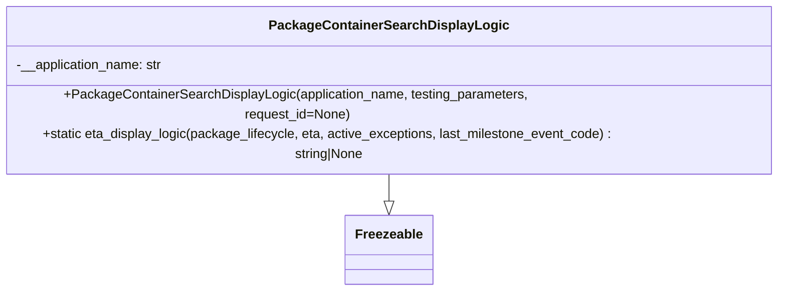

# Diagram: partview_service/partview_service/core/helpers/search_display_logic.py


> Auto-generated by Obscura crawlers

## Diagram 1



### SVG

<svg id="container" width="962.7421875" xmlns="http://www.w3.org/2000/svg" class="classDiagram" height="318" viewBox="0 0 962.7421875 318" role="graphics-document document" aria-roledescription="class"><style>#container{font-family:"trebuchet ms",verdana,arial,sans-serif;font-size:16px;fill:#333;}@keyframes edge-animation-frame{from{stroke-dashoffset:0;}}@keyframes dash{to{stroke-dashoffset:0;}}#container .edge-animation-slow{stroke-dasharray:9,5!important;stroke-dashoffset:900;animation:dash 50s linear infinite;stroke-linecap:round;}#container .edge-animation-fast{stroke-dasharray:9,5!important;stroke-dashoffset:900;animation:dash 20s linear infinite;stroke-linecap:round;}#container .error-icon{fill:#552222;}#container .error-text{fill:#552222;stroke:#552222;}#container .edge-thickness-normal{stroke-width:1px;}#container .edge-thickness-thick{stroke-width:3.5px;}#container .edge-pattern-solid{stroke-dasharray:0;}#container .edge-thickness-invisible{stroke-width:0;fill:none;}#container .edge-pattern-dashed{stroke-dasharray:3;}#container .edge-pattern-dotted{stroke-dasharray:2;}#container .marker{fill:#333333;stroke:#333333;}#container .marker.cross{stroke:#333333;}#container svg{font-family:"trebuchet ms",verdana,arial,sans-serif;font-size:16px;}#container p{margin:0;}#container g.classGroup text{fill:#9370DB;stroke:none;font-family:"trebuchet ms",verdana,arial,sans-serif;font-size:10px;}#container g.classGroup text .title{font-weight:bolder;}#container .nodeLabel,#container .edgeLabel{color:#131300;}#container .edgeLabel .label rect{fill:#ECECFF;}#container .label text{fill:#131300;}#container .labelBkg{background:#ECECFF;}#container .edgeLabel .label span{background:#ECECFF;}#container .classTitle{font-weight:bolder;}#container .node rect,#container .node circle,#container .node ellipse,#container .node polygon,#container .node path{fill:#ECECFF;stroke:#9370DB;stroke-width:1px;}#container .divider{stroke:#9370DB;stroke-width:1;}#container g.clickable{cursor:pointer;}#container g.classGroup rect{fill:#ECECFF;stroke:#9370DB;}#container g.classGroup line{stroke:#9370DB;stroke-width:1;}#container .classLabel .box{stroke:none;stroke-width:0;fill:#ECECFF;opacity:0.5;}#container .classLabel .label{fill:#9370DB;font-size:10px;}#container .relation{stroke:#333333;stroke-width:1;fill:none;}#container .dashed-line{stroke-dasharray:3;}#container .dotted-line{stroke-dasharray:1 2;}#container #compositionStart,#container .composition{fill:#333333!important;stroke:#333333!important;stroke-width:1;}#container #compositionEnd,#container .composition{fill:#333333!important;stroke:#333333!important;stroke-width:1;}#container #dependencyStart,#container .dependency{fill:#333333!important;stroke:#333333!important;stroke-width:1;}#container #dependencyStart,#container .dependency{fill:#333333!important;stroke:#333333!important;stroke-width:1;}#container #extensionStart,#container .extension{fill:transparent!important;stroke:#333333!important;stroke-width:1;}#container #extensionEnd,#container .extension{fill:transparent!important;stroke:#333333!important;stroke-width:1;}#container #aggregationStart,#container .aggregation{fill:transparent!important;stroke:#333333!important;stroke-width:1;}#container #aggregationEnd,#container .aggregation{fill:transparent!important;stroke:#333333!important;stroke-width:1;}#container #lollipopStart,#container .lollipop{fill:#ECECFF!important;stroke:#333333!important;stroke-width:1;}#container #lollipopEnd,#container .lollipop{fill:#ECECFF!important;stroke:#333333!important;stroke-width:1;}#container .edgeTerminals{font-size:11px;line-height:initial;}#container .classTitleText{text-anchor:middle;font-size:18px;fill:#333;}#container .label-icon{display:inline-block;height:1em;overflow:visible;vertical-align:-0.125em;}#container .node .label-icon path{fill:currentColor;stroke:revert;stroke-width:revert;}#container :root{--mermaid-font-family:"trebuchet ms",verdana,arial,sans-serif;}</style><g><defs><marker id="container_class-aggregationStart" class="marker aggregation class" refX="18" refY="7" markerWidth="190" markerHeight="240" orient="auto"><path d="M 18,7 L9,13 L1,7 L9,1 Z"></path></marker></defs><defs><marker id="container_class-aggregationEnd" class="marker aggregation class" refX="1" refY="7" markerWidth="20" markerHeight="28" orient="auto"><path d="M 18,7 L9,13 L1,7 L9,1 Z"></path></marker></defs><defs><marker id="container_class-extensionStart" class="marker extension class" refX="18" refY="7" markerWidth="190" markerHeight="240" orient="auto"><path d="M 1,7 L18,13 V 1 Z"></path></marker></defs><defs><marker id="container_class-extensionEnd" class="marker extension class" refX="1" refY="7" markerWidth="20" markerHeight="28" orient="auto"><path d="M 1,1 V 13 L18,7 Z"></path></marker></defs><defs><marker id="container_class-compositionStart" class="marker composition class" refX="18" refY="7" markerWidth="190" markerHeight="240" orient="auto"><path d="M 18,7 L9,13 L1,7 L9,1 Z"></path></marker></defs><defs><marker id="container_class-compositionEnd" class="marker composition class" refX="1" refY="7" markerWidth="20" markerHeight="28" orient="auto"><path d="M 18,7 L9,13 L1,7 L9,1 Z"></path></marker></defs><defs><marker id="container_class-dependencyStart" class="marker dependency class" refX="6" refY="7" markerWidth="190" markerHeight="240" orient="auto"><path d="M 5,7 L9,13 L1,7 L9,1 Z"></path></marker></defs><defs><marker id="container_class-dependencyEnd" class="marker dependency class" refX="13" refY="7" markerWidth="20" markerHeight="28" orient="auto"><path d="M 18,7 L9,13 L14,7 L9,1 Z"></path></marker></defs><defs><marker id="container_class-lollipopStart" class="marker lollipop class" refX="13" refY="7" markerWidth="190" markerHeight="240" orient="auto"><circle stroke="black" fill="transparent" cx="7" cy="7" r="6"></circle></marker></defs><defs><marker id="container_class-lollipopEnd" class="marker lollipop class" refX="1" refY="7" markerWidth="190" markerHeight="240" orient="auto"><circle stroke="black" fill="transparent" cx="7" cy="7" r="6"></circle></marker></defs><g class="root"><g class="clusters"></g><g class="edgePaths"><path d="M481.371,176L481.371,180.167C481.371,184.333,481.371,192.667,481.371,198.125C481.371,203.583,481.371,206.167,481.371,207.458L481.371,208.75" id="id_PackageContainerSearchDisplayLogic_Freezeable_1" class="edge-thickness-normal edge-pattern-solid relation" style=";;;" data-edge="true" data-et="edge" data-id="id_PackageContainerSearchDisplayLogic_Freezeable_1" data-points="W3sieCI6NDgxLjM3MTA5Mzc1LCJ5IjoxNzZ9LHsieCI6NDgxLjM3MTA5Mzc1LCJ5IjoyMDF9LHsieCI6NDgxLjM3MTA5Mzc1LCJ5IjoyMjZ9XQ==" marker-end="url(#container_class-extensionEnd)"></path></g><g class="edgeLabels"><g class="edgeLabel"><g class="label" data-id="id_PackageContainerSearchDisplayLogic_Freezeable_1" transform="translate(0, 0)"><foreignObject width="0" height="0"><div xmlns="http://www.w3.org/1999/xhtml" class="labelBkg" style="display: table-cell; white-space: nowrap; line-height: 1.5; max-width: 200px; text-align: center;"><span class="edgeLabel"></span></div></foreignObject></g></g></g><g class="nodes"><g class="node default" id="classId-Freezeable-0" transform="translate(481.37109375, 268)"><g class="basic label-container"><path d="M-51.1953125 -42 L51.1953125 -42 L51.1953125 42 L-51.1953125 42" stroke="none" stroke-width="0" fill="#ECECFF" style=""></path><path d="M-51.1953125 -42 C-20.691160250782378 -42, 9.812991998435244 -42, 51.1953125 -42 M-51.1953125 -42 C-18.85290991405595 -42, 13.489492671888101 -42, 51.1953125 -42 M51.1953125 -42 C51.1953125 -18.89661160374015, 51.1953125 4.2067767925196975, 51.1953125 42 M51.1953125 -42 C51.1953125 -9.91663351185018, 51.1953125 22.16673297629964, 51.1953125 42 M51.1953125 42 C30.43661490903973 42, 9.677917318079459 42, -51.1953125 42 M51.1953125 42 C22.52109997783514 42, -6.153112544329723 42, -51.1953125 42 M-51.1953125 42 C-51.1953125 12.7941468387607, -51.1953125 -16.4117063224786, -51.1953125 -42 M-51.1953125 42 C-51.1953125 24.714296435708764, -51.1953125 7.428592871417528, -51.1953125 -42" stroke="#9370DB" stroke-width="1.3" fill="none" stroke-dasharray="0 0" style=""></path></g><g class="annotation-group text" transform="translate(0, -18)"></g><g class="label-group text" transform="translate(-39.1953125, -18)"><g class="label" style="font-weight: bolder" transform="translate(0,-12)"><foreignObject width="78.390625" height="24"><div xmlns="http://www.w3.org/1999/xhtml" style="display: table-cell; white-space: nowrap; line-height: 1.5; max-width: 127px; text-align: center;"><span class="nodeLabel markdown-node-label" style=""><p>Freezeable</p></span></div></foreignObject></g></g><g class="members-group text" transform="translate(-39.1953125, 30)"></g><g class="methods-group text" transform="translate(-39.1953125, 60)"></g><g class="divider" style=""><path d="M-51.1953125 6 C-27.99423694296521 6, -4.793161385930418 6, 51.1953125 6 M-51.1953125 6 C-26.172162992515347 6, -1.149013485030693 6, 51.1953125 6" stroke="#9370DB" stroke-width="1.3" fill="none" stroke-dasharray="0 0" style=""></path></g><g class="divider" style=""><path d="M-51.1953125 24 C-16.853619431858945 24, 17.48807363628211 24, 51.1953125 24 M-51.1953125 24 C-29.16522768196565 24, -7.1351428639313 24, 51.1953125 24" stroke="#9370DB" stroke-width="1.3" fill="none" stroke-dasharray="0 0" style=""></path></g></g><g class="node default" id="classId-PackageContainerSearchDisplayLogic-1" transform="translate(481.37109375, 92)"><g class="basic label-container"><path d="M-473.37109375 -84 L473.37109375 -84 L473.37109375 84 L-473.37109375 84" stroke="none" stroke-width="0" fill="#ECECFF" style=""></path><path d="M-473.37109375 -84 C-224.0783090862953 -84, 25.214475577409416 -84, 473.37109375 -84 M-473.37109375 -84 C-162.0110386629014 -84, 149.3490164241972 -84, 473.37109375 -84 M473.37109375 -84 C473.37109375 -46.23859291125547, 473.37109375 -8.477185822510947, 473.37109375 84 M473.37109375 -84 C473.37109375 -18.72798490798577, 473.37109375 46.54403018402846, 473.37109375 84 M473.37109375 84 C235.38690035825167 84, -2.597293033496669 84, -473.37109375 84 M473.37109375 84 C121.1882612289379 84, -230.9945712921242 84, -473.37109375 84 M-473.37109375 84 C-473.37109375 26.571182619997543, -473.37109375 -30.857634760004913, -473.37109375 -84 M-473.37109375 84 C-473.37109375 38.116206461300216, -473.37109375 -7.767587077399568, -473.37109375 -84" stroke="#9370DB" stroke-width="1.3" fill="none" stroke-dasharray="0 0" style=""></path></g><g class="annotation-group text" transform="translate(0, -60)"></g><g class="label-group text" transform="translate(-136.0859375, -60)"><g class="label" style="font-weight: bolder" transform="translate(0,-12)"><foreignObject width="272.171875" height="24"><div xmlns="http://www.w3.org/1999/xhtml" style="display: table-cell; white-space: nowrap; line-height: 1.5; max-width: 318px; text-align: center;"><span class="nodeLabel markdown-node-label" style=""><p>PackageContainerSearchDisplayLogic</p></span></div></foreignObject></g></g><g class="members-group text" transform="translate(-461.37109375, -12)"><g class="label" style="" transform="translate(0,-12)"><foreignObject width="179.78125" height="24"><div xmlns="http://www.w3.org/1999/xhtml" style="display: table-cell; white-space: nowrap; line-height: 1.5; max-width: 238px; text-align: center;"><span class="nodeLabel markdown-node-label" style=""><p>-__application_name: str</p></span></div></foreignObject></g></g><g class="methods-group text" transform="translate(-461.37109375, 36)"><g class="label" style="" transform="translate(0,-12)"><foreignObject width="697.296875" height="24"><div xmlns="http://www.w3.org/1999/xhtml" style="display: table-cell; white-space: nowrap; line-height: 1.5; max-width: 755px; text-align: center;"><span class="nodeLabel markdown-node-label" style=""><p>+PackageContainerSearchDisplayLogic(application_name, testing_parameters, request_id=None)</p></span></div></foreignObject></g><g class="label" style="" transform="translate(0,12)"><foreignObject width="786.65625" height="24"><div xmlns="http://www.w3.org/1999/xhtml" style="display: table-cell; white-space: nowrap; line-height: 1.5; max-width: 844px; text-align: center;"><span class="nodeLabel markdown-node-label" style=""><p>+static eta_display_logic(package_lifecycle, eta, active_exceptions, last_milestone_event_code) : string|None</p></span></div></foreignObject></g></g><g class="divider" style=""><path d="M-473.37109375 -36 C-217.65942697186782 -36, 38.05223980626437 -36, 473.37109375 -36 M-473.37109375 -36 C-273.178670865885 -36, -72.98624798177002 -36, 473.37109375 -36" stroke="#9370DB" stroke-width="1.3" fill="none" stroke-dasharray="0 0" style=""></path></g><g class="divider" style=""><path d="M-473.37109375 12 C-272.00742522077377 12, -70.64375669154754 12, 473.37109375 12 M-473.37109375 12 C-221.33481279023925 12, 30.70146816952149 12, 473.37109375 12" stroke="#9370DB" stroke-width="1.3" fill="none" stroke-dasharray="0 0" style=""></path></g></g></g></g></g></svg>

## Diagram 2

```mermaid
flowchart TD
Inputs[Inputs: package_lifecycle, eta, active_exceptions, last_milestone_event_code]
Init[eta_display = eta]
CondDelivered{package_lifecycle == PackageContainerStatus.DELIVERED_STATE?}
ReturnDelivered[Return PackageContainerStatus.DELIVERED_STATE]
CondPending{eta is null AND last_milestone_event_code == PackageEventCodes.ARRIVED?}
ReturnPending[Return "Pending Dispatch"]
CondTBD{package_lifecycle == PackageContainerStatus.DELAYED_STATE OR package_lifecycle == PackageContainerStatus.AVAILABLE_FOR_PICKUP OR eta is null OR active_exceptions is not null?}
ReturnTBD[Return "TBD"]
ReturnEta[Return eta_display]

Inputs --> Init --> CondDelivered
CondDelivered -- yes --> ReturnDelivered
CondDelivered -- no --> CondPending
CondPending -- yes --> ReturnPending
CondPending -- no --> CondTBD
CondTBD -- yes --> ReturnTBD
CondTBD -- no --> ReturnEta
```

> SVG rendering failed for this diagram.
