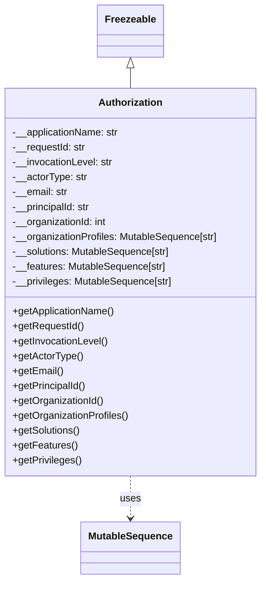

# Diagram: partview_service/partview_service/core/messaging/Authorization.py

> Auto-generated by Obscura crawlers

## Mermaid

### SVG

<svg id="container" width="422.6484375" xmlns="http://www.w3.org/2000/svg" class="classDiagram" height="932" viewBox="0 0 422.6484375 932" role="graphics-document document" aria-roledescription="class"><g><defs><marker id="container_class-aggregationStart" class="marker aggregation class" refX="18" refY="7" markerWidth="190" markerHeight="240" orient="auto"><path d="M 18,7 L9,13 L1,7 L9,1 Z"></path></marker></defs><defs><marker id="container_class-aggregationEnd" class="marker aggregation class" refX="1" refY="7" markerWidth="20" markerHeight="28" orient="auto"><path d="M 18,7 L9,13 L1,7 L9,1 Z"></path></marker></defs><defs><marker id="container_class-extensionStart" class="marker extension class" refX="18" refY="7" markerWidth="190" markerHeight="240" orient="auto"><path d="M 1,7 L18,13 V 1 Z"></path></marker></defs><defs><marker id="container_class-extensionEnd" class="marker extension class" refX="1" refY="7" markerWidth="20" markerHeight="28" orient="auto"><path d="M 1,1 V 13 L18,7 Z"></path></marker></defs><defs><marker id="container_class-compositionStart" class="marker composition class" refX="18" refY="7" markerWidth="190" markerHeight="240" orient="auto"><path d="M 18,7 L9,13 L1,7 L9,1 Z"></path></marker></defs><defs><marker id="container_class-compositionEnd" class="marker composition class" refX="1" refY="7" markerWidth="20" markerHeight="28" orient="auto"><path d="M 18,7 L9,13 L1,7 L9,1 Z"></path></marker></defs><defs><marker id="container_class-dependencyStart" class="marker dependency class" refX="6" refY="7" markerWidth="190" markerHeight="240" orient="auto"><path d="M 5,7 L9,13 L1,7 L9,1 Z"></path></marker></defs><defs><marker id="container_class-dependencyEnd" class="marker dependency class" refX="13" refY="7" markerWidth="20" markerHeight="28" orient="auto"><path d="M 18,7 L9,13 L14,7 L9,1 Z"></path></marker></defs><defs><marker id="container_class-lollipopStart" class="marker lollipop class" refX="13" refY="7" markerWidth="190" markerHeight="240" orient="auto"><circle stroke="black" fill="transparent" cx="7" cy="7" r="6"></circle></marker></defs><defs><marker id="container_class-lollipopEnd" class="marker lollipop class" refX="1" refY="7" markerWidth="190" markerHeight="240" orient="auto"><circle stroke="black" fill="transparent" cx="7" cy="7" r="6"></circle></marker></defs><g class="root"><g class="clusters"></g><g class="edgePaths"><path d="M211.324,109.25L211.324,110.542C211.324,111.833,211.324,114.417,211.324,119.875C211.324,125.333,211.324,133.667,211.324,137.833L211.324,142" id="id_Freezeable_Authorization_1" class="edge-thickness-normal edge-pattern-solid relation" style=";;;" data-edge="true" data-et="edge" data-id="id_Freezeable_Authorization_1" data-points="W3sieCI6MjExLjMyNDIxODc1LCJ5Ijo5Mn0seyJ4IjoyMTEuMzI0MjE4NzUsInkiOjExN30seyJ4IjoyMTEuMzI0MjE4NzUsInkiOjE0Mn1d" marker-start="url(#container_class-extensionStart)"></path><path d="M211.324,766L211.324,772.167C211.324,778.333,211.324,790.667,211.324,802C211.324,813.333,211.324,823.667,211.324,828.833L211.324,834" id="id_Authorization_MutableSequence_2" class="edge-thickness-normal edge-pattern-dashed relation" style=";;;" data-edge="true" data-et="edge" data-id="id_Authorization_MutableSequence_2" data-points="W3sieCI6MjExLjMyNDIxODc1LCJ5Ijo3NjZ9LHsieCI6MjExLjMyNDIxODc1LCJ5Ijo4MDN9LHsieCI6MjExLjMyNDIxODc1LCJ5Ijo4NDB9XQ==" marker-end="url(#container_class-dependencyEnd)"></path></g><g class="edgeLabels"><g class="edgeLabel"><g class="label" data-id="id_Freezeable_Authorization_1" transform="translate(0, 0)"><foreignObject width="0" height="0">

</foreignObject></g></g><g class="edgeLabel" transform="translate(211.32421875, 803)"><g class="label" data-id="id_Authorization_MutableSequence_2" transform="translate(-16.4921875, -12)"><foreignObject width="32.984375" height="24">

uses

</foreignObject></g></g></g><g class="nodes"><g class="node default" id="classId-Freezeable-0" transform="translate(211.32421875, 50)"><g class="basic label-container"><path d="M-51.1953125 -42 L51.1953125 -42 L51.1953125 42 L-51.1953125 42" stroke="none" stroke-width="0" fill="#ECECFF" style=""></path><path d="M-51.1953125 -42 C-12.340554336779078 -42, 26.514203826441843 -42, 51.1953125 -42 M-51.1953125 -42 C-16.229175151605574 -42, 18.736962196788852 -42, 51.1953125 -42 M51.1953125 -42 C51.1953125 -8.628533060391597, 51.1953125 24.742933879216807, 51.1953125 42 M51.1953125 -42 C51.1953125 -13.02401828826802, 51.1953125 15.951963423463958, 51.1953125 42 M51.1953125 42 C27.353718909910416 42, 3.512125319820832 42, -51.1953125 42 M51.1953125 42 C29.60589891869939 42, 8.016485337398777 42, -51.1953125 42 M-51.1953125 42 C-51.1953125 9.635464724360574, -51.1953125 -22.729070551278852, -51.1953125 -42 M-51.1953125 42 C-51.1953125 21.38718680140914, -51.1953125 0.7743736028182795, -51.1953125 -42" stroke="#9370DB" stroke-width="1.3" fill="none" stroke-dasharray="0 0" style=""></path></g><g class="annotation-group text" transform="translate(0, -18)"></g><g class="label-group text" transform="translate(-39.1953125, -18)"><g class="label" style="font-weight: bolder" transform="translate(0,-12)"><foreignObject width="78.390625" height="24">

Freezeable

</foreignObject></g></g><g class="members-group text" transform="translate(-39.1953125, 30)"></g><g class="methods-group text" transform="translate(-39.1953125, 60)"></g><g class="divider" style=""><path d="M-51.1953125 6 C-10.493491111668675 6, 30.20833027666265 6, 51.1953125 6 M-51.1953125 6 C-29.625332458004443 6, -8.055352416008887 6, 51.1953125 6" stroke="#9370DB" stroke-width="1.3" fill="none" stroke-dasharray="0 0" style=""></path></g><g class="divider" style=""><path d="M-51.1953125 24 C-27.53534152328214 24, -3.8753705465642767 24, 51.1953125 24 M-51.1953125 24 C-21.143527160862025 24, 8.90825817827595 24, 51.1953125 24" stroke="#9370DB" stroke-width="1.3" fill="none" stroke-dasharray="0 0" style=""></path></g></g><g class="node default" id="classId-Authorization-1" transform="translate(211.32421875, 454)"><g class="basic label-container"><path d="M-203.32421875 -312 L203.32421875 -312 L203.32421875 312 L-203.32421875 312" stroke="none" stroke-width="0" fill="#ECECFF" style=""></path><path d="M-203.32421875 -312 C-75.76216057547433 -312, 51.79989759905135 -312, 203.32421875 -312 M-203.32421875 -312 C-61.21646298672573 -312, 80.89129277654854 -312, 203.32421875 -312 M203.32421875 -312 C203.32421875 -148.91654068552458, 203.32421875 14.166918628950839, 203.32421875 312 M203.32421875 -312 C203.32421875 -137.91688038209983, 203.32421875 36.16623923580033, 203.32421875 312 M203.32421875 312 C53.630751071557995 312, -96.06271660688401 312, -203.32421875 312 M203.32421875 312 C92.10701125380268 312, -19.110196242394636 312, -203.32421875 312 M-203.32421875 312 C-203.32421875 72.48758571416548, -203.32421875 -167.02482857166905, -203.32421875 -312 M-203.32421875 312 C-203.32421875 170.4033877764856, -203.32421875 28.806775552971203, -203.32421875 -312" stroke="#9370DB" stroke-width="1.3" fill="none" stroke-dasharray="0 0" style=""></path></g><g class="annotation-group text" transform="translate(0, -288)"></g><g class="label-group text" transform="translate(-49.7109375, -288)"><g class="label" style="font-weight: bolder" transform="translate(0,-12)"><foreignObject width="99.421875" height="24">

Authorization

</foreignObject></g></g><g class="members-group text" transform="translate(-191.32421875, -240)"><g class="label" style="" transform="translate(0,-12)"><foreignObject width="173.015625" height="24">

-__applicationName: str

</foreignObject></g><g class="label" style="" transform="translate(0,12)"><foreignObject width="118.71875" height="24">

-__requestId: str

</foreignObject></g><g class="label" style="" transform="translate(0,36)"><foreignObject width="162.890625" height="24">

-__invocationLevel: str

</foreignObject></g><g class="label" style="" transform="translate(0,60)"><foreignObject width="119.96875" height="24">

-__actorType: str

</foreignObject></g><g class="label" style="" transform="translate(0,84)"><foreignObject width="89.34375" height="24">

-__email: str

</foreignObject></g><g class="label" style="" transform="translate(0,108)"><foreignObject width="127.75" height="24">

-__principalId: str

</foreignObject></g><g class="label" style="" transform="translate(0,132)"><foreignObject width="153.71875" height="24">

-__organizationId: int

</foreignObject></g><g class="label" style="" transform="translate(0,156)"><foreignObject width="332.9375" height="24">

-__organizationProfiles: MutableSequence[str]

</foreignObject></g><g class="label" style="" transform="translate(0,180)"><foreignObject width="256.1875" height="24">

-__solutions: MutableSequence[str]

</foreignObject></g><g class="label" style="" transform="translate(0,204)"><foreignObject width="248.015625" height="24">

-__features: MutableSequence[str]

</foreignObject></g><g class="label" style="" transform="translate(0,228)"><foreignObject width="259.046875" height="24">

-__privileges: MutableSequence[str]

</foreignObject></g></g><g class="methods-group text" transform="translate(-191.32421875, 48)"><g class="label" style="" transform="translate(0,-12)"><foreignObject width="165.5625" height="24">

+getApplicationName()

</foreignObject></g><g class="label" style="" transform="translate(0,12)"><foreignObject width="114.21875" height="24">

+getRequestId()

</foreignObject></g><g class="label" style="" transform="translate(0,36)"><foreignObject width="154.703125" height="24">

+getInvocationLevel()

</foreignObject></g><g class="label" style="" transform="translate(0,60)"><foreignObject width="112.515625" height="24">

+getActorType()

</foreignObject></g><g class="label" style="" transform="translate(0,84)"><foreignObject width="80.9375" height="24">

+getEmail()

</foreignObject></g><g class="label" style="" transform="translate(0,108)"><foreignObject width="118.984375" height="24">

+getPrincipalId()

</foreignObject></g><g class="label" style="" transform="translate(0,132)"><foreignObject width="147.28125" height="24">

+getOrganizationId()

</foreignObject></g><g class="label" style="" transform="translate(0,156)"><foreignObject width="187.015625" height="24">

+getOrganizationProfiles()

</foreignObject></g><g class="label" style="" transform="translate(0,180)"><foreignObject width="109.46875" height="24">

+getSolutions()

</foreignObject></g><g class="label" style="" transform="translate(0,204)"><foreignObject width="102.453125" height="24">

+getFeatures()

</foreignObject></g><g class="label" style="" transform="translate(0,228)"><foreignObject width="110.546875" height="24">

+getPrivileges()

</foreignObject></g></g><g class="divider" style=""><path d="M-203.32421875 -264 C-86.02428382162599 -264, 31.27565110674803 -264, 203.32421875 -264 M-203.32421875 -264 C-68.86466514650778 -264, 65.59488845698445 -264, 203.32421875 -264" stroke="#9370DB" stroke-width="1.3" fill="none" stroke-dasharray="0 0" style=""></path></g><g class="divider" style=""><path d="M-203.32421875 24 C-68.99327840511287 24, 65.33766193977425 24, 203.32421875 24 M-203.32421875 24 C-83.33061338862173 24, 36.662991972756544 24, 203.32421875 24" stroke="#9370DB" stroke-width="1.3" fill="none" stroke-dasharray="0 0" style=""></path></g></g><g class="node default" id="classId-MutableSequence-2" transform="translate(211.32421875, 882)"><g class="basic label-container"><path d="M-77.2578125 -42 L77.2578125 -42 L77.2578125 42 L-77.2578125 42" stroke="none" stroke-width="0" fill="#ECECFF" style=""></path><path d="M-77.2578125 -42 C-23.39579914341823 -42, 30.46621421316354 -42, 77.2578125 -42 M-77.2578125 -42 C-28.02032113163318 -42, 21.217170236733637 -42, 77.2578125 -42 M77.2578125 -42 C77.2578125 -10.894159793177359, 77.2578125 20.211680413645283, 77.2578125 42 M77.2578125 -42 C77.2578125 -10.004264930842755, 77.2578125 21.99147013831449, 77.2578125 42 M77.2578125 42 C18.041824715825072 42, -41.174163068349856 42, -77.2578125 42 M77.2578125 42 C26.41189454102573 42, -24.434023417948538 42, -77.2578125 42 M-77.2578125 42 C-77.2578125 24.554101585871685, -77.2578125 7.108203171743369, -77.2578125 -42 M-77.2578125 42 C-77.2578125 10.292604605618024, -77.2578125 -21.414790788763952, -77.2578125 -42" stroke="#9370DB" stroke-width="1.3" fill="none" stroke-dasharray="0 0" style=""></path></g><g class="annotation-group text" transform="translate(0, -18)"></g><g class="label-group text" transform="translate(-65.2578125, -18)"><g class="label" style="font-weight: bolder" transform="translate(0,-12)"><foreignObject width="130.515625" height="24">

MutableSequence

</foreignObject></g></g><g class="members-group text" transform="translate(-65.2578125, 30)"></g><g class="methods-group text" transform="translate(-65.2578125, 60)"></g><g class="divider" style=""><path d="M-77.2578125 6 C-15.807362683661829 6, 45.64308713267634 6, 77.2578125 6 M-77.2578125 6 C-19.388716839107197 6, 38.48037882178561 6, 77.2578125 6" stroke="#9370DB" stroke-width="1.3" fill="none" stroke-dasharray="0 0" style=""></path></g><g class="divider" style=""><path d="M-77.2578125 24 C-36.672172942690864 24, 3.9134666146182724 24, 77.2578125 24 M-77.2578125 24 C-26.595436476552585 24, 24.06693954689483 24, 77.2578125 24" stroke="#9370DB" stroke-width="1.3" fill="none" stroke-dasharray="0 0" style=""></path></g></g></g></g></g></svg>
