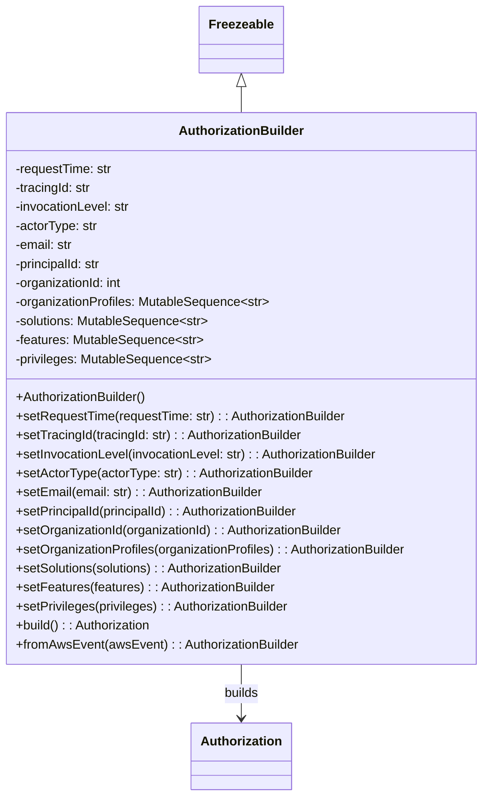

# Diagram: partview_service/partview_service/core/messaging/AuthorizationBuilder.py


> Auto-generated by Obscura crawlers

## Diagram 1



### SVG

<svg id="container" width="618.171875" xmlns="http://www.w3.org/2000/svg" class="classDiagram" height="1004" viewBox="0 0 618.171875 1004" role="graphics-document document" aria-roledescription="class"><style>#container{font-family:"trebuchet ms",verdana,arial,sans-serif;font-size:16px;fill:#333;}@keyframes edge-animation-frame{from{stroke-dashoffset:0;}}@keyframes dash{to{stroke-dashoffset:0;}}#container .edge-animation-slow{stroke-dasharray:9,5!important;stroke-dashoffset:900;animation:dash 50s linear infinite;stroke-linecap:round;}#container .edge-animation-fast{stroke-dasharray:9,5!important;stroke-dashoffset:900;animation:dash 20s linear infinite;stroke-linecap:round;}#container .error-icon{fill:#552222;}#container .error-text{fill:#552222;stroke:#552222;}#container .edge-thickness-normal{stroke-width:1px;}#container .edge-thickness-thick{stroke-width:3.5px;}#container .edge-pattern-solid{stroke-dasharray:0;}#container .edge-thickness-invisible{stroke-width:0;fill:none;}#container .edge-pattern-dashed{stroke-dasharray:3;}#container .edge-pattern-dotted{stroke-dasharray:2;}#container .marker{fill:#333333;stroke:#333333;}#container .marker.cross{stroke:#333333;}#container svg{font-family:"trebuchet ms",verdana,arial,sans-serif;font-size:16px;}#container p{margin:0;}#container g.classGroup text{fill:#9370DB;stroke:none;font-family:"trebuchet ms",verdana,arial,sans-serif;font-size:10px;}#container g.classGroup text .title{font-weight:bolder;}#container .nodeLabel,#container .edgeLabel{color:#131300;}#container .edgeLabel .label rect{fill:#ECECFF;}#container .label text{fill:#131300;}#container .labelBkg{background:#ECECFF;}#container .edgeLabel .label span{background:#ECECFF;}#container .classTitle{font-weight:bolder;}#container .node rect,#container .node circle,#container .node ellipse,#container .node polygon,#container .node path{fill:#ECECFF;stroke:#9370DB;stroke-width:1px;}#container .divider{stroke:#9370DB;stroke-width:1;}#container g.clickable{cursor:pointer;}#container g.classGroup rect{fill:#ECECFF;stroke:#9370DB;}#container g.classGroup line{stroke:#9370DB;stroke-width:1;}#container .classLabel .box{stroke:none;stroke-width:0;fill:#ECECFF;opacity:0.5;}#container .classLabel .label{fill:#9370DB;font-size:10px;}#container .relation{stroke:#333333;stroke-width:1;fill:none;}#container .dashed-line{stroke-dasharray:3;}#container .dotted-line{stroke-dasharray:1 2;}#container #compositionStart,#container .composition{fill:#333333!important;stroke:#333333!important;stroke-width:1;}#container #compositionEnd,#container .composition{fill:#333333!important;stroke:#333333!important;stroke-width:1;}#container #dependencyStart,#container .dependency{fill:#333333!important;stroke:#333333!important;stroke-width:1;}#container #dependencyStart,#container .dependency{fill:#333333!important;stroke:#333333!important;stroke-width:1;}#container #extensionStart,#container .extension{fill:transparent!important;stroke:#333333!important;stroke-width:1;}#container #extensionEnd,#container .extension{fill:transparent!important;stroke:#333333!important;stroke-width:1;}#container #aggregationStart,#container .aggregation{fill:transparent!important;stroke:#333333!important;stroke-width:1;}#container #aggregationEnd,#container .aggregation{fill:transparent!important;stroke:#333333!important;stroke-width:1;}#container #lollipopStart,#container .lollipop{fill:#ECECFF!important;stroke:#333333!important;stroke-width:1;}#container #lollipopEnd,#container .lollipop{fill:#ECECFF!important;stroke:#333333!important;stroke-width:1;}#container .edgeTerminals{font-size:11px;line-height:initial;}#container .classTitleText{text-anchor:middle;font-size:18px;fill:#333;}#container .label-icon{display:inline-block;height:1em;overflow:visible;vertical-align:-0.125em;}#container .node .label-icon path{fill:currentColor;stroke:revert;stroke-width:revert;}#container :root{--mermaid-font-family:"trebuchet ms",verdana,arial,sans-serif;}</style><g><defs><marker id="container_class-aggregationStart" class="marker aggregation class" refX="18" refY="7" markerWidth="190" markerHeight="240" orient="auto"><path d="M 18,7 L9,13 L1,7 L9,1 Z"></path></marker></defs><defs><marker id="container_class-aggregationEnd" class="marker aggregation class" refX="1" refY="7" markerWidth="20" markerHeight="28" orient="auto"><path d="M 18,7 L9,13 L1,7 L9,1 Z"></path></marker></defs><defs><marker id="container_class-extensionStart" class="marker extension class" refX="18" refY="7" markerWidth="190" markerHeight="240" orient="auto"><path d="M 1,7 L18,13 V 1 Z"></path></marker></defs><defs><marker id="container_class-extensionEnd" class="marker extension class" refX="1" refY="7" markerWidth="20" markerHeight="28" orient="auto"><path d="M 1,1 V 13 L18,7 Z"></path></marker></defs><defs><marker id="container_class-compositionStart" class="marker composition class" refX="18" refY="7" markerWidth="190" markerHeight="240" orient="auto"><path d="M 18,7 L9,13 L1,7 L9,1 Z"></path></marker></defs><defs><marker id="container_class-compositionEnd" class="marker composition class" refX="1" refY="7" markerWidth="20" markerHeight="28" orient="auto"><path d="M 18,7 L9,13 L1,7 L9,1 Z"></path></marker></defs><defs><marker id="container_class-dependencyStart" class="marker dependency class" refX="6" refY="7" markerWidth="190" markerHeight="240" orient="auto"><path d="M 5,7 L9,13 L1,7 L9,1 Z"></path></marker></defs><defs><marker id="container_class-dependencyEnd" class="marker dependency class" refX="13" refY="7" markerWidth="20" markerHeight="28" orient="auto"><path d="M 18,7 L9,13 L14,7 L9,1 Z"></path></marker></defs><defs><marker id="container_class-lollipopStart" class="marker lollipop class" refX="13" refY="7" markerWidth="190" markerHeight="240" orient="auto"><circle stroke="black" fill="transparent" cx="7" cy="7" r="6"></circle></marker></defs><defs><marker id="container_class-lollipopEnd" class="marker lollipop class" refX="1" refY="7" markerWidth="190" markerHeight="240" orient="auto"><circle stroke="black" fill="transparent" cx="7" cy="7" r="6"></circle></marker></defs><g class="root"><g class="clusters"></g><g class="edgePaths"><path d="M309.086,109.25L309.086,110.542C309.086,111.833,309.086,114.417,309.086,119.875C309.086,125.333,309.086,133.667,309.086,137.833L309.086,142" id="id_Freezeable_AuthorizationBuilder_1" class="edge-thickness-normal edge-pattern-solid relation" style=";;;" data-edge="true" data-et="edge" data-id="id_Freezeable_AuthorizationBuilder_1" data-points="W3sieCI6MzA5LjA4NTkzNzUsInkiOjkyfSx7IngiOjMwOS4wODU5Mzc1LCJ5IjoxMTd9LHsieCI6MzA5LjA4NTkzNzUsInkiOjE0Mn1d" marker-start="url(#container_class-extensionStart)"></path><path d="M309.086,838L309.086,844.167C309.086,850.333,309.086,862.667,309.086,874C309.086,885.333,309.086,895.667,309.086,900.833L309.086,906" id="id_AuthorizationBuilder_Authorization_2" class="edge-thickness-normal edge-pattern-solid relation" style=";;;" data-edge="true" data-et="edge" data-id="id_AuthorizationBuilder_Authorization_2" data-points="W3sieCI6MzA5LjA4NTkzNzUsInkiOjgzOH0seyJ4IjozMDkuMDg1OTM3NSwieSI6ODc1fSx7IngiOjMwOS4wODU5Mzc1LCJ5Ijo5MTJ9XQ==" marker-end="url(#container_class-dependencyEnd)"></path></g><g class="edgeLabels"><g class="edgeLabel"><g class="label" data-id="id_Freezeable_AuthorizationBuilder_1" transform="translate(0, 0)"><foreignObject width="0" height="0"><div xmlns="http://www.w3.org/1999/xhtml" class="labelBkg" style="display: table-cell; white-space: nowrap; line-height: 1.5; max-width: 200px; text-align: center;"><span class="edgeLabel"></span></div></foreignObject></g></g><g class="edgeLabel" transform="translate(309.0859375, 875)"><g class="label" data-id="id_AuthorizationBuilder_Authorization_2" transform="translate(-22.4921875, -12)"><foreignObject width="44.984375" height="24"><div xmlns="http://www.w3.org/1999/xhtml" class="labelBkg" style="display: table-cell; white-space: nowrap; line-height: 1.5; max-width: 200px; text-align: center;"><span class="edgeLabel"><p>builds</p></span></div></foreignObject></g></g></g><g class="nodes"><g class="node default" id="classId-Freezeable-0" transform="translate(309.0859375, 50)"><g class="basic label-container"><path d="M-51.1953125 -42 L51.1953125 -42 L51.1953125 42 L-51.1953125 42" stroke="none" stroke-width="0" fill="#ECECFF" style=""></path><path d="M-51.1953125 -42 C-19.680853126438603 -42, 11.833606247122795 -42, 51.1953125 -42 M-51.1953125 -42 C-12.230104181023684 -42, 26.735104137952632 -42, 51.1953125 -42 M51.1953125 -42 C51.1953125 -23.80956140115853, 51.1953125 -5.619122802317058, 51.1953125 42 M51.1953125 -42 C51.1953125 -14.613219560484236, 51.1953125 12.773560879031528, 51.1953125 42 M51.1953125 42 C16.721516471751755 42, -17.75227955649649 42, -51.1953125 42 M51.1953125 42 C21.794409537437474 42, -7.606493425125052 42, -51.1953125 42 M-51.1953125 42 C-51.1953125 15.77994486169343, -51.1953125 -10.44011027661314, -51.1953125 -42 M-51.1953125 42 C-51.1953125 23.344581146417493, -51.1953125 4.689162292834986, -51.1953125 -42" stroke="#9370DB" stroke-width="1.3" fill="none" stroke-dasharray="0 0" style=""></path></g><g class="annotation-group text" transform="translate(0, -18)"></g><g class="label-group text" transform="translate(-39.1953125, -18)"><g class="label" style="font-weight: bolder" transform="translate(0,-12)"><foreignObject width="78.390625" height="24"><div xmlns="http://www.w3.org/1999/xhtml" style="display: table-cell; white-space: nowrap; line-height: 1.5; max-width: 127px; text-align: center;"><span class="nodeLabel markdown-node-label" style=""><p>Freezeable</p></span></div></foreignObject></g></g><g class="members-group text" transform="translate(-39.1953125, 30)"></g><g class="methods-group text" transform="translate(-39.1953125, 60)"></g><g class="divider" style=""><path d="M-51.1953125 6 C-10.78618438022896 6, 29.62294373954208 6, 51.1953125 6 M-51.1953125 6 C-29.740245831067096 6, -8.285179162134192 6, 51.1953125 6" stroke="#9370DB" stroke-width="1.3" fill="none" stroke-dasharray="0 0" style=""></path></g><g class="divider" style=""><path d="M-51.1953125 24 C-10.244659573137866 24, 30.705993353724267 24, 51.1953125 24 M-51.1953125 24 C-26.747273495541585 24, -2.299234491083169 24, 51.1953125 24" stroke="#9370DB" stroke-width="1.3" fill="none" stroke-dasharray="0 0" style=""></path></g></g><g class="node default" id="classId-Authorization-1" transform="translate(309.0859375, 954)"><g class="basic label-container"><path d="M-61.7109375 -42 L61.7109375 -42 L61.7109375 42 L-61.7109375 42" stroke="none" stroke-width="0" fill="#ECECFF" style=""></path><path d="M-61.7109375 -42 C-23.168323191135414 -42, 15.374291117729172 -42, 61.7109375 -42 M-61.7109375 -42 C-28.056082324078794 -42, 5.598772851842412 -42, 61.7109375 -42 M61.7109375 -42 C61.7109375 -8.73598665519102, 61.7109375 24.52802668961796, 61.7109375 42 M61.7109375 -42 C61.7109375 -13.232228572061619, 61.7109375 15.535542855876763, 61.7109375 42 M61.7109375 42 C19.18345404632057 42, -23.34402940735886 42, -61.7109375 42 M61.7109375 42 C34.9315417015725 42, 8.152145903145005 42, -61.7109375 42 M-61.7109375 42 C-61.7109375 16.429833273347644, -61.7109375 -9.140333453304713, -61.7109375 -42 M-61.7109375 42 C-61.7109375 15.742538269068291, -61.7109375 -10.514923461863418, -61.7109375 -42" stroke="#9370DB" stroke-width="1.3" fill="none" stroke-dasharray="0 0" style=""></path></g><g class="annotation-group text" transform="translate(0, -18)"></g><g class="label-group text" transform="translate(-49.7109375, -18)"><g class="label" style="font-weight: bolder" transform="translate(0,-12)"><foreignObject width="99.421875" height="24"><div xmlns="http://www.w3.org/1999/xhtml" style="display: table-cell; white-space: nowrap; line-height: 1.5; max-width: 148px; text-align: center;"><span class="nodeLabel markdown-node-label" style=""><p>Authorization</p></span></div></foreignObject></g></g><g class="members-group text" transform="translate(-49.7109375, 30)"></g><g class="methods-group text" transform="translate(-49.7109375, 60)"></g><g class="divider" style=""><path d="M-61.7109375 6 C-28.39886964021403 6, 4.913198219571939 6, 61.7109375 6 M-61.7109375 6 C-25.088645516377532 6, 11.533646467244935 6, 61.7109375 6" stroke="#9370DB" stroke-width="1.3" fill="none" stroke-dasharray="0 0" style=""></path></g><g class="divider" style=""><path d="M-61.7109375 24 C-24.546068498022827 24, 12.618800503954347 24, 61.7109375 24 M-61.7109375 24 C-29.341058552753232 24, 3.028820394493536 24, 61.7109375 24" stroke="#9370DB" stroke-width="1.3" fill="none" stroke-dasharray="0 0" style=""></path></g></g><g class="node default" id="classId-AuthorizationBuilder-2" transform="translate(309.0859375, 490)"><g class="basic label-container"><path d="M-301.0859375 -348 L301.0859375 -348 L301.0859375 348 L-301.0859375 348" stroke="none" stroke-width="0" fill="#ECECFF" style=""></path><path d="M-301.0859375 -348 C-136.00948242189068 -348, 29.06697265621864 -348, 301.0859375 -348 M-301.0859375 -348 C-129.52770477538715 -348, 42.0305279492257 -348, 301.0859375 -348 M301.0859375 -348 C301.0859375 -200.7900213914369, 301.0859375 -53.58004278287382, 301.0859375 348 M301.0859375 -348 C301.0859375 -110.3049247161909, 301.0859375 127.3901505676182, 301.0859375 348 M301.0859375 348 C97.00384342406721 348, -107.07825065186557 348, -301.0859375 348 M301.0859375 348 C67.5085071986141 348, -166.0689231027718 348, -301.0859375 348 M-301.0859375 348 C-301.0859375 207.4524549253275, -301.0859375 66.90490985065497, -301.0859375 -348 M-301.0859375 348 C-301.0859375 206.77972548125965, -301.0859375 65.55945096251929, -301.0859375 -348" stroke="#9370DB" stroke-width="1.3" fill="none" stroke-dasharray="0 0" style=""></path></g><g class="annotation-group text" transform="translate(0, -324)"></g><g class="label-group text" transform="translate(-76.234375, -324)"><g class="label" style="font-weight: bolder" transform="translate(0,-12)"><foreignObject width="152.46875" height="24"><div xmlns="http://www.w3.org/1999/xhtml" style="display: table-cell; white-space: nowrap; line-height: 1.5; max-width: 202px; text-align: center;"><span class="nodeLabel markdown-node-label" style=""><p>AuthorizationBuilder</p></span></div></foreignObject></g></g><g class="members-group text" transform="translate(-289.0859375, -276)"><g class="label" style="" transform="translate(0,-12)"><foreignObject width="124.4375" height="24"><div xmlns="http://www.w3.org/1999/xhtml" style="display: table-cell; white-space: nowrap; line-height: 1.5; max-width: 183px; text-align: center;"><span class="nodeLabel markdown-node-label" style=""><p>-requestTime: str</p></span></div></foreignObject></g><g class="label" style="" transform="translate(0,12)"><foreignObject width="98.125" height="24"><div xmlns="http://www.w3.org/1999/xhtml" style="display: table-cell; white-space: nowrap; line-height: 1.5; max-width: 156px; text-align: center;"><span class="nodeLabel markdown-node-label" style=""><p>-tracingId: str</p></span></div></foreignObject></g><g class="label" style="" transform="translate(0,36)"><foreignObject width="147.6875" height="24"><div xmlns="http://www.w3.org/1999/xhtml" style="display: table-cell; white-space: nowrap; line-height: 1.5; max-width: 206px; text-align: center;"><span class="nodeLabel markdown-node-label" style=""><p>-invocationLevel: str</p></span></div></foreignObject></g><g class="label" style="" transform="translate(0,60)"><foreignObject width="104.859375" height="24"><div xmlns="http://www.w3.org/1999/xhtml" style="display: table-cell; white-space: nowrap; line-height: 1.5; max-width: 163px; text-align: center;"><span class="nodeLabel markdown-node-label" style=""><p>-actorType: str</p></span></div></foreignObject></g><g class="label" style="" transform="translate(0,84)"><foreignObject width="74.453125" height="24"><div xmlns="http://www.w3.org/1999/xhtml" style="display: table-cell; white-space: nowrap; line-height: 1.5; max-width: 133px; text-align: center;"><span class="nodeLabel markdown-node-label" style=""><p>-email: str</p></span></div></foreignObject></g><g class="label" style="" transform="translate(0,108)"><foreignObject width="112.546875" height="24"><div xmlns="http://www.w3.org/1999/xhtml" style="display: table-cell; white-space: nowrap; line-height: 1.5; max-width: 171px; text-align: center;"><span class="nodeLabel markdown-node-label" style=""><p>-principalId: str</p></span></div></foreignObject></g><g class="label" style="" transform="translate(0,132)"><foreignObject width="138.84375" height="24"><div xmlns="http://www.w3.org/1999/xhtml" style="display: table-cell; white-space: nowrap; line-height: 1.5; max-width: 196px; text-align: center;"><span class="nodeLabel markdown-node-label" style=""><p>-organizationId: int</p></span></div></foreignObject></g><g class="label" style="" transform="translate(0,156)"><foreignObject width="323.75" height="24"><div xmlns="http://www.w3.org/1999/xhtml" style="display: table-cell; white-space: nowrap; line-height: 1.5; max-width: 420px; text-align: center;"><span class="nodeLabel markdown-node-label" style=""><p>-organizationProfiles: MutableSequence&lt;str&gt;</p></span></div></foreignObject></g><g class="label" style="" transform="translate(0,180)"><foreignObject width="246.6875" height="24"><div xmlns="http://www.w3.org/1999/xhtml" style="display: table-cell; white-space: nowrap; line-height: 1.5; max-width: 343px; text-align: center;"><span class="nodeLabel markdown-node-label" style=""><p>-solutions: MutableSequence&lt;str&gt;</p></span></div></foreignObject></g><g class="label" style="" transform="translate(0,204)"><foreignObject width="238.578125" height="24"><div xmlns="http://www.w3.org/1999/xhtml" style="display: table-cell; white-space: nowrap; line-height: 1.5; max-width: 335px; text-align: center;"><span class="nodeLabel markdown-node-label" style=""><p>-features: MutableSequence&lt;str&gt;</p></span></div></foreignObject></g><g class="label" style="" transform="translate(0,228)"><foreignObject width="249.546875" height="24"><div xmlns="http://www.w3.org/1999/xhtml" style="display: table-cell; white-space: nowrap; line-height: 1.5; max-width: 346px; text-align: center;"><span class="nodeLabel markdown-node-label" style=""><p>-privileges: MutableSequence&lt;str&gt;</p></span></div></foreignObject></g></g><g class="methods-group text" transform="translate(-289.0859375, 12)"><g class="label" style="" transform="translate(0,-12)"><foreignObject width="168.953125" height="24"><div xmlns="http://www.w3.org/1999/xhtml" style="display: table-cell; white-space: nowrap; line-height: 1.5; max-width: 226px; text-align: center;"><span class="nodeLabel markdown-node-label" style=""><p>+AuthorizationBuilder()</p></span></div></foreignObject></g><g class="label" style="" transform="translate(0,12)"><foreignObject width="423.6875" height="24"><div xmlns="http://www.w3.org/1999/xhtml" style="display: table-cell; white-space: nowrap; line-height: 1.5; max-width: 482px; text-align: center;"><span class="nodeLabel markdown-node-label" style=""><p>+setRequestTime(requestTime: str) : : AuthorizationBuilder</p></span></div></foreignObject></g><g class="label" style="" transform="translate(0,36)"><foreignObject width="369.484375" height="24"><div xmlns="http://www.w3.org/1999/xhtml" style="display: table-cell; white-space: nowrap; line-height: 1.5; max-width: 428px; text-align: center;"><span class="nodeLabel markdown-node-label" style=""><p>+setTracingId(tracingId: str) : : AuthorizationBuilder</p></span></div></foreignObject></g><g class="label" style="" transform="translate(0,60)"><foreignObject width="466.484375" height="24"><div xmlns="http://www.w3.org/1999/xhtml" style="display: table-cell; white-space: nowrap; line-height: 1.5; max-width: 525px; text-align: center;"><span class="nodeLabel markdown-node-label" style=""><p>+setInvocationLevel(invocationLevel: str) : : AuthorizationBuilder</p></span></div></foreignObject></g><g class="label" style="" transform="translate(0,84)"><foreignObject width="381.71875" height="24"><div xmlns="http://www.w3.org/1999/xhtml" style="display: table-cell; white-space: nowrap; line-height: 1.5; max-width: 440px; text-align: center;"><span class="nodeLabel markdown-node-label" style=""><p>+setActorType(actorType: str) : : AuthorizationBuilder</p></span></div></foreignObject></g><g class="label" style="" transform="translate(0,108)"><foreignObject width="319.5" height="24"><div xmlns="http://www.w3.org/1999/xhtml" style="display: table-cell; white-space: nowrap; line-height: 1.5; max-width: 378px; text-align: center;"><span class="nodeLabel markdown-node-label" style=""><p>+setEmail(email: str) : : AuthorizationBuilder</p></span></div></foreignObject></g><g class="label" style="" transform="translate(0,132)"><foreignObject width="368.140625" height="24"><div xmlns="http://www.w3.org/1999/xhtml" style="display: table-cell; white-space: nowrap; line-height: 1.5; max-width: 426px; text-align: center;"><span class="nodeLabel markdown-node-label" style=""><p>+setPrincipalId(principalId) : : AuthorizationBuilder</p></span></div></foreignObject></g><g class="label" style="" transform="translate(0,156)"><foreignObject width="422.484375" height="24"><div xmlns="http://www.w3.org/1999/xhtml" style="display: table-cell; white-space: nowrap; line-height: 1.5; max-width: 481px; text-align: center;"><span class="nodeLabel markdown-node-label" style=""><p>+setOrganizationId(organizationId) : : AuthorizationBuilder</p></span></div></foreignObject></g><g class="label" style="" transform="translate(0,180)"><foreignObject width="501.9375" height="24"><div xmlns="http://www.w3.org/1999/xhtml" style="display: table-cell; white-space: nowrap; line-height: 1.5; max-width: 560px; text-align: center;"><span class="nodeLabel markdown-node-label" style=""><p>+setOrganizationProfiles(organizationProfiles) : : AuthorizationBuilder</p></span></div></foreignObject></g><g class="label" style="" transform="translate(0,204)"><foreignObject width="347.328125" height="24"><div xmlns="http://www.w3.org/1999/xhtml" style="display: table-cell; white-space: nowrap; line-height: 1.5; max-width: 405px; text-align: center;"><span class="nodeLabel markdown-node-label" style=""><p>+setSolutions(solutions) : : AuthorizationBuilder</p></span></div></foreignObject></g><g class="label" style="" transform="translate(0,228)"><foreignObject width="332.453125" height="24"><div xmlns="http://www.w3.org/1999/xhtml" style="display: table-cell; white-space: nowrap; line-height: 1.5; max-width: 391px; text-align: center;"><span class="nodeLabel markdown-node-label" style=""><p>+setFeatures(features) : : AuthorizationBuilder</p></span></div></foreignObject></g><g class="label" style="" transform="translate(0,252)"><foreignObject width="351.265625" height="24"><div xmlns="http://www.w3.org/1999/xhtml" style="display: table-cell; white-space: nowrap; line-height: 1.5; max-width: 409px; text-align: center;"><span class="nodeLabel markdown-node-label" style=""><p>+setPrivileges(privileges) : : AuthorizationBuilder</p></span></div></foreignObject></g><g class="label" style="" transform="translate(0,276)"><foreignObject width="174.390625" height="24"><div xmlns="http://www.w3.org/1999/xhtml" style="display: table-cell; white-space: nowrap; line-height: 1.5; max-width: 232px; text-align: center;"><span class="nodeLabel markdown-node-label" style=""><p>+build() : : Authorization</p></span></div></foreignObject></g><g class="label" style="" transform="translate(0,300)"><foreignObject width="358.90625" height="24"><div xmlns="http://www.w3.org/1999/xhtml" style="display: table-cell; white-space: nowrap; line-height: 1.5; max-width: 417px; text-align: center;"><span class="nodeLabel markdown-node-label" style=""><p>+fromAwsEvent(awsEvent) : : AuthorizationBuilder</p></span></div></foreignObject></g></g><g class="divider" style=""><path d="M-301.0859375 -300 C-153.57936889687807 -300, -6.072800293756131 -300, 301.0859375 -300 M-301.0859375 -300 C-169.68555219538456 -300, -38.28516689076912 -300, 301.0859375 -300" stroke="#9370DB" stroke-width="1.3" fill="none" stroke-dasharray="0 0" style=""></path></g><g class="divider" style=""><path d="M-301.0859375 -12 C-83.8726977551421 -12, 133.3405419897158 -12, 301.0859375 -12 M-301.0859375 -12 C-96.271391826289 -12, 108.54315384742199 -12, 301.0859375 -12" stroke="#9370DB" stroke-width="1.3" fill="none" stroke-dasharray="0 0" style=""></path></g></g></g></g></g></svg>

## Diagram 2

```mermaid
graph LR
AWSEvent[awsEvent] --> RequestContext[requestContext]
RequestContext --> Authorizer[authorizer]
RequestContext --> TracingInfo[requestId / requestTime / lambda_level]
Authorizer --> AuthBuilder[AuthorizationBuilder]
TracingInfo --> AuthBuilder
AuthBuilder -->|map authorizer & tracing fields| AuthorizationObj[Authorization]
AuthBuilder -->|build()| AuthorizationObj
```

> SVG rendering failed for this diagram.
