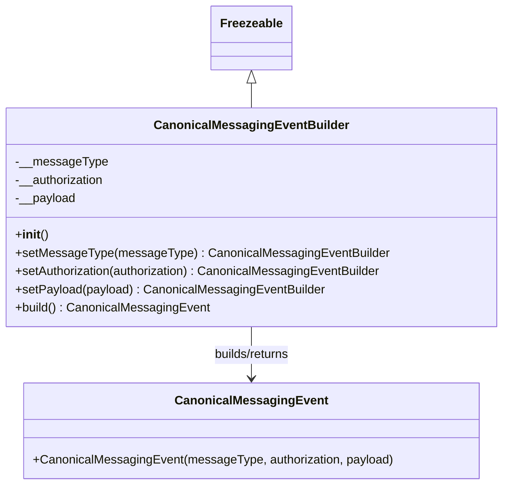

# Diagram: partview_service/partview_service/core/messaging/CanonicalMessagingEventBuilder.py

> Auto-generated by Obscura crawlers

## Mermaid

### SVG

<svg id="container" width="647.2109375" xmlns="http://www.w3.org/2000/svg" class="classDiagram" height="638" viewBox="0 0 647.2109375 638" role="graphics-document document" aria-roledescription="class"><g><defs><marker id="container_class-aggregationStart" class="marker aggregation class" refX="18" refY="7" markerWidth="190" markerHeight="240" orient="auto"><path d="M 18,7 L9,13 L1,7 L9,1 Z"></path></marker></defs><defs><marker id="container_class-aggregationEnd" class="marker aggregation class" refX="1" refY="7" markerWidth="20" markerHeight="28" orient="auto"><path d="M 18,7 L9,13 L1,7 L9,1 Z"></path></marker></defs><defs><marker id="container_class-extensionStart" class="marker extension class" refX="18" refY="7" markerWidth="190" markerHeight="240" orient="auto"><path d="M 1,7 L18,13 V 1 Z"></path></marker></defs><defs><marker id="container_class-extensionEnd" class="marker extension class" refX="1" refY="7" markerWidth="20" markerHeight="28" orient="auto"><path d="M 1,1 V 13 L18,7 Z"></path></marker></defs><defs><marker id="container_class-compositionStart" class="marker composition class" refX="18" refY="7" markerWidth="190" markerHeight="240" orient="auto"><path d="M 18,7 L9,13 L1,7 L9,1 Z"></path></marker></defs><defs><marker id="container_class-compositionEnd" class="marker composition class" refX="1" refY="7" markerWidth="20" markerHeight="28" orient="auto"><path d="M 18,7 L9,13 L1,7 L9,1 Z"></path></marker></defs><defs><marker id="container_class-dependencyStart" class="marker dependency class" refX="6" refY="7" markerWidth="190" markerHeight="240" orient="auto"><path d="M 5,7 L9,13 L1,7 L9,1 Z"></path></marker></defs><defs><marker id="container_class-dependencyEnd" class="marker dependency class" refX="13" refY="7" markerWidth="20" markerHeight="28" orient="auto"><path d="M 18,7 L9,13 L14,7 L9,1 Z"></path></marker></defs><defs><marker id="container_class-lollipopStart" class="marker lollipop class" refX="13" refY="7" markerWidth="190" markerHeight="240" orient="auto"><circle stroke="black" fill="transparent" cx="7" cy="7" r="6"></circle></marker></defs><defs><marker id="container_class-lollipopEnd" class="marker lollipop class" refX="1" refY="7" markerWidth="190" markerHeight="240" orient="auto"><circle stroke="black" fill="transparent" cx="7" cy="7" r="6"></circle></marker></defs><g class="root"><g class="clusters"></g><g class="edgePaths"><path d="M323.605,109.25L323.605,110.542C323.605,111.833,323.605,114.417,323.605,119.875C323.605,125.333,323.605,133.667,323.605,137.833L323.605,142" id="id_Freezeable_CanonicalMessagingEventBuilder_1" class="edge-thickness-normal edge-pattern-solid relation" style=";;;" data-edge="true" data-et="edge" data-id="id_Freezeable_CanonicalMessagingEventBuilder_1" data-points="W3sieCI6MzIzLjYwNTQ2ODc1LCJ5Ijo5Mn0seyJ4IjozMjMuNjA1NDY4NzUsInkiOjExN30seyJ4IjozMjMuNjA1NDY4NzUsInkiOjE0Mn1d" marker-start="url(#container_class-extensionStart)"></path><path d="M323.605,430L323.605,436.167C323.605,442.333,323.605,454.667,323.605,466C323.605,477.333,323.605,487.667,323.605,492.833L323.605,498" id="id_CanonicalMessagingEventBuilder_CanonicalMessagingEvent_2" class="edge-thickness-normal edge-pattern-solid relation" style=";;;" data-edge="true" data-et="edge" data-id="id_CanonicalMessagingEventBuilder_CanonicalMessagingEvent_2" data-points="W3sieCI6MzIzLjYwNTQ2ODc1LCJ5Ijo0MzB9LHsieCI6MzIzLjYwNTQ2ODc1LCJ5Ijo0Njd9LHsieCI6MzIzLjYwNTQ2ODc1LCJ5Ijo1MDR9XQ==" marker-end="url(#container_class-dependencyEnd)"></path></g><g class="edgeLabels"><g class="edgeLabel"><g class="label" data-id="id_Freezeable_CanonicalMessagingEventBuilder_1" transform="translate(0, 0)"><foreignObject width="0" height="0">

</foreignObject></g></g><g class="edgeLabel" transform="translate(323.60546875, 467)"><g class="label" data-id="id_CanonicalMessagingEventBuilder_CanonicalMessagingEvent_2" transform="translate(-52.6796875, -12)"><foreignObject width="105.359375" height="24">

builds/returns

</foreignObject></g></g></g><g class="nodes"><g class="node default" id="classId-Freezeable-0" transform="translate(323.60546875, 50)"><g class="basic label-container"><path d="M-51.1953125 -42 L51.1953125 -42 L51.1953125 42 L-51.1953125 42" stroke="none" stroke-width="0" fill="#ECECFF" style=""></path><path d="M-51.1953125 -42 C-15.120032539435918 -42, 20.955247421128163 -42, 51.1953125 -42 M-51.1953125 -42 C-25.576543090389787 -42, 0.04222631922042552 -42, 51.1953125 -42 M51.1953125 -42 C51.1953125 -12.581036580823891, 51.1953125 16.837926838352217, 51.1953125 42 M51.1953125 -42 C51.1953125 -17.323858885365794, 51.1953125 7.352282229268411, 51.1953125 42 M51.1953125 42 C19.247753064420863 42, -12.699806371158274 42, -51.1953125 42 M51.1953125 42 C12.92077308841241 42, -25.35376632317518 42, -51.1953125 42 M-51.1953125 42 C-51.1953125 17.885025497016585, -51.1953125 -6.22994900596683, -51.1953125 -42 M-51.1953125 42 C-51.1953125 8.613667727068524, -51.1953125 -24.772664545862952, -51.1953125 -42" stroke="#9370DB" stroke-width="1.3" fill="none" stroke-dasharray="0 0" style=""></path></g><g class="annotation-group text" transform="translate(0, -18)"></g><g class="label-group text" transform="translate(-39.1953125, -18)"><g class="label" style="font-weight: bolder" transform="translate(0,-12)"><foreignObject width="78.390625" height="24">

Freezeable

</foreignObject></g></g><g class="members-group text" transform="translate(-39.1953125, 30)"></g><g class="methods-group text" transform="translate(-39.1953125, 60)"></g><g class="divider" style=""><path d="M-51.1953125 6 C-13.054245722067783 6, 25.086821055864434 6, 51.1953125 6 M-51.1953125 6 C-11.709887348126848 6, 27.775537803746303 6, 51.1953125 6" stroke="#9370DB" stroke-width="1.3" fill="none" stroke-dasharray="0 0" style=""></path></g><g class="divider" style=""><path d="M-51.1953125 24 C-18.551173239895746 24, 14.092966020208507 24, 51.1953125 24 M-51.1953125 24 C-28.62108114536498 24, -6.046849790729958 24, 51.1953125 24" stroke="#9370DB" stroke-width="1.3" fill="none" stroke-dasharray="0 0" style=""></path></g></g><g class="node default" id="classId-CanonicalMessagingEvent-1" transform="translate(323.60546875, 567)"><g class="basic label-container"><path d="M-294.75 -63 L294.75 -63 L294.75 63 L-294.75 63" stroke="none" stroke-width="0" fill="#ECECFF" style=""></path><path d="M-294.75 -63 C-156.39187609908163 -63, -18.033752198163256 -63, 294.75 -63 M-294.75 -63 C-171.22250760243583 -63, -47.69501520487168 -63, 294.75 -63 M294.75 -63 C294.75 -17.17643653893318, 294.75 28.647126922133637, 294.75 63 M294.75 -63 C294.75 -31.30508776469057, 294.75 0.38982447061886205, 294.75 63 M294.75 63 C66.37486930817215 63, -162.0002613836557 63, -294.75 63 M294.75 63 C151.79249800112547 63, 8.834996002250932 63, -294.75 63 M-294.75 63 C-294.75 35.19840379883057, -294.75 7.3968075976611445, -294.75 -63 M-294.75 63 C-294.75 19.001987038080927, -294.75 -24.996025923838147, -294.75 -63" stroke="#9370DB" stroke-width="1.3" fill="none" stroke-dasharray="0 0" style=""></path></g><g class="annotation-group text" transform="translate(0, -39)"></g><g class="label-group text" transform="translate(-94, -39)"><g class="label" style="font-weight: bolder" transform="translate(0,-12)"><foreignObject width="188" height="24">

CanonicalMessagingEvent

</foreignObject></g></g><g class="members-group text" transform="translate(-282.75, 9)"></g><g class="methods-group text" transform="translate(-282.75, 39)"><g class="label" style="" transform="translate(0,-12)"><foreignObject width="471.5" height="24">

+CanonicalMessagingEvent(messageType, authorization, payload)

</foreignObject></g></g><g class="divider" style=""><path d="M-294.75 -15 C-121.51076887622699 -15, 51.72846224754602 -15, 294.75 -15 M-294.75 -15 C-62.52185546880676 -15, 169.70628906238647 -15, 294.75 -15" stroke="#9370DB" stroke-width="1.3" fill="none" stroke-dasharray="0 0" style=""></path></g><g class="divider" style=""><path d="M-294.75 9 C-156.5619330218932 9, -18.373866043786393 9, 294.75 9 M-294.75 9 C-121.60817273177909 9, 51.533654536441816 9, 294.75 9" stroke="#9370DB" stroke-width="1.3" fill="none" stroke-dasharray="0 0" style=""></path></g></g><g class="node default" id="classId-CanonicalMessagingEventBuilder-2" transform="translate(323.60546875, 286)"><g class="basic label-container"><path d="M-315.60546875 -144 L315.60546875 -144 L315.60546875 144 L-315.60546875 144" stroke="none" stroke-width="0" fill="#ECECFF" style=""></path><path d="M-315.60546875 -144 C-158.7609467378943 -144, -1.9164247257886018 -144, 315.60546875 -144 M-315.60546875 -144 C-152.90026714205968 -144, 9.804934465880649 -144, 315.60546875 -144 M315.60546875 -144 C315.60546875 -64.97838789392998, 315.60546875 14.043224212140046, 315.60546875 144 M315.60546875 -144 C315.60546875 -69.72197542774957, 315.60546875 4.556049144500861, 315.60546875 144 M315.60546875 144 C177.98475559651405 144, 40.3640424430281 144, -315.60546875 144 M315.60546875 144 C162.25095082036674 144, 8.896432890733479 144, -315.60546875 144 M-315.60546875 144 C-315.60546875 65.06289146775119, -315.60546875 -13.874217064497628, -315.60546875 -144 M-315.60546875 144 C-315.60546875 72.1155356258222, -315.60546875 0.23107125164440845, -315.60546875 -144" stroke="#9370DB" stroke-width="1.3" fill="none" stroke-dasharray="0 0" style=""></path></g><g class="annotation-group text" transform="translate(0, -120)"></g><g class="label-group text" transform="translate(-120.5234375, -120)"><g class="label" style="font-weight: bolder" transform="translate(0,-12)"><foreignObject width="241.046875" height="24">

CanonicalMessagingEventBuilder

</foreignObject></g></g><g class="members-group text" transform="translate(-303.60546875, -72)"><g class="label" style="" transform="translate(0,-12)"><foreignObject width="117.765625" height="24">

-__messageType

</foreignObject></g><g class="label" style="" transform="translate(0,12)"><foreignObject width="119" height="24">

-__authorization

</foreignObject></g><g class="label" style="" transform="translate(0,36)"><foreignObject width="79.40625" height="24">

-__payload

</foreignObject></g></g><g class="methods-group text" transform="translate(-303.60546875, 24)"><g class="label" style="" transform="translate(0,-12)"><foreignObject width="42.796875" height="24">

+<strong>init</strong>()

</foreignObject></g><g class="label" style="" transform="translate(0,12)"><foreignObject width="481.84375" height="24">

+setMessageType(messageType) : CanonicalMessagingEventBuilder

</foreignObject></g><g class="label" style="" transform="translate(0,36)"><foreignObject width="486.6875" height="24">

+setAuthorization(authorization) : CanonicalMessagingEventBuilder

</foreignObject></g><g class="label" style="" transform="translate(0,60)"><foreignObject width="405.453125" height="24">

+setPayload(payload) : CanonicalMessagingEventBuilder

</foreignObject></g><g class="label" style="" transform="translate(0,84)"><foreignObject width="253.796875" height="24">

+build() : CanonicalMessagingEvent

</foreignObject></g></g><g class="divider" style=""><path d="M-315.60546875 -96 C-83.3638371231203 -96, 148.8777945037594 -96, 315.60546875 -96 M-315.60546875 -96 C-189.24401863080996 -96, -62.88256851161992 -96, 315.60546875 -96" stroke="#9370DB" stroke-width="1.3" fill="none" stroke-dasharray="0 0" style=""></path></g><g class="divider" style=""><path d="M-315.60546875 0 C-181.16323957147557 0, -46.72101039295114 0, 315.60546875 0 M-315.60546875 0 C-121.10945065378272 0, 73.38656744243457 0, 315.60546875 0" stroke="#9370DB" stroke-width="1.3" fill="none" stroke-dasharray="0 0" style=""></path></g></g></g></g></g></svg>
