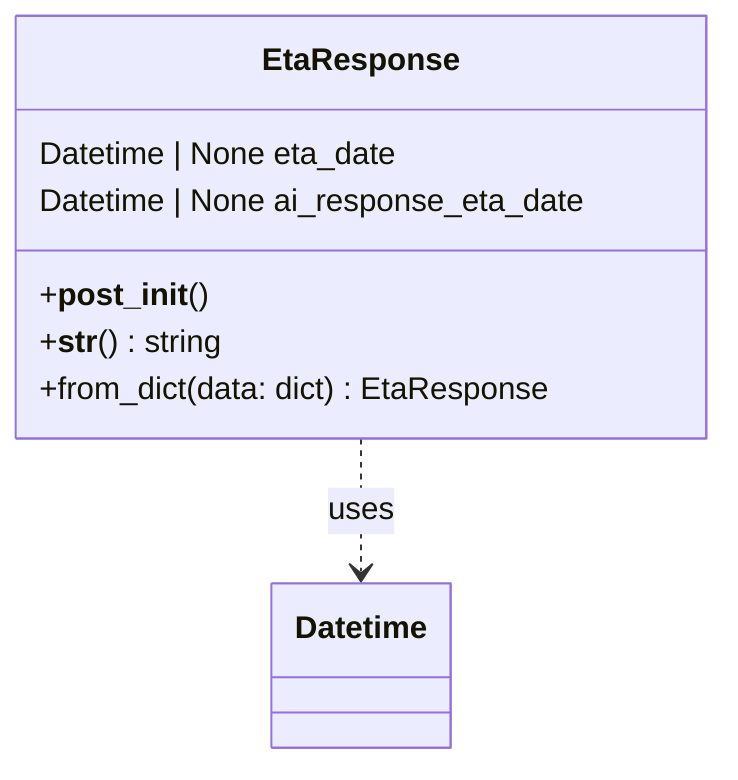

# Diagram: partview_service/partview_service/core/model/eta_response.py

> Auto-generated by Obscura crawlers

## Mermaid

### SVG

<svg id="container" width="369.3828125" xmlns="http://www.w3.org/2000/svg" class="classDiagram" height="390" viewBox="0 0 369.3828125 390" role="graphics-document document" aria-roledescription="class"><g><defs><marker id="container_class-aggregationStart" class="marker aggregation class" refX="18" refY="7" markerWidth="190" markerHeight="240" orient="auto"><path d="M 18,7 L9,13 L1,7 L9,1 Z"></path></marker></defs><defs><marker id="container_class-aggregationEnd" class="marker aggregation class" refX="1" refY="7" markerWidth="20" markerHeight="28" orient="auto"><path d="M 18,7 L9,13 L1,7 L9,1 Z"></path></marker></defs><defs><marker id="container_class-extensionStart" class="marker extension class" refX="18" refY="7" markerWidth="190" markerHeight="240" orient="auto"><path d="M 1,7 L18,13 V 1 Z"></path></marker></defs><defs><marker id="container_class-extensionEnd" class="marker extension class" refX="1" refY="7" markerWidth="20" markerHeight="28" orient="auto"><path d="M 1,1 V 13 L18,7 Z"></path></marker></defs><defs><marker id="container_class-compositionStart" class="marker composition class" refX="18" refY="7" markerWidth="190" markerHeight="240" orient="auto"><path d="M 18,7 L9,13 L1,7 L9,1 Z"></path></marker></defs><defs><marker id="container_class-compositionEnd" class="marker composition class" refX="1" refY="7" markerWidth="20" markerHeight="28" orient="auto"><path d="M 18,7 L9,13 L1,7 L9,1 Z"></path></marker></defs><defs><marker id="container_class-dependencyStart" class="marker dependency class" refX="6" refY="7" markerWidth="190" markerHeight="240" orient="auto"><path d="M 5,7 L9,13 L1,7 L9,1 Z"></path></marker></defs><defs><marker id="container_class-dependencyEnd" class="marker dependency class" refX="13" refY="7" markerWidth="20" markerHeight="28" orient="auto"><path d="M 18,7 L9,13 L14,7 L9,1 Z"></path></marker></defs><defs><marker id="container_class-lollipopStart" class="marker lollipop class" refX="13" refY="7" markerWidth="190" markerHeight="240" orient="auto"><circle stroke="black" fill="transparent" cx="7" cy="7" r="6"></circle></marker></defs><defs><marker id="container_class-lollipopEnd" class="marker lollipop class" refX="1" refY="7" markerWidth="190" markerHeight="240" orient="auto"><circle stroke="black" fill="transparent" cx="7" cy="7" r="6"></circle></marker></defs><g class="root"><g class="clusters"></g><g class="edgePaths"><path d="M184.691,224L184.691,230.167C184.691,236.333,184.691,248.667,184.691,260C184.691,271.333,184.691,281.667,184.691,286.833L184.691,292" id="id_EtaResponse_Datetime_1" class="edge-thickness-normal edge-pattern-dashed relation" style=";;;" data-edge="true" data-et="edge" data-id="id_EtaResponse_Datetime_1" data-points="W3sieCI6MTg0LjY5MTQwNjI1LCJ5IjoyMjR9LHsieCI6MTg0LjY5MTQwNjI1LCJ5IjoyNjF9LHsieCI6MTg0LjY5MTQwNjI1LCJ5IjoyOTh9XQ==" marker-end="url(#container_class-dependencyEnd)"></path></g><g class="edgeLabels"><g class="edgeLabel" transform="translate(184.69140625, 261)"><g class="label" data-id="id_EtaResponse_Datetime_1" transform="translate(-16.4921875, -12)"><foreignObject width="32.984375" height="24">

uses

</foreignObject></g></g></g><g class="nodes"><g class="node default" id="classId-EtaResponse-0" transform="translate(184.69140625, 116)"><g class="basic label-container"><path d="M-176.69140625 -108 L176.69140625 -108 L176.69140625 108 L-176.69140625 108" stroke="none" stroke-width="0" fill="#ECECFF" style=""></path><path d="M-176.69140625 -108 C-89.83417220721819 -108, -2.976938164436376 -108, 176.69140625 -108 M-176.69140625 -108 C-97.57441270797726 -108, -18.45741916595452 -108, 176.69140625 -108 M176.69140625 -108 C176.69140625 -35.09888079984236, 176.69140625 37.802238400315275, 176.69140625 108 M176.69140625 -108 C176.69140625 -39.733327280076395, 176.69140625 28.53334543984721, 176.69140625 108 M176.69140625 108 C74.4168959341917 108, -27.8576143816166 108, -176.69140625 108 M176.69140625 108 C72.4142628122866 108, -31.86288062542681 108, -176.69140625 108 M-176.69140625 108 C-176.69140625 48.57566117517432, -176.69140625 -10.848677649651364, -176.69140625 -108 M-176.69140625 108 C-176.69140625 22.619343304017264, -176.69140625 -62.76131339196547, -176.69140625 -108" stroke="#9370DB" stroke-width="1.3" fill="none" stroke-dasharray="0 0" style=""></path></g><g class="annotation-group text" transform="translate(0, -84)"></g><g class="label-group text" transform="translate(-46.8828125, -84)"><g class="label" style="font-weight: bolder" transform="translate(0,-12)"><foreignObject width="93.765625" height="24">

EtaResponse

</foreignObject></g></g><g class="members-group text" transform="translate(-164.69140625, -36)"><g class="label" style="" transform="translate(0,-12)"><foreignObject width="186.984375" height="24">

Datetime | None eta_date

</foreignObject></g><g class="label" style="" transform="translate(0,12)"><foreignObject width="282.5" height="24">

Datetime | None ai_response_eta_date

</foreignObject></g></g><g class="methods-group text" transform="translate(-164.69140625, 36)"><g class="label" style="" transform="translate(0,-12)"><foreignObject width="83.921875" height="24">

+<strong>post_init</strong>()

</foreignObject></g><g class="label" style="" transform="translate(0,12)"><foreignObject width="92.640625" height="24">

+<strong>str</strong>() : string

</foreignObject></g><g class="label" style="" transform="translate(0,36)"><foreignObject width="261.03125" height="24">

+from_dict(data: dict) : EtaResponse

</foreignObject></g></g><g class="divider" style=""><path d="M-176.69140625 -60 C-75.4060497686544 -60, 25.879306712691204 -60, 176.69140625 -60 M-176.69140625 -60 C-37.40226805286028 -60, 101.88687014427944 -60, 176.69140625 -60" stroke="#9370DB" stroke-width="1.3" fill="none" stroke-dasharray="0 0" style=""></path></g><g class="divider" style=""><path d="M-176.69140625 12 C-45.78242014640861 12, 85.12656595718278 12, 176.69140625 12 M-176.69140625 12 C-83.84061520466786 12, 9.010175840664289 12, 176.69140625 12" stroke="#9370DB" stroke-width="1.3" fill="none" stroke-dasharray="0 0" style=""></path></g></g><g class="node default" id="classId-Datetime-1" transform="translate(184.69140625, 340)"><g class="basic label-container"><path d="M-45.3984375 -42 L45.3984375 -42 L45.3984375 42 L-45.3984375 42" stroke="none" stroke-width="0" fill="#ECECFF" style=""></path><path d="M-45.3984375 -42 C-16.295689393010484 -42, 12.807058713979032 -42, 45.3984375 -42 M-45.3984375 -42 C-25.59443614342783 -42, -5.790434786855663 -42, 45.3984375 -42 M45.3984375 -42 C45.3984375 -20.50684239473469, 45.3984375 0.9863152105306199, 45.3984375 42 M45.3984375 -42 C45.3984375 -15.929847656343227, 45.3984375 10.140304687313545, 45.3984375 42 M45.3984375 42 C19.517193268393086 42, -6.364050963213828 42, -45.3984375 42 M45.3984375 42 C10.475236785160192 42, -24.447963929679617 42, -45.3984375 42 M-45.3984375 42 C-45.3984375 8.986428374302378, -45.3984375 -24.027143251395245, -45.3984375 -42 M-45.3984375 42 C-45.3984375 20.32318522005583, -45.3984375 -1.3536295598883399, -45.3984375 -42" stroke="#9370DB" stroke-width="1.3" fill="none" stroke-dasharray="0 0" style=""></path></g><g class="annotation-group text" transform="translate(0, -18)"></g><g class="label-group text" transform="translate(-33.3984375, -18)"><g class="label" style="font-weight: bolder" transform="translate(0,-12)"><foreignObject width="66.796875" height="24">

Datetime

</foreignObject></g></g><g class="members-group text" transform="translate(-33.3984375, 30)"></g><g class="methods-group text" transform="translate(-33.3984375, 60)"></g><g class="divider" style=""><path d="M-45.3984375 6 C-10.161314392159333 6, 25.075808715681333 6, 45.3984375 6 M-45.3984375 6 C-21.668963159686765 6, 2.06051118062647 6, 45.3984375 6" stroke="#9370DB" stroke-width="1.3" fill="none" stroke-dasharray="0 0" style=""></path></g><g class="divider" style=""><path d="M-45.3984375 24 C-15.203602980010658 24, 14.991231539978685 24, 45.3984375 24 M-45.3984375 24 C-13.572221922868838 24, 18.253993654262324 24, 45.3984375 24" stroke="#9370DB" stroke-width="1.3" fill="none" stroke-dasharray="0 0" style=""></path></g></g></g></g></g></svg>
